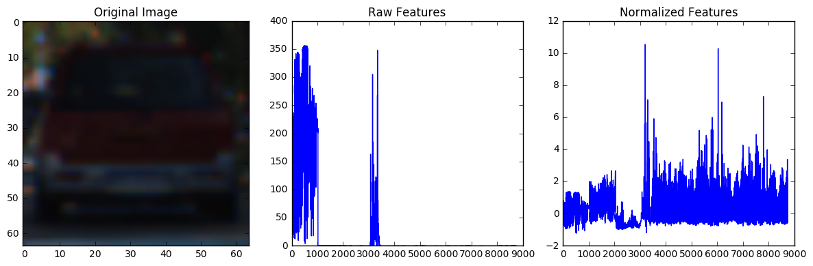
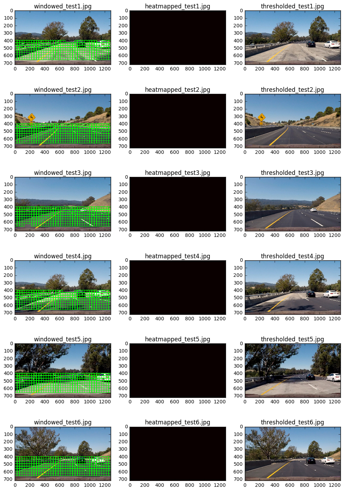
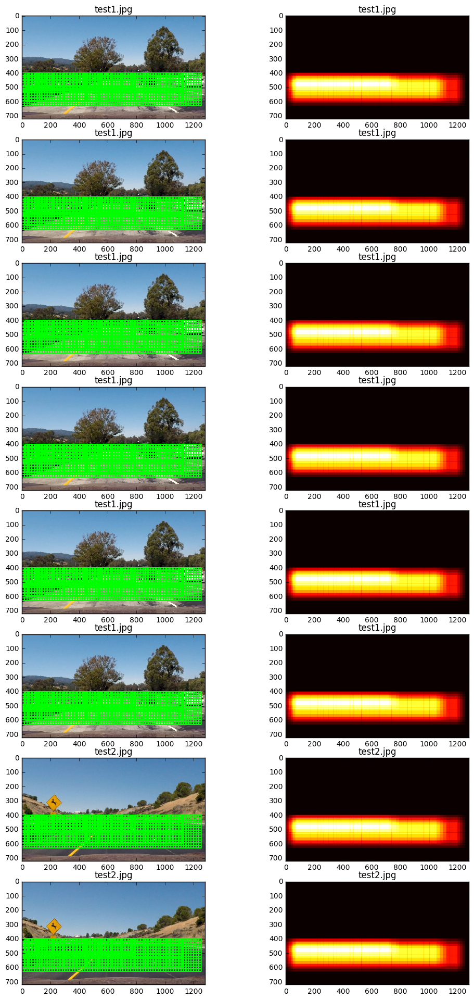

[](http://www.udacity.com/drive)
## Dean Webb - Vehicle Detection & Tracking  Pipeline
#### Self-Driving Car Engineer Nanodegee - Project 5
In this project, my goal is to write a software pipeline to extract features from a Dataset and identify the lane boundaries within an input video. In this project, my ultimate goal was to write a software pipeline that starts with ***minimal scaling parameters*** (e.g. a linear combination of various scaled windows) and automatically extract bounding boxes from the images. The implementation would ideally detect vehicles in a video (start with the test_video.mp4 and later implement on full project_video.mp4). Suprrisingly, I was able to install and configure the YOLO library ("You only look once") To detect vehicles! It is not optimized yet (I'm currentl loading the weights for each frame, but it was a fun project! I implemented tracking using Sliding Windows, Hog subsampling, Frame smoothing and now YOLO. I hope my submission is enough to meet the project requirements. The project goals are listed in detail below.

---

![alt text][image8]

---

### <font color='green'>Project Goals</font>

The goals / steps of this project are the following:

* Perform a Histogram of Oriented Gradients (HOG) feature extraction on a labeled training set of images and train a classifier Linear SVM classifier
* Optionally, you can also apply a color transform and append binned color features, as well as histograms of color, to your HOG feature vector. 
* Note: for those first two steps don't forget to normalize your features and randomize a selection for training and testing.
* Implement a sliding-window technique and use your trained classifier to search for vehicles in images.
* Run your pipeline on a video stream (start with the test_video.mp4 and later implement on full project_video.mp4) and create a heat map of recurring detections frame by frame to reject outliers and follow detected vehicles.
* Estimate a bounding box for vehicles detected.

---

### Dependencies

Here are links to the labeled data for [vehicle](https://s3.amazonaws.com/udacity-sdc/Vehicle_Tracking/vehicles.zip) and [non-vehicle](https://s3.amazonaws.com/udacity-sdc/Vehicle_Tracking/non-vehicles.zip) examples to train your classifier.  These example images come from a combination of the [GTI vehicle image database](http://www.gti.ssr.upm.es/data/Vehicle_database.html), the [KITTI vision benchmark suite](http://www.cvlibs.net/datasets/kitti/), and examples extracted from the project video itself.   You are welcome and encouraged to take advantage of the recently released [Udacity labeled dataset](https://github.com/udacity/self-driving-car/tree/master/annotations) to augment your training data.  

Some example images for testing your pipeline on single frames are located in the `test_images` folder.  To help the reviewer examine your work, please save examples of the output from each stage of your pipeline in the folder called `ouput_images`, and include them in your writeup for the project by describing what each image shows.    The video called `project_video.mp4` is the video your pipeline should work well on. 

---

[//]: # (Image References)
[image1]: ./examples/car_not_car.png
[image2]: ./examples/HOG_example.jpg
[image3]: ./examples/sliding_windows.jpg
[image4]: ./examples/sliding_window.jpg
[image5]: ./examples/bboxes_and_heat.png
[image6]: ./examples/labels_map.png
[image7]: ./examples/output_bboxes.png
[image8]: examples/yolo_predict.jpg
[video1]: ./project_output_yolo.mp4
[video1]: output_images/test_output_yolo.mp4


## <font color='red'> Rubric Points</font>
### Here I will consider the [rubric](https://review.udacity.com/#!/rubrics/513/view) points individually and describe how I addressed each point in my implementation below!

---
### Writeup / README

#### 1. <font color='green'>Provide a Writeup / README</font> that includes all the rubric points and how you addressed each one.  You can submit your writeup as markdown or pdf.

**Done!** - *See below.*


### Histogram of Oriented Gradients (HOG)


#### 1. Explain how (and identify where in your code) you extracted HOG features from the training images.

The code for this step is contained in the first code cell of the IPython notebook (or in lines # through # of the file called `some_file.py`).  

I started by reading in all the `vehicle` and `non-vehicle` images.  Here is an example of one of each of the `vehicle` and `non-vehicle` classes:

![alt text][image1]

I then explored different color spaces and different `skimage.hog()` parameters (`orientations`, `pixels_per_cell`, and `cells_per_block`).  I grabbed random images from each of the two classes and displayed them to get a feel for what the `skimage.hog()` output looks like.

Here is an example using the `YCrCb` color space and HOG parameters of `orientations=8`, `pixels_per_cell=(8, 8)` and `cells_per_block=(2, 2)`:


![alt text][image2]

#### 2. Explain how you settled on your final choice of HOG parameters.

I tried various combinations of parameters and...

#### 3. Describe how (and identify where in your code) you trained a classifier using your selected HOG features (and color features if you used them).

I trained a linear SVM using...

### Sliding Window Search

#### 1. Describe how (and identify where in your code) you implemented a sliding window search.  How did you decide what scales to search and how much to overlap windows?

I decided to search random window positions at random scales all over the image and came up with this (ok just kidding I didn't actually ;):

![alt text][image3]

#### 2. Show some examples of test images to demonstrate how your pipeline is working.  What did you do to optimize the performance of your classifier?

Ultimately I searched on two scales using YCrCb 3-channel HOG features plus spatially binned color and histograms of color in the feature vector, which provided a nice result.  Here are some example images:

![alt text][image4]
---

### Video Implementation

#### 1. Provide a link to your final video output.  Your pipeline should perform reasonably well on the entire project video (somewhat wobbly or unstable bounding boxes are ok as long as you are identifying the vehicles most of the time with minimal false positives.)
Here's a [link to my video result](./project_video.mp4)


#### 2. Describe how (and identify where in your code) you implemented some kind of filter for false positives and some method for combining overlapping bounding boxes.

I recorded the positions of positive detections in each frame of the video.  From the positive detections I created a heatmap and then thresholded that map to identify vehicle positions.  I then used `scipy.ndimage.measurements.label()` to identify individual blobs in the heatmap.  I then assumed each blob corresponded to a vehicle.  I constructed bounding boxes to cover the area of each blob detected.  

Here's an example result showing the heatmap from a series of frames of video, the result of `scipy.ndimage.measurements.label()` and the bounding boxes then overlaid on the last frame of video:

### Here are six frames and their corresponding heatmaps:

![alt text][image5]

### Here is the output of `scipy.ndimage.measurements.label()` on the integrated heatmap from all six frames:
![alt text][image6]

### Here the resulting bounding boxes are drawn onto the last frame in the series:
![alt text][image7]


---

### Discussion / Learnings / Shortcomings

####1. Briefly discuss any problems / issues you faced in your implementation of this project.  Where will your pipeline likely fail?  What could you do to make it more robust?

Here I'll talk about the approach I took, what techniques I used, what worked and why, where the pipeline might fail and how I might improve it if I were going to pursue this project further.  


##  Load Dataset and Preproceses Images

### Imports


```python
%matplotlib inline
import matplotlib.image as mpimg
import matplotlib.pyplot as plt
import numpy as np
import cv2
import glob
from PIL import Image
import time
import os
import zipfile as zf
import tarfile
import csv
import pickle
import urllib
from skimage.feature import hog
from sklearn.svm import LinearSVC
from sklearn.preprocessing import RobustScaler
from sklearn.model_selection import train_test_split
import pandas as pd
```

### Constants


```python
## Dataset Parameters ##
TRAINING_DATASET_DIRECTORY = 'training_set/'
PIPELINE_SETUP_DIRECTORY = 'pipeline_setup_images/'
WORKING_DIRECTORY = 'data/'
NON_VEHICLES_TOKEN = 'non-vehicles'
dataset_path = "{}{}{}{}".format(WORKING_DIRECTORY, TRAINING_DATASET_DIRECTORY,'**/', '*.png')
DATACACHE_DIRECTORY = os.path.join(WORKING_DIRECTORY, 'datacache/')
PROJECT_SOURCE_URL = 'https://s3.amazonaws.com/udacity-sdc/Vehicle_Tracking'
VEHICLES_ZIPFILE = 'vehicles.zip'
NONVEHICLES_ZIPFILE = 'non-vehicles.zip'


## Udacity Dataset Extraction Parameters ##
LABELS_CSV = 'data/object-detection-crowdai/labels.csv'
UDACITY_SOURCE_URL = 'http://bit.ly/udacity-annoations-crowdai'
DATASET_ZIPFILE = 'object-detection-crowdai.tar.gz'
UDACITY_DATASET_DIRECTORY = 'udacity-set'
APPEND_UDACITY_DATASET = False
UDACITY_AUGMENT_PCT = 0.05

## Image Processing ##
DEFAULT_LENGTH, DEFAULT_WIDTH, DEFAULT_DEPTH = (64, 64, 3)
if DEFAULT_DEPTH > 1:
    DEFAULT_RESOLUTION = (DEFAULT_LENGTH, DEFAULT_WIDTH, DEFAULT_DEPTH)
else:
    DEFAULT_RESOLUTION = (DEFAULT_LENGTH, DEFAULT_WIDTH)

## Feature Extraction Parameters ##
# Spatial Binning
SPATIAL = 32
BIN_SPATIAL_SIZE = (SPATIAL, SPATIAL)
# Color Histogram
HIST_NBINS = 128
COLOR_SPACE = 'HSV'
# HOG Parameters
HOG_ORIENTATIONS = 9
HOG_PIXELS_PER_CELL = 8
HOG_CELLS_PER_BLOCK = 2
HOG_CHANNEL = 'ALL' # Can be 0, 1, 2, or "ALL"
SW_SPATIAL_FEAT_FLAG = True
SW_HOG_FEAT_FLAG = True
SW_COLOR_HIST_FEAT_FLAG = True

## Training Parameters ##
# SVC Parameters
VALIDATION_PORTION = .2
N_PREDICTIONS = 100
OVERWRITE_DATACACHE = True
```

### Helper Functions - Udacity Dataset Loading & Augmentation


```python
# Define a function to scale .PNG and JPEG Files both to 0 to 1 
def normalize_pixels(img):
    max_pixel_value = np.max(img)
    if max_pixel_value > 1.0:
        img = np.copy(np.multiply(img, 1.0 / 255.0)).astype(np.float64) 
    return img

# Define a function to scale .PNG and JPEG Files both to 0 to 1 
def denormalize_pixels(img):
    max_pixel_value = np.max(img)
    if max_pixel_value <= 1.0:
        img = np.copy(np.multiply(img, 255.0)).astype(np.float64) 
    return img
```


```python
def maybe_download(source_url, filename):
    if not os.path.exists(WORKING_DIRECTORY):
        os.mkdir(WORKING_DIRECTORY)
    
    filepath = os.path.join(WORKING_DIRECTORY, filename)
    if not os.path.exists(filepath):
        filepath, _ = urllib.request.urlretrieve(source_url, filepath)
        statinfo = os.stat(filepath)
        print('')
        print('Succesfully downloaded:', filepath, '| % d MB.' % int(statinfo.st_size*1e-6))
    return filepath
```


```python
def unzip_file(zip_file, source_dir_name=None, destination=WORKING_DIRECTORY):
    if 'tar.gz' in zip_file:
        head, tail = os.path.splitext(zip_file)
        if not os.path.exists(os.path.join(os.path.splitext(head)[0])):
            print('unzipping file:', zip_file, 'to directory:', os.path.join( os.path.splitext(head)[0]))
            tar = tarfile.open(zip_file, "r:*")
            tar.extractall(destination)
            tar.close()
    else: #.zip extension
        head, tail = os.path.splitext(zip_file)
        #print('Target Dir', os.path.join(destination, head))
        if not os.path.exists(os.path.join(destination, head)):
            print('File does not exist: ', os.path.join(destination, head), ': Extracting')
            zipf = zf.ZipFile(os.path.join(WORKING_DIRECTORY,zip_file))
            print('Loaded zipf',zipf, ': Extracting')
            zipf.extractall(os.path.join(destination, head))
            zipf.close()
```


```python
## __main()__ method:
## Download and Extract Training Datasets
## Create Training Set Directories to Project Datasets
## Gather more extreriance pulling and building from source and extracting augmentation features
```


```python
vehicles_zipfile = maybe_download(os.path.join(PROJECT_SOURCE_URL,VEHICLES_ZIPFILE), VEHICLES_ZIPFILE)
source_dir_name, fname = os.path.split(vehicles_zipfile)
unzip_file(fname, source_dir_name=source_dir_name, destination=os.path.join(WORKING_DIRECTORY, TRAINING_DATASET_DIRECTORY))

non_vehicles_zipfile = maybe_download(os.path.join(PROJECT_SOURCE_URL,NONVEHICLES_ZIPFILE), NONVEHICLES_ZIPFILE)
source_dir_name, fname = os.path.split(non_vehicles_zipfile)
unzip_file(fname, source_dir_name=source_dir_name, destination=os.path.join(WORKING_DIRECTORY, TRAINING_DATASET_DIRECTORY))

## Udacity Dataset
tar_file = maybe_download(UDACITY_SOURCE_URL, DATASET_ZIPFILE)
unzip_file(tar_file)

cars_dir = os.path.join(WORKING_DIRECTORY, TRAINING_DATASET_DIRECTORY, 
                         'vehicles', UDACITY_DATASET_DIRECTORY)
os.makedirs(cars_dir, exist_ok=True)
noncars_dir = os.path.join(WORKING_DIRECTORY, TRAINING_DATASET_DIRECTORY, 
                         'non-vehicles', UDACITY_DATASET_DIRECTORY)
os.makedirs(os.path.join(noncars_dir, 'skies'), exist_ok=True)
os.makedirs(os.path.join(noncars_dir, 'roads'), exist_ok=True)
```


```python
## Extract Labels ##
HEADER_ROW=['xstart', 'ystart', 'xstop', 'ystop', 'frame', 'label', 'preview_url']
annotations = pd.read_csv(LABELS_CSV, names=HEADER_ROW, skiprows=1)
annotations.head()
```


```python
## Verify this is working, until then, do not use Dataset
## It works! ## 

def extract_and_preprocess_image(filepath, cars_dir, noncars_dir, xstart, ystart, xstop, ystop,
                                 img_size=(DEFAULT_LENGTH, DEFAULT_WIDTH), img_ext = '.png'):
    full_path = os.path.join(WORKING_DIRECTORY, 'object-detection-crowdai', filepath)
    # Image read in from mpimg + .jpg -> (0 to 255)
    if os.path.exists(full_path):
        img = mpimg.imread(full_path) # Prev - img = cv2.imread(full_path)
        img = np.copy(img)
        img_shape = img.shape
            
        # Extract Car Image. Note: numpy arrays are (row, col)
        car_img = img[ystart:ystop, xstart:xstop]
        resized_car_img = cv2.resize(car_img, img_size, interpolation=cv2.INTER_AREA)
        im = Image.fromarray(resized_car_img)
        # Save Car Image to corresponding Directory
        filename, ext = os.path.splitext(filepath)
        new_filename =  "{}_{}_{}_{}_{}_{}{}".format(filename,'car', xstart, ystart, xstop, ystop, img_ext)
        im.save(os.path.join(cars_dir, new_filename)) # Save as .png
        im.close
        
        # Auto-Generate a 'Non-Car' Image to keep dataset balanced
        i_lrc = np.random.randint(3) # 66% chance of auto generating non-car features
        if (i_lrc == 0):
            xstart_mod, ystart_mod, xstop_mod, ystop_mod = xstart, \
                                                    (0 if ystart-(ystop-ystart) < 0 else ystart-(ystop-ystart)), xstop, ystart
            new_filename =  "{}_{}_{}_{}_{}_{}{}".format(filename,'sky', xstart_mod, ystart_mod, xstop_mod, ystop_mod, img_ext)
            path_file = os.path.join(noncars_dir,'skies', new_filename)
        elif (i_lrc == 1):
            xstart_mod, ystart_mod, xstop_mod, ystop_mod = xstart, ystop, xstop, \
                                                    (img_shape[0] if ystop+(ystop-ystart) > img_shape[0] else ystop+(ystop-ystart))
            new_filename =  "{}_{}_{}_{}_{}_{}{}".format(filename,'road', xstart_mod, ystart_mod, xstop_mod, ystop_mod, img_ext)
            path_file = os.path.join(noncars_dir, 'roads', new_filename)
            
        noncar_img = scaled_img[ystart_mod:ystop_mod, xstart_mod:xstop_mod]
        resized_noncar_img = cv2.resize(noncar_img, img_size, interpolation=cv2.INTER_AREA)
        # Save noncar image to corresponding Directory
        im = Image.fromarray(resized_noncar_img)
        filename, ext = os.path.splitext(filepath)
        im.save(path_file) # Save as .png
        im.close
```

### Extract Features from Dataset


```python
## Extract Labels ##      
for label in annotations.as_matrix():
    filename, ext = os.path.splitext(label[4])
    new_filename =  "{}_{}_{}_{}_{}_{}{}".format(filename,'car', label[0], label[1], label[2], label[3], '.png')
    if not os.path.exists(os.path.join(cars_dir, new_filename)) and label[5].lower() == 'car':
        try:
            extract_and_preprocess_image(label[4], cars_dir, noncars_dir, xstart=label[0], ystart=label[1],
                                     xstop=label[2], ystop=label[3])
        except:
            print("Error extracting label:", label, " Moving on..")
```

### Helper Functions - Spatial Binning

Define a function to compute binned color features:


```python
def bin_spatial(img, size=BIN_SPATIAL_SIZE):
    color1 = cv2.resize(img[:,:,0], size).ravel()
    color2 = cv2.resize(img[:,:,1], size).ravel()
    color3 = cv2.resize(img[:,:,2], size).ravel()
    return np.hstack((color1, color2, color3)) 

```

### Extract Features from Dataset - Helper Functions

Define a function to compute binned color features:


```python
# Define a function to compute color histogram features  
def color_hist(img, nbins=HIST_NBINS):
    # Compute the histogram of the color channels separately
    channel1_hist = np.histogram(img[:,:,0], bins=nbins)
    channel2_hist = np.histogram(img[:,:,1], bins=nbins)
    channel3_hist = np.histogram(img[:,:,2], bins=nbins)
    # Concatenate the histograms into a single feature vector
    hist_features = np.concatenate((channel1_hist[0], channel2_hist[0], channel3_hist[0]))
    return hist_features

```


```python
# Define a function to return HOG features and visualization --
def get_hog_features(img, orient=HOG_ORIENTATIONS,
                     pix_per_cell=HOG_PIXELS_PER_CELL,
                     cell_per_block=HOG_CELLS_PER_BLOCK, 
                     vis=False, feature_vec=True):
    if vis == True:
    denormalized_img = denormalize_pixels(img)
        features, hog_image = hog(denormalized_img, orientations=orient, pixels_per_cell=(pix_per_cell, pix_per_cell),
                                  cells_per_block=(cell_per_block, cell_per_block), transform_sqrt=False, 
                                  visualise=vis, feature_vector=feature_vec)
        return features, hog_image
    else:      
        features = hog(denormalized_img, orientations=orient, pixels_per_cell=(pix_per_cell, pix_per_cell),
                       cells_per_block=(cell_per_block, cell_per_block), transform_sqrt=False, 
                       visualise=vis, feature_vector=feature_vec)
        return features
```

### Download and Preprocess Udacity Dataset


```python
# Define a function to extract features from a list of images
def extract_features(imgs, cspace=COLOR_SPACE, spatial_size=BIN_SPATIAL_SIZE,
                        hist_bins=HIST_NBINS):
    # Create a list to append feature vectors
    features = []
    for file in imgs:       
        image = mpimg.imread(file)
        
        # Image read in from cv2 + .png -> (0 to 1) scaled
        if cspace != 'RGB':
            if cspace == 'HSV':
                feature_image = cv2.cvtColor(image, cv2.COLOR_RGB2HSV)
            elif cspace == 'LUV':
                feature_image = cv2.cvtColor(image, cv2.COLOR_RGB2LUV)
            elif cspace == 'HLS':
                feature_image = cv2.cvtColor(image, cv2.COLOR_RGB2HLS)
            elif cspace == 'YUV':
                feature_image = cv2.cvtColor(image, cv2.COLOR_RGB2YUV)
            elif cspace == 'YCrCb':
                feature_image = cv2.cvtColor(image, cv2.COLOR_RGB2YCrCb)
        else: feature_image = np.copy(image)
        
        # Apply bin_spatial() to get spatial color features
        spatial_features = bin_spatial(feature_image, size=spatial_size)
        
        # Apply color_hist() also with a color space option now
        hist_features = color_hist(feature_image, nbins=hist_bins)
        
        # Call get_hog_features() with vis=False, feature_vec=True
        hog_image = np.copy(image)
        hog_shape = np.asarray(hog_image.shape)
        if HOG_CHANNEL == 'ALL':
            hog_features = []
            for channel in range(len(hog_shape)):
                hog_features.append(get_hog_features(hog_image[:,:,channel]))
            hog_features = np.ravel(hog_features)        
        else:
            hog_features = get_hog_features(hog_image[:,:,HOG_CHANNEL])
        
        # Append the new feature vector to the features list
        # Allow for flagged setting of feature vectors (spatial, hist, hog) must maintain the ordering
        if(SW_SPATIAL_FEAT_FLAG == True and SW_COLOR_HIST_FEAT_FLAG == True and SW_HOG_FEAT_FLAG == True):
            features.append(np.concatenate((spatial_features, hist_features, hog_features)))
        elif(SW_SPATIAL_FEAT_FLAG == False and SW_COLOR_HIST_FEAT_FLAG == True and SW_HOG_FEAT_FLAG == True):
            features.append(np.concatenate((hist_features, hog_features)))
        elif(SW_SPATIAL_FEAT_FLAG == False and SW_COLOR_HIST_FEAT_FLAG == False and SW_HOG_FEAT_FLAG == True):
            features.append(np.array(hog_features))
        elif(SW_SPATIAL_FEAT_FLAG == True and SW_COLOR_HIST_FEAT_FLAG == False and SW_HOG_FEAT_FLAG == True):
            features.append(np.concatenate((spatial_features, hog_features)))
        elif(SW_SPATIAL_FEAT_FLAG == True and SW_COLOR_HIST_FEAT_FLAG == False and SW_HOG_FEAT_FLAG == False):
            features.append(np.array(spatial_features))
        elif(SW_SPATIAL_FEAT_FLAG == True and SW_COLOR_HIST_FEAT_FLAG == True and SW_HOG_FEAT_FLAG == False):
            features.append(np.concatenate((spatial_features, hist_features)))
        elif(SW_SPATIAL_FEAT_FLAG == False and SW_COLOR_HIST_FEAT_FLAG == True and SW_HOG_FEAT_FLAG == False):
            features.append(np.array(hist_features))
        else:
            features.append(np.concatenate(feature_image))
        
    # Return list of feature vectors
    return features
```

### Begin Training Pipeline


```python
## Starting Training Pipeline ##
# Load Image Paths 
images = glob.glob(dataset_path, recursive=True)
cars = []
notcars = []
udacity_cars = []
udacity_notcars = []
for image in images:
    if UDACITY_DATASET_DIRECTORY in image:
        if NON_VEHICLES_TOKEN in image:
            udacity_notcars.append(image)
        else:
            udacity_cars.append(image)
    else:
        if NON_VEHICLES_TOKEN in image:
            notcars.append(image)
        else:
            cars.append(image)

assert len(images) == len(cars) + len(notcars) + len(udacity_cars) + len(udacity_notcars), 'The subarrays have not split the dataset correctly.'
print('Number of Vehicle Images Found:',len(cars))
print('Number of Non-Vehicle Images Found:',len(notcars))
    
if APPEND_UDACITY_DATASET == True: #Using to Keep Dataset separate
    udacity_augment_size = np.int(len(udacity_cars)*UDACITY_AUGMENT_PCT)
    udacity_cars, udacity_notcars = np.array(udacity_cars), np.array(udacity_notcars)
    
    ind = np.random.random_integers(0, len(udacity_cars)-1, udacity_augment_size)
    cars.extend(list(udacity_cars[ind]))
    ind = np.random.random_integers(0, len(udacity_notcars)-1, udacity_augment_size)
    notcars.extend(list(udacity_notcars[ind]))
else:
    num_udacity_features = np.int(len(udacity_cars)*UDACITY_AUGMENT_PCT)
    udacity_cars, udacity_notcars = np.array(udacity_cars), np.array(udacity_notcars)
    
    udacity_features_ind = np.random.randint(0, len(udacity_cars), size=num_udacity_features)
    udacity_cars = list(udacity_cars[udacity_features_ind])
    udacity_features_ind = np.random.randint(0, len(udacity_notcars), size=num_udacity_features)
    udacity_notcars = list(udacity_notcars[udacity_features_ind])
    
    
print('Number of Udacity Vehicle Images Found:',len(udacity_cars))
print('Number of Udacity Non-Vehicle Images Found:',len(udacity_notcars))
print('')
print('Size of Vehicle Images Dataset:',len(cars))
print('Size of Non-Vehicle Images Dataset:',len(notcars))
```

    Number of Vehicle Images Found: 8792
    Number of Non-Vehicle Images Found: 8968
    Number of Udacity Vehicle Images Found: 314
    Number of Udacity Non-Vehicle Images Found: 314
    
    Size of Vehicle Images Dataset: 8792
    Size of Non-Vehicle Images Dataset: 8968


```python
# Start Pipeline - Combine and Normalilze Features
car_features = extract_features(cars)
notcar_features = extract_features(notcars)

# Seperately Extract Feature from Udacity Dataset
if APPEND_UDACITY_DATASET == False:
    udacity_car_features = extract_features(udacity_cars)
    udacity_notcar_features = extract_features(udacity_notcars)
    
# Create an array stack of feature vectors
X = np.vstack((np.array(car_features), np.array(notcar_features))).astype(np.float64)

# Fit a per-column scaler
X_scaler = RobustScaler().fit(X)

# Apply the scaler to X
scaled_X = X_scaler.transform(X)
car_ind = np.random.randint(0, len(cars))
# Plot an example of raw and scaled features
fig = plt.figure(figsize=(12,4))
plt.subplot(131)
plt.imshow(mpimg.imread(cars[car_ind]))
plt.title('Car Image')
plt.subplot(132)
plt.imshow(mpimg.imread(not_cars[car_ind]))
plt.title('Not-Car Image')
plt.subplot(133)
plt.plot(X[car_ind])
plt.title('Raw Features')
plt.subplot(134)
plt.plot(scaled_X[car_ind])
plt.title('Normalized Features')
fig.tight_layout()

print('Feature Vector size for Cars:', len(car_features[car_ind]))
print('Using Spatial Binning of:',BIN_SPATIAL_SIZE[0],
    'and', HIST_NBINS,'histogram bins')
```

    Feature Vector size for Cars: 8748
    Using Spatial Binning of: 32 and 128 histogram bins





```python
# Define the labels vector
y = np.hstack((np.ones(len(car_features)), np.zeros(len(notcar_features))))
```


```python
# Split up data into randomized training and test sets
rand_state = np.random.randint(0, 100)
X_train, X_test, y_train, y_test = train_test_split(
    scaled_X, y, test_size=VALIDATION_PORTION, random_state=rand_state)
print('Feature vector length:', len(X_train[0]))
```

    Feature vector length: 8748


### Train using  Support Vector Classifier


```python
svc = LinearSVC()
t=time.time()
svc.fit(X_train, y_train)
t2 = time.time()
print(round(t2-t, 2), 'Seconds to train SVC...')

# Check the score of the SVC
print('Test Accuracy of SVC = ', round(svc.score(X_test, y_test), 4))
# Check the prediction time for a single sample
t=time.time()
n_predict = N_PREDICTIONS
print('SVC predicts: ', svc.predict(X_test[0:n_predict]))
print('For these',n_predict, 'labels: ', y_test[0:n_predict])
t2 = time.time()
print(round(t2-t, 5), 'Seconds to predict', n_predict,'labels with SVC')
```

    45.7 Seconds to train SVC...
    Test Accuracy of SVC =  0.9935
    SVC predicts:  [ 1.  1.  1.  0.  1.  0.  0.  1.  1.  0.  1.  0.  1.  1.  0.  1.  0.  0.
      1.  1.  0.  0.  1.  1.  0.  1.  1.  1.  1.  0.  1.  1.  0.  1.  0.  0.
      1.  0.  0.  0.  1.  1.  0.  0.  0.  1.  0.  0.  1.  0.  0.  1.  1.  0.
      1.  0.  0.  1.  1.  0.  1.  0.  1.  1.  1.  1.  1.  0.  1.  0.  1.  0.
      1.  1.  0.  0.  0.  1.  0.  0.  1.  1.  1.  1.  1.  1.  0.  0.  1.  0.
      0.  1.  1.  0.  1.  0.  1.  0.  1.  1.]
    For these 100 labels:  [ 1.  1.  1.  0.  1.  0.  0.  1.  1.  0.  1.  0.  1.  1.  0.  1.  0.  0.
      1.  1.  0.  0.  1.  1.  0.  1.  1.  1.  1.  0.  1.  1.  0.  1.  0.  0.
      1.  0.  0.  0.  1.  1.  0.  0.  0.  1.  0.  0.  1.  0.  0.  1.  1.  0.
      1.  0.  0.  1.  1.  0.  1.  0.  1.  1.  1.  1.  1.  0.  1.  0.  1.  0.
      1.  1.  0.  0.  0.  1.  0.  0.  1.  1.  1.  1.  1.  1.  0.  0.  1.  0.
      0.  1.  1.  0.  0.  0.  1.  0.  1.  1.]
    0.03851 Seconds to predict 100 labels with SVC


```python
#Save Support Vector Classifier to Datacache
def save_to_datacache(support_vector_classifier, datacache_dir=DATACACHE_DIRECTORY, 
                      override_datacache=OVERWRITE_DATACACHE):
    os.makedirs(datacache_dir, exist_ok=True)
    svc_pickle = os.path.join(datacache_dir,"svc_pickle.p")
    if override_datacache or not os.path.exists(svc_pickle): 
        svc_hyperparameters = {'svc': svc,
                               'X_SCALER':X_scaler,
                               'SPATIAL': SPATIAL, 
                               'HIST_NBINS': HIST_NBINS,
                               'COLOR_SPACE': COLOR_SPACE,
                               'HOG_ORIENTATIONS': HOG_ORIENTATIONS,
                               'HOG_PIXELS_PER_CELL': HOG_PIXELS_PER_CELL,
                               'HOG_CELLS_PER_BLOCK': HOG_CELLS_PER_BLOCK,
                               'HOG_CHANNEL': HOG_CHANNEL,
                               'SW_SPATIAL_FEAT_FLAG': SW_SPATIAL_FEAT_FLAG,
                               'SW_HOG_FEAT_FLAG': SW_HOG_FEAT_FLAG,
                               'SW_COLOR_HIST_FEAT_FLAG': SW_COLOR_HIST_FEAT_FLAG
                              }

        pickle.dump(svc_hyperparameters, open(svc_pickle, "wb"))
    
# Save classifier and parameters to datacache directory  
save_to_datacache(svc)
```

# Vehicle Detection and Tracking

### Re-Initialize Imports


```python
%matplotlib inline
import matplotlib.image as mpimg
import matplotlib.pyplot as plt
import numpy as np
import cv2
import time
import os
import pickle
from skimage.feature import hog
from sklearn.svm import LinearSVC
from sklearn.preprocessing import StandardScaler
from sklearn.model_selection import train_test_split
from scipy.ndimage.measurements import label
```

### Re-initialize Constants from Pickle File


```python
## Directories ##
WORKING_DIRECTORY = 'data/'
DATACACHE_DIRECTORY = os.path.join(WORKING_DIRECTORY, 'datacache/')
svc_pickle = os.path.join(DATACACHE_DIRECTORY,"svc_pickle.p")
TESTING_DATASET_DIRECTORY = 'testing_dataset/'
TESTING_PIPELINE_SETUP_DIR= 'test_images/'
testset_path = "{}{}{}".format(WORKING_DIRECTORY, TESTING_PIPELINE_SETUP_DIR, '*.jpg')
with open(svc_pickle, mode='rb') as f:
    svc_hyperparameters = pickle.load(f)
    
## Feature Extraction Parameters ##
SVC = svc_hyperparameters['svc']
X_SCALER = svc_hyperparameters['X_SCALER']
# Spatial Binning
SW_SPATIAL_FEAT_FLAG = svc_hyperparameters['SW_SPATIAL_FEAT_FLAG'] 
SPATIAL = svc_hyperparameters['SPATIAL']
BIN_SPATIAL_SIZE = (SPATIAL, SPATIAL)
# Color Histogram
SW_COLOR_HIST_FEAT_FLAG = svc_hyperparameters['SW_COLOR_HIST_FEAT_FLAG']
HIST_NBINS = svc_hyperparameters['HIST_NBINS']
COLOR_SPACE = svc_hyperparameters['COLOR_SPACE']
# HOG Parameters
SW_HOG_FEAT_FLAG = svc_hyperparameters['SW_HOG_FEAT_FLAG']
HOG_ORIENTATIONS = svc_hyperparameters['HOG_ORIENTATIONS']
HOG_PIXELS_PER_CELL = svc_hyperparameters['HOG_PIXELS_PER_CELL']
HOG_CELLS_PER_BLOCK = svc_hyperparameters['HOG_CELLS_PER_BLOCK']
HOG_CHANNEL = svc_hyperparameters['HOG_CHANNEL']


## Sliding Windows Parameters ##
SW_XSTART_STOPS = [(200, None), (256, 1000)]
SW_YSTART_STOPS = [(384, 640), (384, None)]
SW_XY_WINDOWS = [(96,96),(128,128)]
SW_XY_OVERLAPS = [(.450,.480),(.21.280)] 

## Parameters - HOG Sub-Sampling ##
SW_YSTART = 400
SW_YSTOP = 656
SW_SCALES = [1.1,1.5, 1.75]

## Vehicle Detection & Smoothing Parameters ##
BBOX_COLOR = (0, 255, 0)
BBOX_THICK = 5
SMOOTHING_FACTOR = 13
```


      File "<ipython-input-176-acbeaa5d0047>", line 34
        SW_XY_OVERLAPS = [(.450,.480),(.21.280)]
                                             ^
    SyntaxError: invalid syntax


## Explore Detection Technique (1) - Sliding Windows 


```python
# Define a function to draw bounding boxes
def draw_boxes(img, bboxes, color=BBOX_COLOR, thick=BBOX_THICK):
    # Make a copy of the image
    imcopy = np.copy(img)
    # Iterate through the bounding boxes
    for bbox in bboxes:
        # Draw a rectangle given bbox coordinates
        cv2.rectangle(imcopy, (bbox[0][0], bbox[0][1]), (bbox[1][0],bbox[1][1]), color, thick)
    return imcopy
```


```python
# Define a wrapper function for passing in a list of slidw_window parameters
def slide_windows(img, x_start_stops=[[None, None]],
                  y_start_stops=[[None, None]],
                  xy_windows=[(64, 64)],
                  xy_overlaps=[(0.5, 0.5)]):
    windows = []
    for i in range(len(x_start_stops)):
        if len(x_start_stops) == len(xy_windows) and len(x_start_stops) == len(xy_overlaps):
            windows.extend(slide_window(img, np.asarray(x_start_stops[i]), np.asarray(y_start_stops[i]),
                                np.asarray(xy_windows[i]), np.asarray(xy_overlaps[i])))
        else:
            windows.extend(slide_window(img, np.asarray(x_start_stops[i]), np.asarray(y_start_stops[i]),
                                np.asarray(xy_windows[0]), np.asarray(xy_overlaps[0])))
    return np.concatenate(windows)
```


```python
# Define a function that takes an image, start and stop positions in both x and y, 
# window size (x and y dimensions), and overlap fraction (for both x and y)
def slide_window(img, x_start_stop=[None, None],
                 y_start_stop=[None, None], 
                 xy_window=(64, 64), 
                 xy_overlap=(0.5, 0.5)):
    window_list=[]
    # If x and/or y start/stop positions not defined, set to image size
    if x_start_stop[0] == None:
        x_start_stop[0] = 0
    if x_start_stop[1] == None or x_start_stop[1] >= img.shape[1]:
        x_start_stop[1] = img.shape[1]
    if y_start_stop[0] == None:
        y_start_stop[0] = 0
    if y_start_stop[1] == None or y_start_stop[1] >= img.shape[0]:
        y_start_stop[1] = img.shape[0]

    # Compute the span of the region to be searched    
    xspan = x_start_stop[1] - x_start_stop[0]
    yspan = y_start_stop[1] - y_start_stop[0]
    
    # Compute the number of pixels per step in x/y
    nx_pix_per_step = np.int(xy_window[0]*(1 - xy_overlap[0]))
    ny_pix_per_step = np.int(xy_window[1]*(1 - xy_overlap[1]))
    
    # Compute the number of windows in x/y
    nx_buffer = np.int(xy_window[0]*(xy_overlap[0]))
    ny_buffer = np.int(xy_window[1]*(xy_overlap[1]))
    nx_windows = np.int((xspan-nx_buffer)/nx_pix_per_step) 
    ny_windows = np.int((yspan-ny_buffer)/ny_pix_per_step) 

    # Loop through finding x and y window positions
    for ys in range(ny_windows):
        for xs in range(nx_windows):
            # Calculate window position
            startx = xs*nx_pix_per_step + x_start_stop[0]
            endx = startx + xy_window[0]
            starty = ys*ny_pix_per_step + y_start_stop[0]
            endy = starty + xy_window[1]
            
            # Append window position to list
            window_list.append([[(startx, starty), (endx, endy)]])
    return window_list
```

### Visualize Method 
This method is to be used by the Debugging code cells throught the notebook. This is to make it wasier to plot lists of images


```python
def visualize(fig, rows, cols, imgs, titles):
    for i, img in enumerate(imgs):
        plt.subplot(rows, cols, i+1)
        plt.title(i+1)
        img_dims = len(img.shape)
        if img_dims < 3:
            plt.imshow(img, cmap='hot')
            plt.title(titles[i])
        else:
            plt.imshow(img)
            plt.title(titles[i])
```

#### Feature Extractor Function - Single Image
This function is very similar to the `extract_features()` function noted above accept that it requires a single image to check against rather than list of images


```python
def single_img_features(img, color_space=COLOR_SPACE, 
                        spatial_size=BIN_SPATIAL_SIZE,
                        hist_bins=HIST_NBINS, 
                        orient=HOG_ORIENTATIONS, 
                        pix_per_cell=HOG_PIXELS_PER_CELL, 
                        cell_per_block=HOG_CELLS_PER_BLOCK,
                        hog_channel=HOG_CHANNEL, 
                        spatial_feat=SW_SPATIAL_FEAT_FLAG,
                        hist_feat=SW_COLOR_HIST_FEAT_FLAG, 
                        hog_feat=SW_HOG_FEAT_FLAG):
    
    #1) Define an empty list to receive features
    img_features = []
    #2) Apply color conversion if other than 'RGB'
    if color_space != 'RGB':
        if color_space == 'HSV':
            feature_image = cv2.cvtColor(img, cv2.COLOR_RGB2HSV)
        elif color_space == 'LUV':
            feature_image = cv2.cvtColor(img, cv2.COLOR_RGB2LUV)
        elif color_space == 'HLS':
            feature_image = cv2.cvtColor(img, cv2.COLOR_RGB2HLS)
        elif color_space == 'YUV':
            feature_image = cv2.cvtColor(img, cv2.COLOR_RGB2YUV)
        elif color_space == 'YCrCb':
            feature_image = cv2.cvtColor(img, cv2.COLOR_RGB2YCrCb)
    else: feature_image = np.copy(img)      

    #3) Compute spatial features if flag is set
    if spatial_feat == True:
        spatial_features = bin_spatial(feature_image, size=spatial_size)
    #5) Compute histogram features if flag is set
    if hist_feat == True:
        hist_features = color_hist(feature_image, nbins=hist_bins)
        #6) Append features to list
        #img_features.append(hist_features)
    #7) Compute HOG features if flag is set
    if hog_feat == True:
        # Call get_hog_features() with vis=False, feature_vec=True
        hog_image = np.copy(img)
        hog_shape = np.asarray(hog_image.shape)
        if hog_channel == 'ALL':
            hog_features = []
            for channel in range(len(hog_shape)):
                hog_features.append(get_hog_features(hog_image[:,:,channel], 
                                    orient, pix_per_cell, cell_per_block, 
                                    vis=False, feature_vec=True))
            hog_features = np.ravel(hog_features)
        else:
            hog_features = get_hog_features(feature_image[:,:,hog_channel], orient, 
                        pix_per_cell, cell_per_block, vis=False, feature_vec=True)
            
        # Append the new feature vector to the features list
        # Allow for flagged setting of feature vectors (spatial, hist, hog) must maintain the ordering
        if(SW_SPATIAL_FEAT_FLAG == True and SW_COLOR_HIST_FEAT_FLAG == True and SW_HOG_FEAT_FLAG == True):
            img_features.append(np.concatenate((spatial_features, hist_features, hog_features)))
        elif(SW_SPATIAL_FEAT_FLAG == False and SW_COLOR_HIST_FEAT_FLAG == True and SW_HOG_FEAT_FLAG == True):
            img_features.append(np.concatenate((hist_features, hog_features)))
        elif(SW_SPATIAL_FEAT_FLAG == False and SW_COLOR_HIST_FEAT_FLAG == False and SW_HOG_FEAT_FLAG == True):
            img_features.append(np.array(hog_features))
        elif(SW_SPATIAL_FEAT_FLAG == True and SW_COLOR_HIST_FEAT_FLAG == False and SW_HOG_FEAT_FLAG == True):
            img_features.append(np.concatenate((spatial_features, hog_features)))
        elif(SW_SPATIAL_FEAT_FLAG == True and SW_COLOR_HIST_FEAT_FLAG == False and SW_HOG_FEAT_FLAG == False):
            img_features.append(np.array(spatial_features))
        elif(SW_SPATIAL_FEAT_FLAG == True and SW_COLOR_HIST_FEAT_FLAG == True and SW_HOG_FEAT_FLAG == False):
            img_features.append(np.concatenate((spatial_features, hist_features)))
        elif(SW_SPATIAL_FEAT_FLAG == False and SW_COLOR_HIST_FEAT_FLAG == True and SW_HOG_FEAT_FLAG == False):
            img_features.append(np.array(hist_features))
        else:
            img_features.append(np.concatenate(feature_image))
    #9) Return concatenated array of features
    return np.concatenate(img_features)
```

### Search Windows Function - Key Utilization in my functions
To implement a robust window detection algorithm, we require a function you that accepts an image as well as an arbitrary number of windows and performs a search on the windows, utilizing the SVC to predict bounding boxes for Cars. This can be a handy tool for any of the following detection techniques. In fact all 3 algortihms I perform utilizer search windows to some capacity.


```python
def search_windows(img, windows, svc=SVC, 
                   X_scaler=X_SCALER, 
                   color_space=COLOR_SPACE, 
                   spatial_size=BIN_SPATIAL_SIZE, 
                   hist_bins=HIST_NBINS, 
                   orient=HOG_ORIENTATIONS, 
                   pix_per_cell=HOG_PIXELS_PER_CELL, 
                   cell_per_block=HOG_CELLS_PER_BLOCK, 
                   hog_channel=HOG_CHANNEL, 
                   spatial_feat=SW_SPATIAL_FEAT_FLAG, 
                   hist_feat=SW_COLOR_HIST_FEAT_FLAG, 
                   hog_feat=SW_HOG_FEAT_FLAG):
            
    #1) Create an empty list to receive positive detection windows
    on_windows = []
    heatmap = np.zeros_like(img[:,:,0])    
    #2) Iterate over all windows in the list
    for window in windows:
        test_img = cv2.resize(img[window[0][1]:window[1][1], window[0][0]:window[1][0]], 
                              (DEFAULT_LENGTH, DEFAULT_WIDTH)) 
        #4) Extract features for that window using single_img_features()
        features = single_img_features(test_img)
        #5) Scale extracted features to be fed to classifier
        test_features = X_scaler.transform(list(np.array(features).reshape(1, -1)))
        #6) Predict using classifier
        prediction = svc.predict(test_features)
        #7) If positive (prediction == 1) then save the window
        if prediction == 1: # Car detected
            on_windows.append(window)
            heatmap[window[0][1]:window[1][1], window[0][0]:window[1][0]] +=1

    #8) Return windows for positive detections
    return on_windows, heatmap
    
```

#### Select images to test Sliding Windows Implementation


```python
# Try Scaling Windows on Test Images
image_paths = glob.glob(testset_path, recursive=True)
print('Found',len(image_paths),'images in directory:', testset_path)
```

    Found 6 images in directory: data/test_images/*.jpg


```python
def apply_threshold(heatmap, threshold):
    # Zero out pixels below the threshold
    heatmap[heatmap <= threshold] = 0
    return heatmap

def draw_single_frame_labeled_bboxes(img, labels):
    # Iterate through all detected cars
    for label in labels:
        for car_number in range(1, label[1] + 1):
            #Find pixels with each car_number label value
            nonzero = (label[0] == car_number).nonzero()
            # Identify x and y values of those pixels
            nonzeroy = np.array(nonzero[0])
            nonzerox = np.array(nonzero[1])
            #Define a bounding box based on min/max x and y
            bbox = ((np.min(nonzerox), np.min(nonzeroy)), (np.max(nonzerox), np.max(nonzeroy)))
            #Draw the box on the image
            cv2.rectangle(img, bbox[0], bbox[1], BBOX_COLOR, BBOX_THICK)
        # Return the image
    return img
```

### Sliding Windows Visualization - (Great for Debugging)
#### Define a single function that can extract features using sliding windows and make predictions
Note: This function is essentially duplicate code from my previous slide wiindows techniques implemented throughout.


```python
carslist = []
out_images = []
out_titles = []
labels = []


for img_path in image_paths:
    t1 = time.time()
    img = mpimg.imread(img_path)
    img_shape = img.shape
    img = np.copy(img)
    draw_img = np.copy(img)
    #Make a heatmap of zeros
    heatmap = np.zeros_like(img[:,:,0])
    threshold = 2
    filename = os.path.split(img_path)[-1]
    denorm_img = denormalize_pixels(img)
    
    windows = slide_windows(denorm_img, x_start_stops=SW_XSTART_STOPS, 
                              y_start_stops=SW_YSTART_STOPS, 
                              xy_windows=SW_XY_WINDOWS, 
                              xy_overlaps=SW_XY_OVERLAPS)
    
    hot_windows, heatmap = search_windows(denorm_img, windows)
    print('BBoxes Found:', len(hot_windows))
    
    window_img = draw_boxes(denorm_img, hot_windows, color=BBOX_COLOR, thick=BBOX_THICK)
    labels = label(apply_threshold(heatmap, threshold))
    
    # Draw bounding boxes on a copy of the input image       
    window_img_thresh = draw_single_frame_labeled_bboxes(draw_img, [labels])

    out_images.append(window_img)
    out_titles.append('windowed_'+filename)
    out_images.append(heatmap)
    out_titles.append('heatmapped_'+filename)
    out_images.append(window_img_thresh)
    out_titles.append('thresholded_'+filename)
    
    print(time.time()-t1, 'seconds to process one image search', len(windows), 'windows')

fig = plt.figure(figsize=(12,24))
visualize(fig, 8, 3, out_images, out_titles)
```

    BBoxes Found: 250
    1.937682867050171 seconds to process one image search 273 windows
    BBoxes Found: 265
    1.861745834350586 seconds to process one image search 273 windows
    BBoxes Found: 262
    1.7890410423278809 seconds to process one image search 273 windows
    BBoxes Found: 250
    2.086477041244507 seconds to process one image search 273 windows
    BBoxes Found: 259
    2.096482992172241 seconds to process one image search 273 windows
    BBoxes Found: 268
    1.8385570049285889 seconds to process one image search 273 windows





## Explore Vehicle Dectection Technique (2) - HOG Sub-Sampling Window Search 

We want a more efficient way to detect vehicles. This approach will allow for only a single call to get HOG features. The pipeline will then find a sub sample


```python
def convert_color(img, conv=SW_CONVERT_COLOR):
    if conv == 'RGB2YCrCb':
        return cv2.cvtColor(np.copy(img), cv2.COLOR_RGB2YCrCb)
    if conv == 'BGR2YCrCb':
        return cv2.cvtColor(np.copy(img), cv2.COLOR_BGR2YCrCb)
    if conv == 'RGB2LUV':
        return cv2.cvtColor(np.copy(img), cv2.COLOR_RGB2LUV)
    if conv == 'RGB2HSV':
        return cv2.cvtColor(np.copy(img), cv2.COLOR_RGB2HSV)
```

#### Define a single function for debugging that can extract features using hog sub-sampling and make predictions
Note: This function is essentially duplicate code from my primary HOG subsampling implemented below


```python
out_images = []
out_maps = []
out_titles = []
out_boxes = []

## Parameters - HOG Sub-Sampling ##
ystart = SW_YSTART
ystop = SW_YSTOP
scale = SW_SCALES
spatial_size=BIN_SPATIAL_SIZE
hist_bins=HIST_NBINS
orient=HOG_ORIENTATIONS
pix_per_cell=HOG_PIXELS_PER_CELL
cell_per_block=HOG_CELLS_PER_BLOCK
hog_channel=HOG_CHANNEL
spatial_feat=SW_SPATIAL_FEAT_FLAG
hog_feat=SW_HOG_FEAT_FLAG
hist_feat=SW_COLOR_HIST_FEAT_FLAG


#Iterate over the test images
for img_path in image_paths:
    img_boxes = []
    t1 = time.time()
    count = 0
    img = mpimg.imread(img_path)
    img = np.copy(img)
    denorm_img = denormalize_pixels(img)
    draw_img = np.copy(denorm_img)
    
    #Make a heatmap of zeros
    heatmap = np.zeros_like(denorm_img[:,:,0])
    img_to_search = denorm_img[ystart:ystop,:,:]
    ctrans_tosearch = convert_color(img_to_search, conv=SW_CONVERT_COLOR)
    
    if type(scale) == 'float':
        scale = [scale]

    for scle in scale:
        if scle != 1:
            imshape = ctrans_tosearch.shape
            ctrans_tosearch = cv2.resize(ctrans_tosearch, (np.int(imshape[1]/scle), np.int(imshape[0]/scle)))

        ch1 = ctrans_tosearch[:,:,0]
        ch2 = ctrans_tosearch[:,:,1]
        ch3 = ctrans_tosearch[:,:,2]

        # Define blocks and steps as above
        nxblocks = (ch1.shape[1] // pix_per_cell)-1
        nyblocks = (ch1.shape[0] // pix_per_cell)-1 
        nfeat_per_block = orient*cell_per_block**2
        window = 64 # HOG_PIXELS_PER_CELL*HOG_PIXELS_PER_CELL # 8 cells and 8 pix per cell
        nblocks_per_window = (window // pix_per_cell)-1  # The // division is used for integers (for indices)
        cells_per_step = 2  # Instead of overlap, define how many cells to step
        nxsteps = (nxblocks - nblocks_per_window) // cells_per_step # The // division is used for integers (for indices)
        nysteps = (nyblocks - nblocks_per_window) // cells_per_step # The // division is used for integers (for indices)

        # Compute individual channel HOG features for the entire image
        hog1 = get_hog_features(ch1, orient, pix_per_cell, cell_per_block, feature_vec=False)
        hog2 = get_hog_features(ch2, orient, pix_per_cell, cell_per_block, feature_vec=False)
        hog3 = get_hog_features(ch3, orient, pix_per_cell, cell_per_block, feature_vec=False)


        for xb in range(nxsteps):
            for yb in range(nysteps):
                count += 1
                ypos = yb*cells_per_step
                xpos = xb*cells_per_step

                # Extract HOG for this particular patch
                if SW_HOG_FEAT_FLAG == True: # Should always be true
                    hog_feat1 = hog1[ypos:ypos+nblocks_per_window, xpos:xpos+nblocks_per_window].ravel() 
                    hog_feat2 = hog2[ypos:ypos+nblocks_per_window, xpos:xpos+nblocks_per_window].ravel() 
                    hog_feat3 = hog3[ypos:ypos+nblocks_per_window, xpos:xpos+nblocks_per_window].ravel() 
                    hog_features = np.hstack((hog_feat1, hog_feat2, hog_feat3))

                xleft = xpos*pix_per_cell
                ytop = ypos*pix_per_cell

                # Extract the image patch
                subimg = cv2.resize(ctrans_tosearch[ytop:ytop+window, xleft:xleft+window], (DEFAULT_LENGTH, DEFAULT_WIDTH))

                # Get color features
                if SW_SPATIAL_FEAT_FLAG == True:
                    spatial_features = bin_spatial(subimg, size=BIN_SPATIAL_SIZE)
                if SW_COLOR_HIST_FEAT_FLAG == True:    
                    hist_features = color_hist(subimg, nbins=HIST_NBINS)


                # Append the new feature vector to the features list
                # Allow for flagged setting of feature vectors (spatial, hist, hog) must maintain the ordering
                if(SW_SPATIAL_FEAT_FLAG == True and SW_COLOR_HIST_FEAT_FLAG == True and SW_HOG_FEAT_FLAG == True):
                    test_feats = np.hstack((spatial_features, hist_features, hog_features))
                elif(SW_SPATIAL_FEAT_FLAG == False and SW_COLOR_HIST_FEAT_FLAG == True and SW_HOG_FEAT_FLAG == True):
                    test_feats = np.hstack((hist_features, hog_features))
                elif(SW_SPATIAL_FEAT_FLAG == False and SW_COLOR_HIST_FEAT_FLAG == False and SW_HOG_FEAT_FLAG == True):
                    test_feats = np.hstack((hog_features))
                elif(SW_SPATIAL_FEAT_FLAG == True and SW_COLOR_HIST_FEAT_FLAG == False and SW_HOG_FEAT_FLAG == True):
                    test_feats = np.hstack((spatial_features, hog_features))
                elif(SW_SPATIAL_FEAT_FLAG == True and SW_COLOR_HIST_FEAT_FLAG == False and SW_HOG_FEAT_FLAG == False):
                    test_feats = np.hstack((spatial_features))
                elif(SW_SPATIAL_FEAT_FLAG == True and SW_COLOR_HIST_FEAT_FLAG == True and SW_HOG_FEAT_FLAG == False):
                    test_feats = np.hstack((spatial_features, hist_features))
                elif(SW_SPATIAL_FEAT_FLAG == False and SW_COLOR_HIST_FEAT_FLAG == True and SW_HOG_FEAT_FLAG == False):
                    test_feats = np.hstack((hist_features))
                else:
                    test_feats = np.hstack((np.ravel(img)))


                # Scale features and make a prediction
                test_features = X_SCALER.transform(test_feats.reshape(1, -1))
                test_prediction = SVC.predict(test_features)

                if test_prediction == 1:
                    xbox_left = np.int(xleft*scle)
                    ytop_draw = np.int(ytop*scle)
                    win_draw = np.int(window*scle)
                    cv2.rectangle(draw_img,(xbox_left, ytop_draw+ystart),
                                  (xbox_left+win_draw, ytop_draw+win_draw+ystart),BBOX_COLOR,6)
                    img_boxes.append(((xbox_left, ytop_draw+ystart),
                                  (xbox_left+win_draw,ytop_draw+win_draw+ystart)))

                    heatmap[ytop_draw+ystart:ytop_draw+win_draw+ystart, xbox_left:xbox_left+win_draw] +=1
            print(time.time()-t1, 'seconds to run, total windows = ', count)

        out_images.append(draw_img)

        out_titles.append(os.path.split(img_path)[-1])
        out_titles.append(os.path.split(img_path)[-1])
        out_images.append(heatmap)
        out_maps.append(heatmap)
        out_boxes.append(img_boxes)
    
fig = plt.figure(figsize=(12,24))
visualize(fig, 8, 2, out_images, out_titles)
```

    0.38428306579589844 seconds to run, total windows =  10
    0.39461207389831543 seconds to run, total windows =  20
    0.4045569896697998 seconds to run, total windows =  30
    0.4143989086151123 seconds to run, total windows =  40
    0.42676305770874023 seconds to run, total windows =  50
    0.4378371238708496 seconds to run, total windows =  60
    0.4496769905090332 seconds to run, total windows =  70
    0.46471309661865234 seconds to run, total windows =  80
    0.4795570373535156 seconds to run, total windows =  90
    0.49379897117614746 seconds to run, total windows =  100
    0.5073180198669434 seconds to run, total windows =  110
    0.5178709030151367 seconds to run, total windows =  120
    0.5347299575805664 seconds to run, total windows =  130
    0.5514271259307861 seconds to run, total windows =  140
    0.5653929710388184 seconds to run, total windows =  150
    0.579003095626831 seconds to run, total windows =  160
    0.5945401191711426 seconds to run, total windows =  170
    0.6121439933776855 seconds to run, total windows =  180
    0.6309521198272705 seconds to run, total windows =  190
    0.6579890251159668 seconds to run, total windows =  200
    0.675631046295166 seconds to run, total windows =  210
    0.6932880878448486 seconds to run, total windows =  220
    0.7681529521942139 seconds to run, total windows =  230
    0.7929389476776123 seconds to run, total windows =  240
    0.8107891082763672 seconds to run, total windows =  250
    0.8682379722595215 seconds to run, total windows =  260
    0.9560189247131348 seconds to run, total windows =  270
    1.004810094833374 seconds to run, total windows =  280
    1.0651240348815918 seconds to run, total windows =  290
    1.0842809677124023 seconds to run, total windows =  300
    1.1066949367523193 seconds to run, total windows =  310
    1.120194911956787 seconds to run, total windows =  320
    1.1369030475616455 seconds to run, total windows =  330
    1.154721975326538 seconds to run, total windows =  340
    1.1719770431518555 seconds to run, total windows =  350
    1.1872451305389404 seconds to run, total windows =  360
    1.2346811294555664 seconds to run, total windows =  370
    1.2483999729156494 seconds to run, total windows =  380
    1.2585389614105225 seconds to run, total windows =  390
    1.2706100940704346 seconds to run, total windows =  400
    1.2828009128570557 seconds to run, total windows =  410
    1.295422077178955 seconds to run, total windows =  420
    1.3102869987487793 seconds to run, total windows =  430
    1.3245680332183838 seconds to run, total windows =  440
    1.3417260646820068 seconds to run, total windows =  450
    1.350743055343628 seconds to run, total windows =  460
    1.361004114151001 seconds to run, total windows =  470
    1.370872974395752 seconds to run, total windows =  480
    1.3805780410766602 seconds to run, total windows =  490
    1.3910250663757324 seconds to run, total windows =  500
    1.4008350372314453 seconds to run, total windows =  510
    1.410634994506836 seconds to run, total windows =  520
    1.4199011325836182 seconds to run, total windows =  530
    1.4298090934753418 seconds to run, total windows =  540
    1.4428410530090332 seconds to run, total windows =  550
    1.4521369934082031 seconds to run, total windows =  560
    1.4620609283447266 seconds to run, total windows =  570
    1.4717330932617188 seconds to run, total windows =  580
    1.4865200519561768 seconds to run, total windows =  590
    1.5018730163574219 seconds to run, total windows =  600
    1.5177009105682373 seconds to run, total windows =  610
    1.5335891246795654 seconds to run, total windows =  620
    1.5459280014038086 seconds to run, total windows =  630
    1.5558509826660156 seconds to run, total windows =  640
    1.5662240982055664 seconds to run, total windows =  650
    1.5762939453125 seconds to run, total windows =  660
    1.5853219032287598 seconds to run, total windows =  670
    1.5956099033355713 seconds to run, total windows =  680
    1.7534599304199219 seconds to run, total windows =  686
    1.7600529193878174 seconds to run, total windows =  692
    1.7658660411834717 seconds to run, total windows =  698
    1.7714009284973145 seconds to run, total windows =  704
    1.7780640125274658 seconds to run, total windows =  710
    1.7840540409088135 seconds to run, total windows =  716
    1.7905659675598145 seconds to run, total windows =  722
    1.7964749336242676 seconds to run, total windows =  728
    1.802596092224121 seconds to run, total windows =  734
    1.8084230422973633 seconds to run, total windows =  740
    1.8141720294952393 seconds to run, total windows =  746
    1.819694995880127 seconds to run, total windows =  752
    1.8259029388427734 seconds to run, total windows =  758
    1.8316171169281006 seconds to run, total windows =  764
    1.8411130905151367 seconds to run, total windows =  770
    1.8477520942687988 seconds to run, total windows =  776
    1.8533380031585693 seconds to run, total windows =  782
    1.8596439361572266 seconds to run, total windows =  788
    1.8659400939941406 seconds to run, total windows =  794
    1.8713090419769287 seconds to run, total windows =  800
    1.877377986907959 seconds to run, total windows =  806
    1.8847451210021973 seconds to run, total windows =  812
    1.8901638984680176 seconds to run, total windows =  818
    1.8964591026306152 seconds to run, total windows =  824
    1.9021689891815186 seconds to run, total windows =  830
    1.9080209732055664 seconds to run, total windows =  836
    1.9135549068450928 seconds to run, total windows =  842
    1.9193971157073975 seconds to run, total windows =  848
    1.9252519607543945 seconds to run, total windows =  854
    1.9310479164123535 seconds to run, total windows =  860
    1.938981056213379 seconds to run, total windows =  866
    1.945162057876587 seconds to run, total windows =  872
    1.951112985610962 seconds to run, total windows =  878
    1.9598169326782227 seconds to run, total windows =  884
    1.9672460556030273 seconds to run, total windows =  890
    1.9775938987731934 seconds to run, total windows =  896
    1.9872949123382568 seconds to run, total windows =  902
    1.9974920749664307 seconds to run, total windows =  908
    2.005495071411133 seconds to run, total windows =  914
    2.0145370960235596 seconds to run, total windows =  920
    2.0237910747528076 seconds to run, total windows =  926
    2.0345370769500732 seconds to run, total windows =  932
    2.044528007507324 seconds to run, total windows =  938
    2.0519590377807617 seconds to run, total windows =  944
    2.0578629970550537 seconds to run, total windows =  950
    2.0637340545654297 seconds to run, total windows =  956
    2.071903944015503 seconds to run, total windows =  962
    2.159024953842163 seconds to run, total windows =  964
    2.1633739471435547 seconds to run, total windows =  966
    2.167026996612549 seconds to run, total windows =  968
    2.170128107070923 seconds to run, total windows =  970
    2.1730570793151855 seconds to run, total windows =  972
    2.175823926925659 seconds to run, total windows =  974
    2.177690029144287 seconds to run, total windows =  976
    2.1795709133148193 seconds to run, total windows =  978
    2.181605100631714 seconds to run, total windows =  980
    2.1841609477996826 seconds to run, total windows =  982
    2.1863040924072266 seconds to run, total windows =  984
    2.190369129180908 seconds to run, total windows =  986
    2.1936631202697754 seconds to run, total windows =  988
    2.196985960006714 seconds to run, total windows =  990
    2.2001729011535645 seconds to run, total windows =  992
    2.2031641006469727 seconds to run, total windows =  994
    2.205374002456665 seconds to run, total windows =  996
    2.2072699069976807 seconds to run, total windows =  998
    2.210740089416504 seconds to run, total windows =  1000
    2.2137210369110107 seconds to run, total windows =  1002
    2.2168519496917725 seconds to run, total windows =  1004
    2.219559907913208 seconds to run, total windows =  1006
    2.2236111164093018 seconds to run, total windows =  1008
    2.2270901203155518 seconds to run, total windows =  1010
    2.229849100112915 seconds to run, total windows =  1012
    2.2317240238189697 seconds to run, total windows =  1014
    2.233628034591675 seconds to run, total windows =  1016
    2.2360079288482666 seconds to run, total windows =  1018
    2.23881196975708 seconds to run, total windows =  1020
    2.2419230937957764 seconds to run, total windows =  1022
    2.2768619060516357 seconds to run, total windows =  1022
    2.2769269943237305 seconds to run, total windows =  1022
    2.2769579887390137 seconds to run, total windows =  1022
    2.276987075805664 seconds to run, total windows =  1022
    2.2770159244537354 seconds to run, total windows =  1022
    2.2770450115203857 seconds to run, total windows =  1022
    2.277074098587036 seconds to run, total windows =  1022
    2.277100086212158 seconds to run, total windows =  1022
    2.2771270275115967 seconds to run, total windows =  1022
    2.277156114578247 seconds to run, total windows =  1022
    2.2771849632263184 seconds to run, total windows =  1022
    2.2772130966186523 seconds to run, total windows =  1022
    2.2772419452667236 seconds to run, total windows =  1022
    2.277271032333374 seconds to run, total windows =  1022
    2.277298927307129 seconds to run, total windows =  1022
    2.285928964614868 seconds to run, total windows =  1022
    2.2859930992126465 seconds to run, total windows =  1022
    2.286026954650879 seconds to run, total windows =  1022
    2.2860589027404785 seconds to run, total windows =  1022
    2.2860910892486572 seconds to run, total windows =  1022
    2.2861220836639404 seconds to run, total windows =  1022
    0.45173192024230957 seconds to run, total windows =  10
    0.46608495712280273 seconds to run, total windows =  20
    0.4788799285888672 seconds to run, total windows =  30
    0.48978400230407715 seconds to run, total windows =  40
    0.4998199939727783 seconds to run, total windows =  50
    0.509462833404541 seconds to run, total windows =  60
    0.5190238952636719 seconds to run, total windows =  70
    0.5290579795837402 seconds to run, total windows =  80
    0.5385549068450928 seconds to run, total windows =  90
    0.5480449199676514 seconds to run, total windows =  100
    0.5590188503265381 seconds to run, total windows =  110
    0.5707628726959229 seconds to run, total windows =  120
    0.5803370475769043 seconds to run, total windows =  130
    0.590505838394165 seconds to run, total windows =  140
    0.6005148887634277 seconds to run, total windows =  150
    0.6095149517059326 seconds to run, total windows =  160
    0.6188609600067139 seconds to run, total windows =  170
    0.6304488182067871 seconds to run, total windows =  180
    0.6397988796234131 seconds to run, total windows =  190
    0.6495819091796875 seconds to run, total windows =  200
    0.6737499237060547 seconds to run, total windows =  210
    0.6912758350372314 seconds to run, total windows =  220
    0.7060768604278564 seconds to run, total windows =  230
    0.7216179370880127 seconds to run, total windows =  240
    0.7361488342285156 seconds to run, total windows =  250
    0.7499039173126221 seconds to run, total windows =  260
    0.7624068260192871 seconds to run, total windows =  270
    0.771826982498169 seconds to run, total windows =  280
    0.7809758186340332 seconds to run, total windows =  290
    0.7904958724975586 seconds to run, total windows =  300
    0.8001060485839844 seconds to run, total windows =  310
    0.8103678226470947 seconds to run, total windows =  320
    0.8194749355316162 seconds to run, total windows =  330
    0.8297898769378662 seconds to run, total windows =  340
    0.8395729064941406 seconds to run, total windows =  350
    0.8491549491882324 seconds to run, total windows =  360
    0.8588378429412842 seconds to run, total windows =  370
    0.8778259754180908 seconds to run, total windows =  380
    0.8910059928894043 seconds to run, total windows =  390
    0.9061129093170166 seconds to run, total windows =  400
    0.919389009475708 seconds to run, total windows =  410
    0.9308719635009766 seconds to run, total windows =  420
    0.9458978176116943 seconds to run, total windows =  430
    0.9619350433349609 seconds to run, total windows =  440
    0.9814610481262207 seconds to run, total windows =  450
    0.9941608905792236 seconds to run, total windows =  460
    1.008033037185669 seconds to run, total windows =  470
    1.0231029987335205 seconds to run, total windows =  480
    1.0359978675842285 seconds to run, total windows =  490
    1.0511329174041748 seconds to run, total windows =  500
    1.0976309776306152 seconds to run, total windows =  510
    1.164604902267456 seconds to run, total windows =  520
    1.2008459568023682 seconds to run, total windows =  530
    1.2283580303192139 seconds to run, total windows =  540
    1.2560720443725586 seconds to run, total windows =  550
    1.2827110290527344 seconds to run, total windows =  560
    1.2924959659576416 seconds to run, total windows =  570
    1.305647850036621 seconds to run, total windows =  580
    1.3217148780822754 seconds to run, total windows =  590
    1.3360140323638916 seconds to run, total windows =  600
    1.3495359420776367 seconds to run, total windows =  610
    1.374147891998291 seconds to run, total windows =  620
    1.3860478401184082 seconds to run, total windows =  630
    1.3995130062103271 seconds to run, total windows =  640
    1.4095120429992676 seconds to run, total windows =  650
    1.4189598560333252 seconds to run, total windows =  660
    1.4287300109863281 seconds to run, total windows =  670
    1.4396328926086426 seconds to run, total windows =  680
    1.6120929718017578 seconds to run, total windows =  686
    1.6179180145263672 seconds to run, total windows =  692
    1.6240949630737305 seconds to run, total windows =  698
    1.6294808387756348 seconds to run, total windows =  704
    1.635787010192871 seconds to run, total windows =  710
    1.6420438289642334 seconds to run, total windows =  716
    1.6480319499969482 seconds to run, total windows =  722
    1.6534018516540527 seconds to run, total windows =  728
    1.6596698760986328 seconds to run, total windows =  734
    1.6678040027618408 seconds to run, total windows =  740
    1.6757409572601318 seconds to run, total windows =  746
    1.681494951248169 seconds to run, total windows =  752
    1.6869518756866455 seconds to run, total windows =  758
    1.6933059692382812 seconds to run, total windows =  764
    1.6993420124053955 seconds to run, total windows =  770
    1.705327033996582 seconds to run, total windows =  776
    1.7112078666687012 seconds to run, total windows =  782
    1.716627836227417 seconds to run, total windows =  788
    1.722764015197754 seconds to run, total windows =  794
    1.7283589839935303 seconds to run, total windows =  800
    1.7341148853302002 seconds to run, total windows =  806
    1.7396299839019775 seconds to run, total windows =  812
    1.7454099655151367 seconds to run, total windows =  818
    1.751147985458374 seconds to run, total windows =  824
    1.7569189071655273 seconds to run, total windows =  830
    1.7629029750823975 seconds to run, total windows =  836
    1.7723019123077393 seconds to run, total windows =  842
    1.7792730331420898 seconds to run, total windows =  848
    1.7850618362426758 seconds to run, total windows =  854
    1.7909739017486572 seconds to run, total windows =  860
    1.7968368530273438 seconds to run, total windows =  866
    1.8023958206176758 seconds to run, total windows =  872
    1.808100938796997 seconds to run, total windows =  878
    1.8137478828430176 seconds to run, total windows =  884
    1.8208889961242676 seconds to run, total windows =  890
    1.8267998695373535 seconds to run, total windows =  896
    1.834040880203247 seconds to run, total windows =  902
    1.8417668342590332 seconds to run, total windows =  908
    1.8474318981170654 seconds to run, total windows =  914
    1.856017827987671 seconds to run, total windows =  920
    1.8658230304718018 seconds to run, total windows =  926
    1.8767988681793213 seconds to run, total windows =  932
    1.8872098922729492 seconds to run, total windows =  938
    1.8977570533752441 seconds to run, total windows =  944
    1.9101579189300537 seconds to run, total windows =  950
    1.9189698696136475 seconds to run, total windows =  956
    1.9291698932647705 seconds to run, total windows =  962
    1.9988038539886475 seconds to run, total windows =  964
    2.001919984817505 seconds to run, total windows =  966
    2.003957986831665 seconds to run, total windows =  968
    2.0072689056396484 seconds to run, total windows =  970
    2.0095479488372803 seconds to run, total windows =  972
    2.0117478370666504 seconds to run, total windows =  974
    2.0136759281158447 seconds to run, total windows =  976
    2.0155389308929443 seconds to run, total windows =  978
    2.01784086227417 seconds to run, total windows =  980
    2.019969940185547 seconds to run, total windows =  982
    2.022953987121582 seconds to run, total windows =  984
    2.0260210037231445 seconds to run, total windows =  986
    2.0294220447540283 seconds to run, total windows =  988
    2.03262996673584 seconds to run, total windows =  990
    2.0363800525665283 seconds to run, total windows =  992
    2.038907051086426 seconds to run, total windows =  994
    2.04168701171875 seconds to run, total windows =  996
    2.0439329147338867 seconds to run, total windows =  998
    2.047322988510132 seconds to run, total windows =  1000
    2.050636053085327 seconds to run, total windows =  1002
    2.0538549423217773 seconds to run, total windows =  1004
    2.0573689937591553 seconds to run, total windows =  1006
    2.0605759620666504 seconds to run, total windows =  1008
    2.063839912414551 seconds to run, total windows =  1010
    2.0672879219055176 seconds to run, total windows =  1012
    2.070570945739746 seconds to run, total windows =  1014
    2.074537992477417 seconds to run, total windows =  1016
    2.0782508850097656 seconds to run, total windows =  1018
    2.0803959369659424 seconds to run, total windows =  1020
    2.0834999084472656 seconds to run, total windows =  1022
    2.1035408973693848 seconds to run, total windows =  1022
    2.1035819053649902 seconds to run, total windows =  1022
    2.1035988330841064 seconds to run, total windows =  1022
    2.10361385345459 seconds to run, total windows =  1022
    2.103627920150757 seconds to run, total windows =  1022
    2.103641986846924 seconds to run, total windows =  1022
    2.103656053543091 seconds to run, total windows =  1022
    2.1036698818206787 seconds to run, total windows =  1022
    2.1036839485168457 seconds to run, total windows =  1022
    2.103713035583496 seconds to run, total windows =  1022
    2.1037509441375732 seconds to run, total windows =  1022
    2.1037819385528564 seconds to run, total windows =  1022
    2.103813886642456 seconds to run, total windows =  1022
    2.1038448810577393 seconds to run, total windows =  1022
    2.103876829147339 seconds to run, total windows =  1022
    2.1112430095672607 seconds to run, total windows =  1022
    2.111297845840454 seconds to run, total windows =  1022
    2.111327886581421 seconds to run, total windows =  1022
    2.111362934112549 seconds to run, total windows =  1022
    2.1113929748535156 seconds to run, total windows =  1022
    2.1114208698272705 seconds to run, total windows =  1022
    0.37227702140808105 seconds to run, total windows =  10
    0.38332509994506836 seconds to run, total windows =  20
    0.3932161331176758 seconds to run, total windows =  30
    0.4029510021209717 seconds to run, total windows =  40
    0.412722110748291 seconds to run, total windows =  50
    0.42204904556274414 seconds to run, total windows =  60
    0.4321010112762451 seconds to run, total windows =  70
    0.44150400161743164 seconds to run, total windows =  80
    0.45148301124572754 seconds to run, total windows =  90
    0.46305012702941895 seconds to run, total windows =  100
    0.4751620292663574 seconds to run, total windows =  110
    0.4864010810852051 seconds to run, total windows =  120
    0.4965231418609619 seconds to run, total windows =  130
    0.5062410831451416 seconds to run, total windows =  140
    0.5164220333099365 seconds to run, total windows =  150
    0.5261061191558838 seconds to run, total windows =  160
    0.5354859828948975 seconds to run, total windows =  170
    0.5449590682983398 seconds to run, total windows =  180
    0.5546340942382812 seconds to run, total windows =  190
    0.5694501399993896 seconds to run, total windows =  200
    0.5874841213226318 seconds to run, total windows =  210
    0.6019160747528076 seconds to run, total windows =  220
    0.6156480312347412 seconds to run, total windows =  230
    0.6280319690704346 seconds to run, total windows =  240
    0.6378090381622314 seconds to run, total windows =  250
    0.6528060436248779 seconds to run, total windows =  260
    0.6704139709472656 seconds to run, total windows =  270
    0.6822860240936279 seconds to run, total windows =  280
    0.6946849822998047 seconds to run, total windows =  290
    0.7065680027008057 seconds to run, total windows =  300
    0.7165961265563965 seconds to run, total windows =  310
    0.7259180545806885 seconds to run, total windows =  320
    0.7356510162353516 seconds to run, total windows =  330
    0.7454700469970703 seconds to run, total windows =  340
    0.7553961277008057 seconds to run, total windows =  350
    0.7674341201782227 seconds to run, total windows =  360
    0.7775781154632568 seconds to run, total windows =  370
    0.786689043045044 seconds to run, total windows =  380
    0.7998671531677246 seconds to run, total windows =  390
    0.8127779960632324 seconds to run, total windows =  400
    0.829383134841919 seconds to run, total windows =  410
    0.843217134475708 seconds to run, total windows =  420
    0.8592660427093506 seconds to run, total windows =  430
    0.8757669925689697 seconds to run, total windows =  440
    0.8900060653686523 seconds to run, total windows =  450
    0.9029819965362549 seconds to run, total windows =  460
    0.9158661365509033 seconds to run, total windows =  470
    0.9275660514831543 seconds to run, total windows =  480
    0.9367530345916748 seconds to run, total windows =  490
    0.9461259841918945 seconds to run, total windows =  500
    0.9565720558166504 seconds to run, total windows =  510
    0.9690999984741211 seconds to run, total windows =  520
    0.9791390895843506 seconds to run, total windows =  530
    0.989389181137085 seconds to run, total windows =  540
    0.9993500709533691 seconds to run, total windows =  550
    1.0131909847259521 seconds to run, total windows =  560
    1.0300061702728271 seconds to run, total windows =  570
    1.0447871685028076 seconds to run, total windows =  580
    1.0572590827941895 seconds to run, total windows =  590
    1.0722150802612305 seconds to run, total windows =  600
    1.0906939506530762 seconds to run, total windows =  610
    1.1066269874572754 seconds to run, total windows =  620
    1.119832992553711 seconds to run, total windows =  630
    1.1300439834594727 seconds to run, total windows =  640
    1.139139175415039 seconds to run, total windows =  650
    1.1492950916290283 seconds to run, total windows =  660
    1.1597411632537842 seconds to run, total windows =  670
    1.1736490726470947 seconds to run, total windows =  680
    1.3621230125427246 seconds to run, total windows =  686
    1.371293067932129 seconds to run, total windows =  692
    1.3818061351776123 seconds to run, total windows =  698
    1.3889729976654053 seconds to run, total windows =  704
    1.3960480690002441 seconds to run, total windows =  710
    1.4030940532684326 seconds to run, total windows =  716
    1.4085910320281982 seconds to run, total windows =  722
    1.4157850742340088 seconds to run, total windows =  728
    1.4225261211395264 seconds to run, total windows =  734
    1.4299111366271973 seconds to run, total windows =  740
    1.4370040893554688 seconds to run, total windows =  746
    1.4439129829406738 seconds to run, total windows =  752
    1.4497690200805664 seconds to run, total windows =  758
    1.4554200172424316 seconds to run, total windows =  764
    1.4613211154937744 seconds to run, total windows =  770
    1.4683270454406738 seconds to run, total windows =  776
    1.4789471626281738 seconds to run, total windows =  782
    1.4856109619140625 seconds to run, total windows =  788
    1.4923789501190186 seconds to run, total windows =  794
    1.4994800090789795 seconds to run, total windows =  800
    1.5059151649475098 seconds to run, total windows =  806
    1.5133531093597412 seconds to run, total windows =  812
    1.5202369689941406 seconds to run, total windows =  818
    1.527137041091919 seconds to run, total windows =  824
    1.5342919826507568 seconds to run, total windows =  830
    1.5415489673614502 seconds to run, total windows =  836
    1.549316167831421 seconds to run, total windows =  842
    1.5561120510101318 seconds to run, total windows =  848
    1.563127040863037 seconds to run, total windows =  854
    1.5739400386810303 seconds to run, total windows =  860
    1.588716983795166 seconds to run, total windows =  866
    1.5976061820983887 seconds to run, total windows =  872
    1.6082980632781982 seconds to run, total windows =  878
    1.6200931072235107 seconds to run, total windows =  884
    1.6310601234436035 seconds to run, total windows =  890
    1.6401281356811523 seconds to run, total windows =  896
    1.6517260074615479 seconds to run, total windows =  902
    1.6635820865631104 seconds to run, total windows =  908
    1.673788070678711 seconds to run, total windows =  914
    1.6859591007232666 seconds to run, total windows =  920
    1.6935861110687256 seconds to run, total windows =  926
    1.7031850814819336 seconds to run, total windows =  932
    1.711050033569336 seconds to run, total windows =  938
    1.7193701267242432 seconds to run, total windows =  944
    1.729081153869629 seconds to run, total windows =  950
    1.73604416847229 seconds to run, total windows =  956
    1.743283987045288 seconds to run, total windows =  962
    1.8118081092834473 seconds to run, total windows =  964
    1.81489896774292 seconds to run, total windows =  966
    1.8169150352478027 seconds to run, total windows =  968
    1.8187880516052246 seconds to run, total windows =  970
    1.8210749626159668 seconds to run, total windows =  972
    1.8242249488830566 seconds to run, total windows =  974
    1.8275630474090576 seconds to run, total windows =  976
    1.830873966217041 seconds to run, total windows =  978
    1.8329920768737793 seconds to run, total windows =  980
    1.8350119590759277 seconds to run, total windows =  982
    1.837110996246338 seconds to run, total windows =  984
    1.839432954788208 seconds to run, total windows =  986
    1.8413121700286865 seconds to run, total windows =  988
    1.8439490795135498 seconds to run, total windows =  990
    1.8459060192108154 seconds to run, total windows =  992
    1.8486881256103516 seconds to run, total windows =  994
    1.8528661727905273 seconds to run, total windows =  996
    1.8570280075073242 seconds to run, total windows =  998
    1.8646190166473389 seconds to run, total windows =  1000
    1.8761200904846191 seconds to run, total windows =  1002
    1.8913171291351318 seconds to run, total windows =  1004
    1.8947601318359375 seconds to run, total windows =  1006
    1.8979580402374268 seconds to run, total windows =  1008
    1.9007949829101562 seconds to run, total windows =  1010
    1.9028961658477783 seconds to run, total windows =  1012
    1.904716968536377 seconds to run, total windows =  1014
    1.9065301418304443 seconds to run, total windows =  1016
    1.9085021018981934 seconds to run, total windows =  1018
    1.911241054534912 seconds to run, total windows =  1020
    1.9143929481506348 seconds to run, total windows =  1022
    1.9381000995635986 seconds to run, total windows =  1022
    1.938162088394165 seconds to run, total windows =  1022
    1.9381921291351318 seconds to run, total windows =  1022
    1.9382209777832031 seconds to run, total windows =  1022
    1.9382500648498535 seconds to run, total windows =  1022
    1.9382779598236084 seconds to run, total windows =  1022
    1.9383060932159424 seconds to run, total windows =  1022
    1.9383339881896973 seconds to run, total windows =  1022
    1.9383621215820312 seconds to run, total windows =  1022
    1.9383931159973145 seconds to run, total windows =  1022
    1.9384210109710693 seconds to run, total windows =  1022
    1.9384491443634033 seconds to run, total windows =  1022
    1.9384760856628418 seconds to run, total windows =  1022
    1.9385039806365967 seconds to run, total windows =  1022
    1.9385311603546143 seconds to run, total windows =  1022
    1.948004961013794 seconds to run, total windows =  1022
    1.9480581283569336 seconds to run, total windows =  1022
    1.948080062866211 seconds to run, total windows =  1022
    1.9481019973754883 seconds to run, total windows =  1022
    1.9481229782104492 seconds to run, total windows =  1022
    1.9481439590454102 seconds to run, total windows =  1022
    0.5792970657348633 seconds to run, total windows =  10
    0.5888509750366211 seconds to run, total windows =  20
    0.6024110317230225 seconds to run, total windows =  30
    0.6151859760284424 seconds to run, total windows =  40
    0.6283340454101562 seconds to run, total windows =  50
    0.6419188976287842 seconds to run, total windows =  60
    0.6592850685119629 seconds to run, total windows =  70
    0.6884269714355469 seconds to run, total windows =  80
    0.7030270099639893 seconds to run, total windows =  90
    0.7178399562835693 seconds to run, total windows =  100
    0.7376229763031006 seconds to run, total windows =  110
    0.752885103225708 seconds to run, total windows =  120
    0.7627270221710205 seconds to run, total windows =  130
    0.772874116897583 seconds to run, total windows =  140
    0.7846779823303223 seconds to run, total windows =  150
    0.7951390743255615 seconds to run, total windows =  160
    0.8054399490356445 seconds to run, total windows =  170
    0.8176150321960449 seconds to run, total windows =  180
    0.8277709484100342 seconds to run, total windows =  190
    0.839418888092041 seconds to run, total windows =  200
    0.8490209579467773 seconds to run, total windows =  210
    0.8587820529937744 seconds to run, total windows =  220
    0.8769888877868652 seconds to run, total windows =  230
    0.8964741230010986 seconds to run, total windows =  240
    0.9074029922485352 seconds to run, total windows =  250
    0.9186999797821045 seconds to run, total windows =  260
    0.9340629577636719 seconds to run, total windows =  270
    0.9483320713043213 seconds to run, total windows =  280
    0.9618330001831055 seconds to run, total windows =  290
    0.9729840755462646 seconds to run, total windows =  300
    0.9864449501037598 seconds to run, total windows =  310
    1.0015931129455566 seconds to run, total windows =  320
    1.014538049697876 seconds to run, total windows =  330
    1.039647102355957 seconds to run, total windows =  340
    1.0655651092529297 seconds to run, total windows =  350
    1.0787301063537598 seconds to run, total windows =  360
    1.0919010639190674 seconds to run, total windows =  370
    1.1048650741577148 seconds to run, total windows =  380
    1.1181840896606445 seconds to run, total windows =  390
    1.1356310844421387 seconds to run, total windows =  400
    1.150212049484253 seconds to run, total windows =  410
    1.1653571128845215 seconds to run, total windows =  420
    1.1823689937591553 seconds to run, total windows =  430
    1.202625036239624 seconds to run, total windows =  440
    1.220038890838623 seconds to run, total windows =  450
    1.2358849048614502 seconds to run, total windows =  460
    1.2547829151153564 seconds to run, total windows =  470
    1.2699859142303467 seconds to run, total windows =  480
    1.2830090522766113 seconds to run, total windows =  490
    1.2967529296875 seconds to run, total windows =  500
    1.3069241046905518 seconds to run, total windows =  510
    1.3167510032653809 seconds to run, total windows =  520
    1.3276400566101074 seconds to run, total windows =  530
    1.3415000438690186 seconds to run, total windows =  540
    1.3530540466308594 seconds to run, total windows =  550
    1.3694300651550293 seconds to run, total windows =  560
    1.3945400714874268 seconds to run, total windows =  570
    1.4094369411468506 seconds to run, total windows =  580
    1.4269371032714844 seconds to run, total windows =  590
    1.447166919708252 seconds to run, total windows =  600
    1.4610741138458252 seconds to run, total windows =  610
    1.473966121673584 seconds to run, total windows =  620
    1.4863369464874268 seconds to run, total windows =  630
    1.5016140937805176 seconds to run, total windows =  640
    1.5162479877471924 seconds to run, total windows =  650
    1.5332400798797607 seconds to run, total windows =  660
    1.5517840385437012 seconds to run, total windows =  670
    1.5664949417114258 seconds to run, total windows =  680
    1.7777340412139893 seconds to run, total windows =  686
    1.7870450019836426 seconds to run, total windows =  692
    1.7965679168701172 seconds to run, total windows =  698
    1.8076300621032715 seconds to run, total windows =  704
    1.8207740783691406 seconds to run, total windows =  710
    1.8353500366210938 seconds to run, total windows =  716
    1.8476109504699707 seconds to run, total windows =  722
    1.858151912689209 seconds to run, total windows =  728
    1.8695869445800781 seconds to run, total windows =  734
    1.8827109336853027 seconds to run, total windows =  740
    1.907485008239746 seconds to run, total windows =  746
    1.9241979122161865 seconds to run, total windows =  752
    1.9326789379119873 seconds to run, total windows =  758
    1.9449450969696045 seconds to run, total windows =  764
    1.9614899158477783 seconds to run, total windows =  770
    1.9727048873901367 seconds to run, total windows =  776
    1.988677978515625 seconds to run, total windows =  782
    1.9969170093536377 seconds to run, total windows =  788
    2.0057449340820312 seconds to run, total windows =  794
    2.017335891723633 seconds to run, total windows =  800
    2.039660930633545 seconds to run, total windows =  806
    2.0536561012268066 seconds to run, total windows =  812
    2.0634748935699463 seconds to run, total windows =  818
    2.0733110904693604 seconds to run, total windows =  824
    2.0846569538116455 seconds to run, total windows =  830
    2.0941810607910156 seconds to run, total windows =  836
    2.1035969257354736 seconds to run, total windows =  842
    2.1117029190063477 seconds to run, total windows =  848
    2.1202590465545654 seconds to run, total windows =  854
    2.13039493560791 seconds to run, total windows =  860
    2.1405351161956787 seconds to run, total windows =  866
    2.1513030529022217 seconds to run, total windows =  872
    2.160881996154785 seconds to run, total windows =  878
    2.170804023742676 seconds to run, total windows =  884
    2.179064989089966 seconds to run, total windows =  890
    2.189099073410034 seconds to run, total windows =  896
    2.2012500762939453 seconds to run, total windows =  902
    2.220405101776123 seconds to run, total windows =  908
    2.2311270236968994 seconds to run, total windows =  914
    2.2396700382232666 seconds to run, total windows =  920
    2.2594430446624756 seconds to run, total windows =  926
    2.2686820030212402 seconds to run, total windows =  932
    2.2778069972991943 seconds to run, total windows =  938
    2.288783073425293 seconds to run, total windows =  944
    2.297010898590088 seconds to run, total windows =  950
    2.3080499172210693 seconds to run, total windows =  956
    2.3141090869903564 seconds to run, total windows =  962
    2.3690080642700195 seconds to run, total windows =  964
    2.370853900909424 seconds to run, total windows =  966
    2.372673988342285 seconds to run, total windows =  968
    2.3749430179595947 seconds to run, total windows =  970
    2.3767590522766113 seconds to run, total windows =  972
    2.3794779777526855 seconds to run, total windows =  974
    2.381380081176758 seconds to run, total windows =  976
    2.3832409381866455 seconds to run, total windows =  978
    2.3851640224456787 seconds to run, total windows =  980
    2.3871281147003174 seconds to run, total windows =  982
    2.3889191150665283 seconds to run, total windows =  984
    2.3908660411834717 seconds to run, total windows =  986
    2.39266300201416 seconds to run, total windows =  988
    2.394865036010742 seconds to run, total windows =  990
    2.39713191986084 seconds to run, total windows =  992
    2.3992440700531006 seconds to run, total windows =  994
    2.401060104370117 seconds to run, total windows =  996
    2.4029641151428223 seconds to run, total windows =  998
    2.4060471057891846 seconds to run, total windows =  1000
    2.408310890197754 seconds to run, total windows =  1002
    2.4101200103759766 seconds to run, total windows =  1004
    2.4124460220336914 seconds to run, total windows =  1006
    2.414423942565918 seconds to run, total windows =  1008
    2.4164679050445557 seconds to run, total windows =  1010
    2.4182820320129395 seconds to run, total windows =  1012
    2.4200780391693115 seconds to run, total windows =  1014
    2.4220659732818604 seconds to run, total windows =  1016
    2.423901081085205 seconds to run, total windows =  1018
    2.4267020225524902 seconds to run, total windows =  1020
    2.430083990097046 seconds to run, total windows =  1022
    2.4500789642333984 seconds to run, total windows =  1022
    2.450118064880371 seconds to run, total windows =  1022
    2.450134038925171 seconds to run, total windows =  1022
    2.4501490592956543 seconds to run, total windows =  1022
    2.4501640796661377 seconds to run, total windows =  1022
    2.4501779079437256 seconds to run, total windows =  1022
    2.4501919746398926 seconds to run, total windows =  1022
    2.4502060413360596 seconds to run, total windows =  1022
    2.4502201080322266 seconds to run, total windows =  1022
    2.4502339363098145 seconds to run, total windows =  1022
    2.450248956680298 seconds to run, total windows =  1022
    2.450263023376465 seconds to run, total windows =  1022
    2.450277090072632 seconds to run, total windows =  1022
    2.4502909183502197 seconds to run, total windows =  1022
    2.4503049850463867 seconds to run, total windows =  1022
    2.454763889312744 seconds to run, total windows =  1022
    2.4547929763793945 seconds to run, total windows =  1022
    2.4548089504241943 seconds to run, total windows =  1022
    2.4548239707946777 seconds to run, total windows =  1022
    2.4548380374908447 seconds to run, total windows =  1022
    2.4548521041870117 seconds to run, total windows =  1022
    0.3734018802642822 seconds to run, total windows =  10
    0.3916358947753906 seconds to run, total windows =  20
    0.41105198860168457 seconds to run, total windows =  30
    0.42609405517578125 seconds to run, total windows =  40
    0.4414219856262207 seconds to run, total windows =  50
    0.4532508850097656 seconds to run, total windows =  60
    0.46740198135375977 seconds to run, total windows =  70
    0.4830160140991211 seconds to run, total windows =  80
    0.5019428730010986 seconds to run, total windows =  90
    0.5199110507965088 seconds to run, total windows =  100
    0.5369918346405029 seconds to run, total windows =  110
    0.552811861038208 seconds to run, total windows =  120
    0.5646078586578369 seconds to run, total windows =  130
    0.5794188976287842 seconds to run, total windows =  140
    0.5958249568939209 seconds to run, total windows =  150
    0.608104944229126 seconds to run, total windows =  160
    0.6216249465942383 seconds to run, total windows =  170
    0.638664960861206 seconds to run, total windows =  180
    0.6505000591278076 seconds to run, total windows =  190
    0.6660308837890625 seconds to run, total windows =  200
    0.6788899898529053 seconds to run, total windows =  210
    0.6959049701690674 seconds to run, total windows =  220
    0.7112879753112793 seconds to run, total windows =  230
    0.7210578918457031 seconds to run, total windows =  240
    0.7351698875427246 seconds to run, total windows =  250
    0.7512149810791016 seconds to run, total windows =  260
    0.7630660533905029 seconds to run, total windows =  270
    0.7773690223693848 seconds to run, total windows =  280
    0.7910919189453125 seconds to run, total windows =  290
    0.8065109252929688 seconds to run, total windows =  300
    0.8185460567474365 seconds to run, total windows =  310
    0.8322980403900146 seconds to run, total windows =  320
    0.847031831741333 seconds to run, total windows =  330
    0.8588478565216064 seconds to run, total windows =  340
    0.8682188987731934 seconds to run, total windows =  350
    0.8808679580688477 seconds to run, total windows =  360
    0.8973739147186279 seconds to run, total windows =  370
    0.913503885269165 seconds to run, total windows =  380
    0.9280879497528076 seconds to run, total windows =  390
    0.9439599514007568 seconds to run, total windows =  400
    0.9565188884735107 seconds to run, total windows =  410
    0.9687368869781494 seconds to run, total windows =  420
    0.9842228889465332 seconds to run, total windows =  430
    1.0010688304901123 seconds to run, total windows =  440
    1.0180339813232422 seconds to run, total windows =  450
    1.0336430072784424 seconds to run, total windows =  460
    1.0520069599151611 seconds to run, total windows =  470
    1.065335988998413 seconds to run, total windows =  480
    1.079118013381958 seconds to run, total windows =  490
    1.0952749252319336 seconds to run, total windows =  500
    1.110698938369751 seconds to run, total windows =  510
    1.1257588863372803 seconds to run, total windows =  520
    1.1417410373687744 seconds to run, total windows =  530
    1.154515027999878 seconds to run, total windows =  540
    1.169327974319458 seconds to run, total windows =  550
    1.1818349361419678 seconds to run, total windows =  560
    1.1965620517730713 seconds to run, total windows =  570
    1.2145838737487793 seconds to run, total windows =  580
    1.2326409816741943 seconds to run, total windows =  590
    1.2448639869689941 seconds to run, total windows =  600
    1.2575390338897705 seconds to run, total windows =  610
    1.272641897201538 seconds to run, total windows =  620
    1.2866740226745605 seconds to run, total windows =  630
    1.301584005355835 seconds to run, total windows =  640
    1.3152790069580078 seconds to run, total windows =  650
    1.3317508697509766 seconds to run, total windows =  660
    1.3473608493804932 seconds to run, total windows =  670
    1.3585820198059082 seconds to run, total windows =  680
    1.613292932510376 seconds to run, total windows =  686
    1.6225900650024414 seconds to run, total windows =  692
    1.6296229362487793 seconds to run, total windows =  698
    1.6375329494476318 seconds to run, total windows =  704
    1.6461260318756104 seconds to run, total windows =  710
    1.6546988487243652 seconds to run, total windows =  716
    1.6781659126281738 seconds to run, total windows =  722
    1.6985478401184082 seconds to run, total windows =  728
    1.7192790508270264 seconds to run, total windows =  734
    1.7338788509368896 seconds to run, total windows =  740
    1.7430880069732666 seconds to run, total windows =  746
    1.7525269985198975 seconds to run, total windows =  752
    1.7600998878479004 seconds to run, total windows =  758
    1.7912499904632568 seconds to run, total windows =  764
    1.8059158325195312 seconds to run, total windows =  770
    1.8121440410614014 seconds to run, total windows =  776
    1.8213298320770264 seconds to run, total windows =  782
    1.8289909362792969 seconds to run, total windows =  788
    1.8347058296203613 seconds to run, total windows =  794
    1.8404889106750488 seconds to run, total windows =  800
    1.8461790084838867 seconds to run, total windows =  806
    1.8521158695220947 seconds to run, total windows =  812
    1.857395887374878 seconds to run, total windows =  818
    1.8633830547332764 seconds to run, total windows =  824
    1.8688979148864746 seconds to run, total windows =  830
    1.8749449253082275 seconds to run, total windows =  836
    1.8808848857879639 seconds to run, total windows =  842
    1.8867409229278564 seconds to run, total windows =  848
    1.8929519653320312 seconds to run, total windows =  854
    1.9007349014282227 seconds to run, total windows =  860
    1.9091880321502686 seconds to run, total windows =  866
    1.9154419898986816 seconds to run, total windows =  872
    1.9208970069885254 seconds to run, total windows =  878
    1.926975965499878 seconds to run, total windows =  884
    1.9325330257415771 seconds to run, total windows =  890
    1.9381558895111084 seconds to run, total windows =  896
    1.944727897644043 seconds to run, total windows =  902
    1.9512159824371338 seconds to run, total windows =  908
    1.9567968845367432 seconds to run, total windows =  914
    1.9625990390777588 seconds to run, total windows =  920
    1.9684209823608398 seconds to run, total windows =  926
    1.9745938777923584 seconds to run, total windows =  932
    1.9803998470306396 seconds to run, total windows =  938
    1.985921859741211 seconds to run, total windows =  944
    1.9915740489959717 seconds to run, total windows =  950
    1.9981110095977783 seconds to run, total windows =  956
    2.0054309368133545 seconds to run, total windows =  962
    2.0737619400024414 seconds to run, total windows =  964
    2.0766899585723877 seconds to run, total windows =  966
    2.078589916229248 seconds to run, total windows =  968
    2.080374002456665 seconds to run, total windows =  970
    2.082479953765869 seconds to run, total windows =  972
    2.084373950958252 seconds to run, total windows =  974
    2.086287021636963 seconds to run, total windows =  976
    2.0880889892578125 seconds to run, total windows =  978
    2.0898590087890625 seconds to run, total windows =  980
    2.0924558639526367 seconds to run, total windows =  982
    2.0945229530334473 seconds to run, total windows =  984
    2.096381902694702 seconds to run, total windows =  986
    2.09820294380188 seconds to run, total windows =  988
    2.1009058952331543 seconds to run, total windows =  990
    2.103296995162964 seconds to run, total windows =  992
    2.106346845626831 seconds to run, total windows =  994
    2.109792947769165 seconds to run, total windows =  996
    2.113219976425171 seconds to run, total windows =  998
    2.1167759895324707 seconds to run, total windows =  1000
    2.119356870651245 seconds to run, total windows =  1002
    2.121537923812866 seconds to run, total windows =  1004
    2.1233489513397217 seconds to run, total windows =  1006
    2.1261038780212402 seconds to run, total windows =  1008
    2.1280300617218018 seconds to run, total windows =  1010
    2.1303889751434326 seconds to run, total windows =  1012
    2.133120059967041 seconds to run, total windows =  1014
    2.1349499225616455 seconds to run, total windows =  1016
    2.1379239559173584 seconds to run, total windows =  1018
    2.140612840652466 seconds to run, total windows =  1020
    2.1439549922943115 seconds to run, total windows =  1022
    2.160861015319824 seconds to run, total windows =  1022
    2.160897970199585 seconds to run, total windows =  1022
    2.1609139442443848 seconds to run, total windows =  1022
    2.160928964614868 seconds to run, total windows =  1022
    2.1609439849853516 seconds to run, total windows =  1022
    2.160959005355835 seconds to run, total windows =  1022
    2.160972833633423 seconds to run, total windows =  1022
    2.16098690032959 seconds to run, total windows =  1022
    2.161000967025757 seconds to run, total windows =  1022
    2.161015033721924 seconds to run, total windows =  1022
    2.1610288619995117 seconds to run, total windows =  1022
    2.1610429286956787 seconds to run, total windows =  1022
    2.1610569953918457 seconds to run, total windows =  1022
    2.161069869995117 seconds to run, total windows =  1022
    2.161083936691284 seconds to run, total windows =  1022
    2.1652660369873047 seconds to run, total windows =  1022
    2.16532301902771 seconds to run, total windows =  1022
    2.165355920791626 seconds to run, total windows =  1022
    2.165386915206909 seconds to run, total windows =  1022
    2.1654179096221924 seconds to run, total windows =  1022
    2.16546893119812 seconds to run, total windows =  1022
    0.3200531005859375 seconds to run, total windows =  10
    0.3305540084838867 seconds to run, total windows =  20
    0.34421610832214355 seconds to run, total windows =  30
    0.3544750213623047 seconds to run, total windows =  40
    0.36443305015563965 seconds to run, total windows =  50
    0.3736541271209717 seconds to run, total windows =  60
    0.38393497467041016 seconds to run, total windows =  70
    0.39404892921447754 seconds to run, total windows =  80
    0.4051680564880371 seconds to run, total windows =  90
    0.41744208335876465 seconds to run, total windows =  100
    0.42977094650268555 seconds to run, total windows =  110
    0.44490694999694824 seconds to run, total windows =  120
    0.4551680088043213 seconds to run, total windows =  130
    0.46547603607177734 seconds to run, total windows =  140
    0.47884511947631836 seconds to run, total windows =  150
    0.4882071018218994 seconds to run, total windows =  160
    0.4976179599761963 seconds to run, total windows =  170
    0.5066931247711182 seconds to run, total windows =  180
    0.5179259777069092 seconds to run, total windows =  190
    0.5292971134185791 seconds to run, total windows =  200
    0.5408339500427246 seconds to run, total windows =  210
    0.5533571243286133 seconds to run, total windows =  220
    0.5633080005645752 seconds to run, total windows =  230
    0.5784430503845215 seconds to run, total windows =  240
    0.6039891242980957 seconds to run, total windows =  250
    0.6207399368286133 seconds to run, total windows =  260
    0.6378629207611084 seconds to run, total windows =  270
    0.6550850868225098 seconds to run, total windows =  280
    0.6694469451904297 seconds to run, total windows =  290
    0.686363935470581 seconds to run, total windows =  300
    0.7026429176330566 seconds to run, total windows =  310
    0.7170181274414062 seconds to run, total windows =  320
    0.7335169315338135 seconds to run, total windows =  330
    0.750715970993042 seconds to run, total windows =  340
    0.7631680965423584 seconds to run, total windows =  350
    0.7778239250183105 seconds to run, total windows =  360
    0.788715124130249 seconds to run, total windows =  370
    0.7992489337921143 seconds to run, total windows =  380
    0.8138060569763184 seconds to run, total windows =  390
    0.8292489051818848 seconds to run, total windows =  400
    0.8468990325927734 seconds to run, total windows =  410
    0.8665719032287598 seconds to run, total windows =  420
    0.8785641193389893 seconds to run, total windows =  430
    0.8917601108551025 seconds to run, total windows =  440
    0.906343936920166 seconds to run, total windows =  450
    0.9205479621887207 seconds to run, total windows =  460
    0.9376189708709717 seconds to run, total windows =  470
    0.9562320709228516 seconds to run, total windows =  480
    0.9754369258880615 seconds to run, total windows =  490
    0.9934899806976318 seconds to run, total windows =  500
    1.006505012512207 seconds to run, total windows =  510
    1.017453908920288 seconds to run, total windows =  520
    1.032715082168579 seconds to run, total windows =  530
    1.0468981266021729 seconds to run, total windows =  540
    1.0671601295471191 seconds to run, total windows =  550
    1.0857999324798584 seconds to run, total windows =  560
    1.09779691696167 seconds to run, total windows =  570
    1.1148529052734375 seconds to run, total windows =  580
    1.1311371326446533 seconds to run, total windows =  590
    1.157278060913086 seconds to run, total windows =  600
    1.1765880584716797 seconds to run, total windows =  610
    1.1881909370422363 seconds to run, total windows =  620
    1.2036139965057373 seconds to run, total windows =  630
    1.215775966644287 seconds to run, total windows =  640
    1.231593132019043 seconds to run, total windows =  650
    1.2483699321746826 seconds to run, total windows =  660
    1.2658190727233887 seconds to run, total windows =  670
    1.2812070846557617 seconds to run, total windows =  680
    1.4662930965423584 seconds to run, total windows =  686
    1.4772980213165283 seconds to run, total windows =  692
    1.4870901107788086 seconds to run, total windows =  698
    1.4959399700164795 seconds to run, total windows =  704
    1.5056219100952148 seconds to run, total windows =  710
    1.5157201290130615 seconds to run, total windows =  716
    1.52394700050354 seconds to run, total windows =  722
    1.5335869789123535 seconds to run, total windows =  728
    1.5410850048065186 seconds to run, total windows =  734
    1.5501039028167725 seconds to run, total windows =  740
    1.560948133468628 seconds to run, total windows =  746
    1.5708110332489014 seconds to run, total windows =  752
    1.58144211769104 seconds to run, total windows =  758
    1.591831922531128 seconds to run, total windows =  764
    1.5977940559387207 seconds to run, total windows =  770
    1.6053130626678467 seconds to run, total windows =  776
    1.6152160167694092 seconds to run, total windows =  782
    1.624392032623291 seconds to run, total windows =  788
    1.6340899467468262 seconds to run, total windows =  794
    1.639657974243164 seconds to run, total windows =  800
    1.649946928024292 seconds to run, total windows =  806
    1.6578640937805176 seconds to run, total windows =  812
    1.6652960777282715 seconds to run, total windows =  818
    1.6811890602111816 seconds to run, total windows =  824
    1.69051194190979 seconds to run, total windows =  830
    1.7005069255828857 seconds to run, total windows =  836
    1.7169411182403564 seconds to run, total windows =  842
    1.722923994064331 seconds to run, total windows =  848
    1.732846975326538 seconds to run, total windows =  854
    1.7396700382232666 seconds to run, total windows =  860
    1.7500529289245605 seconds to run, total windows =  866
    1.7612581253051758 seconds to run, total windows =  872
    1.7713940143585205 seconds to run, total windows =  878
    1.782120943069458 seconds to run, total windows =  884
    1.7930350303649902 seconds to run, total windows =  890
    1.8025989532470703 seconds to run, total windows =  896
    1.813776969909668 seconds to run, total windows =  902
    1.8206090927124023 seconds to run, total windows =  908
    1.8270599842071533 seconds to run, total windows =  914
    1.832482099533081 seconds to run, total windows =  920
    1.8491559028625488 seconds to run, total windows =  926
    1.8600621223449707 seconds to run, total windows =  932
    1.8684680461883545 seconds to run, total windows =  938
    1.8778069019317627 seconds to run, total windows =  944
    1.8885140419006348 seconds to run, total windows =  950
    1.8961849212646484 seconds to run, total windows =  956
    1.9027459621429443 seconds to run, total windows =  962
    1.9876010417938232 seconds to run, total windows =  964
    1.9893970489501953 seconds to run, total windows =  966
    1.9911730289459229 seconds to run, total windows =  968
    1.9939920902252197 seconds to run, total windows =  970
    1.9962029457092285 seconds to run, total windows =  972
    1.9994981288909912 seconds to run, total windows =  974
    2.001621961593628 seconds to run, total windows =  976
    2.0047659873962402 seconds to run, total windows =  978
    2.0075700283050537 seconds to run, total windows =  980
    2.0113070011138916 seconds to run, total windows =  982
    2.0146191120147705 seconds to run, total windows =  984
    2.0185859203338623 seconds to run, total windows =  986
    2.022763967514038 seconds to run, total windows =  988
    2.028244972229004 seconds to run, total windows =  990
    2.031524896621704 seconds to run, total windows =  992
    2.034291982650757 seconds to run, total windows =  994
    2.037121057510376 seconds to run, total windows =  996
    2.0411829948425293 seconds to run, total windows =  998
    2.047360897064209 seconds to run, total windows =  1000
    2.050493001937866 seconds to run, total windows =  1002
    2.0538179874420166 seconds to run, total windows =  1004
    2.057013988494873 seconds to run, total windows =  1006
    2.0621590614318848 seconds to run, total windows =  1008
    2.065464973449707 seconds to run, total windows =  1010
    2.0687201023101807 seconds to run, total windows =  1012
    2.072068929672241 seconds to run, total windows =  1014
    2.0753190517425537 seconds to run, total windows =  1016
    2.079047918319702 seconds to run, total windows =  1018
    2.082435131072998 seconds to run, total windows =  1020
    2.0855469703674316 seconds to run, total windows =  1022
    2.11136794090271 seconds to run, total windows =  1022
    2.1115500926971436 seconds to run, total windows =  1022
    2.111570119857788 seconds to run, total windows =  1022
    2.111586093902588 seconds to run, total windows =  1022
    2.111603021621704 seconds to run, total windows =  1022
    2.1116180419921875 seconds to run, total windows =  1022
    2.1116349697113037 seconds to run, total windows =  1022
    2.1116509437561035 seconds to run, total windows =  1022
    2.1116669178009033 seconds to run, total windows =  1022
    2.1116831302642822 seconds to run, total windows =  1022
    2.111699104309082 seconds to run, total windows =  1022
    2.1117141246795654 seconds to run, total windows =  1022
    2.1117300987243652 seconds to run, total windows =  1022
    2.111746072769165 seconds to run, total windows =  1022
    2.1117610931396484 seconds to run, total windows =  1022
    2.118878126144409 seconds to run, total windows =  1022
    2.11893892288208 seconds to run, total windows =  1022
    2.118972063064575 seconds to run, total windows =  1022
    2.119004011154175 seconds to run, total windows =  1022
    2.1190359592437744 seconds to run, total windows =  1022
    2.1190669536590576 seconds to run, total windows =  1022


    ---------------------------------------------------------------------------

    ValueError                                Traceback (most recent call last)

    <ipython-input-151-15f0c3c478f7> in <module>()
        134 
        135 fig = plt.figure(figsize=(12,24))
    --> 136 visualize(fig, 8, 2, out_images, out_titles)
    

    <ipython-input-114-f928ac6898f6> in visualize(fig, rows, cols, imgs, titles)
          2 def visualize(fig, rows, cols, imgs, titles):
          3     for i, img in enumerate(imgs):
    ----> 4         plt.subplot(rows, cols, i+1)
          5         plt.title(i+1)
          6         img_dims = len(img.shape)


    /Users/deanmwebb/anaconda/envs/sdc_dev/lib/python3.5/site-packages/matplotlib/pyplot.py in subplot(*args, **kwargs)
       1028 
       1029     fig = gcf()
    -> 1030     a = fig.add_subplot(*args, **kwargs)
       1031     bbox = a.bbox
       1032     byebye = []


    /Users/deanmwebb/anaconda/envs/sdc_dev/lib/python3.5/site-packages/matplotlib/figure.py in add_subplot(self, *args, **kwargs)
       1003                     self._axstack.remove(ax)
       1004 
    -> 1005             a = subplot_class_factory(projection_class)(self, *args, **kwargs)
       1006 
       1007         self._axstack.add(key, a)


    /Users/deanmwebb/anaconda/envs/sdc_dev/lib/python3.5/site-packages/matplotlib/axes/_subplots.py in __init__(self, fig, *args, **kwargs)
         62                     raise ValueError(
         63                         "num must be 1 <= num <= {maxn}, not {num}".format(
    ---> 64                             maxn=rows*cols, num=num))
         65                 self._subplotspec = GridSpec(rows, cols)[int(num) - 1]
         66                 # num - 1 for converting from MATLAB to python indexing


    ValueError: num must be 1 <= num <= 16, not 17





```python
# Define a single function that can extract features using hog sub-sampling and make predictions
def find_cars(img, ystart=SW_YSTART,
              ystop=SW_YSTOP, 
              scale=SW_SCALES, 
              svc=SVC, 
              X_scaler=X_SCALER,
              orient=HOG_ORIENTATIONS, 
              pix_per_cell=HOG_PIXELS_PER_CELL, 
              cell_per_block=HOG_CELLS_PER_BLOCK,
              spatial_size=BIN_SPATIAL_SIZE, 
              hist_bins=HIST_NBINS,
              spatial_feat=SW_SPATIAL_FEAT_FLAG,
              hog_feat=SW_HOG_FEAT_FLAG,
              hist_feat=SW_COLOR_HIST_FEAT_FLAG):
    
    # If y start/stop positions not defined, set to image size      
    if ystart == None or ystart < 0:
        ystart = 384
    if ystop == None or ystop > img.shape[0]:
        ystop = img.shape[0]
    draw_img = np.copy(img)
    denormalized_img = denormalize_pixels(img)
    

    #Make a heatmap of zeros
    heatmap = np.zeros_like(denormalized_img[:,:,0])
    img_to_search = denormalized_img[ystart:ystop,:,:]
    ctrans_tosearch = convert_color(img_to_search, conv=SW_CONVERT_COLOR)
    
    # For each scale
    if type(scale) == 'float':
        scale = [scale]

    for scle in scale:
        if scle != 1:
            imshape = ctrans_tosearch.shape
            ctrans_tosearch = cv2.resize(ctrans_tosearch, (np.int(imshape[1]/scle), np.int(imshape[0]/scle)))

        ch1 = ctrans_tosearch[:,:,0]
        ch2 = ctrans_tosearch[:,:,1]
        ch3 = ctrans_tosearch[:,:,2]

        # Define blocks and steps as above
        nxblocks = (ch1.shape[1] // pix_per_cell)-1
        nyblocks = (ch1.shape[0] // pix_per_cell)-1 
        nfeat_per_block = orient*cell_per_block**2
        window = 64 # 8 cells and 8 pix per cell
        nblocks_per_window = (window // pix_per_cell)-1  # The // division is used for integers (for indices)
        cells_per_step = 1 # HOG_CELLS_PER_BLOCK  # Instead of overlap, define how many cells to step
        nxsteps = (nxblocks - nblocks_per_window) // cells_per_step # The // division is used for integers (for indices)
        nysteps = (nyblocks - nblocks_per_window) // cells_per_step # The // division is used for integers (for indices)

        # Compute individual channel HOG features for the entire image
        hog1 = get_hog_features(ch1, orient, pix_per_cell, cell_per_block, feature_vec=False)
        hog2 = get_hog_features(ch2, orient, pix_per_cell, cell_per_block, feature_vec=False)
        hog3 = get_hog_features(ch3, orient, pix_per_cell, cell_per_block, feature_vec=False)


        for xb in range(nxsteps):
            for yb in range(nysteps):
                ypos = yb*cells_per_step
                xpos = xb*cells_per_step

                # Extract HOG for this particular patch
                hog_feat1 = hog1[ypos:ypos+nblocks_per_window, xpos:xpos+nblocks_per_window].ravel() 
                hog_feat2 = hog2[ypos:ypos+nblocks_per_window, xpos:xpos+nblocks_per_window].ravel() 
                hog_feat3 = hog3[ypos:ypos+nblocks_per_window, xpos:xpos+nblocks_per_window].ravel() 
                hog_features = np.hstack((hog_feat1, hog_feat2, hog_feat3))

                xleft = xpos*pix_per_cell
                ytop = ypos*pix_per_cell

                # Extract the image patch
                subimg = cv2.resize(ctrans_tosearch[ytop:ytop+window, xleft:xleft+window], (DEFAULT_LENGTH, DEFAULT_WIDTH))

                # Get color features
                if SW_SPATIAL_FEAT_FLAG == True:
                    spatial_features = bin_spatial(subimg, size=BIN_SPATIAL_SIZE)
                if SW_COLOR_HIST_FEAT_FLAG == True:    
                    hist_features = color_hist(subimg, nbins=HIST_NBINS)


                # Append the new feature vector to the features list
                # Allow for flagged setting of feature vectors (spatial, hist, hog) must maintain the ordering
                if(SW_SPATIAL_FEAT_FLAG == True and SW_COLOR_HIST_FEAT_FLAG == True and SW_HOG_FEAT_FLAG == True):
                    test_feats = np.hstack((spatial_features, hist_features, hog_features))
                elif(SW_SPATIAL_FEAT_FLAG == False and SW_COLOR_HIST_FEAT_FLAG == True and SW_HOG_FEAT_FLAG == True):
                    test_feats = np.hstack((hist_features, hog_features))
                elif(SW_SPATIAL_FEAT_FLAG == False and SW_COLOR_HIST_FEAT_FLAG == False and SW_HOG_FEAT_FLAG == True):
                    test_feats = np.hstack((hog_features))
                elif(SW_SPATIAL_FEAT_FLAG == True and SW_COLOR_HIST_FEAT_FLAG == False and SW_HOG_FEAT_FLAG == True):
                    test_feats = np.hstack((spatial_features, hog_features))
                elif(SW_SPATIAL_FEAT_FLAG == True and SW_COLOR_HIST_FEAT_FLAG == False and SW_HOG_FEAT_FLAG == False):
                    test_feats = np.hstack((spatial_features))
                elif(SW_SPATIAL_FEAT_FLAG == True and SW_COLOR_HIST_FEAT_FLAG == True and SW_HOG_FEAT_FLAG == False):
                    test_feats = np.hstack((spatial_features, hist_features))
                elif(SW_SPATIAL_FEAT_FLAG == False and SW_COLOR_HIST_FEAT_FLAG == True and SW_HOG_FEAT_FLAG == False):
                    test_feats = np.hstack((hist_features))
                else:
                    test_feats = np.hstack((np.ravel(img)))

                # Scale features and make a prediction
                test_features = X_scaler.transform(test_feats.reshape(1, -1))
                test_prediction = svc.predict(test_features)


                ## Check against classifier ## 
                if test_prediction == 1:
                    xbox_left = np.int(xleft*scle)
                    ytop_draw = np.int(ytop*scle)
                    win_draw = np.int(window*scle)
                    cv2.rectangle(draw_img,(xbox_left, ytop_draw+ystart),
                                  (xbox_left+win_draw, ytop_draw+win_draw+ystart),BBOX_COLOR,BBOX_THICK)
                    heatmap[ytop_draw+ystart:ytop_draw+win_draw+ystart, xbox_left:xbox_left+win_draw] +=1
    return draw_img, heatmap
```


```python
# DEFINE A CLASS TO RECEIVE THE CHARACTERISTICS OF EACH VEHICLE DETECTION
# Objects defined as "Vehicles" will be where multiple overlaping detections exists in the heatmap
class Vehicle():
    def __init__(self, bbox):
        car_lens = [car.car_number for car in carslist]
        if len(car_lens) > 0: 
            self.car_number = np.max(car_lens) + 1
        else: self.car_number = 0
        self.prev_detected = False # Flag sets if the Vehicle was detected in the last iteration
        self.cur_detected = True # Flag sets if the Vehicle is detected in the current iteration
        self.n_detections = 1 # number of times this vehicle has been detected
        self.n_non_detections = 0 # number of consecutive times this vehicle has not been detected
        self.xpixels = np.arange(bbox[0][0], bbox[1][0]+1) # Pixel x values of last detection
        self.ypixels = np.arange(bbox[0][1], bbox[1][1]+1) # Pixel y values of last detection
        self.recent_xfitted = []
        self.recent_xfitted.append(bbox[0][0]) # x position of the last n fits of the bounding box
        self.bestx = bbox[0][0] # X position of the current fit
        self.recent_yfitted = []
        self.recent_yfitted.append(bbox[0][1]) # Y position of the last n fits of the bounding box
        self.besty = bbox[0][1] # Average y position of the current fit
        self.recent_wfitted = []
        self.recent_wfitted.append(bbox[1][0])
        self.bestw = bbox[1][0] # Average width of the last n fits
        self.recent_hfitted = []
        self.recent_hfitted.append(bbox[1][1]) # Height of the last n fits of the bounding box
        self.besth = bbox[1][1] # Average height of the last n fits
        self.bounding_box = bbox

```


```python
# Define a function that Implements Smoothing Factor for Multi-Fram Object Tracking
def draw_multi_frame_labeled_bboxes(img, labels, smoothing_factor=1, keep_weight=15, remove_threshold = 15, debug=False):
    noisy_pix_thresh= 4e2
    img = np.copy(img)
    # Set all cur_detected values to false for current frame
    for car in carslist:
        car.cur_detected = False
    
    for label in labels:
        # Iterate through all detected labels
        for car_number in range(1, label[1] + 1):
            # Find pixels with each car_number label value
            nonzero = (label[0] == car_number).nonzero()
            # Identify x and y values of those pixels
            nonzeroy = np.array(nonzero[0])
            nonzerox = np.array(nonzero[1])
            # Define a bounding box based on min/max x and y
            bbox = ((np.min(nonzerox), np.min(nonzeroy)), (np.max(nonzerox), np.max(nonzeroy)))

            # Check if bounding box appears in carslist
            found_match = False
            for car in carslist:               
                # Create comparison matrix
                bbox_flatten = []
                bbox_flatten.append(bbox[0])
                bbox_flatten.append(bbox[1])
                bbox_flatten = [x for xs in bbox_flatten for x in xs]
                
                car_bbox_flat = []
                car_bbox_flat.append(car.bounding_box[0])
                car_bbox_flat.append(car.bounding_box[1])
                car_bbox_flat = [x for xs in car_bbox_flat for x in xs]
                
                if(np.allclose(bbox_flatten, car_bbox_flat, atol=13)):
                    found_match = True
                    if debug:
                        print('Found a match. Car Bounding Box', car.bounding_box, '| length nonzerox:',len(nonzerox),
                             '| length nonzeroy:',len(nonzeroy))
                        print('Checked against Bounding box:',bbox)

                    car.n_detections += 1                
                    car.prev_detected = found_match
                    car.cur_detected = found_match
                    car.n_non_detections = 0 # Reset non_detections value
                    car.xpixels = nonzerox # Pixel x values of current detection
                    car.ypixels = nonzeroy # Pixel y values of current detection
                   
                    car.recent_xfitted.append(bbox[0][0])
                    car.bestx = int(np.mean(car.recent_xfitted)*.25 + bbox[0][0]*.75) # Average x position of the last n fits
                    car.recent_yfitted.append(bbox[0][1]) # Y position of the last n fits of the bounding box
                    car.besty = int(np.mean(car.recent_yfitted)*.25 + bbox[0][1]*.75) # Average y position of the current fit
                    car.recent_wfitted.append(bbox[1][0])
                    car.bestw = int(np.mean(car.recent_wfitted)*.25 + bbox[1][0]*.75) # Average width of the last n fits
                    car.recent_hfitted.append(bbox[1][1]) # Height of the last n fits of the bounding box
                    car.besth = int(np.mean(car.recent_hfitted)*.25 + bbox[1][1]*.75) # Average height of the last n fits

                    car.bounding_box = ((car.bestx, car.besty),
                                            (car.bestw, car.besth))
                    break

            # After searching for existing car, add new Vehicle         
            if found_match == False and len(nonzerox) > noisy_pix_thresh and len(nonzeroy) < 1e5: 
                # Add New Vehicle
                car = Vehicle(bbox)
                car.xpixels = nonzerox
                car.ypixels = nonzeroy
                car.n_non_detections +=1 
                car.prev_detected = found_match
                car.cur_detected = True

                # Add car to carslist
                carslist.append(car)
            
        
    # After searching through labels and updating carslist, draw labels
    for car in carslist:
        ## Remove Stale cars ##
        car_lens = [car.car_number for car in carslist]
        if len(car_lens) > 0: 
            max_car_number = np.max(car_lens)
            min_car_number = np.min(car_lens)
        else: 
            max_car_number = 1
            min_car_number = 0
        if (car.n_non_detections >= remove_threshold \
            or len(car.xpixels) < noisy_pix_thresh
            or (np.abs(max_car_number - car.car_number) > keep_weight and \
                car.cur_detected == False and car.prev_detected == False) and 
                car.n_non_detections > 3):
            if debug: 
                print('Removing Car:', car.bounding_box)
                print('Carlist now has size:', len(carslist))
            carslist.remove(car)
            
        # Set n_non_detections+=1 for each car in carslist that wasn't prev_detected
        if (car.prev_detected == True and car.cur_detected == False):
            if debug:
                print('Found possible false positive for car:', car.bounding_box, 'checking against smoothing factor')
                print( 'Car number:', car.car_number)
            car.prev_detected == False
            car.n_non_detections +=1
        
        ## Apply noise filtering to object detections
        #Process cars within the smoothing factor range
        if (car.n_detections >= smoothing_factor//2 \
            and car.n_detections > car.n_non_detections #prev had this as an or
            and len(car.xpixels) > noisy_pix_thresh
            and len(car.ypixels) < 1e5):
            cv2.rectangle(img, car.bounding_box[0], car.bounding_box[1], BBOX_COLOR, BBOX_THICK)
            

            
    # Return the image
    return img
```


```python
# Calibration Constants #
IMAGE_EXTENSION = '.jpg'
CALIBRATION_DIRECTORY = 'camera_cal/'
CALIBRATION_PREFIX = 'corners_found'
calibration_path = "{}{}{}".format(DATACACHE_DIRECTORY, CALIBRATION_DIRECTORY, '*'+IMAGE_EXTENSION)
dist_pickle_file = os.path.join(DATACACHE_DIRECTORY, "calibration_pickle.p")
CHESSBOARD_SIZE = (9,6)
```

### Camera Calibration


```python
# Calibrate the camera using a 9x6 checkerboard
objp = np.zeros((CHESSBOARD_SIZE[1]*CHESSBOARD_SIZE[0], 3), np.float32)
objp[:,:2] = np.mgrid[0:CHESSBOARD_SIZE[0], 0:CHESSBOARD_SIZE[1]].T.reshape(-1, 2)

# Arrays to store object points and image points from all the images
objpoints = [] # 3-Dim points in real-world space
imgpoints = [] # 2-Dim points in virtual image plane

# Load Calibration Images 
calibration_images = glob.glob(calibration_path, recursive=True)

# Walk through images and search for checkerboard corners
for idx, fname in enumerate(calibration_images):
    img = mpimg.imread(fname)
    gray = cv2.cvtColor(img, cv2.COLOR_RGB2GRAY)
    
    # Find the checkerboard corners
    ret, corners = cv2.findChessboardCorners(gray, CHESSBOARD_SIZE, None)
    
    # If found, add object points, image points
    if ret == True:
        print('Calibrating image:', fname)
        imgpoints.append(corners)
        objpoints.append(objp)
        
        # Draw and display found corners
        cv2.drawChessboardCorners(img, CHESSBOARD_SIZE, corners, ret)
        output_img_path = "{}{}{}{}{}".format(DATACACHE_DIRECTORY, CALIBRATION_DIRECTORY, CALIBRATION_PREFIX
                                              ,str(idx), IMAGE_EXTENSION)
        print('Saving Calibrated image:', output_img_path)

        os.makedirs(os.path.join(DATACACHE_DIRECTORY, CALIBRATION_DIRECTORY), exist_ok=True)    
        cv2.imwrite(output_img_path, img)
```

    Calibrating image: data/datacache/camera_cal/calibration10.jpg
    Saving Calibrated image: data/datacache/camera_cal/corners_found1.jpg
    Calibrating image: data/datacache/camera_cal/calibration11.jpg
    Saving Calibrated image: data/datacache/camera_cal/corners_found2.jpg
    Calibrating image: data/datacache/camera_cal/calibration12.jpg
    Saving Calibrated image: data/datacache/camera_cal/corners_found3.jpg
    Calibrating image: data/datacache/camera_cal/calibration13.jpg
    Saving Calibrated image: data/datacache/camera_cal/corners_found4.jpg
    Calibrating image: data/datacache/camera_cal/calibration14.jpg
    Saving Calibrated image: data/datacache/camera_cal/corners_found5.jpg
    Calibrating image: data/datacache/camera_cal/calibration15.jpg
    Saving Calibrated image: data/datacache/camera_cal/corners_found6.jpg
    Calibrating image: data/datacache/camera_cal/calibration16.jpg
    Saving Calibrated image: data/datacache/camera_cal/corners_found7.jpg
    Calibrating image: data/datacache/camera_cal/calibration17.jpg
    Saving Calibrated image: data/datacache/camera_cal/corners_found8.jpg
    Calibrating image: data/datacache/camera_cal/calibration18.jpg
    Saving Calibrated image: data/datacache/camera_cal/corners_found9.jpg
    Calibrating image: data/datacache/camera_cal/calibration19.jpg
    Saving Calibrated image: data/datacache/camera_cal/corners_found10.jpg
    Calibrating image: data/datacache/camera_cal/calibration2.jpg
    Saving Calibrated image: data/datacache/camera_cal/corners_found11.jpg
    Calibrating image: data/datacache/camera_cal/calibration20.jpg
    Saving Calibrated image: data/datacache/camera_cal/corners_found12.jpg
    Calibrating image: data/datacache/camera_cal/calibration3.jpg
    Saving Calibrated image: data/datacache/camera_cal/corners_found13.jpg
    Calibrating image: data/datacache/camera_cal/calibration6.jpg
    Saving Calibrated image: data/datacache/camera_cal/corners_found16.jpg
    Calibrating image: data/datacache/camera_cal/calibration7.jpg
    Saving Calibrated image: data/datacache/camera_cal/corners_found17.jpg
    Calibrating image: data/datacache/camera_cal/calibration8.jpg
    Saving Calibrated image: data/datacache/camera_cal/corners_found18.jpg
    Calibrating image: data/datacache/camera_cal/calibration9.jpg
    Saving Calibrated image: data/datacache/camera_cal/corners_found19.jpg


```python
# Load image for reference
if os.path.exists(dist_pickle_file):
    dist_pickle = pickle.load( open(dist_pickle_file, "rb"))
else:
    dist_pickle = {}

img = cv2.imread(calibration_images[1])
img_size = (img.shape[1], img.shape[0])

# Perform calibration given object points and image points
if ("mtx" in dist_pickle and "dist" in dist_pickle):
    mtx = dist_pickle["mtx"]
    dist = dist_pickle["dist"]
else:
    ret, mtx, dist, _, _ = cv2.calibrateCamera(objpoints, imgpoints, img_size, None, None)

# Save camera calibration result data
dist_pickle = {}
dist_pickle["mtx"] = mtx
dist_pickle["dist"] = dist

pickle.dump(dist_pickle, open(dist_pickle_file, "wb"))
```


```python
# Read in the saved objpoints and imgpoints
dist_pickle = pickle.load( open(dist_pickle_file, "rb"))
mtx = dist_pickle["mtx"]
dist = dist_pickle["dist"]
```


```python
def process_image(img):
    if (img is not None):
        labels = []
        carslist = []
        bboxes = []
        SMOOTHING_FACTOR = 13
                
        if (len(CARS_PREV_FRAMES) > SMOOTHING_FACTOR):
            flattened_carslist = np.ravel(lambda x,y:  x+y, CARS_PREV_FRAMES[:-SMOOTHING_FACTOR]) 
            CARS_PREV_FRAMES.remove(CARS_PREV_FRAMES[0])
        else:
            flattened_carslist = np.ravel(lambda x,y:  x+y, CARS_PREV_FRAMES)

        
        # Search for cars from previous frame Gather previous bboxes from carslist
        heatmap_1 = np.zeros_like(img[:,:,2])
        heatmap_2 = np.zeros_like(img[:,:,2])
        heatmap_3 = np.zeros_like(img[:,:,2])
        img = cv2.undistort(img, mtx, dist, None, mtx)
                
        ## Search for previously detected cars in current frame ##
        for car_ind in range(0, len(flattened_carslist)-1):
            if flattened_carslist[car_ind].n_non_detections == 0:
                bboxes.append(list(flattened_carslist[car_ind].bounding_box)) # Grab previous frames for feedback loop
            
        detected_cars_threshold = SMOOTHING_FACTOR # Divide by two to account for error
        _, heatmap_1 = search_windows(img, bboxes)
        labels.append(label(apply_threshold(heatmap_1, detected_cars_threshold)))
        
        ## Detect with HOG subsampling ##
        hog_subsampling_threshold = 3
        _, heatmap_2 = find_cars(img, ystart=SW_YSTART, ystop=SW_YSTOP, scale=SW_SCALES)
        labels.append(label(apply_threshold(heatmap_2, hog_subsampling_threshold)))
        
        ## Detect with Sliding Windows ##
        sliding_windows_threshold = 4
        windows = slide_windows(img, x_start_stops=SW_XSTART_STOPS, 
                              y_start_stops=SW_YSTART_STOPS, 
                              xy_windows=SW_XY_WINDOWS, 
                              xy_overlaps=SW_XY_OVERLAPS)
        _, heatmap_3 = search_windows(img, windows)
        labels.append(label(apply_threshold(heatmap_3, sliding_windows_threshold)))
        
        combined_threshold = 1
        combined_heatmap = cv2.add(heatmap_1, heatmap_2, heatmap_3)
        labels.append(label(apply_threshold(combined_heatmap, combined_threshold)))
        draw_img = draw_multi_frame_labeled_bboxes(img, labels, smoothing_factor=SMOOTHING_FACTOR, debug=True)
        CARS_PREV_FRAMES.append(carslist)
        return draw_img
    else:
        return img
```


```python
#Import packages to edit/save/watch video clips
from moviepy.editor import VideoFileClip
from IPython.display import HTML

test_ouput = 'test_output.mp4'
VIDEO_OUTPUT_PATH = os.path.join(WORKING_DIRECTORY, test_ouput)

TEST_VIDEO = 'test_video.mp4'
VIDEO_FILE_PATH = os.path.join(WORKING_DIRECTORY, TEST_VIDEO)
clip = VideoFileClip(VIDEO_FILE_PATH)
CARS_PREV_FRAMES = []
test_clip = clip.fl_image(process_image)
#%time
test_clip.write_videofile(VIDEO_OUTPUT_PATH, audio=False)
clip = VideoFileClip(VIDEO_FILE_PATH)
CARS_PREV_FRAMES = None

HTML("""
<video width="960" height="540" controls>
 <source src="{0}">
</video>
""".format(VIDEO_OUTPUT_PATH))
```

    Found a match. Car Bounding Box ((256, 436), (295, 479)) | length nonzerox: 1760 | length nonzeroy: 1760
    Checked against Bounding box: ((256, 436), (295, 479))
    Found a match. Car Bounding Box ((304, 436), (919, 635)) | length nonzerox: 117760 | length nonzeroy: 117760
    Checked against Bounding box: ((304, 436), (919, 635))
    Found a match. Car Bounding Box ((928, 436), (959, 479)) | length nonzerox: 1408 | length nonzeroy: 1408
    Checked against Bounding box: ((928, 436), (959, 479))
    Found a match. Car Bounding Box ((256, 488), (295, 531)) | length nonzerox: 1760 | length nonzeroy: 1760
    Checked against Bounding box: ((256, 488), (295, 531))
    Found a match. Car Bounding Box ((928, 488), (959, 531)) | length nonzerox: 1408 | length nonzeroy: 1408
    Checked against Bounding box: ((928, 488), (959, 531))
    Found a match. Car Bounding Box ((256, 540), (295, 583)) | length nonzerox: 1760 | length nonzeroy: 1760
    Checked against Bounding box: ((256, 540), (295, 583))
    Found a match. Car Bounding Box ((928, 540), (959, 582)) | length nonzerox: 1152 | length nonzeroy: 1152
    Checked against Bounding box: ((928, 540), (959, 575))
    Found possible false positive for car: ((304, 436), (347, 479)) checking against smoothing factor
    Car number: 6
    Found possible false positive for car: ((356, 436), (399, 479)) checking against smoothing factor
    Car number: 7
    Found possible false positive for car: ((320, 488), (347, 531)) checking against smoothing factor
    Car number: 9
    [MoviePy] >>>> Building video data/test_output.mp4
    [MoviePy] Writing video data/test_output.mp4


      3%|▎         | 1/39 [00:06<04:03,  6.41s/it]

    Found a match. Car Bounding Box ((256, 436), (295, 479)) | length nonzerox: 1760 | length nonzeroy: 1760
    Checked against Bounding box: ((256, 436), (295, 479))
    Found a match. Car Bounding Box ((304, 436), (919, 635)) | length nonzerox: 117760 | length nonzeroy: 117760
    Checked against Bounding box: ((304, 436), (919, 635))
    Found a match. Car Bounding Box ((928, 436), (959, 479)) | length nonzerox: 1408 | length nonzeroy: 1408
    Checked against Bounding box: ((928, 436), (959, 479))
    Found a match. Car Bounding Box ((256, 488), (295, 531)) | length nonzerox: 1760 | length nonzeroy: 1760
    Checked against Bounding box: ((256, 488), (295, 531))
    Found a match. Car Bounding Box ((928, 488), (959, 531)) | length nonzerox: 1408 | length nonzeroy: 1408
    Checked against Bounding box: ((928, 488), (959, 531))
    Found a match. Car Bounding Box ((256, 540), (295, 583)) | length nonzerox: 1760 | length nonzeroy: 1760
    Checked against Bounding box: ((256, 540), (295, 583))
    Found a match. Car Bounding Box ((928, 540), (959, 576)) | length nonzerox: 1152 | length nonzeroy: 1152
    Checked against Bounding box: ((928, 540), (959, 575))
    Found possible false positive for car: ((304, 436), (347, 479)) checking against smoothing factor
    Car number: 6
    Found possible false positive for car: ((356, 436), (399, 479)) checking against smoothing factor
    Car number: 7
    Found possible false positive for car: ((320, 488), (347, 531)) checking against smoothing factor
    Car number: 9


      5%|▌         | 2/39 [00:12<03:55,  6.38s/it]

    Found a match. Car Bounding Box ((256, 436), (295, 479)) | length nonzerox: 1760 | length nonzeroy: 1760
    Checked against Bounding box: ((256, 436), (295, 479))
    Found a match. Car Bounding Box ((304, 436), (919, 635)) | length nonzerox: 118176 | length nonzeroy: 118176
    Checked against Bounding box: ((304, 436), (919, 635))
    Found a match. Car Bounding Box ((928, 436), (959, 479)) | length nonzerox: 1408 | length nonzeroy: 1408
    Checked against Bounding box: ((928, 436), (959, 479))
    Found a match. Car Bounding Box ((256, 488), (295, 531)) | length nonzerox: 1760 | length nonzeroy: 1760
    Checked against Bounding box: ((256, 488), (295, 531))
    Found a match. Car Bounding Box ((928, 488), (959, 531)) | length nonzerox: 1408 | length nonzeroy: 1408
    Checked against Bounding box: ((928, 488), (959, 531))
    Found a match. Car Bounding Box ((256, 540), (295, 583)) | length nonzerox: 1760 | length nonzeroy: 1760
    Checked against Bounding box: ((256, 540), (295, 583))
    Found a match. Car Bounding Box ((928, 540), (959, 576)) | length nonzerox: 1408 | length nonzeroy: 1408
    Checked against Bounding box: ((928, 540), (959, 583))
    Found possible false positive for car: ((304, 436), (347, 479)) checking against smoothing factor
    Car number: 6
    Found possible false positive for car: ((356, 436), (399, 479)) checking against smoothing factor
    Car number: 7
    Found possible false positive for car: ((320, 488), (347, 531)) checking against smoothing factor
    Car number: 9


      8%|▊         | 3/39 [00:18<03:44,  6.24s/it]

    Found a match. Car Bounding Box ((256, 436), (295, 479)) | length nonzerox: 1760 | length nonzeroy: 1760
    Checked against Bounding box: ((256, 436), (295, 479))
    Found a match. Car Bounding Box ((304, 436), (919, 635)) | length nonzerox: 119424 | length nonzeroy: 119424
    Checked against Bounding box: ((304, 436), (919, 635))
    Found a match. Car Bounding Box ((928, 436), (959, 479)) | length nonzerox: 1408 | length nonzeroy: 1408
    Checked against Bounding box: ((928, 436), (959, 479))
    Found a match. Car Bounding Box ((256, 488), (295, 531)) | length nonzerox: 1760 | length nonzeroy: 1760
    Checked against Bounding box: ((256, 488), (295, 531))
    Found a match. Car Bounding Box ((928, 488), (959, 531)) | length nonzerox: 1408 | length nonzeroy: 1408
    Checked against Bounding box: ((928, 488), (959, 531))
    Found a match. Car Bounding Box ((256, 540), (295, 583)) | length nonzerox: 1760 | length nonzeroy: 1760
    Checked against Bounding box: ((256, 540), (295, 583))
    Found a match. Car Bounding Box ((928, 540), (959, 582)) | length nonzerox: 1408 | length nonzeroy: 1408
    Checked against Bounding box: ((928, 540), (959, 583))
    Found possible false positive for car: ((304, 436), (347, 479)) checking against smoothing factor
    Car number: 6
    Found possible false positive for car: ((356, 436), (399, 479)) checking against smoothing factor
    Car number: 7
    Found possible false positive for car: ((320, 488), (347, 531)) checking against smoothing factor
    Car number: 9


     10%|█         | 4/39 [00:24<03:35,  6.15s/it]

    Found a match. Car Bounding Box ((256, 436), (295, 479)) | length nonzerox: 1760 | length nonzeroy: 1760
    Checked against Bounding box: ((256, 436), (295, 479))
    Found a match. Car Bounding Box ((304, 436), (919, 635)) | length nonzerox: 117856 | length nonzeroy: 117856
    Checked against Bounding box: ((304, 436), (919, 635))
    Found a match. Car Bounding Box ((928, 436), (959, 479)) | length nonzerox: 1408 | length nonzeroy: 1408
    Checked against Bounding box: ((928, 436), (959, 479))
    Found a match. Car Bounding Box ((256, 488), (295, 531)) | length nonzerox: 1760 | length nonzeroy: 1760
    Checked against Bounding box: ((256, 488), (295, 531))
    Found a match. Car Bounding Box ((928, 488), (959, 531)) | length nonzerox: 1408 | length nonzeroy: 1408
    Checked against Bounding box: ((928, 488), (959, 531))
    Found a match. Car Bounding Box ((256, 540), (295, 583)) | length nonzerox: 1760 | length nonzeroy: 1760
    Checked against Bounding box: ((256, 540), (295, 583))
    Found a match. Car Bounding Box ((928, 540), (959, 582)) | length nonzerox: 1408 | length nonzeroy: 1408
    Checked against Bounding box: ((928, 540), (959, 583))
    Found possible false positive for car: ((304, 436), (347, 479)) checking against smoothing factor
    Car number: 6
    Found possible false positive for car: ((356, 436), (399, 479)) checking against smoothing factor
    Car number: 7
    Found possible false positive for car: ((320, 488), (347, 531)) checking against smoothing factor
    Car number: 9


     13%|█▎        | 5/39 [00:30<03:24,  6.00s/it]

    Found a match. Car Bounding Box ((256, 436), (295, 479)) | length nonzerox: 1760 | length nonzeroy: 1760
    Checked against Bounding box: ((256, 436), (295, 479))
    Found a match. Car Bounding Box ((304, 436), (919, 635)) | length nonzerox: 118112 | length nonzeroy: 118112
    Checked against Bounding box: ((304, 436), (919, 635))
    Found a match. Car Bounding Box ((928, 436), (959, 479)) | length nonzerox: 1408 | length nonzeroy: 1408
    Checked against Bounding box: ((928, 436), (959, 479))
    Found a match. Car Bounding Box ((256, 488), (295, 531)) | length nonzerox: 1760 | length nonzeroy: 1760
    Checked against Bounding box: ((256, 488), (295, 531))
    Found a match. Car Bounding Box ((928, 488), (959, 531)) | length nonzerox: 1408 | length nonzeroy: 1408
    Checked against Bounding box: ((928, 488), (959, 531))
    Found a match. Car Bounding Box ((256, 540), (295, 583)) | length nonzerox: 1760 | length nonzeroy: 1760
    Checked against Bounding box: ((256, 540), (295, 583))
    Found a match. Car Bounding Box ((928, 540), (959, 582)) | length nonzerox: 1408 | length nonzeroy: 1408
    Checked against Bounding box: ((928, 540), (959, 583))
    Found possible false positive for car: ((304, 436), (347, 479)) checking against smoothing factor
    Car number: 6
    Found possible false positive for car: ((356, 436), (399, 479)) checking against smoothing factor
    Car number: 7
    Found possible false positive for car: ((320, 488), (347, 531)) checking against smoothing factor
    Car number: 9


     15%|█▌        | 6/39 [00:35<03:14,  5.89s/it]

    Found a match. Car Bounding Box ((256, 436), (295, 479)) | length nonzerox: 1760 | length nonzeroy: 1760
    Checked against Bounding box: ((256, 436), (295, 479))
    Found a match. Car Bounding Box ((304, 436), (919, 635)) | length nonzerox: 118176 | length nonzeroy: 118176
    Checked against Bounding box: ((304, 436), (919, 635))
    Found a match. Car Bounding Box ((928, 436), (959, 479)) | length nonzerox: 1408 | length nonzeroy: 1408
    Checked against Bounding box: ((928, 436), (959, 479))
    Found a match. Car Bounding Box ((256, 488), (295, 531)) | length nonzerox: 1760 | length nonzeroy: 1760
    Checked against Bounding box: ((256, 488), (295, 531))
    Found a match. Car Bounding Box ((928, 488), (959, 531)) | length nonzerox: 1408 | length nonzeroy: 1408
    Checked against Bounding box: ((928, 488), (959, 531))
    Found a match. Car Bounding Box ((256, 540), (295, 583)) | length nonzerox: 1760 | length nonzeroy: 1760
    Checked against Bounding box: ((256, 540), (295, 583))
    Found a match. Car Bounding Box ((928, 540), (959, 582)) | length nonzerox: 1408 | length nonzeroy: 1408
    Checked against Bounding box: ((928, 540), (959, 583))
    Found possible false positive for car: ((304, 436), (347, 479)) checking against smoothing factor
    Car number: 6
    Found possible false positive for car: ((356, 436), (399, 479)) checking against smoothing factor
    Car number: 7
    Found possible false positive for car: ((320, 488), (347, 531)) checking against smoothing factor
    Car number: 9


     18%|█▊        | 7/39 [00:41<03:08,  5.88s/it]

    Found a match. Car Bounding Box ((256, 436), (295, 479)) | length nonzerox: 1760 | length nonzeroy: 1760
    Checked against Bounding box: ((256, 436), (295, 479))
    Found a match. Car Bounding Box ((304, 436), (919, 635)) | length nonzerox: 118176 | length nonzeroy: 118176
    Checked against Bounding box: ((304, 436), (919, 635))
    Found a match. Car Bounding Box ((928, 436), (959, 479)) | length nonzerox: 1408 | length nonzeroy: 1408
    Checked against Bounding box: ((928, 436), (959, 479))
    Found a match. Car Bounding Box ((256, 488), (295, 531)) | length nonzerox: 1760 | length nonzeroy: 1760
    Checked against Bounding box: ((256, 488), (295, 531))
    Found a match. Car Bounding Box ((928, 488), (959, 531)) | length nonzerox: 1408 | length nonzeroy: 1408
    Checked against Bounding box: ((928, 488), (959, 531))
    Found a match. Car Bounding Box ((256, 540), (295, 583)) | length nonzerox: 1760 | length nonzeroy: 1760
    Checked against Bounding box: ((256, 540), (295, 583))
    Found a match. Car Bounding Box ((928, 540), (959, 582)) | length nonzerox: 1408 | length nonzeroy: 1408
    Checked against Bounding box: ((928, 540), (959, 583))
    Found possible false positive for car: ((304, 436), (347, 479)) checking against smoothing factor
    Car number: 6
    Found possible false positive for car: ((356, 436), (399, 479)) checking against smoothing factor
    Car number: 7
    Found possible false positive for car: ((320, 488), (347, 531)) checking against smoothing factor
    Car number: 9


     21%|██        | 8/39 [00:47<03:04,  5.96s/it]

    Found a match. Car Bounding Box ((304, 436), (919, 635)) | length nonzerox: 119232 | length nonzeroy: 119232
    Checked against Bounding box: ((304, 436), (919, 635))
    Found a match. Car Bounding Box ((928, 436), (959, 479)) | length nonzerox: 1408 | length nonzeroy: 1408
    Checked against Bounding box: ((928, 436), (959, 479))
    Found a match. Car Bounding Box ((256, 436), (295, 479)) | length nonzerox: 1280 | length nonzeroy: 1280
    Checked against Bounding box: ((256, 448), (295, 479))
    Found a match. Car Bounding Box ((256, 488), (295, 531)) | length nonzerox: 1760 | length nonzeroy: 1760
    Checked against Bounding box: ((256, 488), (295, 531))
    Found a match. Car Bounding Box ((928, 488), (959, 531)) | length nonzerox: 1408 | length nonzeroy: 1408
    Checked against Bounding box: ((928, 488), (959, 531))
    Found a match. Car Bounding Box ((256, 540), (295, 583)) | length nonzerox: 1760 | length nonzeroy: 1760
    Checked against Bounding box: ((256, 540), (295, 583))
    Found a match. Car Bounding Box ((928, 540), (959, 582)) | length nonzerox: 1408 | length nonzeroy: 1408
    Checked against Bounding box: ((928, 540), (959, 583))
    Found possible false positive for car: ((304, 436), (347, 479)) checking against smoothing factor
    Car number: 6
    Found possible false positive for car: ((356, 436), (399, 479)) checking against smoothing factor
    Car number: 7
    Found possible false positive for car: ((320, 488), (347, 531)) checking against smoothing factor
    Car number: 9


     23%|██▎       | 9/39 [00:53<02:52,  5.75s/it]

    Found a match. Car Bounding Box ((256, 445), (295, 479)) | length nonzerox: 1760 | length nonzeroy: 1760
    Checked against Bounding box: ((256, 436), (295, 479))
    Found a match. Car Bounding Box ((304, 436), (919, 635)) | length nonzerox: 119424 | length nonzeroy: 119424
    Checked against Bounding box: ((304, 436), (919, 635))
    Found a match. Car Bounding Box ((928, 436), (959, 479)) | length nonzerox: 1408 | length nonzeroy: 1408
    Checked against Bounding box: ((928, 436), (959, 479))
    Found a match. Car Bounding Box ((256, 488), (295, 531)) | length nonzerox: 1760 | length nonzeroy: 1760
    Checked against Bounding box: ((256, 488), (295, 531))
    Found a match. Car Bounding Box ((928, 488), (959, 531)) | length nonzerox: 1408 | length nonzeroy: 1408
    Checked against Bounding box: ((928, 488), (959, 531))
    Found a match. Car Bounding Box ((256, 540), (295, 583)) | length nonzerox: 1760 | length nonzeroy: 1760
    Checked against Bounding box: ((256, 540), (295, 583))
    Found a match. Car Bounding Box ((928, 540), (959, 582)) | length nonzerox: 1408 | length nonzeroy: 1408
    Checked against Bounding box: ((928, 540), (959, 583))
    Found possible false positive for car: ((304, 436), (347, 479)) checking against smoothing factor
    Car number: 6
    Found possible false positive for car: ((356, 436), (399, 479)) checking against smoothing factor
    Car number: 7
    Found possible false positive for car: ((320, 488), (347, 531)) checking against smoothing factor
    Car number: 9


     26%|██▌       | 10/39 [00:59<02:48,  5.79s/it]

    Found a match. Car Bounding Box ((256, 436), (295, 479)) | length nonzerox: 1760 | length nonzeroy: 1760
    Checked against Bounding box: ((256, 436), (295, 479))
    Found a match. Car Bounding Box ((304, 436), (919, 635)) | length nonzerox: 119424 | length nonzeroy: 119424
    Checked against Bounding box: ((304, 436), (919, 635))
    Found a match. Car Bounding Box ((928, 436), (959, 479)) | length nonzerox: 1408 | length nonzeroy: 1408
    Checked against Bounding box: ((928, 436), (959, 479))
    Found a match. Car Bounding Box ((256, 488), (295, 531)) | length nonzerox: 1760 | length nonzeroy: 1760
    Checked against Bounding box: ((256, 488), (295, 531))
    Found a match. Car Bounding Box ((928, 488), (959, 531)) | length nonzerox: 1408 | length nonzeroy: 1408
    Checked against Bounding box: ((928, 488), (959, 531))
    Found a match. Car Bounding Box ((256, 540), (295, 583)) | length nonzerox: 1760 | length nonzeroy: 1760
    Checked against Bounding box: ((256, 540), (295, 583))
    Found a match. Car Bounding Box ((928, 540), (959, 582)) | length nonzerox: 1408 | length nonzeroy: 1408
    Checked against Bounding box: ((928, 540), (959, 583))
    Found possible false positive for car: ((304, 436), (347, 479)) checking against smoothing factor
    Car number: 6
    Found possible false positive for car: ((356, 436), (399, 479)) checking against smoothing factor
    Car number: 7
    Found possible false positive for car: ((320, 488), (347, 531)) checking against smoothing factor
    Car number: 9


     28%|██▊       | 11/39 [01:04<02:41,  5.77s/it]

    Found a match. Car Bounding Box ((256, 436), (295, 479)) | length nonzerox: 1760 | length nonzeroy: 1760
    Checked against Bounding box: ((256, 436), (295, 479))
    Found a match. Car Bounding Box ((304, 436), (919, 635)) | length nonzerox: 119008 | length nonzeroy: 119008
    Checked against Bounding box: ((304, 436), (919, 635))
    Found a match. Car Bounding Box ((928, 436), (959, 479)) | length nonzerox: 1408 | length nonzeroy: 1408
    Checked against Bounding box: ((928, 436), (959, 479))
    Found a match. Car Bounding Box ((256, 488), (295, 531)) | length nonzerox: 1760 | length nonzeroy: 1760
    Checked against Bounding box: ((256, 488), (295, 531))
    Found a match. Car Bounding Box ((928, 488), (959, 531)) | length nonzerox: 1408 | length nonzeroy: 1408
    Checked against Bounding box: ((928, 488), (959, 531))
    Found a match. Car Bounding Box ((256, 540), (295, 583)) | length nonzerox: 1760 | length nonzeroy: 1760
    Checked against Bounding box: ((256, 540), (295, 583))
    Found a match. Car Bounding Box ((928, 540), (959, 582)) | length nonzerox: 1408 | length nonzeroy: 1408
    Checked against Bounding box: ((928, 540), (959, 583))
    Found possible false positive for car: ((304, 436), (347, 479)) checking against smoothing factor
    Car number: 6
    Found possible false positive for car: ((356, 436), (399, 479)) checking against smoothing factor
    Car number: 7
    Found possible false positive for car: ((320, 488), (347, 531)) checking against smoothing factor
    Car number: 9


     31%|███       | 12/39 [01:10<02:38,  5.89s/it]

    Found a match. Car Bounding Box ((256, 436), (295, 479)) | length nonzerox: 1760 | length nonzeroy: 1760
    Checked against Bounding box: ((256, 436), (295, 479))
    Found a match. Car Bounding Box ((304, 436), (919, 635)) | length nonzerox: 119008 | length nonzeroy: 119008
    Checked against Bounding box: ((304, 436), (919, 635))
    Found a match. Car Bounding Box ((928, 436), (959, 479)) | length nonzerox: 1408 | length nonzeroy: 1408
    Checked against Bounding box: ((928, 436), (959, 479))
    Found a match. Car Bounding Box ((256, 488), (295, 531)) | length nonzerox: 1760 | length nonzeroy: 1760
    Checked against Bounding box: ((256, 488), (295, 531))
    Found a match. Car Bounding Box ((928, 488), (959, 531)) | length nonzerox: 1408 | length nonzeroy: 1408
    Checked against Bounding box: ((928, 488), (959, 531))
    Found a match. Car Bounding Box ((256, 540), (295, 583)) | length nonzerox: 1760 | length nonzeroy: 1760
    Checked against Bounding box: ((256, 540), (295, 583))
    Found a match. Car Bounding Box ((928, 540), (959, 582)) | length nonzerox: 1408 | length nonzeroy: 1408
    Checked against Bounding box: ((928, 540), (959, 583))
    Found possible false positive for car: ((304, 436), (347, 479)) checking against smoothing factor
    Car number: 6
    Found possible false positive for car: ((356, 436), (399, 479)) checking against smoothing factor
    Car number: 7
    Found possible false positive for car: ((320, 488), (347, 531)) checking against smoothing factor
    Car number: 9


     33%|███▎      | 13/39 [01:16<02:33,  5.90s/it]

    Found a match. Car Bounding Box ((256, 436), (295, 479)) | length nonzerox: 1760 | length nonzeroy: 1760
    Checked against Bounding box: ((256, 436), (295, 479))
    Found a match. Car Bounding Box ((304, 436), (919, 635)) | length nonzerox: 119008 | length nonzeroy: 119008
    Checked against Bounding box: ((304, 436), (919, 635))
    Found a match. Car Bounding Box ((928, 436), (959, 479)) | length nonzerox: 1408 | length nonzeroy: 1408
    Checked against Bounding box: ((928, 436), (959, 479))
    Found a match. Car Bounding Box ((256, 488), (295, 531)) | length nonzerox: 1760 | length nonzeroy: 1760
    Checked against Bounding box: ((256, 488), (295, 531))
    Found a match. Car Bounding Box ((928, 488), (959, 531)) | length nonzerox: 1408 | length nonzeroy: 1408
    Checked against Bounding box: ((928, 488), (959, 531))
    Found a match. Car Bounding Box ((256, 540), (295, 583)) | length nonzerox: 1760 | length nonzeroy: 1760
    Checked against Bounding box: ((256, 540), (295, 583))
    Found a match. Car Bounding Box ((928, 540), (959, 582)) | length nonzerox: 1408 | length nonzeroy: 1408
    Checked against Bounding box: ((928, 540), (959, 583))
    Found possible false positive for car: ((304, 436), (347, 479)) checking against smoothing factor
    Car number: 6
    Found possible false positive for car: ((356, 436), (399, 479)) checking against smoothing factor
    Car number: 7
    Found possible false positive for car: ((320, 488), (347, 531)) checking against smoothing factor
    Car number: 9


     36%|███▌      | 14/39 [01:22<02:25,  5.83s/it]

    Found a match. Car Bounding Box ((256, 436), (295, 479)) | length nonzerox: 1760 | length nonzeroy: 1760
    Checked against Bounding box: ((256, 436), (295, 479))
    Found a match. Car Bounding Box ((304, 436), (919, 635)) | length nonzerox: 119424 | length nonzeroy: 119424
    Checked against Bounding box: ((304, 436), (919, 635))
    Found a match. Car Bounding Box ((928, 436), (959, 479)) | length nonzerox: 1408 | length nonzeroy: 1408
    Checked against Bounding box: ((928, 436), (959, 479))
    Found a match. Car Bounding Box ((256, 488), (295, 531)) | length nonzerox: 1760 | length nonzeroy: 1760
    Checked against Bounding box: ((256, 488), (295, 531))
    Found a match. Car Bounding Box ((928, 488), (959, 531)) | length nonzerox: 1408 | length nonzeroy: 1408
    Checked against Bounding box: ((928, 488), (959, 531))
    Found a match. Car Bounding Box ((256, 540), (295, 583)) | length nonzerox: 1760 | length nonzeroy: 1760
    Checked against Bounding box: ((256, 540), (295, 583))
    Found a match. Car Bounding Box ((928, 540), (959, 582)) | length nonzerox: 1408 | length nonzeroy: 1408
    Checked against Bounding box: ((928, 540), (959, 583))
    Found possible false positive for car: ((304, 436), (347, 479)) checking against smoothing factor
    Car number: 6
    Found possible false positive for car: ((356, 436), (399, 479)) checking against smoothing factor
    Car number: 7
    Found possible false positive for car: ((320, 488), (347, 531)) checking against smoothing factor
    Car number: 9


     38%|███▊      | 15/39 [01:28<02:17,  5.74s/it]

    Found a match. Car Bounding Box ((256, 436), (295, 479)) | length nonzerox: 1760 | length nonzeroy: 1760
    Checked against Bounding box: ((256, 436), (295, 479))
    Found a match. Car Bounding Box ((304, 436), (919, 635)) | length nonzerox: 119424 | length nonzeroy: 119424
    Checked against Bounding box: ((304, 436), (919, 635))
    Found a match. Car Bounding Box ((928, 436), (959, 479)) | length nonzerox: 1408 | length nonzeroy: 1408
    Checked against Bounding box: ((928, 436), (959, 479))
    Found a match. Car Bounding Box ((256, 488), (295, 531)) | length nonzerox: 1760 | length nonzeroy: 1760
    Checked against Bounding box: ((256, 488), (295, 531))
    Found a match. Car Bounding Box ((928, 488), (959, 531)) | length nonzerox: 1408 | length nonzeroy: 1408
    Checked against Bounding box: ((928, 488), (959, 531))
    Found a match. Car Bounding Box ((256, 540), (295, 583)) | length nonzerox: 1760 | length nonzeroy: 1760
    Checked against Bounding box: ((256, 540), (295, 583))
    Found a match. Car Bounding Box ((928, 540), (959, 582)) | length nonzerox: 1408 | length nonzeroy: 1408
    Checked against Bounding box: ((928, 540), (959, 583))
    Removing Car: ((304, 436), (347, 479))
    Carlist now has size: 11
    Found possible false positive for car: ((304, 436), (347, 479)) checking against smoothing factor
    Car number: 6
    Removing Car: ((320, 488), (347, 531))
    Carlist now has size: 10
    Found possible false positive for car: ((320, 488), (347, 531)) checking against smoothing factor
    Car number: 9


     41%|████      | 16/39 [01:33<02:11,  5.72s/it]

    Found a match. Car Bounding Box ((256, 436), (295, 479)) | length nonzerox: 1760 | length nonzeroy: 1760
    Checked against Bounding box: ((256, 436), (295, 479))
    Found a match. Car Bounding Box ((304, 436), (919, 635)) | length nonzerox: 119424 | length nonzeroy: 119424
    Checked against Bounding box: ((304, 436), (919, 635))
    Found a match. Car Bounding Box ((928, 436), (959, 479)) | length nonzerox: 1408 | length nonzeroy: 1408
    Checked against Bounding box: ((928, 436), (959, 479))
    Found a match. Car Bounding Box ((256, 488), (295, 531)) | length nonzerox: 1760 | length nonzeroy: 1760
    Checked against Bounding box: ((256, 488), (295, 531))
    Found a match. Car Bounding Box ((928, 488), (959, 531)) | length nonzerox: 1408 | length nonzeroy: 1408
    Checked against Bounding box: ((928, 488), (959, 531))
    Found a match. Car Bounding Box ((256, 540), (295, 583)) | length nonzerox: 1760 | length nonzeroy: 1760
    Checked against Bounding box: ((256, 540), (295, 583))
    Found a match. Car Bounding Box ((928, 540), (959, 582)) | length nonzerox: 1408 | length nonzeroy: 1408
    Checked against Bounding box: ((928, 540), (959, 583))
    Removing Car: ((356, 436), (399, 479))
    Carlist now has size: 9
    Found possible false positive for car: ((356, 436), (399, 479)) checking against smoothing factor
    Car number: 7


     44%|████▎     | 17/39 [01:39<02:09,  5.86s/it]

    Found a match. Car Bounding Box ((256, 436), (295, 479)) | length nonzerox: 1760 | length nonzeroy: 1760
    Checked against Bounding box: ((256, 436), (295, 479))
    Found a match. Car Bounding Box ((304, 436), (919, 635)) | length nonzerox: 119424 | length nonzeroy: 119424
    Checked against Bounding box: ((304, 436), (919, 635))
    Found a match. Car Bounding Box ((928, 436), (959, 479)) | length nonzerox: 1408 | length nonzeroy: 1408
    Checked against Bounding box: ((928, 436), (959, 479))
    Found a match. Car Bounding Box ((256, 488), (295, 531)) | length nonzerox: 1760 | length nonzeroy: 1760
    Checked against Bounding box: ((256, 488), (295, 531))
    Found a match. Car Bounding Box ((928, 488), (959, 531)) | length nonzerox: 1408 | length nonzeroy: 1408
    Checked against Bounding box: ((928, 488), (959, 531))
    Found a match. Car Bounding Box ((256, 540), (295, 583)) | length nonzerox: 1760 | length nonzeroy: 1760
    Checked against Bounding box: ((256, 540), (295, 583))
    Found a match. Car Bounding Box ((928, 540), (959, 582)) | length nonzerox: 1408 | length nonzeroy: 1408
    Checked against Bounding box: ((928, 540), (959, 583))


     46%|████▌     | 18/39 [01:47<02:12,  6.31s/it]

    Found a match. Car Bounding Box ((256, 436), (295, 479)) | length nonzerox: 1760 | length nonzeroy: 1760
    Checked against Bounding box: ((256, 436), (295, 479))
    Found a match. Car Bounding Box ((304, 436), (919, 635)) | length nonzerox: 119424 | length nonzeroy: 119424
    Checked against Bounding box: ((304, 436), (919, 635))
    Found a match. Car Bounding Box ((928, 436), (959, 479)) | length nonzerox: 1408 | length nonzeroy: 1408
    Checked against Bounding box: ((928, 436), (959, 479))
    Found a match. Car Bounding Box ((256, 488), (295, 531)) | length nonzerox: 1760 | length nonzeroy: 1760
    Checked against Bounding box: ((256, 488), (295, 531))
    Found a match. Car Bounding Box ((928, 488), (959, 531)) | length nonzerox: 1408 | length nonzeroy: 1408
    Checked against Bounding box: ((928, 488), (959, 531))
    Found a match. Car Bounding Box ((256, 540), (295, 583)) | length nonzerox: 1760 | length nonzeroy: 1760
    Checked against Bounding box: ((256, 540), (295, 583))
    Found a match. Car Bounding Box ((928, 540), (959, 582)) | length nonzerox: 1408 | length nonzeroy: 1408
    Checked against Bounding box: ((928, 540), (959, 583))


     49%|████▊     | 19/39 [01:53<02:04,  6.20s/it]

    Found a match. Car Bounding Box ((256, 436), (295, 479)) | length nonzerox: 1760 | length nonzeroy: 1760
    Checked against Bounding box: ((256, 436), (295, 479))
    Found a match. Car Bounding Box ((304, 436), (919, 635)) | length nonzerox: 118896 | length nonzeroy: 118896
    Checked against Bounding box: ((304, 436), (919, 635))
    Found a match. Car Bounding Box ((928, 436), (959, 479)) | length nonzerox: 1408 | length nonzeroy: 1408
    Checked against Bounding box: ((928, 436), (959, 479))
    Found a match. Car Bounding Box ((256, 488), (295, 531)) | length nonzerox: 1760 | length nonzeroy: 1760
    Checked against Bounding box: ((256, 488), (295, 531))
    Found a match. Car Bounding Box ((928, 488), (959, 531)) | length nonzerox: 1408 | length nonzeroy: 1408
    Checked against Bounding box: ((928, 488), (959, 531))
    Found a match. Car Bounding Box ((256, 540), (295, 583)) | length nonzerox: 1760 | length nonzeroy: 1760
    Checked against Bounding box: ((256, 540), (295, 583))
    Found a match. Car Bounding Box ((928, 540), (959, 582)) | length nonzerox: 1408 | length nonzeroy: 1408
    Checked against Bounding box: ((928, 540), (959, 583))


     51%|█████▏    | 20/39 [01:59<01:58,  6.24s/it]

    Found a match. Car Bounding Box ((256, 436), (295, 479)) | length nonzerox: 1760 | length nonzeroy: 1760
    Checked against Bounding box: ((256, 436), (295, 479))
    Found a match. Car Bounding Box ((304, 436), (919, 635)) | length nonzerox: 118896 | length nonzeroy: 118896
    Checked against Bounding box: ((304, 436), (919, 635))
    Found a match. Car Bounding Box ((928, 436), (959, 479)) | length nonzerox: 1408 | length nonzeroy: 1408
    Checked against Bounding box: ((928, 436), (959, 479))
    Found a match. Car Bounding Box ((256, 488), (295, 531)) | length nonzerox: 1760 | length nonzeroy: 1760
    Checked against Bounding box: ((256, 488), (295, 531))
    Found a match. Car Bounding Box ((928, 488), (959, 531)) | length nonzerox: 1408 | length nonzeroy: 1408
    Checked against Bounding box: ((928, 488), (959, 531))
    Found a match. Car Bounding Box ((256, 540), (295, 583)) | length nonzerox: 1760 | length nonzeroy: 1760
    Checked against Bounding box: ((256, 540), (295, 583))
    Found a match. Car Bounding Box ((928, 540), (959, 582)) | length nonzerox: 1408 | length nonzeroy: 1408
    Checked against Bounding box: ((928, 540), (959, 583))


     54%|█████▍    | 21/39 [02:06<01:55,  6.44s/it]

    Found a match. Car Bounding Box ((256, 436), (295, 479)) | length nonzerox: 1760 | length nonzeroy: 1760
    Checked against Bounding box: ((256, 436), (295, 479))
    Found a match. Car Bounding Box ((304, 436), (919, 635)) | length nonzerox: 118896 | length nonzeroy: 118896
    Checked against Bounding box: ((304, 436), (919, 635))
    Found a match. Car Bounding Box ((928, 436), (959, 479)) | length nonzerox: 1408 | length nonzeroy: 1408
    Checked against Bounding box: ((928, 436), (959, 479))
    Found a match. Car Bounding Box ((256, 488), (295, 531)) | length nonzerox: 1760 | length nonzeroy: 1760
    Checked against Bounding box: ((256, 488), (295, 531))
    Found a match. Car Bounding Box ((928, 488), (959, 531)) | length nonzerox: 1408 | length nonzeroy: 1408
    Checked against Bounding box: ((928, 488), (959, 531))
    Found a match. Car Bounding Box ((256, 540), (295, 583)) | length nonzerox: 1760 | length nonzeroy: 1760
    Checked against Bounding box: ((256, 540), (295, 583))
    Found a match. Car Bounding Box ((928, 540), (959, 582)) | length nonzerox: 1408 | length nonzeroy: 1408
    Checked against Bounding box: ((928, 540), (959, 583))


     56%|█████▋    | 22/39 [02:14<01:55,  6.79s/it]

    Found a match. Car Bounding Box ((256, 436), (295, 479)) | length nonzerox: 1760 | length nonzeroy: 1760
    Checked against Bounding box: ((256, 436), (295, 479))
    Found a match. Car Bounding Box ((304, 436), (919, 635)) | length nonzerox: 118480 | length nonzeroy: 118480
    Checked against Bounding box: ((304, 436), (919, 635))
    Found a match. Car Bounding Box ((928, 436), (959, 479)) | length nonzerox: 1408 | length nonzeroy: 1408
    Checked against Bounding box: ((928, 436), (959, 479))
    Found a match. Car Bounding Box ((256, 488), (295, 531)) | length nonzerox: 1760 | length nonzeroy: 1760
    Checked against Bounding box: ((256, 488), (295, 531))
    Found a match. Car Bounding Box ((928, 488), (959, 531)) | length nonzerox: 1408 | length nonzeroy: 1408
    Checked against Bounding box: ((928, 488), (959, 531))
    Found a match. Car Bounding Box ((256, 540), (295, 583)) | length nonzerox: 1760 | length nonzeroy: 1760
    Checked against Bounding box: ((256, 540), (295, 583))
    Found a match. Car Bounding Box ((928, 540), (959, 582)) | length nonzerox: 1408 | length nonzeroy: 1408
    Checked against Bounding box: ((928, 540), (959, 583))


     59%|█████▉    | 23/39 [02:19<01:43,  6.48s/it]

    Found a match. Car Bounding Box ((256, 436), (295, 479)) | length nonzerox: 1760 | length nonzeroy: 1760
    Checked against Bounding box: ((256, 436), (295, 479))
    Found a match. Car Bounding Box ((304, 436), (919, 635)) | length nonzerox: 117952 | length nonzeroy: 117952
    Checked against Bounding box: ((304, 436), (919, 635))
    Found a match. Car Bounding Box ((928, 436), (959, 479)) | length nonzerox: 1408 | length nonzeroy: 1408
    Checked against Bounding box: ((928, 436), (959, 479))
    Found a match. Car Bounding Box ((256, 488), (295, 531)) | length nonzerox: 1760 | length nonzeroy: 1760
    Checked against Bounding box: ((256, 488), (295, 531))
    Found a match. Car Bounding Box ((928, 488), (959, 531)) | length nonzerox: 1408 | length nonzeroy: 1408
    Checked against Bounding box: ((928, 488), (959, 531))
    Found a match. Car Bounding Box ((256, 540), (295, 583)) | length nonzerox: 1760 | length nonzeroy: 1760
    Checked against Bounding box: ((256, 540), (295, 583))
    Found a match. Car Bounding Box ((928, 540), (959, 582)) | length nonzerox: 1408 | length nonzeroy: 1408
    Checked against Bounding box: ((928, 540), (959, 583))


     62%|██████▏   | 24/39 [02:26<01:36,  6.45s/it]

    Found a match. Car Bounding Box ((256, 436), (295, 479)) | length nonzerox: 1760 | length nonzeroy: 1760
    Checked against Bounding box: ((256, 436), (295, 479))
    Found a match. Car Bounding Box ((304, 436), (919, 635)) | length nonzerox: 117952 | length nonzeroy: 117952
    Checked against Bounding box: ((304, 436), (919, 635))
    Found a match. Car Bounding Box ((928, 436), (959, 479)) | length nonzerox: 1408 | length nonzeroy: 1408
    Checked against Bounding box: ((928, 436), (959, 479))
    Found a match. Car Bounding Box ((256, 488), (295, 531)) | length nonzerox: 1760 | length nonzeroy: 1760
    Checked against Bounding box: ((256, 488), (295, 531))
    Found a match. Car Bounding Box ((928, 488), (959, 531)) | length nonzerox: 1408 | length nonzeroy: 1408
    Checked against Bounding box: ((928, 488), (959, 531))
    Found a match. Car Bounding Box ((256, 540), (295, 583)) | length nonzerox: 1760 | length nonzeroy: 1760
    Checked against Bounding box: ((256, 540), (295, 583))
    Found a match. Car Bounding Box ((928, 540), (959, 582)) | length nonzerox: 1408 | length nonzeroy: 1408
    Checked against Bounding box: ((928, 540), (959, 583))


     64%|██████▍   | 25/39 [02:31<01:26,  6.16s/it]

    Found a match. Car Bounding Box ((256, 436), (295, 479)) | length nonzerox: 1760 | length nonzeroy: 1760
    Checked against Bounding box: ((256, 436), (295, 479))
    Found a match. Car Bounding Box ((304, 436), (919, 635)) | length nonzerox: 118368 | length nonzeroy: 118368
    Checked against Bounding box: ((304, 436), (919, 635))
    Found a match. Car Bounding Box ((928, 436), (959, 479)) | length nonzerox: 1408 | length nonzeroy: 1408
    Checked against Bounding box: ((928, 436), (959, 479))
    Found a match. Car Bounding Box ((256, 488), (295, 531)) | length nonzerox: 1760 | length nonzeroy: 1760
    Checked against Bounding box: ((256, 488), (295, 531))
    Found a match. Car Bounding Box ((928, 488), (959, 531)) | length nonzerox: 1408 | length nonzeroy: 1408
    Checked against Bounding box: ((928, 488), (959, 531))
    Found a match. Car Bounding Box ((256, 540), (295, 583)) | length nonzerox: 1760 | length nonzeroy: 1760
    Checked against Bounding box: ((256, 540), (295, 583))
    Found a match. Car Bounding Box ((928, 540), (959, 582)) | length nonzerox: 1408 | length nonzeroy: 1408
    Checked against Bounding box: ((928, 540), (959, 583))


     67%|██████▋   | 26/39 [02:37<01:18,  6.07s/it]

    Found a match. Car Bounding Box ((256, 436), (295, 479)) | length nonzerox: 1760 | length nonzeroy: 1760
    Checked against Bounding box: ((256, 436), (295, 479))
    Found a match. Car Bounding Box ((304, 436), (919, 635)) | length nonzerox: 118368 | length nonzeroy: 118368
    Checked against Bounding box: ((304, 436), (919, 635))
    Found a match. Car Bounding Box ((928, 436), (959, 479)) | length nonzerox: 1408 | length nonzeroy: 1408
    Checked against Bounding box: ((928, 436), (959, 479))
    Found a match. Car Bounding Box ((256, 488), (295, 531)) | length nonzerox: 1760 | length nonzeroy: 1760
    Checked against Bounding box: ((256, 488), (295, 531))
    Found a match. Car Bounding Box ((928, 488), (959, 531)) | length nonzerox: 1408 | length nonzeroy: 1408
    Checked against Bounding box: ((928, 488), (959, 531))
    Found a match. Car Bounding Box ((256, 540), (295, 583)) | length nonzerox: 1760 | length nonzeroy: 1760
    Checked against Bounding box: ((256, 540), (295, 583))
    Found a match. Car Bounding Box ((928, 540), (959, 582)) | length nonzerox: 1408 | length nonzeroy: 1408
    Checked against Bounding box: ((928, 540), (959, 583))


     69%|██████▉   | 27/39 [02:44<01:17,  6.43s/it]

    Found a match. Car Bounding Box ((256, 436), (295, 479)) | length nonzerox: 1760 | length nonzeroy: 1760
    Checked against Bounding box: ((256, 436), (295, 479))
    Found a match. Car Bounding Box ((304, 436), (919, 635)) | length nonzerox: 118304 | length nonzeroy: 118304
    Checked against Bounding box: ((304, 436), (919, 635))
    Found a match. Car Bounding Box ((928, 436), (959, 479)) | length nonzerox: 1408 | length nonzeroy: 1408
    Checked against Bounding box: ((928, 436), (959, 479))
    Found a match. Car Bounding Box ((256, 488), (295, 531)) | length nonzerox: 1760 | length nonzeroy: 1760
    Checked against Bounding box: ((256, 488), (295, 531))
    Found a match. Car Bounding Box ((928, 488), (959, 531)) | length nonzerox: 1408 | length nonzeroy: 1408
    Checked against Bounding box: ((928, 488), (959, 531))
    Found a match. Car Bounding Box ((256, 540), (295, 583)) | length nonzerox: 1760 | length nonzeroy: 1760
    Checked against Bounding box: ((256, 540), (295, 583))
    Found a match. Car Bounding Box ((928, 540), (959, 582)) | length nonzerox: 1408 | length nonzeroy: 1408
    Checked against Bounding box: ((928, 540), (959, 583))


     72%|███████▏  | 28/39 [02:50<01:08,  6.23s/it]

    Found a match. Car Bounding Box ((256, 436), (295, 479)) | length nonzerox: 1760 | length nonzeroy: 1760
    Checked against Bounding box: ((256, 436), (295, 479))
    Found a match. Car Bounding Box ((304, 436), (919, 635)) | length nonzerox: 118304 | length nonzeroy: 118304
    Checked against Bounding box: ((304, 436), (919, 635))
    Found a match. Car Bounding Box ((928, 436), (959, 479)) | length nonzerox: 1408 | length nonzeroy: 1408
    Checked against Bounding box: ((928, 436), (959, 479))
    Found a match. Car Bounding Box ((256, 488), (295, 531)) | length nonzerox: 1760 | length nonzeroy: 1760
    Checked against Bounding box: ((256, 488), (295, 531))
    Found a match. Car Bounding Box ((928, 488), (959, 531)) | length nonzerox: 1408 | length nonzeroy: 1408
    Checked against Bounding box: ((928, 488), (959, 531))
    Found a match. Car Bounding Box ((256, 540), (295, 583)) | length nonzerox: 1760 | length nonzeroy: 1760
    Checked against Bounding box: ((256, 540), (295, 583))
    Found a match. Car Bounding Box ((928, 540), (959, 582)) | length nonzerox: 1408 | length nonzeroy: 1408
    Checked against Bounding box: ((928, 540), (959, 583))


     74%|███████▍  | 29/39 [02:56<01:02,  6.27s/it]

    Found a match. Car Bounding Box ((256, 436), (295, 479)) | length nonzerox: 1760 | length nonzeroy: 1760
    Checked against Bounding box: ((256, 436), (295, 479))
    Found a match. Car Bounding Box ((304, 436), (919, 635)) | length nonzerox: 117360 | length nonzeroy: 117360
    Checked against Bounding box: ((304, 436), (919, 635))
    Found a match. Car Bounding Box ((928, 436), (959, 479)) | length nonzerox: 1408 | length nonzeroy: 1408
    Checked against Bounding box: ((928, 436), (959, 479))
    Found a match. Car Bounding Box ((256, 488), (295, 531)) | length nonzerox: 1760 | length nonzeroy: 1760
    Checked against Bounding box: ((256, 488), (295, 531))
    Found a match. Car Bounding Box ((928, 488), (959, 531)) | length nonzerox: 1408 | length nonzeroy: 1408
    Checked against Bounding box: ((928, 488), (959, 531))
    Found a match. Car Bounding Box ((256, 540), (295, 583)) | length nonzerox: 1760 | length nonzeroy: 1760
    Checked against Bounding box: ((256, 540), (295, 583))
    Found a match. Car Bounding Box ((928, 540), (959, 582)) | length nonzerox: 1408 | length nonzeroy: 1408
    Checked against Bounding box: ((928, 540), (959, 583))


     77%|███████▋  | 30/39 [03:03<00:56,  6.32s/it]

    Found a match. Car Bounding Box ((256, 436), (295, 479)) | length nonzerox: 1760 | length nonzeroy: 1760
    Checked against Bounding box: ((256, 436), (295, 479))
    Found a match. Car Bounding Box ((304, 436), (919, 635)) | length nonzerox: 117360 | length nonzeroy: 117360
    Checked against Bounding box: ((304, 436), (919, 635))
    Found a match. Car Bounding Box ((928, 436), (959, 479)) | length nonzerox: 1408 | length nonzeroy: 1408
    Checked against Bounding box: ((928, 436), (959, 479))
    Found a match. Car Bounding Box ((256, 488), (295, 531)) | length nonzerox: 1760 | length nonzeroy: 1760
    Checked against Bounding box: ((256, 488), (295, 531))
    Found a match. Car Bounding Box ((928, 488), (959, 531)) | length nonzerox: 1408 | length nonzeroy: 1408
    Checked against Bounding box: ((928, 488), (959, 531))
    Found a match. Car Bounding Box ((256, 540), (295, 583)) | length nonzerox: 1760 | length nonzeroy: 1760
    Checked against Bounding box: ((256, 540), (295, 583))
    Found a match. Car Bounding Box ((928, 540), (959, 582)) | length nonzerox: 1408 | length nonzeroy: 1408
    Checked against Bounding box: ((928, 540), (959, 583))


     79%|███████▉  | 31/39 [03:09<00:49,  6.21s/it]

    Found a match. Car Bounding Box ((256, 436), (295, 479)) | length nonzerox: 1760 | length nonzeroy: 1760
    Checked against Bounding box: ((256, 436), (295, 479))
    Found a match. Car Bounding Box ((304, 436), (919, 635)) | length nonzerox: 116944 | length nonzeroy: 116944
    Checked against Bounding box: ((304, 436), (919, 635))
    Found a match. Car Bounding Box ((928, 436), (959, 479)) | length nonzerox: 1408 | length nonzeroy: 1408
    Checked against Bounding box: ((928, 436), (959, 479))
    Found a match. Car Bounding Box ((256, 488), (295, 531)) | length nonzerox: 1760 | length nonzeroy: 1760
    Checked against Bounding box: ((256, 488), (295, 531))
    Found a match. Car Bounding Box ((928, 488), (959, 531)) | length nonzerox: 1408 | length nonzeroy: 1408
    Checked against Bounding box: ((928, 488), (959, 531))
    Found a match. Car Bounding Box ((256, 540), (295, 583)) | length nonzerox: 1760 | length nonzeroy: 1760
    Checked against Bounding box: ((256, 540), (295, 583))
    Found a match. Car Bounding Box ((928, 540), (959, 582)) | length nonzerox: 1408 | length nonzeroy: 1408
    Checked against Bounding box: ((928, 540), (959, 583))


     82%|████████▏ | 32/39 [03:15<00:43,  6.24s/it]

    Found a match. Car Bounding Box ((256, 436), (295, 479)) | length nonzerox: 1760 | length nonzeroy: 1760
    Checked against Bounding box: ((256, 436), (295, 479))
    Found a match. Car Bounding Box ((304, 436), (919, 635)) | length nonzerox: 106752 | length nonzeroy: 106752
    Checked against Bounding box: ((304, 436), (919, 635))
    Found a match. Car Bounding Box ((928, 436), (959, 479)) | length nonzerox: 1408 | length nonzeroy: 1408
    Checked against Bounding box: ((928, 436), (959, 479))
    Found a match. Car Bounding Box ((256, 488), (295, 531)) | length nonzerox: 1760 | length nonzeroy: 1760
    Checked against Bounding box: ((256, 488), (295, 531))
    Found a match. Car Bounding Box ((304, 488), (347, 531)) | length nonzerox: 1936 | length nonzeroy: 1936
    Checked against Bounding box: ((304, 488), (347, 531))
    Found a match. Car Bounding Box ((928, 488), (959, 531)) | length nonzerox: 1408 | length nonzeroy: 1408
    Checked against Bounding box: ((928, 488), (959, 531))
    Found a match. Car Bounding Box ((256, 540), (295, 583)) | length nonzerox: 1760 | length nonzeroy: 1760
    Checked against Bounding box: ((256, 540), (295, 583))
    Found a match. Car Bounding Box ((928, 540), (959, 582)) | length nonzerox: 1408 | length nonzeroy: 1408
    Checked against Bounding box: ((928, 540), (959, 583))


     85%|████████▍ | 33/39 [03:22<00:38,  6.41s/it]

    Found a match. Car Bounding Box ((256, 436), (295, 479)) | length nonzerox: 1760 | length nonzeroy: 1760
    Checked against Bounding box: ((256, 436), (295, 479))
    Found a match. Car Bounding Box ((304, 436), (347, 479)) | length nonzerox: 1936 | length nonzeroy: 1936
    Checked against Bounding box: ((304, 436), (347, 479))
    Found a match. Car Bounding Box ((356, 436), (399, 479)) | length nonzerox: 1936 | length nonzeroy: 1936
    Checked against Bounding box: ((356, 436), (399, 479))
    Found a match. Car Bounding Box ((304, 436), (919, 635)) | length nonzerox: 108256 | length nonzeroy: 108256
    Checked against Bounding box: ((304, 436), (919, 635))
    Found a match. Car Bounding Box ((928, 436), (959, 479)) | length nonzerox: 1408 | length nonzeroy: 1408
    Checked against Bounding box: ((928, 436), (959, 479))
    Found a match. Car Bounding Box ((928, 488), (959, 531)) | length nonzerox: 1408 | length nonzeroy: 1408
    Checked against Bounding box: ((928, 488), (959, 531))
    Found a match. Car Bounding Box ((928, 540), (959, 582)) | length nonzerox: 1408 | length nonzeroy: 1408
    Checked against Bounding box: ((928, 540), (959, 583))
    Found possible false positive for car: ((256, 488), (295, 531)) checking against smoothing factor
    Car number: 2
    Found possible false positive for car: ((256, 540), (295, 583)) checking against smoothing factor
    Car number: 4
    Found possible false positive for car: ((304, 488), (347, 531)) checking against smoothing factor
    Car number: 8


     87%|████████▋ | 34/39 [03:29<00:33,  6.69s/it]

    Found a match. Car Bounding Box ((256, 436), (295, 479)) | length nonzerox: 1760 | length nonzeroy: 1760
    Checked against Bounding box: ((256, 436), (295, 479))
    Found a match. Car Bounding Box ((304, 436), (347, 479)) | length nonzerox: 1936 | length nonzeroy: 1936
    Checked against Bounding box: ((304, 436), (347, 479))
    Found a match. Car Bounding Box ((356, 436), (399, 479)) | length nonzerox: 1936 | length nonzeroy: 1936
    Checked against Bounding box: ((356, 436), (399, 479))
    Found a match. Car Bounding Box ((304, 436), (919, 635)) | length nonzerox: 108256 | length nonzeroy: 108256
    Checked against Bounding box: ((304, 436), (919, 635))
    Found a match. Car Bounding Box ((928, 436), (959, 479)) | length nonzerox: 1408 | length nonzeroy: 1408
    Checked against Bounding box: ((928, 436), (959, 479))
    Found a match. Car Bounding Box ((320, 488), (347, 531)) | length nonzerox: 1232 | length nonzeroy: 1232
    Checked against Bounding box: ((320, 488), (347, 531))
    Found a match. Car Bounding Box ((928, 488), (959, 531)) | length nonzerox: 1408 | length nonzeroy: 1408
    Checked against Bounding box: ((928, 488), (959, 531))
    Found a match. Car Bounding Box ((928, 540), (959, 582)) | length nonzerox: 1408 | length nonzeroy: 1408
    Checked against Bounding box: ((928, 540), (959, 583))
    Found possible false positive for car: ((256, 488), (295, 531)) checking against smoothing factor
    Car number: 2
    Found possible false positive for car: ((256, 540), (295, 583)) checking against smoothing factor
    Car number: 4
    Found possible false positive for car: ((304, 488), (347, 531)) checking against smoothing factor
    Car number: 8


     90%|████████▉ | 35/39 [03:37<00:28,  7.11s/it]

    Found a match. Car Bounding Box ((256, 436), (295, 479)) | length nonzerox: 1760 | length nonzeroy: 1760
    Checked against Bounding box: ((256, 436), (295, 479))
    Found a match. Car Bounding Box ((304, 436), (347, 479)) | length nonzerox: 1936 | length nonzeroy: 1936
    Checked against Bounding box: ((304, 436), (347, 479))
    Found a match. Car Bounding Box ((356, 436), (399, 479)) | length nonzerox: 1936 | length nonzeroy: 1936
    Checked against Bounding box: ((356, 436), (399, 479))
    Found a match. Car Bounding Box ((304, 436), (919, 635)) | length nonzerox: 108256 | length nonzeroy: 108256
    Checked against Bounding box: ((304, 436), (919, 635))
    Found a match. Car Bounding Box ((928, 436), (959, 479)) | length nonzerox: 1408 | length nonzeroy: 1408
    Checked against Bounding box: ((928, 436), (959, 479))
    Found a match. Car Bounding Box ((320, 488), (347, 531)) | length nonzerox: 1232 | length nonzeroy: 1232
    Checked against Bounding box: ((320, 488), (347, 531))
    Found a match. Car Bounding Box ((928, 488), (959, 531)) | length nonzerox: 1408 | length nonzeroy: 1408
    Checked against Bounding box: ((928, 488), (959, 531))
    Found a match. Car Bounding Box ((928, 540), (959, 582)) | length nonzerox: 1408 | length nonzeroy: 1408
    Checked against Bounding box: ((928, 540), (959, 583))
    Found possible false positive for car: ((256, 488), (295, 531)) checking against smoothing factor
    Car number: 2
    Found possible false positive for car: ((256, 540), (295, 583)) checking against smoothing factor
    Car number: 4
    Found possible false positive for car: ((304, 488), (347, 531)) checking against smoothing factor
    Car number: 8


     92%|█████████▏| 36/39 [03:44<00:20,  6.96s/it]

    Found a match. Car Bounding Box ((256, 436), (295, 479)) | length nonzerox: 1760 | length nonzeroy: 1760
    Checked against Bounding box: ((256, 436), (295, 479))
    Found a match. Car Bounding Box ((304, 436), (347, 479)) | length nonzerox: 1936 | length nonzeroy: 1936
    Checked against Bounding box: ((304, 436), (347, 479))
    Found a match. Car Bounding Box ((356, 436), (399, 479)) | length nonzerox: 1936 | length nonzeroy: 1936
    Checked against Bounding box: ((356, 436), (399, 479))
    Found a match. Car Bounding Box ((304, 436), (919, 635)) | length nonzerox: 108256 | length nonzeroy: 108256
    Checked against Bounding box: ((304, 436), (919, 635))
    Found a match. Car Bounding Box ((928, 436), (959, 479)) | length nonzerox: 1408 | length nonzeroy: 1408
    Checked against Bounding box: ((928, 436), (959, 479))
    Found a match. Car Bounding Box ((320, 488), (347, 531)) | length nonzerox: 1232 | length nonzeroy: 1232
    Checked against Bounding box: ((320, 488), (347, 531))
    Found a match. Car Bounding Box ((928, 488), (959, 531)) | length nonzerox: 1408 | length nonzeroy: 1408
    Checked against Bounding box: ((928, 488), (959, 531))
    Found a match. Car Bounding Box ((928, 540), (959, 582)) | length nonzerox: 1408 | length nonzeroy: 1408
    Checked against Bounding box: ((928, 540), (959, 583))
    Found possible false positive for car: ((256, 488), (295, 531)) checking against smoothing factor
    Car number: 2
    Found possible false positive for car: ((256, 540), (295, 583)) checking against smoothing factor
    Car number: 4
    Found possible false positive for car: ((304, 488), (347, 531)) checking against smoothing factor
    Car number: 8


     95%|█████████▍| 37/39 [03:51<00:13,  6.87s/it]

    Found a match. Car Bounding Box ((256, 436), (295, 479)) | length nonzerox: 1760 | length nonzeroy: 1760
    Checked against Bounding box: ((256, 436), (295, 479))
    Found a match. Car Bounding Box ((304, 436), (347, 479)) | length nonzerox: 1936 | length nonzeroy: 1936
    Checked against Bounding box: ((304, 436), (347, 479))
    Found a match. Car Bounding Box ((356, 436), (399, 479)) | length nonzerox: 1936 | length nonzeroy: 1936
    Checked against Bounding box: ((356, 436), (399, 479))
    Found a match. Car Bounding Box ((304, 436), (919, 635)) | length nonzerox: 97600 | length nonzeroy: 97600
    Checked against Bounding box: ((304, 436), (919, 635))
    Found a match. Car Bounding Box ((928, 436), (959, 479)) | length nonzerox: 1408 | length nonzeroy: 1408
    Checked against Bounding box: ((928, 436), (959, 479))
    Found a match. Car Bounding Box ((320, 488), (347, 531)) | length nonzerox: 1232 | length nonzeroy: 1232
    Checked against Bounding box: ((320, 488), (347, 531))
    Found a match. Car Bounding Box ((928, 488), (959, 531)) | length nonzerox: 1408 | length nonzeroy: 1408
    Checked against Bounding box: ((928, 488), (959, 531))
    Found a match. Car Bounding Box ((928, 540), (959, 582)) | length nonzerox: 1152 | length nonzeroy: 1152
    Checked against Bounding box: ((928, 540), (959, 575))
    Found possible false positive for car: ((256, 488), (295, 531)) checking against smoothing factor
    Car number: 2
    Found possible false positive for car: ((256, 540), (295, 583)) checking against smoothing factor
    Car number: 4
    Found possible false positive for car: ((304, 488), (347, 531)) checking against smoothing factor
    Car number: 8


     97%|█████████▋| 38/39 [03:59<00:07,  7.18s/it]

    Found a match. Car Bounding Box ((256, 436), (295, 479)) | length nonzerox: 1760 | length nonzeroy: 1760
    Checked against Bounding box: ((256, 436), (295, 479))
    Found a match. Car Bounding Box ((304, 436), (347, 479)) | length nonzerox: 1936 | length nonzeroy: 1936
    Checked against Bounding box: ((304, 436), (347, 479))
    Found a match. Car Bounding Box ((356, 436), (399, 479)) | length nonzerox: 1936 | length nonzeroy: 1936
    Checked against Bounding box: ((356, 436), (399, 479))
    Found a match. Car Bounding Box ((304, 436), (919, 635)) | length nonzerox: 107840 | length nonzeroy: 107840
    Checked against Bounding box: ((304, 436), (919, 635))
    Found a match. Car Bounding Box ((928, 436), (959, 479)) | length nonzerox: 1408 | length nonzeroy: 1408
    Checked against Bounding box: ((928, 436), (959, 479))
    Found a match. Car Bounding Box ((320, 488), (347, 531)) | length nonzerox: 1232 | length nonzeroy: 1232
    Checked against Bounding box: ((320, 488), (347, 531))
    Found a match. Car Bounding Box ((928, 488), (959, 531)) | length nonzerox: 1408 | length nonzeroy: 1408
    Checked against Bounding box: ((928, 488), (959, 531))
    Found a match. Car Bounding Box ((928, 540), (959, 576)) | length nonzerox: 1408 | length nonzeroy: 1408
    Checked against Bounding box: ((928, 540), (959, 583))
    Found possible false positive for car: ((256, 488), (295, 531)) checking against smoothing factor
    Car number: 2
    Found possible false positive for car: ((256, 540), (295, 583)) checking against smoothing factor
    Car number: 4
    Found possible false positive for car: ((304, 488), (347, 531)) checking against smoothing factor
    Car number: 8


    


    [MoviePy] Done.
    [MoviePy] >>>> Video ready: data/test_output.mp4 
    


<video width="960" height="540" controls>
 <source src="data/test_output.mp4">
</video>


### Process Project Video


```python
project_ouput = 'project_output_no_yolo.mp4'
PROJECT_VIDEO = 'project_video.mp4'
VIDEO_FILE_PATH = os.path.join(WORKING_DIRECTORY, PROJECT_VIDEO)
VIDEO_OUTPUT_PATH = os.path.join(WORKING_DIRECTORY, project_ouput)

CARS_PREV_FRAMES = []
clip = VideoFileClip(VIDEO_FILE_PATH)
project_clip = clip.fl_image(process_image)
project_clip.write_videofile(VIDEO_OUTPUT_PATH, audio=False)
CARS_PREV_FRAMES = None
```

    Found a match. Car Bounding Box ((256, 436), (295, 479)) | length nonzerox: 1760 | length nonzeroy: 1760
    Checked against Bounding box: ((256, 436), (295, 479))
    Found a match. Car Bounding Box ((304, 436), (919, 635)) | length nonzerox: 118944 | length nonzeroy: 118944
    Checked against Bounding box: ((304, 436), (919, 635))
    Found a match. Car Bounding Box ((928, 436), (959, 479)) | length nonzerox: 1408 | length nonzeroy: 1408
    Checked against Bounding box: ((928, 436), (959, 479))
    Found a match. Car Bounding Box ((256, 488), (295, 531)) | length nonzerox: 1760 | length nonzeroy: 1760
    Checked against Bounding box: ((256, 488), (295, 531))
    Found a match. Car Bounding Box ((928, 488), (959, 531)) | length nonzerox: 1408 | length nonzeroy: 1408
    Checked against Bounding box: ((928, 488), (959, 531))
    Found a match. Car Bounding Box ((256, 540), (295, 583)) | length nonzerox: 1760 | length nonzeroy: 1760
    Checked against Bounding box: ((256, 540), (295, 583))
    Found a match. Car Bounding Box ((928, 540), (959, 582)) | length nonzerox: 1408 | length nonzeroy: 1408
    Checked against Bounding box: ((928, 540), (959, 583))
    Found possible false positive for car: ((304, 488), (347, 531)) checking against smoothing factor
    Car number: 8
    Found possible false positive for car: ((304, 436), (347, 479)) checking against smoothing factor
    Car number: 11
    Found possible false positive for car: ((356, 436), (399, 479)) checking against smoothing factor
    Car number: 12
    Found possible false positive for car: ((320, 488), (347, 531)) checking against smoothing factor
    Car number: 13
    [MoviePy] >>>> Building video data/project_output.mp4
    [MoviePy] Writing video data/project_output.mp4


      0%|          | 1/1261 [00:06<2:17:36,  6.55s/it]

    Found a match. Car Bounding Box ((256, 436), (295, 479)) | length nonzerox: 1760 | length nonzeroy: 1760
    Checked against Bounding box: ((256, 436), (295, 479))
    Found a match. Car Bounding Box ((304, 436), (919, 635)) | length nonzerox: 118944 | length nonzeroy: 118944
    Checked against Bounding box: ((304, 436), (919, 635))
    Found a match. Car Bounding Box ((928, 436), (959, 479)) | length nonzerox: 1408 | length nonzeroy: 1408
    Checked against Bounding box: ((928, 436), (959, 479))
    Found a match. Car Bounding Box ((256, 488), (295, 531)) | length nonzerox: 1760 | length nonzeroy: 1760
    Checked against Bounding box: ((256, 488), (295, 531))
    Found a match. Car Bounding Box ((928, 488), (959, 531)) | length nonzerox: 1408 | length nonzeroy: 1408
    Checked against Bounding box: ((928, 488), (959, 531))
    Found a match. Car Bounding Box ((256, 540), (295, 583)) | length nonzerox: 1760 | length nonzeroy: 1760
    Checked against Bounding box: ((256, 540), (295, 583))
    Found a match. Car Bounding Box ((928, 540), (959, 582)) | length nonzerox: 1408 | length nonzeroy: 1408
    Checked against Bounding box: ((928, 540), (959, 583))
    Found possible false positive for car: ((304, 488), (347, 531)) checking against smoothing factor
    Car number: 8
    Found possible false positive for car: ((304, 436), (347, 479)) checking against smoothing factor
    Car number: 11
    Found possible false positive for car: ((356, 436), (399, 479)) checking against smoothing factor
    Car number: 12
    Found possible false positive for car: ((320, 488), (347, 531)) checking against smoothing factor
    Car number: 13


      0%|          | 2/1261 [00:12<2:14:46,  6.42s/it]

    Found a match. Car Bounding Box ((256, 436), (295, 479)) | length nonzerox: 1760 | length nonzeroy: 1760
    Checked against Bounding box: ((256, 436), (295, 479))
    Found a match. Car Bounding Box ((304, 436), (919, 635)) | length nonzerox: 114240 | length nonzeroy: 114240
    Checked against Bounding box: ((304, 436), (919, 635))
    Found a match. Car Bounding Box ((928, 436), (959, 479)) | length nonzerox: 1408 | length nonzeroy: 1408
    Checked against Bounding box: ((928, 436), (959, 479))
    Found a match. Car Bounding Box ((256, 488), (295, 531)) | length nonzerox: 1760 | length nonzeroy: 1760
    Checked against Bounding box: ((256, 488), (295, 531))
    Found a match. Car Bounding Box ((928, 488), (959, 531)) | length nonzerox: 1408 | length nonzeroy: 1408
    Checked against Bounding box: ((928, 488), (959, 531))
    Found a match. Car Bounding Box ((256, 540), (295, 583)) | length nonzerox: 1760 | length nonzeroy: 1760
    Checked against Bounding box: ((256, 540), (295, 583))
    Found a match. Car Bounding Box ((928, 540), (959, 582)) | length nonzerox: 1408 | length nonzeroy: 1408
    Checked against Bounding box: ((928, 540), (959, 583))
    Found possible false positive for car: ((304, 488), (347, 531)) checking against smoothing factor
    Car number: 8
    Found possible false positive for car: ((304, 436), (347, 479)) checking against smoothing factor
    Car number: 11
    Found possible false positive for car: ((356, 436), (399, 479)) checking against smoothing factor
    Car number: 12
    Found possible false positive for car: ((320, 488), (347, 531)) checking against smoothing factor
    Car number: 13


      0%|          | 3/1261 [00:19<2:19:46,  6.67s/it]

    Found a match. Car Bounding Box ((256, 436), (295, 479)) | length nonzerox: 1760 | length nonzeroy: 1760
    Checked against Bounding box: ((256, 436), (295, 479))
    Found a match. Car Bounding Box ((304, 436), (919, 635)) | length nonzerox: 118048 | length nonzeroy: 118048
    Checked against Bounding box: ((304, 436), (919, 635))
    Found a match. Car Bounding Box ((928, 436), (959, 479)) | length nonzerox: 1408 | length nonzeroy: 1408
    Checked against Bounding box: ((928, 436), (959, 479))
    Found a match. Car Bounding Box ((256, 488), (295, 531)) | length nonzerox: 1760 | length nonzeroy: 1760
    Checked against Bounding box: ((256, 488), (295, 531))
    Found a match. Car Bounding Box ((928, 488), (959, 531)) | length nonzerox: 1408 | length nonzeroy: 1408
    Checked against Bounding box: ((928, 488), (959, 531))
    Found a match. Car Bounding Box ((256, 540), (295, 583)) | length nonzerox: 1760 | length nonzeroy: 1760
    Checked against Bounding box: ((256, 540), (295, 583))
    Found a match. Car Bounding Box ((928, 540), (959, 582)) | length nonzerox: 1408 | length nonzeroy: 1408
    Checked against Bounding box: ((928, 540), (959, 583))
    Found possible false positive for car: ((304, 488), (347, 531)) checking against smoothing factor
    Car number: 8
    Found possible false positive for car: ((304, 436), (347, 479)) checking against smoothing factor
    Car number: 11
    Found possible false positive for car: ((356, 436), (399, 479)) checking against smoothing factor
    Car number: 12
    Found possible false positive for car: ((320, 488), (347, 531)) checking against smoothing factor
    Car number: 13


      0%|          | 4/1261 [00:27<2:25:13,  6.93s/it]

    Found a match. Car Bounding Box ((256, 436), (295, 479)) | length nonzerox: 1760 | length nonzeroy: 1760
    Checked against Bounding box: ((256, 436), (295, 479))
    Found a match. Car Bounding Box ((304, 436), (919, 635)) | length nonzerox: 118048 | length nonzeroy: 118048
    Checked against Bounding box: ((304, 436), (919, 635))
    Found a match. Car Bounding Box ((928, 436), (959, 479)) | length nonzerox: 1408 | length nonzeroy: 1408
    Checked against Bounding box: ((928, 436), (959, 479))
    Found a match. Car Bounding Box ((256, 488), (295, 531)) | length nonzerox: 1760 | length nonzeroy: 1760
    Checked against Bounding box: ((256, 488), (295, 531))
    Found a match. Car Bounding Box ((928, 488), (959, 531)) | length nonzerox: 1408 | length nonzeroy: 1408
    Checked against Bounding box: ((928, 488), (959, 531))
    Found a match. Car Bounding Box ((256, 540), (295, 583)) | length nonzerox: 1760 | length nonzeroy: 1760
    Checked against Bounding box: ((256, 540), (295, 583))
    Found a match. Car Bounding Box ((928, 540), (959, 582)) | length nonzerox: 1408 | length nonzeroy: 1408
    Checked against Bounding box: ((928, 540), (959, 583))
    Found possible false positive for car: ((304, 488), (347, 531)) checking against smoothing factor
    Car number: 8
    Found possible false positive for car: ((304, 436), (347, 479)) checking against smoothing factor
    Car number: 11
    Found possible false positive for car: ((356, 436), (399, 479)) checking against smoothing factor
    Car number: 12
    Found possible false positive for car: ((320, 488), (347, 531)) checking against smoothing factor
    Car number: 13


      0%|          | 5/1261 [00:34<2:23:01,  6.83s/it]

    Found a match. Car Bounding Box ((256, 436), (295, 479)) | length nonzerox: 1760 | length nonzeroy: 1760
    Checked against Bounding box: ((256, 436), (295, 479))
    Found a match. Car Bounding Box ((304, 436), (919, 635)) | length nonzerox: 118048 | length nonzeroy: 118048
    Checked against Bounding box: ((304, 436), (919, 635))
    Found a match. Car Bounding Box ((928, 436), (959, 479)) | length nonzerox: 1408 | length nonzeroy: 1408
    Checked against Bounding box: ((928, 436), (959, 479))
    Found a match. Car Bounding Box ((256, 488), (295, 531)) | length nonzerox: 1760 | length nonzeroy: 1760
    Checked against Bounding box: ((256, 488), (295, 531))
    Found a match. Car Bounding Box ((928, 488), (959, 531)) | length nonzerox: 1408 | length nonzeroy: 1408
    Checked against Bounding box: ((928, 488), (959, 531))
    Found a match. Car Bounding Box ((256, 540), (295, 583)) | length nonzerox: 1760 | length nonzeroy: 1760
    Checked against Bounding box: ((256, 540), (295, 583))
    Found a match. Car Bounding Box ((928, 540), (959, 582)) | length nonzerox: 1408 | length nonzeroy: 1408
    Checked against Bounding box: ((928, 540), (959, 583))
    Found possible false positive for car: ((304, 488), (347, 531)) checking against smoothing factor
    Car number: 8
    Found possible false positive for car: ((304, 436), (347, 479)) checking against smoothing factor
    Car number: 11
    Found possible false positive for car: ((356, 436), (399, 479)) checking against smoothing factor
    Car number: 12
    Found possible false positive for car: ((320, 488), (347, 531)) checking against smoothing factor
    Car number: 13


      0%|          | 6/1261 [00:41<2:26:27,  7.00s/it]

    Found a match. Car Bounding Box ((256, 436), (295, 479)) | length nonzerox: 1760 | length nonzeroy: 1760
    Checked against Bounding box: ((256, 436), (295, 479))
    Found a match. Car Bounding Box ((304, 436), (919, 635)) | length nonzerox: 119008 | length nonzeroy: 119008
    Checked against Bounding box: ((304, 436), (919, 635))
    Found a match. Car Bounding Box ((928, 436), (959, 479)) | length nonzerox: 1408 | length nonzeroy: 1408
    Checked against Bounding box: ((928, 436), (959, 479))
    Found a match. Car Bounding Box ((256, 488), (295, 531)) | length nonzerox: 1760 | length nonzeroy: 1760
    Checked against Bounding box: ((256, 488), (295, 531))
    Found a match. Car Bounding Box ((928, 488), (959, 531)) | length nonzerox: 1408 | length nonzeroy: 1408
    Checked against Bounding box: ((928, 488), (959, 531))
    Found a match. Car Bounding Box ((256, 540), (295, 583)) | length nonzerox: 1760 | length nonzeroy: 1760
    Checked against Bounding box: ((256, 540), (295, 583))
    Found a match. Car Bounding Box ((928, 540), (959, 582)) | length nonzerox: 1408 | length nonzeroy: 1408
    Checked against Bounding box: ((928, 540), (959, 583))
    Found possible false positive for car: ((304, 488), (347, 531)) checking against smoothing factor
    Car number: 8
    Found possible false positive for car: ((304, 436), (347, 479)) checking against smoothing factor
    Car number: 11
    Found possible false positive for car: ((356, 436), (399, 479)) checking against smoothing factor
    Car number: 12
    Found possible false positive for car: ((320, 488), (347, 531)) checking against smoothing factor
    Car number: 13


      1%|          | 7/1261 [00:47<2:22:39,  6.83s/it]

    Found a match. Car Bounding Box ((256, 436), (295, 479)) | length nonzerox: 1760 | length nonzeroy: 1760
    Checked against Bounding box: ((256, 436), (295, 479))
    Found a match. Car Bounding Box ((304, 436), (919, 635)) | length nonzerox: 119008 | length nonzeroy: 119008
    Checked against Bounding box: ((304, 436), (919, 635))
    Found a match. Car Bounding Box ((928, 436), (959, 479)) | length nonzerox: 1408 | length nonzeroy: 1408
    Checked against Bounding box: ((928, 436), (959, 479))
    Found a match. Car Bounding Box ((256, 488), (295, 531)) | length nonzerox: 1760 | length nonzeroy: 1760
    Checked against Bounding box: ((256, 488), (295, 531))
    Found a match. Car Bounding Box ((928, 488), (959, 531)) | length nonzerox: 1408 | length nonzeroy: 1408
    Checked against Bounding box: ((928, 488), (959, 531))
    Found a match. Car Bounding Box ((256, 540), (295, 583)) | length nonzerox: 1760 | length nonzeroy: 1760
    Checked against Bounding box: ((256, 540), (295, 583))
    Found a match. Car Bounding Box ((928, 540), (959, 582)) | length nonzerox: 1408 | length nonzeroy: 1408
    Checked against Bounding box: ((928, 540), (959, 583))
    Found possible false positive for car: ((304, 488), (347, 531)) checking against smoothing factor
    Car number: 8
    Found possible false positive for car: ((304, 436), (347, 479)) checking against smoothing factor
    Car number: 11
    Found possible false positive for car: ((356, 436), (399, 479)) checking against smoothing factor
    Car number: 12
    Found possible false positive for car: ((320, 488), (347, 531)) checking against smoothing factor
    Car number: 13


      1%|          | 8/1261 [00:53<2:16:35,  6.54s/it]

    Found a match. Car Bounding Box ((256, 436), (295, 479)) | length nonzerox: 1760 | length nonzeroy: 1760
    Checked against Bounding box: ((256, 436), (295, 479))
    Found a match. Car Bounding Box ((304, 436), (919, 635)) | length nonzerox: 119008 | length nonzeroy: 119008
    Checked against Bounding box: ((304, 436), (919, 635))
    Found a match. Car Bounding Box ((928, 436), (959, 479)) | length nonzerox: 1408 | length nonzeroy: 1408
    Checked against Bounding box: ((928, 436), (959, 479))
    Found a match. Car Bounding Box ((256, 488), (295, 531)) | length nonzerox: 1760 | length nonzeroy: 1760
    Checked against Bounding box: ((256, 488), (295, 531))
    Found a match. Car Bounding Box ((928, 488), (959, 531)) | length nonzerox: 1408 | length nonzeroy: 1408
    Checked against Bounding box: ((928, 488), (959, 531))
    Found a match. Car Bounding Box ((256, 540), (295, 583)) | length nonzerox: 1760 | length nonzeroy: 1760
    Checked against Bounding box: ((256, 540), (295, 583))
    Found a match. Car Bounding Box ((928, 540), (959, 582)) | length nonzerox: 1408 | length nonzeroy: 1408
    Checked against Bounding box: ((928, 540), (959, 583))
    Found possible false positive for car: ((304, 488), (347, 531)) checking against smoothing factor
    Car number: 8
    Found possible false positive for car: ((304, 436), (347, 479)) checking against smoothing factor
    Car number: 11
    Found possible false positive for car: ((356, 436), (399, 479)) checking against smoothing factor
    Car number: 12
    Found possible false positive for car: ((320, 488), (347, 531)) checking against smoothing factor
    Car number: 13


      1%|          | 9/1261 [01:00<2:15:38,  6.50s/it]

    Found a match. Car Bounding Box ((256, 436), (295, 479)) | length nonzerox: 1760 | length nonzeroy: 1760
    Checked against Bounding box: ((256, 436), (295, 479))
    Found a match. Car Bounding Box ((304, 436), (919, 635)) | length nonzerox: 118048 | length nonzeroy: 118048
    Checked against Bounding box: ((304, 436), (919, 635))
    Found a match. Car Bounding Box ((928, 436), (959, 479)) | length nonzerox: 1408 | length nonzeroy: 1408
    Checked against Bounding box: ((928, 436), (959, 479))
    Found a match. Car Bounding Box ((256, 488), (295, 531)) | length nonzerox: 1760 | length nonzeroy: 1760
    Checked against Bounding box: ((256, 488), (295, 531))
    Found a match. Car Bounding Box ((928, 488), (959, 531)) | length nonzerox: 1408 | length nonzeroy: 1408
    Checked against Bounding box: ((928, 488), (959, 531))
    Found a match. Car Bounding Box ((256, 540), (295, 583)) | length nonzerox: 1760 | length nonzeroy: 1760
    Checked against Bounding box: ((256, 540), (295, 583))
    Found a match. Car Bounding Box ((928, 540), (959, 582)) | length nonzerox: 1408 | length nonzeroy: 1408
    Checked against Bounding box: ((928, 540), (959, 583))
    Removing Car: ((304, 488), (347, 531))
    Carlist now has size: 11
    Found possible false positive for car: ((304, 488), (347, 531)) checking against smoothing factor
    Car number: 8
    Found possible false positive for car: ((304, 436), (347, 479)) checking against smoothing factor
    Car number: 11
    Found possible false positive for car: ((356, 436), (399, 479)) checking against smoothing factor
    Car number: 12
    Found possible false positive for car: ((320, 488), (347, 531)) checking against smoothing factor
    Car number: 13


      1%|          | 10/1261 [01:06<2:14:06,  6.43s/it]

    Found a match. Car Bounding Box ((256, 436), (295, 479)) | length nonzerox: 1760 | length nonzeroy: 1760
    Checked against Bounding box: ((256, 436), (295, 479))
    Found a match. Car Bounding Box ((304, 436), (919, 635)) | length nonzerox: 117184 | length nonzeroy: 117184
    Checked against Bounding box: ((304, 436), (919, 635))
    Found a match. Car Bounding Box ((928, 436), (959, 479)) | length nonzerox: 1408 | length nonzeroy: 1408
    Checked against Bounding box: ((928, 436), (959, 479))
    Found a match. Car Bounding Box ((256, 488), (295, 531)) | length nonzerox: 1760 | length nonzeroy: 1760
    Checked against Bounding box: ((256, 488), (295, 531))
    Found a match. Car Bounding Box ((928, 488), (959, 531)) | length nonzerox: 1408 | length nonzeroy: 1408
    Checked against Bounding box: ((928, 488), (959, 531))
    Found a match. Car Bounding Box ((256, 540), (295, 583)) | length nonzerox: 1760 | length nonzeroy: 1760
    Checked against Bounding box: ((256, 540), (295, 583))
    Found a match. Car Bounding Box ((928, 540), (959, 582)) | length nonzerox: 1408 | length nonzeroy: 1408
    Checked against Bounding box: ((928, 540), (959, 583))
    Found possible false positive for car: ((304, 436), (347, 479)) checking against smoothing factor
    Car number: 11
    Found possible false positive for car: ((356, 436), (399, 479)) checking against smoothing factor
    Car number: 12
    Found possible false positive for car: ((320, 488), (347, 531)) checking against smoothing factor
    Car number: 13


      1%|          | 11/1261 [01:12<2:13:41,  6.42s/it]

    Found a match. Car Bounding Box ((256, 436), (295, 479)) | length nonzerox: 1760 | length nonzeroy: 1760
    Checked against Bounding box: ((256, 436), (295, 479))
    Found a match. Car Bounding Box ((304, 436), (919, 635)) | length nonzerox: 117184 | length nonzeroy: 117184
    Checked against Bounding box: ((304, 436), (919, 635))
    Found a match. Car Bounding Box ((928, 436), (959, 479)) | length nonzerox: 1408 | length nonzeroy: 1408
    Checked against Bounding box: ((928, 436), (959, 479))
    Found a match. Car Bounding Box ((256, 488), (295, 531)) | length nonzerox: 1760 | length nonzeroy: 1760
    Checked against Bounding box: ((256, 488), (295, 531))
    Found a match. Car Bounding Box ((928, 488), (959, 531)) | length nonzerox: 1408 | length nonzeroy: 1408
    Checked against Bounding box: ((928, 488), (959, 531))
    Found a match. Car Bounding Box ((256, 540), (295, 583)) | length nonzerox: 1760 | length nonzeroy: 1760
    Checked against Bounding box: ((256, 540), (295, 583))
    Found a match. Car Bounding Box ((928, 540), (959, 582)) | length nonzerox: 1408 | length nonzeroy: 1408
    Checked against Bounding box: ((928, 540), (959, 583))
    Found possible false positive for car: ((304, 436), (347, 479)) checking against smoothing factor
    Car number: 11
    Found possible false positive for car: ((356, 436), (399, 479)) checking against smoothing factor
    Car number: 12
    Found possible false positive for car: ((320, 488), (347, 531)) checking against smoothing factor
    Car number: 13


      1%|          | 12/1261 [01:20<2:19:25,  6.70s/it]

    Found a match. Car Bounding Box ((256, 436), (295, 479)) | length nonzerox: 1760 | length nonzeroy: 1760
    Checked against Bounding box: ((256, 436), (295, 479))
    Found a match. Car Bounding Box ((304, 436), (919, 635)) | length nonzerox: 117184 | length nonzeroy: 117184
    Checked against Bounding box: ((304, 436), (919, 635))
    Found a match. Car Bounding Box ((928, 436), (959, 479)) | length nonzerox: 1408 | length nonzeroy: 1408
    Checked against Bounding box: ((928, 436), (959, 479))
    Found a match. Car Bounding Box ((256, 488), (295, 531)) | length nonzerox: 1760 | length nonzeroy: 1760
    Checked against Bounding box: ((256, 488), (295, 531))
    Found a match. Car Bounding Box ((928, 488), (959, 531)) | length nonzerox: 1408 | length nonzeroy: 1408
    Checked against Bounding box: ((928, 488), (959, 531))
    Found a match. Car Bounding Box ((256, 540), (295, 583)) | length nonzerox: 1760 | length nonzeroy: 1760
    Checked against Bounding box: ((256, 540), (295, 583))
    Found a match. Car Bounding Box ((928, 540), (959, 582)) | length nonzerox: 1408 | length nonzeroy: 1408
    Checked against Bounding box: ((928, 540), (959, 583))
    Found possible false positive for car: ((304, 436), (347, 479)) checking against smoothing factor
    Car number: 11
    Found possible false positive for car: ((356, 436), (399, 479)) checking against smoothing factor
    Car number: 12
    Found possible false positive for car: ((320, 488), (347, 531)) checking against smoothing factor
    Car number: 13


      1%|          | 13/1261 [01:25<2:12:07,  6.35s/it]

    Found a match. Car Bounding Box ((256, 436), (295, 479)) | length nonzerox: 1760 | length nonzeroy: 1760
    Checked against Bounding box: ((256, 436), (295, 479))
    Found a match. Car Bounding Box ((304, 436), (919, 635)) | length nonzerox: 117664 | length nonzeroy: 117664
    Checked against Bounding box: ((304, 436), (919, 635))
    Found a match. Car Bounding Box ((928, 436), (959, 479)) | length nonzerox: 1408 | length nonzeroy: 1408
    Checked against Bounding box: ((928, 436), (959, 479))
    Found a match. Car Bounding Box ((256, 488), (295, 531)) | length nonzerox: 1760 | length nonzeroy: 1760
    Checked against Bounding box: ((256, 488), (295, 531))
    Found a match. Car Bounding Box ((928, 488), (959, 531)) | length nonzerox: 1408 | length nonzeroy: 1408
    Checked against Bounding box: ((928, 488), (959, 531))
    Found a match. Car Bounding Box ((256, 540), (295, 583)) | length nonzerox: 1760 | length nonzeroy: 1760
    Checked against Bounding box: ((256, 540), (295, 583))
    Found a match. Car Bounding Box ((928, 540), (959, 582)) | length nonzerox: 1408 | length nonzeroy: 1408
    Checked against Bounding box: ((928, 540), (959, 583))
    Found possible false positive for car: ((304, 436), (347, 479)) checking against smoothing factor
    Car number: 11
    Found possible false positive for car: ((356, 436), (399, 479)) checking against smoothing factor
    Car number: 12
    Found possible false positive for car: ((320, 488), (347, 531)) checking against smoothing factor
    Car number: 13


      1%|          | 14/1261 [01:32<2:14:20,  6.46s/it]

    Found a match. Car Bounding Box ((304, 436), (919, 635)) | length nonzerox: 115040 | length nonzeroy: 115040
    Checked against Bounding box: ((304, 436), (919, 635))
    Found a match. Car Bounding Box ((928, 436), (959, 479)) | length nonzerox: 1408 | length nonzeroy: 1408
    Checked against Bounding box: ((928, 436), (959, 479))
    Found a match. Car Bounding Box ((256, 436), (295, 479)) | length nonzerox: 1280 | length nonzeroy: 1280
    Checked against Bounding box: ((256, 448), (295, 479))
    Found a match. Car Bounding Box ((256, 488), (295, 531)) | length nonzerox: 1760 | length nonzeroy: 1760
    Checked against Bounding box: ((256, 488), (295, 531))
    Found a match. Car Bounding Box ((928, 488), (959, 531)) | length nonzerox: 1408 | length nonzeroy: 1408
    Checked against Bounding box: ((928, 488), (959, 531))
    Found a match. Car Bounding Box ((256, 540), (295, 583)) | length nonzerox: 1760 | length nonzeroy: 1760
    Checked against Bounding box: ((256, 540), (295, 583))
    Found a match. Car Bounding Box ((928, 540), (959, 582)) | length nonzerox: 1408 | length nonzeroy: 1408
    Checked against Bounding box: ((928, 540), (959, 583))
    Found possible false positive for car: ((304, 436), (347, 479)) checking against smoothing factor
    Car number: 11
    Found possible false positive for car: ((356, 436), (399, 479)) checking against smoothing factor
    Car number: 12
    Found possible false positive for car: ((320, 488), (347, 531)) checking against smoothing factor
    Car number: 13


      1%|          | 15/1261 [01:39<2:15:41,  6.53s/it]

    Found a match. Car Bounding Box ((304, 436), (919, 635)) | length nonzerox: 110944 | length nonzeroy: 110944
    Checked against Bounding box: ((304, 436), (919, 635))
    Found a match. Car Bounding Box ((928, 436), (959, 479)) | length nonzerox: 1408 | length nonzeroy: 1408
    Checked against Bounding box: ((928, 436), (959, 479))
    Found a match. Car Bounding Box ((256, 445), (295, 479)) | length nonzerox: 1280 | length nonzeroy: 1280
    Checked against Bounding box: ((256, 448), (295, 479))
    Found a match. Car Bounding Box ((256, 488), (295, 531)) | length nonzerox: 1760 | length nonzeroy: 1760
    Checked against Bounding box: ((256, 488), (295, 531))
    Found a match. Car Bounding Box ((928, 488), (959, 531)) | length nonzerox: 1408 | length nonzeroy: 1408
    Checked against Bounding box: ((928, 488), (959, 531))
    Found a match. Car Bounding Box ((256, 540), (295, 583)) | length nonzerox: 1760 | length nonzeroy: 1760
    Checked against Bounding box: ((256, 540), (295, 583))
    Found a match. Car Bounding Box ((928, 540), (959, 582)) | length nonzerox: 1408 | length nonzeroy: 1408
    Checked against Bounding box: ((928, 540), (959, 583))
    Removing Car: ((304, 436), (347, 479))
    Carlist now has size: 10
    Found possible false positive for car: ((304, 436), (347, 479)) checking against smoothing factor
    Car number: 11
    Removing Car: ((320, 488), (347, 531))
    Carlist now has size: 9
    Found possible false positive for car: ((320, 488), (347, 531)) checking against smoothing factor
    Car number: 13


      1%|▏         | 16/1261 [01:45<2:12:42,  6.40s/it]

    Found a match. Car Bounding Box ((304, 436), (919, 635)) | length nonzerox: 112192 | length nonzeroy: 112192
    Checked against Bounding box: ((304, 436), (919, 635))
    Found a match. Car Bounding Box ((928, 436), (959, 479)) | length nonzerox: 1408 | length nonzeroy: 1408
    Checked against Bounding box: ((928, 436), (959, 479))
    Found a match. Car Bounding Box ((256, 445), (295, 479)) | length nonzerox: 1280 | length nonzeroy: 1280
    Checked against Bounding box: ((256, 448), (295, 479))
    Found a match. Car Bounding Box ((256, 488), (295, 531)) | length nonzerox: 1760 | length nonzeroy: 1760
    Checked against Bounding box: ((256, 488), (295, 531))
    Found a match. Car Bounding Box ((928, 488), (959, 531)) | length nonzerox: 1408 | length nonzeroy: 1408
    Checked against Bounding box: ((928, 488), (959, 531))
    Found a match. Car Bounding Box ((256, 540), (295, 583)) | length nonzerox: 1760 | length nonzeroy: 1760
    Checked against Bounding box: ((256, 540), (295, 583))
    Found a match. Car Bounding Box ((928, 540), (959, 582)) | length nonzerox: 1408 | length nonzeroy: 1408
    Checked against Bounding box: ((928, 540), (959, 583))
    Removing Car: ((356, 436), (399, 479))
    Carlist now has size: 8
    Found possible false positive for car: ((356, 436), (399, 479)) checking against smoothing factor
    Car number: 12


      1%|▏         | 17/1261 [01:51<2:10:24,  6.29s/it]

    Found a match. Car Bounding Box ((304, 436), (919, 635)) | length nonzerox: 110240 | length nonzeroy: 110240
    Checked against Bounding box: ((304, 436), (919, 635))
    Found a match. Car Bounding Box ((928, 436), (959, 479)) | length nonzerox: 1408 | length nonzeroy: 1408
    Checked against Bounding box: ((928, 436), (959, 479))
    Found a match. Car Bounding Box ((256, 445), (295, 479)) | length nonzerox: 1280 | length nonzeroy: 1280
    Checked against Bounding box: ((256, 448), (295, 479))
    Found a match. Car Bounding Box ((256, 488), (295, 531)) | length nonzerox: 1760 | length nonzeroy: 1760
    Checked against Bounding box: ((256, 488), (295, 531))
    Found a match. Car Bounding Box ((928, 488), (959, 531)) | length nonzerox: 1408 | length nonzeroy: 1408
    Checked against Bounding box: ((928, 488), (959, 531))
    Found a match. Car Bounding Box ((256, 540), (295, 583)) | length nonzerox: 1760 | length nonzeroy: 1760
    Checked against Bounding box: ((256, 540), (295, 583))
    Found a match. Car Bounding Box ((928, 540), (959, 582)) | length nonzerox: 1152 | length nonzeroy: 1152
    Checked against Bounding box: ((928, 540), (959, 575))


      1%|▏         | 18/1261 [01:57<2:07:20,  6.15s/it]

    Found a match. Car Bounding Box ((304, 436), (919, 635)) | length nonzerox: 116976 | length nonzeroy: 116976
    Checked against Bounding box: ((304, 436), (919, 635))
    Found a match. Car Bounding Box ((928, 436), (959, 479)) | length nonzerox: 1408 | length nonzeroy: 1408
    Checked against Bounding box: ((928, 436), (959, 479))
    Found a match. Car Bounding Box ((256, 445), (295, 479)) | length nonzerox: 1280 | length nonzeroy: 1280
    Checked against Bounding box: ((256, 448), (295, 479))
    Found a match. Car Bounding Box ((256, 488), (295, 531)) | length nonzerox: 1760 | length nonzeroy: 1760
    Checked against Bounding box: ((256, 488), (295, 531))
    Found a match. Car Bounding Box ((928, 488), (959, 531)) | length nonzerox: 1408 | length nonzeroy: 1408
    Checked against Bounding box: ((928, 488), (959, 531))
    Found a match. Car Bounding Box ((256, 540), (295, 583)) | length nonzerox: 1760 | length nonzeroy: 1760
    Checked against Bounding box: ((256, 540), (295, 583))
    Found a match. Car Bounding Box ((928, 540), (959, 576)) | length nonzerox: 1408 | length nonzeroy: 1408
    Checked against Bounding box: ((928, 540), (959, 583))


      2%|▏         | 19/1261 [02:02<2:04:01,  5.99s/it]

    Found a match. Car Bounding Box ((256, 445), (295, 479)) | length nonzerox: 1760 | length nonzeroy: 1760
    Checked against Bounding box: ((256, 436), (295, 479))
    Found a match. Car Bounding Box ((304, 436), (919, 635)) | length nonzerox: 118016 | length nonzeroy: 118016
    Checked against Bounding box: ((304, 436), (919, 635))
    Found a match. Car Bounding Box ((928, 436), (959, 479)) | length nonzerox: 1408 | length nonzeroy: 1408
    Checked against Bounding box: ((928, 436), (959, 479))
    Found a match. Car Bounding Box ((256, 488), (295, 531)) | length nonzerox: 1760 | length nonzeroy: 1760
    Checked against Bounding box: ((256, 488), (295, 531))
    Found a match. Car Bounding Box ((928, 488), (959, 531)) | length nonzerox: 1408 | length nonzeroy: 1408
    Checked against Bounding box: ((928, 488), (959, 531))
    Found a match. Car Bounding Box ((256, 540), (295, 583)) | length nonzerox: 1760 | length nonzeroy: 1760
    Checked against Bounding box: ((256, 540), (295, 583))
    Found a match. Car Bounding Box ((928, 540), (959, 582)) | length nonzerox: 1408 | length nonzeroy: 1408
    Checked against Bounding box: ((928, 540), (959, 583))


      2%|▏         | 20/1261 [02:08<2:01:51,  5.89s/it]

    Found a match. Car Bounding Box ((256, 436), (295, 479)) | length nonzerox: 1760 | length nonzeroy: 1760
    Checked against Bounding box: ((256, 436), (295, 479))
    Found a match. Car Bounding Box ((304, 436), (919, 635)) | length nonzerox: 118880 | length nonzeroy: 118880
    Checked against Bounding box: ((304, 436), (919, 635))
    Found a match. Car Bounding Box ((928, 436), (959, 479)) | length nonzerox: 1408 | length nonzeroy: 1408
    Checked against Bounding box: ((928, 436), (959, 479))
    Found a match. Car Bounding Box ((928, 488), (959, 531)) | length nonzerox: 1408 | length nonzeroy: 1408
    Checked against Bounding box: ((928, 488), (959, 531))
    Found a match. Car Bounding Box ((928, 540), (959, 582)) | length nonzerox: 1408 | length nonzeroy: 1408
    Checked against Bounding box: ((928, 540), (959, 583))
    Found possible false positive for car: ((256, 488), (295, 531)) checking against smoothing factor
    Car number: 2
    Found possible false positive for car: ((256, 540), (295, 583)) checking against smoothing factor
    Car number: 4


      2%|▏         | 21/1261 [02:14<2:02:03,  5.91s/it]

    Found a match. Car Bounding Box ((256, 436), (295, 479)) | length nonzerox: 1760 | length nonzeroy: 1760
    Checked against Bounding box: ((256, 436), (295, 479))
    Found a match. Car Bounding Box ((304, 436), (919, 635)) | length nonzerox: 119008 | length nonzeroy: 119008
    Checked against Bounding box: ((304, 436), (919, 635))
    Found a match. Car Bounding Box ((928, 436), (959, 479)) | length nonzerox: 1408 | length nonzeroy: 1408
    Checked against Bounding box: ((928, 436), (959, 479))
    Found a match. Car Bounding Box ((256, 488), (295, 531)) | length nonzerox: 1760 | length nonzeroy: 1760
    Checked against Bounding box: ((256, 488), (295, 531))
    Found a match. Car Bounding Box ((928, 488), (959, 531)) | length nonzerox: 1408 | length nonzeroy: 1408
    Checked against Bounding box: ((928, 488), (959, 531))
    Found a match. Car Bounding Box ((256, 540), (295, 583)) | length nonzerox: 1440 | length nonzeroy: 1440
    Checked against Bounding box: ((256, 540), (295, 575))
    Found a match. Car Bounding Box ((928, 540), (959, 582)) | length nonzerox: 1408 | length nonzeroy: 1408
    Checked against Bounding box: ((928, 540), (959, 583))


      2%|▏         | 22/1261 [02:19<1:59:50,  5.80s/it]

    Found a match. Car Bounding Box ((256, 436), (295, 479)) | length nonzerox: 1760 | length nonzeroy: 1760
    Checked against Bounding box: ((256, 436), (295, 479))
    Found a match. Car Bounding Box ((304, 436), (919, 635)) | length nonzerox: 119008 | length nonzeroy: 119008
    Checked against Bounding box: ((304, 436), (919, 635))
    Found a match. Car Bounding Box ((928, 436), (959, 479)) | length nonzerox: 1408 | length nonzeroy: 1408
    Checked against Bounding box: ((928, 436), (959, 479))
    Found a match. Car Bounding Box ((256, 488), (295, 531)) | length nonzerox: 1760 | length nonzeroy: 1760
    Checked against Bounding box: ((256, 488), (295, 531))
    Found a match. Car Bounding Box ((928, 488), (959, 531)) | length nonzerox: 1408 | length nonzeroy: 1408
    Checked against Bounding box: ((928, 488), (959, 531))
    Found a match. Car Bounding Box ((256, 540), (295, 576)) | length nonzerox: 1760 | length nonzeroy: 1760
    Checked against Bounding box: ((256, 540), (295, 583))
    Found a match. Car Bounding Box ((928, 540), (959, 582)) | length nonzerox: 1408 | length nonzeroy: 1408
    Checked against Bounding box: ((928, 540), (959, 583))


      2%|▏         | 23/1261 [02:26<2:02:10,  5.92s/it]

    Found a match. Car Bounding Box ((256, 436), (295, 479)) | length nonzerox: 1760 | length nonzeroy: 1760
    Checked against Bounding box: ((256, 436), (295, 479))
    Found a match. Car Bounding Box ((304, 436), (919, 635)) | length nonzerox: 117760 | length nonzeroy: 117760
    Checked against Bounding box: ((304, 436), (919, 635))
    Found a match. Car Bounding Box ((928, 436), (959, 479)) | length nonzerox: 1408 | length nonzeroy: 1408
    Checked against Bounding box: ((928, 436), (959, 479))
    Found a match. Car Bounding Box ((256, 488), (295, 531)) | length nonzerox: 1760 | length nonzeroy: 1760
    Checked against Bounding box: ((256, 488), (295, 531))
    Found a match. Car Bounding Box ((928, 488), (959, 531)) | length nonzerox: 1408 | length nonzeroy: 1408
    Checked against Bounding box: ((928, 488), (959, 531))
    Found a match. Car Bounding Box ((256, 540), (295, 582)) | length nonzerox: 1760 | length nonzeroy: 1760
    Checked against Bounding box: ((256, 540), (295, 583))
    Found a match. Car Bounding Box ((928, 540), (959, 582)) | length nonzerox: 1408 | length nonzeroy: 1408
    Checked against Bounding box: ((928, 540), (959, 583))


      2%|▏         | 24/1261 [02:32<2:02:24,  5.94s/it]

    Found a match. Car Bounding Box ((256, 436), (295, 479)) | length nonzerox: 1760 | length nonzeroy: 1760
    Checked against Bounding box: ((256, 436), (295, 479))
    Found a match. Car Bounding Box ((304, 436), (919, 635)) | length nonzerox: 118112 | length nonzeroy: 118112
    Checked against Bounding box: ((304, 436), (919, 635))
    Found a match. Car Bounding Box ((928, 436), (959, 479)) | length nonzerox: 1408 | length nonzeroy: 1408
    Checked against Bounding box: ((928, 436), (959, 479))
    Found a match. Car Bounding Box ((256, 488), (295, 531)) | length nonzerox: 1760 | length nonzeroy: 1760
    Checked against Bounding box: ((256, 488), (295, 531))
    Found a match. Car Bounding Box ((928, 488), (959, 531)) | length nonzerox: 1408 | length nonzeroy: 1408
    Checked against Bounding box: ((928, 488), (959, 531))
    Found a match. Car Bounding Box ((256, 540), (295, 582)) | length nonzerox: 1760 | length nonzeroy: 1760
    Checked against Bounding box: ((256, 540), (295, 583))
    Found a match. Car Bounding Box ((928, 540), (959, 582)) | length nonzerox: 1408 | length nonzeroy: 1408
    Checked against Bounding box: ((928, 540), (959, 583))


      2%|▏         | 25/1261 [02:37<1:59:35,  5.81s/it]

    Found a match. Car Bounding Box ((256, 436), (295, 479)) | length nonzerox: 1760 | length nonzeroy: 1760
    Checked against Bounding box: ((256, 436), (295, 479))
    Found a match. Car Bounding Box ((304, 436), (919, 635)) | length nonzerox: 118176 | length nonzeroy: 118176
    Checked against Bounding box: ((304, 436), (919, 635))
    Found a match. Car Bounding Box ((928, 436), (959, 479)) | length nonzerox: 1408 | length nonzeroy: 1408
    Checked against Bounding box: ((928, 436), (959, 479))
    Found a match. Car Bounding Box ((256, 488), (295, 531)) | length nonzerox: 1760 | length nonzeroy: 1760
    Checked against Bounding box: ((256, 488), (295, 531))
    Found a match. Car Bounding Box ((928, 488), (959, 531)) | length nonzerox: 1408 | length nonzeroy: 1408
    Checked against Bounding box: ((928, 488), (959, 531))
    Found a match. Car Bounding Box ((256, 540), (295, 582)) | length nonzerox: 1760 | length nonzeroy: 1760
    Checked against Bounding box: ((256, 540), (295, 583))
    Found a match. Car Bounding Box ((928, 540), (959, 582)) | length nonzerox: 1408 | length nonzeroy: 1408
    Checked against Bounding box: ((928, 540), (959, 583))


      2%|▏         | 26/1261 [02:43<2:01:08,  5.89s/it]

    Found a match. Car Bounding Box ((256, 436), (295, 479)) | length nonzerox: 1760 | length nonzeroy: 1760
    Checked against Bounding box: ((256, 436), (295, 479))
    Found a match. Car Bounding Box ((304, 436), (919, 635)) | length nonzerox: 116928 | length nonzeroy: 116928
    Checked against Bounding box: ((304, 436), (919, 635))
    Found a match. Car Bounding Box ((928, 436), (959, 479)) | length nonzerox: 1408 | length nonzeroy: 1408
    Checked against Bounding box: ((928, 436), (959, 479))
    Found a match. Car Bounding Box ((256, 488), (295, 531)) | length nonzerox: 1760 | length nonzeroy: 1760
    Checked against Bounding box: ((256, 488), (295, 531))
    Found a match. Car Bounding Box ((928, 488), (959, 531)) | length nonzerox: 1408 | length nonzeroy: 1408
    Checked against Bounding box: ((928, 488), (959, 531))
    Found a match. Car Bounding Box ((256, 540), (295, 582)) | length nonzerox: 1760 | length nonzeroy: 1760
    Checked against Bounding box: ((256, 540), (295, 583))
    Found a match. Car Bounding Box ((928, 540), (959, 582)) | length nonzerox: 1408 | length nonzeroy: 1408
    Checked against Bounding box: ((928, 540), (959, 583))


      2%|▏         | 27/1261 [02:49<2:02:10,  5.94s/it]

    Found a match. Car Bounding Box ((256, 436), (295, 479)) | length nonzerox: 1760 | length nonzeroy: 1760
    Checked against Bounding box: ((256, 436), (295, 479))
    Found a match. Car Bounding Box ((304, 436), (919, 635)) | length nonzerox: 116800 | length nonzeroy: 116800
    Checked against Bounding box: ((304, 436), (919, 635))
    Found a match. Car Bounding Box ((928, 436), (959, 479)) | length nonzerox: 1408 | length nonzeroy: 1408
    Checked against Bounding box: ((928, 436), (959, 479))
    Found a match. Car Bounding Box ((256, 488), (295, 531)) | length nonzerox: 1760 | length nonzeroy: 1760
    Checked against Bounding box: ((256, 488), (295, 531))
    Found a match. Car Bounding Box ((928, 488), (959, 531)) | length nonzerox: 1408 | length nonzeroy: 1408
    Checked against Bounding box: ((928, 488), (959, 531))
    Found a match. Car Bounding Box ((256, 540), (295, 582)) | length nonzerox: 1760 | length nonzeroy: 1760
    Checked against Bounding box: ((256, 540), (295, 583))
    Found a match. Car Bounding Box ((928, 540), (959, 582)) | length nonzerox: 1408 | length nonzeroy: 1408
    Checked against Bounding box: ((928, 540), (959, 583))


      2%|▏         | 28/1261 [02:55<2:01:47,  5.93s/it]

    Found a match. Car Bounding Box ((256, 436), (295, 479)) | length nonzerox: 1760 | length nonzeroy: 1760
    Checked against Bounding box: ((256, 436), (295, 479))
    Found a match. Car Bounding Box ((304, 436), (919, 635)) | length nonzerox: 116800 | length nonzeroy: 116800
    Checked against Bounding box: ((304, 436), (919, 635))
    Found a match. Car Bounding Box ((928, 436), (959, 479)) | length nonzerox: 1408 | length nonzeroy: 1408
    Checked against Bounding box: ((928, 436), (959, 479))
    Found a match. Car Bounding Box ((256, 488), (295, 531)) | length nonzerox: 1760 | length nonzeroy: 1760
    Checked against Bounding box: ((256, 488), (295, 531))
    Found a match. Car Bounding Box ((928, 488), (959, 531)) | length nonzerox: 1408 | length nonzeroy: 1408
    Checked against Bounding box: ((928, 488), (959, 531))
    Found a match. Car Bounding Box ((256, 540), (295, 582)) | length nonzerox: 1760 | length nonzeroy: 1760
    Checked against Bounding box: ((256, 540), (295, 583))
    Found a match. Car Bounding Box ((928, 540), (959, 582)) | length nonzerox: 1408 | length nonzeroy: 1408
    Checked against Bounding box: ((928, 540), (959, 583))


      2%|▏         | 29/1261 [03:01<2:00:06,  5.85s/it]

    Found a match. Car Bounding Box ((256, 436), (295, 479)) | length nonzerox: 1760 | length nonzeroy: 1760
    Checked against Bounding box: ((256, 436), (295, 479))
    Found a match. Car Bounding Box ((304, 436), (919, 635)) | length nonzerox: 116928 | length nonzeroy: 116928
    Checked against Bounding box: ((304, 436), (919, 635))
    Found a match. Car Bounding Box ((928, 436), (959, 479)) | length nonzerox: 1408 | length nonzeroy: 1408
    Checked against Bounding box: ((928, 436), (959, 479))
    Found a match. Car Bounding Box ((256, 488), (295, 531)) | length nonzerox: 1760 | length nonzeroy: 1760
    Checked against Bounding box: ((256, 488), (295, 531))
    Found a match. Car Bounding Box ((928, 488), (959, 531)) | length nonzerox: 1408 | length nonzeroy: 1408
    Checked against Bounding box: ((928, 488), (959, 531))
    Found a match. Car Bounding Box ((256, 540), (295, 582)) | length nonzerox: 1760 | length nonzeroy: 1760
    Checked against Bounding box: ((256, 540), (295, 583))
    Found a match. Car Bounding Box ((928, 540), (959, 582)) | length nonzerox: 1408 | length nonzeroy: 1408
    Checked against Bounding box: ((928, 540), (959, 583))


      2%|▏         | 30/1261 [03:07<2:00:00,  5.85s/it]

    Found a match. Car Bounding Box ((256, 436), (295, 479)) | length nonzerox: 1760 | length nonzeroy: 1760
    Checked against Bounding box: ((256, 436), (295, 479))
    Found a match. Car Bounding Box ((304, 436), (919, 635)) | length nonzerox: 116928 | length nonzeroy: 116928
    Checked against Bounding box: ((304, 436), (919, 635))
    Found a match. Car Bounding Box ((928, 436), (959, 479)) | length nonzerox: 1408 | length nonzeroy: 1408
    Checked against Bounding box: ((928, 436), (959, 479))
    Found a match. Car Bounding Box ((256, 488), (295, 531)) | length nonzerox: 1760 | length nonzeroy: 1760
    Checked against Bounding box: ((256, 488), (295, 531))
    Found a match. Car Bounding Box ((928, 488), (959, 531)) | length nonzerox: 1408 | length nonzeroy: 1408
    Checked against Bounding box: ((928, 488), (959, 531))
    Found a match. Car Bounding Box ((256, 540), (295, 582)) | length nonzerox: 1760 | length nonzeroy: 1760
    Checked against Bounding box: ((256, 540), (295, 583))
    Found a match. Car Bounding Box ((928, 540), (959, 582)) | length nonzerox: 1408 | length nonzeroy: 1408
    Checked against Bounding box: ((928, 540), (959, 583))


      2%|▏         | 31/1261 [03:13<2:04:11,  6.06s/it]

    Found a match. Car Bounding Box ((256, 436), (295, 479)) | length nonzerox: 1760 | length nonzeroy: 1760
    Checked against Bounding box: ((256, 436), (295, 479))
    Found a match. Car Bounding Box ((304, 436), (919, 635)) | length nonzerox: 116928 | length nonzeroy: 116928
    Checked against Bounding box: ((304, 436), (919, 635))
    Found a match. Car Bounding Box ((928, 436), (959, 479)) | length nonzerox: 1408 | length nonzeroy: 1408
    Checked against Bounding box: ((928, 436), (959, 479))
    Found a match. Car Bounding Box ((256, 488), (295, 531)) | length nonzerox: 1760 | length nonzeroy: 1760
    Checked against Bounding box: ((256, 488), (295, 531))
    Found a match. Car Bounding Box ((928, 488), (959, 531)) | length nonzerox: 1408 | length nonzeroy: 1408
    Checked against Bounding box: ((928, 488), (959, 531))
    Found a match. Car Bounding Box ((256, 540), (295, 582)) | length nonzerox: 1760 | length nonzeroy: 1760
    Checked against Bounding box: ((256, 540), (295, 583))
    Found a match. Car Bounding Box ((928, 540), (959, 582)) | length nonzerox: 1408 | length nonzeroy: 1408
    Checked against Bounding box: ((928, 540), (959, 583))


      3%|▎         | 32/1261 [03:19<2:05:16,  6.12s/it]

    Found a match. Car Bounding Box ((256, 436), (295, 479)) | length nonzerox: 1760 | length nonzeroy: 1760
    Checked against Bounding box: ((256, 436), (295, 479))
    Found a match. Car Bounding Box ((304, 436), (919, 635)) | length nonzerox: 116928 | length nonzeroy: 116928
    Checked against Bounding box: ((304, 436), (919, 635))
    Found a match. Car Bounding Box ((928, 436), (959, 479)) | length nonzerox: 1408 | length nonzeroy: 1408
    Checked against Bounding box: ((928, 436), (959, 479))
    Found a match. Car Bounding Box ((256, 488), (295, 531)) | length nonzerox: 1760 | length nonzeroy: 1760
    Checked against Bounding box: ((256, 488), (295, 531))
    Found a match. Car Bounding Box ((928, 488), (959, 531)) | length nonzerox: 1408 | length nonzeroy: 1408
    Checked against Bounding box: ((928, 488), (959, 531))
    Found a match. Car Bounding Box ((256, 540), (295, 582)) | length nonzerox: 1760 | length nonzeroy: 1760
    Checked against Bounding box: ((256, 540), (295, 583))
    Found a match. Car Bounding Box ((928, 540), (959, 582)) | length nonzerox: 1408 | length nonzeroy: 1408
    Checked against Bounding box: ((928, 540), (959, 583))


      3%|▎         | 33/1261 [03:26<2:09:02,  6.31s/it]

    Found a match. Car Bounding Box ((256, 436), (295, 479)) | length nonzerox: 1760 | length nonzeroy: 1760
    Checked against Bounding box: ((256, 436), (295, 479))
    Found a match. Car Bounding Box ((304, 436), (919, 635)) | length nonzerox: 116928 | length nonzeroy: 116928
    Checked against Bounding box: ((304, 436), (919, 635))
    Found a match. Car Bounding Box ((928, 436), (959, 479)) | length nonzerox: 1408 | length nonzeroy: 1408
    Checked against Bounding box: ((928, 436), (959, 479))
    Found a match. Car Bounding Box ((256, 488), (295, 531)) | length nonzerox: 1760 | length nonzeroy: 1760
    Checked against Bounding box: ((256, 488), (295, 531))
    Found a match. Car Bounding Box ((928, 488), (959, 531)) | length nonzerox: 1408 | length nonzeroy: 1408
    Checked against Bounding box: ((928, 488), (959, 531))
    Found a match. Car Bounding Box ((256, 540), (295, 582)) | length nonzerox: 1760 | length nonzeroy: 1760
    Checked against Bounding box: ((256, 540), (295, 583))
    Found a match. Car Bounding Box ((928, 540), (959, 582)) | length nonzerox: 1408 | length nonzeroy: 1408
    Checked against Bounding box: ((928, 540), (959, 583))


      3%|▎         | 34/1261 [03:32<2:05:30,  6.14s/it]

    Found a match. Car Bounding Box ((256, 436), (295, 479)) | length nonzerox: 1760 | length nonzeroy: 1760
    Checked against Bounding box: ((256, 436), (295, 479))
    Found a match. Car Bounding Box ((304, 436), (919, 635)) | length nonzerox: 116928 | length nonzeroy: 116928
    Checked against Bounding box: ((304, 436), (919, 635))
    Found a match. Car Bounding Box ((928, 436), (959, 479)) | length nonzerox: 1408 | length nonzeroy: 1408
    Checked against Bounding box: ((928, 436), (959, 479))
    Found a match. Car Bounding Box ((256, 488), (295, 531)) | length nonzerox: 1760 | length nonzeroy: 1760
    Checked against Bounding box: ((256, 488), (295, 531))
    Found a match. Car Bounding Box ((928, 488), (959, 531)) | length nonzerox: 1408 | length nonzeroy: 1408
    Checked against Bounding box: ((928, 488), (959, 531))
    Found a match. Car Bounding Box ((256, 540), (295, 582)) | length nonzerox: 1760 | length nonzeroy: 1760
    Checked against Bounding box: ((256, 540), (295, 583))
    Found a match. Car Bounding Box ((928, 540), (959, 582)) | length nonzerox: 1408 | length nonzeroy: 1408
    Checked against Bounding box: ((928, 540), (959, 583))


      3%|▎         | 35/1261 [03:38<2:04:12,  6.08s/it]

    Found a match. Car Bounding Box ((256, 436), (295, 479)) | length nonzerox: 1760 | length nonzeroy: 1760
    Checked against Bounding box: ((256, 436), (295, 479))
    Found a match. Car Bounding Box ((304, 436), (919, 635)) | length nonzerox: 116928 | length nonzeroy: 116928
    Checked against Bounding box: ((304, 436), (919, 635))
    Found a match. Car Bounding Box ((928, 436), (959, 479)) | length nonzerox: 1408 | length nonzeroy: 1408
    Checked against Bounding box: ((928, 436), (959, 479))
    Found a match. Car Bounding Box ((256, 488), (295, 531)) | length nonzerox: 1760 | length nonzeroy: 1760
    Checked against Bounding box: ((256, 488), (295, 531))
    Found a match. Car Bounding Box ((928, 488), (959, 531)) | length nonzerox: 1408 | length nonzeroy: 1408
    Checked against Bounding box: ((928, 488), (959, 531))
    Found a match. Car Bounding Box ((256, 540), (295, 582)) | length nonzerox: 1760 | length nonzeroy: 1760
    Checked against Bounding box: ((256, 540), (295, 583))
    Found a match. Car Bounding Box ((928, 540), (959, 582)) | length nonzerox: 1408 | length nonzeroy: 1408
    Checked against Bounding box: ((928, 540), (959, 583))


      3%|▎         | 36/1261 [03:44<2:03:56,  6.07s/it]

    Found a match. Car Bounding Box ((256, 436), (295, 479)) | length nonzerox: 1760 | length nonzeroy: 1760
    Checked against Bounding box: ((256, 436), (295, 479))
    Found a match. Car Bounding Box ((304, 436), (919, 635)) | length nonzerox: 118176 | length nonzeroy: 118176
    Checked against Bounding box: ((304, 436), (919, 635))
    Found a match. Car Bounding Box ((928, 436), (959, 479)) | length nonzerox: 1408 | length nonzeroy: 1408
    Checked against Bounding box: ((928, 436), (959, 479))
    Found a match. Car Bounding Box ((256, 488), (295, 531)) | length nonzerox: 1760 | length nonzeroy: 1760
    Checked against Bounding box: ((256, 488), (295, 531))
    Found a match. Car Bounding Box ((928, 488), (959, 531)) | length nonzerox: 1408 | length nonzeroy: 1408
    Checked against Bounding box: ((928, 488), (959, 531))
    Found a match. Car Bounding Box ((256, 540), (295, 582)) | length nonzerox: 1760 | length nonzeroy: 1760
    Checked against Bounding box: ((256, 540), (295, 583))
    Found a match. Car Bounding Box ((928, 540), (959, 582)) | length nonzerox: 1408 | length nonzeroy: 1408
    Checked against Bounding box: ((928, 540), (959, 583))


      3%|▎         | 37/1261 [03:50<2:02:04,  5.98s/it]

    Found a match. Car Bounding Box ((256, 436), (295, 479)) | length nonzerox: 1760 | length nonzeroy: 1760
    Checked against Bounding box: ((256, 436), (295, 479))
    Found a match. Car Bounding Box ((304, 436), (919, 635)) | length nonzerox: 118176 | length nonzeroy: 118176
    Checked against Bounding box: ((304, 436), (919, 635))
    Found a match. Car Bounding Box ((928, 436), (959, 479)) | length nonzerox: 1408 | length nonzeroy: 1408
    Checked against Bounding box: ((928, 436), (959, 479))
    Found a match. Car Bounding Box ((256, 488), (295, 531)) | length nonzerox: 1760 | length nonzeroy: 1760
    Checked against Bounding box: ((256, 488), (295, 531))
    Found a match. Car Bounding Box ((928, 488), (959, 531)) | length nonzerox: 1408 | length nonzeroy: 1408
    Checked against Bounding box: ((928, 488), (959, 531))
    Found a match. Car Bounding Box ((256, 540), (295, 582)) | length nonzerox: 1760 | length nonzeroy: 1760
    Checked against Bounding box: ((256, 540), (295, 583))
    Found a match. Car Bounding Box ((928, 540), (959, 582)) | length nonzerox: 1408 | length nonzeroy: 1408
    Checked against Bounding box: ((928, 540), (959, 583))


      3%|▎         | 38/1261 [03:55<2:01:01,  5.94s/it]

    Found a match. Car Bounding Box ((256, 436), (295, 479)) | length nonzerox: 1760 | length nonzeroy: 1760
    Checked against Bounding box: ((256, 436), (295, 479))
    Found a match. Car Bounding Box ((304, 436), (919, 635)) | length nonzerox: 118176 | length nonzeroy: 118176
    Checked against Bounding box: ((304, 436), (919, 635))
    Found a match. Car Bounding Box ((928, 436), (959, 479)) | length nonzerox: 1408 | length nonzeroy: 1408
    Checked against Bounding box: ((928, 436), (959, 479))
    Found a match. Car Bounding Box ((256, 488), (295, 531)) | length nonzerox: 1760 | length nonzeroy: 1760
    Checked against Bounding box: ((256, 488), (295, 531))
    Found a match. Car Bounding Box ((928, 488), (959, 531)) | length nonzerox: 1408 | length nonzeroy: 1408
    Checked against Bounding box: ((928, 488), (959, 531))
    Found a match. Car Bounding Box ((256, 540), (295, 582)) | length nonzerox: 1760 | length nonzeroy: 1760
    Checked against Bounding box: ((256, 540), (295, 583))
    Found a match. Car Bounding Box ((928, 540), (959, 582)) | length nonzerox: 1408 | length nonzeroy: 1408
    Checked against Bounding box: ((928, 540), (959, 583))


      3%|▎         | 39/1261 [04:01<1:58:44,  5.83s/it]

    Found a match. Car Bounding Box ((256, 436), (295, 479)) | length nonzerox: 1760 | length nonzeroy: 1760
    Checked against Bounding box: ((256, 436), (295, 479))
    Found a match. Car Bounding Box ((304, 436), (919, 635)) | length nonzerox: 118176 | length nonzeroy: 118176
    Checked against Bounding box: ((304, 436), (919, 635))
    Found a match. Car Bounding Box ((928, 436), (959, 479)) | length nonzerox: 1408 | length nonzeroy: 1408
    Checked against Bounding box: ((928, 436), (959, 479))
    Found a match. Car Bounding Box ((256, 488), (295, 531)) | length nonzerox: 1760 | length nonzeroy: 1760
    Checked against Bounding box: ((256, 488), (295, 531))
    Found a match. Car Bounding Box ((928, 488), (959, 531)) | length nonzerox: 1408 | length nonzeroy: 1408
    Checked against Bounding box: ((928, 488), (959, 531))
    Found a match. Car Bounding Box ((256, 540), (295, 582)) | length nonzerox: 1760 | length nonzeroy: 1760
    Checked against Bounding box: ((256, 540), (295, 583))
    Found a match. Car Bounding Box ((928, 540), (959, 582)) | length nonzerox: 1408 | length nonzeroy: 1408
    Checked against Bounding box: ((928, 540), (959, 583))


      3%|▎         | 40/1261 [04:07<1:59:10,  5.86s/it]

    Found a match. Car Bounding Box ((256, 436), (295, 479)) | length nonzerox: 1760 | length nonzeroy: 1760
    Checked against Bounding box: ((256, 436), (295, 479))
    Found a match. Car Bounding Box ((304, 436), (919, 635)) | length nonzerox: 119008 | length nonzeroy: 119008
    Checked against Bounding box: ((304, 436), (919, 635))
    Found a match. Car Bounding Box ((928, 436), (959, 479)) | length nonzerox: 1408 | length nonzeroy: 1408
    Checked against Bounding box: ((928, 436), (959, 479))
    Found a match. Car Bounding Box ((256, 488), (295, 531)) | length nonzerox: 1760 | length nonzeroy: 1760
    Checked against Bounding box: ((256, 488), (295, 531))
    Found a match. Car Bounding Box ((928, 488), (959, 531)) | length nonzerox: 1408 | length nonzeroy: 1408
    Checked against Bounding box: ((928, 488), (959, 531))
    Found a match. Car Bounding Box ((256, 540), (295, 582)) | length nonzerox: 1760 | length nonzeroy: 1760
    Checked against Bounding box: ((256, 540), (295, 583))
    Found a match. Car Bounding Box ((928, 540), (959, 582)) | length nonzerox: 1408 | length nonzeroy: 1408
    Checked against Bounding box: ((928, 540), (959, 583))


      3%|▎         | 41/1261 [04:13<1:58:52,  5.85s/it]

    Found a match. Car Bounding Box ((256, 436), (295, 479)) | length nonzerox: 1760 | length nonzeroy: 1760
    Checked against Bounding box: ((256, 436), (295, 479))
    Found a match. Car Bounding Box ((304, 436), (919, 635)) | length nonzerox: 119424 | length nonzeroy: 119424
    Checked against Bounding box: ((304, 436), (919, 635))
    Found a match. Car Bounding Box ((928, 436), (959, 479)) | length nonzerox: 1408 | length nonzeroy: 1408
    Checked against Bounding box: ((928, 436), (959, 479))
    Found a match. Car Bounding Box ((256, 488), (295, 531)) | length nonzerox: 1760 | length nonzeroy: 1760
    Checked against Bounding box: ((256, 488), (295, 531))
    Found a match. Car Bounding Box ((928, 488), (959, 531)) | length nonzerox: 1408 | length nonzeroy: 1408
    Checked against Bounding box: ((928, 488), (959, 531))
    Found a match. Car Bounding Box ((256, 540), (295, 582)) | length nonzerox: 1760 | length nonzeroy: 1760
    Checked against Bounding box: ((256, 540), (295, 583))
    Found a match. Car Bounding Box ((928, 540), (959, 582)) | length nonzerox: 1408 | length nonzeroy: 1408
    Checked against Bounding box: ((928, 540), (959, 583))


      3%|▎         | 42/1261 [04:19<1:58:49,  5.85s/it]

    Found a match. Car Bounding Box ((256, 436), (295, 479)) | length nonzerox: 1760 | length nonzeroy: 1760
    Checked against Bounding box: ((256, 436), (295, 479))
    Found a match. Car Bounding Box ((304, 436), (919, 635)) | length nonzerox: 118176 | length nonzeroy: 118176
    Checked against Bounding box: ((304, 436), (919, 635))
    Found a match. Car Bounding Box ((928, 436), (959, 479)) | length nonzerox: 1408 | length nonzeroy: 1408
    Checked against Bounding box: ((928, 436), (959, 479))
    Found a match. Car Bounding Box ((256, 488), (295, 531)) | length nonzerox: 1760 | length nonzeroy: 1760
    Checked against Bounding box: ((256, 488), (295, 531))
    Found a match. Car Bounding Box ((928, 488), (959, 531)) | length nonzerox: 1408 | length nonzeroy: 1408
    Checked against Bounding box: ((928, 488), (959, 531))
    Found a match. Car Bounding Box ((256, 540), (295, 582)) | length nonzerox: 1760 | length nonzeroy: 1760
    Checked against Bounding box: ((256, 540), (295, 583))
    Found a match. Car Bounding Box ((928, 540), (959, 582)) | length nonzerox: 1408 | length nonzeroy: 1408
    Checked against Bounding box: ((928, 540), (959, 583))


      3%|▎         | 43/1261 [04:25<1:59:26,  5.88s/it]

    Found a match. Car Bounding Box ((256, 436), (295, 479)) | length nonzerox: 1760 | length nonzeroy: 1760
    Checked against Bounding box: ((256, 436), (295, 479))
    Found a match. Car Bounding Box ((304, 436), (919, 635)) | length nonzerox: 119424 | length nonzeroy: 119424
    Checked against Bounding box: ((304, 436), (919, 635))
    Found a match. Car Bounding Box ((928, 436), (959, 479)) | length nonzerox: 1408 | length nonzeroy: 1408
    Checked against Bounding box: ((928, 436), (959, 479))
    Found a match. Car Bounding Box ((256, 488), (295, 531)) | length nonzerox: 1760 | length nonzeroy: 1760
    Checked against Bounding box: ((256, 488), (295, 531))
    Found a match. Car Bounding Box ((928, 488), (959, 531)) | length nonzerox: 1408 | length nonzeroy: 1408
    Checked against Bounding box: ((928, 488), (959, 531))
    Found a match. Car Bounding Box ((256, 540), (295, 582)) | length nonzerox: 1760 | length nonzeroy: 1760
    Checked against Bounding box: ((256, 540), (295, 583))
    Found a match. Car Bounding Box ((928, 540), (959, 582)) | length nonzerox: 1408 | length nonzeroy: 1408
    Checked against Bounding box: ((928, 540), (959, 583))


      3%|▎         | 44/1261 [04:31<2:00:45,  5.95s/it]

    Found a match. Car Bounding Box ((256, 436), (295, 479)) | length nonzerox: 1760 | length nonzeroy: 1760
    Checked against Bounding box: ((256, 436), (295, 479))
    Found a match. Car Bounding Box ((304, 436), (919, 635)) | length nonzerox: 119008 | length nonzeroy: 119008
    Checked against Bounding box: ((304, 436), (919, 635))
    Found a match. Car Bounding Box ((928, 436), (959, 479)) | length nonzerox: 1408 | length nonzeroy: 1408
    Checked against Bounding box: ((928, 436), (959, 479))
    Found a match. Car Bounding Box ((256, 488), (295, 531)) | length nonzerox: 1760 | length nonzeroy: 1760
    Checked against Bounding box: ((256, 488), (295, 531))
    Found a match. Car Bounding Box ((928, 488), (959, 531)) | length nonzerox: 1408 | length nonzeroy: 1408
    Checked against Bounding box: ((928, 488), (959, 531))
    Found a match. Car Bounding Box ((256, 540), (295, 582)) | length nonzerox: 1760 | length nonzeroy: 1760
    Checked against Bounding box: ((256, 540), (295, 583))
    Found a match. Car Bounding Box ((928, 540), (959, 582)) | length nonzerox: 1408 | length nonzeroy: 1408
    Checked against Bounding box: ((928, 540), (959, 583))


      4%|▎         | 45/1261 [04:36<1:59:09,  5.88s/it]

    Found a match. Car Bounding Box ((256, 436), (295, 479)) | length nonzerox: 1760 | length nonzeroy: 1760
    Checked against Bounding box: ((256, 436), (295, 479))
    Found a match. Car Bounding Box ((304, 436), (919, 635)) | length nonzerox: 119008 | length nonzeroy: 119008
    Checked against Bounding box: ((304, 436), (919, 635))
    Found a match. Car Bounding Box ((928, 436), (959, 479)) | length nonzerox: 1408 | length nonzeroy: 1408
    Checked against Bounding box: ((928, 436), (959, 479))
    Found a match. Car Bounding Box ((256, 488), (295, 531)) | length nonzerox: 1760 | length nonzeroy: 1760
    Checked against Bounding box: ((256, 488), (295, 531))
    Found a match. Car Bounding Box ((928, 488), (959, 531)) | length nonzerox: 1408 | length nonzeroy: 1408
    Checked against Bounding box: ((928, 488), (959, 531))
    Found a match. Car Bounding Box ((256, 540), (295, 582)) | length nonzerox: 1760 | length nonzeroy: 1760
    Checked against Bounding box: ((256, 540), (295, 583))
    Found a match. Car Bounding Box ((928, 540), (959, 582)) | length nonzerox: 1408 | length nonzeroy: 1408
    Checked against Bounding box: ((928, 540), (959, 583))


      4%|▎         | 46/1261 [04:43<2:05:01,  6.17s/it]

    Found a match. Car Bounding Box ((256, 436), (295, 479)) | length nonzerox: 1760 | length nonzeroy: 1760
    Checked against Bounding box: ((256, 436), (295, 479))
    Found a match. Car Bounding Box ((304, 436), (919, 635)) | length nonzerox: 119008 | length nonzeroy: 119008
    Checked against Bounding box: ((304, 436), (919, 635))
    Found a match. Car Bounding Box ((928, 436), (959, 479)) | length nonzerox: 1408 | length nonzeroy: 1408
    Checked against Bounding box: ((928, 436), (959, 479))
    Found a match. Car Bounding Box ((256, 488), (295, 531)) | length nonzerox: 1760 | length nonzeroy: 1760
    Checked against Bounding box: ((256, 488), (295, 531))
    Found a match. Car Bounding Box ((928, 488), (959, 531)) | length nonzerox: 1408 | length nonzeroy: 1408
    Checked against Bounding box: ((928, 488), (959, 531))
    Found a match. Car Bounding Box ((256, 540), (295, 582)) | length nonzerox: 1760 | length nonzeroy: 1760
    Checked against Bounding box: ((256, 540), (295, 583))
    Found a match. Car Bounding Box ((928, 540), (959, 582)) | length nonzerox: 1408 | length nonzeroy: 1408
    Checked against Bounding box: ((928, 540), (959, 583))


      4%|▎         | 47/1261 [04:49<2:04:23,  6.15s/it]

    Found a match. Car Bounding Box ((256, 436), (295, 479)) | length nonzerox: 1760 | length nonzeroy: 1760
    Checked against Bounding box: ((256, 436), (295, 479))
    Found a match. Car Bounding Box ((304, 436), (919, 635)) | length nonzerox: 119008 | length nonzeroy: 119008
    Checked against Bounding box: ((304, 436), (919, 635))
    Found a match. Car Bounding Box ((928, 436), (959, 479)) | length nonzerox: 1408 | length nonzeroy: 1408
    Checked against Bounding box: ((928, 436), (959, 479))
    Found a match. Car Bounding Box ((256, 488), (295, 531)) | length nonzerox: 1760 | length nonzeroy: 1760
    Checked against Bounding box: ((256, 488), (295, 531))
    Found a match. Car Bounding Box ((928, 488), (959, 531)) | length nonzerox: 1408 | length nonzeroy: 1408
    Checked against Bounding box: ((928, 488), (959, 531))
    Found a match. Car Bounding Box ((256, 540), (295, 582)) | length nonzerox: 1760 | length nonzeroy: 1760
    Checked against Bounding box: ((256, 540), (295, 583))
    Found a match. Car Bounding Box ((928, 540), (959, 582)) | length nonzerox: 1408 | length nonzeroy: 1408
    Checked against Bounding box: ((928, 540), (959, 583))


      4%|▍         | 48/1261 [04:55<2:03:46,  6.12s/it]

    Found a match. Car Bounding Box ((256, 436), (295, 479)) | length nonzerox: 1760 | length nonzeroy: 1760
    Checked against Bounding box: ((256, 436), (295, 479))
    Found a match. Car Bounding Box ((304, 436), (919, 635)) | length nonzerox: 119008 | length nonzeroy: 119008
    Checked against Bounding box: ((304, 436), (919, 635))
    Found a match. Car Bounding Box ((928, 436), (959, 479)) | length nonzerox: 1408 | length nonzeroy: 1408
    Checked against Bounding box: ((928, 436), (959, 479))
    Found a match. Car Bounding Box ((256, 488), (295, 531)) | length nonzerox: 1760 | length nonzeroy: 1760
    Checked against Bounding box: ((256, 488), (295, 531))
    Found a match. Car Bounding Box ((928, 488), (959, 531)) | length nonzerox: 1408 | length nonzeroy: 1408
    Checked against Bounding box: ((928, 488), (959, 531))
    Found a match. Car Bounding Box ((256, 540), (295, 582)) | length nonzerox: 1760 | length nonzeroy: 1760
    Checked against Bounding box: ((256, 540), (295, 583))
    Found a match. Car Bounding Box ((928, 540), (959, 582)) | length nonzerox: 1408 | length nonzeroy: 1408
    Checked against Bounding box: ((928, 540), (959, 583))


      4%|▍         | 49/1261 [05:01<2:01:53,  6.03s/it]

    Found a match. Car Bounding Box ((256, 436), (295, 479)) | length nonzerox: 1760 | length nonzeroy: 1760
    Checked against Bounding box: ((256, 436), (295, 479))
    Found a match. Car Bounding Box ((304, 436), (919, 635)) | length nonzerox: 116928 | length nonzeroy: 116928
    Checked against Bounding box: ((304, 436), (919, 635))
    Found a match. Car Bounding Box ((928, 436), (959, 479)) | length nonzerox: 1408 | length nonzeroy: 1408
    Checked against Bounding box: ((928, 436), (959, 479))
    Found a match. Car Bounding Box ((256, 488), (295, 531)) | length nonzerox: 1760 | length nonzeroy: 1760
    Checked against Bounding box: ((256, 488), (295, 531))
    Found a match. Car Bounding Box ((928, 488), (959, 531)) | length nonzerox: 1408 | length nonzeroy: 1408
    Checked against Bounding box: ((928, 488), (959, 531))
    Found a match. Car Bounding Box ((256, 540), (295, 582)) | length nonzerox: 1760 | length nonzeroy: 1760
    Checked against Bounding box: ((256, 540), (295, 583))
    Found a match. Car Bounding Box ((928, 540), (959, 582)) | length nonzerox: 1408 | length nonzeroy: 1408
    Checked against Bounding box: ((928, 540), (959, 583))


      4%|▍         | 50/1261 [05:07<2:01:06,  6.00s/it]

    Found a match. Car Bounding Box ((256, 436), (295, 479)) | length nonzerox: 1760 | length nonzeroy: 1760
    Checked against Bounding box: ((256, 436), (295, 479))
    Found a match. Car Bounding Box ((304, 436), (919, 635)) | length nonzerox: 116928 | length nonzeroy: 116928
    Checked against Bounding box: ((304, 436), (919, 635))
    Found a match. Car Bounding Box ((928, 436), (959, 479)) | length nonzerox: 1408 | length nonzeroy: 1408
    Checked against Bounding box: ((928, 436), (959, 479))
    Found a match. Car Bounding Box ((256, 488), (295, 531)) | length nonzerox: 1760 | length nonzeroy: 1760
    Checked against Bounding box: ((256, 488), (295, 531))
    Found a match. Car Bounding Box ((928, 488), (959, 531)) | length nonzerox: 1408 | length nonzeroy: 1408
    Checked against Bounding box: ((928, 488), (959, 531))
    Found a match. Car Bounding Box ((256, 540), (295, 582)) | length nonzerox: 1760 | length nonzeroy: 1760
    Checked against Bounding box: ((256, 540), (295, 583))
    Found a match. Car Bounding Box ((928, 540), (959, 582)) | length nonzerox: 1408 | length nonzeroy: 1408
    Checked against Bounding box: ((928, 540), (959, 583))


      4%|▍         | 51/1261 [05:15<2:11:58,  6.54s/it]

    Found a match. Car Bounding Box ((256, 436), (295, 479)) | length nonzerox: 1760 | length nonzeroy: 1760
    Checked against Bounding box: ((256, 436), (295, 479))
    Found a match. Car Bounding Box ((304, 436), (919, 635)) | length nonzerox: 116928 | length nonzeroy: 116928
    Checked against Bounding box: ((304, 436), (919, 635))
    Found a match. Car Bounding Box ((928, 436), (959, 479)) | length nonzerox: 1408 | length nonzeroy: 1408
    Checked against Bounding box: ((928, 436), (959, 479))
    Found a match. Car Bounding Box ((256, 488), (295, 531)) | length nonzerox: 1760 | length nonzeroy: 1760
    Checked against Bounding box: ((256, 488), (295, 531))
    Found a match. Car Bounding Box ((928, 488), (959, 531)) | length nonzerox: 1408 | length nonzeroy: 1408
    Checked against Bounding box: ((928, 488), (959, 531))
    Found a match. Car Bounding Box ((256, 540), (295, 582)) | length nonzerox: 1760 | length nonzeroy: 1760
    Checked against Bounding box: ((256, 540), (295, 583))
    Found a match. Car Bounding Box ((928, 540), (959, 582)) | length nonzerox: 1408 | length nonzeroy: 1408
    Checked against Bounding box: ((928, 540), (959, 583))


      4%|▍         | 52/1261 [05:23<2:18:47,  6.89s/it]

    Found a match. Car Bounding Box ((256, 436), (295, 479)) | length nonzerox: 1760 | length nonzeroy: 1760
    Checked against Bounding box: ((256, 436), (295, 479))
    Found a match. Car Bounding Box ((304, 436), (919, 635)) | length nonzerox: 119008 | length nonzeroy: 119008
    Checked against Bounding box: ((304, 436), (919, 635))
    Found a match. Car Bounding Box ((928, 436), (959, 479)) | length nonzerox: 1408 | length nonzeroy: 1408
    Checked against Bounding box: ((928, 436), (959, 479))
    Found a match. Car Bounding Box ((256, 488), (295, 531)) | length nonzerox: 1760 | length nonzeroy: 1760
    Checked against Bounding box: ((256, 488), (295, 531))
    Found a match. Car Bounding Box ((928, 488), (959, 531)) | length nonzerox: 1408 | length nonzeroy: 1408
    Checked against Bounding box: ((928, 488), (959, 531))
    Found a match. Car Bounding Box ((256, 540), (295, 582)) | length nonzerox: 1760 | length nonzeroy: 1760
    Checked against Bounding box: ((256, 540), (295, 583))
    Found a match. Car Bounding Box ((928, 540), (959, 582)) | length nonzerox: 1408 | length nonzeroy: 1408
    Checked against Bounding box: ((928, 540), (959, 583))


      4%|▍         | 53/1261 [05:29<2:15:32,  6.73s/it]

    Found a match. Car Bounding Box ((256, 436), (295, 479)) | length nonzerox: 1760 | length nonzeroy: 1760
    Checked against Bounding box: ((256, 436), (295, 479))
    Found a match. Car Bounding Box ((304, 436), (919, 635)) | length nonzerox: 119008 | length nonzeroy: 119008
    Checked against Bounding box: ((304, 436), (919, 635))
    Found a match. Car Bounding Box ((928, 436), (959, 479)) | length nonzerox: 1408 | length nonzeroy: 1408
    Checked against Bounding box: ((928, 436), (959, 479))
    Found a match. Car Bounding Box ((256, 488), (295, 531)) | length nonzerox: 1760 | length nonzeroy: 1760
    Checked against Bounding box: ((256, 488), (295, 531))
    Found a match. Car Bounding Box ((928, 488), (959, 531)) | length nonzerox: 1408 | length nonzeroy: 1408
    Checked against Bounding box: ((928, 488), (959, 531))
    Found a match. Car Bounding Box ((256, 540), (295, 582)) | length nonzerox: 1760 | length nonzeroy: 1760
    Checked against Bounding box: ((256, 540), (295, 583))
    Found a match. Car Bounding Box ((928, 540), (959, 582)) | length nonzerox: 1408 | length nonzeroy: 1408
    Checked against Bounding box: ((928, 540), (959, 583))


      4%|▍         | 54/1261 [05:36<2:19:09,  6.92s/it]

    Found a match. Car Bounding Box ((256, 436), (295, 479)) | length nonzerox: 1760 | length nonzeroy: 1760
    Checked against Bounding box: ((256, 436), (295, 479))
    Found a match. Car Bounding Box ((304, 436), (919, 635)) | length nonzerox: 116928 | length nonzeroy: 116928
    Checked against Bounding box: ((304, 436), (919, 635))
    Found a match. Car Bounding Box ((928, 436), (959, 479)) | length nonzerox: 1408 | length nonzeroy: 1408
    Checked against Bounding box: ((928, 436), (959, 479))
    Found a match. Car Bounding Box ((256, 488), (295, 531)) | length nonzerox: 1760 | length nonzeroy: 1760
    Checked against Bounding box: ((256, 488), (295, 531))
    Found a match. Car Bounding Box ((928, 488), (959, 531)) | length nonzerox: 1408 | length nonzeroy: 1408
    Checked against Bounding box: ((928, 488), (959, 531))
    Found a match. Car Bounding Box ((256, 540), (295, 582)) | length nonzerox: 1760 | length nonzeroy: 1760
    Checked against Bounding box: ((256, 540), (295, 583))
    Found a match. Car Bounding Box ((928, 540), (959, 582)) | length nonzerox: 1408 | length nonzeroy: 1408
    Checked against Bounding box: ((928, 540), (959, 583))


      4%|▍         | 55/1261 [05:43<2:14:22,  6.69s/it]

    Found a match. Car Bounding Box ((256, 436), (295, 479)) | length nonzerox: 1760 | length nonzeroy: 1760
    Checked against Bounding box: ((256, 436), (295, 479))
    Found a match. Car Bounding Box ((304, 436), (919, 635)) | length nonzerox: 116928 | length nonzeroy: 116928
    Checked against Bounding box: ((304, 436), (919, 635))
    Found a match. Car Bounding Box ((928, 436), (959, 479)) | length nonzerox: 1408 | length nonzeroy: 1408
    Checked against Bounding box: ((928, 436), (959, 479))
    Found a match. Car Bounding Box ((256, 488), (295, 531)) | length nonzerox: 1760 | length nonzeroy: 1760
    Checked against Bounding box: ((256, 488), (295, 531))
    Found a match. Car Bounding Box ((928, 488), (959, 531)) | length nonzerox: 1408 | length nonzeroy: 1408
    Checked against Bounding box: ((928, 488), (959, 531))
    Found a match. Car Bounding Box ((256, 540), (295, 582)) | length nonzerox: 1760 | length nonzeroy: 1760
    Checked against Bounding box: ((256, 540), (295, 583))
    Found a match. Car Bounding Box ((928, 540), (959, 582)) | length nonzerox: 1408 | length nonzeroy: 1408
    Checked against Bounding box: ((928, 540), (959, 583))


      4%|▍         | 56/1261 [05:49<2:11:44,  6.56s/it]

    Found a match. Car Bounding Box ((256, 436), (295, 479)) | length nonzerox: 1760 | length nonzeroy: 1760
    Checked against Bounding box: ((256, 436), (295, 479))
    Found a match. Car Bounding Box ((304, 436), (919, 635)) | length nonzerox: 116928 | length nonzeroy: 116928
    Checked against Bounding box: ((304, 436), (919, 635))
    Found a match. Car Bounding Box ((928, 436), (959, 479)) | length nonzerox: 1408 | length nonzeroy: 1408
    Checked against Bounding box: ((928, 436), (959, 479))
    Found a match. Car Bounding Box ((256, 488), (295, 531)) | length nonzerox: 1760 | length nonzeroy: 1760
    Checked against Bounding box: ((256, 488), (295, 531))
    Found a match. Car Bounding Box ((928, 488), (959, 531)) | length nonzerox: 1408 | length nonzeroy: 1408
    Checked against Bounding box: ((928, 488), (959, 531))
    Found a match. Car Bounding Box ((256, 540), (295, 582)) | length nonzerox: 1760 | length nonzeroy: 1760
    Checked against Bounding box: ((256, 540), (295, 583))
    Found a match. Car Bounding Box ((928, 540), (959, 582)) | length nonzerox: 1408 | length nonzeroy: 1408
    Checked against Bounding box: ((928, 540), (959, 583))


      5%|▍         | 57/1261 [05:55<2:10:26,  6.50s/it]

    Found a match. Car Bounding Box ((256, 436), (295, 479)) | length nonzerox: 1760 | length nonzeroy: 1760
    Checked against Bounding box: ((256, 436), (295, 479))
    Found a match. Car Bounding Box ((304, 436), (919, 635)) | length nonzerox: 118176 | length nonzeroy: 118176
    Checked against Bounding box: ((304, 436), (919, 635))
    Found a match. Car Bounding Box ((928, 436), (959, 479)) | length nonzerox: 1408 | length nonzeroy: 1408
    Checked against Bounding box: ((928, 436), (959, 479))
    Found a match. Car Bounding Box ((256, 488), (295, 531)) | length nonzerox: 1760 | length nonzeroy: 1760
    Checked against Bounding box: ((256, 488), (295, 531))
    Found a match. Car Bounding Box ((928, 488), (959, 531)) | length nonzerox: 1408 | length nonzeroy: 1408
    Checked against Bounding box: ((928, 488), (959, 531))
    Found a match. Car Bounding Box ((256, 540), (295, 582)) | length nonzerox: 1760 | length nonzeroy: 1760
    Checked against Bounding box: ((256, 540), (295, 583))
    Found a match. Car Bounding Box ((928, 540), (959, 582)) | length nonzerox: 1408 | length nonzeroy: 1408
    Checked against Bounding box: ((928, 540), (959, 583))


      5%|▍         | 58/1261 [06:01<2:06:31,  6.31s/it]

    Found a match. Car Bounding Box ((256, 436), (295, 479)) | length nonzerox: 1760 | length nonzeroy: 1760
    Checked against Bounding box: ((256, 436), (295, 479))
    Found a match. Car Bounding Box ((304, 436), (919, 635)) | length nonzerox: 116928 | length nonzeroy: 116928
    Checked against Bounding box: ((304, 436), (919, 635))
    Found a match. Car Bounding Box ((928, 436), (959, 479)) | length nonzerox: 1408 | length nonzeroy: 1408
    Checked against Bounding box: ((928, 436), (959, 479))
    Found a match. Car Bounding Box ((256, 488), (295, 531)) | length nonzerox: 1760 | length nonzeroy: 1760
    Checked against Bounding box: ((256, 488), (295, 531))
    Found a match. Car Bounding Box ((928, 488), (959, 531)) | length nonzerox: 1408 | length nonzeroy: 1408
    Checked against Bounding box: ((928, 488), (959, 531))
    Found a match. Car Bounding Box ((256, 540), (295, 582)) | length nonzerox: 1760 | length nonzeroy: 1760
    Checked against Bounding box: ((256, 540), (295, 583))
    Found a match. Car Bounding Box ((928, 540), (959, 582)) | length nonzerox: 1408 | length nonzeroy: 1408
    Checked against Bounding box: ((928, 540), (959, 583))


      5%|▍         | 59/1261 [06:08<2:12:40,  6.62s/it]

    Found a match. Car Bounding Box ((256, 436), (295, 479)) | length nonzerox: 1760 | length nonzeroy: 1760
    Checked against Bounding box: ((256, 436), (295, 479))
    Found a match. Car Bounding Box ((304, 436), (919, 635)) | length nonzerox: 119424 | length nonzeroy: 119424
    Checked against Bounding box: ((304, 436), (919, 635))
    Found a match. Car Bounding Box ((928, 436), (959, 479)) | length nonzerox: 1408 | length nonzeroy: 1408
    Checked against Bounding box: ((928, 436), (959, 479))
    Found a match. Car Bounding Box ((256, 488), (295, 531)) | length nonzerox: 1760 | length nonzeroy: 1760
    Checked against Bounding box: ((256, 488), (295, 531))
    Found a match. Car Bounding Box ((928, 488), (959, 531)) | length nonzerox: 1408 | length nonzeroy: 1408
    Checked against Bounding box: ((928, 488), (959, 531))
    Found a match. Car Bounding Box ((256, 540), (295, 582)) | length nonzerox: 1760 | length nonzeroy: 1760
    Checked against Bounding box: ((256, 540), (295, 583))
    Found a match. Car Bounding Box ((928, 540), (959, 582)) | length nonzerox: 1408 | length nonzeroy: 1408
    Checked against Bounding box: ((928, 540), (959, 583))


      5%|▍         | 60/1261 [06:14<2:07:25,  6.37s/it]

    Found a match. Car Bounding Box ((256, 436), (295, 479)) | length nonzerox: 1760 | length nonzeroy: 1760
    Checked against Bounding box: ((256, 436), (295, 479))
    Found a match. Car Bounding Box ((304, 436), (919, 635)) | length nonzerox: 118176 | length nonzeroy: 118176
    Checked against Bounding box: ((304, 436), (919, 635))
    Found a match. Car Bounding Box ((928, 436), (959, 479)) | length nonzerox: 1408 | length nonzeroy: 1408
    Checked against Bounding box: ((928, 436), (959, 479))
    Found a match. Car Bounding Box ((256, 488), (295, 531)) | length nonzerox: 1760 | length nonzeroy: 1760
    Checked against Bounding box: ((256, 488), (295, 531))
    Found a match. Car Bounding Box ((928, 488), (959, 531)) | length nonzerox: 1408 | length nonzeroy: 1408
    Checked against Bounding box: ((928, 488), (959, 531))
    Found a match. Car Bounding Box ((256, 540), (295, 582)) | length nonzerox: 1760 | length nonzeroy: 1760
    Checked against Bounding box: ((256, 540), (295, 583))
    Found a match. Car Bounding Box ((928, 540), (959, 582)) | length nonzerox: 1408 | length nonzeroy: 1408
    Checked against Bounding box: ((928, 540), (959, 583))


      5%|▍         | 61/1261 [06:20<2:05:36,  6.28s/it]

    Found a match. Car Bounding Box ((256, 436), (295, 479)) | length nonzerox: 1760 | length nonzeroy: 1760
    Checked against Bounding box: ((256, 436), (295, 479))
    Found a match. Car Bounding Box ((304, 436), (919, 635)) | length nonzerox: 118176 | length nonzeroy: 118176
    Checked against Bounding box: ((304, 436), (919, 635))
    Found a match. Car Bounding Box ((928, 436), (959, 479)) | length nonzerox: 1408 | length nonzeroy: 1408
    Checked against Bounding box: ((928, 436), (959, 479))
    Found a match. Car Bounding Box ((256, 488), (295, 531)) | length nonzerox: 1760 | length nonzeroy: 1760
    Checked against Bounding box: ((256, 488), (295, 531))
    Found a match. Car Bounding Box ((928, 488), (959, 531)) | length nonzerox: 1408 | length nonzeroy: 1408
    Checked against Bounding box: ((928, 488), (959, 531))
    Found a match. Car Bounding Box ((256, 540), (295, 582)) | length nonzerox: 1760 | length nonzeroy: 1760
    Checked against Bounding box: ((256, 540), (295, 583))
    Found a match. Car Bounding Box ((928, 540), (959, 582)) | length nonzerox: 1408 | length nonzeroy: 1408
    Checked against Bounding box: ((928, 540), (959, 583))


      5%|▍         | 62/1261 [06:26<2:04:57,  6.25s/it]

    Found a match. Car Bounding Box ((256, 436), (295, 479)) | length nonzerox: 1760 | length nonzeroy: 1760
    Checked against Bounding box: ((256, 436), (295, 479))
    Found a match. Car Bounding Box ((304, 436), (919, 635)) | length nonzerox: 118176 | length nonzeroy: 118176
    Checked against Bounding box: ((304, 436), (919, 635))
    Found a match. Car Bounding Box ((928, 436), (959, 479)) | length nonzerox: 1408 | length nonzeroy: 1408
    Checked against Bounding box: ((928, 436), (959, 479))
    Found a match. Car Bounding Box ((256, 488), (295, 531)) | length nonzerox: 1760 | length nonzeroy: 1760
    Checked against Bounding box: ((256, 488), (295, 531))
    Found a match. Car Bounding Box ((928, 488), (959, 531)) | length nonzerox: 1408 | length nonzeroy: 1408
    Checked against Bounding box: ((928, 488), (959, 531))
    Found a match. Car Bounding Box ((256, 540), (295, 582)) | length nonzerox: 1760 | length nonzeroy: 1760
    Checked against Bounding box: ((256, 540), (295, 583))
    Found a match. Car Bounding Box ((928, 540), (959, 582)) | length nonzerox: 1408 | length nonzeroy: 1408
    Checked against Bounding box: ((928, 540), (959, 583))


      5%|▍         | 63/1261 [06:32<2:00:56,  6.06s/it]

    Found a match. Car Bounding Box ((256, 436), (295, 479)) | length nonzerox: 1760 | length nonzeroy: 1760
    Checked against Bounding box: ((256, 436), (295, 479))
    Found a match. Car Bounding Box ((304, 436), (919, 635)) | length nonzerox: 118176 | length nonzeroy: 118176
    Checked against Bounding box: ((304, 436), (919, 635))
    Found a match. Car Bounding Box ((928, 436), (959, 479)) | length nonzerox: 1408 | length nonzeroy: 1408
    Checked against Bounding box: ((928, 436), (959, 479))
    Found a match. Car Bounding Box ((256, 488), (295, 531)) | length nonzerox: 1760 | length nonzeroy: 1760
    Checked against Bounding box: ((256, 488), (295, 531))
    Found a match. Car Bounding Box ((928, 488), (959, 531)) | length nonzerox: 1408 | length nonzeroy: 1408
    Checked against Bounding box: ((928, 488), (959, 531))
    Found a match. Car Bounding Box ((256, 540), (295, 582)) | length nonzerox: 1760 | length nonzeroy: 1760
    Checked against Bounding box: ((256, 540), (295, 583))
    Found a match. Car Bounding Box ((928, 540), (959, 582)) | length nonzerox: 1408 | length nonzeroy: 1408
    Checked against Bounding box: ((928, 540), (959, 583))


      5%|▌         | 64/1261 [06:38<1:58:46,  5.95s/it]

    Found a match. Car Bounding Box ((256, 436), (295, 479)) | length nonzerox: 1760 | length nonzeroy: 1760
    Checked against Bounding box: ((256, 436), (295, 479))
    Found a match. Car Bounding Box ((304, 436), (919, 635)) | length nonzerox: 118112 | length nonzeroy: 118112
    Checked against Bounding box: ((304, 436), (919, 635))
    Found a match. Car Bounding Box ((928, 436), (959, 479)) | length nonzerox: 1408 | length nonzeroy: 1408
    Checked against Bounding box: ((928, 436), (959, 479))
    Found a match. Car Bounding Box ((256, 488), (295, 531)) | length nonzerox: 1760 | length nonzeroy: 1760
    Checked against Bounding box: ((256, 488), (295, 531))
    Found a match. Car Bounding Box ((928, 488), (959, 531)) | length nonzerox: 1408 | length nonzeroy: 1408
    Checked against Bounding box: ((928, 488), (959, 531))
    Found a match. Car Bounding Box ((256, 540), (295, 582)) | length nonzerox: 1760 | length nonzeroy: 1760
    Checked against Bounding box: ((256, 540), (295, 583))
    Found a match. Car Bounding Box ((928, 540), (959, 582)) | length nonzerox: 1408 | length nonzeroy: 1408
    Checked against Bounding box: ((928, 540), (959, 583))


      5%|▌         | 65/1261 [06:43<1:56:38,  5.85s/it]

    Found a match. Car Bounding Box ((256, 436), (295, 479)) | length nonzerox: 1760 | length nonzeroy: 1760
    Checked against Bounding box: ((256, 436), (295, 479))
    Found a match. Car Bounding Box ((304, 436), (919, 635)) | length nonzerox: 117440 | length nonzeroy: 117440
    Checked against Bounding box: ((304, 436), (919, 635))
    Found a match. Car Bounding Box ((928, 436), (959, 479)) | length nonzerox: 1408 | length nonzeroy: 1408
    Checked against Bounding box: ((928, 436), (959, 479))
    Found a match. Car Bounding Box ((256, 488), (295, 531)) | length nonzerox: 1760 | length nonzeroy: 1760
    Checked against Bounding box: ((256, 488), (295, 531))
    Found a match. Car Bounding Box ((928, 488), (959, 531)) | length nonzerox: 1408 | length nonzeroy: 1408
    Checked against Bounding box: ((928, 488), (959, 531))
    Found a match. Car Bounding Box ((256, 540), (295, 582)) | length nonzerox: 1760 | length nonzeroy: 1760
    Checked against Bounding box: ((256, 540), (295, 583))
    Found a match. Car Bounding Box ((928, 540), (959, 582)) | length nonzerox: 1408 | length nonzeroy: 1408
    Checked against Bounding box: ((928, 540), (959, 583))


      5%|▌         | 66/1261 [06:50<1:58:32,  5.95s/it]

    Found a match. Car Bounding Box ((256, 436), (295, 479)) | length nonzerox: 1760 | length nonzeroy: 1760
    Checked against Bounding box: ((256, 436), (295, 479))
    Found a match. Car Bounding Box ((304, 436), (919, 635)) | length nonzerox: 118688 | length nonzeroy: 118688
    Checked against Bounding box: ((304, 436), (919, 635))
    Found a match. Car Bounding Box ((928, 436), (959, 479)) | length nonzerox: 1408 | length nonzeroy: 1408
    Checked against Bounding box: ((928, 436), (959, 479))
    Found a match. Car Bounding Box ((256, 488), (295, 531)) | length nonzerox: 1760 | length nonzeroy: 1760
    Checked against Bounding box: ((256, 488), (295, 531))
    Found a match. Car Bounding Box ((928, 488), (959, 531)) | length nonzerox: 1408 | length nonzeroy: 1408
    Checked against Bounding box: ((928, 488), (959, 531))
    Found a match. Car Bounding Box ((256, 540), (295, 582)) | length nonzerox: 1760 | length nonzeroy: 1760
    Checked against Bounding box: ((256, 540), (295, 583))
    Found a match. Car Bounding Box ((928, 540), (959, 582)) | length nonzerox: 1152 | length nonzeroy: 1152
    Checked against Bounding box: ((928, 540), (959, 575))


      5%|▌         | 67/1261 [06:56<2:03:00,  6.18s/it]

    Found a match. Car Bounding Box ((256, 436), (295, 479)) | length nonzerox: 1760 | length nonzeroy: 1760
    Checked against Bounding box: ((256, 436), (295, 479))
    Found a match. Car Bounding Box ((304, 436), (919, 635)) | length nonzerox: 116928 | length nonzeroy: 116928
    Checked against Bounding box: ((304, 436), (919, 635))
    Found a match. Car Bounding Box ((928, 436), (959, 479)) | length nonzerox: 1408 | length nonzeroy: 1408
    Checked against Bounding box: ((928, 436), (959, 479))
    Found a match. Car Bounding Box ((256, 488), (295, 531)) | length nonzerox: 1760 | length nonzeroy: 1760
    Checked against Bounding box: ((256, 488), (295, 531))
    Found a match. Car Bounding Box ((928, 488), (959, 531)) | length nonzerox: 1408 | length nonzeroy: 1408
    Checked against Bounding box: ((928, 488), (959, 531))
    Found a match. Car Bounding Box ((256, 540), (295, 582)) | length nonzerox: 1760 | length nonzeroy: 1760
    Checked against Bounding box: ((256, 540), (295, 583))
    Found a match. Car Bounding Box ((928, 540), (959, 576)) | length nonzerox: 1408 | length nonzeroy: 1408
    Checked against Bounding box: ((928, 540), (959, 583))


      5%|▌         | 68/1261 [07:03<2:03:46,  6.22s/it]

    Found a match. Car Bounding Box ((256, 436), (295, 479)) | length nonzerox: 1760 | length nonzeroy: 1760
    Checked against Bounding box: ((256, 436), (295, 479))
    Found a match. Car Bounding Box ((304, 436), (919, 635)) | length nonzerox: 116928 | length nonzeroy: 116928
    Checked against Bounding box: ((304, 436), (919, 635))
    Found a match. Car Bounding Box ((928, 436), (959, 479)) | length nonzerox: 1408 | length nonzeroy: 1408
    Checked against Bounding box: ((928, 436), (959, 479))
    Found a match. Car Bounding Box ((256, 488), (295, 531)) | length nonzerox: 1760 | length nonzeroy: 1760
    Checked against Bounding box: ((256, 488), (295, 531))
    Found a match. Car Bounding Box ((928, 488), (959, 531)) | length nonzerox: 1408 | length nonzeroy: 1408
    Checked against Bounding box: ((928, 488), (959, 531))
    Found a match. Car Bounding Box ((256, 540), (295, 582)) | length nonzerox: 1760 | length nonzeroy: 1760
    Checked against Bounding box: ((256, 540), (295, 583))
    Found a match. Car Bounding Box ((928, 540), (959, 582)) | length nonzerox: 1408 | length nonzeroy: 1408
    Checked against Bounding box: ((928, 540), (959, 583))


      5%|▌         | 69/1261 [07:10<2:08:14,  6.46s/it]

    Found a match. Car Bounding Box ((256, 436), (295, 479)) | length nonzerox: 1760 | length nonzeroy: 1760
    Checked against Bounding box: ((256, 436), (295, 479))
    Found a match. Car Bounding Box ((304, 436), (919, 635)) | length nonzerox: 118176 | length nonzeroy: 118176
    Checked against Bounding box: ((304, 436), (919, 635))
    Found a match. Car Bounding Box ((928, 436), (959, 479)) | length nonzerox: 1408 | length nonzeroy: 1408
    Checked against Bounding box: ((928, 436), (959, 479))
    Found a match. Car Bounding Box ((256, 488), (295, 531)) | length nonzerox: 1760 | length nonzeroy: 1760
    Checked against Bounding box: ((256, 488), (295, 531))
    Found a match. Car Bounding Box ((928, 488), (959, 531)) | length nonzerox: 1408 | length nonzeroy: 1408
    Checked against Bounding box: ((928, 488), (959, 531))
    Found a match. Car Bounding Box ((256, 540), (295, 582)) | length nonzerox: 1760 | length nonzeroy: 1760
    Checked against Bounding box: ((256, 540), (295, 583))
    Found a match. Car Bounding Box ((928, 540), (959, 582)) | length nonzerox: 1408 | length nonzeroy: 1408
    Checked against Bounding box: ((928, 540), (959, 583))


      6%|▌         | 70/1261 [07:17<2:14:35,  6.78s/it]

    Found a match. Car Bounding Box ((256, 436), (295, 479)) | length nonzerox: 1760 | length nonzeroy: 1760
    Checked against Bounding box: ((256, 436), (295, 479))
    Found a match. Car Bounding Box ((304, 436), (919, 635)) | length nonzerox: 116928 | length nonzeroy: 116928
    Checked against Bounding box: ((304, 436), (919, 635))
    Found a match. Car Bounding Box ((928, 436), (959, 479)) | length nonzerox: 1408 | length nonzeroy: 1408
    Checked against Bounding box: ((928, 436), (959, 479))
    Found a match. Car Bounding Box ((256, 488), (295, 531)) | length nonzerox: 1760 | length nonzeroy: 1760
    Checked against Bounding box: ((256, 488), (295, 531))
    Found a match. Car Bounding Box ((928, 488), (959, 531)) | length nonzerox: 1408 | length nonzeroy: 1408
    Checked against Bounding box: ((928, 488), (959, 531))
    Found a match. Car Bounding Box ((256, 540), (295, 582)) | length nonzerox: 1760 | length nonzeroy: 1760
    Checked against Bounding box: ((256, 540), (295, 583))
    Found a match. Car Bounding Box ((928, 540), (959, 582)) | length nonzerox: 1408 | length nonzeroy: 1408
    Checked against Bounding box: ((928, 540), (959, 583))


      6%|▌         | 71/1261 [07:24<2:13:14,  6.72s/it]

    Found a match. Car Bounding Box ((256, 436), (295, 479)) | length nonzerox: 1760 | length nonzeroy: 1760
    Checked against Bounding box: ((256, 436), (295, 479))
    Found a match. Car Bounding Box ((304, 436), (919, 635)) | length nonzerox: 116928 | length nonzeroy: 116928
    Checked against Bounding box: ((304, 436), (919, 635))
    Found a match. Car Bounding Box ((928, 436), (959, 479)) | length nonzerox: 1408 | length nonzeroy: 1408
    Checked against Bounding box: ((928, 436), (959, 479))
    Found a match. Car Bounding Box ((256, 488), (295, 531)) | length nonzerox: 1760 | length nonzeroy: 1760
    Checked against Bounding box: ((256, 488), (295, 531))
    Found a match. Car Bounding Box ((928, 488), (959, 531)) | length nonzerox: 1408 | length nonzeroy: 1408
    Checked against Bounding box: ((928, 488), (959, 531))
    Found a match. Car Bounding Box ((256, 540), (295, 582)) | length nonzerox: 1760 | length nonzeroy: 1760
    Checked against Bounding box: ((256, 540), (295, 583))
    Found a match. Car Bounding Box ((928, 540), (959, 582)) | length nonzerox: 1408 | length nonzeroy: 1408
    Checked against Bounding box: ((928, 540), (959, 583))


      6%|▌         | 72/1261 [07:31<2:13:51,  6.75s/it]

    Found a match. Car Bounding Box ((256, 436), (295, 479)) | length nonzerox: 1760 | length nonzeroy: 1760
    Checked against Bounding box: ((256, 436), (295, 479))
    Found a match. Car Bounding Box ((304, 436), (919, 635)) | length nonzerox: 116928 | length nonzeroy: 116928
    Checked against Bounding box: ((304, 436), (919, 635))
    Found a match. Car Bounding Box ((928, 436), (959, 479)) | length nonzerox: 1408 | length nonzeroy: 1408
    Checked against Bounding box: ((928, 436), (959, 479))
    Found a match. Car Bounding Box ((256, 488), (295, 531)) | length nonzerox: 1760 | length nonzeroy: 1760
    Checked against Bounding box: ((256, 488), (295, 531))
    Found a match. Car Bounding Box ((928, 488), (959, 531)) | length nonzerox: 1408 | length nonzeroy: 1408
    Checked against Bounding box: ((928, 488), (959, 531))
    Found a match. Car Bounding Box ((256, 540), (295, 582)) | length nonzerox: 1760 | length nonzeroy: 1760
    Checked against Bounding box: ((256, 540), (295, 583))
    Found a match. Car Bounding Box ((928, 540), (959, 582)) | length nonzerox: 1408 | length nonzeroy: 1408
    Checked against Bounding box: ((928, 540), (959, 583))


      6%|▌         | 73/1261 [07:37<2:11:03,  6.62s/it]

    Found a match. Car Bounding Box ((256, 436), (295, 479)) | length nonzerox: 1760 | length nonzeroy: 1760
    Checked against Bounding box: ((256, 436), (295, 479))
    Found a match. Car Bounding Box ((304, 436), (919, 635)) | length nonzerox: 116928 | length nonzeroy: 116928
    Checked against Bounding box: ((304, 436), (919, 635))
    Found a match. Car Bounding Box ((928, 436), (959, 479)) | length nonzerox: 1408 | length nonzeroy: 1408
    Checked against Bounding box: ((928, 436), (959, 479))
    Found a match. Car Bounding Box ((256, 488), (295, 531)) | length nonzerox: 1760 | length nonzeroy: 1760
    Checked against Bounding box: ((256, 488), (295, 531))
    Found a match. Car Bounding Box ((928, 488), (959, 531)) | length nonzerox: 1408 | length nonzeroy: 1408
    Checked against Bounding box: ((928, 488), (959, 531))
    Found a match. Car Bounding Box ((256, 540), (295, 582)) | length nonzerox: 1760 | length nonzeroy: 1760
    Checked against Bounding box: ((256, 540), (295, 583))
    Found a match. Car Bounding Box ((928, 540), (959, 582)) | length nonzerox: 1408 | length nonzeroy: 1408
    Checked against Bounding box: ((928, 540), (959, 583))


      6%|▌         | 74/1261 [07:43<2:05:43,  6.36s/it]

    Found a match. Car Bounding Box ((256, 436), (295, 479)) | length nonzerox: 1760 | length nonzeroy: 1760
    Checked against Bounding box: ((256, 436), (295, 479))
    Found a match. Car Bounding Box ((304, 436), (919, 635)) | length nonzerox: 116864 | length nonzeroy: 116864
    Checked against Bounding box: ((304, 436), (919, 635))
    Found a match. Car Bounding Box ((928, 436), (959, 479)) | length nonzerox: 1408 | length nonzeroy: 1408
    Checked against Bounding box: ((928, 436), (959, 479))
    Found a match. Car Bounding Box ((256, 488), (295, 531)) | length nonzerox: 1760 | length nonzeroy: 1760
    Checked against Bounding box: ((256, 488), (295, 531))
    Found a match. Car Bounding Box ((928, 488), (959, 531)) | length nonzerox: 1408 | length nonzeroy: 1408
    Checked against Bounding box: ((928, 488), (959, 531))
    Found a match. Car Bounding Box ((256, 540), (295, 582)) | length nonzerox: 1760 | length nonzeroy: 1760
    Checked against Bounding box: ((256, 540), (295, 583))
    Found a match. Car Bounding Box ((928, 540), (959, 582)) | length nonzerox: 1408 | length nonzeroy: 1408
    Checked against Bounding box: ((928, 540), (959, 583))


      6%|▌         | 75/1261 [07:48<2:03:01,  6.22s/it]

    Found a match. Car Bounding Box ((256, 436), (295, 479)) | length nonzerox: 1760 | length nonzeroy: 1760
    Checked against Bounding box: ((256, 436), (295, 479))
    Found a match. Car Bounding Box ((304, 436), (919, 635)) | length nonzerox: 116928 | length nonzeroy: 116928
    Checked against Bounding box: ((304, 436), (919, 635))
    Found a match. Car Bounding Box ((928, 436), (959, 479)) | length nonzerox: 1408 | length nonzeroy: 1408
    Checked against Bounding box: ((928, 436), (959, 479))
    Found a match. Car Bounding Box ((256, 488), (295, 531)) | length nonzerox: 1760 | length nonzeroy: 1760
    Checked against Bounding box: ((256, 488), (295, 531))
    Found a match. Car Bounding Box ((928, 488), (959, 531)) | length nonzerox: 1408 | length nonzeroy: 1408
    Checked against Bounding box: ((928, 488), (959, 531))
    Found a match. Car Bounding Box ((256, 540), (295, 582)) | length nonzerox: 1760 | length nonzeroy: 1760
    Checked against Bounding box: ((256, 540), (295, 583))
    Found a match. Car Bounding Box ((928, 540), (959, 582)) | length nonzerox: 1408 | length nonzeroy: 1408
    Checked against Bounding box: ((928, 540), (959, 583))


      6%|▌         | 76/1261 [07:54<2:01:20,  6.14s/it]

    Found a match. Car Bounding Box ((256, 436), (295, 479)) | length nonzerox: 1760 | length nonzeroy: 1760
    Checked against Bounding box: ((256, 436), (295, 479))
    Found a match. Car Bounding Box ((304, 436), (919, 635)) | length nonzerox: 116608 | length nonzeroy: 116608
    Checked against Bounding box: ((304, 436), (919, 635))
    Found a match. Car Bounding Box ((928, 436), (959, 479)) | length nonzerox: 1408 | length nonzeroy: 1408
    Checked against Bounding box: ((928, 436), (959, 479))
    Found a match. Car Bounding Box ((256, 488), (295, 531)) | length nonzerox: 1760 | length nonzeroy: 1760
    Checked against Bounding box: ((256, 488), (295, 531))
    Found a match. Car Bounding Box ((928, 488), (959, 531)) | length nonzerox: 1408 | length nonzeroy: 1408
    Checked against Bounding box: ((928, 488), (959, 531))
    Found a match. Car Bounding Box ((256, 540), (295, 582)) | length nonzerox: 1760 | length nonzeroy: 1760
    Checked against Bounding box: ((256, 540), (295, 583))
    Found a match. Car Bounding Box ((928, 540), (959, 582)) | length nonzerox: 1408 | length nonzeroy: 1408
    Checked against Bounding box: ((928, 540), (959, 583))


      6%|▌         | 77/1261 [08:01<2:00:56,  6.13s/it]

    Found a match. Car Bounding Box ((256, 436), (295, 479)) | length nonzerox: 1760 | length nonzeroy: 1760
    Checked against Bounding box: ((256, 436), (295, 479))
    Found a match. Car Bounding Box ((304, 436), (919, 635)) | length nonzerox: 116864 | length nonzeroy: 116864
    Checked against Bounding box: ((304, 436), (919, 635))
    Found a match. Car Bounding Box ((928, 436), (959, 479)) | length nonzerox: 1408 | length nonzeroy: 1408
    Checked against Bounding box: ((928, 436), (959, 479))
    Found a match. Car Bounding Box ((256, 488), (295, 531)) | length nonzerox: 1760 | length nonzeroy: 1760
    Checked against Bounding box: ((256, 488), (295, 531))
    Found a match. Car Bounding Box ((928, 488), (959, 531)) | length nonzerox: 1408 | length nonzeroy: 1408
    Checked against Bounding box: ((928, 488), (959, 531))
    Found a match. Car Bounding Box ((256, 540), (295, 582)) | length nonzerox: 1760 | length nonzeroy: 1760
    Checked against Bounding box: ((256, 540), (295, 583))
    Found a match. Car Bounding Box ((928, 540), (959, 582)) | length nonzerox: 1408 | length nonzeroy: 1408
    Checked against Bounding box: ((928, 540), (959, 583))


      6%|▌         | 78/1261 [08:07<1:59:51,  6.08s/it]

    Found a match. Car Bounding Box ((256, 436), (295, 479)) | length nonzerox: 1760 | length nonzeroy: 1760
    Checked against Bounding box: ((256, 436), (295, 479))
    Found a match. Car Bounding Box ((304, 436), (919, 635)) | length nonzerox: 113632 | length nonzeroy: 113632
    Checked against Bounding box: ((304, 436), (919, 635))
    Found a match. Car Bounding Box ((928, 436), (959, 479)) | length nonzerox: 1408 | length nonzeroy: 1408
    Checked against Bounding box: ((928, 436), (959, 479))
    Found a match. Car Bounding Box ((256, 488), (295, 531)) | length nonzerox: 1760 | length nonzeroy: 1760
    Checked against Bounding box: ((256, 488), (295, 531))
    Found a match. Car Bounding Box ((928, 488), (959, 531)) | length nonzerox: 1408 | length nonzeroy: 1408
    Checked against Bounding box: ((928, 488), (959, 531))
    Found a match. Car Bounding Box ((256, 540), (295, 582)) | length nonzerox: 1760 | length nonzeroy: 1760
    Checked against Bounding box: ((256, 540), (295, 583))
    Found a match. Car Bounding Box ((928, 540), (959, 582)) | length nonzerox: 1408 | length nonzeroy: 1408
    Checked against Bounding box: ((928, 540), (959, 583))


      6%|▋         | 79/1261 [08:14<2:07:43,  6.48s/it]

    Found a match. Car Bounding Box ((256, 436), (295, 479)) | length nonzerox: 1760 | length nonzeroy: 1760
    Checked against Bounding box: ((256, 436), (295, 479))
    Found a match. Car Bounding Box ((304, 436), (919, 635)) | length nonzerox: 112960 | length nonzeroy: 112960
    Checked against Bounding box: ((304, 436), (919, 635))
    Found a match. Car Bounding Box ((928, 436), (959, 479)) | length nonzerox: 1408 | length nonzeroy: 1408
    Checked against Bounding box: ((928, 436), (959, 479))
    Found a match. Car Bounding Box ((256, 488), (295, 531)) | length nonzerox: 1760 | length nonzeroy: 1760
    Checked against Bounding box: ((256, 488), (295, 531))
    Found a match. Car Bounding Box ((928, 488), (959, 531)) | length nonzerox: 1408 | length nonzeroy: 1408
    Checked against Bounding box: ((928, 488), (959, 531))
    Found a match. Car Bounding Box ((256, 540), (295, 582)) | length nonzerox: 1760 | length nonzeroy: 1760
    Checked against Bounding box: ((256, 540), (295, 583))
    Found a match. Car Bounding Box ((928, 540), (959, 582)) | length nonzerox: 1152 | length nonzeroy: 1152
    Checked against Bounding box: ((928, 540), (959, 575))


      6%|▋         | 80/1261 [08:21<2:08:58,  6.55s/it]

    Found a match. Car Bounding Box ((256, 436), (295, 479)) | length nonzerox: 1760 | length nonzeroy: 1760
    Checked against Bounding box: ((256, 436), (295, 479))
    Found a match. Car Bounding Box ((304, 436), (919, 635)) | length nonzerox: 113280 | length nonzeroy: 113280
    Checked against Bounding box: ((304, 436), (919, 635))
    Found a match. Car Bounding Box ((928, 436), (959, 479)) | length nonzerox: 1408 | length nonzeroy: 1408
    Checked against Bounding box: ((928, 436), (959, 479))
    Found a match. Car Bounding Box ((256, 488), (295, 531)) | length nonzerox: 1760 | length nonzeroy: 1760
    Checked against Bounding box: ((256, 488), (295, 531))
    Found a match. Car Bounding Box ((928, 488), (959, 531)) | length nonzerox: 1408 | length nonzeroy: 1408
    Checked against Bounding box: ((928, 488), (959, 531))
    Found a match. Car Bounding Box ((256, 540), (295, 582)) | length nonzerox: 1760 | length nonzeroy: 1760
    Checked against Bounding box: ((256, 540), (295, 583))
    Found a match. Car Bounding Box ((928, 540), (959, 576)) | length nonzerox: 1152 | length nonzeroy: 1152
    Checked against Bounding box: ((928, 540), (959, 575))


      6%|▋         | 81/1261 [08:27<2:09:45,  6.60s/it]

    Found a match. Car Bounding Box ((256, 436), (295, 479)) | length nonzerox: 1760 | length nonzeroy: 1760
    Checked against Bounding box: ((256, 436), (295, 479))
    Found a match. Car Bounding Box ((304, 436), (919, 635)) | length nonzerox: 113696 | length nonzeroy: 113696
    Checked against Bounding box: ((304, 436), (919, 635))
    Found a match. Car Bounding Box ((928, 436), (959, 479)) | length nonzerox: 1408 | length nonzeroy: 1408
    Checked against Bounding box: ((928, 436), (959, 479))
    Found a match. Car Bounding Box ((256, 488), (295, 531)) | length nonzerox: 1760 | length nonzeroy: 1760
    Checked against Bounding box: ((256, 488), (295, 531))
    Found a match. Car Bounding Box ((928, 488), (959, 531)) | length nonzerox: 1408 | length nonzeroy: 1408
    Checked against Bounding box: ((928, 488), (959, 531))
    Found a match. Car Bounding Box ((256, 540), (295, 582)) | length nonzerox: 1760 | length nonzeroy: 1760
    Checked against Bounding box: ((256, 540), (295, 583))
    Found a match. Car Bounding Box ((928, 540), (959, 576)) | length nonzerox: 1408 | length nonzeroy: 1408
    Checked against Bounding box: ((928, 540), (959, 583))


      7%|▋         | 82/1261 [08:33<2:06:26,  6.43s/it]

    Found a match. Car Bounding Box ((256, 436), (295, 479)) | length nonzerox: 1760 | length nonzeroy: 1760
    Checked against Bounding box: ((256, 436), (295, 479))
    Found a match. Car Bounding Box ((304, 436), (919, 635)) | length nonzerox: 119008 | length nonzeroy: 119008
    Checked against Bounding box: ((304, 436), (919, 635))
    Found a match. Car Bounding Box ((928, 436), (959, 479)) | length nonzerox: 1408 | length nonzeroy: 1408
    Checked against Bounding box: ((928, 436), (959, 479))
    Found a match. Car Bounding Box ((256, 488), (295, 531)) | length nonzerox: 1760 | length nonzeroy: 1760
    Checked against Bounding box: ((256, 488), (295, 531))
    Found a match. Car Bounding Box ((928, 488), (959, 531)) | length nonzerox: 1408 | length nonzeroy: 1408
    Checked against Bounding box: ((928, 488), (959, 531))
    Found a match. Car Bounding Box ((256, 540), (295, 582)) | length nonzerox: 1760 | length nonzeroy: 1760
    Checked against Bounding box: ((256, 540), (295, 583))
    Found a match. Car Bounding Box ((928, 540), (959, 582)) | length nonzerox: 1408 | length nonzeroy: 1408
    Checked against Bounding box: ((928, 540), (959, 583))


      7%|▋         | 83/1261 [08:39<2:03:30,  6.29s/it]

    Found a match. Car Bounding Box ((256, 436), (295, 479)) | length nonzerox: 1760 | length nonzeroy: 1760
    Checked against Bounding box: ((256, 436), (295, 479))
    Found a match. Car Bounding Box ((304, 436), (919, 635)) | length nonzerox: 117568 | length nonzeroy: 117568
    Checked against Bounding box: ((304, 436), (919, 635))
    Found a match. Car Bounding Box ((928, 436), (959, 479)) | length nonzerox: 1408 | length nonzeroy: 1408
    Checked against Bounding box: ((928, 436), (959, 479))
    Found a match. Car Bounding Box ((256, 488), (295, 531)) | length nonzerox: 1760 | length nonzeroy: 1760
    Checked against Bounding box: ((256, 488), (295, 531))
    Found a match. Car Bounding Box ((928, 488), (959, 531)) | length nonzerox: 1408 | length nonzeroy: 1408
    Checked against Bounding box: ((928, 488), (959, 531))
    Found a match. Car Bounding Box ((256, 540), (295, 582)) | length nonzerox: 1760 | length nonzeroy: 1760
    Checked against Bounding box: ((256, 540), (295, 583))
    Found a match. Car Bounding Box ((928, 540), (959, 582)) | length nonzerox: 1408 | length nonzeroy: 1408
    Checked against Bounding box: ((928, 540), (959, 583))


      7%|▋         | 84/1261 [08:45<2:01:16,  6.18s/it]

    Found a match. Car Bounding Box ((256, 436), (295, 479)) | length nonzerox: 1760 | length nonzeroy: 1760
    Checked against Bounding box: ((256, 436), (295, 479))
    Found a match. Car Bounding Box ((304, 436), (919, 635)) | length nonzerox: 119008 | length nonzeroy: 119008
    Checked against Bounding box: ((304, 436), (919, 635))
    Found a match. Car Bounding Box ((928, 436), (959, 479)) | length nonzerox: 1408 | length nonzeroy: 1408
    Checked against Bounding box: ((928, 436), (959, 479))
    Found a match. Car Bounding Box ((256, 488), (295, 531)) | length nonzerox: 1760 | length nonzeroy: 1760
    Checked against Bounding box: ((256, 488), (295, 531))
    Found a match. Car Bounding Box ((928, 488), (959, 531)) | length nonzerox: 1408 | length nonzeroy: 1408
    Checked against Bounding box: ((928, 488), (959, 531))
    Found a match. Car Bounding Box ((256, 540), (295, 582)) | length nonzerox: 1760 | length nonzeroy: 1760
    Checked against Bounding box: ((256, 540), (295, 583))
    Found a match. Car Bounding Box ((928, 540), (959, 582)) | length nonzerox: 1408 | length nonzeroy: 1408
    Checked against Bounding box: ((928, 540), (959, 583))


      7%|▋         | 85/1261 [08:51<1:59:20,  6.09s/it]

    Found a match. Car Bounding Box ((256, 436), (295, 479)) | length nonzerox: 1760 | length nonzeroy: 1760
    Checked against Bounding box: ((256, 436), (295, 479))
    Found a match. Car Bounding Box ((304, 436), (919, 635)) | length nonzerox: 119008 | length nonzeroy: 119008
    Checked against Bounding box: ((304, 436), (919, 635))
    Found a match. Car Bounding Box ((928, 436), (959, 479)) | length nonzerox: 1408 | length nonzeroy: 1408
    Checked against Bounding box: ((928, 436), (959, 479))
    Found a match. Car Bounding Box ((256, 488), (295, 531)) | length nonzerox: 1760 | length nonzeroy: 1760
    Checked against Bounding box: ((256, 488), (295, 531))
    Found a match. Car Bounding Box ((928, 488), (959, 531)) | length nonzerox: 1408 | length nonzeroy: 1408
    Checked against Bounding box: ((928, 488), (959, 531))
    Found a match. Car Bounding Box ((256, 540), (295, 582)) | length nonzerox: 1760 | length nonzeroy: 1760
    Checked against Bounding box: ((256, 540), (295, 583))
    Found a match. Car Bounding Box ((928, 540), (959, 582)) | length nonzerox: 1408 | length nonzeroy: 1408
    Checked against Bounding box: ((928, 540), (959, 583))


      7%|▋         | 86/1261 [08:57<1:55:31,  5.90s/it]

    Found a match. Car Bounding Box ((256, 436), (295, 479)) | length nonzerox: 1760 | length nonzeroy: 1760
    Checked against Bounding box: ((256, 436), (295, 479))
    Found a match. Car Bounding Box ((304, 436), (919, 635)) | length nonzerox: 119008 | length nonzeroy: 119008
    Checked against Bounding box: ((304, 436), (919, 635))
    Found a match. Car Bounding Box ((928, 436), (959, 479)) | length nonzerox: 1408 | length nonzeroy: 1408
    Checked against Bounding box: ((928, 436), (959, 479))
    Found a match. Car Bounding Box ((256, 488), (295, 531)) | length nonzerox: 1760 | length nonzeroy: 1760
    Checked against Bounding box: ((256, 488), (295, 531))
    Found a match. Car Bounding Box ((928, 488), (959, 531)) | length nonzerox: 1408 | length nonzeroy: 1408
    Checked against Bounding box: ((928, 488), (959, 531))
    Found a match. Car Bounding Box ((256, 540), (295, 582)) | length nonzerox: 1760 | length nonzeroy: 1760
    Checked against Bounding box: ((256, 540), (295, 583))
    Found a match. Car Bounding Box ((928, 540), (959, 582)) | length nonzerox: 1408 | length nonzeroy: 1408
    Checked against Bounding box: ((928, 540), (959, 583))


      7%|▋         | 87/1261 [09:06<2:15:24,  6.92s/it]

    Found a match. Car Bounding Box ((256, 436), (295, 479)) | length nonzerox: 1760 | length nonzeroy: 1760
    Checked against Bounding box: ((256, 436), (295, 479))
    Found a match. Car Bounding Box ((304, 436), (919, 635)) | length nonzerox: 119008 | length nonzeroy: 119008
    Checked against Bounding box: ((304, 436), (919, 635))
    Found a match. Car Bounding Box ((928, 436), (959, 479)) | length nonzerox: 1408 | length nonzeroy: 1408
    Checked against Bounding box: ((928, 436), (959, 479))
    Found a match. Car Bounding Box ((256, 488), (295, 531)) | length nonzerox: 1760 | length nonzeroy: 1760
    Checked against Bounding box: ((256, 488), (295, 531))
    Found a match. Car Bounding Box ((928, 488), (959, 531)) | length nonzerox: 1408 | length nonzeroy: 1408
    Checked against Bounding box: ((928, 488), (959, 531))
    Found a match. Car Bounding Box ((256, 540), (295, 582)) | length nonzerox: 1760 | length nonzeroy: 1760
    Checked against Bounding box: ((256, 540), (295, 583))
    Found a match. Car Bounding Box ((928, 540), (959, 582)) | length nonzerox: 1408 | length nonzeroy: 1408
    Checked against Bounding box: ((928, 540), (959, 583))


      7%|▋         | 88/1261 [09:11<2:07:16,  6.51s/it]

    Found a match. Car Bounding Box ((256, 436), (295, 479)) | length nonzerox: 1760 | length nonzeroy: 1760
    Checked against Bounding box: ((256, 436), (295, 479))
    Found a match. Car Bounding Box ((304, 436), (919, 635)) | length nonzerox: 117568 | length nonzeroy: 117568
    Checked against Bounding box: ((304, 436), (919, 635))
    Found a match. Car Bounding Box ((928, 436), (959, 479)) | length nonzerox: 1408 | length nonzeroy: 1408
    Checked against Bounding box: ((928, 436), (959, 479))
    Found a match. Car Bounding Box ((256, 488), (295, 531)) | length nonzerox: 1760 | length nonzeroy: 1760
    Checked against Bounding box: ((256, 488), (295, 531))
    Found a match. Car Bounding Box ((928, 488), (959, 531)) | length nonzerox: 1408 | length nonzeroy: 1408
    Checked against Bounding box: ((928, 488), (959, 531))
    Found a match. Car Bounding Box ((256, 540), (295, 582)) | length nonzerox: 1760 | length nonzeroy: 1760
    Checked against Bounding box: ((256, 540), (295, 583))
    Found a match. Car Bounding Box ((928, 540), (959, 582)) | length nonzerox: 1408 | length nonzeroy: 1408
    Checked against Bounding box: ((928, 540), (959, 583))


      7%|▋         | 89/1261 [09:18<2:08:19,  6.57s/it]

    Found a match. Car Bounding Box ((256, 436), (295, 479)) | length nonzerox: 1760 | length nonzeroy: 1760
    Checked against Bounding box: ((256, 436), (295, 479))
    Found a match. Car Bounding Box ((304, 436), (919, 635)) | length nonzerox: 117536 | length nonzeroy: 117536
    Checked against Bounding box: ((304, 436), (919, 635))
    Found a match. Car Bounding Box ((928, 436), (959, 479)) | length nonzerox: 1408 | length nonzeroy: 1408
    Checked against Bounding box: ((928, 436), (959, 479))
    Found a match. Car Bounding Box ((256, 488), (295, 531)) | length nonzerox: 1760 | length nonzeroy: 1760
    Checked against Bounding box: ((256, 488), (295, 531))
    Found a match. Car Bounding Box ((928, 488), (959, 531)) | length nonzerox: 1408 | length nonzeroy: 1408
    Checked against Bounding box: ((928, 488), (959, 531))
    Found a match. Car Bounding Box ((256, 540), (295, 582)) | length nonzerox: 1760 | length nonzeroy: 1760
    Checked against Bounding box: ((256, 540), (295, 583))
    Found a match. Car Bounding Box ((928, 540), (959, 582)) | length nonzerox: 1408 | length nonzeroy: 1408
    Checked against Bounding box: ((928, 540), (959, 583))


      7%|▋         | 90/1261 [09:24<2:01:19,  6.22s/it]

    Found a match. Car Bounding Box ((256, 436), (295, 479)) | length nonzerox: 1760 | length nonzeroy: 1760
    Checked against Bounding box: ((256, 436), (295, 479))
    Found a match. Car Bounding Box ((304, 436), (919, 635)) | length nonzerox: 115456 | length nonzeroy: 115456
    Checked against Bounding box: ((304, 436), (919, 635))
    Found a match. Car Bounding Box ((928, 436), (959, 479)) | length nonzerox: 1408 | length nonzeroy: 1408
    Checked against Bounding box: ((928, 436), (959, 479))
    Found a match. Car Bounding Box ((256, 488), (295, 531)) | length nonzerox: 1760 | length nonzeroy: 1760
    Checked against Bounding box: ((256, 488), (295, 531))
    Found a match. Car Bounding Box ((928, 488), (959, 531)) | length nonzerox: 1408 | length nonzeroy: 1408
    Checked against Bounding box: ((928, 488), (959, 531))
    Found a match. Car Bounding Box ((256, 540), (295, 582)) | length nonzerox: 1760 | length nonzeroy: 1760
    Checked against Bounding box: ((256, 540), (295, 583))
    Found a match. Car Bounding Box ((928, 540), (959, 582)) | length nonzerox: 1408 | length nonzeroy: 1408
    Checked against Bounding box: ((928, 540), (959, 583))


      7%|▋         | 91/1261 [09:30<1:59:38,  6.14s/it]

    Found a match. Car Bounding Box ((256, 436), (295, 479)) | length nonzerox: 1760 | length nonzeroy: 1760
    Checked against Bounding box: ((256, 436), (295, 479))
    Found a match. Car Bounding Box ((304, 436), (919, 635)) | length nonzerox: 116192 | length nonzeroy: 116192
    Checked against Bounding box: ((304, 436), (919, 635))
    Found a match. Car Bounding Box ((928, 436), (959, 479)) | length nonzerox: 1408 | length nonzeroy: 1408
    Checked against Bounding box: ((928, 436), (959, 479))
    Found a match. Car Bounding Box ((256, 488), (295, 531)) | length nonzerox: 1760 | length nonzeroy: 1760
    Checked against Bounding box: ((256, 488), (295, 531))
    Found a match. Car Bounding Box ((928, 488), (959, 531)) | length nonzerox: 1408 | length nonzeroy: 1408
    Checked against Bounding box: ((928, 488), (959, 531))
    Found a match. Car Bounding Box ((256, 540), (295, 582)) | length nonzerox: 1760 | length nonzeroy: 1760
    Checked against Bounding box: ((256, 540), (295, 583))
    Found a match. Car Bounding Box ((928, 540), (959, 582)) | length nonzerox: 1152 | length nonzeroy: 1152
    Checked against Bounding box: ((928, 540), (959, 575))


      7%|▋         | 92/1261 [09:35<1:58:13,  6.07s/it]

    Found a match. Car Bounding Box ((256, 436), (295, 479)) | length nonzerox: 1760 | length nonzeroy: 1760
    Checked against Bounding box: ((256, 436), (295, 479))
    Found a match. Car Bounding Box ((304, 436), (919, 635)) | length nonzerox: 118272 | length nonzeroy: 118272
    Checked against Bounding box: ((304, 436), (919, 635))
    Found a match. Car Bounding Box ((928, 436), (959, 479)) | length nonzerox: 1408 | length nonzeroy: 1408
    Checked against Bounding box: ((928, 436), (959, 479))
    Found a match. Car Bounding Box ((256, 488), (295, 531)) | length nonzerox: 1760 | length nonzeroy: 1760
    Checked against Bounding box: ((256, 488), (295, 531))
    Found a match. Car Bounding Box ((928, 488), (959, 531)) | length nonzerox: 1408 | length nonzeroy: 1408
    Checked against Bounding box: ((928, 488), (959, 531))
    Found a match. Car Bounding Box ((256, 540), (295, 582)) | length nonzerox: 1760 | length nonzeroy: 1760
    Checked against Bounding box: ((256, 540), (295, 583))
    Found a match. Car Bounding Box ((928, 540), (959, 576)) | length nonzerox: 1152 | length nonzeroy: 1152
    Checked against Bounding box: ((928, 540), (959, 575))


      7%|▋         | 93/1261 [09:41<1:54:55,  5.90s/it]

    Found a match. Car Bounding Box ((256, 436), (295, 479)) | length nonzerox: 1760 | length nonzeroy: 1760
    Checked against Bounding box: ((256, 436), (295, 479))
    Found a match. Car Bounding Box ((304, 436), (919, 635)) | length nonzerox: 116928 | length nonzeroy: 116928
    Checked against Bounding box: ((304, 436), (919, 635))
    Found a match. Car Bounding Box ((928, 436), (959, 479)) | length nonzerox: 1408 | length nonzeroy: 1408
    Checked against Bounding box: ((928, 436), (959, 479))
    Found a match. Car Bounding Box ((256, 488), (295, 531)) | length nonzerox: 1760 | length nonzeroy: 1760
    Checked against Bounding box: ((256, 488), (295, 531))
    Found a match. Car Bounding Box ((928, 488), (959, 531)) | length nonzerox: 1408 | length nonzeroy: 1408
    Checked against Bounding box: ((928, 488), (959, 531))
    Found a match. Car Bounding Box ((256, 540), (295, 582)) | length nonzerox: 1760 | length nonzeroy: 1760
    Checked against Bounding box: ((256, 540), (295, 583))
    Found a match. Car Bounding Box ((928, 540), (959, 576)) | length nonzerox: 1408 | length nonzeroy: 1408
    Checked against Bounding box: ((928, 540), (959, 583))


      7%|▋         | 94/1261 [09:46<1:52:12,  5.77s/it]

    Found a match. Car Bounding Box ((256, 436), (295, 479)) | length nonzerox: 1760 | length nonzeroy: 1760
    Checked against Bounding box: ((256, 436), (295, 479))
    Found a match. Car Bounding Box ((304, 436), (919, 635)) | length nonzerox: 116928 | length nonzeroy: 116928
    Checked against Bounding box: ((304, 436), (919, 635))
    Found a match. Car Bounding Box ((928, 436), (959, 479)) | length nonzerox: 1408 | length nonzeroy: 1408
    Checked against Bounding box: ((928, 436), (959, 479))
    Found a match. Car Bounding Box ((256, 488), (295, 531)) | length nonzerox: 1760 | length nonzeroy: 1760
    Checked against Bounding box: ((256, 488), (295, 531))
    Found a match. Car Bounding Box ((928, 488), (959, 531)) | length nonzerox: 1408 | length nonzeroy: 1408
    Checked against Bounding box: ((928, 488), (959, 531))
    Found a match. Car Bounding Box ((256, 540), (295, 582)) | length nonzerox: 1760 | length nonzeroy: 1760
    Checked against Bounding box: ((256, 540), (295, 583))
    Found a match. Car Bounding Box ((928, 540), (959, 582)) | length nonzerox: 1408 | length nonzeroy: 1408
    Checked against Bounding box: ((928, 540), (959, 583))


      8%|▊         | 95/1261 [09:52<1:50:22,  5.68s/it]

    Found a match. Car Bounding Box ((256, 436), (295, 479)) | length nonzerox: 1760 | length nonzeroy: 1760
    Checked against Bounding box: ((256, 436), (295, 479))
    Found a match. Car Bounding Box ((304, 436), (919, 635)) | length nonzerox: 119008 | length nonzeroy: 119008
    Checked against Bounding box: ((304, 436), (919, 635))
    Found a match. Car Bounding Box ((928, 436), (959, 479)) | length nonzerox: 1408 | length nonzeroy: 1408
    Checked against Bounding box: ((928, 436), (959, 479))
    Found a match. Car Bounding Box ((256, 488), (295, 531)) | length nonzerox: 1760 | length nonzeroy: 1760
    Checked against Bounding box: ((256, 488), (295, 531))
    Found a match. Car Bounding Box ((928, 488), (959, 531)) | length nonzerox: 1408 | length nonzeroy: 1408
    Checked against Bounding box: ((928, 488), (959, 531))
    Found a match. Car Bounding Box ((256, 540), (295, 582)) | length nonzerox: 1760 | length nonzeroy: 1760
    Checked against Bounding box: ((256, 540), (295, 583))
    Found a match. Car Bounding Box ((928, 540), (959, 582)) | length nonzerox: 1408 | length nonzeroy: 1408
    Checked against Bounding box: ((928, 540), (959, 583))


      8%|▊         | 96/1261 [09:58<1:53:08,  5.83s/it]

    Found a match. Car Bounding Box ((256, 436), (295, 479)) | length nonzerox: 1760 | length nonzeroy: 1760
    Checked against Bounding box: ((256, 436), (295, 479))
    Found a match. Car Bounding Box ((304, 436), (919, 635)) | length nonzerox: 119008 | length nonzeroy: 119008
    Checked against Bounding box: ((304, 436), (919, 635))
    Found a match. Car Bounding Box ((928, 436), (959, 479)) | length nonzerox: 1408 | length nonzeroy: 1408
    Checked against Bounding box: ((928, 436), (959, 479))
    Found a match. Car Bounding Box ((256, 488), (295, 531)) | length nonzerox: 1760 | length nonzeroy: 1760
    Checked against Bounding box: ((256, 488), (295, 531))
    Found a match. Car Bounding Box ((928, 488), (959, 531)) | length nonzerox: 1408 | length nonzeroy: 1408
    Checked against Bounding box: ((928, 488), (959, 531))
    Found a match. Car Bounding Box ((256, 540), (295, 582)) | length nonzerox: 1760 | length nonzeroy: 1760
    Checked against Bounding box: ((256, 540), (295, 583))
    Found a match. Car Bounding Box ((928, 540), (959, 582)) | length nonzerox: 1408 | length nonzeroy: 1408
    Checked against Bounding box: ((928, 540), (959, 583))


      8%|▊         | 97/1261 [10:04<1:52:56,  5.82s/it]

    Found a match. Car Bounding Box ((256, 436), (295, 479)) | length nonzerox: 1760 | length nonzeroy: 1760
    Checked against Bounding box: ((256, 436), (295, 479))
    Found a match. Car Bounding Box ((304, 436), (919, 635)) | length nonzerox: 116928 | length nonzeroy: 116928
    Checked against Bounding box: ((304, 436), (919, 635))
    Found a match. Car Bounding Box ((928, 436), (959, 479)) | length nonzerox: 1408 | length nonzeroy: 1408
    Checked against Bounding box: ((928, 436), (959, 479))
    Found a match. Car Bounding Box ((256, 488), (295, 531)) | length nonzerox: 1760 | length nonzeroy: 1760
    Checked against Bounding box: ((256, 488), (295, 531))
    Found a match. Car Bounding Box ((928, 488), (959, 531)) | length nonzerox: 1408 | length nonzeroy: 1408
    Checked against Bounding box: ((928, 488), (959, 531))
    Found a match. Car Bounding Box ((256, 540), (295, 582)) | length nonzerox: 1760 | length nonzeroy: 1760
    Checked against Bounding box: ((256, 540), (295, 583))
    Found a match. Car Bounding Box ((928, 540), (959, 582)) | length nonzerox: 1408 | length nonzeroy: 1408
    Checked against Bounding box: ((928, 540), (959, 583))


      8%|▊         | 98/1261 [10:09<1:51:37,  5.76s/it]

    Found a match. Car Bounding Box ((256, 436), (295, 479)) | length nonzerox: 1760 | length nonzeroy: 1760
    Checked against Bounding box: ((256, 436), (295, 479))
    Found a match. Car Bounding Box ((304, 436), (919, 635)) | length nonzerox: 116864 | length nonzeroy: 116864
    Checked against Bounding box: ((304, 436), (919, 635))
    Found a match. Car Bounding Box ((928, 436), (959, 479)) | length nonzerox: 1408 | length nonzeroy: 1408
    Checked against Bounding box: ((928, 436), (959, 479))
    Found a match. Car Bounding Box ((256, 488), (295, 531)) | length nonzerox: 1760 | length nonzeroy: 1760
    Checked against Bounding box: ((256, 488), (295, 531))
    Found a match. Car Bounding Box ((928, 488), (959, 531)) | length nonzerox: 1408 | length nonzeroy: 1408
    Checked against Bounding box: ((928, 488), (959, 531))
    Found a match. Car Bounding Box ((256, 540), (295, 582)) | length nonzerox: 1760 | length nonzeroy: 1760
    Checked against Bounding box: ((256, 540), (295, 583))
    Found a match. Car Bounding Box ((928, 540), (959, 582)) | length nonzerox: 1408 | length nonzeroy: 1408
    Checked against Bounding box: ((928, 540), (959, 583))


      8%|▊         | 99/1261 [10:15<1:50:14,  5.69s/it]

    Found a match. Car Bounding Box ((256, 436), (295, 479)) | length nonzerox: 1760 | length nonzeroy: 1760
    Checked against Bounding box: ((256, 436), (295, 479))
    Found a match. Car Bounding Box ((304, 436), (919, 635)) | length nonzerox: 116928 | length nonzeroy: 116928
    Checked against Bounding box: ((304, 436), (919, 635))
    Found a match. Car Bounding Box ((928, 436), (959, 479)) | length nonzerox: 1024 | length nonzeroy: 1024
    Checked against Bounding box: ((928, 448), (959, 479))
    Found a match. Car Bounding Box ((256, 488), (295, 531)) | length nonzerox: 1760 | length nonzeroy: 1760
    Checked against Bounding box: ((256, 488), (295, 531))
    Found a match. Car Bounding Box ((928, 488), (959, 531)) | length nonzerox: 1408 | length nonzeroy: 1408
    Checked against Bounding box: ((928, 488), (959, 531))
    Found a match. Car Bounding Box ((256, 540), (295, 582)) | length nonzerox: 1760 | length nonzeroy: 1760
    Checked against Bounding box: ((256, 540), (295, 583))
    Found a match. Car Bounding Box ((928, 540), (959, 582)) | length nonzerox: 1408 | length nonzeroy: 1408
    Checked against Bounding box: ((928, 540), (959, 583))


      8%|▊         | 100/1261 [10:21<1:49:11,  5.64s/it]

    Found a match. Car Bounding Box ((256, 436), (295, 479)) | length nonzerox: 1760 | length nonzeroy: 1760
    Checked against Bounding box: ((256, 436), (295, 479))
    Found a match. Car Bounding Box ((304, 436), (919, 635)) | length nonzerox: 116928 | length nonzeroy: 116928
    Checked against Bounding box: ((304, 436), (919, 635))
    Found a match. Car Bounding Box ((928, 445), (959, 479)) | length nonzerox: 1408 | length nonzeroy: 1408
    Checked against Bounding box: ((928, 436), (959, 479))
    Found a match. Car Bounding Box ((256, 488), (295, 531)) | length nonzerox: 1760 | length nonzeroy: 1760
    Checked against Bounding box: ((256, 488), (295, 531))
    Found a match. Car Bounding Box ((928, 488), (959, 531)) | length nonzerox: 1408 | length nonzeroy: 1408
    Checked against Bounding box: ((928, 488), (959, 531))
    Found a match. Car Bounding Box ((256, 540), (295, 582)) | length nonzerox: 1760 | length nonzeroy: 1760
    Checked against Bounding box: ((256, 540), (295, 583))
    Found a match. Car Bounding Box ((928, 540), (959, 582)) | length nonzerox: 1408 | length nonzeroy: 1408
    Checked against Bounding box: ((928, 540), (959, 583))


      8%|▊         | 101/1261 [10:26<1:48:01,  5.59s/it]

    Found a match. Car Bounding Box ((256, 436), (295, 479)) | length nonzerox: 1760 | length nonzeroy: 1760
    Checked against Bounding box: ((256, 436), (295, 479))
    Found a match. Car Bounding Box ((304, 436), (919, 635)) | length nonzerox: 115456 | length nonzeroy: 115456
    Checked against Bounding box: ((304, 436), (919, 635))
    Found a match. Car Bounding Box ((928, 436), (959, 479)) | length nonzerox: 1408 | length nonzeroy: 1408
    Checked against Bounding box: ((928, 436), (959, 479))
    Found a match. Car Bounding Box ((256, 488), (295, 531)) | length nonzerox: 1760 | length nonzeroy: 1760
    Checked against Bounding box: ((256, 488), (295, 531))
    Found a match. Car Bounding Box ((928, 488), (959, 531)) | length nonzerox: 1408 | length nonzeroy: 1408
    Checked against Bounding box: ((928, 488), (959, 531))
    Found a match. Car Bounding Box ((256, 540), (295, 582)) | length nonzerox: 1760 | length nonzeroy: 1760
    Checked against Bounding box: ((256, 540), (295, 583))
    Found a match. Car Bounding Box ((928, 540), (959, 582)) | length nonzerox: 1408 | length nonzeroy: 1408
    Checked against Bounding box: ((928, 540), (959, 583))


      8%|▊         | 102/1261 [10:32<1:50:47,  5.74s/it]

    Found a match. Car Bounding Box ((256, 436), (295, 479)) | length nonzerox: 1760 | length nonzeroy: 1760
    Checked against Bounding box: ((256, 436), (295, 479))
    Found a match. Car Bounding Box ((304, 436), (919, 635)) | length nonzerox: 115456 | length nonzeroy: 115456
    Checked against Bounding box: ((304, 436), (919, 635))
    Found a match. Car Bounding Box ((928, 436), (959, 479)) | length nonzerox: 1408 | length nonzeroy: 1408
    Checked against Bounding box: ((928, 436), (959, 479))
    Found a match. Car Bounding Box ((256, 488), (295, 531)) | length nonzerox: 1760 | length nonzeroy: 1760
    Checked against Bounding box: ((256, 488), (295, 531))
    Found a match. Car Bounding Box ((928, 488), (959, 531)) | length nonzerox: 1408 | length nonzeroy: 1408
    Checked against Bounding box: ((928, 488), (959, 531))
    Found a match. Car Bounding Box ((256, 540), (295, 582)) | length nonzerox: 1760 | length nonzeroy: 1760
    Checked against Bounding box: ((256, 540), (295, 583))
    Found a match. Car Bounding Box ((928, 540), (959, 582)) | length nonzerox: 1408 | length nonzeroy: 1408
    Checked against Bounding box: ((928, 540), (959, 583))


      8%|▊         | 103/1261 [10:38<1:50:06,  5.71s/it]

    Found a match. Car Bounding Box ((256, 436), (295, 479)) | length nonzerox: 1760 | length nonzeroy: 1760
    Checked against Bounding box: ((256, 436), (295, 479))
    Found a match. Car Bounding Box ((304, 436), (919, 635)) | length nonzerox: 116192 | length nonzeroy: 116192
    Checked against Bounding box: ((304, 436), (919, 635))
    Found a match. Car Bounding Box ((928, 436), (959, 479)) | length nonzerox: 1408 | length nonzeroy: 1408
    Checked against Bounding box: ((928, 436), (959, 479))
    Found a match. Car Bounding Box ((256, 488), (295, 531)) | length nonzerox: 1760 | length nonzeroy: 1760
    Checked against Bounding box: ((256, 488), (295, 531))
    Found a match. Car Bounding Box ((928, 488), (959, 531)) | length nonzerox: 1408 | length nonzeroy: 1408
    Checked against Bounding box: ((928, 488), (959, 531))
    Found a match. Car Bounding Box ((256, 540), (295, 582)) | length nonzerox: 1760 | length nonzeroy: 1760
    Checked against Bounding box: ((256, 540), (295, 583))
    Found a match. Car Bounding Box ((928, 540), (959, 582)) | length nonzerox: 1408 | length nonzeroy: 1408
    Checked against Bounding box: ((928, 540), (959, 583))


      8%|▊         | 104/1261 [10:44<1:50:45,  5.74s/it]

    Found a match. Car Bounding Box ((256, 436), (295, 479)) | length nonzerox: 1760 | length nonzeroy: 1760
    Checked against Bounding box: ((256, 436), (295, 479))
    Found a match. Car Bounding Box ((304, 436), (919, 635)) | length nonzerox: 116192 | length nonzeroy: 116192
    Checked against Bounding box: ((304, 436), (919, 635))
    Found a match. Car Bounding Box ((928, 436), (959, 479)) | length nonzerox: 1408 | length nonzeroy: 1408
    Checked against Bounding box: ((928, 436), (959, 479))
    Found a match. Car Bounding Box ((256, 488), (295, 531)) | length nonzerox: 1760 | length nonzeroy: 1760
    Checked against Bounding box: ((256, 488), (295, 531))
    Found a match. Car Bounding Box ((928, 488), (959, 531)) | length nonzerox: 1408 | length nonzeroy: 1408
    Checked against Bounding box: ((928, 488), (959, 531))
    Found a match. Car Bounding Box ((256, 540), (295, 582)) | length nonzerox: 1760 | length nonzeroy: 1760
    Checked against Bounding box: ((256, 540), (295, 583))
    Found a match. Car Bounding Box ((928, 540), (959, 582)) | length nonzerox: 1152 | length nonzeroy: 1152
    Checked against Bounding box: ((928, 540), (959, 575))


      8%|▊         | 105/1261 [10:50<1:51:55,  5.81s/it]

    Found a match. Car Bounding Box ((256, 436), (295, 479)) | length nonzerox: 1760 | length nonzeroy: 1760
    Checked against Bounding box: ((256, 436), (295, 479))
    Found a match. Car Bounding Box ((304, 436), (919, 635)) | length nonzerox: 116512 | length nonzeroy: 116512
    Checked against Bounding box: ((304, 436), (919, 635))
    Found a match. Car Bounding Box ((928, 436), (959, 479)) | length nonzerox: 1408 | length nonzeroy: 1408
    Checked against Bounding box: ((928, 436), (959, 479))
    Found a match. Car Bounding Box ((256, 488), (295, 531)) | length nonzerox: 1760 | length nonzeroy: 1760
    Checked against Bounding box: ((256, 488), (295, 531))
    Found a match. Car Bounding Box ((928, 488), (959, 531)) | length nonzerox: 1408 | length nonzeroy: 1408
    Checked against Bounding box: ((928, 488), (959, 531))
    Found a match. Car Bounding Box ((256, 540), (295, 582)) | length nonzerox: 1760 | length nonzeroy: 1760
    Checked against Bounding box: ((256, 540), (295, 583))
    Found a match. Car Bounding Box ((928, 540), (959, 576)) | length nonzerox: 1152 | length nonzeroy: 1152
    Checked against Bounding box: ((928, 540), (959, 575))


      8%|▊         | 106/1261 [10:55<1:50:51,  5.76s/it]

    Found a match. Car Bounding Box ((256, 436), (295, 479)) | length nonzerox: 1760 | length nonzeroy: 1760
    Checked against Bounding box: ((256, 436), (295, 479))
    Found a match. Car Bounding Box ((304, 436), (919, 635)) | length nonzerox: 116928 | length nonzeroy: 116928
    Checked against Bounding box: ((304, 436), (919, 635))
    Found a match. Car Bounding Box ((928, 436), (959, 479)) | length nonzerox: 1408 | length nonzeroy: 1408
    Checked against Bounding box: ((928, 436), (959, 479))
    Found a match. Car Bounding Box ((256, 488), (295, 531)) | length nonzerox: 1760 | length nonzeroy: 1760
    Checked against Bounding box: ((256, 488), (295, 531))
    Found a match. Car Bounding Box ((928, 488), (959, 531)) | length nonzerox: 1408 | length nonzeroy: 1408
    Checked against Bounding box: ((928, 488), (959, 531))
    Found a match. Car Bounding Box ((256, 540), (295, 582)) | length nonzerox: 1760 | length nonzeroy: 1760
    Checked against Bounding box: ((256, 540), (295, 583))
    Found a match. Car Bounding Box ((928, 540), (959, 576)) | length nonzerox: 1408 | length nonzeroy: 1408
    Checked against Bounding box: ((928, 540), (959, 583))


      8%|▊         | 107/1261 [11:01<1:52:45,  5.86s/it]

    Found a match. Car Bounding Box ((256, 436), (295, 479)) | length nonzerox: 1760 | length nonzeroy: 1760
    Checked against Bounding box: ((256, 436), (295, 479))
    Found a match. Car Bounding Box ((304, 436), (919, 635)) | length nonzerox: 116928 | length nonzeroy: 116928
    Checked against Bounding box: ((304, 436), (919, 635))
    Found a match. Car Bounding Box ((928, 436), (959, 479)) | length nonzerox: 1408 | length nonzeroy: 1408
    Checked against Bounding box: ((928, 436), (959, 479))
    Found a match. Car Bounding Box ((256, 488), (295, 531)) | length nonzerox: 1760 | length nonzeroy: 1760
    Checked against Bounding box: ((256, 488), (295, 531))
    Found a match. Car Bounding Box ((928, 488), (959, 531)) | length nonzerox: 1408 | length nonzeroy: 1408
    Checked against Bounding box: ((928, 488), (959, 531))
    Found a match. Car Bounding Box ((256, 540), (295, 582)) | length nonzerox: 1760 | length nonzeroy: 1760
    Checked against Bounding box: ((256, 540), (295, 583))
    Found a match. Car Bounding Box ((928, 540), (959, 582)) | length nonzerox: 1408 | length nonzeroy: 1408
    Checked against Bounding box: ((928, 540), (959, 583))


      9%|▊         | 108/1261 [11:07<1:53:25,  5.90s/it]

    Found a match. Car Bounding Box ((256, 436), (295, 479)) | length nonzerox: 1760 | length nonzeroy: 1760
    Checked against Bounding box: ((256, 436), (295, 479))
    Found a match. Car Bounding Box ((304, 436), (919, 635)) | length nonzerox: 116864 | length nonzeroy: 116864
    Checked against Bounding box: ((304, 436), (919, 635))
    Found a match. Car Bounding Box ((928, 436), (959, 479)) | length nonzerox: 1408 | length nonzeroy: 1408
    Checked against Bounding box: ((928, 436), (959, 479))
    Found a match. Car Bounding Box ((256, 488), (295, 531)) | length nonzerox: 1760 | length nonzeroy: 1760
    Checked against Bounding box: ((256, 488), (295, 531))
    Found a match. Car Bounding Box ((928, 488), (959, 531)) | length nonzerox: 1408 | length nonzeroy: 1408
    Checked against Bounding box: ((928, 488), (959, 531))
    Found a match. Car Bounding Box ((256, 540), (295, 582)) | length nonzerox: 1760 | length nonzeroy: 1760
    Checked against Bounding box: ((256, 540), (295, 583))
    Found a match. Car Bounding Box ((928, 540), (959, 582)) | length nonzerox: 1408 | length nonzeroy: 1408
    Checked against Bounding box: ((928, 540), (959, 583))


      9%|▊         | 109/1261 [11:13<1:52:58,  5.88s/it]

    Found a match. Car Bounding Box ((256, 436), (295, 479)) | length nonzerox: 1760 | length nonzeroy: 1760
    Checked against Bounding box: ((256, 436), (295, 479))
    Found a match. Car Bounding Box ((304, 436), (919, 635)) | length nonzerox: 116928 | length nonzeroy: 116928
    Checked against Bounding box: ((304, 436), (919, 635))
    Found a match. Car Bounding Box ((928, 436), (959, 479)) | length nonzerox: 1408 | length nonzeroy: 1408
    Checked against Bounding box: ((928, 436), (959, 479))
    Found a match. Car Bounding Box ((256, 488), (295, 531)) | length nonzerox: 1760 | length nonzeroy: 1760
    Checked against Bounding box: ((256, 488), (295, 531))
    Found a match. Car Bounding Box ((928, 488), (959, 531)) | length nonzerox: 1408 | length nonzeroy: 1408
    Checked against Bounding box: ((928, 488), (959, 531))
    Found a match. Car Bounding Box ((256, 540), (295, 582)) | length nonzerox: 1760 | length nonzeroy: 1760
    Checked against Bounding box: ((256, 540), (295, 583))
    Found a match. Car Bounding Box ((928, 540), (959, 582)) | length nonzerox: 1408 | length nonzeroy: 1408
    Checked against Bounding box: ((928, 540), (959, 583))


      9%|▊         | 110/1261 [11:19<1:51:30,  5.81s/it]

    Found a match. Car Bounding Box ((256, 436), (295, 479)) | length nonzerox: 1760 | length nonzeroy: 1760
    Checked against Bounding box: ((256, 436), (295, 479))
    Found a match. Car Bounding Box ((304, 436), (919, 635)) | length nonzerox: 116864 | length nonzeroy: 116864
    Checked against Bounding box: ((304, 436), (919, 635))
    Found a match. Car Bounding Box ((928, 436), (959, 479)) | length nonzerox: 1408 | length nonzeroy: 1408
    Checked against Bounding box: ((928, 436), (959, 479))
    Found a match. Car Bounding Box ((256, 488), (295, 531)) | length nonzerox: 1760 | length nonzeroy: 1760
    Checked against Bounding box: ((256, 488), (295, 531))
    Found a match. Car Bounding Box ((928, 488), (959, 531)) | length nonzerox: 1408 | length nonzeroy: 1408
    Checked against Bounding box: ((928, 488), (959, 531))
    Found a match. Car Bounding Box ((256, 540), (295, 582)) | length nonzerox: 1760 | length nonzeroy: 1760
    Checked against Bounding box: ((256, 540), (295, 583))
    Found a match. Car Bounding Box ((928, 540), (959, 582)) | length nonzerox: 1408 | length nonzeroy: 1408
    Checked against Bounding box: ((928, 540), (959, 583))


      9%|▉         | 111/1261 [11:25<1:51:44,  5.83s/it]

    Found a match. Car Bounding Box ((256, 436), (295, 479)) | length nonzerox: 1760 | length nonzeroy: 1760
    Checked against Bounding box: ((256, 436), (295, 479))
    Found a match. Car Bounding Box ((304, 436), (919, 635)) | length nonzerox: 116928 | length nonzeroy: 116928
    Checked against Bounding box: ((304, 436), (919, 635))
    Found a match. Car Bounding Box ((928, 436), (959, 479)) | length nonzerox: 1408 | length nonzeroy: 1408
    Checked against Bounding box: ((928, 436), (959, 479))
    Found a match. Car Bounding Box ((256, 488), (295, 531)) | length nonzerox: 1760 | length nonzeroy: 1760
    Checked against Bounding box: ((256, 488), (295, 531))
    Found a match. Car Bounding Box ((928, 488), (959, 531)) | length nonzerox: 1408 | length nonzeroy: 1408
    Checked against Bounding box: ((928, 488), (959, 531))
    Found a match. Car Bounding Box ((256, 540), (295, 582)) | length nonzerox: 1760 | length nonzeroy: 1760
    Checked against Bounding box: ((256, 540), (295, 583))
    Found a match. Car Bounding Box ((928, 540), (959, 582)) | length nonzerox: 1408 | length nonzeroy: 1408
    Checked against Bounding box: ((928, 540), (959, 583))


      9%|▉         | 112/1261 [11:31<1:57:35,  6.14s/it]

    Found a match. Car Bounding Box ((256, 436), (295, 479)) | length nonzerox: 1760 | length nonzeroy: 1760
    Checked against Bounding box: ((256, 436), (295, 479))
    Found a match. Car Bounding Box ((304, 436), (919, 635)) | length nonzerox: 116864 | length nonzeroy: 116864
    Checked against Bounding box: ((304, 436), (919, 635))
    Found a match. Car Bounding Box ((928, 436), (959, 479)) | length nonzerox: 1408 | length nonzeroy: 1408
    Checked against Bounding box: ((928, 436), (959, 479))
    Found a match. Car Bounding Box ((256, 488), (295, 531)) | length nonzerox: 1760 | length nonzeroy: 1760
    Checked against Bounding box: ((256, 488), (295, 531))
    Found a match. Car Bounding Box ((928, 488), (959, 531)) | length nonzerox: 1408 | length nonzeroy: 1408
    Checked against Bounding box: ((928, 488), (959, 531))
    Found a match. Car Bounding Box ((256, 540), (295, 582)) | length nonzerox: 1760 | length nonzeroy: 1760
    Checked against Bounding box: ((256, 540), (295, 583))
    Found a match. Car Bounding Box ((928, 540), (959, 582)) | length nonzerox: 1408 | length nonzeroy: 1408
    Checked against Bounding box: ((928, 540), (959, 583))


      9%|▉         | 113/1261 [11:38<1:59:53,  6.27s/it]

    Found a match. Car Bounding Box ((256, 436), (295, 479)) | length nonzerox: 1760 | length nonzeroy: 1760
    Checked against Bounding box: ((256, 436), (295, 479))
    Found a match. Car Bounding Box ((304, 436), (919, 635)) | length nonzerox: 116864 | length nonzeroy: 116864
    Checked against Bounding box: ((304, 436), (919, 635))
    Found a match. Car Bounding Box ((928, 436), (959, 479)) | length nonzerox: 1408 | length nonzeroy: 1408
    Checked against Bounding box: ((928, 436), (959, 479))
    Found a match. Car Bounding Box ((256, 488), (295, 531)) | length nonzerox: 1760 | length nonzeroy: 1760
    Checked against Bounding box: ((256, 488), (295, 531))
    Found a match. Car Bounding Box ((928, 488), (959, 531)) | length nonzerox: 1408 | length nonzeroy: 1408
    Checked against Bounding box: ((928, 488), (959, 531))
    Found a match. Car Bounding Box ((256, 540), (295, 582)) | length nonzerox: 1760 | length nonzeroy: 1760
    Checked against Bounding box: ((256, 540), (295, 583))
    Found a match. Car Bounding Box ((928, 540), (959, 582)) | length nonzerox: 1408 | length nonzeroy: 1408
    Checked against Bounding box: ((928, 540), (959, 583))


      9%|▉         | 114/1261 [11:45<2:04:57,  6.54s/it]

    Found a match. Car Bounding Box ((256, 436), (295, 479)) | length nonzerox: 1760 | length nonzeroy: 1760
    Checked against Bounding box: ((256, 436), (295, 479))
    Found a match. Car Bounding Box ((304, 436), (919, 635)) | length nonzerox: 116928 | length nonzeroy: 116928
    Checked against Bounding box: ((304, 436), (919, 635))
    Found a match. Car Bounding Box ((928, 436), (959, 479)) | length nonzerox: 1408 | length nonzeroy: 1408
    Checked against Bounding box: ((928, 436), (959, 479))
    Found a match. Car Bounding Box ((256, 488), (295, 531)) | length nonzerox: 1760 | length nonzeroy: 1760
    Checked against Bounding box: ((256, 488), (295, 531))
    Found a match. Car Bounding Box ((928, 488), (959, 531)) | length nonzerox: 1408 | length nonzeroy: 1408
    Checked against Bounding box: ((928, 488), (959, 531))
    Found a match. Car Bounding Box ((256, 540), (295, 582)) | length nonzerox: 1760 | length nonzeroy: 1760
    Checked against Bounding box: ((256, 540), (295, 583))
    Found a match. Car Bounding Box ((928, 540), (959, 582)) | length nonzerox: 1408 | length nonzeroy: 1408
    Checked against Bounding box: ((928, 540), (959, 583))


      9%|▉         | 115/1261 [11:52<2:07:19,  6.67s/it]

    Found a match. Car Bounding Box ((256, 436), (295, 479)) | length nonzerox: 1760 | length nonzeroy: 1760
    Checked against Bounding box: ((256, 436), (295, 479))
    Found a match. Car Bounding Box ((304, 436), (919, 635)) | length nonzerox: 116864 | length nonzeroy: 116864
    Checked against Bounding box: ((304, 436), (919, 635))
    Found a match. Car Bounding Box ((928, 436), (959, 479)) | length nonzerox: 1408 | length nonzeroy: 1408
    Checked against Bounding box: ((928, 436), (959, 479))
    Found a match. Car Bounding Box ((256, 488), (295, 531)) | length nonzerox: 1760 | length nonzeroy: 1760
    Checked against Bounding box: ((256, 488), (295, 531))
    Found a match. Car Bounding Box ((928, 488), (959, 531)) | length nonzerox: 1408 | length nonzeroy: 1408
    Checked against Bounding box: ((928, 488), (959, 531))
    Found a match. Car Bounding Box ((256, 540), (295, 582)) | length nonzerox: 1760 | length nonzeroy: 1760
    Checked against Bounding box: ((256, 540), (295, 583))
    Found a match. Car Bounding Box ((928, 540), (959, 582)) | length nonzerox: 1408 | length nonzeroy: 1408
    Checked against Bounding box: ((928, 540), (959, 583))


      9%|▉         | 116/1261 [11:59<2:05:45,  6.59s/it]

    Found a match. Car Bounding Box ((256, 436), (295, 479)) | length nonzerox: 1760 | length nonzeroy: 1760
    Checked against Bounding box: ((256, 436), (295, 479))
    Found a match. Car Bounding Box ((304, 436), (919, 635)) | length nonzerox: 112448 | length nonzeroy: 112448
    Checked against Bounding box: ((304, 436), (919, 635))
    Found a match. Car Bounding Box ((928, 436), (959, 479)) | length nonzerox: 1408 | length nonzeroy: 1408
    Checked against Bounding box: ((928, 436), (959, 479))
    Found a match. Car Bounding Box ((256, 488), (295, 531)) | length nonzerox: 1760 | length nonzeroy: 1760
    Checked against Bounding box: ((256, 488), (295, 531))
    Found a match. Car Bounding Box ((928, 488), (959, 531)) | length nonzerox: 1408 | length nonzeroy: 1408
    Checked against Bounding box: ((928, 488), (959, 531))
    Found a match. Car Bounding Box ((256, 540), (295, 582)) | length nonzerox: 1760 | length nonzeroy: 1760
    Checked against Bounding box: ((256, 540), (295, 583))
    Found possible false positive for car: ((928, 540), (959, 582)) checking against smoothing factor
    Car number: 5


      9%|▉         | 117/1261 [12:05<2:04:16,  6.52s/it]

    Found a match. Car Bounding Box ((256, 436), (295, 479)) | length nonzerox: 1760 | length nonzeroy: 1760
    Checked against Bounding box: ((256, 436), (295, 479))
    Found a match. Car Bounding Box ((304, 436), (919, 635)) | length nonzerox: 118176 | length nonzeroy: 118176
    Checked against Bounding box: ((304, 436), (919, 635))
    Found a match. Car Bounding Box ((928, 436), (959, 479)) | length nonzerox: 1408 | length nonzeroy: 1408
    Checked against Bounding box: ((928, 436), (959, 479))
    Found a match. Car Bounding Box ((256, 488), (295, 531)) | length nonzerox: 1760 | length nonzeroy: 1760
    Checked against Bounding box: ((256, 488), (295, 531))
    Found a match. Car Bounding Box ((928, 488), (959, 531)) | length nonzerox: 1408 | length nonzeroy: 1408
    Checked against Bounding box: ((928, 488), (959, 531))
    Found a match. Car Bounding Box ((256, 540), (295, 582)) | length nonzerox: 1760 | length nonzeroy: 1760
    Checked against Bounding box: ((256, 540), (295, 583))
    Found a match. Car Bounding Box ((928, 540), (959, 582)) | length nonzerox: 1408 | length nonzeroy: 1408
    Checked against Bounding box: ((928, 540), (959, 583))


      9%|▉         | 118/1261 [12:12<2:06:09,  6.62s/it]

    Found a match. Car Bounding Box ((256, 436), (295, 479)) | length nonzerox: 1760 | length nonzeroy: 1760
    Checked against Bounding box: ((256, 436), (295, 479))
    Found a match. Car Bounding Box ((304, 436), (919, 635)) | length nonzerox: 118176 | length nonzeroy: 118176
    Checked against Bounding box: ((304, 436), (919, 635))
    Found a match. Car Bounding Box ((928, 436), (959, 479)) | length nonzerox: 1408 | length nonzeroy: 1408
    Checked against Bounding box: ((928, 436), (959, 479))
    Found a match. Car Bounding Box ((256, 488), (295, 531)) | length nonzerox: 1760 | length nonzeroy: 1760
    Checked against Bounding box: ((256, 488), (295, 531))
    Found a match. Car Bounding Box ((928, 488), (959, 531)) | length nonzerox: 1408 | length nonzeroy: 1408
    Checked against Bounding box: ((928, 488), (959, 531))
    Found a match. Car Bounding Box ((256, 540), (295, 582)) | length nonzerox: 1760 | length nonzeroy: 1760
    Checked against Bounding box: ((256, 540), (295, 583))
    Found a match. Car Bounding Box ((928, 540), (959, 582)) | length nonzerox: 1408 | length nonzeroy: 1408
    Checked against Bounding box: ((928, 540), (959, 583))


      9%|▉         | 119/1261 [12:18<2:03:21,  6.48s/it]

    Found a match. Car Bounding Box ((256, 436), (295, 479)) | length nonzerox: 1760 | length nonzeroy: 1760
    Checked against Bounding box: ((256, 436), (295, 479))
    Found a match. Car Bounding Box ((304, 436), (919, 635)) | length nonzerox: 118176 | length nonzeroy: 118176
    Checked against Bounding box: ((304, 436), (919, 635))
    Found a match. Car Bounding Box ((928, 436), (959, 479)) | length nonzerox: 1408 | length nonzeroy: 1408
    Checked against Bounding box: ((928, 436), (959, 479))
    Found a match. Car Bounding Box ((256, 488), (295, 531)) | length nonzerox: 1760 | length nonzeroy: 1760
    Checked against Bounding box: ((256, 488), (295, 531))
    Found a match. Car Bounding Box ((928, 488), (959, 531)) | length nonzerox: 1408 | length nonzeroy: 1408
    Checked against Bounding box: ((928, 488), (959, 531))
    Found a match. Car Bounding Box ((256, 540), (295, 582)) | length nonzerox: 1760 | length nonzeroy: 1760
    Checked against Bounding box: ((256, 540), (295, 583))
    Found a match. Car Bounding Box ((928, 540), (959, 582)) | length nonzerox: 1408 | length nonzeroy: 1408
    Checked against Bounding box: ((928, 540), (959, 583))


     10%|▉         | 120/1261 [12:24<2:01:26,  6.39s/it]

    Found a match. Car Bounding Box ((256, 436), (295, 479)) | length nonzerox: 1760 | length nonzeroy: 1760
    Checked against Bounding box: ((256, 436), (295, 479))
    Found a match. Car Bounding Box ((304, 436), (919, 635)) | length nonzerox: 116928 | length nonzeroy: 116928
    Checked against Bounding box: ((304, 436), (919, 635))
    Found a match. Car Bounding Box ((928, 436), (959, 479)) | length nonzerox: 1408 | length nonzeroy: 1408
    Checked against Bounding box: ((928, 436), (959, 479))
    Found a match. Car Bounding Box ((256, 488), (295, 531)) | length nonzerox: 1760 | length nonzeroy: 1760
    Checked against Bounding box: ((256, 488), (295, 531))
    Found a match. Car Bounding Box ((928, 488), (959, 531)) | length nonzerox: 1408 | length nonzeroy: 1408
    Checked against Bounding box: ((928, 488), (959, 531))
    Found a match. Car Bounding Box ((256, 540), (295, 582)) | length nonzerox: 1760 | length nonzeroy: 1760
    Checked against Bounding box: ((256, 540), (295, 583))
    Found a match. Car Bounding Box ((928, 540), (959, 582)) | length nonzerox: 1408 | length nonzeroy: 1408
    Checked against Bounding box: ((928, 540), (959, 583))


     10%|▉         | 121/1261 [12:30<1:55:41,  6.09s/it]

    Found a match. Car Bounding Box ((256, 436), (295, 479)) | length nonzerox: 1760 | length nonzeroy: 1760
    Checked against Bounding box: ((256, 436), (295, 479))
    Found a match. Car Bounding Box ((304, 436), (919, 635)) | length nonzerox: 116864 | length nonzeroy: 116864
    Checked against Bounding box: ((304, 436), (919, 635))
    Found a match. Car Bounding Box ((928, 436), (959, 479)) | length nonzerox: 1408 | length nonzeroy: 1408
    Checked against Bounding box: ((928, 436), (959, 479))
    Found a match. Car Bounding Box ((256, 488), (295, 531)) | length nonzerox: 1760 | length nonzeroy: 1760
    Checked against Bounding box: ((256, 488), (295, 531))
    Found a match. Car Bounding Box ((928, 488), (959, 531)) | length nonzerox: 1408 | length nonzeroy: 1408
    Checked against Bounding box: ((928, 488), (959, 531))
    Found a match. Car Bounding Box ((256, 540), (295, 582)) | length nonzerox: 1760 | length nonzeroy: 1760
    Checked against Bounding box: ((256, 540), (295, 583))
    Found a match. Car Bounding Box ((928, 540), (959, 582)) | length nonzerox: 1408 | length nonzeroy: 1408
    Checked against Bounding box: ((928, 540), (959, 583))


     10%|▉         | 122/1261 [12:36<2:00:20,  6.34s/it]

    Found a match. Car Bounding Box ((256, 436), (295, 479)) | length nonzerox: 1760 | length nonzeroy: 1760
    Checked against Bounding box: ((256, 436), (295, 479))
    Found a match. Car Bounding Box ((304, 436), (919, 635)) | length nonzerox: 118176 | length nonzeroy: 118176
    Checked against Bounding box: ((304, 436), (919, 635))
    Found a match. Car Bounding Box ((928, 436), (959, 479)) | length nonzerox: 1408 | length nonzeroy: 1408
    Checked against Bounding box: ((928, 436), (959, 479))
    Found a match. Car Bounding Box ((256, 488), (295, 531)) | length nonzerox: 1760 | length nonzeroy: 1760
    Checked against Bounding box: ((256, 488), (295, 531))
    Found a match. Car Bounding Box ((928, 488), (959, 531)) | length nonzerox: 1408 | length nonzeroy: 1408
    Checked against Bounding box: ((928, 488), (959, 531))
    Found a match. Car Bounding Box ((256, 540), (295, 582)) | length nonzerox: 1760 | length nonzeroy: 1760
    Checked against Bounding box: ((256, 540), (295, 583))
    Found a match. Car Bounding Box ((928, 540), (959, 582)) | length nonzerox: 1408 | length nonzeroy: 1408
    Checked against Bounding box: ((928, 540), (959, 583))


     10%|▉         | 123/1261 [12:43<2:03:53,  6.53s/it]

    Found a match. Car Bounding Box ((256, 436), (295, 479)) | length nonzerox: 1760 | length nonzeroy: 1760
    Checked against Bounding box: ((256, 436), (295, 479))
    Found a match. Car Bounding Box ((304, 436), (919, 635)) | length nonzerox: 118176 | length nonzeroy: 118176
    Checked against Bounding box: ((304, 436), (919, 635))
    Found a match. Car Bounding Box ((928, 436), (959, 479)) | length nonzerox: 1408 | length nonzeroy: 1408
    Checked against Bounding box: ((928, 436), (959, 479))
    Found a match. Car Bounding Box ((256, 488), (295, 531)) | length nonzerox: 1760 | length nonzeroy: 1760
    Checked against Bounding box: ((256, 488), (295, 531))
    Found a match. Car Bounding Box ((928, 488), (959, 531)) | length nonzerox: 1408 | length nonzeroy: 1408
    Checked against Bounding box: ((928, 488), (959, 531))
    Found a match. Car Bounding Box ((256, 540), (295, 582)) | length nonzerox: 1760 | length nonzeroy: 1760
    Checked against Bounding box: ((256, 540), (295, 583))
    Found a match. Car Bounding Box ((928, 540), (959, 582)) | length nonzerox: 1408 | length nonzeroy: 1408
    Checked against Bounding box: ((928, 540), (959, 583))


     10%|▉         | 124/1261 [12:50<2:06:38,  6.68s/it]

    Found a match. Car Bounding Box ((256, 436), (295, 479)) | length nonzerox: 1760 | length nonzeroy: 1760
    Checked against Bounding box: ((256, 436), (295, 479))
    Found a match. Car Bounding Box ((304, 436), (919, 635)) | length nonzerox: 118112 | length nonzeroy: 118112
    Checked against Bounding box: ((304, 436), (919, 635))
    Found a match. Car Bounding Box ((928, 436), (959, 479)) | length nonzerox: 1408 | length nonzeroy: 1408
    Checked against Bounding box: ((928, 436), (959, 479))
    Found a match. Car Bounding Box ((256, 488), (295, 531)) | length nonzerox: 1760 | length nonzeroy: 1760
    Checked against Bounding box: ((256, 488), (295, 531))
    Found a match. Car Bounding Box ((928, 488), (959, 531)) | length nonzerox: 1408 | length nonzeroy: 1408
    Checked against Bounding box: ((928, 488), (959, 531))
    Found a match. Car Bounding Box ((256, 540), (295, 582)) | length nonzerox: 1760 | length nonzeroy: 1760
    Checked against Bounding box: ((256, 540), (295, 583))
    Found a match. Car Bounding Box ((928, 540), (959, 582)) | length nonzerox: 1408 | length nonzeroy: 1408
    Checked against Bounding box: ((928, 540), (959, 583))


     10%|▉         | 125/1261 [12:57<2:04:42,  6.59s/it]

    Found a match. Car Bounding Box ((256, 436), (295, 479)) | length nonzerox: 1760 | length nonzeroy: 1760
    Checked against Bounding box: ((256, 436), (295, 479))
    Found a match. Car Bounding Box ((304, 436), (919, 635)) | length nonzerox: 119360 | length nonzeroy: 119360
    Checked against Bounding box: ((304, 436), (919, 635))
    Found a match. Car Bounding Box ((928, 436), (959, 479)) | length nonzerox: 1408 | length nonzeroy: 1408
    Checked against Bounding box: ((928, 436), (959, 479))
    Found a match. Car Bounding Box ((256, 488), (295, 531)) | length nonzerox: 1760 | length nonzeroy: 1760
    Checked against Bounding box: ((256, 488), (295, 531))
    Found a match. Car Bounding Box ((928, 488), (959, 531)) | length nonzerox: 1408 | length nonzeroy: 1408
    Checked against Bounding box: ((928, 488), (959, 531))
    Found a match. Car Bounding Box ((256, 540), (295, 582)) | length nonzerox: 1760 | length nonzeroy: 1760
    Checked against Bounding box: ((256, 540), (295, 583))
    Found a match. Car Bounding Box ((928, 540), (959, 582)) | length nonzerox: 1408 | length nonzeroy: 1408
    Checked against Bounding box: ((928, 540), (959, 583))


     10%|▉         | 126/1261 [13:03<2:02:54,  6.50s/it]

    Found a match. Car Bounding Box ((256, 436), (295, 479)) | length nonzerox: 1760 | length nonzeroy: 1760
    Checked against Bounding box: ((256, 436), (295, 479))
    Found a match. Car Bounding Box ((304, 436), (919, 635)) | length nonzerox: 119008 | length nonzeroy: 119008
    Checked against Bounding box: ((304, 436), (919, 635))
    Found a match. Car Bounding Box ((928, 436), (959, 479)) | length nonzerox: 1408 | length nonzeroy: 1408
    Checked against Bounding box: ((928, 436), (959, 479))
    Found a match. Car Bounding Box ((256, 488), (295, 531)) | length nonzerox: 1760 | length nonzeroy: 1760
    Checked against Bounding box: ((256, 488), (295, 531))
    Found a match. Car Bounding Box ((928, 488), (959, 531)) | length nonzerox: 1408 | length nonzeroy: 1408
    Checked against Bounding box: ((928, 488), (959, 531))
    Found a match. Car Bounding Box ((256, 540), (295, 582)) | length nonzerox: 1760 | length nonzeroy: 1760
    Checked against Bounding box: ((256, 540), (295, 583))
    Found a match. Car Bounding Box ((928, 540), (959, 582)) | length nonzerox: 1408 | length nonzeroy: 1408
    Checked against Bounding box: ((928, 540), (959, 583))


     10%|█         | 127/1261 [13:10<2:03:14,  6.52s/it]

    Found a match. Car Bounding Box ((256, 436), (295, 479)) | length nonzerox: 1760 | length nonzeroy: 1760
    Checked against Bounding box: ((256, 436), (295, 479))
    Found a match. Car Bounding Box ((304, 436), (919, 635)) | length nonzerox: 118880 | length nonzeroy: 118880
    Checked against Bounding box: ((304, 436), (919, 635))
    Found a match. Car Bounding Box ((928, 436), (959, 479)) | length nonzerox: 1408 | length nonzeroy: 1408
    Checked against Bounding box: ((928, 436), (959, 479))
    Found a match. Car Bounding Box ((256, 488), (295, 531)) | length nonzerox: 1760 | length nonzeroy: 1760
    Checked against Bounding box: ((256, 488), (295, 531))
    Found a match. Car Bounding Box ((928, 488), (959, 531)) | length nonzerox: 1408 | length nonzeroy: 1408
    Checked against Bounding box: ((928, 488), (959, 531))
    Found a match. Car Bounding Box ((256, 540), (295, 582)) | length nonzerox: 1760 | length nonzeroy: 1760
    Checked against Bounding box: ((256, 540), (295, 583))
    Found a match. Car Bounding Box ((928, 540), (959, 582)) | length nonzerox: 1408 | length nonzeroy: 1408
    Checked against Bounding box: ((928, 540), (959, 583))


     10%|█         | 128/1261 [13:17<2:07:55,  6.77s/it]

    Found a match. Car Bounding Box ((256, 436), (295, 479)) | length nonzerox: 1760 | length nonzeroy: 1760
    Checked against Bounding box: ((256, 436), (295, 479))
    Found a match. Car Bounding Box ((304, 436), (919, 635)) | length nonzerox: 115872 | length nonzeroy: 115872
    Checked against Bounding box: ((304, 436), (919, 635))
    Found a match. Car Bounding Box ((928, 436), (959, 479)) | length nonzerox: 1408 | length nonzeroy: 1408
    Checked against Bounding box: ((928, 436), (959, 479))
    Found a match. Car Bounding Box ((256, 488), (295, 531)) | length nonzerox: 1760 | length nonzeroy: 1760
    Checked against Bounding box: ((256, 488), (295, 531))
    Found a match. Car Bounding Box ((928, 488), (959, 531)) | length nonzerox: 1408 | length nonzeroy: 1408
    Checked against Bounding box: ((928, 488), (959, 531))
    Found a match. Car Bounding Box ((256, 540), (295, 582)) | length nonzerox: 1760 | length nonzeroy: 1760
    Checked against Bounding box: ((256, 540), (295, 583))
    Found a match. Car Bounding Box ((928, 540), (959, 582)) | length nonzerox: 1408 | length nonzeroy: 1408
    Checked against Bounding box: ((928, 540), (959, 583))


     10%|█         | 129/1261 [13:23<2:04:52,  6.62s/it]

    Found a match. Car Bounding Box ((256, 436), (295, 479)) | length nonzerox: 1760 | length nonzeroy: 1760
    Checked against Bounding box: ((256, 436), (295, 479))
    Found a match. Car Bounding Box ((304, 436), (919, 635)) | length nonzerox: 119296 | length nonzeroy: 119296
    Checked against Bounding box: ((304, 436), (919, 635))
    Found a match. Car Bounding Box ((928, 436), (959, 479)) | length nonzerox: 1408 | length nonzeroy: 1408
    Checked against Bounding box: ((928, 436), (959, 479))
    Found a match. Car Bounding Box ((256, 488), (295, 531)) | length nonzerox: 1760 | length nonzeroy: 1760
    Checked against Bounding box: ((256, 488), (295, 531))
    Found a match. Car Bounding Box ((928, 488), (959, 531)) | length nonzerox: 1408 | length nonzeroy: 1408
    Checked against Bounding box: ((928, 488), (959, 531))
    Found a match. Car Bounding Box ((256, 540), (295, 582)) | length nonzerox: 1760 | length nonzeroy: 1760
    Checked against Bounding box: ((256, 540), (295, 583))
    Found possible false positive for car: ((928, 540), (959, 582)) checking against smoothing factor
    Car number: 5


     10%|█         | 130/1261 [13:29<2:00:18,  6.38s/it]

    Found a match. Car Bounding Box ((256, 436), (295, 479)) | length nonzerox: 1760 | length nonzeroy: 1760
    Checked against Bounding box: ((256, 436), (295, 479))
    Found a match. Car Bounding Box ((304, 436), (919, 635)) | length nonzerox: 119008 | length nonzeroy: 119008
    Checked against Bounding box: ((304, 436), (919, 635))
    Found a match. Car Bounding Box ((928, 436), (959, 479)) | length nonzerox: 1408 | length nonzeroy: 1408
    Checked against Bounding box: ((928, 436), (959, 479))
    Found a match. Car Bounding Box ((256, 488), (295, 531)) | length nonzerox: 1760 | length nonzeroy: 1760
    Checked against Bounding box: ((256, 488), (295, 531))
    Found a match. Car Bounding Box ((928, 488), (959, 531)) | length nonzerox: 1408 | length nonzeroy: 1408
    Checked against Bounding box: ((928, 488), (959, 531))
    Found a match. Car Bounding Box ((256, 540), (295, 582)) | length nonzerox: 1760 | length nonzeroy: 1760
    Checked against Bounding box: ((256, 540), (295, 583))
    Found a match. Car Bounding Box ((928, 540), (959, 582)) | length nonzerox: 1152 | length nonzeroy: 1152
    Checked against Bounding box: ((928, 540), (959, 575))


     10%|█         | 131/1261 [13:36<2:04:23,  6.61s/it]

    Found a match. Car Bounding Box ((256, 436), (295, 479)) | length nonzerox: 1760 | length nonzeroy: 1760
    Checked against Bounding box: ((256, 436), (295, 479))
    Found a match. Car Bounding Box ((304, 436), (919, 635)) | length nonzerox: 119008 | length nonzeroy: 119008
    Checked against Bounding box: ((304, 436), (919, 635))
    Found a match. Car Bounding Box ((928, 436), (959, 479)) | length nonzerox: 1408 | length nonzeroy: 1408
    Checked against Bounding box: ((928, 436), (959, 479))
    Found a match. Car Bounding Box ((256, 488), (295, 531)) | length nonzerox: 1760 | length nonzeroy: 1760
    Checked against Bounding box: ((256, 488), (295, 531))
    Found a match. Car Bounding Box ((928, 488), (959, 531)) | length nonzerox: 1408 | length nonzeroy: 1408
    Checked against Bounding box: ((928, 488), (959, 531))
    Found a match. Car Bounding Box ((256, 540), (295, 582)) | length nonzerox: 1760 | length nonzeroy: 1760
    Checked against Bounding box: ((256, 540), (295, 583))
    Found a match. Car Bounding Box ((928, 540), (959, 576)) | length nonzerox: 1408 | length nonzeroy: 1408
    Checked against Bounding box: ((928, 540), (959, 583))


     10%|█         | 132/1261 [13:42<2:01:16,  6.44s/it]

    Found a match. Car Bounding Box ((256, 436), (295, 479)) | length nonzerox: 1760 | length nonzeroy: 1760
    Checked against Bounding box: ((256, 436), (295, 479))
    Found a match. Car Bounding Box ((304, 436), (919, 635)) | length nonzerox: 118592 | length nonzeroy: 118592
    Checked against Bounding box: ((304, 436), (919, 635))
    Found a match. Car Bounding Box ((928, 436), (959, 479)) | length nonzerox: 1408 | length nonzeroy: 1408
    Checked against Bounding box: ((928, 436), (959, 479))
    Found a match. Car Bounding Box ((256, 488), (295, 531)) | length nonzerox: 1760 | length nonzeroy: 1760
    Checked against Bounding box: ((256, 488), (295, 531))
    Found a match. Car Bounding Box ((928, 488), (959, 531)) | length nonzerox: 1408 | length nonzeroy: 1408
    Checked against Bounding box: ((928, 488), (959, 531))
    Found a match. Car Bounding Box ((256, 540), (295, 582)) | length nonzerox: 1760 | length nonzeroy: 1760
    Checked against Bounding box: ((256, 540), (295, 583))
    Found a match. Car Bounding Box ((928, 540), (959, 582)) | length nonzerox: 1408 | length nonzeroy: 1408
    Checked against Bounding box: ((928, 540), (959, 583))


     11%|█         | 133/1261 [13:49<2:03:40,  6.58s/it]

    Found a match. Car Bounding Box ((256, 436), (295, 479)) | length nonzerox: 1760 | length nonzeroy: 1760
    Checked against Bounding box: ((256, 436), (295, 479))
    Found a match. Car Bounding Box ((304, 436), (919, 635)) | length nonzerox: 119424 | length nonzeroy: 119424
    Checked against Bounding box: ((304, 436), (919, 635))
    Found a match. Car Bounding Box ((928, 436), (959, 479)) | length nonzerox: 1408 | length nonzeroy: 1408
    Checked against Bounding box: ((928, 436), (959, 479))
    Found a match. Car Bounding Box ((256, 488), (295, 531)) | length nonzerox: 1760 | length nonzeroy: 1760
    Checked against Bounding box: ((256, 488), (295, 531))
    Found a match. Car Bounding Box ((928, 488), (959, 531)) | length nonzerox: 1408 | length nonzeroy: 1408
    Checked against Bounding box: ((928, 488), (959, 531))
    Found a match. Car Bounding Box ((256, 540), (295, 582)) | length nonzerox: 1760 | length nonzeroy: 1760
    Checked against Bounding box: ((256, 540), (295, 583))
    Found a match. Car Bounding Box ((928, 540), (959, 582)) | length nonzerox: 1408 | length nonzeroy: 1408
    Checked against Bounding box: ((928, 540), (959, 583))


     11%|█         | 134/1261 [13:55<2:00:27,  6.41s/it]

    Found a match. Car Bounding Box ((256, 436), (295, 479)) | length nonzerox: 1760 | length nonzeroy: 1760
    Checked against Bounding box: ((256, 436), (295, 479))
    Found a match. Car Bounding Box ((304, 436), (919, 635)) | length nonzerox: 119424 | length nonzeroy: 119424
    Checked against Bounding box: ((304, 436), (919, 635))
    Found a match. Car Bounding Box ((928, 436), (959, 479)) | length nonzerox: 1408 | length nonzeroy: 1408
    Checked against Bounding box: ((928, 436), (959, 479))
    Found a match. Car Bounding Box ((256, 488), (295, 531)) | length nonzerox: 1760 | length nonzeroy: 1760
    Checked against Bounding box: ((256, 488), (295, 531))
    Found a match. Car Bounding Box ((928, 488), (959, 531)) | length nonzerox: 1408 | length nonzeroy: 1408
    Checked against Bounding box: ((928, 488), (959, 531))
    Found a match. Car Bounding Box ((256, 540), (295, 582)) | length nonzerox: 1760 | length nonzeroy: 1760
    Checked against Bounding box: ((256, 540), (295, 583))
    Found a match. Car Bounding Box ((928, 540), (959, 582)) | length nonzerox: 1408 | length nonzeroy: 1408
    Checked against Bounding box: ((928, 540), (959, 583))


     11%|█         | 135/1261 [14:01<1:57:05,  6.24s/it]

    Found a match. Car Bounding Box ((256, 436), (295, 479)) | length nonzerox: 1760 | length nonzeroy: 1760
    Checked against Bounding box: ((256, 436), (295, 479))
    Found a match. Car Bounding Box ((304, 436), (919, 635)) | length nonzerox: 119008 | length nonzeroy: 119008
    Checked against Bounding box: ((304, 436), (919, 635))
    Found a match. Car Bounding Box ((928, 436), (959, 479)) | length nonzerox: 1408 | length nonzeroy: 1408
    Checked against Bounding box: ((928, 436), (959, 479))
    Found a match. Car Bounding Box ((256, 488), (295, 531)) | length nonzerox: 1760 | length nonzeroy: 1760
    Checked against Bounding box: ((256, 488), (295, 531))
    Found a match. Car Bounding Box ((928, 488), (959, 531)) | length nonzerox: 1408 | length nonzeroy: 1408
    Checked against Bounding box: ((928, 488), (959, 531))
    Found a match. Car Bounding Box ((256, 540), (295, 582)) | length nonzerox: 1760 | length nonzeroy: 1760
    Checked against Bounding box: ((256, 540), (295, 583))
    Found a match. Car Bounding Box ((928, 540), (959, 582)) | length nonzerox: 1408 | length nonzeroy: 1408
    Checked against Bounding box: ((928, 540), (959, 583))


     11%|█         | 136/1261 [14:07<1:54:57,  6.13s/it]

    Found a match. Car Bounding Box ((256, 436), (295, 479)) | length nonzerox: 1760 | length nonzeroy: 1760
    Checked against Bounding box: ((256, 436), (295, 479))
    Found a match. Car Bounding Box ((304, 436), (919, 635)) | length nonzerox: 119424 | length nonzeroy: 119424
    Checked against Bounding box: ((304, 436), (919, 635))
    Found a match. Car Bounding Box ((928, 436), (959, 479)) | length nonzerox: 1408 | length nonzeroy: 1408
    Checked against Bounding box: ((928, 436), (959, 479))
    Found a match. Car Bounding Box ((256, 488), (295, 531)) | length nonzerox: 1760 | length nonzeroy: 1760
    Checked against Bounding box: ((256, 488), (295, 531))
    Found a match. Car Bounding Box ((928, 488), (959, 531)) | length nonzerox: 1408 | length nonzeroy: 1408
    Checked against Bounding box: ((928, 488), (959, 531))
    Found a match. Car Bounding Box ((256, 540), (295, 582)) | length nonzerox: 1760 | length nonzeroy: 1760
    Checked against Bounding box: ((256, 540), (295, 583))
    Found a match. Car Bounding Box ((928, 540), (959, 582)) | length nonzerox: 1408 | length nonzeroy: 1408
    Checked against Bounding box: ((928, 540), (959, 583))


     11%|█         | 137/1261 [14:13<1:55:55,  6.19s/it]

    Found a match. Car Bounding Box ((256, 436), (295, 479)) | length nonzerox: 1760 | length nonzeroy: 1760
    Checked against Bounding box: ((256, 436), (295, 479))
    Found a match. Car Bounding Box ((304, 436), (919, 635)) | length nonzerox: 119008 | length nonzeroy: 119008
    Checked against Bounding box: ((304, 436), (919, 635))
    Found a match. Car Bounding Box ((928, 436), (959, 479)) | length nonzerox: 1408 | length nonzeroy: 1408
    Checked against Bounding box: ((928, 436), (959, 479))
    Found a match. Car Bounding Box ((256, 488), (295, 531)) | length nonzerox: 1760 | length nonzeroy: 1760
    Checked against Bounding box: ((256, 488), (295, 531))
    Found a match. Car Bounding Box ((928, 488), (959, 531)) | length nonzerox: 1408 | length nonzeroy: 1408
    Checked against Bounding box: ((928, 488), (959, 531))
    Found a match. Car Bounding Box ((256, 540), (295, 582)) | length nonzerox: 1760 | length nonzeroy: 1760
    Checked against Bounding box: ((256, 540), (295, 583))
    Found a match. Car Bounding Box ((928, 540), (959, 582)) | length nonzerox: 1408 | length nonzeroy: 1408
    Checked against Bounding box: ((928, 540), (959, 583))


     11%|█         | 138/1261 [14:19<1:52:58,  6.04s/it]

    Found a match. Car Bounding Box ((256, 436), (295, 479)) | length nonzerox: 1760 | length nonzeroy: 1760
    Checked against Bounding box: ((256, 436), (295, 479))
    Found a match. Car Bounding Box ((304, 436), (919, 635)) | length nonzerox: 119424 | length nonzeroy: 119424
    Checked against Bounding box: ((304, 436), (919, 635))
    Found a match. Car Bounding Box ((928, 436), (959, 479)) | length nonzerox: 1408 | length nonzeroy: 1408
    Checked against Bounding box: ((928, 436), (959, 479))
    Found a match. Car Bounding Box ((256, 488), (295, 531)) | length nonzerox: 1760 | length nonzeroy: 1760
    Checked against Bounding box: ((256, 488), (295, 531))
    Found a match. Car Bounding Box ((928, 488), (959, 531)) | length nonzerox: 1408 | length nonzeroy: 1408
    Checked against Bounding box: ((928, 488), (959, 531))
    Found a match. Car Bounding Box ((256, 540), (295, 582)) | length nonzerox: 1760 | length nonzeroy: 1760
    Checked against Bounding box: ((256, 540), (295, 583))
    Found a match. Car Bounding Box ((928, 540), (959, 582)) | length nonzerox: 1408 | length nonzeroy: 1408
    Checked against Bounding box: ((928, 540), (959, 583))


     11%|█         | 139/1261 [14:26<1:59:40,  6.40s/it]

    Found a match. Car Bounding Box ((256, 436), (295, 479)) | length nonzerox: 1760 | length nonzeroy: 1760
    Checked against Bounding box: ((256, 436), (295, 479))
    Found a match. Car Bounding Box ((304, 436), (919, 635)) | length nonzerox: 119360 | length nonzeroy: 119360
    Checked against Bounding box: ((304, 436), (919, 635))
    Found a match. Car Bounding Box ((928, 436), (959, 479)) | length nonzerox: 1408 | length nonzeroy: 1408
    Checked against Bounding box: ((928, 436), (959, 479))
    Found a match. Car Bounding Box ((256, 488), (295, 531)) | length nonzerox: 1760 | length nonzeroy: 1760
    Checked against Bounding box: ((256, 488), (295, 531))
    Found a match. Car Bounding Box ((928, 488), (959, 531)) | length nonzerox: 1408 | length nonzeroy: 1408
    Checked against Bounding box: ((928, 488), (959, 531))
    Found a match. Car Bounding Box ((256, 540), (295, 582)) | length nonzerox: 1760 | length nonzeroy: 1760
    Checked against Bounding box: ((256, 540), (295, 583))
    Found a match. Car Bounding Box ((928, 540), (959, 582)) | length nonzerox: 1408 | length nonzeroy: 1408
    Checked against Bounding box: ((928, 540), (959, 583))


     11%|█         | 140/1261 [14:34<2:07:59,  6.85s/it]

    Found a match. Car Bounding Box ((256, 436), (295, 479)) | length nonzerox: 1760 | length nonzeroy: 1760
    Checked against Bounding box: ((256, 436), (295, 479))
    Found a match. Car Bounding Box ((304, 436), (919, 635)) | length nonzerox: 119296 | length nonzeroy: 119296
    Checked against Bounding box: ((304, 436), (919, 635))
    Found a match. Car Bounding Box ((928, 436), (959, 479)) | length nonzerox: 1408 | length nonzeroy: 1408
    Checked against Bounding box: ((928, 436), (959, 479))
    Found a match. Car Bounding Box ((256, 488), (295, 531)) | length nonzerox: 1760 | length nonzeroy: 1760
    Checked against Bounding box: ((256, 488), (295, 531))
    Found a match. Car Bounding Box ((928, 488), (959, 531)) | length nonzerox: 1408 | length nonzeroy: 1408
    Checked against Bounding box: ((928, 488), (959, 531))
    Found a match. Car Bounding Box ((256, 540), (295, 582)) | length nonzerox: 1760 | length nonzeroy: 1760
    Checked against Bounding box: ((256, 540), (295, 583))
    Found a match. Car Bounding Box ((928, 540), (959, 582)) | length nonzerox: 1408 | length nonzeroy: 1408
    Checked against Bounding box: ((928, 540), (959, 583))


     11%|█         | 141/1261 [14:43<2:18:01,  7.39s/it]

    Found a match. Car Bounding Box ((256, 436), (295, 479)) | length nonzerox: 1760 | length nonzeroy: 1760
    Checked against Bounding box: ((256, 436), (295, 479))
    Found a match. Car Bounding Box ((304, 436), (919, 635)) | length nonzerox: 117920 | length nonzeroy: 117920
    Checked against Bounding box: ((304, 436), (919, 635))
    Found a match. Car Bounding Box ((928, 436), (959, 479)) | length nonzerox: 1408 | length nonzeroy: 1408
    Checked against Bounding box: ((928, 436), (959, 479))
    Found a match. Car Bounding Box ((256, 488), (295, 531)) | length nonzerox: 1760 | length nonzeroy: 1760
    Checked against Bounding box: ((256, 488), (295, 531))
    Found a match. Car Bounding Box ((928, 488), (959, 531)) | length nonzerox: 1408 | length nonzeroy: 1408
    Checked against Bounding box: ((928, 488), (959, 531))
    Found a match. Car Bounding Box ((256, 540), (295, 582)) | length nonzerox: 1760 | length nonzeroy: 1760
    Checked against Bounding box: ((256, 540), (295, 583))
    Found a match. Car Bounding Box ((928, 540), (959, 582)) | length nonzerox: 1408 | length nonzeroy: 1408
    Checked against Bounding box: ((928, 540), (959, 583))


     11%|█▏        | 142/1261 [14:49<2:11:00,  7.02s/it]

    Found a match. Car Bounding Box ((256, 436), (295, 479)) | length nonzerox: 1760 | length nonzeroy: 1760
    Checked against Bounding box: ((256, 436), (295, 479))
    Found a match. Car Bounding Box ((304, 436), (919, 635)) | length nonzerox: 119168 | length nonzeroy: 119168
    Checked against Bounding box: ((304, 436), (919, 635))
    Found a match. Car Bounding Box ((928, 436), (959, 479)) | length nonzerox: 1408 | length nonzeroy: 1408
    Checked against Bounding box: ((928, 436), (959, 479))
    Found a match. Car Bounding Box ((256, 488), (295, 531)) | length nonzerox: 1760 | length nonzeroy: 1760
    Checked against Bounding box: ((256, 488), (295, 531))
    Found a match. Car Bounding Box ((928, 488), (959, 531)) | length nonzerox: 1408 | length nonzeroy: 1408
    Checked against Bounding box: ((928, 488), (959, 531))
    Found a match. Car Bounding Box ((256, 540), (295, 582)) | length nonzerox: 1760 | length nonzeroy: 1760
    Checked against Bounding box: ((256, 540), (295, 583))
    Found a match. Car Bounding Box ((928, 540), (959, 582)) | length nonzerox: 1408 | length nonzeroy: 1408
    Checked against Bounding box: ((928, 540), (959, 583))


     11%|█▏        | 143/1261 [14:56<2:08:46,  6.91s/it]

    Found a match. Car Bounding Box ((256, 436), (295, 479)) | length nonzerox: 1760 | length nonzeroy: 1760
    Checked against Bounding box: ((256, 436), (295, 479))
    Found a match. Car Bounding Box ((304, 436), (919, 635)) | length nonzerox: 119168 | length nonzeroy: 119168
    Checked against Bounding box: ((304, 436), (919, 635))
    Found a match. Car Bounding Box ((928, 436), (959, 479)) | length nonzerox: 1408 | length nonzeroy: 1408
    Checked against Bounding box: ((928, 436), (959, 479))
    Found a match. Car Bounding Box ((256, 488), (295, 531)) | length nonzerox: 1760 | length nonzeroy: 1760
    Checked against Bounding box: ((256, 488), (295, 531))
    Found a match. Car Bounding Box ((928, 488), (959, 531)) | length nonzerox: 1408 | length nonzeroy: 1408
    Checked against Bounding box: ((928, 488), (959, 531))
    Found a match. Car Bounding Box ((256, 540), (295, 582)) | length nonzerox: 1760 | length nonzeroy: 1760
    Checked against Bounding box: ((256, 540), (295, 583))
    Found a match. Car Bounding Box ((928, 540), (959, 582)) | length nonzerox: 1408 | length nonzeroy: 1408
    Checked against Bounding box: ((928, 540), (959, 583))


     11%|█▏        | 144/1261 [15:04<2:17:59,  7.41s/it]

    Found a match. Car Bounding Box ((256, 436), (295, 479)) | length nonzerox: 1760 | length nonzeroy: 1760
    Checked against Bounding box: ((256, 436), (295, 479))
    Found a match. Car Bounding Box ((304, 436), (919, 635)) | length nonzerox: 118464 | length nonzeroy: 118464
    Checked against Bounding box: ((304, 436), (919, 635))
    Found a match. Car Bounding Box ((928, 436), (959, 479)) | length nonzerox: 1408 | length nonzeroy: 1408
    Checked against Bounding box: ((928, 436), (959, 479))
    Found a match. Car Bounding Box ((256, 488), (295, 531)) | length nonzerox: 1760 | length nonzeroy: 1760
    Checked against Bounding box: ((256, 488), (295, 531))
    Found a match. Car Bounding Box ((928, 488), (959, 531)) | length nonzerox: 1408 | length nonzeroy: 1408
    Checked against Bounding box: ((928, 488), (959, 531))
    Found a match. Car Bounding Box ((256, 540), (295, 582)) | length nonzerox: 1760 | length nonzeroy: 1760
    Checked against Bounding box: ((256, 540), (295, 583))
    Found a match. Car Bounding Box ((928, 540), (959, 582)) | length nonzerox: 1408 | length nonzeroy: 1408
    Checked against Bounding box: ((928, 540), (959, 583))


     11%|█▏        | 145/1261 [15:12<2:21:26,  7.60s/it]

    Found a match. Car Bounding Box ((256, 436), (295, 479)) | length nonzerox: 1760 | length nonzeroy: 1760
    Checked against Bounding box: ((256, 436), (295, 479))
    Found a match. Car Bounding Box ((304, 436), (919, 635)) | length nonzerox: 118464 | length nonzeroy: 118464
    Checked against Bounding box: ((304, 436), (919, 635))
    Found a match. Car Bounding Box ((928, 436), (959, 479)) | length nonzerox: 1408 | length nonzeroy: 1408
    Checked against Bounding box: ((928, 436), (959, 479))
    Found a match. Car Bounding Box ((256, 488), (295, 531)) | length nonzerox: 1760 | length nonzeroy: 1760
    Checked against Bounding box: ((256, 488), (295, 531))
    Found a match. Car Bounding Box ((928, 488), (959, 531)) | length nonzerox: 1408 | length nonzeroy: 1408
    Checked against Bounding box: ((928, 488), (959, 531))
    Found a match. Car Bounding Box ((256, 540), (295, 582)) | length nonzerox: 1760 | length nonzeroy: 1760
    Checked against Bounding box: ((256, 540), (295, 583))
    Found a match. Car Bounding Box ((928, 540), (959, 582)) | length nonzerox: 1408 | length nonzeroy: 1408
    Checked against Bounding box: ((928, 540), (959, 583))


     12%|█▏        | 146/1261 [15:18<2:12:01,  7.10s/it]

    Found a match. Car Bounding Box ((256, 436), (295, 479)) | length nonzerox: 1760 | length nonzeroy: 1760
    Checked against Bounding box: ((256, 436), (295, 479))
    Found a match. Car Bounding Box ((304, 436), (919, 635)) | length nonzerox: 118048 | length nonzeroy: 118048
    Checked against Bounding box: ((304, 436), (919, 635))
    Found a match. Car Bounding Box ((928, 436), (959, 479)) | length nonzerox: 1408 | length nonzeroy: 1408
    Checked against Bounding box: ((928, 436), (959, 479))
    Found a match. Car Bounding Box ((256, 488), (295, 531)) | length nonzerox: 1760 | length nonzeroy: 1760
    Checked against Bounding box: ((256, 488), (295, 531))
    Found a match. Car Bounding Box ((928, 488), (959, 531)) | length nonzerox: 1408 | length nonzeroy: 1408
    Checked against Bounding box: ((928, 488), (959, 531))
    Found a match. Car Bounding Box ((256, 540), (295, 582)) | length nonzerox: 1760 | length nonzeroy: 1760
    Checked against Bounding box: ((256, 540), (295, 583))
    Found a match. Car Bounding Box ((928, 540), (959, 582)) | length nonzerox: 1408 | length nonzeroy: 1408
    Checked against Bounding box: ((928, 540), (959, 583))


     12%|█▏        | 147/1261 [15:24<2:07:38,  6.87s/it]

    Found a match. Car Bounding Box ((256, 436), (295, 479)) | length nonzerox: 1760 | length nonzeroy: 1760
    Checked against Bounding box: ((256, 436), (295, 479))
    Found a match. Car Bounding Box ((304, 436), (919, 635)) | length nonzerox: 114368 | length nonzeroy: 114368
    Checked against Bounding box: ((304, 436), (919, 635))
    Found a match. Car Bounding Box ((928, 436), (959, 479)) | length nonzerox: 1408 | length nonzeroy: 1408
    Checked against Bounding box: ((928, 436), (959, 479))
    Found a match. Car Bounding Box ((256, 488), (295, 531)) | length nonzerox: 1760 | length nonzeroy: 1760
    Checked against Bounding box: ((256, 488), (295, 531))
    Found a match. Car Bounding Box ((928, 488), (959, 531)) | length nonzerox: 1408 | length nonzeroy: 1408
    Checked against Bounding box: ((928, 488), (959, 531))
    Found a match. Car Bounding Box ((256, 540), (295, 582)) | length nonzerox: 1760 | length nonzeroy: 1760
    Checked against Bounding box: ((256, 540), (295, 583))
    Found a match. Car Bounding Box ((928, 540), (959, 582)) | length nonzerox: 1408 | length nonzeroy: 1408
    Checked against Bounding box: ((928, 540), (959, 583))


     12%|█▏        | 148/1261 [15:30<2:00:54,  6.52s/it]

    Found a match. Car Bounding Box ((256, 436), (295, 479)) | length nonzerox: 1760 | length nonzeroy: 1760
    Checked against Bounding box: ((256, 436), (295, 479))
    Found a match. Car Bounding Box ((304, 436), (919, 635)) | length nonzerox: 119008 | length nonzeroy: 119008
    Checked against Bounding box: ((304, 436), (919, 635))
    Found a match. Car Bounding Box ((928, 436), (959, 479)) | length nonzerox: 1408 | length nonzeroy: 1408
    Checked against Bounding box: ((928, 436), (959, 479))
    Found a match. Car Bounding Box ((256, 488), (295, 531)) | length nonzerox: 1760 | length nonzeroy: 1760
    Checked against Bounding box: ((256, 488), (295, 531))
    Found a match. Car Bounding Box ((928, 488), (959, 531)) | length nonzerox: 1408 | length nonzeroy: 1408
    Checked against Bounding box: ((928, 488), (959, 531))
    Found a match. Car Bounding Box ((256, 540), (295, 582)) | length nonzerox: 1760 | length nonzeroy: 1760
    Checked against Bounding box: ((256, 540), (295, 583))
    Found a match. Car Bounding Box ((928, 540), (959, 582)) | length nonzerox: 1408 | length nonzeroy: 1408
    Checked against Bounding box: ((928, 540), (959, 583))


     12%|█▏        | 149/1261 [15:36<1:57:13,  6.32s/it]

    Found a match. Car Bounding Box ((256, 436), (295, 479)) | length nonzerox: 1760 | length nonzeroy: 1760
    Checked against Bounding box: ((256, 436), (295, 479))
    Found a match. Car Bounding Box ((304, 436), (919, 635)) | length nonzerox: 118592 | length nonzeroy: 118592
    Checked against Bounding box: ((304, 436), (919, 635))
    Found a match. Car Bounding Box ((928, 436), (959, 479)) | length nonzerox: 1408 | length nonzeroy: 1408
    Checked against Bounding box: ((928, 436), (959, 479))
    Found a match. Car Bounding Box ((256, 488), (295, 531)) | length nonzerox: 1760 | length nonzeroy: 1760
    Checked against Bounding box: ((256, 488), (295, 531))
    Found a match. Car Bounding Box ((928, 488), (959, 531)) | length nonzerox: 1408 | length nonzeroy: 1408
    Checked against Bounding box: ((928, 488), (959, 531))
    Found a match. Car Bounding Box ((256, 540), (295, 582)) | length nonzerox: 1760 | length nonzeroy: 1760
    Checked against Bounding box: ((256, 540), (295, 583))
    Found a match. Car Bounding Box ((928, 540), (959, 582)) | length nonzerox: 1408 | length nonzeroy: 1408
    Checked against Bounding box: ((928, 540), (959, 583))


     12%|█▏        | 150/1261 [15:42<1:54:38,  6.19s/it]

    Found a match. Car Bounding Box ((256, 436), (295, 479)) | length nonzerox: 1760 | length nonzeroy: 1760
    Checked against Bounding box: ((256, 436), (295, 479))
    Found a match. Car Bounding Box ((304, 436), (919, 635)) | length nonzerox: 118592 | length nonzeroy: 118592
    Checked against Bounding box: ((304, 436), (919, 635))
    Found a match. Car Bounding Box ((928, 436), (959, 479)) | length nonzerox: 1408 | length nonzeroy: 1408
    Checked against Bounding box: ((928, 436), (959, 479))
    Found a match. Car Bounding Box ((256, 488), (295, 531)) | length nonzerox: 1760 | length nonzeroy: 1760
    Checked against Bounding box: ((256, 488), (295, 531))
    Found a match. Car Bounding Box ((928, 488), (959, 531)) | length nonzerox: 1408 | length nonzeroy: 1408
    Checked against Bounding box: ((928, 488), (959, 531))
    Found a match. Car Bounding Box ((256, 540), (295, 582)) | length nonzerox: 1760 | length nonzeroy: 1760
    Checked against Bounding box: ((256, 540), (295, 583))
    Found a match. Car Bounding Box ((928, 540), (959, 582)) | length nonzerox: 1408 | length nonzeroy: 1408
    Checked against Bounding box: ((928, 540), (959, 583))


     12%|█▏        | 151/1261 [15:49<1:59:55,  6.48s/it]

    Found a match. Car Bounding Box ((256, 436), (295, 479)) | length nonzerox: 1760 | length nonzeroy: 1760
    Checked against Bounding box: ((256, 436), (295, 479))
    Found a match. Car Bounding Box ((304, 436), (919, 635)) | length nonzerox: 119008 | length nonzeroy: 119008
    Checked against Bounding box: ((304, 436), (919, 635))
    Found a match. Car Bounding Box ((928, 436), (959, 479)) | length nonzerox: 1408 | length nonzeroy: 1408
    Checked against Bounding box: ((928, 436), (959, 479))
    Found a match. Car Bounding Box ((256, 488), (295, 531)) | length nonzerox: 1760 | length nonzeroy: 1760
    Checked against Bounding box: ((256, 488), (295, 531))
    Found a match. Car Bounding Box ((928, 488), (959, 531)) | length nonzerox: 1408 | length nonzeroy: 1408
    Checked against Bounding box: ((928, 488), (959, 531))
    Found a match. Car Bounding Box ((256, 540), (295, 582)) | length nonzerox: 1760 | length nonzeroy: 1760
    Checked against Bounding box: ((256, 540), (295, 583))
    Found a match. Car Bounding Box ((928, 540), (959, 582)) | length nonzerox: 1408 | length nonzeroy: 1408
    Checked against Bounding box: ((928, 540), (959, 583))


     12%|█▏        | 152/1261 [15:57<2:05:22,  6.78s/it]

    Found a match. Car Bounding Box ((256, 436), (295, 479)) | length nonzerox: 1760 | length nonzeroy: 1760
    Checked against Bounding box: ((256, 436), (295, 479))
    Found a match. Car Bounding Box ((304, 436), (919, 635)) | length nonzerox: 119424 | length nonzeroy: 119424
    Checked against Bounding box: ((304, 436), (919, 635))
    Found a match. Car Bounding Box ((928, 436), (959, 479)) | length nonzerox: 1408 | length nonzeroy: 1408
    Checked against Bounding box: ((928, 436), (959, 479))
    Found a match. Car Bounding Box ((256, 488), (295, 531)) | length nonzerox: 1760 | length nonzeroy: 1760
    Checked against Bounding box: ((256, 488), (295, 531))
    Found a match. Car Bounding Box ((928, 488), (959, 531)) | length nonzerox: 1408 | length nonzeroy: 1408
    Checked against Bounding box: ((928, 488), (959, 531))
    Found a match. Car Bounding Box ((256, 540), (295, 582)) | length nonzerox: 1760 | length nonzeroy: 1760
    Checked against Bounding box: ((256, 540), (295, 583))
    Found a match. Car Bounding Box ((928, 540), (959, 582)) | length nonzerox: 1408 | length nonzeroy: 1408
    Checked against Bounding box: ((928, 540), (959, 583))


     12%|█▏        | 153/1261 [16:04<2:07:36,  6.91s/it]

    Found a match. Car Bounding Box ((256, 436), (295, 479)) | length nonzerox: 1760 | length nonzeroy: 1760
    Checked against Bounding box: ((256, 436), (295, 479))
    Found a match. Car Bounding Box ((304, 436), (919, 635)) | length nonzerox: 119424 | length nonzeroy: 119424
    Checked against Bounding box: ((304, 436), (919, 635))
    Found a match. Car Bounding Box ((928, 436), (959, 479)) | length nonzerox: 1408 | length nonzeroy: 1408
    Checked against Bounding box: ((928, 436), (959, 479))
    Found a match. Car Bounding Box ((256, 488), (295, 531)) | length nonzerox: 1760 | length nonzeroy: 1760
    Checked against Bounding box: ((256, 488), (295, 531))
    Found a match. Car Bounding Box ((928, 488), (959, 531)) | length nonzerox: 1408 | length nonzeroy: 1408
    Checked against Bounding box: ((928, 488), (959, 531))
    Found a match. Car Bounding Box ((256, 540), (295, 582)) | length nonzerox: 1760 | length nonzeroy: 1760
    Checked against Bounding box: ((256, 540), (295, 583))
    Found a match. Car Bounding Box ((928, 540), (959, 582)) | length nonzerox: 1408 | length nonzeroy: 1408
    Checked against Bounding box: ((928, 540), (959, 583))


     12%|█▏        | 154/1261 [16:12<2:17:08,  7.43s/it]

    Found a match. Car Bounding Box ((256, 436), (295, 479)) | length nonzerox: 1760 | length nonzeroy: 1760
    Checked against Bounding box: ((256, 436), (295, 479))
    Found a match. Car Bounding Box ((304, 436), (919, 635)) | length nonzerox: 118880 | length nonzeroy: 118880
    Checked against Bounding box: ((304, 436), (919, 635))
    Found a match. Car Bounding Box ((928, 436), (959, 479)) | length nonzerox: 1408 | length nonzeroy: 1408
    Checked against Bounding box: ((928, 436), (959, 479))
    Found a match. Car Bounding Box ((256, 488), (295, 531)) | length nonzerox: 1760 | length nonzeroy: 1760
    Checked against Bounding box: ((256, 488), (295, 531))
    Found a match. Car Bounding Box ((928, 488), (959, 531)) | length nonzerox: 1408 | length nonzeroy: 1408
    Checked against Bounding box: ((928, 488), (959, 531))
    Found a match. Car Bounding Box ((256, 540), (295, 582)) | length nonzerox: 1760 | length nonzeroy: 1760
    Checked against Bounding box: ((256, 540), (295, 583))
    Found possible false positive for car: ((928, 540), (959, 582)) checking against smoothing factor
    Car number: 5


     12%|█▏        | 155/1261 [16:19<2:10:40,  7.09s/it]

    Found a match. Car Bounding Box ((256, 436), (295, 479)) | length nonzerox: 1760 | length nonzeroy: 1760
    Checked against Bounding box: ((256, 436), (295, 479))
    Found a match. Car Bounding Box ((304, 436), (919, 635)) | length nonzerox: 119424 | length nonzeroy: 119424
    Checked against Bounding box: ((304, 436), (919, 635))
    Found a match. Car Bounding Box ((928, 436), (959, 479)) | length nonzerox: 1408 | length nonzeroy: 1408
    Checked against Bounding box: ((928, 436), (959, 479))
    Found a match. Car Bounding Box ((256, 488), (295, 531)) | length nonzerox: 1760 | length nonzeroy: 1760
    Checked against Bounding box: ((256, 488), (295, 531))
    Found a match. Car Bounding Box ((928, 488), (959, 531)) | length nonzerox: 1408 | length nonzeroy: 1408
    Checked against Bounding box: ((928, 488), (959, 531))
    Found a match. Car Bounding Box ((256, 540), (295, 582)) | length nonzerox: 1760 | length nonzeroy: 1760
    Checked against Bounding box: ((256, 540), (295, 583))
    Found a match. Car Bounding Box ((928, 540), (959, 582)) | length nonzerox: 1408 | length nonzeroy: 1408
    Checked against Bounding box: ((928, 540), (959, 583))


     12%|█▏        | 156/1261 [16:25<2:07:58,  6.95s/it]

    Found a match. Car Bounding Box ((256, 436), (295, 479)) | length nonzerox: 1760 | length nonzeroy: 1760
    Checked against Bounding box: ((256, 436), (295, 479))
    Found a match. Car Bounding Box ((304, 436), (919, 635)) | length nonzerox: 118176 | length nonzeroy: 118176
    Checked against Bounding box: ((304, 436), (919, 635))
    Found a match. Car Bounding Box ((928, 436), (959, 479)) | length nonzerox: 1408 | length nonzeroy: 1408
    Checked against Bounding box: ((928, 436), (959, 479))
    Found a match. Car Bounding Box ((256, 488), (295, 531)) | length nonzerox: 1760 | length nonzeroy: 1760
    Checked against Bounding box: ((256, 488), (295, 531))
    Found a match. Car Bounding Box ((928, 488), (959, 531)) | length nonzerox: 1408 | length nonzeroy: 1408
    Checked against Bounding box: ((928, 488), (959, 531))
    Found a match. Car Bounding Box ((256, 540), (295, 582)) | length nonzerox: 1760 | length nonzeroy: 1760
    Checked against Bounding box: ((256, 540), (295, 583))
    Found a match. Car Bounding Box ((928, 540), (959, 582)) | length nonzerox: 1408 | length nonzeroy: 1408
    Checked against Bounding box: ((928, 540), (959, 583))


     12%|█▏        | 157/1261 [16:32<2:06:24,  6.87s/it]

    Found a match. Car Bounding Box ((256, 436), (295, 479)) | length nonzerox: 1760 | length nonzeroy: 1760
    Checked against Bounding box: ((256, 436), (295, 479))
    Found a match. Car Bounding Box ((304, 436), (919, 635)) | length nonzerox: 118176 | length nonzeroy: 118176
    Checked against Bounding box: ((304, 436), (919, 635))
    Found a match. Car Bounding Box ((928, 436), (959, 479)) | length nonzerox: 1408 | length nonzeroy: 1408
    Checked against Bounding box: ((928, 436), (959, 479))
    Found a match. Car Bounding Box ((256, 488), (295, 531)) | length nonzerox: 1760 | length nonzeroy: 1760
    Checked against Bounding box: ((256, 488), (295, 531))
    Found a match. Car Bounding Box ((928, 488), (959, 531)) | length nonzerox: 1408 | length nonzeroy: 1408
    Checked against Bounding box: ((928, 488), (959, 531))
    Found a match. Car Bounding Box ((256, 540), (295, 582)) | length nonzerox: 1760 | length nonzeroy: 1760
    Checked against Bounding box: ((256, 540), (295, 583))
    Found a match. Car Bounding Box ((928, 540), (959, 582)) | length nonzerox: 1408 | length nonzeroy: 1408
    Checked against Bounding box: ((928, 540), (959, 583))


     13%|█▎        | 158/1261 [16:39<2:07:34,  6.94s/it]

    Found a match. Car Bounding Box ((256, 436), (295, 479)) | length nonzerox: 1760 | length nonzeroy: 1760
    Checked against Bounding box: ((256, 436), (295, 479))
    Found a match. Car Bounding Box ((304, 436), (919, 635)) | length nonzerox: 118176 | length nonzeroy: 118176
    Checked against Bounding box: ((304, 436), (919, 635))
    Found a match. Car Bounding Box ((928, 436), (959, 479)) | length nonzerox: 1408 | length nonzeroy: 1408
    Checked against Bounding box: ((928, 436), (959, 479))
    Found a match. Car Bounding Box ((256, 488), (295, 531)) | length nonzerox: 1760 | length nonzeroy: 1760
    Checked against Bounding box: ((256, 488), (295, 531))
    Found a match. Car Bounding Box ((928, 488), (959, 531)) | length nonzerox: 1408 | length nonzeroy: 1408
    Checked against Bounding box: ((928, 488), (959, 531))
    Found a match. Car Bounding Box ((256, 540), (295, 582)) | length nonzerox: 1760 | length nonzeroy: 1760
    Checked against Bounding box: ((256, 540), (295, 583))
    Found a match. Car Bounding Box ((928, 540), (959, 582)) | length nonzerox: 1408 | length nonzeroy: 1408
    Checked against Bounding box: ((928, 540), (959, 583))


     13%|█▎        | 159/1261 [16:45<2:04:04,  6.76s/it]

    Found a match. Car Bounding Box ((256, 436), (295, 479)) | length nonzerox: 1760 | length nonzeroy: 1760
    Checked against Bounding box: ((256, 436), (295, 479))
    Found a match. Car Bounding Box ((304, 436), (919, 635)) | length nonzerox: 118176 | length nonzeroy: 118176
    Checked against Bounding box: ((304, 436), (919, 635))
    Found a match. Car Bounding Box ((928, 436), (959, 479)) | length nonzerox: 1408 | length nonzeroy: 1408
    Checked against Bounding box: ((928, 436), (959, 479))
    Found a match. Car Bounding Box ((256, 488), (295, 531)) | length nonzerox: 1760 | length nonzeroy: 1760
    Checked against Bounding box: ((256, 488), (295, 531))
    Found a match. Car Bounding Box ((928, 488), (959, 531)) | length nonzerox: 1408 | length nonzeroy: 1408
    Checked against Bounding box: ((928, 488), (959, 531))
    Found a match. Car Bounding Box ((256, 540), (295, 582)) | length nonzerox: 1760 | length nonzeroy: 1760
    Checked against Bounding box: ((256, 540), (295, 583))
    Found a match. Car Bounding Box ((928, 540), (959, 582)) | length nonzerox: 1408 | length nonzeroy: 1408
    Checked against Bounding box: ((928, 540), (959, 583))


     13%|█▎        | 160/1261 [16:53<2:08:12,  6.99s/it]

    Found a match. Car Bounding Box ((256, 436), (295, 479)) | length nonzerox: 1760 | length nonzeroy: 1760
    Checked against Bounding box: ((256, 436), (295, 479))
    Found a match. Car Bounding Box ((304, 436), (919, 635)) | length nonzerox: 116928 | length nonzeroy: 116928
    Checked against Bounding box: ((304, 436), (919, 635))
    Found a match. Car Bounding Box ((928, 436), (959, 479)) | length nonzerox: 1408 | length nonzeroy: 1408
    Checked against Bounding box: ((928, 436), (959, 479))
    Found a match. Car Bounding Box ((256, 488), (295, 531)) | length nonzerox: 1760 | length nonzeroy: 1760
    Checked against Bounding box: ((256, 488), (295, 531))
    Found a match. Car Bounding Box ((928, 488), (959, 531)) | length nonzerox: 1408 | length nonzeroy: 1408
    Checked against Bounding box: ((928, 488), (959, 531))
    Found a match. Car Bounding Box ((256, 540), (295, 582)) | length nonzerox: 1760 | length nonzeroy: 1760
    Checked against Bounding box: ((256, 540), (295, 583))
    Found a match. Car Bounding Box ((928, 540), (959, 582)) | length nonzerox: 1408 | length nonzeroy: 1408
    Checked against Bounding box: ((928, 540), (959, 583))


     13%|█▎        | 161/1261 [16:59<2:02:17,  6.67s/it]

    Found a match. Car Bounding Box ((256, 436), (295, 479)) | length nonzerox: 1760 | length nonzeroy: 1760
    Checked against Bounding box: ((256, 436), (295, 479))
    Found a match. Car Bounding Box ((304, 436), (919, 635)) | length nonzerox: 116928 | length nonzeroy: 116928
    Checked against Bounding box: ((304, 436), (919, 635))
    Found a match. Car Bounding Box ((928, 436), (959, 479)) | length nonzerox: 1408 | length nonzeroy: 1408
    Checked against Bounding box: ((928, 436), (959, 479))
    Found a match. Car Bounding Box ((256, 488), (295, 531)) | length nonzerox: 1760 | length nonzeroy: 1760
    Checked against Bounding box: ((256, 488), (295, 531))
    Found a match. Car Bounding Box ((928, 488), (959, 531)) | length nonzerox: 1408 | length nonzeroy: 1408
    Checked against Bounding box: ((928, 488), (959, 531))
    Found a match. Car Bounding Box ((256, 540), (295, 582)) | length nonzerox: 1760 | length nonzeroy: 1760
    Checked against Bounding box: ((256, 540), (295, 583))
    Found a match. Car Bounding Box ((928, 540), (959, 582)) | length nonzerox: 1408 | length nonzeroy: 1408
    Checked against Bounding box: ((928, 540), (959, 583))


     13%|█▎        | 162/1261 [17:06<2:03:01,  6.72s/it]

    Found a match. Car Bounding Box ((256, 436), (295, 479)) | length nonzerox: 1760 | length nonzeroy: 1760
    Checked against Bounding box: ((256, 436), (295, 479))
    Found a match. Car Bounding Box ((304, 436), (919, 635)) | length nonzerox: 116864 | length nonzeroy: 116864
    Checked against Bounding box: ((304, 436), (919, 635))
    Found a match. Car Bounding Box ((928, 436), (959, 479)) | length nonzerox: 1408 | length nonzeroy: 1408
    Checked against Bounding box: ((928, 436), (959, 479))
    Found a match. Car Bounding Box ((256, 488), (295, 531)) | length nonzerox: 1760 | length nonzeroy: 1760
    Checked against Bounding box: ((256, 488), (295, 531))
    Found a match. Car Bounding Box ((928, 488), (959, 531)) | length nonzerox: 1408 | length nonzeroy: 1408
    Checked against Bounding box: ((928, 488), (959, 531))
    Found a match. Car Bounding Box ((256, 540), (295, 582)) | length nonzerox: 1760 | length nonzeroy: 1760
    Checked against Bounding box: ((256, 540), (295, 583))
    Found a match. Car Bounding Box ((928, 540), (959, 582)) | length nonzerox: 1408 | length nonzeroy: 1408
    Checked against Bounding box: ((928, 540), (959, 583))


     13%|█▎        | 163/1261 [17:12<1:58:37,  6.48s/it]

    Found a match. Car Bounding Box ((256, 436), (295, 479)) | length nonzerox: 1760 | length nonzeroy: 1760
    Checked against Bounding box: ((256, 436), (295, 479))
    Found a match. Car Bounding Box ((304, 436), (919, 635)) | length nonzerox: 116928 | length nonzeroy: 116928
    Checked against Bounding box: ((304, 436), (919, 635))
    Found a match. Car Bounding Box ((928, 436), (959, 479)) | length nonzerox: 1408 | length nonzeroy: 1408
    Checked against Bounding box: ((928, 436), (959, 479))
    Found a match. Car Bounding Box ((256, 488), (295, 531)) | length nonzerox: 1760 | length nonzeroy: 1760
    Checked against Bounding box: ((256, 488), (295, 531))
    Found a match. Car Bounding Box ((928, 488), (959, 531)) | length nonzerox: 1408 | length nonzeroy: 1408
    Checked against Bounding box: ((928, 488), (959, 531))
    Found a match. Car Bounding Box ((256, 540), (295, 582)) | length nonzerox: 1760 | length nonzeroy: 1760
    Checked against Bounding box: ((256, 540), (295, 583))
    Found a match. Car Bounding Box ((928, 540), (959, 582)) | length nonzerox: 1408 | length nonzeroy: 1408
    Checked against Bounding box: ((928, 540), (959, 583))


     13%|█▎        | 164/1261 [17:18<1:56:45,  6.39s/it]

    Found a match. Car Bounding Box ((256, 436), (295, 479)) | length nonzerox: 1760 | length nonzeroy: 1760
    Checked against Bounding box: ((256, 436), (295, 479))
    Found a match. Car Bounding Box ((304, 436), (919, 635)) | length nonzerox: 116928 | length nonzeroy: 116928
    Checked against Bounding box: ((304, 436), (919, 635))
    Found a match. Car Bounding Box ((928, 436), (959, 479)) | length nonzerox: 1408 | length nonzeroy: 1408
    Checked against Bounding box: ((928, 436), (959, 479))
    Found a match. Car Bounding Box ((256, 488), (295, 531)) | length nonzerox: 1760 | length nonzeroy: 1760
    Checked against Bounding box: ((256, 488), (295, 531))
    Found a match. Car Bounding Box ((928, 488), (959, 531)) | length nonzerox: 1408 | length nonzeroy: 1408
    Checked against Bounding box: ((928, 488), (959, 531))
    Found a match. Car Bounding Box ((256, 540), (295, 582)) | length nonzerox: 1760 | length nonzeroy: 1760
    Checked against Bounding box: ((256, 540), (295, 583))
    Found a match. Car Bounding Box ((928, 540), (959, 582)) | length nonzerox: 1408 | length nonzeroy: 1408
    Checked against Bounding box: ((928, 540), (959, 583))


     13%|█▎        | 165/1261 [17:24<1:55:56,  6.35s/it]

    Found a match. Car Bounding Box ((256, 436), (295, 479)) | length nonzerox: 1760 | length nonzeroy: 1760
    Checked against Bounding box: ((256, 436), (295, 479))
    Found a match. Car Bounding Box ((304, 436), (919, 635)) | length nonzerox: 116928 | length nonzeroy: 116928
    Checked against Bounding box: ((304, 436), (919, 635))
    Found a match. Car Bounding Box ((928, 436), (959, 479)) | length nonzerox: 1408 | length nonzeroy: 1408
    Checked against Bounding box: ((928, 436), (959, 479))
    Found a match. Car Bounding Box ((256, 488), (295, 531)) | length nonzerox: 1760 | length nonzeroy: 1760
    Checked against Bounding box: ((256, 488), (295, 531))
    Found a match. Car Bounding Box ((928, 488), (959, 531)) | length nonzerox: 1408 | length nonzeroy: 1408
    Checked against Bounding box: ((928, 488), (959, 531))
    Found a match. Car Bounding Box ((256, 540), (295, 582)) | length nonzerox: 1760 | length nonzeroy: 1760
    Checked against Bounding box: ((256, 540), (295, 583))
    Found a match. Car Bounding Box ((928, 540), (959, 582)) | length nonzerox: 1408 | length nonzeroy: 1408
    Checked against Bounding box: ((928, 540), (959, 583))


     13%|█▎        | 166/1261 [17:30<1:52:32,  6.17s/it]

    Found a match. Car Bounding Box ((256, 436), (295, 479)) | length nonzerox: 1760 | length nonzeroy: 1760
    Checked against Bounding box: ((256, 436), (295, 479))
    Found a match. Car Bounding Box ((304, 436), (919, 635)) | length nonzerox: 116928 | length nonzeroy: 116928
    Checked against Bounding box: ((304, 436), (919, 635))
    Found a match. Car Bounding Box ((928, 436), (959, 479)) | length nonzerox: 1408 | length nonzeroy: 1408
    Checked against Bounding box: ((928, 436), (959, 479))
    Found a match. Car Bounding Box ((256, 488), (295, 531)) | length nonzerox: 1760 | length nonzeroy: 1760
    Checked against Bounding box: ((256, 488), (295, 531))
    Found a match. Car Bounding Box ((928, 488), (959, 531)) | length nonzerox: 1408 | length nonzeroy: 1408
    Checked against Bounding box: ((928, 488), (959, 531))
    Found a match. Car Bounding Box ((256, 540), (295, 582)) | length nonzerox: 1760 | length nonzeroy: 1760
    Checked against Bounding box: ((256, 540), (295, 583))
    Found a match. Car Bounding Box ((928, 540), (959, 582)) | length nonzerox: 1408 | length nonzeroy: 1408
    Checked against Bounding box: ((928, 540), (959, 583))


     13%|█▎        | 167/1261 [17:36<1:50:41,  6.07s/it]

    Found a match. Car Bounding Box ((256, 436), (295, 479)) | length nonzerox: 1760 | length nonzeroy: 1760
    Checked against Bounding box: ((256, 436), (295, 479))
    Found a match. Car Bounding Box ((304, 436), (919, 635)) | length nonzerox: 116512 | length nonzeroy: 116512
    Checked against Bounding box: ((304, 436), (919, 635))
    Found a match. Car Bounding Box ((928, 436), (959, 479)) | length nonzerox: 1408 | length nonzeroy: 1408
    Checked against Bounding box: ((928, 436), (959, 479))
    Found a match. Car Bounding Box ((256, 488), (295, 531)) | length nonzerox: 1760 | length nonzeroy: 1760
    Checked against Bounding box: ((256, 488), (295, 531))
    Found a match. Car Bounding Box ((928, 488), (959, 531)) | length nonzerox: 1408 | length nonzeroy: 1408
    Checked against Bounding box: ((928, 488), (959, 531))
    Found a match. Car Bounding Box ((256, 540), (295, 582)) | length nonzerox: 1760 | length nonzeroy: 1760
    Checked against Bounding box: ((256, 540), (295, 583))
    Found a match. Car Bounding Box ((928, 540), (959, 582)) | length nonzerox: 1152 | length nonzeroy: 1152
    Checked against Bounding box: ((928, 540), (959, 575))


     13%|█▎        | 168/1261 [17:41<1:49:11,  5.99s/it]

    Found a match. Car Bounding Box ((256, 436), (295, 479)) | length nonzerox: 1760 | length nonzeroy: 1760
    Checked against Bounding box: ((256, 436), (295, 479))
    Found a match. Car Bounding Box ((304, 436), (919, 635)) | length nonzerox: 116928 | length nonzeroy: 116928
    Checked against Bounding box: ((304, 436), (919, 635))
    Found a match. Car Bounding Box ((928, 436), (959, 479)) | length nonzerox: 1408 | length nonzeroy: 1408
    Checked against Bounding box: ((928, 436), (959, 479))
    Found a match. Car Bounding Box ((256, 488), (295, 531)) | length nonzerox: 1760 | length nonzeroy: 1760
    Checked against Bounding box: ((256, 488), (295, 531))
    Found a match. Car Bounding Box ((928, 488), (959, 531)) | length nonzerox: 1408 | length nonzeroy: 1408
    Checked against Bounding box: ((928, 488), (959, 531))
    Found a match. Car Bounding Box ((256, 540), (295, 582)) | length nonzerox: 1760 | length nonzeroy: 1760
    Checked against Bounding box: ((256, 540), (295, 583))
    Found a match. Car Bounding Box ((928, 540), (959, 576)) | length nonzerox: 1408 | length nonzeroy: 1408
    Checked against Bounding box: ((928, 540), (959, 583))


     13%|█▎        | 169/1261 [17:47<1:47:47,  5.92s/it]

    Found a match. Car Bounding Box ((256, 436), (295, 479)) | length nonzerox: 1760 | length nonzeroy: 1760
    Checked against Bounding box: ((256, 436), (295, 479))
    Found a match. Car Bounding Box ((304, 436), (919, 635)) | length nonzerox: 116928 | length nonzeroy: 116928
    Checked against Bounding box: ((304, 436), (919, 635))
    Found a match. Car Bounding Box ((928, 436), (959, 479)) | length nonzerox: 1408 | length nonzeroy: 1408
    Checked against Bounding box: ((928, 436), (959, 479))
    Found a match. Car Bounding Box ((256, 488), (295, 531)) | length nonzerox: 1760 | length nonzeroy: 1760
    Checked against Bounding box: ((256, 488), (295, 531))
    Found a match. Car Bounding Box ((928, 488), (959, 531)) | length nonzerox: 1408 | length nonzeroy: 1408
    Checked against Bounding box: ((928, 488), (959, 531))
    Found a match. Car Bounding Box ((256, 540), (295, 582)) | length nonzerox: 1760 | length nonzeroy: 1760
    Checked against Bounding box: ((256, 540), (295, 583))
    Found a match. Car Bounding Box ((928, 540), (959, 582)) | length nonzerox: 1408 | length nonzeroy: 1408
    Checked against Bounding box: ((928, 540), (959, 583))


     13%|█▎        | 170/1261 [17:52<1:43:56,  5.72s/it]

    Found a match. Car Bounding Box ((256, 436), (295, 479)) | length nonzerox: 1760 | length nonzeroy: 1760
    Checked against Bounding box: ((256, 436), (295, 479))
    Found a match. Car Bounding Box ((304, 436), (919, 635)) | length nonzerox: 116928 | length nonzeroy: 116928
    Checked against Bounding box: ((304, 436), (919, 635))
    Found a match. Car Bounding Box ((928, 436), (959, 479)) | length nonzerox: 1408 | length nonzeroy: 1408
    Checked against Bounding box: ((928, 436), (959, 479))
    Found a match. Car Bounding Box ((256, 488), (295, 531)) | length nonzerox: 1760 | length nonzeroy: 1760
    Checked against Bounding box: ((256, 488), (295, 531))
    Found a match. Car Bounding Box ((928, 488), (959, 531)) | length nonzerox: 1408 | length nonzeroy: 1408
    Checked against Bounding box: ((928, 488), (959, 531))
    Found a match. Car Bounding Box ((256, 540), (295, 582)) | length nonzerox: 1760 | length nonzeroy: 1760
    Checked against Bounding box: ((256, 540), (295, 583))
    Found a match. Car Bounding Box ((928, 540), (959, 582)) | length nonzerox: 1408 | length nonzeroy: 1408
    Checked against Bounding box: ((928, 540), (959, 583))


     14%|█▎        | 171/1261 [17:58<1:42:42,  5.65s/it]

    Found a match. Car Bounding Box ((256, 436), (295, 479)) | length nonzerox: 1760 | length nonzeroy: 1760
    Checked against Bounding box: ((256, 436), (295, 479))
    Found a match. Car Bounding Box ((304, 436), (919, 635)) | length nonzerox: 116928 | length nonzeroy: 116928
    Checked against Bounding box: ((304, 436), (919, 635))
    Found a match. Car Bounding Box ((928, 436), (959, 479)) | length nonzerox: 1408 | length nonzeroy: 1408
    Checked against Bounding box: ((928, 436), (959, 479))
    Found a match. Car Bounding Box ((256, 488), (295, 531)) | length nonzerox: 1760 | length nonzeroy: 1760
    Checked against Bounding box: ((256, 488), (295, 531))
    Found a match. Car Bounding Box ((928, 488), (959, 531)) | length nonzerox: 1408 | length nonzeroy: 1408
    Checked against Bounding box: ((928, 488), (959, 531))
    Found a match. Car Bounding Box ((256, 540), (295, 582)) | length nonzerox: 1760 | length nonzeroy: 1760
    Checked against Bounding box: ((256, 540), (295, 583))
    Found a match. Car Bounding Box ((928, 540), (959, 582)) | length nonzerox: 1408 | length nonzeroy: 1408
    Checked against Bounding box: ((928, 540), (959, 583))


     14%|█▎        | 172/1261 [18:04<1:42:14,  5.63s/it]

    Found a match. Car Bounding Box ((256, 436), (295, 479)) | length nonzerox: 1760 | length nonzeroy: 1760
    Checked against Bounding box: ((256, 436), (295, 479))
    Found a match. Car Bounding Box ((304, 436), (919, 635)) | length nonzerox: 116928 | length nonzeroy: 116928
    Checked against Bounding box: ((304, 436), (919, 635))
    Found a match. Car Bounding Box ((928, 436), (959, 479)) | length nonzerox: 1408 | length nonzeroy: 1408
    Checked against Bounding box: ((928, 436), (959, 479))
    Found a match. Car Bounding Box ((256, 488), (295, 531)) | length nonzerox: 1760 | length nonzeroy: 1760
    Checked against Bounding box: ((256, 488), (295, 531))
    Found a match. Car Bounding Box ((928, 488), (959, 531)) | length nonzerox: 1408 | length nonzeroy: 1408
    Checked against Bounding box: ((928, 488), (959, 531))
    Found a match. Car Bounding Box ((256, 540), (295, 582)) | length nonzerox: 1760 | length nonzeroy: 1760
    Checked against Bounding box: ((256, 540), (295, 583))
    Found a match. Car Bounding Box ((928, 540), (959, 582)) | length nonzerox: 1408 | length nonzeroy: 1408
    Checked against Bounding box: ((928, 540), (959, 583))
    Found a match. Car Bounding Box ((256, 436), (295, 479)) | length nonzerox: 1760 | length nonzeroy: 1760
    Checked against Bounding box: ((256, 436), (295, 479))
    Found a match. Car Bounding Box ((304, 436), (919, 635)) | length nonzerox: 116928 | length nonzeroy: 116928
    Checked against Bounding box: ((304, 436), (919, 635))
    Found a match. Car Bounding Box ((928, 436), (959, 479)) | length nonzerox: 1408 | length nonzeroy: 1408
    Checked against Bounding box: ((928, 436), (959, 479))
    Found a match. Car Bounding Box ((256, 488), (295, 531)) | length nonzerox: 1760 | length nonzeroy: 1760
    Checked against Bounding box: ((256, 488), (295, 531))
    Found a match. Car Bounding Box ((928, 488), (959, 531)) | length nonzerox: 1408 | length nonzeroy: 1408
    Checked against Bounding box: ((928, 488), (959, 531))
    Found a match. Car Bounding Box ((256, 540), (295, 582)) | length nonzerox: 1760 | length nonzeroy: 1760
    Checked against Bounding box: ((256, 540), (295, 583))
    Found a match. Car Bounding Box ((928, 540), (959, 582)) | length nonzerox: 1408 | length nonzeroy: 1408
    Checked against Bounding box: ((928, 540), (959, 583))


     14%|█▍        | 174/1261 [18:17<1:50:54,  6.12s/it]

    Found a match. Car Bounding Box ((256, 436), (295, 479)) | length nonzerox: 1760 | length nonzeroy: 1760
    Checked against Bounding box: ((256, 436), (295, 479))
    Found a match. Car Bounding Box ((304, 436), (919, 635)) | length nonzerox: 116928 | length nonzeroy: 116928
    Checked against Bounding box: ((304, 436), (919, 635))
    Found a match. Car Bounding Box ((928, 436), (959, 479)) | length nonzerox: 1408 | length nonzeroy: 1408
    Checked against Bounding box: ((928, 436), (959, 479))
    Found a match. Car Bounding Box ((256, 488), (295, 531)) | length nonzerox: 1760 | length nonzeroy: 1760
    Checked against Bounding box: ((256, 488), (295, 531))
    Found a match. Car Bounding Box ((928, 488), (959, 531)) | length nonzerox: 1408 | length nonzeroy: 1408
    Checked against Bounding box: ((928, 488), (959, 531))
    Found a match. Car Bounding Box ((256, 540), (295, 582)) | length nonzerox: 1760 | length nonzeroy: 1760
    Checked against Bounding box: ((256, 540), (295, 583))
    Found a match. Car Bounding Box ((928, 540), (959, 582)) | length nonzerox: 1408 | length nonzeroy: 1408
    Checked against Bounding box: ((928, 540), (959, 583))


     14%|█▍        | 175/1261 [18:23<1:50:47,  6.12s/it]

    Found a match. Car Bounding Box ((256, 436), (295, 479)) | length nonzerox: 1760 | length nonzeroy: 1760
    Checked against Bounding box: ((256, 436), (295, 479))
    Found a match. Car Bounding Box ((304, 436), (919, 635)) | length nonzerox: 116928 | length nonzeroy: 116928
    Checked against Bounding box: ((304, 436), (919, 635))
    Found a match. Car Bounding Box ((928, 436), (959, 479)) | length nonzerox: 1408 | length nonzeroy: 1408
    Checked against Bounding box: ((928, 436), (959, 479))
    Found a match. Car Bounding Box ((256, 488), (295, 531)) | length nonzerox: 1760 | length nonzeroy: 1760
    Checked against Bounding box: ((256, 488), (295, 531))
    Found a match. Car Bounding Box ((928, 488), (959, 531)) | length nonzerox: 1408 | length nonzeroy: 1408
    Checked against Bounding box: ((928, 488), (959, 531))
    Found a match. Car Bounding Box ((256, 540), (295, 582)) | length nonzerox: 1760 | length nonzeroy: 1760
    Checked against Bounding box: ((256, 540), (295, 583))
    Found a match. Car Bounding Box ((928, 540), (959, 582)) | length nonzerox: 1408 | length nonzeroy: 1408
    Checked against Bounding box: ((928, 540), (959, 583))


     14%|█▍        | 176/1261 [18:29<1:52:13,  6.21s/it]

    Found a match. Car Bounding Box ((256, 436), (295, 479)) | length nonzerox: 1760 | length nonzeroy: 1760
    Checked against Bounding box: ((256, 436), (295, 479))
    Found a match. Car Bounding Box ((304, 436), (919, 635)) | length nonzerox: 116928 | length nonzeroy: 116928
    Checked against Bounding box: ((304, 436), (919, 635))
    Found a match. Car Bounding Box ((928, 436), (959, 479)) | length nonzerox: 1408 | length nonzeroy: 1408
    Checked against Bounding box: ((928, 436), (959, 479))
    Found a match. Car Bounding Box ((256, 488), (295, 531)) | length nonzerox: 1760 | length nonzeroy: 1760
    Checked against Bounding box: ((256, 488), (295, 531))
    Found a match. Car Bounding Box ((928, 488), (959, 531)) | length nonzerox: 1408 | length nonzeroy: 1408
    Checked against Bounding box: ((928, 488), (959, 531))
    Found a match. Car Bounding Box ((256, 540), (295, 582)) | length nonzerox: 1760 | length nonzeroy: 1760
    Checked against Bounding box: ((256, 540), (295, 583))
    Found a match. Car Bounding Box ((928, 540), (959, 582)) | length nonzerox: 1408 | length nonzeroy: 1408
    Checked against Bounding box: ((928, 540), (959, 583))


     14%|█▍        | 177/1261 [18:35<1:51:32,  6.17s/it]

    Found a match. Car Bounding Box ((256, 436), (295, 479)) | length nonzerox: 1760 | length nonzeroy: 1760
    Checked against Bounding box: ((256, 436), (295, 479))
    Found a match. Car Bounding Box ((304, 436), (919, 635)) | length nonzerox: 116864 | length nonzeroy: 116864
    Checked against Bounding box: ((304, 436), (919, 635))
    Found a match. Car Bounding Box ((928, 436), (959, 479)) | length nonzerox: 1408 | length nonzeroy: 1408
    Checked against Bounding box: ((928, 436), (959, 479))
    Found a match. Car Bounding Box ((256, 488), (295, 531)) | length nonzerox: 1760 | length nonzeroy: 1760
    Checked against Bounding box: ((256, 488), (295, 531))
    Found a match. Car Bounding Box ((928, 488), (959, 531)) | length nonzerox: 1408 | length nonzeroy: 1408
    Checked against Bounding box: ((928, 488), (959, 531))
    Found a match. Car Bounding Box ((256, 540), (295, 582)) | length nonzerox: 1760 | length nonzeroy: 1760
    Checked against Bounding box: ((256, 540), (295, 583))
    Found a match. Car Bounding Box ((928, 540), (959, 582)) | length nonzerox: 1408 | length nonzeroy: 1408
    Checked against Bounding box: ((928, 540), (959, 583))


     14%|█▍        | 178/1261 [18:41<1:49:41,  6.08s/it]

    Found a match. Car Bounding Box ((256, 436), (295, 479)) | length nonzerox: 1760 | length nonzeroy: 1760
    Checked against Bounding box: ((256, 436), (295, 479))
    Found a match. Car Bounding Box ((304, 436), (919, 635)) | length nonzerox: 116864 | length nonzeroy: 116864
    Checked against Bounding box: ((304, 436), (919, 635))
    Found a match. Car Bounding Box ((928, 436), (959, 479)) | length nonzerox: 1408 | length nonzeroy: 1408
    Checked against Bounding box: ((928, 436), (959, 479))
    Found a match. Car Bounding Box ((256, 488), (295, 531)) | length nonzerox: 1760 | length nonzeroy: 1760
    Checked against Bounding box: ((256, 488), (295, 531))
    Found a match. Car Bounding Box ((928, 488), (959, 531)) | length nonzerox: 1408 | length nonzeroy: 1408
    Checked against Bounding box: ((928, 488), (959, 531))
    Found a match. Car Bounding Box ((256, 540), (295, 582)) | length nonzerox: 1760 | length nonzeroy: 1760
    Checked against Bounding box: ((256, 540), (295, 583))
    Found a match. Car Bounding Box ((928, 540), (959, 582)) | length nonzerox: 1408 | length nonzeroy: 1408
    Checked against Bounding box: ((928, 540), (959, 583))


     14%|█▍        | 179/1261 [18:47<1:48:56,  6.04s/it]

    Found a match. Car Bounding Box ((256, 436), (295, 479)) | length nonzerox: 1760 | length nonzeroy: 1760
    Checked against Bounding box: ((256, 436), (295, 479))
    Found a match. Car Bounding Box ((304, 436), (919, 635)) | length nonzerox: 116928 | length nonzeroy: 116928
    Checked against Bounding box: ((304, 436), (919, 635))
    Found a match. Car Bounding Box ((928, 436), (959, 479)) | length nonzerox: 1408 | length nonzeroy: 1408
    Checked against Bounding box: ((928, 436), (959, 479))
    Found a match. Car Bounding Box ((256, 488), (295, 531)) | length nonzerox: 1760 | length nonzeroy: 1760
    Checked against Bounding box: ((256, 488), (295, 531))
    Found a match. Car Bounding Box ((928, 488), (959, 531)) | length nonzerox: 1408 | length nonzeroy: 1408
    Checked against Bounding box: ((928, 488), (959, 531))
    Found a match. Car Bounding Box ((256, 540), (295, 582)) | length nonzerox: 1760 | length nonzeroy: 1760
    Checked against Bounding box: ((256, 540), (295, 583))
    Found a match. Car Bounding Box ((928, 540), (959, 582)) | length nonzerox: 1408 | length nonzeroy: 1408
    Checked against Bounding box: ((928, 540), (959, 583))


     14%|█▍        | 180/1261 [18:53<1:47:17,  5.96s/it]

    Found a match. Car Bounding Box ((256, 436), (295, 479)) | length nonzerox: 1760 | length nonzeroy: 1760
    Checked against Bounding box: ((256, 436), (295, 479))
    Found a match. Car Bounding Box ((304, 436), (919, 635)) | length nonzerox: 116928 | length nonzeroy: 116928
    Checked against Bounding box: ((304, 436), (919, 635))
    Found a match. Car Bounding Box ((928, 436), (959, 479)) | length nonzerox: 1408 | length nonzeroy: 1408
    Checked against Bounding box: ((928, 436), (959, 479))
    Found a match. Car Bounding Box ((256, 488), (295, 531)) | length nonzerox: 1760 | length nonzeroy: 1760
    Checked against Bounding box: ((256, 488), (295, 531))
    Found a match. Car Bounding Box ((928, 488), (959, 531)) | length nonzerox: 1408 | length nonzeroy: 1408
    Checked against Bounding box: ((928, 488), (959, 531))
    Found a match. Car Bounding Box ((256, 540), (295, 582)) | length nonzerox: 1760 | length nonzeroy: 1760
    Checked against Bounding box: ((256, 540), (295, 583))
    Found a match. Car Bounding Box ((928, 540), (959, 582)) | length nonzerox: 1408 | length nonzeroy: 1408
    Checked against Bounding box: ((928, 540), (959, 583))


     14%|█▍        | 181/1261 [19:00<1:53:16,  6.29s/it]

    Found a match. Car Bounding Box ((256, 436), (295, 479)) | length nonzerox: 1760 | length nonzeroy: 1760
    Checked against Bounding box: ((256, 436), (295, 479))
    Found a match. Car Bounding Box ((304, 436), (919, 635)) | length nonzerox: 116928 | length nonzeroy: 116928
    Checked against Bounding box: ((304, 436), (919, 635))
    Found a match. Car Bounding Box ((928, 436), (959, 479)) | length nonzerox: 1408 | length nonzeroy: 1408
    Checked against Bounding box: ((928, 436), (959, 479))
    Found a match. Car Bounding Box ((256, 488), (295, 531)) | length nonzerox: 1760 | length nonzeroy: 1760
    Checked against Bounding box: ((256, 488), (295, 531))
    Found a match. Car Bounding Box ((928, 488), (959, 531)) | length nonzerox: 1408 | length nonzeroy: 1408
    Checked against Bounding box: ((928, 488), (959, 531))
    Found a match. Car Bounding Box ((256, 540), (295, 582)) | length nonzerox: 1760 | length nonzeroy: 1760
    Checked against Bounding box: ((256, 540), (295, 583))
    Found a match. Car Bounding Box ((928, 540), (959, 582)) | length nonzerox: 1408 | length nonzeroy: 1408
    Checked against Bounding box: ((928, 540), (959, 583))


     14%|█▍        | 182/1261 [19:06<1:51:37,  6.21s/it]

    Found a match. Car Bounding Box ((256, 436), (295, 479)) | length nonzerox: 1760 | length nonzeroy: 1760
    Checked against Bounding box: ((256, 436), (295, 479))
    Found a match. Car Bounding Box ((304, 436), (919, 635)) | length nonzerox: 119008 | length nonzeroy: 119008
    Checked against Bounding box: ((304, 436), (919, 635))
    Found a match. Car Bounding Box ((928, 436), (959, 479)) | length nonzerox: 1408 | length nonzeroy: 1408
    Checked against Bounding box: ((928, 436), (959, 479))
    Found a match. Car Bounding Box ((256, 488), (295, 531)) | length nonzerox: 1760 | length nonzeroy: 1760
    Checked against Bounding box: ((256, 488), (295, 531))
    Found a match. Car Bounding Box ((928, 488), (959, 531)) | length nonzerox: 1408 | length nonzeroy: 1408
    Checked against Bounding box: ((928, 488), (959, 531))
    Found a match. Car Bounding Box ((256, 540), (295, 582)) | length nonzerox: 1760 | length nonzeroy: 1760
    Checked against Bounding box: ((256, 540), (295, 583))
    Found a match. Car Bounding Box ((928, 540), (959, 582)) | length nonzerox: 1408 | length nonzeroy: 1408
    Checked against Bounding box: ((928, 540), (959, 583))


     15%|█▍        | 183/1261 [19:14<2:01:10,  6.74s/it]

    Found a match. Car Bounding Box ((256, 436), (295, 479)) | length nonzerox: 1760 | length nonzeroy: 1760
    Checked against Bounding box: ((256, 436), (295, 479))
    Found a match. Car Bounding Box ((304, 436), (919, 635)) | length nonzerox: 116928 | length nonzeroy: 116928
    Checked against Bounding box: ((304, 436), (919, 635))
    Found a match. Car Bounding Box ((928, 436), (959, 479)) | length nonzerox: 1408 | length nonzeroy: 1408
    Checked against Bounding box: ((928, 436), (959, 479))
    Found a match. Car Bounding Box ((256, 488), (295, 531)) | length nonzerox: 1760 | length nonzeroy: 1760
    Checked against Bounding box: ((256, 488), (295, 531))
    Found a match. Car Bounding Box ((928, 488), (959, 531)) | length nonzerox: 1408 | length nonzeroy: 1408
    Checked against Bounding box: ((928, 488), (959, 531))
    Found a match. Car Bounding Box ((256, 540), (295, 582)) | length nonzerox: 1760 | length nonzeroy: 1760
    Checked against Bounding box: ((256, 540), (295, 583))
    Found a match. Car Bounding Box ((928, 540), (959, 582)) | length nonzerox: 1408 | length nonzeroy: 1408
    Checked against Bounding box: ((928, 540), (959, 583))


     15%|█▍        | 184/1261 [19:21<1:59:57,  6.68s/it]

    Found a match. Car Bounding Box ((256, 436), (295, 479)) | length nonzerox: 1760 | length nonzeroy: 1760
    Checked against Bounding box: ((256, 436), (295, 479))
    Found a match. Car Bounding Box ((304, 436), (919, 635)) | length nonzerox: 116928 | length nonzeroy: 116928
    Checked against Bounding box: ((304, 436), (919, 635))
    Found a match. Car Bounding Box ((928, 436), (959, 479)) | length nonzerox: 1408 | length nonzeroy: 1408
    Checked against Bounding box: ((928, 436), (959, 479))
    Found a match. Car Bounding Box ((256, 488), (295, 531)) | length nonzerox: 1760 | length nonzeroy: 1760
    Checked against Bounding box: ((256, 488), (295, 531))
    Found a match. Car Bounding Box ((928, 488), (959, 531)) | length nonzerox: 1408 | length nonzeroy: 1408
    Checked against Bounding box: ((928, 488), (959, 531))
    Found a match. Car Bounding Box ((256, 540), (295, 582)) | length nonzerox: 1760 | length nonzeroy: 1760
    Checked against Bounding box: ((256, 540), (295, 583))
    Found a match. Car Bounding Box ((928, 540), (959, 582)) | length nonzerox: 1408 | length nonzeroy: 1408
    Checked against Bounding box: ((928, 540), (959, 583))


     15%|█▍        | 185/1261 [19:27<1:59:13,  6.65s/it]

    Found a match. Car Bounding Box ((256, 436), (295, 479)) | length nonzerox: 1760 | length nonzeroy: 1760
    Checked against Bounding box: ((256, 436), (295, 479))
    Found a match. Car Bounding Box ((304, 436), (919, 635)) | length nonzerox: 119008 | length nonzeroy: 119008
    Checked against Bounding box: ((304, 436), (919, 635))
    Found a match. Car Bounding Box ((928, 436), (959, 479)) | length nonzerox: 1408 | length nonzeroy: 1408
    Checked against Bounding box: ((928, 436), (959, 479))
    Found a match. Car Bounding Box ((256, 488), (295, 531)) | length nonzerox: 1760 | length nonzeroy: 1760
    Checked against Bounding box: ((256, 488), (295, 531))
    Found a match. Car Bounding Box ((928, 488), (959, 531)) | length nonzerox: 1408 | length nonzeroy: 1408
    Checked against Bounding box: ((928, 488), (959, 531))
    Found a match. Car Bounding Box ((256, 540), (295, 582)) | length nonzerox: 1760 | length nonzeroy: 1760
    Checked against Bounding box: ((256, 540), (295, 583))
    Found a match. Car Bounding Box ((928, 540), (959, 582)) | length nonzerox: 1408 | length nonzeroy: 1408
    Checked against Bounding box: ((928, 540), (959, 583))


     15%|█▍        | 186/1261 [19:33<1:55:42,  6.46s/it]

    Found a match. Car Bounding Box ((256, 436), (295, 479)) | length nonzerox: 1760 | length nonzeroy: 1760
    Checked against Bounding box: ((256, 436), (295, 479))
    Found a match. Car Bounding Box ((304, 436), (919, 635)) | length nonzerox: 119008 | length nonzeroy: 119008
    Checked against Bounding box: ((304, 436), (919, 635))
    Found a match. Car Bounding Box ((928, 436), (959, 479)) | length nonzerox: 1408 | length nonzeroy: 1408
    Checked against Bounding box: ((928, 436), (959, 479))
    Found a match. Car Bounding Box ((256, 488), (295, 531)) | length nonzerox: 1760 | length nonzeroy: 1760
    Checked against Bounding box: ((256, 488), (295, 531))
    Found a match. Car Bounding Box ((928, 488), (959, 531)) | length nonzerox: 1408 | length nonzeroy: 1408
    Checked against Bounding box: ((928, 488), (959, 531))
    Found a match. Car Bounding Box ((256, 540), (295, 582)) | length nonzerox: 1760 | length nonzeroy: 1760
    Checked against Bounding box: ((256, 540), (295, 583))
    Found a match. Car Bounding Box ((928, 540), (959, 582)) | length nonzerox: 1408 | length nonzeroy: 1408
    Checked against Bounding box: ((928, 540), (959, 583))


     15%|█▍        | 187/1261 [19:39<1:52:09,  6.27s/it]

    Found a match. Car Bounding Box ((256, 436), (295, 479)) | length nonzerox: 1760 | length nonzeroy: 1760
    Checked against Bounding box: ((256, 436), (295, 479))
    Found a match. Car Bounding Box ((304, 436), (919, 635)) | length nonzerox: 119008 | length nonzeroy: 119008
    Checked against Bounding box: ((304, 436), (919, 635))
    Found a match. Car Bounding Box ((928, 436), (959, 479)) | length nonzerox: 1408 | length nonzeroy: 1408
    Checked against Bounding box: ((928, 436), (959, 479))
    Found a match. Car Bounding Box ((256, 488), (295, 531)) | length nonzerox: 1760 | length nonzeroy: 1760
    Checked against Bounding box: ((256, 488), (295, 531))
    Found a match. Car Bounding Box ((928, 488), (959, 531)) | length nonzerox: 1408 | length nonzeroy: 1408
    Checked against Bounding box: ((928, 488), (959, 531))
    Found a match. Car Bounding Box ((256, 540), (295, 582)) | length nonzerox: 1760 | length nonzeroy: 1760
    Checked against Bounding box: ((256, 540), (295, 583))
    Found a match. Car Bounding Box ((928, 540), (959, 582)) | length nonzerox: 1408 | length nonzeroy: 1408
    Checked against Bounding box: ((928, 540), (959, 583))


     15%|█▍        | 188/1261 [19:45<1:49:27,  6.12s/it]

    Found a match. Car Bounding Box ((256, 436), (295, 479)) | length nonzerox: 1760 | length nonzeroy: 1760
    Checked against Bounding box: ((256, 436), (295, 479))
    Found a match. Car Bounding Box ((304, 436), (919, 635)) | length nonzerox: 116928 | length nonzeroy: 116928
    Checked against Bounding box: ((304, 436), (919, 635))
    Found a match. Car Bounding Box ((928, 436), (959, 479)) | length nonzerox: 1408 | length nonzeroy: 1408
    Checked against Bounding box: ((928, 436), (959, 479))
    Found a match. Car Bounding Box ((256, 488), (295, 531)) | length nonzerox: 1760 | length nonzeroy: 1760
    Checked against Bounding box: ((256, 488), (295, 531))
    Found a match. Car Bounding Box ((928, 488), (959, 531)) | length nonzerox: 1408 | length nonzeroy: 1408
    Checked against Bounding box: ((928, 488), (959, 531))
    Found a match. Car Bounding Box ((256, 540), (295, 582)) | length nonzerox: 1760 | length nonzeroy: 1760
    Checked against Bounding box: ((256, 540), (295, 583))
    Found a match. Car Bounding Box ((928, 540), (959, 582)) | length nonzerox: 1408 | length nonzeroy: 1408
    Checked against Bounding box: ((928, 540), (959, 583))


     15%|█▍        | 189/1261 [19:52<1:56:47,  6.54s/it]

    Found a match. Car Bounding Box ((256, 436), (295, 479)) | length nonzerox: 1760 | length nonzeroy: 1760
    Checked against Bounding box: ((256, 436), (295, 479))
    Found a match. Car Bounding Box ((304, 436), (919, 635)) | length nonzerox: 116864 | length nonzeroy: 116864
    Checked against Bounding box: ((304, 436), (919, 635))
    Found a match. Car Bounding Box ((928, 436), (959, 479)) | length nonzerox: 1408 | length nonzeroy: 1408
    Checked against Bounding box: ((928, 436), (959, 479))
    Found a match. Car Bounding Box ((256, 488), (295, 531)) | length nonzerox: 1760 | length nonzeroy: 1760
    Checked against Bounding box: ((256, 488), (295, 531))
    Found a match. Car Bounding Box ((928, 488), (959, 531)) | length nonzerox: 1408 | length nonzeroy: 1408
    Checked against Bounding box: ((928, 488), (959, 531))
    Found a match. Car Bounding Box ((256, 540), (295, 582)) | length nonzerox: 1760 | length nonzeroy: 1760
    Checked against Bounding box: ((256, 540), (295, 583))
    Found a match. Car Bounding Box ((928, 540), (959, 582)) | length nonzerox: 1408 | length nonzeroy: 1408
    Checked against Bounding box: ((928, 540), (959, 583))


     15%|█▌        | 190/1261 [20:00<2:00:38,  6.76s/it]

    Found a match. Car Bounding Box ((256, 436), (295, 479)) | length nonzerox: 1760 | length nonzeroy: 1760
    Checked against Bounding box: ((256, 436), (295, 479))
    Found a match. Car Bounding Box ((304, 436), (919, 635)) | length nonzerox: 118944 | length nonzeroy: 118944
    Checked against Bounding box: ((304, 436), (919, 635))
    Found a match. Car Bounding Box ((928, 436), (959, 479)) | length nonzerox: 1408 | length nonzeroy: 1408
    Checked against Bounding box: ((928, 436), (959, 479))
    Found a match. Car Bounding Box ((256, 488), (295, 531)) | length nonzerox: 1760 | length nonzeroy: 1760
    Checked against Bounding box: ((256, 488), (295, 531))
    Found a match. Car Bounding Box ((928, 488), (959, 531)) | length nonzerox: 1408 | length nonzeroy: 1408
    Checked against Bounding box: ((928, 488), (959, 531))
    Found a match. Car Bounding Box ((256, 540), (295, 582)) | length nonzerox: 1760 | length nonzeroy: 1760
    Checked against Bounding box: ((256, 540), (295, 583))
    Found a match. Car Bounding Box ((928, 540), (959, 582)) | length nonzerox: 1408 | length nonzeroy: 1408
    Checked against Bounding box: ((928, 540), (959, 583))


     15%|█▌        | 191/1261 [20:06<1:56:17,  6.52s/it]

    Found a match. Car Bounding Box ((256, 436), (295, 479)) | length nonzerox: 1760 | length nonzeroy: 1760
    Checked against Bounding box: ((256, 436), (295, 479))
    Found a match. Car Bounding Box ((304, 436), (919, 635)) | length nonzerox: 116928 | length nonzeroy: 116928
    Checked against Bounding box: ((304, 436), (919, 635))
    Found a match. Car Bounding Box ((928, 436), (959, 479)) | length nonzerox: 1408 | length nonzeroy: 1408
    Checked against Bounding box: ((928, 436), (959, 479))
    Found a match. Car Bounding Box ((256, 488), (295, 531)) | length nonzerox: 1760 | length nonzeroy: 1760
    Checked against Bounding box: ((256, 488), (295, 531))
    Found a match. Car Bounding Box ((928, 488), (959, 531)) | length nonzerox: 1408 | length nonzeroy: 1408
    Checked against Bounding box: ((928, 488), (959, 531))
    Found a match. Car Bounding Box ((256, 540), (295, 582)) | length nonzerox: 1760 | length nonzeroy: 1760
    Checked against Bounding box: ((256, 540), (295, 583))
    Found a match. Car Bounding Box ((928, 540), (959, 582)) | length nonzerox: 1408 | length nonzeroy: 1408
    Checked against Bounding box: ((928, 540), (959, 583))


     15%|█▌        | 192/1261 [20:12<1:54:31,  6.43s/it]

    Found a match. Car Bounding Box ((256, 436), (295, 479)) | length nonzerox: 1760 | length nonzeroy: 1760
    Checked against Bounding box: ((256, 436), (295, 479))
    Found a match. Car Bounding Box ((304, 436), (919, 635)) | length nonzerox: 116928 | length nonzeroy: 116928
    Checked against Bounding box: ((304, 436), (919, 635))
    Found a match. Car Bounding Box ((928, 436), (959, 479)) | length nonzerox: 1408 | length nonzeroy: 1408
    Checked against Bounding box: ((928, 436), (959, 479))
    Found a match. Car Bounding Box ((256, 488), (295, 531)) | length nonzerox: 1760 | length nonzeroy: 1760
    Checked against Bounding box: ((256, 488), (295, 531))
    Found a match. Car Bounding Box ((928, 488), (959, 531)) | length nonzerox: 1408 | length nonzeroy: 1408
    Checked against Bounding box: ((928, 488), (959, 531))
    Found a match. Car Bounding Box ((256, 540), (295, 582)) | length nonzerox: 1760 | length nonzeroy: 1760
    Checked against Bounding box: ((256, 540), (295, 583))
    Found a match. Car Bounding Box ((928, 540), (959, 582)) | length nonzerox: 1408 | length nonzeroy: 1408
    Checked against Bounding box: ((928, 540), (959, 583))


     15%|█▌        | 193/1261 [20:18<1:54:04,  6.41s/it]

    Found a match. Car Bounding Box ((256, 436), (295, 479)) | length nonzerox: 1760 | length nonzeroy: 1760
    Checked against Bounding box: ((256, 436), (295, 479))
    Found a match. Car Bounding Box ((304, 436), (919, 635)) | length nonzerox: 118176 | length nonzeroy: 118176
    Checked against Bounding box: ((304, 436), (919, 635))
    Found a match. Car Bounding Box ((928, 436), (959, 479)) | length nonzerox: 1408 | length nonzeroy: 1408
    Checked against Bounding box: ((928, 436), (959, 479))
    Found a match. Car Bounding Box ((256, 488), (295, 531)) | length nonzerox: 1760 | length nonzeroy: 1760
    Checked against Bounding box: ((256, 488), (295, 531))
    Found a match. Car Bounding Box ((928, 488), (959, 531)) | length nonzerox: 1408 | length nonzeroy: 1408
    Checked against Bounding box: ((928, 488), (959, 531))
    Found a match. Car Bounding Box ((256, 540), (295, 582)) | length nonzerox: 1760 | length nonzeroy: 1760
    Checked against Bounding box: ((256, 540), (295, 583))
    Found a match. Car Bounding Box ((928, 540), (959, 582)) | length nonzerox: 1408 | length nonzeroy: 1408
    Checked against Bounding box: ((928, 540), (959, 583))


     15%|█▌        | 194/1261 [20:23<1:47:42,  6.06s/it]

    Found a match. Car Bounding Box ((256, 436), (295, 479)) | length nonzerox: 1760 | length nonzeroy: 1760
    Checked against Bounding box: ((256, 436), (295, 479))
    Found a match. Car Bounding Box ((304, 436), (919, 635)) | length nonzerox: 118176 | length nonzeroy: 118176
    Checked against Bounding box: ((304, 436), (919, 635))
    Found a match. Car Bounding Box ((928, 436), (959, 479)) | length nonzerox: 1408 | length nonzeroy: 1408
    Checked against Bounding box: ((928, 436), (959, 479))
    Found a match. Car Bounding Box ((256, 488), (295, 531)) | length nonzerox: 1760 | length nonzeroy: 1760
    Checked against Bounding box: ((256, 488), (295, 531))
    Found a match. Car Bounding Box ((928, 488), (959, 531)) | length nonzerox: 1408 | length nonzeroy: 1408
    Checked against Bounding box: ((928, 488), (959, 531))
    Found a match. Car Bounding Box ((256, 540), (295, 582)) | length nonzerox: 1760 | length nonzeroy: 1760
    Checked against Bounding box: ((256, 540), (295, 583))
    Found a match. Car Bounding Box ((928, 540), (959, 582)) | length nonzerox: 1408 | length nonzeroy: 1408
    Checked against Bounding box: ((928, 540), (959, 583))


     15%|█▌        | 195/1261 [20:31<1:55:15,  6.49s/it]

    Found a match. Car Bounding Box ((256, 436), (295, 479)) | length nonzerox: 1760 | length nonzeroy: 1760
    Checked against Bounding box: ((256, 436), (295, 479))
    Found a match. Car Bounding Box ((304, 436), (919, 635)) | length nonzerox: 116928 | length nonzeroy: 116928
    Checked against Bounding box: ((304, 436), (919, 635))
    Found a match. Car Bounding Box ((928, 436), (959, 479)) | length nonzerox: 1408 | length nonzeroy: 1408
    Checked against Bounding box: ((928, 436), (959, 479))
    Found a match. Car Bounding Box ((256, 488), (295, 531)) | length nonzerox: 1760 | length nonzeroy: 1760
    Checked against Bounding box: ((256, 488), (295, 531))
    Found a match. Car Bounding Box ((928, 488), (959, 531)) | length nonzerox: 1408 | length nonzeroy: 1408
    Checked against Bounding box: ((928, 488), (959, 531))
    Found a match. Car Bounding Box ((256, 540), (295, 582)) | length nonzerox: 1760 | length nonzeroy: 1760
    Checked against Bounding box: ((256, 540), (295, 583))
    Found a match. Car Bounding Box ((928, 540), (959, 582)) | length nonzerox: 1408 | length nonzeroy: 1408
    Checked against Bounding box: ((928, 540), (959, 583))


     16%|█▌        | 196/1261 [20:36<1:48:58,  6.14s/it]

    Found a match. Car Bounding Box ((256, 436), (295, 479)) | length nonzerox: 1760 | length nonzeroy: 1760
    Checked against Bounding box: ((256, 436), (295, 479))
    Found a match. Car Bounding Box ((304, 436), (919, 635)) | length nonzerox: 116928 | length nonzeroy: 116928
    Checked against Bounding box: ((304, 436), (919, 635))
    Found a match. Car Bounding Box ((928, 436), (959, 479)) | length nonzerox: 1408 | length nonzeroy: 1408
    Checked against Bounding box: ((928, 436), (959, 479))
    Found a match. Car Bounding Box ((256, 488), (295, 531)) | length nonzerox: 1760 | length nonzeroy: 1760
    Checked against Bounding box: ((256, 488), (295, 531))
    Found a match. Car Bounding Box ((928, 488), (959, 531)) | length nonzerox: 1408 | length nonzeroy: 1408
    Checked against Bounding box: ((928, 488), (959, 531))
    Found a match. Car Bounding Box ((256, 540), (295, 582)) | length nonzerox: 1760 | length nonzeroy: 1760
    Checked against Bounding box: ((256, 540), (295, 583))
    Found a match. Car Bounding Box ((928, 540), (959, 582)) | length nonzerox: 1408 | length nonzeroy: 1408
    Checked against Bounding box: ((928, 540), (959, 583))


     16%|█▌        | 197/1261 [20:43<1:54:05,  6.43s/it]

    Found a match. Car Bounding Box ((256, 436), (295, 479)) | length nonzerox: 1760 | length nonzeroy: 1760
    Checked against Bounding box: ((256, 436), (295, 479))
    Found a match. Car Bounding Box ((304, 436), (919, 635)) | length nonzerox: 116928 | length nonzeroy: 116928
    Checked against Bounding box: ((304, 436), (919, 635))
    Found a match. Car Bounding Box ((928, 436), (959, 479)) | length nonzerox: 1408 | length nonzeroy: 1408
    Checked against Bounding box: ((928, 436), (959, 479))
    Found a match. Car Bounding Box ((256, 488), (295, 531)) | length nonzerox: 1760 | length nonzeroy: 1760
    Checked against Bounding box: ((256, 488), (295, 531))
    Found a match. Car Bounding Box ((928, 488), (959, 531)) | length nonzerox: 1408 | length nonzeroy: 1408
    Checked against Bounding box: ((928, 488), (959, 531))
    Found a match. Car Bounding Box ((256, 540), (295, 582)) | length nonzerox: 1760 | length nonzeroy: 1760
    Checked against Bounding box: ((256, 540), (295, 583))
    Found a match. Car Bounding Box ((928, 540), (959, 582)) | length nonzerox: 1408 | length nonzeroy: 1408
    Checked against Bounding box: ((928, 540), (959, 583))


     16%|█▌        | 198/1261 [20:50<1:53:47,  6.42s/it]

    Found a match. Car Bounding Box ((256, 436), (295, 479)) | length nonzerox: 1760 | length nonzeroy: 1760
    Checked against Bounding box: ((256, 436), (295, 479))
    Found a match. Car Bounding Box ((304, 436), (919, 635)) | length nonzerox: 116928 | length nonzeroy: 116928
    Checked against Bounding box: ((304, 436), (919, 635))
    Found a match. Car Bounding Box ((928, 436), (959, 479)) | length nonzerox: 1408 | length nonzeroy: 1408
    Checked against Bounding box: ((928, 436), (959, 479))
    Found a match. Car Bounding Box ((256, 488), (295, 531)) | length nonzerox: 1760 | length nonzeroy: 1760
    Checked against Bounding box: ((256, 488), (295, 531))
    Found a match. Car Bounding Box ((928, 488), (959, 531)) | length nonzerox: 1408 | length nonzeroy: 1408
    Checked against Bounding box: ((928, 488), (959, 531))
    Found a match. Car Bounding Box ((256, 540), (295, 582)) | length nonzerox: 1760 | length nonzeroy: 1760
    Checked against Bounding box: ((256, 540), (295, 583))
    Found a match. Car Bounding Box ((928, 540), (959, 582)) | length nonzerox: 1408 | length nonzeroy: 1408
    Checked against Bounding box: ((928, 540), (959, 583))


     16%|█▌        | 199/1261 [20:56<1:53:13,  6.40s/it]

    Found a match. Car Bounding Box ((256, 436), (295, 479)) | length nonzerox: 1760 | length nonzeroy: 1760
    Checked against Bounding box: ((256, 436), (295, 479))
    Found a match. Car Bounding Box ((304, 436), (919, 635)) | length nonzerox: 116928 | length nonzeroy: 116928
    Checked against Bounding box: ((304, 436), (919, 635))
    Found a match. Car Bounding Box ((928, 436), (959, 479)) | length nonzerox: 1408 | length nonzeroy: 1408
    Checked against Bounding box: ((928, 436), (959, 479))
    Found a match. Car Bounding Box ((256, 488), (295, 531)) | length nonzerox: 1760 | length nonzeroy: 1760
    Checked against Bounding box: ((256, 488), (295, 531))
    Found a match. Car Bounding Box ((928, 488), (959, 531)) | length nonzerox: 1408 | length nonzeroy: 1408
    Checked against Bounding box: ((928, 488), (959, 531))
    Found a match. Car Bounding Box ((256, 540), (295, 582)) | length nonzerox: 1760 | length nonzeroy: 1760
    Checked against Bounding box: ((256, 540), (295, 583))
    Found a match. Car Bounding Box ((928, 540), (959, 582)) | length nonzerox: 1408 | length nonzeroy: 1408
    Checked against Bounding box: ((928, 540), (959, 583))


     16%|█▌        | 200/1261 [21:03<1:56:54,  6.61s/it]

    Found a match. Car Bounding Box ((256, 436), (295, 479)) | length nonzerox: 1760 | length nonzeroy: 1760
    Checked against Bounding box: ((256, 436), (295, 479))
    Found a match. Car Bounding Box ((304, 436), (919, 635)) | length nonzerox: 116928 | length nonzeroy: 116928
    Checked against Bounding box: ((304, 436), (919, 635))
    Found a match. Car Bounding Box ((928, 436), (959, 479)) | length nonzerox: 1408 | length nonzeroy: 1408
    Checked against Bounding box: ((928, 436), (959, 479))
    Found a match. Car Bounding Box ((256, 488), (295, 531)) | length nonzerox: 1760 | length nonzeroy: 1760
    Checked against Bounding box: ((256, 488), (295, 531))
    Found a match. Car Bounding Box ((928, 488), (959, 531)) | length nonzerox: 1408 | length nonzeroy: 1408
    Checked against Bounding box: ((928, 488), (959, 531))
    Found a match. Car Bounding Box ((256, 540), (295, 582)) | length nonzerox: 1760 | length nonzeroy: 1760
    Checked against Bounding box: ((256, 540), (295, 583))
    Found a match. Car Bounding Box ((928, 540), (959, 582)) | length nonzerox: 1408 | length nonzeroy: 1408
    Checked against Bounding box: ((928, 540), (959, 583))


     16%|█▌        | 201/1261 [21:11<2:03:18,  6.98s/it]

    Found a match. Car Bounding Box ((256, 436), (295, 479)) | length nonzerox: 1760 | length nonzeroy: 1760
    Checked against Bounding box: ((256, 436), (295, 479))
    Found a match. Car Bounding Box ((304, 436), (919, 635)) | length nonzerox: 116928 | length nonzeroy: 116928
    Checked against Bounding box: ((304, 436), (919, 635))
    Found a match. Car Bounding Box ((928, 436), (959, 479)) | length nonzerox: 1408 | length nonzeroy: 1408
    Checked against Bounding box: ((928, 436), (959, 479))
    Found a match. Car Bounding Box ((256, 488), (295, 531)) | length nonzerox: 1760 | length nonzeroy: 1760
    Checked against Bounding box: ((256, 488), (295, 531))
    Found a match. Car Bounding Box ((928, 488), (959, 531)) | length nonzerox: 1408 | length nonzeroy: 1408
    Checked against Bounding box: ((928, 488), (959, 531))
    Found a match. Car Bounding Box ((256, 540), (295, 582)) | length nonzerox: 1760 | length nonzeroy: 1760
    Checked against Bounding box: ((256, 540), (295, 583))
    Found a match. Car Bounding Box ((928, 540), (959, 582)) | length nonzerox: 1408 | length nonzeroy: 1408
    Checked against Bounding box: ((928, 540), (959, 583))


     16%|█▌        | 202/1261 [21:18<2:00:44,  6.84s/it]

    Found a match. Car Bounding Box ((256, 436), (295, 479)) | length nonzerox: 1760 | length nonzeroy: 1760
    Checked against Bounding box: ((256, 436), (295, 479))
    Found a match. Car Bounding Box ((304, 436), (919, 635)) | length nonzerox: 119008 | length nonzeroy: 119008
    Checked against Bounding box: ((304, 436), (919, 635))
    Found a match. Car Bounding Box ((928, 436), (959, 479)) | length nonzerox: 1408 | length nonzeroy: 1408
    Checked against Bounding box: ((928, 436), (959, 479))
    Found a match. Car Bounding Box ((256, 488), (295, 531)) | length nonzerox: 1760 | length nonzeroy: 1760
    Checked against Bounding box: ((256, 488), (295, 531))
    Found a match. Car Bounding Box ((928, 488), (959, 531)) | length nonzerox: 1408 | length nonzeroy: 1408
    Checked against Bounding box: ((928, 488), (959, 531))
    Found a match. Car Bounding Box ((256, 540), (295, 582)) | length nonzerox: 1760 | length nonzeroy: 1760
    Checked against Bounding box: ((256, 540), (295, 583))
    Found a match. Car Bounding Box ((928, 540), (959, 582)) | length nonzerox: 1408 | length nonzeroy: 1408
    Checked against Bounding box: ((928, 540), (959, 583))


     16%|█▌        | 203/1261 [21:24<1:57:14,  6.65s/it]

    Found a match. Car Bounding Box ((256, 436), (295, 479)) | length nonzerox: 1760 | length nonzeroy: 1760
    Checked against Bounding box: ((256, 436), (295, 479))
    Found a match. Car Bounding Box ((304, 436), (919, 635)) | length nonzerox: 116928 | length nonzeroy: 116928
    Checked against Bounding box: ((304, 436), (919, 635))
    Found a match. Car Bounding Box ((928, 436), (959, 479)) | length nonzerox: 1408 | length nonzeroy: 1408
    Checked against Bounding box: ((928, 436), (959, 479))
    Found a match. Car Bounding Box ((256, 488), (295, 531)) | length nonzerox: 1760 | length nonzeroy: 1760
    Checked against Bounding box: ((256, 488), (295, 531))
    Found a match. Car Bounding Box ((928, 488), (959, 531)) | length nonzerox: 1408 | length nonzeroy: 1408
    Checked against Bounding box: ((928, 488), (959, 531))
    Found a match. Car Bounding Box ((256, 540), (295, 582)) | length nonzerox: 1760 | length nonzeroy: 1760
    Checked against Bounding box: ((256, 540), (295, 583))
    Found a match. Car Bounding Box ((928, 540), (959, 582)) | length nonzerox: 1408 | length nonzeroy: 1408
    Checked against Bounding box: ((928, 540), (959, 583))


     16%|█▌        | 204/1261 [21:31<2:00:09,  6.82s/it]

    Found a match. Car Bounding Box ((256, 436), (295, 479)) | length nonzerox: 1760 | length nonzeroy: 1760
    Checked against Bounding box: ((256, 436), (295, 479))
    Found a match. Car Bounding Box ((304, 436), (919, 635)) | length nonzerox: 116928 | length nonzeroy: 116928
    Checked against Bounding box: ((304, 436), (919, 635))
    Found a match. Car Bounding Box ((928, 436), (959, 479)) | length nonzerox: 1408 | length nonzeroy: 1408
    Checked against Bounding box: ((928, 436), (959, 479))
    Found a match. Car Bounding Box ((256, 488), (295, 531)) | length nonzerox: 1760 | length nonzeroy: 1760
    Checked against Bounding box: ((256, 488), (295, 531))
    Found a match. Car Bounding Box ((928, 488), (959, 531)) | length nonzerox: 1408 | length nonzeroy: 1408
    Checked against Bounding box: ((928, 488), (959, 531))
    Found a match. Car Bounding Box ((256, 540), (295, 582)) | length nonzerox: 1760 | length nonzeroy: 1760
    Checked against Bounding box: ((256, 540), (295, 583))
    Found a match. Car Bounding Box ((928, 540), (959, 582)) | length nonzerox: 1408 | length nonzeroy: 1408
    Checked against Bounding box: ((928, 540), (959, 583))


     16%|█▋        | 205/1261 [21:38<2:00:05,  6.82s/it]

    Found a match. Car Bounding Box ((256, 436), (295, 479)) | length nonzerox: 1760 | length nonzeroy: 1760
    Checked against Bounding box: ((256, 436), (295, 479))
    Found a match. Car Bounding Box ((304, 436), (919, 635)) | length nonzerox: 116928 | length nonzeroy: 116928
    Checked against Bounding box: ((304, 436), (919, 635))
    Found a match. Car Bounding Box ((928, 436), (959, 479)) | length nonzerox: 1408 | length nonzeroy: 1408
    Checked against Bounding box: ((928, 436), (959, 479))
    Found a match. Car Bounding Box ((256, 488), (295, 531)) | length nonzerox: 1760 | length nonzeroy: 1760
    Checked against Bounding box: ((256, 488), (295, 531))
    Found a match. Car Bounding Box ((928, 488), (959, 531)) | length nonzerox: 1408 | length nonzeroy: 1408
    Checked against Bounding box: ((928, 488), (959, 531))
    Found a match. Car Bounding Box ((256, 540), (295, 582)) | length nonzerox: 1760 | length nonzeroy: 1760
    Checked against Bounding box: ((256, 540), (295, 583))
    Found a match. Car Bounding Box ((928, 540), (959, 582)) | length nonzerox: 1408 | length nonzeroy: 1408
    Checked against Bounding box: ((928, 540), (959, 583))


     16%|█▋        | 206/1261 [21:44<1:59:15,  6.78s/it]

    Found a match. Car Bounding Box ((256, 436), (295, 479)) | length nonzerox: 1760 | length nonzeroy: 1760
    Checked against Bounding box: ((256, 436), (295, 479))
    Found a match. Car Bounding Box ((304, 436), (919, 635)) | length nonzerox: 116928 | length nonzeroy: 116928
    Checked against Bounding box: ((304, 436), (919, 635))
    Found a match. Car Bounding Box ((928, 436), (959, 479)) | length nonzerox: 1408 | length nonzeroy: 1408
    Checked against Bounding box: ((928, 436), (959, 479))
    Found a match. Car Bounding Box ((256, 488), (295, 531)) | length nonzerox: 1760 | length nonzeroy: 1760
    Checked against Bounding box: ((256, 488), (295, 531))
    Found a match. Car Bounding Box ((928, 488), (959, 531)) | length nonzerox: 1408 | length nonzeroy: 1408
    Checked against Bounding box: ((928, 488), (959, 531))
    Found a match. Car Bounding Box ((256, 540), (295, 582)) | length nonzerox: 1760 | length nonzeroy: 1760
    Checked against Bounding box: ((256, 540), (295, 583))
    Found a match. Car Bounding Box ((928, 540), (959, 582)) | length nonzerox: 1408 | length nonzeroy: 1408
    Checked against Bounding box: ((928, 540), (959, 583))


     16%|█▋        | 207/1261 [21:51<1:55:37,  6.58s/it]

    Found a match. Car Bounding Box ((256, 436), (295, 479)) | length nonzerox: 1760 | length nonzeroy: 1760
    Checked against Bounding box: ((256, 436), (295, 479))
    Found a match. Car Bounding Box ((304, 436), (919, 635)) | length nonzerox: 116928 | length nonzeroy: 116928
    Checked against Bounding box: ((304, 436), (919, 635))
    Found a match. Car Bounding Box ((928, 436), (959, 479)) | length nonzerox: 1408 | length nonzeroy: 1408
    Checked against Bounding box: ((928, 436), (959, 479))
    Found a match. Car Bounding Box ((256, 488), (295, 531)) | length nonzerox: 1760 | length nonzeroy: 1760
    Checked against Bounding box: ((256, 488), (295, 531))
    Found a match. Car Bounding Box ((928, 488), (959, 531)) | length nonzerox: 1408 | length nonzeroy: 1408
    Checked against Bounding box: ((928, 488), (959, 531))
    Found a match. Car Bounding Box ((256, 540), (295, 582)) | length nonzerox: 1760 | length nonzeroy: 1760
    Checked against Bounding box: ((256, 540), (295, 583))
    Found a match. Car Bounding Box ((928, 540), (959, 582)) | length nonzerox: 1408 | length nonzeroy: 1408
    Checked against Bounding box: ((928, 540), (959, 583))


     16%|█▋        | 208/1261 [21:57<1:53:32,  6.47s/it]

    Found a match. Car Bounding Box ((256, 436), (295, 479)) | length nonzerox: 1760 | length nonzeroy: 1760
    Checked against Bounding box: ((256, 436), (295, 479))
    Found a match. Car Bounding Box ((304, 436), (919, 635)) | length nonzerox: 116928 | length nonzeroy: 116928
    Checked against Bounding box: ((304, 436), (919, 635))
    Found a match. Car Bounding Box ((928, 436), (959, 479)) | length nonzerox: 1408 | length nonzeroy: 1408
    Checked against Bounding box: ((928, 436), (959, 479))
    Found a match. Car Bounding Box ((256, 488), (295, 531)) | length nonzerox: 1760 | length nonzeroy: 1760
    Checked against Bounding box: ((256, 488), (295, 531))
    Found a match. Car Bounding Box ((928, 488), (959, 531)) | length nonzerox: 1408 | length nonzeroy: 1408
    Checked against Bounding box: ((928, 488), (959, 531))
    Found a match. Car Bounding Box ((256, 540), (295, 582)) | length nonzerox: 1760 | length nonzeroy: 1760
    Checked against Bounding box: ((256, 540), (295, 583))
    Found a match. Car Bounding Box ((928, 540), (959, 582)) | length nonzerox: 1408 | length nonzeroy: 1408
    Checked against Bounding box: ((928, 540), (959, 583))


     17%|█▋        | 209/1261 [22:03<1:52:34,  6.42s/it]

    Found a match. Car Bounding Box ((256, 436), (295, 479)) | length nonzerox: 1760 | length nonzeroy: 1760
    Checked against Bounding box: ((256, 436), (295, 479))
    Found a match. Car Bounding Box ((304, 436), (919, 635)) | length nonzerox: 116928 | length nonzeroy: 116928
    Checked against Bounding box: ((304, 436), (919, 635))
    Found a match. Car Bounding Box ((928, 436), (959, 479)) | length nonzerox: 1408 | length nonzeroy: 1408
    Checked against Bounding box: ((928, 436), (959, 479))
    Found a match. Car Bounding Box ((256, 488), (295, 531)) | length nonzerox: 1760 | length nonzeroy: 1760
    Checked against Bounding box: ((256, 488), (295, 531))
    Found a match. Car Bounding Box ((928, 488), (959, 531)) | length nonzerox: 1408 | length nonzeroy: 1408
    Checked against Bounding box: ((928, 488), (959, 531))
    Found a match. Car Bounding Box ((256, 540), (295, 582)) | length nonzerox: 1760 | length nonzeroy: 1760
    Checked against Bounding box: ((256, 540), (295, 583))
    Found a match. Car Bounding Box ((928, 540), (959, 582)) | length nonzerox: 1408 | length nonzeroy: 1408
    Checked against Bounding box: ((928, 540), (959, 583))


     17%|█▋        | 210/1261 [22:09<1:51:32,  6.37s/it]

    Found a match. Car Bounding Box ((256, 436), (295, 479)) | length nonzerox: 1760 | length nonzeroy: 1760
    Checked against Bounding box: ((256, 436), (295, 479))
    Found a match. Car Bounding Box ((304, 436), (919, 635)) | length nonzerox: 118176 | length nonzeroy: 118176
    Checked against Bounding box: ((304, 436), (919, 635))
    Found a match. Car Bounding Box ((928, 436), (959, 479)) | length nonzerox: 1408 | length nonzeroy: 1408
    Checked against Bounding box: ((928, 436), (959, 479))
    Found a match. Car Bounding Box ((256, 488), (295, 531)) | length nonzerox: 1760 | length nonzeroy: 1760
    Checked against Bounding box: ((256, 488), (295, 531))
    Found a match. Car Bounding Box ((928, 488), (959, 531)) | length nonzerox: 1408 | length nonzeroy: 1408
    Checked against Bounding box: ((928, 488), (959, 531))
    Found a match. Car Bounding Box ((256, 540), (295, 582)) | length nonzerox: 1760 | length nonzeroy: 1760
    Checked against Bounding box: ((256, 540), (295, 583))
    Found a match. Car Bounding Box ((928, 540), (959, 582)) | length nonzerox: 1408 | length nonzeroy: 1408
    Checked against Bounding box: ((928, 540), (959, 583))


     17%|█▋        | 211/1261 [22:17<1:57:38,  6.72s/it]

    Found a match. Car Bounding Box ((256, 436), (295, 479)) | length nonzerox: 1760 | length nonzeroy: 1760
    Checked against Bounding box: ((256, 436), (295, 479))
    Found a match. Car Bounding Box ((304, 436), (919, 635)) | length nonzerox: 116928 | length nonzeroy: 116928
    Checked against Bounding box: ((304, 436), (919, 635))
    Found a match. Car Bounding Box ((928, 436), (959, 479)) | length nonzerox: 1408 | length nonzeroy: 1408
    Checked against Bounding box: ((928, 436), (959, 479))
    Found a match. Car Bounding Box ((256, 488), (295, 531)) | length nonzerox: 1760 | length nonzeroy: 1760
    Checked against Bounding box: ((256, 488), (295, 531))
    Found a match. Car Bounding Box ((928, 488), (959, 531)) | length nonzerox: 1408 | length nonzeroy: 1408
    Checked against Bounding box: ((928, 488), (959, 531))
    Found a match. Car Bounding Box ((256, 540), (295, 582)) | length nonzerox: 1760 | length nonzeroy: 1760
    Checked against Bounding box: ((256, 540), (295, 583))
    Found a match. Car Bounding Box ((928, 540), (959, 582)) | length nonzerox: 1408 | length nonzeroy: 1408
    Checked against Bounding box: ((928, 540), (959, 583))


     17%|█▋        | 212/1261 [22:24<2:00:46,  6.91s/it]

    Found a match. Car Bounding Box ((256, 436), (295, 479)) | length nonzerox: 1760 | length nonzeroy: 1760
    Checked against Bounding box: ((256, 436), (295, 479))
    Found a match. Car Bounding Box ((304, 436), (919, 635)) | length nonzerox: 116928 | length nonzeroy: 116928
    Checked against Bounding box: ((304, 436), (919, 635))
    Found a match. Car Bounding Box ((928, 436), (959, 479)) | length nonzerox: 1408 | length nonzeroy: 1408
    Checked against Bounding box: ((928, 436), (959, 479))
    Found a match. Car Bounding Box ((256, 488), (295, 531)) | length nonzerox: 1760 | length nonzeroy: 1760
    Checked against Bounding box: ((256, 488), (295, 531))
    Found a match. Car Bounding Box ((928, 488), (959, 531)) | length nonzerox: 1408 | length nonzeroy: 1408
    Checked against Bounding box: ((928, 488), (959, 531))
    Found a match. Car Bounding Box ((256, 540), (295, 582)) | length nonzerox: 1760 | length nonzeroy: 1760
    Checked against Bounding box: ((256, 540), (295, 583))
    Found a match. Car Bounding Box ((928, 540), (959, 582)) | length nonzerox: 1408 | length nonzeroy: 1408
    Checked against Bounding box: ((928, 540), (959, 583))


     17%|█▋        | 213/1261 [22:31<2:00:00,  6.87s/it]

    Found a match. Car Bounding Box ((256, 436), (295, 479)) | length nonzerox: 1760 | length nonzeroy: 1760
    Checked against Bounding box: ((256, 436), (295, 479))
    Found a match. Car Bounding Box ((304, 436), (919, 635)) | length nonzerox: 116928 | length nonzeroy: 116928
    Checked against Bounding box: ((304, 436), (919, 635))
    Found a match. Car Bounding Box ((928, 436), (959, 479)) | length nonzerox: 1408 | length nonzeroy: 1408
    Checked against Bounding box: ((928, 436), (959, 479))
    Found a match. Car Bounding Box ((256, 488), (295, 531)) | length nonzerox: 1760 | length nonzeroy: 1760
    Checked against Bounding box: ((256, 488), (295, 531))
    Found a match. Car Bounding Box ((928, 488), (959, 531)) | length nonzerox: 1408 | length nonzeroy: 1408
    Checked against Bounding box: ((928, 488), (959, 531))
    Found a match. Car Bounding Box ((256, 540), (295, 582)) | length nonzerox: 1760 | length nonzeroy: 1760
    Checked against Bounding box: ((256, 540), (295, 583))
    Found a match. Car Bounding Box ((928, 540), (959, 582)) | length nonzerox: 1408 | length nonzeroy: 1408
    Checked against Bounding box: ((928, 540), (959, 583))


     17%|█▋        | 214/1261 [22:38<1:59:50,  6.87s/it]

    Found a match. Car Bounding Box ((256, 436), (295, 479)) | length nonzerox: 1760 | length nonzeroy: 1760
    Checked against Bounding box: ((256, 436), (295, 479))
    Found a match. Car Bounding Box ((304, 436), (919, 635)) | length nonzerox: 116928 | length nonzeroy: 116928
    Checked against Bounding box: ((304, 436), (919, 635))
    Found a match. Car Bounding Box ((928, 436), (959, 479)) | length nonzerox: 1408 | length nonzeroy: 1408
    Checked against Bounding box: ((928, 436), (959, 479))
    Found a match. Car Bounding Box ((256, 488), (295, 531)) | length nonzerox: 1760 | length nonzeroy: 1760
    Checked against Bounding box: ((256, 488), (295, 531))
    Found a match. Car Bounding Box ((928, 488), (959, 531)) | length nonzerox: 1408 | length nonzeroy: 1408
    Checked against Bounding box: ((928, 488), (959, 531))
    Found a match. Car Bounding Box ((256, 540), (295, 582)) | length nonzerox: 1760 | length nonzeroy: 1760
    Checked against Bounding box: ((256, 540), (295, 583))
    Found a match. Car Bounding Box ((928, 540), (959, 582)) | length nonzerox: 1408 | length nonzeroy: 1408
    Checked against Bounding box: ((928, 540), (959, 583))


     17%|█▋        | 215/1261 [22:44<1:58:02,  6.77s/it]

    Found a match. Car Bounding Box ((256, 436), (295, 479)) | length nonzerox: 1760 | length nonzeroy: 1760
    Checked against Bounding box: ((256, 436), (295, 479))
    Found a match. Car Bounding Box ((304, 436), (919, 635)) | length nonzerox: 116192 | length nonzeroy: 116192
    Checked against Bounding box: ((304, 436), (919, 635))
    Found a match. Car Bounding Box ((928, 436), (959, 479)) | length nonzerox: 1408 | length nonzeroy: 1408
    Checked against Bounding box: ((928, 436), (959, 479))
    Found a match. Car Bounding Box ((256, 488), (295, 531)) | length nonzerox: 1760 | length nonzeroy: 1760
    Checked against Bounding box: ((256, 488), (295, 531))
    Found a match. Car Bounding Box ((928, 488), (959, 531)) | length nonzerox: 1408 | length nonzeroy: 1408
    Checked against Bounding box: ((928, 488), (959, 531))
    Found a match. Car Bounding Box ((256, 540), (295, 582)) | length nonzerox: 1760 | length nonzeroy: 1760
    Checked against Bounding box: ((256, 540), (295, 583))
    Found a match. Car Bounding Box ((928, 540), (959, 582)) | length nonzerox: 1408 | length nonzeroy: 1408
    Checked against Bounding box: ((928, 540), (959, 583))


     17%|█▋        | 216/1261 [22:50<1:54:21,  6.57s/it]

    Found a match. Car Bounding Box ((256, 436), (295, 479)) | length nonzerox: 1760 | length nonzeroy: 1760
    Checked against Bounding box: ((256, 436), (295, 479))
    Found a match. Car Bounding Box ((304, 436), (919, 635)) | length nonzerox: 116512 | length nonzeroy: 116512
    Checked against Bounding box: ((304, 436), (919, 635))
    Found a match. Car Bounding Box ((928, 436), (959, 479)) | length nonzerox: 1408 | length nonzeroy: 1408
    Checked against Bounding box: ((928, 436), (959, 479))
    Found a match. Car Bounding Box ((256, 488), (295, 531)) | length nonzerox: 1760 | length nonzeroy: 1760
    Checked against Bounding box: ((256, 488), (295, 531))
    Found a match. Car Bounding Box ((928, 488), (959, 531)) | length nonzerox: 1408 | length nonzeroy: 1408
    Checked against Bounding box: ((928, 488), (959, 531))
    Found a match. Car Bounding Box ((256, 540), (295, 582)) | length nonzerox: 1760 | length nonzeroy: 1760
    Checked against Bounding box: ((256, 540), (295, 583))
    Found a match. Car Bounding Box ((928, 540), (959, 582)) | length nonzerox: 1152 | length nonzeroy: 1152
    Checked against Bounding box: ((928, 540), (959, 575))


     17%|█▋        | 217/1261 [22:58<1:58:15,  6.80s/it]

    Found a match. Car Bounding Box ((256, 436), (295, 479)) | length nonzerox: 1760 | length nonzeroy: 1760
    Checked against Bounding box: ((256, 436), (295, 479))
    Found a match. Car Bounding Box ((304, 436), (919, 635)) | length nonzerox: 116928 | length nonzeroy: 116928
    Checked against Bounding box: ((304, 436), (919, 635))
    Found a match. Car Bounding Box ((928, 436), (959, 479)) | length nonzerox: 1408 | length nonzeroy: 1408
    Checked against Bounding box: ((928, 436), (959, 479))
    Found a match. Car Bounding Box ((256, 488), (295, 531)) | length nonzerox: 1760 | length nonzeroy: 1760
    Checked against Bounding box: ((256, 488), (295, 531))
    Found a match. Car Bounding Box ((928, 488), (959, 531)) | length nonzerox: 1408 | length nonzeroy: 1408
    Checked against Bounding box: ((928, 488), (959, 531))
    Found a match. Car Bounding Box ((256, 540), (295, 582)) | length nonzerox: 1760 | length nonzeroy: 1760
    Checked against Bounding box: ((256, 540), (295, 583))
    Found a match. Car Bounding Box ((928, 540), (959, 576)) | length nonzerox: 1408 | length nonzeroy: 1408
    Checked against Bounding box: ((928, 540), (959, 583))


     17%|█▋        | 218/1261 [23:05<1:57:52,  6.78s/it]

    Found a match. Car Bounding Box ((256, 436), (295, 479)) | length nonzerox: 1760 | length nonzeroy: 1760
    Checked against Bounding box: ((256, 436), (295, 479))
    Found a match. Car Bounding Box ((304, 436), (919, 635)) | length nonzerox: 117568 | length nonzeroy: 117568
    Checked against Bounding box: ((304, 436), (919, 635))
    Found a match. Car Bounding Box ((928, 436), (959, 479)) | length nonzerox: 1408 | length nonzeroy: 1408
    Checked against Bounding box: ((928, 436), (959, 479))
    Found a match. Car Bounding Box ((256, 488), (295, 531)) | length nonzerox: 1760 | length nonzeroy: 1760
    Checked against Bounding box: ((256, 488), (295, 531))
    Found a match. Car Bounding Box ((928, 488), (959, 531)) | length nonzerox: 1408 | length nonzeroy: 1408
    Checked against Bounding box: ((928, 488), (959, 531))
    Found a match. Car Bounding Box ((256, 540), (295, 582)) | length nonzerox: 1760 | length nonzeroy: 1760
    Checked against Bounding box: ((256, 540), (295, 583))
    Found a match. Car Bounding Box ((928, 540), (959, 582)) | length nonzerox: 1408 | length nonzeroy: 1408
    Checked against Bounding box: ((928, 540), (959, 583))


     17%|█▋        | 219/1261 [23:12<2:00:55,  6.96s/it]

    Found a match. Car Bounding Box ((256, 436), (295, 479)) | length nonzerox: 1760 | length nonzeroy: 1760
    Checked against Bounding box: ((256, 436), (295, 479))
    Found a match. Car Bounding Box ((304, 436), (919, 635)) | length nonzerox: 116928 | length nonzeroy: 116928
    Checked against Bounding box: ((304, 436), (919, 635))
    Found a match. Car Bounding Box ((928, 436), (959, 479)) | length nonzerox: 1408 | length nonzeroy: 1408
    Checked against Bounding box: ((928, 436), (959, 479))
    Found a match. Car Bounding Box ((256, 488), (295, 531)) | length nonzerox: 1760 | length nonzeroy: 1760
    Checked against Bounding box: ((256, 488), (295, 531))
    Found a match. Car Bounding Box ((928, 488), (959, 531)) | length nonzerox: 1408 | length nonzeroy: 1408
    Checked against Bounding box: ((928, 488), (959, 531))
    Found a match. Car Bounding Box ((256, 540), (295, 582)) | length nonzerox: 1760 | length nonzeroy: 1760
    Checked against Bounding box: ((256, 540), (295, 583))
    Found a match. Car Bounding Box ((928, 540), (959, 582)) | length nonzerox: 1408 | length nonzeroy: 1408
    Checked against Bounding box: ((928, 540), (959, 583))


     17%|█▋        | 220/1261 [23:20<2:07:13,  7.33s/it]

    Found a match. Car Bounding Box ((256, 436), (295, 479)) | length nonzerox: 1760 | length nonzeroy: 1760
    Checked against Bounding box: ((256, 436), (295, 479))
    Found a match. Car Bounding Box ((304, 436), (919, 635)) | length nonzerox: 119008 | length nonzeroy: 119008
    Checked against Bounding box: ((304, 436), (919, 635))
    Found a match. Car Bounding Box ((928, 436), (959, 479)) | length nonzerox: 1408 | length nonzeroy: 1408
    Checked against Bounding box: ((928, 436), (959, 479))
    Found a match. Car Bounding Box ((256, 488), (295, 531)) | length nonzerox: 1760 | length nonzeroy: 1760
    Checked against Bounding box: ((256, 488), (295, 531))
    Found a match. Car Bounding Box ((928, 488), (959, 531)) | length nonzerox: 1408 | length nonzeroy: 1408
    Checked against Bounding box: ((928, 488), (959, 531))
    Found a match. Car Bounding Box ((256, 540), (295, 582)) | length nonzerox: 1760 | length nonzeroy: 1760
    Checked against Bounding box: ((256, 540), (295, 583))
    Found a match. Car Bounding Box ((928, 540), (959, 582)) | length nonzerox: 1408 | length nonzeroy: 1408
    Checked against Bounding box: ((928, 540), (959, 583))


     18%|█▊        | 221/1261 [23:28<2:11:23,  7.58s/it]

    Found a match. Car Bounding Box ((256, 436), (295, 479)) | length nonzerox: 1760 | length nonzeroy: 1760
    Checked against Bounding box: ((256, 436), (295, 479))
    Found a match. Car Bounding Box ((304, 436), (919, 635)) | length nonzerox: 117568 | length nonzeroy: 117568
    Checked against Bounding box: ((304, 436), (919, 635))
    Found a match. Car Bounding Box ((928, 436), (959, 479)) | length nonzerox: 1408 | length nonzeroy: 1408
    Checked against Bounding box: ((928, 436), (959, 479))
    Found a match. Car Bounding Box ((256, 488), (295, 531)) | length nonzerox: 1760 | length nonzeroy: 1760
    Checked against Bounding box: ((256, 488), (295, 531))
    Found a match. Car Bounding Box ((928, 488), (959, 531)) | length nonzerox: 1408 | length nonzeroy: 1408
    Checked against Bounding box: ((928, 488), (959, 531))
    Found a match. Car Bounding Box ((256, 540), (295, 582)) | length nonzerox: 1760 | length nonzeroy: 1760
    Checked against Bounding box: ((256, 540), (295, 583))
    Found a match. Car Bounding Box ((928, 540), (959, 582)) | length nonzerox: 1408 | length nonzeroy: 1408
    Checked against Bounding box: ((928, 540), (959, 583))


     18%|█▊        | 222/1261 [23:36<2:13:02,  7.68s/it]

    Found a match. Car Bounding Box ((256, 436), (295, 479)) | length nonzerox: 1760 | length nonzeroy: 1760
    Checked against Bounding box: ((256, 436), (295, 479))
    Found a match. Car Bounding Box ((304, 436), (919, 635)) | length nonzerox: 113696 | length nonzeroy: 113696
    Checked against Bounding box: ((304, 436), (919, 635))
    Found a match. Car Bounding Box ((928, 436), (959, 479)) | length nonzerox: 1408 | length nonzeroy: 1408
    Checked against Bounding box: ((928, 436), (959, 479))
    Found a match. Car Bounding Box ((256, 488), (295, 531)) | length nonzerox: 1760 | length nonzeroy: 1760
    Checked against Bounding box: ((256, 488), (295, 531))
    Found a match. Car Bounding Box ((928, 488), (959, 531)) | length nonzerox: 1408 | length nonzeroy: 1408
    Checked against Bounding box: ((928, 488), (959, 531))
    Found a match. Car Bounding Box ((256, 540), (295, 582)) | length nonzerox: 1760 | length nonzeroy: 1760
    Checked against Bounding box: ((256, 540), (295, 583))
    Found a match. Car Bounding Box ((928, 540), (959, 582)) | length nonzerox: 1408 | length nonzeroy: 1408
    Checked against Bounding box: ((928, 540), (959, 583))


     18%|█▊        | 223/1261 [23:45<2:16:14,  7.88s/it]

    Found a match. Car Bounding Box ((256, 436), (295, 479)) | length nonzerox: 1760 | length nonzeroy: 1760
    Checked against Bounding box: ((256, 436), (295, 479))
    Found a match. Car Bounding Box ((304, 436), (919, 635)) | length nonzerox: 117568 | length nonzeroy: 117568
    Checked against Bounding box: ((304, 436), (919, 635))
    Found a match. Car Bounding Box ((928, 436), (959, 479)) | length nonzerox: 1408 | length nonzeroy: 1408
    Checked against Bounding box: ((928, 436), (959, 479))
    Found a match. Car Bounding Box ((256, 488), (295, 531)) | length nonzerox: 1760 | length nonzeroy: 1760
    Checked against Bounding box: ((256, 488), (295, 531))
    Found a match. Car Bounding Box ((928, 488), (959, 531)) | length nonzerox: 1408 | length nonzeroy: 1408
    Checked against Bounding box: ((928, 488), (959, 531))
    Found a match. Car Bounding Box ((256, 540), (295, 582)) | length nonzerox: 1760 | length nonzeroy: 1760
    Checked against Bounding box: ((256, 540), (295, 583))
    Found a match. Car Bounding Box ((928, 540), (959, 582)) | length nonzerox: 1408 | length nonzeroy: 1408
    Checked against Bounding box: ((928, 540), (959, 583))


     18%|█▊        | 224/1261 [23:54<2:25:15,  8.40s/it]

    Found a match. Car Bounding Box ((256, 436), (295, 479)) | length nonzerox: 1760 | length nonzeroy: 1760
    Checked against Bounding box: ((256, 436), (295, 479))
    Found a match. Car Bounding Box ((304, 436), (919, 635)) | length nonzerox: 119008 | length nonzeroy: 119008
    Checked against Bounding box: ((304, 436), (919, 635))
    Found a match. Car Bounding Box ((928, 436), (959, 479)) | length nonzerox: 1408 | length nonzeroy: 1408
    Checked against Bounding box: ((928, 436), (959, 479))
    Found a match. Car Bounding Box ((256, 488), (295, 531)) | length nonzerox: 1760 | length nonzeroy: 1760
    Checked against Bounding box: ((256, 488), (295, 531))
    Found a match. Car Bounding Box ((928, 488), (959, 531)) | length nonzerox: 1408 | length nonzeroy: 1408
    Checked against Bounding box: ((928, 488), (959, 531))
    Found a match. Car Bounding Box ((256, 540), (295, 582)) | length nonzerox: 1760 | length nonzeroy: 1760
    Checked against Bounding box: ((256, 540), (295, 583))
    Found a match. Car Bounding Box ((928, 540), (959, 582)) | length nonzerox: 1408 | length nonzeroy: 1408
    Checked against Bounding box: ((928, 540), (959, 583))


     18%|█▊        | 225/1261 [24:02<2:24:33,  8.37s/it]

    Found a match. Car Bounding Box ((256, 436), (295, 479)) | length nonzerox: 1760 | length nonzeroy: 1760
    Checked against Bounding box: ((256, 436), (295, 479))
    Found a match. Car Bounding Box ((304, 436), (919, 635)) | length nonzerox: 117984 | length nonzeroy: 117984
    Checked against Bounding box: ((304, 436), (919, 635))
    Found a match. Car Bounding Box ((928, 436), (959, 479)) | length nonzerox: 1408 | length nonzeroy: 1408
    Checked against Bounding box: ((928, 436), (959, 479))
    Found a match. Car Bounding Box ((256, 488), (295, 531)) | length nonzerox: 1760 | length nonzeroy: 1760
    Checked against Bounding box: ((256, 488), (295, 531))
    Found a match. Car Bounding Box ((928, 488), (959, 531)) | length nonzerox: 1408 | length nonzeroy: 1408
    Checked against Bounding box: ((928, 488), (959, 531))
    Found a match. Car Bounding Box ((256, 540), (295, 582)) | length nonzerox: 1760 | length nonzeroy: 1760
    Checked against Bounding box: ((256, 540), (295, 583))
    Found a match. Car Bounding Box ((928, 540), (959, 582)) | length nonzerox: 1408 | length nonzeroy: 1408
    Checked against Bounding box: ((928, 540), (959, 583))


     18%|█▊        | 226/1261 [24:10<2:20:38,  8.15s/it]

    Found a match. Car Bounding Box ((256, 436), (295, 479)) | length nonzerox: 1760 | length nonzeroy: 1760
    Checked against Bounding box: ((256, 436), (295, 479))
    Found a match. Car Bounding Box ((304, 436), (919, 635)) | length nonzerox: 116096 | length nonzeroy: 116096
    Checked against Bounding box: ((304, 436), (919, 635))
    Found a match. Car Bounding Box ((928, 436), (959, 479)) | length nonzerox: 1408 | length nonzeroy: 1408
    Checked against Bounding box: ((928, 436), (959, 479))
    Found a match. Car Bounding Box ((256, 488), (295, 531)) | length nonzerox: 1760 | length nonzeroy: 1760
    Checked against Bounding box: ((256, 488), (295, 531))
    Found a match. Car Bounding Box ((928, 488), (959, 531)) | length nonzerox: 1408 | length nonzeroy: 1408
    Checked against Bounding box: ((928, 488), (959, 531))
    Found a match. Car Bounding Box ((256, 540), (295, 582)) | length nonzerox: 1760 | length nonzeroy: 1760
    Checked against Bounding box: ((256, 540), (295, 583))
    Found a match. Car Bounding Box ((928, 540), (959, 582)) | length nonzerox: 1408 | length nonzeroy: 1408
    Checked against Bounding box: ((928, 540), (959, 583))


     18%|█▊        | 227/1261 [24:18<2:16:55,  7.94s/it]

    Found a match. Car Bounding Box ((256, 436), (295, 479)) | length nonzerox: 1760 | length nonzeroy: 1760
    Checked against Bounding box: ((256, 436), (295, 479))
    Found a match. Car Bounding Box ((304, 436), (919, 635)) | length nonzerox: 117504 | length nonzeroy: 117504
    Checked against Bounding box: ((304, 436), (919, 635))
    Found a match. Car Bounding Box ((928, 436), (959, 479)) | length nonzerox: 1408 | length nonzeroy: 1408
    Checked against Bounding box: ((928, 436), (959, 479))
    Found a match. Car Bounding Box ((256, 488), (295, 531)) | length nonzerox: 1760 | length nonzeroy: 1760
    Checked against Bounding box: ((256, 488), (295, 531))
    Found a match. Car Bounding Box ((928, 488), (959, 531)) | length nonzerox: 1408 | length nonzeroy: 1408
    Checked against Bounding box: ((928, 488), (959, 531))
    Found a match. Car Bounding Box ((256, 540), (295, 582)) | length nonzerox: 1760 | length nonzeroy: 1760
    Checked against Bounding box: ((256, 540), (295, 583))
    Found a match. Car Bounding Box ((928, 540), (959, 582)) | length nonzerox: 1408 | length nonzeroy: 1408
    Checked against Bounding box: ((928, 540), (959, 583))


     18%|█▊        | 228/1261 [24:26<2:18:21,  8.04s/it]

    Found a match. Car Bounding Box ((256, 436), (295, 479)) | length nonzerox: 1760 | length nonzeroy: 1760
    Checked against Bounding box: ((256, 436), (295, 479))
    Found a match. Car Bounding Box ((304, 436), (919, 635)) | length nonzerox: 117504 | length nonzeroy: 117504
    Checked against Bounding box: ((304, 436), (919, 635))
    Found a match. Car Bounding Box ((928, 436), (959, 479)) | length nonzerox: 1408 | length nonzeroy: 1408
    Checked against Bounding box: ((928, 436), (959, 479))
    Found a match. Car Bounding Box ((256, 488), (295, 531)) | length nonzerox: 1760 | length nonzeroy: 1760
    Checked against Bounding box: ((256, 488), (295, 531))
    Found a match. Car Bounding Box ((928, 488), (959, 531)) | length nonzerox: 1408 | length nonzeroy: 1408
    Checked against Bounding box: ((928, 488), (959, 531))
    Found a match. Car Bounding Box ((256, 540), (295, 582)) | length nonzerox: 1760 | length nonzeroy: 1760
    Checked against Bounding box: ((256, 540), (295, 583))
    Found a match. Car Bounding Box ((928, 540), (959, 582)) | length nonzerox: 1408 | length nonzeroy: 1408
    Checked against Bounding box: ((928, 540), (959, 583))


     18%|█▊        | 229/1261 [24:34<2:19:47,  8.13s/it]

    Found a match. Car Bounding Box ((256, 436), (295, 479)) | length nonzerox: 1760 | length nonzeroy: 1760
    Checked against Bounding box: ((256, 436), (295, 479))
    Found a match. Car Bounding Box ((304, 436), (919, 635)) | length nonzerox: 117568 | length nonzeroy: 117568
    Checked against Bounding box: ((304, 436), (919, 635))
    Found a match. Car Bounding Box ((928, 436), (959, 479)) | length nonzerox: 1408 | length nonzeroy: 1408
    Checked against Bounding box: ((928, 436), (959, 479))
    Found a match. Car Bounding Box ((256, 488), (295, 531)) | length nonzerox: 1760 | length nonzeroy: 1760
    Checked against Bounding box: ((256, 488), (295, 531))
    Found a match. Car Bounding Box ((928, 488), (959, 531)) | length nonzerox: 1408 | length nonzeroy: 1408
    Checked against Bounding box: ((928, 488), (959, 531))
    Found a match. Car Bounding Box ((256, 540), (295, 582)) | length nonzerox: 1760 | length nonzeroy: 1760
    Checked against Bounding box: ((256, 540), (295, 583))
    Found a match. Car Bounding Box ((928, 540), (959, 582)) | length nonzerox: 1408 | length nonzeroy: 1408
    Checked against Bounding box: ((928, 540), (959, 583))


     18%|█▊        | 230/1261 [24:43<2:20:39,  8.19s/it]

    Found a match. Car Bounding Box ((256, 436), (295, 479)) | length nonzerox: 1760 | length nonzeroy: 1760
    Checked against Bounding box: ((256, 436), (295, 479))
    Found a match. Car Bounding Box ((304, 436), (919, 635)) | length nonzerox: 117568 | length nonzeroy: 117568
    Checked against Bounding box: ((304, 436), (919, 635))
    Found a match. Car Bounding Box ((928, 436), (959, 479)) | length nonzerox: 1408 | length nonzeroy: 1408
    Checked against Bounding box: ((928, 436), (959, 479))
    Found a match. Car Bounding Box ((256, 488), (295, 531)) | length nonzerox: 1760 | length nonzeroy: 1760
    Checked against Bounding box: ((256, 488), (295, 531))
    Found a match. Car Bounding Box ((928, 488), (959, 531)) | length nonzerox: 1408 | length nonzeroy: 1408
    Checked against Bounding box: ((928, 488), (959, 531))
    Found a match. Car Bounding Box ((256, 540), (295, 582)) | length nonzerox: 1760 | length nonzeroy: 1760
    Checked against Bounding box: ((256, 540), (295, 583))
    Found a match. Car Bounding Box ((928, 540), (959, 582)) | length nonzerox: 1408 | length nonzeroy: 1408
    Checked against Bounding box: ((928, 540), (959, 583))


     18%|█▊        | 231/1261 [24:49<2:12:14,  7.70s/it]

    Found a match. Car Bounding Box ((256, 436), (295, 479)) | length nonzerox: 1760 | length nonzeroy: 1760
    Checked against Bounding box: ((256, 436), (295, 479))
    Found a match. Car Bounding Box ((304, 436), (919, 635)) | length nonzerox: 117984 | length nonzeroy: 117984
    Checked against Bounding box: ((304, 436), (919, 635))
    Found a match. Car Bounding Box ((928, 436), (959, 479)) | length nonzerox: 1408 | length nonzeroy: 1408
    Checked against Bounding box: ((928, 436), (959, 479))
    Found a match. Car Bounding Box ((256, 488), (295, 531)) | length nonzerox: 1760 | length nonzeroy: 1760
    Checked against Bounding box: ((256, 488), (295, 531))
    Found a match. Car Bounding Box ((928, 488), (959, 531)) | length nonzerox: 1408 | length nonzeroy: 1408
    Checked against Bounding box: ((928, 488), (959, 531))
    Found a match. Car Bounding Box ((256, 540), (295, 582)) | length nonzerox: 1760 | length nonzeroy: 1760
    Checked against Bounding box: ((256, 540), (295, 583))
    Found a match. Car Bounding Box ((928, 540), (959, 582)) | length nonzerox: 1408 | length nonzeroy: 1408
    Checked against Bounding box: ((928, 540), (959, 583))


     18%|█▊        | 232/1261 [24:57<2:12:11,  7.71s/it]

    Found a match. Car Bounding Box ((256, 436), (295, 479)) | length nonzerox: 1760 | length nonzeroy: 1760
    Checked against Bounding box: ((256, 436), (295, 479))
    Found a match. Car Bounding Box ((304, 436), (919, 635)) | length nonzerox: 119424 | length nonzeroy: 119424
    Checked against Bounding box: ((304, 436), (919, 635))
    Found a match. Car Bounding Box ((928, 436), (959, 479)) | length nonzerox: 1408 | length nonzeroy: 1408
    Checked against Bounding box: ((928, 436), (959, 479))
    Found a match. Car Bounding Box ((256, 488), (295, 531)) | length nonzerox: 1760 | length nonzeroy: 1760
    Checked against Bounding box: ((256, 488), (295, 531))
    Found a match. Car Bounding Box ((928, 488), (959, 531)) | length nonzerox: 1408 | length nonzeroy: 1408
    Checked against Bounding box: ((928, 488), (959, 531))
    Found a match. Car Bounding Box ((256, 540), (295, 582)) | length nonzerox: 1760 | length nonzeroy: 1760
    Checked against Bounding box: ((256, 540), (295, 583))
    Found a match. Car Bounding Box ((928, 540), (959, 582)) | length nonzerox: 1408 | length nonzeroy: 1408
    Checked against Bounding box: ((928, 540), (959, 583))


     18%|█▊        | 233/1261 [25:04<2:09:17,  7.55s/it]

    Found a match. Car Bounding Box ((256, 436), (295, 479)) | length nonzerox: 1760 | length nonzeroy: 1760
    Checked against Bounding box: ((256, 436), (295, 479))
    Found a match. Car Bounding Box ((304, 436), (919, 635)) | length nonzerox: 117984 | length nonzeroy: 117984
    Checked against Bounding box: ((304, 436), (919, 635))
    Found a match. Car Bounding Box ((928, 436), (959, 479)) | length nonzerox: 1408 | length nonzeroy: 1408
    Checked against Bounding box: ((928, 436), (959, 479))
    Found a match. Car Bounding Box ((256, 488), (295, 531)) | length nonzerox: 1760 | length nonzeroy: 1760
    Checked against Bounding box: ((256, 488), (295, 531))
    Found a match. Car Bounding Box ((928, 488), (959, 531)) | length nonzerox: 1408 | length nonzeroy: 1408
    Checked against Bounding box: ((928, 488), (959, 531))
    Found a match. Car Bounding Box ((256, 540), (295, 582)) | length nonzerox: 1760 | length nonzeroy: 1760
    Checked against Bounding box: ((256, 540), (295, 583))
    Found a match. Car Bounding Box ((928, 540), (959, 582)) | length nonzerox: 1408 | length nonzeroy: 1408
    Checked against Bounding box: ((928, 540), (959, 583))


     19%|█▊        | 234/1261 [25:12<2:12:32,  7.74s/it]

    Found a match. Car Bounding Box ((256, 436), (295, 479)) | length nonzerox: 1760 | length nonzeroy: 1760
    Checked against Bounding box: ((256, 436), (295, 479))
    Found a match. Car Bounding Box ((304, 436), (919, 635)) | length nonzerox: 117984 | length nonzeroy: 117984
    Checked against Bounding box: ((304, 436), (919, 635))
    Found a match. Car Bounding Box ((928, 436), (959, 479)) | length nonzerox: 1408 | length nonzeroy: 1408
    Checked against Bounding box: ((928, 436), (959, 479))
    Found a match. Car Bounding Box ((256, 488), (295, 531)) | length nonzerox: 1760 | length nonzeroy: 1760
    Checked against Bounding box: ((256, 488), (295, 531))
    Found a match. Car Bounding Box ((928, 488), (959, 531)) | length nonzerox: 1408 | length nonzeroy: 1408
    Checked against Bounding box: ((928, 488), (959, 531))
    Found a match. Car Bounding Box ((256, 540), (295, 582)) | length nonzerox: 1760 | length nonzeroy: 1760
    Checked against Bounding box: ((256, 540), (295, 583))
    Found a match. Car Bounding Box ((928, 540), (959, 582)) | length nonzerox: 1408 | length nonzeroy: 1408
    Checked against Bounding box: ((928, 540), (959, 583))


     19%|█▊        | 235/1261 [25:19<2:09:57,  7.60s/it]

    Found a match. Car Bounding Box ((256, 436), (295, 479)) | length nonzerox: 1760 | length nonzeroy: 1760
    Checked against Bounding box: ((256, 436), (295, 479))
    Found a match. Car Bounding Box ((304, 436), (919, 635)) | length nonzerox: 119424 | length nonzeroy: 119424
    Checked against Bounding box: ((304, 436), (919, 635))
    Found a match. Car Bounding Box ((928, 436), (959, 479)) | length nonzerox: 1408 | length nonzeroy: 1408
    Checked against Bounding box: ((928, 436), (959, 479))
    Found a match. Car Bounding Box ((256, 488), (295, 531)) | length nonzerox: 1760 | length nonzeroy: 1760
    Checked against Bounding box: ((256, 488), (295, 531))
    Found a match. Car Bounding Box ((928, 488), (959, 531)) | length nonzerox: 1408 | length nonzeroy: 1408
    Checked against Bounding box: ((928, 488), (959, 531))
    Found a match. Car Bounding Box ((256, 540), (295, 582)) | length nonzerox: 1760 | length nonzeroy: 1760
    Checked against Bounding box: ((256, 540), (295, 583))
    Found a match. Car Bounding Box ((928, 540), (959, 582)) | length nonzerox: 1408 | length nonzeroy: 1408
    Checked against Bounding box: ((928, 540), (959, 583))


     19%|█▊        | 236/1261 [25:26<2:06:23,  7.40s/it]

    Found a match. Car Bounding Box ((256, 436), (295, 479)) | length nonzerox: 1760 | length nonzeroy: 1760
    Checked against Bounding box: ((256, 436), (295, 479))
    Found a match. Car Bounding Box ((304, 436), (919, 635)) | length nonzerox: 119424 | length nonzeroy: 119424
    Checked against Bounding box: ((304, 436), (919, 635))
    Found a match. Car Bounding Box ((928, 436), (959, 479)) | length nonzerox: 1408 | length nonzeroy: 1408
    Checked against Bounding box: ((928, 436), (959, 479))
    Found a match. Car Bounding Box ((256, 488), (295, 531)) | length nonzerox: 1760 | length nonzeroy: 1760
    Checked against Bounding box: ((256, 488), (295, 531))
    Found a match. Car Bounding Box ((928, 488), (959, 531)) | length nonzerox: 1408 | length nonzeroy: 1408
    Checked against Bounding box: ((928, 488), (959, 531))
    Found a match. Car Bounding Box ((256, 540), (295, 582)) | length nonzerox: 1760 | length nonzeroy: 1760
    Checked against Bounding box: ((256, 540), (295, 583))
    Found a match. Car Bounding Box ((928, 540), (959, 582)) | length nonzerox: 1408 | length nonzeroy: 1408
    Checked against Bounding box: ((928, 540), (959, 583))


     19%|█▉        | 237/1261 [25:33<2:04:03,  7.27s/it]

    Found a match. Car Bounding Box ((256, 436), (295, 479)) | length nonzerox: 1760 | length nonzeroy: 1760
    Checked against Bounding box: ((256, 436), (295, 479))
    Found a match. Car Bounding Box ((304, 436), (919, 635)) | length nonzerox: 119424 | length nonzeroy: 119424
    Checked against Bounding box: ((304, 436), (919, 635))
    Found a match. Car Bounding Box ((928, 436), (959, 479)) | length nonzerox: 1408 | length nonzeroy: 1408
    Checked against Bounding box: ((928, 436), (959, 479))
    Found a match. Car Bounding Box ((256, 488), (295, 531)) | length nonzerox: 1760 | length nonzeroy: 1760
    Checked against Bounding box: ((256, 488), (295, 531))
    Found a match. Car Bounding Box ((928, 488), (959, 531)) | length nonzerox: 1408 | length nonzeroy: 1408
    Checked against Bounding box: ((928, 488), (959, 531))
    Found a match. Car Bounding Box ((256, 540), (295, 582)) | length nonzerox: 1760 | length nonzeroy: 1760
    Checked against Bounding box: ((256, 540), (295, 583))
    Found a match. Car Bounding Box ((928, 540), (959, 582)) | length nonzerox: 1408 | length nonzeroy: 1408
    Checked against Bounding box: ((928, 540), (959, 583))


     19%|█▉        | 238/1261 [25:41<2:04:54,  7.33s/it]

    Found a match. Car Bounding Box ((256, 436), (295, 479)) | length nonzerox: 1760 | length nonzeroy: 1760
    Checked against Bounding box: ((256, 436), (295, 479))
    Found a match. Car Bounding Box ((304, 436), (919, 635)) | length nonzerox: 117952 | length nonzeroy: 117952
    Checked against Bounding box: ((304, 436), (919, 635))
    Found a match. Car Bounding Box ((928, 436), (959, 479)) | length nonzerox: 1408 | length nonzeroy: 1408
    Checked against Bounding box: ((928, 436), (959, 479))
    Found a match. Car Bounding Box ((256, 488), (295, 531)) | length nonzerox: 1760 | length nonzeroy: 1760
    Checked against Bounding box: ((256, 488), (295, 531))
    Found a match. Car Bounding Box ((928, 488), (959, 531)) | length nonzerox: 1408 | length nonzeroy: 1408
    Checked against Bounding box: ((928, 488), (959, 531))
    Found a match. Car Bounding Box ((256, 540), (295, 582)) | length nonzerox: 1760 | length nonzeroy: 1760
    Checked against Bounding box: ((256, 540), (295, 583))
    Found a match. Car Bounding Box ((928, 540), (959, 582)) | length nonzerox: 1408 | length nonzeroy: 1408
    Checked against Bounding box: ((928, 540), (959, 583))


     19%|█▉        | 239/1261 [25:48<2:02:59,  7.22s/it]

    Found a match. Car Bounding Box ((256, 436), (295, 479)) | length nonzerox: 1760 | length nonzeroy: 1760
    Checked against Bounding box: ((256, 436), (295, 479))
    Found a match. Car Bounding Box ((304, 436), (919, 635)) | length nonzerox: 117536 | length nonzeroy: 117536
    Checked against Bounding box: ((304, 436), (919, 635))
    Found a match. Car Bounding Box ((928, 436), (959, 479)) | length nonzerox: 1408 | length nonzeroy: 1408
    Checked against Bounding box: ((928, 436), (959, 479))
    Found a match. Car Bounding Box ((256, 488), (295, 531)) | length nonzerox: 1760 | length nonzeroy: 1760
    Checked against Bounding box: ((256, 488), (295, 531))
    Found a match. Car Bounding Box ((928, 488), (959, 531)) | length nonzerox: 1408 | length nonzeroy: 1408
    Checked against Bounding box: ((928, 488), (959, 531))
    Found a match. Car Bounding Box ((256, 540), (295, 582)) | length nonzerox: 1760 | length nonzeroy: 1760
    Checked against Bounding box: ((256, 540), (295, 583))
    Found a match. Car Bounding Box ((928, 540), (959, 582)) | length nonzerox: 1408 | length nonzeroy: 1408
    Checked against Bounding box: ((928, 540), (959, 583))


     19%|█▉        | 240/1261 [25:55<2:02:28,  7.20s/it]

    Found a match. Car Bounding Box ((256, 436), (295, 479)) | length nonzerox: 1760 | length nonzeroy: 1760
    Checked against Bounding box: ((256, 436), (295, 479))
    Found a match. Car Bounding Box ((304, 436), (919, 635)) | length nonzerox: 119360 | length nonzeroy: 119360
    Checked against Bounding box: ((304, 436), (919, 635))
    Found a match. Car Bounding Box ((928, 436), (959, 479)) | length nonzerox: 1408 | length nonzeroy: 1408
    Checked against Bounding box: ((928, 436), (959, 479))
    Found a match. Car Bounding Box ((256, 488), (295, 531)) | length nonzerox: 1760 | length nonzeroy: 1760
    Checked against Bounding box: ((256, 488), (295, 531))
    Found a match. Car Bounding Box ((928, 488), (959, 531)) | length nonzerox: 1408 | length nonzeroy: 1408
    Checked against Bounding box: ((928, 488), (959, 531))
    Found a match. Car Bounding Box ((256, 540), (295, 582)) | length nonzerox: 1760 | length nonzeroy: 1760
    Checked against Bounding box: ((256, 540), (295, 583))
    Found a match. Car Bounding Box ((928, 540), (959, 582)) | length nonzerox: 1408 | length nonzeroy: 1408
    Checked against Bounding box: ((928, 540), (959, 583))


     19%|█▉        | 241/1261 [26:02<2:01:05,  7.12s/it]

    Found a match. Car Bounding Box ((256, 436), (295, 479)) | length nonzerox: 1760 | length nonzeroy: 1760
    Checked against Bounding box: ((256, 436), (295, 479))
    Found a match. Car Bounding Box ((304, 436), (919, 635)) | length nonzerox: 119424 | length nonzeroy: 119424
    Checked against Bounding box: ((304, 436), (919, 635))
    Found a match. Car Bounding Box ((928, 436), (959, 479)) | length nonzerox: 1408 | length nonzeroy: 1408
    Checked against Bounding box: ((928, 436), (959, 479))
    Found a match. Car Bounding Box ((256, 488), (295, 531)) | length nonzerox: 1760 | length nonzeroy: 1760
    Checked against Bounding box: ((256, 488), (295, 531))
    Found a match. Car Bounding Box ((928, 488), (959, 531)) | length nonzerox: 1408 | length nonzeroy: 1408
    Checked against Bounding box: ((928, 488), (959, 531))
    Found a match. Car Bounding Box ((256, 540), (295, 582)) | length nonzerox: 1760 | length nonzeroy: 1760
    Checked against Bounding box: ((256, 540), (295, 583))
    Found a match. Car Bounding Box ((928, 540), (959, 582)) | length nonzerox: 1408 | length nonzeroy: 1408
    Checked against Bounding box: ((928, 540), (959, 583))


     19%|█▉        | 242/1261 [26:09<2:01:45,  7.17s/it]

    Found a match. Car Bounding Box ((256, 436), (295, 479)) | length nonzerox: 1760 | length nonzeroy: 1760
    Checked against Bounding box: ((256, 436), (295, 479))
    Found a match. Car Bounding Box ((304, 436), (919, 635)) | length nonzerox: 119424 | length nonzeroy: 119424
    Checked against Bounding box: ((304, 436), (919, 635))
    Found a match. Car Bounding Box ((928, 436), (959, 479)) | length nonzerox: 1408 | length nonzeroy: 1408
    Checked against Bounding box: ((928, 436), (959, 479))
    Found a match. Car Bounding Box ((256, 488), (295, 531)) | length nonzerox: 1760 | length nonzeroy: 1760
    Checked against Bounding box: ((256, 488), (295, 531))
    Found a match. Car Bounding Box ((928, 488), (959, 531)) | length nonzerox: 1408 | length nonzeroy: 1408
    Checked against Bounding box: ((928, 488), (959, 531))
    Found a match. Car Bounding Box ((256, 540), (295, 582)) | length nonzerox: 1760 | length nonzeroy: 1760
    Checked against Bounding box: ((256, 540), (295, 583))
    Found a match. Car Bounding Box ((928, 540), (959, 582)) | length nonzerox: 1408 | length nonzeroy: 1408
    Checked against Bounding box: ((928, 540), (959, 583))


     19%|█▉        | 243/1261 [26:17<2:02:53,  7.24s/it]

    Found a match. Car Bounding Box ((256, 436), (295, 479)) | length nonzerox: 1760 | length nonzeroy: 1760
    Checked against Bounding box: ((256, 436), (295, 479))
    Found a match. Car Bounding Box ((304, 436), (919, 635)) | length nonzerox: 119424 | length nonzeroy: 119424
    Checked against Bounding box: ((304, 436), (919, 635))
    Found a match. Car Bounding Box ((928, 436), (959, 479)) | length nonzerox: 1408 | length nonzeroy: 1408
    Checked against Bounding box: ((928, 436), (959, 479))
    Found a match. Car Bounding Box ((256, 488), (295, 531)) | length nonzerox: 1760 | length nonzeroy: 1760
    Checked against Bounding box: ((256, 488), (295, 531))
    Found a match. Car Bounding Box ((928, 488), (959, 531)) | length nonzerox: 1408 | length nonzeroy: 1408
    Checked against Bounding box: ((928, 488), (959, 531))
    Found a match. Car Bounding Box ((256, 540), (295, 582)) | length nonzerox: 1760 | length nonzeroy: 1760
    Checked against Bounding box: ((256, 540), (295, 583))
    Found a match. Car Bounding Box ((928, 540), (959, 582)) | length nonzerox: 1408 | length nonzeroy: 1408
    Checked against Bounding box: ((928, 540), (959, 583))


     19%|█▉        | 244/1261 [26:24<2:01:43,  7.18s/it]

    Found a match. Car Bounding Box ((256, 436), (295, 479)) | length nonzerox: 1760 | length nonzeroy: 1760
    Checked against Bounding box: ((256, 436), (295, 479))
    Found a match. Car Bounding Box ((304, 436), (919, 635)) | length nonzerox: 119424 | length nonzeroy: 119424
    Checked against Bounding box: ((304, 436), (919, 635))
    Found a match. Car Bounding Box ((928, 436), (959, 479)) | length nonzerox: 1408 | length nonzeroy: 1408
    Checked against Bounding box: ((928, 436), (959, 479))
    Found a match. Car Bounding Box ((256, 488), (295, 531)) | length nonzerox: 1760 | length nonzeroy: 1760
    Checked against Bounding box: ((256, 488), (295, 531))
    Found a match. Car Bounding Box ((928, 488), (959, 531)) | length nonzerox: 1408 | length nonzeroy: 1408
    Checked against Bounding box: ((928, 488), (959, 531))
    Found a match. Car Bounding Box ((256, 540), (295, 582)) | length nonzerox: 1760 | length nonzeroy: 1760
    Checked against Bounding box: ((256, 540), (295, 583))
    Found a match. Car Bounding Box ((928, 540), (959, 582)) | length nonzerox: 1408 | length nonzeroy: 1408
    Checked against Bounding box: ((928, 540), (959, 583))


     19%|█▉        | 245/1261 [26:31<2:00:39,  7.13s/it]

    Found a match. Car Bounding Box ((256, 436), (295, 479)) | length nonzerox: 1760 | length nonzeroy: 1760
    Checked against Bounding box: ((256, 436), (295, 479))
    Found a match. Car Bounding Box ((304, 436), (919, 635)) | length nonzerox: 119424 | length nonzeroy: 119424
    Checked against Bounding box: ((304, 436), (919, 635))
    Found a match. Car Bounding Box ((928, 436), (959, 479)) | length nonzerox: 1408 | length nonzeroy: 1408
    Checked against Bounding box: ((928, 436), (959, 479))
    Found a match. Car Bounding Box ((256, 488), (295, 531)) | length nonzerox: 1760 | length nonzeroy: 1760
    Checked against Bounding box: ((256, 488), (295, 531))
    Found a match. Car Bounding Box ((928, 488), (959, 531)) | length nonzerox: 1408 | length nonzeroy: 1408
    Checked against Bounding box: ((928, 488), (959, 531))
    Found a match. Car Bounding Box ((256, 540), (295, 582)) | length nonzerox: 1760 | length nonzeroy: 1760
    Checked against Bounding box: ((256, 540), (295, 583))
    Found a match. Car Bounding Box ((928, 540), (959, 582)) | length nonzerox: 1408 | length nonzeroy: 1408
    Checked against Bounding box: ((928, 540), (959, 583))


     20%|█▉        | 246/1261 [26:37<1:56:42,  6.90s/it]

    Found a match. Car Bounding Box ((256, 436), (295, 479)) | length nonzerox: 1760 | length nonzeroy: 1760
    Checked against Bounding box: ((256, 436), (295, 479))
    Found a match. Car Bounding Box ((304, 436), (919, 635)) | length nonzerox: 119424 | length nonzeroy: 119424
    Checked against Bounding box: ((304, 436), (919, 635))
    Found a match. Car Bounding Box ((928, 436), (959, 479)) | length nonzerox: 1408 | length nonzeroy: 1408
    Checked against Bounding box: ((928, 436), (959, 479))
    Found a match. Car Bounding Box ((256, 488), (295, 531)) | length nonzerox: 1760 | length nonzeroy: 1760
    Checked against Bounding box: ((256, 488), (295, 531))
    Found a match. Car Bounding Box ((928, 488), (959, 531)) | length nonzerox: 1408 | length nonzeroy: 1408
    Checked against Bounding box: ((928, 488), (959, 531))
    Found a match. Car Bounding Box ((256, 540), (295, 582)) | length nonzerox: 1760 | length nonzeroy: 1760
    Checked against Bounding box: ((256, 540), (295, 583))
    Found a match. Car Bounding Box ((928, 540), (959, 582)) | length nonzerox: 1408 | length nonzeroy: 1408
    Checked against Bounding box: ((928, 540), (959, 583))


     20%|█▉        | 247/1261 [26:43<1:53:48,  6.73s/it]

    Found a match. Car Bounding Box ((256, 436), (295, 479)) | length nonzerox: 1760 | length nonzeroy: 1760
    Checked against Bounding box: ((256, 436), (295, 479))
    Found a match. Car Bounding Box ((304, 436), (919, 635)) | length nonzerox: 119424 | length nonzeroy: 119424
    Checked against Bounding box: ((304, 436), (919, 635))
    Found a match. Car Bounding Box ((928, 436), (959, 479)) | length nonzerox: 1408 | length nonzeroy: 1408
    Checked against Bounding box: ((928, 436), (959, 479))
    Found a match. Car Bounding Box ((256, 488), (295, 531)) | length nonzerox: 1760 | length nonzeroy: 1760
    Checked against Bounding box: ((256, 488), (295, 531))
    Found a match. Car Bounding Box ((928, 488), (959, 531)) | length nonzerox: 1408 | length nonzeroy: 1408
    Checked against Bounding box: ((928, 488), (959, 531))
    Found a match. Car Bounding Box ((256, 540), (295, 582)) | length nonzerox: 1760 | length nonzeroy: 1760
    Checked against Bounding box: ((256, 540), (295, 583))
    Found a match. Car Bounding Box ((928, 540), (959, 582)) | length nonzerox: 1408 | length nonzeroy: 1408
    Checked against Bounding box: ((928, 540), (959, 583))


     20%|█▉        | 248/1261 [26:50<1:53:54,  6.75s/it]

    Found a match. Car Bounding Box ((256, 436), (295, 479)) | length nonzerox: 1760 | length nonzeroy: 1760
    Checked against Bounding box: ((256, 436), (295, 479))
    Found a match. Car Bounding Box ((304, 436), (919, 635)) | length nonzerox: 119424 | length nonzeroy: 119424
    Checked against Bounding box: ((304, 436), (919, 635))
    Found a match. Car Bounding Box ((928, 436), (959, 479)) | length nonzerox: 1408 | length nonzeroy: 1408
    Checked against Bounding box: ((928, 436), (959, 479))
    Found a match. Car Bounding Box ((256, 488), (295, 531)) | length nonzerox: 1760 | length nonzeroy: 1760
    Checked against Bounding box: ((256, 488), (295, 531))
    Found a match. Car Bounding Box ((928, 488), (959, 531)) | length nonzerox: 1408 | length nonzeroy: 1408
    Checked against Bounding box: ((928, 488), (959, 531))
    Found a match. Car Bounding Box ((256, 540), (295, 582)) | length nonzerox: 1760 | length nonzeroy: 1760
    Checked against Bounding box: ((256, 540), (295, 583))
    Found a match. Car Bounding Box ((928, 540), (959, 582)) | length nonzerox: 1408 | length nonzeroy: 1408
    Checked against Bounding box: ((928, 540), (959, 583))


     20%|█▉        | 249/1261 [26:56<1:51:28,  6.61s/it]

    Found a match. Car Bounding Box ((256, 436), (295, 479)) | length nonzerox: 1760 | length nonzeroy: 1760
    Checked against Bounding box: ((256, 436), (295, 479))
    Found a match. Car Bounding Box ((304, 436), (919, 635)) | length nonzerox: 119424 | length nonzeroy: 119424
    Checked against Bounding box: ((304, 436), (919, 635))
    Found a match. Car Bounding Box ((928, 436), (959, 479)) | length nonzerox: 1408 | length nonzeroy: 1408
    Checked against Bounding box: ((928, 436), (959, 479))
    Found a match. Car Bounding Box ((256, 488), (295, 531)) | length nonzerox: 1760 | length nonzeroy: 1760
    Checked against Bounding box: ((256, 488), (295, 531))
    Found a match. Car Bounding Box ((928, 488), (959, 531)) | length nonzerox: 1408 | length nonzeroy: 1408
    Checked against Bounding box: ((928, 488), (959, 531))
    Found a match. Car Bounding Box ((256, 540), (295, 582)) | length nonzerox: 1760 | length nonzeroy: 1760
    Checked against Bounding box: ((256, 540), (295, 583))
    Found a match. Car Bounding Box ((928, 540), (959, 582)) | length nonzerox: 1408 | length nonzeroy: 1408
    Checked against Bounding box: ((928, 540), (959, 583))


     20%|█▉        | 250/1261 [27:03<1:49:42,  6.51s/it]

    Found a match. Car Bounding Box ((256, 436), (295, 479)) | length nonzerox: 1760 | length nonzeroy: 1760
    Checked against Bounding box: ((256, 436), (295, 479))
    Found a match. Car Bounding Box ((304, 436), (919, 635)) | length nonzerox: 119104 | length nonzeroy: 119104
    Checked against Bounding box: ((304, 436), (919, 635))
    Found a match. Car Bounding Box ((928, 436), (959, 479)) | length nonzerox: 1408 | length nonzeroy: 1408
    Checked against Bounding box: ((928, 436), (959, 479))
    Found a match. Car Bounding Box ((256, 488), (295, 531)) | length nonzerox: 1760 | length nonzeroy: 1760
    Checked against Bounding box: ((256, 488), (295, 531))
    Found a match. Car Bounding Box ((928, 488), (959, 531)) | length nonzerox: 1408 | length nonzeroy: 1408
    Checked against Bounding box: ((928, 488), (959, 531))
    Found a match. Car Bounding Box ((256, 540), (295, 582)) | length nonzerox: 1760 | length nonzeroy: 1760
    Checked against Bounding box: ((256, 540), (295, 583))
    Found a match. Car Bounding Box ((928, 540), (959, 582)) | length nonzerox: 1408 | length nonzeroy: 1408
    Checked against Bounding box: ((928, 540), (959, 583))


     20%|█▉        | 251/1261 [27:09<1:50:17,  6.55s/it]

    Found a match. Car Bounding Box ((256, 436), (295, 479)) | length nonzerox: 1760 | length nonzeroy: 1760
    Checked against Bounding box: ((256, 436), (295, 479))
    Found a match. Car Bounding Box ((304, 436), (919, 635)) | length nonzerox: 117952 | length nonzeroy: 117952
    Checked against Bounding box: ((304, 436), (919, 635))
    Found a match. Car Bounding Box ((928, 436), (959, 479)) | length nonzerox: 1408 | length nonzeroy: 1408
    Checked against Bounding box: ((928, 436), (959, 479))
    Found a match. Car Bounding Box ((256, 488), (295, 531)) | length nonzerox: 1760 | length nonzeroy: 1760
    Checked against Bounding box: ((256, 488), (295, 531))
    Found a match. Car Bounding Box ((928, 488), (959, 531)) | length nonzerox: 1408 | length nonzeroy: 1408
    Checked against Bounding box: ((928, 488), (959, 531))
    Found a match. Car Bounding Box ((256, 540), (295, 582)) | length nonzerox: 1760 | length nonzeroy: 1760
    Checked against Bounding box: ((256, 540), (295, 583))
    Found a match. Car Bounding Box ((928, 540), (959, 582)) | length nonzerox: 1408 | length nonzeroy: 1408
    Checked against Bounding box: ((928, 540), (959, 583))


     20%|█▉        | 252/1261 [27:16<1:51:49,  6.65s/it]

    Found a match. Car Bounding Box ((256, 436), (295, 479)) | length nonzerox: 1760 | length nonzeroy: 1760
    Checked against Bounding box: ((256, 436), (295, 479))
    Found a match. Car Bounding Box ((304, 436), (919, 635)) | length nonzerox: 117952 | length nonzeroy: 117952
    Checked against Bounding box: ((304, 436), (919, 635))
    Found a match. Car Bounding Box ((928, 436), (959, 479)) | length nonzerox: 1408 | length nonzeroy: 1408
    Checked against Bounding box: ((928, 436), (959, 479))
    Found a match. Car Bounding Box ((256, 488), (295, 531)) | length nonzerox: 1760 | length nonzeroy: 1760
    Checked against Bounding box: ((256, 488), (295, 531))
    Found a match. Car Bounding Box ((928, 488), (959, 531)) | length nonzerox: 1408 | length nonzeroy: 1408
    Checked against Bounding box: ((928, 488), (959, 531))
    Found a match. Car Bounding Box ((256, 540), (295, 582)) | length nonzerox: 1760 | length nonzeroy: 1760
    Checked against Bounding box: ((256, 540), (295, 583))
    Found a match. Car Bounding Box ((928, 540), (959, 582)) | length nonzerox: 1408 | length nonzeroy: 1408
    Checked against Bounding box: ((928, 540), (959, 583))


     20%|██        | 253/1261 [27:23<1:51:14,  6.62s/it]

    Found a match. Car Bounding Box ((256, 436), (295, 479)) | length nonzerox: 1760 | length nonzeroy: 1760
    Checked against Bounding box: ((256, 436), (295, 479))
    Found a match. Car Bounding Box ((304, 436), (919, 635)) | length nonzerox: 119360 | length nonzeroy: 119360
    Checked against Bounding box: ((304, 436), (919, 635))
    Found a match. Car Bounding Box ((928, 436), (959, 479)) | length nonzerox: 1408 | length nonzeroy: 1408
    Checked against Bounding box: ((928, 436), (959, 479))
    Found a match. Car Bounding Box ((256, 488), (295, 531)) | length nonzerox: 1760 | length nonzeroy: 1760
    Checked against Bounding box: ((256, 488), (295, 531))
    Found a match. Car Bounding Box ((928, 488), (959, 531)) | length nonzerox: 1408 | length nonzeroy: 1408
    Checked against Bounding box: ((928, 488), (959, 531))
    Found a match. Car Bounding Box ((256, 540), (295, 582)) | length nonzerox: 1760 | length nonzeroy: 1760
    Checked against Bounding box: ((256, 540), (295, 583))
    Found a match. Car Bounding Box ((928, 540), (959, 582)) | length nonzerox: 1408 | length nonzeroy: 1408
    Checked against Bounding box: ((928, 540), (959, 583))


     20%|██        | 254/1261 [27:29<1:48:49,  6.48s/it]

    Found a match. Car Bounding Box ((256, 436), (295, 479)) | length nonzerox: 1760 | length nonzeroy: 1760
    Checked against Bounding box: ((256, 436), (295, 479))
    Found a match. Car Bounding Box ((304, 436), (919, 635)) | length nonzerox: 119424 | length nonzeroy: 119424
    Checked against Bounding box: ((304, 436), (919, 635))
    Found a match. Car Bounding Box ((928, 436), (959, 479)) | length nonzerox: 1408 | length nonzeroy: 1408
    Checked against Bounding box: ((928, 436), (959, 479))
    Found a match. Car Bounding Box ((256, 488), (295, 531)) | length nonzerox: 1760 | length nonzeroy: 1760
    Checked against Bounding box: ((256, 488), (295, 531))
    Found a match. Car Bounding Box ((928, 488), (959, 531)) | length nonzerox: 1408 | length nonzeroy: 1408
    Checked against Bounding box: ((928, 488), (959, 531))
    Found a match. Car Bounding Box ((256, 540), (295, 582)) | length nonzerox: 1760 | length nonzeroy: 1760
    Checked against Bounding box: ((256, 540), (295, 583))
    Found a match. Car Bounding Box ((928, 540), (959, 582)) | length nonzerox: 1408 | length nonzeroy: 1408
    Checked against Bounding box: ((928, 540), (959, 583))


     20%|██        | 255/1261 [27:36<1:49:28,  6.53s/it]

    Found a match. Car Bounding Box ((256, 436), (295, 479)) | length nonzerox: 1760 | length nonzeroy: 1760
    Checked against Bounding box: ((256, 436), (295, 479))
    Found a match. Car Bounding Box ((304, 436), (919, 635)) | length nonzerox: 119424 | length nonzeroy: 119424
    Checked against Bounding box: ((304, 436), (919, 635))
    Found a match. Car Bounding Box ((928, 436), (959, 479)) | length nonzerox: 1408 | length nonzeroy: 1408
    Checked against Bounding box: ((928, 436), (959, 479))
    Found a match. Car Bounding Box ((256, 488), (295, 531)) | length nonzerox: 1760 | length nonzeroy: 1760
    Checked against Bounding box: ((256, 488), (295, 531))
    Found a match. Car Bounding Box ((928, 488), (959, 531)) | length nonzerox: 1408 | length nonzeroy: 1408
    Checked against Bounding box: ((928, 488), (959, 531))
    Found a match. Car Bounding Box ((256, 540), (295, 582)) | length nonzerox: 1760 | length nonzeroy: 1760
    Checked against Bounding box: ((256, 540), (295, 583))
    Found a match. Car Bounding Box ((928, 540), (959, 582)) | length nonzerox: 1408 | length nonzeroy: 1408
    Checked against Bounding box: ((928, 540), (959, 583))


     20%|██        | 256/1261 [27:42<1:49:56,  6.56s/it]

    Found a match. Car Bounding Box ((256, 436), (295, 479)) | length nonzerox: 1760 | length nonzeroy: 1760
    Checked against Bounding box: ((256, 436), (295, 479))
    Found a match. Car Bounding Box ((304, 436), (919, 635)) | length nonzerox: 119424 | length nonzeroy: 119424
    Checked against Bounding box: ((304, 436), (919, 635))
    Found a match. Car Bounding Box ((928, 436), (959, 479)) | length nonzerox: 1408 | length nonzeroy: 1408
    Checked against Bounding box: ((928, 436), (959, 479))
    Found a match. Car Bounding Box ((256, 488), (295, 531)) | length nonzerox: 1760 | length nonzeroy: 1760
    Checked against Bounding box: ((256, 488), (295, 531))
    Found a match. Car Bounding Box ((928, 488), (959, 531)) | length nonzerox: 1408 | length nonzeroy: 1408
    Checked against Bounding box: ((928, 488), (959, 531))
    Found a match. Car Bounding Box ((256, 540), (295, 582)) | length nonzerox: 1760 | length nonzeroy: 1760
    Checked against Bounding box: ((256, 540), (295, 583))
    Found a match. Car Bounding Box ((928, 540), (959, 582)) | length nonzerox: 1408 | length nonzeroy: 1408
    Checked against Bounding box: ((928, 540), (959, 583))


     20%|██        | 257/1261 [27:49<1:50:33,  6.61s/it]

    Found a match. Car Bounding Box ((256, 436), (295, 479)) | length nonzerox: 1760 | length nonzeroy: 1760
    Checked against Bounding box: ((256, 436), (295, 479))
    Found a match. Car Bounding Box ((304, 436), (919, 635)) | length nonzerox: 119424 | length nonzeroy: 119424
    Checked against Bounding box: ((304, 436), (919, 635))
    Found a match. Car Bounding Box ((928, 436), (959, 479)) | length nonzerox: 1408 | length nonzeroy: 1408
    Checked against Bounding box: ((928, 436), (959, 479))
    Found a match. Car Bounding Box ((256, 488), (295, 531)) | length nonzerox: 1760 | length nonzeroy: 1760
    Checked against Bounding box: ((256, 488), (295, 531))
    Found a match. Car Bounding Box ((928, 488), (959, 531)) | length nonzerox: 1408 | length nonzeroy: 1408
    Checked against Bounding box: ((928, 488), (959, 531))
    Found a match. Car Bounding Box ((256, 540), (295, 582)) | length nonzerox: 1760 | length nonzeroy: 1760
    Checked against Bounding box: ((256, 540), (295, 583))
    Found a match. Car Bounding Box ((928, 540), (959, 582)) | length nonzerox: 1408 | length nonzeroy: 1408
    Checked against Bounding box: ((928, 540), (959, 583))


     20%|██        | 258/1261 [27:56<1:52:47,  6.75s/it]

    Found a match. Car Bounding Box ((256, 436), (295, 479)) | length nonzerox: 1760 | length nonzeroy: 1760
    Checked against Bounding box: ((256, 436), (295, 479))
    Found a match. Car Bounding Box ((304, 436), (919, 635)) | length nonzerox: 119424 | length nonzeroy: 119424
    Checked against Bounding box: ((304, 436), (919, 635))
    Found a match. Car Bounding Box ((928, 436), (959, 479)) | length nonzerox: 1408 | length nonzeroy: 1408
    Checked against Bounding box: ((928, 436), (959, 479))
    Found a match. Car Bounding Box ((256, 488), (295, 531)) | length nonzerox: 1760 | length nonzeroy: 1760
    Checked against Bounding box: ((256, 488), (295, 531))
    Found a match. Car Bounding Box ((928, 488), (959, 531)) | length nonzerox: 1408 | length nonzeroy: 1408
    Checked against Bounding box: ((928, 488), (959, 531))
    Found a match. Car Bounding Box ((256, 540), (295, 582)) | length nonzerox: 1760 | length nonzeroy: 1760
    Checked against Bounding box: ((256, 540), (295, 583))
    Found a match. Car Bounding Box ((928, 540), (959, 582)) | length nonzerox: 1408 | length nonzeroy: 1408
    Checked against Bounding box: ((928, 540), (959, 583))


     21%|██        | 259/1261 [28:03<1:55:19,  6.91s/it]

    Found a match. Car Bounding Box ((256, 436), (295, 479)) | length nonzerox: 1760 | length nonzeroy: 1760
    Checked against Bounding box: ((256, 436), (295, 479))
    Found a match. Car Bounding Box ((304, 436), (919, 635)) | length nonzerox: 119424 | length nonzeroy: 119424
    Checked against Bounding box: ((304, 436), (919, 635))
    Found a match. Car Bounding Box ((928, 436), (959, 479)) | length nonzerox: 1408 | length nonzeroy: 1408
    Checked against Bounding box: ((928, 436), (959, 479))
    Found a match. Car Bounding Box ((256, 488), (295, 531)) | length nonzerox: 1760 | length nonzeroy: 1760
    Checked against Bounding box: ((256, 488), (295, 531))
    Found a match. Car Bounding Box ((928, 488), (959, 531)) | length nonzerox: 1408 | length nonzeroy: 1408
    Checked against Bounding box: ((928, 488), (959, 531))
    Found a match. Car Bounding Box ((256, 540), (295, 582)) | length nonzerox: 1760 | length nonzeroy: 1760
    Checked against Bounding box: ((256, 540), (295, 583))
    Found a match. Car Bounding Box ((928, 540), (959, 582)) | length nonzerox: 1408 | length nonzeroy: 1408
    Checked against Bounding box: ((928, 540), (959, 583))


     21%|██        | 260/1261 [28:09<1:51:17,  6.67s/it]

    Found a match. Car Bounding Box ((256, 436), (295, 479)) | length nonzerox: 1760 | length nonzeroy: 1760
    Checked against Bounding box: ((256, 436), (295, 479))
    Found a match. Car Bounding Box ((304, 436), (919, 635)) | length nonzerox: 119424 | length nonzeroy: 119424
    Checked against Bounding box: ((304, 436), (919, 635))
    Found a match. Car Bounding Box ((928, 436), (959, 479)) | length nonzerox: 1408 | length nonzeroy: 1408
    Checked against Bounding box: ((928, 436), (959, 479))
    Found a match. Car Bounding Box ((256, 488), (295, 531)) | length nonzerox: 1760 | length nonzeroy: 1760
    Checked against Bounding box: ((256, 488), (295, 531))
    Found a match. Car Bounding Box ((928, 488), (959, 531)) | length nonzerox: 1408 | length nonzeroy: 1408
    Checked against Bounding box: ((928, 488), (959, 531))
    Found a match. Car Bounding Box ((256, 540), (295, 582)) | length nonzerox: 1760 | length nonzeroy: 1760
    Checked against Bounding box: ((256, 540), (295, 583))
    Found a match. Car Bounding Box ((928, 540), (959, 582)) | length nonzerox: 1408 | length nonzeroy: 1408
    Checked against Bounding box: ((928, 540), (959, 583))


     21%|██        | 261/1261 [28:17<1:57:37,  7.06s/it]

    Found a match. Car Bounding Box ((256, 436), (295, 479)) | length nonzerox: 1760 | length nonzeroy: 1760
    Checked against Bounding box: ((256, 436), (295, 479))
    Found a match. Car Bounding Box ((304, 436), (919, 635)) | length nonzerox: 119424 | length nonzeroy: 119424
    Checked against Bounding box: ((304, 436), (919, 635))
    Found a match. Car Bounding Box ((928, 436), (959, 479)) | length nonzerox: 1408 | length nonzeroy: 1408
    Checked against Bounding box: ((928, 436), (959, 479))
    Found a match. Car Bounding Box ((256, 488), (295, 531)) | length nonzerox: 1760 | length nonzeroy: 1760
    Checked against Bounding box: ((256, 488), (295, 531))
    Found a match. Car Bounding Box ((928, 488), (959, 531)) | length nonzerox: 1408 | length nonzeroy: 1408
    Checked against Bounding box: ((928, 488), (959, 531))
    Found a match. Car Bounding Box ((256, 540), (295, 582)) | length nonzerox: 1760 | length nonzeroy: 1760
    Checked against Bounding box: ((256, 540), (295, 583))
    Found a match. Car Bounding Box ((928, 540), (959, 582)) | length nonzerox: 1408 | length nonzeroy: 1408
    Checked against Bounding box: ((928, 540), (959, 583))


     21%|██        | 262/1261 [28:25<1:58:24,  7.11s/it]

    Found a match. Car Bounding Box ((256, 436), (295, 479)) | length nonzerox: 1760 | length nonzeroy: 1760
    Checked against Bounding box: ((256, 436), (295, 479))
    Found a match. Car Bounding Box ((304, 436), (919, 635)) | length nonzerox: 119104 | length nonzeroy: 119104
    Checked against Bounding box: ((304, 436), (919, 635))
    Found a match. Car Bounding Box ((928, 436), (959, 479)) | length nonzerox: 1408 | length nonzeroy: 1408
    Checked against Bounding box: ((928, 436), (959, 479))
    Found a match. Car Bounding Box ((256, 488), (295, 531)) | length nonzerox: 1760 | length nonzeroy: 1760
    Checked against Bounding box: ((256, 488), (295, 531))
    Found a match. Car Bounding Box ((928, 488), (959, 531)) | length nonzerox: 1408 | length nonzeroy: 1408
    Checked against Bounding box: ((928, 488), (959, 531))
    Found a match. Car Bounding Box ((256, 540), (295, 582)) | length nonzerox: 1760 | length nonzeroy: 1760
    Checked against Bounding box: ((256, 540), (295, 583))
    Found a match. Car Bounding Box ((928, 540), (959, 582)) | length nonzerox: 1408 | length nonzeroy: 1408
    Checked against Bounding box: ((928, 540), (959, 583))


     21%|██        | 263/1261 [28:34<2:08:55,  7.75s/it]

    Found a match. Car Bounding Box ((256, 436), (295, 479)) | length nonzerox: 1760 | length nonzeroy: 1760
    Checked against Bounding box: ((256, 436), (295, 479))
    Found a match. Car Bounding Box ((304, 436), (919, 635)) | length nonzerox: 117952 | length nonzeroy: 117952
    Checked against Bounding box: ((304, 436), (919, 635))
    Found a match. Car Bounding Box ((928, 436), (959, 479)) | length nonzerox: 1408 | length nonzeroy: 1408
    Checked against Bounding box: ((928, 436), (959, 479))
    Found a match. Car Bounding Box ((256, 488), (295, 531)) | length nonzerox: 1760 | length nonzeroy: 1760
    Checked against Bounding box: ((256, 488), (295, 531))
    Found a match. Car Bounding Box ((928, 488), (959, 531)) | length nonzerox: 1408 | length nonzeroy: 1408
    Checked against Bounding box: ((928, 488), (959, 531))
    Found a match. Car Bounding Box ((256, 540), (295, 582)) | length nonzerox: 1760 | length nonzeroy: 1760
    Checked against Bounding box: ((256, 540), (295, 583))
    Found a match. Car Bounding Box ((928, 540), (959, 582)) | length nonzerox: 1408 | length nonzeroy: 1408
    Checked against Bounding box: ((928, 540), (959, 583))


     21%|██        | 264/1261 [28:41<2:04:51,  7.51s/it]

    Found a match. Car Bounding Box ((256, 436), (295, 479)) | length nonzerox: 1760 | length nonzeroy: 1760
    Checked against Bounding box: ((256, 436), (295, 479))
    Found a match. Car Bounding Box ((304, 436), (919, 635)) | length nonzerox: 118688 | length nonzeroy: 118688
    Checked against Bounding box: ((304, 436), (919, 635))
    Found a match. Car Bounding Box ((928, 436), (959, 479)) | length nonzerox: 1408 | length nonzeroy: 1408
    Checked against Bounding box: ((928, 436), (959, 479))
    Found a match. Car Bounding Box ((256, 488), (295, 531)) | length nonzerox: 1760 | length nonzeroy: 1760
    Checked against Bounding box: ((256, 488), (295, 531))
    Found a match. Car Bounding Box ((928, 488), (959, 531)) | length nonzerox: 1408 | length nonzeroy: 1408
    Checked against Bounding box: ((928, 488), (959, 531))
    Found a match. Car Bounding Box ((256, 540), (295, 582)) | length nonzerox: 1760 | length nonzeroy: 1760
    Checked against Bounding box: ((256, 540), (295, 583))
    Found a match. Car Bounding Box ((928, 540), (959, 582)) | length nonzerox: 1408 | length nonzeroy: 1408
    Checked against Bounding box: ((928, 540), (959, 583))


     21%|██        | 265/1261 [28:47<2:00:24,  7.25s/it]

    Found a match. Car Bounding Box ((256, 436), (295, 479)) | length nonzerox: 1760 | length nonzeroy: 1760
    Checked against Bounding box: ((256, 436), (295, 479))
    Found a match. Car Bounding Box ((304, 436), (919, 635)) | length nonzerox: 119360 | length nonzeroy: 119360
    Checked against Bounding box: ((304, 436), (919, 635))
    Found a match. Car Bounding Box ((928, 436), (959, 479)) | length nonzerox: 1408 | length nonzeroy: 1408
    Checked against Bounding box: ((928, 436), (959, 479))
    Found a match. Car Bounding Box ((256, 488), (295, 531)) | length nonzerox: 1760 | length nonzeroy: 1760
    Checked against Bounding box: ((256, 488), (295, 531))
    Found a match. Car Bounding Box ((928, 488), (959, 531)) | length nonzerox: 1408 | length nonzeroy: 1408
    Checked against Bounding box: ((928, 488), (959, 531))
    Found a match. Car Bounding Box ((256, 540), (295, 582)) | length nonzerox: 1760 | length nonzeroy: 1760
    Checked against Bounding box: ((256, 540), (295, 583))
    Found a match. Car Bounding Box ((928, 540), (959, 582)) | length nonzerox: 1408 | length nonzeroy: 1408
    Checked against Bounding box: ((928, 540), (959, 583))


     21%|██        | 266/1261 [28:54<1:55:20,  6.96s/it]

    Found a match. Car Bounding Box ((256, 436), (295, 479)) | length nonzerox: 1760 | length nonzeroy: 1760
    Checked against Bounding box: ((256, 436), (295, 479))
    Found a match. Car Bounding Box ((304, 436), (919, 635)) | length nonzerox: 119360 | length nonzeroy: 119360
    Checked against Bounding box: ((304, 436), (919, 635))
    Found a match. Car Bounding Box ((928, 436), (959, 479)) | length nonzerox: 1408 | length nonzeroy: 1408
    Checked against Bounding box: ((928, 436), (959, 479))
    Found a match. Car Bounding Box ((256, 488), (295, 531)) | length nonzerox: 1760 | length nonzeroy: 1760
    Checked against Bounding box: ((256, 488), (295, 531))
    Found a match. Car Bounding Box ((928, 488), (959, 531)) | length nonzerox: 1408 | length nonzeroy: 1408
    Checked against Bounding box: ((928, 488), (959, 531))
    Found a match. Car Bounding Box ((256, 540), (295, 582)) | length nonzerox: 1760 | length nonzeroy: 1760
    Checked against Bounding box: ((256, 540), (295, 583))
    Found a match. Car Bounding Box ((928, 540), (959, 582)) | length nonzerox: 1408 | length nonzeroy: 1408
    Checked against Bounding box: ((928, 540), (959, 583))


     21%|██        | 267/1261 [29:00<1:51:54,  6.75s/it]

    Found a match. Car Bounding Box ((256, 436), (295, 479)) | length nonzerox: 1760 | length nonzeroy: 1760
    Checked against Bounding box: ((256, 436), (295, 479))
    Found a match. Car Bounding Box ((304, 436), (919, 635)) | length nonzerox: 119424 | length nonzeroy: 119424
    Checked against Bounding box: ((304, 436), (919, 635))
    Found a match. Car Bounding Box ((928, 436), (959, 479)) | length nonzerox: 1408 | length nonzeroy: 1408
    Checked against Bounding box: ((928, 436), (959, 479))
    Found a match. Car Bounding Box ((256, 488), (295, 531)) | length nonzerox: 1760 | length nonzeroy: 1760
    Checked against Bounding box: ((256, 488), (295, 531))
    Found a match. Car Bounding Box ((928, 488), (959, 531)) | length nonzerox: 1408 | length nonzeroy: 1408
    Checked against Bounding box: ((928, 488), (959, 531))
    Found a match. Car Bounding Box ((256, 540), (295, 582)) | length nonzerox: 1760 | length nonzeroy: 1760
    Checked against Bounding box: ((256, 540), (295, 583))
    Found a match. Car Bounding Box ((928, 540), (959, 582)) | length nonzerox: 1408 | length nonzeroy: 1408
    Checked against Bounding box: ((928, 540), (959, 583))


     21%|██▏       | 268/1261 [29:06<1:48:30,  6.56s/it]

    Found a match. Car Bounding Box ((256, 436), (295, 479)) | length nonzerox: 1760 | length nonzeroy: 1760
    Checked against Bounding box: ((256, 436), (295, 479))
    Found a match. Car Bounding Box ((304, 436), (919, 635)) | length nonzerox: 119424 | length nonzeroy: 119424
    Checked against Bounding box: ((304, 436), (919, 635))
    Found a match. Car Bounding Box ((928, 436), (959, 479)) | length nonzerox: 1408 | length nonzeroy: 1408
    Checked against Bounding box: ((928, 436), (959, 479))
    Found a match. Car Bounding Box ((256, 488), (295, 531)) | length nonzerox: 1760 | length nonzeroy: 1760
    Checked against Bounding box: ((256, 488), (295, 531))
    Found a match. Car Bounding Box ((928, 488), (959, 531)) | length nonzerox: 1408 | length nonzeroy: 1408
    Checked against Bounding box: ((928, 488), (959, 531))
    Found a match. Car Bounding Box ((256, 540), (295, 582)) | length nonzerox: 1760 | length nonzeroy: 1760
    Checked against Bounding box: ((256, 540), (295, 583))
    Found a match. Car Bounding Box ((928, 540), (959, 582)) | length nonzerox: 1408 | length nonzeroy: 1408
    Checked against Bounding box: ((928, 540), (959, 583))


     21%|██▏       | 269/1261 [29:11<1:42:52,  6.22s/it]

    Found a match. Car Bounding Box ((256, 436), (295, 479)) | length nonzerox: 1760 | length nonzeroy: 1760
    Checked against Bounding box: ((256, 436), (295, 479))
    Found a match. Car Bounding Box ((304, 436), (919, 635)) | length nonzerox: 119424 | length nonzeroy: 119424
    Checked against Bounding box: ((304, 436), (919, 635))
    Found a match. Car Bounding Box ((928, 436), (959, 479)) | length nonzerox: 1408 | length nonzeroy: 1408
    Checked against Bounding box: ((928, 436), (959, 479))
    Found a match. Car Bounding Box ((256, 488), (295, 531)) | length nonzerox: 1760 | length nonzeroy: 1760
    Checked against Bounding box: ((256, 488), (295, 531))
    Found a match. Car Bounding Box ((928, 488), (959, 531)) | length nonzerox: 1408 | length nonzeroy: 1408
    Checked against Bounding box: ((928, 488), (959, 531))
    Found a match. Car Bounding Box ((256, 540), (295, 582)) | length nonzerox: 1760 | length nonzeroy: 1760
    Checked against Bounding box: ((256, 540), (295, 583))
    Found a match. Car Bounding Box ((928, 540), (959, 582)) | length nonzerox: 1408 | length nonzeroy: 1408
    Checked against Bounding box: ((928, 540), (959, 583))


     21%|██▏       | 270/1261 [29:19<1:47:00,  6.48s/it]

    Found a match. Car Bounding Box ((256, 436), (295, 479)) | length nonzerox: 1760 | length nonzeroy: 1760
    Checked against Bounding box: ((256, 436), (295, 479))
    Found a match. Car Bounding Box ((304, 436), (919, 635)) | length nonzerox: 119424 | length nonzeroy: 119424
    Checked against Bounding box: ((304, 436), (919, 635))
    Found a match. Car Bounding Box ((928, 436), (959, 479)) | length nonzerox: 1408 | length nonzeroy: 1408
    Checked against Bounding box: ((928, 436), (959, 479))
    Found a match. Car Bounding Box ((256, 488), (295, 531)) | length nonzerox: 1760 | length nonzeroy: 1760
    Checked against Bounding box: ((256, 488), (295, 531))
    Found a match. Car Bounding Box ((928, 488), (959, 531)) | length nonzerox: 1408 | length nonzeroy: 1408
    Checked against Bounding box: ((928, 488), (959, 531))
    Found a match. Car Bounding Box ((256, 540), (295, 582)) | length nonzerox: 1760 | length nonzeroy: 1760
    Checked against Bounding box: ((256, 540), (295, 583))
    Found a match. Car Bounding Box ((928, 540), (959, 582)) | length nonzerox: 1408 | length nonzeroy: 1408
    Checked against Bounding box: ((928, 540), (959, 583))


     21%|██▏       | 271/1261 [29:25<1:48:47,  6.59s/it]

    Found a match. Car Bounding Box ((256, 436), (295, 479)) | length nonzerox: 1760 | length nonzeroy: 1760
    Checked against Bounding box: ((256, 436), (295, 479))
    Found a match. Car Bounding Box ((304, 436), (919, 635)) | length nonzerox: 119424 | length nonzeroy: 119424
    Checked against Bounding box: ((304, 436), (919, 635))
    Found a match. Car Bounding Box ((928, 436), (959, 479)) | length nonzerox: 1408 | length nonzeroy: 1408
    Checked against Bounding box: ((928, 436), (959, 479))
    Found a match. Car Bounding Box ((256, 488), (295, 531)) | length nonzerox: 1760 | length nonzeroy: 1760
    Checked against Bounding box: ((256, 488), (295, 531))
    Found a match. Car Bounding Box ((928, 488), (959, 531)) | length nonzerox: 1408 | length nonzeroy: 1408
    Checked against Bounding box: ((928, 488), (959, 531))
    Found a match. Car Bounding Box ((256, 540), (295, 582)) | length nonzerox: 1760 | length nonzeroy: 1760
    Checked against Bounding box: ((256, 540), (295, 583))
    Found a match. Car Bounding Box ((928, 540), (959, 582)) | length nonzerox: 1408 | length nonzeroy: 1408
    Checked against Bounding box: ((928, 540), (959, 583))


     22%|██▏       | 272/1261 [29:34<1:57:39,  7.14s/it]

    Found a match. Car Bounding Box ((256, 436), (295, 479)) | length nonzerox: 1760 | length nonzeroy: 1760
    Checked against Bounding box: ((256, 436), (295, 479))
    Found a match. Car Bounding Box ((304, 436), (919, 635)) | length nonzerox: 119424 | length nonzeroy: 119424
    Checked against Bounding box: ((304, 436), (919, 635))
    Found a match. Car Bounding Box ((928, 436), (959, 479)) | length nonzerox: 1408 | length nonzeroy: 1408
    Checked against Bounding box: ((928, 436), (959, 479))
    Found a match. Car Bounding Box ((256, 488), (295, 531)) | length nonzerox: 1760 | length nonzeroy: 1760
    Checked against Bounding box: ((256, 488), (295, 531))
    Found a match. Car Bounding Box ((928, 488), (959, 531)) | length nonzerox: 1408 | length nonzeroy: 1408
    Checked against Bounding box: ((928, 488), (959, 531))
    Found a match. Car Bounding Box ((256, 540), (295, 582)) | length nonzerox: 1760 | length nonzeroy: 1760
    Checked against Bounding box: ((256, 540), (295, 583))
    Found a match. Car Bounding Box ((928, 540), (959, 582)) | length nonzerox: 1408 | length nonzeroy: 1408
    Checked against Bounding box: ((928, 540), (959, 583))


     22%|██▏       | 273/1261 [29:42<2:00:14,  7.30s/it]

    Found a match. Car Bounding Box ((256, 436), (295, 479)) | length nonzerox: 1760 | length nonzeroy: 1760
    Checked against Bounding box: ((256, 436), (295, 479))
    Found a match. Car Bounding Box ((304, 436), (919, 635)) | length nonzerox: 119424 | length nonzeroy: 119424
    Checked against Bounding box: ((304, 436), (919, 635))
    Found a match. Car Bounding Box ((928, 436), (959, 479)) | length nonzerox: 1408 | length nonzeroy: 1408
    Checked against Bounding box: ((928, 436), (959, 479))
    Found a match. Car Bounding Box ((256, 488), (295, 531)) | length nonzerox: 1760 | length nonzeroy: 1760
    Checked against Bounding box: ((256, 488), (295, 531))
    Found a match. Car Bounding Box ((928, 488), (959, 531)) | length nonzerox: 1408 | length nonzeroy: 1408
    Checked against Bounding box: ((928, 488), (959, 531))
    Found a match. Car Bounding Box ((256, 540), (295, 582)) | length nonzerox: 1760 | length nonzeroy: 1760
    Checked against Bounding box: ((256, 540), (295, 583))
    Found a match. Car Bounding Box ((928, 540), (959, 582)) | length nonzerox: 1408 | length nonzeroy: 1408
    Checked against Bounding box: ((928, 540), (959, 583))


     22%|██▏       | 274/1261 [29:51<2:11:16,  7.98s/it]

    Found a match. Car Bounding Box ((256, 436), (295, 479)) | length nonzerox: 1760 | length nonzeroy: 1760
    Checked against Bounding box: ((256, 436), (295, 479))
    Found a match. Car Bounding Box ((304, 436), (919, 635)) | length nonzerox: 117952 | length nonzeroy: 117952
    Checked against Bounding box: ((304, 436), (919, 635))
    Found a match. Car Bounding Box ((928, 436), (959, 479)) | length nonzerox: 1408 | length nonzeroy: 1408
    Checked against Bounding box: ((928, 436), (959, 479))
    Found a match. Car Bounding Box ((256, 488), (295, 531)) | length nonzerox: 1760 | length nonzeroy: 1760
    Checked against Bounding box: ((256, 488), (295, 531))
    Found a match. Car Bounding Box ((928, 488), (959, 531)) | length nonzerox: 1408 | length nonzeroy: 1408
    Checked against Bounding box: ((928, 488), (959, 531))
    Found a match. Car Bounding Box ((256, 540), (295, 582)) | length nonzerox: 1760 | length nonzeroy: 1760
    Checked against Bounding box: ((256, 540), (295, 583))
    Found a match. Car Bounding Box ((928, 540), (959, 582)) | length nonzerox: 1408 | length nonzeroy: 1408
    Checked against Bounding box: ((928, 540), (959, 583))


     22%|██▏       | 275/1261 [30:01<2:21:29,  8.61s/it]

    Found a match. Car Bounding Box ((256, 436), (295, 479)) | length nonzerox: 1760 | length nonzeroy: 1760
    Checked against Bounding box: ((256, 436), (295, 479))
    Found a match. Car Bounding Box ((304, 436), (919, 635)) | length nonzerox: 117952 | length nonzeroy: 117952
    Checked against Bounding box: ((304, 436), (919, 635))
    Found a match. Car Bounding Box ((928, 436), (959, 479)) | length nonzerox: 1408 | length nonzeroy: 1408
    Checked against Bounding box: ((928, 436), (959, 479))
    Found a match. Car Bounding Box ((256, 488), (295, 531)) | length nonzerox: 1760 | length nonzeroy: 1760
    Checked against Bounding box: ((256, 488), (295, 531))
    Found a match. Car Bounding Box ((928, 488), (959, 531)) | length nonzerox: 1408 | length nonzeroy: 1408
    Checked against Bounding box: ((928, 488), (959, 531))
    Found a match. Car Bounding Box ((256, 540), (295, 582)) | length nonzerox: 1760 | length nonzeroy: 1760
    Checked against Bounding box: ((256, 540), (295, 583))
    Found a match. Car Bounding Box ((928, 540), (959, 582)) | length nonzerox: 1408 | length nonzeroy: 1408
    Checked against Bounding box: ((928, 540), (959, 583))


     22%|██▏       | 276/1261 [30:09<2:15:40,  8.26s/it]

    Found a match. Car Bounding Box ((256, 436), (295, 479)) | length nonzerox: 1760 | length nonzeroy: 1760
    Checked against Bounding box: ((256, 436), (295, 479))
    Found a match. Car Bounding Box ((304, 436), (919, 635)) | length nonzerox: 113696 | length nonzeroy: 113696
    Checked against Bounding box: ((304, 436), (919, 635))
    Found a match. Car Bounding Box ((928, 436), (959, 479)) | length nonzerox: 1408 | length nonzeroy: 1408
    Checked against Bounding box: ((928, 436), (959, 479))
    Found a match. Car Bounding Box ((256, 488), (295, 531)) | length nonzerox: 1760 | length nonzeroy: 1760
    Checked against Bounding box: ((256, 488), (295, 531))
    Found a match. Car Bounding Box ((928, 488), (959, 531)) | length nonzerox: 1408 | length nonzeroy: 1408
    Checked against Bounding box: ((928, 488), (959, 531))
    Found a match. Car Bounding Box ((256, 540), (295, 582)) | length nonzerox: 1760 | length nonzeroy: 1760
    Checked against Bounding box: ((256, 540), (295, 583))
    Found a match. Car Bounding Box ((876, 540), (895, 635)) | length nonzerox: 1920 | length nonzeroy: 1920
    Checked against Bounding box: ((876, 540), (895, 635))
    Found a match. Car Bounding Box ((928, 540), (959, 582)) | length nonzerox: 1408 | length nonzeroy: 1408
    Checked against Bounding box: ((928, 540), (959, 583))


     22%|██▏       | 277/1261 [30:16<2:09:10,  7.88s/it]

    Found a match. Car Bounding Box ((256, 436), (295, 479)) | length nonzerox: 1760 | length nonzeroy: 1760
    Checked against Bounding box: ((256, 436), (295, 479))
    Found a match. Car Bounding Box ((304, 436), (919, 635)) | length nonzerox: 118688 | length nonzeroy: 118688
    Checked against Bounding box: ((304, 436), (919, 635))
    Found a match. Car Bounding Box ((928, 436), (959, 479)) | length nonzerox: 1408 | length nonzeroy: 1408
    Checked against Bounding box: ((928, 436), (959, 479))
    Found a match. Car Bounding Box ((256, 488), (295, 531)) | length nonzerox: 1760 | length nonzeroy: 1760
    Checked against Bounding box: ((256, 488), (295, 531))
    Found a match. Car Bounding Box ((928, 488), (959, 531)) | length nonzerox: 1408 | length nonzeroy: 1408
    Checked against Bounding box: ((928, 488), (959, 531))
    Found a match. Car Bounding Box ((256, 540), (295, 582)) | length nonzerox: 1760 | length nonzeroy: 1760
    Checked against Bounding box: ((256, 540), (295, 583))
    Found a match. Car Bounding Box ((928, 540), (959, 582)) | length nonzerox: 1152 | length nonzeroy: 1152
    Checked against Bounding box: ((928, 540), (959, 575))
    Found possible false positive for car: ((876, 540), (895, 635)) checking against smoothing factor
    Car number: 11


     22%|██▏       | 278/1261 [30:21<1:58:34,  7.24s/it]

    Found a match. Car Bounding Box ((256, 436), (295, 479)) | length nonzerox: 1760 | length nonzeroy: 1760
    Checked against Bounding box: ((256, 436), (295, 479))
    Found a match. Car Bounding Box ((304, 436), (919, 635)) | length nonzerox: 119424 | length nonzeroy: 119424
    Checked against Bounding box: ((304, 436), (919, 635))
    Found a match. Car Bounding Box ((928, 436), (959, 479)) | length nonzerox: 1408 | length nonzeroy: 1408
    Checked against Bounding box: ((928, 436), (959, 479))
    Found a match. Car Bounding Box ((256, 488), (295, 531)) | length nonzerox: 1760 | length nonzeroy: 1760
    Checked against Bounding box: ((256, 488), (295, 531))
    Found a match. Car Bounding Box ((928, 488), (959, 531)) | length nonzerox: 1408 | length nonzeroy: 1408
    Checked against Bounding box: ((928, 488), (959, 531))
    Found a match. Car Bounding Box ((256, 540), (295, 582)) | length nonzerox: 1760 | length nonzeroy: 1760
    Checked against Bounding box: ((256, 540), (295, 583))
    Found a match. Car Bounding Box ((928, 540), (959, 576)) | length nonzerox: 1408 | length nonzeroy: 1408
    Checked against Bounding box: ((928, 540), (959, 583))
    Found possible false positive for car: ((876, 540), (895, 635)) checking against smoothing factor
    Car number: 11


     22%|██▏       | 279/1261 [30:27<1:50:33,  6.75s/it]

    Found a match. Car Bounding Box ((256, 436), (295, 479)) | length nonzerox: 1760 | length nonzeroy: 1760
    Checked against Bounding box: ((256, 436), (295, 479))
    Found a match. Car Bounding Box ((304, 436), (919, 635)) | length nonzerox: 119424 | length nonzeroy: 119424
    Checked against Bounding box: ((304, 436), (919, 635))
    Found a match. Car Bounding Box ((928, 436), (959, 479)) | length nonzerox: 1408 | length nonzeroy: 1408
    Checked against Bounding box: ((928, 436), (959, 479))
    Found a match. Car Bounding Box ((256, 488), (295, 531)) | length nonzerox: 1760 | length nonzeroy: 1760
    Checked against Bounding box: ((256, 488), (295, 531))
    Found a match. Car Bounding Box ((928, 488), (959, 531)) | length nonzerox: 1408 | length nonzeroy: 1408
    Checked against Bounding box: ((928, 488), (959, 531))
    Found a match. Car Bounding Box ((256, 540), (295, 582)) | length nonzerox: 1760 | length nonzeroy: 1760
    Checked against Bounding box: ((256, 540), (295, 583))
    Found a match. Car Bounding Box ((928, 540), (959, 582)) | length nonzerox: 1408 | length nonzeroy: 1408
    Checked against Bounding box: ((928, 540), (959, 583))
    Found possible false positive for car: ((876, 540), (895, 635)) checking against smoothing factor
    Car number: 11


     22%|██▏       | 280/1261 [30:33<1:47:46,  6.59s/it]

    Found a match. Car Bounding Box ((256, 436), (295, 479)) | length nonzerox: 1760 | length nonzeroy: 1760
    Checked against Bounding box: ((256, 436), (295, 479))
    Found a match. Car Bounding Box ((304, 436), (919, 635)) | length nonzerox: 119424 | length nonzeroy: 119424
    Checked against Bounding box: ((304, 436), (919, 635))
    Found a match. Car Bounding Box ((928, 436), (959, 479)) | length nonzerox: 1408 | length nonzeroy: 1408
    Checked against Bounding box: ((928, 436), (959, 479))
    Found a match. Car Bounding Box ((256, 488), (295, 531)) | length nonzerox: 1760 | length nonzeroy: 1760
    Checked against Bounding box: ((256, 488), (295, 531))
    Found a match. Car Bounding Box ((928, 488), (959, 531)) | length nonzerox: 1408 | length nonzeroy: 1408
    Checked against Bounding box: ((928, 488), (959, 531))
    Found a match. Car Bounding Box ((256, 540), (295, 582)) | length nonzerox: 1760 | length nonzeroy: 1760
    Checked against Bounding box: ((256, 540), (295, 583))
    Found a match. Car Bounding Box ((928, 540), (959, 582)) | length nonzerox: 1408 | length nonzeroy: 1408
    Checked against Bounding box: ((928, 540), (959, 583))
    Found possible false positive for car: ((876, 540), (895, 635)) checking against smoothing factor
    Car number: 11


     22%|██▏       | 281/1261 [30:40<1:49:30,  6.70s/it]

    Found a match. Car Bounding Box ((256, 436), (295, 479)) | length nonzerox: 1760 | length nonzeroy: 1760
    Checked against Bounding box: ((256, 436), (295, 479))
    Found a match. Car Bounding Box ((304, 436), (919, 635)) | length nonzerox: 119008 | length nonzeroy: 119008
    Checked against Bounding box: ((304, 436), (919, 635))
    Found a match. Car Bounding Box ((928, 436), (959, 479)) | length nonzerox: 1408 | length nonzeroy: 1408
    Checked against Bounding box: ((928, 436), (959, 479))
    Found a match. Car Bounding Box ((256, 488), (295, 531)) | length nonzerox: 1760 | length nonzeroy: 1760
    Checked against Bounding box: ((256, 488), (295, 531))
    Found a match. Car Bounding Box ((928, 488), (959, 531)) | length nonzerox: 1408 | length nonzeroy: 1408
    Checked against Bounding box: ((928, 488), (959, 531))
    Found a match. Car Bounding Box ((256, 540), (295, 582)) | length nonzerox: 1760 | length nonzeroy: 1760
    Checked against Bounding box: ((256, 540), (295, 583))
    Found a match. Car Bounding Box ((928, 540), (959, 582)) | length nonzerox: 1408 | length nonzeroy: 1408
    Checked against Bounding box: ((928, 540), (959, 583))
    Found possible false positive for car: ((876, 540), (895, 635)) checking against smoothing factor
    Car number: 11


     22%|██▏       | 282/1261 [30:46<1:46:28,  6.53s/it]

    Found a match. Car Bounding Box ((256, 436), (295, 479)) | length nonzerox: 1760 | length nonzeroy: 1760
    Checked against Bounding box: ((256, 436), (295, 479))
    Found a match. Car Bounding Box ((304, 436), (919, 635)) | length nonzerox: 119424 | length nonzeroy: 119424
    Checked against Bounding box: ((304, 436), (919, 635))
    Found a match. Car Bounding Box ((928, 436), (959, 479)) | length nonzerox: 1408 | length nonzeroy: 1408
    Checked against Bounding box: ((928, 436), (959, 479))
    Found a match. Car Bounding Box ((256, 488), (295, 531)) | length nonzerox: 1760 | length nonzeroy: 1760
    Checked against Bounding box: ((256, 488), (295, 531))
    Found a match. Car Bounding Box ((928, 488), (959, 531)) | length nonzerox: 1408 | length nonzeroy: 1408
    Checked against Bounding box: ((928, 488), (959, 531))
    Found a match. Car Bounding Box ((256, 540), (295, 582)) | length nonzerox: 1760 | length nonzeroy: 1760
    Checked against Bounding box: ((256, 540), (295, 583))
    Found a match. Car Bounding Box ((928, 540), (959, 582)) | length nonzerox: 1408 | length nonzeroy: 1408
    Checked against Bounding box: ((928, 540), (959, 583))
    Found possible false positive for car: ((876, 540), (895, 635)) checking against smoothing factor
    Car number: 11


     22%|██▏       | 283/1261 [30:54<1:50:55,  6.81s/it]

    Found a match. Car Bounding Box ((256, 436), (295, 479)) | length nonzerox: 1760 | length nonzeroy: 1760
    Checked against Bounding box: ((256, 436), (295, 479))
    Found a match. Car Bounding Box ((304, 436), (919, 635)) | length nonzerox: 119008 | length nonzeroy: 119008
    Checked against Bounding box: ((304, 436), (919, 635))
    Found a match. Car Bounding Box ((928, 436), (959, 479)) | length nonzerox: 1408 | length nonzeroy: 1408
    Checked against Bounding box: ((928, 436), (959, 479))
    Found a match. Car Bounding Box ((256, 488), (295, 531)) | length nonzerox: 1760 | length nonzeroy: 1760
    Checked against Bounding box: ((256, 488), (295, 531))
    Found a match. Car Bounding Box ((928, 488), (959, 531)) | length nonzerox: 1408 | length nonzeroy: 1408
    Checked against Bounding box: ((928, 488), (959, 531))
    Found a match. Car Bounding Box ((256, 540), (295, 582)) | length nonzerox: 1760 | length nonzeroy: 1760
    Checked against Bounding box: ((256, 540), (295, 583))
    Found a match. Car Bounding Box ((928, 540), (959, 582)) | length nonzerox: 1408 | length nonzeroy: 1408
    Checked against Bounding box: ((928, 540), (959, 583))
    Found possible false positive for car: ((876, 540), (895, 635)) checking against smoothing factor
    Car number: 11


     23%|██▎       | 284/1261 [31:00<1:50:43,  6.80s/it]

    Found a match. Car Bounding Box ((256, 436), (295, 479)) | length nonzerox: 1760 | length nonzeroy: 1760
    Checked against Bounding box: ((256, 436), (295, 479))
    Found a match. Car Bounding Box ((304, 436), (919, 635)) | length nonzerox: 119424 | length nonzeroy: 119424
    Checked against Bounding box: ((304, 436), (919, 635))
    Found a match. Car Bounding Box ((928, 436), (959, 479)) | length nonzerox: 1408 | length nonzeroy: 1408
    Checked against Bounding box: ((928, 436), (959, 479))
    Found a match. Car Bounding Box ((256, 488), (295, 531)) | length nonzerox: 1760 | length nonzeroy: 1760
    Checked against Bounding box: ((256, 488), (295, 531))
    Found a match. Car Bounding Box ((928, 488), (959, 531)) | length nonzerox: 1408 | length nonzeroy: 1408
    Checked against Bounding box: ((928, 488), (959, 531))
    Found a match. Car Bounding Box ((256, 540), (295, 582)) | length nonzerox: 1760 | length nonzeroy: 1760
    Checked against Bounding box: ((256, 540), (295, 583))
    Found a match. Car Bounding Box ((928, 540), (959, 582)) | length nonzerox: 1408 | length nonzeroy: 1408
    Checked against Bounding box: ((928, 540), (959, 583))
    Found possible false positive for car: ((876, 540), (895, 635)) checking against smoothing factor
    Car number: 11


     23%|██▎       | 285/1261 [31:08<1:52:32,  6.92s/it]

    Found a match. Car Bounding Box ((256, 436), (295, 479)) | length nonzerox: 1760 | length nonzeroy: 1760
    Checked against Bounding box: ((256, 436), (295, 479))
    Found a match. Car Bounding Box ((304, 436), (919, 635)) | length nonzerox: 119424 | length nonzeroy: 119424
    Checked against Bounding box: ((304, 436), (919, 635))
    Found a match. Car Bounding Box ((928, 436), (959, 479)) | length nonzerox: 1408 | length nonzeroy: 1408
    Checked against Bounding box: ((928, 436), (959, 479))
    Found a match. Car Bounding Box ((256, 488), (295, 531)) | length nonzerox: 1760 | length nonzeroy: 1760
    Checked against Bounding box: ((256, 488), (295, 531))
    Found a match. Car Bounding Box ((928, 488), (959, 531)) | length nonzerox: 1408 | length nonzeroy: 1408
    Checked against Bounding box: ((928, 488), (959, 531))
    Found a match. Car Bounding Box ((256, 540), (295, 582)) | length nonzerox: 1760 | length nonzeroy: 1760
    Checked against Bounding box: ((256, 540), (295, 583))
    Found a match. Car Bounding Box ((928, 540), (959, 582)) | length nonzerox: 1408 | length nonzeroy: 1408
    Checked against Bounding box: ((928, 540), (959, 583))
    Found possible false positive for car: ((876, 540), (895, 635)) checking against smoothing factor
    Car number: 11


     23%|██▎       | 286/1261 [31:14<1:50:32,  6.80s/it]

    Found a match. Car Bounding Box ((256, 436), (295, 479)) | length nonzerox: 1760 | length nonzeroy: 1760
    Checked against Bounding box: ((256, 436), (295, 479))
    Found a match. Car Bounding Box ((304, 436), (919, 635)) | length nonzerox: 118176 | length nonzeroy: 118176
    Checked against Bounding box: ((304, 436), (919, 635))
    Found a match. Car Bounding Box ((928, 436), (959, 479)) | length nonzerox: 1408 | length nonzeroy: 1408
    Checked against Bounding box: ((928, 436), (959, 479))
    Found a match. Car Bounding Box ((256, 488), (295, 531)) | length nonzerox: 1760 | length nonzeroy: 1760
    Checked against Bounding box: ((256, 488), (295, 531))
    Found a match. Car Bounding Box ((928, 488), (959, 531)) | length nonzerox: 1408 | length nonzeroy: 1408
    Checked against Bounding box: ((928, 488), (959, 531))
    Found a match. Car Bounding Box ((256, 540), (295, 582)) | length nonzerox: 1760 | length nonzeroy: 1760
    Checked against Bounding box: ((256, 540), (295, 583))
    Found a match. Car Bounding Box ((928, 540), (959, 582)) | length nonzerox: 1408 | length nonzeroy: 1408
    Checked against Bounding box: ((928, 540), (959, 583))
    Found possible false positive for car: ((876, 540), (895, 635)) checking against smoothing factor
    Car number: 11


     23%|██▎       | 287/1261 [31:22<1:55:54,  7.14s/it]

    Found a match. Car Bounding Box ((256, 436), (295, 479)) | length nonzerox: 1760 | length nonzeroy: 1760
    Checked against Bounding box: ((256, 436), (295, 479))
    Found a match. Car Bounding Box ((304, 436), (919, 635)) | length nonzerox: 118688 | length nonzeroy: 118688
    Checked against Bounding box: ((304, 436), (919, 635))
    Found a match. Car Bounding Box ((928, 436), (959, 479)) | length nonzerox: 1408 | length nonzeroy: 1408
    Checked against Bounding box: ((928, 436), (959, 479))
    Found a match. Car Bounding Box ((256, 488), (295, 531)) | length nonzerox: 1760 | length nonzeroy: 1760
    Checked against Bounding box: ((256, 488), (295, 531))
    Found a match. Car Bounding Box ((928, 488), (959, 531)) | length nonzerox: 1408 | length nonzeroy: 1408
    Checked against Bounding box: ((928, 488), (959, 531))
    Found a match. Car Bounding Box ((256, 540), (295, 582)) | length nonzerox: 1760 | length nonzeroy: 1760
    Checked against Bounding box: ((256, 540), (295, 583))
    Found a match. Car Bounding Box ((928, 540), (959, 582)) | length nonzerox: 1408 | length nonzeroy: 1408
    Checked against Bounding box: ((928, 540), (959, 583))
    Found possible false positive for car: ((876, 540), (895, 635)) checking against smoothing factor
    Car number: 11


     23%|██▎       | 288/1261 [31:29<1:55:38,  7.13s/it]

    Found a match. Car Bounding Box ((256, 436), (295, 479)) | length nonzerox: 1760 | length nonzeroy: 1760
    Checked against Bounding box: ((256, 436), (295, 479))
    Found a match. Car Bounding Box ((304, 436), (919, 635)) | length nonzerox: 118272 | length nonzeroy: 118272
    Checked against Bounding box: ((304, 436), (919, 635))
    Found a match. Car Bounding Box ((928, 436), (959, 479)) | length nonzerox: 1408 | length nonzeroy: 1408
    Checked against Bounding box: ((928, 436), (959, 479))
    Found a match. Car Bounding Box ((256, 488), (295, 531)) | length nonzerox: 1760 | length nonzeroy: 1760
    Checked against Bounding box: ((256, 488), (295, 531))
    Found a match. Car Bounding Box ((928, 488), (959, 531)) | length nonzerox: 1408 | length nonzeroy: 1408
    Checked against Bounding box: ((928, 488), (959, 531))
    Found a match. Car Bounding Box ((256, 540), (295, 582)) | length nonzerox: 1760 | length nonzeroy: 1760
    Checked against Bounding box: ((256, 540), (295, 583))
    Found a match. Car Bounding Box ((928, 540), (959, 582)) | length nonzerox: 1152 | length nonzeroy: 1152
    Checked against Bounding box: ((928, 540), (959, 575))
    Found possible false positive for car: ((876, 540), (895, 635)) checking against smoothing factor
    Car number: 11


     23%|██▎       | 289/1261 [31:36<1:55:17,  7.12s/it]

    Found a match. Car Bounding Box ((256, 436), (295, 479)) | length nonzerox: 1760 | length nonzeroy: 1760
    Checked against Bounding box: ((256, 436), (295, 479))
    Found a match. Car Bounding Box ((304, 436), (919, 635)) | length nonzerox: 117760 | length nonzeroy: 117760
    Checked against Bounding box: ((304, 436), (919, 635))
    Found a match. Car Bounding Box ((928, 436), (959, 479)) | length nonzerox: 1408 | length nonzeroy: 1408
    Checked against Bounding box: ((928, 436), (959, 479))
    Found a match. Car Bounding Box ((256, 488), (295, 531)) | length nonzerox: 1760 | length nonzeroy: 1760
    Checked against Bounding box: ((256, 488), (295, 531))
    Found a match. Car Bounding Box ((928, 488), (959, 531)) | length nonzerox: 1408 | length nonzeroy: 1408
    Checked against Bounding box: ((928, 488), (959, 531))
    Found a match. Car Bounding Box ((256, 540), (295, 582)) | length nonzerox: 1760 | length nonzeroy: 1760
    Checked against Bounding box: ((256, 540), (295, 583))
    Found a match. Car Bounding Box ((928, 540), (959, 576)) | length nonzerox: 1152 | length nonzeroy: 1152
    Checked against Bounding box: ((928, 540), (959, 575))
    Found possible false positive for car: ((876, 540), (895, 635)) checking against smoothing factor
    Car number: 11


     23%|██▎       | 290/1261 [31:43<1:52:53,  6.98s/it]

    Found a match. Car Bounding Box ((256, 436), (295, 479)) | length nonzerox: 1760 | length nonzeroy: 1760
    Checked against Bounding box: ((256, 436), (295, 479))
    Found a match. Car Bounding Box ((304, 436), (919, 635)) | length nonzerox: 116512 | length nonzeroy: 116512
    Checked against Bounding box: ((304, 436), (919, 635))
    Found a match. Car Bounding Box ((928, 436), (959, 479)) | length nonzerox: 1408 | length nonzeroy: 1408
    Checked against Bounding box: ((928, 436), (959, 479))
    Found a match. Car Bounding Box ((256, 488), (295, 531)) | length nonzerox: 1760 | length nonzeroy: 1760
    Checked against Bounding box: ((256, 488), (295, 531))
    Found a match. Car Bounding Box ((928, 488), (959, 531)) | length nonzerox: 1408 | length nonzeroy: 1408
    Checked against Bounding box: ((928, 488), (959, 531))
    Found a match. Car Bounding Box ((256, 540), (295, 582)) | length nonzerox: 1760 | length nonzeroy: 1760
    Checked against Bounding box: ((256, 540), (295, 583))
    Found a match. Car Bounding Box ((928, 540), (959, 576)) | length nonzerox: 1152 | length nonzeroy: 1152
    Checked against Bounding box: ((928, 540), (959, 575))
    Found possible false positive for car: ((876, 540), (895, 635)) checking against smoothing factor
    Car number: 11


     23%|██▎       | 291/1261 [31:49<1:50:03,  6.81s/it]

    Found a match. Car Bounding Box ((256, 436), (295, 479)) | length nonzerox: 1760 | length nonzeroy: 1760
    Checked against Bounding box: ((256, 436), (295, 479))
    Found a match. Car Bounding Box ((304, 436), (919, 635)) | length nonzerox: 118176 | length nonzeroy: 118176
    Checked against Bounding box: ((304, 436), (919, 635))
    Found a match. Car Bounding Box ((928, 436), (959, 479)) | length nonzerox: 1408 | length nonzeroy: 1408
    Checked against Bounding box: ((928, 436), (959, 479))
    Found a match. Car Bounding Box ((256, 488), (295, 531)) | length nonzerox: 1760 | length nonzeroy: 1760
    Checked against Bounding box: ((256, 488), (295, 531))
    Found a match. Car Bounding Box ((928, 488), (959, 531)) | length nonzerox: 1408 | length nonzeroy: 1408
    Checked against Bounding box: ((928, 488), (959, 531))
    Found a match. Car Bounding Box ((256, 540), (295, 582)) | length nonzerox: 1760 | length nonzeroy: 1760
    Checked against Bounding box: ((256, 540), (295, 583))
    Found a match. Car Bounding Box ((928, 540), (959, 576)) | length nonzerox: 1408 | length nonzeroy: 1408
    Checked against Bounding box: ((928, 540), (959, 583))
    Found possible false positive for car: ((876, 540), (895, 635)) checking against smoothing factor
    Car number: 11


     23%|██▎       | 292/1261 [31:55<1:45:45,  6.55s/it]

    Found a match. Car Bounding Box ((256, 436), (295, 479)) | length nonzerox: 1760 | length nonzeroy: 1760
    Checked against Bounding box: ((256, 436), (295, 479))
    Found a match. Car Bounding Box ((304, 436), (919, 635)) | length nonzerox: 118176 | length nonzeroy: 118176
    Checked against Bounding box: ((304, 436), (919, 635))
    Found a match. Car Bounding Box ((928, 436), (959, 479)) | length nonzerox: 1408 | length nonzeroy: 1408
    Checked against Bounding box: ((928, 436), (959, 479))
    Found a match. Car Bounding Box ((256, 488), (295, 531)) | length nonzerox: 1760 | length nonzeroy: 1760
    Checked against Bounding box: ((256, 488), (295, 531))
    Found a match. Car Bounding Box ((928, 488), (959, 531)) | length nonzerox: 1408 | length nonzeroy: 1408
    Checked against Bounding box: ((928, 488), (959, 531))
    Found a match. Car Bounding Box ((256, 540), (295, 582)) | length nonzerox: 1760 | length nonzeroy: 1760
    Checked against Bounding box: ((256, 540), (295, 583))
    Found a match. Car Bounding Box ((928, 540), (959, 582)) | length nonzerox: 1408 | length nonzeroy: 1408
    Checked against Bounding box: ((928, 540), (959, 583))
    Removing Car: ((876, 540), (895, 635))
    Carlist now has size: 8
    Found possible false positive for car: ((876, 540), (895, 635)) checking against smoothing factor
    Car number: 11


     23%|██▎       | 293/1261 [32:03<1:50:31,  6.85s/it]

    Found a match. Car Bounding Box ((256, 436), (295, 479)) | length nonzerox: 1760 | length nonzeroy: 1760
    Checked against Bounding box: ((256, 436), (295, 479))
    Found a match. Car Bounding Box ((304, 436), (919, 635)) | length nonzerox: 118176 | length nonzeroy: 118176
    Checked against Bounding box: ((304, 436), (919, 635))
    Found a match. Car Bounding Box ((928, 436), (959, 479)) | length nonzerox: 1408 | length nonzeroy: 1408
    Checked against Bounding box: ((928, 436), (959, 479))
    Found a match. Car Bounding Box ((256, 488), (295, 531)) | length nonzerox: 1760 | length nonzeroy: 1760
    Checked against Bounding box: ((256, 488), (295, 531))
    Found a match. Car Bounding Box ((928, 488), (959, 531)) | length nonzerox: 1408 | length nonzeroy: 1408
    Checked against Bounding box: ((928, 488), (959, 531))
    Found a match. Car Bounding Box ((256, 540), (295, 582)) | length nonzerox: 1760 | length nonzeroy: 1760
    Checked against Bounding box: ((256, 540), (295, 583))
    Found a match. Car Bounding Box ((928, 540), (959, 582)) | length nonzerox: 1408 | length nonzeroy: 1408
    Checked against Bounding box: ((928, 540), (959, 583))


     23%|██▎       | 294/1261 [32:08<1:44:01,  6.45s/it]

    Found a match. Car Bounding Box ((256, 436), (295, 479)) | length nonzerox: 1760 | length nonzeroy: 1760
    Checked against Bounding box: ((256, 436), (295, 479))
    Found a match. Car Bounding Box ((304, 436), (919, 635)) | length nonzerox: 118176 | length nonzeroy: 118176
    Checked against Bounding box: ((304, 436), (919, 635))
    Found a match. Car Bounding Box ((928, 436), (959, 479)) | length nonzerox: 1408 | length nonzeroy: 1408
    Checked against Bounding box: ((928, 436), (959, 479))
    Found a match. Car Bounding Box ((256, 488), (295, 531)) | length nonzerox: 1760 | length nonzeroy: 1760
    Checked against Bounding box: ((256, 488), (295, 531))
    Found a match. Car Bounding Box ((928, 488), (959, 531)) | length nonzerox: 1408 | length nonzeroy: 1408
    Checked against Bounding box: ((928, 488), (959, 531))
    Found a match. Car Bounding Box ((256, 540), (295, 582)) | length nonzerox: 1760 | length nonzeroy: 1760
    Checked against Bounding box: ((256, 540), (295, 583))
    Found a match. Car Bounding Box ((928, 540), (959, 582)) | length nonzerox: 1408 | length nonzeroy: 1408
    Checked against Bounding box: ((928, 540), (959, 583))


     23%|██▎       | 295/1261 [32:14<1:41:10,  6.28s/it]

    Found a match. Car Bounding Box ((256, 436), (295, 479)) | length nonzerox: 1760 | length nonzeroy: 1760
    Checked against Bounding box: ((256, 436), (295, 479))
    Found a match. Car Bounding Box ((304, 436), (919, 635)) | length nonzerox: 118176 | length nonzeroy: 118176
    Checked against Bounding box: ((304, 436), (919, 635))
    Found a match. Car Bounding Box ((928, 436), (959, 479)) | length nonzerox: 1408 | length nonzeroy: 1408
    Checked against Bounding box: ((928, 436), (959, 479))
    Found a match. Car Bounding Box ((256, 488), (295, 531)) | length nonzerox: 1760 | length nonzeroy: 1760
    Checked against Bounding box: ((256, 488), (295, 531))
    Found a match. Car Bounding Box ((928, 488), (959, 531)) | length nonzerox: 1408 | length nonzeroy: 1408
    Checked against Bounding box: ((928, 488), (959, 531))
    Found a match. Car Bounding Box ((256, 540), (295, 582)) | length nonzerox: 1760 | length nonzeroy: 1760
    Checked against Bounding box: ((256, 540), (295, 583))
    Found a match. Car Bounding Box ((928, 540), (959, 582)) | length nonzerox: 1408 | length nonzeroy: 1408
    Checked against Bounding box: ((928, 540), (959, 583))


     23%|██▎       | 296/1261 [32:21<1:44:17,  6.48s/it]

    Found a match. Car Bounding Box ((256, 436), (295, 479)) | length nonzerox: 1760 | length nonzeroy: 1760
    Checked against Bounding box: ((256, 436), (295, 479))
    Found a match. Car Bounding Box ((304, 436), (919, 635)) | length nonzerox: 118176 | length nonzeroy: 118176
    Checked against Bounding box: ((304, 436), (919, 635))
    Found a match. Car Bounding Box ((928, 436), (959, 479)) | length nonzerox: 1408 | length nonzeroy: 1408
    Checked against Bounding box: ((928, 436), (959, 479))
    Found a match. Car Bounding Box ((256, 488), (295, 531)) | length nonzerox: 1760 | length nonzeroy: 1760
    Checked against Bounding box: ((256, 488), (295, 531))
    Found a match. Car Bounding Box ((928, 488), (959, 531)) | length nonzerox: 1408 | length nonzeroy: 1408
    Checked against Bounding box: ((928, 488), (959, 531))
    Found a match. Car Bounding Box ((256, 540), (295, 582)) | length nonzerox: 1760 | length nonzeroy: 1760
    Checked against Bounding box: ((256, 540), (295, 583))
    Found a match. Car Bounding Box ((928, 540), (959, 582)) | length nonzerox: 1408 | length nonzeroy: 1408
    Checked against Bounding box: ((928, 540), (959, 583))


     24%|██▎       | 297/1261 [32:28<1:44:24,  6.50s/it]

    Found a match. Car Bounding Box ((256, 436), (295, 479)) | length nonzerox: 1760 | length nonzeroy: 1760
    Checked against Bounding box: ((256, 436), (295, 479))
    Found a match. Car Bounding Box ((304, 436), (919, 635)) | length nonzerox: 118176 | length nonzeroy: 118176
    Checked against Bounding box: ((304, 436), (919, 635))
    Found a match. Car Bounding Box ((928, 436), (959, 479)) | length nonzerox: 1408 | length nonzeroy: 1408
    Checked against Bounding box: ((928, 436), (959, 479))
    Found a match. Car Bounding Box ((256, 488), (295, 531)) | length nonzerox: 1760 | length nonzeroy: 1760
    Checked against Bounding box: ((256, 488), (295, 531))
    Found a match. Car Bounding Box ((928, 488), (959, 531)) | length nonzerox: 1408 | length nonzeroy: 1408
    Checked against Bounding box: ((928, 488), (959, 531))
    Found a match. Car Bounding Box ((256, 540), (295, 582)) | length nonzerox: 1760 | length nonzeroy: 1760
    Checked against Bounding box: ((256, 540), (295, 583))
    Found a match. Car Bounding Box ((928, 540), (959, 582)) | length nonzerox: 1408 | length nonzeroy: 1408
    Checked against Bounding box: ((928, 540), (959, 583))


     24%|██▎       | 298/1261 [32:35<1:45:36,  6.58s/it]

    Found a match. Car Bounding Box ((256, 436), (295, 479)) | length nonzerox: 1760 | length nonzeroy: 1760
    Checked against Bounding box: ((256, 436), (295, 479))
    Found a match. Car Bounding Box ((304, 436), (919, 635)) | length nonzerox: 118176 | length nonzeroy: 118176
    Checked against Bounding box: ((304, 436), (919, 635))
    Found a match. Car Bounding Box ((928, 436), (959, 479)) | length nonzerox: 1408 | length nonzeroy: 1408
    Checked against Bounding box: ((928, 436), (959, 479))
    Found a match. Car Bounding Box ((256, 488), (295, 531)) | length nonzerox: 1760 | length nonzeroy: 1760
    Checked against Bounding box: ((256, 488), (295, 531))
    Found a match. Car Bounding Box ((928, 488), (959, 531)) | length nonzerox: 1408 | length nonzeroy: 1408
    Checked against Bounding box: ((928, 488), (959, 531))
    Found a match. Car Bounding Box ((256, 540), (295, 582)) | length nonzerox: 1760 | length nonzeroy: 1760
    Checked against Bounding box: ((256, 540), (295, 583))
    Found a match. Car Bounding Box ((928, 540), (959, 582)) | length nonzerox: 1408 | length nonzeroy: 1408
    Checked against Bounding box: ((928, 540), (959, 583))


     24%|██▎       | 299/1261 [32:41<1:43:23,  6.45s/it]

    Found a match. Car Bounding Box ((256, 436), (295, 479)) | length nonzerox: 1760 | length nonzeroy: 1760
    Checked against Bounding box: ((256, 436), (295, 479))
    Found a match. Car Bounding Box ((304, 436), (919, 635)) | length nonzerox: 118112 | length nonzeroy: 118112
    Checked against Bounding box: ((304, 436), (919, 635))
    Found a match. Car Bounding Box ((928, 436), (959, 479)) | length nonzerox: 1408 | length nonzeroy: 1408
    Checked against Bounding box: ((928, 436), (959, 479))
    Found a match. Car Bounding Box ((256, 488), (295, 531)) | length nonzerox: 1760 | length nonzeroy: 1760
    Checked against Bounding box: ((256, 488), (295, 531))
    Found a match. Car Bounding Box ((928, 488), (959, 531)) | length nonzerox: 1408 | length nonzeroy: 1408
    Checked against Bounding box: ((928, 488), (959, 531))
    Found a match. Car Bounding Box ((256, 540), (295, 582)) | length nonzerox: 1760 | length nonzeroy: 1760
    Checked against Bounding box: ((256, 540), (295, 583))
    Found a match. Car Bounding Box ((928, 540), (959, 582)) | length nonzerox: 1408 | length nonzeroy: 1408
    Checked against Bounding box: ((928, 540), (959, 583))


     24%|██▍       | 300/1261 [32:47<1:41:44,  6.35s/it]

    Found a match. Car Bounding Box ((256, 436), (295, 479)) | length nonzerox: 1760 | length nonzeroy: 1760
    Checked against Bounding box: ((256, 436), (295, 479))
    Found a match. Car Bounding Box ((304, 436), (919, 635)) | length nonzerox: 117632 | length nonzeroy: 117632
    Checked against Bounding box: ((304, 436), (919, 635))
    Found a match. Car Bounding Box ((928, 436), (959, 479)) | length nonzerox: 1408 | length nonzeroy: 1408
    Checked against Bounding box: ((928, 436), (959, 479))
    Found a match. Car Bounding Box ((256, 488), (295, 531)) | length nonzerox: 1760 | length nonzeroy: 1760
    Checked against Bounding box: ((256, 488), (295, 531))
    Found a match. Car Bounding Box ((928, 488), (959, 531)) | length nonzerox: 1408 | length nonzeroy: 1408
    Checked against Bounding box: ((928, 488), (959, 531))
    Found a match. Car Bounding Box ((256, 540), (295, 582)) | length nonzerox: 1760 | length nonzeroy: 1760
    Checked against Bounding box: ((256, 540), (295, 583))
    Found possible false positive for car: ((928, 540), (959, 582)) checking against smoothing factor
    Car number: 5


     24%|██▍       | 301/1261 [32:53<1:39:57,  6.25s/it]

    Found a match. Car Bounding Box ((256, 436), (295, 479)) | length nonzerox: 1760 | length nonzeroy: 1760
    Checked against Bounding box: ((256, 436), (295, 479))
    Found a match. Car Bounding Box ((304, 436), (919, 635)) | length nonzerox: 116320 | length nonzeroy: 116320
    Checked against Bounding box: ((304, 436), (919, 635))
    Found a match. Car Bounding Box ((928, 436), (959, 479)) | length nonzerox: 1408 | length nonzeroy: 1408
    Checked against Bounding box: ((928, 436), (959, 479))
    Found a match. Car Bounding Box ((256, 488), (295, 531)) | length nonzerox: 1760 | length nonzeroy: 1760
    Checked against Bounding box: ((256, 488), (295, 531))
    Found a match. Car Bounding Box ((928, 488), (959, 531)) | length nonzerox: 1408 | length nonzeroy: 1408
    Checked against Bounding box: ((928, 488), (959, 531))
    Found a match. Car Bounding Box ((256, 540), (295, 582)) | length nonzerox: 1760 | length nonzeroy: 1760
    Checked against Bounding box: ((256, 540), (295, 583))
    Found possible false positive for car: ((928, 540), (959, 582)) checking against smoothing factor
    Car number: 5


     24%|██▍       | 302/1261 [32:59<1:37:59,  6.13s/it]

    Found a match. Car Bounding Box ((256, 436), (295, 479)) | length nonzerox: 1760 | length nonzeroy: 1760
    Checked against Bounding box: ((256, 436), (295, 479))
    Found a match. Car Bounding Box ((304, 436), (919, 635)) | length nonzerox: 116928 | length nonzeroy: 116928
    Checked against Bounding box: ((304, 436), (919, 635))
    Found a match. Car Bounding Box ((928, 436), (959, 479)) | length nonzerox: 1408 | length nonzeroy: 1408
    Checked against Bounding box: ((928, 436), (959, 479))
    Found a match. Car Bounding Box ((256, 488), (295, 531)) | length nonzerox: 1760 | length nonzeroy: 1760
    Checked against Bounding box: ((256, 488), (295, 531))
    Found a match. Car Bounding Box ((928, 488), (959, 531)) | length nonzerox: 1408 | length nonzeroy: 1408
    Checked against Bounding box: ((928, 488), (959, 531))
    Found a match. Car Bounding Box ((256, 540), (295, 582)) | length nonzerox: 1760 | length nonzeroy: 1760
    Checked against Bounding box: ((256, 540), (295, 583))
    Found a match. Car Bounding Box ((928, 540), (959, 582)) | length nonzerox: 1408 | length nonzeroy: 1408
    Checked against Bounding box: ((928, 540), (959, 583))


     24%|██▍       | 303/1261 [33:05<1:36:20,  6.03s/it]

    Found a match. Car Bounding Box ((256, 436), (295, 479)) | length nonzerox: 1760 | length nonzeroy: 1760
    Checked against Bounding box: ((256, 436), (295, 479))
    Found a match. Car Bounding Box ((304, 436), (919, 635)) | length nonzerox: 116928 | length nonzeroy: 116928
    Checked against Bounding box: ((304, 436), (919, 635))
    Found a match. Car Bounding Box ((928, 436), (959, 479)) | length nonzerox: 1408 | length nonzeroy: 1408
    Checked against Bounding box: ((928, 436), (959, 479))
    Found a match. Car Bounding Box ((256, 488), (295, 531)) | length nonzerox: 1760 | length nonzeroy: 1760
    Checked against Bounding box: ((256, 488), (295, 531))
    Found a match. Car Bounding Box ((928, 488), (959, 531)) | length nonzerox: 1408 | length nonzeroy: 1408
    Checked against Bounding box: ((928, 488), (959, 531))
    Found a match. Car Bounding Box ((256, 540), (295, 582)) | length nonzerox: 1760 | length nonzeroy: 1760
    Checked against Bounding box: ((256, 540), (295, 583))
    Found a match. Car Bounding Box ((928, 540), (959, 582)) | length nonzerox: 1408 | length nonzeroy: 1408
    Checked against Bounding box: ((928, 540), (959, 583))


     24%|██▍       | 304/1261 [33:12<1:45:04,  6.59s/it]

    Found a match. Car Bounding Box ((256, 436), (295, 479)) | length nonzerox: 1760 | length nonzeroy: 1760
    Checked against Bounding box: ((256, 436), (295, 479))
    Found a match. Car Bounding Box ((304, 436), (919, 635)) | length nonzerox: 116928 | length nonzeroy: 116928
    Checked against Bounding box: ((304, 436), (919, 635))
    Found a match. Car Bounding Box ((928, 436), (959, 479)) | length nonzerox: 1408 | length nonzeroy: 1408
    Checked against Bounding box: ((928, 436), (959, 479))
    Found a match. Car Bounding Box ((256, 488), (295, 531)) | length nonzerox: 1760 | length nonzeroy: 1760
    Checked against Bounding box: ((256, 488), (295, 531))
    Found a match. Car Bounding Box ((928, 488), (959, 531)) | length nonzerox: 1408 | length nonzeroy: 1408
    Checked against Bounding box: ((928, 488), (959, 531))
    Found a match. Car Bounding Box ((256, 540), (295, 582)) | length nonzerox: 1760 | length nonzeroy: 1760
    Checked against Bounding box: ((256, 540), (295, 583))
    Found a match. Car Bounding Box ((928, 540), (959, 582)) | length nonzerox: 1408 | length nonzeroy: 1408
    Checked against Bounding box: ((928, 540), (959, 583))


     24%|██▍       | 305/1261 [33:19<1:45:06,  6.60s/it]

    Found a match. Car Bounding Box ((256, 436), (295, 479)) | length nonzerox: 1760 | length nonzeroy: 1760
    Checked against Bounding box: ((256, 436), (295, 479))
    Found a match. Car Bounding Box ((304, 436), (919, 635)) | length nonzerox: 119008 | length nonzeroy: 119008
    Checked against Bounding box: ((304, 436), (919, 635))
    Found a match. Car Bounding Box ((928, 436), (959, 479)) | length nonzerox: 1408 | length nonzeroy: 1408
    Checked against Bounding box: ((928, 436), (959, 479))
    Found a match. Car Bounding Box ((256, 488), (295, 531)) | length nonzerox: 1760 | length nonzeroy: 1760
    Checked against Bounding box: ((256, 488), (295, 531))
    Found a match. Car Bounding Box ((928, 488), (959, 531)) | length nonzerox: 1408 | length nonzeroy: 1408
    Checked against Bounding box: ((928, 488), (959, 531))
    Found a match. Car Bounding Box ((256, 540), (295, 582)) | length nonzerox: 1760 | length nonzeroy: 1760
    Checked against Bounding box: ((256, 540), (295, 583))
    Found a match. Car Bounding Box ((928, 540), (959, 582)) | length nonzerox: 1408 | length nonzeroy: 1408
    Checked against Bounding box: ((928, 540), (959, 583))


     24%|██▍       | 306/1261 [33:26<1:48:07,  6.79s/it]

    Found a match. Car Bounding Box ((256, 436), (295, 479)) | length nonzerox: 1760 | length nonzeroy: 1760
    Checked against Bounding box: ((256, 436), (295, 479))
    Found a match. Car Bounding Box ((304, 436), (919, 635)) | length nonzerox: 116928 | length nonzeroy: 116928
    Checked against Bounding box: ((304, 436), (919, 635))
    Found a match. Car Bounding Box ((928, 436), (959, 479)) | length nonzerox: 1408 | length nonzeroy: 1408
    Checked against Bounding box: ((928, 436), (959, 479))
    Found a match. Car Bounding Box ((256, 488), (295, 531)) | length nonzerox: 1760 | length nonzeroy: 1760
    Checked against Bounding box: ((256, 488), (295, 531))
    Found a match. Car Bounding Box ((928, 488), (959, 531)) | length nonzerox: 1408 | length nonzeroy: 1408
    Checked against Bounding box: ((928, 488), (959, 531))
    Found a match. Car Bounding Box ((256, 540), (295, 582)) | length nonzerox: 1760 | length nonzeroy: 1760
    Checked against Bounding box: ((256, 540), (295, 583))
    Found a match. Car Bounding Box ((928, 540), (959, 582)) | length nonzerox: 1408 | length nonzeroy: 1408
    Checked against Bounding box: ((928, 540), (959, 583))


     24%|██▍       | 307/1261 [33:33<1:49:32,  6.89s/it]

    Found a match. Car Bounding Box ((256, 436), (295, 479)) | length nonzerox: 1760 | length nonzeroy: 1760
    Checked against Bounding box: ((256, 436), (295, 479))
    Found a match. Car Bounding Box ((304, 436), (919, 635)) | length nonzerox: 116928 | length nonzeroy: 116928
    Checked against Bounding box: ((304, 436), (919, 635))
    Found a match. Car Bounding Box ((928, 436), (959, 479)) | length nonzerox: 1408 | length nonzeroy: 1408
    Checked against Bounding box: ((928, 436), (959, 479))
    Found a match. Car Bounding Box ((256, 488), (295, 531)) | length nonzerox: 1760 | length nonzeroy: 1760
    Checked against Bounding box: ((256, 488), (295, 531))
    Found a match. Car Bounding Box ((928, 488), (959, 531)) | length nonzerox: 1408 | length nonzeroy: 1408
    Checked against Bounding box: ((928, 488), (959, 531))
    Found a match. Car Bounding Box ((256, 540), (295, 582)) | length nonzerox: 1760 | length nonzeroy: 1760
    Checked against Bounding box: ((256, 540), (295, 583))
    Found a match. Car Bounding Box ((928, 540), (959, 582)) | length nonzerox: 1408 | length nonzeroy: 1408
    Checked against Bounding box: ((928, 540), (959, 583))


     24%|██▍       | 308/1261 [33:40<1:50:06,  6.93s/it]

    Found a match. Car Bounding Box ((256, 436), (295, 479)) | length nonzerox: 1760 | length nonzeroy: 1760
    Checked against Bounding box: ((256, 436), (295, 479))
    Found a match. Car Bounding Box ((304, 436), (919, 635)) | length nonzerox: 118176 | length nonzeroy: 118176
    Checked against Bounding box: ((304, 436), (919, 635))
    Found a match. Car Bounding Box ((928, 436), (959, 479)) | length nonzerox: 1408 | length nonzeroy: 1408
    Checked against Bounding box: ((928, 436), (959, 479))
    Found a match. Car Bounding Box ((256, 488), (295, 531)) | length nonzerox: 1760 | length nonzeroy: 1760
    Checked against Bounding box: ((256, 488), (295, 531))
    Found a match. Car Bounding Box ((928, 488), (959, 531)) | length nonzerox: 1408 | length nonzeroy: 1408
    Checked against Bounding box: ((928, 488), (959, 531))
    Found a match. Car Bounding Box ((256, 540), (295, 582)) | length nonzerox: 1760 | length nonzeroy: 1760
    Checked against Bounding box: ((256, 540), (295, 583))
    Found a match. Car Bounding Box ((928, 540), (959, 582)) | length nonzerox: 1408 | length nonzeroy: 1408
    Checked against Bounding box: ((928, 540), (959, 583))


     25%|██▍       | 309/1261 [33:47<1:49:54,  6.93s/it]

    Found a match. Car Bounding Box ((256, 436), (295, 479)) | length nonzerox: 1760 | length nonzeroy: 1760
    Checked against Bounding box: ((256, 436), (295, 479))
    Found a match. Car Bounding Box ((304, 436), (919, 635)) | length nonzerox: 116928 | length nonzeroy: 116928
    Checked against Bounding box: ((304, 436), (919, 635))
    Found a match. Car Bounding Box ((928, 436), (959, 479)) | length nonzerox: 1408 | length nonzeroy: 1408
    Checked against Bounding box: ((928, 436), (959, 479))
    Found a match. Car Bounding Box ((256, 488), (295, 531)) | length nonzerox: 1760 | length nonzeroy: 1760
    Checked against Bounding box: ((256, 488), (295, 531))
    Found a match. Car Bounding Box ((928, 488), (959, 531)) | length nonzerox: 1408 | length nonzeroy: 1408
    Checked against Bounding box: ((928, 488), (959, 531))
    Found a match. Car Bounding Box ((256, 540), (295, 582)) | length nonzerox: 1760 | length nonzeroy: 1760
    Checked against Bounding box: ((256, 540), (295, 583))
    Found a match. Car Bounding Box ((928, 540), (959, 582)) | length nonzerox: 1408 | length nonzeroy: 1408
    Checked against Bounding box: ((928, 540), (959, 583))


     25%|██▍       | 310/1261 [33:53<1:45:19,  6.65s/it]

    Found a match. Car Bounding Box ((256, 436), (295, 479)) | length nonzerox: 1760 | length nonzeroy: 1760
    Checked against Bounding box: ((256, 436), (295, 479))
    Found a match. Car Bounding Box ((304, 436), (919, 635)) | length nonzerox: 116928 | length nonzeroy: 116928
    Checked against Bounding box: ((304, 436), (919, 635))
    Found a match. Car Bounding Box ((928, 436), (959, 479)) | length nonzerox: 1408 | length nonzeroy: 1408
    Checked against Bounding box: ((928, 436), (959, 479))
    Found a match. Car Bounding Box ((256, 488), (295, 531)) | length nonzerox: 1760 | length nonzeroy: 1760
    Checked against Bounding box: ((256, 488), (295, 531))
    Found a match. Car Bounding Box ((928, 488), (959, 531)) | length nonzerox: 1408 | length nonzeroy: 1408
    Checked against Bounding box: ((928, 488), (959, 531))
    Found a match. Car Bounding Box ((256, 540), (295, 582)) | length nonzerox: 1760 | length nonzeroy: 1760
    Checked against Bounding box: ((256, 540), (295, 583))
    Found a match. Car Bounding Box ((928, 540), (959, 582)) | length nonzerox: 1408 | length nonzeroy: 1408
    Checked against Bounding box: ((928, 540), (959, 583))


     25%|██▍       | 311/1261 [33:59<1:42:16,  6.46s/it]

    Found a match. Car Bounding Box ((256, 436), (295, 479)) | length nonzerox: 1760 | length nonzeroy: 1760
    Checked against Bounding box: ((256, 436), (295, 479))
    Found a match. Car Bounding Box ((304, 436), (919, 635)) | length nonzerox: 118112 | length nonzeroy: 118112
    Checked against Bounding box: ((304, 436), (919, 635))
    Found a match. Car Bounding Box ((928, 436), (959, 479)) | length nonzerox: 1408 | length nonzeroy: 1408
    Checked against Bounding box: ((928, 436), (959, 479))
    Found a match. Car Bounding Box ((256, 488), (295, 531)) | length nonzerox: 1760 | length nonzeroy: 1760
    Checked against Bounding box: ((256, 488), (295, 531))
    Found a match. Car Bounding Box ((928, 488), (959, 531)) | length nonzerox: 1408 | length nonzeroy: 1408
    Checked against Bounding box: ((928, 488), (959, 531))
    Found a match. Car Bounding Box ((256, 540), (295, 582)) | length nonzerox: 1760 | length nonzeroy: 1760
    Checked against Bounding box: ((256, 540), (295, 583))
    Found a match. Car Bounding Box ((928, 540), (959, 582)) | length nonzerox: 1408 | length nonzeroy: 1408
    Checked against Bounding box: ((928, 540), (959, 583))


     25%|██▍       | 312/1261 [34:06<1:44:59,  6.64s/it]

    Found a match. Car Bounding Box ((256, 436), (295, 479)) | length nonzerox: 1760 | length nonzeroy: 1760
    Checked against Bounding box: ((256, 436), (295, 479))
    Found a match. Car Bounding Box ((304, 436), (919, 635)) | length nonzerox: 117440 | length nonzeroy: 117440
    Checked against Bounding box: ((304, 436), (919, 635))
    Found a match. Car Bounding Box ((928, 436), (959, 479)) | length nonzerox: 1408 | length nonzeroy: 1408
    Checked against Bounding box: ((928, 436), (959, 479))
    Found a match. Car Bounding Box ((256, 488), (295, 531)) | length nonzerox: 1760 | length nonzeroy: 1760
    Checked against Bounding box: ((256, 488), (295, 531))
    Found a match. Car Bounding Box ((928, 488), (959, 531)) | length nonzerox: 1408 | length nonzeroy: 1408
    Checked against Bounding box: ((928, 488), (959, 531))
    Found a match. Car Bounding Box ((256, 540), (295, 582)) | length nonzerox: 1760 | length nonzeroy: 1760
    Checked against Bounding box: ((256, 540), (295, 583))
    Found a match. Car Bounding Box ((928, 540), (959, 582)) | length nonzerox: 1152 | length nonzeroy: 1152
    Checked against Bounding box: ((928, 540), (959, 575))


     25%|██▍       | 313/1261 [34:13<1:42:50,  6.51s/it]

    Found a match. Car Bounding Box ((256, 436), (295, 479)) | length nonzerox: 1760 | length nonzeroy: 1760
    Checked against Bounding box: ((256, 436), (295, 479))
    Found a match. Car Bounding Box ((304, 436), (919, 635)) | length nonzerox: 117760 | length nonzeroy: 117760
    Checked against Bounding box: ((304, 436), (919, 635))
    Found a match. Car Bounding Box ((928, 436), (959, 479)) | length nonzerox: 1408 | length nonzeroy: 1408
    Checked against Bounding box: ((928, 436), (959, 479))
    Found a match. Car Bounding Box ((256, 488), (295, 531)) | length nonzerox: 1760 | length nonzeroy: 1760
    Checked against Bounding box: ((256, 488), (295, 531))
    Found a match. Car Bounding Box ((928, 488), (959, 531)) | length nonzerox: 1408 | length nonzeroy: 1408
    Checked against Bounding box: ((928, 488), (959, 531))
    Found a match. Car Bounding Box ((256, 540), (295, 582)) | length nonzerox: 1760 | length nonzeroy: 1760
    Checked against Bounding box: ((256, 540), (295, 583))
    Found a match. Car Bounding Box ((928, 540), (959, 576)) | length nonzerox: 1152 | length nonzeroy: 1152
    Checked against Bounding box: ((928, 540), (959, 575))


     25%|██▍       | 314/1261 [34:19<1:44:25,  6.62s/it]

    Found a match. Car Bounding Box ((256, 436), (295, 479)) | length nonzerox: 1760 | length nonzeroy: 1760
    Checked against Bounding box: ((256, 436), (295, 479))
    Found a match. Car Bounding Box ((304, 436), (919, 635)) | length nonzerox: 118176 | length nonzeroy: 118176
    Checked against Bounding box: ((304, 436), (919, 635))
    Found a match. Car Bounding Box ((928, 436), (959, 479)) | length nonzerox: 1408 | length nonzeroy: 1408
    Checked against Bounding box: ((928, 436), (959, 479))
    Found a match. Car Bounding Box ((256, 488), (295, 531)) | length nonzerox: 1760 | length nonzeroy: 1760
    Checked against Bounding box: ((256, 488), (295, 531))
    Found a match. Car Bounding Box ((928, 488), (959, 531)) | length nonzerox: 1408 | length nonzeroy: 1408
    Checked against Bounding box: ((928, 488), (959, 531))
    Found a match. Car Bounding Box ((256, 540), (295, 582)) | length nonzerox: 1760 | length nonzeroy: 1760
    Checked against Bounding box: ((256, 540), (295, 583))
    Found a match. Car Bounding Box ((928, 540), (959, 576)) | length nonzerox: 1408 | length nonzeroy: 1408
    Checked against Bounding box: ((928, 540), (959, 583))


     25%|██▍       | 315/1261 [34:26<1:44:00,  6.60s/it]

    Found a match. Car Bounding Box ((256, 436), (295, 479)) | length nonzerox: 1760 | length nonzeroy: 1760
    Checked against Bounding box: ((256, 436), (295, 479))
    Found a match. Car Bounding Box ((304, 436), (919, 635)) | length nonzerox: 118176 | length nonzeroy: 118176
    Checked against Bounding box: ((304, 436), (919, 635))
    Found a match. Car Bounding Box ((928, 436), (959, 479)) | length nonzerox: 1408 | length nonzeroy: 1408
    Checked against Bounding box: ((928, 436), (959, 479))
    Found a match. Car Bounding Box ((256, 488), (295, 531)) | length nonzerox: 1760 | length nonzeroy: 1760
    Checked against Bounding box: ((256, 488), (295, 531))
    Found a match. Car Bounding Box ((928, 488), (959, 531)) | length nonzerox: 1408 | length nonzeroy: 1408
    Checked against Bounding box: ((928, 488), (959, 531))
    Found a match. Car Bounding Box ((256, 540), (295, 582)) | length nonzerox: 1760 | length nonzeroy: 1760
    Checked against Bounding box: ((256, 540), (295, 583))
    Found a match. Car Bounding Box ((928, 540), (959, 582)) | length nonzerox: 1408 | length nonzeroy: 1408
    Checked against Bounding box: ((928, 540), (959, 583))


     25%|██▌       | 316/1261 [34:32<1:41:18,  6.43s/it]

    Found a match. Car Bounding Box ((256, 436), (295, 479)) | length nonzerox: 1760 | length nonzeroy: 1760
    Checked against Bounding box: ((256, 436), (295, 479))
    Found a match. Car Bounding Box ((304, 436), (919, 635)) | length nonzerox: 118176 | length nonzeroy: 118176
    Checked against Bounding box: ((304, 436), (919, 635))
    Found a match. Car Bounding Box ((928, 436), (959, 479)) | length nonzerox: 1408 | length nonzeroy: 1408
    Checked against Bounding box: ((928, 436), (959, 479))
    Found a match. Car Bounding Box ((256, 488), (295, 531)) | length nonzerox: 1760 | length nonzeroy: 1760
    Checked against Bounding box: ((256, 488), (295, 531))
    Found a match. Car Bounding Box ((928, 488), (959, 531)) | length nonzerox: 1408 | length nonzeroy: 1408
    Checked against Bounding box: ((928, 488), (959, 531))
    Found a match. Car Bounding Box ((256, 540), (295, 582)) | length nonzerox: 1760 | length nonzeroy: 1760
    Checked against Bounding box: ((256, 540), (295, 583))
    Found a match. Car Bounding Box ((928, 540), (959, 582)) | length nonzerox: 1408 | length nonzeroy: 1408
    Checked against Bounding box: ((928, 540), (959, 583))


     25%|██▌       | 317/1261 [34:39<1:45:05,  6.68s/it]

    Found a match. Car Bounding Box ((256, 436), (295, 479)) | length nonzerox: 1760 | length nonzeroy: 1760
    Checked against Bounding box: ((256, 436), (295, 479))
    Found a match. Car Bounding Box ((304, 436), (919, 635)) | length nonzerox: 118176 | length nonzeroy: 118176
    Checked against Bounding box: ((304, 436), (919, 635))
    Found a match. Car Bounding Box ((928, 436), (959, 479)) | length nonzerox: 1408 | length nonzeroy: 1408
    Checked against Bounding box: ((928, 436), (959, 479))
    Found a match. Car Bounding Box ((256, 488), (295, 531)) | length nonzerox: 1760 | length nonzeroy: 1760
    Checked against Bounding box: ((256, 488), (295, 531))
    Found a match. Car Bounding Box ((928, 488), (959, 531)) | length nonzerox: 1408 | length nonzeroy: 1408
    Checked against Bounding box: ((928, 488), (959, 531))
    Found a match. Car Bounding Box ((256, 540), (295, 582)) | length nonzerox: 1760 | length nonzeroy: 1760
    Checked against Bounding box: ((256, 540), (295, 583))
    Found a match. Car Bounding Box ((928, 540), (959, 582)) | length nonzerox: 1408 | length nonzeroy: 1408
    Checked against Bounding box: ((928, 540), (959, 583))


     25%|██▌       | 318/1261 [34:47<1:48:10,  6.88s/it]

    Found a match. Car Bounding Box ((256, 436), (295, 479)) | length nonzerox: 1760 | length nonzeroy: 1760
    Checked against Bounding box: ((256, 436), (295, 479))
    Found a match. Car Bounding Box ((304, 436), (919, 635)) | length nonzerox: 118176 | length nonzeroy: 118176
    Checked against Bounding box: ((304, 436), (919, 635))
    Found a match. Car Bounding Box ((928, 436), (959, 479)) | length nonzerox: 1408 | length nonzeroy: 1408
    Checked against Bounding box: ((928, 436), (959, 479))
    Found a match. Car Bounding Box ((256, 488), (295, 531)) | length nonzerox: 1760 | length nonzeroy: 1760
    Checked against Bounding box: ((256, 488), (295, 531))
    Found a match. Car Bounding Box ((928, 488), (959, 531)) | length nonzerox: 1408 | length nonzeroy: 1408
    Checked against Bounding box: ((928, 488), (959, 531))
    Found a match. Car Bounding Box ((256, 540), (295, 582)) | length nonzerox: 1760 | length nonzeroy: 1760
    Checked against Bounding box: ((256, 540), (295, 583))
    Found a match. Car Bounding Box ((928, 540), (959, 582)) | length nonzerox: 1408 | length nonzeroy: 1408
    Checked against Bounding box: ((928, 540), (959, 583))


     25%|██▌       | 319/1261 [34:55<1:53:46,  7.25s/it]

    Found a match. Car Bounding Box ((256, 436), (295, 479)) | length nonzerox: 1760 | length nonzeroy: 1760
    Checked against Bounding box: ((256, 436), (295, 479))
    Found a match. Car Bounding Box ((304, 436), (919, 635)) | length nonzerox: 118176 | length nonzeroy: 118176
    Checked against Bounding box: ((304, 436), (919, 635))
    Found a match. Car Bounding Box ((928, 436), (959, 479)) | length nonzerox: 1408 | length nonzeroy: 1408
    Checked against Bounding box: ((928, 436), (959, 479))
    Found a match. Car Bounding Box ((256, 488), (295, 531)) | length nonzerox: 1760 | length nonzeroy: 1760
    Checked against Bounding box: ((256, 488), (295, 531))
    Found a match. Car Bounding Box ((928, 488), (959, 531)) | length nonzerox: 1408 | length nonzeroy: 1408
    Checked against Bounding box: ((928, 488), (959, 531))
    Found a match. Car Bounding Box ((256, 540), (295, 582)) | length nonzerox: 1760 | length nonzeroy: 1760
    Checked against Bounding box: ((256, 540), (295, 583))
    Found a match. Car Bounding Box ((928, 540), (959, 582)) | length nonzerox: 1408 | length nonzeroy: 1408
    Checked against Bounding box: ((928, 540), (959, 583))


     25%|██▌       | 320/1261 [35:01<1:48:27,  6.92s/it]

    Found a match. Car Bounding Box ((256, 436), (295, 479)) | length nonzerox: 1760 | length nonzeroy: 1760
    Checked against Bounding box: ((256, 436), (295, 479))
    Found a match. Car Bounding Box ((304, 436), (919, 635)) | length nonzerox: 118112 | length nonzeroy: 118112
    Checked against Bounding box: ((304, 436), (919, 635))
    Found a match. Car Bounding Box ((928, 436), (959, 479)) | length nonzerox: 1408 | length nonzeroy: 1408
    Checked against Bounding box: ((928, 436), (959, 479))
    Found a match. Car Bounding Box ((256, 488), (295, 531)) | length nonzerox: 1760 | length nonzeroy: 1760
    Checked against Bounding box: ((256, 488), (295, 531))
    Found a match. Car Bounding Box ((928, 488), (959, 531)) | length nonzerox: 1408 | length nonzeroy: 1408
    Checked against Bounding box: ((928, 488), (959, 531))
    Found a match. Car Bounding Box ((256, 540), (295, 582)) | length nonzerox: 1760 | length nonzeroy: 1760
    Checked against Bounding box: ((256, 540), (295, 583))
    Found a match. Car Bounding Box ((928, 540), (959, 582)) | length nonzerox: 1408 | length nonzeroy: 1408
    Checked against Bounding box: ((928, 540), (959, 583))


     25%|██▌       | 321/1261 [35:08<1:46:50,  6.82s/it]

    Found a match. Car Bounding Box ((256, 436), (295, 479)) | length nonzerox: 1760 | length nonzeroy: 1760
    Checked against Bounding box: ((256, 436), (295, 479))
    Found a match. Car Bounding Box ((304, 436), (919, 635)) | length nonzerox: 118176 | length nonzeroy: 118176
    Checked against Bounding box: ((304, 436), (919, 635))
    Found a match. Car Bounding Box ((928, 436), (959, 479)) | length nonzerox: 1408 | length nonzeroy: 1408
    Checked against Bounding box: ((928, 436), (959, 479))
    Found a match. Car Bounding Box ((256, 488), (295, 531)) | length nonzerox: 1760 | length nonzeroy: 1760
    Checked against Bounding box: ((256, 488), (295, 531))
    Found a match. Car Bounding Box ((928, 488), (959, 531)) | length nonzerox: 1408 | length nonzeroy: 1408
    Checked against Bounding box: ((928, 488), (959, 531))
    Found a match. Car Bounding Box ((256, 540), (295, 582)) | length nonzerox: 1760 | length nonzeroy: 1760
    Checked against Bounding box: ((256, 540), (295, 583))
    Found a match. Car Bounding Box ((928, 540), (959, 582)) | length nonzerox: 1408 | length nonzeroy: 1408
    Checked against Bounding box: ((928, 540), (959, 583))


     26%|██▌       | 322/1261 [35:14<1:43:33,  6.62s/it]

    Found a match. Car Bounding Box ((256, 436), (295, 479)) | length nonzerox: 1760 | length nonzeroy: 1760
    Checked against Bounding box: ((256, 436), (295, 479))
    Found a match. Car Bounding Box ((304, 436), (919, 635)) | length nonzerox: 118176 | length nonzeroy: 118176
    Checked against Bounding box: ((304, 436), (919, 635))
    Found a match. Car Bounding Box ((928, 436), (959, 479)) | length nonzerox: 1408 | length nonzeroy: 1408
    Checked against Bounding box: ((928, 436), (959, 479))
    Found a match. Car Bounding Box ((256, 488), (295, 531)) | length nonzerox: 1760 | length nonzeroy: 1760
    Checked against Bounding box: ((256, 488), (295, 531))
    Found a match. Car Bounding Box ((928, 488), (959, 531)) | length nonzerox: 1408 | length nonzeroy: 1408
    Checked against Bounding box: ((928, 488), (959, 531))
    Found a match. Car Bounding Box ((256, 540), (295, 582)) | length nonzerox: 1760 | length nonzeroy: 1760
    Checked against Bounding box: ((256, 540), (295, 583))
    Found a match. Car Bounding Box ((928, 540), (959, 582)) | length nonzerox: 1408 | length nonzeroy: 1408
    Checked against Bounding box: ((928, 540), (959, 583))


     26%|██▌       | 323/1261 [35:20<1:42:39,  6.57s/it]

    Found a match. Car Bounding Box ((256, 436), (295, 479)) | length nonzerox: 1760 | length nonzeroy: 1760
    Checked against Bounding box: ((256, 436), (295, 479))
    Found a match. Car Bounding Box ((304, 436), (919, 635)) | length nonzerox: 118112 | length nonzeroy: 118112
    Checked against Bounding box: ((304, 436), (919, 635))
    Found a match. Car Bounding Box ((928, 436), (959, 479)) | length nonzerox: 1408 | length nonzeroy: 1408
    Checked against Bounding box: ((928, 436), (959, 479))
    Found a match. Car Bounding Box ((256, 488), (295, 531)) | length nonzerox: 1760 | length nonzeroy: 1760
    Checked against Bounding box: ((256, 488), (295, 531))
    Found a match. Car Bounding Box ((928, 488), (959, 531)) | length nonzerox: 1408 | length nonzeroy: 1408
    Checked against Bounding box: ((928, 488), (959, 531))
    Found a match. Car Bounding Box ((256, 540), (295, 582)) | length nonzerox: 1760 | length nonzeroy: 1760
    Checked against Bounding box: ((256, 540), (295, 583))
    Found a match. Car Bounding Box ((928, 540), (959, 582)) | length nonzerox: 1408 | length nonzeroy: 1408
    Checked against Bounding box: ((928, 540), (959, 583))


     26%|██▌       | 324/1261 [35:26<1:39:27,  6.37s/it]

    Found a match. Car Bounding Box ((256, 436), (295, 479)) | length nonzerox: 1760 | length nonzeroy: 1760
    Checked against Bounding box: ((256, 436), (295, 479))
    Found a match. Car Bounding Box ((304, 436), (919, 635)) | length nonzerox: 117440 | length nonzeroy: 117440
    Checked against Bounding box: ((304, 436), (919, 635))
    Found a match. Car Bounding Box ((928, 436), (959, 479)) | length nonzerox: 1408 | length nonzeroy: 1408
    Checked against Bounding box: ((928, 436), (959, 479))
    Found a match. Car Bounding Box ((256, 488), (295, 531)) | length nonzerox: 1760 | length nonzeroy: 1760
    Checked against Bounding box: ((256, 488), (295, 531))
    Found a match. Car Bounding Box ((928, 488), (959, 531)) | length nonzerox: 1408 | length nonzeroy: 1408
    Checked against Bounding box: ((928, 488), (959, 531))
    Found a match. Car Bounding Box ((256, 540), (295, 582)) | length nonzerox: 1760 | length nonzeroy: 1760
    Checked against Bounding box: ((256, 540), (295, 583))
    Found a match. Car Bounding Box ((928, 540), (959, 582)) | length nonzerox: 1152 | length nonzeroy: 1152
    Checked against Bounding box: ((928, 540), (959, 575))


     26%|██▌       | 325/1261 [35:34<1:45:46,  6.78s/it]

    Found a match. Car Bounding Box ((256, 436), (295, 479)) | length nonzerox: 1760 | length nonzeroy: 1760
    Checked against Bounding box: ((256, 436), (295, 479))
    Found a match. Car Bounding Box ((304, 436), (919, 635)) | length nonzerox: 118176 | length nonzeroy: 118176
    Checked against Bounding box: ((304, 436), (919, 635))
    Found a match. Car Bounding Box ((928, 436), (959, 479)) | length nonzerox: 1408 | length nonzeroy: 1408
    Checked against Bounding box: ((928, 436), (959, 479))
    Found a match. Car Bounding Box ((256, 488), (295, 531)) | length nonzerox: 1760 | length nonzeroy: 1760
    Checked against Bounding box: ((256, 488), (295, 531))
    Found a match. Car Bounding Box ((928, 488), (959, 531)) | length nonzerox: 1408 | length nonzeroy: 1408
    Checked against Bounding box: ((928, 488), (959, 531))
    Found a match. Car Bounding Box ((256, 540), (295, 582)) | length nonzerox: 1760 | length nonzeroy: 1760
    Checked against Bounding box: ((256, 540), (295, 583))
    Found possible false positive for car: ((928, 540), (959, 576)) checking against smoothing factor
    Car number: 5


     26%|██▌       | 326/1261 [35:40<1:44:43,  6.72s/it]

    Found a match. Car Bounding Box ((256, 436), (295, 479)) | length nonzerox: 1760 | length nonzeroy: 1760
    Checked against Bounding box: ((256, 436), (295, 479))
    Found a match. Car Bounding Box ((304, 436), (919, 635)) | length nonzerox: 118176 | length nonzeroy: 118176
    Checked against Bounding box: ((304, 436), (919, 635))
    Found a match. Car Bounding Box ((928, 436), (959, 479)) | length nonzerox: 1408 | length nonzeroy: 1408
    Checked against Bounding box: ((928, 436), (959, 479))
    Found a match. Car Bounding Box ((256, 488), (295, 531)) | length nonzerox: 1760 | length nonzeroy: 1760
    Checked against Bounding box: ((256, 488), (295, 531))
    Found a match. Car Bounding Box ((928, 488), (959, 531)) | length nonzerox: 1408 | length nonzeroy: 1408
    Checked against Bounding box: ((928, 488), (959, 531))
    Found a match. Car Bounding Box ((256, 540), (295, 582)) | length nonzerox: 1760 | length nonzeroy: 1760
    Checked against Bounding box: ((256, 540), (295, 583))
    Found a match. Car Bounding Box ((928, 540), (959, 576)) | length nonzerox: 1408 | length nonzeroy: 1408
    Checked against Bounding box: ((928, 540), (959, 583))


     26%|██▌       | 327/1261 [35:47<1:43:13,  6.63s/it]

    Found a match. Car Bounding Box ((256, 436), (295, 479)) | length nonzerox: 1760 | length nonzeroy: 1760
    Checked against Bounding box: ((256, 436), (295, 479))
    Found a match. Car Bounding Box ((304, 436), (919, 635)) | length nonzerox: 118176 | length nonzeroy: 118176
    Checked against Bounding box: ((304, 436), (919, 635))
    Found a match. Car Bounding Box ((928, 436), (959, 479)) | length nonzerox: 1408 | length nonzeroy: 1408
    Checked against Bounding box: ((928, 436), (959, 479))
    Found a match. Car Bounding Box ((256, 488), (295, 531)) | length nonzerox: 1760 | length nonzeroy: 1760
    Checked against Bounding box: ((256, 488), (295, 531))
    Found a match. Car Bounding Box ((928, 488), (959, 531)) | length nonzerox: 1408 | length nonzeroy: 1408
    Checked against Bounding box: ((928, 488), (959, 531))
    Found a match. Car Bounding Box ((256, 540), (295, 582)) | length nonzerox: 1760 | length nonzeroy: 1760
    Checked against Bounding box: ((256, 540), (295, 583))
    Found a match. Car Bounding Box ((928, 540), (959, 582)) | length nonzerox: 1408 | length nonzeroy: 1408
    Checked against Bounding box: ((928, 540), (959, 583))


     26%|██▌       | 328/1261 [35:54<1:44:43,  6.73s/it]

    Found a match. Car Bounding Box ((256, 436), (295, 479)) | length nonzerox: 1760 | length nonzeroy: 1760
    Checked against Bounding box: ((256, 436), (295, 479))
    Found a match. Car Bounding Box ((304, 436), (919, 635)) | length nonzerox: 118176 | length nonzeroy: 118176
    Checked against Bounding box: ((304, 436), (919, 635))
    Found a match. Car Bounding Box ((928, 436), (959, 479)) | length nonzerox: 1408 | length nonzeroy: 1408
    Checked against Bounding box: ((928, 436), (959, 479))
    Found a match. Car Bounding Box ((256, 488), (295, 531)) | length nonzerox: 1760 | length nonzeroy: 1760
    Checked against Bounding box: ((256, 488), (295, 531))
    Found a match. Car Bounding Box ((928, 488), (959, 531)) | length nonzerox: 1408 | length nonzeroy: 1408
    Checked against Bounding box: ((928, 488), (959, 531))
    Found a match. Car Bounding Box ((256, 540), (295, 582)) | length nonzerox: 1760 | length nonzeroy: 1760
    Checked against Bounding box: ((256, 540), (295, 583))
    Found a match. Car Bounding Box ((928, 540), (959, 582)) | length nonzerox: 1408 | length nonzeroy: 1408
    Checked against Bounding box: ((928, 540), (959, 583))


     26%|██▌       | 329/1261 [36:01<1:46:06,  6.83s/it]

    Found a match. Car Bounding Box ((256, 436), (295, 479)) | length nonzerox: 1760 | length nonzeroy: 1760
    Checked against Bounding box: ((256, 436), (295, 479))
    Found a match. Car Bounding Box ((304, 436), (919, 635)) | length nonzerox: 118176 | length nonzeroy: 118176
    Checked against Bounding box: ((304, 436), (919, 635))
    Found a match. Car Bounding Box ((928, 436), (959, 479)) | length nonzerox: 1408 | length nonzeroy: 1408
    Checked against Bounding box: ((928, 436), (959, 479))
    Found a match. Car Bounding Box ((256, 488), (295, 531)) | length nonzerox: 1760 | length nonzeroy: 1760
    Checked against Bounding box: ((256, 488), (295, 531))
    Found a match. Car Bounding Box ((928, 488), (959, 531)) | length nonzerox: 1408 | length nonzeroy: 1408
    Checked against Bounding box: ((928, 488), (959, 531))
    Found a match. Car Bounding Box ((256, 540), (295, 582)) | length nonzerox: 1760 | length nonzeroy: 1760
    Checked against Bounding box: ((256, 540), (295, 583))
    Found a match. Car Bounding Box ((928, 540), (959, 582)) | length nonzerox: 1408 | length nonzeroy: 1408
    Checked against Bounding box: ((928, 540), (959, 583))


     26%|██▌       | 330/1261 [36:07<1:43:31,  6.67s/it]

    Found a match. Car Bounding Box ((256, 436), (295, 479)) | length nonzerox: 1760 | length nonzeroy: 1760
    Checked against Bounding box: ((256, 436), (295, 479))
    Found a match. Car Bounding Box ((304, 436), (919, 635)) | length nonzerox: 118176 | length nonzeroy: 118176
    Checked against Bounding box: ((304, 436), (919, 635))
    Found a match. Car Bounding Box ((928, 436), (959, 479)) | length nonzerox: 1408 | length nonzeroy: 1408
    Checked against Bounding box: ((928, 436), (959, 479))
    Found a match. Car Bounding Box ((256, 488), (295, 531)) | length nonzerox: 1760 | length nonzeroy: 1760
    Checked against Bounding box: ((256, 488), (295, 531))
    Found a match. Car Bounding Box ((928, 488), (959, 531)) | length nonzerox: 1408 | length nonzeroy: 1408
    Checked against Bounding box: ((928, 488), (959, 531))
    Found a match. Car Bounding Box ((256, 540), (295, 582)) | length nonzerox: 1760 | length nonzeroy: 1760
    Checked against Bounding box: ((256, 540), (295, 583))
    Found a match. Car Bounding Box ((928, 540), (959, 582)) | length nonzerox: 1408 | length nonzeroy: 1408
    Checked against Bounding box: ((928, 540), (959, 583))


     26%|██▌       | 331/1261 [36:14<1:43:47,  6.70s/it]

    Found a match. Car Bounding Box ((256, 436), (295, 479)) | length nonzerox: 1760 | length nonzeroy: 1760
    Checked against Bounding box: ((256, 436), (295, 479))
    Found a match. Car Bounding Box ((304, 436), (919, 635)) | length nonzerox: 118176 | length nonzeroy: 118176
    Checked against Bounding box: ((304, 436), (919, 635))
    Found a match. Car Bounding Box ((928, 436), (959, 479)) | length nonzerox: 1408 | length nonzeroy: 1408
    Checked against Bounding box: ((928, 436), (959, 479))
    Found a match. Car Bounding Box ((256, 488), (295, 531)) | length nonzerox: 1760 | length nonzeroy: 1760
    Checked against Bounding box: ((256, 488), (295, 531))
    Found a match. Car Bounding Box ((928, 488), (959, 531)) | length nonzerox: 1408 | length nonzeroy: 1408
    Checked against Bounding box: ((928, 488), (959, 531))
    Found a match. Car Bounding Box ((256, 540), (295, 582)) | length nonzerox: 1760 | length nonzeroy: 1760
    Checked against Bounding box: ((256, 540), (295, 583))
    Found a match. Car Bounding Box ((928, 540), (959, 582)) | length nonzerox: 1408 | length nonzeroy: 1408
    Checked against Bounding box: ((928, 540), (959, 583))


     26%|██▋       | 332/1261 [36:21<1:44:25,  6.74s/it]

    Found a match. Car Bounding Box ((256, 436), (295, 479)) | length nonzerox: 1760 | length nonzeroy: 1760
    Checked against Bounding box: ((256, 436), (295, 479))
    Found a match. Car Bounding Box ((304, 436), (919, 635)) | length nonzerox: 118176 | length nonzeroy: 118176
    Checked against Bounding box: ((304, 436), (919, 635))
    Found a match. Car Bounding Box ((928, 436), (959, 479)) | length nonzerox: 1408 | length nonzeroy: 1408
    Checked against Bounding box: ((928, 436), (959, 479))
    Found a match. Car Bounding Box ((256, 488), (295, 531)) | length nonzerox: 1760 | length nonzeroy: 1760
    Checked against Bounding box: ((256, 488), (295, 531))
    Found a match. Car Bounding Box ((928, 488), (959, 531)) | length nonzerox: 1408 | length nonzeroy: 1408
    Checked against Bounding box: ((928, 488), (959, 531))
    Found a match. Car Bounding Box ((256, 540), (295, 582)) | length nonzerox: 1760 | length nonzeroy: 1760
    Checked against Bounding box: ((256, 540), (295, 583))
    Found a match. Car Bounding Box ((928, 540), (959, 582)) | length nonzerox: 1408 | length nonzeroy: 1408
    Checked against Bounding box: ((928, 540), (959, 583))


     26%|██▋       | 333/1261 [36:27<1:40:03,  6.47s/it]

    Found a match. Car Bounding Box ((256, 436), (295, 479)) | length nonzerox: 1760 | length nonzeroy: 1760
    Checked against Bounding box: ((256, 436), (295, 479))
    Found a match. Car Bounding Box ((304, 436), (919, 635)) | length nonzerox: 118176 | length nonzeroy: 118176
    Checked against Bounding box: ((304, 436), (919, 635))
    Found a match. Car Bounding Box ((928, 436), (959, 479)) | length nonzerox: 1408 | length nonzeroy: 1408
    Checked against Bounding box: ((928, 436), (959, 479))
    Found a match. Car Bounding Box ((256, 488), (295, 531)) | length nonzerox: 1760 | length nonzeroy: 1760
    Checked against Bounding box: ((256, 488), (295, 531))
    Found a match. Car Bounding Box ((928, 488), (959, 531)) | length nonzerox: 1408 | length nonzeroy: 1408
    Checked against Bounding box: ((928, 488), (959, 531))
    Found a match. Car Bounding Box ((256, 540), (295, 582)) | length nonzerox: 1760 | length nonzeroy: 1760
    Checked against Bounding box: ((256, 540), (295, 583))
    Found a match. Car Bounding Box ((928, 540), (959, 582)) | length nonzerox: 1408 | length nonzeroy: 1408
    Checked against Bounding box: ((928, 540), (959, 583))


     26%|██▋       | 334/1261 [36:33<1:41:53,  6.59s/it]

    Found a match. Car Bounding Box ((256, 436), (295, 479)) | length nonzerox: 1760 | length nonzeroy: 1760
    Checked against Bounding box: ((256, 436), (295, 479))
    Found a match. Car Bounding Box ((304, 436), (919, 635)) | length nonzerox: 118176 | length nonzeroy: 118176
    Checked against Bounding box: ((304, 436), (919, 635))
    Found a match. Car Bounding Box ((928, 436), (959, 479)) | length nonzerox: 1408 | length nonzeroy: 1408
    Checked against Bounding box: ((928, 436), (959, 479))
    Found a match. Car Bounding Box ((256, 488), (295, 531)) | length nonzerox: 1760 | length nonzeroy: 1760
    Checked against Bounding box: ((256, 488), (295, 531))
    Found a match. Car Bounding Box ((928, 488), (959, 531)) | length nonzerox: 1408 | length nonzeroy: 1408
    Checked against Bounding box: ((928, 488), (959, 531))
    Found a match. Car Bounding Box ((256, 540), (295, 582)) | length nonzerox: 1760 | length nonzeroy: 1760
    Checked against Bounding box: ((256, 540), (295, 583))
    Found a match. Car Bounding Box ((928, 540), (959, 582)) | length nonzerox: 1408 | length nonzeroy: 1408
    Checked against Bounding box: ((928, 540), (959, 583))


     27%|██▋       | 335/1261 [36:40<1:39:52,  6.47s/it]

    Found a match. Car Bounding Box ((256, 436), (295, 479)) | length nonzerox: 1760 | length nonzeroy: 1760
    Checked against Bounding box: ((256, 436), (295, 479))
    Found a match. Car Bounding Box ((304, 436), (919, 635)) | length nonzerox: 118112 | length nonzeroy: 118112
    Checked against Bounding box: ((304, 436), (919, 635))
    Found a match. Car Bounding Box ((928, 436), (959, 479)) | length nonzerox: 1408 | length nonzeroy: 1408
    Checked against Bounding box: ((928, 436), (959, 479))
    Found a match. Car Bounding Box ((256, 488), (295, 531)) | length nonzerox: 1760 | length nonzeroy: 1760
    Checked against Bounding box: ((256, 488), (295, 531))
    Found a match. Car Bounding Box ((928, 488), (959, 531)) | length nonzerox: 1408 | length nonzeroy: 1408
    Checked against Bounding box: ((928, 488), (959, 531))
    Found a match. Car Bounding Box ((256, 540), (295, 582)) | length nonzerox: 1760 | length nonzeroy: 1760
    Checked against Bounding box: ((256, 540), (295, 583))
    Found a match. Car Bounding Box ((928, 540), (959, 582)) | length nonzerox: 1408 | length nonzeroy: 1408
    Checked against Bounding box: ((928, 540), (959, 583))


     27%|██▋       | 336/1261 [36:46<1:39:04,  6.43s/it]

    Found a match. Car Bounding Box ((256, 436), (295, 479)) | length nonzerox: 1760 | length nonzeroy: 1760
    Checked against Bounding box: ((256, 436), (295, 479))
    Found a match. Car Bounding Box ((304, 436), (919, 635)) | length nonzerox: 118176 | length nonzeroy: 118176
    Checked against Bounding box: ((304, 436), (919, 635))
    Found a match. Car Bounding Box ((928, 436), (959, 479)) | length nonzerox: 1408 | length nonzeroy: 1408
    Checked against Bounding box: ((928, 436), (959, 479))
    Found a match. Car Bounding Box ((256, 488), (295, 531)) | length nonzerox: 1760 | length nonzeroy: 1760
    Checked against Bounding box: ((256, 488), (295, 531))
    Found a match. Car Bounding Box ((928, 488), (959, 531)) | length nonzerox: 1408 | length nonzeroy: 1408
    Checked against Bounding box: ((928, 488), (959, 531))
    Found a match. Car Bounding Box ((256, 540), (295, 582)) | length nonzerox: 1760 | length nonzeroy: 1760
    Checked against Bounding box: ((256, 540), (295, 583))
    Found a match. Car Bounding Box ((928, 540), (959, 582)) | length nonzerox: 1408 | length nonzeroy: 1408
    Checked against Bounding box: ((928, 540), (959, 583))


     27%|██▋       | 337/1261 [36:52<1:37:27,  6.33s/it]

    Found a match. Car Bounding Box ((256, 436), (295, 479)) | length nonzerox: 1760 | length nonzeroy: 1760
    Checked against Bounding box: ((256, 436), (295, 479))
    Found a match. Car Bounding Box ((304, 436), (919, 635)) | length nonzerox: 118176 | length nonzeroy: 118176
    Checked against Bounding box: ((304, 436), (919, 635))
    Found a match. Car Bounding Box ((928, 436), (959, 479)) | length nonzerox: 1408 | length nonzeroy: 1408
    Checked against Bounding box: ((928, 436), (959, 479))
    Found a match. Car Bounding Box ((256, 488), (295, 531)) | length nonzerox: 1760 | length nonzeroy: 1760
    Checked against Bounding box: ((256, 488), (295, 531))
    Found a match. Car Bounding Box ((928, 488), (959, 531)) | length nonzerox: 1408 | length nonzeroy: 1408
    Checked against Bounding box: ((928, 488), (959, 531))
    Found a match. Car Bounding Box ((256, 540), (295, 582)) | length nonzerox: 1760 | length nonzeroy: 1760
    Checked against Bounding box: ((256, 540), (295, 583))
    Found a match. Car Bounding Box ((928, 540), (959, 582)) | length nonzerox: 1408 | length nonzeroy: 1408
    Checked against Bounding box: ((928, 540), (959, 583))


     27%|██▋       | 338/1261 [36:58<1:37:14,  6.32s/it]

    Found a match. Car Bounding Box ((256, 436), (295, 479)) | length nonzerox: 1760 | length nonzeroy: 1760
    Checked against Bounding box: ((256, 436), (295, 479))
    Found a match. Car Bounding Box ((304, 436), (919, 635)) | length nonzerox: 118176 | length nonzeroy: 118176
    Checked against Bounding box: ((304, 436), (919, 635))
    Found a match. Car Bounding Box ((928, 436), (959, 479)) | length nonzerox: 1408 | length nonzeroy: 1408
    Checked against Bounding box: ((928, 436), (959, 479))
    Found a match. Car Bounding Box ((256, 488), (295, 531)) | length nonzerox: 1760 | length nonzeroy: 1760
    Checked against Bounding box: ((256, 488), (295, 531))
    Found a match. Car Bounding Box ((928, 488), (959, 531)) | length nonzerox: 1408 | length nonzeroy: 1408
    Checked against Bounding box: ((928, 488), (959, 531))
    Found a match. Car Bounding Box ((256, 540), (295, 582)) | length nonzerox: 1760 | length nonzeroy: 1760
    Checked against Bounding box: ((256, 540), (295, 583))
    Found a match. Car Bounding Box ((928, 540), (959, 582)) | length nonzerox: 1408 | length nonzeroy: 1408
    Checked against Bounding box: ((928, 540), (959, 583))


     27%|██▋       | 339/1261 [37:04<1:35:49,  6.24s/it]

    Found a match. Car Bounding Box ((256, 436), (295, 479)) | length nonzerox: 1760 | length nonzeroy: 1760
    Checked against Bounding box: ((256, 436), (295, 479))
    Found a match. Car Bounding Box ((304, 436), (919, 635)) | length nonzerox: 118176 | length nonzeroy: 118176
    Checked against Bounding box: ((304, 436), (919, 635))
    Found a match. Car Bounding Box ((928, 436), (959, 479)) | length nonzerox: 1408 | length nonzeroy: 1408
    Checked against Bounding box: ((928, 436), (959, 479))
    Found a match. Car Bounding Box ((256, 488), (295, 531)) | length nonzerox: 1760 | length nonzeroy: 1760
    Checked against Bounding box: ((256, 488), (295, 531))
    Found a match. Car Bounding Box ((928, 488), (959, 531)) | length nonzerox: 1408 | length nonzeroy: 1408
    Checked against Bounding box: ((928, 488), (959, 531))
    Found a match. Car Bounding Box ((256, 540), (295, 582)) | length nonzerox: 1760 | length nonzeroy: 1760
    Checked against Bounding box: ((256, 540), (295, 583))
    Found a match. Car Bounding Box ((928, 540), (959, 582)) | length nonzerox: 1408 | length nonzeroy: 1408
    Checked against Bounding box: ((928, 540), (959, 583))


     27%|██▋       | 340/1261 [37:11<1:37:35,  6.36s/it]

    Found a match. Car Bounding Box ((256, 436), (295, 479)) | length nonzerox: 1760 | length nonzeroy: 1760
    Checked against Bounding box: ((256, 436), (295, 479))
    Found a match. Car Bounding Box ((304, 436), (919, 635)) | length nonzerox: 118176 | length nonzeroy: 118176
    Checked against Bounding box: ((304, 436), (919, 635))
    Found a match. Car Bounding Box ((928, 436), (959, 479)) | length nonzerox: 1408 | length nonzeroy: 1408
    Checked against Bounding box: ((928, 436), (959, 479))
    Found a match. Car Bounding Box ((256, 488), (295, 531)) | length nonzerox: 1760 | length nonzeroy: 1760
    Checked against Bounding box: ((256, 488), (295, 531))
    Found a match. Car Bounding Box ((928, 488), (959, 531)) | length nonzerox: 1408 | length nonzeroy: 1408
    Checked against Bounding box: ((928, 488), (959, 531))
    Found a match. Car Bounding Box ((256, 540), (295, 582)) | length nonzerox: 1760 | length nonzeroy: 1760
    Checked against Bounding box: ((256, 540), (295, 583))
    Found a match. Car Bounding Box ((928, 540), (959, 582)) | length nonzerox: 1408 | length nonzeroy: 1408
    Checked against Bounding box: ((928, 540), (959, 583))


     27%|██▋       | 341/1261 [37:17<1:34:53,  6.19s/it]

    Found a match. Car Bounding Box ((256, 436), (295, 479)) | length nonzerox: 1760 | length nonzeroy: 1760
    Checked against Bounding box: ((256, 436), (295, 479))
    Found a match. Car Bounding Box ((304, 436), (919, 635)) | length nonzerox: 118176 | length nonzeroy: 118176
    Checked against Bounding box: ((304, 436), (919, 635))
    Found a match. Car Bounding Box ((928, 436), (959, 479)) | length nonzerox: 1408 | length nonzeroy: 1408
    Checked against Bounding box: ((928, 436), (959, 479))
    Found a match. Car Bounding Box ((256, 488), (295, 531)) | length nonzerox: 1760 | length nonzeroy: 1760
    Checked against Bounding box: ((256, 488), (295, 531))
    Found a match. Car Bounding Box ((928, 488), (959, 531)) | length nonzerox: 1408 | length nonzeroy: 1408
    Checked against Bounding box: ((928, 488), (959, 531))
    Found a match. Car Bounding Box ((256, 540), (295, 582)) | length nonzerox: 1760 | length nonzeroy: 1760
    Checked against Bounding box: ((256, 540), (295, 583))
    Found a match. Car Bounding Box ((928, 540), (959, 582)) | length nonzerox: 1408 | length nonzeroy: 1408
    Checked against Bounding box: ((928, 540), (959, 583))


     27%|██▋       | 342/1261 [37:23<1:33:33,  6.11s/it]

    Found a match. Car Bounding Box ((256, 436), (295, 479)) | length nonzerox: 1760 | length nonzeroy: 1760
    Checked against Bounding box: ((256, 436), (295, 479))
    Found a match. Car Bounding Box ((304, 436), (919, 635)) | length nonzerox: 118176 | length nonzeroy: 118176
    Checked against Bounding box: ((304, 436), (919, 635))
    Found a match. Car Bounding Box ((928, 436), (959, 479)) | length nonzerox: 1408 | length nonzeroy: 1408
    Checked against Bounding box: ((928, 436), (959, 479))
    Found a match. Car Bounding Box ((256, 488), (295, 531)) | length nonzerox: 1760 | length nonzeroy: 1760
    Checked against Bounding box: ((256, 488), (295, 531))
    Found a match. Car Bounding Box ((928, 488), (959, 531)) | length nonzerox: 1408 | length nonzeroy: 1408
    Checked against Bounding box: ((928, 488), (959, 531))
    Found a match. Car Bounding Box ((256, 540), (295, 582)) | length nonzerox: 1760 | length nonzeroy: 1760
    Checked against Bounding box: ((256, 540), (295, 583))
    Found a match. Car Bounding Box ((928, 540), (959, 582)) | length nonzerox: 1408 | length nonzeroy: 1408
    Checked against Bounding box: ((928, 540), (959, 583))


     27%|██▋       | 343/1261 [37:28<1:29:57,  5.88s/it]

    Found a match. Car Bounding Box ((256, 436), (295, 479)) | length nonzerox: 1760 | length nonzeroy: 1760
    Checked against Bounding box: ((256, 436), (295, 479))
    Found a match. Car Bounding Box ((304, 436), (919, 635)) | length nonzerox: 118176 | length nonzeroy: 118176
    Checked against Bounding box: ((304, 436), (919, 635))
    Found a match. Car Bounding Box ((928, 436), (959, 479)) | length nonzerox: 1408 | length nonzeroy: 1408
    Checked against Bounding box: ((928, 436), (959, 479))
    Found a match. Car Bounding Box ((256, 488), (295, 531)) | length nonzerox: 1760 | length nonzeroy: 1760
    Checked against Bounding box: ((256, 488), (295, 531))
    Found a match. Car Bounding Box ((928, 488), (959, 531)) | length nonzerox: 1408 | length nonzeroy: 1408
    Checked against Bounding box: ((928, 488), (959, 531))
    Found a match. Car Bounding Box ((256, 540), (295, 582)) | length nonzerox: 1760 | length nonzeroy: 1760
    Checked against Bounding box: ((256, 540), (295, 583))
    Found a match. Car Bounding Box ((928, 540), (959, 582)) | length nonzerox: 1408 | length nonzeroy: 1408
    Checked against Bounding box: ((928, 540), (959, 583))


     27%|██▋       | 344/1261 [37:39<1:55:16,  7.54s/it]

    Found a match. Car Bounding Box ((256, 436), (295, 479)) | length nonzerox: 1760 | length nonzeroy: 1760
    Checked against Bounding box: ((256, 436), (295, 479))
    Found a match. Car Bounding Box ((304, 436), (919, 635)) | length nonzerox: 118176 | length nonzeroy: 118176
    Checked against Bounding box: ((304, 436), (919, 635))
    Found a match. Car Bounding Box ((928, 436), (959, 479)) | length nonzerox: 1408 | length nonzeroy: 1408
    Checked against Bounding box: ((928, 436), (959, 479))
    Found a match. Car Bounding Box ((256, 488), (295, 531)) | length nonzerox: 1760 | length nonzeroy: 1760
    Checked against Bounding box: ((256, 488), (295, 531))
    Found a match. Car Bounding Box ((928, 488), (959, 531)) | length nonzerox: 1408 | length nonzeroy: 1408
    Checked against Bounding box: ((928, 488), (959, 531))
    Found a match. Car Bounding Box ((256, 540), (295, 582)) | length nonzerox: 1760 | length nonzeroy: 1760
    Checked against Bounding box: ((256, 540), (295, 583))
    Found a match. Car Bounding Box ((928, 540), (959, 582)) | length nonzerox: 1408 | length nonzeroy: 1408
    Checked against Bounding box: ((928, 540), (959, 583))


     27%|██▋       | 345/1261 [37:45<1:45:44,  6.93s/it]

    Found a match. Car Bounding Box ((256, 436), (295, 479)) | length nonzerox: 1760 | length nonzeroy: 1760
    Checked against Bounding box: ((256, 436), (295, 479))
    Found a match. Car Bounding Box ((304, 436), (919, 635)) | length nonzerox: 118176 | length nonzeroy: 118176
    Checked against Bounding box: ((304, 436), (919, 635))
    Found a match. Car Bounding Box ((928, 436), (959, 479)) | length nonzerox: 1408 | length nonzeroy: 1408
    Checked against Bounding box: ((928, 436), (959, 479))
    Found a match. Car Bounding Box ((256, 488), (295, 531)) | length nonzerox: 1760 | length nonzeroy: 1760
    Checked against Bounding box: ((256, 488), (295, 531))
    Found a match. Car Bounding Box ((928, 488), (959, 531)) | length nonzerox: 1408 | length nonzeroy: 1408
    Checked against Bounding box: ((928, 488), (959, 531))
    Found a match. Car Bounding Box ((256, 540), (295, 582)) | length nonzerox: 1760 | length nonzeroy: 1760
    Checked against Bounding box: ((256, 540), (295, 583))
    Found a match. Car Bounding Box ((928, 540), (959, 582)) | length nonzerox: 1408 | length nonzeroy: 1408
    Checked against Bounding box: ((928, 540), (959, 583))


     27%|██▋       | 346/1261 [37:52<1:48:08,  7.09s/it]

    Found a match. Car Bounding Box ((256, 436), (295, 479)) | length nonzerox: 1760 | length nonzeroy: 1760
    Checked against Bounding box: ((256, 436), (295, 479))
    Found a match. Car Bounding Box ((304, 436), (919, 635)) | length nonzerox: 118176 | length nonzeroy: 118176
    Checked against Bounding box: ((304, 436), (919, 635))
    Found a match. Car Bounding Box ((928, 436), (959, 479)) | length nonzerox: 1408 | length nonzeroy: 1408
    Checked against Bounding box: ((928, 436), (959, 479))
    Found a match. Car Bounding Box ((256, 488), (295, 531)) | length nonzerox: 1760 | length nonzeroy: 1760
    Checked against Bounding box: ((256, 488), (295, 531))
    Found a match. Car Bounding Box ((928, 488), (959, 531)) | length nonzerox: 1408 | length nonzeroy: 1408
    Checked against Bounding box: ((928, 488), (959, 531))
    Found a match. Car Bounding Box ((256, 540), (295, 582)) | length nonzerox: 1760 | length nonzeroy: 1760
    Checked against Bounding box: ((256, 540), (295, 583))
    Found a match. Car Bounding Box ((928, 540), (959, 582)) | length nonzerox: 1408 | length nonzeroy: 1408
    Checked against Bounding box: ((928, 540), (959, 583))


     28%|██▊       | 347/1261 [37:58<1:42:42,  6.74s/it]

    Found a match. Car Bounding Box ((256, 436), (295, 479)) | length nonzerox: 1760 | length nonzeroy: 1760
    Checked against Bounding box: ((256, 436), (295, 479))
    Found a match. Car Bounding Box ((304, 436), (919, 635)) | length nonzerox: 118112 | length nonzeroy: 118112
    Checked against Bounding box: ((304, 436), (919, 635))
    Found a match. Car Bounding Box ((928, 436), (959, 479)) | length nonzerox: 1408 | length nonzeroy: 1408
    Checked against Bounding box: ((928, 436), (959, 479))
    Found a match. Car Bounding Box ((256, 488), (295, 531)) | length nonzerox: 1760 | length nonzeroy: 1760
    Checked against Bounding box: ((256, 488), (295, 531))
    Found a match. Car Bounding Box ((928, 488), (959, 531)) | length nonzerox: 1408 | length nonzeroy: 1408
    Checked against Bounding box: ((928, 488), (959, 531))
    Found a match. Car Bounding Box ((256, 540), (295, 582)) | length nonzerox: 1760 | length nonzeroy: 1760
    Checked against Bounding box: ((256, 540), (295, 583))
    Found a match. Car Bounding Box ((928, 540), (959, 582)) | length nonzerox: 1408 | length nonzeroy: 1408
    Checked against Bounding box: ((928, 540), (959, 583))


     28%|██▊       | 348/1261 [38:04<1:39:31,  6.54s/it]

    Found a match. Car Bounding Box ((256, 436), (295, 479)) | length nonzerox: 1760 | length nonzeroy: 1760
    Checked against Bounding box: ((256, 436), (295, 479))
    Found a match. Car Bounding Box ((304, 436), (919, 635)) | length nonzerox: 118112 | length nonzeroy: 118112
    Checked against Bounding box: ((304, 436), (919, 635))
    Found a match. Car Bounding Box ((928, 436), (959, 479)) | length nonzerox: 1408 | length nonzeroy: 1408
    Checked against Bounding box: ((928, 436), (959, 479))
    Found a match. Car Bounding Box ((256, 488), (295, 531)) | length nonzerox: 1760 | length nonzeroy: 1760
    Checked against Bounding box: ((256, 488), (295, 531))
    Found a match. Car Bounding Box ((928, 488), (959, 531)) | length nonzerox: 1408 | length nonzeroy: 1408
    Checked against Bounding box: ((928, 488), (959, 531))
    Found a match. Car Bounding Box ((256, 540), (295, 582)) | length nonzerox: 1760 | length nonzeroy: 1760
    Checked against Bounding box: ((256, 540), (295, 583))
    Found a match. Car Bounding Box ((928, 540), (959, 582)) | length nonzerox: 1408 | length nonzeroy: 1408
    Checked against Bounding box: ((928, 540), (959, 583))


     28%|██▊       | 349/1261 [38:11<1:39:29,  6.55s/it]

    Found a match. Car Bounding Box ((256, 436), (295, 479)) | length nonzerox: 1760 | length nonzeroy: 1760
    Checked against Bounding box: ((256, 436), (295, 479))
    Found a match. Car Bounding Box ((304, 436), (919, 635)) | length nonzerox: 117760 | length nonzeroy: 117760
    Checked against Bounding box: ((304, 436), (919, 635))
    Found a match. Car Bounding Box ((928, 436), (959, 479)) | length nonzerox: 1408 | length nonzeroy: 1408
    Checked against Bounding box: ((928, 436), (959, 479))
    Found a match. Car Bounding Box ((256, 488), (295, 531)) | length nonzerox: 1760 | length nonzeroy: 1760
    Checked against Bounding box: ((256, 488), (295, 531))
    Found a match. Car Bounding Box ((928, 488), (959, 531)) | length nonzerox: 1408 | length nonzeroy: 1408
    Checked against Bounding box: ((928, 488), (959, 531))
    Found a match. Car Bounding Box ((256, 540), (295, 582)) | length nonzerox: 1760 | length nonzeroy: 1760
    Checked against Bounding box: ((256, 540), (295, 583))
    Found a match. Car Bounding Box ((928, 540), (959, 582)) | length nonzerox: 1152 | length nonzeroy: 1152
    Checked against Bounding box: ((928, 540), (959, 575))


     28%|██▊       | 350/1261 [38:17<1:35:42,  6.30s/it]

    Found a match. Car Bounding Box ((256, 436), (295, 479)) | length nonzerox: 1760 | length nonzeroy: 1760
    Checked against Bounding box: ((256, 436), (295, 479))
    Found a match. Car Bounding Box ((304, 436), (919, 635)) | length nonzerox: 118176 | length nonzeroy: 118176
    Checked against Bounding box: ((304, 436), (919, 635))
    Found a match. Car Bounding Box ((928, 436), (959, 479)) | length nonzerox: 1408 | length nonzeroy: 1408
    Checked against Bounding box: ((928, 436), (959, 479))
    Found a match. Car Bounding Box ((256, 488), (295, 531)) | length nonzerox: 1760 | length nonzeroy: 1760
    Checked against Bounding box: ((256, 488), (295, 531))
    Found a match. Car Bounding Box ((928, 488), (959, 531)) | length nonzerox: 1408 | length nonzeroy: 1408
    Checked against Bounding box: ((928, 488), (959, 531))
    Found a match. Car Bounding Box ((256, 540), (295, 582)) | length nonzerox: 1760 | length nonzeroy: 1760
    Checked against Bounding box: ((256, 540), (295, 583))
    Found a match. Car Bounding Box ((928, 540), (959, 576)) | length nonzerox: 1408 | length nonzeroy: 1408
    Checked against Bounding box: ((928, 540), (959, 583))


     28%|██▊       | 351/1261 [38:23<1:34:14,  6.21s/it]

    Found a match. Car Bounding Box ((256, 436), (295, 479)) | length nonzerox: 1760 | length nonzeroy: 1760
    Checked against Bounding box: ((256, 436), (295, 479))
    Found a match. Car Bounding Box ((304, 436), (919, 635)) | length nonzerox: 118176 | length nonzeroy: 118176
    Checked against Bounding box: ((304, 436), (919, 635))
    Found a match. Car Bounding Box ((928, 436), (959, 479)) | length nonzerox: 1408 | length nonzeroy: 1408
    Checked against Bounding box: ((928, 436), (959, 479))
    Found a match. Car Bounding Box ((256, 488), (295, 531)) | length nonzerox: 1760 | length nonzeroy: 1760
    Checked against Bounding box: ((256, 488), (295, 531))
    Found a match. Car Bounding Box ((928, 488), (959, 531)) | length nonzerox: 1408 | length nonzeroy: 1408
    Checked against Bounding box: ((928, 488), (959, 531))
    Found a match. Car Bounding Box ((256, 540), (295, 582)) | length nonzerox: 1760 | length nonzeroy: 1760
    Checked against Bounding box: ((256, 540), (295, 583))
    Found a match. Car Bounding Box ((928, 540), (959, 582)) | length nonzerox: 1408 | length nonzeroy: 1408
    Checked against Bounding box: ((928, 540), (959, 583))


     28%|██▊       | 352/1261 [38:28<1:29:29,  5.91s/it]

    Found a match. Car Bounding Box ((256, 436), (295, 479)) | length nonzerox: 1760 | length nonzeroy: 1760
    Checked against Bounding box: ((256, 436), (295, 479))
    Found a match. Car Bounding Box ((304, 436), (919, 635)) | length nonzerox: 118176 | length nonzeroy: 118176
    Checked against Bounding box: ((304, 436), (919, 635))
    Found a match. Car Bounding Box ((928, 436), (959, 479)) | length nonzerox: 1408 | length nonzeroy: 1408
    Checked against Bounding box: ((928, 436), (959, 479))
    Found a match. Car Bounding Box ((256, 488), (295, 531)) | length nonzerox: 1760 | length nonzeroy: 1760
    Checked against Bounding box: ((256, 488), (295, 531))
    Found a match. Car Bounding Box ((928, 488), (959, 531)) | length nonzerox: 1408 | length nonzeroy: 1408
    Checked against Bounding box: ((928, 488), (959, 531))
    Found a match. Car Bounding Box ((256, 540), (295, 582)) | length nonzerox: 1760 | length nonzeroy: 1760
    Checked against Bounding box: ((256, 540), (295, 583))
    Found a match. Car Bounding Box ((928, 540), (959, 582)) | length nonzerox: 1408 | length nonzeroy: 1408
    Checked against Bounding box: ((928, 540), (959, 583))


     28%|██▊       | 353/1261 [38:33<1:26:20,  5.70s/it]

    Found a match. Car Bounding Box ((256, 436), (295, 479)) | length nonzerox: 1760 | length nonzeroy: 1760
    Checked against Bounding box: ((256, 436), (295, 479))
    Found a match. Car Bounding Box ((304, 436), (919, 635)) | length nonzerox: 118176 | length nonzeroy: 118176
    Checked against Bounding box: ((304, 436), (919, 635))
    Found a match. Car Bounding Box ((928, 436), (959, 479)) | length nonzerox: 1408 | length nonzeroy: 1408
    Checked against Bounding box: ((928, 436), (959, 479))
    Found a match. Car Bounding Box ((256, 488), (295, 531)) | length nonzerox: 1760 | length nonzeroy: 1760
    Checked against Bounding box: ((256, 488), (295, 531))
    Found a match. Car Bounding Box ((928, 488), (959, 531)) | length nonzerox: 1408 | length nonzeroy: 1408
    Checked against Bounding box: ((928, 488), (959, 531))
    Found a match. Car Bounding Box ((256, 540), (295, 582)) | length nonzerox: 1760 | length nonzeroy: 1760
    Checked against Bounding box: ((256, 540), (295, 583))
    Found a match. Car Bounding Box ((928, 540), (959, 582)) | length nonzerox: 1408 | length nonzeroy: 1408
    Checked against Bounding box: ((928, 540), (959, 583))


     28%|██▊       | 354/1261 [38:38<1:24:13,  5.57s/it]

    Found a match. Car Bounding Box ((256, 436), (295, 479)) | length nonzerox: 1760 | length nonzeroy: 1760
    Checked against Bounding box: ((256, 436), (295, 479))
    Found a match. Car Bounding Box ((304, 436), (919, 635)) | length nonzerox: 118176 | length nonzeroy: 118176
    Checked against Bounding box: ((304, 436), (919, 635))
    Found a match. Car Bounding Box ((928, 436), (959, 479)) | length nonzerox: 1408 | length nonzeroy: 1408
    Checked against Bounding box: ((928, 436), (959, 479))
    Found a match. Car Bounding Box ((256, 488), (295, 531)) | length nonzerox: 1760 | length nonzeroy: 1760
    Checked against Bounding box: ((256, 488), (295, 531))
    Found a match. Car Bounding Box ((928, 488), (959, 531)) | length nonzerox: 1408 | length nonzeroy: 1408
    Checked against Bounding box: ((928, 488), (959, 531))
    Found a match. Car Bounding Box ((256, 540), (295, 582)) | length nonzerox: 1760 | length nonzeroy: 1760
    Checked against Bounding box: ((256, 540), (295, 583))
    Found a match. Car Bounding Box ((928, 540), (959, 582)) | length nonzerox: 1408 | length nonzeroy: 1408
    Checked against Bounding box: ((928, 540), (959, 583))


     28%|██▊       | 355/1261 [38:46<1:32:49,  6.15s/it]

    Found a match. Car Bounding Box ((256, 436), (295, 479)) | length nonzerox: 1760 | length nonzeroy: 1760
    Checked against Bounding box: ((256, 436), (295, 479))
    Found a match. Car Bounding Box ((304, 436), (919, 635)) | length nonzerox: 118176 | length nonzeroy: 118176
    Checked against Bounding box: ((304, 436), (919, 635))
    Found a match. Car Bounding Box ((928, 436), (959, 479)) | length nonzerox: 1408 | length nonzeroy: 1408
    Checked against Bounding box: ((928, 436), (959, 479))
    Found a match. Car Bounding Box ((256, 488), (295, 531)) | length nonzerox: 1760 | length nonzeroy: 1760
    Checked against Bounding box: ((256, 488), (295, 531))
    Found a match. Car Bounding Box ((928, 488), (959, 531)) | length nonzerox: 1408 | length nonzeroy: 1408
    Checked against Bounding box: ((928, 488), (959, 531))
    Found a match. Car Bounding Box ((256, 540), (295, 582)) | length nonzerox: 1760 | length nonzeroy: 1760
    Checked against Bounding box: ((256, 540), (295, 583))
    Found a match. Car Bounding Box ((928, 540), (959, 582)) | length nonzerox: 1408 | length nonzeroy: 1408
    Checked against Bounding box: ((928, 540), (959, 583))


     28%|██▊       | 356/1261 [38:52<1:32:39,  6.14s/it]

    Found a match. Car Bounding Box ((256, 436), (295, 479)) | length nonzerox: 1760 | length nonzeroy: 1760
    Checked against Bounding box: ((256, 436), (295, 479))
    Found a match. Car Bounding Box ((304, 436), (919, 635)) | length nonzerox: 118176 | length nonzeroy: 118176
    Checked against Bounding box: ((304, 436), (919, 635))
    Found a match. Car Bounding Box ((928, 436), (959, 479)) | length nonzerox: 1408 | length nonzeroy: 1408
    Checked against Bounding box: ((928, 436), (959, 479))
    Found a match. Car Bounding Box ((256, 488), (295, 531)) | length nonzerox: 1760 | length nonzeroy: 1760
    Checked against Bounding box: ((256, 488), (295, 531))
    Found a match. Car Bounding Box ((928, 488), (959, 531)) | length nonzerox: 1408 | length nonzeroy: 1408
    Checked against Bounding box: ((928, 488), (959, 531))
    Found a match. Car Bounding Box ((256, 540), (295, 582)) | length nonzerox: 1760 | length nonzeroy: 1760
    Checked against Bounding box: ((256, 540), (295, 583))
    Found a match. Car Bounding Box ((928, 540), (959, 582)) | length nonzerox: 1408 | length nonzeroy: 1408
    Checked against Bounding box: ((928, 540), (959, 583))


     28%|██▊       | 357/1261 [38:58<1:33:18,  6.19s/it]

    Found a match. Car Bounding Box ((256, 436), (295, 479)) | length nonzerox: 1760 | length nonzeroy: 1760
    Checked against Bounding box: ((256, 436), (295, 479))
    Found a match. Car Bounding Box ((304, 436), (919, 635)) | length nonzerox: 118176 | length nonzeroy: 118176
    Checked against Bounding box: ((304, 436), (919, 635))
    Found a match. Car Bounding Box ((928, 436), (959, 479)) | length nonzerox: 1408 | length nonzeroy: 1408
    Checked against Bounding box: ((928, 436), (959, 479))
    Found a match. Car Bounding Box ((256, 488), (295, 531)) | length nonzerox: 1760 | length nonzeroy: 1760
    Checked against Bounding box: ((256, 488), (295, 531))
    Found a match. Car Bounding Box ((928, 488), (959, 531)) | length nonzerox: 1408 | length nonzeroy: 1408
    Checked against Bounding box: ((928, 488), (959, 531))
    Found a match. Car Bounding Box ((256, 540), (295, 582)) | length nonzerox: 1760 | length nonzeroy: 1760
    Checked against Bounding box: ((256, 540), (295, 583))
    Found a match. Car Bounding Box ((928, 540), (959, 582)) | length nonzerox: 1408 | length nonzeroy: 1408
    Checked against Bounding box: ((928, 540), (959, 583))


     28%|██▊       | 358/1261 [39:09<1:51:20,  7.40s/it]

    Found a match. Car Bounding Box ((256, 436), (295, 479)) | length nonzerox: 1760 | length nonzeroy: 1760
    Checked against Bounding box: ((256, 436), (295, 479))
    Found a match. Car Bounding Box ((304, 436), (919, 635)) | length nonzerox: 118176 | length nonzeroy: 118176
    Checked against Bounding box: ((304, 436), (919, 635))
    Found a match. Car Bounding Box ((928, 436), (959, 479)) | length nonzerox: 1408 | length nonzeroy: 1408
    Checked against Bounding box: ((928, 436), (959, 479))
    Found a match. Car Bounding Box ((256, 488), (295, 531)) | length nonzerox: 1760 | length nonzeroy: 1760
    Checked against Bounding box: ((256, 488), (295, 531))
    Found a match. Car Bounding Box ((928, 488), (959, 531)) | length nonzerox: 1408 | length nonzeroy: 1408
    Checked against Bounding box: ((928, 488), (959, 531))
    Found a match. Car Bounding Box ((256, 540), (295, 582)) | length nonzerox: 1760 | length nonzeroy: 1760
    Checked against Bounding box: ((256, 540), (295, 583))
    Found a match. Car Bounding Box ((928, 540), (959, 582)) | length nonzerox: 1408 | length nonzeroy: 1408
    Checked against Bounding box: ((928, 540), (959, 583))


     28%|██▊       | 359/1261 [39:15<1:48:33,  7.22s/it]

    Found a match. Car Bounding Box ((256, 436), (295, 479)) | length nonzerox: 1760 | length nonzeroy: 1760
    Checked against Bounding box: ((256, 436), (295, 479))
    Found a match. Car Bounding Box ((304, 436), (919, 635)) | length nonzerox: 118176 | length nonzeroy: 118176
    Checked against Bounding box: ((304, 436), (919, 635))
    Found a match. Car Bounding Box ((928, 436), (959, 479)) | length nonzerox: 1408 | length nonzeroy: 1408
    Checked against Bounding box: ((928, 436), (959, 479))
    Found a match. Car Bounding Box ((256, 488), (295, 531)) | length nonzerox: 1760 | length nonzeroy: 1760
    Checked against Bounding box: ((256, 488), (295, 531))
    Found a match. Car Bounding Box ((928, 488), (959, 531)) | length nonzerox: 1408 | length nonzeroy: 1408
    Checked against Bounding box: ((928, 488), (959, 531))
    Found a match. Car Bounding Box ((256, 540), (295, 582)) | length nonzerox: 1760 | length nonzeroy: 1760
    Checked against Bounding box: ((256, 540), (295, 583))
    Found a match. Car Bounding Box ((928, 540), (959, 582)) | length nonzerox: 1408 | length nonzeroy: 1408
    Checked against Bounding box: ((928, 540), (959, 583))


     29%|██▊       | 360/1261 [39:21<1:43:22,  6.88s/it]

    Found a match. Car Bounding Box ((256, 436), (295, 479)) | length nonzerox: 1760 | length nonzeroy: 1760
    Checked against Bounding box: ((256, 436), (295, 479))
    Found a match. Car Bounding Box ((304, 436), (919, 635)) | length nonzerox: 118176 | length nonzeroy: 118176
    Checked against Bounding box: ((304, 436), (919, 635))
    Found a match. Car Bounding Box ((928, 436), (959, 479)) | length nonzerox: 1408 | length nonzeroy: 1408
    Checked against Bounding box: ((928, 436), (959, 479))
    Found a match. Car Bounding Box ((256, 488), (295, 531)) | length nonzerox: 1760 | length nonzeroy: 1760
    Checked against Bounding box: ((256, 488), (295, 531))
    Found a match. Car Bounding Box ((928, 488), (959, 531)) | length nonzerox: 1408 | length nonzeroy: 1408
    Checked against Bounding box: ((928, 488), (959, 531))
    Found a match. Car Bounding Box ((256, 540), (295, 582)) | length nonzerox: 1760 | length nonzeroy: 1760
    Checked against Bounding box: ((256, 540), (295, 583))
    Found a match. Car Bounding Box ((928, 540), (959, 582)) | length nonzerox: 1408 | length nonzeroy: 1408
    Checked against Bounding box: ((928, 540), (959, 583))


     29%|██▊       | 361/1261 [39:27<1:35:53,  6.39s/it]

    Found a match. Car Bounding Box ((256, 436), (295, 479)) | length nonzerox: 1760 | length nonzeroy: 1760
    Checked against Bounding box: ((256, 436), (295, 479))
    Found a match. Car Bounding Box ((304, 436), (919, 635)) | length nonzerox: 118112 | length nonzeroy: 118112
    Checked against Bounding box: ((304, 436), (919, 635))
    Found a match. Car Bounding Box ((928, 436), (959, 479)) | length nonzerox: 1408 | length nonzeroy: 1408
    Checked against Bounding box: ((928, 436), (959, 479))
    Found a match. Car Bounding Box ((256, 488), (295, 531)) | length nonzerox: 1760 | length nonzeroy: 1760
    Checked against Bounding box: ((256, 488), (295, 531))
    Found a match. Car Bounding Box ((928, 488), (959, 531)) | length nonzerox: 1408 | length nonzeroy: 1408
    Checked against Bounding box: ((928, 488), (959, 531))
    Found a match. Car Bounding Box ((256, 540), (295, 582)) | length nonzerox: 1760 | length nonzeroy: 1760
    Checked against Bounding box: ((256, 540), (295, 583))
    Found a match. Car Bounding Box ((928, 540), (959, 582)) | length nonzerox: 1408 | length nonzeroy: 1408
    Checked against Bounding box: ((928, 540), (959, 583))


     29%|██▊       | 362/1261 [39:33<1:34:12,  6.29s/it]

    Found a match. Car Bounding Box ((256, 436), (295, 479)) | length nonzerox: 1760 | length nonzeroy: 1760
    Checked against Bounding box: ((256, 436), (295, 479))
    Found a match. Car Bounding Box ((304, 436), (919, 635)) | length nonzerox: 118112 | length nonzeroy: 118112
    Checked against Bounding box: ((304, 436), (919, 635))
    Found a match. Car Bounding Box ((928, 436), (959, 479)) | length nonzerox: 1408 | length nonzeroy: 1408
    Checked against Bounding box: ((928, 436), (959, 479))
    Found a match. Car Bounding Box ((256, 488), (295, 531)) | length nonzerox: 1760 | length nonzeroy: 1760
    Checked against Bounding box: ((256, 488), (295, 531))
    Found a match. Car Bounding Box ((928, 488), (959, 531)) | length nonzerox: 1408 | length nonzeroy: 1408
    Checked against Bounding box: ((928, 488), (959, 531))
    Found a match. Car Bounding Box ((256, 540), (295, 582)) | length nonzerox: 1760 | length nonzeroy: 1760
    Checked against Bounding box: ((256, 540), (295, 583))
    Found a match. Car Bounding Box ((928, 540), (959, 582)) | length nonzerox: 1408 | length nonzeroy: 1408
    Checked against Bounding box: ((928, 540), (959, 583))


     29%|██▉       | 363/1261 [39:38<1:31:22,  6.11s/it]

    Found a match. Car Bounding Box ((256, 436), (295, 479)) | length nonzerox: 1760 | length nonzeroy: 1760
    Checked against Bounding box: ((256, 436), (295, 479))
    Found a match. Car Bounding Box ((304, 436), (919, 635)) | length nonzerox: 118112 | length nonzeroy: 118112
    Checked against Bounding box: ((304, 436), (919, 635))
    Found a match. Car Bounding Box ((928, 436), (959, 479)) | length nonzerox: 1408 | length nonzeroy: 1408
    Checked against Bounding box: ((928, 436), (959, 479))
    Found a match. Car Bounding Box ((256, 488), (295, 531)) | length nonzerox: 1760 | length nonzeroy: 1760
    Checked against Bounding box: ((256, 488), (295, 531))
    Found a match. Car Bounding Box ((928, 488), (959, 531)) | length nonzerox: 1408 | length nonzeroy: 1408
    Checked against Bounding box: ((928, 488), (959, 531))
    Found a match. Car Bounding Box ((256, 540), (295, 582)) | length nonzerox: 1760 | length nonzeroy: 1760
    Checked against Bounding box: ((256, 540), (295, 583))
    Found a match. Car Bounding Box ((928, 540), (959, 582)) | length nonzerox: 1408 | length nonzeroy: 1408
    Checked against Bounding box: ((928, 540), (959, 583))


     29%|██▉       | 364/1261 [39:45<1:31:19,  6.11s/it]

    Found a match. Car Bounding Box ((256, 436), (295, 479)) | length nonzerox: 1760 | length nonzeroy: 1760
    Checked against Bounding box: ((256, 436), (295, 479))
    Found a match. Car Bounding Box ((304, 436), (919, 635)) | length nonzerox: 119424 | length nonzeroy: 119424
    Checked against Bounding box: ((304, 436), (919, 635))
    Found a match. Car Bounding Box ((928, 436), (959, 479)) | length nonzerox: 1408 | length nonzeroy: 1408
    Checked against Bounding box: ((928, 436), (959, 479))
    Found a match. Car Bounding Box ((256, 488), (295, 531)) | length nonzerox: 1760 | length nonzeroy: 1760
    Checked against Bounding box: ((256, 488), (295, 531))
    Found a match. Car Bounding Box ((928, 488), (959, 531)) | length nonzerox: 1408 | length nonzeroy: 1408
    Checked against Bounding box: ((928, 488), (959, 531))
    Found a match. Car Bounding Box ((256, 540), (295, 582)) | length nonzerox: 1760 | length nonzeroy: 1760
    Checked against Bounding box: ((256, 540), (295, 583))
    Found a match. Car Bounding Box ((928, 540), (959, 582)) | length nonzerox: 1408 | length nonzeroy: 1408
    Checked against Bounding box: ((928, 540), (959, 583))


     29%|██▉       | 365/1261 [39:50<1:28:08,  5.90s/it]

    Found a match. Car Bounding Box ((256, 436), (295, 479)) | length nonzerox: 1760 | length nonzeroy: 1760
    Checked against Bounding box: ((256, 436), (295, 479))
    Found a match. Car Bounding Box ((304, 436), (919, 635)) | length nonzerox: 118112 | length nonzeroy: 118112
    Checked against Bounding box: ((304, 436), (919, 635))
    Found a match. Car Bounding Box ((928, 436), (959, 479)) | length nonzerox: 1408 | length nonzeroy: 1408
    Checked against Bounding box: ((928, 436), (959, 479))
    Found a match. Car Bounding Box ((256, 488), (295, 531)) | length nonzerox: 1760 | length nonzeroy: 1760
    Checked against Bounding box: ((256, 488), (295, 531))
    Found a match. Car Bounding Box ((928, 488), (959, 531)) | length nonzerox: 1408 | length nonzeroy: 1408
    Checked against Bounding box: ((928, 488), (959, 531))
    Found a match. Car Bounding Box ((256, 540), (295, 582)) | length nonzerox: 1760 | length nonzeroy: 1760
    Checked against Bounding box: ((256, 540), (295, 583))
    Found a match. Car Bounding Box ((928, 540), (959, 582)) | length nonzerox: 1408 | length nonzeroy: 1408
    Checked against Bounding box: ((928, 540), (959, 583))


     29%|██▉       | 366/1261 [39:56<1:27:53,  5.89s/it]

    Found a match. Car Bounding Box ((256, 436), (295, 479)) | length nonzerox: 1760 | length nonzeroy: 1760
    Checked against Bounding box: ((256, 436), (295, 479))
    Found a match. Car Bounding Box ((304, 436), (919, 635)) | length nonzerox: 119424 | length nonzeroy: 119424
    Checked against Bounding box: ((304, 436), (919, 635))
    Found a match. Car Bounding Box ((928, 436), (959, 479)) | length nonzerox: 1408 | length nonzeroy: 1408
    Checked against Bounding box: ((928, 436), (959, 479))
    Found a match. Car Bounding Box ((256, 488), (295, 531)) | length nonzerox: 1760 | length nonzeroy: 1760
    Checked against Bounding box: ((256, 488), (295, 531))
    Found a match. Car Bounding Box ((928, 488), (959, 531)) | length nonzerox: 1408 | length nonzeroy: 1408
    Checked against Bounding box: ((928, 488), (959, 531))
    Found a match. Car Bounding Box ((256, 540), (295, 582)) | length nonzerox: 1760 | length nonzeroy: 1760
    Checked against Bounding box: ((256, 540), (295, 583))
    Found a match. Car Bounding Box ((928, 540), (959, 582)) | length nonzerox: 1408 | length nonzeroy: 1408
    Checked against Bounding box: ((928, 540), (959, 583))


     29%|██▉       | 367/1261 [40:01<1:24:37,  5.68s/it]

    Found a match. Car Bounding Box ((256, 436), (295, 479)) | length nonzerox: 1760 | length nonzeroy: 1760
    Checked against Bounding box: ((256, 436), (295, 479))
    Found a match. Car Bounding Box ((304, 436), (919, 635)) | length nonzerox: 119424 | length nonzeroy: 119424
    Checked against Bounding box: ((304, 436), (919, 635))
    Found a match. Car Bounding Box ((928, 436), (959, 479)) | length nonzerox: 1408 | length nonzeroy: 1408
    Checked against Bounding box: ((928, 436), (959, 479))
    Found a match. Car Bounding Box ((256, 488), (295, 531)) | length nonzerox: 1760 | length nonzeroy: 1760
    Checked against Bounding box: ((256, 488), (295, 531))
    Found a match. Car Bounding Box ((928, 488), (959, 531)) | length nonzerox: 1408 | length nonzeroy: 1408
    Checked against Bounding box: ((928, 488), (959, 531))
    Found a match. Car Bounding Box ((256, 540), (295, 582)) | length nonzerox: 1760 | length nonzeroy: 1760
    Checked against Bounding box: ((256, 540), (295, 583))
    Found a match. Car Bounding Box ((928, 540), (959, 582)) | length nonzerox: 1408 | length nonzeroy: 1408
    Checked against Bounding box: ((928, 540), (959, 583))


     29%|██▉       | 368/1261 [40:06<1:22:23,  5.54s/it]

    Found a match. Car Bounding Box ((256, 436), (295, 479)) | length nonzerox: 1760 | length nonzeroy: 1760
    Checked against Bounding box: ((256, 436), (295, 479))
    Found a match. Car Bounding Box ((304, 436), (919, 635)) | length nonzerox: 119424 | length nonzeroy: 119424
    Checked against Bounding box: ((304, 436), (919, 635))
    Found a match. Car Bounding Box ((928, 436), (959, 479)) | length nonzerox: 1408 | length nonzeroy: 1408
    Checked against Bounding box: ((928, 436), (959, 479))
    Found a match. Car Bounding Box ((256, 488), (295, 531)) | length nonzerox: 1760 | length nonzeroy: 1760
    Checked against Bounding box: ((256, 488), (295, 531))
    Found a match. Car Bounding Box ((928, 488), (959, 531)) | length nonzerox: 1408 | length nonzeroy: 1408
    Checked against Bounding box: ((928, 488), (959, 531))
    Found a match. Car Bounding Box ((256, 540), (295, 582)) | length nonzerox: 1760 | length nonzeroy: 1760
    Checked against Bounding box: ((256, 540), (295, 583))
    Found a match. Car Bounding Box ((928, 540), (959, 582)) | length nonzerox: 1408 | length nonzeroy: 1408
    Checked against Bounding box: ((928, 540), (959, 583))


     29%|██▉       | 369/1261 [40:11<1:20:54,  5.44s/it]

    Found a match. Car Bounding Box ((256, 436), (295, 479)) | length nonzerox: 1760 | length nonzeroy: 1760
    Checked against Bounding box: ((256, 436), (295, 479))
    Found a match. Car Bounding Box ((304, 436), (919, 635)) | length nonzerox: 118176 | length nonzeroy: 118176
    Checked against Bounding box: ((304, 436), (919, 635))
    Found a match. Car Bounding Box ((928, 436), (959, 479)) | length nonzerox: 1408 | length nonzeroy: 1408
    Checked against Bounding box: ((928, 436), (959, 479))
    Found a match. Car Bounding Box ((256, 488), (295, 531)) | length nonzerox: 1760 | length nonzeroy: 1760
    Checked against Bounding box: ((256, 488), (295, 531))
    Found a match. Car Bounding Box ((928, 488), (959, 531)) | length nonzerox: 1408 | length nonzeroy: 1408
    Checked against Bounding box: ((928, 488), (959, 531))
    Found a match. Car Bounding Box ((256, 540), (295, 582)) | length nonzerox: 1760 | length nonzeroy: 1760
    Checked against Bounding box: ((256, 540), (295, 583))
    Found a match. Car Bounding Box ((928, 540), (959, 582)) | length nonzerox: 1408 | length nonzeroy: 1408
    Checked against Bounding box: ((928, 540), (959, 583))


     29%|██▉       | 370/1261 [40:17<1:19:53,  5.38s/it]

    Found a match. Car Bounding Box ((256, 436), (295, 479)) | length nonzerox: 1760 | length nonzeroy: 1760
    Checked against Bounding box: ((256, 436), (295, 479))
    Found a match. Car Bounding Box ((304, 436), (919, 635)) | length nonzerox: 118176 | length nonzeroy: 118176
    Checked against Bounding box: ((304, 436), (919, 635))
    Found a match. Car Bounding Box ((928, 436), (959, 479)) | length nonzerox: 1408 | length nonzeroy: 1408
    Checked against Bounding box: ((928, 436), (959, 479))
    Found a match. Car Bounding Box ((256, 488), (295, 531)) | length nonzerox: 1760 | length nonzeroy: 1760
    Checked against Bounding box: ((256, 488), (295, 531))
    Found a match. Car Bounding Box ((928, 488), (959, 531)) | length nonzerox: 1408 | length nonzeroy: 1408
    Checked against Bounding box: ((928, 488), (959, 531))
    Found a match. Car Bounding Box ((256, 540), (295, 582)) | length nonzerox: 1760 | length nonzeroy: 1760
    Checked against Bounding box: ((256, 540), (295, 583))
    Found a match. Car Bounding Box ((928, 540), (959, 582)) | length nonzerox: 1408 | length nonzeroy: 1408
    Checked against Bounding box: ((928, 540), (959, 583))


     29%|██▉       | 371/1261 [40:23<1:21:46,  5.51s/it]

    Found a match. Car Bounding Box ((256, 436), (295, 479)) | length nonzerox: 1760 | length nonzeroy: 1760
    Checked against Bounding box: ((256, 436), (295, 479))
    Found a match. Car Bounding Box ((304, 436), (919, 635)) | length nonzerox: 119424 | length nonzeroy: 119424
    Checked against Bounding box: ((304, 436), (919, 635))
    Found a match. Car Bounding Box ((928, 436), (959, 479)) | length nonzerox: 1408 | length nonzeroy: 1408
    Checked against Bounding box: ((928, 436), (959, 479))
    Found a match. Car Bounding Box ((256, 488), (295, 531)) | length nonzerox: 1760 | length nonzeroy: 1760
    Checked against Bounding box: ((256, 488), (295, 531))
    Found a match. Car Bounding Box ((928, 488), (959, 531)) | length nonzerox: 1408 | length nonzeroy: 1408
    Checked against Bounding box: ((928, 488), (959, 531))
    Found a match. Car Bounding Box ((256, 540), (295, 582)) | length nonzerox: 1760 | length nonzeroy: 1760
    Checked against Bounding box: ((256, 540), (295, 583))
    Found a match. Car Bounding Box ((928, 540), (959, 582)) | length nonzerox: 1408 | length nonzeroy: 1408
    Checked against Bounding box: ((928, 540), (959, 583))


     30%|██▉       | 372/1261 [40:29<1:27:30,  5.91s/it]

    Found a match. Car Bounding Box ((256, 436), (295, 479)) | length nonzerox: 1760 | length nonzeroy: 1760
    Checked against Bounding box: ((256, 436), (295, 479))
    Found a match. Car Bounding Box ((304, 436), (919, 635)) | length nonzerox: 119424 | length nonzeroy: 119424
    Checked against Bounding box: ((304, 436), (919, 635))
    Found a match. Car Bounding Box ((928, 436), (959, 479)) | length nonzerox: 1408 | length nonzeroy: 1408
    Checked against Bounding box: ((928, 436), (959, 479))
    Found a match. Car Bounding Box ((256, 488), (295, 531)) | length nonzerox: 1760 | length nonzeroy: 1760
    Checked against Bounding box: ((256, 488), (295, 531))
    Found a match. Car Bounding Box ((928, 488), (959, 531)) | length nonzerox: 1408 | length nonzeroy: 1408
    Checked against Bounding box: ((928, 488), (959, 531))
    Found a match. Car Bounding Box ((256, 540), (295, 582)) | length nonzerox: 1760 | length nonzeroy: 1760
    Checked against Bounding box: ((256, 540), (295, 583))
    Found a match. Car Bounding Box ((928, 540), (959, 582)) | length nonzerox: 1408 | length nonzeroy: 1408
    Checked against Bounding box: ((928, 540), (959, 583))


     30%|██▉       | 373/1261 [40:36<1:31:44,  6.20s/it]

    Found a match. Car Bounding Box ((256, 436), (295, 479)) | length nonzerox: 1760 | length nonzeroy: 1760
    Checked against Bounding box: ((256, 436), (295, 479))
    Found a match. Car Bounding Box ((304, 436), (919, 635)) | length nonzerox: 118176 | length nonzeroy: 118176
    Checked against Bounding box: ((304, 436), (919, 635))
    Found a match. Car Bounding Box ((928, 436), (959, 479)) | length nonzerox: 1408 | length nonzeroy: 1408
    Checked against Bounding box: ((928, 436), (959, 479))
    Found a match. Car Bounding Box ((256, 488), (295, 531)) | length nonzerox: 1760 | length nonzeroy: 1760
    Checked against Bounding box: ((256, 488), (295, 531))
    Found a match. Car Bounding Box ((928, 488), (959, 531)) | length nonzerox: 1408 | length nonzeroy: 1408
    Checked against Bounding box: ((928, 488), (959, 531))
    Found a match. Car Bounding Box ((256, 540), (295, 582)) | length nonzerox: 1760 | length nonzeroy: 1760
    Checked against Bounding box: ((256, 540), (295, 583))
    Found a match. Car Bounding Box ((928, 540), (959, 582)) | length nonzerox: 1408 | length nonzeroy: 1408
    Checked against Bounding box: ((928, 540), (959, 583))


     30%|██▉       | 374/1261 [40:42<1:30:36,  6.13s/it]

    Found a match. Car Bounding Box ((256, 436), (295, 479)) | length nonzerox: 1760 | length nonzeroy: 1760
    Checked against Bounding box: ((256, 436), (295, 479))
    Found a match. Car Bounding Box ((304, 436), (919, 635)) | length nonzerox: 118176 | length nonzeroy: 118176
    Checked against Bounding box: ((304, 436), (919, 635))
    Found a match. Car Bounding Box ((928, 436), (959, 479)) | length nonzerox: 1408 | length nonzeroy: 1408
    Checked against Bounding box: ((928, 436), (959, 479))
    Found a match. Car Bounding Box ((256, 488), (295, 531)) | length nonzerox: 1760 | length nonzeroy: 1760
    Checked against Bounding box: ((256, 488), (295, 531))
    Found a match. Car Bounding Box ((928, 488), (959, 531)) | length nonzerox: 1408 | length nonzeroy: 1408
    Checked against Bounding box: ((928, 488), (959, 531))
    Found a match. Car Bounding Box ((256, 540), (295, 582)) | length nonzerox: 1760 | length nonzeroy: 1760
    Checked against Bounding box: ((256, 540), (295, 583))
    Found a match. Car Bounding Box ((928, 540), (959, 582)) | length nonzerox: 1408 | length nonzeroy: 1408
    Checked against Bounding box: ((928, 540), (959, 583))


     30%|██▉       | 375/1261 [40:51<1:40:52,  6.83s/it]

    Found a match. Car Bounding Box ((256, 436), (295, 479)) | length nonzerox: 1760 | length nonzeroy: 1760
    Checked against Bounding box: ((256, 436), (295, 479))
    Found a match. Car Bounding Box ((304, 436), (919, 635)) | length nonzerox: 118176 | length nonzeroy: 118176
    Checked against Bounding box: ((304, 436), (919, 635))
    Found a match. Car Bounding Box ((928, 436), (959, 479)) | length nonzerox: 1408 | length nonzeroy: 1408
    Checked against Bounding box: ((928, 436), (959, 479))
    Found a match. Car Bounding Box ((256, 488), (295, 531)) | length nonzerox: 1760 | length nonzeroy: 1760
    Checked against Bounding box: ((256, 488), (295, 531))
    Found a match. Car Bounding Box ((928, 488), (959, 531)) | length nonzerox: 1408 | length nonzeroy: 1408
    Checked against Bounding box: ((928, 488), (959, 531))
    Found a match. Car Bounding Box ((256, 540), (295, 582)) | length nonzerox: 1760 | length nonzeroy: 1760
    Checked against Bounding box: ((256, 540), (295, 583))
    Found a match. Car Bounding Box ((928, 540), (959, 582)) | length nonzerox: 1408 | length nonzeroy: 1408
    Checked against Bounding box: ((928, 540), (959, 583))


     30%|██▉       | 376/1261 [40:58<1:42:44,  6.97s/it]

    Found a match. Car Bounding Box ((256, 436), (295, 479)) | length nonzerox: 1760 | length nonzeroy: 1760
    Checked against Bounding box: ((256, 436), (295, 479))
    Found a match. Car Bounding Box ((304, 436), (919, 635)) | length nonzerox: 118176 | length nonzeroy: 118176
    Checked against Bounding box: ((304, 436), (919, 635))
    Found a match. Car Bounding Box ((928, 436), (959, 479)) | length nonzerox: 1408 | length nonzeroy: 1408
    Checked against Bounding box: ((928, 436), (959, 479))
    Found a match. Car Bounding Box ((256, 488), (295, 531)) | length nonzerox: 1760 | length nonzeroy: 1760
    Checked against Bounding box: ((256, 488), (295, 531))
    Found a match. Car Bounding Box ((928, 488), (959, 531)) | length nonzerox: 1408 | length nonzeroy: 1408
    Checked against Bounding box: ((928, 488), (959, 531))
    Found a match. Car Bounding Box ((256, 540), (295, 582)) | length nonzerox: 1760 | length nonzeroy: 1760
    Checked against Bounding box: ((256, 540), (295, 583))
    Found a match. Car Bounding Box ((928, 540), (959, 582)) | length nonzerox: 1408 | length nonzeroy: 1408
    Checked against Bounding box: ((928, 540), (959, 583))


     30%|██▉       | 377/1261 [41:04<1:39:51,  6.78s/it]

    Found a match. Car Bounding Box ((256, 436), (295, 479)) | length nonzerox: 1760 | length nonzeroy: 1760
    Checked against Bounding box: ((256, 436), (295, 479))
    Found a match. Car Bounding Box ((304, 436), (919, 635)) | length nonzerox: 118176 | length nonzeroy: 118176
    Checked against Bounding box: ((304, 436), (919, 635))
    Found a match. Car Bounding Box ((928, 436), (959, 479)) | length nonzerox: 1408 | length nonzeroy: 1408
    Checked against Bounding box: ((928, 436), (959, 479))
    Found a match. Car Bounding Box ((256, 488), (295, 531)) | length nonzerox: 1760 | length nonzeroy: 1760
    Checked against Bounding box: ((256, 488), (295, 531))
    Found a match. Car Bounding Box ((928, 488), (959, 531)) | length nonzerox: 1408 | length nonzeroy: 1408
    Checked against Bounding box: ((928, 488), (959, 531))
    Found a match. Car Bounding Box ((256, 540), (295, 582)) | length nonzerox: 1760 | length nonzeroy: 1760
    Checked against Bounding box: ((256, 540), (295, 583))
    Found a match. Car Bounding Box ((928, 540), (959, 582)) | length nonzerox: 1408 | length nonzeroy: 1408
    Checked against Bounding box: ((928, 540), (959, 583))


     30%|██▉       | 378/1261 [41:13<1:47:27,  7.30s/it]

    Found a match. Car Bounding Box ((256, 436), (295, 479)) | length nonzerox: 1760 | length nonzeroy: 1760
    Checked against Bounding box: ((256, 436), (295, 479))
    Found a match. Car Bounding Box ((304, 436), (919, 635)) | length nonzerox: 118176 | length nonzeroy: 118176
    Checked against Bounding box: ((304, 436), (919, 635))
    Found a match. Car Bounding Box ((928, 436), (959, 479)) | length nonzerox: 1408 | length nonzeroy: 1408
    Checked against Bounding box: ((928, 436), (959, 479))
    Found a match. Car Bounding Box ((256, 488), (295, 531)) | length nonzerox: 1760 | length nonzeroy: 1760
    Checked against Bounding box: ((256, 488), (295, 531))
    Found a match. Car Bounding Box ((928, 488), (959, 531)) | length nonzerox: 1408 | length nonzeroy: 1408
    Checked against Bounding box: ((928, 488), (959, 531))
    Found a match. Car Bounding Box ((256, 540), (295, 582)) | length nonzerox: 1760 | length nonzeroy: 1760
    Checked against Bounding box: ((256, 540), (295, 583))
    Found a match. Car Bounding Box ((928, 540), (959, 582)) | length nonzerox: 1408 | length nonzeroy: 1408
    Checked against Bounding box: ((928, 540), (959, 583))


     30%|███       | 379/1261 [41:21<1:51:00,  7.55s/it]

    Found a match. Car Bounding Box ((256, 436), (295, 479)) | length nonzerox: 1760 | length nonzeroy: 1760
    Checked against Bounding box: ((256, 436), (295, 479))
    Found a match. Car Bounding Box ((304, 436), (919, 635)) | length nonzerox: 118176 | length nonzeroy: 118176
    Checked against Bounding box: ((304, 436), (919, 635))
    Found a match. Car Bounding Box ((928, 436), (959, 479)) | length nonzerox: 1408 | length nonzeroy: 1408
    Checked against Bounding box: ((928, 436), (959, 479))
    Found a match. Car Bounding Box ((256, 488), (295, 531)) | length nonzerox: 1760 | length nonzeroy: 1760
    Checked against Bounding box: ((256, 488), (295, 531))
    Found a match. Car Bounding Box ((928, 488), (959, 531)) | length nonzerox: 1408 | length nonzeroy: 1408
    Checked against Bounding box: ((928, 488), (959, 531))
    Found a match. Car Bounding Box ((256, 540), (295, 582)) | length nonzerox: 1760 | length nonzeroy: 1760
    Checked against Bounding box: ((256, 540), (295, 583))
    Found a match. Car Bounding Box ((928, 540), (959, 582)) | length nonzerox: 1408 | length nonzeroy: 1408
    Checked against Bounding box: ((928, 540), (959, 583))


     30%|███       | 380/1261 [41:27<1:45:12,  7.16s/it]

    Found a match. Car Bounding Box ((256, 436), (295, 479)) | length nonzerox: 1760 | length nonzeroy: 1760
    Checked against Bounding box: ((256, 436), (295, 479))
    Found a match. Car Bounding Box ((304, 436), (919, 635)) | length nonzerox: 118112 | length nonzeroy: 118112
    Checked against Bounding box: ((304, 436), (919, 635))
    Found a match. Car Bounding Box ((928, 436), (959, 479)) | length nonzerox: 1408 | length nonzeroy: 1408
    Checked against Bounding box: ((928, 436), (959, 479))
    Found a match. Car Bounding Box ((256, 488), (295, 531)) | length nonzerox: 1760 | length nonzeroy: 1760
    Checked against Bounding box: ((256, 488), (295, 531))
    Found a match. Car Bounding Box ((928, 488), (959, 531)) | length nonzerox: 1408 | length nonzeroy: 1408
    Checked against Bounding box: ((928, 488), (959, 531))
    Found a match. Car Bounding Box ((256, 540), (295, 582)) | length nonzerox: 1760 | length nonzeroy: 1760
    Checked against Bounding box: ((256, 540), (295, 583))
    Found a match. Car Bounding Box ((928, 540), (959, 582)) | length nonzerox: 1408 | length nonzeroy: 1408
    Checked against Bounding box: ((928, 540), (959, 583))


     30%|███       | 381/1261 [41:34<1:41:16,  6.91s/it]

    Found a match. Car Bounding Box ((256, 436), (295, 479)) | length nonzerox: 1760 | length nonzeroy: 1760
    Checked against Bounding box: ((256, 436), (295, 479))
    Found a match. Car Bounding Box ((304, 436), (919, 635)) | length nonzerox: 118176 | length nonzeroy: 118176
    Checked against Bounding box: ((304, 436), (919, 635))
    Found a match. Car Bounding Box ((928, 436), (959, 479)) | length nonzerox: 1408 | length nonzeroy: 1408
    Checked against Bounding box: ((928, 436), (959, 479))
    Found a match. Car Bounding Box ((256, 488), (295, 531)) | length nonzerox: 1760 | length nonzeroy: 1760
    Checked against Bounding box: ((256, 488), (295, 531))
    Found a match. Car Bounding Box ((928, 488), (959, 531)) | length nonzerox: 1408 | length nonzeroy: 1408
    Checked against Bounding box: ((928, 488), (959, 531))
    Found a match. Car Bounding Box ((256, 540), (295, 582)) | length nonzerox: 1760 | length nonzeroy: 1760
    Checked against Bounding box: ((256, 540), (295, 583))
    Found a match. Car Bounding Box ((928, 540), (959, 582)) | length nonzerox: 1408 | length nonzeroy: 1408
    Checked against Bounding box: ((928, 540), (959, 583))


     30%|███       | 382/1261 [41:39<1:34:31,  6.45s/it]

    Found a match. Car Bounding Box ((256, 436), (295, 479)) | length nonzerox: 1760 | length nonzeroy: 1760
    Checked against Bounding box: ((256, 436), (295, 479))
    Found a match. Car Bounding Box ((304, 436), (919, 635)) | length nonzerox: 118176 | length nonzeroy: 118176
    Checked against Bounding box: ((304, 436), (919, 635))
    Found a match. Car Bounding Box ((928, 436), (959, 479)) | length nonzerox: 1408 | length nonzeroy: 1408
    Checked against Bounding box: ((928, 436), (959, 479))
    Found a match. Car Bounding Box ((256, 488), (295, 531)) | length nonzerox: 1760 | length nonzeroy: 1760
    Checked against Bounding box: ((256, 488), (295, 531))
    Found a match. Car Bounding Box ((928, 488), (959, 531)) | length nonzerox: 1408 | length nonzeroy: 1408
    Checked against Bounding box: ((928, 488), (959, 531))
    Found a match. Car Bounding Box ((256, 540), (295, 582)) | length nonzerox: 1760 | length nonzeroy: 1760
    Checked against Bounding box: ((256, 540), (295, 583))
    Found a match. Car Bounding Box ((928, 540), (959, 582)) | length nonzerox: 1408 | length nonzeroy: 1408
    Checked against Bounding box: ((928, 540), (959, 583))


     30%|███       | 383/1261 [41:44<1:30:37,  6.19s/it]

    Found a match. Car Bounding Box ((256, 436), (295, 479)) | length nonzerox: 1760 | length nonzeroy: 1760
    Checked against Bounding box: ((256, 436), (295, 479))
    Found a match. Car Bounding Box ((304, 436), (919, 635)) | length nonzerox: 117760 | length nonzeroy: 117760
    Checked against Bounding box: ((304, 436), (919, 635))
    Found a match. Car Bounding Box ((928, 436), (959, 479)) | length nonzerox: 1408 | length nonzeroy: 1408
    Checked against Bounding box: ((928, 436), (959, 479))
    Found a match. Car Bounding Box ((256, 488), (295, 531)) | length nonzerox: 1760 | length nonzeroy: 1760
    Checked against Bounding box: ((256, 488), (295, 531))
    Found a match. Car Bounding Box ((928, 488), (959, 531)) | length nonzerox: 1408 | length nonzeroy: 1408
    Checked against Bounding box: ((928, 488), (959, 531))
    Found a match. Car Bounding Box ((256, 540), (295, 582)) | length nonzerox: 1760 | length nonzeroy: 1760
    Checked against Bounding box: ((256, 540), (295, 583))
    Found a match. Car Bounding Box ((928, 540), (959, 582)) | length nonzerox: 1408 | length nonzeroy: 1408
    Checked against Bounding box: ((928, 540), (959, 583))


     30%|███       | 384/1261 [41:50<1:26:14,  5.90s/it]

    Found a match. Car Bounding Box ((256, 436), (295, 479)) | length nonzerox: 1760 | length nonzeroy: 1760
    Checked against Bounding box: ((256, 436), (295, 479))
    Found a match. Car Bounding Box ((304, 436), (919, 635)) | length nonzerox: 117440 | length nonzeroy: 117440
    Checked against Bounding box: ((304, 436), (919, 635))
    Found a match. Car Bounding Box ((928, 436), (959, 479)) | length nonzerox: 1408 | length nonzeroy: 1408
    Checked against Bounding box: ((928, 436), (959, 479))
    Found a match. Car Bounding Box ((256, 488), (295, 531)) | length nonzerox: 1760 | length nonzeroy: 1760
    Checked against Bounding box: ((256, 488), (295, 531))
    Found a match. Car Bounding Box ((928, 488), (959, 531)) | length nonzerox: 1408 | length nonzeroy: 1408
    Checked against Bounding box: ((928, 488), (959, 531))
    Found a match. Car Bounding Box ((256, 540), (295, 582)) | length nonzerox: 1760 | length nonzeroy: 1760
    Checked against Bounding box: ((256, 540), (295, 583))
    Found a match. Car Bounding Box ((928, 540), (959, 582)) | length nonzerox: 1408 | length nonzeroy: 1408
    Checked against Bounding box: ((928, 540), (959, 583))


     31%|███       | 385/1261 [41:57<1:32:41,  6.35s/it]

    Found a match. Car Bounding Box ((256, 436), (295, 479)) | length nonzerox: 1760 | length nonzeroy: 1760
    Checked against Bounding box: ((256, 436), (295, 479))
    Found a match. Car Bounding Box ((304, 436), (919, 635)) | length nonzerox: 117760 | length nonzeroy: 117760
    Checked against Bounding box: ((304, 436), (919, 635))
    Found a match. Car Bounding Box ((928, 436), (959, 479)) | length nonzerox: 1408 | length nonzeroy: 1408
    Checked against Bounding box: ((928, 436), (959, 479))
    Found a match. Car Bounding Box ((256, 488), (295, 531)) | length nonzerox: 1760 | length nonzeroy: 1760
    Checked against Bounding box: ((256, 488), (295, 531))
    Found a match. Car Bounding Box ((928, 488), (959, 531)) | length nonzerox: 1408 | length nonzeroy: 1408
    Checked against Bounding box: ((928, 488), (959, 531))
    Found a match. Car Bounding Box ((256, 540), (295, 582)) | length nonzerox: 1760 | length nonzeroy: 1760
    Checked against Bounding box: ((256, 540), (295, 583))
    Found a match. Car Bounding Box ((928, 540), (959, 582)) | length nonzerox: 1152 | length nonzeroy: 1152
    Checked against Bounding box: ((928, 540), (959, 575))


     31%|███       | 386/1261 [42:03<1:30:24,  6.20s/it]

    Found a match. Car Bounding Box ((256, 436), (295, 479)) | length nonzerox: 1760 | length nonzeroy: 1760
    Checked against Bounding box: ((256, 436), (295, 479))
    Found a match. Car Bounding Box ((304, 436), (919, 635)) | length nonzerox: 117760 | length nonzeroy: 117760
    Checked against Bounding box: ((304, 436), (919, 635))
    Found a match. Car Bounding Box ((928, 436), (959, 479)) | length nonzerox: 1408 | length nonzeroy: 1408
    Checked against Bounding box: ((928, 436), (959, 479))
    Found a match. Car Bounding Box ((256, 488), (295, 531)) | length nonzerox: 1760 | length nonzeroy: 1760
    Checked against Bounding box: ((256, 488), (295, 531))
    Found a match. Car Bounding Box ((928, 488), (959, 531)) | length nonzerox: 1408 | length nonzeroy: 1408
    Checked against Bounding box: ((928, 488), (959, 531))
    Found a match. Car Bounding Box ((256, 540), (295, 582)) | length nonzerox: 1760 | length nonzeroy: 1760
    Checked against Bounding box: ((256, 540), (295, 583))
    Found a match. Car Bounding Box ((928, 540), (959, 576)) | length nonzerox: 1152 | length nonzeroy: 1152
    Checked against Bounding box: ((928, 540), (959, 575))


     31%|███       | 387/1261 [42:09<1:29:19,  6.13s/it]

    Found a match. Car Bounding Box ((256, 436), (295, 479)) | length nonzerox: 1760 | length nonzeroy: 1760
    Checked against Bounding box: ((256, 436), (295, 479))
    Found a match. Car Bounding Box ((304, 436), (919, 635)) | length nonzerox: 117760 | length nonzeroy: 117760
    Checked against Bounding box: ((304, 436), (919, 635))
    Found a match. Car Bounding Box ((928, 436), (959, 479)) | length nonzerox: 1408 | length nonzeroy: 1408
    Checked against Bounding box: ((928, 436), (959, 479))
    Found a match. Car Bounding Box ((256, 488), (295, 531)) | length nonzerox: 1760 | length nonzeroy: 1760
    Checked against Bounding box: ((256, 488), (295, 531))
    Found a match. Car Bounding Box ((928, 488), (959, 531)) | length nonzerox: 1408 | length nonzeroy: 1408
    Checked against Bounding box: ((928, 488), (959, 531))
    Found a match. Car Bounding Box ((256, 540), (295, 582)) | length nonzerox: 1760 | length nonzeroy: 1760
    Checked against Bounding box: ((256, 540), (295, 583))
    Found a match. Car Bounding Box ((928, 540), (959, 576)) | length nonzerox: 1152 | length nonzeroy: 1152
    Checked against Bounding box: ((928, 540), (959, 575))


     31%|███       | 388/1261 [42:15<1:28:02,  6.05s/it]

    Found a match. Car Bounding Box ((256, 436), (295, 479)) | length nonzerox: 1760 | length nonzeroy: 1760
    Checked against Bounding box: ((256, 436), (295, 479))
    Found a match. Car Bounding Box ((304, 436), (919, 635)) | length nonzerox: 118176 | length nonzeroy: 118176
    Checked against Bounding box: ((304, 436), (919, 635))
    Found a match. Car Bounding Box ((928, 436), (959, 479)) | length nonzerox: 1408 | length nonzeroy: 1408
    Checked against Bounding box: ((928, 436), (959, 479))
    Found a match. Car Bounding Box ((256, 488), (295, 531)) | length nonzerox: 1760 | length nonzeroy: 1760
    Checked against Bounding box: ((256, 488), (295, 531))
    Found a match. Car Bounding Box ((928, 488), (959, 531)) | length nonzerox: 1408 | length nonzeroy: 1408
    Checked against Bounding box: ((928, 488), (959, 531))
    Found a match. Car Bounding Box ((256, 540), (295, 582)) | length nonzerox: 1760 | length nonzeroy: 1760
    Checked against Bounding box: ((256, 540), (295, 583))
    Found a match. Car Bounding Box ((928, 540), (959, 576)) | length nonzerox: 1408 | length nonzeroy: 1408
    Checked against Bounding box: ((928, 540), (959, 583))


     31%|███       | 389/1261 [42:20<1:24:11,  5.79s/it]

    Found a match. Car Bounding Box ((256, 436), (295, 479)) | length nonzerox: 1760 | length nonzeroy: 1760
    Checked against Bounding box: ((256, 436), (295, 479))
    Found a match. Car Bounding Box ((304, 436), (919, 635)) | length nonzerox: 118176 | length nonzeroy: 118176
    Checked against Bounding box: ((304, 436), (919, 635))
    Found a match. Car Bounding Box ((928, 436), (959, 479)) | length nonzerox: 1408 | length nonzeroy: 1408
    Checked against Bounding box: ((928, 436), (959, 479))
    Found a match. Car Bounding Box ((256, 488), (295, 531)) | length nonzerox: 1760 | length nonzeroy: 1760
    Checked against Bounding box: ((256, 488), (295, 531))
    Found a match. Car Bounding Box ((928, 488), (959, 531)) | length nonzerox: 1408 | length nonzeroy: 1408
    Checked against Bounding box: ((928, 488), (959, 531))
    Found a match. Car Bounding Box ((256, 540), (295, 582)) | length nonzerox: 1760 | length nonzeroy: 1760
    Checked against Bounding box: ((256, 540), (295, 583))
    Found a match. Car Bounding Box ((928, 540), (959, 582)) | length nonzerox: 1408 | length nonzeroy: 1408
    Checked against Bounding box: ((928, 540), (959, 583))


     31%|███       | 390/1261 [42:25<1:22:02,  5.65s/it]

    Found a match. Car Bounding Box ((256, 436), (295, 479)) | length nonzerox: 1760 | length nonzeroy: 1760
    Checked against Bounding box: ((256, 436), (295, 479))
    Found a match. Car Bounding Box ((304, 436), (919, 635)) | length nonzerox: 118176 | length nonzeroy: 118176
    Checked against Bounding box: ((304, 436), (919, 635))
    Found a match. Car Bounding Box ((928, 436), (959, 479)) | length nonzerox: 1408 | length nonzeroy: 1408
    Checked against Bounding box: ((928, 436), (959, 479))
    Found a match. Car Bounding Box ((256, 488), (295, 531)) | length nonzerox: 1760 | length nonzeroy: 1760
    Checked against Bounding box: ((256, 488), (295, 531))
    Found a match. Car Bounding Box ((928, 488), (959, 531)) | length nonzerox: 1408 | length nonzeroy: 1408
    Checked against Bounding box: ((928, 488), (959, 531))
    Found a match. Car Bounding Box ((256, 540), (295, 582)) | length nonzerox: 1760 | length nonzeroy: 1760
    Checked against Bounding box: ((256, 540), (295, 583))
    Found a match. Car Bounding Box ((928, 540), (959, 582)) | length nonzerox: 1408 | length nonzeroy: 1408
    Checked against Bounding box: ((928, 540), (959, 583))


     31%|███       | 391/1261 [42:33<1:32:11,  6.36s/it]

    Found a match. Car Bounding Box ((256, 436), (295, 479)) | length nonzerox: 1760 | length nonzeroy: 1760
    Checked against Bounding box: ((256, 436), (295, 479))
    Found a match. Car Bounding Box ((304, 436), (919, 635)) | length nonzerox: 118176 | length nonzeroy: 118176
    Checked against Bounding box: ((304, 436), (919, 635))
    Found a match. Car Bounding Box ((928, 436), (959, 479)) | length nonzerox: 1408 | length nonzeroy: 1408
    Checked against Bounding box: ((928, 436), (959, 479))
    Found a match. Car Bounding Box ((256, 488), (295, 531)) | length nonzerox: 1760 | length nonzeroy: 1760
    Checked against Bounding box: ((256, 488), (295, 531))
    Found a match. Car Bounding Box ((928, 488), (959, 531)) | length nonzerox: 1408 | length nonzeroy: 1408
    Checked against Bounding box: ((928, 488), (959, 531))
    Found a match. Car Bounding Box ((256, 540), (295, 582)) | length nonzerox: 1760 | length nonzeroy: 1760
    Checked against Bounding box: ((256, 540), (295, 583))
    Found a match. Car Bounding Box ((928, 540), (959, 582)) | length nonzerox: 1408 | length nonzeroy: 1408
    Checked against Bounding box: ((928, 540), (959, 583))


     31%|███       | 392/1261 [42:41<1:35:50,  6.62s/it]

    Found a match. Car Bounding Box ((256, 436), (295, 479)) | length nonzerox: 1760 | length nonzeroy: 1760
    Checked against Bounding box: ((256, 436), (295, 479))
    Found a match. Car Bounding Box ((304, 436), (919, 635)) | length nonzerox: 118112 | length nonzeroy: 118112
    Checked against Bounding box: ((304, 436), (919, 635))
    Found a match. Car Bounding Box ((928, 436), (959, 479)) | length nonzerox: 1408 | length nonzeroy: 1408
    Checked against Bounding box: ((928, 436), (959, 479))
    Found a match. Car Bounding Box ((256, 488), (295, 531)) | length nonzerox: 1760 | length nonzeroy: 1760
    Checked against Bounding box: ((256, 488), (295, 531))
    Found a match. Car Bounding Box ((928, 488), (959, 531)) | length nonzerox: 1408 | length nonzeroy: 1408
    Checked against Bounding box: ((928, 488), (959, 531))
    Found a match. Car Bounding Box ((256, 540), (295, 582)) | length nonzerox: 1760 | length nonzeroy: 1760
    Checked against Bounding box: ((256, 540), (295, 583))
    Found a match. Car Bounding Box ((928, 540), (959, 582)) | length nonzerox: 1408 | length nonzeroy: 1408
    Checked against Bounding box: ((928, 540), (959, 583))


     31%|███       | 393/1261 [42:47<1:34:34,  6.54s/it]

    Found a match. Car Bounding Box ((256, 436), (295, 479)) | length nonzerox: 1760 | length nonzeroy: 1760
    Checked against Bounding box: ((256, 436), (295, 479))
    Found a match. Car Bounding Box ((304, 436), (919, 635)) | length nonzerox: 118176 | length nonzeroy: 118176
    Checked against Bounding box: ((304, 436), (919, 635))
    Found a match. Car Bounding Box ((928, 436), (959, 479)) | length nonzerox: 1408 | length nonzeroy: 1408
    Checked against Bounding box: ((928, 436), (959, 479))
    Found a match. Car Bounding Box ((256, 488), (295, 531)) | length nonzerox: 1760 | length nonzeroy: 1760
    Checked against Bounding box: ((256, 488), (295, 531))
    Found a match. Car Bounding Box ((928, 488), (959, 531)) | length nonzerox: 1408 | length nonzeroy: 1408
    Checked against Bounding box: ((928, 488), (959, 531))
    Found a match. Car Bounding Box ((256, 540), (295, 582)) | length nonzerox: 1760 | length nonzeroy: 1760
    Checked against Bounding box: ((256, 540), (295, 583))
    Found a match. Car Bounding Box ((928, 540), (959, 582)) | length nonzerox: 1408 | length nonzeroy: 1408
    Checked against Bounding box: ((928, 540), (959, 583))


     31%|███       | 394/1261 [42:54<1:37:23,  6.74s/it]

    Found a match. Car Bounding Box ((256, 436), (295, 479)) | length nonzerox: 1760 | length nonzeroy: 1760
    Checked against Bounding box: ((256, 436), (295, 479))
    Found a match. Car Bounding Box ((304, 436), (919, 635)) | length nonzerox: 118176 | length nonzeroy: 118176
    Checked against Bounding box: ((304, 436), (919, 635))
    Found a match. Car Bounding Box ((928, 436), (959, 479)) | length nonzerox: 1408 | length nonzeroy: 1408
    Checked against Bounding box: ((928, 436), (959, 479))
    Found a match. Car Bounding Box ((256, 488), (295, 531)) | length nonzerox: 1760 | length nonzeroy: 1760
    Checked against Bounding box: ((256, 488), (295, 531))
    Found a match. Car Bounding Box ((928, 488), (959, 531)) | length nonzerox: 1408 | length nonzeroy: 1408
    Checked against Bounding box: ((928, 488), (959, 531))
    Found a match. Car Bounding Box ((256, 540), (295, 582)) | length nonzerox: 1760 | length nonzeroy: 1760
    Checked against Bounding box: ((256, 540), (295, 583))
    Found a match. Car Bounding Box ((928, 540), (959, 582)) | length nonzerox: 1408 | length nonzeroy: 1408
    Checked against Bounding box: ((928, 540), (959, 583))


     31%|███▏      | 395/1261 [43:01<1:37:36,  6.76s/it]

    Found a match. Car Bounding Box ((256, 436), (295, 479)) | length nonzerox: 1760 | length nonzeroy: 1760
    Checked against Bounding box: ((256, 436), (295, 479))
    Found a match. Car Bounding Box ((304, 436), (919, 635)) | length nonzerox: 118112 | length nonzeroy: 118112
    Checked against Bounding box: ((304, 436), (919, 635))
    Found a match. Car Bounding Box ((928, 436), (959, 479)) | length nonzerox: 1408 | length nonzeroy: 1408
    Checked against Bounding box: ((928, 436), (959, 479))
    Found a match. Car Bounding Box ((256, 488), (295, 531)) | length nonzerox: 1760 | length nonzeroy: 1760
    Checked against Bounding box: ((256, 488), (295, 531))
    Found a match. Car Bounding Box ((928, 488), (959, 531)) | length nonzerox: 1408 | length nonzeroy: 1408
    Checked against Bounding box: ((928, 488), (959, 531))
    Found a match. Car Bounding Box ((256, 540), (295, 582)) | length nonzerox: 1760 | length nonzeroy: 1760
    Checked against Bounding box: ((256, 540), (295, 583))
    Found a match. Car Bounding Box ((928, 540), (959, 582)) | length nonzerox: 1408 | length nonzeroy: 1408
    Checked against Bounding box: ((928, 540), (959, 583))


     31%|███▏      | 396/1261 [43:09<1:42:39,  7.12s/it]

    Found a match. Car Bounding Box ((256, 436), (295, 479)) | length nonzerox: 1760 | length nonzeroy: 1760
    Checked against Bounding box: ((256, 436), (295, 479))
    Found a match. Car Bounding Box ((304, 436), (919, 635)) | length nonzerox: 111200 | length nonzeroy: 111200
    Checked against Bounding box: ((304, 436), (919, 635))
    Found a match. Car Bounding Box ((928, 436), (959, 479)) | length nonzerox: 1408 | length nonzeroy: 1408
    Checked against Bounding box: ((928, 436), (959, 479))
    Found a match. Car Bounding Box ((256, 488), (295, 531)) | length nonzerox: 1760 | length nonzeroy: 1760
    Checked against Bounding box: ((256, 488), (295, 531))
    Found a match. Car Bounding Box ((928, 488), (959, 531)) | length nonzerox: 1408 | length nonzeroy: 1408
    Checked against Bounding box: ((928, 488), (959, 531))
    Found a match. Car Bounding Box ((256, 540), (295, 582)) | length nonzerox: 1760 | length nonzeroy: 1760
    Checked against Bounding box: ((256, 540), (295, 583))
    Found a match. Car Bounding Box ((928, 540), (959, 582)) | length nonzerox: 1408 | length nonzeroy: 1408
    Checked against Bounding box: ((928, 540), (959, 583))


     31%|███▏      | 397/1261 [43:16<1:43:34,  7.19s/it]

    Found a match. Car Bounding Box ((256, 436), (295, 479)) | length nonzerox: 1760 | length nonzeroy: 1760
    Checked against Bounding box: ((256, 436), (295, 479))
    Found a match. Car Bounding Box ((304, 436), (919, 635)) | length nonzerox: 117440 | length nonzeroy: 117440
    Checked against Bounding box: ((304, 436), (919, 635))
    Found a match. Car Bounding Box ((928, 436), (959, 479)) | length nonzerox: 1408 | length nonzeroy: 1408
    Checked against Bounding box: ((928, 436), (959, 479))
    Found a match. Car Bounding Box ((256, 488), (295, 531)) | length nonzerox: 1760 | length nonzeroy: 1760
    Checked against Bounding box: ((256, 488), (295, 531))
    Found a match. Car Bounding Box ((928, 488), (959, 531)) | length nonzerox: 1408 | length nonzeroy: 1408
    Checked against Bounding box: ((928, 488), (959, 531))
    Found a match. Car Bounding Box ((256, 540), (295, 582)) | length nonzerox: 1760 | length nonzeroy: 1760
    Checked against Bounding box: ((256, 540), (295, 583))
    Found a match. Car Bounding Box ((928, 540), (959, 582)) | length nonzerox: 1152 | length nonzeroy: 1152
    Checked against Bounding box: ((928, 540), (959, 575))


     32%|███▏      | 398/1261 [43:25<1:48:23,  7.54s/it]

    Found a match. Car Bounding Box ((256, 436), (295, 479)) | length nonzerox: 1760 | length nonzeroy: 1760
    Checked against Bounding box: ((256, 436), (295, 479))
    Found a match. Car Bounding Box ((304, 436), (919, 635)) | length nonzerox: 117760 | length nonzeroy: 117760
    Checked against Bounding box: ((304, 436), (919, 635))
    Found a match. Car Bounding Box ((928, 436), (959, 479)) | length nonzerox: 1408 | length nonzeroy: 1408
    Checked against Bounding box: ((928, 436), (959, 479))
    Found a match. Car Bounding Box ((256, 488), (295, 531)) | length nonzerox: 1760 | length nonzeroy: 1760
    Checked against Bounding box: ((256, 488), (295, 531))
    Found a match. Car Bounding Box ((928, 488), (959, 531)) | length nonzerox: 1408 | length nonzeroy: 1408
    Checked against Bounding box: ((928, 488), (959, 531))
    Found a match. Car Bounding Box ((256, 540), (295, 582)) | length nonzerox: 1760 | length nonzeroy: 1760
    Checked against Bounding box: ((256, 540), (295, 583))
    Found a match. Car Bounding Box ((928, 540), (959, 576)) | length nonzerox: 1152 | length nonzeroy: 1152
    Checked against Bounding box: ((928, 540), (959, 575))


     32%|███▏      | 399/1261 [43:34<1:54:54,  8.00s/it]

    Found a match. Car Bounding Box ((256, 436), (295, 479)) | length nonzerox: 1760 | length nonzeroy: 1760
    Checked against Bounding box: ((256, 436), (295, 479))
    Found a match. Car Bounding Box ((304, 436), (919, 635)) | length nonzerox: 116928 | length nonzeroy: 116928
    Checked against Bounding box: ((304, 436), (919, 635))
    Found a match. Car Bounding Box ((928, 436), (959, 479)) | length nonzerox: 1408 | length nonzeroy: 1408
    Checked against Bounding box: ((928, 436), (959, 479))
    Found a match. Car Bounding Box ((256, 488), (295, 531)) | length nonzerox: 1760 | length nonzeroy: 1760
    Checked against Bounding box: ((256, 488), (295, 531))
    Found a match. Car Bounding Box ((928, 488), (959, 531)) | length nonzerox: 1408 | length nonzeroy: 1408
    Checked against Bounding box: ((928, 488), (959, 531))
    Found a match. Car Bounding Box ((256, 540), (295, 582)) | length nonzerox: 1760 | length nonzeroy: 1760
    Checked against Bounding box: ((256, 540), (295, 583))
    Found a match. Car Bounding Box ((928, 540), (959, 576)) | length nonzerox: 1408 | length nonzeroy: 1408
    Checked against Bounding box: ((928, 540), (959, 583))


     32%|███▏      | 400/1261 [43:41<1:52:05,  7.81s/it]

    Found a match. Car Bounding Box ((256, 436), (295, 479)) | length nonzerox: 1760 | length nonzeroy: 1760
    Checked against Bounding box: ((256, 436), (295, 479))
    Found a match. Car Bounding Box ((304, 436), (919, 635)) | length nonzerox: 118176 | length nonzeroy: 118176
    Checked against Bounding box: ((304, 436), (919, 635))
    Found a match. Car Bounding Box ((928, 436), (959, 479)) | length nonzerox: 1408 | length nonzeroy: 1408
    Checked against Bounding box: ((928, 436), (959, 479))
    Found a match. Car Bounding Box ((256, 488), (295, 531)) | length nonzerox: 1760 | length nonzeroy: 1760
    Checked against Bounding box: ((256, 488), (295, 531))
    Found a match. Car Bounding Box ((928, 488), (959, 531)) | length nonzerox: 1408 | length nonzeroy: 1408
    Checked against Bounding box: ((928, 488), (959, 531))
    Found a match. Car Bounding Box ((256, 540), (295, 582)) | length nonzerox: 1760 | length nonzeroy: 1760
    Checked against Bounding box: ((256, 540), (295, 583))
    Found a match. Car Bounding Box ((928, 540), (959, 582)) | length nonzerox: 1408 | length nonzeroy: 1408
    Checked against Bounding box: ((928, 540), (959, 583))


     32%|███▏      | 401/1261 [43:49<1:54:28,  7.99s/it]

    Found a match. Car Bounding Box ((256, 436), (295, 479)) | length nonzerox: 1760 | length nonzeroy: 1760
    Checked against Bounding box: ((256, 436), (295, 479))
    Found a match. Car Bounding Box ((304, 436), (919, 635)) | length nonzerox: 118176 | length nonzeroy: 118176
    Checked against Bounding box: ((304, 436), (919, 635))
    Found a match. Car Bounding Box ((928, 436), (959, 479)) | length nonzerox: 1408 | length nonzeroy: 1408
    Checked against Bounding box: ((928, 436), (959, 479))
    Found a match. Car Bounding Box ((256, 488), (295, 531)) | length nonzerox: 1760 | length nonzeroy: 1760
    Checked against Bounding box: ((256, 488), (295, 531))
    Found a match. Car Bounding Box ((928, 488), (959, 531)) | length nonzerox: 1408 | length nonzeroy: 1408
    Checked against Bounding box: ((928, 488), (959, 531))
    Found a match. Car Bounding Box ((256, 540), (295, 582)) | length nonzerox: 1760 | length nonzeroy: 1760
    Checked against Bounding box: ((256, 540), (295, 583))
    Found a match. Car Bounding Box ((928, 540), (959, 582)) | length nonzerox: 1408 | length nonzeroy: 1408
    Checked against Bounding box: ((928, 540), (959, 583))


     32%|███▏      | 402/1261 [43:56<1:46:19,  7.43s/it]

    Found a match. Car Bounding Box ((256, 436), (295, 479)) | length nonzerox: 1760 | length nonzeroy: 1760
    Checked against Bounding box: ((256, 436), (295, 479))
    Found a match. Car Bounding Box ((304, 436), (919, 635)) | length nonzerox: 116640 | length nonzeroy: 116640
    Checked against Bounding box: ((304, 436), (919, 635))
    Found a match. Car Bounding Box ((928, 436), (959, 479)) | length nonzerox: 1024 | length nonzeroy: 1024
    Checked against Bounding box: ((928, 448), (959, 479))
    Found a match. Car Bounding Box ((256, 488), (295, 531)) | length nonzerox: 1760 | length nonzeroy: 1760
    Checked against Bounding box: ((256, 488), (295, 531))
    Found a match. Car Bounding Box ((928, 488), (959, 531)) | length nonzerox: 1408 | length nonzeroy: 1408
    Checked against Bounding box: ((928, 488), (959, 531))
    Found a match. Car Bounding Box ((256, 540), (295, 582)) | length nonzerox: 1760 | length nonzeroy: 1760
    Checked against Bounding box: ((256, 540), (295, 583))
    Found a match. Car Bounding Box ((928, 540), (959, 582)) | length nonzerox: 1408 | length nonzeroy: 1408
    Checked against Bounding box: ((928, 540), (959, 583))


     32%|███▏      | 403/1261 [44:03<1:45:33,  7.38s/it]

    Found a match. Car Bounding Box ((256, 436), (295, 479)) | length nonzerox: 1760 | length nonzeroy: 1760
    Checked against Bounding box: ((256, 436), (295, 479))
    Found a match. Car Bounding Box ((304, 436), (919, 635)) | length nonzerox: 116928 | length nonzeroy: 116928
    Checked against Bounding box: ((304, 436), (919, 635))
    Found a match. Car Bounding Box ((928, 445), (959, 479)) | length nonzerox: 1408 | length nonzeroy: 1408
    Checked against Bounding box: ((928, 436), (959, 479))
    Found a match. Car Bounding Box ((256, 488), (295, 531)) | length nonzerox: 1760 | length nonzeroy: 1760
    Checked against Bounding box: ((256, 488), (295, 531))
    Found a match. Car Bounding Box ((928, 488), (959, 531)) | length nonzerox: 1408 | length nonzeroy: 1408
    Checked against Bounding box: ((928, 488), (959, 531))
    Found a match. Car Bounding Box ((256, 540), (295, 582)) | length nonzerox: 1760 | length nonzeroy: 1760
    Checked against Bounding box: ((256, 540), (295, 583))
    Found a match. Car Bounding Box ((928, 540), (959, 582)) | length nonzerox: 1408 | length nonzeroy: 1408
    Checked against Bounding box: ((928, 540), (959, 583))


     32%|███▏      | 404/1261 [44:09<1:41:22,  7.10s/it]

    Found a match. Car Bounding Box ((256, 436), (295, 479)) | length nonzerox: 1760 | length nonzeroy: 1760
    Checked against Bounding box: ((256, 436), (295, 479))
    Found a match. Car Bounding Box ((304, 436), (919, 635)) | length nonzerox: 116640 | length nonzeroy: 116640
    Checked against Bounding box: ((304, 436), (919, 635))
    Found a match. Car Bounding Box ((256, 488), (295, 531)) | length nonzerox: 1760 | length nonzeroy: 1760
    Checked against Bounding box: ((256, 488), (295, 531))
    Found a match. Car Bounding Box ((256, 540), (295, 582)) | length nonzerox: 1760 | length nonzeroy: 1760
    Checked against Bounding box: ((256, 540), (295, 583))
    Found a match. Car Bounding Box ((928, 540), (959, 582)) | length nonzerox: 1408 | length nonzeroy: 1408
    Checked against Bounding box: ((928, 540), (959, 583))
    Found possible false positive for car: ((928, 436), (959, 479)) checking against smoothing factor
    Car number: 1
    Found possible false positive for car: ((928, 488), (959, 531)) checking against smoothing factor
    Car number: 3


     32%|███▏      | 405/1261 [44:16<1:41:13,  7.09s/it]

    Found a match. Car Bounding Box ((256, 436), (295, 479)) | length nonzerox: 1760 | length nonzeroy: 1760
    Checked against Bounding box: ((256, 436), (295, 479))
    Found a match. Car Bounding Box ((304, 436), (919, 635)) | length nonzerox: 117888 | length nonzeroy: 117888
    Checked against Bounding box: ((304, 436), (919, 635))
    Found a match. Car Bounding Box ((256, 488), (295, 531)) | length nonzerox: 1760 | length nonzeroy: 1760
    Checked against Bounding box: ((256, 488), (295, 531))
    Found a match. Car Bounding Box ((256, 540), (295, 582)) | length nonzerox: 1760 | length nonzeroy: 1760
    Checked against Bounding box: ((256, 540), (295, 583))
    Found a match. Car Bounding Box ((928, 540), (959, 582)) | length nonzerox: 1408 | length nonzeroy: 1408
    Checked against Bounding box: ((928, 540), (959, 583))
    Found possible false positive for car: ((928, 436), (959, 479)) checking against smoothing factor
    Car number: 1
    Found possible false positive for car: ((928, 488), (959, 531)) checking against smoothing factor
    Car number: 3


     32%|███▏      | 406/1261 [44:22<1:34:28,  6.63s/it]

    Found a match. Car Bounding Box ((256, 436), (295, 479)) | length nonzerox: 1760 | length nonzeroy: 1760
    Checked against Bounding box: ((256, 436), (295, 479))
    Found a match. Car Bounding Box ((304, 436), (919, 635)) | length nonzerox: 117888 | length nonzeroy: 117888
    Checked against Bounding box: ((304, 436), (919, 635))
    Found a match. Car Bounding Box ((928, 436), (959, 479)) | length nonzerox: 1024 | length nonzeroy: 1024
    Checked against Bounding box: ((928, 448), (959, 479))
    Found a match. Car Bounding Box ((256, 488), (295, 531)) | length nonzerox: 1760 | length nonzeroy: 1760
    Checked against Bounding box: ((256, 488), (295, 531))
    Found a match. Car Bounding Box ((928, 488), (959, 531)) | length nonzerox: 1408 | length nonzeroy: 1408
    Checked against Bounding box: ((928, 488), (959, 531))
    Found a match. Car Bounding Box ((256, 540), (295, 582)) | length nonzerox: 1760 | length nonzeroy: 1760
    Checked against Bounding box: ((256, 540), (295, 583))
    Found a match. Car Bounding Box ((928, 540), (959, 582)) | length nonzerox: 1408 | length nonzeroy: 1408
    Checked against Bounding box: ((928, 540), (959, 583))


     32%|███▏      | 407/1261 [44:29<1:37:39,  6.86s/it]

    Found a match. Car Bounding Box ((256, 436), (295, 479)) | length nonzerox: 1760 | length nonzeroy: 1760
    Checked against Bounding box: ((256, 436), (295, 479))
    Found a match. Car Bounding Box ((304, 436), (919, 635)) | length nonzerox: 114192 | length nonzeroy: 114192
    Checked against Bounding box: ((304, 436), (919, 635))
    Found a match. Car Bounding Box ((256, 488), (295, 531)) | length nonzerox: 1760 | length nonzeroy: 1760
    Checked against Bounding box: ((256, 488), (295, 531))
    Found a match. Car Bounding Box ((256, 540), (295, 582)) | length nonzerox: 1760 | length nonzeroy: 1760
    Checked against Bounding box: ((256, 540), (295, 583))
    Found a match. Car Bounding Box ((928, 540), (959, 582)) | length nonzerox: 1408 | length nonzeroy: 1408
    Checked against Bounding box: ((928, 540), (959, 583))
    Found possible false positive for car: ((928, 445), (959, 479)) checking against smoothing factor
    Car number: 1
    Found possible false positive for car: ((928, 488), (959, 531)) checking against smoothing factor
    Car number: 3


     32%|███▏      | 408/1261 [44:37<1:41:28,  7.14s/it]

    Found a match. Car Bounding Box ((256, 436), (295, 479)) | length nonzerox: 1760 | length nonzeroy: 1760
    Checked against Bounding box: ((256, 436), (295, 479))
    Found a match. Car Bounding Box ((256, 488), (295, 531)) | length nonzerox: 1760 | length nonzeroy: 1760
    Checked against Bounding box: ((256, 488), (295, 531))
    Found a match. Car Bounding Box ((876, 488), (895, 531)) | length nonzerox: 880 | length nonzeroy: 880
    Checked against Bounding box: ((876, 488), (895, 531))
    Found a match. Car Bounding Box ((256, 540), (295, 582)) | length nonzerox: 1760 | length nonzeroy: 1760
    Checked against Bounding box: ((256, 540), (295, 583))
    Found a match. Car Bounding Box ((876, 540), (895, 635)) | length nonzerox: 1920 | length nonzeroy: 1920
    Checked against Bounding box: ((876, 540), (895, 635))
    Found possible false positive for car: ((928, 445), (959, 479)) checking against smoothing factor
    Car number: 1
    Found possible false positive for car: ((928, 488), (959, 531)) checking against smoothing factor
    Car number: 3
    Found possible false positive for car: ((928, 540), (959, 582)) checking against smoothing factor
    Car number: 5
    Found possible false positive for car: ((304, 436), (919, 635)) checking against smoothing factor
    Car number: 10


     32%|███▏      | 409/1261 [44:44<1:40:56,  7.11s/it]

    Found a match. Car Bounding Box ((256, 436), (295, 479)) | length nonzerox: 1760 | length nonzeroy: 1760
    Checked against Bounding box: ((256, 436), (295, 479))
    Found a match. Car Bounding Box ((304, 436), (919, 635)) | length nonzerox: 113280 | length nonzeroy: 113280
    Checked against Bounding box: ((304, 436), (919, 635))
    Found a match. Car Bounding Box ((256, 488), (295, 531)) | length nonzerox: 1760 | length nonzeroy: 1760
    Checked against Bounding box: ((256, 488), (295, 531))
    Found a match. Car Bounding Box ((256, 540), (295, 582)) | length nonzerox: 1760 | length nonzeroy: 1760
    Checked against Bounding box: ((256, 540), (295, 583))
    Found a match. Car Bounding Box ((876, 540), (895, 635)) | length nonzerox: 1920 | length nonzeroy: 1920
    Checked against Bounding box: ((876, 540), (895, 635))
    Found possible false positive for car: ((928, 445), (959, 479)) checking against smoothing factor
    Car number: 1
    Found possible false positive for car: ((928, 488), (959, 531)) checking against smoothing factor
    Car number: 3
    Found possible false positive for car: ((928, 540), (959, 582)) checking against smoothing factor
    Car number: 5
    Found possible false positive for car: ((876, 488), (895, 531)) checking against smoothing factor
    Car number: 12


     33%|███▎      | 410/1261 [44:53<1:47:23,  7.57s/it]

    Found a match. Car Bounding Box ((256, 436), (295, 479)) | length nonzerox: 1760 | length nonzeroy: 1760
    Checked against Bounding box: ((256, 436), (295, 479))
    Found a match. Car Bounding Box ((304, 436), (919, 635)) | length nonzerox: 119008 | length nonzeroy: 119008
    Checked against Bounding box: ((304, 436), (919, 635))
    Found a match. Car Bounding Box ((928, 445), (959, 479)) | length nonzerox: 1024 | length nonzeroy: 1024
    Checked against Bounding box: ((928, 448), (959, 479))
    Found a match. Car Bounding Box ((256, 488), (295, 531)) | length nonzerox: 1760 | length nonzeroy: 1760
    Checked against Bounding box: ((256, 488), (295, 531))
    Found a match. Car Bounding Box ((928, 488), (959, 531)) | length nonzerox: 1408 | length nonzeroy: 1408
    Checked against Bounding box: ((928, 488), (959, 531))
    Found a match. Car Bounding Box ((256, 540), (295, 582)) | length nonzerox: 1760 | length nonzeroy: 1760
    Checked against Bounding box: ((256, 540), (295, 583))
    Found a match. Car Bounding Box ((928, 540), (959, 582)) | length nonzerox: 1152 | length nonzeroy: 1152
    Checked against Bounding box: ((928, 540), (959, 575))
    Found possible false positive for car: ((876, 540), (895, 635)) checking against smoothing factor
    Car number: 11
    Found possible false positive for car: ((876, 488), (895, 531)) checking against smoothing factor
    Car number: 12


     33%|███▎      | 411/1261 [45:00<1:45:19,  7.43s/it]

    Found a match. Car Bounding Box ((256, 436), (295, 479)) | length nonzerox: 1760 | length nonzeroy: 1760
    Checked against Bounding box: ((256, 436), (295, 479))
    Found a match. Car Bounding Box ((304, 436), (919, 635)) | length nonzerox: 119424 | length nonzeroy: 119424
    Checked against Bounding box: ((304, 436), (919, 635))
    Found a match. Car Bounding Box ((928, 445), (959, 479)) | length nonzerox: 1024 | length nonzeroy: 1024
    Checked against Bounding box: ((928, 448), (959, 479))
    Found a match. Car Bounding Box ((256, 488), (295, 531)) | length nonzerox: 1760 | length nonzeroy: 1760
    Checked against Bounding box: ((256, 488), (295, 531))
    Found a match. Car Bounding Box ((928, 488), (959, 531)) | length nonzerox: 1408 | length nonzeroy: 1408
    Checked against Bounding box: ((928, 488), (959, 531))
    Found a match. Car Bounding Box ((256, 540), (295, 582)) | length nonzerox: 1760 | length nonzeroy: 1760
    Checked against Bounding box: ((256, 540), (295, 583))
    Found a match. Car Bounding Box ((928, 540), (959, 576)) | length nonzerox: 1408 | length nonzeroy: 1408
    Checked against Bounding box: ((928, 540), (959, 583))
    Found possible false positive for car: ((876, 540), (895, 635)) checking against smoothing factor
    Car number: 11
    Found possible false positive for car: ((876, 488), (895, 531)) checking against smoothing factor
    Car number: 12


     33%|███▎      | 412/1261 [45:06<1:41:12,  7.15s/it]

    Found a match. Car Bounding Box ((256, 436), (295, 479)) | length nonzerox: 1760 | length nonzeroy: 1760
    Checked against Bounding box: ((256, 436), (295, 479))
    Found a match. Car Bounding Box ((304, 436), (919, 635)) | length nonzerox: 119424 | length nonzeroy: 119424
    Checked against Bounding box: ((304, 436), (919, 635))
    Found a match. Car Bounding Box ((928, 445), (959, 479)) | length nonzerox: 1024 | length nonzeroy: 1024
    Checked against Bounding box: ((928, 448), (959, 479))
    Found a match. Car Bounding Box ((256, 488), (295, 531)) | length nonzerox: 1760 | length nonzeroy: 1760
    Checked against Bounding box: ((256, 488), (295, 531))
    Found a match. Car Bounding Box ((928, 488), (959, 531)) | length nonzerox: 1408 | length nonzeroy: 1408
    Checked against Bounding box: ((928, 488), (959, 531))
    Found a match. Car Bounding Box ((256, 540), (295, 582)) | length nonzerox: 1760 | length nonzeroy: 1760
    Checked against Bounding box: ((256, 540), (295, 583))
    Found a match. Car Bounding Box ((928, 540), (959, 582)) | length nonzerox: 1408 | length nonzeroy: 1408
    Checked against Bounding box: ((928, 540), (959, 583))
    Found possible false positive for car: ((876, 540), (895, 635)) checking against smoothing factor
    Car number: 11
    Found possible false positive for car: ((876, 488), (895, 531)) checking against smoothing factor
    Car number: 12


     33%|███▎      | 413/1261 [45:13<1:37:21,  6.89s/it]

    Found a match. Car Bounding Box ((256, 436), (295, 479)) | length nonzerox: 1760 | length nonzeroy: 1760
    Checked against Bounding box: ((256, 436), (295, 479))
    Found a match. Car Bounding Box ((304, 436), (919, 635)) | length nonzerox: 119424 | length nonzeroy: 119424
    Checked against Bounding box: ((304, 436), (919, 635))
    Found a match. Car Bounding Box ((928, 445), (959, 479)) | length nonzerox: 1408 | length nonzeroy: 1408
    Checked against Bounding box: ((928, 436), (959, 479))
    Found a match. Car Bounding Box ((256, 488), (295, 531)) | length nonzerox: 1760 | length nonzeroy: 1760
    Checked against Bounding box: ((256, 488), (295, 531))
    Found a match. Car Bounding Box ((928, 488), (959, 531)) | length nonzerox: 1408 | length nonzeroy: 1408
    Checked against Bounding box: ((928, 488), (959, 531))
    Found a match. Car Bounding Box ((256, 540), (295, 582)) | length nonzerox: 1760 | length nonzeroy: 1760
    Checked against Bounding box: ((256, 540), (295, 583))
    Found a match. Car Bounding Box ((928, 540), (959, 582)) | length nonzerox: 1408 | length nonzeroy: 1408
    Checked against Bounding box: ((928, 540), (959, 583))
    Found possible false positive for car: ((876, 540), (895, 635)) checking against smoothing factor
    Car number: 11
    Found possible false positive for car: ((876, 488), (895, 531)) checking against smoothing factor
    Car number: 12


     33%|███▎      | 414/1261 [45:19<1:36:06,  6.81s/it]

    Found a match. Car Bounding Box ((256, 436), (295, 479)) | length nonzerox: 1760 | length nonzeroy: 1760
    Checked against Bounding box: ((256, 436), (295, 479))
    Found a match. Car Bounding Box ((304, 436), (919, 635)) | length nonzerox: 119424 | length nonzeroy: 119424
    Checked against Bounding box: ((304, 436), (919, 635))
    Found a match. Car Bounding Box ((928, 436), (959, 479)) | length nonzerox: 1024 | length nonzeroy: 1024
    Checked against Bounding box: ((928, 448), (959, 479))
    Found a match. Car Bounding Box ((256, 488), (295, 531)) | length nonzerox: 1760 | length nonzeroy: 1760
    Checked against Bounding box: ((256, 488), (295, 531))
    Found a match. Car Bounding Box ((928, 488), (959, 531)) | length nonzerox: 1408 | length nonzeroy: 1408
    Checked against Bounding box: ((928, 488), (959, 531))
    Found a match. Car Bounding Box ((256, 540), (295, 582)) | length nonzerox: 1760 | length nonzeroy: 1760
    Checked against Bounding box: ((256, 540), (295, 583))
    Found a match. Car Bounding Box ((928, 540), (959, 582)) | length nonzerox: 1408 | length nonzeroy: 1408
    Checked against Bounding box: ((928, 540), (959, 583))
    Found possible false positive for car: ((876, 540), (895, 635)) checking against smoothing factor
    Car number: 11
    Found possible false positive for car: ((876, 488), (895, 531)) checking against smoothing factor
    Car number: 12


     33%|███▎      | 415/1261 [45:26<1:35:23,  6.76s/it]

    Found a match. Car Bounding Box ((256, 436), (295, 479)) | length nonzerox: 1760 | length nonzeroy: 1760
    Checked against Bounding box: ((256, 436), (295, 479))
    Found a match. Car Bounding Box ((304, 436), (919, 635)) | length nonzerox: 119424 | length nonzeroy: 119424
    Checked against Bounding box: ((304, 436), (919, 635))
    Found a match. Car Bounding Box ((928, 445), (959, 479)) | length nonzerox: 1024 | length nonzeroy: 1024
    Checked against Bounding box: ((928, 448), (959, 479))
    Found a match. Car Bounding Box ((256, 488), (295, 531)) | length nonzerox: 1760 | length nonzeroy: 1760
    Checked against Bounding box: ((256, 488), (295, 531))
    Found a match. Car Bounding Box ((928, 488), (959, 531)) | length nonzerox: 1408 | length nonzeroy: 1408
    Checked against Bounding box: ((928, 488), (959, 531))
    Found a match. Car Bounding Box ((256, 540), (295, 582)) | length nonzerox: 1760 | length nonzeroy: 1760
    Checked against Bounding box: ((256, 540), (295, 583))
    Found a match. Car Bounding Box ((928, 540), (959, 582)) | length nonzerox: 1408 | length nonzeroy: 1408
    Checked against Bounding box: ((928, 540), (959, 583))
    Found possible false positive for car: ((876, 540), (895, 635)) checking against smoothing factor
    Car number: 11
    Found possible false positive for car: ((876, 488), (895, 531)) checking against smoothing factor
    Car number: 12


     33%|███▎      | 416/1261 [45:33<1:36:48,  6.87s/it]

    Found a match. Car Bounding Box ((256, 436), (295, 479)) | length nonzerox: 1760 | length nonzeroy: 1760
    Checked against Bounding box: ((256, 436), (295, 479))
    Found a match. Car Bounding Box ((304, 436), (919, 635)) | length nonzerox: 119136 | length nonzeroy: 119136
    Checked against Bounding box: ((304, 436), (919, 635))
    Found a match. Car Bounding Box ((256, 488), (295, 531)) | length nonzerox: 1760 | length nonzeroy: 1760
    Checked against Bounding box: ((256, 488), (295, 531))
    Found a match. Car Bounding Box ((256, 540), (295, 582)) | length nonzerox: 1760 | length nonzeroy: 1760
    Checked against Bounding box: ((256, 540), (295, 583))
    Found a match. Car Bounding Box ((928, 540), (959, 582)) | length nonzerox: 1408 | length nonzeroy: 1408
    Checked against Bounding box: ((928, 540), (959, 583))
    Found possible false positive for car: ((928, 445), (959, 479)) checking against smoothing factor
    Car number: 1
    Found possible false positive for car: ((928, 488), (959, 531)) checking against smoothing factor
    Car number: 3
    Found possible false positive for car: ((876, 540), (895, 635)) checking against smoothing factor
    Car number: 11
    Found possible false positive for car: ((876, 488), (895, 531)) checking against smoothing factor
    Car number: 12


     33%|███▎      | 417/1261 [45:40<1:35:05,  6.76s/it]

    Found a match. Car Bounding Box ((256, 436), (295, 479)) | length nonzerox: 1760 | length nonzeroy: 1760
    Checked against Bounding box: ((256, 436), (295, 479))
    Found a match. Car Bounding Box ((304, 436), (919, 635)) | length nonzerox: 119136 | length nonzeroy: 119136
    Checked against Bounding box: ((304, 436), (919, 635))
    Found a match. Car Bounding Box ((256, 488), (295, 531)) | length nonzerox: 1760 | length nonzeroy: 1760
    Checked against Bounding box: ((256, 488), (295, 531))
    Found a match. Car Bounding Box ((256, 540), (295, 582)) | length nonzerox: 1760 | length nonzeroy: 1760
    Checked against Bounding box: ((256, 540), (295, 583))
    Found a match. Car Bounding Box ((928, 540), (959, 582)) | length nonzerox: 1408 | length nonzeroy: 1408
    Checked against Bounding box: ((928, 540), (959, 583))
    Found possible false positive for car: ((928, 445), (959, 479)) checking against smoothing factor
    Car number: 1
    Found possible false positive for car: ((928, 488), (959, 531)) checking against smoothing factor
    Car number: 3
    Found possible false positive for car: ((876, 540), (895, 635)) checking against smoothing factor
    Car number: 11
    Found possible false positive for car: ((876, 488), (895, 531)) checking against smoothing factor
    Car number: 12


     33%|███▎      | 418/1261 [45:46<1:32:49,  6.61s/it]

    Found a match. Car Bounding Box ((256, 436), (295, 479)) | length nonzerox: 1760 | length nonzeroy: 1760
    Checked against Bounding box: ((256, 436), (295, 479))
    Found a match. Car Bounding Box ((304, 436), (919, 635)) | length nonzerox: 119136 | length nonzeroy: 119136
    Checked against Bounding box: ((304, 436), (919, 635))
    Found a match. Car Bounding Box ((256, 488), (295, 531)) | length nonzerox: 1760 | length nonzeroy: 1760
    Checked against Bounding box: ((256, 488), (295, 531))
    Found a match. Car Bounding Box ((256, 540), (295, 582)) | length nonzerox: 1760 | length nonzeroy: 1760
    Checked against Bounding box: ((256, 540), (295, 583))
    Found a match. Car Bounding Box ((928, 540), (959, 582)) | length nonzerox: 1408 | length nonzeroy: 1408
    Checked against Bounding box: ((928, 540), (959, 583))
    Found possible false positive for car: ((928, 445), (959, 479)) checking against smoothing factor
    Car number: 1
    Found possible false positive for car: ((928, 488), (959, 531)) checking against smoothing factor
    Car number: 3
    Found possible false positive for car: ((876, 540), (895, 635)) checking against smoothing factor
    Car number: 11
    Found possible false positive for car: ((876, 488), (895, 531)) checking against smoothing factor
    Car number: 12


     33%|███▎      | 419/1261 [45:52<1:30:29,  6.45s/it]

    Found a match. Car Bounding Box ((256, 436), (295, 479)) | length nonzerox: 1760 | length nonzeroy: 1760
    Checked against Bounding box: ((256, 436), (295, 479))
    Found a match. Car Bounding Box ((256, 488), (295, 531)) | length nonzerox: 1760 | length nonzeroy: 1760
    Checked against Bounding box: ((256, 488), (295, 531))
    Found a match. Car Bounding Box ((876, 488), (895, 531)) | length nonzerox: 880 | length nonzeroy: 880
    Checked against Bounding box: ((876, 488), (895, 531))
    Found a match. Car Bounding Box ((256, 540), (295, 582)) | length nonzerox: 1760 | length nonzeroy: 1760
    Checked against Bounding box: ((256, 540), (295, 583))
    Found a match. Car Bounding Box ((876, 540), (895, 635)) | length nonzerox: 1920 | length nonzeroy: 1920
    Checked against Bounding box: ((876, 540), (895, 635))
    Found a match. Car Bounding Box ((928, 540), (959, 582)) | length nonzerox: 1408 | length nonzeroy: 1408
    Checked against Bounding box: ((928, 540), (959, 583))
    Found possible false positive for car: ((928, 445), (959, 479)) checking against smoothing factor
    Car number: 1
    Found possible false positive for car: ((928, 488), (959, 531)) checking against smoothing factor
    Car number: 3
    Found possible false positive for car: ((304, 436), (919, 635)) checking against smoothing factor
    Car number: 10


     33%|███▎      | 420/1261 [45:58<1:29:23,  6.38s/it]

    Found a match. Car Bounding Box ((256, 436), (295, 479)) | length nonzerox: 1760 | length nonzeroy: 1760
    Checked against Bounding box: ((256, 436), (295, 479))
    Found a match. Car Bounding Box ((256, 488), (295, 531)) | length nonzerox: 1760 | length nonzeroy: 1760
    Checked against Bounding box: ((256, 488), (295, 531))
    Found a match. Car Bounding Box ((876, 488), (895, 531)) | length nonzerox: 880 | length nonzeroy: 880
    Checked against Bounding box: ((876, 488), (895, 531))
    Found a match. Car Bounding Box ((256, 540), (295, 582)) | length nonzerox: 1760 | length nonzeroy: 1760
    Checked against Bounding box: ((256, 540), (295, 583))
    Found a match. Car Bounding Box ((876, 540), (895, 635)) | length nonzerox: 1920 | length nonzeroy: 1920
    Checked against Bounding box: ((876, 540), (895, 635))
    Found a match. Car Bounding Box ((928, 540), (959, 582)) | length nonzerox: 1408 | length nonzeroy: 1408
    Checked against Bounding box: ((928, 540), (959, 583))
    Found possible false positive for car: ((928, 445), (959, 479)) checking against smoothing factor
    Car number: 1
    Found possible false positive for car: ((928, 488), (959, 531)) checking against smoothing factor
    Car number: 3
    Found possible false positive for car: ((304, 436), (919, 635)) checking against smoothing factor
    Car number: 10


     33%|███▎      | 421/1261 [46:05<1:30:15,  6.45s/it]

    Found a match. Car Bounding Box ((256, 436), (295, 479)) | length nonzerox: 1760 | length nonzeroy: 1760
    Checked against Bounding box: ((256, 436), (295, 479))
    Found a match. Car Bounding Box ((256, 488), (295, 531)) | length nonzerox: 1760 | length nonzeroy: 1760
    Checked against Bounding box: ((256, 488), (295, 531))
    Found a match. Car Bounding Box ((876, 488), (895, 531)) | length nonzerox: 880 | length nonzeroy: 880
    Checked against Bounding box: ((876, 488), (895, 531))
    Found a match. Car Bounding Box ((256, 540), (295, 582)) | length nonzerox: 1760 | length nonzeroy: 1760
    Checked against Bounding box: ((256, 540), (295, 583))
    Found a match. Car Bounding Box ((876, 540), (895, 635)) | length nonzerox: 1920 | length nonzeroy: 1920
    Checked against Bounding box: ((876, 540), (895, 635))
    Found possible false positive for car: ((928, 445), (959, 479)) checking against smoothing factor
    Car number: 1
    Found possible false positive for car: ((928, 488), (959, 531)) checking against smoothing factor
    Car number: 3
    Found possible false positive for car: ((928, 540), (959, 582)) checking against smoothing factor
    Car number: 5
    Found possible false positive for car: ((304, 436), (919, 635)) checking against smoothing factor
    Car number: 10


     33%|███▎      | 422/1261 [46:11<1:28:02,  6.30s/it]

    Found a match. Car Bounding Box ((256, 436), (295, 479)) | length nonzerox: 1760 | length nonzeroy: 1760
    Checked against Bounding box: ((256, 436), (295, 479))
    Found a match. Car Bounding Box ((304, 436), (919, 635)) | length nonzerox: 118720 | length nonzeroy: 118720
    Checked against Bounding box: ((304, 436), (919, 635))
    Found a match. Car Bounding Box ((256, 488), (295, 531)) | length nonzerox: 1760 | length nonzeroy: 1760
    Checked against Bounding box: ((256, 488), (295, 531))
    Found a match. Car Bounding Box ((256, 540), (295, 582)) | length nonzerox: 1760 | length nonzeroy: 1760
    Checked against Bounding box: ((256, 540), (295, 583))
    Found a match. Car Bounding Box ((928, 540), (959, 582)) | length nonzerox: 1152 | length nonzeroy: 1152
    Checked against Bounding box: ((928, 540), (959, 575))
    Found possible false positive for car: ((928, 445), (959, 479)) checking against smoothing factor
    Car number: 1
    Found possible false positive for car: ((928, 488), (959, 531)) checking against smoothing factor
    Car number: 3
    Found possible false positive for car: ((876, 540), (895, 635)) checking against smoothing factor
    Car number: 11
    Found possible false positive for car: ((876, 488), (895, 531)) checking against smoothing factor
    Car number: 12


     34%|███▎      | 423/1261 [46:17<1:28:29,  6.34s/it]

    Found a match. Car Bounding Box ((256, 436), (295, 479)) | length nonzerox: 1760 | length nonzeroy: 1760
    Checked against Bounding box: ((256, 436), (295, 479))
    Found a match. Car Bounding Box ((304, 436), (919, 635)) | length nonzerox: 119424 | length nonzeroy: 119424
    Checked against Bounding box: ((304, 436), (919, 635))
    Found a match. Car Bounding Box ((928, 445), (959, 479)) | length nonzerox: 1024 | length nonzeroy: 1024
    Checked against Bounding box: ((928, 448), (959, 479))
    Found a match. Car Bounding Box ((256, 488), (295, 531)) | length nonzerox: 1760 | length nonzeroy: 1760
    Checked against Bounding box: ((256, 488), (295, 531))
    Found a match. Car Bounding Box ((928, 488), (959, 531)) | length nonzerox: 1408 | length nonzeroy: 1408
    Checked against Bounding box: ((928, 488), (959, 531))
    Found a match. Car Bounding Box ((256, 540), (295, 582)) | length nonzerox: 1760 | length nonzeroy: 1760
    Checked against Bounding box: ((256, 540), (295, 583))
    Found a match. Car Bounding Box ((928, 540), (959, 576)) | length nonzerox: 1408 | length nonzeroy: 1408
    Checked against Bounding box: ((928, 540), (959, 583))
    Found possible false positive for car: ((876, 540), (895, 635)) checking against smoothing factor
    Car number: 11
    Found possible false positive for car: ((876, 488), (895, 531)) checking against smoothing factor
    Car number: 12


     34%|███▎      | 424/1261 [46:23<1:28:29,  6.34s/it]

    Found a match. Car Bounding Box ((256, 436), (295, 479)) | length nonzerox: 1760 | length nonzeroy: 1760
    Checked against Bounding box: ((256, 436), (295, 479))
    Found a match. Car Bounding Box ((304, 436), (919, 635)) | length nonzerox: 119424 | length nonzeroy: 119424
    Checked against Bounding box: ((304, 436), (919, 635))
    Found a match. Car Bounding Box ((928, 445), (959, 479)) | length nonzerox: 1408 | length nonzeroy: 1408
    Checked against Bounding box: ((928, 436), (959, 479))
    Found a match. Car Bounding Box ((256, 488), (295, 531)) | length nonzerox: 1760 | length nonzeroy: 1760
    Checked against Bounding box: ((256, 488), (295, 531))
    Found a match. Car Bounding Box ((928, 488), (959, 531)) | length nonzerox: 1408 | length nonzeroy: 1408
    Checked against Bounding box: ((928, 488), (959, 531))
    Found a match. Car Bounding Box ((256, 540), (295, 582)) | length nonzerox: 1760 | length nonzeroy: 1760
    Checked against Bounding box: ((256, 540), (295, 583))
    Found a match. Car Bounding Box ((928, 540), (959, 582)) | length nonzerox: 1408 | length nonzeroy: 1408
    Checked against Bounding box: ((928, 540), (959, 583))
    Found possible false positive for car: ((876, 540), (895, 635)) checking against smoothing factor
    Car number: 11
    Found possible false positive for car: ((876, 488), (895, 531)) checking against smoothing factor
    Car number: 12


     34%|███▎      | 425/1261 [46:30<1:27:46,  6.30s/it]

    Found a match. Car Bounding Box ((256, 436), (295, 479)) | length nonzerox: 1760 | length nonzeroy: 1760
    Checked against Bounding box: ((256, 436), (295, 479))
    Found a match. Car Bounding Box ((304, 436), (919, 635)) | length nonzerox: 119008 | length nonzeroy: 119008
    Checked against Bounding box: ((304, 436), (919, 635))
    Found a match. Car Bounding Box ((928, 436), (959, 479)) | length nonzerox: 1024 | length nonzeroy: 1024
    Checked against Bounding box: ((928, 448), (959, 479))
    Found a match. Car Bounding Box ((256, 488), (295, 531)) | length nonzerox: 1760 | length nonzeroy: 1760
    Checked against Bounding box: ((256, 488), (295, 531))
    Found a match. Car Bounding Box ((928, 488), (959, 531)) | length nonzerox: 1408 | length nonzeroy: 1408
    Checked against Bounding box: ((928, 488), (959, 531))
    Found a match. Car Bounding Box ((256, 540), (295, 582)) | length nonzerox: 1760 | length nonzeroy: 1760
    Checked against Bounding box: ((256, 540), (295, 583))
    Found a match. Car Bounding Box ((928, 540), (959, 582)) | length nonzerox: 1408 | length nonzeroy: 1408
    Checked against Bounding box: ((928, 540), (959, 583))
    Found possible false positive for car: ((876, 540), (895, 635)) checking against smoothing factor
    Car number: 11
    Found possible false positive for car: ((876, 488), (895, 531)) checking against smoothing factor
    Car number: 12


     34%|███▍      | 426/1261 [46:37<1:31:18,  6.56s/it]

    Found a match. Car Bounding Box ((256, 436), (295, 479)) | length nonzerox: 1760 | length nonzeroy: 1760
    Checked against Bounding box: ((256, 436), (295, 479))
    Found a match. Car Bounding Box ((304, 436), (919, 635)) | length nonzerox: 118720 | length nonzeroy: 118720
    Checked against Bounding box: ((304, 436), (919, 635))
    Found a match. Car Bounding Box ((256, 488), (295, 531)) | length nonzerox: 1760 | length nonzeroy: 1760
    Checked against Bounding box: ((256, 488), (295, 531))
    Found a match. Car Bounding Box ((256, 540), (295, 582)) | length nonzerox: 1760 | length nonzeroy: 1760
    Checked against Bounding box: ((256, 540), (295, 583))
    Found a match. Car Bounding Box ((928, 540), (959, 582)) | length nonzerox: 1408 | length nonzeroy: 1408
    Checked against Bounding box: ((928, 540), (959, 583))
    Found possible false positive for car: ((928, 445), (959, 479)) checking against smoothing factor
    Car number: 1
    Found possible false positive for car: ((928, 488), (959, 531)) checking against smoothing factor
    Car number: 3
    Found possible false positive for car: ((876, 540), (895, 635)) checking against smoothing factor
    Car number: 11
    Found possible false positive for car: ((876, 488), (895, 531)) checking against smoothing factor
    Car number: 12


     34%|███▍      | 427/1261 [46:43<1:30:34,  6.52s/it]

    Found a match. Car Bounding Box ((256, 436), (295, 479)) | length nonzerox: 1760 | length nonzeroy: 1760
    Checked against Bounding box: ((256, 436), (295, 479))
    Found a match. Car Bounding Box ((304, 436), (919, 635)) | length nonzerox: 119008 | length nonzeroy: 119008
    Checked against Bounding box: ((304, 436), (919, 635))
    Found a match. Car Bounding Box ((928, 445), (959, 479)) | length nonzerox: 1024 | length nonzeroy: 1024
    Checked against Bounding box: ((928, 448), (959, 479))
    Found a match. Car Bounding Box ((256, 488), (295, 531)) | length nonzerox: 1760 | length nonzeroy: 1760
    Checked against Bounding box: ((256, 488), (295, 531))
    Found a match. Car Bounding Box ((928, 488), (959, 531)) | length nonzerox: 1408 | length nonzeroy: 1408
    Checked against Bounding box: ((928, 488), (959, 531))
    Found a match. Car Bounding Box ((256, 540), (295, 582)) | length nonzerox: 1760 | length nonzeroy: 1760
    Checked against Bounding box: ((256, 540), (295, 583))
    Found a match. Car Bounding Box ((928, 540), (959, 582)) | length nonzerox: 1408 | length nonzeroy: 1408
    Checked against Bounding box: ((928, 540), (959, 583))
    Found possible false positive for car: ((876, 540), (895, 635)) checking against smoothing factor
    Car number: 11
    Found possible false positive for car: ((876, 488), (895, 531)) checking against smoothing factor
    Car number: 12


     34%|███▍      | 428/1261 [46:50<1:31:48,  6.61s/it]

    Found a match. Car Bounding Box ((256, 436), (295, 479)) | length nonzerox: 1760 | length nonzeroy: 1760
    Checked against Bounding box: ((256, 436), (295, 479))
    Found a match. Car Bounding Box ((304, 436), (919, 635)) | length nonzerox: 118720 | length nonzeroy: 118720
    Checked against Bounding box: ((304, 436), (919, 635))
    Found a match. Car Bounding Box ((256, 488), (295, 531)) | length nonzerox: 1760 | length nonzeroy: 1760
    Checked against Bounding box: ((256, 488), (295, 531))
    Found a match. Car Bounding Box ((256, 540), (295, 582)) | length nonzerox: 1760 | length nonzeroy: 1760
    Checked against Bounding box: ((256, 540), (295, 583))
    Found a match. Car Bounding Box ((928, 540), (959, 582)) | length nonzerox: 1408 | length nonzeroy: 1408
    Checked against Bounding box: ((928, 540), (959, 583))
    Found possible false positive for car: ((928, 445), (959, 479)) checking against smoothing factor
    Car number: 1
    Found possible false positive for car: ((928, 488), (959, 531)) checking against smoothing factor
    Car number: 3
    Found possible false positive for car: ((876, 540), (895, 635)) checking against smoothing factor
    Car number: 11
    Found possible false positive for car: ((876, 488), (895, 531)) checking against smoothing factor
    Car number: 12


     34%|███▍      | 429/1261 [46:57<1:33:45,  6.76s/it]

    Found a match. Car Bounding Box ((256, 436), (295, 479)) | length nonzerox: 1760 | length nonzeroy: 1760
    Checked against Bounding box: ((256, 436), (295, 479))
    Found a match. Car Bounding Box ((304, 436), (919, 635)) | length nonzerox: 118720 | length nonzeroy: 118720
    Checked against Bounding box: ((304, 436), (919, 635))
    Found a match. Car Bounding Box ((256, 488), (295, 531)) | length nonzerox: 1760 | length nonzeroy: 1760
    Checked against Bounding box: ((256, 488), (295, 531))
    Found a match. Car Bounding Box ((256, 540), (295, 582)) | length nonzerox: 1760 | length nonzeroy: 1760
    Checked against Bounding box: ((256, 540), (295, 583))
    Found a match. Car Bounding Box ((928, 540), (959, 582)) | length nonzerox: 1408 | length nonzeroy: 1408
    Checked against Bounding box: ((928, 540), (959, 583))
    Found possible false positive for car: ((928, 445), (959, 479)) checking against smoothing factor
    Car number: 1
    Found possible false positive for car: ((928, 488), (959, 531)) checking against smoothing factor
    Car number: 3
    Found possible false positive for car: ((876, 540), (895, 635)) checking against smoothing factor
    Car number: 11
    Found possible false positive for car: ((876, 488), (895, 531)) checking against smoothing factor
    Car number: 12


     34%|███▍      | 430/1261 [47:04<1:35:08,  6.87s/it]

    Found a match. Car Bounding Box ((256, 436), (295, 479)) | length nonzerox: 1760 | length nonzeroy: 1760
    Checked against Bounding box: ((256, 436), (295, 479))
    Found a match. Car Bounding Box ((304, 436), (919, 635)) | length nonzerox: 115152 | length nonzeroy: 115152
    Checked against Bounding box: ((304, 436), (919, 635))
    Found a match. Car Bounding Box ((256, 488), (295, 531)) | length nonzerox: 1760 | length nonzeroy: 1760
    Checked against Bounding box: ((256, 488), (295, 531))
    Found a match. Car Bounding Box ((876, 488), (895, 531)) | length nonzerox: 880 | length nonzeroy: 880
    Checked against Bounding box: ((876, 488), (895, 531))
    Found a match. Car Bounding Box ((256, 540), (295, 582)) | length nonzerox: 1760 | length nonzeroy: 1760
    Checked against Bounding box: ((256, 540), (295, 583))
    Found a match. Car Bounding Box ((928, 540), (959, 582)) | length nonzerox: 1408 | length nonzeroy: 1408
    Checked against Bounding box: ((928, 540), (959, 583))
    Found possible false positive for car: ((928, 445), (959, 479)) checking against smoothing factor
    Car number: 1
    Found possible false positive for car: ((928, 488), (959, 531)) checking against smoothing factor
    Car number: 3
    Found possible false positive for car: ((876, 540), (895, 635)) checking against smoothing factor
    Car number: 11


     34%|███▍      | 431/1261 [47:13<1:43:08,  7.46s/it]

    Found a match. Car Bounding Box ((256, 436), (295, 479)) | length nonzerox: 1760 | length nonzeroy: 1760
    Checked against Bounding box: ((256, 436), (295, 479))
    Found a match. Car Bounding Box ((304, 436), (919, 635)) | length nonzerox: 112096 | length nonzeroy: 112096
    Checked against Bounding box: ((304, 436), (919, 635))
    Found a match. Car Bounding Box ((928, 445), (959, 479)) | length nonzerox: 1408 | length nonzeroy: 1408
    Checked against Bounding box: ((928, 436), (959, 479))
    Found a match. Car Bounding Box ((256, 488), (295, 531)) | length nonzerox: 1760 | length nonzeroy: 1760
    Checked against Bounding box: ((256, 488), (295, 531))
    Found a match. Car Bounding Box ((876, 488), (895, 531)) | length nonzerox: 880 | length nonzeroy: 880
    Checked against Bounding box: ((876, 488), (895, 531))
    Found a match. Car Bounding Box ((928, 488), (959, 531)) | length nonzerox: 1408 | length nonzeroy: 1408
    Checked against Bounding box: ((928, 488), (959, 531))
    Found a match. Car Bounding Box ((256, 540), (295, 582)) | length nonzerox: 1760 | length nonzeroy: 1760
    Checked against Bounding box: ((256, 540), (295, 583))
    Found a match. Car Bounding Box ((928, 540), (959, 582)) | length nonzerox: 1408 | length nonzeroy: 1408
    Checked against Bounding box: ((928, 540), (959, 583))
    Found possible false positive for car: ((876, 540), (895, 635)) checking against smoothing factor
    Car number: 11


     34%|███▍      | 432/1261 [47:20<1:39:56,  7.23s/it]

    Found a match. Car Bounding Box ((256, 436), (295, 479)) | length nonzerox: 1760 | length nonzeroy: 1760
    Checked against Bounding box: ((256, 436), (295, 479))
    Found a match. Car Bounding Box ((304, 436), (919, 635)) | length nonzerox: 115872 | length nonzeroy: 115872
    Checked against Bounding box: ((304, 436), (919, 635))
    Found a match. Car Bounding Box ((928, 436), (959, 479)) | length nonzerox: 1408 | length nonzeroy: 1408
    Checked against Bounding box: ((928, 436), (959, 479))
    Found a match. Car Bounding Box ((256, 488), (295, 531)) | length nonzerox: 1760 | length nonzeroy: 1760
    Checked against Bounding box: ((256, 488), (295, 531))
    Found a match. Car Bounding Box ((928, 488), (959, 531)) | length nonzerox: 1408 | length nonzeroy: 1408
    Checked against Bounding box: ((928, 488), (959, 531))
    Found a match. Car Bounding Box ((256, 540), (295, 582)) | length nonzerox: 1760 | length nonzeroy: 1760
    Checked against Bounding box: ((256, 540), (295, 583))
    Found a match. Car Bounding Box ((928, 540), (959, 582)) | length nonzerox: 1408 | length nonzeroy: 1408
    Checked against Bounding box: ((928, 540), (959, 583))
    Found possible false positive for car: ((876, 540), (895, 635)) checking against smoothing factor
    Car number: 11
    Found possible false positive for car: ((876, 488), (895, 531)) checking against smoothing factor
    Car number: 12


     34%|███▍      | 433/1261 [47:27<1:39:13,  7.19s/it]

    Found a match. Car Bounding Box ((256, 436), (295, 479)) | length nonzerox: 1760 | length nonzeroy: 1760
    Checked against Bounding box: ((256, 436), (295, 479))
    Found a match. Car Bounding Box ((304, 436), (919, 635)) | length nonzerox: 117600 | length nonzeroy: 117600
    Checked against Bounding box: ((304, 436), (919, 635))
    Found a match. Car Bounding Box ((928, 436), (959, 479)) | length nonzerox: 1024 | length nonzeroy: 1024
    Checked against Bounding box: ((928, 448), (959, 479))
    Found a match. Car Bounding Box ((256, 488), (295, 531)) | length nonzerox: 1760 | length nonzeroy: 1760
    Checked against Bounding box: ((256, 488), (295, 531))
    Found a match. Car Bounding Box ((928, 488), (959, 531)) | length nonzerox: 1408 | length nonzeroy: 1408
    Checked against Bounding box: ((928, 488), (959, 531))
    Found a match. Car Bounding Box ((256, 540), (295, 582)) | length nonzerox: 1760 | length nonzeroy: 1760
    Checked against Bounding box: ((256, 540), (295, 583))
    Found a match. Car Bounding Box ((928, 540), (959, 582)) | length nonzerox: 1408 | length nonzeroy: 1408
    Checked against Bounding box: ((928, 540), (959, 583))
    Found possible false positive for car: ((876, 540), (895, 635)) checking against smoothing factor
    Car number: 11
    Found possible false positive for car: ((876, 488), (895, 531)) checking against smoothing factor
    Car number: 12


     34%|███▍      | 434/1261 [47:34<1:37:16,  7.06s/it]

    Found a match. Car Bounding Box ((256, 436), (295, 479)) | length nonzerox: 1760 | length nonzeroy: 1760
    Checked against Bounding box: ((256, 436), (295, 479))
    Found a match. Car Bounding Box ((304, 436), (919, 635)) | length nonzerox: 119008 | length nonzeroy: 119008
    Checked against Bounding box: ((304, 436), (919, 635))
    Found a match. Car Bounding Box ((928, 445), (959, 479)) | length nonzerox: 1024 | length nonzeroy: 1024
    Checked against Bounding box: ((928, 448), (959, 479))
    Found a match. Car Bounding Box ((256, 488), (295, 531)) | length nonzerox: 1760 | length nonzeroy: 1760
    Checked against Bounding box: ((256, 488), (295, 531))
    Found a match. Car Bounding Box ((928, 488), (959, 531)) | length nonzerox: 1408 | length nonzeroy: 1408
    Checked against Bounding box: ((928, 488), (959, 531))
    Found a match. Car Bounding Box ((256, 540), (295, 582)) | length nonzerox: 1760 | length nonzeroy: 1760
    Checked against Bounding box: ((256, 540), (295, 583))
    Found a match. Car Bounding Box ((928, 540), (959, 582)) | length nonzerox: 1408 | length nonzeroy: 1408
    Checked against Bounding box: ((928, 540), (959, 583))
    Found possible false positive for car: ((876, 540), (895, 635)) checking against smoothing factor
    Car number: 11
    Found possible false positive for car: ((876, 488), (895, 531)) checking against smoothing factor
    Car number: 12


     34%|███▍      | 435/1261 [47:41<1:36:28,  7.01s/it]

    Found a match. Car Bounding Box ((256, 436), (295, 479)) | length nonzerox: 1760 | length nonzeroy: 1760
    Checked against Bounding box: ((256, 436), (295, 479))
    Found a match. Car Bounding Box ((304, 436), (919, 635)) | length nonzerox: 119008 | length nonzeroy: 119008
    Checked against Bounding box: ((304, 436), (919, 635))
    Found a match. Car Bounding Box ((928, 445), (959, 479)) | length nonzerox: 1024 | length nonzeroy: 1024
    Checked against Bounding box: ((928, 448), (959, 479))
    Found a match. Car Bounding Box ((256, 488), (295, 531)) | length nonzerox: 1760 | length nonzeroy: 1760
    Checked against Bounding box: ((256, 488), (295, 531))
    Found a match. Car Bounding Box ((928, 488), (959, 531)) | length nonzerox: 1408 | length nonzeroy: 1408
    Checked against Bounding box: ((928, 488), (959, 531))
    Found a match. Car Bounding Box ((256, 540), (295, 582)) | length nonzerox: 1760 | length nonzeroy: 1760
    Checked against Bounding box: ((256, 540), (295, 583))
    Found a match. Car Bounding Box ((928, 540), (959, 582)) | length nonzerox: 1408 | length nonzeroy: 1408
    Checked against Bounding box: ((928, 540), (959, 583))
    Found possible false positive for car: ((876, 540), (895, 635)) checking against smoothing factor
    Car number: 11
    Found possible false positive for car: ((876, 488), (895, 531)) checking against smoothing factor
    Car number: 12


     35%|███▍      | 436/1261 [47:48<1:38:09,  7.14s/it]

    Found a match. Car Bounding Box ((256, 436), (295, 479)) | length nonzerox: 1760 | length nonzeroy: 1760
    Checked against Bounding box: ((256, 436), (295, 479))
    Found a match. Car Bounding Box ((304, 436), (919, 635)) | length nonzerox: 119008 | length nonzeroy: 119008
    Checked against Bounding box: ((304, 436), (919, 635))
    Found a match. Car Bounding Box ((928, 445), (959, 479)) | length nonzerox: 1024 | length nonzeroy: 1024
    Checked against Bounding box: ((928, 448), (959, 479))
    Found a match. Car Bounding Box ((256, 488), (295, 531)) | length nonzerox: 1760 | length nonzeroy: 1760
    Checked against Bounding box: ((256, 488), (295, 531))
    Found a match. Car Bounding Box ((928, 488), (959, 531)) | length nonzerox: 1408 | length nonzeroy: 1408
    Checked against Bounding box: ((928, 488), (959, 531))
    Found a match. Car Bounding Box ((256, 540), (295, 582)) | length nonzerox: 1760 | length nonzeroy: 1760
    Checked against Bounding box: ((256, 540), (295, 583))
    Found a match. Car Bounding Box ((928, 540), (959, 582)) | length nonzerox: 1408 | length nonzeroy: 1408
    Checked against Bounding box: ((928, 540), (959, 583))
    Found possible false positive for car: ((876, 540), (895, 635)) checking against smoothing factor
    Car number: 11
    Found possible false positive for car: ((876, 488), (895, 531)) checking against smoothing factor
    Car number: 12


     35%|███▍      | 437/1261 [47:55<1:36:57,  7.06s/it]

    Found a match. Car Bounding Box ((256, 436), (295, 479)) | length nonzerox: 1760 | length nonzeroy: 1760
    Checked against Bounding box: ((256, 436), (295, 479))
    Found a match. Car Bounding Box ((304, 436), (919, 635)) | length nonzerox: 119008 | length nonzeroy: 119008
    Checked against Bounding box: ((304, 436), (919, 635))
    Found a match. Car Bounding Box ((928, 445), (959, 479)) | length nonzerox: 1408 | length nonzeroy: 1408
    Checked against Bounding box: ((928, 436), (959, 479))
    Found a match. Car Bounding Box ((256, 488), (295, 531)) | length nonzerox: 1760 | length nonzeroy: 1760
    Checked against Bounding box: ((256, 488), (295, 531))
    Found a match. Car Bounding Box ((928, 488), (959, 531)) | length nonzerox: 1408 | length nonzeroy: 1408
    Checked against Bounding box: ((928, 488), (959, 531))
    Found a match. Car Bounding Box ((256, 540), (295, 582)) | length nonzerox: 1760 | length nonzeroy: 1760
    Checked against Bounding box: ((256, 540), (295, 583))
    Found a match. Car Bounding Box ((928, 540), (959, 582)) | length nonzerox: 1408 | length nonzeroy: 1408
    Checked against Bounding box: ((928, 540), (959, 583))
    Removing Car: ((876, 540), (895, 635))
    Carlist now has size: 10
    Found possible false positive for car: ((876, 540), (895, 635)) checking against smoothing factor
    Car number: 11


     35%|███▍      | 438/1261 [48:02<1:37:32,  7.11s/it]

    Found a match. Car Bounding Box ((256, 436), (295, 479)) | length nonzerox: 1760 | length nonzeroy: 1760
    Checked against Bounding box: ((256, 436), (295, 479))
    Found a match. Car Bounding Box ((304, 436), (919, 635)) | length nonzerox: 119424 | length nonzeroy: 119424
    Checked against Bounding box: ((304, 436), (919, 635))
    Found a match. Car Bounding Box ((928, 436), (959, 479)) | length nonzerox: 1408 | length nonzeroy: 1408
    Checked against Bounding box: ((928, 436), (959, 479))
    Found a match. Car Bounding Box ((256, 488), (295, 531)) | length nonzerox: 1760 | length nonzeroy: 1760
    Checked against Bounding box: ((256, 488), (295, 531))
    Found a match. Car Bounding Box ((928, 488), (959, 531)) | length nonzerox: 1408 | length nonzeroy: 1408
    Checked against Bounding box: ((928, 488), (959, 531))
    Found a match. Car Bounding Box ((256, 540), (295, 582)) | length nonzerox: 1760 | length nonzeroy: 1760
    Checked against Bounding box: ((256, 540), (295, 583))
    Found a match. Car Bounding Box ((928, 540), (959, 582)) | length nonzerox: 1408 | length nonzeroy: 1408
    Checked against Bounding box: ((928, 540), (959, 583))
    Found possible false positive for car: ((876, 488), (895, 531)) checking against smoothing factor
    Car number: 12


     35%|███▍      | 439/1261 [48:09<1:35:03,  6.94s/it]

    Found a match. Car Bounding Box ((256, 436), (295, 479)) | length nonzerox: 1760 | length nonzeroy: 1760
    Checked against Bounding box: ((256, 436), (295, 479))
    Found a match. Car Bounding Box ((304, 436), (919, 635)) | length nonzerox: 119424 | length nonzeroy: 119424
    Checked against Bounding box: ((304, 436), (919, 635))
    Found a match. Car Bounding Box ((928, 436), (959, 479)) | length nonzerox: 1024 | length nonzeroy: 1024
    Checked against Bounding box: ((928, 448), (959, 479))
    Found a match. Car Bounding Box ((256, 488), (295, 531)) | length nonzerox: 1760 | length nonzeroy: 1760
    Checked against Bounding box: ((256, 488), (295, 531))
    Found a match. Car Bounding Box ((928, 488), (959, 531)) | length nonzerox: 1408 | length nonzeroy: 1408
    Checked against Bounding box: ((928, 488), (959, 531))
    Found a match. Car Bounding Box ((256, 540), (295, 582)) | length nonzerox: 1760 | length nonzeroy: 1760
    Checked against Bounding box: ((256, 540), (295, 583))
    Found a match. Car Bounding Box ((928, 540), (959, 582)) | length nonzerox: 1408 | length nonzeroy: 1408
    Checked against Bounding box: ((928, 540), (959, 583))
    Found possible false positive for car: ((876, 488), (895, 531)) checking against smoothing factor
    Car number: 12


     35%|███▍      | 440/1261 [48:16<1:36:30,  7.05s/it]

    Found a match. Car Bounding Box ((256, 436), (295, 479)) | length nonzerox: 1760 | length nonzeroy: 1760
    Checked against Bounding box: ((256, 436), (295, 479))
    Found a match. Car Bounding Box ((304, 436), (919, 635)) | length nonzerox: 119008 | length nonzeroy: 119008
    Checked against Bounding box: ((304, 436), (919, 635))
    Found a match. Car Bounding Box ((928, 445), (959, 479)) | length nonzerox: 1024 | length nonzeroy: 1024
    Checked against Bounding box: ((928, 448), (959, 479))
    Found a match. Car Bounding Box ((256, 488), (295, 531)) | length nonzerox: 1760 | length nonzeroy: 1760
    Checked against Bounding box: ((256, 488), (295, 531))
    Found a match. Car Bounding Box ((928, 488), (959, 531)) | length nonzerox: 1408 | length nonzeroy: 1408
    Checked against Bounding box: ((928, 488), (959, 531))
    Found a match. Car Bounding Box ((256, 540), (295, 582)) | length nonzerox: 1760 | length nonzeroy: 1760
    Checked against Bounding box: ((256, 540), (295, 583))
    Found a match. Car Bounding Box ((928, 540), (959, 582)) | length nonzerox: 1408 | length nonzeroy: 1408
    Checked against Bounding box: ((928, 540), (959, 583))
    Found possible false positive for car: ((876, 488), (895, 531)) checking against smoothing factor
    Car number: 12


     35%|███▍      | 441/1261 [48:23<1:36:19,  7.05s/it]

    Found a match. Car Bounding Box ((256, 436), (295, 479)) | length nonzerox: 1760 | length nonzeroy: 1760
    Checked against Bounding box: ((256, 436), (295, 479))
    Found a match. Car Bounding Box ((304, 436), (919, 635)) | length nonzerox: 119008 | length nonzeroy: 119008
    Checked against Bounding box: ((304, 436), (919, 635))
    Found a match. Car Bounding Box ((928, 445), (959, 479)) | length nonzerox: 1024 | length nonzeroy: 1024
    Checked against Bounding box: ((928, 448), (959, 479))
    Found a match. Car Bounding Box ((256, 488), (295, 531)) | length nonzerox: 1760 | length nonzeroy: 1760
    Checked against Bounding box: ((256, 488), (295, 531))
    Found a match. Car Bounding Box ((928, 488), (959, 531)) | length nonzerox: 1408 | length nonzeroy: 1408
    Checked against Bounding box: ((928, 488), (959, 531))
    Found a match. Car Bounding Box ((256, 540), (295, 582)) | length nonzerox: 1760 | length nonzeroy: 1760
    Checked against Bounding box: ((256, 540), (295, 583))
    Found a match. Car Bounding Box ((928, 540), (959, 582)) | length nonzerox: 1408 | length nonzeroy: 1408
    Checked against Bounding box: ((928, 540), (959, 583))
    Found possible false positive for car: ((876, 488), (895, 531)) checking against smoothing factor
    Car number: 12


     35%|███▌      | 442/1261 [48:30<1:35:05,  6.97s/it]

    Found a match. Car Bounding Box ((256, 436), (295, 479)) | length nonzerox: 1760 | length nonzeroy: 1760
    Checked against Bounding box: ((256, 436), (295, 479))
    Found a match. Car Bounding Box ((304, 436), (919, 635)) | length nonzerox: 115568 | length nonzeroy: 115568
    Checked against Bounding box: ((304, 436), (919, 635))
    Found a match. Car Bounding Box ((256, 488), (295, 531)) | length nonzerox: 1760 | length nonzeroy: 1760
    Checked against Bounding box: ((256, 488), (295, 531))
    Found a match. Car Bounding Box ((876, 488), (895, 531)) | length nonzerox: 880 | length nonzeroy: 880
    Checked against Bounding box: ((876, 488), (895, 531))
    Found a match. Car Bounding Box ((256, 540), (295, 582)) | length nonzerox: 1760 | length nonzeroy: 1760
    Checked against Bounding box: ((256, 540), (295, 583))
    Found a match. Car Bounding Box ((928, 540), (959, 582)) | length nonzerox: 1408 | length nonzeroy: 1408
    Checked against Bounding box: ((928, 540), (959, 583))
    Found possible false positive for car: ((928, 445), (959, 479)) checking against smoothing factor
    Car number: 1
    Found possible false positive for car: ((928, 488), (959, 531)) checking against smoothing factor
    Car number: 3


     35%|███▌      | 443/1261 [48:38<1:38:56,  7.26s/it]

    Found a match. Car Bounding Box ((256, 436), (295, 479)) | length nonzerox: 1760 | length nonzeroy: 1760
    Checked against Bounding box: ((256, 436), (295, 479))
    Found a match. Car Bounding Box ((304, 436), (919, 635)) | length nonzerox: 112512 | length nonzeroy: 112512
    Checked against Bounding box: ((304, 436), (919, 635))
    Found a match. Car Bounding Box ((256, 488), (295, 531)) | length nonzerox: 1760 | length nonzeroy: 1760
    Checked against Bounding box: ((256, 488), (295, 531))
    Found a match. Car Bounding Box ((256, 540), (295, 582)) | length nonzerox: 1760 | length nonzeroy: 1760
    Checked against Bounding box: ((256, 540), (295, 583))
    Found a match. Car Bounding Box ((928, 540), (959, 582)) | length nonzerox: 1408 | length nonzeroy: 1408
    Checked against Bounding box: ((928, 540), (959, 583))
    Found possible false positive for car: ((928, 445), (959, 479)) checking against smoothing factor
    Car number: 1
    Found possible false positive for car: ((928, 488), (959, 531)) checking against smoothing factor
    Car number: 3
    Found possible false positive for car: ((876, 488), (895, 531)) checking against smoothing factor
    Car number: 12


     35%|███▌      | 444/1261 [48:44<1:35:14,  6.99s/it]

    Found a match. Car Bounding Box ((256, 436), (295, 479)) | length nonzerox: 1760 | length nonzeroy: 1760
    Checked against Bounding box: ((256, 436), (295, 479))
    Found a match. Car Bounding Box ((304, 436), (919, 635)) | length nonzerox: 114192 | length nonzeroy: 114192
    Checked against Bounding box: ((304, 436), (919, 635))
    Found a match. Car Bounding Box ((256, 488), (295, 531)) | length nonzerox: 1760 | length nonzeroy: 1760
    Checked against Bounding box: ((256, 488), (295, 531))
    Found a match. Car Bounding Box ((876, 488), (895, 531)) | length nonzerox: 880 | length nonzeroy: 880
    Checked against Bounding box: ((876, 488), (895, 531))
    Found a match. Car Bounding Box ((256, 540), (295, 582)) | length nonzerox: 1760 | length nonzeroy: 1760
    Checked against Bounding box: ((256, 540), (295, 583))
    Found a match. Car Bounding Box ((928, 540), (959, 582)) | length nonzerox: 1408 | length nonzeroy: 1408
    Checked against Bounding box: ((928, 540), (959, 583))
    Found possible false positive for car: ((928, 445), (959, 479)) checking against smoothing factor
    Car number: 1
    Found possible false positive for car: ((928, 488), (959, 531)) checking against smoothing factor
    Car number: 3


     35%|███▌      | 445/1261 [48:52<1:38:00,  7.21s/it]

    Found a match. Car Bounding Box ((256, 436), (295, 479)) | length nonzerox: 1760 | length nonzeroy: 1760
    Checked against Bounding box: ((256, 436), (295, 479))
    Found a match. Car Bounding Box ((304, 436), (919, 635)) | length nonzerox: 114192 | length nonzeroy: 114192
    Checked against Bounding box: ((304, 436), (919, 635))
    Found a match. Car Bounding Box ((256, 488), (295, 531)) | length nonzerox: 1760 | length nonzeroy: 1760
    Checked against Bounding box: ((256, 488), (295, 531))
    Found a match. Car Bounding Box ((876, 488), (895, 531)) | length nonzerox: 880 | length nonzeroy: 880
    Checked against Bounding box: ((876, 488), (895, 531))
    Found a match. Car Bounding Box ((256, 540), (295, 582)) | length nonzerox: 1760 | length nonzeroy: 1760
    Checked against Bounding box: ((256, 540), (295, 583))
    Found possible false positive for car: ((928, 445), (959, 479)) checking against smoothing factor
    Car number: 1
    Found possible false positive for car: ((928, 488), (959, 531)) checking against smoothing factor
    Car number: 3
    Found possible false positive for car: ((928, 540), (959, 582)) checking against smoothing factor
    Car number: 5


     35%|███▌      | 446/1261 [48:57<1:31:20,  6.72s/it]

    Found a match. Car Bounding Box ((256, 436), (295, 479)) | length nonzerox: 1760 | length nonzeroy: 1760
    Checked against Bounding box: ((256, 436), (295, 479))
    Found a match. Car Bounding Box ((304, 436), (919, 635)) | length nonzerox: 119136 | length nonzeroy: 119136
    Checked against Bounding box: ((304, 436), (919, 635))
    Found a match. Car Bounding Box ((256, 488), (295, 531)) | length nonzerox: 1760 | length nonzeroy: 1760
    Checked against Bounding box: ((256, 488), (295, 531))
    Found a match. Car Bounding Box ((256, 540), (295, 582)) | length nonzerox: 1760 | length nonzeroy: 1760
    Checked against Bounding box: ((256, 540), (295, 583))
    Found a match. Car Bounding Box ((928, 540), (959, 582)) | length nonzerox: 1408 | length nonzeroy: 1408
    Checked against Bounding box: ((928, 540), (959, 583))
    Found possible false positive for car: ((928, 445), (959, 479)) checking against smoothing factor
    Car number: 1
    Found possible false positive for car: ((928, 488), (959, 531)) checking against smoothing factor
    Car number: 3
    Found possible false positive for car: ((876, 488), (895, 531)) checking against smoothing factor
    Car number: 12


     35%|███▌      | 447/1261 [49:03<1:26:33,  6.38s/it]

    Found a match. Car Bounding Box ((256, 436), (295, 479)) | length nonzerox: 1760 | length nonzeroy: 1760
    Checked against Bounding box: ((256, 436), (295, 479))
    Found a match. Car Bounding Box ((304, 436), (919, 635)) | length nonzerox: 119136 | length nonzeroy: 119136
    Checked against Bounding box: ((304, 436), (919, 635))
    Found a match. Car Bounding Box ((256, 488), (295, 531)) | length nonzerox: 1760 | length nonzeroy: 1760
    Checked against Bounding box: ((256, 488), (295, 531))
    Found a match. Car Bounding Box ((256, 540), (295, 582)) | length nonzerox: 1760 | length nonzeroy: 1760
    Checked against Bounding box: ((256, 540), (295, 583))
    Found a match. Car Bounding Box ((928, 540), (959, 582)) | length nonzerox: 1408 | length nonzeroy: 1408
    Checked against Bounding box: ((928, 540), (959, 583))
    Found possible false positive for car: ((928, 445), (959, 479)) checking against smoothing factor
    Car number: 1
    Found possible false positive for car: ((928, 488), (959, 531)) checking against smoothing factor
    Car number: 3
    Found possible false positive for car: ((876, 488), (895, 531)) checking against smoothing factor
    Car number: 12


     36%|███▌      | 448/1261 [49:09<1:24:38,  6.25s/it]

    Found a match. Car Bounding Box ((256, 436), (295, 479)) | length nonzerox: 1760 | length nonzeroy: 1760
    Checked against Bounding box: ((256, 436), (295, 479))
    Found a match. Car Bounding Box ((304, 436), (919, 635)) | length nonzerox: 119424 | length nonzeroy: 119424
    Checked against Bounding box: ((304, 436), (919, 635))
    Found a match. Car Bounding Box ((928, 445), (959, 479)) | length nonzerox: 1408 | length nonzeroy: 1408
    Checked against Bounding box: ((928, 436), (959, 479))
    Found a match. Car Bounding Box ((256, 488), (295, 531)) | length nonzerox: 1760 | length nonzeroy: 1760
    Checked against Bounding box: ((256, 488), (295, 531))
    Found a match. Car Bounding Box ((928, 488), (959, 531)) | length nonzerox: 1408 | length nonzeroy: 1408
    Checked against Bounding box: ((928, 488), (959, 531))
    Found a match. Car Bounding Box ((256, 540), (295, 582)) | length nonzerox: 1760 | length nonzeroy: 1760
    Checked against Bounding box: ((256, 540), (295, 583))
    Found a match. Car Bounding Box ((928, 540), (959, 582)) | length nonzerox: 1408 | length nonzeroy: 1408
    Checked against Bounding box: ((928, 540), (959, 583))
    Found possible false positive for car: ((876, 488), (895, 531)) checking against smoothing factor
    Car number: 12


     36%|███▌      | 449/1261 [49:16<1:29:39,  6.62s/it]

    Found a match. Car Bounding Box ((256, 436), (295, 479)) | length nonzerox: 1760 | length nonzeroy: 1760
    Checked against Bounding box: ((256, 436), (295, 479))
    Found a match. Car Bounding Box ((304, 436), (919, 635)) | length nonzerox: 119424 | length nonzeroy: 119424
    Checked against Bounding box: ((304, 436), (919, 635))
    Found a match. Car Bounding Box ((928, 436), (959, 479)) | length nonzerox: 1024 | length nonzeroy: 1024
    Checked against Bounding box: ((928, 448), (959, 479))
    Found a match. Car Bounding Box ((256, 488), (295, 531)) | length nonzerox: 1760 | length nonzeroy: 1760
    Checked against Bounding box: ((256, 488), (295, 531))
    Found a match. Car Bounding Box ((928, 488), (959, 531)) | length nonzerox: 1408 | length nonzeroy: 1408
    Checked against Bounding box: ((928, 488), (959, 531))
    Found a match. Car Bounding Box ((256, 540), (295, 582)) | length nonzerox: 1760 | length nonzeroy: 1760
    Checked against Bounding box: ((256, 540), (295, 583))
    Found a match. Car Bounding Box ((928, 540), (959, 582)) | length nonzerox: 1408 | length nonzeroy: 1408
    Checked against Bounding box: ((928, 540), (959, 583))
    Found possible false positive for car: ((876, 488), (895, 531)) checking against smoothing factor
    Car number: 12


     36%|███▌      | 450/1261 [49:23<1:29:33,  6.63s/it]

    Found a match. Car Bounding Box ((256, 436), (295, 479)) | length nonzerox: 1760 | length nonzeroy: 1760
    Checked against Bounding box: ((256, 436), (295, 479))
    Found a match. Car Bounding Box ((304, 436), (919, 635)) | length nonzerox: 119424 | length nonzeroy: 119424
    Checked against Bounding box: ((304, 436), (919, 635))
    Found a match. Car Bounding Box ((928, 445), (959, 479)) | length nonzerox: 1024 | length nonzeroy: 1024
    Checked against Bounding box: ((928, 448), (959, 479))
    Found a match. Car Bounding Box ((256, 488), (295, 531)) | length nonzerox: 1760 | length nonzeroy: 1760
    Checked against Bounding box: ((256, 488), (295, 531))
    Found a match. Car Bounding Box ((928, 488), (959, 531)) | length nonzerox: 1408 | length nonzeroy: 1408
    Checked against Bounding box: ((928, 488), (959, 531))
    Found a match. Car Bounding Box ((256, 540), (295, 582)) | length nonzerox: 1760 | length nonzeroy: 1760
    Checked against Bounding box: ((256, 540), (295, 583))
    Found a match. Car Bounding Box ((928, 540), (959, 582)) | length nonzerox: 1408 | length nonzeroy: 1408
    Checked against Bounding box: ((928, 540), (959, 583))
    Found possible false positive for car: ((876, 488), (895, 531)) checking against smoothing factor
    Car number: 12


     36%|███▌      | 451/1261 [49:31<1:35:26,  7.07s/it]

    Found a match. Car Bounding Box ((256, 436), (295, 479)) | length nonzerox: 1760 | length nonzeroy: 1760
    Checked against Bounding box: ((256, 436), (295, 479))
    Found a match. Car Bounding Box ((304, 436), (919, 635)) | length nonzerox: 119360 | length nonzeroy: 119360
    Checked against Bounding box: ((304, 436), (919, 635))
    Found a match. Car Bounding Box ((928, 445), (959, 479)) | length nonzerox: 1024 | length nonzeroy: 1024
    Checked against Bounding box: ((928, 448), (959, 479))
    Found a match. Car Bounding Box ((256, 488), (295, 531)) | length nonzerox: 1760 | length nonzeroy: 1760
    Checked against Bounding box: ((256, 488), (295, 531))
    Found a match. Car Bounding Box ((928, 488), (959, 531)) | length nonzerox: 1408 | length nonzeroy: 1408
    Checked against Bounding box: ((928, 488), (959, 531))
    Found a match. Car Bounding Box ((256, 540), (295, 582)) | length nonzerox: 1760 | length nonzeroy: 1760
    Checked against Bounding box: ((256, 540), (295, 583))
    Found a match. Car Bounding Box ((928, 540), (959, 582)) | length nonzerox: 1408 | length nonzeroy: 1408
    Checked against Bounding box: ((928, 540), (959, 583))
    Found possible false positive for car: ((876, 488), (895, 531)) checking against smoothing factor
    Car number: 12


     36%|███▌      | 452/1261 [49:39<1:40:22,  7.44s/it]

    Found a match. Car Bounding Box ((256, 436), (295, 479)) | length nonzerox: 1760 | length nonzeroy: 1760
    Checked against Bounding box: ((256, 436), (295, 479))
    Found a match. Car Bounding Box ((304, 436), (919, 635)) | length nonzerox: 119136 | length nonzeroy: 119136
    Checked against Bounding box: ((304, 436), (919, 635))
    Found a match. Car Bounding Box ((256, 488), (295, 531)) | length nonzerox: 1760 | length nonzeroy: 1760
    Checked against Bounding box: ((256, 488), (295, 531))
    Found a match. Car Bounding Box ((256, 540), (295, 582)) | length nonzerox: 1760 | length nonzeroy: 1760
    Checked against Bounding box: ((256, 540), (295, 583))
    Found a match. Car Bounding Box ((928, 540), (959, 582)) | length nonzerox: 1408 | length nonzeroy: 1408
    Checked against Bounding box: ((928, 540), (959, 583))
    Found possible false positive for car: ((928, 445), (959, 479)) checking against smoothing factor
    Car number: 1
    Found possible false positive for car: ((928, 488), (959, 531)) checking against smoothing factor
    Car number: 3
    Found possible false positive for car: ((876, 488), (895, 531)) checking against smoothing factor
    Car number: 12


     36%|███▌      | 453/1261 [49:47<1:39:56,  7.42s/it]

    Found a match. Car Bounding Box ((256, 436), (295, 479)) | length nonzerox: 1760 | length nonzeroy: 1760
    Checked against Bounding box: ((256, 436), (295, 479))
    Found a match. Car Bounding Box ((304, 436), (919, 635)) | length nonzerox: 119136 | length nonzeroy: 119136
    Checked against Bounding box: ((304, 436), (919, 635))
    Found a match. Car Bounding Box ((256, 488), (295, 531)) | length nonzerox: 1760 | length nonzeroy: 1760
    Checked against Bounding box: ((256, 488), (295, 531))
    Found a match. Car Bounding Box ((256, 540), (295, 582)) | length nonzerox: 1760 | length nonzeroy: 1760
    Checked against Bounding box: ((256, 540), (295, 583))
    Found a match. Car Bounding Box ((928, 540), (959, 582)) | length nonzerox: 1408 | length nonzeroy: 1408
    Checked against Bounding box: ((928, 540), (959, 583))
    Found possible false positive for car: ((928, 445), (959, 479)) checking against smoothing factor
    Car number: 1
    Found possible false positive for car: ((928, 488), (959, 531)) checking against smoothing factor
    Car number: 3
    Found possible false positive for car: ((876, 488), (895, 531)) checking against smoothing factor
    Car number: 12


     36%|███▌      | 454/1261 [49:54<1:38:15,  7.31s/it]

    Found a match. Car Bounding Box ((256, 436), (295, 479)) | length nonzerox: 1760 | length nonzeroy: 1760
    Checked against Bounding box: ((256, 436), (295, 479))
    Found a match. Car Bounding Box ((304, 436), (919, 635)) | length nonzerox: 112512 | length nonzeroy: 112512
    Checked against Bounding box: ((304, 436), (919, 635))
    Found a match. Car Bounding Box ((876, 436), (895, 479)) | length nonzerox: 880 | length nonzeroy: 880
    Checked against Bounding box: ((876, 436), (895, 479))
    Found a match. Car Bounding Box ((256, 488), (295, 531)) | length nonzerox: 1760 | length nonzeroy: 1760
    Checked against Bounding box: ((256, 488), (295, 531))
    Found a match. Car Bounding Box ((256, 540), (295, 582)) | length nonzerox: 1760 | length nonzeroy: 1760
    Checked against Bounding box: ((256, 540), (295, 583))
    Found a match. Car Bounding Box ((928, 540), (959, 582)) | length nonzerox: 1408 | length nonzeroy: 1408
    Checked against Bounding box: ((928, 540), (959, 583))
    Found possible false positive for car: ((928, 445), (959, 479)) checking against smoothing factor
    Car number: 1
    Found possible false positive for car: ((928, 488), (959, 531)) checking against smoothing factor
    Car number: 3
    Found possible false positive for car: ((876, 488), (895, 531)) checking against smoothing factor
    Car number: 12


     36%|███▌      | 455/1261 [50:01<1:36:17,  7.17s/it]

    Found a match. Car Bounding Box ((256, 436), (295, 479)) | length nonzerox: 1760 | length nonzeroy: 1760
    Checked against Bounding box: ((256, 436), (295, 479))
    Found a match. Car Bounding Box ((304, 436), (919, 635)) | length nonzerox: 112512 | length nonzeroy: 112512
    Checked against Bounding box: ((304, 436), (919, 635))
    Found a match. Car Bounding Box ((876, 436), (895, 479)) | length nonzerox: 880 | length nonzeroy: 880
    Checked against Bounding box: ((876, 436), (895, 479))
    Found a match. Car Bounding Box ((256, 488), (295, 531)) | length nonzerox: 1760 | length nonzeroy: 1760
    Checked against Bounding box: ((256, 488), (295, 531))
    Found a match. Car Bounding Box ((256, 540), (295, 582)) | length nonzerox: 1760 | length nonzeroy: 1760
    Checked against Bounding box: ((256, 540), (295, 583))
    Found a match. Car Bounding Box ((928, 540), (959, 582)) | length nonzerox: 1408 | length nonzeroy: 1408
    Checked against Bounding box: ((928, 540), (959, 583))
    Found possible false positive for car: ((928, 445), (959, 479)) checking against smoothing factor
    Car number: 1
    Found possible false positive for car: ((928, 488), (959, 531)) checking against smoothing factor
    Car number: 3
    Found possible false positive for car: ((876, 488), (895, 531)) checking against smoothing factor
    Car number: 12


     36%|███▌      | 456/1261 [50:07<1:32:52,  6.92s/it]

    Found a match. Car Bounding Box ((256, 436), (295, 479)) | length nonzerox: 1760 | length nonzeroy: 1760
    Checked against Bounding box: ((256, 436), (295, 479))
    Found a match. Car Bounding Box ((304, 436), (919, 635)) | length nonzerox: 112512 | length nonzeroy: 112512
    Checked against Bounding box: ((304, 436), (919, 635))
    Found a match. Car Bounding Box ((876, 436), (895, 479)) | length nonzerox: 880 | length nonzeroy: 880
    Checked against Bounding box: ((876, 436), (895, 479))
    Found a match. Car Bounding Box ((256, 488), (295, 531)) | length nonzerox: 1760 | length nonzeroy: 1760
    Checked against Bounding box: ((256, 488), (295, 531))
    Found a match. Car Bounding Box ((256, 540), (295, 582)) | length nonzerox: 1760 | length nonzeroy: 1760
    Checked against Bounding box: ((256, 540), (295, 583))
    Found a match. Car Bounding Box ((928, 540), (959, 582)) | length nonzerox: 1408 | length nonzeroy: 1408
    Checked against Bounding box: ((928, 540), (959, 583))
    Found possible false positive for car: ((928, 445), (959, 479)) checking against smoothing factor
    Car number: 1
    Found possible false positive for car: ((928, 488), (959, 531)) checking against smoothing factor
    Car number: 3
    Found possible false positive for car: ((876, 488), (895, 531)) checking against smoothing factor
    Car number: 12


     36%|███▌      | 457/1261 [50:14<1:34:33,  7.06s/it]

    Found a match. Car Bounding Box ((256, 436), (295, 479)) | length nonzerox: 1760 | length nonzeroy: 1760
    Checked against Bounding box: ((256, 436), (295, 479))
    Found a match. Car Bounding Box ((304, 436), (919, 635)) | length nonzerox: 114192 | length nonzeroy: 114192
    Checked against Bounding box: ((304, 436), (919, 635))
    Found a match. Car Bounding Box ((256, 488), (295, 531)) | length nonzerox: 1760 | length nonzeroy: 1760
    Checked against Bounding box: ((256, 488), (295, 531))
    Found a match. Car Bounding Box ((876, 488), (895, 531)) | length nonzerox: 880 | length nonzeroy: 880
    Checked against Bounding box: ((876, 488), (895, 531))
    Found a match. Car Bounding Box ((256, 540), (295, 582)) | length nonzerox: 1760 | length nonzeroy: 1760
    Checked against Bounding box: ((256, 540), (295, 583))
    Found possible false positive for car: ((928, 445), (959, 479)) checking against smoothing factor
    Car number: 1
    Found possible false positive for car: ((928, 488), (959, 531)) checking against smoothing factor
    Car number: 3
    Found possible false positive for car: ((928, 540), (959, 582)) checking against smoothing factor
    Car number: 5
    Found possible false positive for car: ((876, 436), (895, 479)) checking against smoothing factor
    Car number: 14


     36%|███▋      | 458/1261 [50:21<1:33:57,  7.02s/it]

    Found a match. Car Bounding Box ((256, 436), (295, 479)) | length nonzerox: 1760 | length nonzeroy: 1760
    Checked against Bounding box: ((256, 436), (295, 479))
    Found a match. Car Bounding Box ((304, 436), (919, 635)) | length nonzerox: 119136 | length nonzeroy: 119136
    Checked against Bounding box: ((304, 436), (919, 635))
    Found a match. Car Bounding Box ((256, 488), (295, 531)) | length nonzerox: 1760 | length nonzeroy: 1760
    Checked against Bounding box: ((256, 488), (295, 531))
    Found a match. Car Bounding Box ((256, 540), (295, 582)) | length nonzerox: 1760 | length nonzeroy: 1760
    Checked against Bounding box: ((256, 540), (295, 583))
    Found a match. Car Bounding Box ((928, 540), (959, 582)) | length nonzerox: 1408 | length nonzeroy: 1408
    Checked against Bounding box: ((928, 540), (959, 583))
    Found possible false positive for car: ((928, 445), (959, 479)) checking against smoothing factor
    Car number: 1
    Found possible false positive for car: ((928, 488), (959, 531)) checking against smoothing factor
    Car number: 3
    Found possible false positive for car: ((876, 488), (895, 531)) checking against smoothing factor
    Car number: 12
    Found possible false positive for car: ((876, 436), (895, 479)) checking against smoothing factor
    Car number: 14


     36%|███▋      | 459/1261 [50:29<1:35:11,  7.12s/it]

    Found a match. Car Bounding Box ((256, 436), (295, 479)) | length nonzerox: 1760 | length nonzeroy: 1760
    Checked against Bounding box: ((256, 436), (295, 479))
    Found a match. Car Bounding Box ((304, 436), (919, 635)) | length nonzerox: 119136 | length nonzeroy: 119136
    Checked against Bounding box: ((304, 436), (919, 635))
    Found a match. Car Bounding Box ((928, 445), (959, 479)) | length nonzerox: 1024 | length nonzeroy: 1024
    Checked against Bounding box: ((928, 448), (959, 479))
    Found a match. Car Bounding Box ((256, 488), (295, 531)) | length nonzerox: 1760 | length nonzeroy: 1760
    Checked against Bounding box: ((256, 488), (295, 531))
    Found a match. Car Bounding Box ((928, 488), (959, 531)) | length nonzerox: 1408 | length nonzeroy: 1408
    Checked against Bounding box: ((928, 488), (959, 531))
    Found a match. Car Bounding Box ((256, 540), (295, 582)) | length nonzerox: 1760 | length nonzeroy: 1760
    Checked against Bounding box: ((256, 540), (295, 583))
    Found a match. Car Bounding Box ((928, 540), (959, 582)) | length nonzerox: 1408 | length nonzeroy: 1408
    Checked against Bounding box: ((928, 540), (959, 583))
    Found possible false positive for car: ((876, 488), (895, 531)) checking against smoothing factor
    Car number: 12
    Found possible false positive for car: ((876, 436), (895, 479)) checking against smoothing factor
    Car number: 14


     36%|███▋      | 460/1261 [50:36<1:37:09,  7.28s/it]

    Found a match. Car Bounding Box ((256, 436), (295, 479)) | length nonzerox: 1760 | length nonzeroy: 1760
    Checked against Bounding box: ((256, 436), (295, 479))
    Found a match. Car Bounding Box ((304, 436), (919, 635)) | length nonzerox: 119424 | length nonzeroy: 119424
    Checked against Bounding box: ((304, 436), (919, 635))
    Found a match. Car Bounding Box ((928, 445), (959, 479)) | length nonzerox: 1408 | length nonzeroy: 1408
    Checked against Bounding box: ((928, 436), (959, 479))
    Found a match. Car Bounding Box ((256, 488), (295, 531)) | length nonzerox: 1760 | length nonzeroy: 1760
    Checked against Bounding box: ((256, 488), (295, 531))
    Found a match. Car Bounding Box ((928, 488), (959, 531)) | length nonzerox: 1408 | length nonzeroy: 1408
    Checked against Bounding box: ((928, 488), (959, 531))
    Found a match. Car Bounding Box ((256, 540), (295, 582)) | length nonzerox: 1760 | length nonzeroy: 1760
    Checked against Bounding box: ((256, 540), (295, 583))
    Found a match. Car Bounding Box ((928, 540), (959, 582)) | length nonzerox: 1408 | length nonzeroy: 1408
    Checked against Bounding box: ((928, 540), (959, 583))
    Found possible false positive for car: ((876, 488), (895, 531)) checking against smoothing factor
    Car number: 12
    Found possible false positive for car: ((876, 436), (895, 479)) checking against smoothing factor
    Car number: 14


     37%|███▋      | 461/1261 [50:43<1:34:10,  7.06s/it]

    Found a match. Car Bounding Box ((256, 436), (295, 479)) | length nonzerox: 1760 | length nonzeroy: 1760
    Checked against Bounding box: ((256, 436), (295, 479))
    Found a match. Car Bounding Box ((304, 436), (919, 635)) | length nonzerox: 119424 | length nonzeroy: 119424
    Checked against Bounding box: ((304, 436), (919, 635))
    Found a match. Car Bounding Box ((928, 436), (959, 479)) | length nonzerox: 1408 | length nonzeroy: 1408
    Checked against Bounding box: ((928, 436), (959, 479))
    Found a match. Car Bounding Box ((256, 488), (295, 531)) | length nonzerox: 1760 | length nonzeroy: 1760
    Checked against Bounding box: ((256, 488), (295, 531))
    Found a match. Car Bounding Box ((928, 488), (959, 531)) | length nonzerox: 1408 | length nonzeroy: 1408
    Checked against Bounding box: ((928, 488), (959, 531))
    Found a match. Car Bounding Box ((256, 540), (295, 582)) | length nonzerox: 1760 | length nonzeroy: 1760
    Checked against Bounding box: ((256, 540), (295, 583))
    Found a match. Car Bounding Box ((928, 540), (959, 582)) | length nonzerox: 1408 | length nonzeroy: 1408
    Checked against Bounding box: ((928, 540), (959, 583))
    Found possible false positive for car: ((876, 488), (895, 531)) checking against smoothing factor
    Car number: 12
    Found possible false positive for car: ((876, 436), (895, 479)) checking against smoothing factor
    Car number: 14


     37%|███▋      | 462/1261 [50:50<1:32:35,  6.95s/it]

    Found a match. Car Bounding Box ((256, 436), (295, 479)) | length nonzerox: 1760 | length nonzeroy: 1760
    Checked against Bounding box: ((256, 436), (295, 479))
    Found a match. Car Bounding Box ((304, 436), (919, 635)) | length nonzerox: 119136 | length nonzeroy: 119136
    Checked against Bounding box: ((304, 436), (919, 635))
    Found a match. Car Bounding Box ((256, 488), (295, 531)) | length nonzerox: 1760 | length nonzeroy: 1760
    Checked against Bounding box: ((256, 488), (295, 531))
    Found a match. Car Bounding Box ((256, 540), (295, 582)) | length nonzerox: 1760 | length nonzeroy: 1760
    Checked against Bounding box: ((256, 540), (295, 583))
    Found a match. Car Bounding Box ((928, 540), (959, 582)) | length nonzerox: 1408 | length nonzeroy: 1408
    Checked against Bounding box: ((928, 540), (959, 583))
    Found possible false positive for car: ((928, 436), (959, 479)) checking against smoothing factor
    Car number: 1
    Found possible false positive for car: ((928, 488), (959, 531)) checking against smoothing factor
    Car number: 3
    Found possible false positive for car: ((876, 488), (895, 531)) checking against smoothing factor
    Car number: 12
    Found possible false positive for car: ((876, 436), (895, 479)) checking against smoothing factor
    Car number: 14


     37%|███▋      | 463/1261 [50:57<1:33:56,  7.06s/it]

    Found a match. Car Bounding Box ((256, 436), (295, 479)) | length nonzerox: 1760 | length nonzeroy: 1760
    Checked against Bounding box: ((256, 436), (295, 479))
    Found a match. Car Bounding Box ((304, 436), (919, 635)) | length nonzerox: 119136 | length nonzeroy: 119136
    Checked against Bounding box: ((304, 436), (919, 635))
    Found a match. Car Bounding Box ((256, 488), (295, 531)) | length nonzerox: 1760 | length nonzeroy: 1760
    Checked against Bounding box: ((256, 488), (295, 531))
    Found a match. Car Bounding Box ((256, 540), (295, 582)) | length nonzerox: 1760 | length nonzeroy: 1760
    Checked against Bounding box: ((256, 540), (295, 583))
    Found a match. Car Bounding Box ((928, 540), (959, 582)) | length nonzerox: 1408 | length nonzeroy: 1408
    Checked against Bounding box: ((928, 540), (959, 583))
    Found possible false positive for car: ((928, 436), (959, 479)) checking against smoothing factor
    Car number: 1
    Found possible false positive for car: ((928, 488), (959, 531)) checking against smoothing factor
    Car number: 3
    Found possible false positive for car: ((876, 488), (895, 531)) checking against smoothing factor
    Car number: 12
    Found possible false positive for car: ((876, 436), (895, 479)) checking against smoothing factor
    Car number: 14


     37%|███▋      | 464/1261 [51:04<1:32:50,  6.99s/it]

    Found a match. Car Bounding Box ((256, 436), (295, 479)) | length nonzerox: 1760 | length nonzeroy: 1760
    Checked against Bounding box: ((256, 436), (295, 479))
    Found a match. Car Bounding Box ((304, 436), (919, 635)) | length nonzerox: 119072 | length nonzeroy: 119072
    Checked against Bounding box: ((304, 436), (919, 635))
    Found a match. Car Bounding Box ((256, 488), (295, 531)) | length nonzerox: 1760 | length nonzeroy: 1760
    Checked against Bounding box: ((256, 488), (295, 531))
    Found a match. Car Bounding Box ((256, 540), (295, 582)) | length nonzerox: 1760 | length nonzeroy: 1760
    Checked against Bounding box: ((256, 540), (295, 583))
    Found a match. Car Bounding Box ((928, 540), (959, 582)) | length nonzerox: 1408 | length nonzeroy: 1408
    Checked against Bounding box: ((928, 540), (959, 583))
    Found possible false positive for car: ((928, 436), (959, 479)) checking against smoothing factor
    Car number: 1
    Found possible false positive for car: ((928, 488), (959, 531)) checking against smoothing factor
    Car number: 3
    Found possible false positive for car: ((876, 488), (895, 531)) checking against smoothing factor
    Car number: 12
    Found possible false positive for car: ((876, 436), (895, 479)) checking against smoothing factor
    Car number: 14


     37%|███▋      | 465/1261 [51:10<1:30:48,  6.84s/it]

    Found a match. Car Bounding Box ((256, 436), (295, 479)) | length nonzerox: 1760 | length nonzeroy: 1760
    Checked against Bounding box: ((256, 436), (295, 479))
    Found a match. Car Bounding Box ((304, 436), (919, 635)) | length nonzerox: 119072 | length nonzeroy: 119072
    Checked against Bounding box: ((304, 436), (919, 635))
    Found a match. Car Bounding Box ((256, 488), (295, 531)) | length nonzerox: 1760 | length nonzeroy: 1760
    Checked against Bounding box: ((256, 488), (295, 531))
    Found a match. Car Bounding Box ((256, 540), (295, 582)) | length nonzerox: 1760 | length nonzeroy: 1760
    Checked against Bounding box: ((256, 540), (295, 583))
    Found a match. Car Bounding Box ((928, 540), (959, 582)) | length nonzerox: 1408 | length nonzeroy: 1408
    Checked against Bounding box: ((928, 540), (959, 583))
    Found possible false positive for car: ((928, 436), (959, 479)) checking against smoothing factor
    Car number: 1
    Found possible false positive for car: ((928, 488), (959, 531)) checking against smoothing factor
    Car number: 3
    Found possible false positive for car: ((876, 488), (895, 531)) checking against smoothing factor
    Car number: 12
    Found possible false positive for car: ((876, 436), (895, 479)) checking against smoothing factor
    Car number: 14


     37%|███▋      | 466/1261 [51:18<1:32:17,  6.97s/it]

    Found a match. Car Bounding Box ((256, 436), (295, 479)) | length nonzerox: 1760 | length nonzeroy: 1760
    Checked against Bounding box: ((256, 436), (295, 479))
    Found a match. Car Bounding Box ((304, 436), (919, 635)) | length nonzerox: 112512 | length nonzeroy: 112512
    Checked against Bounding box: ((304, 436), (919, 635))
    Found a match. Car Bounding Box ((876, 436), (895, 479)) | length nonzerox: 880 | length nonzeroy: 880
    Checked against Bounding box: ((876, 436), (895, 479))
    Found a match. Car Bounding Box ((256, 488), (295, 531)) | length nonzerox: 1760 | length nonzeroy: 1760
    Checked against Bounding box: ((256, 488), (295, 531))
    Found a match. Car Bounding Box ((256, 540), (295, 582)) | length nonzerox: 1760 | length nonzeroy: 1760
    Checked against Bounding box: ((256, 540), (295, 583))
    Found a match. Car Bounding Box ((928, 540), (959, 582)) | length nonzerox: 1408 | length nonzeroy: 1408
    Checked against Bounding box: ((928, 540), (959, 583))
    Found possible false positive for car: ((928, 436), (959, 479)) checking against smoothing factor
    Car number: 1
    Found possible false positive for car: ((928, 488), (959, 531)) checking against smoothing factor
    Car number: 3
    Found possible false positive for car: ((876, 488), (895, 531)) checking against smoothing factor
    Car number: 12


     37%|███▋      | 467/1261 [51:24<1:31:50,  6.94s/it]

    Found a match. Car Bounding Box ((256, 436), (295, 479)) | length nonzerox: 1760 | length nonzeroy: 1760
    Checked against Bounding box: ((256, 436), (295, 479))
    Found a match. Car Bounding Box ((876, 436), (895, 479)) | length nonzerox: 880 | length nonzeroy: 880
    Checked against Bounding box: ((876, 436), (895, 479))
    Found a match. Car Bounding Box ((256, 488), (295, 531)) | length nonzerox: 1760 | length nonzeroy: 1760
    Checked against Bounding box: ((256, 488), (295, 531))
    Found a match. Car Bounding Box ((256, 540), (295, 582)) | length nonzerox: 1760 | length nonzeroy: 1760
    Checked against Bounding box: ((256, 540), (295, 583))
    Found a match. Car Bounding Box ((928, 540), (959, 582)) | length nonzerox: 1408 | length nonzeroy: 1408
    Checked against Bounding box: ((928, 540), (959, 583))
    Found possible false positive for car: ((928, 436), (959, 479)) checking against smoothing factor
    Car number: 1
    Found possible false positive for car: ((928, 488), (959, 531)) checking against smoothing factor
    Car number: 3
    Found possible false positive for car: ((304, 436), (919, 635)) checking against smoothing factor
    Car number: 10
    Found possible false positive for car: ((876, 488), (895, 531)) checking against smoothing factor
    Car number: 12


     37%|███▋      | 468/1261 [51:32<1:33:46,  7.10s/it]

    Found a match. Car Bounding Box ((256, 436), (295, 479)) | length nonzerox: 1760 | length nonzeroy: 1760
    Checked against Bounding box: ((256, 436), (295, 479))
    Found a match. Car Bounding Box ((304, 436), (919, 635)) | length nonzerox: 114192 | length nonzeroy: 114192
    Checked against Bounding box: ((304, 436), (919, 635))
    Found a match. Car Bounding Box ((256, 488), (295, 531)) | length nonzerox: 1760 | length nonzeroy: 1760
    Checked against Bounding box: ((256, 488), (295, 531))
    Found a match. Car Bounding Box ((876, 488), (895, 531)) | length nonzerox: 880 | length nonzeroy: 880
    Checked against Bounding box: ((876, 488), (895, 531))
    Found a match. Car Bounding Box ((256, 540), (295, 582)) | length nonzerox: 1760 | length nonzeroy: 1760
    Checked against Bounding box: ((256, 540), (295, 583))
    Found a match. Car Bounding Box ((928, 540), (959, 582)) | length nonzerox: 1408 | length nonzeroy: 1408
    Checked against Bounding box: ((928, 540), (959, 583))
    Found possible false positive for car: ((928, 436), (959, 479)) checking against smoothing factor
    Car number: 1
    Found possible false positive for car: ((928, 488), (959, 531)) checking against smoothing factor
    Car number: 3
    Found possible false positive for car: ((876, 436), (895, 479)) checking against smoothing factor
    Car number: 14


     37%|███▋      | 469/1261 [51:39<1:33:02,  7.05s/it]

    Found a match. Car Bounding Box ((256, 436), (295, 479)) | length nonzerox: 1760 | length nonzeroy: 1760
    Checked against Bounding box: ((256, 436), (295, 479))
    Found a match. Car Bounding Box ((304, 436), (919, 635)) | length nonzerox: 114192 | length nonzeroy: 114192
    Checked against Bounding box: ((304, 436), (919, 635))
    Found a match. Car Bounding Box ((256, 488), (295, 531)) | length nonzerox: 1760 | length nonzeroy: 1760
    Checked against Bounding box: ((256, 488), (295, 531))
    Found a match. Car Bounding Box ((876, 488), (895, 531)) | length nonzerox: 880 | length nonzeroy: 880
    Checked against Bounding box: ((876, 488), (895, 531))
    Found a match. Car Bounding Box ((256, 540), (295, 582)) | length nonzerox: 1760 | length nonzeroy: 1760
    Checked against Bounding box: ((256, 540), (295, 583))
    Found possible false positive for car: ((928, 436), (959, 479)) checking against smoothing factor
    Car number: 1
    Found possible false positive for car: ((928, 488), (959, 531)) checking against smoothing factor
    Car number: 3
    Found possible false positive for car: ((928, 540), (959, 582)) checking against smoothing factor
    Car number: 5
    Found possible false positive for car: ((876, 436), (895, 479)) checking against smoothing factor
    Car number: 14


     37%|███▋      | 470/1261 [51:45<1:31:22,  6.93s/it]

    Found a match. Car Bounding Box ((256, 436), (295, 479)) | length nonzerox: 1760 | length nonzeroy: 1760
    Checked against Bounding box: ((256, 436), (295, 479))
    Found a match. Car Bounding Box ((304, 436), (919, 635)) | length nonzerox: 119136 | length nonzeroy: 119136
    Checked against Bounding box: ((304, 436), (919, 635))
    Found a match. Car Bounding Box ((256, 488), (295, 531)) | length nonzerox: 1760 | length nonzeroy: 1760
    Checked against Bounding box: ((256, 488), (295, 531))
    Found a match. Car Bounding Box ((256, 540), (295, 582)) | length nonzerox: 1760 | length nonzeroy: 1760
    Checked against Bounding box: ((256, 540), (295, 583))
    Found a match. Car Bounding Box ((928, 540), (959, 582)) | length nonzerox: 1408 | length nonzeroy: 1408
    Checked against Bounding box: ((928, 540), (959, 583))
    Found possible false positive for car: ((928, 436), (959, 479)) checking against smoothing factor
    Car number: 1
    Found possible false positive for car: ((928, 488), (959, 531)) checking against smoothing factor
    Car number: 3
    Found possible false positive for car: ((876, 488), (895, 531)) checking against smoothing factor
    Car number: 12
    Found possible false positive for car: ((876, 436), (895, 479)) checking against smoothing factor
    Car number: 14


     37%|███▋      | 471/1261 [51:52<1:31:32,  6.95s/it]

    Found a match. Car Bounding Box ((256, 436), (295, 479)) | length nonzerox: 1760 | length nonzeroy: 1760
    Checked against Bounding box: ((256, 436), (295, 479))
    Found a match. Car Bounding Box ((304, 436), (919, 635)) | length nonzerox: 119136 | length nonzeroy: 119136
    Checked against Bounding box: ((304, 436), (919, 635))
    Found a match. Car Bounding Box ((256, 488), (295, 531)) | length nonzerox: 1760 | length nonzeroy: 1760
    Checked against Bounding box: ((256, 488), (295, 531))
    Found a match. Car Bounding Box ((256, 540), (295, 582)) | length nonzerox: 1760 | length nonzeroy: 1760
    Checked against Bounding box: ((256, 540), (295, 583))
    Found a match. Car Bounding Box ((928, 540), (959, 582)) | length nonzerox: 1408 | length nonzeroy: 1408
    Checked against Bounding box: ((928, 540), (959, 583))
    Found possible false positive for car: ((928, 436), (959, 479)) checking against smoothing factor
    Car number: 1
    Found possible false positive for car: ((928, 488), (959, 531)) checking against smoothing factor
    Car number: 3
    Found possible false positive for car: ((876, 488), (895, 531)) checking against smoothing factor
    Car number: 12
    Found possible false positive for car: ((876, 436), (895, 479)) checking against smoothing factor
    Car number: 14


     37%|███▋      | 472/1261 [52:01<1:37:21,  7.40s/it]

    Found a match. Car Bounding Box ((256, 436), (295, 479)) | length nonzerox: 1760 | length nonzeroy: 1760
    Checked against Bounding box: ((256, 436), (295, 479))
    Found a match. Car Bounding Box ((304, 436), (919, 635)) | length nonzerox: 119136 | length nonzeroy: 119136
    Checked against Bounding box: ((304, 436), (919, 635))
    Found a match. Car Bounding Box ((256, 488), (295, 531)) | length nonzerox: 1760 | length nonzeroy: 1760
    Checked against Bounding box: ((256, 488), (295, 531))
    Found a match. Car Bounding Box ((256, 540), (295, 582)) | length nonzerox: 1760 | length nonzeroy: 1760
    Checked against Bounding box: ((256, 540), (295, 583))
    Found a match. Car Bounding Box ((928, 540), (959, 582)) | length nonzerox: 1408 | length nonzeroy: 1408
    Checked against Bounding box: ((928, 540), (959, 583))
    Found possible false positive for car: ((928, 436), (959, 479)) checking against smoothing factor
    Car number: 1
    Found possible false positive for car: ((928, 488), (959, 531)) checking against smoothing factor
    Car number: 3
    Found possible false positive for car: ((876, 488), (895, 531)) checking against smoothing factor
    Car number: 12
    Found possible false positive for car: ((876, 436), (895, 479)) checking against smoothing factor
    Car number: 14


     38%|███▊      | 473/1261 [52:06<1:30:01,  6.85s/it]

    Found a match. Car Bounding Box ((256, 436), (295, 479)) | length nonzerox: 1760 | length nonzeroy: 1760
    Checked against Bounding box: ((256, 436), (295, 479))
    Found a match. Car Bounding Box ((304, 436), (919, 635)) | length nonzerox: 119136 | length nonzeroy: 119136
    Checked against Bounding box: ((304, 436), (919, 635))
    Found a match. Car Bounding Box ((256, 488), (295, 531)) | length nonzerox: 1760 | length nonzeroy: 1760
    Checked against Bounding box: ((256, 488), (295, 531))
    Found a match. Car Bounding Box ((256, 540), (295, 582)) | length nonzerox: 1760 | length nonzeroy: 1760
    Checked against Bounding box: ((256, 540), (295, 583))
    Found a match. Car Bounding Box ((928, 540), (959, 582)) | length nonzerox: 1408 | length nonzeroy: 1408
    Checked against Bounding box: ((928, 540), (959, 583))
    Found possible false positive for car: ((928, 436), (959, 479)) checking against smoothing factor
    Car number: 1
    Found possible false positive for car: ((928, 488), (959, 531)) checking against smoothing factor
    Car number: 3
    Found possible false positive for car: ((876, 488), (895, 531)) checking against smoothing factor
    Car number: 12
    Found possible false positive for car: ((876, 436), (895, 479)) checking against smoothing factor
    Car number: 14


     38%|███▊      | 474/1261 [52:13<1:29:28,  6.82s/it]

    Found a match. Car Bounding Box ((256, 436), (295, 479)) | length nonzerox: 1760 | length nonzeroy: 1760
    Checked against Bounding box: ((256, 436), (295, 479))
    Found a match. Car Bounding Box ((304, 436), (919, 635)) | length nonzerox: 119136 | length nonzeroy: 119136
    Checked against Bounding box: ((304, 436), (919, 635))
    Found a match. Car Bounding Box ((256, 488), (295, 531)) | length nonzerox: 1760 | length nonzeroy: 1760
    Checked against Bounding box: ((256, 488), (295, 531))
    Found a match. Car Bounding Box ((256, 540), (295, 582)) | length nonzerox: 1760 | length nonzeroy: 1760
    Checked against Bounding box: ((256, 540), (295, 583))
    Found a match. Car Bounding Box ((928, 540), (959, 582)) | length nonzerox: 1408 | length nonzeroy: 1408
    Checked against Bounding box: ((928, 540), (959, 583))
    Found possible false positive for car: ((928, 436), (959, 479)) checking against smoothing factor
    Car number: 1
    Found possible false positive for car: ((928, 488), (959, 531)) checking against smoothing factor
    Car number: 3
    Found possible false positive for car: ((876, 488), (895, 531)) checking against smoothing factor
    Car number: 12
    Found possible false positive for car: ((876, 436), (895, 479)) checking against smoothing factor
    Car number: 14


     38%|███▊      | 475/1261 [52:21<1:33:18,  7.12s/it]

    Found a match. Car Bounding Box ((256, 436), (295, 479)) | length nonzerox: 1760 | length nonzeroy: 1760
    Checked against Bounding box: ((256, 436), (295, 479))
    Found a match. Car Bounding Box ((304, 436), (919, 635)) | length nonzerox: 119072 | length nonzeroy: 119072
    Checked against Bounding box: ((304, 436), (919, 635))
    Found a match. Car Bounding Box ((256, 488), (295, 531)) | length nonzerox: 1760 | length nonzeroy: 1760
    Checked against Bounding box: ((256, 488), (295, 531))
    Found a match. Car Bounding Box ((256, 540), (295, 582)) | length nonzerox: 1760 | length nonzeroy: 1760
    Checked against Bounding box: ((256, 540), (295, 583))
    Found a match. Car Bounding Box ((928, 540), (959, 582)) | length nonzerox: 1408 | length nonzeroy: 1408
    Checked against Bounding box: ((928, 540), (959, 583))
    Found possible false positive for car: ((928, 436), (959, 479)) checking against smoothing factor
    Car number: 1
    Found possible false positive for car: ((928, 488), (959, 531)) checking against smoothing factor
    Car number: 3
    Found possible false positive for car: ((876, 488), (895, 531)) checking against smoothing factor
    Car number: 12
    Found possible false positive for car: ((876, 436), (895, 479)) checking against smoothing factor
    Car number: 14


     38%|███▊      | 476/1261 [52:28<1:30:47,  6.94s/it]

    Found a match. Car Bounding Box ((256, 436), (295, 479)) | length nonzerox: 1760 | length nonzeroy: 1760
    Checked against Bounding box: ((256, 436), (295, 479))
    Found a match. Car Bounding Box ((304, 436), (919, 635)) | length nonzerox: 119072 | length nonzeroy: 119072
    Checked against Bounding box: ((304, 436), (919, 635))
    Found a match. Car Bounding Box ((256, 488), (295, 531)) | length nonzerox: 1760 | length nonzeroy: 1760
    Checked against Bounding box: ((256, 488), (295, 531))
    Found a match. Car Bounding Box ((256, 540), (295, 582)) | length nonzerox: 1760 | length nonzeroy: 1760
    Checked against Bounding box: ((256, 540), (295, 583))
    Found a match. Car Bounding Box ((928, 540), (959, 582)) | length nonzerox: 1408 | length nonzeroy: 1408
    Checked against Bounding box: ((928, 540), (959, 583))
    Found possible false positive for car: ((928, 436), (959, 479)) checking against smoothing factor
    Car number: 1
    Found possible false positive for car: ((928, 488), (959, 531)) checking against smoothing factor
    Car number: 3
    Found possible false positive for car: ((876, 488), (895, 531)) checking against smoothing factor
    Car number: 12
    Found possible false positive for car: ((876, 436), (895, 479)) checking against smoothing factor
    Car number: 14


     38%|███▊      | 477/1261 [52:34<1:30:09,  6.90s/it]

    Found a match. Car Bounding Box ((256, 436), (295, 479)) | length nonzerox: 1760 | length nonzeroy: 1760
    Checked against Bounding box: ((256, 436), (295, 479))
    Found a match. Car Bounding Box ((304, 436), (919, 635)) | length nonzerox: 119072 | length nonzeroy: 119072
    Checked against Bounding box: ((304, 436), (919, 635))
    Found a match. Car Bounding Box ((256, 488), (295, 531)) | length nonzerox: 1760 | length nonzeroy: 1760
    Checked against Bounding box: ((256, 488), (295, 531))
    Found a match. Car Bounding Box ((256, 540), (295, 582)) | length nonzerox: 1760 | length nonzeroy: 1760
    Checked against Bounding box: ((256, 540), (295, 583))
    Found a match. Car Bounding Box ((928, 540), (959, 582)) | length nonzerox: 1408 | length nonzeroy: 1408
    Checked against Bounding box: ((928, 540), (959, 583))
    Removing Car: ((928, 436), (959, 479))
    Carlist now has size: 11
    Found possible false positive for car: ((928, 436), (959, 479)) checking against smoothing factor
    Car number: 1
    Removing Car: ((928, 488), (959, 531))
    Carlist now has size: 10
    Found possible false positive for car: ((928, 488), (959, 531)) checking against smoothing factor
    Car number: 3
    Found possible false positive for car: ((876, 488), (895, 531)) checking against smoothing factor
    Car number: 12
    Found possible false positive for car: ((876, 436), (895, 479)) checking against smoothing factor
    Car number: 14


     38%|███▊      | 478/1261 [52:41<1:29:13,  6.84s/it]

    Found a match. Car Bounding Box ((256, 436), (295, 479)) | length nonzerox: 1760 | length nonzeroy: 1760
    Checked against Bounding box: ((256, 436), (295, 479))
    Found a match. Car Bounding Box ((304, 436), (919, 635)) | length nonzerox: 107616 | length nonzeroy: 107616
    Checked against Bounding box: ((304, 436), (919, 635))
    Found a match. Car Bounding Box ((876, 436), (895, 479)) | length nonzerox: 880 | length nonzeroy: 880
    Checked against Bounding box: ((876, 436), (895, 479))
    Found a match. Car Bounding Box ((256, 488), (295, 531)) | length nonzerox: 1760 | length nonzeroy: 1760
    Checked against Bounding box: ((256, 488), (295, 531))
    Found a match. Car Bounding Box ((256, 540), (295, 582)) | length nonzerox: 1760 | length nonzeroy: 1760
    Checked against Bounding box: ((256, 540), (295, 583))
    Found a match. Car Bounding Box ((928, 540), (959, 582)) | length nonzerox: 1408 | length nonzeroy: 1408
    Checked against Bounding box: ((928, 540), (959, 583))
    Found possible false positive for car: ((876, 488), (895, 531)) checking against smoothing factor
    Car number: 12


     38%|███▊      | 479/1261 [52:47<1:27:24,  6.71s/it]

    Found a match. Car Bounding Box ((256, 436), (295, 479)) | length nonzerox: 1760 | length nonzeroy: 1760
    Checked against Bounding box: ((256, 436), (295, 479))
    Found a match. Car Bounding Box ((876, 436), (895, 479)) | length nonzerox: 880 | length nonzeroy: 880
    Checked against Bounding box: ((876, 436), (895, 479))
    Found a match. Car Bounding Box ((256, 488), (295, 531)) | length nonzerox: 1760 | length nonzeroy: 1760
    Checked against Bounding box: ((256, 488), (295, 531))
    Found a match. Car Bounding Box ((256, 540), (295, 582)) | length nonzerox: 1760 | length nonzeroy: 1760
    Checked against Bounding box: ((256, 540), (295, 583))
    Found a match. Car Bounding Box ((876, 540), (895, 635)) | length nonzerox: 1920 | length nonzeroy: 1920
    Checked against Bounding box: ((876, 540), (895, 635))
    Found a match. Car Bounding Box ((928, 540), (959, 582)) | length nonzerox: 1408 | length nonzeroy: 1408
    Checked against Bounding box: ((928, 540), (959, 583))
    Found possible false positive for car: ((304, 436), (919, 635)) checking against smoothing factor
    Car number: 10
    Found possible false positive for car: ((876, 488), (895, 531)) checking against smoothing factor
    Car number: 12


     38%|███▊      | 480/1261 [52:54<1:26:44,  6.66s/it]

    Found a match. Car Bounding Box ((256, 436), (295, 479)) | length nonzerox: 1760 | length nonzeroy: 1760
    Checked against Bounding box: ((256, 436), (295, 479))
    Found a match. Car Bounding Box ((256, 488), (295, 531)) | length nonzerox: 1760 | length nonzeroy: 1760
    Checked against Bounding box: ((256, 488), (295, 531))
    Found a match. Car Bounding Box ((876, 488), (895, 531)) | length nonzerox: 880 | length nonzeroy: 880
    Checked against Bounding box: ((876, 488), (895, 531))
    Found a match. Car Bounding Box ((256, 540), (295, 582)) | length nonzerox: 1760 | length nonzeroy: 1760
    Checked against Bounding box: ((256, 540), (295, 583))
    Found a match. Car Bounding Box ((876, 540), (895, 635)) | length nonzerox: 1920 | length nonzeroy: 1920
    Checked against Bounding box: ((876, 540), (895, 635))
    Found possible false positive for car: ((928, 540), (959, 582)) checking against smoothing factor
    Car number: 5
    Found possible false positive for car: ((304, 436), (919, 635)) checking against smoothing factor
    Car number: 10
    Found possible false positive for car: ((876, 436), (895, 479)) checking against smoothing factor
    Car number: 14


     38%|███▊      | 481/1261 [53:01<1:27:46,  6.75s/it]

    Found a match. Car Bounding Box ((256, 436), (295, 479)) | length nonzerox: 1760 | length nonzeroy: 1760
    Checked against Bounding box: ((256, 436), (295, 479))
    Found a match. Car Bounding Box ((256, 488), (295, 531)) | length nonzerox: 1760 | length nonzeroy: 1760
    Checked against Bounding box: ((256, 488), (295, 531))
    Found a match. Car Bounding Box ((876, 488), (895, 531)) | length nonzerox: 880 | length nonzeroy: 880
    Checked against Bounding box: ((876, 488), (895, 531))
    Found a match. Car Bounding Box ((256, 540), (295, 582)) | length nonzerox: 1760 | length nonzeroy: 1760
    Checked against Bounding box: ((256, 540), (295, 583))
    Found a match. Car Bounding Box ((876, 540), (895, 635)) | length nonzerox: 1920 | length nonzeroy: 1920
    Checked against Bounding box: ((876, 540), (895, 635))
    Found possible false positive for car: ((928, 540), (959, 582)) checking against smoothing factor
    Car number: 5
    Found possible false positive for car: ((304, 436), (919, 635)) checking against smoothing factor
    Car number: 10
    Found possible false positive for car: ((876, 436), (895, 479)) checking against smoothing factor
    Car number: 14


     38%|███▊      | 482/1261 [53:09<1:31:14,  7.03s/it]

    Found a match. Car Bounding Box ((256, 436), (295, 479)) | length nonzerox: 1760 | length nonzeroy: 1760
    Checked against Bounding box: ((256, 436), (295, 479))
    Found a match. Car Bounding Box ((304, 436), (919, 635)) | length nonzerox: 119424 | length nonzeroy: 119424
    Checked against Bounding box: ((304, 436), (919, 635))
    Found a match. Car Bounding Box ((256, 488), (295, 531)) | length nonzerox: 1760 | length nonzeroy: 1760
    Checked against Bounding box: ((256, 488), (295, 531))
    Found a match. Car Bounding Box ((256, 540), (295, 582)) | length nonzerox: 1760 | length nonzeroy: 1760
    Checked against Bounding box: ((256, 540), (295, 583))
    Found a match. Car Bounding Box ((928, 540), (959, 582)) | length nonzerox: 1408 | length nonzeroy: 1408
    Checked against Bounding box: ((928, 540), (959, 583))
    Found possible false positive for car: ((876, 488), (895, 531)) checking against smoothing factor
    Car number: 12
    Found possible false positive for car: ((876, 436), (895, 479)) checking against smoothing factor
    Car number: 14
    Found possible false positive for car: ((876, 540), (895, 635)) checking against smoothing factor
    Car number: 15


     38%|███▊      | 483/1261 [53:15<1:30:17,  6.96s/it]

    Found a match. Car Bounding Box ((256, 436), (295, 479)) | length nonzerox: 1760 | length nonzeroy: 1760
    Checked against Bounding box: ((256, 436), (295, 479))
    Found a match. Car Bounding Box ((304, 436), (919, 635)) | length nonzerox: 119424 | length nonzeroy: 119424
    Checked against Bounding box: ((304, 436), (919, 635))
    Found a match. Car Bounding Box ((928, 448), (959, 479)) | length nonzerox: 1024 | length nonzeroy: 1024
    Checked against Bounding box: ((928, 448), (959, 479))
    Found a match. Car Bounding Box ((256, 488), (295, 531)) | length nonzerox: 1760 | length nonzeroy: 1760
    Checked against Bounding box: ((256, 488), (295, 531))
    Found a match. Car Bounding Box ((928, 488), (959, 531)) | length nonzerox: 1408 | length nonzeroy: 1408
    Checked against Bounding box: ((928, 488), (959, 531))
    Found a match. Car Bounding Box ((256, 540), (295, 582)) | length nonzerox: 1760 | length nonzeroy: 1760
    Checked against Bounding box: ((256, 540), (295, 583))
    Found a match. Car Bounding Box ((928, 540), (959, 582)) | length nonzerox: 1408 | length nonzeroy: 1408
    Checked against Bounding box: ((928, 540), (959, 583))
    Found possible false positive for car: ((876, 488), (895, 531)) checking against smoothing factor
    Car number: 12
    Found possible false positive for car: ((876, 436), (895, 479)) checking against smoothing factor
    Car number: 14
    Found possible false positive for car: ((876, 540), (895, 635)) checking against smoothing factor
    Car number: 15


     38%|███▊      | 484/1261 [53:21<1:26:11,  6.66s/it]

    Found a match. Car Bounding Box ((256, 436), (295, 479)) | length nonzerox: 1760 | length nonzeroy: 1760
    Checked against Bounding box: ((256, 436), (295, 479))
    Found a match. Car Bounding Box ((304, 436), (919, 635)) | length nonzerox: 119424 | length nonzeroy: 119424
    Checked against Bounding box: ((304, 436), (919, 635))
    Found a match. Car Bounding Box ((928, 448), (959, 479)) | length nonzerox: 1024 | length nonzeroy: 1024
    Checked against Bounding box: ((928, 448), (959, 479))
    Found a match. Car Bounding Box ((256, 488), (295, 531)) | length nonzerox: 1760 | length nonzeroy: 1760
    Checked against Bounding box: ((256, 488), (295, 531))
    Found a match. Car Bounding Box ((928, 488), (959, 531)) | length nonzerox: 1408 | length nonzeroy: 1408
    Checked against Bounding box: ((928, 488), (959, 531))
    Found a match. Car Bounding Box ((256, 540), (295, 582)) | length nonzerox: 1760 | length nonzeroy: 1760
    Checked against Bounding box: ((256, 540), (295, 583))
    Found a match. Car Bounding Box ((928, 540), (959, 582)) | length nonzerox: 1408 | length nonzeroy: 1408
    Checked against Bounding box: ((928, 540), (959, 583))
    Found possible false positive for car: ((876, 488), (895, 531)) checking against smoothing factor
    Car number: 12
    Found possible false positive for car: ((876, 436), (895, 479)) checking against smoothing factor
    Car number: 14
    Found possible false positive for car: ((876, 540), (895, 635)) checking against smoothing factor
    Car number: 15


     38%|███▊      | 485/1261 [53:27<1:23:18,  6.44s/it]

    Found a match. Car Bounding Box ((256, 436), (295, 479)) | length nonzerox: 1760 | length nonzeroy: 1760
    Checked against Bounding box: ((256, 436), (295, 479))
    Found a match. Car Bounding Box ((304, 436), (919, 635)) | length nonzerox: 119424 | length nonzeroy: 119424
    Checked against Bounding box: ((304, 436), (919, 635))
    Found a match. Car Bounding Box ((928, 448), (959, 479)) | length nonzerox: 1024 | length nonzeroy: 1024
    Checked against Bounding box: ((928, 448), (959, 479))
    Found a match. Car Bounding Box ((256, 488), (295, 531)) | length nonzerox: 1760 | length nonzeroy: 1760
    Checked against Bounding box: ((256, 488), (295, 531))
    Found a match. Car Bounding Box ((928, 488), (959, 531)) | length nonzerox: 1408 | length nonzeroy: 1408
    Checked against Bounding box: ((928, 488), (959, 531))
    Found a match. Car Bounding Box ((256, 540), (295, 582)) | length nonzerox: 1760 | length nonzeroy: 1760
    Checked against Bounding box: ((256, 540), (295, 583))
    Found a match. Car Bounding Box ((928, 540), (959, 582)) | length nonzerox: 1408 | length nonzeroy: 1408
    Checked against Bounding box: ((928, 540), (959, 583))
    Found possible false positive for car: ((876, 488), (895, 531)) checking against smoothing factor
    Car number: 12
    Found possible false positive for car: ((876, 436), (895, 479)) checking against smoothing factor
    Car number: 14
    Found possible false positive for car: ((876, 540), (895, 635)) checking against smoothing factor
    Car number: 15


     39%|███▊      | 486/1261 [53:33<1:21:03,  6.28s/it]

    Found a match. Car Bounding Box ((256, 436), (295, 479)) | length nonzerox: 1760 | length nonzeroy: 1760
    Checked against Bounding box: ((256, 436), (295, 479))
    Found a match. Car Bounding Box ((304, 436), (919, 635)) | length nonzerox: 119136 | length nonzeroy: 119136
    Checked against Bounding box: ((304, 436), (919, 635))
    Found a match. Car Bounding Box ((256, 488), (295, 531)) | length nonzerox: 1760 | length nonzeroy: 1760
    Checked against Bounding box: ((256, 488), (295, 531))
    Found a match. Car Bounding Box ((256, 540), (295, 582)) | length nonzerox: 1760 | length nonzeroy: 1760
    Checked against Bounding box: ((256, 540), (295, 583))
    Found a match. Car Bounding Box ((928, 540), (959, 582)) | length nonzerox: 1408 | length nonzeroy: 1408
    Checked against Bounding box: ((928, 540), (959, 583))
    Found possible false positive for car: ((876, 488), (895, 531)) checking against smoothing factor
    Car number: 12
    Found possible false positive for car: ((876, 436), (895, 479)) checking against smoothing factor
    Car number: 14
    Found possible false positive for car: ((876, 540), (895, 635)) checking against smoothing factor
    Car number: 15
    Found possible false positive for car: ((928, 448), (959, 479)) checking against smoothing factor
    Car number: 17
    Found possible false positive for car: ((928, 488), (959, 531)) checking against smoothing factor
    Car number: 18


     39%|███▊      | 487/1261 [53:41<1:25:30,  6.63s/it]

    Found a match. Car Bounding Box ((256, 436), (295, 479)) | length nonzerox: 1760 | length nonzeroy: 1760
    Checked against Bounding box: ((256, 436), (295, 479))
    Found a match. Car Bounding Box ((304, 436), (919, 635)) | length nonzerox: 119072 | length nonzeroy: 119072
    Checked against Bounding box: ((304, 436), (919, 635))
    Found a match. Car Bounding Box ((256, 488), (295, 531)) | length nonzerox: 1760 | length nonzeroy: 1760
    Checked against Bounding box: ((256, 488), (295, 531))
    Found a match. Car Bounding Box ((256, 540), (295, 582)) | length nonzerox: 1760 | length nonzeroy: 1760
    Checked against Bounding box: ((256, 540), (295, 583))
    Found a match. Car Bounding Box ((928, 540), (959, 582)) | length nonzerox: 1408 | length nonzeroy: 1408
    Checked against Bounding box: ((928, 540), (959, 583))
    Found possible false positive for car: ((876, 488), (895, 531)) checking against smoothing factor
    Car number: 12
    Found possible false positive for car: ((876, 436), (895, 479)) checking against smoothing factor
    Car number: 14
    Found possible false positive for car: ((876, 540), (895, 635)) checking against smoothing factor
    Car number: 15
    Found possible false positive for car: ((928, 448), (959, 479)) checking against smoothing factor
    Car number: 17
    Found possible false positive for car: ((928, 488), (959, 531)) checking against smoothing factor
    Car number: 18


     39%|███▊      | 488/1261 [53:48<1:26:22,  6.70s/it]

    Found a match. Car Bounding Box ((256, 436), (295, 479)) | length nonzerox: 1760 | length nonzeroy: 1760
    Checked against Bounding box: ((256, 436), (295, 479))
    Found a match. Car Bounding Box ((304, 436), (919, 635)) | length nonzerox: 119072 | length nonzeroy: 119072
    Checked against Bounding box: ((304, 436), (919, 635))
    Found a match. Car Bounding Box ((256, 488), (295, 531)) | length nonzerox: 1760 | length nonzeroy: 1760
    Checked against Bounding box: ((256, 488), (295, 531))
    Found a match. Car Bounding Box ((256, 540), (295, 582)) | length nonzerox: 1760 | length nonzeroy: 1760
    Checked against Bounding box: ((256, 540), (295, 583))
    Found a match. Car Bounding Box ((928, 540), (959, 582)) | length nonzerox: 1408 | length nonzeroy: 1408
    Checked against Bounding box: ((928, 540), (959, 583))
    Found possible false positive for car: ((876, 488), (895, 531)) checking against smoothing factor
    Car number: 12
    Found possible false positive for car: ((876, 436), (895, 479)) checking against smoothing factor
    Car number: 14
    Found possible false positive for car: ((876, 540), (895, 635)) checking against smoothing factor
    Car number: 15
    Found possible false positive for car: ((928, 448), (959, 479)) checking against smoothing factor
    Car number: 17
    Found possible false positive for car: ((928, 488), (959, 531)) checking against smoothing factor
    Car number: 18


     39%|███▉      | 489/1261 [53:54<1:24:12,  6.55s/it]

    Found a match. Car Bounding Box ((256, 436), (295, 479)) | length nonzerox: 1760 | length nonzeroy: 1760
    Checked against Bounding box: ((256, 436), (295, 479))
    Found a match. Car Bounding Box ((304, 436), (919, 635)) | length nonzerox: 119072 | length nonzeroy: 119072
    Checked against Bounding box: ((304, 436), (919, 635))
    Found a match. Car Bounding Box ((256, 488), (295, 531)) | length nonzerox: 1760 | length nonzeroy: 1760
    Checked against Bounding box: ((256, 488), (295, 531))
    Found a match. Car Bounding Box ((256, 540), (295, 582)) | length nonzerox: 1760 | length nonzeroy: 1760
    Checked against Bounding box: ((256, 540), (295, 583))
    Found a match. Car Bounding Box ((928, 540), (959, 582)) | length nonzerox: 1408 | length nonzeroy: 1408
    Checked against Bounding box: ((928, 540), (959, 583))
    Found possible false positive for car: ((876, 488), (895, 531)) checking against smoothing factor
    Car number: 12
    Found possible false positive for car: ((876, 436), (895, 479)) checking against smoothing factor
    Car number: 14
    Found possible false positive for car: ((876, 540), (895, 635)) checking against smoothing factor
    Car number: 15
    Found possible false positive for car: ((928, 448), (959, 479)) checking against smoothing factor
    Car number: 17
    Found possible false positive for car: ((928, 488), (959, 531)) checking against smoothing factor
    Car number: 18


     39%|███▉      | 490/1261 [54:01<1:26:53,  6.76s/it]

    Found a match. Car Bounding Box ((256, 436), (295, 479)) | length nonzerox: 1760 | length nonzeroy: 1760
    Checked against Bounding box: ((256, 436), (295, 479))
    Found a match. Car Bounding Box ((304, 436), (919, 635)) | length nonzerox: 107616 | length nonzeroy: 107616
    Checked against Bounding box: ((304, 436), (919, 635))
    Found a match. Car Bounding Box ((824, 436), (867, 479)) | length nonzerox: 1936 | length nonzeroy: 1936
    Checked against Bounding box: ((824, 436), (867, 479))
    Found a match. Car Bounding Box ((876, 436), (895, 479)) | length nonzerox: 880 | length nonzeroy: 880
    Checked against Bounding box: ((876, 436), (895, 479))
    Found a match. Car Bounding Box ((256, 488), (295, 531)) | length nonzerox: 1760 | length nonzeroy: 1760
    Checked against Bounding box: ((256, 488), (295, 531))
    Found a match. Car Bounding Box ((256, 540), (295, 582)) | length nonzerox: 1760 | length nonzeroy: 1760
    Checked against Bounding box: ((256, 540), (295, 583))
    Found a match. Car Bounding Box ((928, 540), (959, 582)) | length nonzerox: 1408 | length nonzeroy: 1408
    Checked against Bounding box: ((928, 540), (959, 583))
    Found possible false positive for car: ((876, 488), (895, 531)) checking against smoothing factor
    Car number: 12
    Found possible false positive for car: ((876, 540), (895, 635)) checking against smoothing factor
    Car number: 15
    Found possible false positive for car: ((928, 448), (959, 479)) checking against smoothing factor
    Car number: 17
    Found possible false positive for car: ((928, 488), (959, 531)) checking against smoothing factor
    Car number: 18


     39%|███▉      | 491/1261 [54:09<1:29:58,  7.01s/it]

    Found a match. Car Bounding Box ((256, 436), (295, 479)) | length nonzerox: 1760 | length nonzeroy: 1760
    Checked against Bounding box: ((256, 436), (295, 479))
    Found a match. Car Bounding Box ((256, 488), (295, 531)) | length nonzerox: 1760 | length nonzeroy: 1760
    Checked against Bounding box: ((256, 488), (295, 531))
    Found a match. Car Bounding Box ((256, 540), (295, 582)) | length nonzerox: 1760 | length nonzeroy: 1760
    Checked against Bounding box: ((256, 540), (295, 583))
    Found a match. Car Bounding Box ((876, 540), (895, 635)) | length nonzerox: 1920 | length nonzeroy: 1920
    Checked against Bounding box: ((876, 540), (895, 635))
    Found a match. Car Bounding Box ((928, 540), (959, 582)) | length nonzerox: 1408 | length nonzeroy: 1408
    Checked against Bounding box: ((928, 540), (959, 583))
    Found possible false positive for car: ((304, 436), (919, 635)) checking against smoothing factor
    Car number: 10
    Found possible false positive for car: ((876, 488), (895, 531)) checking against smoothing factor
    Car number: 12
    Found possible false positive for car: ((876, 436), (895, 479)) checking against smoothing factor
    Car number: 14
    Found possible false positive for car: ((824, 436), (867, 479)) checking against smoothing factor
    Car number: 16
    Found possible false positive for car: ((928, 448), (959, 479)) checking against smoothing factor
    Car number: 17
    Found possible false positive for car: ((928, 488), (959, 531)) checking against smoothing factor
    Car number: 18


     39%|███▉      | 492/1261 [54:15<1:27:10,  6.80s/it]

    Found a match. Car Bounding Box ((256, 436), (295, 479)) | length nonzerox: 1760 | length nonzeroy: 1760
    Checked against Bounding box: ((256, 436), (295, 479))
    Found a match. Car Bounding Box ((256, 488), (295, 531)) | length nonzerox: 1760 | length nonzeroy: 1760
    Checked against Bounding box: ((256, 488), (295, 531))
    Found a match. Car Bounding Box ((876, 488), (895, 531)) | length nonzerox: 880 | length nonzeroy: 880
    Checked against Bounding box: ((876, 488), (895, 531))
    Found a match. Car Bounding Box ((256, 540), (295, 582)) | length nonzerox: 1760 | length nonzeroy: 1760
    Checked against Bounding box: ((256, 540), (295, 583))
    Found a match. Car Bounding Box ((876, 540), (895, 635)) | length nonzerox: 1920 | length nonzeroy: 1920
    Checked against Bounding box: ((876, 540), (895, 635))
    Found possible false positive for car: ((928, 540), (959, 582)) checking against smoothing factor
    Car number: 5
    Found possible false positive for car: ((304, 436), (919, 635)) checking against smoothing factor
    Car number: 10
    Found possible false positive for car: ((876, 436), (895, 479)) checking against smoothing factor
    Car number: 14
    Found possible false positive for car: ((824, 436), (867, 479)) checking against smoothing factor
    Car number: 16
    Found possible false positive for car: ((928, 448), (959, 479)) checking against smoothing factor
    Car number: 17
    Found possible false positive for car: ((928, 488), (959, 531)) checking against smoothing factor
    Car number: 18


     39%|███▉      | 493/1261 [54:21<1:25:55,  6.71s/it]

    Found a match. Car Bounding Box ((256, 436), (295, 479)) | length nonzerox: 1760 | length nonzeroy: 1760
    Checked against Bounding box: ((256, 436), (295, 479))
    Found a match. Car Bounding Box ((304, 436), (919, 635)) | length nonzerox: 117344 | length nonzeroy: 117344
    Checked against Bounding box: ((304, 436), (919, 635))
    Found a match. Car Bounding Box ((256, 488), (295, 531)) | length nonzerox: 1760 | length nonzeroy: 1760
    Checked against Bounding box: ((256, 488), (295, 531))
    Found a match. Car Bounding Box ((256, 540), (295, 582)) | length nonzerox: 1760 | length nonzeroy: 1760
    Checked against Bounding box: ((256, 540), (295, 583))
    Found a match. Car Bounding Box ((928, 540), (959, 582)) | length nonzerox: 1152 | length nonzeroy: 1152
    Checked against Bounding box: ((928, 540), (959, 575))
    Found possible false positive for car: ((876, 488), (895, 531)) checking against smoothing factor
    Car number: 12
    Found possible false positive for car: ((876, 436), (895, 479)) checking against smoothing factor
    Car number: 14
    Found possible false positive for car: ((876, 540), (895, 635)) checking against smoothing factor
    Car number: 15
    Found possible false positive for car: ((824, 436), (867, 479)) checking against smoothing factor
    Car number: 16
    Found possible false positive for car: ((928, 448), (959, 479)) checking against smoothing factor
    Car number: 17
    Found possible false positive for car: ((928, 488), (959, 531)) checking against smoothing factor
    Car number: 18


     39%|███▉      | 494/1261 [54:29<1:29:26,  7.00s/it]

    Found a match. Car Bounding Box ((256, 436), (295, 479)) | length nonzerox: 1760 | length nonzeroy: 1760
    Checked against Bounding box: ((256, 436), (295, 479))
    Found a match. Car Bounding Box ((304, 436), (919, 635)) | length nonzerox: 119072 | length nonzeroy: 119072
    Checked against Bounding box: ((304, 436), (919, 635))
    Found a match. Car Bounding Box ((928, 448), (959, 479)) | length nonzerox: 1024 | length nonzeroy: 1024
    Checked against Bounding box: ((928, 448), (959, 479))
    Found a match. Car Bounding Box ((256, 488), (295, 531)) | length nonzerox: 1760 | length nonzeroy: 1760
    Checked against Bounding box: ((256, 488), (295, 531))
    Found a match. Car Bounding Box ((928, 488), (959, 531)) | length nonzerox: 1408 | length nonzeroy: 1408
    Checked against Bounding box: ((928, 488), (959, 531))
    Found a match. Car Bounding Box ((256, 540), (295, 582)) | length nonzerox: 1760 | length nonzeroy: 1760
    Checked against Bounding box: ((256, 540), (295, 583))
    Found a match. Car Bounding Box ((928, 540), (959, 576)) | length nonzerox: 1408 | length nonzeroy: 1408
    Checked against Bounding box: ((928, 540), (959, 583))
    Found possible false positive for car: ((876, 488), (895, 531)) checking against smoothing factor
    Car number: 12
    Found possible false positive for car: ((876, 436), (895, 479)) checking against smoothing factor
    Car number: 14
    Found possible false positive for car: ((876, 540), (895, 635)) checking against smoothing factor
    Car number: 15
    Found possible false positive for car: ((824, 436), (867, 479)) checking against smoothing factor
    Car number: 16


     39%|███▉      | 495/1261 [54:36<1:29:44,  7.03s/it]

    Found a match. Car Bounding Box ((256, 436), (295, 479)) | length nonzerox: 1760 | length nonzeroy: 1760
    Checked against Bounding box: ((256, 436), (295, 479))
    Found a match. Car Bounding Box ((304, 436), (919, 635)) | length nonzerox: 119136 | length nonzeroy: 119136
    Checked against Bounding box: ((304, 436), (919, 635))
    Found a match. Car Bounding Box ((256, 488), (295, 531)) | length nonzerox: 1760 | length nonzeroy: 1760
    Checked against Bounding box: ((256, 488), (295, 531))
    Found a match. Car Bounding Box ((256, 540), (295, 582)) | length nonzerox: 1760 | length nonzeroy: 1760
    Checked against Bounding box: ((256, 540), (295, 583))
    Found a match. Car Bounding Box ((928, 540), (959, 582)) | length nonzerox: 1408 | length nonzeroy: 1408
    Checked against Bounding box: ((928, 540), (959, 583))
    Found possible false positive for car: ((876, 488), (895, 531)) checking against smoothing factor
    Car number: 12
    Found possible false positive for car: ((876, 436), (895, 479)) checking against smoothing factor
    Car number: 14
    Found possible false positive for car: ((876, 540), (895, 635)) checking against smoothing factor
    Car number: 15
    Found possible false positive for car: ((824, 436), (867, 479)) checking against smoothing factor
    Car number: 16
    Found possible false positive for car: ((928, 448), (959, 479)) checking against smoothing factor
    Car number: 17
    Found possible false positive for car: ((928, 488), (959, 531)) checking against smoothing factor
    Car number: 18


     39%|███▉      | 496/1261 [54:42<1:25:47,  6.73s/it]

    Found a match. Car Bounding Box ((256, 436), (295, 479)) | length nonzerox: 1760 | length nonzeroy: 1760
    Checked against Bounding box: ((256, 436), (295, 479))
    Found a match. Car Bounding Box ((304, 436), (919, 635)) | length nonzerox: 116848 | length nonzeroy: 116848
    Checked against Bounding box: ((304, 436), (919, 635))
    Found a match. Car Bounding Box ((256, 488), (295, 531)) | length nonzerox: 1760 | length nonzeroy: 1760
    Checked against Bounding box: ((256, 488), (295, 531))
    Found a match. Car Bounding Box ((256, 540), (295, 582)) | length nonzerox: 1760 | length nonzeroy: 1760
    Checked against Bounding box: ((256, 540), (295, 583))
    Found a match. Car Bounding Box ((928, 540), (959, 582)) | length nonzerox: 1408 | length nonzeroy: 1408
    Checked against Bounding box: ((928, 540), (959, 583))
    Found possible false positive for car: ((876, 488), (895, 531)) checking against smoothing factor
    Car number: 12
    Found possible false positive for car: ((876, 436), (895, 479)) checking against smoothing factor
    Car number: 14
    Found possible false positive for car: ((876, 540), (895, 635)) checking against smoothing factor
    Car number: 15
    Found possible false positive for car: ((824, 436), (867, 479)) checking against smoothing factor
    Car number: 16
    Found possible false positive for car: ((928, 448), (959, 479)) checking against smoothing factor
    Car number: 17
    Found possible false positive for car: ((928, 488), (959, 531)) checking against smoothing factor
    Car number: 18


     39%|███▉      | 497/1261 [54:50<1:28:30,  6.95s/it]

    Found a match. Car Bounding Box ((256, 436), (295, 479)) | length nonzerox: 1760 | length nonzeroy: 1760
    Checked against Bounding box: ((256, 436), (295, 479))
    Found a match. Car Bounding Box ((304, 436), (919, 635)) | length nonzerox: 116848 | length nonzeroy: 116848
    Checked against Bounding box: ((304, 436), (919, 635))
    Found a match. Car Bounding Box ((256, 488), (295, 531)) | length nonzerox: 1760 | length nonzeroy: 1760
    Checked against Bounding box: ((256, 488), (295, 531))
    Found a match. Car Bounding Box ((256, 540), (295, 582)) | length nonzerox: 1760 | length nonzeroy: 1760
    Checked against Bounding box: ((256, 540), (295, 583))
    Found a match. Car Bounding Box ((928, 540), (959, 582)) | length nonzerox: 1408 | length nonzeroy: 1408
    Checked against Bounding box: ((928, 540), (959, 583))
    Found possible false positive for car: ((876, 488), (895, 531)) checking against smoothing factor
    Car number: 12
    Found possible false positive for car: ((876, 436), (895, 479)) checking against smoothing factor
    Car number: 14
    Found possible false positive for car: ((876, 540), (895, 635)) checking against smoothing factor
    Car number: 15
    Found possible false positive for car: ((824, 436), (867, 479)) checking against smoothing factor
    Car number: 16
    Found possible false positive for car: ((928, 448), (959, 479)) checking against smoothing factor
    Car number: 17
    Found possible false positive for car: ((928, 488), (959, 531)) checking against smoothing factor
    Car number: 18


     39%|███▉      | 498/1261 [54:57<1:30:17,  7.10s/it]

    Found a match. Car Bounding Box ((256, 436), (295, 479)) | length nonzerox: 1760 | length nonzeroy: 1760
    Checked against Bounding box: ((256, 436), (295, 479))
    Found a match. Car Bounding Box ((304, 436), (919, 635)) | length nonzerox: 116848 | length nonzeroy: 116848
    Checked against Bounding box: ((304, 436), (919, 635))
    Found a match. Car Bounding Box ((256, 488), (295, 531)) | length nonzerox: 1760 | length nonzeroy: 1760
    Checked against Bounding box: ((256, 488), (295, 531))
    Found a match. Car Bounding Box ((256, 540), (295, 582)) | length nonzerox: 1760 | length nonzeroy: 1760
    Checked against Bounding box: ((256, 540), (295, 583))
    Found a match. Car Bounding Box ((928, 540), (959, 582)) | length nonzerox: 1408 | length nonzeroy: 1408
    Checked against Bounding box: ((928, 540), (959, 583))
    Found possible false positive for car: ((876, 488), (895, 531)) checking against smoothing factor
    Car number: 12
    Found possible false positive for car: ((876, 436), (895, 479)) checking against smoothing factor
    Car number: 14
    Found possible false positive for car: ((876, 540), (895, 635)) checking against smoothing factor
    Car number: 15
    Found possible false positive for car: ((824, 436), (867, 479)) checking against smoothing factor
    Car number: 16
    Found possible false positive for car: ((928, 448), (959, 479)) checking against smoothing factor
    Car number: 17
    Found possible false positive for car: ((928, 488), (959, 531)) checking against smoothing factor
    Car number: 18


     40%|███▉      | 499/1261 [55:04<1:27:31,  6.89s/it]

    Found a match. Car Bounding Box ((256, 436), (295, 479)) | length nonzerox: 1760 | length nonzeroy: 1760
    Checked against Bounding box: ((256, 436), (295, 479))
    Found a match. Car Bounding Box ((304, 436), (919, 635)) | length nonzerox: 119072 | length nonzeroy: 119072
    Checked against Bounding box: ((304, 436), (919, 635))
    Found a match. Car Bounding Box ((256, 488), (295, 531)) | length nonzerox: 1760 | length nonzeroy: 1760
    Checked against Bounding box: ((256, 488), (295, 531))
    Found a match. Car Bounding Box ((256, 540), (295, 582)) | length nonzerox: 1760 | length nonzeroy: 1760
    Checked against Bounding box: ((256, 540), (295, 583))
    Found a match. Car Bounding Box ((928, 540), (959, 582)) | length nonzerox: 1408 | length nonzeroy: 1408
    Checked against Bounding box: ((928, 540), (959, 583))
    Found possible false positive for car: ((876, 488), (895, 531)) checking against smoothing factor
    Car number: 12
    Found possible false positive for car: ((876, 436), (895, 479)) checking against smoothing factor
    Car number: 14
    Found possible false positive for car: ((876, 540), (895, 635)) checking against smoothing factor
    Car number: 15
    Found possible false positive for car: ((824, 436), (867, 479)) checking against smoothing factor
    Car number: 16
    Found possible false positive for car: ((928, 448), (959, 479)) checking against smoothing factor
    Car number: 17
    Found possible false positive for car: ((928, 488), (959, 531)) checking against smoothing factor
    Car number: 18


     40%|███▉      | 500/1261 [55:10<1:26:51,  6.85s/it]

    Found a match. Car Bounding Box ((256, 436), (295, 479)) | length nonzerox: 1760 | length nonzeroy: 1760
    Checked against Bounding box: ((256, 436), (295, 479))
    Found a match. Car Bounding Box ((304, 436), (919, 635)) | length nonzerox: 119072 | length nonzeroy: 119072
    Checked against Bounding box: ((304, 436), (919, 635))
    Found a match. Car Bounding Box ((256, 488), (295, 531)) | length nonzerox: 1760 | length nonzeroy: 1760
    Checked against Bounding box: ((256, 488), (295, 531))
    Found a match. Car Bounding Box ((256, 540), (295, 582)) | length nonzerox: 1760 | length nonzeroy: 1760
    Checked against Bounding box: ((256, 540), (295, 583))
    Found a match. Car Bounding Box ((928, 540), (959, 582)) | length nonzerox: 1408 | length nonzeroy: 1408
    Checked against Bounding box: ((928, 540), (959, 583))
    Found possible false positive for car: ((876, 488), (895, 531)) checking against smoothing factor
    Car number: 12
    Found possible false positive for car: ((876, 436), (895, 479)) checking against smoothing factor
    Car number: 14
    Found possible false positive for car: ((876, 540), (895, 635)) checking against smoothing factor
    Car number: 15
    Found possible false positive for car: ((824, 436), (867, 479)) checking against smoothing factor
    Car number: 16
    Found possible false positive for car: ((928, 448), (959, 479)) checking against smoothing factor
    Car number: 17
    Found possible false positive for car: ((928, 488), (959, 531)) checking against smoothing factor
    Car number: 18


     40%|███▉      | 501/1261 [55:17<1:24:23,  6.66s/it]

    Found a match. Car Bounding Box ((256, 436), (295, 479)) | length nonzerox: 1760 | length nonzeroy: 1760
    Checked against Bounding box: ((256, 436), (295, 479))
    Found a match. Car Bounding Box ((304, 436), (919, 635)) | length nonzerox: 119072 | length nonzeroy: 119072
    Checked against Bounding box: ((304, 436), (919, 635))
    Found a match. Car Bounding Box ((256, 488), (295, 531)) | length nonzerox: 1760 | length nonzeroy: 1760
    Checked against Bounding box: ((256, 488), (295, 531))
    Found a match. Car Bounding Box ((256, 540), (295, 582)) | length nonzerox: 1760 | length nonzeroy: 1760
    Checked against Bounding box: ((256, 540), (295, 583))
    Found a match. Car Bounding Box ((928, 540), (959, 582)) | length nonzerox: 1408 | length nonzeroy: 1408
    Checked against Bounding box: ((928, 540), (959, 583))
    Found possible false positive for car: ((876, 488), (895, 531)) checking against smoothing factor
    Car number: 12
    Found possible false positive for car: ((876, 436), (895, 479)) checking against smoothing factor
    Car number: 14
    Found possible false positive for car: ((876, 540), (895, 635)) checking against smoothing factor
    Car number: 15
    Found possible false positive for car: ((824, 436), (867, 479)) checking against smoothing factor
    Car number: 16
    Found possible false positive for car: ((928, 448), (959, 479)) checking against smoothing factor
    Car number: 17
    Found possible false positive for car: ((928, 488), (959, 531)) checking against smoothing factor
    Car number: 18


     40%|███▉      | 502/1261 [55:22<1:21:43,  6.46s/it]

    Found a match. Car Bounding Box ((256, 436), (295, 479)) | length nonzerox: 1760 | length nonzeroy: 1760
    Checked against Bounding box: ((256, 436), (295, 479))
    Found a match. Car Bounding Box ((304, 436), (919, 635)) | length nonzerox: 119360 | length nonzeroy: 119360
    Checked against Bounding box: ((304, 436), (919, 635))
    Found a match. Car Bounding Box ((928, 448), (959, 479)) | length nonzerox: 1024 | length nonzeroy: 1024
    Checked against Bounding box: ((928, 448), (959, 479))
    Found a match. Car Bounding Box ((256, 488), (295, 531)) | length nonzerox: 1760 | length nonzeroy: 1760
    Checked against Bounding box: ((256, 488), (295, 531))
    Found a match. Car Bounding Box ((928, 488), (959, 531)) | length nonzerox: 1408 | length nonzeroy: 1408
    Checked against Bounding box: ((928, 488), (959, 531))
    Found a match. Car Bounding Box ((256, 540), (295, 582)) | length nonzerox: 1760 | length nonzeroy: 1760
    Checked against Bounding box: ((256, 540), (295, 583))
    Found a match. Car Bounding Box ((928, 540), (959, 582)) | length nonzerox: 1408 | length nonzeroy: 1408
    Checked against Bounding box: ((928, 540), (959, 583))
    Found possible false positive for car: ((876, 488), (895, 531)) checking against smoothing factor
    Car number: 12
    Found possible false positive for car: ((876, 436), (895, 479)) checking against smoothing factor
    Car number: 14
    Found possible false positive for car: ((876, 540), (895, 635)) checking against smoothing factor
    Car number: 15
    Found possible false positive for car: ((824, 436), (867, 479)) checking against smoothing factor
    Car number: 16


     40%|███▉      | 503/1261 [55:29<1:21:06,  6.42s/it]

    Found a match. Car Bounding Box ((256, 436), (295, 479)) | length nonzerox: 1760 | length nonzeroy: 1760
    Checked against Bounding box: ((256, 436), (295, 479))
    Found a match. Car Bounding Box ((304, 436), (919, 635)) | length nonzerox: 118688 | length nonzeroy: 118688
    Checked against Bounding box: ((304, 436), (919, 635))
    Found a match. Car Bounding Box ((928, 448), (959, 479)) | length nonzerox: 1024 | length nonzeroy: 1024
    Checked against Bounding box: ((928, 448), (959, 479))
    Found a match. Car Bounding Box ((256, 488), (295, 531)) | length nonzerox: 1760 | length nonzeroy: 1760
    Checked against Bounding box: ((256, 488), (295, 531))
    Found a match. Car Bounding Box ((928, 488), (959, 531)) | length nonzerox: 1408 | length nonzeroy: 1408
    Checked against Bounding box: ((928, 488), (959, 531))
    Found a match. Car Bounding Box ((256, 540), (295, 582)) | length nonzerox: 1760 | length nonzeroy: 1760
    Checked against Bounding box: ((256, 540), (295, 583))
    Found a match. Car Bounding Box ((928, 540), (959, 582)) | length nonzerox: 1408 | length nonzeroy: 1408
    Checked against Bounding box: ((928, 540), (959, 583))
    Found possible false positive for car: ((876, 488), (895, 531)) checking against smoothing factor
    Car number: 12
    Found possible false positive for car: ((876, 436), (895, 479)) checking against smoothing factor
    Car number: 14
    Found possible false positive for car: ((876, 540), (895, 635)) checking against smoothing factor
    Car number: 15
    Found possible false positive for car: ((824, 436), (867, 479)) checking against smoothing factor
    Car number: 16


     40%|███▉      | 504/1261 [55:35<1:18:39,  6.23s/it]

    Found a match. Car Bounding Box ((256, 436), (295, 479)) | length nonzerox: 1760 | length nonzeroy: 1760
    Checked against Bounding box: ((256, 436), (295, 479))
    Found a match. Car Bounding Box ((304, 436), (919, 635)) | length nonzerox: 118688 | length nonzeroy: 118688
    Checked against Bounding box: ((304, 436), (919, 635))
    Found a match. Car Bounding Box ((928, 448), (959, 479)) | length nonzerox: 1024 | length nonzeroy: 1024
    Checked against Bounding box: ((928, 448), (959, 479))
    Found a match. Car Bounding Box ((256, 488), (295, 531)) | length nonzerox: 1760 | length nonzeroy: 1760
    Checked against Bounding box: ((256, 488), (295, 531))
    Found a match. Car Bounding Box ((928, 488), (959, 531)) | length nonzerox: 1408 | length nonzeroy: 1408
    Checked against Bounding box: ((928, 488), (959, 531))
    Found a match. Car Bounding Box ((256, 540), (295, 582)) | length nonzerox: 1760 | length nonzeroy: 1760
    Checked against Bounding box: ((256, 540), (295, 583))
    Found a match. Car Bounding Box ((928, 540), (959, 582)) | length nonzerox: 1152 | length nonzeroy: 1152
    Checked against Bounding box: ((928, 540), (959, 575))
    Found possible false positive for car: ((876, 488), (895, 531)) checking against smoothing factor
    Car number: 12
    Found possible false positive for car: ((876, 436), (895, 479)) checking against smoothing factor
    Car number: 14
    Found possible false positive for car: ((876, 540), (895, 635)) checking against smoothing factor
    Car number: 15
    Found possible false positive for car: ((824, 436), (867, 479)) checking against smoothing factor
    Car number: 16


     40%|████      | 505/1261 [55:41<1:17:34,  6.16s/it]

    Found a match. Car Bounding Box ((256, 436), (295, 479)) | length nonzerox: 1760 | length nonzeroy: 1760
    Checked against Bounding box: ((256, 436), (295, 479))
    Found a match. Car Bounding Box ((304, 436), (919, 635)) | length nonzerox: 118816 | length nonzeroy: 118816
    Checked against Bounding box: ((304, 436), (919, 635))
    Found a match. Car Bounding Box ((928, 448), (959, 479)) | length nonzerox: 1024 | length nonzeroy: 1024
    Checked against Bounding box: ((928, 448), (959, 479))
    Found a match. Car Bounding Box ((256, 488), (295, 531)) | length nonzerox: 1760 | length nonzeroy: 1760
    Checked against Bounding box: ((256, 488), (295, 531))
    Found a match. Car Bounding Box ((256, 540), (295, 582)) | length nonzerox: 1760 | length nonzeroy: 1760
    Checked against Bounding box: ((256, 540), (295, 583))
    Found possible false positive for car: ((928, 540), (959, 576)) checking against smoothing factor
    Car number: 5
    Found possible false positive for car: ((876, 488), (895, 531)) checking against smoothing factor
    Car number: 12
    Found possible false positive for car: ((876, 436), (895, 479)) checking against smoothing factor
    Car number: 14
    Found possible false positive for car: ((876, 540), (895, 635)) checking against smoothing factor
    Car number: 15
    Found possible false positive for car: ((824, 436), (867, 479)) checking against smoothing factor
    Car number: 16
    Found possible false positive for car: ((928, 488), (959, 531)) checking against smoothing factor
    Car number: 18


     40%|████      | 506/1261 [55:47<1:16:44,  6.10s/it]

    Found a match. Car Bounding Box ((256, 436), (295, 479)) | length nonzerox: 1760 | length nonzeroy: 1760
    Checked against Bounding box: ((256, 436), (295, 479))
    Found a match. Car Bounding Box ((304, 436), (919, 635)) | length nonzerox: 119424 | length nonzeroy: 119424
    Checked against Bounding box: ((304, 436), (919, 635))
    Found a match. Car Bounding Box ((928, 448), (959, 479)) | length nonzerox: 1024 | length nonzeroy: 1024
    Checked against Bounding box: ((928, 448), (959, 479))
    Found a match. Car Bounding Box ((256, 488), (295, 531)) | length nonzerox: 1760 | length nonzeroy: 1760
    Checked against Bounding box: ((256, 488), (295, 531))
    Found a match. Car Bounding Box ((928, 488), (959, 531)) | length nonzerox: 1408 | length nonzeroy: 1408
    Checked against Bounding box: ((928, 488), (959, 531))
    Found a match. Car Bounding Box ((256, 540), (295, 582)) | length nonzerox: 1760 | length nonzeroy: 1760
    Checked against Bounding box: ((256, 540), (295, 583))
    Found a match. Car Bounding Box ((928, 540), (959, 576)) | length nonzerox: 1408 | length nonzeroy: 1408
    Checked against Bounding box: ((928, 540), (959, 583))
    Found possible false positive for car: ((876, 488), (895, 531)) checking against smoothing factor
    Car number: 12
    Removing Car: ((876, 436), (895, 479))
    Carlist now has size: 12
    Found possible false positive for car: ((876, 436), (895, 479)) checking against smoothing factor
    Car number: 14
    Removing Car: ((824, 436), (867, 479))
    Carlist now has size: 11
    Found possible false positive for car: ((824, 436), (867, 479)) checking against smoothing factor
    Car number: 16


     40%|████      | 507/1261 [55:52<1:15:26,  6.00s/it]

    Found a match. Car Bounding Box ((256, 436), (295, 479)) | length nonzerox: 1760 | length nonzeroy: 1760
    Checked against Bounding box: ((256, 436), (295, 479))
    Found a match. Car Bounding Box ((304, 436), (919, 635)) | length nonzerox: 119424 | length nonzeroy: 119424
    Checked against Bounding box: ((304, 436), (919, 635))
    Found a match. Car Bounding Box ((928, 448), (959, 479)) | length nonzerox: 1024 | length nonzeroy: 1024
    Checked against Bounding box: ((928, 448), (959, 479))
    Found a match. Car Bounding Box ((256, 488), (295, 531)) | length nonzerox: 1760 | length nonzeroy: 1760
    Checked against Bounding box: ((256, 488), (295, 531))
    Found a match. Car Bounding Box ((928, 488), (959, 531)) | length nonzerox: 1408 | length nonzeroy: 1408
    Checked against Bounding box: ((928, 488), (959, 531))
    Found a match. Car Bounding Box ((256, 540), (295, 582)) | length nonzerox: 1760 | length nonzeroy: 1760
    Checked against Bounding box: ((256, 540), (295, 583))
    Found a match. Car Bounding Box ((928, 540), (959, 582)) | length nonzerox: 1408 | length nonzeroy: 1408
    Checked against Bounding box: ((928, 540), (959, 583))
    Found possible false positive for car: ((876, 488), (895, 531)) checking against smoothing factor
    Car number: 12
    Found possible false positive for car: ((876, 540), (895, 635)) checking against smoothing factor
    Car number: 15


     40%|████      | 508/1261 [55:58<1:14:55,  5.97s/it]

    Found a match. Car Bounding Box ((256, 436), (295, 479)) | length nonzerox: 1760 | length nonzeroy: 1760
    Checked against Bounding box: ((256, 436), (295, 479))
    Found a match. Car Bounding Box ((304, 436), (919, 635)) | length nonzerox: 119424 | length nonzeroy: 119424
    Checked against Bounding box: ((304, 436), (919, 635))
    Found a match. Car Bounding Box ((928, 448), (959, 479)) | length nonzerox: 1024 | length nonzeroy: 1024
    Checked against Bounding box: ((928, 448), (959, 479))
    Found a match. Car Bounding Box ((256, 488), (295, 531)) | length nonzerox: 1760 | length nonzeroy: 1760
    Checked against Bounding box: ((256, 488), (295, 531))
    Found a match. Car Bounding Box ((928, 488), (959, 531)) | length nonzerox: 1408 | length nonzeroy: 1408
    Checked against Bounding box: ((928, 488), (959, 531))
    Found a match. Car Bounding Box ((256, 540), (295, 582)) | length nonzerox: 1760 | length nonzeroy: 1760
    Checked against Bounding box: ((256, 540), (295, 583))
    Found a match. Car Bounding Box ((928, 540), (959, 582)) | length nonzerox: 1408 | length nonzeroy: 1408
    Checked against Bounding box: ((928, 540), (959, 583))
    Removing Car: ((876, 488), (895, 531))
    Carlist now has size: 10
    Found possible false positive for car: ((876, 488), (895, 531)) checking against smoothing factor
    Car number: 12
    Found possible false positive for car: ((876, 540), (895, 635)) checking against smoothing factor
    Car number: 15


     40%|████      | 509/1261 [56:04<1:13:13,  5.84s/it]

    Found a match. Car Bounding Box ((256, 436), (295, 479)) | length nonzerox: 1760 | length nonzeroy: 1760
    Checked against Bounding box: ((256, 436), (295, 479))
    Found a match. Car Bounding Box ((304, 436), (919, 635)) | length nonzerox: 119360 | length nonzeroy: 119360
    Checked against Bounding box: ((304, 436), (919, 635))
    Found a match. Car Bounding Box ((928, 448), (959, 479)) | length nonzerox: 1024 | length nonzeroy: 1024
    Checked against Bounding box: ((928, 448), (959, 479))
    Found a match. Car Bounding Box ((256, 488), (295, 531)) | length nonzerox: 1760 | length nonzeroy: 1760
    Checked against Bounding box: ((256, 488), (295, 531))
    Found a match. Car Bounding Box ((928, 488), (959, 531)) | length nonzerox: 1408 | length nonzeroy: 1408
    Checked against Bounding box: ((928, 488), (959, 531))
    Found a match. Car Bounding Box ((256, 540), (295, 582)) | length nonzerox: 1760 | length nonzeroy: 1760
    Checked against Bounding box: ((256, 540), (295, 583))
    Found a match. Car Bounding Box ((928, 540), (959, 582)) | length nonzerox: 1408 | length nonzeroy: 1408
    Checked against Bounding box: ((928, 540), (959, 583))
    Removing Car: ((876, 540), (895, 635))
    Carlist now has size: 9
    Found possible false positive for car: ((876, 540), (895, 635)) checking against smoothing factor
    Car number: 15


     40%|████      | 510/1261 [56:11<1:17:09,  6.16s/it]

    Found a match. Car Bounding Box ((256, 436), (295, 479)) | length nonzerox: 1760 | length nonzeroy: 1760
    Checked against Bounding box: ((256, 436), (295, 479))
    Found a match. Car Bounding Box ((304, 436), (919, 635)) | length nonzerox: 119360 | length nonzeroy: 119360
    Checked against Bounding box: ((304, 436), (919, 635))
    Found a match. Car Bounding Box ((928, 448), (959, 479)) | length nonzerox: 1024 | length nonzeroy: 1024
    Checked against Bounding box: ((928, 448), (959, 479))
    Found a match. Car Bounding Box ((256, 488), (295, 531)) | length nonzerox: 1760 | length nonzeroy: 1760
    Checked against Bounding box: ((256, 488), (295, 531))
    Found a match. Car Bounding Box ((928, 488), (959, 531)) | length nonzerox: 1408 | length nonzeroy: 1408
    Checked against Bounding box: ((928, 488), (959, 531))
    Found a match. Car Bounding Box ((256, 540), (295, 582)) | length nonzerox: 1760 | length nonzeroy: 1760
    Checked against Bounding box: ((256, 540), (295, 583))
    Found a match. Car Bounding Box ((928, 540), (959, 582)) | length nonzerox: 1408 | length nonzeroy: 1408
    Checked against Bounding box: ((928, 540), (959, 583))


     41%|████      | 511/1261 [56:18<1:20:48,  6.46s/it]

    Found a match. Car Bounding Box ((256, 436), (295, 479)) | length nonzerox: 1760 | length nonzeroy: 1760
    Checked against Bounding box: ((256, 436), (295, 479))
    Found a match. Car Bounding Box ((304, 436), (919, 635)) | length nonzerox: 119072 | length nonzeroy: 119072
    Checked against Bounding box: ((304, 436), (919, 635))
    Found a match. Car Bounding Box ((256, 488), (295, 531)) | length nonzerox: 1760 | length nonzeroy: 1760
    Checked against Bounding box: ((256, 488), (295, 531))
    Found a match. Car Bounding Box ((256, 540), (295, 582)) | length nonzerox: 1760 | length nonzeroy: 1760
    Checked against Bounding box: ((256, 540), (295, 583))
    Found a match. Car Bounding Box ((928, 540), (959, 582)) | length nonzerox: 1408 | length nonzeroy: 1408
    Checked against Bounding box: ((928, 540), (959, 583))
    Found possible false positive for car: ((928, 448), (959, 479)) checking against smoothing factor
    Car number: 17
    Found possible false positive for car: ((928, 488), (959, 531)) checking against smoothing factor
    Car number: 18


     41%|████      | 512/1261 [56:24<1:19:47,  6.39s/it]

    Found a match. Car Bounding Box ((256, 436), (295, 479)) | length nonzerox: 1760 | length nonzeroy: 1760
    Checked against Bounding box: ((256, 436), (295, 479))
    Found a match. Car Bounding Box ((304, 436), (919, 635)) | length nonzerox: 119072 | length nonzeroy: 119072
    Checked against Bounding box: ((304, 436), (919, 635))
    Found a match. Car Bounding Box ((256, 488), (295, 531)) | length nonzerox: 1760 | length nonzeroy: 1760
    Checked against Bounding box: ((256, 488), (295, 531))
    Found a match. Car Bounding Box ((256, 540), (295, 582)) | length nonzerox: 1760 | length nonzeroy: 1760
    Checked against Bounding box: ((256, 540), (295, 583))
    Found a match. Car Bounding Box ((928, 540), (959, 582)) | length nonzerox: 1408 | length nonzeroy: 1408
    Checked against Bounding box: ((928, 540), (959, 583))
    Found possible false positive for car: ((928, 448), (959, 479)) checking against smoothing factor
    Car number: 17
    Found possible false positive for car: ((928, 488), (959, 531)) checking against smoothing factor
    Car number: 18


     41%|████      | 513/1261 [56:31<1:19:51,  6.41s/it]

    Found a match. Car Bounding Box ((256, 436), (295, 479)) | length nonzerox: 1760 | length nonzeroy: 1760
    Checked against Bounding box: ((256, 436), (295, 479))
    Found a match. Car Bounding Box ((304, 436), (919, 635)) | length nonzerox: 115904 | length nonzeroy: 115904
    Checked against Bounding box: ((304, 436), (919, 635))
    Found a match. Car Bounding Box ((256, 488), (295, 531)) | length nonzerox: 1760 | length nonzeroy: 1760
    Checked against Bounding box: ((256, 488), (295, 531))
    Found a match. Car Bounding Box ((256, 540), (295, 582)) | length nonzerox: 1760 | length nonzeroy: 1760
    Checked against Bounding box: ((256, 540), (295, 583))
    Found a match. Car Bounding Box ((928, 540), (959, 582)) | length nonzerox: 1408 | length nonzeroy: 1408
    Checked against Bounding box: ((928, 540), (959, 583))
    Found possible false positive for car: ((928, 448), (959, 479)) checking against smoothing factor
    Car number: 17
    Found possible false positive for car: ((928, 488), (959, 531)) checking against smoothing factor
    Car number: 18


     41%|████      | 514/1261 [56:37<1:20:25,  6.46s/it]

    Found a match. Car Bounding Box ((256, 436), (295, 479)) | length nonzerox: 1760 | length nonzeroy: 1760
    Checked against Bounding box: ((256, 436), (295, 479))
    Found a match. Car Bounding Box ((304, 436), (919, 635)) | length nonzerox: 108480 | length nonzeroy: 108480
    Checked against Bounding box: ((304, 436), (919, 635))
    Found a match. Car Bounding Box ((256, 488), (295, 531)) | length nonzerox: 1760 | length nonzeroy: 1760
    Checked against Bounding box: ((256, 488), (295, 531))
    Found a match. Car Bounding Box ((256, 540), (295, 582)) | length nonzerox: 1760 | length nonzeroy: 1760
    Checked against Bounding box: ((256, 540), (295, 583))
    Found a match. Car Bounding Box ((928, 540), (959, 582)) | length nonzerox: 1408 | length nonzeroy: 1408
    Checked against Bounding box: ((928, 540), (959, 583))
    Found possible false positive for car: ((928, 448), (959, 479)) checking against smoothing factor
    Car number: 17
    Found possible false positive for car: ((928, 488), (959, 531)) checking against smoothing factor
    Car number: 18


     41%|████      | 515/1261 [56:44<1:20:54,  6.51s/it]

    Found a match. Car Bounding Box ((256, 436), (295, 479)) | length nonzerox: 1760 | length nonzeroy: 1760
    Checked against Bounding box: ((256, 436), (295, 479))
    Found a match. Car Bounding Box ((256, 488), (295, 531)) | length nonzerox: 1760 | length nonzeroy: 1760
    Checked against Bounding box: ((256, 488), (295, 531))
    Found a match. Car Bounding Box ((256, 540), (295, 582)) | length nonzerox: 1760 | length nonzeroy: 1760
    Checked against Bounding box: ((256, 540), (295, 583))
    Found a match. Car Bounding Box ((928, 540), (959, 582)) | length nonzerox: 1408 | length nonzeroy: 1408
    Checked against Bounding box: ((928, 540), (959, 583))
    Found possible false positive for car: ((304, 436), (919, 635)) checking against smoothing factor
    Car number: 10
    Found possible false positive for car: ((928, 448), (959, 479)) checking against smoothing factor
    Car number: 17
    Found possible false positive for car: ((928, 488), (959, 531)) checking against smoothing factor
    Car number: 18


     41%|████      | 516/1261 [56:49<1:17:51,  6.27s/it]

    Found a match. Car Bounding Box ((256, 436), (295, 479)) | length nonzerox: 1760 | length nonzeroy: 1760
    Checked against Bounding box: ((256, 436), (295, 479))
    Found a match. Car Bounding Box ((304, 436), (919, 635)) | length nonzerox: 117280 | length nonzeroy: 117280
    Checked against Bounding box: ((304, 436), (919, 635))
    Found a match. Car Bounding Box ((256, 488), (295, 531)) | length nonzerox: 1760 | length nonzeroy: 1760
    Checked against Bounding box: ((256, 488), (295, 531))
    Found a match. Car Bounding Box ((256, 540), (295, 582)) | length nonzerox: 1760 | length nonzeroy: 1760
    Checked against Bounding box: ((256, 540), (295, 583))
    Found a match. Car Bounding Box ((928, 540), (959, 582)) | length nonzerox: 1152 | length nonzeroy: 1152
    Checked against Bounding box: ((928, 540), (959, 575))
    Found possible false positive for car: ((928, 448), (959, 479)) checking against smoothing factor
    Car number: 17
    Found possible false positive for car: ((928, 488), (959, 531)) checking against smoothing factor
    Car number: 18


     41%|████      | 517/1261 [56:56<1:19:03,  6.38s/it]

    Found a match. Car Bounding Box ((256, 436), (295, 479)) | length nonzerox: 1760 | length nonzeroy: 1760
    Checked against Bounding box: ((256, 436), (295, 479))
    Found a match. Car Bounding Box ((304, 436), (919, 635)) | length nonzerox: 117280 | length nonzeroy: 117280
    Checked against Bounding box: ((304, 436), (919, 635))
    Found a match. Car Bounding Box ((256, 488), (295, 531)) | length nonzerox: 1760 | length nonzeroy: 1760
    Checked against Bounding box: ((256, 488), (295, 531))
    Found a match. Car Bounding Box ((256, 540), (295, 582)) | length nonzerox: 1760 | length nonzeroy: 1760
    Checked against Bounding box: ((256, 540), (295, 583))
    Found a match. Car Bounding Box ((928, 540), (959, 576)) | length nonzerox: 1152 | length nonzeroy: 1152
    Checked against Bounding box: ((928, 540), (959, 575))
    Found possible false positive for car: ((928, 448), (959, 479)) checking against smoothing factor
    Car number: 17
    Found possible false positive for car: ((928, 488), (959, 531)) checking against smoothing factor
    Car number: 18


     41%|████      | 518/1261 [57:01<1:15:11,  6.07s/it]

    Found a match. Car Bounding Box ((256, 436), (295, 479)) | length nonzerox: 1760 | length nonzeroy: 1760
    Checked against Bounding box: ((256, 436), (295, 479))
    Found a match. Car Bounding Box ((304, 436), (919, 635)) | length nonzerox: 115488 | length nonzeroy: 115488
    Checked against Bounding box: ((304, 436), (919, 635))
    Found a match. Car Bounding Box ((256, 488), (295, 531)) | length nonzerox: 1760 | length nonzeroy: 1760
    Checked against Bounding box: ((256, 488), (295, 531))
    Found a match. Car Bounding Box ((256, 540), (295, 582)) | length nonzerox: 1760 | length nonzeroy: 1760
    Checked against Bounding box: ((256, 540), (295, 583))
    Found a match. Car Bounding Box ((928, 540), (959, 576)) | length nonzerox: 1152 | length nonzeroy: 1152
    Checked against Bounding box: ((928, 540), (959, 575))
    Found possible false positive for car: ((928, 448), (959, 479)) checking against smoothing factor
    Car number: 17
    Found possible false positive for car: ((928, 488), (959, 531)) checking against smoothing factor
    Car number: 18


     41%|████      | 519/1261 [57:07<1:12:41,  5.88s/it]

    Found a match. Car Bounding Box ((256, 436), (295, 479)) | length nonzerox: 1760 | length nonzeroy: 1760
    Checked against Bounding box: ((256, 436), (295, 479))
    Found a match. Car Bounding Box ((304, 436), (919, 635)) | length nonzerox: 115904 | length nonzeroy: 115904
    Checked against Bounding box: ((304, 436), (919, 635))
    Found a match. Car Bounding Box ((256, 488), (295, 531)) | length nonzerox: 1760 | length nonzeroy: 1760
    Checked against Bounding box: ((256, 488), (295, 531))
    Found a match. Car Bounding Box ((256, 540), (295, 582)) | length nonzerox: 1760 | length nonzeroy: 1760
    Checked against Bounding box: ((256, 540), (295, 583))
    Found a match. Car Bounding Box ((928, 540), (959, 576)) | length nonzerox: 1408 | length nonzeroy: 1408
    Checked against Bounding box: ((928, 540), (959, 583))
    Found possible false positive for car: ((928, 448), (959, 479)) checking against smoothing factor
    Car number: 17
    Found possible false positive for car: ((928, 488), (959, 531)) checking against smoothing factor
    Car number: 18


     41%|████      | 520/1261 [57:14<1:16:48,  6.22s/it]

    Found a match. Car Bounding Box ((256, 436), (295, 479)) | length nonzerox: 1760 | length nonzeroy: 1760
    Checked against Bounding box: ((256, 436), (295, 479))
    Found a match. Car Bounding Box ((304, 436), (919, 635)) | length nonzerox: 119072 | length nonzeroy: 119072
    Checked against Bounding box: ((304, 436), (919, 635))
    Found a match. Car Bounding Box ((928, 448), (959, 479)) | length nonzerox: 1024 | length nonzeroy: 1024
    Checked against Bounding box: ((928, 448), (959, 479))
    Found a match. Car Bounding Box ((256, 488), (295, 531)) | length nonzerox: 1760 | length nonzeroy: 1760
    Checked against Bounding box: ((256, 488), (295, 531))
    Found a match. Car Bounding Box ((928, 488), (959, 531)) | length nonzerox: 1408 | length nonzeroy: 1408
    Checked against Bounding box: ((928, 488), (959, 531))
    Found a match. Car Bounding Box ((256, 540), (295, 582)) | length nonzerox: 1760 | length nonzeroy: 1760
    Checked against Bounding box: ((256, 540), (295, 583))
    Found a match. Car Bounding Box ((928, 540), (959, 582)) | length nonzerox: 1408 | length nonzeroy: 1408
    Checked against Bounding box: ((928, 540), (959, 583))


     41%|████▏     | 521/1261 [57:21<1:19:17,  6.43s/it]

    Found a match. Car Bounding Box ((256, 436), (295, 479)) | length nonzerox: 1760 | length nonzeroy: 1760
    Checked against Bounding box: ((256, 436), (295, 479))
    Found a match. Car Bounding Box ((304, 436), (919, 635)) | length nonzerox: 116784 | length nonzeroy: 116784
    Checked against Bounding box: ((304, 436), (919, 635))
    Found a match. Car Bounding Box ((256, 488), (295, 531)) | length nonzerox: 1760 | length nonzeroy: 1760
    Checked against Bounding box: ((256, 488), (295, 531))
    Found a match. Car Bounding Box ((256, 540), (295, 582)) | length nonzerox: 1760 | length nonzeroy: 1760
    Checked against Bounding box: ((256, 540), (295, 583))
    Found a match. Car Bounding Box ((928, 540), (959, 582)) | length nonzerox: 1408 | length nonzeroy: 1408
    Checked against Bounding box: ((928, 540), (959, 583))
    Found possible false positive for car: ((928, 448), (959, 479)) checking against smoothing factor
    Car number: 17
    Found possible false positive for car: ((928, 488), (959, 531)) checking against smoothing factor
    Car number: 18


     41%|████▏     | 522/1261 [57:27<1:17:45,  6.31s/it]

    Found a match. Car Bounding Box ((256, 436), (295, 479)) | length nonzerox: 1760 | length nonzeroy: 1760
    Checked against Bounding box: ((256, 436), (295, 479))
    Found a match. Car Bounding Box ((304, 436), (919, 635)) | length nonzerox: 116848 | length nonzeroy: 116848
    Checked against Bounding box: ((304, 436), (919, 635))
    Found a match. Car Bounding Box ((256, 488), (295, 531)) | length nonzerox: 1760 | length nonzeroy: 1760
    Checked against Bounding box: ((256, 488), (295, 531))
    Found a match. Car Bounding Box ((256, 540), (295, 582)) | length nonzerox: 1760 | length nonzeroy: 1760
    Checked against Bounding box: ((256, 540), (295, 583))
    Found a match. Car Bounding Box ((928, 540), (959, 582)) | length nonzerox: 1408 | length nonzeroy: 1408
    Checked against Bounding box: ((928, 540), (959, 583))
    Found possible false positive for car: ((928, 448), (959, 479)) checking against smoothing factor
    Car number: 17
    Found possible false positive for car: ((928, 488), (959, 531)) checking against smoothing factor
    Car number: 18


     41%|████▏     | 523/1261 [57:33<1:16:07,  6.19s/it]

    Found a match. Car Bounding Box ((256, 436), (295, 479)) | length nonzerox: 1760 | length nonzeroy: 1760
    Checked against Bounding box: ((256, 436), (295, 479))
    Found a match. Car Bounding Box ((304, 436), (919, 635)) | length nonzerox: 115904 | length nonzeroy: 115904
    Checked against Bounding box: ((304, 436), (919, 635))
    Found a match. Car Bounding Box ((256, 488), (295, 531)) | length nonzerox: 1760 | length nonzeroy: 1760
    Checked against Bounding box: ((256, 488), (295, 531))
    Found a match. Car Bounding Box ((256, 540), (295, 582)) | length nonzerox: 1760 | length nonzeroy: 1760
    Checked against Bounding box: ((256, 540), (295, 583))
    Found a match. Car Bounding Box ((928, 540), (959, 582)) | length nonzerox: 1408 | length nonzeroy: 1408
    Checked against Bounding box: ((928, 540), (959, 583))
    Found possible false positive for car: ((928, 448), (959, 479)) checking against smoothing factor
    Car number: 17
    Found possible false positive for car: ((928, 488), (959, 531)) checking against smoothing factor
    Car number: 18


     42%|████▏     | 524/1261 [57:39<1:15:11,  6.12s/it]

    Found a match. Car Bounding Box ((256, 436), (295, 479)) | length nonzerox: 1760 | length nonzeroy: 1760
    Checked against Bounding box: ((256, 436), (295, 479))
    Found a match. Car Bounding Box ((304, 436), (919, 635)) | length nonzerox: 119008 | length nonzeroy: 119008
    Checked against Bounding box: ((304, 436), (919, 635))
    Found a match. Car Bounding Box ((256, 488), (295, 531)) | length nonzerox: 1760 | length nonzeroy: 1760
    Checked against Bounding box: ((256, 488), (295, 531))
    Found a match. Car Bounding Box ((256, 540), (295, 582)) | length nonzerox: 1760 | length nonzeroy: 1760
    Checked against Bounding box: ((256, 540), (295, 583))
    Found a match. Car Bounding Box ((928, 540), (959, 582)) | length nonzerox: 1408 | length nonzeroy: 1408
    Checked against Bounding box: ((928, 540), (959, 583))
    Found possible false positive for car: ((928, 448), (959, 479)) checking against smoothing factor
    Car number: 17
    Found possible false positive for car: ((928, 488), (959, 531)) checking against smoothing factor
    Car number: 18


     42%|████▏     | 525/1261 [57:45<1:15:21,  6.14s/it]

    Found a match. Car Bounding Box ((256, 436), (295, 479)) | length nonzerox: 1760 | length nonzeroy: 1760
    Checked against Bounding box: ((256, 436), (295, 479))
    Found a match. Car Bounding Box ((304, 436), (919, 635)) | length nonzerox: 119008 | length nonzeroy: 119008
    Checked against Bounding box: ((304, 436), (919, 635))
    Found a match. Car Bounding Box ((256, 488), (295, 531)) | length nonzerox: 1760 | length nonzeroy: 1760
    Checked against Bounding box: ((256, 488), (295, 531))
    Found a match. Car Bounding Box ((256, 540), (295, 582)) | length nonzerox: 1760 | length nonzeroy: 1760
    Checked against Bounding box: ((256, 540), (295, 583))
    Found a match. Car Bounding Box ((928, 540), (959, 582)) | length nonzerox: 1408 | length nonzeroy: 1408
    Checked against Bounding box: ((928, 540), (959, 583))
    Found possible false positive for car: ((928, 448), (959, 479)) checking against smoothing factor
    Car number: 17
    Found possible false positive for car: ((928, 488), (959, 531)) checking against smoothing factor
    Car number: 18


     42%|████▏     | 526/1261 [57:51<1:14:48,  6.11s/it]

    Found a match. Car Bounding Box ((256, 436), (295, 479)) | length nonzerox: 1760 | length nonzeroy: 1760
    Checked against Bounding box: ((256, 436), (295, 479))
    Found a match. Car Bounding Box ((304, 436), (919, 635)) | length nonzerox: 113440 | length nonzeroy: 113440
    Checked against Bounding box: ((304, 436), (919, 635))
    Found a match. Car Bounding Box ((824, 436), (919, 479)) | length nonzerox: 3840 | length nonzeroy: 3840
    Checked against Bounding box: ((824, 436), (919, 479))
    Found a match. Car Bounding Box ((256, 488), (295, 531)) | length nonzerox: 1760 | length nonzeroy: 1760
    Checked against Bounding box: ((256, 488), (295, 531))
    Found a match. Car Bounding Box ((256, 540), (295, 582)) | length nonzerox: 1760 | length nonzeroy: 1760
    Checked against Bounding box: ((256, 540), (295, 583))
    Found a match. Car Bounding Box ((928, 540), (959, 582)) | length nonzerox: 1408 | length nonzeroy: 1408
    Checked against Bounding box: ((928, 540), (959, 583))
    Found possible false positive for car: ((928, 448), (959, 479)) checking against smoothing factor
    Car number: 17
    Found possible false positive for car: ((928, 488), (959, 531)) checking against smoothing factor
    Car number: 18


     42%|████▏     | 527/1261 [57:57<1:14:22,  6.08s/it]

    Found a match. Car Bounding Box ((256, 436), (295, 479)) | length nonzerox: 1760 | length nonzeroy: 1760
    Checked against Bounding box: ((256, 436), (295, 479))
    Found a match. Car Bounding Box ((304, 436), (919, 635)) | length nonzerox: 112048 | length nonzeroy: 112048
    Checked against Bounding box: ((304, 436), (919, 635))
    Found a match. Car Bounding Box ((256, 488), (295, 531)) | length nonzerox: 1760 | length nonzeroy: 1760
    Checked against Bounding box: ((256, 488), (295, 531))
    Found a match. Car Bounding Box ((876, 488), (895, 531)) | length nonzerox: 880 | length nonzeroy: 880
    Checked against Bounding box: ((876, 488), (895, 531))
    Found a match. Car Bounding Box ((256, 540), (295, 582)) | length nonzerox: 1760 | length nonzeroy: 1760
    Checked against Bounding box: ((256, 540), (295, 583))
    Found a match. Car Bounding Box ((876, 540), (919, 635)) | length nonzerox: 2784 | length nonzeroy: 2784
    Checked against Bounding box: ((876, 540), (919, 635))
    Found a match. Car Bounding Box ((928, 540), (959, 582)) | length nonzerox: 1408 | length nonzeroy: 1408
    Checked against Bounding box: ((928, 540), (959, 583))
    Found possible false positive for car: ((928, 448), (959, 479)) checking against smoothing factor
    Car number: 17
    Found possible false positive for car: ((928, 488), (959, 531)) checking against smoothing factor
    Car number: 18
    Found possible false positive for car: ((824, 436), (919, 479)) checking against smoothing factor
    Car number: 19


     42%|████▏     | 528/1261 [58:04<1:16:29,  6.26s/it]

    Found a match. Car Bounding Box ((256, 436), (295, 479)) | length nonzerox: 1760 | length nonzeroy: 1760
    Checked against Bounding box: ((256, 436), (295, 479))
    Found a match. Car Bounding Box ((304, 436), (919, 635)) | length nonzerox: 117280 | length nonzeroy: 117280
    Checked against Bounding box: ((304, 436), (919, 635))
    Found a match. Car Bounding Box ((256, 488), (295, 531)) | length nonzerox: 1760 | length nonzeroy: 1760
    Checked against Bounding box: ((256, 488), (295, 531))
    Found a match. Car Bounding Box ((256, 540), (295, 582)) | length nonzerox: 1760 | length nonzeroy: 1760
    Checked against Bounding box: ((256, 540), (295, 583))
    Found a match. Car Bounding Box ((928, 540), (959, 582)) | length nonzerox: 1152 | length nonzeroy: 1152
    Checked against Bounding box: ((928, 540), (959, 575))
    Found possible false positive for car: ((928, 448), (959, 479)) checking against smoothing factor
    Car number: 17
    Found possible false positive for car: ((928, 488), (959, 531)) checking against smoothing factor
    Car number: 18
    Found possible false positive for car: ((824, 436), (919, 479)) checking against smoothing factor
    Car number: 19
    Found possible false positive for car: ((876, 488), (895, 531)) checking against smoothing factor
    Car number: 21
    Found possible false positive for car: ((876, 540), (919, 635)) checking against smoothing factor
    Car number: 24


     42%|████▏     | 529/1261 [58:09<1:14:31,  6.11s/it]

    Found a match. Car Bounding Box ((256, 436), (295, 479)) | length nonzerox: 1760 | length nonzeroy: 1760
    Checked against Bounding box: ((256, 436), (295, 479))
    Found a match. Car Bounding Box ((304, 436), (919, 635)) | length nonzerox: 117680 | length nonzeroy: 117680
    Checked against Bounding box: ((304, 436), (919, 635))
    Found a match. Car Bounding Box ((928, 448), (959, 479)) | length nonzerox: 1024 | length nonzeroy: 1024
    Checked against Bounding box: ((928, 448), (959, 479))
    Found a match. Car Bounding Box ((256, 488), (295, 531)) | length nonzerox: 1760 | length nonzeroy: 1760
    Checked against Bounding box: ((256, 488), (295, 531))
    Found a match. Car Bounding Box ((928, 488), (959, 531)) | length nonzerox: 1408 | length nonzeroy: 1408
    Checked against Bounding box: ((928, 488), (959, 531))
    Found a match. Car Bounding Box ((256, 540), (295, 582)) | length nonzerox: 1760 | length nonzeroy: 1760
    Checked against Bounding box: ((256, 540), (295, 583))
    Found a match. Car Bounding Box ((928, 540), (959, 576)) | length nonzerox: 1152 | length nonzeroy: 1152
    Checked against Bounding box: ((928, 540), (959, 575))
    Found possible false positive for car: ((824, 436), (919, 479)) checking against smoothing factor
    Car number: 19
    Found possible false positive for car: ((876, 488), (895, 531)) checking against smoothing factor
    Car number: 21
    Found possible false positive for car: ((876, 540), (919, 635)) checking against smoothing factor
    Car number: 24


     42%|████▏     | 530/1261 [58:15<1:13:30,  6.03s/it]

    Found a match. Car Bounding Box ((256, 436), (295, 479)) | length nonzerox: 1760 | length nonzeroy: 1760
    Checked against Bounding box: ((256, 436), (295, 479))
    Found a match. Car Bounding Box ((304, 436), (919, 635)) | length nonzerox: 119360 | length nonzeroy: 119360
    Checked against Bounding box: ((304, 436), (919, 635))
    Found a match. Car Bounding Box ((928, 448), (959, 479)) | length nonzerox: 1024 | length nonzeroy: 1024
    Checked against Bounding box: ((928, 448), (959, 479))
    Found a match. Car Bounding Box ((256, 488), (295, 531)) | length nonzerox: 1760 | length nonzeroy: 1760
    Checked against Bounding box: ((256, 488), (295, 531))
    Found a match. Car Bounding Box ((928, 488), (959, 531)) | length nonzerox: 1408 | length nonzeroy: 1408
    Checked against Bounding box: ((928, 488), (959, 531))
    Found a match. Car Bounding Box ((256, 540), (295, 582)) | length nonzerox: 1760 | length nonzeroy: 1760
    Checked against Bounding box: ((256, 540), (295, 583))
    Found a match. Car Bounding Box ((928, 540), (959, 576)) | length nonzerox: 1408 | length nonzeroy: 1408
    Checked against Bounding box: ((928, 540), (959, 583))
    Found possible false positive for car: ((824, 436), (919, 479)) checking against smoothing factor
    Car number: 19
    Found possible false positive for car: ((876, 488), (895, 531)) checking against smoothing factor
    Car number: 21
    Found possible false positive for car: ((876, 540), (919, 635)) checking against smoothing factor
    Car number: 24


     42%|████▏     | 531/1261 [58:21<1:14:07,  6.09s/it]

    Found a match. Car Bounding Box ((256, 436), (295, 479)) | length nonzerox: 1760 | length nonzeroy: 1760
    Checked against Bounding box: ((256, 436), (295, 479))
    Found a match. Car Bounding Box ((304, 436), (919, 635)) | length nonzerox: 119360 | length nonzeroy: 119360
    Checked against Bounding box: ((304, 436), (919, 635))
    Found a match. Car Bounding Box ((928, 448), (959, 479)) | length nonzerox: 1024 | length nonzeroy: 1024
    Checked against Bounding box: ((928, 448), (959, 479))
    Found a match. Car Bounding Box ((256, 488), (295, 531)) | length nonzerox: 1760 | length nonzeroy: 1760
    Checked against Bounding box: ((256, 488), (295, 531))
    Found a match. Car Bounding Box ((928, 488), (959, 531)) | length nonzerox: 1408 | length nonzeroy: 1408
    Checked against Bounding box: ((928, 488), (959, 531))
    Found a match. Car Bounding Box ((256, 540), (295, 582)) | length nonzerox: 1760 | length nonzeroy: 1760
    Checked against Bounding box: ((256, 540), (295, 583))
    Found a match. Car Bounding Box ((928, 540), (959, 582)) | length nonzerox: 1408 | length nonzeroy: 1408
    Checked against Bounding box: ((928, 540), (959, 583))
    Found possible false positive for car: ((824, 436), (919, 479)) checking against smoothing factor
    Car number: 19
    Found possible false positive for car: ((876, 488), (895, 531)) checking against smoothing factor
    Car number: 21
    Found possible false positive for car: ((876, 540), (919, 635)) checking against smoothing factor
    Car number: 24


     42%|████▏     | 532/1261 [58:28<1:14:25,  6.13s/it]

    Found a match. Car Bounding Box ((256, 436), (295, 479)) | length nonzerox: 1760 | length nonzeroy: 1760
    Checked against Bounding box: ((256, 436), (295, 479))
    Found a match. Car Bounding Box ((304, 436), (919, 635)) | length nonzerox: 118368 | length nonzeroy: 118368
    Checked against Bounding box: ((304, 436), (919, 635))
    Found a match. Car Bounding Box ((928, 448), (959, 479)) | length nonzerox: 1024 | length nonzeroy: 1024
    Checked against Bounding box: ((928, 448), (959, 479))
    Found a match. Car Bounding Box ((256, 488), (295, 531)) | length nonzerox: 1760 | length nonzeroy: 1760
    Checked against Bounding box: ((256, 488), (295, 531))
    Found a match. Car Bounding Box ((928, 488), (959, 531)) | length nonzerox: 1408 | length nonzeroy: 1408
    Checked against Bounding box: ((928, 488), (959, 531))
    Found a match. Car Bounding Box ((256, 540), (295, 582)) | length nonzerox: 1760 | length nonzeroy: 1760
    Checked against Bounding box: ((256, 540), (295, 583))
    Found a match. Car Bounding Box ((928, 540), (959, 582)) | length nonzerox: 1408 | length nonzeroy: 1408
    Checked against Bounding box: ((928, 540), (959, 583))
    Found possible false positive for car: ((824, 436), (919, 479)) checking against smoothing factor
    Car number: 19
    Found possible false positive for car: ((876, 488), (895, 531)) checking against smoothing factor
    Car number: 21
    Found possible false positive for car: ((876, 540), (919, 635)) checking against smoothing factor
    Car number: 24


     42%|████▏     | 533/1261 [58:35<1:18:47,  6.49s/it]

    Found a match. Car Bounding Box ((256, 436), (295, 479)) | length nonzerox: 1760 | length nonzeroy: 1760
    Checked against Bounding box: ((256, 436), (295, 479))
    Found a match. Car Bounding Box ((304, 436), (919, 635)) | length nonzerox: 117952 | length nonzeroy: 117952
    Checked against Bounding box: ((304, 436), (919, 635))
    Found a match. Car Bounding Box ((928, 448), (959, 479)) | length nonzerox: 1408 | length nonzeroy: 1408
    Checked against Bounding box: ((928, 436), (959, 479))
    Found a match. Car Bounding Box ((256, 488), (295, 531)) | length nonzerox: 1760 | length nonzeroy: 1760
    Checked against Bounding box: ((256, 488), (295, 531))
    Found a match. Car Bounding Box ((928, 488), (959, 531)) | length nonzerox: 1408 | length nonzeroy: 1408
    Checked against Bounding box: ((928, 488), (959, 531))
    Found a match. Car Bounding Box ((256, 540), (295, 582)) | length nonzerox: 1760 | length nonzeroy: 1760
    Checked against Bounding box: ((256, 540), (295, 583))
    Found a match. Car Bounding Box ((928, 540), (959, 582)) | length nonzerox: 1408 | length nonzeroy: 1408
    Checked against Bounding box: ((928, 540), (959, 583))
    Found possible false positive for car: ((824, 436), (919, 479)) checking against smoothing factor
    Car number: 19
    Found possible false positive for car: ((876, 488), (895, 531)) checking against smoothing factor
    Car number: 21
    Found possible false positive for car: ((876, 540), (919, 635)) checking against smoothing factor
    Car number: 24


     42%|████▏     | 534/1261 [58:41<1:18:18,  6.46s/it]

    Found a match. Car Bounding Box ((256, 436), (295, 479)) | length nonzerox: 1760 | length nonzeroy: 1760
    Checked against Bounding box: ((256, 436), (295, 479))
    Found a match. Car Bounding Box ((304, 436), (919, 635)) | length nonzerox: 117952 | length nonzeroy: 117952
    Checked against Bounding box: ((304, 436), (919, 635))
    Found a match. Car Bounding Box ((928, 438), (959, 479)) | length nonzerox: 1024 | length nonzeroy: 1024
    Checked against Bounding box: ((928, 448), (959, 479))
    Found a match. Car Bounding Box ((256, 488), (295, 531)) | length nonzerox: 1760 | length nonzeroy: 1760
    Checked against Bounding box: ((256, 488), (295, 531))
    Found a match. Car Bounding Box ((928, 488), (959, 531)) | length nonzerox: 1408 | length nonzeroy: 1408
    Checked against Bounding box: ((928, 488), (959, 531))
    Found a match. Car Bounding Box ((256, 540), (295, 582)) | length nonzerox: 1760 | length nonzeroy: 1760
    Checked against Bounding box: ((256, 540), (295, 583))
    Found a match. Car Bounding Box ((928, 540), (959, 582)) | length nonzerox: 1408 | length nonzeroy: 1408
    Checked against Bounding box: ((928, 540), (959, 583))
    Found possible false positive for car: ((824, 436), (919, 479)) checking against smoothing factor
    Car number: 19
    Found possible false positive for car: ((876, 488), (895, 531)) checking against smoothing factor
    Car number: 21
    Found possible false positive for car: ((876, 540), (919, 635)) checking against smoothing factor
    Car number: 24


     42%|████▏     | 535/1261 [58:48<1:20:25,  6.65s/it]

    Found a match. Car Bounding Box ((256, 436), (295, 479)) | length nonzerox: 1760 | length nonzeroy: 1760
    Checked against Bounding box: ((256, 436), (295, 479))
    Found a match. Car Bounding Box ((304, 436), (919, 635)) | length nonzerox: 118368 | length nonzeroy: 118368
    Checked against Bounding box: ((304, 436), (919, 635))
    Found a match. Car Bounding Box ((928, 447), (959, 479)) | length nonzerox: 1408 | length nonzeroy: 1408
    Checked against Bounding box: ((928, 436), (959, 479))
    Found a match. Car Bounding Box ((256, 488), (295, 531)) | length nonzerox: 1760 | length nonzeroy: 1760
    Checked against Bounding box: ((256, 488), (295, 531))
    Found a match. Car Bounding Box ((928, 488), (959, 531)) | length nonzerox: 1408 | length nonzeroy: 1408
    Checked against Bounding box: ((928, 488), (959, 531))
    Found a match. Car Bounding Box ((256, 540), (295, 582)) | length nonzerox: 1760 | length nonzeroy: 1760
    Checked against Bounding box: ((256, 540), (295, 583))
    Found a match. Car Bounding Box ((928, 540), (959, 582)) | length nonzerox: 1408 | length nonzeroy: 1408
    Checked against Bounding box: ((928, 540), (959, 583))
    Found possible false positive for car: ((824, 436), (919, 479)) checking against smoothing factor
    Car number: 19
    Found possible false positive for car: ((876, 488), (895, 531)) checking against smoothing factor
    Car number: 21
    Found possible false positive for car: ((876, 540), (919, 635)) checking against smoothing factor
    Car number: 24


     43%|████▎     | 536/1261 [58:57<1:25:22,  7.07s/it]

    Found a match. Car Bounding Box ((256, 436), (295, 479)) | length nonzerox: 1760 | length nonzeroy: 1760
    Checked against Bounding box: ((256, 436), (295, 479))
    Found a match. Car Bounding Box ((304, 436), (919, 635)) | length nonzerox: 118368 | length nonzeroy: 118368
    Checked against Bounding box: ((304, 436), (919, 635))
    Found a match. Car Bounding Box ((928, 438), (959, 479)) | length nonzerox: 1408 | length nonzeroy: 1408
    Checked against Bounding box: ((928, 436), (959, 479))
    Found a match. Car Bounding Box ((256, 488), (295, 531)) | length nonzerox: 1760 | length nonzeroy: 1760
    Checked against Bounding box: ((256, 488), (295, 531))
    Found a match. Car Bounding Box ((928, 488), (959, 531)) | length nonzerox: 1408 | length nonzeroy: 1408
    Checked against Bounding box: ((928, 488), (959, 531))
    Found a match. Car Bounding Box ((256, 540), (295, 582)) | length nonzerox: 1760 | length nonzeroy: 1760
    Checked against Bounding box: ((256, 540), (295, 583))
    Found a match. Car Bounding Box ((928, 540), (959, 582)) | length nonzerox: 1408 | length nonzeroy: 1408
    Checked against Bounding box: ((928, 540), (959, 583))
    Found possible false positive for car: ((824, 436), (919, 479)) checking against smoothing factor
    Car number: 19
    Found possible false positive for car: ((876, 488), (895, 531)) checking against smoothing factor
    Car number: 21
    Found possible false positive for car: ((876, 540), (919, 635)) checking against smoothing factor
    Car number: 24


     43%|████▎     | 537/1261 [59:04<1:26:44,  7.19s/it]

    Found a match. Car Bounding Box ((256, 436), (295, 479)) | length nonzerox: 1760 | length nonzeroy: 1760
    Checked against Bounding box: ((256, 436), (295, 479))
    Found a match. Car Bounding Box ((304, 436), (919, 635)) | length nonzerox: 118896 | length nonzeroy: 118896
    Checked against Bounding box: ((304, 436), (919, 635))
    Found a match. Car Bounding Box ((928, 438), (959, 479)) | length nonzerox: 1408 | length nonzeroy: 1408
    Checked against Bounding box: ((928, 436), (959, 479))
    Found a match. Car Bounding Box ((256, 488), (295, 531)) | length nonzerox: 1760 | length nonzeroy: 1760
    Checked against Bounding box: ((256, 488), (295, 531))
    Found a match. Car Bounding Box ((928, 488), (959, 531)) | length nonzerox: 1408 | length nonzeroy: 1408
    Checked against Bounding box: ((928, 488), (959, 531))
    Found a match. Car Bounding Box ((256, 540), (295, 582)) | length nonzerox: 1760 | length nonzeroy: 1760
    Checked against Bounding box: ((256, 540), (295, 583))
    Found a match. Car Bounding Box ((928, 540), (959, 582)) | length nonzerox: 1408 | length nonzeroy: 1408
    Checked against Bounding box: ((928, 540), (959, 583))
    Found possible false positive for car: ((824, 436), (919, 479)) checking against smoothing factor
    Car number: 19
    Found possible false positive for car: ((876, 488), (895, 531)) checking against smoothing factor
    Car number: 21
    Found possible false positive for car: ((876, 540), (919, 635)) checking against smoothing factor
    Car number: 24


     43%|████▎     | 538/1261 [59:10<1:22:09,  6.82s/it]

    Found a match. Car Bounding Box ((256, 436), (295, 479)) | length nonzerox: 1760 | length nonzeroy: 1760
    Checked against Bounding box: ((256, 436), (295, 479))
    Found a match. Car Bounding Box ((304, 436), (919, 635)) | length nonzerox: 118576 | length nonzeroy: 118576
    Checked against Bounding box: ((304, 436), (919, 635))
    Found a match. Car Bounding Box ((928, 438), (959, 479)) | length nonzerox: 1408 | length nonzeroy: 1408
    Checked against Bounding box: ((928, 436), (959, 479))
    Found a match. Car Bounding Box ((256, 488), (295, 531)) | length nonzerox: 1760 | length nonzeroy: 1760
    Checked against Bounding box: ((256, 488), (295, 531))
    Found a match. Car Bounding Box ((928, 488), (959, 531)) | length nonzerox: 1408 | length nonzeroy: 1408
    Checked against Bounding box: ((928, 488), (959, 531))
    Found a match. Car Bounding Box ((256, 540), (295, 582)) | length nonzerox: 1760 | length nonzeroy: 1760
    Checked against Bounding box: ((256, 540), (295, 583))
    Found a match. Car Bounding Box ((928, 540), (959, 582)) | length nonzerox: 1408 | length nonzeroy: 1408
    Checked against Bounding box: ((928, 540), (959, 583))
    Found possible false positive for car: ((824, 436), (919, 479)) checking against smoothing factor
    Car number: 19
    Found possible false positive for car: ((876, 488), (895, 531)) checking against smoothing factor
    Car number: 21
    Found possible false positive for car: ((876, 540), (919, 635)) checking against smoothing factor
    Car number: 24


     43%|████▎     | 539/1261 [59:17<1:21:05,  6.74s/it]

    Found a match. Car Bounding Box ((256, 436), (295, 479)) | length nonzerox: 1760 | length nonzeroy: 1760
    Checked against Bounding box: ((256, 436), (295, 479))
    Found a match. Car Bounding Box ((304, 436), (919, 635)) | length nonzerox: 118304 | length nonzeroy: 118304
    Checked against Bounding box: ((304, 436), (919, 635))
    Found a match. Car Bounding Box ((928, 438), (959, 479)) | length nonzerox: 1408 | length nonzeroy: 1408
    Checked against Bounding box: ((928, 436), (959, 479))
    Found a match. Car Bounding Box ((256, 488), (295, 531)) | length nonzerox: 1760 | length nonzeroy: 1760
    Checked against Bounding box: ((256, 488), (295, 531))
    Found a match. Car Bounding Box ((928, 488), (959, 531)) | length nonzerox: 1408 | length nonzeroy: 1408
    Checked against Bounding box: ((928, 488), (959, 531))
    Found a match. Car Bounding Box ((256, 540), (295, 582)) | length nonzerox: 1760 | length nonzeroy: 1760
    Checked against Bounding box: ((256, 540), (295, 583))
    Found a match. Car Bounding Box ((928, 540), (959, 582)) | length nonzerox: 1408 | length nonzeroy: 1408
    Checked against Bounding box: ((928, 540), (959, 583))
    Found possible false positive for car: ((824, 436), (919, 479)) checking against smoothing factor
    Car number: 19
    Found possible false positive for car: ((876, 488), (895, 531)) checking against smoothing factor
    Car number: 21
    Found possible false positive for car: ((876, 540), (919, 635)) checking against smoothing factor
    Car number: 24


     43%|████▎     | 540/1261 [59:24<1:22:59,  6.91s/it]

    Found a match. Car Bounding Box ((256, 436), (295, 479)) | length nonzerox: 1760 | length nonzeroy: 1760
    Checked against Bounding box: ((256, 436), (295, 479))
    Found a match. Car Bounding Box ((304, 436), (919, 635)) | length nonzerox: 115552 | length nonzeroy: 115552
    Checked against Bounding box: ((304, 436), (919, 635))
    Found a match. Car Bounding Box ((928, 438), (959, 479)) | length nonzerox: 1408 | length nonzeroy: 1408
    Checked against Bounding box: ((928, 436), (959, 479))
    Found a match. Car Bounding Box ((256, 488), (295, 531)) | length nonzerox: 1760 | length nonzeroy: 1760
    Checked against Bounding box: ((256, 488), (295, 531))
    Found a match. Car Bounding Box ((928, 488), (959, 531)) | length nonzerox: 1408 | length nonzeroy: 1408
    Checked against Bounding box: ((928, 488), (959, 531))
    Found a match. Car Bounding Box ((256, 540), (295, 582)) | length nonzerox: 1760 | length nonzeroy: 1760
    Checked against Bounding box: ((256, 540), (295, 583))
    Found possible false positive for car: ((928, 540), (959, 582)) checking against smoothing factor
    Car number: 5
    Found possible false positive for car: ((824, 436), (919, 479)) checking against smoothing factor
    Car number: 19
    Found possible false positive for car: ((876, 488), (895, 531)) checking against smoothing factor
    Car number: 21
    Found possible false positive for car: ((876, 540), (919, 635)) checking against smoothing factor
    Car number: 24


     43%|████▎     | 541/1261 [59:34<1:34:16,  7.86s/it]

    Found a match. Car Bounding Box ((256, 436), (295, 479)) | length nonzerox: 1760 | length nonzeroy: 1760
    Checked against Bounding box: ((256, 436), (295, 479))
    Found a match. Car Bounding Box ((304, 436), (919, 635)) | length nonzerox: 115552 | length nonzeroy: 115552
    Checked against Bounding box: ((304, 436), (919, 635))
    Found a match. Car Bounding Box ((928, 438), (959, 479)) | length nonzerox: 1408 | length nonzeroy: 1408
    Checked against Bounding box: ((928, 436), (959, 479))
    Found a match. Car Bounding Box ((256, 488), (295, 531)) | length nonzerox: 1760 | length nonzeroy: 1760
    Checked against Bounding box: ((256, 488), (295, 531))
    Found a match. Car Bounding Box ((256, 540), (295, 582)) | length nonzerox: 1760 | length nonzeroy: 1760
    Checked against Bounding box: ((256, 540), (295, 583))
    Found possible false positive for car: ((928, 540), (959, 582)) checking against smoothing factor
    Car number: 5
    Found possible false positive for car: ((928, 488), (959, 531)) checking against smoothing factor
    Car number: 18
    Found possible false positive for car: ((824, 436), (919, 479)) checking against smoothing factor
    Car number: 19
    Found possible false positive for car: ((876, 488), (895, 531)) checking against smoothing factor
    Car number: 21
    Found possible false positive for car: ((876, 540), (919, 635)) checking against smoothing factor
    Car number: 24


     43%|████▎     | 542/1261 [59:40<1:27:48,  7.33s/it]

    Found a match. Car Bounding Box ((256, 436), (295, 479)) | length nonzerox: 1760 | length nonzeroy: 1760
    Checked against Bounding box: ((256, 436), (295, 479))
    Found a match. Car Bounding Box ((304, 436), (919, 635)) | length nonzerox: 116032 | length nonzeroy: 116032
    Checked against Bounding box: ((304, 436), (919, 635))
    Found a match. Car Bounding Box ((928, 438), (959, 479)) | length nonzerox: 1024 | length nonzeroy: 1024
    Checked against Bounding box: ((928, 448), (959, 479))
    Found a match. Car Bounding Box ((256, 488), (295, 531)) | length nonzerox: 1760 | length nonzeroy: 1760
    Checked against Bounding box: ((256, 488), (295, 531))
    Found a match. Car Bounding Box ((256, 540), (295, 582)) | length nonzerox: 1760 | length nonzeroy: 1760
    Checked against Bounding box: ((256, 540), (295, 583))
    Found possible false positive for car: ((928, 540), (959, 582)) checking against smoothing factor
    Car number: 5
    Found possible false positive for car: ((928, 488), (959, 531)) checking against smoothing factor
    Car number: 18
    Removing Car: ((824, 436), (919, 479))
    Carlist now has size: 14
    Found possible false positive for car: ((824, 436), (919, 479)) checking against smoothing factor
    Car number: 19
    Found possible false positive for car: ((876, 488), (895, 531)) checking against smoothing factor
    Car number: 21
    Found possible false positive for car: ((876, 540), (919, 635)) checking against smoothing factor
    Car number: 24


     43%|████▎     | 543/1261 [59:46<1:22:04,  6.86s/it]

    Found a match. Car Bounding Box ((256, 436), (295, 479)) | length nonzerox: 1760 | length nonzeroy: 1760
    Checked against Bounding box: ((256, 436), (295, 479))
    Found a match. Car Bounding Box ((304, 436), (919, 635)) | length nonzerox: 118304 | length nonzeroy: 118304
    Checked against Bounding box: ((304, 436), (919, 635))
    Found a match. Car Bounding Box ((928, 447), (959, 479)) | length nonzerox: 1024 | length nonzeroy: 1024
    Checked against Bounding box: ((928, 448), (959, 479))
    Found a match. Car Bounding Box ((256, 488), (295, 531)) | length nonzerox: 1760 | length nonzeroy: 1760
    Checked against Bounding box: ((256, 488), (295, 531))
    Found a match. Car Bounding Box ((928, 488), (959, 531)) | length nonzerox: 1408 | length nonzeroy: 1408
    Checked against Bounding box: ((928, 488), (959, 531))
    Found a match. Car Bounding Box ((256, 540), (295, 582)) | length nonzerox: 1760 | length nonzeroy: 1760
    Checked against Bounding box: ((256, 540), (295, 583))
    Found a match. Car Bounding Box ((928, 540), (959, 582)) | length nonzerox: 1408 | length nonzeroy: 1408
    Checked against Bounding box: ((928, 540), (959, 583))
    Removing Car: ((876, 488), (895, 531))
    Carlist now has size: 13
    Found possible false positive for car: ((876, 488), (895, 531)) checking against smoothing factor
    Car number: 21
    Removing Car: ((876, 540), (919, 635))
    Carlist now has size: 12
    Found possible false positive for car: ((876, 540), (919, 635)) checking against smoothing factor
    Car number: 24


     43%|████▎     | 544/1261 [59:51<1:18:01,  6.53s/it]

    Found a match. Car Bounding Box ((256, 436), (295, 479)) | length nonzerox: 1760 | length nonzeroy: 1760
    Checked against Bounding box: ((256, 436), (295, 479))
    Found a match. Car Bounding Box ((304, 436), (919, 635)) | length nonzerox: 117840 | length nonzeroy: 117840
    Checked against Bounding box: ((304, 436), (919, 635))
    Found a match. Car Bounding Box ((928, 447), (959, 479)) | length nonzerox: 1024 | length nonzeroy: 1024
    Checked against Bounding box: ((928, 448), (959, 479))
    Found a match. Car Bounding Box ((256, 488), (295, 531)) | length nonzerox: 1760 | length nonzeroy: 1760
    Checked against Bounding box: ((256, 488), (295, 531))
    Found a match. Car Bounding Box ((928, 488), (959, 531)) | length nonzerox: 1408 | length nonzeroy: 1408
    Checked against Bounding box: ((928, 488), (959, 531))
    Found a match. Car Bounding Box ((256, 540), (295, 582)) | length nonzerox: 1760 | length nonzeroy: 1760
    Checked against Bounding box: ((256, 540), (295, 583))
    Found a match. Car Bounding Box ((928, 540), (959, 582)) | length nonzerox: 1408 | length nonzeroy: 1408
    Checked against Bounding box: ((928, 540), (959, 583))


     43%|████▎     | 545/1261 [59:58<1:17:54,  6.53s/it]

    Found a match. Car Bounding Box ((256, 436), (295, 479)) | length nonzerox: 1760 | length nonzeroy: 1760
    Checked against Bounding box: ((256, 436), (295, 479))
    Found a match. Car Bounding Box ((304, 436), (919, 635)) | length nonzerox: 117840 | length nonzeroy: 117840
    Checked against Bounding box: ((304, 436), (919, 635))
    Found a match. Car Bounding Box ((928, 447), (959, 479)) | length nonzerox: 1024 | length nonzeroy: 1024
    Checked against Bounding box: ((928, 448), (959, 479))
    Found a match. Car Bounding Box ((256, 488), (295, 531)) | length nonzerox: 1760 | length nonzeroy: 1760
    Checked against Bounding box: ((256, 488), (295, 531))
    Found a match. Car Bounding Box ((928, 488), (959, 531)) | length nonzerox: 1408 | length nonzeroy: 1408
    Checked against Bounding box: ((928, 488), (959, 531))
    Found a match. Car Bounding Box ((256, 540), (295, 582)) | length nonzerox: 1760 | length nonzeroy: 1760
    Checked against Bounding box: ((256, 540), (295, 583))
    Found a match. Car Bounding Box ((928, 540), (959, 582)) | length nonzerox: 1408 | length nonzeroy: 1408
    Checked against Bounding box: ((928, 540), (959, 583))


     43%|████▎     | 546/1261 [1:00:04<1:15:23,  6.33s/it]

    Found a match. Car Bounding Box ((256, 436), (295, 479)) | length nonzerox: 1760 | length nonzeroy: 1760
    Checked against Bounding box: ((256, 436), (295, 479))
    Found a match. Car Bounding Box ((304, 436), (919, 635)) | length nonzerox: 117840 | length nonzeroy: 117840
    Checked against Bounding box: ((304, 436), (919, 635))
    Found a match. Car Bounding Box ((928, 447), (959, 479)) | length nonzerox: 1024 | length nonzeroy: 1024
    Checked against Bounding box: ((928, 448), (959, 479))
    Found a match. Car Bounding Box ((256, 488), (295, 531)) | length nonzerox: 1760 | length nonzeroy: 1760
    Checked against Bounding box: ((256, 488), (295, 531))
    Found a match. Car Bounding Box ((928, 488), (959, 531)) | length nonzerox: 1408 | length nonzeroy: 1408
    Checked against Bounding box: ((928, 488), (959, 531))
    Found a match. Car Bounding Box ((256, 540), (295, 582)) | length nonzerox: 1760 | length nonzeroy: 1760
    Checked against Bounding box: ((256, 540), (295, 583))
    Found a match. Car Bounding Box ((928, 540), (959, 582)) | length nonzerox: 1408 | length nonzeroy: 1408
    Checked against Bounding box: ((928, 540), (959, 583))


     43%|████▎     | 547/1261 [1:00:10<1:13:23,  6.17s/it]

    Found a match. Car Bounding Box ((256, 436), (295, 479)) | length nonzerox: 1760 | length nonzeroy: 1760
    Checked against Bounding box: ((256, 436), (295, 479))
    Found a match. Car Bounding Box ((304, 436), (919, 635)) | length nonzerox: 117552 | length nonzeroy: 117552
    Checked against Bounding box: ((304, 436), (919, 635))
    Found a match. Car Bounding Box ((256, 488), (295, 531)) | length nonzerox: 1760 | length nonzeroy: 1760
    Checked against Bounding box: ((256, 488), (295, 531))
    Found a match. Car Bounding Box ((256, 540), (295, 582)) | length nonzerox: 1760 | length nonzeroy: 1760
    Checked against Bounding box: ((256, 540), (295, 583))
    Found a match. Car Bounding Box ((928, 540), (959, 582)) | length nonzerox: 1408 | length nonzeroy: 1408
    Checked against Bounding box: ((928, 540), (959, 583))
    Found possible false positive for car: ((928, 447), (959, 479)) checking against smoothing factor
    Car number: 17
    Found possible false positive for car: ((928, 488), (959, 531)) checking against smoothing factor
    Car number: 18


     43%|████▎     | 548/1261 [1:00:16<1:13:47,  6.21s/it]

    Found a match. Car Bounding Box ((256, 436), (295, 479)) | length nonzerox: 1760 | length nonzeroy: 1760
    Checked against Bounding box: ((256, 436), (295, 479))
    Found a match. Car Bounding Box ((304, 436), (919, 635)) | length nonzerox: 117552 | length nonzeroy: 117552
    Checked against Bounding box: ((304, 436), (919, 635))
    Found a match. Car Bounding Box ((256, 488), (295, 531)) | length nonzerox: 1760 | length nonzeroy: 1760
    Checked against Bounding box: ((256, 488), (295, 531))
    Found a match. Car Bounding Box ((256, 540), (295, 582)) | length nonzerox: 1760 | length nonzeroy: 1760
    Checked against Bounding box: ((256, 540), (295, 583))
    Found a match. Car Bounding Box ((928, 540), (959, 582)) | length nonzerox: 1408 | length nonzeroy: 1408
    Checked against Bounding box: ((928, 540), (959, 583))
    Found possible false positive for car: ((928, 447), (959, 479)) checking against smoothing factor
    Car number: 17
    Found possible false positive for car: ((928, 488), (959, 531)) checking against smoothing factor
    Car number: 18


     44%|████▎     | 549/1261 [1:00:22<1:13:44,  6.21s/it]

    Found a match. Car Bounding Box ((256, 436), (295, 479)) | length nonzerox: 1760 | length nonzeroy: 1760
    Checked against Bounding box: ((256, 436), (295, 479))
    Found a match. Car Bounding Box ((304, 436), (919, 635)) | length nonzerox: 116304 | length nonzeroy: 116304
    Checked against Bounding box: ((304, 436), (919, 635))
    Found a match. Car Bounding Box ((256, 488), (295, 531)) | length nonzerox: 1760 | length nonzeroy: 1760
    Checked against Bounding box: ((256, 488), (295, 531))
    Found a match. Car Bounding Box ((256, 540), (295, 582)) | length nonzerox: 1760 | length nonzeroy: 1760
    Checked against Bounding box: ((256, 540), (295, 583))
    Found a match. Car Bounding Box ((928, 540), (959, 582)) | length nonzerox: 1408 | length nonzeroy: 1408
    Checked against Bounding box: ((928, 540), (959, 583))
    Found possible false positive for car: ((928, 447), (959, 479)) checking against smoothing factor
    Car number: 17
    Found possible false positive for car: ((928, 488), (959, 531)) checking against smoothing factor
    Car number: 18


     44%|████▎     | 550/1261 [1:00:28<1:13:31,  6.20s/it]

    Found a match. Car Bounding Box ((256, 436), (295, 479)) | length nonzerox: 1760 | length nonzeroy: 1760
    Checked against Bounding box: ((256, 436), (295, 479))
    Found a match. Car Bounding Box ((304, 436), (919, 635)) | length nonzerox: 115760 | length nonzeroy: 115760
    Checked against Bounding box: ((304, 436), (919, 635))
    Found a match. Car Bounding Box ((928, 447), (959, 479)) | length nonzerox: 1024 | length nonzeroy: 1024
    Checked against Bounding box: ((928, 448), (959, 479))
    Found a match. Car Bounding Box ((256, 488), (295, 531)) | length nonzerox: 1760 | length nonzeroy: 1760
    Checked against Bounding box: ((256, 488), (295, 531))
    Found a match. Car Bounding Box ((928, 488), (959, 531)) | length nonzerox: 1408 | length nonzeroy: 1408
    Checked against Bounding box: ((928, 488), (959, 531))
    Found a match. Car Bounding Box ((256, 540), (295, 582)) | length nonzerox: 1760 | length nonzeroy: 1760
    Checked against Bounding box: ((256, 540), (295, 583))
    Found a match. Car Bounding Box ((928, 540), (959, 582)) | length nonzerox: 1408 | length nonzeroy: 1408
    Checked against Bounding box: ((928, 540), (959, 583))


     44%|████▎     | 551/1261 [1:00:35<1:13:29,  6.21s/it]

    Found a match. Car Bounding Box ((256, 436), (295, 479)) | length nonzerox: 1760 | length nonzeroy: 1760
    Checked against Bounding box: ((256, 436), (295, 479))
    Found a match. Car Bounding Box ((304, 436), (919, 635)) | length nonzerox: 110336 | length nonzeroy: 110336
    Checked against Bounding box: ((304, 436), (919, 635))
    Found a match. Car Bounding Box ((928, 447), (959, 479)) | length nonzerox: 1024 | length nonzeroy: 1024
    Checked against Bounding box: ((928, 448), (959, 479))
    Found a match. Car Bounding Box ((256, 488), (295, 531)) | length nonzerox: 1760 | length nonzeroy: 1760
    Checked against Bounding box: ((256, 488), (295, 531))
    Found a match. Car Bounding Box ((928, 488), (959, 531)) | length nonzerox: 1408 | length nonzeroy: 1408
    Checked against Bounding box: ((928, 488), (959, 531))
    Found a match. Car Bounding Box ((256, 540), (295, 582)) | length nonzerox: 1760 | length nonzeroy: 1760
    Checked against Bounding box: ((256, 540), (295, 583))
    Found a match. Car Bounding Box ((928, 540), (959, 582)) | length nonzerox: 1152 | length nonzeroy: 1152
    Checked against Bounding box: ((928, 540), (959, 575))


     44%|████▍     | 552/1261 [1:00:41<1:13:19,  6.20s/it]

    Found a match. Car Bounding Box ((256, 436), (295, 479)) | length nonzerox: 1760 | length nonzeroy: 1760
    Checked against Bounding box: ((256, 436), (295, 479))
    Found a match. Car Bounding Box ((304, 436), (919, 635)) | length nonzerox: 106288 | length nonzeroy: 106288
    Checked against Bounding box: ((304, 436), (919, 635))
    Found a match. Car Bounding Box ((928, 447), (959, 479)) | length nonzerox: 1024 | length nonzeroy: 1024
    Checked against Bounding box: ((928, 448), (959, 479))
    Found a match. Car Bounding Box ((256, 488), (295, 531)) | length nonzerox: 1760 | length nonzeroy: 1760
    Checked against Bounding box: ((256, 488), (295, 531))
    Found a match. Car Bounding Box ((928, 488), (959, 531)) | length nonzerox: 1408 | length nonzeroy: 1408
    Checked against Bounding box: ((928, 488), (959, 531))
    Found a match. Car Bounding Box ((256, 540), (295, 582)) | length nonzerox: 1760 | length nonzeroy: 1760
    Checked against Bounding box: ((256, 540), (295, 583))
    Found a match. Car Bounding Box ((928, 540), (959, 576)) | length nonzerox: 1408 | length nonzeroy: 1408
    Checked against Bounding box: ((928, 540), (959, 583))


     44%|████▍     | 553/1261 [1:00:47<1:12:00,  6.10s/it]

    Found a match. Car Bounding Box ((256, 436), (295, 479)) | length nonzerox: 1760 | length nonzeroy: 1760
    Checked against Bounding box: ((256, 436), (295, 479))
    Found a match. Car Bounding Box ((304, 436), (919, 635)) | length nonzerox: 105936 | length nonzeroy: 105936
    Checked against Bounding box: ((304, 436), (919, 635))
    Found a match. Car Bounding Box ((928, 447), (959, 479)) | length nonzerox: 1024 | length nonzeroy: 1024
    Checked against Bounding box: ((928, 448), (959, 479))
    Found a match. Car Bounding Box ((256, 488), (295, 531)) | length nonzerox: 1760 | length nonzeroy: 1760
    Checked against Bounding box: ((256, 488), (295, 531))
    Found a match. Car Bounding Box ((928, 488), (959, 531)) | length nonzerox: 1408 | length nonzeroy: 1408
    Checked against Bounding box: ((928, 488), (959, 531))
    Found a match. Car Bounding Box ((256, 540), (295, 582)) | length nonzerox: 1760 | length nonzeroy: 1760
    Checked against Bounding box: ((256, 540), (295, 583))
    Found a match. Car Bounding Box ((928, 540), (959, 582)) | length nonzerox: 1408 | length nonzeroy: 1408
    Checked against Bounding box: ((928, 540), (959, 583))


     44%|████▍     | 554/1261 [1:00:53<1:11:11,  6.04s/it]

    Found a match. Car Bounding Box ((256, 436), (295, 479)) | length nonzerox: 1760 | length nonzeroy: 1760
    Checked against Bounding box: ((256, 436), (295, 479))
    Found a match. Car Bounding Box ((304, 436), (919, 635)) | length nonzerox: 113312 | length nonzeroy: 113312
    Checked against Bounding box: ((304, 436), (919, 635))
    Found a match. Car Bounding Box ((928, 447), (959, 479)) | length nonzerox: 1024 | length nonzeroy: 1024
    Checked against Bounding box: ((928, 448), (959, 479))
    Found a match. Car Bounding Box ((256, 488), (295, 531)) | length nonzerox: 1760 | length nonzeroy: 1760
    Checked against Bounding box: ((256, 488), (295, 531))
    Found a match. Car Bounding Box ((928, 488), (959, 531)) | length nonzerox: 1408 | length nonzeroy: 1408
    Checked against Bounding box: ((928, 488), (959, 531))
    Found a match. Car Bounding Box ((256, 540), (295, 582)) | length nonzerox: 1760 | length nonzeroy: 1760
    Checked against Bounding box: ((256, 540), (295, 583))
    Found a match. Car Bounding Box ((928, 540), (959, 582)) | length nonzerox: 1408 | length nonzeroy: 1408
    Checked against Bounding box: ((928, 540), (959, 583))


     44%|████▍     | 555/1261 [1:00:59<1:11:30,  6.08s/it]

    Found a match. Car Bounding Box ((256, 436), (295, 479)) | length nonzerox: 1760 | length nonzeroy: 1760
    Checked against Bounding box: ((256, 436), (295, 479))
    Found a match. Car Bounding Box ((304, 436), (919, 635)) | length nonzerox: 112816 | length nonzeroy: 112816
    Checked against Bounding box: ((304, 436), (919, 635))
    Found a match. Car Bounding Box ((928, 447), (959, 479)) | length nonzerox: 1024 | length nonzeroy: 1024
    Checked against Bounding box: ((928, 448), (959, 479))
    Found a match. Car Bounding Box ((256, 488), (295, 531)) | length nonzerox: 1760 | length nonzeroy: 1760
    Checked against Bounding box: ((256, 488), (295, 531))
    Found a match. Car Bounding Box ((928, 488), (959, 531)) | length nonzerox: 1408 | length nonzeroy: 1408
    Checked against Bounding box: ((928, 488), (959, 531))
    Found a match. Car Bounding Box ((256, 540), (295, 582)) | length nonzerox: 1760 | length nonzeroy: 1760
    Checked against Bounding box: ((256, 540), (295, 583))
    Found a match. Car Bounding Box ((928, 540), (959, 582)) | length nonzerox: 1408 | length nonzeroy: 1408
    Checked against Bounding box: ((928, 540), (959, 583))


     44%|████▍     | 556/1261 [1:01:05<1:11:03,  6.05s/it]

    Found a match. Car Bounding Box ((256, 436), (295, 479)) | length nonzerox: 1760 | length nonzeroy: 1760
    Checked against Bounding box: ((256, 436), (295, 479))
    Found a match. Car Bounding Box ((304, 436), (919, 635)) | length nonzerox: 115680 | length nonzeroy: 115680
    Checked against Bounding box: ((304, 436), (919, 635))
    Found a match. Car Bounding Box ((928, 447), (959, 479)) | length nonzerox: 1024 | length nonzeroy: 1024
    Checked against Bounding box: ((928, 448), (959, 479))
    Found a match. Car Bounding Box ((256, 488), (295, 531)) | length nonzerox: 1760 | length nonzeroy: 1760
    Checked against Bounding box: ((256, 488), (295, 531))
    Found a match. Car Bounding Box ((928, 488), (959, 531)) | length nonzerox: 1408 | length nonzeroy: 1408
    Checked against Bounding box: ((928, 488), (959, 531))
    Found a match. Car Bounding Box ((256, 540), (295, 582)) | length nonzerox: 1760 | length nonzeroy: 1760
    Checked against Bounding box: ((256, 540), (295, 583))
    Found a match. Car Bounding Box ((928, 540), (959, 582)) | length nonzerox: 1408 | length nonzeroy: 1408
    Checked against Bounding box: ((928, 540), (959, 583))


     44%|████▍     | 557/1261 [1:01:11<1:10:47,  6.03s/it]

    Found a match. Car Bounding Box ((256, 436), (295, 479)) | length nonzerox: 1760 | length nonzeroy: 1760
    Checked against Bounding box: ((256, 436), (295, 479))
    Found a match. Car Bounding Box ((304, 436), (919, 635)) | length nonzerox: 113536 | length nonzeroy: 113536
    Checked against Bounding box: ((304, 436), (919, 635))
    Found a match. Car Bounding Box ((928, 447), (959, 479)) | length nonzerox: 1024 | length nonzeroy: 1024
    Checked against Bounding box: ((928, 448), (959, 479))
    Found a match. Car Bounding Box ((256, 488), (295, 531)) | length nonzerox: 1760 | length nonzeroy: 1760
    Checked against Bounding box: ((256, 488), (295, 531))
    Found a match. Car Bounding Box ((928, 488), (959, 531)) | length nonzerox: 1408 | length nonzeroy: 1408
    Checked against Bounding box: ((928, 488), (959, 531))
    Found a match. Car Bounding Box ((256, 540), (295, 582)) | length nonzerox: 1760 | length nonzeroy: 1760
    Checked against Bounding box: ((256, 540), (295, 583))
    Found a match. Car Bounding Box ((928, 540), (959, 582)) | length nonzerox: 1408 | length nonzeroy: 1408
    Checked against Bounding box: ((928, 540), (959, 583))


     44%|████▍     | 558/1261 [1:01:16<1:09:03,  5.89s/it]

    Found a match. Car Bounding Box ((256, 436), (295, 479)) | length nonzerox: 1760 | length nonzeroy: 1760
    Checked against Bounding box: ((256, 436), (295, 479))
    Found a match. Car Bounding Box ((304, 436), (919, 635)) | length nonzerox: 112752 | length nonzeroy: 112752
    Checked against Bounding box: ((304, 436), (919, 635))
    Found a match. Car Bounding Box ((928, 447), (959, 479)) | length nonzerox: 1024 | length nonzeroy: 1024
    Checked against Bounding box: ((928, 448), (959, 479))
    Found a match. Car Bounding Box ((256, 488), (295, 531)) | length nonzerox: 1760 | length nonzeroy: 1760
    Checked against Bounding box: ((256, 488), (295, 531))
    Found a match. Car Bounding Box ((928, 488), (959, 531)) | length nonzerox: 1408 | length nonzeroy: 1408
    Checked against Bounding box: ((928, 488), (959, 531))
    Found a match. Car Bounding Box ((256, 540), (295, 582)) | length nonzerox: 1760 | length nonzeroy: 1760
    Checked against Bounding box: ((256, 540), (295, 583))
    Found a match. Car Bounding Box ((928, 540), (959, 582)) | length nonzerox: 1408 | length nonzeroy: 1408
    Checked against Bounding box: ((928, 540), (959, 583))


     44%|████▍     | 559/1261 [1:01:22<1:08:19,  5.84s/it]

    Found a match. Car Bounding Box ((256, 436), (295, 479)) | length nonzerox: 1760 | length nonzeroy: 1760
    Checked against Bounding box: ((256, 436), (295, 479))
    Found a match. Car Bounding Box ((304, 436), (919, 635)) | length nonzerox: 113920 | length nonzeroy: 113920
    Checked against Bounding box: ((304, 436), (919, 635))
    Found a match. Car Bounding Box ((928, 447), (959, 479)) | length nonzerox: 1024 | length nonzeroy: 1024
    Checked against Bounding box: ((928, 448), (959, 479))
    Found a match. Car Bounding Box ((256, 488), (295, 531)) | length nonzerox: 1760 | length nonzeroy: 1760
    Checked against Bounding box: ((256, 488), (295, 531))
    Found a match. Car Bounding Box ((928, 488), (959, 531)) | length nonzerox: 1408 | length nonzeroy: 1408
    Checked against Bounding box: ((928, 488), (959, 531))
    Found a match. Car Bounding Box ((256, 540), (295, 582)) | length nonzerox: 1760 | length nonzeroy: 1760
    Checked against Bounding box: ((256, 540), (295, 583))
    Found a match. Car Bounding Box ((928, 540), (959, 582)) | length nonzerox: 1408 | length nonzeroy: 1408
    Checked against Bounding box: ((928, 540), (959, 583))


     44%|████▍     | 560/1261 [1:01:28<1:07:42,  5.80s/it]

    Found a match. Car Bounding Box ((256, 436), (295, 479)) | length nonzerox: 1760 | length nonzeroy: 1760
    Checked against Bounding box: ((256, 436), (295, 479))
    Found a match. Car Bounding Box ((304, 436), (919, 635)) | length nonzerox: 113712 | length nonzeroy: 113712
    Checked against Bounding box: ((304, 436), (919, 635))
    Found a match. Car Bounding Box ((928, 447), (959, 479)) | length nonzerox: 1408 | length nonzeroy: 1408
    Checked against Bounding box: ((928, 436), (959, 479))
    Found a match. Car Bounding Box ((256, 488), (295, 531)) | length nonzerox: 1760 | length nonzeroy: 1760
    Checked against Bounding box: ((256, 488), (295, 531))
    Found a match. Car Bounding Box ((928, 488), (959, 531)) | length nonzerox: 1408 | length nonzeroy: 1408
    Checked against Bounding box: ((928, 488), (959, 531))
    Found a match. Car Bounding Box ((256, 540), (295, 582)) | length nonzerox: 1760 | length nonzeroy: 1760
    Checked against Bounding box: ((256, 540), (295, 583))
    Found a match. Car Bounding Box ((928, 540), (959, 582)) | length nonzerox: 1408 | length nonzeroy: 1408
    Checked against Bounding box: ((928, 540), (959, 583))


     44%|████▍     | 561/1261 [1:01:34<1:09:34,  5.96s/it]

    Found a match. Car Bounding Box ((256, 436), (295, 479)) | length nonzerox: 1760 | length nonzeroy: 1760
    Checked against Bounding box: ((256, 436), (295, 479))
    Found a match. Car Bounding Box ((304, 436), (919, 635)) | length nonzerox: 114624 | length nonzeroy: 114624
    Checked against Bounding box: ((304, 436), (919, 635))
    Found a match. Car Bounding Box ((928, 438), (959, 479)) | length nonzerox: 1408 | length nonzeroy: 1408
    Checked against Bounding box: ((928, 436), (959, 479))
    Found a match. Car Bounding Box ((256, 488), (295, 531)) | length nonzerox: 1760 | length nonzeroy: 1760
    Checked against Bounding box: ((256, 488), (295, 531))
    Found a match. Car Bounding Box ((928, 488), (959, 531)) | length nonzerox: 1408 | length nonzeroy: 1408
    Checked against Bounding box: ((928, 488), (959, 531))
    Found a match. Car Bounding Box ((256, 540), (295, 582)) | length nonzerox: 1760 | length nonzeroy: 1760
    Checked against Bounding box: ((256, 540), (295, 583))
    Found a match. Car Bounding Box ((928, 540), (959, 582)) | length nonzerox: 1408 | length nonzeroy: 1408
    Checked against Bounding box: ((928, 540), (959, 583))


     45%|████▍     | 562/1261 [1:01:41<1:13:29,  6.31s/it]

    Found a match. Car Bounding Box ((256, 436), (295, 479)) | length nonzerox: 1760 | length nonzeroy: 1760
    Checked against Bounding box: ((256, 436), (295, 479))
    Found a match. Car Bounding Box ((304, 436), (919, 635)) | length nonzerox: 115152 | length nonzeroy: 115152
    Checked against Bounding box: ((304, 436), (919, 635))
    Found a match. Car Bounding Box ((928, 438), (959, 479)) | length nonzerox: 1408 | length nonzeroy: 1408
    Checked against Bounding box: ((928, 436), (959, 479))
    Found a match. Car Bounding Box ((256, 488), (295, 531)) | length nonzerox: 1760 | length nonzeroy: 1760
    Checked against Bounding box: ((256, 488), (295, 531))
    Found a match. Car Bounding Box ((928, 488), (959, 531)) | length nonzerox: 1408 | length nonzeroy: 1408
    Checked against Bounding box: ((928, 488), (959, 531))
    Found a match. Car Bounding Box ((256, 540), (295, 582)) | length nonzerox: 1760 | length nonzeroy: 1760
    Checked against Bounding box: ((256, 540), (295, 583))
    Found a match. Car Bounding Box ((928, 540), (959, 582)) | length nonzerox: 1408 | length nonzeroy: 1408
    Checked against Bounding box: ((928, 540), (959, 583))


     45%|████▍     | 563/1261 [1:01:48<1:14:50,  6.43s/it]

    Found a match. Car Bounding Box ((256, 436), (295, 479)) | length nonzerox: 1760 | length nonzeroy: 1760
    Checked against Bounding box: ((256, 436), (295, 479))
    Found a match. Car Bounding Box ((304, 436), (919, 635)) | length nonzerox: 116304 | length nonzeroy: 116304
    Checked against Bounding box: ((304, 436), (919, 635))
    Found a match. Car Bounding Box ((928, 438), (959, 479)) | length nonzerox: 1408 | length nonzeroy: 1408
    Checked against Bounding box: ((928, 436), (959, 479))
    Found a match. Car Bounding Box ((256, 488), (295, 531)) | length nonzerox: 1760 | length nonzeroy: 1760
    Checked against Bounding box: ((256, 488), (295, 531))
    Found a match. Car Bounding Box ((928, 488), (959, 531)) | length nonzerox: 1408 | length nonzeroy: 1408
    Checked against Bounding box: ((928, 488), (959, 531))
    Found a match. Car Bounding Box ((256, 540), (295, 582)) | length nonzerox: 1760 | length nonzeroy: 1760
    Checked against Bounding box: ((256, 540), (295, 583))
    Found a match. Car Bounding Box ((928, 540), (959, 582)) | length nonzerox: 1408 | length nonzeroy: 1408
    Checked against Bounding box: ((928, 540), (959, 583))


     45%|████▍     | 564/1261 [1:01:53<1:11:14,  6.13s/it]

    Found a match. Car Bounding Box ((256, 436), (295, 479)) | length nonzerox: 1760 | length nonzeroy: 1760
    Checked against Bounding box: ((256, 436), (295, 479))
    Found a match. Car Bounding Box ((304, 436), (919, 635)) | length nonzerox: 113632 | length nonzeroy: 113632
    Checked against Bounding box: ((304, 436), (919, 635))
    Found a match. Car Bounding Box ((256, 488), (295, 531)) | length nonzerox: 1760 | length nonzeroy: 1760
    Checked against Bounding box: ((256, 488), (295, 531))
    Found a match. Car Bounding Box ((256, 540), (295, 582)) | length nonzerox: 1760 | length nonzeroy: 1760
    Checked against Bounding box: ((256, 540), (295, 583))
    Found a match. Car Bounding Box ((928, 540), (959, 582)) | length nonzerox: 1408 | length nonzeroy: 1408
    Checked against Bounding box: ((928, 540), (959, 583))
    Found possible false positive for car: ((928, 438), (959, 479)) checking against smoothing factor
    Car number: 17
    Found possible false positive for car: ((928, 488), (959, 531)) checking against smoothing factor
    Car number: 18


     45%|████▍     | 565/1261 [1:01:59<1:08:37,  5.92s/it]

    Found a match. Car Bounding Box ((256, 436), (295, 479)) | length nonzerox: 1760 | length nonzeroy: 1760
    Checked against Bounding box: ((256, 436), (295, 479))
    Found a match. Car Bounding Box ((304, 436), (919, 635)) | length nonzerox: 109424 | length nonzeroy: 109424
    Checked against Bounding box: ((304, 436), (919, 635))
    Found a match. Car Bounding Box ((256, 488), (295, 531)) | length nonzerox: 1760 | length nonzeroy: 1760
    Checked against Bounding box: ((256, 488), (295, 531))
    Found a match. Car Bounding Box ((256, 540), (295, 582)) | length nonzerox: 1760 | length nonzeroy: 1760
    Checked against Bounding box: ((256, 540), (295, 583))
    Found a match. Car Bounding Box ((928, 540), (959, 582)) | length nonzerox: 1408 | length nonzeroy: 1408
    Checked against Bounding box: ((928, 540), (959, 583))
    Found possible false positive for car: ((928, 438), (959, 479)) checking against smoothing factor
    Car number: 17
    Found possible false positive for car: ((928, 488), (959, 531)) checking against smoothing factor
    Car number: 18


     45%|████▍     | 566/1261 [1:02:04<1:07:11,  5.80s/it]

    Found a match. Car Bounding Box ((256, 436), (295, 479)) | length nonzerox: 1760 | length nonzeroy: 1760
    Checked against Bounding box: ((256, 436), (295, 479))
    Found a match. Car Bounding Box ((304, 436), (919, 635)) | length nonzerox: 109424 | length nonzeroy: 109424
    Checked against Bounding box: ((304, 436), (919, 635))
    Found a match. Car Bounding Box ((256, 488), (295, 531)) | length nonzerox: 1760 | length nonzeroy: 1760
    Checked against Bounding box: ((256, 488), (295, 531))
    Found a match. Car Bounding Box ((256, 540), (295, 582)) | length nonzerox: 1760 | length nonzeroy: 1760
    Checked against Bounding box: ((256, 540), (295, 583))
    Found a match. Car Bounding Box ((928, 540), (959, 582)) | length nonzerox: 1408 | length nonzeroy: 1408
    Checked against Bounding box: ((928, 540), (959, 583))
    Found possible false positive for car: ((928, 438), (959, 479)) checking against smoothing factor
    Car number: 17
    Found possible false positive for car: ((928, 488), (959, 531)) checking against smoothing factor
    Car number: 18


     45%|████▍     | 567/1261 [1:02:10<1:08:14,  5.90s/it]

    Found a match. Car Bounding Box ((256, 436), (295, 479)) | length nonzerox: 1760 | length nonzeroy: 1760
    Checked against Bounding box: ((256, 436), (295, 479))
    Found a match. Car Bounding Box ((304, 436), (919, 635)) | length nonzerox: 98880 | length nonzeroy: 98880
    Checked against Bounding box: ((304, 436), (919, 635))
    Found a match. Car Bounding Box ((256, 488), (295, 531)) | length nonzerox: 1760 | length nonzeroy: 1760
    Checked against Bounding box: ((256, 488), (295, 531))
    Found a match. Car Bounding Box ((256, 540), (295, 582)) | length nonzerox: 1760 | length nonzeroy: 1760
    Checked against Bounding box: ((256, 540), (295, 583))
    Found a match. Car Bounding Box ((928, 540), (959, 582)) | length nonzerox: 1408 | length nonzeroy: 1408
    Checked against Bounding box: ((928, 540), (959, 583))
    Found possible false positive for car: ((928, 438), (959, 479)) checking against smoothing factor
    Car number: 17
    Found possible false positive for car: ((928, 488), (959, 531)) checking against smoothing factor
    Car number: 18


     45%|████▌     | 568/1261 [1:02:16<1:08:20,  5.92s/it]

    Found a match. Car Bounding Box ((256, 436), (295, 479)) | length nonzerox: 1760 | length nonzeroy: 1760
    Checked against Bounding box: ((256, 436), (295, 479))
    Found a match. Car Bounding Box ((304, 436), (919, 635)) | length nonzerox: 98880 | length nonzeroy: 98880
    Checked against Bounding box: ((304, 436), (919, 635))
    Found a match. Car Bounding Box ((408, 448), (555, 479)) | length nonzerox: 4736 | length nonzeroy: 4736
    Checked against Bounding box: ((408, 448), (555, 479))
    Found a match. Car Bounding Box ((256, 488), (295, 531)) | length nonzerox: 1760 | length nonzeroy: 1760
    Checked against Bounding box: ((256, 488), (295, 531))
    Found a match. Car Bounding Box ((256, 540), (295, 582)) | length nonzerox: 1760 | length nonzeroy: 1760
    Checked against Bounding box: ((256, 540), (295, 583))
    Found a match. Car Bounding Box ((928, 540), (959, 582)) | length nonzerox: 1408 | length nonzeroy: 1408
    Checked against Bounding box: ((928, 540), (959, 583))
    Found possible false positive for car: ((928, 438), (959, 479)) checking against smoothing factor
    Car number: 17
    Found possible false positive for car: ((928, 488), (959, 531)) checking against smoothing factor
    Car number: 18


     45%|████▌     | 569/1261 [1:02:22<1:08:00,  5.90s/it]

    Found a match. Car Bounding Box ((256, 436), (295, 479)) | length nonzerox: 1760 | length nonzeroy: 1760
    Checked against Bounding box: ((256, 436), (295, 479))
    Found a match. Car Bounding Box ((304, 436), (919, 635)) | length nonzerox: 103392 | length nonzeroy: 103392
    Checked against Bounding box: ((304, 436), (919, 635))
    Found a match. Car Bounding Box ((408, 448), (555, 479)) | length nonzerox: 4736 | length nonzeroy: 4736
    Checked against Bounding box: ((408, 448), (555, 479))
    Found a match. Car Bounding Box ((256, 488), (295, 531)) | length nonzerox: 1760 | length nonzeroy: 1760
    Checked against Bounding box: ((256, 488), (295, 531))
    Found a match. Car Bounding Box ((256, 540), (295, 582)) | length nonzerox: 1760 | length nonzeroy: 1760
    Checked against Bounding box: ((256, 540), (295, 583))
    Found a match. Car Bounding Box ((928, 540), (959, 582)) | length nonzerox: 1408 | length nonzeroy: 1408
    Checked against Bounding box: ((928, 540), (959, 583))
    Found possible false positive for car: ((928, 438), (959, 479)) checking against smoothing factor
    Car number: 17
    Found possible false positive for car: ((928, 488), (959, 531)) checking against smoothing factor
    Car number: 18


     45%|████▌     | 570/1261 [1:02:28<1:09:16,  6.02s/it]

    Found a match. Car Bounding Box ((256, 436), (295, 479)) | length nonzerox: 1760 | length nonzeroy: 1760
    Checked against Bounding box: ((256, 436), (295, 479))
    Found a match. Car Bounding Box ((304, 436), (919, 635)) | length nonzerox: 109824 | length nonzeroy: 109824
    Checked against Bounding box: ((304, 436), (919, 635))
    Found a match. Car Bounding Box ((256, 488), (295, 531)) | length nonzerox: 1760 | length nonzeroy: 1760
    Checked against Bounding box: ((256, 488), (295, 531))
    Found a match. Car Bounding Box ((256, 540), (295, 582)) | length nonzerox: 1760 | length nonzeroy: 1760
    Checked against Bounding box: ((256, 540), (295, 583))
    Found a match. Car Bounding Box ((928, 540), (959, 582)) | length nonzerox: 1408 | length nonzeroy: 1408
    Checked against Bounding box: ((928, 540), (959, 583))
    Found possible false positive for car: ((928, 438), (959, 479)) checking against smoothing factor
    Car number: 17
    Found possible false positive for car: ((928, 488), (959, 531)) checking against smoothing factor
    Car number: 18
    Found possible false positive for car: ((408, 448), (555, 479)) checking against smoothing factor
    Car number: 24


     45%|████▌     | 571/1261 [1:02:36<1:15:58,  6.61s/it]

    Found a match. Car Bounding Box ((256, 436), (295, 479)) | length nonzerox: 1760 | length nonzeroy: 1760
    Checked against Bounding box: ((256, 436), (295, 479))
    Found a match. Car Bounding Box ((304, 436), (919, 635)) | length nonzerox: 109456 | length nonzeroy: 109456
    Checked against Bounding box: ((304, 436), (919, 635))
    Found a match. Car Bounding Box ((256, 488), (295, 531)) | length nonzerox: 1760 | length nonzeroy: 1760
    Checked against Bounding box: ((256, 488), (295, 531))
    Found a match. Car Bounding Box ((256, 540), (295, 582)) | length nonzerox: 1760 | length nonzeroy: 1760
    Checked against Bounding box: ((256, 540), (295, 583))
    Found a match. Car Bounding Box ((928, 540), (959, 582)) | length nonzerox: 1408 | length nonzeroy: 1408
    Checked against Bounding box: ((928, 540), (959, 583))
    Found possible false positive for car: ((928, 438), (959, 479)) checking against smoothing factor
    Car number: 17
    Found possible false positive for car: ((928, 488), (959, 531)) checking against smoothing factor
    Car number: 18
    Found possible false positive for car: ((408, 448), (555, 479)) checking against smoothing factor
    Car number: 24


     45%|████▌     | 572/1261 [1:02:43<1:16:37,  6.67s/it]

    Found a match. Car Bounding Box ((256, 436), (295, 479)) | length nonzerox: 1760 | length nonzeroy: 1760
    Checked against Bounding box: ((256, 436), (295, 479))
    Found a match. Car Bounding Box ((304, 436), (919, 635)) | length nonzerox: 103040 | length nonzeroy: 103040
    Checked against Bounding box: ((304, 436), (919, 635))
    Found a match. Car Bounding Box ((256, 488), (295, 531)) | length nonzerox: 1760 | length nonzeroy: 1760
    Checked against Bounding box: ((256, 488), (295, 531))
    Found a match. Car Bounding Box ((256, 540), (295, 582)) | length nonzerox: 1760 | length nonzeroy: 1760
    Checked against Bounding box: ((256, 540), (295, 583))
    Found possible false positive for car: ((928, 540), (959, 582)) checking against smoothing factor
    Car number: 5
    Found possible false positive for car: ((928, 438), (959, 479)) checking against smoothing factor
    Car number: 17
    Found possible false positive for car: ((928, 488), (959, 531)) checking against smoothing factor
    Car number: 18
    Found possible false positive for car: ((408, 448), (555, 479)) checking against smoothing factor
    Car number: 24


     45%|████▌     | 573/1261 [1:02:50<1:15:06,  6.55s/it]

    Found a match. Car Bounding Box ((256, 436), (295, 479)) | length nonzerox: 1760 | length nonzeroy: 1760
    Checked against Bounding box: ((256, 436), (295, 479))
    Found a match. Car Bounding Box ((304, 436), (919, 635)) | length nonzerox: 105952 | length nonzeroy: 105952
    Checked against Bounding box: ((304, 436), (919, 635))
    Found a match. Car Bounding Box ((460, 448), (555, 479)) | length nonzerox: 3072 | length nonzeroy: 3072
    Checked against Bounding box: ((460, 448), (555, 479))
    Found a match. Car Bounding Box ((256, 488), (295, 531)) | length nonzerox: 1760 | length nonzeroy: 1760
    Checked against Bounding box: ((256, 488), (295, 531))
    Found a match. Car Bounding Box ((256, 540), (295, 582)) | length nonzerox: 1760 | length nonzeroy: 1760
    Checked against Bounding box: ((256, 540), (295, 583))
    Found a match. Car Bounding Box ((928, 540), (959, 582)) | length nonzerox: 1408 | length nonzeroy: 1408
    Checked against Bounding box: ((928, 540), (959, 583))
    Found possible false positive for car: ((928, 438), (959, 479)) checking against smoothing factor
    Car number: 17
    Found possible false positive for car: ((928, 488), (959, 531)) checking against smoothing factor
    Car number: 18
    Found possible false positive for car: ((408, 448), (555, 479)) checking against smoothing factor
    Car number: 24


     46%|████▌     | 574/1261 [1:02:55<1:11:09,  6.21s/it]

    Found a match. Car Bounding Box ((256, 436), (295, 479)) | length nonzerox: 1760 | length nonzeroy: 1760
    Checked against Bounding box: ((256, 436), (295, 479))
    Found a match. Car Bounding Box ((304, 436), (919, 635)) | length nonzerox: 111520 | length nonzeroy: 111520
    Checked against Bounding box: ((304, 436), (919, 635))
    Found a match. Car Bounding Box ((256, 488), (295, 531)) | length nonzerox: 1760 | length nonzeroy: 1760
    Checked against Bounding box: ((256, 488), (295, 531))
    Found a match. Car Bounding Box ((256, 540), (295, 582)) | length nonzerox: 1760 | length nonzeroy: 1760
    Checked against Bounding box: ((256, 540), (295, 583))
    Found a match. Car Bounding Box ((928, 540), (959, 582)) | length nonzerox: 1408 | length nonzeroy: 1408
    Checked against Bounding box: ((928, 540), (959, 583))
    Found possible false positive for car: ((928, 438), (959, 479)) checking against smoothing factor
    Car number: 17
    Found possible false positive for car: ((928, 488), (959, 531)) checking against smoothing factor
    Car number: 18
    Found possible false positive for car: ((408, 448), (555, 479)) checking against smoothing factor
    Car number: 24
    Found possible false positive for car: ((460, 448), (555, 479)) checking against smoothing factor
    Car number: 25


     46%|████▌     | 575/1261 [1:03:04<1:19:47,  6.98s/it]

    Found a match. Car Bounding Box ((256, 436), (295, 479)) | length nonzerox: 1760 | length nonzeroy: 1760
    Checked against Bounding box: ((256, 436), (295, 479))
    Found a match. Car Bounding Box ((304, 436), (919, 635)) | length nonzerox: 111520 | length nonzeroy: 111520
    Checked against Bounding box: ((304, 436), (919, 635))
    Found a match. Car Bounding Box ((256, 488), (295, 531)) | length nonzerox: 1760 | length nonzeroy: 1760
    Checked against Bounding box: ((256, 488), (295, 531))
    Found a match. Car Bounding Box ((256, 540), (295, 582)) | length nonzerox: 1760 | length nonzeroy: 1760
    Checked against Bounding box: ((256, 540), (295, 583))
    Found a match. Car Bounding Box ((928, 540), (959, 582)) | length nonzerox: 1408 | length nonzeroy: 1408
    Checked against Bounding box: ((928, 540), (959, 583))
    Found possible false positive for car: ((928, 438), (959, 479)) checking against smoothing factor
    Car number: 17
    Found possible false positive for car: ((928, 488), (959, 531)) checking against smoothing factor
    Car number: 18
    Found possible false positive for car: ((408, 448), (555, 479)) checking against smoothing factor
    Car number: 24
    Found possible false positive for car: ((460, 448), (555, 479)) checking against smoothing factor
    Car number: 25


     46%|████▌     | 576/1261 [1:03:12<1:23:33,  7.32s/it]

    Found a match. Car Bounding Box ((256, 436), (295, 479)) | length nonzerox: 1760 | length nonzeroy: 1760
    Checked against Bounding box: ((256, 436), (295, 479))
    Found a match. Car Bounding Box ((304, 436), (919, 635)) | length nonzerox: 110224 | length nonzeroy: 110224
    Checked against Bounding box: ((304, 436), (919, 635))
    Found a match. Car Bounding Box ((256, 488), (295, 531)) | length nonzerox: 1760 | length nonzeroy: 1760
    Checked against Bounding box: ((256, 488), (295, 531))
    Found a match. Car Bounding Box ((256, 540), (295, 582)) | length nonzerox: 1760 | length nonzeroy: 1760
    Checked against Bounding box: ((256, 540), (295, 583))
    Found a match. Car Bounding Box ((928, 540), (959, 582)) | length nonzerox: 1408 | length nonzeroy: 1408
    Checked against Bounding box: ((928, 540), (959, 583))
    Found possible false positive for car: ((928, 438), (959, 479)) checking against smoothing factor
    Car number: 17
    Found possible false positive for car: ((928, 488), (959, 531)) checking against smoothing factor
    Car number: 18
    Found possible false positive for car: ((408, 448), (555, 479)) checking against smoothing factor
    Car number: 24
    Found possible false positive for car: ((460, 448), (555, 479)) checking against smoothing factor
    Car number: 25


     46%|████▌     | 577/1261 [1:03:20<1:26:44,  7.61s/it]

    Found a match. Car Bounding Box ((256, 436), (295, 479)) | length nonzerox: 1760 | length nonzeroy: 1760
    Checked against Bounding box: ((256, 436), (295, 479))
    Found a match. Car Bounding Box ((304, 436), (919, 635)) | length nonzerox: 105360 | length nonzeroy: 105360
    Checked against Bounding box: ((304, 436), (919, 635))
    Found a match. Car Bounding Box ((256, 488), (295, 531)) | length nonzerox: 1760 | length nonzeroy: 1760
    Checked against Bounding box: ((256, 488), (295, 531))
    Found a match. Car Bounding Box ((256, 540), (295, 582)) | length nonzerox: 1760 | length nonzeroy: 1760
    Checked against Bounding box: ((256, 540), (295, 583))
    Found a match. Car Bounding Box ((928, 540), (959, 582)) | length nonzerox: 1408 | length nonzeroy: 1408
    Checked against Bounding box: ((928, 540), (959, 583))
    Found possible false positive for car: ((928, 438), (959, 479)) checking against smoothing factor
    Car number: 17
    Found possible false positive for car: ((928, 488), (959, 531)) checking against smoothing factor
    Car number: 18
    Found possible false positive for car: ((408, 448), (555, 479)) checking against smoothing factor
    Car number: 24
    Found possible false positive for car: ((460, 448), (555, 479)) checking against smoothing factor
    Car number: 25


     46%|████▌     | 578/1261 [1:03:26<1:19:54,  7.02s/it]

    Found a match. Car Bounding Box ((256, 436), (295, 479)) | length nonzerox: 1760 | length nonzeroy: 1760
    Checked against Bounding box: ((256, 436), (295, 479))
    Found a match. Car Bounding Box ((304, 436), (919, 635)) | length nonzerox: 106992 | length nonzeroy: 106992
    Checked against Bounding box: ((304, 436), (919, 635))
    Found a match. Car Bounding Box ((256, 488), (295, 531)) | length nonzerox: 1760 | length nonzeroy: 1760
    Checked against Bounding box: ((256, 488), (295, 531))
    Found a match. Car Bounding Box ((256, 540), (295, 582)) | length nonzerox: 1760 | length nonzeroy: 1760
    Checked against Bounding box: ((256, 540), (295, 583))
    Found a match. Car Bounding Box ((928, 540), (959, 582)) | length nonzerox: 1408 | length nonzeroy: 1408
    Checked against Bounding box: ((928, 540), (959, 583))
    Found possible false positive for car: ((928, 438), (959, 479)) checking against smoothing factor
    Car number: 17
    Found possible false positive for car: ((928, 488), (959, 531)) checking against smoothing factor
    Car number: 18
    Found possible false positive for car: ((408, 448), (555, 479)) checking against smoothing factor
    Car number: 24
    Found possible false positive for car: ((460, 448), (555, 479)) checking against smoothing factor
    Car number: 25


     46%|████▌     | 579/1261 [1:03:32<1:17:21,  6.81s/it]

    Found a match. Car Bounding Box ((256, 436), (295, 479)) | length nonzerox: 1760 | length nonzeroy: 1760
    Checked against Bounding box: ((256, 436), (295, 479))
    Found a match. Car Bounding Box ((304, 436), (919, 635)) | length nonzerox: 107648 | length nonzeroy: 107648
    Checked against Bounding box: ((304, 436), (919, 635))
    Found a match. Car Bounding Box ((256, 488), (295, 531)) | length nonzerox: 1760 | length nonzeroy: 1760
    Checked against Bounding box: ((256, 488), (295, 531))
    Found a match. Car Bounding Box ((256, 540), (295, 582)) | length nonzerox: 1760 | length nonzeroy: 1760
    Checked against Bounding box: ((256, 540), (295, 583))
    Found a match. Car Bounding Box ((928, 540), (959, 582)) | length nonzerox: 1408 | length nonzeroy: 1408
    Checked against Bounding box: ((928, 540), (959, 583))
    Removing Car: ((928, 438), (959, 479))
    Carlist now has size: 14
    Found possible false positive for car: ((928, 438), (959, 479)) checking against smoothing factor
    Car number: 17
    Found possible false positive for car: ((408, 448), (555, 479)) checking against smoothing factor
    Car number: 24
    Found possible false positive for car: ((460, 448), (555, 479)) checking against smoothing factor
    Car number: 25


     46%|████▌     | 580/1261 [1:03:38<1:15:46,  6.68s/it]

    Found a match. Car Bounding Box ((256, 436), (295, 479)) | length nonzerox: 1760 | length nonzeroy: 1760
    Checked against Bounding box: ((256, 436), (295, 479))
    Found a match. Car Bounding Box ((304, 436), (919, 635)) | length nonzerox: 106768 | length nonzeroy: 106768
    Checked against Bounding box: ((304, 436), (919, 635))
    Found a match. Car Bounding Box ((720, 448), (763, 479)) | length nonzerox: 1408 | length nonzeroy: 1408
    Checked against Bounding box: ((720, 448), (763, 479))
    Found a match. Car Bounding Box ((256, 488), (295, 531)) | length nonzerox: 1760 | length nonzeroy: 1760
    Checked against Bounding box: ((256, 488), (295, 531))
    Found a match. Car Bounding Box ((256, 540), (295, 582)) | length nonzerox: 1760 | length nonzeroy: 1760
    Checked against Bounding box: ((256, 540), (295, 583))
    Found a match. Car Bounding Box ((928, 540), (959, 582)) | length nonzerox: 1408 | length nonzeroy: 1408
    Checked against Bounding box: ((928, 540), (959, 583))
    Removing Car: ((928, 488), (959, 531))
    Carlist now has size: 13
    Found possible false positive for car: ((928, 488), (959, 531)) checking against smoothing factor
    Car number: 18
    Found possible false positive for car: ((408, 448), (555, 479)) checking against smoothing factor
    Car number: 24
    Found possible false positive for car: ((460, 448), (555, 479)) checking against smoothing factor
    Car number: 25


     46%|████▌     | 581/1261 [1:03:45<1:14:18,  6.56s/it]

    Found a match. Car Bounding Box ((256, 436), (295, 479)) | length nonzerox: 1760 | length nonzeroy: 1760
    Checked against Bounding box: ((256, 436), (295, 479))
    Found a match. Car Bounding Box ((304, 436), (919, 635)) | length nonzerox: 106768 | length nonzeroy: 106768
    Checked against Bounding box: ((304, 436), (919, 635))
    Found a match. Car Bounding Box ((720, 448), (763, 479)) | length nonzerox: 1408 | length nonzeroy: 1408
    Checked against Bounding box: ((720, 448), (763, 479))
    Found a match. Car Bounding Box ((256, 488), (295, 531)) | length nonzerox: 1760 | length nonzeroy: 1760
    Checked against Bounding box: ((256, 488), (295, 531))
    Found a match. Car Bounding Box ((256, 540), (295, 582)) | length nonzerox: 1760 | length nonzeroy: 1760
    Checked against Bounding box: ((256, 540), (295, 583))
    Found a match. Car Bounding Box ((928, 540), (959, 582)) | length nonzerox: 1408 | length nonzeroy: 1408
    Checked against Bounding box: ((928, 540), (959, 583))
    Found possible false positive for car: ((408, 448), (555, 479)) checking against smoothing factor
    Car number: 24
    Found possible false positive for car: ((460, 448), (555, 479)) checking against smoothing factor
    Car number: 25


     46%|████▌     | 582/1261 [1:03:51<1:12:37,  6.42s/it]

    Found a match. Car Bounding Box ((256, 436), (295, 479)) | length nonzerox: 1760 | length nonzeroy: 1760
    Checked against Bounding box: ((256, 436), (295, 479))
    Found a match. Car Bounding Box ((304, 436), (919, 635)) | length nonzerox: 104080 | length nonzeroy: 104080
    Checked against Bounding box: ((304, 436), (919, 635))
    Found a match. Car Bounding Box ((720, 448), (763, 479)) | length nonzerox: 1408 | length nonzeroy: 1408
    Checked against Bounding box: ((720, 448), (763, 479))
    Found a match. Car Bounding Box ((256, 488), (295, 531)) | length nonzerox: 1760 | length nonzeroy: 1760
    Checked against Bounding box: ((256, 488), (295, 531))
    Found a match. Car Bounding Box ((256, 540), (295, 582)) | length nonzerox: 1760 | length nonzeroy: 1760
    Checked against Bounding box: ((256, 540), (295, 583))
    Found a match. Car Bounding Box ((928, 540), (959, 582)) | length nonzerox: 1408 | length nonzeroy: 1408
    Checked against Bounding box: ((928, 540), (959, 583))
    Found possible false positive for car: ((408, 448), (555, 479)) checking against smoothing factor
    Car number: 24
    Found possible false positive for car: ((460, 448), (555, 479)) checking against smoothing factor
    Car number: 25


     46%|████▌     | 583/1261 [1:03:57<1:11:11,  6.30s/it]

    Found a match. Car Bounding Box ((256, 436), (295, 479)) | length nonzerox: 1760 | length nonzeroy: 1760
    Checked against Bounding box: ((256, 436), (295, 479))
    Found a match. Car Bounding Box ((304, 436), (919, 635)) | length nonzerox: 98880 | length nonzeroy: 98880
    Checked against Bounding box: ((304, 436), (919, 635))
    Found a match. Car Bounding Box ((720, 448), (763, 479)) | length nonzerox: 1408 | length nonzeroy: 1408
    Checked against Bounding box: ((720, 448), (763, 479))
    Found a match. Car Bounding Box ((256, 488), (295, 531)) | length nonzerox: 1760 | length nonzeroy: 1760
    Checked against Bounding box: ((256, 488), (295, 531))
    Found a match. Car Bounding Box ((256, 540), (295, 582)) | length nonzerox: 1760 | length nonzeroy: 1760
    Checked against Bounding box: ((256, 540), (295, 583))
    Found a match. Car Bounding Box ((928, 540), (959, 582)) | length nonzerox: 1408 | length nonzeroy: 1408
    Checked against Bounding box: ((928, 540), (959, 583))
    Found possible false positive for car: ((408, 448), (555, 479)) checking against smoothing factor
    Car number: 24
    Found possible false positive for car: ((460, 448), (555, 479)) checking against smoothing factor
    Car number: 25


     46%|████▋     | 584/1261 [1:04:03<1:10:07,  6.21s/it]

    Found a match. Car Bounding Box ((256, 436), (295, 479)) | length nonzerox: 1760 | length nonzeroy: 1760
    Checked against Bounding box: ((256, 436), (295, 479))
    Found a match. Car Bounding Box ((304, 436), (919, 635)) | length nonzerox: 104768 | length nonzeroy: 104768
    Checked against Bounding box: ((304, 436), (919, 635))
    Found a match. Car Bounding Box ((720, 448), (763, 479)) | length nonzerox: 1408 | length nonzeroy: 1408
    Checked against Bounding box: ((720, 448), (763, 479))
    Found a match. Car Bounding Box ((256, 488), (295, 531)) | length nonzerox: 1760 | length nonzeroy: 1760
    Checked against Bounding box: ((256, 488), (295, 531))
    Found a match. Car Bounding Box ((256, 540), (295, 582)) | length nonzerox: 1760 | length nonzeroy: 1760
    Checked against Bounding box: ((256, 540), (295, 583))
    Found possible false positive for car: ((928, 540), (959, 582)) checking against smoothing factor
    Car number: 5
    Found possible false positive for car: ((408, 448), (555, 479)) checking against smoothing factor
    Car number: 24
    Found possible false positive for car: ((460, 448), (555, 479)) checking against smoothing factor
    Car number: 25


     46%|████▋     | 585/1261 [1:04:09<1:10:40,  6.27s/it]

    Found a match. Car Bounding Box ((256, 436), (295, 479)) | length nonzerox: 1760 | length nonzeroy: 1760
    Checked against Bounding box: ((256, 436), (295, 479))
    Found a match. Car Bounding Box ((304, 436), (919, 635)) | length nonzerox: 109152 | length nonzeroy: 109152
    Checked against Bounding box: ((304, 436), (919, 635))
    Found a match. Car Bounding Box ((720, 448), (763, 479)) | length nonzerox: 1408 | length nonzeroy: 1408
    Checked against Bounding box: ((720, 448), (763, 479))
    Found a match. Car Bounding Box ((256, 488), (295, 531)) | length nonzerox: 1760 | length nonzeroy: 1760
    Checked against Bounding box: ((256, 488), (295, 531))
    Found a match. Car Bounding Box ((256, 540), (295, 582)) | length nonzerox: 1760 | length nonzeroy: 1760
    Checked against Bounding box: ((256, 540), (295, 583))
    Found possible false positive for car: ((928, 540), (959, 582)) checking against smoothing factor
    Car number: 5
    Removing Car: ((408, 448), (555, 479))
    Carlist now has size: 15
    Found possible false positive for car: ((408, 448), (555, 479)) checking against smoothing factor
    Car number: 24


     46%|████▋     | 586/1261 [1:04:15<1:07:51,  6.03s/it]

    Found a match. Car Bounding Box ((256, 436), (295, 479)) | length nonzerox: 1760 | length nonzeroy: 1760
    Checked against Bounding box: ((256, 436), (295, 479))
    Found a match. Car Bounding Box ((304, 436), (919, 635)) | length nonzerox: 104512 | length nonzeroy: 104512
    Checked against Bounding box: ((304, 436), (919, 635))
    Found a match. Car Bounding Box ((616, 448), (659, 479)) | length nonzerox: 1408 | length nonzeroy: 1408
    Checked against Bounding box: ((616, 448), (659, 479))
    Found a match. Car Bounding Box ((720, 448), (763, 479)) | length nonzerox: 1408 | length nonzeroy: 1408
    Checked against Bounding box: ((720, 448), (763, 479))
    Found a match. Car Bounding Box ((256, 488), (295, 531)) | length nonzerox: 1760 | length nonzeroy: 1760
    Checked against Bounding box: ((256, 488), (295, 531))
    Found a match. Car Bounding Box ((256, 540), (295, 582)) | length nonzerox: 1760 | length nonzeroy: 1760
    Checked against Bounding box: ((256, 540), (295, 583))
    Found possible false positive for car: ((928, 540), (959, 582)) checking against smoothing factor
    Car number: 5
    Found possible false positive for car: ((460, 448), (555, 479)) checking against smoothing factor
    Car number: 25


     47%|████▋     | 587/1261 [1:04:21<1:06:54,  5.96s/it]

    Found a match. Car Bounding Box ((256, 436), (295, 479)) | length nonzerox: 1760 | length nonzeroy: 1760
    Checked against Bounding box: ((256, 436), (295, 479))
    Found a match. Car Bounding Box ((304, 436), (919, 635)) | length nonzerox: 110368 | length nonzeroy: 110368
    Checked against Bounding box: ((304, 436), (919, 635))
    Found a match. Car Bounding Box ((720, 448), (763, 479)) | length nonzerox: 1408 | length nonzeroy: 1408
    Checked against Bounding box: ((720, 448), (763, 479))
    Found a match. Car Bounding Box ((256, 488), (295, 531)) | length nonzerox: 1760 | length nonzeroy: 1760
    Checked against Bounding box: ((256, 488), (295, 531))
    Found a match. Car Bounding Box ((256, 540), (295, 582)) | length nonzerox: 1760 | length nonzeroy: 1760
    Checked against Bounding box: ((256, 540), (295, 583))
    Found a match. Car Bounding Box ((928, 540), (959, 582)) | length nonzerox: 1408 | length nonzeroy: 1408
    Checked against Bounding box: ((928, 540), (959, 583))
    Found possible false positive for car: ((460, 448), (555, 479)) checking against smoothing factor
    Car number: 25
    Found possible false positive for car: ((616, 448), (659, 479)) checking against smoothing factor
    Car number: 29


     47%|████▋     | 588/1261 [1:04:26<1:06:04,  5.89s/it]

    Found a match. Car Bounding Box ((256, 436), (295, 479)) | length nonzerox: 1760 | length nonzeroy: 1760
    Checked against Bounding box: ((256, 436), (295, 479))
    Found a match. Car Bounding Box ((304, 436), (919, 635)) | length nonzerox: 110592 | length nonzeroy: 110592
    Checked against Bounding box: ((304, 436), (919, 635))
    Found a match. Car Bounding Box ((720, 448), (763, 479)) | length nonzerox: 1408 | length nonzeroy: 1408
    Checked against Bounding box: ((720, 448), (763, 479))
    Found a match. Car Bounding Box ((256, 488), (295, 531)) | length nonzerox: 1760 | length nonzeroy: 1760
    Checked against Bounding box: ((256, 488), (295, 531))
    Found a match. Car Bounding Box ((256, 540), (295, 582)) | length nonzerox: 1760 | length nonzeroy: 1760
    Checked against Bounding box: ((256, 540), (295, 583))
    Found a match. Car Bounding Box ((928, 540), (959, 582)) | length nonzerox: 1408 | length nonzeroy: 1408
    Checked against Bounding box: ((928, 540), (959, 583))
    Found possible false positive for car: ((460, 448), (555, 479)) checking against smoothing factor
    Car number: 25
    Found possible false positive for car: ((616, 448), (659, 479)) checking against smoothing factor
    Car number: 29


     47%|████▋     | 589/1261 [1:04:32<1:05:53,  5.88s/it]

    Found a match. Car Bounding Box ((256, 436), (295, 479)) | length nonzerox: 1760 | length nonzeroy: 1760
    Checked against Bounding box: ((256, 436), (295, 479))
    Found a match. Car Bounding Box ((304, 436), (919, 635)) | length nonzerox: 107760 | length nonzeroy: 107760
    Checked against Bounding box: ((304, 436), (919, 635))
    Found a match. Car Bounding Box ((668, 448), (711, 479)) | length nonzerox: 1408 | length nonzeroy: 1408
    Checked against Bounding box: ((668, 448), (711, 479))
    Found a match. Car Bounding Box ((720, 448), (763, 479)) | length nonzerox: 1408 | length nonzeroy: 1408
    Checked against Bounding box: ((720, 448), (763, 479))
    Found a match. Car Bounding Box ((256, 488), (295, 531)) | length nonzerox: 1760 | length nonzeroy: 1760
    Checked against Bounding box: ((256, 488), (295, 531))
    Found a match. Car Bounding Box ((256, 540), (295, 582)) | length nonzerox: 1760 | length nonzeroy: 1760
    Checked against Bounding box: ((256, 540), (295, 583))
    Found a match. Car Bounding Box ((928, 540), (959, 582)) | length nonzerox: 1408 | length nonzeroy: 1408
    Checked against Bounding box: ((928, 540), (959, 583))
    Found possible false positive for car: ((460, 448), (555, 479)) checking against smoothing factor
    Car number: 25
    Found possible false positive for car: ((616, 448), (659, 479)) checking against smoothing factor
    Car number: 29


     47%|████▋     | 590/1261 [1:04:38<1:06:42,  5.97s/it]

    Found a match. Car Bounding Box ((256, 436), (295, 479)) | length nonzerox: 1760 | length nonzeroy: 1760
    Checked against Bounding box: ((256, 436), (295, 479))
    Found a match. Car Bounding Box ((304, 436), (919, 635)) | length nonzerox: 106752 | length nonzeroy: 106752
    Checked against Bounding box: ((304, 436), (919, 635))
    Found a match. Car Bounding Box ((668, 448), (711, 479)) | length nonzerox: 1408 | length nonzeroy: 1408
    Checked against Bounding box: ((668, 448), (711, 479))
    Found a match. Car Bounding Box ((720, 448), (763, 479)) | length nonzerox: 1408 | length nonzeroy: 1408
    Checked against Bounding box: ((720, 448), (763, 479))
    Found a match. Car Bounding Box ((772, 448), (815, 479)) | length nonzerox: 1408 | length nonzeroy: 1408
    Checked against Bounding box: ((772, 448), (815, 479))
    Found a match. Car Bounding Box ((256, 488), (295, 531)) | length nonzerox: 1760 | length nonzeroy: 1760
    Checked against Bounding box: ((256, 488), (295, 531))
    Found a match. Car Bounding Box ((256, 540), (295, 582)) | length nonzerox: 1760 | length nonzeroy: 1760
    Checked against Bounding box: ((256, 540), (295, 583))
    Found a match. Car Bounding Box ((928, 540), (959, 582)) | length nonzerox: 1408 | length nonzeroy: 1408
    Checked against Bounding box: ((928, 540), (959, 583))
    Removing Car: ((460, 448), (555, 479))
    Carlist now has size: 16
    Found possible false positive for car: ((460, 448), (555, 479)) checking against smoothing factor
    Car number: 25
    Found possible false positive for car: ((616, 448), (659, 479)) checking against smoothing factor
    Car number: 29


     47%|████▋     | 591/1261 [1:04:44<1:06:22,  5.94s/it]

    Found a match. Car Bounding Box ((256, 436), (295, 479)) | length nonzerox: 1760 | length nonzeroy: 1760
    Checked against Bounding box: ((256, 436), (295, 479))
    Found a match. Car Bounding Box ((304, 436), (919, 635)) | length nonzerox: 108640 | length nonzeroy: 108640
    Checked against Bounding box: ((304, 436), (919, 635))
    Found a match. Car Bounding Box ((668, 448), (711, 479)) | length nonzerox: 1408 | length nonzeroy: 1408
    Checked against Bounding box: ((668, 448), (711, 479))
    Found a match. Car Bounding Box ((720, 448), (763, 479)) | length nonzerox: 1408 | length nonzeroy: 1408
    Checked against Bounding box: ((720, 448), (763, 479))
    Found a match. Car Bounding Box ((772, 448), (815, 479)) | length nonzerox: 1408 | length nonzeroy: 1408
    Checked against Bounding box: ((772, 448), (815, 479))
    Found a match. Car Bounding Box ((256, 488), (295, 531)) | length nonzerox: 1760 | length nonzeroy: 1760
    Checked against Bounding box: ((256, 488), (295, 531))
    Found a match. Car Bounding Box ((256, 540), (295, 582)) | length nonzerox: 1760 | length nonzeroy: 1760
    Checked against Bounding box: ((256, 540), (295, 583))
    Found a match. Car Bounding Box ((928, 540), (959, 582)) | length nonzerox: 1408 | length nonzeroy: 1408
    Checked against Bounding box: ((928, 540), (959, 583))
    Found possible false positive for car: ((616, 448), (659, 479)) checking against smoothing factor
    Car number: 29


     47%|████▋     | 592/1261 [1:04:51<1:07:41,  6.07s/it]

    Found a match. Car Bounding Box ((256, 436), (295, 479)) | length nonzerox: 1760 | length nonzeroy: 1760
    Checked against Bounding box: ((256, 436), (295, 479))
    Found a match. Car Bounding Box ((304, 436), (919, 635)) | length nonzerox: 108496 | length nonzeroy: 108496
    Checked against Bounding box: ((304, 436), (919, 635))
    Found a match. Car Bounding Box ((668, 448), (711, 479)) | length nonzerox: 1408 | length nonzeroy: 1408
    Checked against Bounding box: ((668, 448), (711, 479))
    Found a match. Car Bounding Box ((720, 448), (763, 479)) | length nonzerox: 1408 | length nonzeroy: 1408
    Checked against Bounding box: ((720, 448), (763, 479))
    Found a match. Car Bounding Box ((772, 448), (815, 479)) | length nonzerox: 1408 | length nonzeroy: 1408
    Checked against Bounding box: ((772, 448), (815, 479))
    Found a match. Car Bounding Box ((256, 488), (295, 531)) | length nonzerox: 1760 | length nonzeroy: 1760
    Checked against Bounding box: ((256, 488), (295, 531))
    Found a match. Car Bounding Box ((256, 540), (295, 582)) | length nonzerox: 1760 | length nonzeroy: 1760
    Checked against Bounding box: ((256, 540), (295, 583))
    Found a match. Car Bounding Box ((928, 540), (959, 582)) | length nonzerox: 1408 | length nonzeroy: 1408
    Checked against Bounding box: ((928, 540), (959, 583))
    Found possible false positive for car: ((616, 448), (659, 479)) checking against smoothing factor
    Car number: 29


     47%|████▋     | 593/1261 [1:04:59<1:16:04,  6.83s/it]

    Found a match. Car Bounding Box ((256, 436), (295, 479)) | length nonzerox: 1760 | length nonzeroy: 1760
    Checked against Bounding box: ((256, 436), (295, 479))
    Found a match. Car Bounding Box ((304, 436), (919, 635)) | length nonzerox: 107184 | length nonzeroy: 107184
    Checked against Bounding box: ((304, 436), (919, 635))
    Found a match. Car Bounding Box ((668, 448), (711, 479)) | length nonzerox: 1408 | length nonzeroy: 1408
    Checked against Bounding box: ((668, 448), (711, 479))
    Found a match. Car Bounding Box ((720, 448), (763, 479)) | length nonzerox: 1408 | length nonzeroy: 1408
    Checked against Bounding box: ((720, 448), (763, 479))
    Found a match. Car Bounding Box ((772, 448), (815, 479)) | length nonzerox: 1408 | length nonzeroy: 1408
    Checked against Bounding box: ((772, 448), (815, 479))
    Found a match. Car Bounding Box ((256, 488), (295, 531)) | length nonzerox: 1760 | length nonzeroy: 1760
    Checked against Bounding box: ((256, 488), (295, 531))
    Found a match. Car Bounding Box ((256, 540), (295, 582)) | length nonzerox: 1760 | length nonzeroy: 1760
    Checked against Bounding box: ((256, 540), (295, 583))
    Found a match. Car Bounding Box ((928, 540), (959, 582)) | length nonzerox: 1408 | length nonzeroy: 1408
    Checked against Bounding box: ((928, 540), (959, 583))
    Found possible false positive for car: ((616, 448), (659, 479)) checking against smoothing factor
    Car number: 29


     47%|████▋     | 594/1261 [1:05:06<1:15:14,  6.77s/it]

    Found a match. Car Bounding Box ((256, 436), (295, 479)) | length nonzerox: 1760 | length nonzeroy: 1760
    Checked against Bounding box: ((256, 436), (295, 479))
    Found a match. Car Bounding Box ((304, 436), (919, 635)) | length nonzerox: 107760 | length nonzeroy: 107760
    Checked against Bounding box: ((304, 436), (919, 635))
    Found a match. Car Bounding Box ((668, 448), (711, 479)) | length nonzerox: 1408 | length nonzeroy: 1408
    Checked against Bounding box: ((668, 448), (711, 479))
    Found a match. Car Bounding Box ((720, 448), (763, 479)) | length nonzerox: 1408 | length nonzeroy: 1408
    Checked against Bounding box: ((720, 448), (763, 479))
    Found a match. Car Bounding Box ((772, 448), (815, 479)) | length nonzerox: 1408 | length nonzeroy: 1408
    Checked against Bounding box: ((772, 448), (815, 479))
    Found a match. Car Bounding Box ((256, 488), (295, 531)) | length nonzerox: 1760 | length nonzeroy: 1760
    Checked against Bounding box: ((256, 488), (295, 531))
    Found a match. Car Bounding Box ((256, 540), (295, 582)) | length nonzerox: 1760 | length nonzeroy: 1760
    Checked against Bounding box: ((256, 540), (295, 583))
    Found a match. Car Bounding Box ((928, 540), (959, 582)) | length nonzerox: 1408 | length nonzeroy: 1408
    Checked against Bounding box: ((928, 540), (959, 583))
    Found possible false positive for car: ((616, 448), (659, 479)) checking against smoothing factor
    Car number: 29


     47%|████▋     | 595/1261 [1:05:12<1:12:55,  6.57s/it]

    Found a match. Car Bounding Box ((256, 436), (295, 479)) | length nonzerox: 1760 | length nonzeroy: 1760
    Checked against Bounding box: ((256, 436), (295, 479))
    Found a match. Car Bounding Box ((304, 436), (919, 635)) | length nonzerox: 108256 | length nonzeroy: 108256
    Checked against Bounding box: ((304, 436), (919, 635))
    Found a match. Car Bounding Box ((668, 448), (711, 479)) | length nonzerox: 1408 | length nonzeroy: 1408
    Checked against Bounding box: ((668, 448), (711, 479))
    Found a match. Car Bounding Box ((720, 448), (763, 479)) | length nonzerox: 1408 | length nonzeroy: 1408
    Checked against Bounding box: ((720, 448), (763, 479))
    Found a match. Car Bounding Box ((256, 488), (295, 531)) | length nonzerox: 1760 | length nonzeroy: 1760
    Checked against Bounding box: ((256, 488), (295, 531))
    Found a match. Car Bounding Box ((256, 540), (295, 582)) | length nonzerox: 1760 | length nonzeroy: 1760
    Checked against Bounding box: ((256, 540), (295, 583))
    Found a match. Car Bounding Box ((928, 540), (959, 582)) | length nonzerox: 1408 | length nonzeroy: 1408
    Checked against Bounding box: ((928, 540), (959, 583))
    Found possible false positive for car: ((616, 448), (659, 479)) checking against smoothing factor
    Car number: 29
    Found possible false positive for car: ((772, 448), (815, 479)) checking against smoothing factor
    Car number: 31


     47%|████▋     | 596/1261 [1:05:19<1:15:02,  6.77s/it]

    Found a match. Car Bounding Box ((256, 436), (295, 479)) | length nonzerox: 1760 | length nonzeroy: 1760
    Checked against Bounding box: ((256, 436), (295, 479))
    Found a match. Car Bounding Box ((304, 436), (919, 635)) | length nonzerox: 103136 | length nonzeroy: 103136
    Checked against Bounding box: ((304, 436), (919, 635))
    Found a match. Car Bounding Box ((668, 448), (711, 479)) | length nonzerox: 1408 | length nonzeroy: 1408
    Checked against Bounding box: ((668, 448), (711, 479))
    Found a match. Car Bounding Box ((720, 448), (763, 479)) | length nonzerox: 1408 | length nonzeroy: 1408
    Checked against Bounding box: ((720, 448), (763, 479))
    Found a match. Car Bounding Box ((772, 448), (815, 479)) | length nonzerox: 1408 | length nonzeroy: 1408
    Checked against Bounding box: ((772, 448), (815, 479))
    Found a match. Car Bounding Box ((824, 448), (867, 479)) | length nonzerox: 1408 | length nonzeroy: 1408
    Checked against Bounding box: ((824, 448), (867, 479))
    Found a match. Car Bounding Box ((876, 448), (895, 479)) | length nonzerox: 640 | length nonzeroy: 640
    Checked against Bounding box: ((876, 448), (895, 479))
    Found a match. Car Bounding Box ((256, 488), (295, 531)) | length nonzerox: 1760 | length nonzeroy: 1760
    Checked against Bounding box: ((256, 488), (295, 531))
    Found a match. Car Bounding Box ((256, 540), (295, 582)) | length nonzerox: 1760 | length nonzeroy: 1760
    Checked against Bounding box: ((256, 540), (295, 583))
    Found a match. Car Bounding Box ((928, 540), (959, 582)) | length nonzerox: 1408 | length nonzeroy: 1408
    Checked against Bounding box: ((928, 540), (959, 583))
    Found possible false positive for car: ((616, 448), (659, 479)) checking against smoothing factor
    Car number: 29


     47%|████▋     | 597/1261 [1:05:26<1:14:31,  6.73s/it]

    Found a match. Car Bounding Box ((256, 436), (295, 479)) | length nonzerox: 1760 | length nonzeroy: 1760
    Checked against Bounding box: ((256, 436), (295, 479))
    Found a match. Car Bounding Box ((668, 448), (711, 479)) | length nonzerox: 1408 | length nonzeroy: 1408
    Checked against Bounding box: ((668, 448), (711, 479))
    Found a match. Car Bounding Box ((720, 448), (763, 479)) | length nonzerox: 1408 | length nonzeroy: 1408
    Checked against Bounding box: ((720, 448), (763, 479))
    Found a match. Car Bounding Box ((256, 488), (295, 531)) | length nonzerox: 1760 | length nonzeroy: 1760
    Checked against Bounding box: ((256, 488), (295, 531))
    Found a match. Car Bounding Box ((256, 540), (295, 582)) | length nonzerox: 1760 | length nonzeroy: 1760
    Checked against Bounding box: ((256, 540), (295, 583))
    Found possible false positive for car: ((928, 540), (959, 582)) checking against smoothing factor
    Car number: 5
    Found possible false positive for car: ((304, 436), (919, 635)) checking against smoothing factor
    Car number: 10
    Found possible false positive for car: ((824, 448), (867, 479)) checking against smoothing factor
    Car number: 22
    Found possible false positive for car: ((876, 448), (895, 479)) checking against smoothing factor
    Car number: 23
    Found possible false positive for car: ((616, 448), (659, 479)) checking against smoothing factor
    Car number: 29
    Found possible false positive for car: ((772, 448), (815, 479)) checking against smoothing factor
    Car number: 31


     47%|████▋     | 598/1261 [1:05:33<1:17:23,  7.00s/it]

    Found a match. Car Bounding Box ((256, 436), (295, 479)) | length nonzerox: 1760 | length nonzeroy: 1760
    Checked against Bounding box: ((256, 436), (295, 479))
    Found a match. Car Bounding Box ((304, 436), (919, 635)) | length nonzerox: 110272 | length nonzeroy: 110272
    Checked against Bounding box: ((304, 436), (919, 635))
    Found a match. Car Bounding Box ((668, 448), (711, 479)) | length nonzerox: 1408 | length nonzeroy: 1408
    Checked against Bounding box: ((668, 448), (711, 479))
    Found a match. Car Bounding Box ((720, 448), (763, 479)) | length nonzerox: 1408 | length nonzeroy: 1408
    Checked against Bounding box: ((720, 448), (763, 479))
    Found a match. Car Bounding Box ((256, 488), (295, 531)) | length nonzerox: 1760 | length nonzeroy: 1760
    Checked against Bounding box: ((256, 488), (295, 531))
    Found a match. Car Bounding Box ((256, 540), (295, 582)) | length nonzerox: 1760 | length nonzeroy: 1760
    Checked against Bounding box: ((256, 540), (295, 583))
    Found a match. Car Bounding Box ((928, 540), (959, 582)) | length nonzerox: 1408 | length nonzeroy: 1408
    Checked against Bounding box: ((928, 540), (959, 583))
    Found possible false positive for car: ((824, 448), (867, 479)) checking against smoothing factor
    Car number: 22
    Found possible false positive for car: ((876, 448), (895, 479)) checking against smoothing factor
    Car number: 23
    Found possible false positive for car: ((616, 448), (659, 479)) checking against smoothing factor
    Car number: 29
    Found possible false positive for car: ((772, 448), (815, 479)) checking against smoothing factor
    Car number: 31


     48%|████▊     | 599/1261 [1:05:40<1:15:30,  6.84s/it]

    Found a match. Car Bounding Box ((256, 436), (295, 479)) | length nonzerox: 1760 | length nonzeroy: 1760
    Checked against Bounding box: ((256, 436), (295, 479))
    Found a match. Car Bounding Box ((304, 436), (919, 635)) | length nonzerox: 104192 | length nonzeroy: 104192
    Checked against Bounding box: ((304, 436), (919, 635))
    Found a match. Car Bounding Box ((668, 448), (711, 479)) | length nonzerox: 1408 | length nonzeroy: 1408
    Checked against Bounding box: ((668, 448), (711, 479))
    Found a match. Car Bounding Box ((720, 448), (763, 479)) | length nonzerox: 1408 | length nonzeroy: 1408
    Checked against Bounding box: ((720, 448), (763, 479))
    Found a match. Car Bounding Box ((772, 448), (815, 479)) | length nonzerox: 1536 | length nonzeroy: 1536
    Checked against Bounding box: ((768, 448), (815, 479))
    Found a match. Car Bounding Box ((256, 488), (295, 531)) | length nonzerox: 1760 | length nonzeroy: 1760
    Checked against Bounding box: ((256, 488), (295, 531))
    Found a match. Car Bounding Box ((256, 540), (295, 582)) | length nonzerox: 1760 | length nonzeroy: 1760
    Checked against Bounding box: ((256, 540), (295, 583))
    Found a match. Car Bounding Box ((928, 540), (959, 582)) | length nonzerox: 1408 | length nonzeroy: 1408
    Checked against Bounding box: ((928, 540), (959, 583))
    Found possible false positive for car: ((824, 448), (867, 479)) checking against smoothing factor
    Car number: 22
    Found possible false positive for car: ((876, 448), (895, 479)) checking against smoothing factor
    Car number: 23
    Found possible false positive for car: ((616, 448), (659, 479)) checking against smoothing factor
    Car number: 29


     48%|████▊     | 600/1261 [1:05:47<1:17:44,  7.06s/it]

    Found a match. Car Bounding Box ((256, 436), (295, 479)) | length nonzerox: 1760 | length nonzeroy: 1760
    Checked against Bounding box: ((256, 436), (295, 479))
    Found a match. Car Bounding Box ((304, 436), (919, 635)) | length nonzerox: 107136 | length nonzeroy: 107136
    Checked against Bounding box: ((304, 436), (919, 635))
    Found a match. Car Bounding Box ((720, 448), (763, 479)) | length nonzerox: 1408 | length nonzeroy: 1408
    Checked against Bounding box: ((720, 448), (763, 479))
    Found a match. Car Bounding Box ((768, 448), (815, 479)) | length nonzerox: 1408 | length nonzeroy: 1408
    Checked against Bounding box: ((772, 448), (815, 479))
    Found a match. Car Bounding Box ((824, 448), (895, 479)) | length nonzerox: 2304 | length nonzeroy: 2304
    Checked against Bounding box: ((824, 448), (895, 479))
    Found a match. Car Bounding Box ((256, 488), (295, 531)) | length nonzerox: 1760 | length nonzeroy: 1760
    Checked against Bounding box: ((256, 488), (295, 531))
    Found a match. Car Bounding Box ((256, 540), (295, 582)) | length nonzerox: 1760 | length nonzeroy: 1760
    Checked against Bounding box: ((256, 540), (295, 583))
    Found a match. Car Bounding Box ((928, 540), (959, 582)) | length nonzerox: 1408 | length nonzeroy: 1408
    Checked against Bounding box: ((928, 540), (959, 583))
    Found possible false positive for car: ((824, 448), (867, 479)) checking against smoothing factor
    Car number: 22
    Found possible false positive for car: ((876, 448), (895, 479)) checking against smoothing factor
    Car number: 23
    Found possible false positive for car: ((616, 448), (659, 479)) checking against smoothing factor
    Car number: 29
    Found possible false positive for car: ((668, 448), (711, 479)) checking against smoothing factor
    Car number: 30


     48%|████▊     | 601/1261 [1:05:54<1:14:53,  6.81s/it]

    Found a match. Car Bounding Box ((256, 436), (295, 479)) | length nonzerox: 1760 | length nonzeroy: 1760
    Checked against Bounding box: ((256, 436), (295, 479))
    Found a match. Car Bounding Box ((304, 436), (919, 635)) | length nonzerox: 107232 | length nonzeroy: 107232
    Checked against Bounding box: ((304, 436), (919, 635))
    Found a match. Car Bounding Box ((720, 448), (763, 479)) | length nonzerox: 1408 | length nonzeroy: 1408
    Checked against Bounding box: ((720, 448), (763, 479))
    Found a match. Car Bounding Box ((771, 448), (815, 479)) | length nonzerox: 1536 | length nonzeroy: 1536
    Checked against Bounding box: ((768, 448), (815, 479))
    Found a match. Car Bounding Box ((824, 448), (895, 479)) | length nonzerox: 2304 | length nonzeroy: 2304
    Checked against Bounding box: ((824, 448), (895, 479))
    Found a match. Car Bounding Box ((256, 488), (295, 531)) | length nonzerox: 1760 | length nonzeroy: 1760
    Checked against Bounding box: ((256, 488), (295, 531))
    Found a match. Car Bounding Box ((256, 540), (295, 582)) | length nonzerox: 1760 | length nonzeroy: 1760
    Checked against Bounding box: ((256, 540), (295, 583))
    Found a match. Car Bounding Box ((928, 540), (959, 582)) | length nonzerox: 1408 | length nonzeroy: 1408
    Checked against Bounding box: ((928, 540), (959, 583))
    Found possible false positive for car: ((824, 448), (867, 479)) checking against smoothing factor
    Car number: 22
    Found possible false positive for car: ((876, 448), (895, 479)) checking against smoothing factor
    Car number: 23
    Found possible false positive for car: ((616, 448), (659, 479)) checking against smoothing factor
    Car number: 29
    Found possible false positive for car: ((668, 448), (711, 479)) checking against smoothing factor
    Car number: 30


     48%|████▊     | 602/1261 [1:06:00<1:13:01,  6.65s/it]

    Found a match. Car Bounding Box ((256, 436), (295, 479)) | length nonzerox: 1760 | length nonzeroy: 1760
    Checked against Bounding box: ((256, 436), (295, 479))
    Found a match. Car Bounding Box ((304, 436), (919, 635)) | length nonzerox: 109216 | length nonzeroy: 109216
    Checked against Bounding box: ((304, 436), (919, 635))
    Found a match. Car Bounding Box ((768, 448), (815, 479)) | length nonzerox: 1408 | length nonzeroy: 1408
    Checked against Bounding box: ((772, 448), (815, 479))
    Found a match. Car Bounding Box ((824, 448), (895, 479)) | length nonzerox: 2304 | length nonzeroy: 2304
    Checked against Bounding box: ((824, 448), (895, 479))
    Found a match. Car Bounding Box ((256, 488), (295, 531)) | length nonzerox: 1760 | length nonzeroy: 1760
    Checked against Bounding box: ((256, 488), (295, 531))
    Found a match. Car Bounding Box ((256, 540), (295, 582)) | length nonzerox: 1760 | length nonzeroy: 1760
    Checked against Bounding box: ((256, 540), (295, 583))
    Found a match. Car Bounding Box ((928, 540), (959, 582)) | length nonzerox: 1408 | length nonzeroy: 1408
    Checked against Bounding box: ((928, 540), (959, 583))
    Found possible false positive for car: ((824, 448), (867, 479)) checking against smoothing factor
    Car number: 22
    Found possible false positive for car: ((876, 448), (895, 479)) checking against smoothing factor
    Car number: 23
    Found possible false positive for car: ((720, 448), (763, 479)) checking against smoothing factor
    Car number: 26
    Removing Car: ((616, 448), (659, 479))
    Carlist now has size: 16
    Found possible false positive for car: ((616, 448), (659, 479)) checking against smoothing factor
    Car number: 29


     48%|████▊     | 603/1261 [1:06:08<1:16:47,  7.00s/it]

    Found a match. Car Bounding Box ((256, 436), (295, 479)) | length nonzerox: 1760 | length nonzeroy: 1760
    Checked against Bounding box: ((256, 436), (295, 479))
    Found a match. Car Bounding Box ((304, 436), (919, 635)) | length nonzerox: 109216 | length nonzeroy: 109216
    Checked against Bounding box: ((304, 436), (919, 635))
    Found a match. Car Bounding Box ((771, 448), (815, 479)) | length nonzerox: 1408 | length nonzeroy: 1408
    Checked against Bounding box: ((772, 448), (815, 479))
    Found a match. Car Bounding Box ((824, 448), (895, 479)) | length nonzerox: 2304 | length nonzeroy: 2304
    Checked against Bounding box: ((824, 448), (895, 479))
    Found a match. Car Bounding Box ((256, 488), (295, 531)) | length nonzerox: 1760 | length nonzeroy: 1760
    Checked against Bounding box: ((256, 488), (295, 531))
    Found a match. Car Bounding Box ((256, 540), (295, 582)) | length nonzerox: 1760 | length nonzeroy: 1760
    Checked against Bounding box: ((256, 540), (295, 583))
    Found a match. Car Bounding Box ((928, 540), (959, 582)) | length nonzerox: 1408 | length nonzeroy: 1408
    Checked against Bounding box: ((928, 540), (959, 583))
    Found possible false positive for car: ((824, 448), (867, 479)) checking against smoothing factor
    Car number: 22
    Found possible false positive for car: ((876, 448), (895, 479)) checking against smoothing factor
    Car number: 23
    Found possible false positive for car: ((720, 448), (763, 479)) checking against smoothing factor
    Car number: 26
    Found possible false positive for car: ((668, 448), (711, 479)) checking against smoothing factor
    Car number: 30


     48%|████▊     | 604/1261 [1:06:14<1:13:21,  6.70s/it]

    Found a match. Car Bounding Box ((256, 436), (295, 479)) | length nonzerox: 1760 | length nonzeroy: 1760
    Checked against Bounding box: ((256, 436), (295, 479))
    Found a match. Car Bounding Box ((304, 436), (919, 635)) | length nonzerox: 112880 | length nonzeroy: 112880
    Checked against Bounding box: ((304, 436), (919, 635))
    Found a match. Car Bounding Box ((256, 488), (295, 531)) | length nonzerox: 1760 | length nonzeroy: 1760
    Checked against Bounding box: ((256, 488), (295, 531))
    Found a match. Car Bounding Box ((256, 540), (295, 582)) | length nonzerox: 1760 | length nonzeroy: 1760
    Checked against Bounding box: ((256, 540), (295, 583))
    Found a match. Car Bounding Box ((928, 540), (959, 582)) | length nonzerox: 1408 | length nonzeroy: 1408
    Checked against Bounding box: ((928, 540), (959, 583))
    Found possible false positive for car: ((824, 448), (867, 479)) checking against smoothing factor
    Car number: 22
    Found possible false positive for car: ((876, 448), (895, 479)) checking against smoothing factor
    Car number: 23
    Found possible false positive for car: ((720, 448), (763, 479)) checking against smoothing factor
    Car number: 26
    Found possible false positive for car: ((668, 448), (711, 479)) checking against smoothing factor
    Car number: 30
    Found possible false positive for car: ((771, 448), (815, 479)) checking against smoothing factor
    Car number: 31
    Found possible false positive for car: ((824, 448), (895, 479)) checking against smoothing factor
    Car number: 32


     48%|████▊     | 605/1261 [1:06:21<1:16:07,  6.96s/it]

    Found a match. Car Bounding Box ((256, 436), (295, 479)) | length nonzerox: 1760 | length nonzeroy: 1760
    Checked against Bounding box: ((256, 436), (295, 479))
    Found a match. Car Bounding Box ((304, 436), (919, 635)) | length nonzerox: 111696 | length nonzeroy: 111696
    Checked against Bounding box: ((304, 436), (919, 635))
    Found a match. Car Bounding Box ((256, 488), (295, 531)) | length nonzerox: 1760 | length nonzeroy: 1760
    Checked against Bounding box: ((256, 488), (295, 531))
    Found a match. Car Bounding Box ((256, 540), (295, 582)) | length nonzerox: 1760 | length nonzeroy: 1760
    Checked against Bounding box: ((256, 540), (295, 583))
    Found a match. Car Bounding Box ((928, 540), (959, 582)) | length nonzerox: 1408 | length nonzeroy: 1408
    Checked against Bounding box: ((928, 540), (959, 583))
    Found possible false positive for car: ((824, 448), (867, 479)) checking against smoothing factor
    Car number: 22
    Found possible false positive for car: ((876, 448), (895, 479)) checking against smoothing factor
    Car number: 23
    Found possible false positive for car: ((720, 448), (763, 479)) checking against smoothing factor
    Car number: 26
    Found possible false positive for car: ((668, 448), (711, 479)) checking against smoothing factor
    Car number: 30
    Found possible false positive for car: ((771, 448), (815, 479)) checking against smoothing factor
    Car number: 31
    Found possible false positive for car: ((824, 448), (895, 479)) checking against smoothing factor
    Car number: 32


     48%|████▊     | 606/1261 [1:06:27<1:12:25,  6.63s/it]

    Found a match. Car Bounding Box ((256, 436), (295, 479)) | length nonzerox: 1760 | length nonzeroy: 1760
    Checked against Bounding box: ((256, 436), (295, 479))
    Found a match. Car Bounding Box ((304, 436), (919, 635)) | length nonzerox: 103792 | length nonzeroy: 103792
    Checked against Bounding box: ((304, 436), (919, 635))
    Found a match. Car Bounding Box ((771, 448), (815, 479)) | length nonzerox: 1408 | length nonzeroy: 1408
    Checked against Bounding box: ((772, 448), (815, 479))
    Found a match. Car Bounding Box ((256, 488), (295, 531)) | length nonzerox: 1760 | length nonzeroy: 1760
    Checked against Bounding box: ((256, 488), (295, 531))
    Found a match. Car Bounding Box ((256, 540), (295, 582)) | length nonzerox: 1760 | length nonzeroy: 1760
    Checked against Bounding box: ((256, 540), (295, 583))
    Found possible false positive for car: ((928, 540), (959, 582)) checking against smoothing factor
    Car number: 5
    Found possible false positive for car: ((824, 448), (867, 479)) checking against smoothing factor
    Car number: 22
    Found possible false positive for car: ((876, 448), (895, 479)) checking against smoothing factor
    Car number: 23
    Found possible false positive for car: ((720, 448), (763, 479)) checking against smoothing factor
    Car number: 26
    Found possible false positive for car: ((668, 448), (711, 479)) checking against smoothing factor
    Car number: 30
    Found possible false positive for car: ((824, 448), (895, 479)) checking against smoothing factor
    Car number: 32


     48%|████▊     | 607/1261 [1:06:33<1:09:54,  6.41s/it]

    Found a match. Car Bounding Box ((256, 436), (295, 479)) | length nonzerox: 1760 | length nonzeroy: 1760
    Checked against Bounding box: ((256, 436), (295, 479))
    Found a match. Car Bounding Box ((304, 436), (919, 635)) | length nonzerox: 98416 | length nonzeroy: 98416
    Checked against Bounding box: ((304, 436), (919, 635))
    Found a match. Car Bounding Box ((720, 448), (763, 479)) | length nonzerox: 2064 | length nonzeroy: 2064
    Checked against Bounding box: ((720, 436), (767, 479))
    Found a match. Car Bounding Box ((771, 448), (815, 479)) | length nonzerox: 1936 | length nonzeroy: 1936
    Checked against Bounding box: ((772, 436), (815, 479))
    Found a match. Car Bounding Box ((824, 448), (867, 479)) | length nonzerox: 1936 | length nonzeroy: 1936
    Checked against Bounding box: ((824, 436), (867, 479))
    Found a match. Car Bounding Box ((876, 448), (895, 479)) | length nonzerox: 880 | length nonzeroy: 880
    Checked against Bounding box: ((876, 436), (895, 479))
    Found a match. Car Bounding Box ((256, 488), (295, 531)) | length nonzerox: 1760 | length nonzeroy: 1760
    Checked against Bounding box: ((256, 488), (295, 531))
    Found a match. Car Bounding Box ((824, 488), (867, 531)) | length nonzerox: 1936 | length nonzeroy: 1936
    Checked against Bounding box: ((824, 488), (867, 531))
    Found a match. Car Bounding Box ((256, 540), (295, 582)) | length nonzerox: 1760 | length nonzeroy: 1760
    Checked against Bounding box: ((256, 540), (295, 583))
    Found possible false positive for car: ((928, 540), (959, 582)) checking against smoothing factor
    Car number: 5
    Found possible false positive for car: ((668, 448), (711, 479)) checking against smoothing factor
    Car number: 30
    Found possible false positive for car: ((824, 448), (895, 479)) checking against smoothing factor
    Car number: 32


     48%|████▊     | 608/1261 [1:06:39<1:08:29,  6.29s/it]

    Found a match. Car Bounding Box ((256, 436), (295, 479)) | length nonzerox: 1760 | length nonzeroy: 1760
    Checked against Bounding box: ((256, 436), (295, 479))
    Found a match. Car Bounding Box ((304, 436), (919, 635)) | length nonzerox: 103328 | length nonzeroy: 103328
    Checked against Bounding box: ((304, 436), (919, 635))
    Found a match. Car Bounding Box ((771, 438), (815, 479)) | length nonzerox: 1936 | length nonzeroy: 1936
    Checked against Bounding box: ((772, 436), (815, 479))
    Found a match. Car Bounding Box ((824, 438), (867, 479)) | length nonzerox: 1936 | length nonzeroy: 1936
    Checked against Bounding box: ((824, 436), (867, 479))
    Found a match. Car Bounding Box ((876, 436), (919, 479)) | length nonzerox: 1936 | length nonzeroy: 1936
    Checked against Bounding box: ((876, 436), (919, 479))
    Found a match. Car Bounding Box ((256, 488), (295, 531)) | length nonzerox: 1760 | length nonzeroy: 1760
    Checked against Bounding box: ((256, 488), (295, 531))
    Found a match. Car Bounding Box ((772, 488), (815, 531)) | length nonzerox: 1936 | length nonzeroy: 1936
    Checked against Bounding box: ((772, 488), (815, 531))
    Found a match. Car Bounding Box ((824, 488), (867, 531)) | length nonzerox: 1936 | length nonzeroy: 1936
    Checked against Bounding box: ((824, 488), (867, 531))
    Found a match. Car Bounding Box ((256, 540), (295, 582)) | length nonzerox: 1760 | length nonzeroy: 1760
    Checked against Bounding box: ((256, 540), (295, 583))
    Found possible false positive for car: ((928, 540), (959, 582)) checking against smoothing factor
    Car number: 5
    Found possible false positive for car: ((876, 438), (895, 479)) checking against smoothing factor
    Car number: 23
    Found possible false positive for car: ((720, 438), (766, 479)) checking against smoothing factor
    Car number: 26
    Found possible false positive for car: ((668, 448), (711, 479)) checking against smoothing factor
    Car number: 30
    Found possible false positive for car: ((824, 448), (895, 479)) checking against smoothing factor
    Car number: 32


     48%|████▊     | 609/1261 [1:06:46<1:10:57,  6.53s/it]

    Found a match. Car Bounding Box ((256, 436), (295, 479)) | length nonzerox: 1760 | length nonzeroy: 1760
    Checked against Bounding box: ((256, 436), (295, 479))
    Found a match. Car Bounding Box ((304, 436), (919, 635)) | length nonzerox: 90496 | length nonzeroy: 90496
    Checked against Bounding box: ((304, 436), (919, 635))
    Found a match. Car Bounding Box ((668, 448), (711, 479)) | length nonzerox: 1936 | length nonzeroy: 1936
    Checked against Bounding box: ((668, 436), (711, 479))
    Found a match. Car Bounding Box ((720, 438), (766, 479)) | length nonzerox: 1936 | length nonzeroy: 1936
    Checked against Bounding box: ((720, 436), (763, 479))
    Found a match. Car Bounding Box ((771, 438), (815, 479)) | length nonzerox: 1936 | length nonzeroy: 1936
    Checked against Bounding box: ((772, 436), (815, 479))
    Found a match. Car Bounding Box ((824, 437), (867, 479)) | length nonzerox: 1936 | length nonzeroy: 1936
    Checked against Bounding box: ((824, 436), (867, 479))
    Found a match. Car Bounding Box ((876, 436), (919, 479)) | length nonzerox: 1936 | length nonzeroy: 1936
    Checked against Bounding box: ((876, 436), (919, 479))
    Found a match. Car Bounding Box ((928, 436), (959, 479)) | length nonzerox: 1408 | length nonzeroy: 1408
    Checked against Bounding box: ((928, 436), (959, 479))
    Found a match. Car Bounding Box ((256, 488), (295, 531)) | length nonzerox: 1760 | length nonzeroy: 1760
    Checked against Bounding box: ((256, 488), (295, 531))
    Found a match. Car Bounding Box ((772, 488), (815, 531)) | length nonzerox: 1936 | length nonzeroy: 1936
    Checked against Bounding box: ((772, 488), (815, 531))
    Found a match. Car Bounding Box ((824, 488), (867, 531)) | length nonzerox: 1936 | length nonzeroy: 1936
    Checked against Bounding box: ((824, 488), (867, 531))
    Found a match. Car Bounding Box ((876, 488), (895, 531)) | length nonzerox: 880 | length nonzeroy: 880
    Checked against Bounding box: ((876, 488), (895, 531))
    Found a match. Car Bounding Box ((256, 540), (295, 582)) | length nonzerox: 1760 | length nonzeroy: 1760
    Checked against Bounding box: ((256, 540), (295, 583))
    Found possible false positive for car: ((928, 540), (959, 582)) checking against smoothing factor
    Car number: 5
    Found possible false positive for car: ((876, 438), (895, 479)) checking against smoothing factor
    Car number: 23
    Found possible false positive for car: ((824, 448), (895, 479)) checking against smoothing factor
    Car number: 32


     48%|████▊     | 610/1261 [1:06:53<1:10:12,  6.47s/it]

    Found a match. Car Bounding Box ((256, 436), (295, 479)) | length nonzerox: 1760 | length nonzeroy: 1760
    Checked against Bounding box: ((256, 436), (295, 479))
    Found a match. Car Bounding Box ((668, 438), (711, 479)) | length nonzerox: 1936 | length nonzeroy: 1936
    Checked against Bounding box: ((668, 436), (711, 479))
    Found a match. Car Bounding Box ((720, 438), (763, 479)) | length nonzerox: 1936 | length nonzeroy: 1936
    Checked against Bounding box: ((720, 436), (763, 479))
    Found a match. Car Bounding Box ((771, 438), (815, 479)) | length nonzerox: 1936 | length nonzeroy: 1936
    Checked against Bounding box: ((772, 436), (815, 479))
    Found a match. Car Bounding Box ((824, 437), (867, 479)) | length nonzerox: 1936 | length nonzeroy: 1936
    Checked against Bounding box: ((824, 436), (867, 479))
    Found a match. Car Bounding Box ((876, 436), (919, 479)) | length nonzerox: 1936 | length nonzeroy: 1936
    Checked against Bounding box: ((876, 436), (919, 479))
    Found a match. Car Bounding Box ((928, 436), (959, 479)) | length nonzerox: 1408 | length nonzeroy: 1408
    Checked against Bounding box: ((928, 436), (959, 479))
    Found a match. Car Bounding Box ((256, 488), (295, 531)) | length nonzerox: 1760 | length nonzeroy: 1760
    Checked against Bounding box: ((256, 488), (295, 531))
    Found a match. Car Bounding Box ((668, 488), (711, 531)) | length nonzerox: 1936 | length nonzeroy: 1936
    Checked against Bounding box: ((668, 488), (711, 531))
    Found a match. Car Bounding Box ((720, 488), (763, 531)) | length nonzerox: 1936 | length nonzeroy: 1936
    Checked against Bounding box: ((720, 488), (763, 531))
    Found a match. Car Bounding Box ((772, 488), (815, 531)) | length nonzerox: 1936 | length nonzeroy: 1936
    Checked against Bounding box: ((772, 488), (815, 531))
    Found a match. Car Bounding Box ((824, 488), (867, 531)) | length nonzerox: 1936 | length nonzeroy: 1936
    Checked against Bounding box: ((824, 488), (867, 531))
    Found a match. Car Bounding Box ((256, 540), (295, 582)) | length nonzerox: 1760 | length nonzeroy: 1760
    Checked against Bounding box: ((256, 540), (295, 583))
    Found possible false positive for car: ((928, 540), (959, 582)) checking against smoothing factor
    Car number: 5
    Found possible false positive for car: ((304, 436), (919, 635)) checking against smoothing factor
    Car number: 10
    Found possible false positive for car: ((876, 438), (895, 479)) checking against smoothing factor
    Car number: 23
    Found possible false positive for car: ((824, 448), (895, 479)) checking against smoothing factor
    Car number: 32
    Found possible false positive for car: ((876, 488), (895, 531)) checking against smoothing factor
    Car number: 34


     48%|████▊     | 611/1261 [1:07:00<1:12:59,  6.74s/it]

    Found a match. Car Bounding Box ((256, 436), (295, 479)) | length nonzerox: 1760 | length nonzeroy: 1760
    Checked against Bounding box: ((256, 436), (295, 479))
    Found a match. Car Bounding Box ((668, 438), (711, 479)) | length nonzerox: 1936 | length nonzeroy: 1936
    Checked against Bounding box: ((668, 436), (711, 479))
    Found a match. Car Bounding Box ((720, 438), (763, 479)) | length nonzerox: 1936 | length nonzeroy: 1936
    Checked against Bounding box: ((720, 436), (763, 479))
    Found a match. Car Bounding Box ((771, 438), (815, 479)) | length nonzerox: 1936 | length nonzeroy: 1936
    Checked against Bounding box: ((772, 436), (815, 479))
    Found a match. Car Bounding Box ((928, 436), (959, 479)) | length nonzerox: 1408 | length nonzeroy: 1408
    Checked against Bounding box: ((928, 436), (959, 479))
    Found a match. Car Bounding Box ((256, 488), (295, 531)) | length nonzerox: 1760 | length nonzeroy: 1760
    Checked against Bounding box: ((256, 488), (295, 531))
    Found a match. Car Bounding Box ((668, 488), (711, 531)) | length nonzerox: 1936 | length nonzeroy: 1936
    Checked against Bounding box: ((668, 488), (711, 531))
    Found a match. Car Bounding Box ((720, 488), (763, 531)) | length nonzerox: 1936 | length nonzeroy: 1936
    Checked against Bounding box: ((720, 488), (763, 531))
    Found a match. Car Bounding Box ((772, 488), (815, 531)) | length nonzerox: 1936 | length nonzeroy: 1936
    Checked against Bounding box: ((772, 488), (815, 531))
    Found a match. Car Bounding Box ((256, 540), (295, 582)) | length nonzerox: 1760 | length nonzeroy: 1760
    Checked against Bounding box: ((256, 540), (295, 583))
    Found possible false positive for car: ((928, 540), (959, 582)) checking against smoothing factor
    Car number: 5
    Found possible false positive for car: ((304, 436), (919, 635)) checking against smoothing factor
    Car number: 10
    Found possible false positive for car: ((876, 436), (919, 479)) checking against smoothing factor
    Car number: 13
    Found possible false positive for car: ((824, 488), (867, 531)) checking against smoothing factor
    Car number: 20
    Found possible false positive for car: ((824, 437), (867, 479)) checking against smoothing factor
    Car number: 22
    Found possible false positive for car: ((876, 438), (895, 479)) checking against smoothing factor
    Car number: 23
    Found possible false positive for car: ((824, 448), (895, 479)) checking against smoothing factor
    Car number: 32
    Found possible false positive for car: ((876, 488), (895, 531)) checking against smoothing factor
    Car number: 34


     49%|████▊     | 612/1261 [1:07:06<1:11:31,  6.61s/it]

    Found a match. Car Bounding Box ((256, 436), (295, 479)) | length nonzerox: 1760 | length nonzeroy: 1760
    Checked against Bounding box: ((256, 436), (295, 479))
    Found a match. Car Bounding Box ((304, 436), (919, 635)) | length nonzerox: 114336 | length nonzeroy: 114336
    Checked against Bounding box: ((304, 436), (919, 635))
    Found a match. Car Bounding Box ((928, 436), (959, 479)) | length nonzerox: 1408 | length nonzeroy: 1408
    Checked against Bounding box: ((928, 436), (959, 479))
    Found a match. Car Bounding Box ((256, 488), (295, 531)) | length nonzerox: 1760 | length nonzeroy: 1760
    Checked against Bounding box: ((256, 488), (295, 531))
    Found a match. Car Bounding Box ((256, 540), (295, 582)) | length nonzerox: 1760 | length nonzeroy: 1760
    Checked against Bounding box: ((256, 540), (295, 583))
    Found a match. Car Bounding Box ((928, 540), (959, 582)) | length nonzerox: 1408 | length nonzeroy: 1408
    Checked against Bounding box: ((928, 540), (959, 583))
    Found possible false positive for car: ((876, 436), (919, 479)) checking against smoothing factor
    Car number: 13
    Found possible false positive for car: ((824, 488), (867, 531)) checking against smoothing factor
    Car number: 20
    Found possible false positive for car: ((824, 437), (867, 479)) checking against smoothing factor
    Car number: 22
    Found possible false positive for car: ((876, 438), (895, 479)) checking against smoothing factor
    Car number: 23
    Found possible false positive for car: ((720, 438), (763, 479)) checking against smoothing factor
    Car number: 26
    Found possible false positive for car: ((668, 438), (711, 479)) checking against smoothing factor
    Car number: 30
    Found possible false positive for car: ((771, 438), (815, 479)) checking against smoothing factor
    Car number: 31
    Found possible false positive for car: ((824, 448), (895, 479)) checking against smoothing factor
    Car number: 32
    Found possible false positive for car: ((772, 488), (815, 531)) checking against smoothing factor
    Car number: 33
    Found possible false positive for car: ((876, 488), (895, 531)) checking against smoothing factor
    Car number: 34
    Found possible false positive for car: ((668, 488), (711, 531)) checking against smoothing factor
    Car number: 37
    Found possible false positive for car: ((720, 488), (763, 531)) checking against smoothing factor
    Car number: 38


     49%|████▊     | 613/1261 [1:07:13<1:10:23,  6.52s/it]

    Found a match. Car Bounding Box ((256, 436), (295, 479)) | length nonzerox: 1760 | length nonzeroy: 1760
    Checked against Bounding box: ((256, 436), (295, 479))
    Found a match. Car Bounding Box ((304, 436), (919, 635)) | length nonzerox: 117632 | length nonzeroy: 117632
    Checked against Bounding box: ((304, 436), (919, 635))
    Found a match. Car Bounding Box ((928, 436), (959, 479)) | length nonzerox: 1408 | length nonzeroy: 1408
    Checked against Bounding box: ((928, 436), (959, 479))
    Found a match. Car Bounding Box ((256, 488), (295, 531)) | length nonzerox: 1760 | length nonzeroy: 1760
    Checked against Bounding box: ((256, 488), (295, 531))
    Found a match. Car Bounding Box ((928, 488), (959, 531)) | length nonzerox: 1408 | length nonzeroy: 1408
    Checked against Bounding box: ((928, 488), (959, 531))
    Found a match. Car Bounding Box ((256, 540), (295, 582)) | length nonzerox: 1760 | length nonzeroy: 1760
    Checked against Bounding box: ((256, 540), (295, 583))
    Found possible false positive for car: ((928, 540), (959, 582)) checking against smoothing factor
    Car number: 5
    Found possible false positive for car: ((876, 436), (919, 479)) checking against smoothing factor
    Car number: 13
    Found possible false positive for car: ((824, 488), (867, 531)) checking against smoothing factor
    Car number: 20
    Found possible false positive for car: ((824, 437), (867, 479)) checking against smoothing factor
    Car number: 22
    Found possible false positive for car: ((876, 438), (895, 479)) checking against smoothing factor
    Car number: 23
    Found possible false positive for car: ((720, 438), (763, 479)) checking against smoothing factor
    Car number: 26
    Found possible false positive for car: ((668, 438), (711, 479)) checking against smoothing factor
    Car number: 30
    Found possible false positive for car: ((771, 438), (815, 479)) checking against smoothing factor
    Car number: 31
    Found possible false positive for car: ((824, 448), (895, 479)) checking against smoothing factor
    Car number: 32
    Found possible false positive for car: ((772, 488), (815, 531)) checking against smoothing factor
    Car number: 33
    Found possible false positive for car: ((876, 488), (895, 531)) checking against smoothing factor
    Car number: 34
    Found possible false positive for car: ((668, 488), (711, 531)) checking against smoothing factor
    Car number: 37
    Found possible false positive for car: ((720, 488), (763, 531)) checking against smoothing factor
    Car number: 38


     49%|████▊     | 614/1261 [1:07:19<1:09:53,  6.48s/it]

    Found a match. Car Bounding Box ((256, 436), (295, 479)) | length nonzerox: 1760 | length nonzeroy: 1760
    Checked against Bounding box: ((256, 436), (295, 479))
    Found a match. Car Bounding Box ((304, 436), (919, 635)) | length nonzerox: 103936 | length nonzeroy: 103936
    Checked against Bounding box: ((304, 436), (919, 635))
    Found a match. Car Bounding Box ((928, 436), (959, 479)) | length nonzerox: 1408 | length nonzeroy: 1408
    Checked against Bounding box: ((928, 436), (959, 479))
    Found a match. Car Bounding Box ((256, 488), (295, 531)) | length nonzerox: 1760 | length nonzeroy: 1760
    Checked against Bounding box: ((256, 488), (295, 531))
    Found a match. Car Bounding Box ((928, 488), (959, 531)) | length nonzerox: 1408 | length nonzeroy: 1408
    Checked against Bounding box: ((928, 488), (959, 531))
    Found a match. Car Bounding Box ((256, 540), (295, 582)) | length nonzerox: 1760 | length nonzeroy: 1760
    Checked against Bounding box: ((256, 540), (295, 583))
    Found possible false positive for car: ((928, 540), (959, 582)) checking against smoothing factor
    Car number: 5
    Found possible false positive for car: ((876, 436), (919, 479)) checking against smoothing factor
    Car number: 13
    Found possible false positive for car: ((824, 488), (867, 531)) checking against smoothing factor
    Car number: 20
    Found possible false positive for car: ((824, 437), (867, 479)) checking against smoothing factor
    Car number: 22
    Found possible false positive for car: ((876, 438), (895, 479)) checking against smoothing factor
    Car number: 23
    Found possible false positive for car: ((720, 438), (763, 479)) checking against smoothing factor
    Car number: 26
    Found possible false positive for car: ((668, 438), (711, 479)) checking against smoothing factor
    Car number: 30
    Found possible false positive for car: ((771, 438), (815, 479)) checking against smoothing factor
    Car number: 31
    Found possible false positive for car: ((824, 448), (895, 479)) checking against smoothing factor
    Car number: 32
    Found possible false positive for car: ((772, 488), (815, 531)) checking against smoothing factor
    Car number: 33
    Found possible false positive for car: ((876, 488), (895, 531)) checking against smoothing factor
    Car number: 34
    Found possible false positive for car: ((668, 488), (711, 531)) checking against smoothing factor
    Car number: 37
    Found possible false positive for car: ((720, 488), (763, 531)) checking against smoothing factor
    Car number: 38


     49%|████▉     | 615/1261 [1:07:26<1:10:44,  6.57s/it]

    Found a match. Car Bounding Box ((256, 436), (295, 479)) | length nonzerox: 1760 | length nonzeroy: 1760
    Checked against Bounding box: ((256, 436), (295, 479))
    Found a match. Car Bounding Box ((304, 436), (919, 635)) | length nonzerox: 89184 | length nonzeroy: 89184
    Checked against Bounding box: ((304, 436), (919, 635))
    Found a match. Car Bounding Box ((928, 436), (959, 479)) | length nonzerox: 1408 | length nonzeroy: 1408
    Checked against Bounding box: ((928, 436), (959, 479))
    Found a match. Car Bounding Box ((256, 488), (295, 531)) | length nonzerox: 1760 | length nonzeroy: 1760
    Checked against Bounding box: ((256, 488), (295, 531))
    Found a match. Car Bounding Box ((928, 488), (959, 531)) | length nonzerox: 1408 | length nonzeroy: 1408
    Checked against Bounding box: ((928, 488), (959, 531))
    Found a match. Car Bounding Box ((256, 540), (295, 582)) | length nonzerox: 1760 | length nonzeroy: 1760
    Checked against Bounding box: ((256, 540), (295, 583))
    Found a match. Car Bounding Box ((928, 540), (959, 582)) | length nonzerox: 1408 | length nonzeroy: 1408
    Checked against Bounding box: ((928, 540), (959, 583))
    Found possible false positive for car: ((876, 436), (919, 479)) checking against smoothing factor
    Car number: 13
    Found possible false positive for car: ((824, 488), (867, 531)) checking against smoothing factor
    Car number: 20
    Found possible false positive for car: ((824, 437), (867, 479)) checking against smoothing factor
    Car number: 22
    Found possible false positive for car: ((876, 438), (895, 479)) checking against smoothing factor
    Car number: 23
    Found possible false positive for car: ((720, 438), (763, 479)) checking against smoothing factor
    Car number: 26
    Found possible false positive for car: ((668, 438), (711, 479)) checking against smoothing factor
    Car number: 30
    Found possible false positive for car: ((771, 438), (815, 479)) checking against smoothing factor
    Car number: 31
    Found possible false positive for car: ((824, 448), (895, 479)) checking against smoothing factor
    Car number: 32
    Found possible false positive for car: ((772, 488), (815, 531)) checking against smoothing factor
    Car number: 33
    Found possible false positive for car: ((876, 488), (895, 531)) checking against smoothing factor
    Car number: 34
    Found possible false positive for car: ((668, 488), (711, 531)) checking against smoothing factor
    Car number: 37
    Found possible false positive for car: ((720, 488), (763, 531)) checking against smoothing factor
    Car number: 38


     49%|████▉     | 616/1261 [1:07:33<1:11:57,  6.69s/it]

    Found a match. Car Bounding Box ((256, 436), (295, 479)) | length nonzerox: 1760 | length nonzeroy: 1760
    Checked against Bounding box: ((256, 436), (295, 479))
    Found a match. Car Bounding Box ((304, 436), (919, 635)) | length nonzerox: 119008 | length nonzeroy: 119008
    Checked against Bounding box: ((304, 436), (919, 635))
    Found a match. Car Bounding Box ((928, 436), (959, 479)) | length nonzerox: 1408 | length nonzeroy: 1408
    Checked against Bounding box: ((928, 436), (959, 479))
    Found a match. Car Bounding Box ((256, 488), (295, 531)) | length nonzerox: 1760 | length nonzeroy: 1760
    Checked against Bounding box: ((256, 488), (295, 531))
    Found a match. Car Bounding Box ((928, 488), (959, 531)) | length nonzerox: 1408 | length nonzeroy: 1408
    Checked against Bounding box: ((928, 488), (959, 531))
    Found a match. Car Bounding Box ((256, 540), (295, 582)) | length nonzerox: 1760 | length nonzeroy: 1760
    Checked against Bounding box: ((256, 540), (295, 583))
    Found a match. Car Bounding Box ((928, 540), (959, 582)) | length nonzerox: 1408 | length nonzeroy: 1408
    Checked against Bounding box: ((928, 540), (959, 583))
    Found possible false positive for car: ((876, 436), (919, 479)) checking against smoothing factor
    Car number: 13
    Found possible false positive for car: ((824, 488), (867, 531)) checking against smoothing factor
    Car number: 20
    Found possible false positive for car: ((824, 437), (867, 479)) checking against smoothing factor
    Car number: 22
    Found possible false positive for car: ((876, 438), (895, 479)) checking against smoothing factor
    Car number: 23
    Found possible false positive for car: ((720, 438), (763, 479)) checking against smoothing factor
    Car number: 26
    Found possible false positive for car: ((668, 438), (711, 479)) checking against smoothing factor
    Car number: 30
    Found possible false positive for car: ((771, 438), (815, 479)) checking against smoothing factor
    Car number: 31
    Found possible false positive for car: ((824, 448), (895, 479)) checking against smoothing factor
    Car number: 32
    Found possible false positive for car: ((772, 488), (815, 531)) checking against smoothing factor
    Car number: 33
    Found possible false positive for car: ((876, 488), (895, 531)) checking against smoothing factor
    Car number: 34
    Found possible false positive for car: ((668, 488), (711, 531)) checking against smoothing factor
    Car number: 37
    Found possible false positive for car: ((720, 488), (763, 531)) checking against smoothing factor
    Car number: 38


     49%|████▉     | 617/1261 [1:07:41<1:18:42,  7.33s/it]

    Found a match. Car Bounding Box ((256, 436), (295, 479)) | length nonzerox: 1760 | length nonzeroy: 1760
    Checked against Bounding box: ((256, 436), (295, 479))
    Found a match. Car Bounding Box ((304, 436), (919, 635)) | length nonzerox: 119424 | length nonzeroy: 119424
    Checked against Bounding box: ((304, 436), (919, 635))
    Found a match. Car Bounding Box ((928, 436), (959, 479)) | length nonzerox: 1408 | length nonzeroy: 1408
    Checked against Bounding box: ((928, 436), (959, 479))
    Found a match. Car Bounding Box ((256, 488), (295, 531)) | length nonzerox: 1760 | length nonzeroy: 1760
    Checked against Bounding box: ((256, 488), (295, 531))
    Found a match. Car Bounding Box ((928, 488), (959, 531)) | length nonzerox: 1408 | length nonzeroy: 1408
    Checked against Bounding box: ((928, 488), (959, 531))
    Found a match. Car Bounding Box ((256, 540), (295, 582)) | length nonzerox: 1760 | length nonzeroy: 1760
    Checked against Bounding box: ((256, 540), (295, 583))
    Found a match. Car Bounding Box ((928, 540), (959, 582)) | length nonzerox: 1408 | length nonzeroy: 1408
    Checked against Bounding box: ((928, 540), (959, 583))
    Found possible false positive for car: ((876, 436), (919, 479)) checking against smoothing factor
    Car number: 13
    Found possible false positive for car: ((824, 488), (867, 531)) checking against smoothing factor
    Car number: 20
    Found possible false positive for car: ((824, 437), (867, 479)) checking against smoothing factor
    Car number: 22
    Found possible false positive for car: ((876, 438), (895, 479)) checking against smoothing factor
    Car number: 23
    Found possible false positive for car: ((720, 438), (763, 479)) checking against smoothing factor
    Car number: 26
    Found possible false positive for car: ((668, 438), (711, 479)) checking against smoothing factor
    Car number: 30
    Found possible false positive for car: ((771, 438), (815, 479)) checking against smoothing factor
    Car number: 31
    Found possible false positive for car: ((824, 448), (895, 479)) checking against smoothing factor
    Car number: 32
    Found possible false positive for car: ((772, 488), (815, 531)) checking against smoothing factor
    Car number: 33
    Found possible false positive for car: ((876, 488), (895, 531)) checking against smoothing factor
    Car number: 34
    Found possible false positive for car: ((668, 488), (711, 531)) checking against smoothing factor
    Car number: 37
    Found possible false positive for car: ((720, 488), (763, 531)) checking against smoothing factor
    Car number: 38


     49%|████▉     | 618/1261 [1:07:48<1:15:56,  7.09s/it]

    Found a match. Car Bounding Box ((256, 436), (295, 479)) | length nonzerox: 1760 | length nonzeroy: 1760
    Checked against Bounding box: ((256, 436), (295, 479))
    Found a match. Car Bounding Box ((304, 436), (919, 635)) | length nonzerox: 119008 | length nonzeroy: 119008
    Checked against Bounding box: ((304, 436), (919, 635))
    Found a match. Car Bounding Box ((928, 436), (959, 479)) | length nonzerox: 1408 | length nonzeroy: 1408
    Checked against Bounding box: ((928, 436), (959, 479))
    Found a match. Car Bounding Box ((256, 488), (295, 531)) | length nonzerox: 1760 | length nonzeroy: 1760
    Checked against Bounding box: ((256, 488), (295, 531))
    Found a match. Car Bounding Box ((928, 488), (959, 531)) | length nonzerox: 1408 | length nonzeroy: 1408
    Checked against Bounding box: ((928, 488), (959, 531))
    Found a match. Car Bounding Box ((256, 540), (295, 582)) | length nonzerox: 1760 | length nonzeroy: 1760
    Checked against Bounding box: ((256, 540), (295, 583))
    Found a match. Car Bounding Box ((928, 540), (959, 582)) | length nonzerox: 1408 | length nonzeroy: 1408
    Checked against Bounding box: ((928, 540), (959, 583))
    Found possible false positive for car: ((876, 436), (919, 479)) checking against smoothing factor
    Car number: 13
    Found possible false positive for car: ((824, 488), (867, 531)) checking against smoothing factor
    Car number: 20
    Found possible false positive for car: ((824, 437), (867, 479)) checking against smoothing factor
    Car number: 22
    Found possible false positive for car: ((876, 438), (895, 479)) checking against smoothing factor
    Car number: 23
    Found possible false positive for car: ((720, 438), (763, 479)) checking against smoothing factor
    Car number: 26
    Found possible false positive for car: ((668, 438), (711, 479)) checking against smoothing factor
    Car number: 30
    Found possible false positive for car: ((771, 438), (815, 479)) checking against smoothing factor
    Car number: 31
    Found possible false positive for car: ((824, 448), (895, 479)) checking against smoothing factor
    Car number: 32
    Found possible false positive for car: ((772, 488), (815, 531)) checking against smoothing factor
    Car number: 33
    Found possible false positive for car: ((876, 488), (895, 531)) checking against smoothing factor
    Car number: 34
    Found possible false positive for car: ((668, 488), (711, 531)) checking against smoothing factor
    Car number: 37
    Found possible false positive for car: ((720, 488), (763, 531)) checking against smoothing factor
    Car number: 38


     49%|████▉     | 619/1261 [1:07:54<1:13:35,  6.88s/it]

    Found a match. Car Bounding Box ((256, 436), (295, 479)) | length nonzerox: 1760 | length nonzeroy: 1760
    Checked against Bounding box: ((256, 436), (295, 479))
    Found a match. Car Bounding Box ((304, 436), (919, 635)) | length nonzerox: 119424 | length nonzeroy: 119424
    Checked against Bounding box: ((304, 436), (919, 635))
    Found a match. Car Bounding Box ((928, 436), (959, 479)) | length nonzerox: 1408 | length nonzeroy: 1408
    Checked against Bounding box: ((928, 436), (959, 479))
    Found a match. Car Bounding Box ((256, 488), (295, 531)) | length nonzerox: 1760 | length nonzeroy: 1760
    Checked against Bounding box: ((256, 488), (295, 531))
    Found a match. Car Bounding Box ((928, 488), (959, 531)) | length nonzerox: 1408 | length nonzeroy: 1408
    Checked against Bounding box: ((928, 488), (959, 531))
    Found a match. Car Bounding Box ((256, 540), (295, 582)) | length nonzerox: 1760 | length nonzeroy: 1760
    Checked against Bounding box: ((256, 540), (295, 583))
    Found a match. Car Bounding Box ((928, 540), (959, 582)) | length nonzerox: 1408 | length nonzeroy: 1408
    Checked against Bounding box: ((928, 540), (959, 583))
    Found possible false positive for car: ((876, 436), (919, 479)) checking against smoothing factor
    Car number: 13
    Found possible false positive for car: ((824, 488), (867, 531)) checking against smoothing factor
    Car number: 20
    Found possible false positive for car: ((824, 437), (867, 479)) checking against smoothing factor
    Car number: 22
    Found possible false positive for car: ((876, 438), (895, 479)) checking against smoothing factor
    Car number: 23
    Found possible false positive for car: ((720, 438), (763, 479)) checking against smoothing factor
    Car number: 26
    Found possible false positive for car: ((668, 438), (711, 479)) checking against smoothing factor
    Car number: 30
    Found possible false positive for car: ((771, 438), (815, 479)) checking against smoothing factor
    Car number: 31
    Removing Car: ((824, 448), (895, 479))
    Carlist now has size: 31
    Found possible false positive for car: ((824, 448), (895, 479)) checking against smoothing factor
    Car number: 32
    Found possible false positive for car: ((876, 488), (895, 531)) checking against smoothing factor
    Car number: 34
    Found possible false positive for car: ((668, 488), (711, 531)) checking against smoothing factor
    Car number: 37
    Found possible false positive for car: ((720, 488), (763, 531)) checking against smoothing factor
    Car number: 38


     49%|████▉     | 620/1261 [1:08:00<1:10:24,  6.59s/it]

    Found a match. Car Bounding Box ((256, 436), (295, 479)) | length nonzerox: 1760 | length nonzeroy: 1760
    Checked against Bounding box: ((256, 436), (295, 479))
    Found a match. Car Bounding Box ((304, 436), (919, 635)) | length nonzerox: 118592 | length nonzeroy: 118592
    Checked against Bounding box: ((304, 436), (919, 635))
    Found a match. Car Bounding Box ((928, 436), (959, 479)) | length nonzerox: 1408 | length nonzeroy: 1408
    Checked against Bounding box: ((928, 436), (959, 479))
    Found a match. Car Bounding Box ((256, 488), (295, 531)) | length nonzerox: 1760 | length nonzeroy: 1760
    Checked against Bounding box: ((256, 488), (295, 531))
    Found a match. Car Bounding Box ((928, 488), (959, 531)) | length nonzerox: 1408 | length nonzeroy: 1408
    Checked against Bounding box: ((928, 488), (959, 531))
    Found a match. Car Bounding Box ((256, 540), (295, 582)) | length nonzerox: 1760 | length nonzeroy: 1760
    Checked against Bounding box: ((256, 540), (295, 583))
    Found a match. Car Bounding Box ((928, 540), (959, 582)) | length nonzerox: 1408 | length nonzeroy: 1408
    Checked against Bounding box: ((928, 540), (959, 583))
    Found possible false positive for car: ((876, 436), (919, 479)) checking against smoothing factor
    Car number: 13
    Found possible false positive for car: ((824, 488), (867, 531)) checking against smoothing factor
    Car number: 20
    Found possible false positive for car: ((824, 437), (867, 479)) checking against smoothing factor
    Car number: 22
    Found possible false positive for car: ((876, 438), (895, 479)) checking against smoothing factor
    Car number: 23
    Found possible false positive for car: ((720, 438), (763, 479)) checking against smoothing factor
    Car number: 26
    Found possible false positive for car: ((668, 438), (711, 479)) checking against smoothing factor
    Car number: 30
    Found possible false positive for car: ((771, 438), (815, 479)) checking against smoothing factor
    Car number: 31
    Found possible false positive for car: ((772, 488), (815, 531)) checking against smoothing factor
    Car number: 33
    Found possible false positive for car: ((876, 488), (895, 531)) checking against smoothing factor
    Car number: 34
    Found possible false positive for car: ((668, 488), (711, 531)) checking against smoothing factor
    Car number: 37
    Found possible false positive for car: ((720, 488), (763, 531)) checking against smoothing factor
    Car number: 38


     49%|████▉     | 621/1261 [1:08:06<1:08:32,  6.43s/it]

    Found a match. Car Bounding Box ((256, 436), (295, 479)) | length nonzerox: 1760 | length nonzeroy: 1760
    Checked against Bounding box: ((256, 436), (295, 479))
    Found a match. Car Bounding Box ((304, 436), (919, 635)) | length nonzerox: 119424 | length nonzeroy: 119424
    Checked against Bounding box: ((304, 436), (919, 635))
    Found a match. Car Bounding Box ((928, 436), (959, 479)) | length nonzerox: 1408 | length nonzeroy: 1408
    Checked against Bounding box: ((928, 436), (959, 479))
    Found a match. Car Bounding Box ((256, 488), (295, 531)) | length nonzerox: 1760 | length nonzeroy: 1760
    Checked against Bounding box: ((256, 488), (295, 531))
    Found a match. Car Bounding Box ((928, 488), (959, 531)) | length nonzerox: 1408 | length nonzeroy: 1408
    Checked against Bounding box: ((928, 488), (959, 531))
    Found a match. Car Bounding Box ((256, 540), (295, 582)) | length nonzerox: 1760 | length nonzeroy: 1760
    Checked against Bounding box: ((256, 540), (295, 583))
    Found a match. Car Bounding Box ((928, 540), (959, 582)) | length nonzerox: 1408 | length nonzeroy: 1408
    Checked against Bounding box: ((928, 540), (959, 583))
    Found possible false positive for car: ((876, 436), (919, 479)) checking against smoothing factor
    Car number: 13
    Found possible false positive for car: ((824, 488), (867, 531)) checking against smoothing factor
    Car number: 20
    Found possible false positive for car: ((824, 437), (867, 479)) checking against smoothing factor
    Car number: 22
    Found possible false positive for car: ((876, 438), (895, 479)) checking against smoothing factor
    Car number: 23
    Found possible false positive for car: ((720, 438), (763, 479)) checking against smoothing factor
    Car number: 26
    Found possible false positive for car: ((668, 438), (711, 479)) checking against smoothing factor
    Car number: 30
    Found possible false positive for car: ((771, 438), (815, 479)) checking against smoothing factor
    Car number: 31
    Found possible false positive for car: ((772, 488), (815, 531)) checking against smoothing factor
    Car number: 33
    Found possible false positive for car: ((876, 488), (895, 531)) checking against smoothing factor
    Car number: 34
    Found possible false positive for car: ((668, 488), (711, 531)) checking against smoothing factor
    Car number: 37
    Found possible false positive for car: ((720, 488), (763, 531)) checking against smoothing factor
    Car number: 38


     49%|████▉     | 622/1261 [1:08:15<1:14:48,  7.02s/it]

    Found a match. Car Bounding Box ((256, 436), (295, 479)) | length nonzerox: 1760 | length nonzeroy: 1760
    Checked against Bounding box: ((256, 436), (295, 479))
    Found a match. Car Bounding Box ((304, 436), (919, 635)) | length nonzerox: 119424 | length nonzeroy: 119424
    Checked against Bounding box: ((304, 436), (919, 635))
    Found a match. Car Bounding Box ((928, 436), (959, 479)) | length nonzerox: 1408 | length nonzeroy: 1408
    Checked against Bounding box: ((928, 436), (959, 479))
    Found a match. Car Bounding Box ((256, 488), (295, 531)) | length nonzerox: 1760 | length nonzeroy: 1760
    Checked against Bounding box: ((256, 488), (295, 531))
    Found a match. Car Bounding Box ((928, 488), (959, 531)) | length nonzerox: 1408 | length nonzeroy: 1408
    Checked against Bounding box: ((928, 488), (959, 531))
    Found a match. Car Bounding Box ((256, 540), (295, 582)) | length nonzerox: 1760 | length nonzeroy: 1760
    Checked against Bounding box: ((256, 540), (295, 583))
    Found a match. Car Bounding Box ((928, 540), (959, 582)) | length nonzerox: 1408 | length nonzeroy: 1408
    Checked against Bounding box: ((928, 540), (959, 583))
    Found possible false positive for car: ((876, 436), (919, 479)) checking against smoothing factor
    Car number: 13
    Found possible false positive for car: ((824, 488), (867, 531)) checking against smoothing factor
    Car number: 20
    Found possible false positive for car: ((824, 437), (867, 479)) checking against smoothing factor
    Car number: 22
    Found possible false positive for car: ((876, 438), (895, 479)) checking against smoothing factor
    Car number: 23
    Found possible false positive for car: ((720, 438), (763, 479)) checking against smoothing factor
    Car number: 26
    Found possible false positive for car: ((668, 438), (711, 479)) checking against smoothing factor
    Car number: 30
    Found possible false positive for car: ((771, 438), (815, 479)) checking against smoothing factor
    Car number: 31
    Found possible false positive for car: ((772, 488), (815, 531)) checking against smoothing factor
    Car number: 33
    Found possible false positive for car: ((876, 488), (895, 531)) checking against smoothing factor
    Car number: 34
    Found possible false positive for car: ((668, 488), (711, 531)) checking against smoothing factor
    Car number: 37
    Found possible false positive for car: ((720, 488), (763, 531)) checking against smoothing factor
    Car number: 38


     49%|████▉     | 623/1261 [1:08:21<1:12:33,  6.82s/it]

    Found a match. Car Bounding Box ((256, 436), (295, 479)) | length nonzerox: 1760 | length nonzeroy: 1760
    Checked against Bounding box: ((256, 436), (295, 479))
    Found a match. Car Bounding Box ((304, 436), (919, 635)) | length nonzerox: 119424 | length nonzeroy: 119424
    Checked against Bounding box: ((304, 436), (919, 635))
    Found a match. Car Bounding Box ((928, 436), (959, 479)) | length nonzerox: 1408 | length nonzeroy: 1408
    Checked against Bounding box: ((928, 436), (959, 479))
    Found a match. Car Bounding Box ((256, 488), (295, 531)) | length nonzerox: 1760 | length nonzeroy: 1760
    Checked against Bounding box: ((256, 488), (295, 531))
    Found a match. Car Bounding Box ((928, 488), (959, 531)) | length nonzerox: 1408 | length nonzeroy: 1408
    Checked against Bounding box: ((928, 488), (959, 531))
    Found a match. Car Bounding Box ((256, 540), (295, 582)) | length nonzerox: 1760 | length nonzeroy: 1760
    Checked against Bounding box: ((256, 540), (295, 583))
    Found a match. Car Bounding Box ((928, 540), (959, 582)) | length nonzerox: 1408 | length nonzeroy: 1408
    Checked against Bounding box: ((928, 540), (959, 583))
    Found possible false positive for car: ((876, 436), (919, 479)) checking against smoothing factor
    Car number: 13
    Found possible false positive for car: ((824, 488), (867, 531)) checking against smoothing factor
    Car number: 20
    Found possible false positive for car: ((824, 437), (867, 479)) checking against smoothing factor
    Car number: 22
    Removing Car: ((876, 438), (895, 479))
    Carlist now has size: 30
    Found possible false positive for car: ((876, 438), (895, 479)) checking against smoothing factor
    Car number: 23
    Found possible false positive for car: ((668, 438), (711, 479)) checking against smoothing factor
    Car number: 30
    Found possible false positive for car: ((771, 438), (815, 479)) checking against smoothing factor
    Car number: 31
    Found possible false positive for car: ((772, 488), (815, 531)) checking against smoothing factor
    Car number: 33
    Found possible false positive for car: ((876, 488), (895, 531)) checking against smoothing factor
    Car number: 34
    Found possible false positive for car: ((668, 488), (711, 531)) checking against smoothing factor
    Car number: 37
    Found possible false positive for car: ((720, 488), (763, 531)) checking against smoothing factor
    Car number: 38


     49%|████▉     | 624/1261 [1:08:27<1:10:56,  6.68s/it]

    Found a match. Car Bounding Box ((256, 436), (295, 479)) | length nonzerox: 1760 | length nonzeroy: 1760
    Checked against Bounding box: ((256, 436), (295, 479))
    Found a match. Car Bounding Box ((304, 436), (919, 635)) | length nonzerox: 119360 | length nonzeroy: 119360
    Checked against Bounding box: ((304, 436), (919, 635))
    Found a match. Car Bounding Box ((928, 436), (959, 479)) | length nonzerox: 1408 | length nonzeroy: 1408
    Checked against Bounding box: ((928, 436), (959, 479))
    Found a match. Car Bounding Box ((256, 488), (295, 531)) | length nonzerox: 1760 | length nonzeroy: 1760
    Checked against Bounding box: ((256, 488), (295, 531))
    Found a match. Car Bounding Box ((928, 488), (959, 531)) | length nonzerox: 1408 | length nonzeroy: 1408
    Checked against Bounding box: ((928, 488), (959, 531))
    Found a match. Car Bounding Box ((256, 540), (295, 582)) | length nonzerox: 1760 | length nonzeroy: 1760
    Checked against Bounding box: ((256, 540), (295, 583))
    Found a match. Car Bounding Box ((928, 540), (959, 582)) | length nonzerox: 1408 | length nonzeroy: 1408
    Checked against Bounding box: ((928, 540), (959, 583))
    Found possible false positive for car: ((876, 436), (919, 479)) checking against smoothing factor
    Car number: 13
    Found possible false positive for car: ((824, 488), (867, 531)) checking against smoothing factor
    Car number: 20
    Found possible false positive for car: ((824, 437), (867, 479)) checking against smoothing factor
    Car number: 22
    Found possible false positive for car: ((720, 438), (763, 479)) checking against smoothing factor
    Car number: 26
    Found possible false positive for car: ((668, 438), (711, 479)) checking against smoothing factor
    Car number: 30
    Found possible false positive for car: ((771, 438), (815, 479)) checking against smoothing factor
    Car number: 31
    Found possible false positive for car: ((772, 488), (815, 531)) checking against smoothing factor
    Car number: 33
    Found possible false positive for car: ((876, 488), (895, 531)) checking against smoothing factor
    Car number: 34
    Found possible false positive for car: ((668, 488), (711, 531)) checking against smoothing factor
    Car number: 37
    Found possible false positive for car: ((720, 488), (763, 531)) checking against smoothing factor
    Car number: 38


     50%|████▉     | 625/1261 [1:08:34<1:11:14,  6.72s/it]

    Found a match. Car Bounding Box ((256, 436), (295, 479)) | length nonzerox: 1760 | length nonzeroy: 1760
    Checked against Bounding box: ((256, 436), (295, 479))
    Found a match. Car Bounding Box ((304, 436), (919, 635)) | length nonzerox: 119424 | length nonzeroy: 119424
    Checked against Bounding box: ((304, 436), (919, 635))
    Found a match. Car Bounding Box ((928, 436), (959, 479)) | length nonzerox: 1408 | length nonzeroy: 1408
    Checked against Bounding box: ((928, 436), (959, 479))
    Found a match. Car Bounding Box ((256, 488), (295, 531)) | length nonzerox: 1760 | length nonzeroy: 1760
    Checked against Bounding box: ((256, 488), (295, 531))
    Found a match. Car Bounding Box ((928, 488), (959, 531)) | length nonzerox: 1408 | length nonzeroy: 1408
    Checked against Bounding box: ((928, 488), (959, 531))
    Found a match. Car Bounding Box ((256, 540), (295, 582)) | length nonzerox: 1760 | length nonzeroy: 1760
    Checked against Bounding box: ((256, 540), (295, 583))
    Found a match. Car Bounding Box ((928, 540), (959, 582)) | length nonzerox: 1408 | length nonzeroy: 1408
    Checked against Bounding box: ((928, 540), (959, 583))
    Found possible false positive for car: ((876, 436), (919, 479)) checking against smoothing factor
    Car number: 13
    Found possible false positive for car: ((824, 488), (867, 531)) checking against smoothing factor
    Car number: 20
    Found possible false positive for car: ((824, 437), (867, 479)) checking against smoothing factor
    Car number: 22
    Found possible false positive for car: ((720, 438), (763, 479)) checking against smoothing factor
    Car number: 26
    Found possible false positive for car: ((668, 438), (711, 479)) checking against smoothing factor
    Car number: 30
    Found possible false positive for car: ((771, 438), (815, 479)) checking against smoothing factor
    Car number: 31
    Found possible false positive for car: ((772, 488), (815, 531)) checking against smoothing factor
    Car number: 33
    Removing Car: ((876, 488), (895, 531))
    Carlist now has size: 29
    Found possible false positive for car: ((876, 488), (895, 531)) checking against smoothing factor
    Car number: 34
    Found possible false positive for car: ((668, 488), (711, 531)) checking against smoothing factor
    Car number: 37
    Found possible false positive for car: ((720, 488), (763, 531)) checking against smoothing factor
    Car number: 38


     50%|████▉     | 626/1261 [1:08:40<1:08:35,  6.48s/it]

    Found a match. Car Bounding Box ((256, 436), (295, 479)) | length nonzerox: 1760 | length nonzeroy: 1760
    Checked against Bounding box: ((256, 436), (295, 479))
    Found a match. Car Bounding Box ((304, 436), (919, 635)) | length nonzerox: 119424 | length nonzeroy: 119424
    Checked against Bounding box: ((304, 436), (919, 635))
    Found a match. Car Bounding Box ((928, 436), (959, 479)) | length nonzerox: 1408 | length nonzeroy: 1408
    Checked against Bounding box: ((928, 436), (959, 479))
    Found a match. Car Bounding Box ((256, 488), (295, 531)) | length nonzerox: 1760 | length nonzeroy: 1760
    Checked against Bounding box: ((256, 488), (295, 531))
    Found a match. Car Bounding Box ((928, 488), (959, 531)) | length nonzerox: 1408 | length nonzeroy: 1408
    Checked against Bounding box: ((928, 488), (959, 531))
    Found a match. Car Bounding Box ((256, 540), (295, 582)) | length nonzerox: 1760 | length nonzeroy: 1760
    Checked against Bounding box: ((256, 540), (295, 583))
    Found a match. Car Bounding Box ((928, 540), (959, 582)) | length nonzerox: 1408 | length nonzeroy: 1408
    Checked against Bounding box: ((928, 540), (959, 583))
    Removing Car: ((876, 436), (919, 479))
    Carlist now has size: 28
    Found possible false positive for car: ((876, 436), (919, 479)) checking against smoothing factor
    Car number: 13
    Removing Car: ((824, 437), (867, 479))
    Carlist now has size: 27
    Found possible false positive for car: ((824, 437), (867, 479)) checking against smoothing factor
    Car number: 22
    Found possible false positive for car: ((668, 438), (711, 479)) checking against smoothing factor
    Car number: 30
    Found possible false positive for car: ((771, 438), (815, 479)) checking against smoothing factor
    Car number: 31
    Found possible false positive for car: ((772, 488), (815, 531)) checking against smoothing factor
    Car number: 33
    Found possible false positive for car: ((668, 488), (711, 531)) checking against smoothing factor
    Car number: 37
    Found possible false positive for car: ((720, 488), (763, 531)) checking against smoothing factor
    Car number: 38


     50%|████▉     | 627/1261 [1:08:47<1:07:52,  6.42s/it]

    Found a match. Car Bounding Box ((256, 436), (295, 479)) | length nonzerox: 1760 | length nonzeroy: 1760
    Checked against Bounding box: ((256, 436), (295, 479))
    Found a match. Car Bounding Box ((304, 436), (919, 635)) | length nonzerox: 119424 | length nonzeroy: 119424
    Checked against Bounding box: ((304, 436), (919, 635))
    Found a match. Car Bounding Box ((928, 436), (959, 479)) | length nonzerox: 1408 | length nonzeroy: 1408
    Checked against Bounding box: ((928, 436), (959, 479))
    Found a match. Car Bounding Box ((256, 488), (295, 531)) | length nonzerox: 1760 | length nonzeroy: 1760
    Checked against Bounding box: ((256, 488), (295, 531))
    Found a match. Car Bounding Box ((928, 488), (959, 531)) | length nonzerox: 1408 | length nonzeroy: 1408
    Checked against Bounding box: ((928, 488), (959, 531))
    Found a match. Car Bounding Box ((256, 540), (295, 582)) | length nonzerox: 1760 | length nonzeroy: 1760
    Checked against Bounding box: ((256, 540), (295, 583))
    Found a match. Car Bounding Box ((928, 540), (959, 582)) | length nonzerox: 1408 | length nonzeroy: 1408
    Checked against Bounding box: ((928, 540), (959, 583))
    Removing Car: ((824, 488), (867, 531))
    Carlist now has size: 26
    Found possible false positive for car: ((824, 488), (867, 531)) checking against smoothing factor
    Car number: 20
    Removing Car: ((668, 438), (711, 479))
    Carlist now has size: 25
    Found possible false positive for car: ((668, 438), (711, 479)) checking against smoothing factor
    Car number: 30
    Found possible false positive for car: ((772, 488), (815, 531)) checking against smoothing factor
    Car number: 33
    Removing Car: ((668, 488), (711, 531))
    Carlist now has size: 24
    Found possible false positive for car: ((668, 488), (711, 531)) checking against smoothing factor
    Car number: 37


     50%|████▉     | 628/1261 [1:08:52<1:06:18,  6.29s/it]

    Found a match. Car Bounding Box ((256, 436), (295, 479)) | length nonzerox: 1760 | length nonzeroy: 1760
    Checked against Bounding box: ((256, 436), (295, 479))
    Found a match. Car Bounding Box ((304, 436), (919, 635)) | length nonzerox: 119424 | length nonzeroy: 119424
    Checked against Bounding box: ((304, 436), (919, 635))
    Found a match. Car Bounding Box ((928, 436), (959, 479)) | length nonzerox: 1408 | length nonzeroy: 1408
    Checked against Bounding box: ((928, 436), (959, 479))
    Found a match. Car Bounding Box ((256, 488), (295, 531)) | length nonzerox: 1760 | length nonzeroy: 1760
    Checked against Bounding box: ((256, 488), (295, 531))
    Found a match. Car Bounding Box ((928, 488), (959, 531)) | length nonzerox: 1408 | length nonzeroy: 1408
    Checked against Bounding box: ((928, 488), (959, 531))
    Found a match. Car Bounding Box ((256, 540), (295, 582)) | length nonzerox: 1760 | length nonzeroy: 1760
    Checked against Bounding box: ((256, 540), (295, 583))
    Found a match. Car Bounding Box ((928, 540), (959, 582)) | length nonzerox: 1408 | length nonzeroy: 1408
    Checked against Bounding box: ((928, 540), (959, 583))
    Found possible false positive for car: ((720, 438), (763, 479)) checking against smoothing factor
    Car number: 26
    Removing Car: ((771, 438), (815, 479))
    Carlist now has size: 23
    Found possible false positive for car: ((771, 438), (815, 479)) checking against smoothing factor
    Car number: 31
    Removing Car: ((720, 488), (763, 531))
    Carlist now has size: 22
    Found possible false positive for car: ((720, 488), (763, 531)) checking against smoothing factor
    Car number: 38


     50%|████▉     | 629/1261 [1:09:00<1:09:09,  6.57s/it]

    Found a match. Car Bounding Box ((256, 436), (295, 479)) | length nonzerox: 1760 | length nonzeroy: 1760
    Checked against Bounding box: ((256, 436), (295, 479))
    Found a match. Car Bounding Box ((304, 436), (919, 635)) | length nonzerox: 119424 | length nonzeroy: 119424
    Checked against Bounding box: ((304, 436), (919, 635))
    Found a match. Car Bounding Box ((928, 436), (959, 479)) | length nonzerox: 1408 | length nonzeroy: 1408
    Checked against Bounding box: ((928, 436), (959, 479))
    Found a match. Car Bounding Box ((256, 488), (295, 531)) | length nonzerox: 1760 | length nonzeroy: 1760
    Checked against Bounding box: ((256, 488), (295, 531))
    Found a match. Car Bounding Box ((928, 488), (959, 531)) | length nonzerox: 1408 | length nonzeroy: 1408
    Checked against Bounding box: ((928, 488), (959, 531))
    Found a match. Car Bounding Box ((256, 540), (295, 582)) | length nonzerox: 1760 | length nonzeroy: 1760
    Checked against Bounding box: ((256, 540), (295, 583))
    Found a match. Car Bounding Box ((928, 540), (959, 582)) | length nonzerox: 1408 | length nonzeroy: 1408
    Checked against Bounding box: ((928, 540), (959, 583))
    Found possible false positive for car: ((720, 438), (763, 479)) checking against smoothing factor
    Car number: 26
    Removing Car: ((772, 488), (815, 531))
    Carlist now has size: 21
    Found possible false positive for car: ((772, 488), (815, 531)) checking against smoothing factor
    Car number: 33


     50%|████▉     | 630/1261 [1:09:06<1:08:52,  6.55s/it]

    Found a match. Car Bounding Box ((256, 436), (295, 479)) | length nonzerox: 1760 | length nonzeroy: 1760
    Checked against Bounding box: ((256, 436), (295, 479))
    Found a match. Car Bounding Box ((304, 436), (919, 635)) | length nonzerox: 119424 | length nonzeroy: 119424
    Checked against Bounding box: ((304, 436), (919, 635))
    Found a match. Car Bounding Box ((928, 436), (959, 479)) | length nonzerox: 1408 | length nonzeroy: 1408
    Checked against Bounding box: ((928, 436), (959, 479))
    Found a match. Car Bounding Box ((256, 488), (295, 531)) | length nonzerox: 1760 | length nonzeroy: 1760
    Checked against Bounding box: ((256, 488), (295, 531))
    Found a match. Car Bounding Box ((928, 488), (959, 531)) | length nonzerox: 1408 | length nonzeroy: 1408
    Checked against Bounding box: ((928, 488), (959, 531))
    Found a match. Car Bounding Box ((256, 540), (295, 582)) | length nonzerox: 1760 | length nonzeroy: 1760
    Checked against Bounding box: ((256, 540), (295, 583))
    Found a match. Car Bounding Box ((928, 540), (959, 582)) | length nonzerox: 1408 | length nonzeroy: 1408
    Checked against Bounding box: ((928, 540), (959, 583))
    Removing Car: ((720, 438), (763, 479))
    Carlist now has size: 20
    Found possible false positive for car: ((720, 438), (763, 479)) checking against smoothing factor
    Car number: 26


     50%|█████     | 631/1261 [1:09:12<1:07:56,  6.47s/it]

    Found a match. Car Bounding Box ((256, 436), (295, 479)) | length nonzerox: 1760 | length nonzeroy: 1760
    Checked against Bounding box: ((256, 436), (295, 479))
    Found a match. Car Bounding Box ((304, 436), (919, 635)) | length nonzerox: 119424 | length nonzeroy: 119424
    Checked against Bounding box: ((304, 436), (919, 635))
    Found a match. Car Bounding Box ((928, 436), (959, 479)) | length nonzerox: 1408 | length nonzeroy: 1408
    Checked against Bounding box: ((928, 436), (959, 479))
    Found a match. Car Bounding Box ((256, 488), (295, 531)) | length nonzerox: 1760 | length nonzeroy: 1760
    Checked against Bounding box: ((256, 488), (295, 531))
    Found a match. Car Bounding Box ((928, 488), (959, 531)) | length nonzerox: 1408 | length nonzeroy: 1408
    Checked against Bounding box: ((928, 488), (959, 531))
    Found a match. Car Bounding Box ((256, 540), (295, 582)) | length nonzerox: 1760 | length nonzeroy: 1760
    Checked against Bounding box: ((256, 540), (295, 583))
    Found a match. Car Bounding Box ((928, 540), (959, 582)) | length nonzerox: 1408 | length nonzeroy: 1408
    Checked against Bounding box: ((928, 540), (959, 583))


     50%|█████     | 632/1261 [1:09:18<1:05:44,  6.27s/it]

    Found a match. Car Bounding Box ((256, 436), (295, 479)) | length nonzerox: 1760 | length nonzeroy: 1760
    Checked against Bounding box: ((256, 436), (295, 479))
    Found a match. Car Bounding Box ((304, 436), (919, 635)) | length nonzerox: 119424 | length nonzeroy: 119424
    Checked against Bounding box: ((304, 436), (919, 635))
    Found a match. Car Bounding Box ((928, 436), (959, 479)) | length nonzerox: 1408 | length nonzeroy: 1408
    Checked against Bounding box: ((928, 436), (959, 479))
    Found a match. Car Bounding Box ((256, 488), (295, 531)) | length nonzerox: 1760 | length nonzeroy: 1760
    Checked against Bounding box: ((256, 488), (295, 531))
    Found a match. Car Bounding Box ((928, 488), (959, 531)) | length nonzerox: 1408 | length nonzeroy: 1408
    Checked against Bounding box: ((928, 488), (959, 531))
    Found a match. Car Bounding Box ((256, 540), (295, 582)) | length nonzerox: 1760 | length nonzeroy: 1760
    Checked against Bounding box: ((256, 540), (295, 583))
    Found a match. Car Bounding Box ((928, 540), (959, 582)) | length nonzerox: 1408 | length nonzeroy: 1408
    Checked against Bounding box: ((928, 540), (959, 583))


     50%|█████     | 633/1261 [1:09:24<1:05:09,  6.23s/it]

    Found a match. Car Bounding Box ((256, 436), (295, 479)) | length nonzerox: 1760 | length nonzeroy: 1760
    Checked against Bounding box: ((256, 436), (295, 479))
    Found a match. Car Bounding Box ((304, 436), (919, 635)) | length nonzerox: 119424 | length nonzeroy: 119424
    Checked against Bounding box: ((304, 436), (919, 635))
    Found a match. Car Bounding Box ((928, 436), (959, 479)) | length nonzerox: 1408 | length nonzeroy: 1408
    Checked against Bounding box: ((928, 436), (959, 479))
    Found a match. Car Bounding Box ((256, 488), (295, 531)) | length nonzerox: 1760 | length nonzeroy: 1760
    Checked against Bounding box: ((256, 488), (295, 531))
    Found a match. Car Bounding Box ((928, 488), (959, 531)) | length nonzerox: 1408 | length nonzeroy: 1408
    Checked against Bounding box: ((928, 488), (959, 531))
    Found a match. Car Bounding Box ((256, 540), (295, 582)) | length nonzerox: 1760 | length nonzeroy: 1760
    Checked against Bounding box: ((256, 540), (295, 583))
    Found a match. Car Bounding Box ((928, 540), (959, 582)) | length nonzerox: 1408 | length nonzeroy: 1408
    Checked against Bounding box: ((928, 540), (959, 583))


     50%|█████     | 634/1261 [1:09:31<1:07:03,  6.42s/it]

    Found a match. Car Bounding Box ((256, 436), (295, 479)) | length nonzerox: 1760 | length nonzeroy: 1760
    Checked against Bounding box: ((256, 436), (295, 479))
    Found a match. Car Bounding Box ((304, 436), (919, 635)) | length nonzerox: 119424 | length nonzeroy: 119424
    Checked against Bounding box: ((304, 436), (919, 635))
    Found a match. Car Bounding Box ((928, 436), (959, 479)) | length nonzerox: 1408 | length nonzeroy: 1408
    Checked against Bounding box: ((928, 436), (959, 479))
    Found a match. Car Bounding Box ((256, 488), (295, 531)) | length nonzerox: 1760 | length nonzeroy: 1760
    Checked against Bounding box: ((256, 488), (295, 531))
    Found a match. Car Bounding Box ((928, 488), (959, 531)) | length nonzerox: 1408 | length nonzeroy: 1408
    Checked against Bounding box: ((928, 488), (959, 531))
    Found a match. Car Bounding Box ((256, 540), (295, 582)) | length nonzerox: 1760 | length nonzeroy: 1760
    Checked against Bounding box: ((256, 540), (295, 583))
    Found a match. Car Bounding Box ((928, 540), (959, 582)) | length nonzerox: 1408 | length nonzeroy: 1408
    Checked against Bounding box: ((928, 540), (959, 583))


     50%|█████     | 635/1261 [1:09:37<1:05:57,  6.32s/it]

    Found a match. Car Bounding Box ((256, 436), (295, 479)) | length nonzerox: 1760 | length nonzeroy: 1760
    Checked against Bounding box: ((256, 436), (295, 479))
    Found a match. Car Bounding Box ((304, 436), (919, 635)) | length nonzerox: 119360 | length nonzeroy: 119360
    Checked against Bounding box: ((304, 436), (919, 635))
    Found a match. Car Bounding Box ((928, 436), (959, 479)) | length nonzerox: 1408 | length nonzeroy: 1408
    Checked against Bounding box: ((928, 436), (959, 479))
    Found a match. Car Bounding Box ((256, 488), (295, 531)) | length nonzerox: 1760 | length nonzeroy: 1760
    Checked against Bounding box: ((256, 488), (295, 531))
    Found a match. Car Bounding Box ((928, 488), (959, 531)) | length nonzerox: 1408 | length nonzeroy: 1408
    Checked against Bounding box: ((928, 488), (959, 531))
    Found a match. Car Bounding Box ((256, 540), (295, 582)) | length nonzerox: 1760 | length nonzeroy: 1760
    Checked against Bounding box: ((256, 540), (295, 583))
    Found a match. Car Bounding Box ((928, 540), (959, 582)) | length nonzerox: 1408 | length nonzeroy: 1408
    Checked against Bounding box: ((928, 540), (959, 583))


     50%|█████     | 636/1261 [1:09:43<1:04:50,  6.22s/it]

    Found a match. Car Bounding Box ((256, 436), (295, 479)) | length nonzerox: 1760 | length nonzeroy: 1760
    Checked against Bounding box: ((256, 436), (295, 479))
    Found a match. Car Bounding Box ((304, 436), (919, 635)) | length nonzerox: 119360 | length nonzeroy: 119360
    Checked against Bounding box: ((304, 436), (919, 635))
    Found a match. Car Bounding Box ((928, 436), (959, 479)) | length nonzerox: 1408 | length nonzeroy: 1408
    Checked against Bounding box: ((928, 436), (959, 479))
    Found a match. Car Bounding Box ((256, 488), (295, 531)) | length nonzerox: 1760 | length nonzeroy: 1760
    Checked against Bounding box: ((256, 488), (295, 531))
    Found a match. Car Bounding Box ((928, 488), (959, 531)) | length nonzerox: 1408 | length nonzeroy: 1408
    Checked against Bounding box: ((928, 488), (959, 531))
    Found a match. Car Bounding Box ((256, 540), (295, 582)) | length nonzerox: 1760 | length nonzeroy: 1760
    Checked against Bounding box: ((256, 540), (295, 583))
    Found a match. Car Bounding Box ((928, 540), (959, 582)) | length nonzerox: 1408 | length nonzeroy: 1408
    Checked against Bounding box: ((928, 540), (959, 583))


     51%|█████     | 637/1261 [1:09:50<1:06:07,  6.36s/it]

    Found a match. Car Bounding Box ((256, 436), (295, 479)) | length nonzerox: 1760 | length nonzeroy: 1760
    Checked against Bounding box: ((256, 436), (295, 479))
    Found a match. Car Bounding Box ((304, 436), (919, 635)) | length nonzerox: 119424 | length nonzeroy: 119424
    Checked against Bounding box: ((304, 436), (919, 635))
    Found a match. Car Bounding Box ((928, 436), (959, 479)) | length nonzerox: 1408 | length nonzeroy: 1408
    Checked against Bounding box: ((928, 436), (959, 479))
    Found a match. Car Bounding Box ((256, 488), (295, 531)) | length nonzerox: 1760 | length nonzeroy: 1760
    Checked against Bounding box: ((256, 488), (295, 531))
    Found a match. Car Bounding Box ((928, 488), (959, 531)) | length nonzerox: 1408 | length nonzeroy: 1408
    Checked against Bounding box: ((928, 488), (959, 531))
    Found a match. Car Bounding Box ((256, 540), (295, 582)) | length nonzerox: 1760 | length nonzeroy: 1760
    Checked against Bounding box: ((256, 540), (295, 583))
    Found a match. Car Bounding Box ((928, 540), (959, 582)) | length nonzerox: 1408 | length nonzeroy: 1408
    Checked against Bounding box: ((928, 540), (959, 583))


     51%|█████     | 638/1261 [1:09:57<1:06:42,  6.43s/it]

    Found a match. Car Bounding Box ((256, 436), (295, 479)) | length nonzerox: 1760 | length nonzeroy: 1760
    Checked against Bounding box: ((256, 436), (295, 479))
    Found a match. Car Bounding Box ((304, 436), (919, 635)) | length nonzerox: 119424 | length nonzeroy: 119424
    Checked against Bounding box: ((304, 436), (919, 635))
    Found a match. Car Bounding Box ((928, 436), (959, 479)) | length nonzerox: 1408 | length nonzeroy: 1408
    Checked against Bounding box: ((928, 436), (959, 479))
    Found a match. Car Bounding Box ((256, 488), (295, 531)) | length nonzerox: 1760 | length nonzeroy: 1760
    Checked against Bounding box: ((256, 488), (295, 531))
    Found a match. Car Bounding Box ((928, 488), (959, 531)) | length nonzerox: 1408 | length nonzeroy: 1408
    Checked against Bounding box: ((928, 488), (959, 531))
    Found a match. Car Bounding Box ((256, 540), (295, 582)) | length nonzerox: 1760 | length nonzeroy: 1760
    Checked against Bounding box: ((256, 540), (295, 583))
    Found a match. Car Bounding Box ((928, 540), (959, 582)) | length nonzerox: 1408 | length nonzeroy: 1408
    Checked against Bounding box: ((928, 540), (959, 583))


     51%|█████     | 639/1261 [1:10:03<1:06:17,  6.40s/it]

    Found a match. Car Bounding Box ((256, 436), (295, 479)) | length nonzerox: 1760 | length nonzeroy: 1760
    Checked against Bounding box: ((256, 436), (295, 479))
    Found a match. Car Bounding Box ((304, 436), (919, 635)) | length nonzerox: 119008 | length nonzeroy: 119008
    Checked against Bounding box: ((304, 436), (919, 635))
    Found a match. Car Bounding Box ((928, 436), (959, 479)) | length nonzerox: 1408 | length nonzeroy: 1408
    Checked against Bounding box: ((928, 436), (959, 479))
    Found a match. Car Bounding Box ((256, 488), (295, 531)) | length nonzerox: 1760 | length nonzeroy: 1760
    Checked against Bounding box: ((256, 488), (295, 531))
    Found a match. Car Bounding Box ((928, 488), (959, 531)) | length nonzerox: 1408 | length nonzeroy: 1408
    Checked against Bounding box: ((928, 488), (959, 531))
    Found a match. Car Bounding Box ((256, 540), (295, 582)) | length nonzerox: 1760 | length nonzeroy: 1760
    Checked against Bounding box: ((256, 540), (295, 583))
    Found a match. Car Bounding Box ((928, 540), (959, 582)) | length nonzerox: 1408 | length nonzeroy: 1408
    Checked against Bounding box: ((928, 540), (959, 583))


     51%|█████     | 640/1261 [1:10:10<1:08:31,  6.62s/it]

    Found a match. Car Bounding Box ((256, 436), (295, 479)) | length nonzerox: 1760 | length nonzeroy: 1760
    Checked against Bounding box: ((256, 436), (295, 479))
    Found a match. Car Bounding Box ((304, 436), (919, 635)) | length nonzerox: 119424 | length nonzeroy: 119424
    Checked against Bounding box: ((304, 436), (919, 635))
    Found a match. Car Bounding Box ((928, 436), (959, 479)) | length nonzerox: 1408 | length nonzeroy: 1408
    Checked against Bounding box: ((928, 436), (959, 479))
    Found a match. Car Bounding Box ((256, 488), (295, 531)) | length nonzerox: 1760 | length nonzeroy: 1760
    Checked against Bounding box: ((256, 488), (295, 531))
    Found a match. Car Bounding Box ((928, 488), (959, 531)) | length nonzerox: 1408 | length nonzeroy: 1408
    Checked against Bounding box: ((928, 488), (959, 531))
    Found a match. Car Bounding Box ((256, 540), (295, 582)) | length nonzerox: 1760 | length nonzeroy: 1760
    Checked against Bounding box: ((256, 540), (295, 583))
    Found a match. Car Bounding Box ((928, 540), (959, 582)) | length nonzerox: 1408 | length nonzeroy: 1408
    Checked against Bounding box: ((928, 540), (959, 583))


     51%|█████     | 641/1261 [1:10:16<1:06:44,  6.46s/it]

    Found a match. Car Bounding Box ((256, 436), (295, 479)) | length nonzerox: 1760 | length nonzeroy: 1760
    Checked against Bounding box: ((256, 436), (295, 479))
    Found a match. Car Bounding Box ((304, 436), (919, 635)) | length nonzerox: 119424 | length nonzeroy: 119424
    Checked against Bounding box: ((304, 436), (919, 635))
    Found a match. Car Bounding Box ((928, 436), (959, 479)) | length nonzerox: 1408 | length nonzeroy: 1408
    Checked against Bounding box: ((928, 436), (959, 479))
    Found a match. Car Bounding Box ((256, 488), (295, 531)) | length nonzerox: 1760 | length nonzeroy: 1760
    Checked against Bounding box: ((256, 488), (295, 531))
    Found a match. Car Bounding Box ((928, 488), (959, 531)) | length nonzerox: 1408 | length nonzeroy: 1408
    Checked against Bounding box: ((928, 488), (959, 531))
    Found a match. Car Bounding Box ((256, 540), (295, 582)) | length nonzerox: 1760 | length nonzeroy: 1760
    Checked against Bounding box: ((256, 540), (295, 583))
    Found a match. Car Bounding Box ((928, 540), (959, 582)) | length nonzerox: 1408 | length nonzeroy: 1408
    Checked against Bounding box: ((928, 540), (959, 583))


     51%|█████     | 642/1261 [1:10:22<1:04:41,  6.27s/it]

    Found a match. Car Bounding Box ((256, 436), (295, 479)) | length nonzerox: 1760 | length nonzeroy: 1760
    Checked against Bounding box: ((256, 436), (295, 479))
    Found a match. Car Bounding Box ((304, 436), (919, 635)) | length nonzerox: 119360 | length nonzeroy: 119360
    Checked against Bounding box: ((304, 436), (919, 635))
    Found a match. Car Bounding Box ((928, 436), (959, 479)) | length nonzerox: 1408 | length nonzeroy: 1408
    Checked against Bounding box: ((928, 436), (959, 479))
    Found a match. Car Bounding Box ((256, 488), (295, 531)) | length nonzerox: 1760 | length nonzeroy: 1760
    Checked against Bounding box: ((256, 488), (295, 531))
    Found a match. Car Bounding Box ((928, 488), (959, 531)) | length nonzerox: 1408 | length nonzeroy: 1408
    Checked against Bounding box: ((928, 488), (959, 531))
    Found a match. Car Bounding Box ((256, 540), (295, 582)) | length nonzerox: 1760 | length nonzeroy: 1760
    Checked against Bounding box: ((256, 540), (295, 583))
    Found a match. Car Bounding Box ((928, 540), (959, 582)) | length nonzerox: 1408 | length nonzeroy: 1408
    Checked against Bounding box: ((928, 540), (959, 583))


     51%|█████     | 643/1261 [1:10:28<1:04:31,  6.26s/it]

    Found a match. Car Bounding Box ((256, 436), (295, 479)) | length nonzerox: 1760 | length nonzeroy: 1760
    Checked against Bounding box: ((256, 436), (295, 479))
    Found a match. Car Bounding Box ((304, 436), (919, 635)) | length nonzerox: 119424 | length nonzeroy: 119424
    Checked against Bounding box: ((304, 436), (919, 635))
    Found a match. Car Bounding Box ((928, 436), (959, 479)) | length nonzerox: 1408 | length nonzeroy: 1408
    Checked against Bounding box: ((928, 436), (959, 479))
    Found a match. Car Bounding Box ((256, 488), (295, 531)) | length nonzerox: 1760 | length nonzeroy: 1760
    Checked against Bounding box: ((256, 488), (295, 531))
    Found a match. Car Bounding Box ((928, 488), (959, 531)) | length nonzerox: 1408 | length nonzeroy: 1408
    Checked against Bounding box: ((928, 488), (959, 531))
    Found a match. Car Bounding Box ((256, 540), (295, 582)) | length nonzerox: 1760 | length nonzeroy: 1760
    Checked against Bounding box: ((256, 540), (295, 583))
    Found a match. Car Bounding Box ((928, 540), (959, 582)) | length nonzerox: 1408 | length nonzeroy: 1408
    Checked against Bounding box: ((928, 540), (959, 583))


     51%|█████     | 644/1261 [1:10:35<1:07:05,  6.52s/it]

    Found a match. Car Bounding Box ((256, 436), (295, 479)) | length nonzerox: 1760 | length nonzeroy: 1760
    Checked against Bounding box: ((256, 436), (295, 479))
    Found a match. Car Bounding Box ((304, 436), (919, 635)) | length nonzerox: 119424 | length nonzeroy: 119424
    Checked against Bounding box: ((304, 436), (919, 635))
    Found a match. Car Bounding Box ((928, 436), (959, 479)) | length nonzerox: 1408 | length nonzeroy: 1408
    Checked against Bounding box: ((928, 436), (959, 479))
    Found a match. Car Bounding Box ((256, 488), (295, 531)) | length nonzerox: 1760 | length nonzeroy: 1760
    Checked against Bounding box: ((256, 488), (295, 531))
    Found a match. Car Bounding Box ((928, 488), (959, 531)) | length nonzerox: 1408 | length nonzeroy: 1408
    Checked against Bounding box: ((928, 488), (959, 531))
    Found a match. Car Bounding Box ((256, 540), (295, 582)) | length nonzerox: 1760 | length nonzeroy: 1760
    Checked against Bounding box: ((256, 540), (295, 583))
    Found a match. Car Bounding Box ((928, 540), (959, 582)) | length nonzerox: 1408 | length nonzeroy: 1408
    Checked against Bounding box: ((928, 540), (959, 583))


     51%|█████     | 645/1261 [1:10:41<1:05:15,  6.36s/it]

    Found a match. Car Bounding Box ((256, 436), (295, 479)) | length nonzerox: 1760 | length nonzeroy: 1760
    Checked against Bounding box: ((256, 436), (295, 479))
    Found a match. Car Bounding Box ((304, 436), (919, 635)) | length nonzerox: 119008 | length nonzeroy: 119008
    Checked against Bounding box: ((304, 436), (919, 635))
    Found a match. Car Bounding Box ((928, 436), (959, 479)) | length nonzerox: 1408 | length nonzeroy: 1408
    Checked against Bounding box: ((928, 436), (959, 479))
    Found a match. Car Bounding Box ((256, 488), (295, 531)) | length nonzerox: 1760 | length nonzeroy: 1760
    Checked against Bounding box: ((256, 488), (295, 531))
    Found a match. Car Bounding Box ((928, 488), (959, 531)) | length nonzerox: 1408 | length nonzeroy: 1408
    Checked against Bounding box: ((928, 488), (959, 531))
    Found a match. Car Bounding Box ((256, 540), (295, 582)) | length nonzerox: 1760 | length nonzeroy: 1760
    Checked against Bounding box: ((256, 540), (295, 583))
    Found a match. Car Bounding Box ((928, 540), (959, 582)) | length nonzerox: 1408 | length nonzeroy: 1408
    Checked against Bounding box: ((928, 540), (959, 583))


     51%|█████     | 646/1261 [1:10:47<1:02:45,  6.12s/it]

    Found a match. Car Bounding Box ((256, 436), (295, 479)) | length nonzerox: 1760 | length nonzeroy: 1760
    Checked against Bounding box: ((256, 436), (295, 479))
    Found a match. Car Bounding Box ((304, 436), (919, 635)) | length nonzerox: 119424 | length nonzeroy: 119424
    Checked against Bounding box: ((304, 436), (919, 635))
    Found a match. Car Bounding Box ((928, 436), (959, 479)) | length nonzerox: 1408 | length nonzeroy: 1408
    Checked against Bounding box: ((928, 436), (959, 479))
    Found a match. Car Bounding Box ((256, 488), (295, 531)) | length nonzerox: 1760 | length nonzeroy: 1760
    Checked against Bounding box: ((256, 488), (295, 531))
    Found a match. Car Bounding Box ((928, 488), (959, 531)) | length nonzerox: 1408 | length nonzeroy: 1408
    Checked against Bounding box: ((928, 488), (959, 531))
    Found a match. Car Bounding Box ((256, 540), (295, 582)) | length nonzerox: 1760 | length nonzeroy: 1760
    Checked against Bounding box: ((256, 540), (295, 583))
    Found a match. Car Bounding Box ((928, 540), (959, 582)) | length nonzerox: 1408 | length nonzeroy: 1408
    Checked against Bounding box: ((928, 540), (959, 583))


     51%|█████▏    | 647/1261 [1:10:53<1:02:14,  6.08s/it]

    Found a match. Car Bounding Box ((256, 436), (295, 479)) | length nonzerox: 1760 | length nonzeroy: 1760
    Checked against Bounding box: ((256, 436), (295, 479))
    Found a match. Car Bounding Box ((304, 436), (919, 635)) | length nonzerox: 119424 | length nonzeroy: 119424
    Checked against Bounding box: ((304, 436), (919, 635))
    Found a match. Car Bounding Box ((928, 436), (959, 479)) | length nonzerox: 1408 | length nonzeroy: 1408
    Checked against Bounding box: ((928, 436), (959, 479))
    Found a match. Car Bounding Box ((256, 488), (295, 531)) | length nonzerox: 1760 | length nonzeroy: 1760
    Checked against Bounding box: ((256, 488), (295, 531))
    Found a match. Car Bounding Box ((928, 488), (959, 531)) | length nonzerox: 1408 | length nonzeroy: 1408
    Checked against Bounding box: ((928, 488), (959, 531))
    Found a match. Car Bounding Box ((256, 540), (295, 582)) | length nonzerox: 1760 | length nonzeroy: 1760
    Checked against Bounding box: ((256, 540), (295, 583))
    Found a match. Car Bounding Box ((928, 540), (959, 582)) | length nonzerox: 1408 | length nonzeroy: 1408
    Checked against Bounding box: ((928, 540), (959, 583))


     51%|█████▏    | 648/1261 [1:10:59<1:03:06,  6.18s/it]

    Found a match. Car Bounding Box ((256, 436), (295, 479)) | length nonzerox: 1760 | length nonzeroy: 1760
    Checked against Bounding box: ((256, 436), (295, 479))
    Found a match. Car Bounding Box ((304, 436), (919, 635)) | length nonzerox: 119360 | length nonzeroy: 119360
    Checked against Bounding box: ((304, 436), (919, 635))
    Found a match. Car Bounding Box ((928, 436), (959, 479)) | length nonzerox: 1408 | length nonzeroy: 1408
    Checked against Bounding box: ((928, 436), (959, 479))
    Found a match. Car Bounding Box ((256, 488), (295, 531)) | length nonzerox: 1760 | length nonzeroy: 1760
    Checked against Bounding box: ((256, 488), (295, 531))
    Found a match. Car Bounding Box ((928, 488), (959, 531)) | length nonzerox: 1408 | length nonzeroy: 1408
    Checked against Bounding box: ((928, 488), (959, 531))
    Found a match. Car Bounding Box ((256, 540), (295, 582)) | length nonzerox: 1760 | length nonzeroy: 1760
    Checked against Bounding box: ((256, 540), (295, 583))
    Found a match. Car Bounding Box ((928, 540), (959, 582)) | length nonzerox: 1408 | length nonzeroy: 1408
    Checked against Bounding box: ((928, 540), (959, 583))


     51%|█████▏    | 649/1261 [1:11:06<1:04:42,  6.34s/it]

    Found a match. Car Bounding Box ((256, 436), (295, 479)) | length nonzerox: 1760 | length nonzeroy: 1760
    Checked against Bounding box: ((256, 436), (295, 479))
    Found a match. Car Bounding Box ((304, 436), (919, 635)) | length nonzerox: 119424 | length nonzeroy: 119424
    Checked against Bounding box: ((304, 436), (919, 635))
    Found a match. Car Bounding Box ((928, 436), (959, 479)) | length nonzerox: 1408 | length nonzeroy: 1408
    Checked against Bounding box: ((928, 436), (959, 479))
    Found a match. Car Bounding Box ((256, 488), (295, 531)) | length nonzerox: 1760 | length nonzeroy: 1760
    Checked against Bounding box: ((256, 488), (295, 531))
    Found a match. Car Bounding Box ((928, 488), (959, 531)) | length nonzerox: 1408 | length nonzeroy: 1408
    Checked against Bounding box: ((928, 488), (959, 531))
    Found a match. Car Bounding Box ((256, 540), (295, 582)) | length nonzerox: 1760 | length nonzeroy: 1760
    Checked against Bounding box: ((256, 540), (295, 583))
    Found a match. Car Bounding Box ((928, 540), (959, 582)) | length nonzerox: 1408 | length nonzeroy: 1408
    Checked against Bounding box: ((928, 540), (959, 583))


     52%|█████▏    | 650/1261 [1:11:12<1:04:02,  6.29s/it]

    Found a match. Car Bounding Box ((256, 436), (295, 479)) | length nonzerox: 1760 | length nonzeroy: 1760
    Checked against Bounding box: ((256, 436), (295, 479))
    Found a match. Car Bounding Box ((304, 436), (919, 635)) | length nonzerox: 119424 | length nonzeroy: 119424
    Checked against Bounding box: ((304, 436), (919, 635))
    Found a match. Car Bounding Box ((928, 436), (959, 479)) | length nonzerox: 1408 | length nonzeroy: 1408
    Checked against Bounding box: ((928, 436), (959, 479))
    Found a match. Car Bounding Box ((256, 488), (295, 531)) | length nonzerox: 1760 | length nonzeroy: 1760
    Checked against Bounding box: ((256, 488), (295, 531))
    Found a match. Car Bounding Box ((928, 488), (959, 531)) | length nonzerox: 1408 | length nonzeroy: 1408
    Checked against Bounding box: ((928, 488), (959, 531))
    Found a match. Car Bounding Box ((256, 540), (295, 582)) | length nonzerox: 1760 | length nonzeroy: 1760
    Checked against Bounding box: ((256, 540), (295, 583))
    Found a match. Car Bounding Box ((928, 540), (959, 582)) | length nonzerox: 1408 | length nonzeroy: 1408
    Checked against Bounding box: ((928, 540), (959, 583))


     52%|█████▏    | 651/1261 [1:11:18<1:03:12,  6.22s/it]

    Found a match. Car Bounding Box ((256, 436), (295, 479)) | length nonzerox: 1760 | length nonzeroy: 1760
    Checked against Bounding box: ((256, 436), (295, 479))
    Found a match. Car Bounding Box ((304, 436), (919, 635)) | length nonzerox: 119424 | length nonzeroy: 119424
    Checked against Bounding box: ((304, 436), (919, 635))
    Found a match. Car Bounding Box ((928, 436), (959, 479)) | length nonzerox: 1408 | length nonzeroy: 1408
    Checked against Bounding box: ((928, 436), (959, 479))
    Found a match. Car Bounding Box ((256, 488), (295, 531)) | length nonzerox: 1760 | length nonzeroy: 1760
    Checked against Bounding box: ((256, 488), (295, 531))
    Found a match. Car Bounding Box ((928, 488), (959, 531)) | length nonzerox: 1408 | length nonzeroy: 1408
    Checked against Bounding box: ((928, 488), (959, 531))
    Found a match. Car Bounding Box ((256, 540), (295, 582)) | length nonzerox: 1760 | length nonzeroy: 1760
    Checked against Bounding box: ((256, 540), (295, 583))
    Found a match. Car Bounding Box ((928, 540), (959, 582)) | length nonzerox: 1408 | length nonzeroy: 1408
    Checked against Bounding box: ((928, 540), (959, 583))


     52%|█████▏    | 652/1261 [1:11:24<1:02:54,  6.20s/it]

    Found a match. Car Bounding Box ((256, 436), (295, 479)) | length nonzerox: 1760 | length nonzeroy: 1760
    Checked against Bounding box: ((256, 436), (295, 479))
    Found a match. Car Bounding Box ((304, 436), (919, 635)) | length nonzerox: 119424 | length nonzeroy: 119424
    Checked against Bounding box: ((304, 436), (919, 635))
    Found a match. Car Bounding Box ((928, 436), (959, 479)) | length nonzerox: 1408 | length nonzeroy: 1408
    Checked against Bounding box: ((928, 436), (959, 479))
    Found a match. Car Bounding Box ((256, 488), (295, 531)) | length nonzerox: 1760 | length nonzeroy: 1760
    Checked against Bounding box: ((256, 488), (295, 531))
    Found a match. Car Bounding Box ((928, 488), (959, 531)) | length nonzerox: 1408 | length nonzeroy: 1408
    Checked against Bounding box: ((928, 488), (959, 531))
    Found a match. Car Bounding Box ((256, 540), (295, 582)) | length nonzerox: 1760 | length nonzeroy: 1760
    Checked against Bounding box: ((256, 540), (295, 583))
    Found a match. Car Bounding Box ((928, 540), (959, 582)) | length nonzerox: 1408 | length nonzeroy: 1408
    Checked against Bounding box: ((928, 540), (959, 583))


     52%|█████▏    | 653/1261 [1:11:30<1:02:01,  6.12s/it]

    Found a match. Car Bounding Box ((256, 436), (295, 479)) | length nonzerox: 1760 | length nonzeroy: 1760
    Checked against Bounding box: ((256, 436), (295, 479))
    Found a match. Car Bounding Box ((304, 436), (919, 635)) | length nonzerox: 119424 | length nonzeroy: 119424
    Checked against Bounding box: ((304, 436), (919, 635))
    Found a match. Car Bounding Box ((928, 436), (959, 479)) | length nonzerox: 1408 | length nonzeroy: 1408
    Checked against Bounding box: ((928, 436), (959, 479))
    Found a match. Car Bounding Box ((256, 488), (295, 531)) | length nonzerox: 1760 | length nonzeroy: 1760
    Checked against Bounding box: ((256, 488), (295, 531))
    Found a match. Car Bounding Box ((928, 488), (959, 531)) | length nonzerox: 1408 | length nonzeroy: 1408
    Checked against Bounding box: ((928, 488), (959, 531))
    Found a match. Car Bounding Box ((256, 540), (295, 582)) | length nonzerox: 1760 | length nonzeroy: 1760
    Checked against Bounding box: ((256, 540), (295, 583))
    Found a match. Car Bounding Box ((928, 540), (959, 582)) | length nonzerox: 1408 | length nonzeroy: 1408
    Checked against Bounding box: ((928, 540), (959, 583))


     52%|█████▏    | 654/1261 [1:11:37<1:02:42,  6.20s/it]

    Found a match. Car Bounding Box ((256, 436), (295, 479)) | length nonzerox: 1760 | length nonzeroy: 1760
    Checked against Bounding box: ((256, 436), (295, 479))
    Found a match. Car Bounding Box ((304, 436), (919, 635)) | length nonzerox: 119424 | length nonzeroy: 119424
    Checked against Bounding box: ((304, 436), (919, 635))
    Found a match. Car Bounding Box ((928, 436), (959, 479)) | length nonzerox: 1408 | length nonzeroy: 1408
    Checked against Bounding box: ((928, 436), (959, 479))
    Found a match. Car Bounding Box ((256, 488), (295, 531)) | length nonzerox: 1760 | length nonzeroy: 1760
    Checked against Bounding box: ((256, 488), (295, 531))
    Found a match. Car Bounding Box ((928, 488), (959, 531)) | length nonzerox: 1408 | length nonzeroy: 1408
    Checked against Bounding box: ((928, 488), (959, 531))
    Found a match. Car Bounding Box ((256, 540), (295, 582)) | length nonzerox: 1760 | length nonzeroy: 1760
    Checked against Bounding box: ((256, 540), (295, 583))
    Found a match. Car Bounding Box ((928, 540), (959, 582)) | length nonzerox: 1408 | length nonzeroy: 1408
    Checked against Bounding box: ((928, 540), (959, 583))


     52%|█████▏    | 655/1261 [1:11:43<1:02:55,  6.23s/it]

    Found a match. Car Bounding Box ((256, 436), (295, 479)) | length nonzerox: 1760 | length nonzeroy: 1760
    Checked against Bounding box: ((256, 436), (295, 479))
    Found a match. Car Bounding Box ((304, 436), (919, 635)) | length nonzerox: 118176 | length nonzeroy: 118176
    Checked against Bounding box: ((304, 436), (919, 635))
    Found a match. Car Bounding Box ((928, 436), (959, 479)) | length nonzerox: 1408 | length nonzeroy: 1408
    Checked against Bounding box: ((928, 436), (959, 479))
    Found a match. Car Bounding Box ((256, 488), (295, 531)) | length nonzerox: 1760 | length nonzeroy: 1760
    Checked against Bounding box: ((256, 488), (295, 531))
    Found a match. Car Bounding Box ((928, 488), (959, 531)) | length nonzerox: 1408 | length nonzeroy: 1408
    Checked against Bounding box: ((928, 488), (959, 531))
    Found a match. Car Bounding Box ((256, 540), (295, 582)) | length nonzerox: 1760 | length nonzeroy: 1760
    Checked against Bounding box: ((256, 540), (295, 583))
    Found a match. Car Bounding Box ((928, 540), (959, 582)) | length nonzerox: 1408 | length nonzeroy: 1408
    Checked against Bounding box: ((928, 540), (959, 583))


     52%|█████▏    | 656/1261 [1:11:49<1:01:46,  6.13s/it]

    Found a match. Car Bounding Box ((256, 436), (295, 479)) | length nonzerox: 1760 | length nonzeroy: 1760
    Checked against Bounding box: ((256, 436), (295, 479))
    Found a match. Car Bounding Box ((304, 436), (919, 635)) | length nonzerox: 119424 | length nonzeroy: 119424
    Checked against Bounding box: ((304, 436), (919, 635))
    Found a match. Car Bounding Box ((928, 436), (959, 479)) | length nonzerox: 1408 | length nonzeroy: 1408
    Checked against Bounding box: ((928, 436), (959, 479))
    Found a match. Car Bounding Box ((256, 488), (295, 531)) | length nonzerox: 1760 | length nonzeroy: 1760
    Checked against Bounding box: ((256, 488), (295, 531))
    Found a match. Car Bounding Box ((928, 488), (959, 531)) | length nonzerox: 1408 | length nonzeroy: 1408
    Checked against Bounding box: ((928, 488), (959, 531))
    Found a match. Car Bounding Box ((256, 540), (295, 582)) | length nonzerox: 1760 | length nonzeroy: 1760
    Checked against Bounding box: ((256, 540), (295, 583))
    Found a match. Car Bounding Box ((928, 540), (959, 582)) | length nonzerox: 1408 | length nonzeroy: 1408
    Checked against Bounding box: ((928, 540), (959, 583))


     52%|█████▏    | 657/1261 [1:11:55<1:00:53,  6.05s/it]

    Found a match. Car Bounding Box ((256, 436), (295, 479)) | length nonzerox: 1760 | length nonzeroy: 1760
    Checked against Bounding box: ((256, 436), (295, 479))
    Found a match. Car Bounding Box ((304, 436), (919, 635)) | length nonzerox: 118176 | length nonzeroy: 118176
    Checked against Bounding box: ((304, 436), (919, 635))
    Found a match. Car Bounding Box ((928, 436), (959, 479)) | length nonzerox: 1408 | length nonzeroy: 1408
    Checked against Bounding box: ((928, 436), (959, 479))
    Found a match. Car Bounding Box ((256, 488), (295, 531)) | length nonzerox: 1760 | length nonzeroy: 1760
    Checked against Bounding box: ((256, 488), (295, 531))
    Found a match. Car Bounding Box ((928, 488), (959, 531)) | length nonzerox: 1408 | length nonzeroy: 1408
    Checked against Bounding box: ((928, 488), (959, 531))
    Found a match. Car Bounding Box ((256, 540), (295, 582)) | length nonzerox: 1760 | length nonzeroy: 1760
    Checked against Bounding box: ((256, 540), (295, 583))
    Found a match. Car Bounding Box ((928, 540), (959, 582)) | length nonzerox: 1408 | length nonzeroy: 1408
    Checked against Bounding box: ((928, 540), (959, 583))


     52%|█████▏    | 658/1261 [1:12:03<1:07:12,  6.69s/it]

    Found a match. Car Bounding Box ((256, 436), (295, 479)) | length nonzerox: 1760 | length nonzeroy: 1760
    Checked against Bounding box: ((256, 436), (295, 479))
    Found a match. Car Bounding Box ((304, 436), (919, 635)) | length nonzerox: 118176 | length nonzeroy: 118176
    Checked against Bounding box: ((304, 436), (919, 635))
    Found a match. Car Bounding Box ((928, 436), (959, 479)) | length nonzerox: 1408 | length nonzeroy: 1408
    Checked against Bounding box: ((928, 436), (959, 479))
    Found a match. Car Bounding Box ((256, 488), (295, 531)) | length nonzerox: 1760 | length nonzeroy: 1760
    Checked against Bounding box: ((256, 488), (295, 531))
    Found a match. Car Bounding Box ((928, 488), (959, 531)) | length nonzerox: 1408 | length nonzeroy: 1408
    Checked against Bounding box: ((928, 488), (959, 531))
    Found a match. Car Bounding Box ((256, 540), (295, 582)) | length nonzerox: 1760 | length nonzeroy: 1760
    Checked against Bounding box: ((256, 540), (295, 583))
    Found a match. Car Bounding Box ((928, 540), (959, 582)) | length nonzerox: 1408 | length nonzeroy: 1408
    Checked against Bounding box: ((928, 540), (959, 583))


     52%|█████▏    | 659/1261 [1:12:09<1:06:18,  6.61s/it]

    Found a match. Car Bounding Box ((256, 436), (295, 479)) | length nonzerox: 1760 | length nonzeroy: 1760
    Checked against Bounding box: ((256, 436), (295, 479))
    Found a match. Car Bounding Box ((304, 436), (919, 635)) | length nonzerox: 119424 | length nonzeroy: 119424
    Checked against Bounding box: ((304, 436), (919, 635))
    Found a match. Car Bounding Box ((928, 436), (959, 479)) | length nonzerox: 1408 | length nonzeroy: 1408
    Checked against Bounding box: ((928, 436), (959, 479))
    Found a match. Car Bounding Box ((256, 488), (295, 531)) | length nonzerox: 1760 | length nonzeroy: 1760
    Checked against Bounding box: ((256, 488), (295, 531))
    Found a match. Car Bounding Box ((928, 488), (959, 531)) | length nonzerox: 1408 | length nonzeroy: 1408
    Checked against Bounding box: ((928, 488), (959, 531))
    Found a match. Car Bounding Box ((256, 540), (295, 582)) | length nonzerox: 1760 | length nonzeroy: 1760
    Checked against Bounding box: ((256, 540), (295, 583))
    Found a match. Car Bounding Box ((928, 540), (959, 582)) | length nonzerox: 1408 | length nonzeroy: 1408
    Checked against Bounding box: ((928, 540), (959, 583))


     52%|█████▏    | 660/1261 [1:12:16<1:05:32,  6.54s/it]

    Found a match. Car Bounding Box ((256, 436), (295, 479)) | length nonzerox: 1760 | length nonzeroy: 1760
    Checked against Bounding box: ((256, 436), (295, 479))
    Found a match. Car Bounding Box ((304, 436), (919, 635)) | length nonzerox: 119360 | length nonzeroy: 119360
    Checked against Bounding box: ((304, 436), (919, 635))
    Found a match. Car Bounding Box ((928, 436), (959, 479)) | length nonzerox: 1408 | length nonzeroy: 1408
    Checked against Bounding box: ((928, 436), (959, 479))
    Found a match. Car Bounding Box ((256, 488), (295, 531)) | length nonzerox: 1760 | length nonzeroy: 1760
    Checked against Bounding box: ((256, 488), (295, 531))
    Found a match. Car Bounding Box ((928, 488), (959, 531)) | length nonzerox: 1408 | length nonzeroy: 1408
    Checked against Bounding box: ((928, 488), (959, 531))
    Found a match. Car Bounding Box ((256, 540), (295, 582)) | length nonzerox: 1760 | length nonzeroy: 1760
    Checked against Bounding box: ((256, 540), (295, 583))
    Found a match. Car Bounding Box ((928, 540), (959, 582)) | length nonzerox: 1408 | length nonzeroy: 1408
    Checked against Bounding box: ((928, 540), (959, 583))


     52%|█████▏    | 661/1261 [1:12:22<1:03:48,  6.38s/it]

    Found a match. Car Bounding Box ((256, 436), (295, 479)) | length nonzerox: 1760 | length nonzeroy: 1760
    Checked against Bounding box: ((256, 436), (295, 479))
    Found a match. Car Bounding Box ((304, 436), (919, 635)) | length nonzerox: 119424 | length nonzeroy: 119424
    Checked against Bounding box: ((304, 436), (919, 635))
    Found a match. Car Bounding Box ((928, 436), (959, 479)) | length nonzerox: 1408 | length nonzeroy: 1408
    Checked against Bounding box: ((928, 436), (959, 479))
    Found a match. Car Bounding Box ((256, 488), (295, 531)) | length nonzerox: 1760 | length nonzeroy: 1760
    Checked against Bounding box: ((256, 488), (295, 531))
    Found a match. Car Bounding Box ((928, 488), (959, 531)) | length nonzerox: 1408 | length nonzeroy: 1408
    Checked against Bounding box: ((928, 488), (959, 531))
    Found a match. Car Bounding Box ((256, 540), (295, 582)) | length nonzerox: 1760 | length nonzeroy: 1760
    Checked against Bounding box: ((256, 540), (295, 583))
    Found a match. Car Bounding Box ((928, 540), (959, 582)) | length nonzerox: 1408 | length nonzeroy: 1408
    Checked against Bounding box: ((928, 540), (959, 583))


     52%|█████▏    | 662/1261 [1:12:27<1:01:33,  6.17s/it]

    Found a match. Car Bounding Box ((256, 436), (295, 479)) | length nonzerox: 1760 | length nonzeroy: 1760
    Checked against Bounding box: ((256, 436), (295, 479))
    Found a match. Car Bounding Box ((304, 436), (919, 635)) | length nonzerox: 119424 | length nonzeroy: 119424
    Checked against Bounding box: ((304, 436), (919, 635))
    Found a match. Car Bounding Box ((928, 436), (959, 479)) | length nonzerox: 1408 | length nonzeroy: 1408
    Checked against Bounding box: ((928, 436), (959, 479))
    Found a match. Car Bounding Box ((256, 488), (295, 531)) | length nonzerox: 1760 | length nonzeroy: 1760
    Checked against Bounding box: ((256, 488), (295, 531))
    Found a match. Car Bounding Box ((928, 488), (959, 531)) | length nonzerox: 1408 | length nonzeroy: 1408
    Checked against Bounding box: ((928, 488), (959, 531))
    Found a match. Car Bounding Box ((256, 540), (295, 582)) | length nonzerox: 1760 | length nonzeroy: 1760
    Checked against Bounding box: ((256, 540), (295, 583))
    Found a match. Car Bounding Box ((928, 540), (959, 582)) | length nonzerox: 1408 | length nonzeroy: 1408
    Checked against Bounding box: ((928, 540), (959, 583))


     53%|█████▎    | 663/1261 [1:12:33<1:00:25,  6.06s/it]

    Found a match. Car Bounding Box ((256, 436), (295, 479)) | length nonzerox: 1760 | length nonzeroy: 1760
    Checked against Bounding box: ((256, 436), (295, 479))
    Found a match. Car Bounding Box ((304, 436), (919, 635)) | length nonzerox: 119424 | length nonzeroy: 119424
    Checked against Bounding box: ((304, 436), (919, 635))
    Found a match. Car Bounding Box ((928, 436), (959, 479)) | length nonzerox: 1408 | length nonzeroy: 1408
    Checked against Bounding box: ((928, 436), (959, 479))
    Found a match. Car Bounding Box ((256, 488), (295, 531)) | length nonzerox: 1760 | length nonzeroy: 1760
    Checked against Bounding box: ((256, 488), (295, 531))
    Found a match. Car Bounding Box ((928, 488), (959, 531)) | length nonzerox: 1408 | length nonzeroy: 1408
    Checked against Bounding box: ((928, 488), (959, 531))
    Found a match. Car Bounding Box ((256, 540), (295, 582)) | length nonzerox: 1760 | length nonzeroy: 1760
    Checked against Bounding box: ((256, 540), (295, 583))
    Found a match. Car Bounding Box ((928, 540), (959, 582)) | length nonzerox: 1408 | length nonzeroy: 1408
    Checked against Bounding box: ((928, 540), (959, 583))


     53%|█████▎    | 664/1261 [1:12:39<59:47,  6.01s/it]  

    Found a match. Car Bounding Box ((256, 436), (295, 479)) | length nonzerox: 1760 | length nonzeroy: 1760
    Checked against Bounding box: ((256, 436), (295, 479))
    Found a match. Car Bounding Box ((304, 436), (919, 635)) | length nonzerox: 119424 | length nonzeroy: 119424
    Checked against Bounding box: ((304, 436), (919, 635))
    Found a match. Car Bounding Box ((928, 436), (959, 479)) | length nonzerox: 1408 | length nonzeroy: 1408
    Checked against Bounding box: ((928, 436), (959, 479))
    Found a match. Car Bounding Box ((256, 488), (295, 531)) | length nonzerox: 1760 | length nonzeroy: 1760
    Checked against Bounding box: ((256, 488), (295, 531))
    Found a match. Car Bounding Box ((928, 488), (959, 531)) | length nonzerox: 1408 | length nonzeroy: 1408
    Checked against Bounding box: ((928, 488), (959, 531))
    Found a match. Car Bounding Box ((256, 540), (295, 582)) | length nonzerox: 1760 | length nonzeroy: 1760
    Checked against Bounding box: ((256, 540), (295, 583))
    Found a match. Car Bounding Box ((928, 540), (959, 582)) | length nonzerox: 1408 | length nonzeroy: 1408
    Checked against Bounding box: ((928, 540), (959, 583))


     53%|█████▎    | 665/1261 [1:12:46<1:01:49,  6.22s/it]

    Found a match. Car Bounding Box ((256, 436), (295, 479)) | length nonzerox: 1760 | length nonzeroy: 1760
    Checked against Bounding box: ((256, 436), (295, 479))
    Found a match. Car Bounding Box ((304, 436), (919, 635)) | length nonzerox: 119424 | length nonzeroy: 119424
    Checked against Bounding box: ((304, 436), (919, 635))
    Found a match. Car Bounding Box ((928, 436), (959, 479)) | length nonzerox: 1408 | length nonzeroy: 1408
    Checked against Bounding box: ((928, 436), (959, 479))
    Found a match. Car Bounding Box ((256, 488), (295, 531)) | length nonzerox: 1760 | length nonzeroy: 1760
    Checked against Bounding box: ((256, 488), (295, 531))
    Found a match. Car Bounding Box ((928, 488), (959, 531)) | length nonzerox: 1408 | length nonzeroy: 1408
    Checked against Bounding box: ((928, 488), (959, 531))
    Found a match. Car Bounding Box ((256, 540), (295, 582)) | length nonzerox: 1760 | length nonzeroy: 1760
    Checked against Bounding box: ((256, 540), (295, 583))
    Found a match. Car Bounding Box ((928, 540), (959, 582)) | length nonzerox: 1408 | length nonzeroy: 1408
    Checked against Bounding box: ((928, 540), (959, 583))


     53%|█████▎    | 666/1261 [1:12:54<1:06:55,  6.75s/it]

    Found a match. Car Bounding Box ((256, 436), (295, 479)) | length nonzerox: 1760 | length nonzeroy: 1760
    Checked against Bounding box: ((256, 436), (295, 479))
    Found a match. Car Bounding Box ((304, 436), (919, 635)) | length nonzerox: 119424 | length nonzeroy: 119424
    Checked against Bounding box: ((304, 436), (919, 635))
    Found a match. Car Bounding Box ((928, 436), (959, 479)) | length nonzerox: 1408 | length nonzeroy: 1408
    Checked against Bounding box: ((928, 436), (959, 479))
    Found a match. Car Bounding Box ((256, 488), (295, 531)) | length nonzerox: 1760 | length nonzeroy: 1760
    Checked against Bounding box: ((256, 488), (295, 531))
    Found a match. Car Bounding Box ((928, 488), (959, 531)) | length nonzerox: 1408 | length nonzeroy: 1408
    Checked against Bounding box: ((928, 488), (959, 531))
    Found a match. Car Bounding Box ((256, 540), (295, 582)) | length nonzerox: 1760 | length nonzeroy: 1760
    Checked against Bounding box: ((256, 540), (295, 583))
    Found a match. Car Bounding Box ((928, 540), (959, 582)) | length nonzerox: 1408 | length nonzeroy: 1408
    Checked against Bounding box: ((928, 540), (959, 583))


     53%|█████▎    | 667/1261 [1:13:00<1:04:46,  6.54s/it]

    Found a match. Car Bounding Box ((256, 436), (295, 479)) | length nonzerox: 1760 | length nonzeroy: 1760
    Checked against Bounding box: ((256, 436), (295, 479))
    Found a match. Car Bounding Box ((304, 436), (919, 635)) | length nonzerox: 118176 | length nonzeroy: 118176
    Checked against Bounding box: ((304, 436), (919, 635))
    Found a match. Car Bounding Box ((928, 436), (959, 479)) | length nonzerox: 1408 | length nonzeroy: 1408
    Checked against Bounding box: ((928, 436), (959, 479))
    Found a match. Car Bounding Box ((256, 488), (295, 531)) | length nonzerox: 1760 | length nonzeroy: 1760
    Checked against Bounding box: ((256, 488), (295, 531))
    Found a match. Car Bounding Box ((928, 488), (959, 531)) | length nonzerox: 1408 | length nonzeroy: 1408
    Checked against Bounding box: ((928, 488), (959, 531))
    Found a match. Car Bounding Box ((256, 540), (295, 582)) | length nonzerox: 1760 | length nonzeroy: 1760
    Checked against Bounding box: ((256, 540), (295, 583))
    Found a match. Car Bounding Box ((928, 540), (959, 582)) | length nonzerox: 1408 | length nonzeroy: 1408
    Checked against Bounding box: ((928, 540), (959, 583))


     53%|█████▎    | 668/1261 [1:13:06<1:03:29,  6.42s/it]

    Found a match. Car Bounding Box ((256, 436), (295, 479)) | length nonzerox: 1760 | length nonzeroy: 1760
    Checked against Bounding box: ((256, 436), (295, 479))
    Found a match. Car Bounding Box ((304, 436), (919, 635)) | length nonzerox: 118176 | length nonzeroy: 118176
    Checked against Bounding box: ((304, 436), (919, 635))
    Found a match. Car Bounding Box ((928, 436), (959, 479)) | length nonzerox: 1408 | length nonzeroy: 1408
    Checked against Bounding box: ((928, 436), (959, 479))
    Found a match. Car Bounding Box ((256, 488), (295, 531)) | length nonzerox: 1760 | length nonzeroy: 1760
    Checked against Bounding box: ((256, 488), (295, 531))
    Found a match. Car Bounding Box ((928, 488), (959, 531)) | length nonzerox: 1408 | length nonzeroy: 1408
    Checked against Bounding box: ((928, 488), (959, 531))
    Found a match. Car Bounding Box ((256, 540), (295, 582)) | length nonzerox: 1760 | length nonzeroy: 1760
    Checked against Bounding box: ((256, 540), (295, 583))
    Found a match. Car Bounding Box ((928, 540), (959, 582)) | length nonzerox: 1408 | length nonzeroy: 1408
    Checked against Bounding box: ((928, 540), (959, 583))


     53%|█████▎    | 669/1261 [1:13:12<1:01:42,  6.25s/it]

    Found a match. Car Bounding Box ((256, 436), (295, 479)) | length nonzerox: 1760 | length nonzeroy: 1760
    Checked against Bounding box: ((256, 436), (295, 479))
    Found a match. Car Bounding Box ((304, 436), (919, 635)) | length nonzerox: 119360 | length nonzeroy: 119360
    Checked against Bounding box: ((304, 436), (919, 635))
    Found a match. Car Bounding Box ((928, 436), (959, 479)) | length nonzerox: 1408 | length nonzeroy: 1408
    Checked against Bounding box: ((928, 436), (959, 479))
    Found a match. Car Bounding Box ((256, 488), (295, 531)) | length nonzerox: 1760 | length nonzeroy: 1760
    Checked against Bounding box: ((256, 488), (295, 531))
    Found a match. Car Bounding Box ((928, 488), (959, 531)) | length nonzerox: 1408 | length nonzeroy: 1408
    Checked against Bounding box: ((928, 488), (959, 531))
    Found a match. Car Bounding Box ((256, 540), (295, 582)) | length nonzerox: 1760 | length nonzeroy: 1760
    Checked against Bounding box: ((256, 540), (295, 583))
    Found a match. Car Bounding Box ((928, 540), (959, 582)) | length nonzerox: 1408 | length nonzeroy: 1408
    Checked against Bounding box: ((928, 540), (959, 583))


     53%|█████▎    | 670/1261 [1:13:18<1:00:18,  6.12s/it]

    Found a match. Car Bounding Box ((256, 436), (295, 479)) | length nonzerox: 1760 | length nonzeroy: 1760
    Checked against Bounding box: ((256, 436), (295, 479))
    Found a match. Car Bounding Box ((304, 436), (919, 635)) | length nonzerox: 119424 | length nonzeroy: 119424
    Checked against Bounding box: ((304, 436), (919, 635))
    Found a match. Car Bounding Box ((928, 436), (959, 479)) | length nonzerox: 1408 | length nonzeroy: 1408
    Checked against Bounding box: ((928, 436), (959, 479))
    Found a match. Car Bounding Box ((256, 488), (295, 531)) | length nonzerox: 1760 | length nonzeroy: 1760
    Checked against Bounding box: ((256, 488), (295, 531))
    Found a match. Car Bounding Box ((928, 488), (959, 531)) | length nonzerox: 1408 | length nonzeroy: 1408
    Checked against Bounding box: ((928, 488), (959, 531))
    Found a match. Car Bounding Box ((256, 540), (295, 582)) | length nonzerox: 1760 | length nonzeroy: 1760
    Checked against Bounding box: ((256, 540), (295, 583))
    Found a match. Car Bounding Box ((928, 540), (959, 582)) | length nonzerox: 1408 | length nonzeroy: 1408
    Checked against Bounding box: ((928, 540), (959, 583))


     53%|█████▎    | 671/1261 [1:13:25<1:02:19,  6.34s/it]

    Found a match. Car Bounding Box ((256, 436), (295, 479)) | length nonzerox: 1760 | length nonzeroy: 1760
    Checked against Bounding box: ((256, 436), (295, 479))
    Found a match. Car Bounding Box ((304, 436), (919, 635)) | length nonzerox: 119424 | length nonzeroy: 119424
    Checked against Bounding box: ((304, 436), (919, 635))
    Found a match. Car Bounding Box ((928, 436), (959, 479)) | length nonzerox: 1408 | length nonzeroy: 1408
    Checked against Bounding box: ((928, 436), (959, 479))
    Found a match. Car Bounding Box ((256, 488), (295, 531)) | length nonzerox: 1760 | length nonzeroy: 1760
    Checked against Bounding box: ((256, 488), (295, 531))
    Found a match. Car Bounding Box ((928, 488), (959, 531)) | length nonzerox: 1408 | length nonzeroy: 1408
    Checked against Bounding box: ((928, 488), (959, 531))
    Found a match. Car Bounding Box ((256, 540), (295, 582)) | length nonzerox: 1760 | length nonzeroy: 1760
    Checked against Bounding box: ((256, 540), (295, 583))
    Found a match. Car Bounding Box ((928, 540), (959, 582)) | length nonzerox: 1408 | length nonzeroy: 1408
    Checked against Bounding box: ((928, 540), (959, 583))


     53%|█████▎    | 672/1261 [1:13:33<1:07:47,  6.91s/it]

    Found a match. Car Bounding Box ((256, 436), (295, 479)) | length nonzerox: 1760 | length nonzeroy: 1760
    Checked against Bounding box: ((256, 436), (295, 479))
    Found a match. Car Bounding Box ((304, 436), (919, 635)) | length nonzerox: 119424 | length nonzeroy: 119424
    Checked against Bounding box: ((304, 436), (919, 635))
    Found a match. Car Bounding Box ((928, 436), (959, 479)) | length nonzerox: 1408 | length nonzeroy: 1408
    Checked against Bounding box: ((928, 436), (959, 479))
    Found a match. Car Bounding Box ((256, 488), (295, 531)) | length nonzerox: 1760 | length nonzeroy: 1760
    Checked against Bounding box: ((256, 488), (295, 531))
    Found a match. Car Bounding Box ((928, 488), (959, 531)) | length nonzerox: 1408 | length nonzeroy: 1408
    Checked against Bounding box: ((928, 488), (959, 531))
    Found a match. Car Bounding Box ((256, 540), (295, 582)) | length nonzerox: 1760 | length nonzeroy: 1760
    Checked against Bounding box: ((256, 540), (295, 583))
    Found a match. Car Bounding Box ((928, 540), (959, 582)) | length nonzerox: 1408 | length nonzeroy: 1408
    Checked against Bounding box: ((928, 540), (959, 583))


     53%|█████▎    | 673/1261 [1:13:40<1:07:02,  6.84s/it]

    Found a match. Car Bounding Box ((256, 436), (295, 479)) | length nonzerox: 1760 | length nonzeroy: 1760
    Checked against Bounding box: ((256, 436), (295, 479))
    Found a match. Car Bounding Box ((304, 436), (919, 635)) | length nonzerox: 119424 | length nonzeroy: 119424
    Checked against Bounding box: ((304, 436), (919, 635))
    Found a match. Car Bounding Box ((928, 436), (959, 479)) | length nonzerox: 1408 | length nonzeroy: 1408
    Checked against Bounding box: ((928, 436), (959, 479))
    Found a match. Car Bounding Box ((256, 488), (295, 531)) | length nonzerox: 1760 | length nonzeroy: 1760
    Checked against Bounding box: ((256, 488), (295, 531))
    Found a match. Car Bounding Box ((928, 488), (959, 531)) | length nonzerox: 1408 | length nonzeroy: 1408
    Checked against Bounding box: ((928, 488), (959, 531))
    Found a match. Car Bounding Box ((256, 540), (295, 582)) | length nonzerox: 1760 | length nonzeroy: 1760
    Checked against Bounding box: ((256, 540), (295, 583))
    Found a match. Car Bounding Box ((928, 540), (959, 582)) | length nonzerox: 1408 | length nonzeroy: 1408
    Checked against Bounding box: ((928, 540), (959, 583))


     53%|█████▎    | 674/1261 [1:13:46<1:06:19,  6.78s/it]

    Found a match. Car Bounding Box ((256, 436), (295, 479)) | length nonzerox: 1760 | length nonzeroy: 1760
    Checked against Bounding box: ((256, 436), (295, 479))
    Found a match. Car Bounding Box ((304, 436), (919, 635)) | length nonzerox: 119424 | length nonzeroy: 119424
    Checked against Bounding box: ((304, 436), (919, 635))
    Found a match. Car Bounding Box ((928, 436), (959, 479)) | length nonzerox: 1408 | length nonzeroy: 1408
    Checked against Bounding box: ((928, 436), (959, 479))
    Found a match. Car Bounding Box ((256, 488), (295, 531)) | length nonzerox: 1760 | length nonzeroy: 1760
    Checked against Bounding box: ((256, 488), (295, 531))
    Found a match. Car Bounding Box ((928, 488), (959, 531)) | length nonzerox: 1408 | length nonzeroy: 1408
    Checked against Bounding box: ((928, 488), (959, 531))
    Found a match. Car Bounding Box ((256, 540), (295, 582)) | length nonzerox: 1760 | length nonzeroy: 1760
    Checked against Bounding box: ((256, 540), (295, 583))
    Found a match. Car Bounding Box ((928, 540), (959, 582)) | length nonzerox: 1408 | length nonzeroy: 1408
    Checked against Bounding box: ((928, 540), (959, 583))


     54%|█████▎    | 675/1261 [1:13:52<1:04:37,  6.62s/it]

    Found a match. Car Bounding Box ((256, 436), (295, 479)) | length nonzerox: 1760 | length nonzeroy: 1760
    Checked against Bounding box: ((256, 436), (295, 479))
    Found a match. Car Bounding Box ((304, 436), (919, 635)) | length nonzerox: 119424 | length nonzeroy: 119424
    Checked against Bounding box: ((304, 436), (919, 635))
    Found a match. Car Bounding Box ((928, 436), (959, 479)) | length nonzerox: 1408 | length nonzeroy: 1408
    Checked against Bounding box: ((928, 436), (959, 479))
    Found a match. Car Bounding Box ((256, 488), (295, 531)) | length nonzerox: 1760 | length nonzeroy: 1760
    Checked against Bounding box: ((256, 488), (295, 531))
    Found a match. Car Bounding Box ((928, 488), (959, 531)) | length nonzerox: 1408 | length nonzeroy: 1408
    Checked against Bounding box: ((928, 488), (959, 531))
    Found a match. Car Bounding Box ((256, 540), (295, 582)) | length nonzerox: 1760 | length nonzeroy: 1760
    Checked against Bounding box: ((256, 540), (295, 583))
    Found a match. Car Bounding Box ((928, 540), (959, 582)) | length nonzerox: 1408 | length nonzeroy: 1408
    Checked against Bounding box: ((928, 540), (959, 583))


     54%|█████▎    | 676/1261 [1:13:58<1:02:01,  6.36s/it]

    Found a match. Car Bounding Box ((256, 436), (295, 479)) | length nonzerox: 1760 | length nonzeroy: 1760
    Checked against Bounding box: ((256, 436), (295, 479))
    Found a match. Car Bounding Box ((304, 436), (919, 635)) | length nonzerox: 119424 | length nonzeroy: 119424
    Checked against Bounding box: ((304, 436), (919, 635))
    Found a match. Car Bounding Box ((928, 436), (959, 479)) | length nonzerox: 1408 | length nonzeroy: 1408
    Checked against Bounding box: ((928, 436), (959, 479))
    Found a match. Car Bounding Box ((256, 488), (295, 531)) | length nonzerox: 1760 | length nonzeroy: 1760
    Checked against Bounding box: ((256, 488), (295, 531))
    Found a match. Car Bounding Box ((928, 488), (959, 531)) | length nonzerox: 1408 | length nonzeroy: 1408
    Checked against Bounding box: ((928, 488), (959, 531))
    Found a match. Car Bounding Box ((256, 540), (295, 582)) | length nonzerox: 1760 | length nonzeroy: 1760
    Checked against Bounding box: ((256, 540), (295, 583))
    Found a match. Car Bounding Box ((928, 540), (959, 582)) | length nonzerox: 1408 | length nonzeroy: 1408
    Checked against Bounding box: ((928, 540), (959, 583))


     54%|█████▎    | 677/1261 [1:14:04<1:01:21,  6.30s/it]

    Found a match. Car Bounding Box ((256, 436), (295, 479)) | length nonzerox: 1760 | length nonzeroy: 1760
    Checked against Bounding box: ((256, 436), (295, 479))
    Found a match. Car Bounding Box ((304, 436), (919, 635)) | length nonzerox: 119424 | length nonzeroy: 119424
    Checked against Bounding box: ((304, 436), (919, 635))
    Found a match. Car Bounding Box ((928, 436), (959, 479)) | length nonzerox: 1408 | length nonzeroy: 1408
    Checked against Bounding box: ((928, 436), (959, 479))
    Found a match. Car Bounding Box ((256, 488), (295, 531)) | length nonzerox: 1760 | length nonzeroy: 1760
    Checked against Bounding box: ((256, 488), (295, 531))
    Found a match. Car Bounding Box ((928, 488), (959, 531)) | length nonzerox: 1408 | length nonzeroy: 1408
    Checked against Bounding box: ((928, 488), (959, 531))
    Found a match. Car Bounding Box ((256, 540), (295, 582)) | length nonzerox: 1760 | length nonzeroy: 1760
    Checked against Bounding box: ((256, 540), (295, 583))
    Found a match. Car Bounding Box ((928, 540), (959, 582)) | length nonzerox: 1408 | length nonzeroy: 1408
    Checked against Bounding box: ((928, 540), (959, 583))


     54%|█████▍    | 678/1261 [1:14:11<1:03:21,  6.52s/it]

    Found a match. Car Bounding Box ((256, 436), (295, 479)) | length nonzerox: 1760 | length nonzeroy: 1760
    Checked against Bounding box: ((256, 436), (295, 479))
    Found a match. Car Bounding Box ((304, 436), (919, 635)) | length nonzerox: 119424 | length nonzeroy: 119424
    Checked against Bounding box: ((304, 436), (919, 635))
    Found a match. Car Bounding Box ((928, 436), (959, 479)) | length nonzerox: 1408 | length nonzeroy: 1408
    Checked against Bounding box: ((928, 436), (959, 479))
    Found a match. Car Bounding Box ((256, 488), (295, 531)) | length nonzerox: 1760 | length nonzeroy: 1760
    Checked against Bounding box: ((256, 488), (295, 531))
    Found a match. Car Bounding Box ((928, 488), (959, 531)) | length nonzerox: 1408 | length nonzeroy: 1408
    Checked against Bounding box: ((928, 488), (959, 531))
    Found a match. Car Bounding Box ((256, 540), (295, 582)) | length nonzerox: 1760 | length nonzeroy: 1760
    Checked against Bounding box: ((256, 540), (295, 583))
    Found a match. Car Bounding Box ((928, 540), (959, 582)) | length nonzerox: 1408 | length nonzeroy: 1408
    Checked against Bounding box: ((928, 540), (959, 583))


     54%|█████▍    | 679/1261 [1:14:17<1:00:28,  6.23s/it]

    Found a match. Car Bounding Box ((256, 436), (295, 479)) | length nonzerox: 1760 | length nonzeroy: 1760
    Checked against Bounding box: ((256, 436), (295, 479))
    Found a match. Car Bounding Box ((304, 436), (919, 635)) | length nonzerox: 119424 | length nonzeroy: 119424
    Checked against Bounding box: ((304, 436), (919, 635))
    Found a match. Car Bounding Box ((928, 436), (959, 479)) | length nonzerox: 1408 | length nonzeroy: 1408
    Checked against Bounding box: ((928, 436), (959, 479))
    Found a match. Car Bounding Box ((256, 488), (295, 531)) | length nonzerox: 1760 | length nonzeroy: 1760
    Checked against Bounding box: ((256, 488), (295, 531))
    Found a match. Car Bounding Box ((928, 488), (959, 531)) | length nonzerox: 1408 | length nonzeroy: 1408
    Checked against Bounding box: ((928, 488), (959, 531))
    Found a match. Car Bounding Box ((256, 540), (295, 582)) | length nonzerox: 1760 | length nonzeroy: 1760
    Checked against Bounding box: ((256, 540), (295, 583))
    Found a match. Car Bounding Box ((928, 540), (959, 582)) | length nonzerox: 1408 | length nonzeroy: 1408
    Checked against Bounding box: ((928, 540), (959, 583))


     54%|█████▍    | 680/1261 [1:14:23<1:01:02,  6.30s/it]

    Found a match. Car Bounding Box ((256, 436), (295, 479)) | length nonzerox: 1760 | length nonzeroy: 1760
    Checked against Bounding box: ((256, 436), (295, 479))
    Found a match. Car Bounding Box ((304, 436), (919, 635)) | length nonzerox: 119424 | length nonzeroy: 119424
    Checked against Bounding box: ((304, 436), (919, 635))
    Found a match. Car Bounding Box ((928, 436), (959, 479)) | length nonzerox: 1408 | length nonzeroy: 1408
    Checked against Bounding box: ((928, 436), (959, 479))
    Found a match. Car Bounding Box ((256, 488), (295, 531)) | length nonzerox: 1760 | length nonzeroy: 1760
    Checked against Bounding box: ((256, 488), (295, 531))
    Found a match. Car Bounding Box ((928, 488), (959, 531)) | length nonzerox: 1408 | length nonzeroy: 1408
    Checked against Bounding box: ((928, 488), (959, 531))
    Found a match. Car Bounding Box ((256, 540), (295, 582)) | length nonzerox: 1760 | length nonzeroy: 1760
    Checked against Bounding box: ((256, 540), (295, 583))
    Found a match. Car Bounding Box ((928, 540), (959, 582)) | length nonzerox: 1408 | length nonzeroy: 1408
    Checked against Bounding box: ((928, 540), (959, 583))


     54%|█████▍    | 681/1261 [1:14:29<58:36,  6.06s/it]  

    Found a match. Car Bounding Box ((256, 436), (295, 479)) | length nonzerox: 1760 | length nonzeroy: 1760
    Checked against Bounding box: ((256, 436), (295, 479))
    Found a match. Car Bounding Box ((304, 436), (919, 635)) | length nonzerox: 119424 | length nonzeroy: 119424
    Checked against Bounding box: ((304, 436), (919, 635))
    Found a match. Car Bounding Box ((928, 436), (959, 479)) | length nonzerox: 1408 | length nonzeroy: 1408
    Checked against Bounding box: ((928, 436), (959, 479))
    Found a match. Car Bounding Box ((256, 488), (295, 531)) | length nonzerox: 1760 | length nonzeroy: 1760
    Checked against Bounding box: ((256, 488), (295, 531))
    Found a match. Car Bounding Box ((928, 488), (959, 531)) | length nonzerox: 1408 | length nonzeroy: 1408
    Checked against Bounding box: ((928, 488), (959, 531))
    Found a match. Car Bounding Box ((256, 540), (295, 582)) | length nonzerox: 1760 | length nonzeroy: 1760
    Checked against Bounding box: ((256, 540), (295, 583))
    Found a match. Car Bounding Box ((928, 540), (959, 582)) | length nonzerox: 1408 | length nonzeroy: 1408
    Checked against Bounding box: ((928, 540), (959, 583))


     54%|█████▍    | 682/1261 [1:14:34<56:40,  5.87s/it]

    Found a match. Car Bounding Box ((256, 436), (295, 479)) | length nonzerox: 1760 | length nonzeroy: 1760
    Checked against Bounding box: ((256, 436), (295, 479))
    Found a match. Car Bounding Box ((304, 436), (919, 635)) | length nonzerox: 119424 | length nonzeroy: 119424
    Checked against Bounding box: ((304, 436), (919, 635))
    Found a match. Car Bounding Box ((928, 436), (959, 479)) | length nonzerox: 1408 | length nonzeroy: 1408
    Checked against Bounding box: ((928, 436), (959, 479))
    Found a match. Car Bounding Box ((256, 488), (295, 531)) | length nonzerox: 1760 | length nonzeroy: 1760
    Checked against Bounding box: ((256, 488), (295, 531))
    Found a match. Car Bounding Box ((928, 488), (959, 531)) | length nonzerox: 1408 | length nonzeroy: 1408
    Checked against Bounding box: ((928, 488), (959, 531))
    Found a match. Car Bounding Box ((256, 540), (295, 582)) | length nonzerox: 1760 | length nonzeroy: 1760
    Checked against Bounding box: ((256, 540), (295, 583))
    Found a match. Car Bounding Box ((928, 540), (959, 582)) | length nonzerox: 1408 | length nonzeroy: 1408
    Checked against Bounding box: ((928, 540), (959, 583))


     54%|█████▍    | 683/1261 [1:14:40<55:10,  5.73s/it]

    Found a match. Car Bounding Box ((256, 436), (295, 479)) | length nonzerox: 1760 | length nonzeroy: 1760
    Checked against Bounding box: ((256, 436), (295, 479))
    Found a match. Car Bounding Box ((304, 436), (919, 635)) | length nonzerox: 119424 | length nonzeroy: 119424
    Checked against Bounding box: ((304, 436), (919, 635))
    Found a match. Car Bounding Box ((928, 436), (959, 479)) | length nonzerox: 1408 | length nonzeroy: 1408
    Checked against Bounding box: ((928, 436), (959, 479))
    Found a match. Car Bounding Box ((256, 488), (295, 531)) | length nonzerox: 1760 | length nonzeroy: 1760
    Checked against Bounding box: ((256, 488), (295, 531))
    Found a match. Car Bounding Box ((928, 488), (959, 531)) | length nonzerox: 1408 | length nonzeroy: 1408
    Checked against Bounding box: ((928, 488), (959, 531))
    Found a match. Car Bounding Box ((256, 540), (295, 582)) | length nonzerox: 1760 | length nonzeroy: 1760
    Checked against Bounding box: ((256, 540), (295, 583))
    Found a match. Car Bounding Box ((928, 540), (959, 582)) | length nonzerox: 1408 | length nonzeroy: 1408
    Checked against Bounding box: ((928, 540), (959, 583))


     54%|█████▍    | 684/1261 [1:14:45<54:04,  5.62s/it]

    Found a match. Car Bounding Box ((256, 436), (295, 479)) | length nonzerox: 1760 | length nonzeroy: 1760
    Checked against Bounding box: ((256, 436), (295, 479))
    Found a match. Car Bounding Box ((304, 436), (919, 635)) | length nonzerox: 119424 | length nonzeroy: 119424
    Checked against Bounding box: ((304, 436), (919, 635))
    Found a match. Car Bounding Box ((928, 436), (959, 479)) | length nonzerox: 1408 | length nonzeroy: 1408
    Checked against Bounding box: ((928, 436), (959, 479))
    Found a match. Car Bounding Box ((256, 488), (295, 531)) | length nonzerox: 1760 | length nonzeroy: 1760
    Checked against Bounding box: ((256, 488), (295, 531))
    Found a match. Car Bounding Box ((928, 488), (959, 531)) | length nonzerox: 1408 | length nonzeroy: 1408
    Checked against Bounding box: ((928, 488), (959, 531))
    Found a match. Car Bounding Box ((256, 540), (295, 582)) | length nonzerox: 1760 | length nonzeroy: 1760
    Checked against Bounding box: ((256, 540), (295, 583))
    Found a match. Car Bounding Box ((928, 540), (959, 582)) | length nonzerox: 1408 | length nonzeroy: 1408
    Checked against Bounding box: ((928, 540), (959, 583))


     54%|█████▍    | 685/1261 [1:14:51<54:56,  5.72s/it]

    Found a match. Car Bounding Box ((256, 436), (295, 479)) | length nonzerox: 1760 | length nonzeroy: 1760
    Checked against Bounding box: ((256, 436), (295, 479))
    Found a match. Car Bounding Box ((304, 436), (919, 635)) | length nonzerox: 119424 | length nonzeroy: 119424
    Checked against Bounding box: ((304, 436), (919, 635))
    Found a match. Car Bounding Box ((928, 436), (959, 479)) | length nonzerox: 1408 | length nonzeroy: 1408
    Checked against Bounding box: ((928, 436), (959, 479))
    Found a match. Car Bounding Box ((256, 488), (295, 531)) | length nonzerox: 1760 | length nonzeroy: 1760
    Checked against Bounding box: ((256, 488), (295, 531))
    Found a match. Car Bounding Box ((928, 488), (959, 531)) | length nonzerox: 1408 | length nonzeroy: 1408
    Checked against Bounding box: ((928, 488), (959, 531))
    Found a match. Car Bounding Box ((256, 540), (295, 582)) | length nonzerox: 1760 | length nonzeroy: 1760
    Checked against Bounding box: ((256, 540), (295, 583))
    Found a match. Car Bounding Box ((928, 540), (959, 582)) | length nonzerox: 1408 | length nonzeroy: 1408
    Checked against Bounding box: ((928, 540), (959, 583))


     54%|█████▍    | 686/1261 [1:14:59<1:00:15,  6.29s/it]

    Found a match. Car Bounding Box ((256, 436), (295, 479)) | length nonzerox: 1760 | length nonzeroy: 1760
    Checked against Bounding box: ((256, 436), (295, 479))
    Found a match. Car Bounding Box ((304, 436), (919, 635)) | length nonzerox: 119424 | length nonzeroy: 119424
    Checked against Bounding box: ((304, 436), (919, 635))
    Found a match. Car Bounding Box ((928, 436), (959, 479)) | length nonzerox: 1408 | length nonzeroy: 1408
    Checked against Bounding box: ((928, 436), (959, 479))
    Found a match. Car Bounding Box ((256, 488), (295, 531)) | length nonzerox: 1760 | length nonzeroy: 1760
    Checked against Bounding box: ((256, 488), (295, 531))
    Found a match. Car Bounding Box ((928, 488), (959, 531)) | length nonzerox: 1408 | length nonzeroy: 1408
    Checked against Bounding box: ((928, 488), (959, 531))
    Found a match. Car Bounding Box ((256, 540), (295, 582)) | length nonzerox: 1760 | length nonzeroy: 1760
    Checked against Bounding box: ((256, 540), (295, 583))
    Found a match. Car Bounding Box ((928, 540), (959, 582)) | length nonzerox: 1408 | length nonzeroy: 1408
    Checked against Bounding box: ((928, 540), (959, 583))


     54%|█████▍    | 687/1261 [1:15:05<1:01:17,  6.41s/it]

    Found a match. Car Bounding Box ((256, 436), (295, 479)) | length nonzerox: 1760 | length nonzeroy: 1760
    Checked against Bounding box: ((256, 436), (295, 479))
    Found a match. Car Bounding Box ((304, 436), (919, 635)) | length nonzerox: 119424 | length nonzeroy: 119424
    Checked against Bounding box: ((304, 436), (919, 635))
    Found a match. Car Bounding Box ((928, 436), (959, 479)) | length nonzerox: 1408 | length nonzeroy: 1408
    Checked against Bounding box: ((928, 436), (959, 479))
    Found a match. Car Bounding Box ((256, 488), (295, 531)) | length nonzerox: 1760 | length nonzeroy: 1760
    Checked against Bounding box: ((256, 488), (295, 531))
    Found a match. Car Bounding Box ((928, 488), (959, 531)) | length nonzerox: 1408 | length nonzeroy: 1408
    Checked against Bounding box: ((928, 488), (959, 531))
    Found a match. Car Bounding Box ((256, 540), (295, 582)) | length nonzerox: 1760 | length nonzeroy: 1760
    Checked against Bounding box: ((256, 540), (295, 583))
    Found a match. Car Bounding Box ((928, 540), (959, 582)) | length nonzerox: 1408 | length nonzeroy: 1408
    Checked against Bounding box: ((928, 540), (959, 583))


     55%|█████▍    | 688/1261 [1:15:13<1:03:38,  6.66s/it]

    Found a match. Car Bounding Box ((256, 436), (295, 479)) | length nonzerox: 1760 | length nonzeroy: 1760
    Checked against Bounding box: ((256, 436), (295, 479))
    Found a match. Car Bounding Box ((304, 436), (919, 635)) | length nonzerox: 119424 | length nonzeroy: 119424
    Checked against Bounding box: ((304, 436), (919, 635))
    Found a match. Car Bounding Box ((928, 436), (959, 479)) | length nonzerox: 1408 | length nonzeroy: 1408
    Checked against Bounding box: ((928, 436), (959, 479))
    Found a match. Car Bounding Box ((256, 488), (295, 531)) | length nonzerox: 1760 | length nonzeroy: 1760
    Checked against Bounding box: ((256, 488), (295, 531))
    Found a match. Car Bounding Box ((928, 488), (959, 531)) | length nonzerox: 1408 | length nonzeroy: 1408
    Checked against Bounding box: ((928, 488), (959, 531))
    Found a match. Car Bounding Box ((256, 540), (295, 582)) | length nonzerox: 1760 | length nonzeroy: 1760
    Checked against Bounding box: ((256, 540), (295, 583))
    Found a match. Car Bounding Box ((928, 540), (959, 582)) | length nonzerox: 1408 | length nonzeroy: 1408
    Checked against Bounding box: ((928, 540), (959, 583))


     55%|█████▍    | 689/1261 [1:15:19<1:01:57,  6.50s/it]

    Found a match. Car Bounding Box ((256, 436), (295, 479)) | length nonzerox: 1760 | length nonzeroy: 1760
    Checked against Bounding box: ((256, 436), (295, 479))
    Found a match. Car Bounding Box ((304, 436), (919, 635)) | length nonzerox: 119424 | length nonzeroy: 119424
    Checked against Bounding box: ((304, 436), (919, 635))
    Found a match. Car Bounding Box ((928, 436), (959, 479)) | length nonzerox: 1408 | length nonzeroy: 1408
    Checked against Bounding box: ((928, 436), (959, 479))
    Found a match. Car Bounding Box ((256, 488), (295, 531)) | length nonzerox: 1760 | length nonzeroy: 1760
    Checked against Bounding box: ((256, 488), (295, 531))
    Found a match. Car Bounding Box ((928, 488), (959, 531)) | length nonzerox: 1408 | length nonzeroy: 1408
    Checked against Bounding box: ((928, 488), (959, 531))
    Found a match. Car Bounding Box ((256, 540), (295, 582)) | length nonzerox: 1760 | length nonzeroy: 1760
    Checked against Bounding box: ((256, 540), (295, 583))
    Found a match. Car Bounding Box ((928, 540), (959, 582)) | length nonzerox: 1408 | length nonzeroy: 1408
    Checked against Bounding box: ((928, 540), (959, 583))


     55%|█████▍    | 690/1261 [1:15:26<1:03:00,  6.62s/it]

    Found a match. Car Bounding Box ((256, 436), (295, 479)) | length nonzerox: 1760 | length nonzeroy: 1760
    Checked against Bounding box: ((256, 436), (295, 479))
    Found a match. Car Bounding Box ((304, 436), (919, 635)) | length nonzerox: 119424 | length nonzeroy: 119424
    Checked against Bounding box: ((304, 436), (919, 635))
    Found a match. Car Bounding Box ((928, 436), (959, 479)) | length nonzerox: 1408 | length nonzeroy: 1408
    Checked against Bounding box: ((928, 436), (959, 479))
    Found a match. Car Bounding Box ((256, 488), (295, 531)) | length nonzerox: 1760 | length nonzeroy: 1760
    Checked against Bounding box: ((256, 488), (295, 531))
    Found a match. Car Bounding Box ((928, 488), (959, 531)) | length nonzerox: 1408 | length nonzeroy: 1408
    Checked against Bounding box: ((928, 488), (959, 531))
    Found a match. Car Bounding Box ((256, 540), (295, 582)) | length nonzerox: 1760 | length nonzeroy: 1760
    Checked against Bounding box: ((256, 540), (295, 583))
    Found a match. Car Bounding Box ((928, 540), (959, 582)) | length nonzerox: 1408 | length nonzeroy: 1408
    Checked against Bounding box: ((928, 540), (959, 583))


     55%|█████▍    | 691/1261 [1:15:31<1:00:31,  6.37s/it]

    Found a match. Car Bounding Box ((256, 436), (295, 479)) | length nonzerox: 1760 | length nonzeroy: 1760
    Checked against Bounding box: ((256, 436), (295, 479))
    Found a match. Car Bounding Box ((304, 436), (919, 635)) | length nonzerox: 119424 | length nonzeroy: 119424
    Checked against Bounding box: ((304, 436), (919, 635))
    Found a match. Car Bounding Box ((928, 436), (959, 479)) | length nonzerox: 1408 | length nonzeroy: 1408
    Checked against Bounding box: ((928, 436), (959, 479))
    Found a match. Car Bounding Box ((256, 488), (295, 531)) | length nonzerox: 1760 | length nonzeroy: 1760
    Checked against Bounding box: ((256, 488), (295, 531))
    Found a match. Car Bounding Box ((928, 488), (959, 531)) | length nonzerox: 1408 | length nonzeroy: 1408
    Checked against Bounding box: ((928, 488), (959, 531))
    Found a match. Car Bounding Box ((256, 540), (295, 582)) | length nonzerox: 1760 | length nonzeroy: 1760
    Checked against Bounding box: ((256, 540), (295, 583))
    Found a match. Car Bounding Box ((928, 540), (959, 582)) | length nonzerox: 1408 | length nonzeroy: 1408
    Checked against Bounding box: ((928, 540), (959, 583))


     55%|█████▍    | 692/1261 [1:15:38<59:58,  6.32s/it]  

    Found a match. Car Bounding Box ((256, 436), (295, 479)) | length nonzerox: 1760 | length nonzeroy: 1760
    Checked against Bounding box: ((256, 436), (295, 479))
    Found a match. Car Bounding Box ((304, 436), (919, 635)) | length nonzerox: 119424 | length nonzeroy: 119424
    Checked against Bounding box: ((304, 436), (919, 635))
    Found a match. Car Bounding Box ((928, 436), (959, 479)) | length nonzerox: 1408 | length nonzeroy: 1408
    Checked against Bounding box: ((928, 436), (959, 479))
    Found a match. Car Bounding Box ((256, 488), (295, 531)) | length nonzerox: 1760 | length nonzeroy: 1760
    Checked against Bounding box: ((256, 488), (295, 531))
    Found a match. Car Bounding Box ((928, 488), (959, 531)) | length nonzerox: 1408 | length nonzeroy: 1408
    Checked against Bounding box: ((928, 488), (959, 531))
    Found a match. Car Bounding Box ((256, 540), (295, 582)) | length nonzerox: 1760 | length nonzeroy: 1760
    Checked against Bounding box: ((256, 540), (295, 583))
    Found a match. Car Bounding Box ((928, 540), (959, 582)) | length nonzerox: 1408 | length nonzeroy: 1408
    Checked against Bounding box: ((928, 540), (959, 583))


     55%|█████▍    | 693/1261 [1:15:44<1:00:46,  6.42s/it]

    Found a match. Car Bounding Box ((256, 436), (295, 479)) | length nonzerox: 1760 | length nonzeroy: 1760
    Checked against Bounding box: ((256, 436), (295, 479))
    Found a match. Car Bounding Box ((304, 436), (919, 635)) | length nonzerox: 119360 | length nonzeroy: 119360
    Checked against Bounding box: ((304, 436), (919, 635))
    Found a match. Car Bounding Box ((928, 436), (959, 479)) | length nonzerox: 1408 | length nonzeroy: 1408
    Checked against Bounding box: ((928, 436), (959, 479))
    Found a match. Car Bounding Box ((256, 488), (295, 531)) | length nonzerox: 1760 | length nonzeroy: 1760
    Checked against Bounding box: ((256, 488), (295, 531))
    Found a match. Car Bounding Box ((928, 488), (959, 531)) | length nonzerox: 1408 | length nonzeroy: 1408
    Checked against Bounding box: ((928, 488), (959, 531))
    Found a match. Car Bounding Box ((256, 540), (295, 582)) | length nonzerox: 1760 | length nonzeroy: 1760
    Checked against Bounding box: ((256, 540), (295, 583))
    Found a match. Car Bounding Box ((928, 540), (959, 582)) | length nonzerox: 1408 | length nonzeroy: 1408
    Checked against Bounding box: ((928, 540), (959, 583))


     55%|█████▌    | 694/1261 [1:15:51<1:01:33,  6.51s/it]

    Found a match. Car Bounding Box ((256, 436), (295, 479)) | length nonzerox: 1760 | length nonzeroy: 1760
    Checked against Bounding box: ((256, 436), (295, 479))
    Found a match. Car Bounding Box ((304, 436), (919, 635)) | length nonzerox: 119360 | length nonzeroy: 119360
    Checked against Bounding box: ((304, 436), (919, 635))
    Found a match. Car Bounding Box ((928, 436), (959, 479)) | length nonzerox: 1408 | length nonzeroy: 1408
    Checked against Bounding box: ((928, 436), (959, 479))
    Found a match. Car Bounding Box ((256, 488), (295, 531)) | length nonzerox: 1760 | length nonzeroy: 1760
    Checked against Bounding box: ((256, 488), (295, 531))
    Found a match. Car Bounding Box ((928, 488), (959, 531)) | length nonzerox: 1408 | length nonzeroy: 1408
    Checked against Bounding box: ((928, 488), (959, 531))
    Found a match. Car Bounding Box ((256, 540), (295, 582)) | length nonzerox: 1760 | length nonzeroy: 1760
    Checked against Bounding box: ((256, 540), (295, 583))
    Found a match. Car Bounding Box ((928, 540), (959, 582)) | length nonzerox: 1408 | length nonzeroy: 1408
    Checked against Bounding box: ((928, 540), (959, 583))


     55%|█████▌    | 695/1261 [1:15:58<1:03:03,  6.69s/it]

    Found a match. Car Bounding Box ((256, 436), (295, 479)) | length nonzerox: 1760 | length nonzeroy: 1760
    Checked against Bounding box: ((256, 436), (295, 479))
    Found a match. Car Bounding Box ((304, 436), (919, 635)) | length nonzerox: 119424 | length nonzeroy: 119424
    Checked against Bounding box: ((304, 436), (919, 635))
    Found a match. Car Bounding Box ((928, 436), (959, 479)) | length nonzerox: 1408 | length nonzeroy: 1408
    Checked against Bounding box: ((928, 436), (959, 479))
    Found a match. Car Bounding Box ((256, 488), (295, 531)) | length nonzerox: 1760 | length nonzeroy: 1760
    Checked against Bounding box: ((256, 488), (295, 531))
    Found a match. Car Bounding Box ((928, 488), (959, 531)) | length nonzerox: 1408 | length nonzeroy: 1408
    Checked against Bounding box: ((928, 488), (959, 531))
    Found a match. Car Bounding Box ((256, 540), (295, 582)) | length nonzerox: 1760 | length nonzeroy: 1760
    Checked against Bounding box: ((256, 540), (295, 583))
    Found a match. Car Bounding Box ((928, 540), (959, 582)) | length nonzerox: 1408 | length nonzeroy: 1408
    Checked against Bounding box: ((928, 540), (959, 583))


     55%|█████▌    | 696/1261 [1:16:04<59:45,  6.35s/it]  

    Found a match. Car Bounding Box ((256, 436), (295, 479)) | length nonzerox: 1760 | length nonzeroy: 1760
    Checked against Bounding box: ((256, 436), (295, 479))
    Found a match. Car Bounding Box ((304, 436), (919, 635)) | length nonzerox: 119424 | length nonzeroy: 119424
    Checked against Bounding box: ((304, 436), (919, 635))
    Found a match. Car Bounding Box ((928, 436), (959, 479)) | length nonzerox: 1408 | length nonzeroy: 1408
    Checked against Bounding box: ((928, 436), (959, 479))
    Found a match. Car Bounding Box ((256, 488), (295, 531)) | length nonzerox: 1760 | length nonzeroy: 1760
    Checked against Bounding box: ((256, 488), (295, 531))
    Found a match. Car Bounding Box ((928, 488), (959, 531)) | length nonzerox: 1408 | length nonzeroy: 1408
    Checked against Bounding box: ((928, 488), (959, 531))
    Found a match. Car Bounding Box ((256, 540), (295, 582)) | length nonzerox: 1760 | length nonzeroy: 1760
    Checked against Bounding box: ((256, 540), (295, 583))
    Found a match. Car Bounding Box ((928, 540), (959, 582)) | length nonzerox: 1408 | length nonzeroy: 1408
    Checked against Bounding box: ((928, 540), (959, 583))


     55%|█████▌    | 697/1261 [1:16:09<57:09,  6.08s/it]

    Found a match. Car Bounding Box ((256, 436), (295, 479)) | length nonzerox: 1760 | length nonzeroy: 1760
    Checked against Bounding box: ((256, 436), (295, 479))
    Found a match. Car Bounding Box ((304, 436), (919, 635)) | length nonzerox: 119424 | length nonzeroy: 119424
    Checked against Bounding box: ((304, 436), (919, 635))
    Found a match. Car Bounding Box ((928, 436), (959, 479)) | length nonzerox: 1408 | length nonzeroy: 1408
    Checked against Bounding box: ((928, 436), (959, 479))
    Found a match. Car Bounding Box ((256, 488), (295, 531)) | length nonzerox: 1760 | length nonzeroy: 1760
    Checked against Bounding box: ((256, 488), (295, 531))
    Found a match. Car Bounding Box ((928, 488), (959, 531)) | length nonzerox: 1408 | length nonzeroy: 1408
    Checked against Bounding box: ((928, 488), (959, 531))
    Found a match. Car Bounding Box ((256, 540), (295, 582)) | length nonzerox: 1760 | length nonzeroy: 1760
    Checked against Bounding box: ((256, 540), (295, 583))
    Found a match. Car Bounding Box ((928, 540), (959, 582)) | length nonzerox: 1408 | length nonzeroy: 1408
    Checked against Bounding box: ((928, 540), (959, 583))


     55%|█████▌    | 698/1261 [1:16:15<55:12,  5.88s/it]

    Found a match. Car Bounding Box ((256, 436), (295, 479)) | length nonzerox: 1760 | length nonzeroy: 1760
    Checked against Bounding box: ((256, 436), (295, 479))
    Found a match. Car Bounding Box ((304, 436), (919, 635)) | length nonzerox: 119424 | length nonzeroy: 119424
    Checked against Bounding box: ((304, 436), (919, 635))
    Found a match. Car Bounding Box ((928, 436), (959, 479)) | length nonzerox: 1408 | length nonzeroy: 1408
    Checked against Bounding box: ((928, 436), (959, 479))
    Found a match. Car Bounding Box ((256, 488), (295, 531)) | length nonzerox: 1760 | length nonzeroy: 1760
    Checked against Bounding box: ((256, 488), (295, 531))
    Found a match. Car Bounding Box ((928, 488), (959, 531)) | length nonzerox: 1408 | length nonzeroy: 1408
    Checked against Bounding box: ((928, 488), (959, 531))
    Found a match. Car Bounding Box ((256, 540), (295, 582)) | length nonzerox: 1760 | length nonzeroy: 1760
    Checked against Bounding box: ((256, 540), (295, 583))
    Found a match. Car Bounding Box ((928, 540), (959, 582)) | length nonzerox: 1408 | length nonzeroy: 1408
    Checked against Bounding box: ((928, 540), (959, 583))


     55%|█████▌    | 699/1261 [1:16:21<57:48,  6.17s/it]

    Found a match. Car Bounding Box ((256, 436), (295, 479)) | length nonzerox: 1760 | length nonzeroy: 1760
    Checked against Bounding box: ((256, 436), (295, 479))
    Found a match. Car Bounding Box ((304, 436), (919, 635)) | length nonzerox: 119424 | length nonzeroy: 119424
    Checked against Bounding box: ((304, 436), (919, 635))
    Found a match. Car Bounding Box ((928, 436), (959, 479)) | length nonzerox: 1408 | length nonzeroy: 1408
    Checked against Bounding box: ((928, 436), (959, 479))
    Found a match. Car Bounding Box ((256, 488), (295, 531)) | length nonzerox: 1760 | length nonzeroy: 1760
    Checked against Bounding box: ((256, 488), (295, 531))
    Found a match. Car Bounding Box ((928, 488), (959, 531)) | length nonzerox: 1408 | length nonzeroy: 1408
    Checked against Bounding box: ((928, 488), (959, 531))
    Found a match. Car Bounding Box ((256, 540), (295, 582)) | length nonzerox: 1760 | length nonzeroy: 1760
    Checked against Bounding box: ((256, 540), (295, 583))
    Found a match. Car Bounding Box ((928, 540), (959, 582)) | length nonzerox: 1408 | length nonzeroy: 1408
    Checked against Bounding box: ((928, 540), (959, 583))


     56%|█████▌    | 700/1261 [1:16:28<59:26,  6.36s/it]

    Found a match. Car Bounding Box ((256, 436), (295, 479)) | length nonzerox: 1760 | length nonzeroy: 1760
    Checked against Bounding box: ((256, 436), (295, 479))
    Found a match. Car Bounding Box ((304, 436), (919, 635)) | length nonzerox: 119424 | length nonzeroy: 119424
    Checked against Bounding box: ((304, 436), (919, 635))
    Found a match. Car Bounding Box ((928, 436), (959, 479)) | length nonzerox: 1408 | length nonzeroy: 1408
    Checked against Bounding box: ((928, 436), (959, 479))
    Found a match. Car Bounding Box ((256, 488), (295, 531)) | length nonzerox: 1760 | length nonzeroy: 1760
    Checked against Bounding box: ((256, 488), (295, 531))
    Found a match. Car Bounding Box ((928, 488), (959, 531)) | length nonzerox: 1408 | length nonzeroy: 1408
    Checked against Bounding box: ((928, 488), (959, 531))
    Found a match. Car Bounding Box ((256, 540), (295, 582)) | length nonzerox: 1760 | length nonzeroy: 1760
    Checked against Bounding box: ((256, 540), (295, 583))
    Found a match. Car Bounding Box ((928, 540), (959, 582)) | length nonzerox: 1408 | length nonzeroy: 1408
    Checked against Bounding box: ((928, 540), (959, 583))


     56%|█████▌    | 701/1261 [1:16:34<58:48,  6.30s/it]

    Found a match. Car Bounding Box ((256, 436), (295, 479)) | length nonzerox: 1760 | length nonzeroy: 1760
    Checked against Bounding box: ((256, 436), (295, 479))
    Found a match. Car Bounding Box ((304, 436), (919, 635)) | length nonzerox: 119424 | length nonzeroy: 119424
    Checked against Bounding box: ((304, 436), (919, 635))
    Found a match. Car Bounding Box ((928, 436), (959, 479)) | length nonzerox: 1408 | length nonzeroy: 1408
    Checked against Bounding box: ((928, 436), (959, 479))
    Found a match. Car Bounding Box ((256, 488), (295, 531)) | length nonzerox: 1760 | length nonzeroy: 1760
    Checked against Bounding box: ((256, 488), (295, 531))
    Found a match. Car Bounding Box ((928, 488), (959, 531)) | length nonzerox: 1408 | length nonzeroy: 1408
    Checked against Bounding box: ((928, 488), (959, 531))
    Found a match. Car Bounding Box ((256, 540), (295, 582)) | length nonzerox: 1760 | length nonzeroy: 1760
    Checked against Bounding box: ((256, 540), (295, 583))
    Found a match. Car Bounding Box ((928, 540), (959, 582)) | length nonzerox: 1408 | length nonzeroy: 1408
    Checked against Bounding box: ((928, 540), (959, 583))


     56%|█████▌    | 702/1261 [1:16:41<58:25,  6.27s/it]

    Found a match. Car Bounding Box ((256, 436), (295, 479)) | length nonzerox: 1760 | length nonzeroy: 1760
    Checked against Bounding box: ((256, 436), (295, 479))
    Found a match. Car Bounding Box ((304, 436), (919, 635)) | length nonzerox: 119424 | length nonzeroy: 119424
    Checked against Bounding box: ((304, 436), (919, 635))
    Found a match. Car Bounding Box ((928, 436), (959, 479)) | length nonzerox: 1408 | length nonzeroy: 1408
    Checked against Bounding box: ((928, 436), (959, 479))
    Found a match. Car Bounding Box ((256, 488), (295, 531)) | length nonzerox: 1760 | length nonzeroy: 1760
    Checked against Bounding box: ((256, 488), (295, 531))
    Found a match. Car Bounding Box ((928, 488), (959, 531)) | length nonzerox: 1408 | length nonzeroy: 1408
    Checked against Bounding box: ((928, 488), (959, 531))
    Found a match. Car Bounding Box ((256, 540), (295, 582)) | length nonzerox: 1760 | length nonzeroy: 1760
    Checked against Bounding box: ((256, 540), (295, 583))
    Found a match. Car Bounding Box ((928, 540), (959, 582)) | length nonzerox: 1408 | length nonzeroy: 1408
    Checked against Bounding box: ((928, 540), (959, 583))


     56%|█████▌    | 703/1261 [1:16:47<59:30,  6.40s/it]

    Found a match. Car Bounding Box ((256, 436), (295, 479)) | length nonzerox: 1760 | length nonzeroy: 1760
    Checked against Bounding box: ((256, 436), (295, 479))
    Found a match. Car Bounding Box ((304, 436), (919, 635)) | length nonzerox: 119424 | length nonzeroy: 119424
    Checked against Bounding box: ((304, 436), (919, 635))
    Found a match. Car Bounding Box ((928, 436), (959, 479)) | length nonzerox: 1408 | length nonzeroy: 1408
    Checked against Bounding box: ((928, 436), (959, 479))
    Found a match. Car Bounding Box ((256, 488), (295, 531)) | length nonzerox: 1760 | length nonzeroy: 1760
    Checked against Bounding box: ((256, 488), (295, 531))
    Found a match. Car Bounding Box ((928, 488), (959, 531)) | length nonzerox: 1408 | length nonzeroy: 1408
    Checked against Bounding box: ((928, 488), (959, 531))
    Found a match. Car Bounding Box ((256, 540), (295, 582)) | length nonzerox: 1760 | length nonzeroy: 1760
    Checked against Bounding box: ((256, 540), (295, 583))
    Found a match. Car Bounding Box ((928, 540), (959, 582)) | length nonzerox: 1408 | length nonzeroy: 1408
    Checked against Bounding box: ((928, 540), (959, 583))


     56%|█████▌    | 704/1261 [1:16:54<59:52,  6.45s/it]

    Found a match. Car Bounding Box ((256, 436), (295, 479)) | length nonzerox: 1760 | length nonzeroy: 1760
    Checked against Bounding box: ((256, 436), (295, 479))
    Found a match. Car Bounding Box ((304, 436), (919, 635)) | length nonzerox: 119424 | length nonzeroy: 119424
    Checked against Bounding box: ((304, 436), (919, 635))
    Found a match. Car Bounding Box ((928, 436), (959, 479)) | length nonzerox: 1408 | length nonzeroy: 1408
    Checked against Bounding box: ((928, 436), (959, 479))
    Found a match. Car Bounding Box ((256, 488), (295, 531)) | length nonzerox: 1760 | length nonzeroy: 1760
    Checked against Bounding box: ((256, 488), (295, 531))
    Found a match. Car Bounding Box ((928, 488), (959, 531)) | length nonzerox: 1408 | length nonzeroy: 1408
    Checked against Bounding box: ((928, 488), (959, 531))
    Found a match. Car Bounding Box ((256, 540), (295, 582)) | length nonzerox: 1760 | length nonzeroy: 1760
    Checked against Bounding box: ((256, 540), (295, 583))
    Found a match. Car Bounding Box ((928, 540), (959, 582)) | length nonzerox: 1408 | length nonzeroy: 1408
    Checked against Bounding box: ((928, 540), (959, 583))


     56%|█████▌    | 705/1261 [1:17:00<1:00:11,  6.50s/it]

    Found a match. Car Bounding Box ((256, 436), (295, 479)) | length nonzerox: 1760 | length nonzeroy: 1760
    Checked against Bounding box: ((256, 436), (295, 479))
    Found a match. Car Bounding Box ((304, 436), (919, 635)) | length nonzerox: 118112 | length nonzeroy: 118112
    Checked against Bounding box: ((304, 436), (919, 635))
    Found a match. Car Bounding Box ((928, 436), (959, 479)) | length nonzerox: 1408 | length nonzeroy: 1408
    Checked against Bounding box: ((928, 436), (959, 479))
    Found a match. Car Bounding Box ((256, 488), (295, 531)) | length nonzerox: 1760 | length nonzeroy: 1760
    Checked against Bounding box: ((256, 488), (295, 531))
    Found a match. Car Bounding Box ((928, 488), (959, 531)) | length nonzerox: 1408 | length nonzeroy: 1408
    Checked against Bounding box: ((928, 488), (959, 531))
    Found a match. Car Bounding Box ((256, 540), (295, 582)) | length nonzerox: 1760 | length nonzeroy: 1760
    Checked against Bounding box: ((256, 540), (295, 583))
    Found a match. Car Bounding Box ((928, 540), (959, 582)) | length nonzerox: 1408 | length nonzeroy: 1408
    Checked against Bounding box: ((928, 540), (959, 583))


     56%|█████▌    | 706/1261 [1:17:07<1:00:58,  6.59s/it]

    Found a match. Car Bounding Box ((256, 436), (295, 479)) | length nonzerox: 1760 | length nonzeroy: 1760
    Checked against Bounding box: ((256, 436), (295, 479))
    Found a match. Car Bounding Box ((304, 436), (919, 635)) | length nonzerox: 119360 | length nonzeroy: 119360
    Checked against Bounding box: ((304, 436), (919, 635))
    Found a match. Car Bounding Box ((928, 436), (959, 479)) | length nonzerox: 1408 | length nonzeroy: 1408
    Checked against Bounding box: ((928, 436), (959, 479))
    Found a match. Car Bounding Box ((256, 488), (295, 531)) | length nonzerox: 1760 | length nonzeroy: 1760
    Checked against Bounding box: ((256, 488), (295, 531))
    Found a match. Car Bounding Box ((928, 488), (959, 531)) | length nonzerox: 1408 | length nonzeroy: 1408
    Checked against Bounding box: ((928, 488), (959, 531))
    Found a match. Car Bounding Box ((256, 540), (295, 582)) | length nonzerox: 1760 | length nonzeroy: 1760
    Checked against Bounding box: ((256, 540), (295, 583))
    Found a match. Car Bounding Box ((928, 540), (959, 582)) | length nonzerox: 1408 | length nonzeroy: 1408
    Checked against Bounding box: ((928, 540), (959, 583))


     56%|█████▌    | 707/1261 [1:17:14<1:01:25,  6.65s/it]

    Found a match. Car Bounding Box ((256, 436), (295, 479)) | length nonzerox: 1760 | length nonzeroy: 1760
    Checked against Bounding box: ((256, 436), (295, 479))
    Found a match. Car Bounding Box ((304, 436), (919, 635)) | length nonzerox: 119360 | length nonzeroy: 119360
    Checked against Bounding box: ((304, 436), (919, 635))
    Found a match. Car Bounding Box ((928, 436), (959, 479)) | length nonzerox: 1408 | length nonzeroy: 1408
    Checked against Bounding box: ((928, 436), (959, 479))
    Found a match. Car Bounding Box ((256, 488), (295, 531)) | length nonzerox: 1760 | length nonzeroy: 1760
    Checked against Bounding box: ((256, 488), (295, 531))
    Found a match. Car Bounding Box ((928, 488), (959, 531)) | length nonzerox: 1408 | length nonzeroy: 1408
    Checked against Bounding box: ((928, 488), (959, 531))
    Found a match. Car Bounding Box ((256, 540), (295, 582)) | length nonzerox: 1760 | length nonzeroy: 1760
    Checked against Bounding box: ((256, 540), (295, 583))
    Found a match. Car Bounding Box ((928, 540), (959, 582)) | length nonzerox: 1408 | length nonzeroy: 1408
    Checked against Bounding box: ((928, 540), (959, 583))


     56%|█████▌    | 708/1261 [1:17:20<1:00:49,  6.60s/it]

    Found a match. Car Bounding Box ((256, 436), (295, 479)) | length nonzerox: 1760 | length nonzeroy: 1760
    Checked against Bounding box: ((256, 436), (295, 479))
    Found a match. Car Bounding Box ((304, 436), (919, 635)) | length nonzerox: 119424 | length nonzeroy: 119424
    Checked against Bounding box: ((304, 436), (919, 635))
    Found a match. Car Bounding Box ((928, 436), (959, 479)) | length nonzerox: 1408 | length nonzeroy: 1408
    Checked against Bounding box: ((928, 436), (959, 479))
    Found a match. Car Bounding Box ((256, 488), (295, 531)) | length nonzerox: 1760 | length nonzeroy: 1760
    Checked against Bounding box: ((256, 488), (295, 531))
    Found a match. Car Bounding Box ((928, 488), (959, 531)) | length nonzerox: 1408 | length nonzeroy: 1408
    Checked against Bounding box: ((928, 488), (959, 531))
    Found a match. Car Bounding Box ((256, 540), (295, 582)) | length nonzerox: 1760 | length nonzeroy: 1760
    Checked against Bounding box: ((256, 540), (295, 583))
    Found a match. Car Bounding Box ((928, 540), (959, 582)) | length nonzerox: 1408 | length nonzeroy: 1408
    Checked against Bounding box: ((928, 540), (959, 583))


     56%|█████▌    | 709/1261 [1:17:27<1:00:05,  6.53s/it]

    Found a match. Car Bounding Box ((256, 436), (295, 479)) | length nonzerox: 1760 | length nonzeroy: 1760
    Checked against Bounding box: ((256, 436), (295, 479))
    Found a match. Car Bounding Box ((304, 436), (919, 635)) | length nonzerox: 119360 | length nonzeroy: 119360
    Checked against Bounding box: ((304, 436), (919, 635))
    Found a match. Car Bounding Box ((928, 436), (959, 479)) | length nonzerox: 1408 | length nonzeroy: 1408
    Checked against Bounding box: ((928, 436), (959, 479))
    Found a match. Car Bounding Box ((256, 488), (295, 531)) | length nonzerox: 1760 | length nonzeroy: 1760
    Checked against Bounding box: ((256, 488), (295, 531))
    Found a match. Car Bounding Box ((928, 488), (959, 531)) | length nonzerox: 1408 | length nonzeroy: 1408
    Checked against Bounding box: ((928, 488), (959, 531))
    Found a match. Car Bounding Box ((256, 540), (295, 582)) | length nonzerox: 1760 | length nonzeroy: 1760
    Checked against Bounding box: ((256, 540), (295, 583))
    Found a match. Car Bounding Box ((928, 540), (959, 582)) | length nonzerox: 1408 | length nonzeroy: 1408
    Checked against Bounding box: ((928, 540), (959, 583))


     56%|█████▋    | 710/1261 [1:17:35<1:04:03,  6.98s/it]

    Found a match. Car Bounding Box ((256, 436), (295, 479)) | length nonzerox: 1760 | length nonzeroy: 1760
    Checked against Bounding box: ((256, 436), (295, 479))
    Found a match. Car Bounding Box ((304, 436), (919, 635)) | length nonzerox: 119360 | length nonzeroy: 119360
    Checked against Bounding box: ((304, 436), (919, 635))
    Found a match. Car Bounding Box ((928, 436), (959, 479)) | length nonzerox: 1408 | length nonzeroy: 1408
    Checked against Bounding box: ((928, 436), (959, 479))
    Found a match. Car Bounding Box ((256, 488), (295, 531)) | length nonzerox: 1760 | length nonzeroy: 1760
    Checked against Bounding box: ((256, 488), (295, 531))
    Found a match. Car Bounding Box ((928, 488), (959, 531)) | length nonzerox: 1408 | length nonzeroy: 1408
    Checked against Bounding box: ((928, 488), (959, 531))
    Found a match. Car Bounding Box ((256, 540), (295, 582)) | length nonzerox: 1760 | length nonzeroy: 1760
    Checked against Bounding box: ((256, 540), (295, 583))
    Found a match. Car Bounding Box ((928, 540), (959, 582)) | length nonzerox: 1408 | length nonzeroy: 1408
    Checked against Bounding box: ((928, 540), (959, 583))


     56%|█████▋    | 711/1261 [1:17:42<1:03:05,  6.88s/it]

    Found a match. Car Bounding Box ((256, 436), (295, 479)) | length nonzerox: 1760 | length nonzeroy: 1760
    Checked against Bounding box: ((256, 436), (295, 479))
    Found a match. Car Bounding Box ((304, 436), (919, 635)) | length nonzerox: 119360 | length nonzeroy: 119360
    Checked against Bounding box: ((304, 436), (919, 635))
    Found a match. Car Bounding Box ((928, 436), (959, 479)) | length nonzerox: 1408 | length nonzeroy: 1408
    Checked against Bounding box: ((928, 436), (959, 479))
    Found a match. Car Bounding Box ((256, 488), (295, 531)) | length nonzerox: 1760 | length nonzeroy: 1760
    Checked against Bounding box: ((256, 488), (295, 531))
    Found a match. Car Bounding Box ((928, 488), (959, 531)) | length nonzerox: 1408 | length nonzeroy: 1408
    Checked against Bounding box: ((928, 488), (959, 531))
    Found a match. Car Bounding Box ((256, 540), (295, 582)) | length nonzerox: 1760 | length nonzeroy: 1760
    Checked against Bounding box: ((256, 540), (295, 583))
    Found a match. Car Bounding Box ((928, 540), (959, 582)) | length nonzerox: 1408 | length nonzeroy: 1408
    Checked against Bounding box: ((928, 540), (959, 583))


     56%|█████▋    | 712/1261 [1:17:48<1:02:19,  6.81s/it]

    Found a match. Car Bounding Box ((256, 436), (295, 479)) | length nonzerox: 1760 | length nonzeroy: 1760
    Checked against Bounding box: ((256, 436), (295, 479))
    Found a match. Car Bounding Box ((304, 436), (919, 635)) | length nonzerox: 119424 | length nonzeroy: 119424
    Checked against Bounding box: ((304, 436), (919, 635))
    Found a match. Car Bounding Box ((928, 436), (959, 479)) | length nonzerox: 1408 | length nonzeroy: 1408
    Checked against Bounding box: ((928, 436), (959, 479))
    Found a match. Car Bounding Box ((256, 488), (295, 531)) | length nonzerox: 1760 | length nonzeroy: 1760
    Checked against Bounding box: ((256, 488), (295, 531))
    Found a match. Car Bounding Box ((928, 488), (959, 531)) | length nonzerox: 1408 | length nonzeroy: 1408
    Checked against Bounding box: ((928, 488), (959, 531))
    Found a match. Car Bounding Box ((256, 540), (295, 582)) | length nonzerox: 1760 | length nonzeroy: 1760
    Checked against Bounding box: ((256, 540), (295, 583))
    Found a match. Car Bounding Box ((928, 540), (959, 582)) | length nonzerox: 1408 | length nonzeroy: 1408
    Checked against Bounding box: ((928, 540), (959, 583))


     57%|█████▋    | 713/1261 [1:17:54<1:00:47,  6.66s/it]

    Found a match. Car Bounding Box ((256, 436), (295, 479)) | length nonzerox: 1760 | length nonzeroy: 1760
    Checked against Bounding box: ((256, 436), (295, 479))
    Found a match. Car Bounding Box ((304, 436), (919, 635)) | length nonzerox: 119424 | length nonzeroy: 119424
    Checked against Bounding box: ((304, 436), (919, 635))
    Found a match. Car Bounding Box ((928, 436), (959, 479)) | length nonzerox: 1408 | length nonzeroy: 1408
    Checked against Bounding box: ((928, 436), (959, 479))
    Found a match. Car Bounding Box ((256, 488), (295, 531)) | length nonzerox: 1760 | length nonzeroy: 1760
    Checked against Bounding box: ((256, 488), (295, 531))
    Found a match. Car Bounding Box ((928, 488), (959, 531)) | length nonzerox: 1408 | length nonzeroy: 1408
    Checked against Bounding box: ((928, 488), (959, 531))
    Found a match. Car Bounding Box ((256, 540), (295, 582)) | length nonzerox: 1760 | length nonzeroy: 1760
    Checked against Bounding box: ((256, 540), (295, 583))
    Found a match. Car Bounding Box ((928, 540), (959, 582)) | length nonzerox: 1408 | length nonzeroy: 1408
    Checked against Bounding box: ((928, 540), (959, 583))


     57%|█████▋    | 714/1261 [1:18:01<59:56,  6.58s/it]  

    Found a match. Car Bounding Box ((256, 436), (295, 479)) | length nonzerox: 1760 | length nonzeroy: 1760
    Checked against Bounding box: ((256, 436), (295, 479))
    Found a match. Car Bounding Box ((304, 436), (919, 635)) | length nonzerox: 118176 | length nonzeroy: 118176
    Checked against Bounding box: ((304, 436), (919, 635))
    Found a match. Car Bounding Box ((928, 436), (959, 479)) | length nonzerox: 1408 | length nonzeroy: 1408
    Checked against Bounding box: ((928, 436), (959, 479))
    Found a match. Car Bounding Box ((256, 488), (295, 531)) | length nonzerox: 1760 | length nonzeroy: 1760
    Checked against Bounding box: ((256, 488), (295, 531))
    Found a match. Car Bounding Box ((928, 488), (959, 531)) | length nonzerox: 1408 | length nonzeroy: 1408
    Checked against Bounding box: ((928, 488), (959, 531))
    Found a match. Car Bounding Box ((256, 540), (295, 582)) | length nonzerox: 1760 | length nonzeroy: 1760
    Checked against Bounding box: ((256, 540), (295, 583))
    Found a match. Car Bounding Box ((928, 540), (959, 582)) | length nonzerox: 1408 | length nonzeroy: 1408
    Checked against Bounding box: ((928, 540), (959, 583))


     57%|█████▋    | 715/1261 [1:18:07<57:57,  6.37s/it]

    Found a match. Car Bounding Box ((256, 436), (295, 479)) | length nonzerox: 1760 | length nonzeroy: 1760
    Checked against Bounding box: ((256, 436), (295, 479))
    Found a match. Car Bounding Box ((304, 436), (919, 635)) | length nonzerox: 118176 | length nonzeroy: 118176
    Checked against Bounding box: ((304, 436), (919, 635))
    Found a match. Car Bounding Box ((928, 436), (959, 479)) | length nonzerox: 1408 | length nonzeroy: 1408
    Checked against Bounding box: ((928, 436), (959, 479))
    Found a match. Car Bounding Box ((256, 488), (295, 531)) | length nonzerox: 1760 | length nonzeroy: 1760
    Checked against Bounding box: ((256, 488), (295, 531))
    Found a match. Car Bounding Box ((928, 488), (959, 531)) | length nonzerox: 1408 | length nonzeroy: 1408
    Checked against Bounding box: ((928, 488), (959, 531))
    Found a match. Car Bounding Box ((256, 540), (295, 582)) | length nonzerox: 1760 | length nonzeroy: 1760
    Checked against Bounding box: ((256, 540), (295, 583))
    Found a match. Car Bounding Box ((928, 540), (959, 582)) | length nonzerox: 1408 | length nonzeroy: 1408
    Checked against Bounding box: ((928, 540), (959, 583))


     57%|█████▋    | 716/1261 [1:18:14<1:00:51,  6.70s/it]

    Found a match. Car Bounding Box ((256, 436), (295, 479)) | length nonzerox: 1760 | length nonzeroy: 1760
    Checked against Bounding box: ((256, 436), (295, 479))
    Found a match. Car Bounding Box ((304, 436), (919, 635)) | length nonzerox: 118176 | length nonzeroy: 118176
    Checked against Bounding box: ((304, 436), (919, 635))
    Found a match. Car Bounding Box ((928, 436), (959, 479)) | length nonzerox: 1408 | length nonzeroy: 1408
    Checked against Bounding box: ((928, 436), (959, 479))
    Found a match. Car Bounding Box ((256, 488), (295, 531)) | length nonzerox: 1760 | length nonzeroy: 1760
    Checked against Bounding box: ((256, 488), (295, 531))
    Found a match. Car Bounding Box ((928, 488), (959, 531)) | length nonzerox: 1408 | length nonzeroy: 1408
    Checked against Bounding box: ((928, 488), (959, 531))
    Found a match. Car Bounding Box ((256, 540), (295, 582)) | length nonzerox: 1760 | length nonzeroy: 1760
    Checked against Bounding box: ((256, 540), (295, 583))
    Found a match. Car Bounding Box ((928, 540), (959, 582)) | length nonzerox: 1408 | length nonzeroy: 1408
    Checked against Bounding box: ((928, 540), (959, 583))


     57%|█████▋    | 717/1261 [1:18:21<1:00:16,  6.65s/it]

    Found a match. Car Bounding Box ((256, 436), (295, 479)) | length nonzerox: 1760 | length nonzeroy: 1760
    Checked against Bounding box: ((256, 436), (295, 479))
    Found a match. Car Bounding Box ((304, 436), (919, 635)) | length nonzerox: 118176 | length nonzeroy: 118176
    Checked against Bounding box: ((304, 436), (919, 635))
    Found a match. Car Bounding Box ((928, 436), (959, 479)) | length nonzerox: 1408 | length nonzeroy: 1408
    Checked against Bounding box: ((928, 436), (959, 479))
    Found a match. Car Bounding Box ((256, 488), (295, 531)) | length nonzerox: 1760 | length nonzeroy: 1760
    Checked against Bounding box: ((256, 488), (295, 531))
    Found a match. Car Bounding Box ((928, 488), (959, 531)) | length nonzerox: 1408 | length nonzeroy: 1408
    Checked against Bounding box: ((928, 488), (959, 531))
    Found a match. Car Bounding Box ((256, 540), (295, 582)) | length nonzerox: 1760 | length nonzeroy: 1760
    Checked against Bounding box: ((256, 540), (295, 583))
    Found a match. Car Bounding Box ((928, 540), (959, 582)) | length nonzerox: 1408 | length nonzeroy: 1408
    Checked against Bounding box: ((928, 540), (959, 583))


     57%|█████▋    | 718/1261 [1:18:27<58:24,  6.45s/it]  

    Found a match. Car Bounding Box ((256, 436), (295, 479)) | length nonzerox: 1760 | length nonzeroy: 1760
    Checked against Bounding box: ((256, 436), (295, 479))
    Found a match. Car Bounding Box ((304, 436), (919, 635)) | length nonzerox: 118112 | length nonzeroy: 118112
    Checked against Bounding box: ((304, 436), (919, 635))
    Found a match. Car Bounding Box ((928, 436), (959, 479)) | length nonzerox: 1408 | length nonzeroy: 1408
    Checked against Bounding box: ((928, 436), (959, 479))
    Found a match. Car Bounding Box ((256, 488), (295, 531)) | length nonzerox: 1760 | length nonzeroy: 1760
    Checked against Bounding box: ((256, 488), (295, 531))
    Found a match. Car Bounding Box ((928, 488), (959, 531)) | length nonzerox: 1408 | length nonzeroy: 1408
    Checked against Bounding box: ((928, 488), (959, 531))
    Found a match. Car Bounding Box ((256, 540), (295, 582)) | length nonzerox: 1760 | length nonzeroy: 1760
    Checked against Bounding box: ((256, 540), (295, 583))
    Found a match. Car Bounding Box ((928, 540), (959, 582)) | length nonzerox: 1408 | length nonzeroy: 1408
    Checked against Bounding box: ((928, 540), (959, 583))


     57%|█████▋    | 719/1261 [1:18:33<57:03,  6.32s/it]

    Found a match. Car Bounding Box ((256, 436), (295, 479)) | length nonzerox: 1760 | length nonzeroy: 1760
    Checked against Bounding box: ((256, 436), (295, 479))
    Found a match. Car Bounding Box ((304, 436), (919, 635)) | length nonzerox: 118176 | length nonzeroy: 118176
    Checked against Bounding box: ((304, 436), (919, 635))
    Found a match. Car Bounding Box ((928, 436), (959, 479)) | length nonzerox: 1408 | length nonzeroy: 1408
    Checked against Bounding box: ((928, 436), (959, 479))
    Found a match. Car Bounding Box ((256, 488), (295, 531)) | length nonzerox: 1760 | length nonzeroy: 1760
    Checked against Bounding box: ((256, 488), (295, 531))
    Found a match. Car Bounding Box ((928, 488), (959, 531)) | length nonzerox: 1408 | length nonzeroy: 1408
    Checked against Bounding box: ((928, 488), (959, 531))
    Found a match. Car Bounding Box ((256, 540), (295, 582)) | length nonzerox: 1760 | length nonzeroy: 1760
    Checked against Bounding box: ((256, 540), (295, 583))
    Found a match. Car Bounding Box ((928, 540), (959, 582)) | length nonzerox: 1408 | length nonzeroy: 1408
    Checked against Bounding box: ((928, 540), (959, 583))


     57%|█████▋    | 720/1261 [1:18:38<54:58,  6.10s/it]

    Found a match. Car Bounding Box ((256, 436), (295, 479)) | length nonzerox: 1760 | length nonzeroy: 1760
    Checked against Bounding box: ((256, 436), (295, 479))
    Found a match. Car Bounding Box ((304, 436), (919, 635)) | length nonzerox: 119424 | length nonzeroy: 119424
    Checked against Bounding box: ((304, 436), (919, 635))
    Found a match. Car Bounding Box ((928, 436), (959, 479)) | length nonzerox: 1408 | length nonzeroy: 1408
    Checked against Bounding box: ((928, 436), (959, 479))
    Found a match. Car Bounding Box ((256, 488), (295, 531)) | length nonzerox: 1760 | length nonzeroy: 1760
    Checked against Bounding box: ((256, 488), (295, 531))
    Found a match. Car Bounding Box ((928, 488), (959, 531)) | length nonzerox: 1408 | length nonzeroy: 1408
    Checked against Bounding box: ((928, 488), (959, 531))
    Found a match. Car Bounding Box ((256, 540), (295, 582)) | length nonzerox: 1760 | length nonzeroy: 1760
    Checked against Bounding box: ((256, 540), (295, 583))
    Found a match. Car Bounding Box ((928, 540), (959, 582)) | length nonzerox: 1408 | length nonzeroy: 1408
    Checked against Bounding box: ((928, 540), (959, 583))


     57%|█████▋    | 721/1261 [1:18:44<54:42,  6.08s/it]

    Found a match. Car Bounding Box ((256, 436), (295, 479)) | length nonzerox: 1760 | length nonzeroy: 1760
    Checked against Bounding box: ((256, 436), (295, 479))
    Found a match. Car Bounding Box ((304, 436), (919, 635)) | length nonzerox: 119424 | length nonzeroy: 119424
    Checked against Bounding box: ((304, 436), (919, 635))
    Found a match. Car Bounding Box ((928, 436), (959, 479)) | length nonzerox: 1408 | length nonzeroy: 1408
    Checked against Bounding box: ((928, 436), (959, 479))
    Found a match. Car Bounding Box ((256, 488), (295, 531)) | length nonzerox: 1760 | length nonzeroy: 1760
    Checked against Bounding box: ((256, 488), (295, 531))
    Found a match. Car Bounding Box ((928, 488), (959, 531)) | length nonzerox: 1408 | length nonzeroy: 1408
    Checked against Bounding box: ((928, 488), (959, 531))
    Found a match. Car Bounding Box ((256, 540), (295, 582)) | length nonzerox: 1760 | length nonzeroy: 1760
    Checked against Bounding box: ((256, 540), (295, 583))
    Found a match. Car Bounding Box ((928, 540), (959, 582)) | length nonzerox: 1408 | length nonzeroy: 1408
    Checked against Bounding box: ((928, 540), (959, 583))


     57%|█████▋    | 722/1261 [1:18:50<54:42,  6.09s/it]

    Found a match. Car Bounding Box ((256, 436), (295, 479)) | length nonzerox: 1760 | length nonzeroy: 1760
    Checked against Bounding box: ((256, 436), (295, 479))
    Found a match. Car Bounding Box ((304, 436), (919, 635)) | length nonzerox: 119424 | length nonzeroy: 119424
    Checked against Bounding box: ((304, 436), (919, 635))
    Found a match. Car Bounding Box ((928, 436), (959, 479)) | length nonzerox: 1408 | length nonzeroy: 1408
    Checked against Bounding box: ((928, 436), (959, 479))
    Found a match. Car Bounding Box ((256, 488), (295, 531)) | length nonzerox: 1760 | length nonzeroy: 1760
    Checked against Bounding box: ((256, 488), (295, 531))
    Found a match. Car Bounding Box ((928, 488), (959, 531)) | length nonzerox: 1408 | length nonzeroy: 1408
    Checked against Bounding box: ((928, 488), (959, 531))
    Found a match. Car Bounding Box ((256, 540), (295, 582)) | length nonzerox: 1760 | length nonzeroy: 1760
    Checked against Bounding box: ((256, 540), (295, 583))
    Found a match. Car Bounding Box ((928, 540), (959, 582)) | length nonzerox: 1408 | length nonzeroy: 1408
    Checked against Bounding box: ((928, 540), (959, 583))


     57%|█████▋    | 723/1261 [1:18:56<53:31,  5.97s/it]

    Found a match. Car Bounding Box ((256, 436), (295, 479)) | length nonzerox: 1760 | length nonzeroy: 1760
    Checked against Bounding box: ((256, 436), (295, 479))
    Found a match. Car Bounding Box ((304, 436), (919, 635)) | length nonzerox: 119424 | length nonzeroy: 119424
    Checked against Bounding box: ((304, 436), (919, 635))
    Found a match. Car Bounding Box ((928, 436), (959, 479)) | length nonzerox: 1408 | length nonzeroy: 1408
    Checked against Bounding box: ((928, 436), (959, 479))
    Found a match. Car Bounding Box ((256, 488), (295, 531)) | length nonzerox: 1760 | length nonzeroy: 1760
    Checked against Bounding box: ((256, 488), (295, 531))
    Found a match. Car Bounding Box ((928, 488), (959, 531)) | length nonzerox: 1408 | length nonzeroy: 1408
    Checked against Bounding box: ((928, 488), (959, 531))
    Found a match. Car Bounding Box ((256, 540), (295, 582)) | length nonzerox: 1760 | length nonzeroy: 1760
    Checked against Bounding box: ((256, 540), (295, 583))
    Found a match. Car Bounding Box ((928, 540), (959, 582)) | length nonzerox: 1408 | length nonzeroy: 1408
    Checked against Bounding box: ((928, 540), (959, 583))


     57%|█████▋    | 724/1261 [1:19:03<54:47,  6.12s/it]

    Found a match. Car Bounding Box ((256, 436), (295, 479)) | length nonzerox: 1760 | length nonzeroy: 1760
    Checked against Bounding box: ((256, 436), (295, 479))
    Found a match. Car Bounding Box ((304, 436), (919, 635)) | length nonzerox: 118176 | length nonzeroy: 118176
    Checked against Bounding box: ((304, 436), (919, 635))
    Found a match. Car Bounding Box ((928, 436), (959, 479)) | length nonzerox: 1408 | length nonzeroy: 1408
    Checked against Bounding box: ((928, 436), (959, 479))
    Found a match. Car Bounding Box ((256, 488), (295, 531)) | length nonzerox: 1760 | length nonzeroy: 1760
    Checked against Bounding box: ((256, 488), (295, 531))
    Found a match. Car Bounding Box ((928, 488), (959, 531)) | length nonzerox: 1408 | length nonzeroy: 1408
    Checked against Bounding box: ((928, 488), (959, 531))
    Found a match. Car Bounding Box ((256, 540), (295, 582)) | length nonzerox: 1760 | length nonzeroy: 1760
    Checked against Bounding box: ((256, 540), (295, 583))
    Found a match. Car Bounding Box ((928, 540), (959, 582)) | length nonzerox: 1408 | length nonzeroy: 1408
    Checked against Bounding box: ((928, 540), (959, 583))


     57%|█████▋    | 725/1261 [1:19:09<56:22,  6.31s/it]

    Found a match. Car Bounding Box ((256, 436), (295, 479)) | length nonzerox: 1760 | length nonzeroy: 1760
    Checked against Bounding box: ((256, 436), (295, 479))
    Found a match. Car Bounding Box ((304, 436), (919, 635)) | length nonzerox: 119424 | length nonzeroy: 119424
    Checked against Bounding box: ((304, 436), (919, 635))
    Found a match. Car Bounding Box ((928, 436), (959, 479)) | length nonzerox: 1408 | length nonzeroy: 1408
    Checked against Bounding box: ((928, 436), (959, 479))
    Found a match. Car Bounding Box ((256, 488), (295, 531)) | length nonzerox: 1760 | length nonzeroy: 1760
    Checked against Bounding box: ((256, 488), (295, 531))
    Found a match. Car Bounding Box ((928, 488), (959, 531)) | length nonzerox: 1408 | length nonzeroy: 1408
    Checked against Bounding box: ((928, 488), (959, 531))
    Found a match. Car Bounding Box ((256, 540), (295, 582)) | length nonzerox: 1760 | length nonzeroy: 1760
    Checked against Bounding box: ((256, 540), (295, 583))
    Found a match. Car Bounding Box ((928, 540), (959, 582)) | length nonzerox: 1408 | length nonzeroy: 1408
    Checked against Bounding box: ((928, 540), (959, 583))


     58%|█████▊    | 726/1261 [1:19:16<55:59,  6.28s/it]

    Found a match. Car Bounding Box ((256, 436), (295, 479)) | length nonzerox: 1760 | length nonzeroy: 1760
    Checked against Bounding box: ((256, 436), (295, 479))
    Found a match. Car Bounding Box ((304, 436), (919, 635)) | length nonzerox: 119424 | length nonzeroy: 119424
    Checked against Bounding box: ((304, 436), (919, 635))
    Found a match. Car Bounding Box ((928, 436), (959, 479)) | length nonzerox: 1408 | length nonzeroy: 1408
    Checked against Bounding box: ((928, 436), (959, 479))
    Found a match. Car Bounding Box ((256, 488), (295, 531)) | length nonzerox: 1760 | length nonzeroy: 1760
    Checked against Bounding box: ((256, 488), (295, 531))
    Found a match. Car Bounding Box ((928, 488), (959, 531)) | length nonzerox: 1408 | length nonzeroy: 1408
    Checked against Bounding box: ((928, 488), (959, 531))
    Found a match. Car Bounding Box ((256, 540), (295, 582)) | length nonzerox: 1760 | length nonzeroy: 1760
    Checked against Bounding box: ((256, 540), (295, 583))
    Found a match. Car Bounding Box ((928, 540), (959, 582)) | length nonzerox: 1408 | length nonzeroy: 1408
    Checked against Bounding box: ((928, 540), (959, 583))


     58%|█████▊    | 727/1261 [1:19:22<55:05,  6.19s/it]

    Found a match. Car Bounding Box ((256, 436), (295, 479)) | length nonzerox: 1760 | length nonzeroy: 1760
    Checked against Bounding box: ((256, 436), (295, 479))
    Found a match. Car Bounding Box ((304, 436), (919, 635)) | length nonzerox: 118176 | length nonzeroy: 118176
    Checked against Bounding box: ((304, 436), (919, 635))
    Found a match. Car Bounding Box ((928, 436), (959, 479)) | length nonzerox: 1408 | length nonzeroy: 1408
    Checked against Bounding box: ((928, 436), (959, 479))
    Found a match. Car Bounding Box ((256, 488), (295, 531)) | length nonzerox: 1760 | length nonzeroy: 1760
    Checked against Bounding box: ((256, 488), (295, 531))
    Found a match. Car Bounding Box ((928, 488), (959, 531)) | length nonzerox: 1408 | length nonzeroy: 1408
    Checked against Bounding box: ((928, 488), (959, 531))
    Found a match. Car Bounding Box ((256, 540), (295, 582)) | length nonzerox: 1760 | length nonzeroy: 1760
    Checked against Bounding box: ((256, 540), (295, 583))
    Found a match. Car Bounding Box ((928, 540), (959, 582)) | length nonzerox: 1408 | length nonzeroy: 1408
    Checked against Bounding box: ((928, 540), (959, 583))


     58%|█████▊    | 728/1261 [1:19:27<53:54,  6.07s/it]

    Found a match. Car Bounding Box ((256, 436), (295, 479)) | length nonzerox: 1760 | length nonzeroy: 1760
    Checked against Bounding box: ((256, 436), (295, 479))
    Found a match. Car Bounding Box ((304, 436), (919, 635)) | length nonzerox: 118176 | length nonzeroy: 118176
    Checked against Bounding box: ((304, 436), (919, 635))
    Found a match. Car Bounding Box ((928, 436), (959, 479)) | length nonzerox: 1408 | length nonzeroy: 1408
    Checked against Bounding box: ((928, 436), (959, 479))
    Found a match. Car Bounding Box ((256, 488), (295, 531)) | length nonzerox: 1760 | length nonzeroy: 1760
    Checked against Bounding box: ((256, 488), (295, 531))
    Found a match. Car Bounding Box ((928, 488), (959, 531)) | length nonzerox: 1408 | length nonzeroy: 1408
    Checked against Bounding box: ((928, 488), (959, 531))
    Found a match. Car Bounding Box ((256, 540), (295, 582)) | length nonzerox: 1760 | length nonzeroy: 1760
    Checked against Bounding box: ((256, 540), (295, 583))
    Found a match. Car Bounding Box ((928, 540), (959, 582)) | length nonzerox: 1408 | length nonzeroy: 1408
    Checked against Bounding box: ((928, 540), (959, 583))


     58%|█████▊    | 729/1261 [1:19:34<54:22,  6.13s/it]

    Found a match. Car Bounding Box ((256, 436), (295, 479)) | length nonzerox: 1760 | length nonzeroy: 1760
    Checked against Bounding box: ((256, 436), (295, 479))
    Found a match. Car Bounding Box ((304, 436), (919, 635)) | length nonzerox: 118176 | length nonzeroy: 118176
    Checked against Bounding box: ((304, 436), (919, 635))
    Found a match. Car Bounding Box ((928, 436), (959, 479)) | length nonzerox: 1408 | length nonzeroy: 1408
    Checked against Bounding box: ((928, 436), (959, 479))
    Found a match. Car Bounding Box ((256, 488), (295, 531)) | length nonzerox: 1760 | length nonzeroy: 1760
    Checked against Bounding box: ((256, 488), (295, 531))
    Found a match. Car Bounding Box ((928, 488), (959, 531)) | length nonzerox: 1408 | length nonzeroy: 1408
    Checked against Bounding box: ((928, 488), (959, 531))
    Found a match. Car Bounding Box ((256, 540), (295, 582)) | length nonzerox: 1760 | length nonzeroy: 1760
    Checked against Bounding box: ((256, 540), (295, 583))
    Found a match. Car Bounding Box ((928, 540), (959, 582)) | length nonzerox: 1408 | length nonzeroy: 1408
    Checked against Bounding box: ((928, 540), (959, 583))


     58%|█████▊    | 730/1261 [1:19:40<55:05,  6.22s/it]

    Found a match. Car Bounding Box ((256, 436), (295, 479)) | length nonzerox: 1760 | length nonzeroy: 1760
    Checked against Bounding box: ((256, 436), (295, 479))
    Found a match. Car Bounding Box ((304, 436), (919, 635)) | length nonzerox: 119360 | length nonzeroy: 119360
    Checked against Bounding box: ((304, 436), (919, 635))
    Found a match. Car Bounding Box ((928, 436), (959, 479)) | length nonzerox: 1408 | length nonzeroy: 1408
    Checked against Bounding box: ((928, 436), (959, 479))
    Found a match. Car Bounding Box ((256, 488), (295, 531)) | length nonzerox: 1760 | length nonzeroy: 1760
    Checked against Bounding box: ((256, 488), (295, 531))
    Found a match. Car Bounding Box ((928, 488), (959, 531)) | length nonzerox: 1408 | length nonzeroy: 1408
    Checked against Bounding box: ((928, 488), (959, 531))
    Found a match. Car Bounding Box ((256, 540), (295, 582)) | length nonzerox: 1760 | length nonzeroy: 1760
    Checked against Bounding box: ((256, 540), (295, 583))
    Found a match. Car Bounding Box ((928, 540), (959, 582)) | length nonzerox: 1408 | length nonzeroy: 1408
    Checked against Bounding box: ((928, 540), (959, 583))


     58%|█████▊    | 731/1261 [1:19:47<56:03,  6.35s/it]

    Found a match. Car Bounding Box ((256, 436), (295, 479)) | length nonzerox: 1760 | length nonzeroy: 1760
    Checked against Bounding box: ((256, 436), (295, 479))
    Found a match. Car Bounding Box ((304, 436), (919, 635)) | length nonzerox: 119424 | length nonzeroy: 119424
    Checked against Bounding box: ((304, 436), (919, 635))
    Found a match. Car Bounding Box ((928, 436), (959, 479)) | length nonzerox: 1408 | length nonzeroy: 1408
    Checked against Bounding box: ((928, 436), (959, 479))
    Found a match. Car Bounding Box ((256, 488), (295, 531)) | length nonzerox: 1760 | length nonzeroy: 1760
    Checked against Bounding box: ((256, 488), (295, 531))
    Found a match. Car Bounding Box ((928, 488), (959, 531)) | length nonzerox: 1408 | length nonzeroy: 1408
    Checked against Bounding box: ((928, 488), (959, 531))
    Found a match. Car Bounding Box ((256, 540), (295, 582)) | length nonzerox: 1760 | length nonzeroy: 1760
    Checked against Bounding box: ((256, 540), (295, 583))
    Found a match. Car Bounding Box ((928, 540), (959, 582)) | length nonzerox: 1408 | length nonzeroy: 1408
    Checked against Bounding box: ((928, 540), (959, 583))


     58%|█████▊    | 732/1261 [1:19:55<1:01:53,  7.02s/it]

    Found a match. Car Bounding Box ((256, 436), (295, 479)) | length nonzerox: 1760 | length nonzeroy: 1760
    Checked against Bounding box: ((256, 436), (295, 479))
    Found a match. Car Bounding Box ((304, 436), (919, 635)) | length nonzerox: 119424 | length nonzeroy: 119424
    Checked against Bounding box: ((304, 436), (919, 635))
    Found a match. Car Bounding Box ((928, 436), (959, 479)) | length nonzerox: 1408 | length nonzeroy: 1408
    Checked against Bounding box: ((928, 436), (959, 479))
    Found a match. Car Bounding Box ((256, 488), (295, 531)) | length nonzerox: 1760 | length nonzeroy: 1760
    Checked against Bounding box: ((256, 488), (295, 531))
    Found a match. Car Bounding Box ((928, 488), (959, 531)) | length nonzerox: 1408 | length nonzeroy: 1408
    Checked against Bounding box: ((928, 488), (959, 531))
    Found a match. Car Bounding Box ((256, 540), (295, 582)) | length nonzerox: 1760 | length nonzeroy: 1760
    Checked against Bounding box: ((256, 540), (295, 583))
    Found a match. Car Bounding Box ((928, 540), (959, 582)) | length nonzerox: 1408 | length nonzeroy: 1408
    Checked against Bounding box: ((928, 540), (959, 583))


     58%|█████▊    | 733/1261 [1:20:02<1:00:22,  6.86s/it]

    Found a match. Car Bounding Box ((256, 436), (295, 479)) | length nonzerox: 1760 | length nonzeroy: 1760
    Checked against Bounding box: ((256, 436), (295, 479))
    Found a match. Car Bounding Box ((304, 436), (919, 635)) | length nonzerox: 119136 | length nonzeroy: 119136
    Checked against Bounding box: ((304, 436), (919, 635))
    Found a match. Car Bounding Box ((928, 436), (959, 479)) | length nonzerox: 1024 | length nonzeroy: 1024
    Checked against Bounding box: ((928, 448), (959, 479))
    Found a match. Car Bounding Box ((256, 488), (295, 531)) | length nonzerox: 1760 | length nonzeroy: 1760
    Checked against Bounding box: ((256, 488), (295, 531))
    Found a match. Car Bounding Box ((928, 488), (959, 531)) | length nonzerox: 1408 | length nonzeroy: 1408
    Checked against Bounding box: ((928, 488), (959, 531))
    Found a match. Car Bounding Box ((256, 540), (295, 582)) | length nonzerox: 1760 | length nonzeroy: 1760
    Checked against Bounding box: ((256, 540), (295, 583))
    Found a match. Car Bounding Box ((928, 540), (959, 582)) | length nonzerox: 1408 | length nonzeroy: 1408
    Checked against Bounding box: ((928, 540), (959, 583))


     58%|█████▊    | 734/1261 [1:20:09<1:02:29,  7.11s/it]

    Found a match. Car Bounding Box ((256, 436), (295, 479)) | length nonzerox: 1760 | length nonzeroy: 1760
    Checked against Bounding box: ((256, 436), (295, 479))
    Found a match. Car Bounding Box ((304, 436), (919, 635)) | length nonzerox: 119424 | length nonzeroy: 119424
    Checked against Bounding box: ((304, 436), (919, 635))
    Found a match. Car Bounding Box ((928, 445), (959, 479)) | length nonzerox: 1408 | length nonzeroy: 1408
    Checked against Bounding box: ((928, 436), (959, 479))
    Found a match. Car Bounding Box ((256, 488), (295, 531)) | length nonzerox: 1760 | length nonzeroy: 1760
    Checked against Bounding box: ((256, 488), (295, 531))
    Found a match. Car Bounding Box ((928, 488), (959, 531)) | length nonzerox: 1408 | length nonzeroy: 1408
    Checked against Bounding box: ((928, 488), (959, 531))
    Found a match. Car Bounding Box ((256, 540), (295, 582)) | length nonzerox: 1760 | length nonzeroy: 1760
    Checked against Bounding box: ((256, 540), (295, 583))
    Found a match. Car Bounding Box ((928, 540), (959, 582)) | length nonzerox: 1408 | length nonzeroy: 1408
    Checked against Bounding box: ((928, 540), (959, 583))


     58%|█████▊    | 735/1261 [1:20:16<59:54,  6.83s/it]  

    Found a match. Car Bounding Box ((256, 436), (295, 479)) | length nonzerox: 1760 | length nonzeroy: 1760
    Checked against Bounding box: ((256, 436), (295, 479))
    Found a match. Car Bounding Box ((304, 436), (919, 635)) | length nonzerox: 119136 | length nonzeroy: 119136
    Checked against Bounding box: ((304, 436), (919, 635))
    Found a match. Car Bounding Box ((928, 436), (959, 479)) | length nonzerox: 1024 | length nonzeroy: 1024
    Checked against Bounding box: ((928, 448), (959, 479))
    Found a match. Car Bounding Box ((256, 488), (295, 531)) | length nonzerox: 1760 | length nonzeroy: 1760
    Checked against Bounding box: ((256, 488), (295, 531))
    Found a match. Car Bounding Box ((928, 488), (959, 531)) | length nonzerox: 1408 | length nonzeroy: 1408
    Checked against Bounding box: ((928, 488), (959, 531))
    Found a match. Car Bounding Box ((256, 540), (295, 582)) | length nonzerox: 1760 | length nonzeroy: 1760
    Checked against Bounding box: ((256, 540), (295, 583))
    Found a match. Car Bounding Box ((928, 540), (959, 582)) | length nonzerox: 1408 | length nonzeroy: 1408
    Checked against Bounding box: ((928, 540), (959, 583))


     58%|█████▊    | 736/1261 [1:20:21<56:53,  6.50s/it]

    Found a match. Car Bounding Box ((256, 436), (295, 479)) | length nonzerox: 1760 | length nonzeroy: 1760
    Checked against Bounding box: ((256, 436), (295, 479))
    Found a match. Car Bounding Box ((304, 436), (919, 635)) | length nonzerox: 119136 | length nonzeroy: 119136
    Checked against Bounding box: ((304, 436), (919, 635))
    Found a match. Car Bounding Box ((928, 445), (959, 479)) | length nonzerox: 1024 | length nonzeroy: 1024
    Checked against Bounding box: ((928, 448), (959, 479))
    Found a match. Car Bounding Box ((256, 488), (295, 531)) | length nonzerox: 1760 | length nonzeroy: 1760
    Checked against Bounding box: ((256, 488), (295, 531))
    Found a match. Car Bounding Box ((928, 488), (959, 531)) | length nonzerox: 1408 | length nonzeroy: 1408
    Checked against Bounding box: ((928, 488), (959, 531))
    Found a match. Car Bounding Box ((256, 540), (295, 582)) | length nonzerox: 1760 | length nonzeroy: 1760
    Checked against Bounding box: ((256, 540), (295, 583))
    Found a match. Car Bounding Box ((928, 540), (959, 582)) | length nonzerox: 1408 | length nonzeroy: 1408
    Checked against Bounding box: ((928, 540), (959, 583))


     58%|█████▊    | 737/1261 [1:20:27<54:46,  6.27s/it]

    Found a match. Car Bounding Box ((256, 436), (295, 479)) | length nonzerox: 1760 | length nonzeroy: 1760
    Checked against Bounding box: ((256, 436), (295, 479))
    Found a match. Car Bounding Box ((304, 436), (919, 635)) | length nonzerox: 119136 | length nonzeroy: 119136
    Checked against Bounding box: ((304, 436), (919, 635))
    Found a match. Car Bounding Box ((928, 445), (959, 479)) | length nonzerox: 1024 | length nonzeroy: 1024
    Checked against Bounding box: ((928, 448), (959, 479))
    Found a match. Car Bounding Box ((256, 488), (295, 531)) | length nonzerox: 1760 | length nonzeroy: 1760
    Checked against Bounding box: ((256, 488), (295, 531))
    Found a match. Car Bounding Box ((928, 488), (959, 531)) | length nonzerox: 1408 | length nonzeroy: 1408
    Checked against Bounding box: ((928, 488), (959, 531))
    Found a match. Car Bounding Box ((256, 540), (295, 582)) | length nonzerox: 1760 | length nonzeroy: 1760
    Checked against Bounding box: ((256, 540), (295, 583))
    Found a match. Car Bounding Box ((928, 540), (959, 582)) | length nonzerox: 1408 | length nonzeroy: 1408
    Checked against Bounding box: ((928, 540), (959, 583))


     59%|█████▊    | 738/1261 [1:20:33<53:00,  6.08s/it]

    Found a match. Car Bounding Box ((256, 436), (295, 479)) | length nonzerox: 1760 | length nonzeroy: 1760
    Checked against Bounding box: ((256, 436), (295, 479))
    Found a match. Car Bounding Box ((304, 436), (919, 635)) | length nonzerox: 118176 | length nonzeroy: 118176
    Checked against Bounding box: ((304, 436), (919, 635))
    Found a match. Car Bounding Box ((928, 445), (959, 479)) | length nonzerox: 1024 | length nonzeroy: 1024
    Checked against Bounding box: ((928, 448), (959, 479))
    Found a match. Car Bounding Box ((256, 488), (295, 531)) | length nonzerox: 1760 | length nonzeroy: 1760
    Checked against Bounding box: ((256, 488), (295, 531))
    Found a match. Car Bounding Box ((928, 488), (959, 531)) | length nonzerox: 1408 | length nonzeroy: 1408
    Checked against Bounding box: ((928, 488), (959, 531))
    Found a match. Car Bounding Box ((256, 540), (295, 582)) | length nonzerox: 1760 | length nonzeroy: 1760
    Checked against Bounding box: ((256, 540), (295, 583))
    Found a match. Car Bounding Box ((928, 540), (959, 582)) | length nonzerox: 1408 | length nonzeroy: 1408
    Checked against Bounding box: ((928, 540), (959, 583))


     59%|█████▊    | 739/1261 [1:20:39<52:16,  6.01s/it]

    Found a match. Car Bounding Box ((256, 436), (295, 479)) | length nonzerox: 1760 | length nonzeroy: 1760
    Checked against Bounding box: ((256, 436), (295, 479))
    Found a match. Car Bounding Box ((304, 436), (919, 635)) | length nonzerox: 119136 | length nonzeroy: 119136
    Checked against Bounding box: ((304, 436), (919, 635))
    Found a match. Car Bounding Box ((928, 445), (959, 479)) | length nonzerox: 1024 | length nonzeroy: 1024
    Checked against Bounding box: ((928, 448), (959, 479))
    Found a match. Car Bounding Box ((256, 488), (295, 531)) | length nonzerox: 1760 | length nonzeroy: 1760
    Checked against Bounding box: ((256, 488), (295, 531))
    Found a match. Car Bounding Box ((928, 488), (959, 531)) | length nonzerox: 1408 | length nonzeroy: 1408
    Checked against Bounding box: ((928, 488), (959, 531))
    Found a match. Car Bounding Box ((256, 540), (295, 582)) | length nonzerox: 1760 | length nonzeroy: 1760
    Checked against Bounding box: ((256, 540), (295, 583))
    Found a match. Car Bounding Box ((928, 540), (959, 582)) | length nonzerox: 1408 | length nonzeroy: 1408
    Checked against Bounding box: ((928, 540), (959, 583))


     59%|█████▊    | 740/1261 [1:20:45<52:18,  6.02s/it]

    Found a match. Car Bounding Box ((256, 436), (295, 479)) | length nonzerox: 1760 | length nonzeroy: 1760
    Checked against Bounding box: ((256, 436), (295, 479))
    Found a match. Car Bounding Box ((304, 436), (919, 635)) | length nonzerox: 119424 | length nonzeroy: 119424
    Checked against Bounding box: ((304, 436), (919, 635))
    Found a match. Car Bounding Box ((928, 445), (959, 479)) | length nonzerox: 1408 | length nonzeroy: 1408
    Checked against Bounding box: ((928, 436), (959, 479))
    Found a match. Car Bounding Box ((256, 488), (295, 531)) | length nonzerox: 1760 | length nonzeroy: 1760
    Checked against Bounding box: ((256, 488), (295, 531))
    Found a match. Car Bounding Box ((928, 488), (959, 531)) | length nonzerox: 1408 | length nonzeroy: 1408
    Checked against Bounding box: ((928, 488), (959, 531))
    Found a match. Car Bounding Box ((256, 540), (295, 582)) | length nonzerox: 1760 | length nonzeroy: 1760
    Checked against Bounding box: ((256, 540), (295, 583))
    Found a match. Car Bounding Box ((928, 540), (959, 582)) | length nonzerox: 1408 | length nonzeroy: 1408
    Checked against Bounding box: ((928, 540), (959, 583))


     59%|█████▉    | 741/1261 [1:20:51<52:50,  6.10s/it]

    Found a match. Car Bounding Box ((256, 436), (295, 479)) | length nonzerox: 1760 | length nonzeroy: 1760
    Checked against Bounding box: ((256, 436), (295, 479))
    Found a match. Car Bounding Box ((304, 436), (919, 635)) | length nonzerox: 119136 | length nonzeroy: 119136
    Checked against Bounding box: ((304, 436), (919, 635))
    Found a match. Car Bounding Box ((928, 436), (959, 479)) | length nonzerox: 1024 | length nonzeroy: 1024
    Checked against Bounding box: ((928, 448), (959, 479))
    Found a match. Car Bounding Box ((256, 488), (295, 531)) | length nonzerox: 1760 | length nonzeroy: 1760
    Checked against Bounding box: ((256, 488), (295, 531))
    Found a match. Car Bounding Box ((928, 488), (959, 531)) | length nonzerox: 1408 | length nonzeroy: 1408
    Checked against Bounding box: ((928, 488), (959, 531))
    Found a match. Car Bounding Box ((256, 540), (295, 582)) | length nonzerox: 1760 | length nonzeroy: 1760
    Checked against Bounding box: ((256, 540), (295, 583))
    Found a match. Car Bounding Box ((928, 540), (959, 582)) | length nonzerox: 1408 | length nonzeroy: 1408
    Checked against Bounding box: ((928, 540), (959, 583))


     59%|█████▉    | 742/1261 [1:20:57<52:31,  6.07s/it]

    Found a match. Car Bounding Box ((256, 436), (295, 479)) | length nonzerox: 1760 | length nonzeroy: 1760
    Checked against Bounding box: ((256, 436), (295, 479))
    Found a match. Car Bounding Box ((304, 436), (919, 635)) | length nonzerox: 119072 | length nonzeroy: 119072
    Checked against Bounding box: ((304, 436), (919, 635))
    Found a match. Car Bounding Box ((928, 445), (959, 479)) | length nonzerox: 1024 | length nonzeroy: 1024
    Checked against Bounding box: ((928, 448), (959, 479))
    Found a match. Car Bounding Box ((256, 488), (295, 531)) | length nonzerox: 1760 | length nonzeroy: 1760
    Checked against Bounding box: ((256, 488), (295, 531))
    Found a match. Car Bounding Box ((928, 488), (959, 531)) | length nonzerox: 1408 | length nonzeroy: 1408
    Checked against Bounding box: ((928, 488), (959, 531))
    Found a match. Car Bounding Box ((256, 540), (295, 582)) | length nonzerox: 1760 | length nonzeroy: 1760
    Checked against Bounding box: ((256, 540), (295, 583))
    Found a match. Car Bounding Box ((928, 540), (959, 582)) | length nonzerox: 1408 | length nonzeroy: 1408
    Checked against Bounding box: ((928, 540), (959, 583))


     59%|█████▉    | 743/1261 [1:21:03<53:16,  6.17s/it]

    Found a match. Car Bounding Box ((256, 436), (295, 479)) | length nonzerox: 1760 | length nonzeroy: 1760
    Checked against Bounding box: ((256, 436), (295, 479))
    Found a match. Car Bounding Box ((304, 436), (919, 635)) | length nonzerox: 119072 | length nonzeroy: 119072
    Checked against Bounding box: ((304, 436), (919, 635))
    Found a match. Car Bounding Box ((928, 445), (959, 479)) | length nonzerox: 1024 | length nonzeroy: 1024
    Checked against Bounding box: ((928, 448), (959, 479))
    Found a match. Car Bounding Box ((256, 488), (295, 531)) | length nonzerox: 1760 | length nonzeroy: 1760
    Checked against Bounding box: ((256, 488), (295, 531))
    Found a match. Car Bounding Box ((928, 488), (959, 531)) | length nonzerox: 1408 | length nonzeroy: 1408
    Checked against Bounding box: ((928, 488), (959, 531))
    Found a match. Car Bounding Box ((256, 540), (295, 582)) | length nonzerox: 1760 | length nonzeroy: 1760
    Checked against Bounding box: ((256, 540), (295, 583))
    Found a match. Car Bounding Box ((928, 540), (959, 582)) | length nonzerox: 1408 | length nonzeroy: 1408
    Checked against Bounding box: ((928, 540), (959, 583))


     59%|█████▉    | 744/1261 [1:21:10<54:04,  6.28s/it]

    Found a match. Car Bounding Box ((256, 436), (295, 479)) | length nonzerox: 1760 | length nonzeroy: 1760
    Checked against Bounding box: ((256, 436), (295, 479))
    Found a match. Car Bounding Box ((304, 436), (919, 635)) | length nonzerox: 119424 | length nonzeroy: 119424
    Checked against Bounding box: ((304, 436), (919, 635))
    Found a match. Car Bounding Box ((928, 445), (959, 479)) | length nonzerox: 1408 | length nonzeroy: 1408
    Checked against Bounding box: ((928, 436), (959, 479))
    Found a match. Car Bounding Box ((256, 488), (295, 531)) | length nonzerox: 1760 | length nonzeroy: 1760
    Checked against Bounding box: ((256, 488), (295, 531))
    Found a match. Car Bounding Box ((928, 488), (959, 531)) | length nonzerox: 1408 | length nonzeroy: 1408
    Checked against Bounding box: ((928, 488), (959, 531))
    Found a match. Car Bounding Box ((256, 540), (295, 582)) | length nonzerox: 1760 | length nonzeroy: 1760
    Checked against Bounding box: ((256, 540), (295, 583))
    Found a match. Car Bounding Box ((928, 540), (959, 582)) | length nonzerox: 1408 | length nonzeroy: 1408
    Checked against Bounding box: ((928, 540), (959, 583))


     59%|█████▉    | 745/1261 [1:21:16<52:36,  6.12s/it]

    Found a match. Car Bounding Box ((256, 436), (295, 479)) | length nonzerox: 1760 | length nonzeroy: 1760
    Checked against Bounding box: ((256, 436), (295, 479))
    Found a match. Car Bounding Box ((304, 436), (919, 635)) | length nonzerox: 119424 | length nonzeroy: 119424
    Checked against Bounding box: ((304, 436), (919, 635))
    Found a match. Car Bounding Box ((928, 436), (959, 479)) | length nonzerox: 1408 | length nonzeroy: 1408
    Checked against Bounding box: ((928, 436), (959, 479))
    Found a match. Car Bounding Box ((256, 488), (295, 531)) | length nonzerox: 1760 | length nonzeroy: 1760
    Checked against Bounding box: ((256, 488), (295, 531))
    Found a match. Car Bounding Box ((928, 488), (959, 531)) | length nonzerox: 1408 | length nonzeroy: 1408
    Checked against Bounding box: ((928, 488), (959, 531))
    Found a match. Car Bounding Box ((256, 540), (295, 582)) | length nonzerox: 1760 | length nonzeroy: 1760
    Checked against Bounding box: ((256, 540), (295, 583))
    Found a match. Car Bounding Box ((928, 540), (959, 582)) | length nonzerox: 1408 | length nonzeroy: 1408
    Checked against Bounding box: ((928, 540), (959, 583))


     59%|█████▉    | 746/1261 [1:21:21<51:34,  6.01s/it]

    Found a match. Car Bounding Box ((256, 436), (295, 479)) | length nonzerox: 1760 | length nonzeroy: 1760
    Checked against Bounding box: ((256, 436), (295, 479))
    Found a match. Car Bounding Box ((304, 436), (919, 635)) | length nonzerox: 119136 | length nonzeroy: 119136
    Checked against Bounding box: ((304, 436), (919, 635))
    Found a match. Car Bounding Box ((928, 436), (959, 479)) | length nonzerox: 1024 | length nonzeroy: 1024
    Checked against Bounding box: ((928, 448), (959, 479))
    Found a match. Car Bounding Box ((256, 488), (295, 531)) | length nonzerox: 1760 | length nonzeroy: 1760
    Checked against Bounding box: ((256, 488), (295, 531))
    Found a match. Car Bounding Box ((928, 488), (959, 531)) | length nonzerox: 1408 | length nonzeroy: 1408
    Checked against Bounding box: ((928, 488), (959, 531))
    Found a match. Car Bounding Box ((256, 540), (295, 582)) | length nonzerox: 1760 | length nonzeroy: 1760
    Checked against Bounding box: ((256, 540), (295, 583))
    Found a match. Car Bounding Box ((928, 540), (959, 582)) | length nonzerox: 1408 | length nonzeroy: 1408
    Checked against Bounding box: ((928, 540), (959, 583))


     59%|█████▉    | 747/1261 [1:21:27<51:41,  6.03s/it]

    Found a match. Car Bounding Box ((256, 436), (295, 479)) | length nonzerox: 1760 | length nonzeroy: 1760
    Checked against Bounding box: ((256, 436), (295, 479))
    Found a match. Car Bounding Box ((304, 436), (919, 635)) | length nonzerox: 119136 | length nonzeroy: 119136
    Checked against Bounding box: ((304, 436), (919, 635))
    Found a match. Car Bounding Box ((928, 445), (959, 479)) | length nonzerox: 1024 | length nonzeroy: 1024
    Checked against Bounding box: ((928, 448), (959, 479))
    Found a match. Car Bounding Box ((256, 488), (295, 531)) | length nonzerox: 1760 | length nonzeroy: 1760
    Checked against Bounding box: ((256, 488), (295, 531))
    Found a match. Car Bounding Box ((928, 488), (959, 531)) | length nonzerox: 1408 | length nonzeroy: 1408
    Checked against Bounding box: ((928, 488), (959, 531))
    Found a match. Car Bounding Box ((256, 540), (295, 582)) | length nonzerox: 1760 | length nonzeroy: 1760
    Checked against Bounding box: ((256, 540), (295, 583))
    Found a match. Car Bounding Box ((928, 540), (959, 582)) | length nonzerox: 1408 | length nonzeroy: 1408
    Checked against Bounding box: ((928, 540), (959, 583))


     59%|█████▉    | 748/1261 [1:21:33<50:58,  5.96s/it]

    Found a match. Car Bounding Box ((256, 436), (295, 479)) | length nonzerox: 1760 | length nonzeroy: 1760
    Checked against Bounding box: ((256, 436), (295, 479))
    Found a match. Car Bounding Box ((304, 436), (919, 635)) | length nonzerox: 119136 | length nonzeroy: 119136
    Checked against Bounding box: ((304, 436), (919, 635))
    Found a match. Car Bounding Box ((928, 445), (959, 479)) | length nonzerox: 1024 | length nonzeroy: 1024
    Checked against Bounding box: ((928, 448), (959, 479))
    Found a match. Car Bounding Box ((256, 488), (295, 531)) | length nonzerox: 1760 | length nonzeroy: 1760
    Checked against Bounding box: ((256, 488), (295, 531))
    Found a match. Car Bounding Box ((928, 488), (959, 531)) | length nonzerox: 1408 | length nonzeroy: 1408
    Checked against Bounding box: ((928, 488), (959, 531))
    Found a match. Car Bounding Box ((256, 540), (295, 582)) | length nonzerox: 1760 | length nonzeroy: 1760
    Checked against Bounding box: ((256, 540), (295, 583))
    Found a match. Car Bounding Box ((928, 540), (959, 582)) | length nonzerox: 1408 | length nonzeroy: 1408
    Checked against Bounding box: ((928, 540), (959, 583))


     59%|█████▉    | 749/1261 [1:21:39<51:17,  6.01s/it]

    Found a match. Car Bounding Box ((256, 436), (295, 479)) | length nonzerox: 1760 | length nonzeroy: 1760
    Checked against Bounding box: ((256, 436), (295, 479))
    Found a match. Car Bounding Box ((304, 436), (919, 635)) | length nonzerox: 119136 | length nonzeroy: 119136
    Checked against Bounding box: ((304, 436), (919, 635))
    Found a match. Car Bounding Box ((928, 445), (959, 479)) | length nonzerox: 1024 | length nonzeroy: 1024
    Checked against Bounding box: ((928, 448), (959, 479))
    Found a match. Car Bounding Box ((256, 488), (295, 531)) | length nonzerox: 1760 | length nonzeroy: 1760
    Checked against Bounding box: ((256, 488), (295, 531))
    Found a match. Car Bounding Box ((928, 488), (959, 531)) | length nonzerox: 1408 | length nonzeroy: 1408
    Checked against Bounding box: ((928, 488), (959, 531))
    Found a match. Car Bounding Box ((256, 540), (295, 582)) | length nonzerox: 1760 | length nonzeroy: 1760
    Checked against Bounding box: ((256, 540), (295, 583))
    Found a match. Car Bounding Box ((928, 540), (959, 582)) | length nonzerox: 1408 | length nonzeroy: 1408
    Checked against Bounding box: ((928, 540), (959, 583))


     59%|█████▉    | 750/1261 [1:21:45<51:24,  6.04s/it]

    Found a match. Car Bounding Box ((256, 436), (295, 479)) | length nonzerox: 1760 | length nonzeroy: 1760
    Checked against Bounding box: ((256, 436), (295, 479))
    Found a match. Car Bounding Box ((304, 436), (919, 635)) | length nonzerox: 119136 | length nonzeroy: 119136
    Checked against Bounding box: ((304, 436), (919, 635))
    Found a match. Car Bounding Box ((928, 445), (959, 479)) | length nonzerox: 1024 | length nonzeroy: 1024
    Checked against Bounding box: ((928, 448), (959, 479))
    Found a match. Car Bounding Box ((256, 488), (295, 531)) | length nonzerox: 1760 | length nonzeroy: 1760
    Checked against Bounding box: ((256, 488), (295, 531))
    Found a match. Car Bounding Box ((928, 488), (959, 531)) | length nonzerox: 1408 | length nonzeroy: 1408
    Checked against Bounding box: ((928, 488), (959, 531))
    Found a match. Car Bounding Box ((256, 540), (295, 582)) | length nonzerox: 1760 | length nonzeroy: 1760
    Checked against Bounding box: ((256, 540), (295, 583))
    Found a match. Car Bounding Box ((928, 540), (959, 582)) | length nonzerox: 1408 | length nonzeroy: 1408
    Checked against Bounding box: ((928, 540), (959, 583))


     60%|█████▉    | 751/1261 [1:21:52<52:23,  6.16s/it]

    Found a match. Car Bounding Box ((256, 436), (295, 479)) | length nonzerox: 1760 | length nonzeroy: 1760
    Checked against Bounding box: ((256, 436), (295, 479))
    Found a match. Car Bounding Box ((304, 436), (919, 635)) | length nonzerox: 119424 | length nonzeroy: 119424
    Checked against Bounding box: ((304, 436), (919, 635))
    Found a match. Car Bounding Box ((928, 445), (959, 479)) | length nonzerox: 1408 | length nonzeroy: 1408
    Checked against Bounding box: ((928, 436), (959, 479))
    Found a match. Car Bounding Box ((256, 488), (295, 531)) | length nonzerox: 1760 | length nonzeroy: 1760
    Checked against Bounding box: ((256, 488), (295, 531))
    Found a match. Car Bounding Box ((928, 488), (959, 531)) | length nonzerox: 1408 | length nonzeroy: 1408
    Checked against Bounding box: ((928, 488), (959, 531))
    Found a match. Car Bounding Box ((256, 540), (295, 582)) | length nonzerox: 1760 | length nonzeroy: 1760
    Checked against Bounding box: ((256, 540), (295, 583))
    Found a match. Car Bounding Box ((928, 540), (959, 582)) | length nonzerox: 1408 | length nonzeroy: 1408
    Checked against Bounding box: ((928, 540), (959, 583))


     60%|█████▉    | 752/1261 [1:21:58<52:14,  6.16s/it]

    Found a match. Car Bounding Box ((256, 436), (295, 479)) | length nonzerox: 1760 | length nonzeroy: 1760
    Checked against Bounding box: ((256, 436), (295, 479))
    Found a match. Car Bounding Box ((304, 436), (919, 635)) | length nonzerox: 119424 | length nonzeroy: 119424
    Checked against Bounding box: ((304, 436), (919, 635))
    Found a match. Car Bounding Box ((928, 436), (959, 479)) | length nonzerox: 1408 | length nonzeroy: 1408
    Checked against Bounding box: ((928, 436), (959, 479))
    Found a match. Car Bounding Box ((256, 488), (295, 531)) | length nonzerox: 1760 | length nonzeroy: 1760
    Checked against Bounding box: ((256, 488), (295, 531))
    Found a match. Car Bounding Box ((928, 488), (959, 531)) | length nonzerox: 1408 | length nonzeroy: 1408
    Checked against Bounding box: ((928, 488), (959, 531))
    Found a match. Car Bounding Box ((256, 540), (295, 582)) | length nonzerox: 1760 | length nonzeroy: 1760
    Checked against Bounding box: ((256, 540), (295, 583))
    Found a match. Car Bounding Box ((928, 540), (959, 582)) | length nonzerox: 1408 | length nonzeroy: 1408
    Checked against Bounding box: ((928, 540), (959, 583))


     60%|█████▉    | 753/1261 [1:22:05<53:48,  6.35s/it]

    Found a match. Car Bounding Box ((256, 436), (295, 479)) | length nonzerox: 1760 | length nonzeroy: 1760
    Checked against Bounding box: ((256, 436), (295, 479))
    Found a match. Car Bounding Box ((304, 436), (919, 635)) | length nonzerox: 119424 | length nonzeroy: 119424
    Checked against Bounding box: ((304, 436), (919, 635))
    Found a match. Car Bounding Box ((928, 436), (959, 479)) | length nonzerox: 1408 | length nonzeroy: 1408
    Checked against Bounding box: ((928, 436), (959, 479))
    Found a match. Car Bounding Box ((256, 488), (295, 531)) | length nonzerox: 1760 | length nonzeroy: 1760
    Checked against Bounding box: ((256, 488), (295, 531))
    Found a match. Car Bounding Box ((928, 488), (959, 531)) | length nonzerox: 1408 | length nonzeroy: 1408
    Checked against Bounding box: ((928, 488), (959, 531))
    Found a match. Car Bounding Box ((256, 540), (295, 582)) | length nonzerox: 1760 | length nonzeroy: 1760
    Checked against Bounding box: ((256, 540), (295, 583))
    Found a match. Car Bounding Box ((928, 540), (959, 582)) | length nonzerox: 1408 | length nonzeroy: 1408
    Checked against Bounding box: ((928, 540), (959, 583))


     60%|█████▉    | 754/1261 [1:22:13<58:29,  6.92s/it]

    Found a match. Car Bounding Box ((256, 436), (295, 479)) | length nonzerox: 1760 | length nonzeroy: 1760
    Checked against Bounding box: ((256, 436), (295, 479))
    Found a match. Car Bounding Box ((304, 436), (919, 635)) | length nonzerox: 119360 | length nonzeroy: 119360
    Checked against Bounding box: ((304, 436), (919, 635))
    Found a match. Car Bounding Box ((928, 436), (959, 479)) | length nonzerox: 1408 | length nonzeroy: 1408
    Checked against Bounding box: ((928, 436), (959, 479))
    Found a match. Car Bounding Box ((256, 488), (295, 531)) | length nonzerox: 1760 | length nonzeroy: 1760
    Checked against Bounding box: ((256, 488), (295, 531))
    Found a match. Car Bounding Box ((928, 488), (959, 531)) | length nonzerox: 1408 | length nonzeroy: 1408
    Checked against Bounding box: ((928, 488), (959, 531))
    Found a match. Car Bounding Box ((256, 540), (295, 582)) | length nonzerox: 1760 | length nonzeroy: 1760
    Checked against Bounding box: ((256, 540), (295, 583))
    Found a match. Car Bounding Box ((928, 540), (959, 582)) | length nonzerox: 1408 | length nonzeroy: 1408
    Checked against Bounding box: ((928, 540), (959, 583))


     60%|█████▉    | 755/1261 [1:22:23<1:05:09,  7.73s/it]

    Found a match. Car Bounding Box ((256, 436), (295, 479)) | length nonzerox: 1760 | length nonzeroy: 1760
    Checked against Bounding box: ((256, 436), (295, 479))
    Found a match. Car Bounding Box ((304, 436), (919, 635)) | length nonzerox: 119360 | length nonzeroy: 119360
    Checked against Bounding box: ((304, 436), (919, 635))
    Found a match. Car Bounding Box ((928, 436), (959, 479)) | length nonzerox: 1408 | length nonzeroy: 1408
    Checked against Bounding box: ((928, 436), (959, 479))
    Found a match. Car Bounding Box ((256, 488), (295, 531)) | length nonzerox: 1760 | length nonzeroy: 1760
    Checked against Bounding box: ((256, 488), (295, 531))
    Found a match. Car Bounding Box ((928, 488), (959, 531)) | length nonzerox: 1408 | length nonzeroy: 1408
    Checked against Bounding box: ((928, 488), (959, 531))
    Found a match. Car Bounding Box ((256, 540), (295, 582)) | length nonzerox: 1760 | length nonzeroy: 1760
    Checked against Bounding box: ((256, 540), (295, 583))
    Found a match. Car Bounding Box ((928, 540), (959, 582)) | length nonzerox: 1408 | length nonzeroy: 1408
    Checked against Bounding box: ((928, 540), (959, 583))


     60%|█████▉    | 756/1261 [1:22:30<1:02:48,  7.46s/it]

    Found a match. Car Bounding Box ((256, 436), (295, 479)) | length nonzerox: 1760 | length nonzeroy: 1760
    Checked against Bounding box: ((256, 436), (295, 479))
    Found a match. Car Bounding Box ((304, 436), (919, 635)) | length nonzerox: 119008 | length nonzeroy: 119008
    Checked against Bounding box: ((304, 436), (919, 635))
    Found a match. Car Bounding Box ((928, 436), (959, 479)) | length nonzerox: 1408 | length nonzeroy: 1408
    Checked against Bounding box: ((928, 436), (959, 479))
    Found a match. Car Bounding Box ((256, 488), (295, 531)) | length nonzerox: 1760 | length nonzeroy: 1760
    Checked against Bounding box: ((256, 488), (295, 531))
    Found a match. Car Bounding Box ((928, 488), (959, 531)) | length nonzerox: 1408 | length nonzeroy: 1408
    Checked against Bounding box: ((928, 488), (959, 531))
    Found a match. Car Bounding Box ((256, 540), (295, 582)) | length nonzerox: 1760 | length nonzeroy: 1760
    Checked against Bounding box: ((256, 540), (295, 583))
    Found a match. Car Bounding Box ((928, 540), (959, 582)) | length nonzerox: 1408 | length nonzeroy: 1408
    Checked against Bounding box: ((928, 540), (959, 583))


     60%|██████    | 757/1261 [1:22:37<1:02:11,  7.40s/it]

    Found a match. Car Bounding Box ((256, 436), (295, 479)) | length nonzerox: 1760 | length nonzeroy: 1760
    Checked against Bounding box: ((256, 436), (295, 479))
    Found a match. Car Bounding Box ((304, 436), (919, 635)) | length nonzerox: 119008 | length nonzeroy: 119008
    Checked against Bounding box: ((304, 436), (919, 635))
    Found a match. Car Bounding Box ((928, 436), (959, 479)) | length nonzerox: 1408 | length nonzeroy: 1408
    Checked against Bounding box: ((928, 436), (959, 479))
    Found a match. Car Bounding Box ((256, 488), (295, 531)) | length nonzerox: 1760 | length nonzeroy: 1760
    Checked against Bounding box: ((256, 488), (295, 531))
    Found a match. Car Bounding Box ((928, 488), (959, 531)) | length nonzerox: 1408 | length nonzeroy: 1408
    Checked against Bounding box: ((928, 488), (959, 531))
    Found a match. Car Bounding Box ((256, 540), (295, 582)) | length nonzerox: 1760 | length nonzeroy: 1760
    Checked against Bounding box: ((256, 540), (295, 583))
    Found a match. Car Bounding Box ((928, 540), (959, 582)) | length nonzerox: 1408 | length nonzeroy: 1408
    Checked against Bounding box: ((928, 540), (959, 583))


     60%|██████    | 758/1261 [1:22:44<1:00:49,  7.25s/it]

    Found a match. Car Bounding Box ((256, 436), (295, 479)) | length nonzerox: 1760 | length nonzeroy: 1760
    Checked against Bounding box: ((256, 436), (295, 479))
    Found a match. Car Bounding Box ((304, 436), (919, 635)) | length nonzerox: 119424 | length nonzeroy: 119424
    Checked against Bounding box: ((304, 436), (919, 635))
    Found a match. Car Bounding Box ((928, 436), (959, 479)) | length nonzerox: 1408 | length nonzeroy: 1408
    Checked against Bounding box: ((928, 436), (959, 479))
    Found a match. Car Bounding Box ((256, 488), (295, 531)) | length nonzerox: 1760 | length nonzeroy: 1760
    Checked against Bounding box: ((256, 488), (295, 531))
    Found a match. Car Bounding Box ((928, 488), (959, 531)) | length nonzerox: 1408 | length nonzeroy: 1408
    Checked against Bounding box: ((928, 488), (959, 531))
    Found a match. Car Bounding Box ((256, 540), (295, 582)) | length nonzerox: 1760 | length nonzeroy: 1760
    Checked against Bounding box: ((256, 540), (295, 583))
    Found a match. Car Bounding Box ((928, 540), (959, 582)) | length nonzerox: 1408 | length nonzeroy: 1408
    Checked against Bounding box: ((928, 540), (959, 583))


     60%|██████    | 759/1261 [1:22:50<58:24,  6.98s/it]  

    Found a match. Car Bounding Box ((256, 436), (295, 479)) | length nonzerox: 1760 | length nonzeroy: 1760
    Checked against Bounding box: ((256, 436), (295, 479))
    Found a match. Car Bounding Box ((304, 436), (919, 635)) | length nonzerox: 119008 | length nonzeroy: 119008
    Checked against Bounding box: ((304, 436), (919, 635))
    Found a match. Car Bounding Box ((928, 436), (959, 479)) | length nonzerox: 1408 | length nonzeroy: 1408
    Checked against Bounding box: ((928, 436), (959, 479))
    Found a match. Car Bounding Box ((256, 488), (295, 531)) | length nonzerox: 1760 | length nonzeroy: 1760
    Checked against Bounding box: ((256, 488), (295, 531))
    Found a match. Car Bounding Box ((928, 488), (959, 531)) | length nonzerox: 1408 | length nonzeroy: 1408
    Checked against Bounding box: ((928, 488), (959, 531))
    Found a match. Car Bounding Box ((256, 540), (295, 582)) | length nonzerox: 1760 | length nonzeroy: 1760
    Checked against Bounding box: ((256, 540), (295, 583))
    Found a match. Car Bounding Box ((928, 540), (959, 582)) | length nonzerox: 1408 | length nonzeroy: 1408
    Checked against Bounding box: ((928, 540), (959, 583))


     60%|██████    | 760/1261 [1:22:56<56:41,  6.79s/it]

    Found a match. Car Bounding Box ((256, 436), (295, 479)) | length nonzerox: 1760 | length nonzeroy: 1760
    Checked against Bounding box: ((256, 436), (295, 479))
    Found a match. Car Bounding Box ((304, 436), (919, 635)) | length nonzerox: 119424 | length nonzeroy: 119424
    Checked against Bounding box: ((304, 436), (919, 635))
    Found a match. Car Bounding Box ((928, 436), (959, 479)) | length nonzerox: 1408 | length nonzeroy: 1408
    Checked against Bounding box: ((928, 436), (959, 479))
    Found a match. Car Bounding Box ((256, 488), (295, 531)) | length nonzerox: 1760 | length nonzeroy: 1760
    Checked against Bounding box: ((256, 488), (295, 531))
    Found a match. Car Bounding Box ((928, 488), (959, 531)) | length nonzerox: 1408 | length nonzeroy: 1408
    Checked against Bounding box: ((928, 488), (959, 531))
    Found a match. Car Bounding Box ((256, 540), (295, 582)) | length nonzerox: 1760 | length nonzeroy: 1760
    Checked against Bounding box: ((256, 540), (295, 583))
    Found a match. Car Bounding Box ((928, 540), (959, 582)) | length nonzerox: 1408 | length nonzeroy: 1408
    Checked against Bounding box: ((928, 540), (959, 583))


     60%|██████    | 761/1261 [1:23:03<55:45,  6.69s/it]

    Found a match. Car Bounding Box ((256, 436), (295, 479)) | length nonzerox: 1760 | length nonzeroy: 1760
    Checked against Bounding box: ((256, 436), (295, 479))
    Found a match. Car Bounding Box ((304, 436), (919, 635)) | length nonzerox: 119008 | length nonzeroy: 119008
    Checked against Bounding box: ((304, 436), (919, 635))
    Found a match. Car Bounding Box ((928, 436), (959, 479)) | length nonzerox: 1408 | length nonzeroy: 1408
    Checked against Bounding box: ((928, 436), (959, 479))
    Found a match. Car Bounding Box ((256, 488), (295, 531)) | length nonzerox: 1760 | length nonzeroy: 1760
    Checked against Bounding box: ((256, 488), (295, 531))
    Found a match. Car Bounding Box ((928, 488), (959, 531)) | length nonzerox: 1408 | length nonzeroy: 1408
    Checked against Bounding box: ((928, 488), (959, 531))
    Found a match. Car Bounding Box ((256, 540), (295, 582)) | length nonzerox: 1760 | length nonzeroy: 1760
    Checked against Bounding box: ((256, 540), (295, 583))
    Found a match. Car Bounding Box ((928, 540), (959, 582)) | length nonzerox: 1408 | length nonzeroy: 1408
    Checked against Bounding box: ((928, 540), (959, 583))


     60%|██████    | 762/1261 [1:23:09<53:38,  6.45s/it]

    Found a match. Car Bounding Box ((256, 436), (295, 479)) | length nonzerox: 1760 | length nonzeroy: 1760
    Checked against Bounding box: ((256, 436), (295, 479))
    Found a match. Car Bounding Box ((304, 436), (919, 635)) | length nonzerox: 119008 | length nonzeroy: 119008
    Checked against Bounding box: ((304, 436), (919, 635))
    Found a match. Car Bounding Box ((928, 436), (959, 479)) | length nonzerox: 1408 | length nonzeroy: 1408
    Checked against Bounding box: ((928, 436), (959, 479))
    Found a match. Car Bounding Box ((256, 488), (295, 531)) | length nonzerox: 1760 | length nonzeroy: 1760
    Checked against Bounding box: ((256, 488), (295, 531))
    Found a match. Car Bounding Box ((928, 488), (959, 531)) | length nonzerox: 1408 | length nonzeroy: 1408
    Checked against Bounding box: ((928, 488), (959, 531))
    Found a match. Car Bounding Box ((256, 540), (295, 582)) | length nonzerox: 1760 | length nonzeroy: 1760
    Checked against Bounding box: ((256, 540), (295, 583))
    Found a match. Car Bounding Box ((928, 540), (959, 582)) | length nonzerox: 1408 | length nonzeroy: 1408
    Checked against Bounding box: ((928, 540), (959, 583))


     61%|██████    | 763/1261 [1:23:16<54:48,  6.60s/it]

    Found a match. Car Bounding Box ((256, 436), (295, 479)) | length nonzerox: 1760 | length nonzeroy: 1760
    Checked against Bounding box: ((256, 436), (295, 479))
    Found a match. Car Bounding Box ((304, 436), (919, 635)) | length nonzerox: 119424 | length nonzeroy: 119424
    Checked against Bounding box: ((304, 436), (919, 635))
    Found a match. Car Bounding Box ((928, 436), (959, 479)) | length nonzerox: 1408 | length nonzeroy: 1408
    Checked against Bounding box: ((928, 436), (959, 479))
    Found a match. Car Bounding Box ((256, 488), (295, 531)) | length nonzerox: 1760 | length nonzeroy: 1760
    Checked against Bounding box: ((256, 488), (295, 531))
    Found a match. Car Bounding Box ((928, 488), (959, 531)) | length nonzerox: 1408 | length nonzeroy: 1408
    Checked against Bounding box: ((928, 488), (959, 531))
    Found a match. Car Bounding Box ((256, 540), (295, 582)) | length nonzerox: 1760 | length nonzeroy: 1760
    Checked against Bounding box: ((256, 540), (295, 583))
    Found a match. Car Bounding Box ((928, 540), (959, 582)) | length nonzerox: 1408 | length nonzeroy: 1408
    Checked against Bounding box: ((928, 540), (959, 583))


     61%|██████    | 764/1261 [1:23:22<54:14,  6.55s/it]

    Found a match. Car Bounding Box ((256, 436), (295, 479)) | length nonzerox: 1760 | length nonzeroy: 1760
    Checked against Bounding box: ((256, 436), (295, 479))
    Found a match. Car Bounding Box ((304, 436), (919, 635)) | length nonzerox: 119424 | length nonzeroy: 119424
    Checked against Bounding box: ((304, 436), (919, 635))
    Found a match. Car Bounding Box ((928, 436), (959, 479)) | length nonzerox: 1408 | length nonzeroy: 1408
    Checked against Bounding box: ((928, 436), (959, 479))
    Found a match. Car Bounding Box ((256, 488), (295, 531)) | length nonzerox: 1760 | length nonzeroy: 1760
    Checked against Bounding box: ((256, 488), (295, 531))
    Found a match. Car Bounding Box ((928, 488), (959, 531)) | length nonzerox: 1408 | length nonzeroy: 1408
    Checked against Bounding box: ((928, 488), (959, 531))
    Found a match. Car Bounding Box ((256, 540), (295, 582)) | length nonzerox: 1760 | length nonzeroy: 1760
    Checked against Bounding box: ((256, 540), (295, 583))
    Found a match. Car Bounding Box ((928, 540), (959, 582)) | length nonzerox: 1408 | length nonzeroy: 1408
    Checked against Bounding box: ((928, 540), (959, 583))


     61%|██████    | 765/1261 [1:23:29<54:02,  6.54s/it]

    Found a match. Car Bounding Box ((256, 436), (295, 479)) | length nonzerox: 1760 | length nonzeroy: 1760
    Checked against Bounding box: ((256, 436), (295, 479))
    Found a match. Car Bounding Box ((304, 436), (919, 635)) | length nonzerox: 119424 | length nonzeroy: 119424
    Checked against Bounding box: ((304, 436), (919, 635))
    Found a match. Car Bounding Box ((928, 436), (959, 479)) | length nonzerox: 1408 | length nonzeroy: 1408
    Checked against Bounding box: ((928, 436), (959, 479))
    Found a match. Car Bounding Box ((256, 488), (295, 531)) | length nonzerox: 1760 | length nonzeroy: 1760
    Checked against Bounding box: ((256, 488), (295, 531))
    Found a match. Car Bounding Box ((928, 488), (959, 531)) | length nonzerox: 1408 | length nonzeroy: 1408
    Checked against Bounding box: ((928, 488), (959, 531))
    Found a match. Car Bounding Box ((256, 540), (295, 582)) | length nonzerox: 1760 | length nonzeroy: 1760
    Checked against Bounding box: ((256, 540), (295, 583))
    Found a match. Car Bounding Box ((928, 540), (959, 582)) | length nonzerox: 1408 | length nonzeroy: 1408
    Checked against Bounding box: ((928, 540), (959, 583))


     61%|██████    | 766/1261 [1:23:35<54:27,  6.60s/it]

    Found a match. Car Bounding Box ((256, 436), (295, 479)) | length nonzerox: 1760 | length nonzeroy: 1760
    Checked against Bounding box: ((256, 436), (295, 479))
    Found a match. Car Bounding Box ((304, 436), (919, 635)) | length nonzerox: 119360 | length nonzeroy: 119360
    Checked against Bounding box: ((304, 436), (919, 635))
    Found a match. Car Bounding Box ((928, 436), (959, 479)) | length nonzerox: 1408 | length nonzeroy: 1408
    Checked against Bounding box: ((928, 436), (959, 479))
    Found a match. Car Bounding Box ((256, 488), (295, 531)) | length nonzerox: 1760 | length nonzeroy: 1760
    Checked against Bounding box: ((256, 488), (295, 531))
    Found a match. Car Bounding Box ((928, 488), (959, 531)) | length nonzerox: 1408 | length nonzeroy: 1408
    Checked against Bounding box: ((928, 488), (959, 531))
    Found a match. Car Bounding Box ((256, 540), (295, 582)) | length nonzerox: 1760 | length nonzeroy: 1760
    Checked against Bounding box: ((256, 540), (295, 583))
    Found a match. Car Bounding Box ((928, 540), (959, 582)) | length nonzerox: 1408 | length nonzeroy: 1408
    Checked against Bounding box: ((928, 540), (959, 583))


     61%|██████    | 767/1261 [1:23:42<54:16,  6.59s/it]

    Found a match. Car Bounding Box ((256, 436), (295, 479)) | length nonzerox: 1760 | length nonzeroy: 1760
    Checked against Bounding box: ((256, 436), (295, 479))
    Found a match. Car Bounding Box ((304, 436), (919, 635)) | length nonzerox: 119360 | length nonzeroy: 119360
    Checked against Bounding box: ((304, 436), (919, 635))
    Found a match. Car Bounding Box ((928, 436), (959, 479)) | length nonzerox: 1408 | length nonzeroy: 1408
    Checked against Bounding box: ((928, 436), (959, 479))
    Found a match. Car Bounding Box ((256, 488), (295, 531)) | length nonzerox: 1760 | length nonzeroy: 1760
    Checked against Bounding box: ((256, 488), (295, 531))
    Found a match. Car Bounding Box ((928, 488), (959, 531)) | length nonzerox: 1408 | length nonzeroy: 1408
    Checked against Bounding box: ((928, 488), (959, 531))
    Found a match. Car Bounding Box ((256, 540), (295, 582)) | length nonzerox: 1760 | length nonzeroy: 1760
    Checked against Bounding box: ((256, 540), (295, 583))
    Found a match. Car Bounding Box ((928, 540), (959, 582)) | length nonzerox: 1408 | length nonzeroy: 1408
    Checked against Bounding box: ((928, 540), (959, 583))


     61%|██████    | 768/1261 [1:23:49<54:47,  6.67s/it]

    Found a match. Car Bounding Box ((256, 436), (295, 479)) | length nonzerox: 1760 | length nonzeroy: 1760
    Checked against Bounding box: ((256, 436), (295, 479))
    Found a match. Car Bounding Box ((304, 436), (919, 635)) | length nonzerox: 119424 | length nonzeroy: 119424
    Checked against Bounding box: ((304, 436), (919, 635))
    Found a match. Car Bounding Box ((928, 436), (959, 479)) | length nonzerox: 1408 | length nonzeroy: 1408
    Checked against Bounding box: ((928, 436), (959, 479))
    Found a match. Car Bounding Box ((256, 488), (295, 531)) | length nonzerox: 1760 | length nonzeroy: 1760
    Checked against Bounding box: ((256, 488), (295, 531))
    Found a match. Car Bounding Box ((928, 488), (959, 531)) | length nonzerox: 1408 | length nonzeroy: 1408
    Checked against Bounding box: ((928, 488), (959, 531))
    Found a match. Car Bounding Box ((256, 540), (295, 582)) | length nonzerox: 1760 | length nonzeroy: 1760
    Checked against Bounding box: ((256, 540), (295, 583))
    Found a match. Car Bounding Box ((928, 540), (959, 582)) | length nonzerox: 1408 | length nonzeroy: 1408
    Checked against Bounding box: ((928, 540), (959, 583))


     61%|██████    | 769/1261 [1:23:56<55:04,  6.72s/it]

    Found a match. Car Bounding Box ((256, 436), (295, 479)) | length nonzerox: 1760 | length nonzeroy: 1760
    Checked against Bounding box: ((256, 436), (295, 479))
    Found a match. Car Bounding Box ((304, 436), (919, 635)) | length nonzerox: 119296 | length nonzeroy: 119296
    Checked against Bounding box: ((304, 436), (919, 635))
    Found a match. Car Bounding Box ((928, 436), (959, 479)) | length nonzerox: 1408 | length nonzeroy: 1408
    Checked against Bounding box: ((928, 436), (959, 479))
    Found a match. Car Bounding Box ((256, 488), (295, 531)) | length nonzerox: 1760 | length nonzeroy: 1760
    Checked against Bounding box: ((256, 488), (295, 531))
    Found a match. Car Bounding Box ((928, 488), (959, 531)) | length nonzerox: 1408 | length nonzeroy: 1408
    Checked against Bounding box: ((928, 488), (959, 531))
    Found a match. Car Bounding Box ((256, 540), (295, 582)) | length nonzerox: 1760 | length nonzeroy: 1760
    Checked against Bounding box: ((256, 540), (295, 583))
    Found a match. Car Bounding Box ((928, 540), (959, 582)) | length nonzerox: 1408 | length nonzeroy: 1408
    Checked against Bounding box: ((928, 540), (959, 583))


     61%|██████    | 770/1261 [1:24:01<52:17,  6.39s/it]

    Found a match. Car Bounding Box ((256, 436), (295, 479)) | length nonzerox: 1760 | length nonzeroy: 1760
    Checked against Bounding box: ((256, 436), (295, 479))
    Found a match. Car Bounding Box ((304, 436), (919, 635)) | length nonzerox: 119008 | length nonzeroy: 119008
    Checked against Bounding box: ((304, 436), (919, 635))
    Found a match. Car Bounding Box ((928, 436), (959, 479)) | length nonzerox: 1408 | length nonzeroy: 1408
    Checked against Bounding box: ((928, 436), (959, 479))
    Found a match. Car Bounding Box ((256, 488), (295, 531)) | length nonzerox: 1760 | length nonzeroy: 1760
    Checked against Bounding box: ((256, 488), (295, 531))
    Found a match. Car Bounding Box ((928, 488), (959, 531)) | length nonzerox: 1408 | length nonzeroy: 1408
    Checked against Bounding box: ((928, 488), (959, 531))
    Found a match. Car Bounding Box ((256, 540), (295, 582)) | length nonzerox: 1760 | length nonzeroy: 1760
    Checked against Bounding box: ((256, 540), (295, 583))
    Found a match. Car Bounding Box ((928, 540), (959, 582)) | length nonzerox: 1408 | length nonzeroy: 1408
    Checked against Bounding box: ((928, 540), (959, 583))


     61%|██████    | 771/1261 [1:24:07<50:22,  6.17s/it]

    Found a match. Car Bounding Box ((256, 436), (295, 479)) | length nonzerox: 1760 | length nonzeroy: 1760
    Checked against Bounding box: ((256, 436), (295, 479))
    Found a match. Car Bounding Box ((304, 436), (919, 635)) | length nonzerox: 119008 | length nonzeroy: 119008
    Checked against Bounding box: ((304, 436), (919, 635))
    Found a match. Car Bounding Box ((928, 436), (959, 479)) | length nonzerox: 1408 | length nonzeroy: 1408
    Checked against Bounding box: ((928, 436), (959, 479))
    Found a match. Car Bounding Box ((256, 488), (295, 531)) | length nonzerox: 1760 | length nonzeroy: 1760
    Checked against Bounding box: ((256, 488), (295, 531))
    Found a match. Car Bounding Box ((928, 488), (959, 531)) | length nonzerox: 1408 | length nonzeroy: 1408
    Checked against Bounding box: ((928, 488), (959, 531))
    Found a match. Car Bounding Box ((256, 540), (295, 582)) | length nonzerox: 1760 | length nonzeroy: 1760
    Checked against Bounding box: ((256, 540), (295, 583))
    Found a match. Car Bounding Box ((928, 540), (959, 582)) | length nonzerox: 1408 | length nonzeroy: 1408
    Checked against Bounding box: ((928, 540), (959, 583))


     61%|██████    | 772/1261 [1:24:13<48:50,  5.99s/it]

    Found a match. Car Bounding Box ((256, 436), (295, 479)) | length nonzerox: 1760 | length nonzeroy: 1760
    Checked against Bounding box: ((256, 436), (295, 479))
    Found a match. Car Bounding Box ((304, 436), (919, 635)) | length nonzerox: 119424 | length nonzeroy: 119424
    Checked against Bounding box: ((304, 436), (919, 635))
    Found a match. Car Bounding Box ((928, 436), (959, 479)) | length nonzerox: 1408 | length nonzeroy: 1408
    Checked against Bounding box: ((928, 436), (959, 479))
    Found a match. Car Bounding Box ((256, 488), (295, 531)) | length nonzerox: 1760 | length nonzeroy: 1760
    Checked against Bounding box: ((256, 488), (295, 531))
    Found a match. Car Bounding Box ((928, 488), (959, 531)) | length nonzerox: 1408 | length nonzeroy: 1408
    Checked against Bounding box: ((928, 488), (959, 531))
    Found a match. Car Bounding Box ((256, 540), (295, 582)) | length nonzerox: 1760 | length nonzeroy: 1760
    Checked against Bounding box: ((256, 540), (295, 583))
    Found a match. Car Bounding Box ((928, 540), (959, 582)) | length nonzerox: 1408 | length nonzeroy: 1408
    Checked against Bounding box: ((928, 540), (959, 583))


     61%|██████▏   | 773/1261 [1:24:18<47:50,  5.88s/it]

    Found a match. Car Bounding Box ((256, 436), (295, 479)) | length nonzerox: 1760 | length nonzeroy: 1760
    Checked against Bounding box: ((256, 436), (295, 479))
    Found a match. Car Bounding Box ((304, 436), (919, 635)) | length nonzerox: 119008 | length nonzeroy: 119008
    Checked against Bounding box: ((304, 436), (919, 635))
    Found a match. Car Bounding Box ((928, 436), (959, 479)) | length nonzerox: 1408 | length nonzeroy: 1408
    Checked against Bounding box: ((928, 436), (959, 479))
    Found a match. Car Bounding Box ((256, 488), (295, 531)) | length nonzerox: 1760 | length nonzeroy: 1760
    Checked against Bounding box: ((256, 488), (295, 531))
    Found a match. Car Bounding Box ((928, 488), (959, 531)) | length nonzerox: 1408 | length nonzeroy: 1408
    Checked against Bounding box: ((928, 488), (959, 531))
    Found a match. Car Bounding Box ((256, 540), (295, 582)) | length nonzerox: 1760 | length nonzeroy: 1760
    Checked against Bounding box: ((256, 540), (295, 583))
    Found a match. Car Bounding Box ((928, 540), (959, 582)) | length nonzerox: 1408 | length nonzeroy: 1408
    Checked against Bounding box: ((928, 540), (959, 583))


     61%|██████▏   | 774/1261 [1:24:25<50:37,  6.24s/it]

    Found a match. Car Bounding Box ((256, 436), (295, 479)) | length nonzerox: 1760 | length nonzeroy: 1760
    Checked against Bounding box: ((256, 436), (295, 479))
    Found a match. Car Bounding Box ((304, 436), (919, 635)) | length nonzerox: 119008 | length nonzeroy: 119008
    Checked against Bounding box: ((304, 436), (919, 635))
    Found a match. Car Bounding Box ((928, 436), (959, 479)) | length nonzerox: 1408 | length nonzeroy: 1408
    Checked against Bounding box: ((928, 436), (959, 479))
    Found a match. Car Bounding Box ((256, 488), (295, 531)) | length nonzerox: 1760 | length nonzeroy: 1760
    Checked against Bounding box: ((256, 488), (295, 531))
    Found a match. Car Bounding Box ((928, 488), (959, 531)) | length nonzerox: 1408 | length nonzeroy: 1408
    Checked against Bounding box: ((928, 488), (959, 531))
    Found a match. Car Bounding Box ((256, 540), (295, 582)) | length nonzerox: 1760 | length nonzeroy: 1760
    Checked against Bounding box: ((256, 540), (295, 583))
    Found a match. Car Bounding Box ((928, 540), (959, 582)) | length nonzerox: 1408 | length nonzeroy: 1408
    Checked against Bounding box: ((928, 540), (959, 583))


     61%|██████▏   | 775/1261 [1:24:33<54:41,  6.75s/it]

    Found a match. Car Bounding Box ((256, 436), (295, 479)) | length nonzerox: 1760 | length nonzeroy: 1760
    Checked against Bounding box: ((256, 436), (295, 479))
    Found a match. Car Bounding Box ((304, 436), (919, 635)) | length nonzerox: 119424 | length nonzeroy: 119424
    Checked against Bounding box: ((304, 436), (919, 635))
    Found a match. Car Bounding Box ((928, 436), (959, 479)) | length nonzerox: 1408 | length nonzeroy: 1408
    Checked against Bounding box: ((928, 436), (959, 479))
    Found a match. Car Bounding Box ((256, 488), (295, 531)) | length nonzerox: 1760 | length nonzeroy: 1760
    Checked against Bounding box: ((256, 488), (295, 531))
    Found a match. Car Bounding Box ((928, 488), (959, 531)) | length nonzerox: 1408 | length nonzeroy: 1408
    Checked against Bounding box: ((928, 488), (959, 531))
    Found a match. Car Bounding Box ((256, 540), (295, 582)) | length nonzerox: 1760 | length nonzeroy: 1760
    Checked against Bounding box: ((256, 540), (295, 583))
    Found a match. Car Bounding Box ((928, 540), (959, 582)) | length nonzerox: 1408 | length nonzeroy: 1408
    Checked against Bounding box: ((928, 540), (959, 583))


     62%|██████▏   | 776/1261 [1:24:40<54:09,  6.70s/it]

    Found a match. Car Bounding Box ((256, 436), (295, 479)) | length nonzerox: 1760 | length nonzeroy: 1760
    Checked against Bounding box: ((256, 436), (295, 479))
    Found a match. Car Bounding Box ((304, 436), (919, 635)) | length nonzerox: 119008 | length nonzeroy: 119008
    Checked against Bounding box: ((304, 436), (919, 635))
    Found a match. Car Bounding Box ((928, 436), (959, 479)) | length nonzerox: 1408 | length nonzeroy: 1408
    Checked against Bounding box: ((928, 436), (959, 479))
    Found a match. Car Bounding Box ((256, 488), (295, 531)) | length nonzerox: 1760 | length nonzeroy: 1760
    Checked against Bounding box: ((256, 488), (295, 531))
    Found a match. Car Bounding Box ((928, 488), (959, 531)) | length nonzerox: 1408 | length nonzeroy: 1408
    Checked against Bounding box: ((928, 488), (959, 531))
    Found a match. Car Bounding Box ((256, 540), (295, 582)) | length nonzerox: 1760 | length nonzeroy: 1760
    Checked against Bounding box: ((256, 540), (295, 583))
    Found a match. Car Bounding Box ((928, 540), (959, 582)) | length nonzerox: 1408 | length nonzeroy: 1408
    Checked against Bounding box: ((928, 540), (959, 583))


     62%|██████▏   | 777/1261 [1:24:46<53:23,  6.62s/it]

    Found a match. Car Bounding Box ((256, 436), (295, 479)) | length nonzerox: 1760 | length nonzeroy: 1760
    Checked against Bounding box: ((256, 436), (295, 479))
    Found a match. Car Bounding Box ((304, 436), (919, 635)) | length nonzerox: 119008 | length nonzeroy: 119008
    Checked against Bounding box: ((304, 436), (919, 635))
    Found a match. Car Bounding Box ((928, 436), (959, 479)) | length nonzerox: 1408 | length nonzeroy: 1408
    Checked against Bounding box: ((928, 436), (959, 479))
    Found a match. Car Bounding Box ((256, 488), (295, 531)) | length nonzerox: 1760 | length nonzeroy: 1760
    Checked against Bounding box: ((256, 488), (295, 531))
    Found a match. Car Bounding Box ((928, 488), (959, 531)) | length nonzerox: 1408 | length nonzeroy: 1408
    Checked against Bounding box: ((928, 488), (959, 531))
    Found a match. Car Bounding Box ((256, 540), (295, 582)) | length nonzerox: 1760 | length nonzeroy: 1760
    Checked against Bounding box: ((256, 540), (295, 583))
    Found a match. Car Bounding Box ((928, 540), (959, 582)) | length nonzerox: 1408 | length nonzeroy: 1408
    Checked against Bounding box: ((928, 540), (959, 583))


     62%|██████▏   | 778/1261 [1:24:53<53:09,  6.60s/it]

    Found a match. Car Bounding Box ((256, 436), (295, 479)) | length nonzerox: 1760 | length nonzeroy: 1760
    Checked against Bounding box: ((256, 436), (295, 479))
    Found a match. Car Bounding Box ((304, 436), (919, 635)) | length nonzerox: 118944 | length nonzeroy: 118944
    Checked against Bounding box: ((304, 436), (919, 635))
    Found a match. Car Bounding Box ((928, 436), (959, 479)) | length nonzerox: 1408 | length nonzeroy: 1408
    Checked against Bounding box: ((928, 436), (959, 479))
    Found a match. Car Bounding Box ((256, 488), (295, 531)) | length nonzerox: 1760 | length nonzeroy: 1760
    Checked against Bounding box: ((256, 488), (295, 531))
    Found a match. Car Bounding Box ((928, 488), (959, 531)) | length nonzerox: 1408 | length nonzeroy: 1408
    Checked against Bounding box: ((928, 488), (959, 531))
    Found a match. Car Bounding Box ((256, 540), (295, 582)) | length nonzerox: 1760 | length nonzeroy: 1760
    Checked against Bounding box: ((256, 540), (295, 583))
    Found a match. Car Bounding Box ((928, 540), (959, 582)) | length nonzerox: 1408 | length nonzeroy: 1408
    Checked against Bounding box: ((928, 540), (959, 583))


     62%|██████▏   | 779/1261 [1:24:59<53:03,  6.61s/it]

    Found a match. Car Bounding Box ((256, 436), (295, 479)) | length nonzerox: 1760 | length nonzeroy: 1760
    Checked against Bounding box: ((256, 436), (295, 479))
    Found a match. Car Bounding Box ((304, 436), (919, 635)) | length nonzerox: 118944 | length nonzeroy: 118944
    Checked against Bounding box: ((304, 436), (919, 635))
    Found a match. Car Bounding Box ((928, 436), (959, 479)) | length nonzerox: 1408 | length nonzeroy: 1408
    Checked against Bounding box: ((928, 436), (959, 479))
    Found a match. Car Bounding Box ((256, 488), (295, 531)) | length nonzerox: 1760 | length nonzeroy: 1760
    Checked against Bounding box: ((256, 488), (295, 531))
    Found a match. Car Bounding Box ((928, 488), (959, 531)) | length nonzerox: 1408 | length nonzeroy: 1408
    Checked against Bounding box: ((928, 488), (959, 531))
    Found a match. Car Bounding Box ((256, 540), (295, 582)) | length nonzerox: 1760 | length nonzeroy: 1760
    Checked against Bounding box: ((256, 540), (295, 583))
    Found a match. Car Bounding Box ((928, 540), (959, 582)) | length nonzerox: 1408 | length nonzeroy: 1408
    Checked against Bounding box: ((928, 540), (959, 583))


     62%|██████▏   | 780/1261 [1:25:05<51:20,  6.41s/it]

    Found a match. Car Bounding Box ((256, 436), (295, 479)) | length nonzerox: 1760 | length nonzeroy: 1760
    Checked against Bounding box: ((256, 436), (295, 479))
    Found a match. Car Bounding Box ((304, 436), (919, 635)) | length nonzerox: 119008 | length nonzeroy: 119008
    Checked against Bounding box: ((304, 436), (919, 635))
    Found a match. Car Bounding Box ((928, 436), (959, 479)) | length nonzerox: 1408 | length nonzeroy: 1408
    Checked against Bounding box: ((928, 436), (959, 479))
    Found a match. Car Bounding Box ((256, 488), (295, 531)) | length nonzerox: 1760 | length nonzeroy: 1760
    Checked against Bounding box: ((256, 488), (295, 531))
    Found a match. Car Bounding Box ((928, 488), (959, 531)) | length nonzerox: 1408 | length nonzeroy: 1408
    Checked against Bounding box: ((928, 488), (959, 531))
    Found a match. Car Bounding Box ((256, 540), (295, 582)) | length nonzerox: 1760 | length nonzeroy: 1760
    Checked against Bounding box: ((256, 540), (295, 583))
    Found a match. Car Bounding Box ((928, 540), (959, 582)) | length nonzerox: 1408 | length nonzeroy: 1408
    Checked against Bounding box: ((928, 540), (959, 583))


     62%|██████▏   | 781/1261 [1:25:11<50:31,  6.32s/it]

    Found a match. Car Bounding Box ((256, 436), (295, 479)) | length nonzerox: 1760 | length nonzeroy: 1760
    Checked against Bounding box: ((256, 436), (295, 479))
    Found a match. Car Bounding Box ((304, 436), (919, 635)) | length nonzerox: 118880 | length nonzeroy: 118880
    Checked against Bounding box: ((304, 436), (919, 635))
    Found a match. Car Bounding Box ((928, 436), (959, 479)) | length nonzerox: 1408 | length nonzeroy: 1408
    Checked against Bounding box: ((928, 436), (959, 479))
    Found a match. Car Bounding Box ((256, 488), (295, 531)) | length nonzerox: 1760 | length nonzeroy: 1760
    Checked against Bounding box: ((256, 488), (295, 531))
    Found a match. Car Bounding Box ((928, 488), (959, 531)) | length nonzerox: 1408 | length nonzeroy: 1408
    Checked against Bounding box: ((928, 488), (959, 531))
    Found a match. Car Bounding Box ((256, 540), (295, 582)) | length nonzerox: 1760 | length nonzeroy: 1760
    Checked against Bounding box: ((256, 540), (295, 583))
    Found a match. Car Bounding Box ((928, 540), (959, 582)) | length nonzerox: 1408 | length nonzeroy: 1408
    Checked against Bounding box: ((928, 540), (959, 583))


     62%|██████▏   | 782/1261 [1:25:18<50:35,  6.34s/it]

    Found a match. Car Bounding Box ((256, 436), (295, 479)) | length nonzerox: 1760 | length nonzeroy: 1760
    Checked against Bounding box: ((256, 436), (295, 479))
    Found a match. Car Bounding Box ((304, 436), (919, 635)) | length nonzerox: 116800 | length nonzeroy: 116800
    Checked against Bounding box: ((304, 436), (919, 635))
    Found a match. Car Bounding Box ((928, 436), (959, 479)) | length nonzerox: 1408 | length nonzeroy: 1408
    Checked against Bounding box: ((928, 436), (959, 479))
    Found a match. Car Bounding Box ((256, 488), (295, 531)) | length nonzerox: 1760 | length nonzeroy: 1760
    Checked against Bounding box: ((256, 488), (295, 531))
    Found a match. Car Bounding Box ((256, 540), (295, 582)) | length nonzerox: 1760 | length nonzeroy: 1760
    Checked against Bounding box: ((256, 540), (295, 583))
    Found possible false positive for car: ((928, 540), (959, 582)) checking against smoothing factor
    Car number: 5
    Found possible false positive for car: ((928, 488), (959, 531)) checking against smoothing factor
    Car number: 45


     62%|██████▏   | 783/1261 [1:25:24<50:28,  6.34s/it]

    Found a match. Car Bounding Box ((256, 436), (295, 479)) | length nonzerox: 1760 | length nonzeroy: 1760
    Checked against Bounding box: ((256, 436), (295, 479))
    Found a match. Car Bounding Box ((304, 436), (919, 635)) | length nonzerox: 119008 | length nonzeroy: 119008
    Checked against Bounding box: ((304, 436), (919, 635))
    Found a match. Car Bounding Box ((928, 436), (959, 479)) | length nonzerox: 1408 | length nonzeroy: 1408
    Checked against Bounding box: ((928, 436), (959, 479))
    Found a match. Car Bounding Box ((256, 488), (295, 531)) | length nonzerox: 1760 | length nonzeroy: 1760
    Checked against Bounding box: ((256, 488), (295, 531))
    Found a match. Car Bounding Box ((928, 488), (959, 531)) | length nonzerox: 1408 | length nonzeroy: 1408
    Checked against Bounding box: ((928, 488), (959, 531))
    Found a match. Car Bounding Box ((256, 540), (295, 582)) | length nonzerox: 1760 | length nonzeroy: 1760
    Checked against Bounding box: ((256, 540), (295, 583))
    Found a match. Car Bounding Box ((928, 540), (959, 582)) | length nonzerox: 1408 | length nonzeroy: 1408
    Checked against Bounding box: ((928, 540), (959, 583))


     62%|██████▏   | 784/1261 [1:25:31<50:31,  6.35s/it]

    Found a match. Car Bounding Box ((256, 436), (295, 479)) | length nonzerox: 1760 | length nonzeroy: 1760
    Checked against Bounding box: ((256, 436), (295, 479))
    Found a match. Car Bounding Box ((304, 436), (919, 635)) | length nonzerox: 119424 | length nonzeroy: 119424
    Checked against Bounding box: ((304, 436), (919, 635))
    Found a match. Car Bounding Box ((928, 436), (959, 479)) | length nonzerox: 1408 | length nonzeroy: 1408
    Checked against Bounding box: ((928, 436), (959, 479))
    Found a match. Car Bounding Box ((256, 488), (295, 531)) | length nonzerox: 1760 | length nonzeroy: 1760
    Checked against Bounding box: ((256, 488), (295, 531))
    Found a match. Car Bounding Box ((928, 488), (959, 531)) | length nonzerox: 1408 | length nonzeroy: 1408
    Checked against Bounding box: ((928, 488), (959, 531))
    Found a match. Car Bounding Box ((256, 540), (295, 582)) | length nonzerox: 1760 | length nonzeroy: 1760
    Checked against Bounding box: ((256, 540), (295, 583))
    Found a match. Car Bounding Box ((928, 540), (959, 582)) | length nonzerox: 1408 | length nonzeroy: 1408
    Checked against Bounding box: ((928, 540), (959, 583))


     62%|██████▏   | 785/1261 [1:25:38<51:55,  6.54s/it]

    Found a match. Car Bounding Box ((256, 436), (295, 479)) | length nonzerox: 1760 | length nonzeroy: 1760
    Checked against Bounding box: ((256, 436), (295, 479))
    Found a match. Car Bounding Box ((304, 436), (919, 635)) | length nonzerox: 119008 | length nonzeroy: 119008
    Checked against Bounding box: ((304, 436), (919, 635))
    Found a match. Car Bounding Box ((928, 436), (959, 479)) | length nonzerox: 1408 | length nonzeroy: 1408
    Checked against Bounding box: ((928, 436), (959, 479))
    Found a match. Car Bounding Box ((256, 488), (295, 531)) | length nonzerox: 1760 | length nonzeroy: 1760
    Checked against Bounding box: ((256, 488), (295, 531))
    Found a match. Car Bounding Box ((928, 488), (959, 531)) | length nonzerox: 1408 | length nonzeroy: 1408
    Checked against Bounding box: ((928, 488), (959, 531))
    Found a match. Car Bounding Box ((256, 540), (295, 582)) | length nonzerox: 1760 | length nonzeroy: 1760
    Checked against Bounding box: ((256, 540), (295, 583))
    Found a match. Car Bounding Box ((928, 540), (959, 582)) | length nonzerox: 1408 | length nonzeroy: 1408
    Checked against Bounding box: ((928, 540), (959, 583))


     62%|██████▏   | 786/1261 [1:25:44<51:36,  6.52s/it]

    Found a match. Car Bounding Box ((256, 436), (295, 479)) | length nonzerox: 1760 | length nonzeroy: 1760
    Checked against Bounding box: ((256, 436), (295, 479))
    Found a match. Car Bounding Box ((304, 436), (919, 635)) | length nonzerox: 119008 | length nonzeroy: 119008
    Checked against Bounding box: ((304, 436), (919, 635))
    Found a match. Car Bounding Box ((928, 436), (959, 479)) | length nonzerox: 1408 | length nonzeroy: 1408
    Checked against Bounding box: ((928, 436), (959, 479))
    Found a match. Car Bounding Box ((256, 488), (295, 531)) | length nonzerox: 1760 | length nonzeroy: 1760
    Checked against Bounding box: ((256, 488), (295, 531))
    Found a match. Car Bounding Box ((928, 488), (959, 531)) | length nonzerox: 1408 | length nonzeroy: 1408
    Checked against Bounding box: ((928, 488), (959, 531))
    Found a match. Car Bounding Box ((256, 540), (295, 582)) | length nonzerox: 1760 | length nonzeroy: 1760
    Checked against Bounding box: ((256, 540), (295, 583))
    Found a match. Car Bounding Box ((928, 540), (959, 582)) | length nonzerox: 1408 | length nonzeroy: 1408
    Checked against Bounding box: ((928, 540), (959, 583))


     62%|██████▏   | 787/1261 [1:25:51<52:59,  6.71s/it]

    Found a match. Car Bounding Box ((256, 436), (295, 479)) | length nonzerox: 1760 | length nonzeroy: 1760
    Checked against Bounding box: ((256, 436), (295, 479))
    Found a match. Car Bounding Box ((304, 436), (919, 635)) | length nonzerox: 119008 | length nonzeroy: 119008
    Checked against Bounding box: ((304, 436), (919, 635))
    Found a match. Car Bounding Box ((928, 436), (959, 479)) | length nonzerox: 1408 | length nonzeroy: 1408
    Checked against Bounding box: ((928, 436), (959, 479))
    Found a match. Car Bounding Box ((256, 488), (295, 531)) | length nonzerox: 1760 | length nonzeroy: 1760
    Checked against Bounding box: ((256, 488), (295, 531))
    Found a match. Car Bounding Box ((928, 488), (959, 531)) | length nonzerox: 1408 | length nonzeroy: 1408
    Checked against Bounding box: ((928, 488), (959, 531))
    Found a match. Car Bounding Box ((256, 540), (295, 582)) | length nonzerox: 1760 | length nonzeroy: 1760
    Checked against Bounding box: ((256, 540), (295, 583))
    Found a match. Car Bounding Box ((928, 540), (959, 582)) | length nonzerox: 1408 | length nonzeroy: 1408
    Checked against Bounding box: ((928, 540), (959, 583))


     62%|██████▏   | 788/1261 [1:25:58<53:18,  6.76s/it]

    Found a match. Car Bounding Box ((256, 436), (295, 479)) | length nonzerox: 1760 | length nonzeroy: 1760
    Checked against Bounding box: ((256, 436), (295, 479))
    Found a match. Car Bounding Box ((304, 436), (919, 635)) | length nonzerox: 119008 | length nonzeroy: 119008
    Checked against Bounding box: ((304, 436), (919, 635))
    Found a match. Car Bounding Box ((928, 436), (959, 479)) | length nonzerox: 1408 | length nonzeroy: 1408
    Checked against Bounding box: ((928, 436), (959, 479))
    Found a match. Car Bounding Box ((256, 488), (295, 531)) | length nonzerox: 1760 | length nonzeroy: 1760
    Checked against Bounding box: ((256, 488), (295, 531))
    Found a match. Car Bounding Box ((928, 488), (959, 531)) | length nonzerox: 1408 | length nonzeroy: 1408
    Checked against Bounding box: ((928, 488), (959, 531))
    Found a match. Car Bounding Box ((256, 540), (295, 582)) | length nonzerox: 1760 | length nonzeroy: 1760
    Checked against Bounding box: ((256, 540), (295, 583))
    Found a match. Car Bounding Box ((928, 540), (959, 582)) | length nonzerox: 1408 | length nonzeroy: 1408
    Checked against Bounding box: ((928, 540), (959, 583))


     63%|██████▎   | 789/1261 [1:26:05<52:34,  6.68s/it]

    Found a match. Car Bounding Box ((256, 436), (295, 479)) | length nonzerox: 1760 | length nonzeroy: 1760
    Checked against Bounding box: ((256, 436), (295, 479))
    Found a match. Car Bounding Box ((304, 436), (919, 635)) | length nonzerox: 118944 | length nonzeroy: 118944
    Checked against Bounding box: ((304, 436), (919, 635))
    Found a match. Car Bounding Box ((928, 436), (959, 479)) | length nonzerox: 1408 | length nonzeroy: 1408
    Checked against Bounding box: ((928, 436), (959, 479))
    Found a match. Car Bounding Box ((256, 488), (295, 531)) | length nonzerox: 1760 | length nonzeroy: 1760
    Checked against Bounding box: ((256, 488), (295, 531))
    Found a match. Car Bounding Box ((928, 488), (959, 531)) | length nonzerox: 1408 | length nonzeroy: 1408
    Checked against Bounding box: ((928, 488), (959, 531))
    Found a match. Car Bounding Box ((256, 540), (295, 582)) | length nonzerox: 1760 | length nonzeroy: 1760
    Checked against Bounding box: ((256, 540), (295, 583))
    Found a match. Car Bounding Box ((928, 540), (959, 582)) | length nonzerox: 1408 | length nonzeroy: 1408
    Checked against Bounding box: ((928, 540), (959, 583))


     63%|██████▎   | 790/1261 [1:26:11<51:47,  6.60s/it]

    Found a match. Car Bounding Box ((256, 436), (295, 479)) | length nonzerox: 1760 | length nonzeroy: 1760
    Checked against Bounding box: ((256, 436), (295, 479))
    Found a match. Car Bounding Box ((304, 436), (919, 635)) | length nonzerox: 119360 | length nonzeroy: 119360
    Checked against Bounding box: ((304, 436), (919, 635))
    Found a match. Car Bounding Box ((928, 436), (959, 479)) | length nonzerox: 1408 | length nonzeroy: 1408
    Checked against Bounding box: ((928, 436), (959, 479))
    Found a match. Car Bounding Box ((256, 488), (295, 531)) | length nonzerox: 1760 | length nonzeroy: 1760
    Checked against Bounding box: ((256, 488), (295, 531))
    Found a match. Car Bounding Box ((928, 488), (959, 531)) | length nonzerox: 1408 | length nonzeroy: 1408
    Checked against Bounding box: ((928, 488), (959, 531))
    Found a match. Car Bounding Box ((256, 540), (295, 582)) | length nonzerox: 1760 | length nonzeroy: 1760
    Checked against Bounding box: ((256, 540), (295, 583))
    Found a match. Car Bounding Box ((928, 540), (959, 582)) | length nonzerox: 1408 | length nonzeroy: 1408
    Checked against Bounding box: ((928, 540), (959, 583))


     63%|██████▎   | 791/1261 [1:26:17<50:06,  6.40s/it]

    Found a match. Car Bounding Box ((256, 436), (295, 479)) | length nonzerox: 1760 | length nonzeroy: 1760
    Checked against Bounding box: ((256, 436), (295, 479))
    Found a match. Car Bounding Box ((304, 436), (919, 635)) | length nonzerox: 119360 | length nonzeroy: 119360
    Checked against Bounding box: ((304, 436), (919, 635))
    Found a match. Car Bounding Box ((928, 436), (959, 479)) | length nonzerox: 1408 | length nonzeroy: 1408
    Checked against Bounding box: ((928, 436), (959, 479))
    Found a match. Car Bounding Box ((256, 488), (295, 531)) | length nonzerox: 1760 | length nonzeroy: 1760
    Checked against Bounding box: ((256, 488), (295, 531))
    Found a match. Car Bounding Box ((928, 488), (959, 531)) | length nonzerox: 1408 | length nonzeroy: 1408
    Checked against Bounding box: ((928, 488), (959, 531))
    Found a match. Car Bounding Box ((256, 540), (295, 582)) | length nonzerox: 1760 | length nonzeroy: 1760
    Checked against Bounding box: ((256, 540), (295, 583))
    Found a match. Car Bounding Box ((928, 540), (959, 582)) | length nonzerox: 1408 | length nonzeroy: 1408
    Checked against Bounding box: ((928, 540), (959, 583))


     63%|██████▎   | 792/1261 [1:26:23<50:24,  6.45s/it]

    Found a match. Car Bounding Box ((256, 436), (295, 479)) | length nonzerox: 1760 | length nonzeroy: 1760
    Checked against Bounding box: ((256, 436), (295, 479))
    Found a match. Car Bounding Box ((304, 436), (919, 635)) | length nonzerox: 119424 | length nonzeroy: 119424
    Checked against Bounding box: ((304, 436), (919, 635))
    Found a match. Car Bounding Box ((928, 436), (959, 479)) | length nonzerox: 1408 | length nonzeroy: 1408
    Checked against Bounding box: ((928, 436), (959, 479))
    Found a match. Car Bounding Box ((256, 488), (295, 531)) | length nonzerox: 1760 | length nonzeroy: 1760
    Checked against Bounding box: ((256, 488), (295, 531))
    Found a match. Car Bounding Box ((928, 488), (959, 531)) | length nonzerox: 1408 | length nonzeroy: 1408
    Checked against Bounding box: ((928, 488), (959, 531))
    Found a match. Car Bounding Box ((256, 540), (295, 582)) | length nonzerox: 1760 | length nonzeroy: 1760
    Checked against Bounding box: ((256, 540), (295, 583))
    Found a match. Car Bounding Box ((928, 540), (959, 582)) | length nonzerox: 1408 | length nonzeroy: 1408
    Checked against Bounding box: ((928, 540), (959, 583))


     63%|██████▎   | 793/1261 [1:26:30<49:33,  6.35s/it]

    Found a match. Car Bounding Box ((256, 436), (295, 479)) | length nonzerox: 1760 | length nonzeroy: 1760
    Checked against Bounding box: ((256, 436), (295, 479))
    Found a match. Car Bounding Box ((304, 436), (919, 635)) | length nonzerox: 119424 | length nonzeroy: 119424
    Checked against Bounding box: ((304, 436), (919, 635))
    Found a match. Car Bounding Box ((928, 436), (959, 479)) | length nonzerox: 1408 | length nonzeroy: 1408
    Checked against Bounding box: ((928, 436), (959, 479))
    Found a match. Car Bounding Box ((256, 488), (295, 531)) | length nonzerox: 1760 | length nonzeroy: 1760
    Checked against Bounding box: ((256, 488), (295, 531))
    Found a match. Car Bounding Box ((928, 488), (959, 531)) | length nonzerox: 1408 | length nonzeroy: 1408
    Checked against Bounding box: ((928, 488), (959, 531))
    Found a match. Car Bounding Box ((256, 540), (295, 582)) | length nonzerox: 1760 | length nonzeroy: 1760
    Checked against Bounding box: ((256, 540), (295, 583))
    Found a match. Car Bounding Box ((928, 540), (959, 582)) | length nonzerox: 1408 | length nonzeroy: 1408
    Checked against Bounding box: ((928, 540), (959, 583))


     63%|██████▎   | 794/1261 [1:26:37<51:17,  6.59s/it]

    Found a match. Car Bounding Box ((256, 436), (295, 479)) | length nonzerox: 1760 | length nonzeroy: 1760
    Checked against Bounding box: ((256, 436), (295, 479))
    Found a match. Car Bounding Box ((304, 436), (919, 635)) | length nonzerox: 119008 | length nonzeroy: 119008
    Checked against Bounding box: ((304, 436), (919, 635))
    Found a match. Car Bounding Box ((928, 436), (959, 479)) | length nonzerox: 1408 | length nonzeroy: 1408
    Checked against Bounding box: ((928, 436), (959, 479))
    Found a match. Car Bounding Box ((256, 488), (295, 531)) | length nonzerox: 1760 | length nonzeroy: 1760
    Checked against Bounding box: ((256, 488), (295, 531))
    Found a match. Car Bounding Box ((928, 488), (959, 531)) | length nonzerox: 1408 | length nonzeroy: 1408
    Checked against Bounding box: ((928, 488), (959, 531))
    Found a match. Car Bounding Box ((256, 540), (295, 582)) | length nonzerox: 1760 | length nonzeroy: 1760
    Checked against Bounding box: ((256, 540), (295, 583))
    Found a match. Car Bounding Box ((928, 540), (959, 582)) | length nonzerox: 1408 | length nonzeroy: 1408
    Checked against Bounding box: ((928, 540), (959, 583))


     63%|██████▎   | 795/1261 [1:26:44<52:32,  6.76s/it]

    Found a match. Car Bounding Box ((256, 436), (295, 479)) | length nonzerox: 1760 | length nonzeroy: 1760
    Checked against Bounding box: ((256, 436), (295, 479))
    Found a match. Car Bounding Box ((304, 436), (919, 635)) | length nonzerox: 119424 | length nonzeroy: 119424
    Checked against Bounding box: ((304, 436), (919, 635))
    Found a match. Car Bounding Box ((928, 436), (959, 479)) | length nonzerox: 1408 | length nonzeroy: 1408
    Checked against Bounding box: ((928, 436), (959, 479))
    Found a match. Car Bounding Box ((256, 488), (295, 531)) | length nonzerox: 1760 | length nonzeroy: 1760
    Checked against Bounding box: ((256, 488), (295, 531))
    Found a match. Car Bounding Box ((928, 488), (959, 531)) | length nonzerox: 1408 | length nonzeroy: 1408
    Checked against Bounding box: ((928, 488), (959, 531))
    Found a match. Car Bounding Box ((256, 540), (295, 582)) | length nonzerox: 1760 | length nonzeroy: 1760
    Checked against Bounding box: ((256, 540), (295, 583))
    Found a match. Car Bounding Box ((928, 540), (959, 582)) | length nonzerox: 1408 | length nonzeroy: 1408
    Checked against Bounding box: ((928, 540), (959, 583))


     63%|██████▎   | 796/1261 [1:26:51<52:34,  6.78s/it]

    Found a match. Car Bounding Box ((256, 436), (295, 479)) | length nonzerox: 1760 | length nonzeroy: 1760
    Checked against Bounding box: ((256, 436), (295, 479))
    Found a match. Car Bounding Box ((304, 436), (919, 635)) | length nonzerox: 119424 | length nonzeroy: 119424
    Checked against Bounding box: ((304, 436), (919, 635))
    Found a match. Car Bounding Box ((928, 436), (959, 479)) | length nonzerox: 1408 | length nonzeroy: 1408
    Checked against Bounding box: ((928, 436), (959, 479))
    Found a match. Car Bounding Box ((256, 488), (295, 531)) | length nonzerox: 1760 | length nonzeroy: 1760
    Checked against Bounding box: ((256, 488), (295, 531))
    Found a match. Car Bounding Box ((928, 488), (959, 531)) | length nonzerox: 1408 | length nonzeroy: 1408
    Checked against Bounding box: ((928, 488), (959, 531))
    Found a match. Car Bounding Box ((256, 540), (295, 582)) | length nonzerox: 1760 | length nonzeroy: 1760
    Checked against Bounding box: ((256, 540), (295, 583))
    Found a match. Car Bounding Box ((928, 540), (959, 582)) | length nonzerox: 1408 | length nonzeroy: 1408
    Checked against Bounding box: ((928, 540), (959, 583))


     63%|██████▎   | 797/1261 [1:26:58<52:46,  6.83s/it]

    Found a match. Car Bounding Box ((256, 436), (295, 479)) | length nonzerox: 1760 | length nonzeroy: 1760
    Checked against Bounding box: ((256, 436), (295, 479))
    Found a match. Car Bounding Box ((304, 436), (919, 635)) | length nonzerox: 119008 | length nonzeroy: 119008
    Checked against Bounding box: ((304, 436), (919, 635))
    Found a match. Car Bounding Box ((928, 436), (959, 479)) | length nonzerox: 1408 | length nonzeroy: 1408
    Checked against Bounding box: ((928, 436), (959, 479))
    Found a match. Car Bounding Box ((256, 488), (295, 531)) | length nonzerox: 1760 | length nonzeroy: 1760
    Checked against Bounding box: ((256, 488), (295, 531))
    Found a match. Car Bounding Box ((928, 488), (959, 531)) | length nonzerox: 1408 | length nonzeroy: 1408
    Checked against Bounding box: ((928, 488), (959, 531))
    Found a match. Car Bounding Box ((256, 540), (295, 582)) | length nonzerox: 1760 | length nonzeroy: 1760
    Checked against Bounding box: ((256, 540), (295, 583))
    Found a match. Car Bounding Box ((928, 540), (959, 582)) | length nonzerox: 1408 | length nonzeroy: 1408
    Checked against Bounding box: ((928, 540), (959, 583))


     63%|██████▎   | 798/1261 [1:27:04<51:59,  6.74s/it]

    Found a match. Car Bounding Box ((256, 436), (295, 479)) | length nonzerox: 1760 | length nonzeroy: 1760
    Checked against Bounding box: ((256, 436), (295, 479))
    Found a match. Car Bounding Box ((304, 436), (919, 635)) | length nonzerox: 119424 | length nonzeroy: 119424
    Checked against Bounding box: ((304, 436), (919, 635))
    Found a match. Car Bounding Box ((928, 436), (959, 479)) | length nonzerox: 1408 | length nonzeroy: 1408
    Checked against Bounding box: ((928, 436), (959, 479))
    Found a match. Car Bounding Box ((256, 488), (295, 531)) | length nonzerox: 1760 | length nonzeroy: 1760
    Checked against Bounding box: ((256, 488), (295, 531))
    Found a match. Car Bounding Box ((928, 488), (959, 531)) | length nonzerox: 1408 | length nonzeroy: 1408
    Checked against Bounding box: ((928, 488), (959, 531))
    Found a match. Car Bounding Box ((256, 540), (295, 582)) | length nonzerox: 1760 | length nonzeroy: 1760
    Checked against Bounding box: ((256, 540), (295, 583))
    Found a match. Car Bounding Box ((928, 540), (959, 582)) | length nonzerox: 1408 | length nonzeroy: 1408
    Checked against Bounding box: ((928, 540), (959, 583))


     63%|██████▎   | 799/1261 [1:27:11<52:07,  6.77s/it]

    Found a match. Car Bounding Box ((256, 436), (295, 479)) | length nonzerox: 1760 | length nonzeroy: 1760
    Checked against Bounding box: ((256, 436), (295, 479))
    Found a match. Car Bounding Box ((304, 436), (919, 635)) | length nonzerox: 119424 | length nonzeroy: 119424
    Checked against Bounding box: ((304, 436), (919, 635))
    Found a match. Car Bounding Box ((928, 436), (959, 479)) | length nonzerox: 1408 | length nonzeroy: 1408
    Checked against Bounding box: ((928, 436), (959, 479))
    Found a match. Car Bounding Box ((256, 488), (295, 531)) | length nonzerox: 1760 | length nonzeroy: 1760
    Checked against Bounding box: ((256, 488), (295, 531))
    Found a match. Car Bounding Box ((928, 488), (959, 531)) | length nonzerox: 1408 | length nonzeroy: 1408
    Checked against Bounding box: ((928, 488), (959, 531))
    Found a match. Car Bounding Box ((256, 540), (295, 582)) | length nonzerox: 1760 | length nonzeroy: 1760
    Checked against Bounding box: ((256, 540), (295, 583))
    Found a match. Car Bounding Box ((928, 540), (959, 582)) | length nonzerox: 1408 | length nonzeroy: 1408
    Checked against Bounding box: ((928, 540), (959, 583))


     63%|██████▎   | 800/1261 [1:27:18<52:43,  6.86s/it]

    Found a match. Car Bounding Box ((256, 436), (295, 479)) | length nonzerox: 1760 | length nonzeroy: 1760
    Checked against Bounding box: ((256, 436), (295, 479))
    Found a match. Car Bounding Box ((304, 436), (919, 635)) | length nonzerox: 119424 | length nonzeroy: 119424
    Checked against Bounding box: ((304, 436), (919, 635))
    Found a match. Car Bounding Box ((928, 436), (959, 479)) | length nonzerox: 1408 | length nonzeroy: 1408
    Checked against Bounding box: ((928, 436), (959, 479))
    Found a match. Car Bounding Box ((256, 488), (295, 531)) | length nonzerox: 1760 | length nonzeroy: 1760
    Checked against Bounding box: ((256, 488), (295, 531))
    Found a match. Car Bounding Box ((928, 488), (959, 531)) | length nonzerox: 1408 | length nonzeroy: 1408
    Checked against Bounding box: ((928, 488), (959, 531))
    Found a match. Car Bounding Box ((256, 540), (295, 582)) | length nonzerox: 1760 | length nonzeroy: 1760
    Checked against Bounding box: ((256, 540), (295, 583))
    Found a match. Car Bounding Box ((928, 540), (959, 582)) | length nonzerox: 1408 | length nonzeroy: 1408
    Checked against Bounding box: ((928, 540), (959, 583))


     64%|██████▎   | 801/1261 [1:27:24<50:47,  6.63s/it]

    Found a match. Car Bounding Box ((256, 436), (295, 479)) | length nonzerox: 1760 | length nonzeroy: 1760
    Checked against Bounding box: ((256, 436), (295, 479))
    Found a match. Car Bounding Box ((304, 436), (919, 635)) | length nonzerox: 118944 | length nonzeroy: 118944
    Checked against Bounding box: ((304, 436), (919, 635))
    Found a match. Car Bounding Box ((928, 436), (959, 479)) | length nonzerox: 1408 | length nonzeroy: 1408
    Checked against Bounding box: ((928, 436), (959, 479))
    Found a match. Car Bounding Box ((256, 488), (295, 531)) | length nonzerox: 1760 | length nonzeroy: 1760
    Checked against Bounding box: ((256, 488), (295, 531))
    Found a match. Car Bounding Box ((928, 488), (959, 531)) | length nonzerox: 1408 | length nonzeroy: 1408
    Checked against Bounding box: ((928, 488), (959, 531))
    Found a match. Car Bounding Box ((256, 540), (295, 582)) | length nonzerox: 1760 | length nonzeroy: 1760
    Checked against Bounding box: ((256, 540), (295, 583))
    Found a match. Car Bounding Box ((928, 540), (959, 582)) | length nonzerox: 1408 | length nonzeroy: 1408
    Checked against Bounding box: ((928, 540), (959, 583))


     64%|██████▎   | 802/1261 [1:27:30<49:14,  6.44s/it]

    Found a match. Car Bounding Box ((256, 436), (295, 479)) | length nonzerox: 1760 | length nonzeroy: 1760
    Checked against Bounding box: ((256, 436), (295, 479))
    Found a match. Car Bounding Box ((304, 436), (919, 635)) | length nonzerox: 119360 | length nonzeroy: 119360
    Checked against Bounding box: ((304, 436), (919, 635))
    Found a match. Car Bounding Box ((928, 436), (959, 479)) | length nonzerox: 1408 | length nonzeroy: 1408
    Checked against Bounding box: ((928, 436), (959, 479))
    Found a match. Car Bounding Box ((256, 488), (295, 531)) | length nonzerox: 1760 | length nonzeroy: 1760
    Checked against Bounding box: ((256, 488), (295, 531))
    Found a match. Car Bounding Box ((928, 488), (959, 531)) | length nonzerox: 1408 | length nonzeroy: 1408
    Checked against Bounding box: ((928, 488), (959, 531))
    Found a match. Car Bounding Box ((256, 540), (295, 582)) | length nonzerox: 1760 | length nonzeroy: 1760
    Checked against Bounding box: ((256, 540), (295, 583))
    Found a match. Car Bounding Box ((928, 540), (959, 582)) | length nonzerox: 1408 | length nonzeroy: 1408
    Checked against Bounding box: ((928, 540), (959, 583))


     64%|██████▎   | 803/1261 [1:27:37<50:07,  6.57s/it]

    Found a match. Car Bounding Box ((256, 436), (295, 479)) | length nonzerox: 1760 | length nonzeroy: 1760
    Checked against Bounding box: ((256, 436), (295, 479))
    Found a match. Car Bounding Box ((304, 436), (919, 635)) | length nonzerox: 118944 | length nonzeroy: 118944
    Checked against Bounding box: ((304, 436), (919, 635))
    Found a match. Car Bounding Box ((928, 436), (959, 479)) | length nonzerox: 1408 | length nonzeroy: 1408
    Checked against Bounding box: ((928, 436), (959, 479))
    Found a match. Car Bounding Box ((256, 488), (295, 531)) | length nonzerox: 1760 | length nonzeroy: 1760
    Checked against Bounding box: ((256, 488), (295, 531))
    Found a match. Car Bounding Box ((928, 488), (959, 531)) | length nonzerox: 1408 | length nonzeroy: 1408
    Checked against Bounding box: ((928, 488), (959, 531))
    Found a match. Car Bounding Box ((256, 540), (295, 582)) | length nonzerox: 1760 | length nonzeroy: 1760
    Checked against Bounding box: ((256, 540), (295, 583))
    Found a match. Car Bounding Box ((928, 540), (959, 582)) | length nonzerox: 1408 | length nonzeroy: 1408
    Checked against Bounding box: ((928, 540), (959, 583))


     64%|██████▍   | 804/1261 [1:27:44<50:47,  6.67s/it]

    Found a match. Car Bounding Box ((256, 436), (295, 479)) | length nonzerox: 1760 | length nonzeroy: 1760
    Checked against Bounding box: ((256, 436), (295, 479))
    Found a match. Car Bounding Box ((304, 436), (919, 635)) | length nonzerox: 119360 | length nonzeroy: 119360
    Checked against Bounding box: ((304, 436), (919, 635))
    Found a match. Car Bounding Box ((928, 436), (959, 479)) | length nonzerox: 1408 | length nonzeroy: 1408
    Checked against Bounding box: ((928, 436), (959, 479))
    Found a match. Car Bounding Box ((256, 488), (295, 531)) | length nonzerox: 1760 | length nonzeroy: 1760
    Checked against Bounding box: ((256, 488), (295, 531))
    Found a match. Car Bounding Box ((928, 488), (959, 531)) | length nonzerox: 1408 | length nonzeroy: 1408
    Checked against Bounding box: ((928, 488), (959, 531))
    Found a match. Car Bounding Box ((256, 540), (295, 582)) | length nonzerox: 1760 | length nonzeroy: 1760
    Checked against Bounding box: ((256, 540), (295, 583))
    Found a match. Car Bounding Box ((928, 540), (959, 582)) | length nonzerox: 1408 | length nonzeroy: 1408
    Checked against Bounding box: ((928, 540), (959, 583))


     64%|██████▍   | 805/1261 [1:27:51<51:32,  6.78s/it]

    Found a match. Car Bounding Box ((256, 436), (295, 479)) | length nonzerox: 1760 | length nonzeroy: 1760
    Checked against Bounding box: ((256, 436), (295, 479))
    Found a match. Car Bounding Box ((304, 436), (919, 635)) | length nonzerox: 119008 | length nonzeroy: 119008
    Checked against Bounding box: ((304, 436), (919, 635))
    Found a match. Car Bounding Box ((928, 436), (959, 479)) | length nonzerox: 1408 | length nonzeroy: 1408
    Checked against Bounding box: ((928, 436), (959, 479))
    Found a match. Car Bounding Box ((256, 488), (295, 531)) | length nonzerox: 1760 | length nonzeroy: 1760
    Checked against Bounding box: ((256, 488), (295, 531))
    Found a match. Car Bounding Box ((928, 488), (959, 531)) | length nonzerox: 1408 | length nonzeroy: 1408
    Checked against Bounding box: ((928, 488), (959, 531))
    Found a match. Car Bounding Box ((256, 540), (295, 582)) | length nonzerox: 1760 | length nonzeroy: 1760
    Checked against Bounding box: ((256, 540), (295, 583))
    Found a match. Car Bounding Box ((928, 540), (959, 582)) | length nonzerox: 1408 | length nonzeroy: 1408
    Checked against Bounding box: ((928, 540), (959, 583))


     64%|██████▍   | 806/1261 [1:27:57<50:30,  6.66s/it]

    Found a match. Car Bounding Box ((256, 436), (295, 479)) | length nonzerox: 1760 | length nonzeroy: 1760
    Checked against Bounding box: ((256, 436), (295, 479))
    Found a match. Car Bounding Box ((304, 436), (919, 635)) | length nonzerox: 119008 | length nonzeroy: 119008
    Checked against Bounding box: ((304, 436), (919, 635))
    Found a match. Car Bounding Box ((928, 436), (959, 479)) | length nonzerox: 1408 | length nonzeroy: 1408
    Checked against Bounding box: ((928, 436), (959, 479))
    Found a match. Car Bounding Box ((256, 488), (295, 531)) | length nonzerox: 1760 | length nonzeroy: 1760
    Checked against Bounding box: ((256, 488), (295, 531))
    Found a match. Car Bounding Box ((928, 488), (959, 531)) | length nonzerox: 1408 | length nonzeroy: 1408
    Checked against Bounding box: ((928, 488), (959, 531))
    Found a match. Car Bounding Box ((256, 540), (295, 582)) | length nonzerox: 1760 | length nonzeroy: 1760
    Checked against Bounding box: ((256, 540), (295, 583))
    Found a match. Car Bounding Box ((928, 540), (959, 582)) | length nonzerox: 1408 | length nonzeroy: 1408
    Checked against Bounding box: ((928, 540), (959, 583))


     64%|██████▍   | 807/1261 [1:28:04<49:27,  6.54s/it]

    Found a match. Car Bounding Box ((256, 436), (295, 479)) | length nonzerox: 1760 | length nonzeroy: 1760
    Checked against Bounding box: ((256, 436), (295, 479))
    Found a match. Car Bounding Box ((304, 436), (919, 635)) | length nonzerox: 119424 | length nonzeroy: 119424
    Checked against Bounding box: ((304, 436), (919, 635))
    Found a match. Car Bounding Box ((928, 436), (959, 479)) | length nonzerox: 1408 | length nonzeroy: 1408
    Checked against Bounding box: ((928, 436), (959, 479))
    Found a match. Car Bounding Box ((256, 488), (295, 531)) | length nonzerox: 1760 | length nonzeroy: 1760
    Checked against Bounding box: ((256, 488), (295, 531))
    Found a match. Car Bounding Box ((928, 488), (959, 531)) | length nonzerox: 1408 | length nonzeroy: 1408
    Checked against Bounding box: ((928, 488), (959, 531))
    Found a match. Car Bounding Box ((256, 540), (295, 582)) | length nonzerox: 1760 | length nonzeroy: 1760
    Checked against Bounding box: ((256, 540), (295, 583))
    Found a match. Car Bounding Box ((928, 540), (959, 582)) | length nonzerox: 1408 | length nonzeroy: 1408
    Checked against Bounding box: ((928, 540), (959, 583))


     64%|██████▍   | 808/1261 [1:28:10<49:06,  6.50s/it]

    Found a match. Car Bounding Box ((256, 436), (295, 479)) | length nonzerox: 1760 | length nonzeroy: 1760
    Checked against Bounding box: ((256, 436), (295, 479))
    Found a match. Car Bounding Box ((304, 436), (919, 635)) | length nonzerox: 119424 | length nonzeroy: 119424
    Checked against Bounding box: ((304, 436), (919, 635))
    Found a match. Car Bounding Box ((928, 436), (959, 479)) | length nonzerox: 1408 | length nonzeroy: 1408
    Checked against Bounding box: ((928, 436), (959, 479))
    Found a match. Car Bounding Box ((256, 488), (295, 531)) | length nonzerox: 1760 | length nonzeroy: 1760
    Checked against Bounding box: ((256, 488), (295, 531))
    Found a match. Car Bounding Box ((928, 488), (959, 531)) | length nonzerox: 1408 | length nonzeroy: 1408
    Checked against Bounding box: ((928, 488), (959, 531))
    Found a match. Car Bounding Box ((256, 540), (295, 582)) | length nonzerox: 1760 | length nonzeroy: 1760
    Checked against Bounding box: ((256, 540), (295, 583))
    Found a match. Car Bounding Box ((928, 540), (959, 582)) | length nonzerox: 1408 | length nonzeroy: 1408
    Checked against Bounding box: ((928, 540), (959, 583))


     64%|██████▍   | 809/1261 [1:28:16<47:58,  6.37s/it]

    Found a match. Car Bounding Box ((256, 436), (295, 479)) | length nonzerox: 1760 | length nonzeroy: 1760
    Checked against Bounding box: ((256, 436), (295, 479))
    Found a match. Car Bounding Box ((304, 436), (919, 635)) | length nonzerox: 119008 | length nonzeroy: 119008
    Checked against Bounding box: ((304, 436), (919, 635))
    Found a match. Car Bounding Box ((928, 436), (959, 479)) | length nonzerox: 1408 | length nonzeroy: 1408
    Checked against Bounding box: ((928, 436), (959, 479))
    Found a match. Car Bounding Box ((256, 488), (295, 531)) | length nonzerox: 1760 | length nonzeroy: 1760
    Checked against Bounding box: ((256, 488), (295, 531))
    Found a match. Car Bounding Box ((928, 488), (959, 531)) | length nonzerox: 1408 | length nonzeroy: 1408
    Checked against Bounding box: ((928, 488), (959, 531))
    Found a match. Car Bounding Box ((256, 540), (295, 582)) | length nonzerox: 1760 | length nonzeroy: 1760
    Checked against Bounding box: ((256, 540), (295, 583))
    Found a match. Car Bounding Box ((928, 540), (959, 582)) | length nonzerox: 1408 | length nonzeroy: 1408
    Checked against Bounding box: ((928, 540), (959, 583))


     64%|██████▍   | 810/1261 [1:28:22<47:20,  6.30s/it]

    Found a match. Car Bounding Box ((256, 436), (295, 479)) | length nonzerox: 1760 | length nonzeroy: 1760
    Checked against Bounding box: ((256, 436), (295, 479))
    Found a match. Car Bounding Box ((304, 436), (919, 635)) | length nonzerox: 119424 | length nonzeroy: 119424
    Checked against Bounding box: ((304, 436), (919, 635))
    Found a match. Car Bounding Box ((928, 436), (959, 479)) | length nonzerox: 1408 | length nonzeroy: 1408
    Checked against Bounding box: ((928, 436), (959, 479))
    Found a match. Car Bounding Box ((256, 488), (295, 531)) | length nonzerox: 1760 | length nonzeroy: 1760
    Checked against Bounding box: ((256, 488), (295, 531))
    Found a match. Car Bounding Box ((928, 488), (959, 531)) | length nonzerox: 1408 | length nonzeroy: 1408
    Checked against Bounding box: ((928, 488), (959, 531))
    Found a match. Car Bounding Box ((256, 540), (295, 582)) | length nonzerox: 1760 | length nonzeroy: 1760
    Checked against Bounding box: ((256, 540), (295, 583))
    Found a match. Car Bounding Box ((928, 540), (959, 582)) | length nonzerox: 1408 | length nonzeroy: 1408
    Checked against Bounding box: ((928, 540), (959, 583))


     64%|██████▍   | 811/1261 [1:28:29<47:17,  6.31s/it]

    Found a match. Car Bounding Box ((256, 436), (295, 479)) | length nonzerox: 1760 | length nonzeroy: 1760
    Checked against Bounding box: ((256, 436), (295, 479))
    Found a match. Car Bounding Box ((304, 436), (919, 635)) | length nonzerox: 119008 | length nonzeroy: 119008
    Checked against Bounding box: ((304, 436), (919, 635))
    Found a match. Car Bounding Box ((928, 436), (959, 479)) | length nonzerox: 1408 | length nonzeroy: 1408
    Checked against Bounding box: ((928, 436), (959, 479))
    Found a match. Car Bounding Box ((256, 488), (295, 531)) | length nonzerox: 1760 | length nonzeroy: 1760
    Checked against Bounding box: ((256, 488), (295, 531))
    Found a match. Car Bounding Box ((928, 488), (959, 531)) | length nonzerox: 1408 | length nonzeroy: 1408
    Checked against Bounding box: ((928, 488), (959, 531))
    Found a match. Car Bounding Box ((256, 540), (295, 582)) | length nonzerox: 1760 | length nonzeroy: 1760
    Checked against Bounding box: ((256, 540), (295, 583))
    Found a match. Car Bounding Box ((928, 540), (959, 582)) | length nonzerox: 1408 | length nonzeroy: 1408
    Checked against Bounding box: ((928, 540), (959, 583))


     64%|██████▍   | 812/1261 [1:28:35<47:37,  6.36s/it]

    Found a match. Car Bounding Box ((256, 436), (295, 479)) | length nonzerox: 1760 | length nonzeroy: 1760
    Checked against Bounding box: ((256, 436), (295, 479))
    Found a match. Car Bounding Box ((304, 436), (919, 635)) | length nonzerox: 119008 | length nonzeroy: 119008
    Checked against Bounding box: ((304, 436), (919, 635))
    Found a match. Car Bounding Box ((928, 436), (959, 479)) | length nonzerox: 1408 | length nonzeroy: 1408
    Checked against Bounding box: ((928, 436), (959, 479))
    Found a match. Car Bounding Box ((256, 488), (295, 531)) | length nonzerox: 1760 | length nonzeroy: 1760
    Checked against Bounding box: ((256, 488), (295, 531))
    Found a match. Car Bounding Box ((928, 488), (959, 531)) | length nonzerox: 1408 | length nonzeroy: 1408
    Checked against Bounding box: ((928, 488), (959, 531))
    Found a match. Car Bounding Box ((256, 540), (295, 582)) | length nonzerox: 1760 | length nonzeroy: 1760
    Checked against Bounding box: ((256, 540), (295, 583))
    Found a match. Car Bounding Box ((928, 540), (959, 582)) | length nonzerox: 1408 | length nonzeroy: 1408
    Checked against Bounding box: ((928, 540), (959, 583))


     64%|██████▍   | 813/1261 [1:28:41<46:14,  6.19s/it]

    Found a match. Car Bounding Box ((256, 436), (295, 479)) | length nonzerox: 1760 | length nonzeroy: 1760
    Checked against Bounding box: ((256, 436), (295, 479))
    Found a match. Car Bounding Box ((304, 436), (919, 635)) | length nonzerox: 119360 | length nonzeroy: 119360
    Checked against Bounding box: ((304, 436), (919, 635))
    Found a match. Car Bounding Box ((928, 436), (959, 479)) | length nonzerox: 1408 | length nonzeroy: 1408
    Checked against Bounding box: ((928, 436), (959, 479))
    Found a match. Car Bounding Box ((256, 488), (295, 531)) | length nonzerox: 1760 | length nonzeroy: 1760
    Checked against Bounding box: ((256, 488), (295, 531))
    Found a match. Car Bounding Box ((928, 488), (959, 531)) | length nonzerox: 1408 | length nonzeroy: 1408
    Checked against Bounding box: ((928, 488), (959, 531))
    Found a match. Car Bounding Box ((256, 540), (295, 582)) | length nonzerox: 1760 | length nonzeroy: 1760
    Checked against Bounding box: ((256, 540), (295, 583))
    Found a match. Car Bounding Box ((928, 540), (959, 582)) | length nonzerox: 1408 | length nonzeroy: 1408
    Checked against Bounding box: ((928, 540), (959, 583))


     65%|██████▍   | 814/1261 [1:28:47<45:30,  6.11s/it]

    Found a match. Car Bounding Box ((256, 436), (295, 479)) | length nonzerox: 1760 | length nonzeroy: 1760
    Checked against Bounding box: ((256, 436), (295, 479))
    Found a match. Car Bounding Box ((304, 436), (919, 635)) | length nonzerox: 118944 | length nonzeroy: 118944
    Checked against Bounding box: ((304, 436), (919, 635))
    Found a match. Car Bounding Box ((928, 436), (959, 479)) | length nonzerox: 1408 | length nonzeroy: 1408
    Checked against Bounding box: ((928, 436), (959, 479))
    Found a match. Car Bounding Box ((256, 488), (295, 531)) | length nonzerox: 1760 | length nonzeroy: 1760
    Checked against Bounding box: ((256, 488), (295, 531))
    Found a match. Car Bounding Box ((928, 488), (959, 531)) | length nonzerox: 1408 | length nonzeroy: 1408
    Checked against Bounding box: ((928, 488), (959, 531))
    Found a match. Car Bounding Box ((256, 540), (295, 582)) | length nonzerox: 1760 | length nonzeroy: 1760
    Checked against Bounding box: ((256, 540), (295, 583))
    Found a match. Car Bounding Box ((928, 540), (959, 582)) | length nonzerox: 1408 | length nonzeroy: 1408
    Checked against Bounding box: ((928, 540), (959, 583))


     65%|██████▍   | 815/1261 [1:28:53<45:15,  6.09s/it]

    Found a match. Car Bounding Box ((256, 436), (295, 479)) | length nonzerox: 1760 | length nonzeroy: 1760
    Checked against Bounding box: ((256, 436), (295, 479))
    Found a match. Car Bounding Box ((304, 436), (919, 635)) | length nonzerox: 119360 | length nonzeroy: 119360
    Checked against Bounding box: ((304, 436), (919, 635))
    Found a match. Car Bounding Box ((928, 436), (959, 479)) | length nonzerox: 1408 | length nonzeroy: 1408
    Checked against Bounding box: ((928, 436), (959, 479))
    Found a match. Car Bounding Box ((256, 488), (295, 531)) | length nonzerox: 1760 | length nonzeroy: 1760
    Checked against Bounding box: ((256, 488), (295, 531))
    Found a match. Car Bounding Box ((928, 488), (959, 531)) | length nonzerox: 1408 | length nonzeroy: 1408
    Checked against Bounding box: ((928, 488), (959, 531))
    Found a match. Car Bounding Box ((256, 540), (295, 582)) | length nonzerox: 1760 | length nonzeroy: 1760
    Checked against Bounding box: ((256, 540), (295, 583))
    Found a match. Car Bounding Box ((928, 540), (959, 582)) | length nonzerox: 1408 | length nonzeroy: 1408
    Checked against Bounding box: ((928, 540), (959, 583))


     65%|██████▍   | 816/1261 [1:28:59<45:11,  6.09s/it]

    Found a match. Car Bounding Box ((256, 436), (295, 479)) | length nonzerox: 1760 | length nonzeroy: 1760
    Checked against Bounding box: ((256, 436), (295, 479))
    Found a match. Car Bounding Box ((304, 436), (919, 635)) | length nonzerox: 119424 | length nonzeroy: 119424
    Checked against Bounding box: ((304, 436), (919, 635))
    Found a match. Car Bounding Box ((928, 436), (959, 479)) | length nonzerox: 1408 | length nonzeroy: 1408
    Checked against Bounding box: ((928, 436), (959, 479))
    Found a match. Car Bounding Box ((256, 488), (295, 531)) | length nonzerox: 1760 | length nonzeroy: 1760
    Checked against Bounding box: ((256, 488), (295, 531))
    Found a match. Car Bounding Box ((928, 488), (959, 531)) | length nonzerox: 1408 | length nonzeroy: 1408
    Checked against Bounding box: ((928, 488), (959, 531))
    Found a match. Car Bounding Box ((256, 540), (295, 582)) | length nonzerox: 1760 | length nonzeroy: 1760
    Checked against Bounding box: ((256, 540), (295, 583))
    Found a match. Car Bounding Box ((928, 540), (959, 582)) | length nonzerox: 1408 | length nonzeroy: 1408
    Checked against Bounding box: ((928, 540), (959, 583))


     65%|██████▍   | 817/1261 [1:29:05<45:52,  6.20s/it]

    Found a match. Car Bounding Box ((256, 436), (295, 479)) | length nonzerox: 1760 | length nonzeroy: 1760
    Checked against Bounding box: ((256, 436), (295, 479))
    Found a match. Car Bounding Box ((304, 436), (919, 635)) | length nonzerox: 119424 | length nonzeroy: 119424
    Checked against Bounding box: ((304, 436), (919, 635))
    Found a match. Car Bounding Box ((928, 436), (959, 479)) | length nonzerox: 1408 | length nonzeroy: 1408
    Checked against Bounding box: ((928, 436), (959, 479))
    Found a match. Car Bounding Box ((256, 488), (295, 531)) | length nonzerox: 1760 | length nonzeroy: 1760
    Checked against Bounding box: ((256, 488), (295, 531))
    Found a match. Car Bounding Box ((928, 488), (959, 531)) | length nonzerox: 1408 | length nonzeroy: 1408
    Checked against Bounding box: ((928, 488), (959, 531))
    Found a match. Car Bounding Box ((256, 540), (295, 582)) | length nonzerox: 1760 | length nonzeroy: 1760
    Checked against Bounding box: ((256, 540), (295, 583))
    Found a match. Car Bounding Box ((928, 540), (959, 582)) | length nonzerox: 1408 | length nonzeroy: 1408
    Checked against Bounding box: ((928, 540), (959, 583))


     65%|██████▍   | 818/1261 [1:29:13<49:25,  6.69s/it]

    Found a match. Car Bounding Box ((256, 436), (295, 479)) | length nonzerox: 1760 | length nonzeroy: 1760
    Checked against Bounding box: ((256, 436), (295, 479))
    Found a match. Car Bounding Box ((304, 436), (919, 635)) | length nonzerox: 119424 | length nonzeroy: 119424
    Checked against Bounding box: ((304, 436), (919, 635))
    Found a match. Car Bounding Box ((928, 436), (959, 479)) | length nonzerox: 1408 | length nonzeroy: 1408
    Checked against Bounding box: ((928, 436), (959, 479))
    Found a match. Car Bounding Box ((256, 488), (295, 531)) | length nonzerox: 1760 | length nonzeroy: 1760
    Checked against Bounding box: ((256, 488), (295, 531))
    Found a match. Car Bounding Box ((928, 488), (959, 531)) | length nonzerox: 1408 | length nonzeroy: 1408
    Checked against Bounding box: ((928, 488), (959, 531))
    Found a match. Car Bounding Box ((256, 540), (295, 582)) | length nonzerox: 1760 | length nonzeroy: 1760
    Checked against Bounding box: ((256, 540), (295, 583))
    Found a match. Car Bounding Box ((928, 540), (959, 582)) | length nonzerox: 1408 | length nonzeroy: 1408
    Checked against Bounding box: ((928, 540), (959, 583))


     65%|██████▍   | 819/1261 [1:29:19<48:20,  6.56s/it]

    Found a match. Car Bounding Box ((256, 436), (295, 479)) | length nonzerox: 1760 | length nonzeroy: 1760
    Checked against Bounding box: ((256, 436), (295, 479))
    Found a match. Car Bounding Box ((304, 436), (919, 635)) | length nonzerox: 119424 | length nonzeroy: 119424
    Checked against Bounding box: ((304, 436), (919, 635))
    Found a match. Car Bounding Box ((928, 436), (959, 479)) | length nonzerox: 1408 | length nonzeroy: 1408
    Checked against Bounding box: ((928, 436), (959, 479))
    Found a match. Car Bounding Box ((256, 488), (295, 531)) | length nonzerox: 1760 | length nonzeroy: 1760
    Checked against Bounding box: ((256, 488), (295, 531))
    Found a match. Car Bounding Box ((928, 488), (959, 531)) | length nonzerox: 1408 | length nonzeroy: 1408
    Checked against Bounding box: ((928, 488), (959, 531))
    Found a match. Car Bounding Box ((256, 540), (295, 582)) | length nonzerox: 1760 | length nonzeroy: 1760
    Checked against Bounding box: ((256, 540), (295, 583))
    Found a match. Car Bounding Box ((928, 540), (959, 582)) | length nonzerox: 1408 | length nonzeroy: 1408
    Checked against Bounding box: ((928, 540), (959, 583))


     65%|██████▌   | 820/1261 [1:29:26<47:16,  6.43s/it]

    Found a match. Car Bounding Box ((256, 436), (295, 479)) | length nonzerox: 1760 | length nonzeroy: 1760
    Checked against Bounding box: ((256, 436), (295, 479))
    Found a match. Car Bounding Box ((304, 436), (919, 635)) | length nonzerox: 119424 | length nonzeroy: 119424
    Checked against Bounding box: ((304, 436), (919, 635))
    Found a match. Car Bounding Box ((928, 436), (959, 479)) | length nonzerox: 1408 | length nonzeroy: 1408
    Checked against Bounding box: ((928, 436), (959, 479))
    Found a match. Car Bounding Box ((256, 488), (295, 531)) | length nonzerox: 1760 | length nonzeroy: 1760
    Checked against Bounding box: ((256, 488), (295, 531))
    Found a match. Car Bounding Box ((928, 488), (959, 531)) | length nonzerox: 1408 | length nonzeroy: 1408
    Checked against Bounding box: ((928, 488), (959, 531))
    Found a match. Car Bounding Box ((256, 540), (295, 582)) | length nonzerox: 1760 | length nonzeroy: 1760
    Checked against Bounding box: ((256, 540), (295, 583))
    Found a match. Car Bounding Box ((928, 540), (959, 582)) | length nonzerox: 1408 | length nonzeroy: 1408
    Checked against Bounding box: ((928, 540), (959, 583))


     65%|██████▌   | 821/1261 [1:29:32<46:28,  6.34s/it]

    Found a match. Car Bounding Box ((256, 436), (295, 479)) | length nonzerox: 1760 | length nonzeroy: 1760
    Checked against Bounding box: ((256, 436), (295, 479))
    Found a match. Car Bounding Box ((304, 436), (919, 635)) | length nonzerox: 119424 | length nonzeroy: 119424
    Checked against Bounding box: ((304, 436), (919, 635))
    Found a match. Car Bounding Box ((928, 436), (959, 479)) | length nonzerox: 1408 | length nonzeroy: 1408
    Checked against Bounding box: ((928, 436), (959, 479))
    Found a match. Car Bounding Box ((256, 488), (295, 531)) | length nonzerox: 1760 | length nonzeroy: 1760
    Checked against Bounding box: ((256, 488), (295, 531))
    Found a match. Car Bounding Box ((928, 488), (959, 531)) | length nonzerox: 1408 | length nonzeroy: 1408
    Checked against Bounding box: ((928, 488), (959, 531))
    Found a match. Car Bounding Box ((256, 540), (295, 582)) | length nonzerox: 1760 | length nonzeroy: 1760
    Checked against Bounding box: ((256, 540), (295, 583))
    Found a match. Car Bounding Box ((928, 540), (959, 582)) | length nonzerox: 1408 | length nonzeroy: 1408
    Checked against Bounding box: ((928, 540), (959, 583))


     65%|██████▌   | 822/1261 [1:29:38<46:02,  6.29s/it]

    Found a match. Car Bounding Box ((256, 436), (295, 479)) | length nonzerox: 1760 | length nonzeroy: 1760
    Checked against Bounding box: ((256, 436), (295, 479))
    Found a match. Car Bounding Box ((304, 436), (919, 635)) | length nonzerox: 119424 | length nonzeroy: 119424
    Checked against Bounding box: ((304, 436), (919, 635))
    Found a match. Car Bounding Box ((928, 436), (959, 479)) | length nonzerox: 1408 | length nonzeroy: 1408
    Checked against Bounding box: ((928, 436), (959, 479))
    Found a match. Car Bounding Box ((256, 488), (295, 531)) | length nonzerox: 1760 | length nonzeroy: 1760
    Checked against Bounding box: ((256, 488), (295, 531))
    Found a match. Car Bounding Box ((928, 488), (959, 531)) | length nonzerox: 1408 | length nonzeroy: 1408
    Checked against Bounding box: ((928, 488), (959, 531))
    Found a match. Car Bounding Box ((256, 540), (295, 582)) | length nonzerox: 1760 | length nonzeroy: 1760
    Checked against Bounding box: ((256, 540), (295, 583))
    Found a match. Car Bounding Box ((928, 540), (959, 582)) | length nonzerox: 1408 | length nonzeroy: 1408
    Checked against Bounding box: ((928, 540), (959, 583))


     65%|██████▌   | 823/1261 [1:29:44<45:54,  6.29s/it]

    Found a match. Car Bounding Box ((256, 436), (295, 479)) | length nonzerox: 1760 | length nonzeroy: 1760
    Checked against Bounding box: ((256, 436), (295, 479))
    Found a match. Car Bounding Box ((304, 436), (919, 635)) | length nonzerox: 119424 | length nonzeroy: 119424
    Checked against Bounding box: ((304, 436), (919, 635))
    Found a match. Car Bounding Box ((928, 436), (959, 479)) | length nonzerox: 1408 | length nonzeroy: 1408
    Checked against Bounding box: ((928, 436), (959, 479))
    Found a match. Car Bounding Box ((256, 488), (295, 531)) | length nonzerox: 1760 | length nonzeroy: 1760
    Checked against Bounding box: ((256, 488), (295, 531))
    Found a match. Car Bounding Box ((928, 488), (959, 531)) | length nonzerox: 1408 | length nonzeroy: 1408
    Checked against Bounding box: ((928, 488), (959, 531))
    Found a match. Car Bounding Box ((256, 540), (295, 582)) | length nonzerox: 1760 | length nonzeroy: 1760
    Checked against Bounding box: ((256, 540), (295, 583))
    Found a match. Car Bounding Box ((928, 540), (959, 582)) | length nonzerox: 1408 | length nonzeroy: 1408
    Checked against Bounding box: ((928, 540), (959, 583))


     65%|██████▌   | 824/1261 [1:29:50<45:49,  6.29s/it]

    Found a match. Car Bounding Box ((256, 436), (295, 479)) | length nonzerox: 1760 | length nonzeroy: 1760
    Checked against Bounding box: ((256, 436), (295, 479))
    Found a match. Car Bounding Box ((304, 436), (919, 635)) | length nonzerox: 119424 | length nonzeroy: 119424
    Checked against Bounding box: ((304, 436), (919, 635))
    Found a match. Car Bounding Box ((928, 436), (959, 479)) | length nonzerox: 1408 | length nonzeroy: 1408
    Checked against Bounding box: ((928, 436), (959, 479))
    Found a match. Car Bounding Box ((256, 488), (295, 531)) | length nonzerox: 1760 | length nonzeroy: 1760
    Checked against Bounding box: ((256, 488), (295, 531))
    Found a match. Car Bounding Box ((928, 488), (959, 531)) | length nonzerox: 1408 | length nonzeroy: 1408
    Checked against Bounding box: ((928, 488), (959, 531))
    Found a match. Car Bounding Box ((256, 540), (295, 582)) | length nonzerox: 1760 | length nonzeroy: 1760
    Checked against Bounding box: ((256, 540), (295, 583))
    Found a match. Car Bounding Box ((928, 540), (959, 582)) | length nonzerox: 1408 | length nonzeroy: 1408
    Checked against Bounding box: ((928, 540), (959, 583))


     65%|██████▌   | 825/1261 [1:29:57<45:45,  6.30s/it]

    Found a match. Car Bounding Box ((256, 436), (295, 479)) | length nonzerox: 1760 | length nonzeroy: 1760
    Checked against Bounding box: ((256, 436), (295, 479))
    Found a match. Car Bounding Box ((304, 436), (919, 635)) | length nonzerox: 119360 | length nonzeroy: 119360
    Checked against Bounding box: ((304, 436), (919, 635))
    Found a match. Car Bounding Box ((928, 436), (959, 479)) | length nonzerox: 1408 | length nonzeroy: 1408
    Checked against Bounding box: ((928, 436), (959, 479))
    Found a match. Car Bounding Box ((256, 488), (295, 531)) | length nonzerox: 1760 | length nonzeroy: 1760
    Checked against Bounding box: ((256, 488), (295, 531))
    Found a match. Car Bounding Box ((928, 488), (959, 531)) | length nonzerox: 1408 | length nonzeroy: 1408
    Checked against Bounding box: ((928, 488), (959, 531))
    Found a match. Car Bounding Box ((256, 540), (295, 582)) | length nonzerox: 1760 | length nonzeroy: 1760
    Checked against Bounding box: ((256, 540), (295, 583))
    Found a match. Car Bounding Box ((928, 540), (959, 582)) | length nonzerox: 1408 | length nonzeroy: 1408
    Checked against Bounding box: ((928, 540), (959, 583))


     66%|██████▌   | 826/1261 [1:30:03<46:07,  6.36s/it]

    Found a match. Car Bounding Box ((256, 436), (295, 479)) | length nonzerox: 1760 | length nonzeroy: 1760
    Checked against Bounding box: ((256, 436), (295, 479))
    Found a match. Car Bounding Box ((304, 436), (919, 635)) | length nonzerox: 119424 | length nonzeroy: 119424
    Checked against Bounding box: ((304, 436), (919, 635))
    Found a match. Car Bounding Box ((928, 436), (959, 479)) | length nonzerox: 1408 | length nonzeroy: 1408
    Checked against Bounding box: ((928, 436), (959, 479))
    Found a match. Car Bounding Box ((256, 488), (295, 531)) | length nonzerox: 1760 | length nonzeroy: 1760
    Checked against Bounding box: ((256, 488), (295, 531))
    Found a match. Car Bounding Box ((928, 488), (959, 531)) | length nonzerox: 1408 | length nonzeroy: 1408
    Checked against Bounding box: ((928, 488), (959, 531))
    Found a match. Car Bounding Box ((256, 540), (295, 582)) | length nonzerox: 1760 | length nonzeroy: 1760
    Checked against Bounding box: ((256, 540), (295, 583))
    Found a match. Car Bounding Box ((928, 540), (959, 582)) | length nonzerox: 1408 | length nonzeroy: 1408
    Checked against Bounding box: ((928, 540), (959, 583))


     66%|██████▌   | 827/1261 [1:30:10<46:14,  6.39s/it]

    Found a match. Car Bounding Box ((256, 436), (295, 479)) | length nonzerox: 1760 | length nonzeroy: 1760
    Checked against Bounding box: ((256, 436), (295, 479))
    Found a match. Car Bounding Box ((304, 436), (919, 635)) | length nonzerox: 119424 | length nonzeroy: 119424
    Checked against Bounding box: ((304, 436), (919, 635))
    Found a match. Car Bounding Box ((928, 436), (959, 479)) | length nonzerox: 1408 | length nonzeroy: 1408
    Checked against Bounding box: ((928, 436), (959, 479))
    Found a match. Car Bounding Box ((256, 488), (295, 531)) | length nonzerox: 1760 | length nonzeroy: 1760
    Checked against Bounding box: ((256, 488), (295, 531))
    Found a match. Car Bounding Box ((928, 488), (959, 531)) | length nonzerox: 1408 | length nonzeroy: 1408
    Checked against Bounding box: ((928, 488), (959, 531))
    Found a match. Car Bounding Box ((256, 540), (295, 582)) | length nonzerox: 1760 | length nonzeroy: 1760
    Checked against Bounding box: ((256, 540), (295, 583))
    Found a match. Car Bounding Box ((928, 540), (959, 582)) | length nonzerox: 1408 | length nonzeroy: 1408
    Checked against Bounding box: ((928, 540), (959, 583))


     66%|██████▌   | 828/1261 [1:30:17<48:15,  6.69s/it]

    Found a match. Car Bounding Box ((256, 436), (295, 479)) | length nonzerox: 1760 | length nonzeroy: 1760
    Checked against Bounding box: ((256, 436), (295, 479))
    Found a match. Car Bounding Box ((304, 436), (919, 635)) | length nonzerox: 119424 | length nonzeroy: 119424
    Checked against Bounding box: ((304, 436), (919, 635))
    Found a match. Car Bounding Box ((928, 436), (959, 479)) | length nonzerox: 1408 | length nonzeroy: 1408
    Checked against Bounding box: ((928, 436), (959, 479))
    Found a match. Car Bounding Box ((256, 488), (295, 531)) | length nonzerox: 1760 | length nonzeroy: 1760
    Checked against Bounding box: ((256, 488), (295, 531))
    Found a match. Car Bounding Box ((928, 488), (959, 531)) | length nonzerox: 1408 | length nonzeroy: 1408
    Checked against Bounding box: ((928, 488), (959, 531))
    Found a match. Car Bounding Box ((256, 540), (295, 582)) | length nonzerox: 1760 | length nonzeroy: 1760
    Checked against Bounding box: ((256, 540), (295, 583))
    Found a match. Car Bounding Box ((928, 540), (959, 582)) | length nonzerox: 1408 | length nonzeroy: 1408
    Checked against Bounding box: ((928, 540), (959, 583))


     66%|██████▌   | 829/1261 [1:30:23<47:14,  6.56s/it]

    Found a match. Car Bounding Box ((256, 436), (295, 479)) | length nonzerox: 1760 | length nonzeroy: 1760
    Checked against Bounding box: ((256, 436), (295, 479))
    Found a match. Car Bounding Box ((304, 436), (919, 635)) | length nonzerox: 119360 | length nonzeroy: 119360
    Checked against Bounding box: ((304, 436), (919, 635))
    Found a match. Car Bounding Box ((928, 436), (959, 479)) | length nonzerox: 1408 | length nonzeroy: 1408
    Checked against Bounding box: ((928, 436), (959, 479))
    Found a match. Car Bounding Box ((256, 488), (295, 531)) | length nonzerox: 1760 | length nonzeroy: 1760
    Checked against Bounding box: ((256, 488), (295, 531))
    Found a match. Car Bounding Box ((928, 488), (959, 531)) | length nonzerox: 1408 | length nonzeroy: 1408
    Checked against Bounding box: ((928, 488), (959, 531))
    Found a match. Car Bounding Box ((256, 540), (295, 582)) | length nonzerox: 1760 | length nonzeroy: 1760
    Checked against Bounding box: ((256, 540), (295, 583))
    Found a match. Car Bounding Box ((928, 540), (959, 582)) | length nonzerox: 1408 | length nonzeroy: 1408
    Checked against Bounding box: ((928, 540), (959, 583))


     66%|██████▌   | 830/1261 [1:30:29<45:55,  6.39s/it]

    Found a match. Car Bounding Box ((256, 436), (295, 479)) | length nonzerox: 1760 | length nonzeroy: 1760
    Checked against Bounding box: ((256, 436), (295, 479))
    Found a match. Car Bounding Box ((304, 436), (919, 635)) | length nonzerox: 119424 | length nonzeroy: 119424
    Checked against Bounding box: ((304, 436), (919, 635))
    Found a match. Car Bounding Box ((928, 436), (959, 479)) | length nonzerox: 1408 | length nonzeroy: 1408
    Checked against Bounding box: ((928, 436), (959, 479))
    Found a match. Car Bounding Box ((256, 488), (295, 531)) | length nonzerox: 1760 | length nonzeroy: 1760
    Checked against Bounding box: ((256, 488), (295, 531))
    Found a match. Car Bounding Box ((928, 488), (959, 531)) | length nonzerox: 1408 | length nonzeroy: 1408
    Checked against Bounding box: ((928, 488), (959, 531))
    Found a match. Car Bounding Box ((256, 540), (295, 582)) | length nonzerox: 1760 | length nonzeroy: 1760
    Checked against Bounding box: ((256, 540), (295, 583))
    Found a match. Car Bounding Box ((928, 540), (959, 582)) | length nonzerox: 1408 | length nonzeroy: 1408
    Checked against Bounding box: ((928, 540), (959, 583))


     66%|██████▌   | 831/1261 [1:30:35<44:54,  6.27s/it]

    Found a match. Car Bounding Box ((256, 436), (295, 479)) | length nonzerox: 1760 | length nonzeroy: 1760
    Checked against Bounding box: ((256, 436), (295, 479))
    Found a match. Car Bounding Box ((304, 436), (919, 635)) | length nonzerox: 117808 | length nonzeroy: 117808
    Checked against Bounding box: ((304, 436), (919, 635))
    Found a match. Car Bounding Box ((928, 436), (959, 479)) | length nonzerox: 1408 | length nonzeroy: 1408
    Checked against Bounding box: ((928, 436), (959, 479))
    Found a match. Car Bounding Box ((256, 488), (295, 531)) | length nonzerox: 1760 | length nonzeroy: 1760
    Checked against Bounding box: ((256, 488), (295, 531))
    Found a match. Car Bounding Box ((928, 488), (959, 531)) | length nonzerox: 1408 | length nonzeroy: 1408
    Checked against Bounding box: ((928, 488), (959, 531))
    Found a match. Car Bounding Box ((256, 540), (295, 582)) | length nonzerox: 1760 | length nonzeroy: 1760
    Checked against Bounding box: ((256, 540), (295, 583))
    Found a match. Car Bounding Box ((928, 540), (959, 582)) | length nonzerox: 1152 | length nonzeroy: 1152
    Checked against Bounding box: ((928, 540), (959, 575))


     66%|██████▌   | 832/1261 [1:30:42<46:22,  6.49s/it]

    Found a match. Car Bounding Box ((256, 436), (295, 479)) | length nonzerox: 1760 | length nonzeroy: 1760
    Checked against Bounding box: ((256, 436), (295, 479))
    Found a match. Car Bounding Box ((304, 436), (919, 635)) | length nonzerox: 119168 | length nonzeroy: 119168
    Checked against Bounding box: ((304, 436), (919, 635))
    Found a match. Car Bounding Box ((928, 436), (959, 479)) | length nonzerox: 1408 | length nonzeroy: 1408
    Checked against Bounding box: ((928, 436), (959, 479))
    Found a match. Car Bounding Box ((256, 488), (295, 531)) | length nonzerox: 1760 | length nonzeroy: 1760
    Checked against Bounding box: ((256, 488), (295, 531))
    Found a match. Car Bounding Box ((928, 488), (959, 531)) | length nonzerox: 1408 | length nonzeroy: 1408
    Checked against Bounding box: ((928, 488), (959, 531))
    Found a match. Car Bounding Box ((256, 540), (295, 582)) | length nonzerox: 1760 | length nonzeroy: 1760
    Checked against Bounding box: ((256, 540), (295, 583))
    Found a match. Car Bounding Box ((928, 540), (959, 576)) | length nonzerox: 1408 | length nonzeroy: 1408
    Checked against Bounding box: ((928, 540), (959, 583))


     66%|██████▌   | 833/1261 [1:30:49<47:10,  6.61s/it]

    Found a match. Car Bounding Box ((256, 436), (295, 479)) | length nonzerox: 1760 | length nonzeroy: 1760
    Checked against Bounding box: ((256, 436), (295, 479))
    Found a match. Car Bounding Box ((304, 436), (919, 635)) | length nonzerox: 119424 | length nonzeroy: 119424
    Checked against Bounding box: ((304, 436), (919, 635))
    Found a match. Car Bounding Box ((928, 436), (959, 479)) | length nonzerox: 1408 | length nonzeroy: 1408
    Checked against Bounding box: ((928, 436), (959, 479))
    Found a match. Car Bounding Box ((256, 488), (295, 531)) | length nonzerox: 1760 | length nonzeroy: 1760
    Checked against Bounding box: ((256, 488), (295, 531))
    Found a match. Car Bounding Box ((928, 488), (959, 531)) | length nonzerox: 1408 | length nonzeroy: 1408
    Checked against Bounding box: ((928, 488), (959, 531))
    Found a match. Car Bounding Box ((256, 540), (295, 582)) | length nonzerox: 1760 | length nonzeroy: 1760
    Checked against Bounding box: ((256, 540), (295, 583))
    Found a match. Car Bounding Box ((928, 540), (959, 582)) | length nonzerox: 1408 | length nonzeroy: 1408
    Checked against Bounding box: ((928, 540), (959, 583))


     66%|██████▌   | 834/1261 [1:30:57<49:30,  6.96s/it]

    Found a match. Car Bounding Box ((256, 436), (295, 479)) | length nonzerox: 1760 | length nonzeroy: 1760
    Checked against Bounding box: ((256, 436), (295, 479))
    Found a match. Car Bounding Box ((304, 436), (919, 635)) | length nonzerox: 118176 | length nonzeroy: 118176
    Checked against Bounding box: ((304, 436), (919, 635))
    Found a match. Car Bounding Box ((928, 436), (959, 479)) | length nonzerox: 1408 | length nonzeroy: 1408
    Checked against Bounding box: ((928, 436), (959, 479))
    Found a match. Car Bounding Box ((256, 488), (295, 531)) | length nonzerox: 1760 | length nonzeroy: 1760
    Checked against Bounding box: ((256, 488), (295, 531))
    Found a match. Car Bounding Box ((928, 488), (959, 531)) | length nonzerox: 1408 | length nonzeroy: 1408
    Checked against Bounding box: ((928, 488), (959, 531))
    Found a match. Car Bounding Box ((256, 540), (295, 582)) | length nonzerox: 1760 | length nonzeroy: 1760
    Checked against Bounding box: ((256, 540), (295, 583))
    Found a match. Car Bounding Box ((928, 540), (959, 582)) | length nonzerox: 1408 | length nonzeroy: 1408
    Checked against Bounding box: ((928, 540), (959, 583))


     66%|██████▌   | 835/1261 [1:31:04<48:55,  6.89s/it]

    Found a match. Car Bounding Box ((256, 436), (295, 479)) | length nonzerox: 1760 | length nonzeroy: 1760
    Checked against Bounding box: ((256, 436), (295, 479))
    Found a match. Car Bounding Box ((304, 436), (919, 635)) | length nonzerox: 118176 | length nonzeroy: 118176
    Checked against Bounding box: ((304, 436), (919, 635))
    Found a match. Car Bounding Box ((928, 436), (959, 479)) | length nonzerox: 1408 | length nonzeroy: 1408
    Checked against Bounding box: ((928, 436), (959, 479))
    Found a match. Car Bounding Box ((256, 488), (295, 531)) | length nonzerox: 1760 | length nonzeroy: 1760
    Checked against Bounding box: ((256, 488), (295, 531))
    Found a match. Car Bounding Box ((928, 488), (959, 531)) | length nonzerox: 1408 | length nonzeroy: 1408
    Checked against Bounding box: ((928, 488), (959, 531))
    Found a match. Car Bounding Box ((256, 540), (295, 582)) | length nonzerox: 1760 | length nonzeroy: 1760
    Checked against Bounding box: ((256, 540), (295, 583))
    Found a match. Car Bounding Box ((928, 540), (959, 582)) | length nonzerox: 1408 | length nonzeroy: 1408
    Checked against Bounding box: ((928, 540), (959, 583))


     66%|██████▋   | 836/1261 [1:31:11<50:31,  7.13s/it]

    Found a match. Car Bounding Box ((256, 436), (295, 479)) | length nonzerox: 1760 | length nonzeroy: 1760
    Checked against Bounding box: ((256, 436), (295, 479))
    Found a match. Car Bounding Box ((304, 436), (919, 635)) | length nonzerox: 118176 | length nonzeroy: 118176
    Checked against Bounding box: ((304, 436), (919, 635))
    Found a match. Car Bounding Box ((928, 436), (959, 479)) | length nonzerox: 1408 | length nonzeroy: 1408
    Checked against Bounding box: ((928, 436), (959, 479))
    Found a match. Car Bounding Box ((256, 488), (295, 531)) | length nonzerox: 1760 | length nonzeroy: 1760
    Checked against Bounding box: ((256, 488), (295, 531))
    Found a match. Car Bounding Box ((928, 488), (959, 531)) | length nonzerox: 1408 | length nonzeroy: 1408
    Checked against Bounding box: ((928, 488), (959, 531))
    Found a match. Car Bounding Box ((256, 540), (295, 582)) | length nonzerox: 1760 | length nonzeroy: 1760
    Checked against Bounding box: ((256, 540), (295, 583))
    Found a match. Car Bounding Box ((928, 540), (959, 582)) | length nonzerox: 1408 | length nonzeroy: 1408
    Checked against Bounding box: ((928, 540), (959, 583))


     66%|██████▋   | 837/1261 [1:31:19<50:20,  7.12s/it]

    Found a match. Car Bounding Box ((256, 436), (295, 479)) | length nonzerox: 1760 | length nonzeroy: 1760
    Checked against Bounding box: ((256, 436), (295, 479))
    Found a match. Car Bounding Box ((304, 436), (919, 635)) | length nonzerox: 118176 | length nonzeroy: 118176
    Checked against Bounding box: ((304, 436), (919, 635))
    Found a match. Car Bounding Box ((928, 436), (959, 479)) | length nonzerox: 1408 | length nonzeroy: 1408
    Checked against Bounding box: ((928, 436), (959, 479))
    Found a match. Car Bounding Box ((256, 488), (295, 531)) | length nonzerox: 1760 | length nonzeroy: 1760
    Checked against Bounding box: ((256, 488), (295, 531))
    Found a match. Car Bounding Box ((928, 488), (959, 531)) | length nonzerox: 1408 | length nonzeroy: 1408
    Checked against Bounding box: ((928, 488), (959, 531))
    Found a match. Car Bounding Box ((256, 540), (295, 582)) | length nonzerox: 1760 | length nonzeroy: 1760
    Checked against Bounding box: ((256, 540), (295, 583))
    Found a match. Car Bounding Box ((928, 540), (959, 582)) | length nonzerox: 1408 | length nonzeroy: 1408
    Checked against Bounding box: ((928, 540), (959, 583))


     66%|██████▋   | 838/1261 [1:31:26<50:25,  7.15s/it]

    Found a match. Car Bounding Box ((256, 436), (295, 479)) | length nonzerox: 1760 | length nonzeroy: 1760
    Checked against Bounding box: ((256, 436), (295, 479))
    Found a match. Car Bounding Box ((304, 436), (919, 635)) | length nonzerox: 118112 | length nonzeroy: 118112
    Checked against Bounding box: ((304, 436), (919, 635))
    Found a match. Car Bounding Box ((928, 436), (959, 479)) | length nonzerox: 1408 | length nonzeroy: 1408
    Checked against Bounding box: ((928, 436), (959, 479))
    Found a match. Car Bounding Box ((256, 488), (295, 531)) | length nonzerox: 1760 | length nonzeroy: 1760
    Checked against Bounding box: ((256, 488), (295, 531))
    Found a match. Car Bounding Box ((928, 488), (959, 531)) | length nonzerox: 1408 | length nonzeroy: 1408
    Checked against Bounding box: ((928, 488), (959, 531))
    Found a match. Car Bounding Box ((256, 540), (295, 582)) | length nonzerox: 1760 | length nonzeroy: 1760
    Checked against Bounding box: ((256, 540), (295, 583))
    Found a match. Car Bounding Box ((928, 540), (959, 582)) | length nonzerox: 1408 | length nonzeroy: 1408
    Checked against Bounding box: ((928, 540), (959, 583))


     67%|██████▋   | 839/1261 [1:31:36<56:24,  8.02s/it]

    Found a match. Car Bounding Box ((256, 436), (295, 479)) | length nonzerox: 1760 | length nonzeroy: 1760
    Checked against Bounding box: ((256, 436), (295, 479))
    Found a match. Car Bounding Box ((304, 436), (919, 635)) | length nonzerox: 118176 | length nonzeroy: 118176
    Checked against Bounding box: ((304, 436), (919, 635))
    Found a match. Car Bounding Box ((928, 436), (959, 479)) | length nonzerox: 1408 | length nonzeroy: 1408
    Checked against Bounding box: ((928, 436), (959, 479))
    Found a match. Car Bounding Box ((256, 488), (295, 531)) | length nonzerox: 1760 | length nonzeroy: 1760
    Checked against Bounding box: ((256, 488), (295, 531))
    Found a match. Car Bounding Box ((928, 488), (959, 531)) | length nonzerox: 1408 | length nonzeroy: 1408
    Checked against Bounding box: ((928, 488), (959, 531))
    Found a match. Car Bounding Box ((256, 540), (295, 582)) | length nonzerox: 1760 | length nonzeroy: 1760
    Checked against Bounding box: ((256, 540), (295, 583))
    Found a match. Car Bounding Box ((928, 540), (959, 582)) | length nonzerox: 1408 | length nonzeroy: 1408
    Checked against Bounding box: ((928, 540), (959, 583))


     67%|██████▋   | 840/1261 [1:31:44<57:23,  8.18s/it]

    Found a match. Car Bounding Box ((256, 436), (295, 479)) | length nonzerox: 1760 | length nonzeroy: 1760
    Checked against Bounding box: ((256, 436), (295, 479))
    Found a match. Car Bounding Box ((304, 436), (919, 635)) | length nonzerox: 118176 | length nonzeroy: 118176
    Checked against Bounding box: ((304, 436), (919, 635))
    Found a match. Car Bounding Box ((928, 436), (959, 479)) | length nonzerox: 1408 | length nonzeroy: 1408
    Checked against Bounding box: ((928, 436), (959, 479))
    Found a match. Car Bounding Box ((256, 488), (295, 531)) | length nonzerox: 1760 | length nonzeroy: 1760
    Checked against Bounding box: ((256, 488), (295, 531))
    Found a match. Car Bounding Box ((928, 488), (959, 531)) | length nonzerox: 1408 | length nonzeroy: 1408
    Checked against Bounding box: ((928, 488), (959, 531))
    Found a match. Car Bounding Box ((256, 540), (295, 582)) | length nonzerox: 1760 | length nonzeroy: 1760
    Checked against Bounding box: ((256, 540), (295, 583))
    Found a match. Car Bounding Box ((928, 540), (959, 582)) | length nonzerox: 1408 | length nonzeroy: 1408
    Checked against Bounding box: ((928, 540), (959, 583))


     67%|██████▋   | 841/1261 [1:31:52<55:47,  7.97s/it]

    Found a match. Car Bounding Box ((256, 436), (295, 479)) | length nonzerox: 1760 | length nonzeroy: 1760
    Checked against Bounding box: ((256, 436), (295, 479))
    Found a match. Car Bounding Box ((304, 436), (919, 635)) | length nonzerox: 119360 | length nonzeroy: 119360
    Checked against Bounding box: ((304, 436), (919, 635))
    Found a match. Car Bounding Box ((928, 436), (959, 479)) | length nonzerox: 1408 | length nonzeroy: 1408
    Checked against Bounding box: ((928, 436), (959, 479))
    Found a match. Car Bounding Box ((256, 488), (295, 531)) | length nonzerox: 1760 | length nonzeroy: 1760
    Checked against Bounding box: ((256, 488), (295, 531))
    Found a match. Car Bounding Box ((928, 488), (959, 531)) | length nonzerox: 1408 | length nonzeroy: 1408
    Checked against Bounding box: ((928, 488), (959, 531))
    Found a match. Car Bounding Box ((256, 540), (295, 582)) | length nonzerox: 1760 | length nonzeroy: 1760
    Checked against Bounding box: ((256, 540), (295, 583))
    Found a match. Car Bounding Box ((928, 540), (959, 582)) | length nonzerox: 1408 | length nonzeroy: 1408
    Checked against Bounding box: ((928, 540), (959, 583))


     67%|██████▋   | 842/1261 [1:31:59<54:00,  7.73s/it]

    Found a match. Car Bounding Box ((256, 436), (295, 479)) | length nonzerox: 1760 | length nonzeroy: 1760
    Checked against Bounding box: ((256, 436), (295, 479))
    Found a match. Car Bounding Box ((304, 436), (919, 635)) | length nonzerox: 117760 | length nonzeroy: 117760
    Checked against Bounding box: ((304, 436), (919, 635))
    Found a match. Car Bounding Box ((928, 436), (959, 479)) | length nonzerox: 1408 | length nonzeroy: 1408
    Checked against Bounding box: ((928, 436), (959, 479))
    Found a match. Car Bounding Box ((256, 488), (295, 531)) | length nonzerox: 1760 | length nonzeroy: 1760
    Checked against Bounding box: ((256, 488), (295, 531))
    Found a match. Car Bounding Box ((928, 488), (959, 531)) | length nonzerox: 1408 | length nonzeroy: 1408
    Checked against Bounding box: ((928, 488), (959, 531))
    Found a match. Car Bounding Box ((256, 540), (295, 582)) | length nonzerox: 1760 | length nonzeroy: 1760
    Checked against Bounding box: ((256, 540), (295, 583))
    Found a match. Car Bounding Box ((928, 540), (959, 582)) | length nonzerox: 1152 | length nonzeroy: 1152
    Checked against Bounding box: ((928, 540), (959, 575))


     67%|██████▋   | 843/1261 [1:32:06<51:57,  7.46s/it]

    Found a match. Car Bounding Box ((256, 436), (295, 479)) | length nonzerox: 1760 | length nonzeroy: 1760
    Checked against Bounding box: ((256, 436), (295, 479))
    Found a match. Car Bounding Box ((304, 436), (919, 635)) | length nonzerox: 119008 | length nonzeroy: 119008
    Checked against Bounding box: ((304, 436), (919, 635))
    Found a match. Car Bounding Box ((928, 436), (959, 479)) | length nonzerox: 1408 | length nonzeroy: 1408
    Checked against Bounding box: ((928, 436), (959, 479))
    Found a match. Car Bounding Box ((256, 488), (295, 531)) | length nonzerox: 1760 | length nonzeroy: 1760
    Checked against Bounding box: ((256, 488), (295, 531))
    Found a match. Car Bounding Box ((928, 488), (959, 531)) | length nonzerox: 1408 | length nonzeroy: 1408
    Checked against Bounding box: ((928, 488), (959, 531))
    Found a match. Car Bounding Box ((256, 540), (295, 582)) | length nonzerox: 1760 | length nonzeroy: 1760
    Checked against Bounding box: ((256, 540), (295, 583))
    Found a match. Car Bounding Box ((928, 540), (959, 576)) | length nonzerox: 1152 | length nonzeroy: 1152
    Checked against Bounding box: ((928, 540), (959, 575))


     67%|██████▋   | 844/1261 [1:32:14<52:34,  7.56s/it]

    Found a match. Car Bounding Box ((256, 436), (295, 479)) | length nonzerox: 1760 | length nonzeroy: 1760
    Checked against Bounding box: ((256, 436), (295, 479))
    Found a match. Car Bounding Box ((304, 436), (919, 635)) | length nonzerox: 119424 | length nonzeroy: 119424
    Checked against Bounding box: ((304, 436), (919, 635))
    Found a match. Car Bounding Box ((928, 436), (959, 479)) | length nonzerox: 1408 | length nonzeroy: 1408
    Checked against Bounding box: ((928, 436), (959, 479))
    Found a match. Car Bounding Box ((256, 488), (295, 531)) | length nonzerox: 1760 | length nonzeroy: 1760
    Checked against Bounding box: ((256, 488), (295, 531))
    Found a match. Car Bounding Box ((928, 488), (959, 531)) | length nonzerox: 1408 | length nonzeroy: 1408
    Checked against Bounding box: ((928, 488), (959, 531))
    Found a match. Car Bounding Box ((256, 540), (295, 582)) | length nonzerox: 1760 | length nonzeroy: 1760
    Checked against Bounding box: ((256, 540), (295, 583))
    Found a match. Car Bounding Box ((928, 540), (959, 576)) | length nonzerox: 1408 | length nonzeroy: 1408
    Checked against Bounding box: ((928, 540), (959, 583))


     67%|██████▋   | 845/1261 [1:32:21<51:08,  7.38s/it]

    Found a match. Car Bounding Box ((256, 436), (295, 479)) | length nonzerox: 1760 | length nonzeroy: 1760
    Checked against Bounding box: ((256, 436), (295, 479))
    Found a match. Car Bounding Box ((304, 436), (919, 635)) | length nonzerox: 119424 | length nonzeroy: 119424
    Checked against Bounding box: ((304, 436), (919, 635))
    Found a match. Car Bounding Box ((928, 436), (959, 479)) | length nonzerox: 1408 | length nonzeroy: 1408
    Checked against Bounding box: ((928, 436), (959, 479))
    Found a match. Car Bounding Box ((256, 488), (295, 531)) | length nonzerox: 1760 | length nonzeroy: 1760
    Checked against Bounding box: ((256, 488), (295, 531))
    Found a match. Car Bounding Box ((928, 488), (959, 531)) | length nonzerox: 1408 | length nonzeroy: 1408
    Checked against Bounding box: ((928, 488), (959, 531))
    Found a match. Car Bounding Box ((256, 540), (295, 582)) | length nonzerox: 1760 | length nonzeroy: 1760
    Checked against Bounding box: ((256, 540), (295, 583))
    Found a match. Car Bounding Box ((928, 540), (959, 582)) | length nonzerox: 1408 | length nonzeroy: 1408
    Checked against Bounding box: ((928, 540), (959, 583))


     67%|██████▋   | 846/1261 [1:32:27<49:02,  7.09s/it]

    Found a match. Car Bounding Box ((256, 436), (295, 479)) | length nonzerox: 1760 | length nonzeroy: 1760
    Checked against Bounding box: ((256, 436), (295, 479))
    Found a match. Car Bounding Box ((304, 436), (919, 635)) | length nonzerox: 119424 | length nonzeroy: 119424
    Checked against Bounding box: ((304, 436), (919, 635))
    Found a match. Car Bounding Box ((928, 436), (959, 479)) | length nonzerox: 1408 | length nonzeroy: 1408
    Checked against Bounding box: ((928, 436), (959, 479))
    Found a match. Car Bounding Box ((256, 488), (295, 531)) | length nonzerox: 1760 | length nonzeroy: 1760
    Checked against Bounding box: ((256, 488), (295, 531))
    Found a match. Car Bounding Box ((928, 488), (959, 531)) | length nonzerox: 1408 | length nonzeroy: 1408
    Checked against Bounding box: ((928, 488), (959, 531))
    Found a match. Car Bounding Box ((256, 540), (295, 582)) | length nonzerox: 1760 | length nonzeroy: 1760
    Checked against Bounding box: ((256, 540), (295, 583))
    Found a match. Car Bounding Box ((928, 540), (959, 582)) | length nonzerox: 1408 | length nonzeroy: 1408
    Checked against Bounding box: ((928, 540), (959, 583))


     67%|██████▋   | 847/1261 [1:32:33<47:07,  6.83s/it]

    Found a match. Car Bounding Box ((256, 436), (295, 479)) | length nonzerox: 1760 | length nonzeroy: 1760
    Checked against Bounding box: ((256, 436), (295, 479))
    Found a match. Car Bounding Box ((304, 436), (919, 635)) | length nonzerox: 119424 | length nonzeroy: 119424
    Checked against Bounding box: ((304, 436), (919, 635))
    Found a match. Car Bounding Box ((928, 436), (959, 479)) | length nonzerox: 1408 | length nonzeroy: 1408
    Checked against Bounding box: ((928, 436), (959, 479))
    Found a match. Car Bounding Box ((256, 488), (295, 531)) | length nonzerox: 1760 | length nonzeroy: 1760
    Checked against Bounding box: ((256, 488), (295, 531))
    Found a match. Car Bounding Box ((928, 488), (959, 531)) | length nonzerox: 1408 | length nonzeroy: 1408
    Checked against Bounding box: ((928, 488), (959, 531))
    Found a match. Car Bounding Box ((256, 540), (295, 582)) | length nonzerox: 1760 | length nonzeroy: 1760
    Checked against Bounding box: ((256, 540), (295, 583))
    Found a match. Car Bounding Box ((928, 540), (959, 582)) | length nonzerox: 1408 | length nonzeroy: 1408
    Checked against Bounding box: ((928, 540), (959, 583))


     67%|██████▋   | 848/1261 [1:32:39<45:24,  6.60s/it]

    Found a match. Car Bounding Box ((256, 436), (295, 479)) | length nonzerox: 1760 | length nonzeroy: 1760
    Checked against Bounding box: ((256, 436), (295, 479))
    Found a match. Car Bounding Box ((304, 436), (919, 635)) | length nonzerox: 119424 | length nonzeroy: 119424
    Checked against Bounding box: ((304, 436), (919, 635))
    Found a match. Car Bounding Box ((928, 436), (959, 479)) | length nonzerox: 1408 | length nonzeroy: 1408
    Checked against Bounding box: ((928, 436), (959, 479))
    Found a match. Car Bounding Box ((256, 488), (295, 531)) | length nonzerox: 1760 | length nonzeroy: 1760
    Checked against Bounding box: ((256, 488), (295, 531))
    Found a match. Car Bounding Box ((928, 488), (959, 531)) | length nonzerox: 1408 | length nonzeroy: 1408
    Checked against Bounding box: ((928, 488), (959, 531))
    Found a match. Car Bounding Box ((256, 540), (295, 582)) | length nonzerox: 1760 | length nonzeroy: 1760
    Checked against Bounding box: ((256, 540), (295, 583))
    Found a match. Car Bounding Box ((928, 540), (959, 582)) | length nonzerox: 1408 | length nonzeroy: 1408
    Checked against Bounding box: ((928, 540), (959, 583))


     67%|██████▋   | 849/1261 [1:32:46<44:53,  6.54s/it]

    Found a match. Car Bounding Box ((256, 436), (295, 479)) | length nonzerox: 1760 | length nonzeroy: 1760
    Checked against Bounding box: ((256, 436), (295, 479))
    Found a match. Car Bounding Box ((304, 436), (919, 635)) | length nonzerox: 119296 | length nonzeroy: 119296
    Checked against Bounding box: ((304, 436), (919, 635))
    Found a match. Car Bounding Box ((928, 436), (959, 479)) | length nonzerox: 1408 | length nonzeroy: 1408
    Checked against Bounding box: ((928, 436), (959, 479))
    Found a match. Car Bounding Box ((256, 488), (295, 531)) | length nonzerox: 1760 | length nonzeroy: 1760
    Checked against Bounding box: ((256, 488), (295, 531))
    Found a match. Car Bounding Box ((928, 488), (959, 531)) | length nonzerox: 1408 | length nonzeroy: 1408
    Checked against Bounding box: ((928, 488), (959, 531))
    Found a match. Car Bounding Box ((256, 540), (295, 582)) | length nonzerox: 1760 | length nonzeroy: 1760
    Checked against Bounding box: ((256, 540), (295, 583))
    Found a match. Car Bounding Box ((928, 540), (959, 582)) | length nonzerox: 1408 | length nonzeroy: 1408
    Checked against Bounding box: ((928, 540), (959, 583))


     67%|██████▋   | 850/1261 [1:32:52<43:44,  6.39s/it]

    Found a match. Car Bounding Box ((256, 436), (295, 479)) | length nonzerox: 1760 | length nonzeroy: 1760
    Checked against Bounding box: ((256, 436), (295, 479))
    Found a match. Car Bounding Box ((304, 436), (919, 635)) | length nonzerox: 119360 | length nonzeroy: 119360
    Checked against Bounding box: ((304, 436), (919, 635))
    Found a match. Car Bounding Box ((928, 436), (959, 479)) | length nonzerox: 1408 | length nonzeroy: 1408
    Checked against Bounding box: ((928, 436), (959, 479))
    Found a match. Car Bounding Box ((256, 488), (295, 531)) | length nonzerox: 1760 | length nonzeroy: 1760
    Checked against Bounding box: ((256, 488), (295, 531))
    Found a match. Car Bounding Box ((928, 488), (959, 531)) | length nonzerox: 1408 | length nonzeroy: 1408
    Checked against Bounding box: ((928, 488), (959, 531))
    Found a match. Car Bounding Box ((256, 540), (295, 582)) | length nonzerox: 1760 | length nonzeroy: 1760
    Checked against Bounding box: ((256, 540), (295, 583))
    Found a match. Car Bounding Box ((928, 540), (959, 582)) | length nonzerox: 1408 | length nonzeroy: 1408
    Checked against Bounding box: ((928, 540), (959, 583))


     67%|██████▋   | 851/1261 [1:32:58<42:58,  6.29s/it]

    Found a match. Car Bounding Box ((256, 436), (295, 479)) | length nonzerox: 1760 | length nonzeroy: 1760
    Checked against Bounding box: ((256, 436), (295, 479))
    Found a match. Car Bounding Box ((304, 436), (919, 635)) | length nonzerox: 119104 | length nonzeroy: 119104
    Checked against Bounding box: ((304, 436), (919, 635))
    Found a match. Car Bounding Box ((928, 436), (959, 479)) | length nonzerox: 1408 | length nonzeroy: 1408
    Checked against Bounding box: ((928, 436), (959, 479))
    Found a match. Car Bounding Box ((256, 488), (295, 531)) | length nonzerox: 1760 | length nonzeroy: 1760
    Checked against Bounding box: ((256, 488), (295, 531))
    Found a match. Car Bounding Box ((928, 488), (959, 531)) | length nonzerox: 1408 | length nonzeroy: 1408
    Checked against Bounding box: ((928, 488), (959, 531))
    Found a match. Car Bounding Box ((256, 540), (295, 582)) | length nonzerox: 1760 | length nonzeroy: 1760
    Checked against Bounding box: ((256, 540), (295, 583))
    Found a match. Car Bounding Box ((928, 540), (959, 582)) | length nonzerox: 1408 | length nonzeroy: 1408
    Checked against Bounding box: ((928, 540), (959, 583))


     68%|██████▊   | 852/1261 [1:33:04<42:48,  6.28s/it]

    Found a match. Car Bounding Box ((256, 436), (295, 479)) | length nonzerox: 1760 | length nonzeroy: 1760
    Checked against Bounding box: ((256, 436), (295, 479))
    Found a match. Car Bounding Box ((304, 436), (919, 635)) | length nonzerox: 119168 | length nonzeroy: 119168
    Checked against Bounding box: ((304, 436), (919, 635))
    Found a match. Car Bounding Box ((928, 436), (959, 479)) | length nonzerox: 1408 | length nonzeroy: 1408
    Checked against Bounding box: ((928, 436), (959, 479))
    Found a match. Car Bounding Box ((256, 488), (295, 531)) | length nonzerox: 1760 | length nonzeroy: 1760
    Checked against Bounding box: ((256, 488), (295, 531))
    Found a match. Car Bounding Box ((928, 488), (959, 531)) | length nonzerox: 1408 | length nonzeroy: 1408
    Checked against Bounding box: ((928, 488), (959, 531))
    Found a match. Car Bounding Box ((256, 540), (295, 582)) | length nonzerox: 1760 | length nonzeroy: 1760
    Checked against Bounding box: ((256, 540), (295, 583))
    Found a match. Car Bounding Box ((928, 540), (959, 582)) | length nonzerox: 1408 | length nonzeroy: 1408
    Checked against Bounding box: ((928, 540), (959, 583))


     68%|██████▊   | 853/1261 [1:33:11<43:40,  6.42s/it]

    Found a match. Car Bounding Box ((256, 436), (295, 479)) | length nonzerox: 1760 | length nonzeroy: 1760
    Checked against Bounding box: ((256, 436), (295, 479))
    Found a match. Car Bounding Box ((304, 436), (919, 635)) | length nonzerox: 119424 | length nonzeroy: 119424
    Checked against Bounding box: ((304, 436), (919, 635))
    Found a match. Car Bounding Box ((928, 436), (959, 479)) | length nonzerox: 1408 | length nonzeroy: 1408
    Checked against Bounding box: ((928, 436), (959, 479))
    Found a match. Car Bounding Box ((256, 488), (295, 531)) | length nonzerox: 1760 | length nonzeroy: 1760
    Checked against Bounding box: ((256, 488), (295, 531))
    Found a match. Car Bounding Box ((928, 488), (959, 531)) | length nonzerox: 1408 | length nonzeroy: 1408
    Checked against Bounding box: ((928, 488), (959, 531))
    Found a match. Car Bounding Box ((256, 540), (295, 582)) | length nonzerox: 1760 | length nonzeroy: 1760
    Checked against Bounding box: ((256, 540), (295, 583))
    Found a match. Car Bounding Box ((928, 540), (959, 582)) | length nonzerox: 1408 | length nonzeroy: 1408
    Checked against Bounding box: ((928, 540), (959, 583))


     68%|██████▊   | 854/1261 [1:33:18<44:12,  6.52s/it]

    Found a match. Car Bounding Box ((256, 436), (295, 479)) | length nonzerox: 1760 | length nonzeroy: 1760
    Checked against Bounding box: ((256, 436), (295, 479))
    Found a match. Car Bounding Box ((304, 436), (919, 635)) | length nonzerox: 118944 | length nonzeroy: 118944
    Checked against Bounding box: ((304, 436), (919, 635))
    Found a match. Car Bounding Box ((928, 436), (959, 479)) | length nonzerox: 1408 | length nonzeroy: 1408
    Checked against Bounding box: ((928, 436), (959, 479))
    Found a match. Car Bounding Box ((256, 488), (295, 531)) | length nonzerox: 1760 | length nonzeroy: 1760
    Checked against Bounding box: ((256, 488), (295, 531))
    Found a match. Car Bounding Box ((928, 488), (959, 531)) | length nonzerox: 1408 | length nonzeroy: 1408
    Checked against Bounding box: ((928, 488), (959, 531))
    Found a match. Car Bounding Box ((256, 540), (295, 582)) | length nonzerox: 1760 | length nonzeroy: 1760
    Checked against Bounding box: ((256, 540), (295, 583))
    Found a match. Car Bounding Box ((928, 540), (959, 582)) | length nonzerox: 1152 | length nonzeroy: 1152
    Checked against Bounding box: ((928, 540), (959, 575))


     68%|██████▊   | 855/1261 [1:33:24<43:18,  6.40s/it]

    Found a match. Car Bounding Box ((256, 436), (295, 479)) | length nonzerox: 1760 | length nonzeroy: 1760
    Checked against Bounding box: ((256, 436), (295, 479))
    Found a match. Car Bounding Box ((304, 436), (919, 635)) | length nonzerox: 119424 | length nonzeroy: 119424
    Checked against Bounding box: ((304, 436), (919, 635))
    Found a match. Car Bounding Box ((928, 436), (959, 479)) | length nonzerox: 1408 | length nonzeroy: 1408
    Checked against Bounding box: ((928, 436), (959, 479))
    Found a match. Car Bounding Box ((256, 488), (295, 531)) | length nonzerox: 1760 | length nonzeroy: 1760
    Checked against Bounding box: ((256, 488), (295, 531))
    Found a match. Car Bounding Box ((928, 488), (959, 531)) | length nonzerox: 1408 | length nonzeroy: 1408
    Checked against Bounding box: ((928, 488), (959, 531))
    Found a match. Car Bounding Box ((256, 540), (295, 582)) | length nonzerox: 1760 | length nonzeroy: 1760
    Checked against Bounding box: ((256, 540), (295, 583))
    Found a match. Car Bounding Box ((928, 540), (959, 576)) | length nonzerox: 1408 | length nonzeroy: 1408
    Checked against Bounding box: ((928, 540), (959, 583))


     68%|██████▊   | 856/1261 [1:33:30<43:46,  6.49s/it]

    Found a match. Car Bounding Box ((256, 436), (295, 479)) | length nonzerox: 1760 | length nonzeroy: 1760
    Checked against Bounding box: ((256, 436), (295, 479))
    Found a match. Car Bounding Box ((304, 436), (919, 635)) | length nonzerox: 119360 | length nonzeroy: 119360
    Checked against Bounding box: ((304, 436), (919, 635))
    Found a match. Car Bounding Box ((928, 436), (959, 479)) | length nonzerox: 1408 | length nonzeroy: 1408
    Checked against Bounding box: ((928, 436), (959, 479))
    Found a match. Car Bounding Box ((256, 488), (295, 531)) | length nonzerox: 1760 | length nonzeroy: 1760
    Checked against Bounding box: ((256, 488), (295, 531))
    Found a match. Car Bounding Box ((928, 488), (959, 531)) | length nonzerox: 1408 | length nonzeroy: 1408
    Checked against Bounding box: ((928, 488), (959, 531))
    Found a match. Car Bounding Box ((256, 540), (295, 582)) | length nonzerox: 1760 | length nonzeroy: 1760
    Checked against Bounding box: ((256, 540), (295, 583))
    Found a match. Car Bounding Box ((928, 540), (959, 582)) | length nonzerox: 1408 | length nonzeroy: 1408
    Checked against Bounding box: ((928, 540), (959, 583))


     68%|██████▊   | 857/1261 [1:33:37<45:02,  6.69s/it]

    Found a match. Car Bounding Box ((256, 436), (295, 479)) | length nonzerox: 1760 | length nonzeroy: 1760
    Checked against Bounding box: ((256, 436), (295, 479))
    Found a match. Car Bounding Box ((304, 436), (919, 635)) | length nonzerox: 119168 | length nonzeroy: 119168
    Checked against Bounding box: ((304, 436), (919, 635))
    Found a match. Car Bounding Box ((928, 436), (959, 479)) | length nonzerox: 1408 | length nonzeroy: 1408
    Checked against Bounding box: ((928, 436), (959, 479))
    Found a match. Car Bounding Box ((256, 488), (295, 531)) | length nonzerox: 1760 | length nonzeroy: 1760
    Checked against Bounding box: ((256, 488), (295, 531))
    Found a match. Car Bounding Box ((928, 488), (959, 531)) | length nonzerox: 1408 | length nonzeroy: 1408
    Checked against Bounding box: ((928, 488), (959, 531))
    Found a match. Car Bounding Box ((256, 540), (295, 582)) | length nonzerox: 1760 | length nonzeroy: 1760
    Checked against Bounding box: ((256, 540), (295, 583))
    Found a match. Car Bounding Box ((928, 540), (959, 582)) | length nonzerox: 1408 | length nonzeroy: 1408
    Checked against Bounding box: ((928, 540), (959, 583))


     68%|██████▊   | 858/1261 [1:33:45<46:50,  6.97s/it]

    Found a match. Car Bounding Box ((256, 436), (295, 479)) | length nonzerox: 1760 | length nonzeroy: 1760
    Checked against Bounding box: ((256, 436), (295, 479))
    Found a match. Car Bounding Box ((304, 436), (919, 635)) | length nonzerox: 118224 | length nonzeroy: 118224
    Checked against Bounding box: ((304, 436), (919, 635))
    Found a match. Car Bounding Box ((928, 436), (959, 479)) | length nonzerox: 1408 | length nonzeroy: 1408
    Checked against Bounding box: ((928, 436), (959, 479))
    Found a match. Car Bounding Box ((256, 488), (295, 531)) | length nonzerox: 1760 | length nonzeroy: 1760
    Checked against Bounding box: ((256, 488), (295, 531))
    Found a match. Car Bounding Box ((928, 488), (959, 531)) | length nonzerox: 1408 | length nonzeroy: 1408
    Checked against Bounding box: ((928, 488), (959, 531))
    Found a match. Car Bounding Box ((256, 540), (295, 582)) | length nonzerox: 1760 | length nonzeroy: 1760
    Checked against Bounding box: ((256, 540), (295, 583))
    Found a match. Car Bounding Box ((928, 540), (959, 582)) | length nonzerox: 1408 | length nonzeroy: 1408
    Checked against Bounding box: ((928, 540), (959, 583))


     68%|██████▊   | 859/1261 [1:33:53<48:14,  7.20s/it]

    Found a match. Car Bounding Box ((256, 436), (295, 479)) | length nonzerox: 1760 | length nonzeroy: 1760
    Checked against Bounding box: ((256, 436), (295, 479))
    Found a match. Car Bounding Box ((304, 436), (919, 635)) | length nonzerox: 119360 | length nonzeroy: 119360
    Checked against Bounding box: ((304, 436), (919, 635))
    Found a match. Car Bounding Box ((928, 436), (959, 479)) | length nonzerox: 1408 | length nonzeroy: 1408
    Checked against Bounding box: ((928, 436), (959, 479))
    Found a match. Car Bounding Box ((256, 488), (295, 531)) | length nonzerox: 1760 | length nonzeroy: 1760
    Checked against Bounding box: ((256, 488), (295, 531))
    Found a match. Car Bounding Box ((928, 488), (959, 531)) | length nonzerox: 1408 | length nonzeroy: 1408
    Checked against Bounding box: ((928, 488), (959, 531))
    Found a match. Car Bounding Box ((256, 540), (295, 582)) | length nonzerox: 1760 | length nonzeroy: 1760
    Checked against Bounding box: ((256, 540), (295, 583))
    Found a match. Car Bounding Box ((928, 540), (959, 582)) | length nonzerox: 1408 | length nonzeroy: 1408
    Checked against Bounding box: ((928, 540), (959, 583))


     68%|██████▊   | 860/1261 [1:33:59<45:20,  6.78s/it]

    Found a match. Car Bounding Box ((256, 436), (295, 479)) | length nonzerox: 1760 | length nonzeroy: 1760
    Checked against Bounding box: ((256, 436), (295, 479))
    Found a match. Car Bounding Box ((304, 436), (919, 635)) | length nonzerox: 119360 | length nonzeroy: 119360
    Checked against Bounding box: ((304, 436), (919, 635))
    Found a match. Car Bounding Box ((928, 436), (959, 479)) | length nonzerox: 1408 | length nonzeroy: 1408
    Checked against Bounding box: ((928, 436), (959, 479))
    Found a match. Car Bounding Box ((256, 488), (295, 531)) | length nonzerox: 1760 | length nonzeroy: 1760
    Checked against Bounding box: ((256, 488), (295, 531))
    Found a match. Car Bounding Box ((928, 488), (959, 531)) | length nonzerox: 1408 | length nonzeroy: 1408
    Checked against Bounding box: ((928, 488), (959, 531))
    Found a match. Car Bounding Box ((256, 540), (295, 582)) | length nonzerox: 1760 | length nonzeroy: 1760
    Checked against Bounding box: ((256, 540), (295, 583))
    Found a match. Car Bounding Box ((928, 540), (959, 582)) | length nonzerox: 1408 | length nonzeroy: 1408
    Checked against Bounding box: ((928, 540), (959, 583))


     68%|██████▊   | 861/1261 [1:34:05<43:48,  6.57s/it]

    Found a match. Car Bounding Box ((256, 436), (295, 479)) | length nonzerox: 1760 | length nonzeroy: 1760
    Checked against Bounding box: ((256, 436), (295, 479))
    Found a match. Car Bounding Box ((304, 436), (919, 635)) | length nonzerox: 118224 | length nonzeroy: 118224
    Checked against Bounding box: ((304, 436), (919, 635))
    Found a match. Car Bounding Box ((928, 436), (959, 479)) | length nonzerox: 1408 | length nonzeroy: 1408
    Checked against Bounding box: ((928, 436), (959, 479))
    Found a match. Car Bounding Box ((256, 488), (295, 531)) | length nonzerox: 1760 | length nonzeroy: 1760
    Checked against Bounding box: ((256, 488), (295, 531))
    Found a match. Car Bounding Box ((928, 488), (959, 531)) | length nonzerox: 1408 | length nonzeroy: 1408
    Checked against Bounding box: ((928, 488), (959, 531))
    Found a match. Car Bounding Box ((256, 540), (295, 582)) | length nonzerox: 1760 | length nonzeroy: 1760
    Checked against Bounding box: ((256, 540), (295, 583))
    Found a match. Car Bounding Box ((928, 540), (959, 582)) | length nonzerox: 1408 | length nonzeroy: 1408
    Checked against Bounding box: ((928, 540), (959, 583))


     68%|██████▊   | 862/1261 [1:34:12<45:44,  6.88s/it]

    Found a match. Car Bounding Box ((256, 436), (295, 479)) | length nonzerox: 1760 | length nonzeroy: 1760
    Checked against Bounding box: ((256, 436), (295, 479))
    Found a match. Car Bounding Box ((304, 436), (919, 635)) | length nonzerox: 118224 | length nonzeroy: 118224
    Checked against Bounding box: ((304, 436), (919, 635))
    Found a match. Car Bounding Box ((928, 436), (959, 479)) | length nonzerox: 1408 | length nonzeroy: 1408
    Checked against Bounding box: ((928, 436), (959, 479))
    Found a match. Car Bounding Box ((256, 488), (295, 531)) | length nonzerox: 1760 | length nonzeroy: 1760
    Checked against Bounding box: ((256, 488), (295, 531))
    Found a match. Car Bounding Box ((928, 488), (959, 531)) | length nonzerox: 1408 | length nonzeroy: 1408
    Checked against Bounding box: ((928, 488), (959, 531))
    Found a match. Car Bounding Box ((256, 540), (295, 582)) | length nonzerox: 1760 | length nonzeroy: 1760
    Checked against Bounding box: ((256, 540), (295, 583))
    Found a match. Car Bounding Box ((928, 540), (959, 582)) | length nonzerox: 1408 | length nonzeroy: 1408
    Checked against Bounding box: ((928, 540), (959, 583))


     68%|██████▊   | 863/1261 [1:34:19<44:33,  6.72s/it]

    Found a match. Car Bounding Box ((256, 436), (295, 479)) | length nonzerox: 1760 | length nonzeroy: 1760
    Checked against Bounding box: ((256, 436), (295, 479))
    Found a match. Car Bounding Box ((304, 436), (919, 635)) | length nonzerox: 118224 | length nonzeroy: 118224
    Checked against Bounding box: ((304, 436), (919, 635))
    Found a match. Car Bounding Box ((928, 436), (959, 479)) | length nonzerox: 1408 | length nonzeroy: 1408
    Checked against Bounding box: ((928, 436), (959, 479))
    Found a match. Car Bounding Box ((256, 488), (295, 531)) | length nonzerox: 1760 | length nonzeroy: 1760
    Checked against Bounding box: ((256, 488), (295, 531))
    Found a match. Car Bounding Box ((928, 488), (959, 531)) | length nonzerox: 1408 | length nonzeroy: 1408
    Checked against Bounding box: ((928, 488), (959, 531))
    Found a match. Car Bounding Box ((256, 540), (295, 582)) | length nonzerox: 1760 | length nonzeroy: 1760
    Checked against Bounding box: ((256, 540), (295, 583))
    Found a match. Car Bounding Box ((928, 540), (959, 582)) | length nonzerox: 1408 | length nonzeroy: 1408
    Checked against Bounding box: ((928, 540), (959, 583))


     69%|██████▊   | 864/1261 [1:34:25<44:28,  6.72s/it]

    Found a match. Car Bounding Box ((256, 436), (295, 479)) | length nonzerox: 1760 | length nonzeroy: 1760
    Checked against Bounding box: ((256, 436), (295, 479))
    Found a match. Car Bounding Box ((304, 436), (919, 635)) | length nonzerox: 118224 | length nonzeroy: 118224
    Checked against Bounding box: ((304, 436), (919, 635))
    Found a match. Car Bounding Box ((928, 436), (959, 479)) | length nonzerox: 1408 | length nonzeroy: 1408
    Checked against Bounding box: ((928, 436), (959, 479))
    Found a match. Car Bounding Box ((256, 488), (295, 531)) | length nonzerox: 1760 | length nonzeroy: 1760
    Checked against Bounding box: ((256, 488), (295, 531))
    Found a match. Car Bounding Box ((928, 488), (959, 531)) | length nonzerox: 1408 | length nonzeroy: 1408
    Checked against Bounding box: ((928, 488), (959, 531))
    Found a match. Car Bounding Box ((256, 540), (295, 582)) | length nonzerox: 1760 | length nonzeroy: 1760
    Checked against Bounding box: ((256, 540), (295, 583))
    Found a match. Car Bounding Box ((928, 540), (959, 582)) | length nonzerox: 1408 | length nonzeroy: 1408
    Checked against Bounding box: ((928, 540), (959, 583))


     69%|██████▊   | 865/1261 [1:34:31<43:02,  6.52s/it]

    Found a match. Car Bounding Box ((256, 436), (295, 479)) | length nonzerox: 1760 | length nonzeroy: 1760
    Checked against Bounding box: ((256, 436), (295, 479))
    Found a match. Car Bounding Box ((304, 436), (919, 635)) | length nonzerox: 119168 | length nonzeroy: 119168
    Checked against Bounding box: ((304, 436), (919, 635))
    Found a match. Car Bounding Box ((928, 436), (959, 479)) | length nonzerox: 1408 | length nonzeroy: 1408
    Checked against Bounding box: ((928, 436), (959, 479))
    Found a match. Car Bounding Box ((256, 488), (295, 531)) | length nonzerox: 1760 | length nonzeroy: 1760
    Checked against Bounding box: ((256, 488), (295, 531))
    Found a match. Car Bounding Box ((928, 488), (959, 531)) | length nonzerox: 1408 | length nonzeroy: 1408
    Checked against Bounding box: ((928, 488), (959, 531))
    Found a match. Car Bounding Box ((256, 540), (295, 582)) | length nonzerox: 1760 | length nonzeroy: 1760
    Checked against Bounding box: ((256, 540), (295, 583))
    Found a match. Car Bounding Box ((928, 540), (959, 582)) | length nonzerox: 1408 | length nonzeroy: 1408
    Checked against Bounding box: ((928, 540), (959, 583))


     69%|██████▊   | 866/1261 [1:34:38<42:58,  6.53s/it]

    Found a match. Car Bounding Box ((256, 436), (295, 479)) | length nonzerox: 1760 | length nonzeroy: 1760
    Checked against Bounding box: ((256, 436), (295, 479))
    Found a match. Car Bounding Box ((304, 436), (919, 635)) | length nonzerox: 118224 | length nonzeroy: 118224
    Checked against Bounding box: ((304, 436), (919, 635))
    Found a match. Car Bounding Box ((928, 436), (959, 479)) | length nonzerox: 1408 | length nonzeroy: 1408
    Checked against Bounding box: ((928, 436), (959, 479))
    Found a match. Car Bounding Box ((256, 488), (295, 531)) | length nonzerox: 1760 | length nonzeroy: 1760
    Checked against Bounding box: ((256, 488), (295, 531))
    Found a match. Car Bounding Box ((928, 488), (959, 531)) | length nonzerox: 1408 | length nonzeroy: 1408
    Checked against Bounding box: ((928, 488), (959, 531))
    Found a match. Car Bounding Box ((256, 540), (295, 582)) | length nonzerox: 1760 | length nonzeroy: 1760
    Checked against Bounding box: ((256, 540), (295, 583))
    Found a match. Car Bounding Box ((928, 540), (959, 582)) | length nonzerox: 1408 | length nonzeroy: 1408
    Checked against Bounding box: ((928, 540), (959, 583))


     69%|██████▉   | 867/1261 [1:34:44<41:13,  6.28s/it]

    Found a match. Car Bounding Box ((256, 436), (295, 479)) | length nonzerox: 1760 | length nonzeroy: 1760
    Checked against Bounding box: ((256, 436), (295, 479))
    Found a match. Car Bounding Box ((304, 436), (919, 635)) | length nonzerox: 119360 | length nonzeroy: 119360
    Checked against Bounding box: ((304, 436), (919, 635))
    Found a match. Car Bounding Box ((928, 436), (959, 479)) | length nonzerox: 1408 | length nonzeroy: 1408
    Checked against Bounding box: ((928, 436), (959, 479))
    Found a match. Car Bounding Box ((256, 488), (295, 531)) | length nonzerox: 1760 | length nonzeroy: 1760
    Checked against Bounding box: ((256, 488), (295, 531))
    Found a match. Car Bounding Box ((928, 488), (959, 531)) | length nonzerox: 1408 | length nonzeroy: 1408
    Checked against Bounding box: ((928, 488), (959, 531))
    Found a match. Car Bounding Box ((256, 540), (295, 582)) | length nonzerox: 1760 | length nonzeroy: 1760
    Checked against Bounding box: ((256, 540), (295, 583))
    Found a match. Car Bounding Box ((928, 540), (959, 582)) | length nonzerox: 1408 | length nonzeroy: 1408
    Checked against Bounding box: ((928, 540), (959, 583))


     69%|██████▉   | 868/1261 [1:34:50<40:30,  6.19s/it]

    Found a match. Car Bounding Box ((256, 436), (295, 479)) | length nonzerox: 1760 | length nonzeroy: 1760
    Checked against Bounding box: ((256, 436), (295, 479))
    Found a match. Car Bounding Box ((304, 436), (919, 635)) | length nonzerox: 119168 | length nonzeroy: 119168
    Checked against Bounding box: ((304, 436), (919, 635))
    Found a match. Car Bounding Box ((928, 436), (959, 479)) | length nonzerox: 1408 | length nonzeroy: 1408
    Checked against Bounding box: ((928, 436), (959, 479))
    Found a match. Car Bounding Box ((256, 488), (295, 531)) | length nonzerox: 1760 | length nonzeroy: 1760
    Checked against Bounding box: ((256, 488), (295, 531))
    Found a match. Car Bounding Box ((928, 488), (959, 531)) | length nonzerox: 1408 | length nonzeroy: 1408
    Checked against Bounding box: ((928, 488), (959, 531))
    Found a match. Car Bounding Box ((256, 540), (295, 582)) | length nonzerox: 1760 | length nonzeroy: 1760
    Checked against Bounding box: ((256, 540), (295, 583))
    Found a match. Car Bounding Box ((928, 540), (959, 582)) | length nonzerox: 1408 | length nonzeroy: 1408
    Checked against Bounding box: ((928, 540), (959, 583))


     69%|██████▉   | 869/1261 [1:34:56<41:20,  6.33s/it]

    Found a match. Car Bounding Box ((256, 436), (295, 479)) | length nonzerox: 1760 | length nonzeroy: 1760
    Checked against Bounding box: ((256, 436), (295, 479))
    Found a match. Car Bounding Box ((304, 436), (919, 635)) | length nonzerox: 119424 | length nonzeroy: 119424
    Checked against Bounding box: ((304, 436), (919, 635))
    Found a match. Car Bounding Box ((928, 436), (959, 479)) | length nonzerox: 1408 | length nonzeroy: 1408
    Checked against Bounding box: ((928, 436), (959, 479))
    Found a match. Car Bounding Box ((256, 488), (295, 531)) | length nonzerox: 1760 | length nonzeroy: 1760
    Checked against Bounding box: ((256, 488), (295, 531))
    Found a match. Car Bounding Box ((928, 488), (959, 531)) | length nonzerox: 1408 | length nonzeroy: 1408
    Checked against Bounding box: ((928, 488), (959, 531))
    Found a match. Car Bounding Box ((256, 540), (295, 582)) | length nonzerox: 1760 | length nonzeroy: 1760
    Checked against Bounding box: ((256, 540), (295, 583))
    Found a match. Car Bounding Box ((928, 540), (959, 582)) | length nonzerox: 1408 | length nonzeroy: 1408
    Checked against Bounding box: ((928, 540), (959, 583))


     69%|██████▉   | 870/1261 [1:35:02<39:52,  6.12s/it]

    Found a match. Car Bounding Box ((256, 436), (295, 479)) | length nonzerox: 1760 | length nonzeroy: 1760
    Checked against Bounding box: ((256, 436), (295, 479))
    Found a match. Car Bounding Box ((304, 436), (919, 635)) | length nonzerox: 119424 | length nonzeroy: 119424
    Checked against Bounding box: ((304, 436), (919, 635))
    Found a match. Car Bounding Box ((928, 436), (959, 479)) | length nonzerox: 1408 | length nonzeroy: 1408
    Checked against Bounding box: ((928, 436), (959, 479))
    Found a match. Car Bounding Box ((256, 488), (295, 531)) | length nonzerox: 1760 | length nonzeroy: 1760
    Checked against Bounding box: ((256, 488), (295, 531))
    Found a match. Car Bounding Box ((928, 488), (959, 531)) | length nonzerox: 1408 | length nonzeroy: 1408
    Checked against Bounding box: ((928, 488), (959, 531))
    Found a match. Car Bounding Box ((256, 540), (295, 582)) | length nonzerox: 1760 | length nonzeroy: 1760
    Checked against Bounding box: ((256, 540), (295, 583))
    Found a match. Car Bounding Box ((928, 540), (959, 582)) | length nonzerox: 1408 | length nonzeroy: 1408
    Checked against Bounding box: ((928, 540), (959, 583))


     69%|██████▉   | 871/1261 [1:35:08<39:07,  6.02s/it]

    Found a match. Car Bounding Box ((256, 436), (295, 479)) | length nonzerox: 1760 | length nonzeroy: 1760
    Checked against Bounding box: ((256, 436), (295, 479))
    Found a match. Car Bounding Box ((304, 436), (919, 635)) | length nonzerox: 119424 | length nonzeroy: 119424
    Checked against Bounding box: ((304, 436), (919, 635))
    Found a match. Car Bounding Box ((928, 436), (959, 479)) | length nonzerox: 1408 | length nonzeroy: 1408
    Checked against Bounding box: ((928, 436), (959, 479))
    Found a match. Car Bounding Box ((256, 488), (295, 531)) | length nonzerox: 1760 | length nonzeroy: 1760
    Checked against Bounding box: ((256, 488), (295, 531))
    Found a match. Car Bounding Box ((928, 488), (959, 531)) | length nonzerox: 1408 | length nonzeroy: 1408
    Checked against Bounding box: ((928, 488), (959, 531))
    Found a match. Car Bounding Box ((256, 540), (295, 582)) | length nonzerox: 1760 | length nonzeroy: 1760
    Checked against Bounding box: ((256, 540), (295, 583))
    Found a match. Car Bounding Box ((928, 540), (959, 582)) | length nonzerox: 1408 | length nonzeroy: 1408
    Checked against Bounding box: ((928, 540), (959, 583))


     69%|██████▉   | 872/1261 [1:35:13<38:12,  5.89s/it]

    Found a match. Car Bounding Box ((256, 436), (295, 479)) | length nonzerox: 1760 | length nonzeroy: 1760
    Checked against Bounding box: ((256, 436), (295, 479))
    Found a match. Car Bounding Box ((304, 436), (919, 635)) | length nonzerox: 119424 | length nonzeroy: 119424
    Checked against Bounding box: ((304, 436), (919, 635))
    Found a match. Car Bounding Box ((928, 436), (959, 479)) | length nonzerox: 1408 | length nonzeroy: 1408
    Checked against Bounding box: ((928, 436), (959, 479))
    Found a match. Car Bounding Box ((256, 488), (295, 531)) | length nonzerox: 1760 | length nonzeroy: 1760
    Checked against Bounding box: ((256, 488), (295, 531))
    Found a match. Car Bounding Box ((928, 488), (959, 531)) | length nonzerox: 1408 | length nonzeroy: 1408
    Checked against Bounding box: ((928, 488), (959, 531))
    Found a match. Car Bounding Box ((256, 540), (295, 582)) | length nonzerox: 1760 | length nonzeroy: 1760
    Checked against Bounding box: ((256, 540), (295, 583))
    Found a match. Car Bounding Box ((928, 540), (959, 582)) | length nonzerox: 1408 | length nonzeroy: 1408
    Checked against Bounding box: ((928, 540), (959, 583))


     69%|██████▉   | 873/1261 [1:35:20<39:00,  6.03s/it]

    Found a match. Car Bounding Box ((256, 436), (295, 479)) | length nonzerox: 1760 | length nonzeroy: 1760
    Checked against Bounding box: ((256, 436), (295, 479))
    Found a match. Car Bounding Box ((304, 436), (919, 635)) | length nonzerox: 119424 | length nonzeroy: 119424
    Checked against Bounding box: ((304, 436), (919, 635))
    Found a match. Car Bounding Box ((928, 436), (959, 479)) | length nonzerox: 1408 | length nonzeroy: 1408
    Checked against Bounding box: ((928, 436), (959, 479))
    Found a match. Car Bounding Box ((256, 488), (295, 531)) | length nonzerox: 1760 | length nonzeroy: 1760
    Checked against Bounding box: ((256, 488), (295, 531))
    Found a match. Car Bounding Box ((928, 488), (959, 531)) | length nonzerox: 1408 | length nonzeroy: 1408
    Checked against Bounding box: ((928, 488), (959, 531))
    Found a match. Car Bounding Box ((256, 540), (295, 582)) | length nonzerox: 1760 | length nonzeroy: 1760
    Checked against Bounding box: ((256, 540), (295, 583))
    Found a match. Car Bounding Box ((928, 540), (959, 582)) | length nonzerox: 1408 | length nonzeroy: 1408
    Checked against Bounding box: ((928, 540), (959, 583))


     69%|██████▉   | 874/1261 [1:35:26<38:54,  6.03s/it]

    Found a match. Car Bounding Box ((256, 436), (295, 479)) | length nonzerox: 1760 | length nonzeroy: 1760
    Checked against Bounding box: ((256, 436), (295, 479))
    Found a match. Car Bounding Box ((304, 436), (919, 635)) | length nonzerox: 119424 | length nonzeroy: 119424
    Checked against Bounding box: ((304, 436), (919, 635))
    Found a match. Car Bounding Box ((928, 436), (959, 479)) | length nonzerox: 1408 | length nonzeroy: 1408
    Checked against Bounding box: ((928, 436), (959, 479))
    Found a match. Car Bounding Box ((256, 488), (295, 531)) | length nonzerox: 1760 | length nonzeroy: 1760
    Checked against Bounding box: ((256, 488), (295, 531))
    Found a match. Car Bounding Box ((928, 488), (959, 531)) | length nonzerox: 1408 | length nonzeroy: 1408
    Checked against Bounding box: ((928, 488), (959, 531))
    Found a match. Car Bounding Box ((256, 540), (295, 582)) | length nonzerox: 1760 | length nonzeroy: 1760
    Checked against Bounding box: ((256, 540), (295, 583))
    Found a match. Car Bounding Box ((928, 540), (959, 582)) | length nonzerox: 1408 | length nonzeroy: 1408
    Checked against Bounding box: ((928, 540), (959, 583))


     69%|██████▉   | 875/1261 [1:35:32<39:14,  6.10s/it]

    Found a match. Car Bounding Box ((256, 436), (295, 479)) | length nonzerox: 1760 | length nonzeroy: 1760
    Checked against Bounding box: ((256, 436), (295, 479))
    Found a match. Car Bounding Box ((304, 436), (919, 635)) | length nonzerox: 119424 | length nonzeroy: 119424
    Checked against Bounding box: ((304, 436), (919, 635))
    Found a match. Car Bounding Box ((928, 436), (959, 479)) | length nonzerox: 1408 | length nonzeroy: 1408
    Checked against Bounding box: ((928, 436), (959, 479))
    Found a match. Car Bounding Box ((256, 488), (295, 531)) | length nonzerox: 1760 | length nonzeroy: 1760
    Checked against Bounding box: ((256, 488), (295, 531))
    Found a match. Car Bounding Box ((928, 488), (959, 531)) | length nonzerox: 1408 | length nonzeroy: 1408
    Checked against Bounding box: ((928, 488), (959, 531))
    Found a match. Car Bounding Box ((256, 540), (295, 582)) | length nonzerox: 1760 | length nonzeroy: 1760
    Checked against Bounding box: ((256, 540), (295, 583))
    Found a match. Car Bounding Box ((928, 540), (959, 582)) | length nonzerox: 1408 | length nonzeroy: 1408
    Checked against Bounding box: ((928, 540), (959, 583))


     69%|██████▉   | 876/1261 [1:35:38<39:19,  6.13s/it]

    Found a match. Car Bounding Box ((256, 436), (295, 479)) | length nonzerox: 1760 | length nonzeroy: 1760
    Checked against Bounding box: ((256, 436), (295, 479))
    Found a match. Car Bounding Box ((304, 436), (919, 635)) | length nonzerox: 119424 | length nonzeroy: 119424
    Checked against Bounding box: ((304, 436), (919, 635))
    Found a match. Car Bounding Box ((928, 436), (959, 479)) | length nonzerox: 1408 | length nonzeroy: 1408
    Checked against Bounding box: ((928, 436), (959, 479))
    Found a match. Car Bounding Box ((256, 488), (295, 531)) | length nonzerox: 1760 | length nonzeroy: 1760
    Checked against Bounding box: ((256, 488), (295, 531))
    Found a match. Car Bounding Box ((928, 488), (959, 531)) | length nonzerox: 1408 | length nonzeroy: 1408
    Checked against Bounding box: ((928, 488), (959, 531))
    Found a match. Car Bounding Box ((256, 540), (295, 582)) | length nonzerox: 1760 | length nonzeroy: 1760
    Checked against Bounding box: ((256, 540), (295, 583))
    Found a match. Car Bounding Box ((928, 540), (959, 582)) | length nonzerox: 1408 | length nonzeroy: 1408
    Checked against Bounding box: ((928, 540), (959, 583))


     70%|██████▉   | 877/1261 [1:35:45<39:53,  6.23s/it]

    Found a match. Car Bounding Box ((256, 436), (295, 479)) | length nonzerox: 1760 | length nonzeroy: 1760
    Checked against Bounding box: ((256, 436), (295, 479))
    Found a match. Car Bounding Box ((304, 436), (919, 635)) | length nonzerox: 119008 | length nonzeroy: 119008
    Checked against Bounding box: ((304, 436), (919, 635))
    Found a match. Car Bounding Box ((928, 436), (959, 479)) | length nonzerox: 1408 | length nonzeroy: 1408
    Checked against Bounding box: ((928, 436), (959, 479))
    Found a match. Car Bounding Box ((256, 488), (295, 531)) | length nonzerox: 1760 | length nonzeroy: 1760
    Checked against Bounding box: ((256, 488), (295, 531))
    Found a match. Car Bounding Box ((928, 488), (959, 531)) | length nonzerox: 1408 | length nonzeroy: 1408
    Checked against Bounding box: ((928, 488), (959, 531))
    Found a match. Car Bounding Box ((256, 540), (295, 582)) | length nonzerox: 1760 | length nonzeroy: 1760
    Checked against Bounding box: ((256, 540), (295, 583))
    Found a match. Car Bounding Box ((928, 540), (959, 582)) | length nonzerox: 1152 | length nonzeroy: 1152
    Checked against Bounding box: ((928, 540), (959, 575))


     70%|██████▉   | 878/1261 [1:35:51<40:12,  6.30s/it]

    Found a match. Car Bounding Box ((256, 436), (295, 479)) | length nonzerox: 1760 | length nonzeroy: 1760
    Checked against Bounding box: ((256, 436), (295, 479))
    Found a match. Car Bounding Box ((304, 436), (919, 635)) | length nonzerox: 119008 | length nonzeroy: 119008
    Checked against Bounding box: ((304, 436), (919, 635))
    Found a match. Car Bounding Box ((928, 436), (959, 479)) | length nonzerox: 1408 | length nonzeroy: 1408
    Checked against Bounding box: ((928, 436), (959, 479))
    Found a match. Car Bounding Box ((256, 488), (295, 531)) | length nonzerox: 1760 | length nonzeroy: 1760
    Checked against Bounding box: ((256, 488), (295, 531))
    Found a match. Car Bounding Box ((928, 488), (959, 531)) | length nonzerox: 1408 | length nonzeroy: 1408
    Checked against Bounding box: ((928, 488), (959, 531))
    Found a match. Car Bounding Box ((256, 540), (295, 582)) | length nonzerox: 1760 | length nonzeroy: 1760
    Checked against Bounding box: ((256, 540), (295, 583))
    Found a match. Car Bounding Box ((928, 540), (959, 576)) | length nonzerox: 1152 | length nonzeroy: 1152
    Checked against Bounding box: ((928, 540), (959, 575))


     70%|██████▉   | 879/1261 [1:35:58<40:22,  6.34s/it]

    Found a match. Car Bounding Box ((256, 436), (295, 479)) | length nonzerox: 1760 | length nonzeroy: 1760
    Checked against Bounding box: ((256, 436), (295, 479))
    Found a match. Car Bounding Box ((304, 436), (919, 635)) | length nonzerox: 119424 | length nonzeroy: 119424
    Checked against Bounding box: ((304, 436), (919, 635))
    Found a match. Car Bounding Box ((928, 436), (959, 479)) | length nonzerox: 1408 | length nonzeroy: 1408
    Checked against Bounding box: ((928, 436), (959, 479))
    Found a match. Car Bounding Box ((256, 488), (295, 531)) | length nonzerox: 1760 | length nonzeroy: 1760
    Checked against Bounding box: ((256, 488), (295, 531))
    Found a match. Car Bounding Box ((928, 488), (959, 531)) | length nonzerox: 1408 | length nonzeroy: 1408
    Checked against Bounding box: ((928, 488), (959, 531))
    Found a match. Car Bounding Box ((256, 540), (295, 582)) | length nonzerox: 1760 | length nonzeroy: 1760
    Checked against Bounding box: ((256, 540), (295, 583))
    Found a match. Car Bounding Box ((928, 540), (959, 576)) | length nonzerox: 1408 | length nonzeroy: 1408
    Checked against Bounding box: ((928, 540), (959, 583))


     70%|██████▉   | 880/1261 [1:36:04<40:34,  6.39s/it]

    Found a match. Car Bounding Box ((256, 436), (295, 479)) | length nonzerox: 1760 | length nonzeroy: 1760
    Checked against Bounding box: ((256, 436), (295, 479))
    Found a match. Car Bounding Box ((304, 436), (919, 635)) | length nonzerox: 119008 | length nonzeroy: 119008
    Checked against Bounding box: ((304, 436), (919, 635))
    Found a match. Car Bounding Box ((928, 436), (959, 479)) | length nonzerox: 1408 | length nonzeroy: 1408
    Checked against Bounding box: ((928, 436), (959, 479))
    Found a match. Car Bounding Box ((256, 488), (295, 531)) | length nonzerox: 1760 | length nonzeroy: 1760
    Checked against Bounding box: ((256, 488), (295, 531))
    Found a match. Car Bounding Box ((928, 488), (959, 531)) | length nonzerox: 1408 | length nonzeroy: 1408
    Checked against Bounding box: ((928, 488), (959, 531))
    Found a match. Car Bounding Box ((256, 540), (295, 582)) | length nonzerox: 1760 | length nonzeroy: 1760
    Checked against Bounding box: ((256, 540), (295, 583))
    Found a match. Car Bounding Box ((928, 540), (959, 582)) | length nonzerox: 1408 | length nonzeroy: 1408
    Checked against Bounding box: ((928, 540), (959, 583))


     70%|██████▉   | 881/1261 [1:36:12<42:41,  6.74s/it]

    Found a match. Car Bounding Box ((256, 436), (295, 479)) | length nonzerox: 1760 | length nonzeroy: 1760
    Checked against Bounding box: ((256, 436), (295, 479))
    Found a match. Car Bounding Box ((304, 436), (919, 635)) | length nonzerox: 119424 | length nonzeroy: 119424
    Checked against Bounding box: ((304, 436), (919, 635))
    Found a match. Car Bounding Box ((928, 436), (959, 479)) | length nonzerox: 1408 | length nonzeroy: 1408
    Checked against Bounding box: ((928, 436), (959, 479))
    Found a match. Car Bounding Box ((256, 488), (295, 531)) | length nonzerox: 1760 | length nonzeroy: 1760
    Checked against Bounding box: ((256, 488), (295, 531))
    Found a match. Car Bounding Box ((928, 488), (959, 531)) | length nonzerox: 1408 | length nonzeroy: 1408
    Checked against Bounding box: ((928, 488), (959, 531))
    Found a match. Car Bounding Box ((256, 540), (295, 582)) | length nonzerox: 1760 | length nonzeroy: 1760
    Checked against Bounding box: ((256, 540), (295, 583))
    Found a match. Car Bounding Box ((928, 540), (959, 582)) | length nonzerox: 1408 | length nonzeroy: 1408
    Checked against Bounding box: ((928, 540), (959, 583))


     70%|██████▉   | 882/1261 [1:36:18<42:26,  6.72s/it]

    Found a match. Car Bounding Box ((256, 436), (295, 479)) | length nonzerox: 1760 | length nonzeroy: 1760
    Checked against Bounding box: ((256, 436), (295, 479))
    Found a match. Car Bounding Box ((304, 436), (919, 635)) | length nonzerox: 119424 | length nonzeroy: 119424
    Checked against Bounding box: ((304, 436), (919, 635))
    Found a match. Car Bounding Box ((928, 436), (959, 479)) | length nonzerox: 1408 | length nonzeroy: 1408
    Checked against Bounding box: ((928, 436), (959, 479))
    Found a match. Car Bounding Box ((256, 488), (295, 531)) | length nonzerox: 1760 | length nonzeroy: 1760
    Checked against Bounding box: ((256, 488), (295, 531))
    Found a match. Car Bounding Box ((928, 488), (959, 531)) | length nonzerox: 1408 | length nonzeroy: 1408
    Checked against Bounding box: ((928, 488), (959, 531))
    Found a match. Car Bounding Box ((256, 540), (295, 582)) | length nonzerox: 1760 | length nonzeroy: 1760
    Checked against Bounding box: ((256, 540), (295, 583))
    Found a match. Car Bounding Box ((928, 540), (959, 582)) | length nonzerox: 1408 | length nonzeroy: 1408
    Checked against Bounding box: ((928, 540), (959, 583))


     70%|███████   | 883/1261 [1:36:25<41:44,  6.62s/it]

    Found a match. Car Bounding Box ((256, 436), (295, 479)) | length nonzerox: 1760 | length nonzeroy: 1760
    Checked against Bounding box: ((256, 436), (295, 479))
    Found a match. Car Bounding Box ((304, 436), (919, 635)) | length nonzerox: 119424 | length nonzeroy: 119424
    Checked against Bounding box: ((304, 436), (919, 635))
    Found a match. Car Bounding Box ((928, 436), (959, 479)) | length nonzerox: 1408 | length nonzeroy: 1408
    Checked against Bounding box: ((928, 436), (959, 479))
    Found a match. Car Bounding Box ((256, 488), (295, 531)) | length nonzerox: 1760 | length nonzeroy: 1760
    Checked against Bounding box: ((256, 488), (295, 531))
    Found a match. Car Bounding Box ((928, 488), (959, 531)) | length nonzerox: 1408 | length nonzeroy: 1408
    Checked against Bounding box: ((928, 488), (959, 531))
    Found a match. Car Bounding Box ((256, 540), (295, 582)) | length nonzerox: 1760 | length nonzeroy: 1760
    Checked against Bounding box: ((256, 540), (295, 583))
    Found a match. Car Bounding Box ((928, 540), (959, 582)) | length nonzerox: 1408 | length nonzeroy: 1408
    Checked against Bounding box: ((928, 540), (959, 583))


     70%|███████   | 884/1261 [1:36:35<47:50,  7.61s/it]

    Found a match. Car Bounding Box ((256, 436), (295, 479)) | length nonzerox: 1760 | length nonzeroy: 1760
    Checked against Bounding box: ((256, 436), (295, 479))
    Found a match. Car Bounding Box ((304, 436), (919, 635)) | length nonzerox: 119424 | length nonzeroy: 119424
    Checked against Bounding box: ((304, 436), (919, 635))
    Found a match. Car Bounding Box ((928, 436), (959, 479)) | length nonzerox: 1408 | length nonzeroy: 1408
    Checked against Bounding box: ((928, 436), (959, 479))
    Found a match. Car Bounding Box ((256, 488), (295, 531)) | length nonzerox: 1760 | length nonzeroy: 1760
    Checked against Bounding box: ((256, 488), (295, 531))
    Found a match. Car Bounding Box ((928, 488), (959, 531)) | length nonzerox: 1408 | length nonzeroy: 1408
    Checked against Bounding box: ((928, 488), (959, 531))
    Found a match. Car Bounding Box ((256, 540), (295, 582)) | length nonzerox: 1760 | length nonzeroy: 1760
    Checked against Bounding box: ((256, 540), (295, 583))
    Found a match. Car Bounding Box ((928, 540), (959, 582)) | length nonzerox: 1408 | length nonzeroy: 1408
    Checked against Bounding box: ((928, 540), (959, 583))


     70%|███████   | 885/1261 [1:36:42<47:49,  7.63s/it]

    Found a match. Car Bounding Box ((256, 436), (295, 479)) | length nonzerox: 1760 | length nonzeroy: 1760
    Checked against Bounding box: ((256, 436), (295, 479))
    Found a match. Car Bounding Box ((304, 436), (919, 635)) | length nonzerox: 119424 | length nonzeroy: 119424
    Checked against Bounding box: ((304, 436), (919, 635))
    Found a match. Car Bounding Box ((928, 436), (959, 479)) | length nonzerox: 1408 | length nonzeroy: 1408
    Checked against Bounding box: ((928, 436), (959, 479))
    Found a match. Car Bounding Box ((256, 488), (295, 531)) | length nonzerox: 1760 | length nonzeroy: 1760
    Checked against Bounding box: ((256, 488), (295, 531))
    Found a match. Car Bounding Box ((928, 488), (959, 531)) | length nonzerox: 1408 | length nonzeroy: 1408
    Checked against Bounding box: ((928, 488), (959, 531))
    Found a match. Car Bounding Box ((256, 540), (295, 582)) | length nonzerox: 1760 | length nonzeroy: 1760
    Checked against Bounding box: ((256, 540), (295, 583))
    Found a match. Car Bounding Box ((928, 540), (959, 582)) | length nonzerox: 1408 | length nonzeroy: 1408
    Checked against Bounding box: ((928, 540), (959, 583))


     70%|███████   | 886/1261 [1:36:50<48:43,  7.80s/it]

    Found a match. Car Bounding Box ((256, 436), (295, 479)) | length nonzerox: 1760 | length nonzeroy: 1760
    Checked against Bounding box: ((256, 436), (295, 479))
    Found a match. Car Bounding Box ((304, 436), (919, 635)) | length nonzerox: 119424 | length nonzeroy: 119424
    Checked against Bounding box: ((304, 436), (919, 635))
    Found a match. Car Bounding Box ((928, 436), (959, 479)) | length nonzerox: 1408 | length nonzeroy: 1408
    Checked against Bounding box: ((928, 436), (959, 479))
    Found a match. Car Bounding Box ((256, 488), (295, 531)) | length nonzerox: 1760 | length nonzeroy: 1760
    Checked against Bounding box: ((256, 488), (295, 531))
    Found a match. Car Bounding Box ((928, 488), (959, 531)) | length nonzerox: 1408 | length nonzeroy: 1408
    Checked against Bounding box: ((928, 488), (959, 531))
    Found a match. Car Bounding Box ((256, 540), (295, 582)) | length nonzerox: 1760 | length nonzeroy: 1760
    Checked against Bounding box: ((256, 540), (295, 583))
    Found a match. Car Bounding Box ((928, 540), (959, 582)) | length nonzerox: 1408 | length nonzeroy: 1408
    Checked against Bounding box: ((928, 540), (959, 583))


     70%|███████   | 887/1261 [1:36:57<46:51,  7.52s/it]

    Found a match. Car Bounding Box ((256, 436), (295, 479)) | length nonzerox: 1760 | length nonzeroy: 1760
    Checked against Bounding box: ((256, 436), (295, 479))
    Found a match. Car Bounding Box ((304, 436), (919, 635)) | length nonzerox: 119424 | length nonzeroy: 119424
    Checked against Bounding box: ((304, 436), (919, 635))
    Found a match. Car Bounding Box ((928, 436), (959, 479)) | length nonzerox: 1408 | length nonzeroy: 1408
    Checked against Bounding box: ((928, 436), (959, 479))
    Found a match. Car Bounding Box ((256, 488), (295, 531)) | length nonzerox: 1760 | length nonzeroy: 1760
    Checked against Bounding box: ((256, 488), (295, 531))
    Found a match. Car Bounding Box ((928, 488), (959, 531)) | length nonzerox: 1408 | length nonzeroy: 1408
    Checked against Bounding box: ((928, 488), (959, 531))
    Found a match. Car Bounding Box ((256, 540), (295, 582)) | length nonzerox: 1760 | length nonzeroy: 1760
    Checked against Bounding box: ((256, 540), (295, 583))
    Found a match. Car Bounding Box ((928, 540), (959, 582)) | length nonzerox: 1408 | length nonzeroy: 1408
    Checked against Bounding box: ((928, 540), (959, 583))


     70%|███████   | 888/1261 [1:37:04<45:04,  7.25s/it]

    Found a match. Car Bounding Box ((256, 436), (295, 479)) | length nonzerox: 1760 | length nonzeroy: 1760
    Checked against Bounding box: ((256, 436), (295, 479))
    Found a match. Car Bounding Box ((304, 436), (919, 635)) | length nonzerox: 119424 | length nonzeroy: 119424
    Checked against Bounding box: ((304, 436), (919, 635))
    Found a match. Car Bounding Box ((928, 436), (959, 479)) | length nonzerox: 1408 | length nonzeroy: 1408
    Checked against Bounding box: ((928, 436), (959, 479))
    Found a match. Car Bounding Box ((256, 488), (295, 531)) | length nonzerox: 1760 | length nonzeroy: 1760
    Checked against Bounding box: ((256, 488), (295, 531))
    Found a match. Car Bounding Box ((928, 488), (959, 531)) | length nonzerox: 1408 | length nonzeroy: 1408
    Checked against Bounding box: ((928, 488), (959, 531))
    Found a match. Car Bounding Box ((256, 540), (295, 582)) | length nonzerox: 1760 | length nonzeroy: 1760
    Checked against Bounding box: ((256, 540), (295, 583))
    Found a match. Car Bounding Box ((928, 540), (959, 582)) | length nonzerox: 1408 | length nonzeroy: 1408
    Checked against Bounding box: ((928, 540), (959, 583))


     70%|███████   | 889/1261 [1:37:11<43:37,  7.04s/it]

    Found a match. Car Bounding Box ((256, 436), (295, 479)) | length nonzerox: 1760 | length nonzeroy: 1760
    Checked against Bounding box: ((256, 436), (295, 479))
    Found a match. Car Bounding Box ((304, 436), (919, 635)) | length nonzerox: 119008 | length nonzeroy: 119008
    Checked against Bounding box: ((304, 436), (919, 635))
    Found a match. Car Bounding Box ((928, 436), (959, 479)) | length nonzerox: 1408 | length nonzeroy: 1408
    Checked against Bounding box: ((928, 436), (959, 479))
    Found a match. Car Bounding Box ((256, 488), (295, 531)) | length nonzerox: 1760 | length nonzeroy: 1760
    Checked against Bounding box: ((256, 488), (295, 531))
    Found a match. Car Bounding Box ((928, 488), (959, 531)) | length nonzerox: 1408 | length nonzeroy: 1408
    Checked against Bounding box: ((928, 488), (959, 531))
    Found a match. Car Bounding Box ((256, 540), (295, 582)) | length nonzerox: 1760 | length nonzeroy: 1760
    Checked against Bounding box: ((256, 540), (295, 583))
    Found a match. Car Bounding Box ((928, 540), (959, 582)) | length nonzerox: 1152 | length nonzeroy: 1152
    Checked against Bounding box: ((928, 540), (959, 575))


     71%|███████   | 890/1261 [1:37:18<45:12,  7.31s/it]

    Found a match. Car Bounding Box ((256, 436), (295, 479)) | length nonzerox: 1760 | length nonzeroy: 1760
    Checked against Bounding box: ((256, 436), (295, 479))
    Found a match. Car Bounding Box ((304, 436), (919, 635)) | length nonzerox: 119008 | length nonzeroy: 119008
    Checked against Bounding box: ((304, 436), (919, 635))
    Found a match. Car Bounding Box ((928, 436), (959, 479)) | length nonzerox: 1408 | length nonzeroy: 1408
    Checked against Bounding box: ((928, 436), (959, 479))
    Found a match. Car Bounding Box ((256, 488), (295, 531)) | length nonzerox: 1760 | length nonzeroy: 1760
    Checked against Bounding box: ((256, 488), (295, 531))
    Found a match. Car Bounding Box ((928, 488), (959, 531)) | length nonzerox: 1408 | length nonzeroy: 1408
    Checked against Bounding box: ((928, 488), (959, 531))
    Found a match. Car Bounding Box ((256, 540), (295, 582)) | length nonzerox: 1760 | length nonzeroy: 1760
    Checked against Bounding box: ((256, 540), (295, 583))
    Found a match. Car Bounding Box ((928, 540), (959, 576)) | length nonzerox: 1152 | length nonzeroy: 1152
    Checked against Bounding box: ((928, 540), (959, 575))


     71%|███████   | 891/1261 [1:37:25<44:07,  7.16s/it]

    Found a match. Car Bounding Box ((256, 436), (295, 479)) | length nonzerox: 1760 | length nonzeroy: 1760
    Checked against Bounding box: ((256, 436), (295, 479))
    Found a match. Car Bounding Box ((304, 436), (919, 635)) | length nonzerox: 119424 | length nonzeroy: 119424
    Checked against Bounding box: ((304, 436), (919, 635))
    Found a match. Car Bounding Box ((928, 436), (959, 479)) | length nonzerox: 1408 | length nonzeroy: 1408
    Checked against Bounding box: ((928, 436), (959, 479))
    Found a match. Car Bounding Box ((256, 488), (295, 531)) | length nonzerox: 1760 | length nonzeroy: 1760
    Checked against Bounding box: ((256, 488), (295, 531))
    Found a match. Car Bounding Box ((928, 488), (959, 531)) | length nonzerox: 1408 | length nonzeroy: 1408
    Checked against Bounding box: ((928, 488), (959, 531))
    Found a match. Car Bounding Box ((256, 540), (295, 582)) | length nonzerox: 1760 | length nonzeroy: 1760
    Checked against Bounding box: ((256, 540), (295, 583))
    Found a match. Car Bounding Box ((928, 540), (959, 576)) | length nonzerox: 1408 | length nonzeroy: 1408
    Checked against Bounding box: ((928, 540), (959, 583))


     71%|███████   | 892/1261 [1:37:33<45:09,  7.34s/it]

    Found a match. Car Bounding Box ((256, 436), (295, 479)) | length nonzerox: 1760 | length nonzeroy: 1760
    Checked against Bounding box: ((256, 436), (295, 479))
    Found a match. Car Bounding Box ((304, 436), (919, 635)) | length nonzerox: 119424 | length nonzeroy: 119424
    Checked against Bounding box: ((304, 436), (919, 635))
    Found a match. Car Bounding Box ((928, 436), (959, 479)) | length nonzerox: 1408 | length nonzeroy: 1408
    Checked against Bounding box: ((928, 436), (959, 479))
    Found a match. Car Bounding Box ((256, 488), (295, 531)) | length nonzerox: 1760 | length nonzeroy: 1760
    Checked against Bounding box: ((256, 488), (295, 531))
    Found a match. Car Bounding Box ((928, 488), (959, 531)) | length nonzerox: 1408 | length nonzeroy: 1408
    Checked against Bounding box: ((928, 488), (959, 531))
    Found a match. Car Bounding Box ((256, 540), (295, 582)) | length nonzerox: 1760 | length nonzeroy: 1760
    Checked against Bounding box: ((256, 540), (295, 583))
    Found a match. Car Bounding Box ((928, 540), (959, 582)) | length nonzerox: 1408 | length nonzeroy: 1408
    Checked against Bounding box: ((928, 540), (959, 583))


     71%|███████   | 893/1261 [1:37:41<46:08,  7.52s/it]

    Found a match. Car Bounding Box ((256, 436), (295, 479)) | length nonzerox: 1760 | length nonzeroy: 1760
    Checked against Bounding box: ((256, 436), (295, 479))
    Found a match. Car Bounding Box ((304, 436), (919, 635)) | length nonzerox: 119424 | length nonzeroy: 119424
    Checked against Bounding box: ((304, 436), (919, 635))
    Found a match. Car Bounding Box ((928, 436), (959, 479)) | length nonzerox: 1408 | length nonzeroy: 1408
    Checked against Bounding box: ((928, 436), (959, 479))
    Found a match. Car Bounding Box ((256, 488), (295, 531)) | length nonzerox: 1760 | length nonzeroy: 1760
    Checked against Bounding box: ((256, 488), (295, 531))
    Found a match. Car Bounding Box ((928, 488), (959, 531)) | length nonzerox: 1408 | length nonzeroy: 1408
    Checked against Bounding box: ((928, 488), (959, 531))
    Found a match. Car Bounding Box ((256, 540), (295, 582)) | length nonzerox: 1760 | length nonzeroy: 1760
    Checked against Bounding box: ((256, 540), (295, 583))
    Found a match. Car Bounding Box ((928, 540), (959, 582)) | length nonzerox: 1408 | length nonzeroy: 1408
    Checked against Bounding box: ((928, 540), (959, 583))


     71%|███████   | 894/1261 [1:37:50<48:46,  7.98s/it]

    Found a match. Car Bounding Box ((256, 436), (295, 479)) | length nonzerox: 1760 | length nonzeroy: 1760
    Checked against Bounding box: ((256, 436), (295, 479))
    Found a match. Car Bounding Box ((304, 436), (919, 635)) | length nonzerox: 119424 | length nonzeroy: 119424
    Checked against Bounding box: ((304, 436), (919, 635))
    Found a match. Car Bounding Box ((928, 436), (959, 479)) | length nonzerox: 1408 | length nonzeroy: 1408
    Checked against Bounding box: ((928, 436), (959, 479))
    Found a match. Car Bounding Box ((256, 488), (295, 531)) | length nonzerox: 1760 | length nonzeroy: 1760
    Checked against Bounding box: ((256, 488), (295, 531))
    Found a match. Car Bounding Box ((928, 488), (959, 531)) | length nonzerox: 1408 | length nonzeroy: 1408
    Checked against Bounding box: ((928, 488), (959, 531))
    Found a match. Car Bounding Box ((256, 540), (295, 582)) | length nonzerox: 1760 | length nonzeroy: 1760
    Checked against Bounding box: ((256, 540), (295, 583))
    Found a match. Car Bounding Box ((928, 540), (959, 582)) | length nonzerox: 1408 | length nonzeroy: 1408
    Checked against Bounding box: ((928, 540), (959, 583))


     71%|███████   | 895/1261 [1:37:59<50:32,  8.29s/it]

    Found a match. Car Bounding Box ((256, 436), (295, 479)) | length nonzerox: 1760 | length nonzeroy: 1760
    Checked against Bounding box: ((256, 436), (295, 479))
    Found a match. Car Bounding Box ((304, 436), (919, 635)) | length nonzerox: 119360 | length nonzeroy: 119360
    Checked against Bounding box: ((304, 436), (919, 635))
    Found a match. Car Bounding Box ((928, 436), (959, 479)) | length nonzerox: 1408 | length nonzeroy: 1408
    Checked against Bounding box: ((928, 436), (959, 479))
    Found a match. Car Bounding Box ((256, 488), (295, 531)) | length nonzerox: 1760 | length nonzeroy: 1760
    Checked against Bounding box: ((256, 488), (295, 531))
    Found a match. Car Bounding Box ((928, 488), (959, 531)) | length nonzerox: 1408 | length nonzeroy: 1408
    Checked against Bounding box: ((928, 488), (959, 531))
    Found a match. Car Bounding Box ((256, 540), (295, 582)) | length nonzerox: 1760 | length nonzeroy: 1760
    Checked against Bounding box: ((256, 540), (295, 583))
    Found a match. Car Bounding Box ((928, 540), (959, 582)) | length nonzerox: 1408 | length nonzeroy: 1408
    Checked against Bounding box: ((928, 540), (959, 583))


     71%|███████   | 896/1261 [1:38:05<46:35,  7.66s/it]

    Found a match. Car Bounding Box ((256, 436), (295, 479)) | length nonzerox: 1760 | length nonzeroy: 1760
    Checked against Bounding box: ((256, 436), (295, 479))
    Found a match. Car Bounding Box ((304, 436), (919, 635)) | length nonzerox: 119424 | length nonzeroy: 119424
    Checked against Bounding box: ((304, 436), (919, 635))
    Found a match. Car Bounding Box ((928, 436), (959, 479)) | length nonzerox: 1408 | length nonzeroy: 1408
    Checked against Bounding box: ((928, 436), (959, 479))
    Found a match. Car Bounding Box ((256, 488), (295, 531)) | length nonzerox: 1760 | length nonzeroy: 1760
    Checked against Bounding box: ((256, 488), (295, 531))
    Found a match. Car Bounding Box ((928, 488), (959, 531)) | length nonzerox: 1408 | length nonzeroy: 1408
    Checked against Bounding box: ((928, 488), (959, 531))
    Found a match. Car Bounding Box ((256, 540), (295, 582)) | length nonzerox: 1760 | length nonzeroy: 1760
    Checked against Bounding box: ((256, 540), (295, 583))
    Found a match. Car Bounding Box ((928, 540), (959, 582)) | length nonzerox: 1408 | length nonzeroy: 1408
    Checked against Bounding box: ((928, 540), (959, 583))


     71%|███████   | 897/1261 [1:38:13<46:19,  7.64s/it]

    Found a match. Car Bounding Box ((256, 436), (295, 479)) | length nonzerox: 1760 | length nonzeroy: 1760
    Checked against Bounding box: ((256, 436), (295, 479))
    Found a match. Car Bounding Box ((304, 436), (919, 635)) | length nonzerox: 119424 | length nonzeroy: 119424
    Checked against Bounding box: ((304, 436), (919, 635))
    Found a match. Car Bounding Box ((928, 436), (959, 479)) | length nonzerox: 1024 | length nonzeroy: 1024
    Checked against Bounding box: ((928, 448), (959, 479))
    Found a match. Car Bounding Box ((256, 488), (295, 531)) | length nonzerox: 1760 | length nonzeroy: 1760
    Checked against Bounding box: ((256, 488), (295, 531))
    Found a match. Car Bounding Box ((928, 488), (959, 531)) | length nonzerox: 1408 | length nonzeroy: 1408
    Checked against Bounding box: ((928, 488), (959, 531))
    Found a match. Car Bounding Box ((256, 540), (295, 582)) | length nonzerox: 1760 | length nonzeroy: 1760
    Checked against Bounding box: ((256, 540), (295, 583))
    Found a match. Car Bounding Box ((928, 540), (959, 582)) | length nonzerox: 1408 | length nonzeroy: 1408
    Checked against Bounding box: ((928, 540), (959, 583))


     71%|███████   | 898/1261 [1:38:19<42:46,  7.07s/it]

    Found a match. Car Bounding Box ((256, 436), (295, 479)) | length nonzerox: 1760 | length nonzeroy: 1760
    Checked against Bounding box: ((256, 436), (295, 479))
    Found a match. Car Bounding Box ((304, 436), (919, 635)) | length nonzerox: 119424 | length nonzeroy: 119424
    Checked against Bounding box: ((304, 436), (919, 635))
    Found a match. Car Bounding Box ((928, 445), (959, 479)) | length nonzerox: 1408 | length nonzeroy: 1408
    Checked against Bounding box: ((928, 436), (959, 479))
    Found a match. Car Bounding Box ((256, 488), (295, 531)) | length nonzerox: 1760 | length nonzeroy: 1760
    Checked against Bounding box: ((256, 488), (295, 531))
    Found a match. Car Bounding Box ((928, 488), (959, 531)) | length nonzerox: 1408 | length nonzeroy: 1408
    Checked against Bounding box: ((928, 488), (959, 531))
    Found a match. Car Bounding Box ((256, 540), (295, 582)) | length nonzerox: 1760 | length nonzeroy: 1760
    Checked against Bounding box: ((256, 540), (295, 583))
    Found a match. Car Bounding Box ((928, 540), (959, 582)) | length nonzerox: 1408 | length nonzeroy: 1408
    Checked against Bounding box: ((928, 540), (959, 583))


     71%|███████▏  | 899/1261 [1:38:25<40:55,  6.78s/it]

    Found a match. Car Bounding Box ((256, 436), (295, 479)) | length nonzerox: 1760 | length nonzeroy: 1760
    Checked against Bounding box: ((256, 436), (295, 479))
    Found a match. Car Bounding Box ((304, 436), (919, 635)) | length nonzerox: 119424 | length nonzeroy: 119424
    Checked against Bounding box: ((304, 436), (919, 635))
    Found a match. Car Bounding Box ((928, 436), (959, 479)) | length nonzerox: 1024 | length nonzeroy: 1024
    Checked against Bounding box: ((928, 448), (959, 479))
    Found a match. Car Bounding Box ((256, 488), (295, 531)) | length nonzerox: 1760 | length nonzeroy: 1760
    Checked against Bounding box: ((256, 488), (295, 531))
    Found a match. Car Bounding Box ((928, 488), (959, 531)) | length nonzerox: 1408 | length nonzeroy: 1408
    Checked against Bounding box: ((928, 488), (959, 531))
    Found a match. Car Bounding Box ((256, 540), (295, 582)) | length nonzerox: 1760 | length nonzeroy: 1760
    Checked against Bounding box: ((256, 540), (295, 583))
    Found a match. Car Bounding Box ((928, 540), (959, 582)) | length nonzerox: 1408 | length nonzeroy: 1408
    Checked against Bounding box: ((928, 540), (959, 583))


     71%|███████▏  | 900/1261 [1:38:31<40:13,  6.69s/it]

    Found a match. Car Bounding Box ((256, 436), (295, 479)) | length nonzerox: 1760 | length nonzeroy: 1760
    Checked against Bounding box: ((256, 436), (295, 479))
    Found a match. Car Bounding Box ((304, 436), (919, 635)) | length nonzerox: 119424 | length nonzeroy: 119424
    Checked against Bounding box: ((304, 436), (919, 635))
    Found a match. Car Bounding Box ((928, 445), (959, 479)) | length nonzerox: 1024 | length nonzeroy: 1024
    Checked against Bounding box: ((928, 448), (959, 479))
    Found a match. Car Bounding Box ((256, 488), (295, 531)) | length nonzerox: 1760 | length nonzeroy: 1760
    Checked against Bounding box: ((256, 488), (295, 531))
    Found a match. Car Bounding Box ((928, 488), (959, 531)) | length nonzerox: 1408 | length nonzeroy: 1408
    Checked against Bounding box: ((928, 488), (959, 531))
    Found a match. Car Bounding Box ((256, 540), (295, 582)) | length nonzerox: 1760 | length nonzeroy: 1760
    Checked against Bounding box: ((256, 540), (295, 583))
    Found a match. Car Bounding Box ((928, 540), (959, 582)) | length nonzerox: 1408 | length nonzeroy: 1408
    Checked against Bounding box: ((928, 540), (959, 583))


     71%|███████▏  | 901/1261 [1:38:38<40:32,  6.76s/it]

    Found a match. Car Bounding Box ((256, 436), (295, 479)) | length nonzerox: 1760 | length nonzeroy: 1760
    Checked against Bounding box: ((256, 436), (295, 479))
    Found a match. Car Bounding Box ((304, 436), (919, 635)) | length nonzerox: 119008 | length nonzeroy: 119008
    Checked against Bounding box: ((304, 436), (919, 635))
    Found a match. Car Bounding Box ((928, 445), (959, 479)) | length nonzerox: 1408 | length nonzeroy: 1408
    Checked against Bounding box: ((928, 436), (959, 479))
    Found a match. Car Bounding Box ((256, 488), (295, 531)) | length nonzerox: 1760 | length nonzeroy: 1760
    Checked against Bounding box: ((256, 488), (295, 531))
    Found a match. Car Bounding Box ((928, 488), (959, 531)) | length nonzerox: 1408 | length nonzeroy: 1408
    Checked against Bounding box: ((928, 488), (959, 531))
    Found a match. Car Bounding Box ((256, 540), (295, 582)) | length nonzerox: 1760 | length nonzeroy: 1760
    Checked against Bounding box: ((256, 540), (295, 583))
    Found a match. Car Bounding Box ((928, 540), (959, 582)) | length nonzerox: 1152 | length nonzeroy: 1152
    Checked against Bounding box: ((928, 540), (959, 575))


     72%|███████▏  | 902/1261 [1:38:45<41:36,  6.96s/it]

    Found a match. Car Bounding Box ((256, 436), (295, 479)) | length nonzerox: 1760 | length nonzeroy: 1760
    Checked against Bounding box: ((256, 436), (295, 479))
    Found a match. Car Bounding Box ((304, 436), (919, 635)) | length nonzerox: 119424 | length nonzeroy: 119424
    Checked against Bounding box: ((304, 436), (919, 635))
    Found a match. Car Bounding Box ((928, 436), (959, 479)) | length nonzerox: 1408 | length nonzeroy: 1408
    Checked against Bounding box: ((928, 436), (959, 479))
    Found a match. Car Bounding Box ((256, 488), (295, 531)) | length nonzerox: 1760 | length nonzeroy: 1760
    Checked against Bounding box: ((256, 488), (295, 531))
    Found a match. Car Bounding Box ((928, 488), (959, 531)) | length nonzerox: 1408 | length nonzeroy: 1408
    Checked against Bounding box: ((928, 488), (959, 531))
    Found a match. Car Bounding Box ((256, 540), (295, 582)) | length nonzerox: 1760 | length nonzeroy: 1760
    Checked against Bounding box: ((256, 540), (295, 583))
    Found a match. Car Bounding Box ((928, 540), (959, 576)) | length nonzerox: 1408 | length nonzeroy: 1408
    Checked against Bounding box: ((928, 540), (959, 583))


     72%|███████▏  | 903/1261 [1:38:52<40:59,  6.87s/it]

    Found a match. Car Bounding Box ((256, 436), (295, 479)) | length nonzerox: 1760 | length nonzeroy: 1760
    Checked against Bounding box: ((256, 436), (295, 479))
    Found a match. Car Bounding Box ((304, 436), (919, 635)) | length nonzerox: 119424 | length nonzeroy: 119424
    Checked against Bounding box: ((304, 436), (919, 635))
    Found a match. Car Bounding Box ((928, 436), (959, 479)) | length nonzerox: 1408 | length nonzeroy: 1408
    Checked against Bounding box: ((928, 436), (959, 479))
    Found a match. Car Bounding Box ((256, 488), (295, 531)) | length nonzerox: 1760 | length nonzeroy: 1760
    Checked against Bounding box: ((256, 488), (295, 531))
    Found a match. Car Bounding Box ((928, 488), (959, 531)) | length nonzerox: 1408 | length nonzeroy: 1408
    Checked against Bounding box: ((928, 488), (959, 531))
    Found a match. Car Bounding Box ((256, 540), (295, 582)) | length nonzerox: 1760 | length nonzeroy: 1760
    Checked against Bounding box: ((256, 540), (295, 583))
    Found a match. Car Bounding Box ((928, 540), (959, 582)) | length nonzerox: 1408 | length nonzeroy: 1408
    Checked against Bounding box: ((928, 540), (959, 583))


     72%|███████▏  | 904/1261 [1:38:58<39:21,  6.61s/it]

    Found a match. Car Bounding Box ((256, 436), (295, 479)) | length nonzerox: 1760 | length nonzeroy: 1760
    Checked against Bounding box: ((256, 436), (295, 479))
    Found a match. Car Bounding Box ((304, 436), (919, 635)) | length nonzerox: 119424 | length nonzeroy: 119424
    Checked against Bounding box: ((304, 436), (919, 635))
    Found a match. Car Bounding Box ((928, 436), (959, 479)) | length nonzerox: 1408 | length nonzeroy: 1408
    Checked against Bounding box: ((928, 436), (959, 479))
    Found a match. Car Bounding Box ((256, 488), (295, 531)) | length nonzerox: 1760 | length nonzeroy: 1760
    Checked against Bounding box: ((256, 488), (295, 531))
    Found a match. Car Bounding Box ((928, 488), (959, 531)) | length nonzerox: 1408 | length nonzeroy: 1408
    Checked against Bounding box: ((928, 488), (959, 531))
    Found a match. Car Bounding Box ((256, 540), (295, 582)) | length nonzerox: 1760 | length nonzeroy: 1760
    Checked against Bounding box: ((256, 540), (295, 583))
    Found a match. Car Bounding Box ((928, 540), (959, 582)) | length nonzerox: 1408 | length nonzeroy: 1408
    Checked against Bounding box: ((928, 540), (959, 583))


     72%|███████▏  | 905/1261 [1:39:04<38:42,  6.52s/it]

    Found a match. Car Bounding Box ((256, 436), (295, 479)) | length nonzerox: 1760 | length nonzeroy: 1760
    Checked against Bounding box: ((256, 436), (295, 479))
    Found a match. Car Bounding Box ((304, 436), (919, 635)) | length nonzerox: 119424 | length nonzeroy: 119424
    Checked against Bounding box: ((304, 436), (919, 635))
    Found a match. Car Bounding Box ((928, 436), (959, 479)) | length nonzerox: 1408 | length nonzeroy: 1408
    Checked against Bounding box: ((928, 436), (959, 479))
    Found a match. Car Bounding Box ((256, 488), (295, 531)) | length nonzerox: 1760 | length nonzeroy: 1760
    Checked against Bounding box: ((256, 488), (295, 531))
    Found a match. Car Bounding Box ((928, 488), (959, 531)) | length nonzerox: 1408 | length nonzeroy: 1408
    Checked against Bounding box: ((928, 488), (959, 531))
    Found a match. Car Bounding Box ((256, 540), (295, 582)) | length nonzerox: 1760 | length nonzeroy: 1760
    Checked against Bounding box: ((256, 540), (295, 583))
    Found a match. Car Bounding Box ((928, 540), (959, 582)) | length nonzerox: 1408 | length nonzeroy: 1408
    Checked against Bounding box: ((928, 540), (959, 583))


     72%|███████▏  | 906/1261 [1:39:10<37:42,  6.37s/it]

    Found a match. Car Bounding Box ((256, 436), (295, 479)) | length nonzerox: 1760 | length nonzeroy: 1760
    Checked against Bounding box: ((256, 436), (295, 479))
    Found a match. Car Bounding Box ((304, 436), (919, 635)) | length nonzerox: 119424 | length nonzeroy: 119424
    Checked against Bounding box: ((304, 436), (919, 635))
    Found a match. Car Bounding Box ((928, 436), (959, 479)) | length nonzerox: 1408 | length nonzeroy: 1408
    Checked against Bounding box: ((928, 436), (959, 479))
    Found a match. Car Bounding Box ((256, 488), (295, 531)) | length nonzerox: 1760 | length nonzeroy: 1760
    Checked against Bounding box: ((256, 488), (295, 531))
    Found a match. Car Bounding Box ((928, 488), (959, 531)) | length nonzerox: 1408 | length nonzeroy: 1408
    Checked against Bounding box: ((928, 488), (959, 531))
    Found a match. Car Bounding Box ((256, 540), (295, 582)) | length nonzerox: 1760 | length nonzeroy: 1760
    Checked against Bounding box: ((256, 540), (295, 583))
    Found a match. Car Bounding Box ((928, 540), (959, 582)) | length nonzerox: 1408 | length nonzeroy: 1408
    Checked against Bounding box: ((928, 540), (959, 583))


     72%|███████▏  | 907/1261 [1:39:17<37:26,  6.34s/it]

    Found a match. Car Bounding Box ((256, 436), (295, 479)) | length nonzerox: 1760 | length nonzeroy: 1760
    Checked against Bounding box: ((256, 436), (295, 479))
    Found a match. Car Bounding Box ((304, 436), (919, 635)) | length nonzerox: 119424 | length nonzeroy: 119424
    Checked against Bounding box: ((304, 436), (919, 635))
    Found a match. Car Bounding Box ((928, 436), (959, 479)) | length nonzerox: 1408 | length nonzeroy: 1408
    Checked against Bounding box: ((928, 436), (959, 479))
    Found a match. Car Bounding Box ((256, 488), (295, 531)) | length nonzerox: 1760 | length nonzeroy: 1760
    Checked against Bounding box: ((256, 488), (295, 531))
    Found a match. Car Bounding Box ((928, 488), (959, 531)) | length nonzerox: 1408 | length nonzeroy: 1408
    Checked against Bounding box: ((928, 488), (959, 531))
    Found a match. Car Bounding Box ((256, 540), (295, 582)) | length nonzerox: 1760 | length nonzeroy: 1760
    Checked against Bounding box: ((256, 540), (295, 583))
    Found a match. Car Bounding Box ((928, 540), (959, 582)) | length nonzerox: 1408 | length nonzeroy: 1408
    Checked against Bounding box: ((928, 540), (959, 583))


     72%|███████▏  | 908/1261 [1:39:23<36:28,  6.20s/it]

    Found a match. Car Bounding Box ((256, 436), (295, 479)) | length nonzerox: 1760 | length nonzeroy: 1760
    Checked against Bounding box: ((256, 436), (295, 479))
    Found a match. Car Bounding Box ((304, 436), (919, 635)) | length nonzerox: 119424 | length nonzeroy: 119424
    Checked against Bounding box: ((304, 436), (919, 635))
    Found a match. Car Bounding Box ((928, 436), (959, 479)) | length nonzerox: 1408 | length nonzeroy: 1408
    Checked against Bounding box: ((928, 436), (959, 479))
    Found a match. Car Bounding Box ((256, 488), (295, 531)) | length nonzerox: 1760 | length nonzeroy: 1760
    Checked against Bounding box: ((256, 488), (295, 531))
    Found a match. Car Bounding Box ((928, 488), (959, 531)) | length nonzerox: 1408 | length nonzeroy: 1408
    Checked against Bounding box: ((928, 488), (959, 531))
    Found a match. Car Bounding Box ((256, 540), (295, 582)) | length nonzerox: 1760 | length nonzeroy: 1760
    Checked against Bounding box: ((256, 540), (295, 583))
    Found a match. Car Bounding Box ((928, 540), (959, 582)) | length nonzerox: 1408 | length nonzeroy: 1408
    Checked against Bounding box: ((928, 540), (959, 583))


     72%|███████▏  | 909/1261 [1:39:29<37:20,  6.36s/it]

    Found a match. Car Bounding Box ((256, 436), (295, 479)) | length nonzerox: 1760 | length nonzeroy: 1760
    Checked against Bounding box: ((256, 436), (295, 479))
    Found a match. Car Bounding Box ((304, 436), (919, 635)) | length nonzerox: 119424 | length nonzeroy: 119424
    Checked against Bounding box: ((304, 436), (919, 635))
    Found a match. Car Bounding Box ((928, 436), (959, 479)) | length nonzerox: 1408 | length nonzeroy: 1408
    Checked against Bounding box: ((928, 436), (959, 479))
    Found a match. Car Bounding Box ((256, 488), (295, 531)) | length nonzerox: 1760 | length nonzeroy: 1760
    Checked against Bounding box: ((256, 488), (295, 531))
    Found a match. Car Bounding Box ((928, 488), (959, 531)) | length nonzerox: 1408 | length nonzeroy: 1408
    Checked against Bounding box: ((928, 488), (959, 531))
    Found a match. Car Bounding Box ((256, 540), (295, 582)) | length nonzerox: 1760 | length nonzeroy: 1760
    Checked against Bounding box: ((256, 540), (295, 583))
    Found a match. Car Bounding Box ((928, 540), (959, 582)) | length nonzerox: 1408 | length nonzeroy: 1408
    Checked against Bounding box: ((928, 540), (959, 583))


     72%|███████▏  | 910/1261 [1:39:36<37:18,  6.38s/it]

    Found a match. Car Bounding Box ((256, 436), (295, 479)) | length nonzerox: 1760 | length nonzeroy: 1760
    Checked against Bounding box: ((256, 436), (295, 479))
    Found a match. Car Bounding Box ((304, 436), (919, 635)) | length nonzerox: 119424 | length nonzeroy: 119424
    Checked against Bounding box: ((304, 436), (919, 635))
    Found a match. Car Bounding Box ((928, 436), (959, 479)) | length nonzerox: 1408 | length nonzeroy: 1408
    Checked against Bounding box: ((928, 436), (959, 479))
    Found a match. Car Bounding Box ((256, 488), (295, 531)) | length nonzerox: 1760 | length nonzeroy: 1760
    Checked against Bounding box: ((256, 488), (295, 531))
    Found a match. Car Bounding Box ((928, 488), (959, 531)) | length nonzerox: 1408 | length nonzeroy: 1408
    Checked against Bounding box: ((928, 488), (959, 531))
    Found a match. Car Bounding Box ((256, 540), (295, 582)) | length nonzerox: 1760 | length nonzeroy: 1760
    Checked against Bounding box: ((256, 540), (295, 583))
    Found a match. Car Bounding Box ((928, 540), (959, 582)) | length nonzerox: 1408 | length nonzeroy: 1408
    Checked against Bounding box: ((928, 540), (959, 583))


     72%|███████▏  | 911/1261 [1:39:42<36:49,  6.31s/it]

    Found a match. Car Bounding Box ((256, 436), (295, 479)) | length nonzerox: 1760 | length nonzeroy: 1760
    Checked against Bounding box: ((256, 436), (295, 479))
    Found a match. Car Bounding Box ((304, 436), (919, 635)) | length nonzerox: 119424 | length nonzeroy: 119424
    Checked against Bounding box: ((304, 436), (919, 635))
    Found a match. Car Bounding Box ((928, 436), (959, 479)) | length nonzerox: 1408 | length nonzeroy: 1408
    Checked against Bounding box: ((928, 436), (959, 479))
    Found a match. Car Bounding Box ((256, 488), (295, 531)) | length nonzerox: 1760 | length nonzeroy: 1760
    Checked against Bounding box: ((256, 488), (295, 531))
    Found a match. Car Bounding Box ((928, 488), (959, 531)) | length nonzerox: 1408 | length nonzeroy: 1408
    Checked against Bounding box: ((928, 488), (959, 531))
    Found a match. Car Bounding Box ((256, 540), (295, 582)) | length nonzerox: 1760 | length nonzeroy: 1760
    Checked against Bounding box: ((256, 540), (295, 583))
    Found a match. Car Bounding Box ((928, 540), (959, 582)) | length nonzerox: 1408 | length nonzeroy: 1408
    Checked against Bounding box: ((928, 540), (959, 583))


     72%|███████▏  | 912/1261 [1:39:48<37:03,  6.37s/it]

    Found a match. Car Bounding Box ((256, 436), (295, 479)) | length nonzerox: 1760 | length nonzeroy: 1760
    Checked against Bounding box: ((256, 436), (295, 479))
    Found a match. Car Bounding Box ((304, 436), (919, 635)) | length nonzerox: 119424 | length nonzeroy: 119424
    Checked against Bounding box: ((304, 436), (919, 635))
    Found a match. Car Bounding Box ((928, 436), (959, 479)) | length nonzerox: 1408 | length nonzeroy: 1408
    Checked against Bounding box: ((928, 436), (959, 479))
    Found a match. Car Bounding Box ((256, 488), (295, 531)) | length nonzerox: 1760 | length nonzeroy: 1760
    Checked against Bounding box: ((256, 488), (295, 531))
    Found a match. Car Bounding Box ((928, 488), (959, 531)) | length nonzerox: 1408 | length nonzeroy: 1408
    Checked against Bounding box: ((928, 488), (959, 531))
    Found a match. Car Bounding Box ((256, 540), (295, 582)) | length nonzerox: 1760 | length nonzeroy: 1760
    Checked against Bounding box: ((256, 540), (295, 583))
    Found a match. Car Bounding Box ((928, 540), (959, 582)) | length nonzerox: 1408 | length nonzeroy: 1408
    Checked against Bounding box: ((928, 540), (959, 583))


     72%|███████▏  | 913/1261 [1:39:55<36:39,  6.32s/it]

    Found a match. Car Bounding Box ((256, 436), (295, 479)) | length nonzerox: 1760 | length nonzeroy: 1760
    Checked against Bounding box: ((256, 436), (295, 479))
    Found a match. Car Bounding Box ((304, 436), (919, 635)) | length nonzerox: 118944 | length nonzeroy: 118944
    Checked against Bounding box: ((304, 436), (919, 635))
    Found a match. Car Bounding Box ((928, 436), (959, 479)) | length nonzerox: 1408 | length nonzeroy: 1408
    Checked against Bounding box: ((928, 436), (959, 479))
    Found a match. Car Bounding Box ((256, 488), (295, 531)) | length nonzerox: 1760 | length nonzeroy: 1760
    Checked against Bounding box: ((256, 488), (295, 531))
    Found a match. Car Bounding Box ((928, 488), (959, 531)) | length nonzerox: 1408 | length nonzeroy: 1408
    Checked against Bounding box: ((928, 488), (959, 531))
    Found a match. Car Bounding Box ((256, 540), (295, 582)) | length nonzerox: 1760 | length nonzeroy: 1760
    Checked against Bounding box: ((256, 540), (295, 583))
    Found a match. Car Bounding Box ((928, 540), (959, 582)) | length nonzerox: 1152 | length nonzeroy: 1152
    Checked against Bounding box: ((928, 540), (959, 575))


     72%|███████▏  | 914/1261 [1:40:00<35:35,  6.15s/it]

    Found a match. Car Bounding Box ((256, 436), (295, 479)) | length nonzerox: 1760 | length nonzeroy: 1760
    Checked against Bounding box: ((256, 436), (295, 479))
    Found a match. Car Bounding Box ((304, 436), (919, 635)) | length nonzerox: 119008 | length nonzeroy: 119008
    Checked against Bounding box: ((304, 436), (919, 635))
    Found a match. Car Bounding Box ((928, 436), (959, 479)) | length nonzerox: 1408 | length nonzeroy: 1408
    Checked against Bounding box: ((928, 436), (959, 479))
    Found a match. Car Bounding Box ((256, 488), (295, 531)) | length nonzerox: 1760 | length nonzeroy: 1760
    Checked against Bounding box: ((256, 488), (295, 531))
    Found a match. Car Bounding Box ((928, 488), (959, 531)) | length nonzerox: 1408 | length nonzeroy: 1408
    Checked against Bounding box: ((928, 488), (959, 531))
    Found a match. Car Bounding Box ((256, 540), (295, 582)) | length nonzerox: 1760 | length nonzeroy: 1760
    Checked against Bounding box: ((256, 540), (295, 583))
    Found a match. Car Bounding Box ((928, 540), (959, 576)) | length nonzerox: 1152 | length nonzeroy: 1152
    Checked against Bounding box: ((928, 540), (959, 575))


     73%|███████▎  | 915/1261 [1:40:06<34:38,  6.01s/it]

    Found a match. Car Bounding Box ((256, 436), (295, 479)) | length nonzerox: 1760 | length nonzeroy: 1760
    Checked against Bounding box: ((256, 436), (295, 479))
    Found a match. Car Bounding Box ((304, 436), (919, 635)) | length nonzerox: 119424 | length nonzeroy: 119424
    Checked against Bounding box: ((304, 436), (919, 635))
    Found a match. Car Bounding Box ((928, 436), (959, 479)) | length nonzerox: 1408 | length nonzeroy: 1408
    Checked against Bounding box: ((928, 436), (959, 479))
    Found a match. Car Bounding Box ((256, 488), (295, 531)) | length nonzerox: 1760 | length nonzeroy: 1760
    Checked against Bounding box: ((256, 488), (295, 531))
    Found a match. Car Bounding Box ((928, 488), (959, 531)) | length nonzerox: 1408 | length nonzeroy: 1408
    Checked against Bounding box: ((928, 488), (959, 531))
    Found a match. Car Bounding Box ((256, 540), (295, 582)) | length nonzerox: 1760 | length nonzeroy: 1760
    Checked against Bounding box: ((256, 540), (295, 583))
    Found a match. Car Bounding Box ((928, 540), (959, 576)) | length nonzerox: 1408 | length nonzeroy: 1408
    Checked against Bounding box: ((928, 540), (959, 583))


     73%|███████▎  | 916/1261 [1:40:12<33:56,  5.90s/it]

    Found a match. Car Bounding Box ((256, 436), (295, 479)) | length nonzerox: 1760 | length nonzeroy: 1760
    Checked against Bounding box: ((256, 436), (295, 479))
    Found a match. Car Bounding Box ((304, 436), (919, 635)) | length nonzerox: 119424 | length nonzeroy: 119424
    Checked against Bounding box: ((304, 436), (919, 635))
    Found a match. Car Bounding Box ((928, 436), (959, 479)) | length nonzerox: 1408 | length nonzeroy: 1408
    Checked against Bounding box: ((928, 436), (959, 479))
    Found a match. Car Bounding Box ((256, 488), (295, 531)) | length nonzerox: 1760 | length nonzeroy: 1760
    Checked against Bounding box: ((256, 488), (295, 531))
    Found a match. Car Bounding Box ((928, 488), (959, 531)) | length nonzerox: 1408 | length nonzeroy: 1408
    Checked against Bounding box: ((928, 488), (959, 531))
    Found a match. Car Bounding Box ((256, 540), (295, 582)) | length nonzerox: 1760 | length nonzeroy: 1760
    Checked against Bounding box: ((256, 540), (295, 583))
    Found a match. Car Bounding Box ((928, 540), (959, 582)) | length nonzerox: 1408 | length nonzeroy: 1408
    Checked against Bounding box: ((928, 540), (959, 583))


     73%|███████▎  | 917/1261 [1:40:18<33:54,  5.91s/it]

    Found a match. Car Bounding Box ((256, 436), (295, 479)) | length nonzerox: 1760 | length nonzeroy: 1760
    Checked against Bounding box: ((256, 436), (295, 479))
    Found a match. Car Bounding Box ((304, 436), (919, 635)) | length nonzerox: 119424 | length nonzeroy: 119424
    Checked against Bounding box: ((304, 436), (919, 635))
    Found a match. Car Bounding Box ((928, 436), (959, 479)) | length nonzerox: 1408 | length nonzeroy: 1408
    Checked against Bounding box: ((928, 436), (959, 479))
    Found a match. Car Bounding Box ((256, 488), (295, 531)) | length nonzerox: 1760 | length nonzeroy: 1760
    Checked against Bounding box: ((256, 488), (295, 531))
    Found a match. Car Bounding Box ((928, 488), (959, 531)) | length nonzerox: 1408 | length nonzeroy: 1408
    Checked against Bounding box: ((928, 488), (959, 531))
    Found a match. Car Bounding Box ((256, 540), (295, 582)) | length nonzerox: 1760 | length nonzeroy: 1760
    Checked against Bounding box: ((256, 540), (295, 583))
    Found a match. Car Bounding Box ((928, 540), (959, 582)) | length nonzerox: 1408 | length nonzeroy: 1408
    Checked against Bounding box: ((928, 540), (959, 583))


     73%|███████▎  | 918/1261 [1:40:23<33:15,  5.82s/it]

    Found a match. Car Bounding Box ((256, 436), (295, 479)) | length nonzerox: 1760 | length nonzeroy: 1760
    Checked against Bounding box: ((256, 436), (295, 479))
    Found a match. Car Bounding Box ((304, 436), (919, 635)) | length nonzerox: 119424 | length nonzeroy: 119424
    Checked against Bounding box: ((304, 436), (919, 635))
    Found a match. Car Bounding Box ((928, 436), (959, 479)) | length nonzerox: 1408 | length nonzeroy: 1408
    Checked against Bounding box: ((928, 436), (959, 479))
    Found a match. Car Bounding Box ((256, 488), (295, 531)) | length nonzerox: 1760 | length nonzeroy: 1760
    Checked against Bounding box: ((256, 488), (295, 531))
    Found a match. Car Bounding Box ((928, 488), (959, 531)) | length nonzerox: 1408 | length nonzeroy: 1408
    Checked against Bounding box: ((928, 488), (959, 531))
    Found a match. Car Bounding Box ((256, 540), (295, 582)) | length nonzerox: 1760 | length nonzeroy: 1760
    Checked against Bounding box: ((256, 540), (295, 583))
    Found a match. Car Bounding Box ((928, 540), (959, 582)) | length nonzerox: 1408 | length nonzeroy: 1408
    Checked against Bounding box: ((928, 540), (959, 583))


     73%|███████▎  | 919/1261 [1:40:29<33:06,  5.81s/it]

    Found a match. Car Bounding Box ((256, 436), (295, 479)) | length nonzerox: 1760 | length nonzeroy: 1760
    Checked against Bounding box: ((256, 436), (295, 479))
    Found a match. Car Bounding Box ((304, 436), (919, 635)) | length nonzerox: 119424 | length nonzeroy: 119424
    Checked against Bounding box: ((304, 436), (919, 635))
    Found a match. Car Bounding Box ((928, 436), (959, 479)) | length nonzerox: 1408 | length nonzeroy: 1408
    Checked against Bounding box: ((928, 436), (959, 479))
    Found a match. Car Bounding Box ((256, 488), (295, 531)) | length nonzerox: 1760 | length nonzeroy: 1760
    Checked against Bounding box: ((256, 488), (295, 531))
    Found a match. Car Bounding Box ((928, 488), (959, 531)) | length nonzerox: 1408 | length nonzeroy: 1408
    Checked against Bounding box: ((928, 488), (959, 531))
    Found a match. Car Bounding Box ((256, 540), (295, 582)) | length nonzerox: 1760 | length nonzeroy: 1760
    Checked against Bounding box: ((256, 540), (295, 583))
    Found a match. Car Bounding Box ((928, 540), (959, 582)) | length nonzerox: 1408 | length nonzeroy: 1408
    Checked against Bounding box: ((928, 540), (959, 583))


     73%|███████▎  | 920/1261 [1:40:35<33:42,  5.93s/it]

    Found a match. Car Bounding Box ((256, 436), (295, 479)) | length nonzerox: 1760 | length nonzeroy: 1760
    Checked against Bounding box: ((256, 436), (295, 479))
    Found a match. Car Bounding Box ((304, 436), (919, 635)) | length nonzerox: 119424 | length nonzeroy: 119424
    Checked against Bounding box: ((304, 436), (919, 635))
    Found a match. Car Bounding Box ((928, 436), (959, 479)) | length nonzerox: 1408 | length nonzeroy: 1408
    Checked against Bounding box: ((928, 436), (959, 479))
    Found a match. Car Bounding Box ((256, 488), (295, 531)) | length nonzerox: 1760 | length nonzeroy: 1760
    Checked against Bounding box: ((256, 488), (295, 531))
    Found a match. Car Bounding Box ((928, 488), (959, 531)) | length nonzerox: 1408 | length nonzeroy: 1408
    Checked against Bounding box: ((928, 488), (959, 531))
    Found a match. Car Bounding Box ((256, 540), (295, 582)) | length nonzerox: 1760 | length nonzeroy: 1760
    Checked against Bounding box: ((256, 540), (295, 583))
    Found a match. Car Bounding Box ((928, 540), (959, 582)) | length nonzerox: 1408 | length nonzeroy: 1408
    Checked against Bounding box: ((928, 540), (959, 583))


     73%|███████▎  | 921/1261 [1:40:41<33:56,  5.99s/it]

    Found a match. Car Bounding Box ((256, 436), (295, 479)) | length nonzerox: 1760 | length nonzeroy: 1760
    Checked against Bounding box: ((256, 436), (295, 479))
    Found a match. Car Bounding Box ((304, 436), (919, 635)) | length nonzerox: 119424 | length nonzeroy: 119424
    Checked against Bounding box: ((304, 436), (919, 635))
    Found a match. Car Bounding Box ((928, 436), (959, 479)) | length nonzerox: 1408 | length nonzeroy: 1408
    Checked against Bounding box: ((928, 436), (959, 479))
    Found a match. Car Bounding Box ((256, 488), (295, 531)) | length nonzerox: 1760 | length nonzeroy: 1760
    Checked against Bounding box: ((256, 488), (295, 531))
    Found a match. Car Bounding Box ((928, 488), (959, 531)) | length nonzerox: 1408 | length nonzeroy: 1408
    Checked against Bounding box: ((928, 488), (959, 531))
    Found a match. Car Bounding Box ((256, 540), (295, 582)) | length nonzerox: 1760 | length nonzeroy: 1760
    Checked against Bounding box: ((256, 540), (295, 583))
    Found a match. Car Bounding Box ((928, 540), (959, 582)) | length nonzerox: 1408 | length nonzeroy: 1408
    Checked against Bounding box: ((928, 540), (959, 583))


     73%|███████▎  | 922/1261 [1:40:49<36:58,  6.54s/it]

    Found a match. Car Bounding Box ((256, 436), (295, 479)) | length nonzerox: 1760 | length nonzeroy: 1760
    Checked against Bounding box: ((256, 436), (295, 479))
    Found a match. Car Bounding Box ((304, 436), (919, 635)) | length nonzerox: 119424 | length nonzeroy: 119424
    Checked against Bounding box: ((304, 436), (919, 635))
    Found a match. Car Bounding Box ((928, 436), (959, 479)) | length nonzerox: 1408 | length nonzeroy: 1408
    Checked against Bounding box: ((928, 436), (959, 479))
    Found a match. Car Bounding Box ((256, 488), (295, 531)) | length nonzerox: 1760 | length nonzeroy: 1760
    Checked against Bounding box: ((256, 488), (295, 531))
    Found a match. Car Bounding Box ((928, 488), (959, 531)) | length nonzerox: 1408 | length nonzeroy: 1408
    Checked against Bounding box: ((928, 488), (959, 531))
    Found a match. Car Bounding Box ((256, 540), (295, 582)) | length nonzerox: 1760 | length nonzeroy: 1760
    Checked against Bounding box: ((256, 540), (295, 583))
    Found a match. Car Bounding Box ((928, 540), (959, 582)) | length nonzerox: 1408 | length nonzeroy: 1408
    Checked against Bounding box: ((928, 540), (959, 583))


     73%|███████▎  | 923/1261 [1:40:58<40:57,  7.27s/it]

    Found a match. Car Bounding Box ((256, 436), (295, 479)) | length nonzerox: 1760 | length nonzeroy: 1760
    Checked against Bounding box: ((256, 436), (295, 479))
    Found a match. Car Bounding Box ((304, 436), (919, 635)) | length nonzerox: 119424 | length nonzeroy: 119424
    Checked against Bounding box: ((304, 436), (919, 635))
    Found a match. Car Bounding Box ((928, 436), (959, 479)) | length nonzerox: 1408 | length nonzeroy: 1408
    Checked against Bounding box: ((928, 436), (959, 479))
    Found a match. Car Bounding Box ((256, 488), (295, 531)) | length nonzerox: 1760 | length nonzeroy: 1760
    Checked against Bounding box: ((256, 488), (295, 531))
    Found a match. Car Bounding Box ((928, 488), (959, 531)) | length nonzerox: 1408 | length nonzeroy: 1408
    Checked against Bounding box: ((928, 488), (959, 531))
    Found a match. Car Bounding Box ((256, 540), (295, 582)) | length nonzerox: 1760 | length nonzeroy: 1760
    Checked against Bounding box: ((256, 540), (295, 583))
    Found a match. Car Bounding Box ((928, 540), (959, 582)) | length nonzerox: 1408 | length nonzeroy: 1408
    Checked against Bounding box: ((928, 540), (959, 583))


     73%|███████▎  | 924/1261 [1:41:04<38:58,  6.94s/it]

    Found a match. Car Bounding Box ((256, 436), (295, 479)) | length nonzerox: 1760 | length nonzeroy: 1760
    Checked against Bounding box: ((256, 436), (295, 479))
    Found a match. Car Bounding Box ((304, 436), (919, 635)) | length nonzerox: 119008 | length nonzeroy: 119008
    Checked against Bounding box: ((304, 436), (919, 635))
    Found a match. Car Bounding Box ((928, 436), (959, 479)) | length nonzerox: 1408 | length nonzeroy: 1408
    Checked against Bounding box: ((928, 436), (959, 479))
    Found a match. Car Bounding Box ((256, 488), (295, 531)) | length nonzerox: 1760 | length nonzeroy: 1760
    Checked against Bounding box: ((256, 488), (295, 531))
    Found a match. Car Bounding Box ((928, 488), (959, 531)) | length nonzerox: 1408 | length nonzeroy: 1408
    Checked against Bounding box: ((928, 488), (959, 531))
    Found a match. Car Bounding Box ((256, 540), (295, 582)) | length nonzerox: 1760 | length nonzeroy: 1760
    Checked against Bounding box: ((256, 540), (295, 583))
    Found a match. Car Bounding Box ((928, 540), (959, 582)) | length nonzerox: 1408 | length nonzeroy: 1408
    Checked against Bounding box: ((928, 540), (959, 583))


     73%|███████▎  | 925/1261 [1:41:11<37:35,  6.71s/it]

    Found a match. Car Bounding Box ((256, 436), (295, 479)) | length nonzerox: 1760 | length nonzeroy: 1760
    Checked against Bounding box: ((256, 436), (295, 479))
    Found a match. Car Bounding Box ((304, 436), (919, 635)) | length nonzerox: 119008 | length nonzeroy: 119008
    Checked against Bounding box: ((304, 436), (919, 635))
    Found a match. Car Bounding Box ((928, 436), (959, 479)) | length nonzerox: 1408 | length nonzeroy: 1408
    Checked against Bounding box: ((928, 436), (959, 479))
    Found a match. Car Bounding Box ((256, 488), (295, 531)) | length nonzerox: 1760 | length nonzeroy: 1760
    Checked against Bounding box: ((256, 488), (295, 531))
    Found a match. Car Bounding Box ((928, 488), (959, 531)) | length nonzerox: 1408 | length nonzeroy: 1408
    Checked against Bounding box: ((928, 488), (959, 531))
    Found a match. Car Bounding Box ((256, 540), (295, 582)) | length nonzerox: 1760 | length nonzeroy: 1760
    Checked against Bounding box: ((256, 540), (295, 583))
    Found a match. Car Bounding Box ((928, 540), (959, 582)) | length nonzerox: 1152 | length nonzeroy: 1152
    Checked against Bounding box: ((928, 540), (959, 575))


     73%|███████▎  | 926/1261 [1:41:17<36:42,  6.57s/it]

    Found a match. Car Bounding Box ((256, 436), (295, 479)) | length nonzerox: 1760 | length nonzeroy: 1760
    Checked against Bounding box: ((256, 436), (295, 479))
    Found a match. Car Bounding Box ((304, 436), (919, 635)) | length nonzerox: 119008 | length nonzeroy: 119008
    Checked against Bounding box: ((304, 436), (919, 635))
    Found a match. Car Bounding Box ((928, 436), (959, 479)) | length nonzerox: 1408 | length nonzeroy: 1408
    Checked against Bounding box: ((928, 436), (959, 479))
    Found a match. Car Bounding Box ((256, 488), (295, 531)) | length nonzerox: 1760 | length nonzeroy: 1760
    Checked against Bounding box: ((256, 488), (295, 531))
    Found a match. Car Bounding Box ((928, 488), (959, 531)) | length nonzerox: 1408 | length nonzeroy: 1408
    Checked against Bounding box: ((928, 488), (959, 531))
    Found a match. Car Bounding Box ((256, 540), (295, 582)) | length nonzerox: 1760 | length nonzeroy: 1760
    Checked against Bounding box: ((256, 540), (295, 583))
    Found a match. Car Bounding Box ((928, 540), (959, 576)) | length nonzerox: 1152 | length nonzeroy: 1152
    Checked against Bounding box: ((928, 540), (959, 575))


     74%|███████▎  | 927/1261 [1:41:24<37:23,  6.72s/it]

    Found a match. Car Bounding Box ((256, 436), (295, 479)) | length nonzerox: 1760 | length nonzeroy: 1760
    Checked against Bounding box: ((256, 436), (295, 479))
    Found a match. Car Bounding Box ((304, 436), (919, 635)) | length nonzerox: 119424 | length nonzeroy: 119424
    Checked against Bounding box: ((304, 436), (919, 635))
    Found a match. Car Bounding Box ((928, 436), (959, 479)) | length nonzerox: 1408 | length nonzeroy: 1408
    Checked against Bounding box: ((928, 436), (959, 479))
    Found a match. Car Bounding Box ((256, 488), (295, 531)) | length nonzerox: 1760 | length nonzeroy: 1760
    Checked against Bounding box: ((256, 488), (295, 531))
    Found a match. Car Bounding Box ((928, 488), (959, 531)) | length nonzerox: 1408 | length nonzeroy: 1408
    Checked against Bounding box: ((928, 488), (959, 531))
    Found a match. Car Bounding Box ((256, 540), (295, 582)) | length nonzerox: 1760 | length nonzeroy: 1760
    Checked against Bounding box: ((256, 540), (295, 583))
    Found a match. Car Bounding Box ((928, 540), (959, 576)) | length nonzerox: 1408 | length nonzeroy: 1408
    Checked against Bounding box: ((928, 540), (959, 583))


     74%|███████▎  | 928/1261 [1:41:30<36:16,  6.54s/it]

    Found a match. Car Bounding Box ((256, 436), (295, 479)) | length nonzerox: 1760 | length nonzeroy: 1760
    Checked against Bounding box: ((256, 436), (295, 479))
    Found a match. Car Bounding Box ((304, 436), (919, 635)) | length nonzerox: 119424 | length nonzeroy: 119424
    Checked against Bounding box: ((304, 436), (919, 635))
    Found a match. Car Bounding Box ((928, 436), (959, 479)) | length nonzerox: 1408 | length nonzeroy: 1408
    Checked against Bounding box: ((928, 436), (959, 479))
    Found a match. Car Bounding Box ((256, 488), (295, 531)) | length nonzerox: 1760 | length nonzeroy: 1760
    Checked against Bounding box: ((256, 488), (295, 531))
    Found a match. Car Bounding Box ((928, 488), (959, 531)) | length nonzerox: 1408 | length nonzeroy: 1408
    Checked against Bounding box: ((928, 488), (959, 531))
    Found a match. Car Bounding Box ((256, 540), (295, 582)) | length nonzerox: 1760 | length nonzeroy: 1760
    Checked against Bounding box: ((256, 540), (295, 583))
    Found a match. Car Bounding Box ((928, 540), (959, 582)) | length nonzerox: 1408 | length nonzeroy: 1408
    Checked against Bounding box: ((928, 540), (959, 583))


     74%|███████▎  | 929/1261 [1:41:36<36:08,  6.53s/it]

    Found a match. Car Bounding Box ((256, 436), (295, 479)) | length nonzerox: 1760 | length nonzeroy: 1760
    Checked against Bounding box: ((256, 436), (295, 479))
    Found a match. Car Bounding Box ((304, 436), (919, 635)) | length nonzerox: 119424 | length nonzeroy: 119424
    Checked against Bounding box: ((304, 436), (919, 635))
    Found a match. Car Bounding Box ((928, 436), (959, 479)) | length nonzerox: 1408 | length nonzeroy: 1408
    Checked against Bounding box: ((928, 436), (959, 479))
    Found a match. Car Bounding Box ((256, 488), (295, 531)) | length nonzerox: 1760 | length nonzeroy: 1760
    Checked against Bounding box: ((256, 488), (295, 531))
    Found a match. Car Bounding Box ((928, 488), (959, 531)) | length nonzerox: 1408 | length nonzeroy: 1408
    Checked against Bounding box: ((928, 488), (959, 531))
    Found a match. Car Bounding Box ((256, 540), (295, 582)) | length nonzerox: 1760 | length nonzeroy: 1760
    Checked against Bounding box: ((256, 540), (295, 583))
    Found a match. Car Bounding Box ((928, 540), (959, 582)) | length nonzerox: 1408 | length nonzeroy: 1408
    Checked against Bounding box: ((928, 540), (959, 583))


     74%|███████▍  | 930/1261 [1:41:42<34:27,  6.25s/it]

    Found a match. Car Bounding Box ((256, 436), (295, 479)) | length nonzerox: 1760 | length nonzeroy: 1760
    Checked against Bounding box: ((256, 436), (295, 479))
    Found a match. Car Bounding Box ((304, 436), (919, 635)) | length nonzerox: 119424 | length nonzeroy: 119424
    Checked against Bounding box: ((304, 436), (919, 635))
    Found a match. Car Bounding Box ((928, 436), (959, 479)) | length nonzerox: 1408 | length nonzeroy: 1408
    Checked against Bounding box: ((928, 436), (959, 479))
    Found a match. Car Bounding Box ((256, 488), (295, 531)) | length nonzerox: 1760 | length nonzeroy: 1760
    Checked against Bounding box: ((256, 488), (295, 531))
    Found a match. Car Bounding Box ((928, 488), (959, 531)) | length nonzerox: 1408 | length nonzeroy: 1408
    Checked against Bounding box: ((928, 488), (959, 531))
    Found a match. Car Bounding Box ((256, 540), (295, 582)) | length nonzerox: 1760 | length nonzeroy: 1760
    Checked against Bounding box: ((256, 540), (295, 583))
    Found a match. Car Bounding Box ((928, 540), (959, 582)) | length nonzerox: 1408 | length nonzeroy: 1408
    Checked against Bounding box: ((928, 540), (959, 583))


     74%|███████▍  | 931/1261 [1:41:48<33:30,  6.09s/it]

    Found a match. Car Bounding Box ((256, 436), (295, 479)) | length nonzerox: 1760 | length nonzeroy: 1760
    Checked against Bounding box: ((256, 436), (295, 479))
    Found a match. Car Bounding Box ((304, 436), (919, 635)) | length nonzerox: 119424 | length nonzeroy: 119424
    Checked against Bounding box: ((304, 436), (919, 635))
    Found a match. Car Bounding Box ((928, 436), (959, 479)) | length nonzerox: 1408 | length nonzeroy: 1408
    Checked against Bounding box: ((928, 436), (959, 479))
    Found a match. Car Bounding Box ((256, 488), (295, 531)) | length nonzerox: 1760 | length nonzeroy: 1760
    Checked against Bounding box: ((256, 488), (295, 531))
    Found a match. Car Bounding Box ((928, 488), (959, 531)) | length nonzerox: 1408 | length nonzeroy: 1408
    Checked against Bounding box: ((928, 488), (959, 531))
    Found a match. Car Bounding Box ((256, 540), (295, 582)) | length nonzerox: 1760 | length nonzeroy: 1760
    Checked against Bounding box: ((256, 540), (295, 583))
    Found a match. Car Bounding Box ((928, 540), (959, 582)) | length nonzerox: 1408 | length nonzeroy: 1408
    Checked against Bounding box: ((928, 540), (959, 583))


     74%|███████▍  | 932/1261 [1:41:54<34:08,  6.23s/it]

    Found a match. Car Bounding Box ((256, 436), (295, 479)) | length nonzerox: 1760 | length nonzeroy: 1760
    Checked against Bounding box: ((256, 436), (295, 479))
    Found a match. Car Bounding Box ((304, 436), (919, 635)) | length nonzerox: 119424 | length nonzeroy: 119424
    Checked against Bounding box: ((304, 436), (919, 635))
    Found a match. Car Bounding Box ((928, 436), (959, 479)) | length nonzerox: 1408 | length nonzeroy: 1408
    Checked against Bounding box: ((928, 436), (959, 479))
    Found a match. Car Bounding Box ((256, 488), (295, 531)) | length nonzerox: 1760 | length nonzeroy: 1760
    Checked against Bounding box: ((256, 488), (295, 531))
    Found a match. Car Bounding Box ((928, 488), (959, 531)) | length nonzerox: 1408 | length nonzeroy: 1408
    Checked against Bounding box: ((928, 488), (959, 531))
    Found a match. Car Bounding Box ((256, 540), (295, 582)) | length nonzerox: 1760 | length nonzeroy: 1760
    Checked against Bounding box: ((256, 540), (295, 583))
    Found a match. Car Bounding Box ((928, 540), (959, 582)) | length nonzerox: 1408 | length nonzeroy: 1408
    Checked against Bounding box: ((928, 540), (959, 583))


     74%|███████▍  | 933/1261 [1:42:00<33:34,  6.14s/it]

    Found a match. Car Bounding Box ((256, 436), (295, 479)) | length nonzerox: 1760 | length nonzeroy: 1760
    Checked against Bounding box: ((256, 436), (295, 479))
    Found a match. Car Bounding Box ((304, 436), (919, 635)) | length nonzerox: 119424 | length nonzeroy: 119424
    Checked against Bounding box: ((304, 436), (919, 635))
    Found a match. Car Bounding Box ((928, 436), (959, 479)) | length nonzerox: 1408 | length nonzeroy: 1408
    Checked against Bounding box: ((928, 436), (959, 479))
    Found a match. Car Bounding Box ((256, 488), (295, 531)) | length nonzerox: 1760 | length nonzeroy: 1760
    Checked against Bounding box: ((256, 488), (295, 531))
    Found a match. Car Bounding Box ((928, 488), (959, 531)) | length nonzerox: 1408 | length nonzeroy: 1408
    Checked against Bounding box: ((928, 488), (959, 531))
    Found a match. Car Bounding Box ((256, 540), (295, 582)) | length nonzerox: 1760 | length nonzeroy: 1760
    Checked against Bounding box: ((256, 540), (295, 583))
    Found a match. Car Bounding Box ((928, 540), (959, 582)) | length nonzerox: 1408 | length nonzeroy: 1408
    Checked against Bounding box: ((928, 540), (959, 583))


     74%|███████▍  | 934/1261 [1:42:07<34:29,  6.33s/it]

    Found a match. Car Bounding Box ((256, 436), (295, 479)) | length nonzerox: 1760 | length nonzeroy: 1760
    Checked against Bounding box: ((256, 436), (295, 479))
    Found a match. Car Bounding Box ((304, 436), (919, 635)) | length nonzerox: 119424 | length nonzeroy: 119424
    Checked against Bounding box: ((304, 436), (919, 635))
    Found a match. Car Bounding Box ((928, 436), (959, 479)) | length nonzerox: 1408 | length nonzeroy: 1408
    Checked against Bounding box: ((928, 436), (959, 479))
    Found a match. Car Bounding Box ((256, 488), (295, 531)) | length nonzerox: 1760 | length nonzeroy: 1760
    Checked against Bounding box: ((256, 488), (295, 531))
    Found a match. Car Bounding Box ((928, 488), (959, 531)) | length nonzerox: 1408 | length nonzeroy: 1408
    Checked against Bounding box: ((928, 488), (959, 531))
    Found a match. Car Bounding Box ((256, 540), (295, 582)) | length nonzerox: 1760 | length nonzeroy: 1760
    Checked against Bounding box: ((256, 540), (295, 583))
    Found a match. Car Bounding Box ((928, 540), (959, 582)) | length nonzerox: 1408 | length nonzeroy: 1408
    Checked against Bounding box: ((928, 540), (959, 583))


     74%|███████▍  | 935/1261 [1:42:13<34:18,  6.32s/it]

    Found a match. Car Bounding Box ((256, 436), (295, 479)) | length nonzerox: 1760 | length nonzeroy: 1760
    Checked against Bounding box: ((256, 436), (295, 479))
    Found a match. Car Bounding Box ((304, 436), (919, 635)) | length nonzerox: 119008 | length nonzeroy: 119008
    Checked against Bounding box: ((304, 436), (919, 635))
    Found a match. Car Bounding Box ((928, 436), (959, 479)) | length nonzerox: 1408 | length nonzeroy: 1408
    Checked against Bounding box: ((928, 436), (959, 479))
    Found a match. Car Bounding Box ((256, 488), (295, 531)) | length nonzerox: 1760 | length nonzeroy: 1760
    Checked against Bounding box: ((256, 488), (295, 531))
    Found a match. Car Bounding Box ((928, 488), (959, 531)) | length nonzerox: 1408 | length nonzeroy: 1408
    Checked against Bounding box: ((928, 488), (959, 531))
    Found a match. Car Bounding Box ((256, 540), (295, 582)) | length nonzerox: 1760 | length nonzeroy: 1760
    Checked against Bounding box: ((256, 540), (295, 583))
    Found a match. Car Bounding Box ((928, 540), (959, 582)) | length nonzerox: 1408 | length nonzeroy: 1408
    Checked against Bounding box: ((928, 540), (959, 583))


     74%|███████▍  | 936/1261 [1:42:19<33:43,  6.23s/it]

    Found a match. Car Bounding Box ((256, 436), (295, 479)) | length nonzerox: 1760 | length nonzeroy: 1760
    Checked against Bounding box: ((256, 436), (295, 479))
    Found a match. Car Bounding Box ((304, 436), (919, 635)) | length nonzerox: 119008 | length nonzeroy: 119008
    Checked against Bounding box: ((304, 436), (919, 635))
    Found a match. Car Bounding Box ((928, 436), (959, 479)) | length nonzerox: 1408 | length nonzeroy: 1408
    Checked against Bounding box: ((928, 436), (959, 479))
    Found a match. Car Bounding Box ((256, 488), (295, 531)) | length nonzerox: 1760 | length nonzeroy: 1760
    Checked against Bounding box: ((256, 488), (295, 531))
    Found a match. Car Bounding Box ((928, 488), (959, 531)) | length nonzerox: 1408 | length nonzeroy: 1408
    Checked against Bounding box: ((928, 488), (959, 531))
    Found a match. Car Bounding Box ((256, 540), (295, 582)) | length nonzerox: 1760 | length nonzeroy: 1760
    Checked against Bounding box: ((256, 540), (295, 583))
    Found a match. Car Bounding Box ((928, 540), (959, 582)) | length nonzerox: 1152 | length nonzeroy: 1152
    Checked against Bounding box: ((928, 540), (959, 575))


     74%|███████▍  | 937/1261 [1:42:25<33:17,  6.16s/it]

    Found a match. Car Bounding Box ((256, 436), (295, 479)) | length nonzerox: 1760 | length nonzeroy: 1760
    Checked against Bounding box: ((256, 436), (295, 479))
    Found a match. Car Bounding Box ((304, 436), (919, 635)) | length nonzerox: 119008 | length nonzeroy: 119008
    Checked against Bounding box: ((304, 436), (919, 635))
    Found a match. Car Bounding Box ((928, 436), (959, 479)) | length nonzerox: 1408 | length nonzeroy: 1408
    Checked against Bounding box: ((928, 436), (959, 479))
    Found a match. Car Bounding Box ((256, 488), (295, 531)) | length nonzerox: 1760 | length nonzeroy: 1760
    Checked against Bounding box: ((256, 488), (295, 531))
    Found a match. Car Bounding Box ((928, 488), (959, 531)) | length nonzerox: 1408 | length nonzeroy: 1408
    Checked against Bounding box: ((928, 488), (959, 531))
    Found a match. Car Bounding Box ((256, 540), (295, 582)) | length nonzerox: 1760 | length nonzeroy: 1760
    Checked against Bounding box: ((256, 540), (295, 583))
    Found a match. Car Bounding Box ((928, 540), (959, 576)) | length nonzerox: 1152 | length nonzeroy: 1152
    Checked against Bounding box: ((928, 540), (959, 575))


     74%|███████▍  | 938/1261 [1:42:31<32:54,  6.11s/it]

    Found a match. Car Bounding Box ((256, 436), (295, 479)) | length nonzerox: 1760 | length nonzeroy: 1760
    Checked against Bounding box: ((256, 436), (295, 479))
    Found a match. Car Bounding Box ((304, 436), (919, 635)) | length nonzerox: 119008 | length nonzeroy: 119008
    Checked against Bounding box: ((304, 436), (919, 635))
    Found a match. Car Bounding Box ((928, 436), (959, 479)) | length nonzerox: 1408 | length nonzeroy: 1408
    Checked against Bounding box: ((928, 436), (959, 479))
    Found a match. Car Bounding Box ((256, 488), (295, 531)) | length nonzerox: 1760 | length nonzeroy: 1760
    Checked against Bounding box: ((256, 488), (295, 531))
    Found a match. Car Bounding Box ((928, 488), (959, 531)) | length nonzerox: 1408 | length nonzeroy: 1408
    Checked against Bounding box: ((928, 488), (959, 531))
    Found a match. Car Bounding Box ((256, 540), (295, 582)) | length nonzerox: 1760 | length nonzeroy: 1760
    Checked against Bounding box: ((256, 540), (295, 583))
    Found a match. Car Bounding Box ((928, 540), (959, 576)) | length nonzerox: 1152 | length nonzeroy: 1152
    Checked against Bounding box: ((928, 540), (959, 575))


     74%|███████▍  | 939/1261 [1:42:38<33:24,  6.22s/it]

    Found a match. Car Bounding Box ((256, 436), (295, 479)) | length nonzerox: 1760 | length nonzeroy: 1760
    Checked against Bounding box: ((256, 436), (295, 479))
    Found a match. Car Bounding Box ((304, 436), (919, 635)) | length nonzerox: 119424 | length nonzeroy: 119424
    Checked against Bounding box: ((304, 436), (919, 635))
    Found a match. Car Bounding Box ((928, 436), (959, 479)) | length nonzerox: 1408 | length nonzeroy: 1408
    Checked against Bounding box: ((928, 436), (959, 479))
    Found a match. Car Bounding Box ((256, 488), (295, 531)) | length nonzerox: 1760 | length nonzeroy: 1760
    Checked against Bounding box: ((256, 488), (295, 531))
    Found a match. Car Bounding Box ((928, 488), (959, 531)) | length nonzerox: 1408 | length nonzeroy: 1408
    Checked against Bounding box: ((928, 488), (959, 531))
    Found a match. Car Bounding Box ((256, 540), (295, 582)) | length nonzerox: 1760 | length nonzeroy: 1760
    Checked against Bounding box: ((256, 540), (295, 583))
    Found a match. Car Bounding Box ((928, 540), (959, 576)) | length nonzerox: 1408 | length nonzeroy: 1408
    Checked against Bounding box: ((928, 540), (959, 583))


     75%|███████▍  | 940/1261 [1:42:44<32:43,  6.12s/it]

    Found a match. Car Bounding Box ((256, 436), (295, 479)) | length nonzerox: 1760 | length nonzeroy: 1760
    Checked against Bounding box: ((256, 436), (295, 479))
    Found a match. Car Bounding Box ((304, 436), (919, 635)) | length nonzerox: 119424 | length nonzeroy: 119424
    Checked against Bounding box: ((304, 436), (919, 635))
    Found a match. Car Bounding Box ((928, 436), (959, 479)) | length nonzerox: 1408 | length nonzeroy: 1408
    Checked against Bounding box: ((928, 436), (959, 479))
    Found a match. Car Bounding Box ((256, 488), (295, 531)) | length nonzerox: 1760 | length nonzeroy: 1760
    Checked against Bounding box: ((256, 488), (295, 531))
    Found a match. Car Bounding Box ((928, 488), (959, 531)) | length nonzerox: 1408 | length nonzeroy: 1408
    Checked against Bounding box: ((928, 488), (959, 531))
    Found a match. Car Bounding Box ((256, 540), (295, 582)) | length nonzerox: 1760 | length nonzeroy: 1760
    Checked against Bounding box: ((256, 540), (295, 583))
    Found a match. Car Bounding Box ((928, 540), (959, 582)) | length nonzerox: 1408 | length nonzeroy: 1408
    Checked against Bounding box: ((928, 540), (959, 583))


     75%|███████▍  | 941/1261 [1:42:50<32:34,  6.11s/it]

    Found a match. Car Bounding Box ((256, 436), (295, 479)) | length nonzerox: 1760 | length nonzeroy: 1760
    Checked against Bounding box: ((256, 436), (295, 479))
    Found a match. Car Bounding Box ((304, 436), (919, 635)) | length nonzerox: 119424 | length nonzeroy: 119424
    Checked against Bounding box: ((304, 436), (919, 635))
    Found a match. Car Bounding Box ((928, 436), (959, 479)) | length nonzerox: 1408 | length nonzeroy: 1408
    Checked against Bounding box: ((928, 436), (959, 479))
    Found a match. Car Bounding Box ((256, 488), (295, 531)) | length nonzerox: 1760 | length nonzeroy: 1760
    Checked against Bounding box: ((256, 488), (295, 531))
    Found a match. Car Bounding Box ((928, 488), (959, 531)) | length nonzerox: 1408 | length nonzeroy: 1408
    Checked against Bounding box: ((928, 488), (959, 531))
    Found a match. Car Bounding Box ((256, 540), (295, 582)) | length nonzerox: 1760 | length nonzeroy: 1760
    Checked against Bounding box: ((256, 540), (295, 583))
    Found a match. Car Bounding Box ((928, 540), (959, 582)) | length nonzerox: 1408 | length nonzeroy: 1408
    Checked against Bounding box: ((928, 540), (959, 583))


     75%|███████▍  | 942/1261 [1:42:56<32:49,  6.17s/it]

    Found a match. Car Bounding Box ((256, 436), (295, 479)) | length nonzerox: 1760 | length nonzeroy: 1760
    Checked against Bounding box: ((256, 436), (295, 479))
    Found a match. Car Bounding Box ((304, 436), (919, 635)) | length nonzerox: 119424 | length nonzeroy: 119424
    Checked against Bounding box: ((304, 436), (919, 635))
    Found a match. Car Bounding Box ((928, 436), (959, 479)) | length nonzerox: 1408 | length nonzeroy: 1408
    Checked against Bounding box: ((928, 436), (959, 479))
    Found a match. Car Bounding Box ((256, 488), (295, 531)) | length nonzerox: 1760 | length nonzeroy: 1760
    Checked against Bounding box: ((256, 488), (295, 531))
    Found a match. Car Bounding Box ((928, 488), (959, 531)) | length nonzerox: 1408 | length nonzeroy: 1408
    Checked against Bounding box: ((928, 488), (959, 531))
    Found a match. Car Bounding Box ((256, 540), (295, 582)) | length nonzerox: 1760 | length nonzeroy: 1760
    Checked against Bounding box: ((256, 540), (295, 583))
    Found a match. Car Bounding Box ((928, 540), (959, 582)) | length nonzerox: 1408 | length nonzeroy: 1408
    Checked against Bounding box: ((928, 540), (959, 583))


     75%|███████▍  | 943/1261 [1:43:02<31:56,  6.03s/it]

    Found a match. Car Bounding Box ((256, 436), (295, 479)) | length nonzerox: 1760 | length nonzeroy: 1760
    Checked against Bounding box: ((256, 436), (295, 479))
    Found a match. Car Bounding Box ((304, 436), (919, 635)) | length nonzerox: 119424 | length nonzeroy: 119424
    Checked against Bounding box: ((304, 436), (919, 635))
    Found a match. Car Bounding Box ((928, 436), (959, 479)) | length nonzerox: 1408 | length nonzeroy: 1408
    Checked against Bounding box: ((928, 436), (959, 479))
    Found a match. Car Bounding Box ((256, 488), (295, 531)) | length nonzerox: 1760 | length nonzeroy: 1760
    Checked against Bounding box: ((256, 488), (295, 531))
    Found a match. Car Bounding Box ((928, 488), (959, 531)) | length nonzerox: 1408 | length nonzeroy: 1408
    Checked against Bounding box: ((928, 488), (959, 531))
    Found a match. Car Bounding Box ((256, 540), (295, 582)) | length nonzerox: 1760 | length nonzeroy: 1760
    Checked against Bounding box: ((256, 540), (295, 583))
    Found a match. Car Bounding Box ((928, 540), (959, 582)) | length nonzerox: 1408 | length nonzeroy: 1408
    Checked against Bounding box: ((928, 540), (959, 583))


     75%|███████▍  | 944/1261 [1:43:09<33:02,  6.25s/it]

    Found a match. Car Bounding Box ((256, 436), (295, 479)) | length nonzerox: 1760 | length nonzeroy: 1760
    Checked against Bounding box: ((256, 436), (295, 479))
    Found a match. Car Bounding Box ((304, 436), (919, 635)) | length nonzerox: 119424 | length nonzeroy: 119424
    Checked against Bounding box: ((304, 436), (919, 635))
    Found a match. Car Bounding Box ((928, 436), (959, 479)) | length nonzerox: 1408 | length nonzeroy: 1408
    Checked against Bounding box: ((928, 436), (959, 479))
    Found a match. Car Bounding Box ((256, 488), (295, 531)) | length nonzerox: 1760 | length nonzeroy: 1760
    Checked against Bounding box: ((256, 488), (295, 531))
    Found a match. Car Bounding Box ((928, 488), (959, 531)) | length nonzerox: 1408 | length nonzeroy: 1408
    Checked against Bounding box: ((928, 488), (959, 531))
    Found a match. Car Bounding Box ((256, 540), (295, 582)) | length nonzerox: 1760 | length nonzeroy: 1760
    Checked against Bounding box: ((256, 540), (295, 583))
    Found a match. Car Bounding Box ((928, 540), (959, 582)) | length nonzerox: 1408 | length nonzeroy: 1408
    Checked against Bounding box: ((928, 540), (959, 583))


     75%|███████▍  | 945/1261 [1:43:17<37:03,  7.04s/it]

    Found a match. Car Bounding Box ((256, 436), (295, 479)) | length nonzerox: 1760 | length nonzeroy: 1760
    Checked against Bounding box: ((256, 436), (295, 479))
    Found a match. Car Bounding Box ((304, 436), (919, 635)) | length nonzerox: 119424 | length nonzeroy: 119424
    Checked against Bounding box: ((304, 436), (919, 635))
    Found a match. Car Bounding Box ((928, 436), (959, 479)) | length nonzerox: 1408 | length nonzeroy: 1408
    Checked against Bounding box: ((928, 436), (959, 479))
    Found a match. Car Bounding Box ((256, 488), (295, 531)) | length nonzerox: 1760 | length nonzeroy: 1760
    Checked against Bounding box: ((256, 488), (295, 531))
    Found a match. Car Bounding Box ((928, 488), (959, 531)) | length nonzerox: 1408 | length nonzeroy: 1408
    Checked against Bounding box: ((928, 488), (959, 531))
    Found a match. Car Bounding Box ((256, 540), (295, 582)) | length nonzerox: 1760 | length nonzeroy: 1760
    Checked against Bounding box: ((256, 540), (295, 583))
    Found a match. Car Bounding Box ((928, 540), (959, 582)) | length nonzerox: 1408 | length nonzeroy: 1408
    Checked against Bounding box: ((928, 540), (959, 583))


     75%|███████▌  | 946/1261 [1:43:26<38:57,  7.42s/it]

    Found a match. Car Bounding Box ((256, 436), (295, 479)) | length nonzerox: 1760 | length nonzeroy: 1760
    Checked against Bounding box: ((256, 436), (295, 479))
    Found a match. Car Bounding Box ((304, 436), (919, 635)) | length nonzerox: 119424 | length nonzeroy: 119424
    Checked against Bounding box: ((304, 436), (919, 635))
    Found a match. Car Bounding Box ((928, 436), (959, 479)) | length nonzerox: 1408 | length nonzeroy: 1408
    Checked against Bounding box: ((928, 436), (959, 479))
    Found a match. Car Bounding Box ((256, 488), (295, 531)) | length nonzerox: 1760 | length nonzeroy: 1760
    Checked against Bounding box: ((256, 488), (295, 531))
    Found a match. Car Bounding Box ((928, 488), (959, 531)) | length nonzerox: 1408 | length nonzeroy: 1408
    Checked against Bounding box: ((928, 488), (959, 531))
    Found a match. Car Bounding Box ((256, 540), (295, 582)) | length nonzerox: 1760 | length nonzeroy: 1760
    Checked against Bounding box: ((256, 540), (295, 583))
    Found a match. Car Bounding Box ((928, 540), (959, 582)) | length nonzerox: 1408 | length nonzeroy: 1408
    Checked against Bounding box: ((928, 540), (959, 583))


     75%|███████▌  | 947/1261 [1:43:33<39:05,  7.47s/it]

    Found a match. Car Bounding Box ((256, 436), (295, 479)) | length nonzerox: 1760 | length nonzeroy: 1760
    Checked against Bounding box: ((256, 436), (295, 479))
    Found a match. Car Bounding Box ((304, 436), (919, 635)) | length nonzerox: 119424 | length nonzeroy: 119424
    Checked against Bounding box: ((304, 436), (919, 635))
    Found a match. Car Bounding Box ((928, 436), (959, 479)) | length nonzerox: 1408 | length nonzeroy: 1408
    Checked against Bounding box: ((928, 436), (959, 479))
    Found a match. Car Bounding Box ((256, 488), (295, 531)) | length nonzerox: 1760 | length nonzeroy: 1760
    Checked against Bounding box: ((256, 488), (295, 531))
    Found a match. Car Bounding Box ((928, 488), (959, 531)) | length nonzerox: 1408 | length nonzeroy: 1408
    Checked against Bounding box: ((928, 488), (959, 531))
    Found a match. Car Bounding Box ((256, 540), (295, 582)) | length nonzerox: 1760 | length nonzeroy: 1760
    Checked against Bounding box: ((256, 540), (295, 583))
    Found a match. Car Bounding Box ((928, 540), (959, 582)) | length nonzerox: 1408 | length nonzeroy: 1408
    Checked against Bounding box: ((928, 540), (959, 583))


     75%|███████▌  | 948/1261 [1:43:40<37:10,  7.13s/it]

    Found a match. Car Bounding Box ((256, 436), (295, 479)) | length nonzerox: 1760 | length nonzeroy: 1760
    Checked against Bounding box: ((256, 436), (295, 479))
    Found a match. Car Bounding Box ((304, 436), (919, 635)) | length nonzerox: 119008 | length nonzeroy: 119008
    Checked against Bounding box: ((304, 436), (919, 635))
    Found a match. Car Bounding Box ((928, 436), (959, 479)) | length nonzerox: 1408 | length nonzeroy: 1408
    Checked against Bounding box: ((928, 436), (959, 479))
    Found a match. Car Bounding Box ((256, 488), (295, 531)) | length nonzerox: 1760 | length nonzeroy: 1760
    Checked against Bounding box: ((256, 488), (295, 531))
    Found a match. Car Bounding Box ((928, 488), (959, 531)) | length nonzerox: 1408 | length nonzeroy: 1408
    Checked against Bounding box: ((928, 488), (959, 531))
    Found a match. Car Bounding Box ((256, 540), (295, 582)) | length nonzerox: 1760 | length nonzeroy: 1760
    Checked against Bounding box: ((256, 540), (295, 583))
    Found a match. Car Bounding Box ((928, 540), (959, 582)) | length nonzerox: 1152 | length nonzeroy: 1152
    Checked against Bounding box: ((928, 540), (959, 575))


     75%|███████▌  | 949/1261 [1:43:46<35:06,  6.75s/it]

    Found a match. Car Bounding Box ((256, 436), (295, 479)) | length nonzerox: 1760 | length nonzeroy: 1760
    Checked against Bounding box: ((256, 436), (295, 479))
    Found a match. Car Bounding Box ((304, 436), (919, 635)) | length nonzerox: 119008 | length nonzeroy: 119008
    Checked against Bounding box: ((304, 436), (919, 635))
    Found a match. Car Bounding Box ((928, 436), (959, 479)) | length nonzerox: 1408 | length nonzeroy: 1408
    Checked against Bounding box: ((928, 436), (959, 479))
    Found a match. Car Bounding Box ((256, 488), (295, 531)) | length nonzerox: 1760 | length nonzeroy: 1760
    Checked against Bounding box: ((256, 488), (295, 531))
    Found a match. Car Bounding Box ((928, 488), (959, 531)) | length nonzerox: 1408 | length nonzeroy: 1408
    Checked against Bounding box: ((928, 488), (959, 531))
    Found a match. Car Bounding Box ((256, 540), (295, 582)) | length nonzerox: 1760 | length nonzeroy: 1760
    Checked against Bounding box: ((256, 540), (295, 583))
    Found a match. Car Bounding Box ((928, 540), (959, 576)) | length nonzerox: 1152 | length nonzeroy: 1152
    Checked against Bounding box: ((928, 540), (959, 575))


     75%|███████▌  | 950/1261 [1:43:52<34:57,  6.74s/it]

    Found a match. Car Bounding Box ((256, 436), (295, 479)) | length nonzerox: 1760 | length nonzeroy: 1760
    Checked against Bounding box: ((256, 436), (295, 479))
    Found a match. Car Bounding Box ((304, 436), (919, 635)) | length nonzerox: 119424 | length nonzeroy: 119424
    Checked against Bounding box: ((304, 436), (919, 635))
    Found a match. Car Bounding Box ((928, 436), (959, 479)) | length nonzerox: 1408 | length nonzeroy: 1408
    Checked against Bounding box: ((928, 436), (959, 479))
    Found a match. Car Bounding Box ((256, 488), (295, 531)) | length nonzerox: 1760 | length nonzeroy: 1760
    Checked against Bounding box: ((256, 488), (295, 531))
    Found a match. Car Bounding Box ((928, 488), (959, 531)) | length nonzerox: 1408 | length nonzeroy: 1408
    Checked against Bounding box: ((928, 488), (959, 531))
    Found a match. Car Bounding Box ((256, 540), (295, 582)) | length nonzerox: 1760 | length nonzeroy: 1760
    Checked against Bounding box: ((256, 540), (295, 583))
    Found a match. Car Bounding Box ((928, 540), (959, 576)) | length nonzerox: 1408 | length nonzeroy: 1408
    Checked against Bounding box: ((928, 540), (959, 583))


     75%|███████▌  | 951/1261 [1:43:59<35:13,  6.82s/it]

    Found a match. Car Bounding Box ((256, 436), (295, 479)) | length nonzerox: 1760 | length nonzeroy: 1760
    Checked against Bounding box: ((256, 436), (295, 479))
    Found a match. Car Bounding Box ((304, 436), (919, 635)) | length nonzerox: 119424 | length nonzeroy: 119424
    Checked against Bounding box: ((304, 436), (919, 635))
    Found a match. Car Bounding Box ((928, 436), (959, 479)) | length nonzerox: 1408 | length nonzeroy: 1408
    Checked against Bounding box: ((928, 436), (959, 479))
    Found a match. Car Bounding Box ((256, 488), (295, 531)) | length nonzerox: 1760 | length nonzeroy: 1760
    Checked against Bounding box: ((256, 488), (295, 531))
    Found a match. Car Bounding Box ((928, 488), (959, 531)) | length nonzerox: 1408 | length nonzeroy: 1408
    Checked against Bounding box: ((928, 488), (959, 531))
    Found a match. Car Bounding Box ((256, 540), (295, 582)) | length nonzerox: 1760 | length nonzeroy: 1760
    Checked against Bounding box: ((256, 540), (295, 583))
    Found a match. Car Bounding Box ((928, 540), (959, 582)) | length nonzerox: 1408 | length nonzeroy: 1408
    Checked against Bounding box: ((928, 540), (959, 583))


     75%|███████▌  | 952/1261 [1:44:06<35:00,  6.80s/it]

    Found a match. Car Bounding Box ((256, 436), (295, 479)) | length nonzerox: 1760 | length nonzeroy: 1760
    Checked against Bounding box: ((256, 436), (295, 479))
    Found a match. Car Bounding Box ((304, 436), (919, 635)) | length nonzerox: 119424 | length nonzeroy: 119424
    Checked against Bounding box: ((304, 436), (919, 635))
    Found a match. Car Bounding Box ((928, 436), (959, 479)) | length nonzerox: 1408 | length nonzeroy: 1408
    Checked against Bounding box: ((928, 436), (959, 479))
    Found a match. Car Bounding Box ((256, 488), (295, 531)) | length nonzerox: 1760 | length nonzeroy: 1760
    Checked against Bounding box: ((256, 488), (295, 531))
    Found a match. Car Bounding Box ((928, 488), (959, 531)) | length nonzerox: 1408 | length nonzeroy: 1408
    Checked against Bounding box: ((928, 488), (959, 531))
    Found a match. Car Bounding Box ((256, 540), (295, 582)) | length nonzerox: 1760 | length nonzeroy: 1760
    Checked against Bounding box: ((256, 540), (295, 583))
    Found a match. Car Bounding Box ((928, 540), (959, 582)) | length nonzerox: 1408 | length nonzeroy: 1408
    Checked against Bounding box: ((928, 540), (959, 583))


     76%|███████▌  | 953/1261 [1:44:14<36:15,  7.06s/it]

    Found a match. Car Bounding Box ((256, 436), (295, 479)) | length nonzerox: 1760 | length nonzeroy: 1760
    Checked against Bounding box: ((256, 436), (295, 479))
    Found a match. Car Bounding Box ((304, 436), (919, 635)) | length nonzerox: 119424 | length nonzeroy: 119424
    Checked against Bounding box: ((304, 436), (919, 635))
    Found a match. Car Bounding Box ((928, 436), (959, 479)) | length nonzerox: 1408 | length nonzeroy: 1408
    Checked against Bounding box: ((928, 436), (959, 479))
    Found a match. Car Bounding Box ((256, 488), (295, 531)) | length nonzerox: 1760 | length nonzeroy: 1760
    Checked against Bounding box: ((256, 488), (295, 531))
    Found a match. Car Bounding Box ((928, 488), (959, 531)) | length nonzerox: 1408 | length nonzeroy: 1408
    Checked against Bounding box: ((928, 488), (959, 531))
    Found a match. Car Bounding Box ((256, 540), (295, 582)) | length nonzerox: 1760 | length nonzeroy: 1760
    Checked against Bounding box: ((256, 540), (295, 583))
    Found a match. Car Bounding Box ((928, 540), (959, 582)) | length nonzerox: 1408 | length nonzeroy: 1408
    Checked against Bounding box: ((928, 540), (959, 583))


     76%|███████▌  | 954/1261 [1:44:20<34:46,  6.80s/it]

    Found a match. Car Bounding Box ((256, 436), (295, 479)) | length nonzerox: 1760 | length nonzeroy: 1760
    Checked against Bounding box: ((256, 436), (295, 479))
    Found a match. Car Bounding Box ((304, 436), (919, 635)) | length nonzerox: 119424 | length nonzeroy: 119424
    Checked against Bounding box: ((304, 436), (919, 635))
    Found a match. Car Bounding Box ((928, 436), (959, 479)) | length nonzerox: 1408 | length nonzeroy: 1408
    Checked against Bounding box: ((928, 436), (959, 479))
    Found a match. Car Bounding Box ((256, 488), (295, 531)) | length nonzerox: 1760 | length nonzeroy: 1760
    Checked against Bounding box: ((256, 488), (295, 531))
    Found a match. Car Bounding Box ((928, 488), (959, 531)) | length nonzerox: 1408 | length nonzeroy: 1408
    Checked against Bounding box: ((928, 488), (959, 531))
    Found a match. Car Bounding Box ((256, 540), (295, 582)) | length nonzerox: 1760 | length nonzeroy: 1760
    Checked against Bounding box: ((256, 540), (295, 583))
    Found a match. Car Bounding Box ((928, 540), (959, 582)) | length nonzerox: 1408 | length nonzeroy: 1408
    Checked against Bounding box: ((928, 540), (959, 583))


     76%|███████▌  | 955/1261 [1:44:27<34:45,  6.81s/it]

    Found a match. Car Bounding Box ((256, 436), (295, 479)) | length nonzerox: 1760 | length nonzeroy: 1760
    Checked against Bounding box: ((256, 436), (295, 479))
    Found a match. Car Bounding Box ((304, 436), (919, 635)) | length nonzerox: 119424 | length nonzeroy: 119424
    Checked against Bounding box: ((304, 436), (919, 635))
    Found a match. Car Bounding Box ((928, 436), (959, 479)) | length nonzerox: 1408 | length nonzeroy: 1408
    Checked against Bounding box: ((928, 436), (959, 479))
    Found a match. Car Bounding Box ((256, 488), (295, 531)) | length nonzerox: 1760 | length nonzeroy: 1760
    Checked against Bounding box: ((256, 488), (295, 531))
    Found a match. Car Bounding Box ((928, 488), (959, 531)) | length nonzerox: 1408 | length nonzeroy: 1408
    Checked against Bounding box: ((928, 488), (959, 531))
    Found a match. Car Bounding Box ((256, 540), (295, 582)) | length nonzerox: 1760 | length nonzeroy: 1760
    Checked against Bounding box: ((256, 540), (295, 583))
    Found a match. Car Bounding Box ((928, 540), (959, 582)) | length nonzerox: 1408 | length nonzeroy: 1408
    Checked against Bounding box: ((928, 540), (959, 583))


     76%|███████▌  | 956/1261 [1:44:36<38:04,  7.49s/it]

    Found a match. Car Bounding Box ((256, 436), (295, 479)) | length nonzerox: 1760 | length nonzeroy: 1760
    Checked against Bounding box: ((256, 436), (295, 479))
    Found a match. Car Bounding Box ((304, 436), (919, 635)) | length nonzerox: 119424 | length nonzeroy: 119424
    Checked against Bounding box: ((304, 436), (919, 635))
    Found a match. Car Bounding Box ((928, 436), (959, 479)) | length nonzerox: 1408 | length nonzeroy: 1408
    Checked against Bounding box: ((928, 436), (959, 479))
    Found a match. Car Bounding Box ((256, 488), (295, 531)) | length nonzerox: 1760 | length nonzeroy: 1760
    Checked against Bounding box: ((256, 488), (295, 531))
    Found a match. Car Bounding Box ((928, 488), (959, 531)) | length nonzerox: 1408 | length nonzeroy: 1408
    Checked against Bounding box: ((928, 488), (959, 531))
    Found a match. Car Bounding Box ((256, 540), (295, 582)) | length nonzerox: 1760 | length nonzeroy: 1760
    Checked against Bounding box: ((256, 540), (295, 583))
    Found a match. Car Bounding Box ((928, 540), (959, 582)) | length nonzerox: 1408 | length nonzeroy: 1408
    Checked against Bounding box: ((928, 540), (959, 583))


     76%|███████▌  | 957/1261 [1:44:42<36:11,  7.14s/it]

    Found a match. Car Bounding Box ((256, 436), (295, 479)) | length nonzerox: 1760 | length nonzeroy: 1760
    Checked against Bounding box: ((256, 436), (295, 479))
    Found a match. Car Bounding Box ((304, 436), (919, 635)) | length nonzerox: 119424 | length nonzeroy: 119424
    Checked against Bounding box: ((304, 436), (919, 635))
    Found a match. Car Bounding Box ((928, 436), (959, 479)) | length nonzerox: 1408 | length nonzeroy: 1408
    Checked against Bounding box: ((928, 436), (959, 479))
    Found a match. Car Bounding Box ((256, 488), (295, 531)) | length nonzerox: 1760 | length nonzeroy: 1760
    Checked against Bounding box: ((256, 488), (295, 531))
    Found a match. Car Bounding Box ((928, 488), (959, 531)) | length nonzerox: 1408 | length nonzeroy: 1408
    Checked against Bounding box: ((928, 488), (959, 531))
    Found a match. Car Bounding Box ((256, 540), (295, 582)) | length nonzerox: 1760 | length nonzeroy: 1760
    Checked against Bounding box: ((256, 540), (295, 583))
    Found a match. Car Bounding Box ((928, 540), (959, 582)) | length nonzerox: 1408 | length nonzeroy: 1408
    Checked against Bounding box: ((928, 540), (959, 583))


     76%|███████▌  | 958/1261 [1:44:50<36:35,  7.25s/it]

    Found a match. Car Bounding Box ((256, 436), (295, 479)) | length nonzerox: 1760 | length nonzeroy: 1760
    Checked against Bounding box: ((256, 436), (295, 479))
    Found a match. Car Bounding Box ((304, 436), (919, 635)) | length nonzerox: 119424 | length nonzeroy: 119424
    Checked against Bounding box: ((304, 436), (919, 635))
    Found a match. Car Bounding Box ((928, 436), (959, 479)) | length nonzerox: 1408 | length nonzeroy: 1408
    Checked against Bounding box: ((928, 436), (959, 479))
    Found a match. Car Bounding Box ((256, 488), (295, 531)) | length nonzerox: 1760 | length nonzeroy: 1760
    Checked against Bounding box: ((256, 488), (295, 531))
    Found a match. Car Bounding Box ((928, 488), (959, 531)) | length nonzerox: 1408 | length nonzeroy: 1408
    Checked against Bounding box: ((928, 488), (959, 531))
    Found a match. Car Bounding Box ((256, 540), (295, 582)) | length nonzerox: 1760 | length nonzeroy: 1760
    Checked against Bounding box: ((256, 540), (295, 583))
    Found a match. Car Bounding Box ((928, 540), (959, 582)) | length nonzerox: 1408 | length nonzeroy: 1408
    Checked against Bounding box: ((928, 540), (959, 583))


     76%|███████▌  | 959/1261 [1:44:55<34:02,  6.76s/it]

    Found a match. Car Bounding Box ((256, 436), (295, 479)) | length nonzerox: 1760 | length nonzeroy: 1760
    Checked against Bounding box: ((256, 436), (295, 479))
    Found a match. Car Bounding Box ((304, 436), (919, 635)) | length nonzerox: 119008 | length nonzeroy: 119008
    Checked against Bounding box: ((304, 436), (919, 635))
    Found a match. Car Bounding Box ((928, 436), (959, 479)) | length nonzerox: 1408 | length nonzeroy: 1408
    Checked against Bounding box: ((928, 436), (959, 479))
    Found a match. Car Bounding Box ((256, 488), (295, 531)) | length nonzerox: 1760 | length nonzeroy: 1760
    Checked against Bounding box: ((256, 488), (295, 531))
    Found a match. Car Bounding Box ((928, 488), (959, 531)) | length nonzerox: 1408 | length nonzeroy: 1408
    Checked against Bounding box: ((928, 488), (959, 531))
    Found a match. Car Bounding Box ((256, 540), (295, 582)) | length nonzerox: 1760 | length nonzeroy: 1760
    Checked against Bounding box: ((256, 540), (295, 583))
    Found a match. Car Bounding Box ((928, 540), (959, 582)) | length nonzerox: 1408 | length nonzeroy: 1408
    Checked against Bounding box: ((928, 540), (959, 583))


     76%|███████▌  | 960/1261 [1:45:01<31:42,  6.32s/it]

    Found a match. Car Bounding Box ((256, 436), (295, 479)) | length nonzerox: 1760 | length nonzeroy: 1760
    Checked against Bounding box: ((256, 436), (295, 479))
    Found a match. Car Bounding Box ((304, 436), (919, 635)) | length nonzerox: 119008 | length nonzeroy: 119008
    Checked against Bounding box: ((304, 436), (919, 635))
    Found a match. Car Bounding Box ((928, 436), (959, 479)) | length nonzerox: 1408 | length nonzeroy: 1408
    Checked against Bounding box: ((928, 436), (959, 479))
    Found a match. Car Bounding Box ((256, 488), (295, 531)) | length nonzerox: 1760 | length nonzeroy: 1760
    Checked against Bounding box: ((256, 488), (295, 531))
    Found a match. Car Bounding Box ((928, 488), (959, 531)) | length nonzerox: 1408 | length nonzeroy: 1408
    Checked against Bounding box: ((928, 488), (959, 531))
    Found a match. Car Bounding Box ((256, 540), (295, 582)) | length nonzerox: 1760 | length nonzeroy: 1760
    Checked against Bounding box: ((256, 540), (295, 583))
    Found a match. Car Bounding Box ((928, 540), (959, 582)) | length nonzerox: 1152 | length nonzeroy: 1152
    Checked against Bounding box: ((928, 540), (959, 575))


     76%|███████▌  | 961/1261 [1:45:06<30:02,  6.01s/it]

    Found a match. Car Bounding Box ((256, 436), (295, 479)) | length nonzerox: 1760 | length nonzeroy: 1760
    Checked against Bounding box: ((256, 436), (295, 479))
    Found a match. Car Bounding Box ((304, 436), (919, 635)) | length nonzerox: 118176 | length nonzeroy: 118176
    Checked against Bounding box: ((304, 436), (919, 635))
    Found a match. Car Bounding Box ((928, 436), (959, 479)) | length nonzerox: 1408 | length nonzeroy: 1408
    Checked against Bounding box: ((928, 436), (959, 479))
    Found a match. Car Bounding Box ((256, 488), (295, 531)) | length nonzerox: 1760 | length nonzeroy: 1760
    Checked against Bounding box: ((256, 488), (295, 531))
    Found a match. Car Bounding Box ((928, 488), (959, 531)) | length nonzerox: 1408 | length nonzeroy: 1408
    Checked against Bounding box: ((928, 488), (959, 531))
    Found a match. Car Bounding Box ((256, 540), (295, 582)) | length nonzerox: 1760 | length nonzeroy: 1760
    Checked against Bounding box: ((256, 540), (295, 583))
    Found a match. Car Bounding Box ((928, 540), (959, 576)) | length nonzerox: 1408 | length nonzeroy: 1408
    Checked against Bounding box: ((928, 540), (959, 583))


     76%|███████▋  | 962/1261 [1:45:11<28:47,  5.78s/it]

    Found a match. Car Bounding Box ((256, 436), (295, 479)) | length nonzerox: 1760 | length nonzeroy: 1760
    Checked against Bounding box: ((256, 436), (295, 479))
    Found a match. Car Bounding Box ((304, 436), (919, 635)) | length nonzerox: 119424 | length nonzeroy: 119424
    Checked against Bounding box: ((304, 436), (919, 635))
    Found a match. Car Bounding Box ((928, 436), (959, 479)) | length nonzerox: 1408 | length nonzeroy: 1408
    Checked against Bounding box: ((928, 436), (959, 479))
    Found a match. Car Bounding Box ((256, 488), (295, 531)) | length nonzerox: 1760 | length nonzeroy: 1760
    Checked against Bounding box: ((256, 488), (295, 531))
    Found a match. Car Bounding Box ((928, 488), (959, 531)) | length nonzerox: 1408 | length nonzeroy: 1408
    Checked against Bounding box: ((928, 488), (959, 531))
    Found a match. Car Bounding Box ((256, 540), (295, 582)) | length nonzerox: 1760 | length nonzeroy: 1760
    Checked against Bounding box: ((256, 540), (295, 583))
    Found a match. Car Bounding Box ((928, 540), (959, 582)) | length nonzerox: 1408 | length nonzeroy: 1408
    Checked against Bounding box: ((928, 540), (959, 583))


     76%|███████▋  | 963/1261 [1:45:17<28:10,  5.67s/it]

    Found a match. Car Bounding Box ((256, 436), (295, 479)) | length nonzerox: 1760 | length nonzeroy: 1760
    Checked against Bounding box: ((256, 436), (295, 479))
    Found a match. Car Bounding Box ((304, 436), (919, 635)) | length nonzerox: 119424 | length nonzeroy: 119424
    Checked against Bounding box: ((304, 436), (919, 635))
    Found a match. Car Bounding Box ((928, 436), (959, 479)) | length nonzerox: 1408 | length nonzeroy: 1408
    Checked against Bounding box: ((928, 436), (959, 479))
    Found a match. Car Bounding Box ((256, 488), (295, 531)) | length nonzerox: 1760 | length nonzeroy: 1760
    Checked against Bounding box: ((256, 488), (295, 531))
    Found a match. Car Bounding Box ((928, 488), (959, 531)) | length nonzerox: 1408 | length nonzeroy: 1408
    Checked against Bounding box: ((928, 488), (959, 531))
    Found a match. Car Bounding Box ((256, 540), (295, 582)) | length nonzerox: 1760 | length nonzeroy: 1760
    Checked against Bounding box: ((256, 540), (295, 583))
    Found a match. Car Bounding Box ((928, 540), (959, 582)) | length nonzerox: 1408 | length nonzeroy: 1408
    Checked against Bounding box: ((928, 540), (959, 583))


     76%|███████▋  | 964/1261 [1:45:22<28:16,  5.71s/it]

    Found a match. Car Bounding Box ((256, 436), (295, 479)) | length nonzerox: 1760 | length nonzeroy: 1760
    Checked against Bounding box: ((256, 436), (295, 479))
    Found a match. Car Bounding Box ((304, 436), (919, 635)) | length nonzerox: 118112 | length nonzeroy: 118112
    Checked against Bounding box: ((304, 436), (919, 635))
    Found a match. Car Bounding Box ((928, 436), (959, 479)) | length nonzerox: 1408 | length nonzeroy: 1408
    Checked against Bounding box: ((928, 436), (959, 479))
    Found a match. Car Bounding Box ((256, 488), (295, 531)) | length nonzerox: 1760 | length nonzeroy: 1760
    Checked against Bounding box: ((256, 488), (295, 531))
    Found a match. Car Bounding Box ((928, 488), (959, 531)) | length nonzerox: 1408 | length nonzeroy: 1408
    Checked against Bounding box: ((928, 488), (959, 531))
    Found a match. Car Bounding Box ((256, 540), (295, 582)) | length nonzerox: 1760 | length nonzeroy: 1760
    Checked against Bounding box: ((256, 540), (295, 583))
    Found a match. Car Bounding Box ((928, 540), (959, 582)) | length nonzerox: 1408 | length nonzeroy: 1408
    Checked against Bounding box: ((928, 540), (959, 583))


     77%|███████▋  | 965/1261 [1:45:28<28:38,  5.81s/it]

    Found a match. Car Bounding Box ((256, 436), (295, 479)) | length nonzerox: 1760 | length nonzeroy: 1760
    Checked against Bounding box: ((256, 436), (295, 479))
    Found a match. Car Bounding Box ((304, 436), (919, 635)) | length nonzerox: 117168 | length nonzeroy: 117168
    Checked against Bounding box: ((304, 436), (919, 635))
    Found a match. Car Bounding Box ((928, 436), (959, 479)) | length nonzerox: 1408 | length nonzeroy: 1408
    Checked against Bounding box: ((928, 436), (959, 479))
    Found a match. Car Bounding Box ((256, 488), (295, 531)) | length nonzerox: 1760 | length nonzeroy: 1760
    Checked against Bounding box: ((256, 488), (295, 531))
    Found a match. Car Bounding Box ((928, 488), (959, 531)) | length nonzerox: 1408 | length nonzeroy: 1408
    Checked against Bounding box: ((928, 488), (959, 531))
    Found a match. Car Bounding Box ((256, 540), (295, 582)) | length nonzerox: 1760 | length nonzeroy: 1760
    Checked against Bounding box: ((256, 540), (295, 583))
    Found a match. Car Bounding Box ((928, 540), (959, 582)) | length nonzerox: 1408 | length nonzeroy: 1408
    Checked against Bounding box: ((928, 540), (959, 583))


     77%|███████▋  | 966/1261 [1:45:36<31:52,  6.48s/it]

    Found a match. Car Bounding Box ((256, 436), (295, 479)) | length nonzerox: 1760 | length nonzeroy: 1760
    Checked against Bounding box: ((256, 436), (295, 479))
    Found a match. Car Bounding Box ((304, 436), (919, 635)) | length nonzerox: 117168 | length nonzeroy: 117168
    Checked against Bounding box: ((304, 436), (919, 635))
    Found a match. Car Bounding Box ((928, 436), (959, 479)) | length nonzerox: 1408 | length nonzeroy: 1408
    Checked against Bounding box: ((928, 436), (959, 479))
    Found a match. Car Bounding Box ((256, 488), (295, 531)) | length nonzerox: 1760 | length nonzeroy: 1760
    Checked against Bounding box: ((256, 488), (295, 531))
    Found a match. Car Bounding Box ((928, 488), (959, 531)) | length nonzerox: 1408 | length nonzeroy: 1408
    Checked against Bounding box: ((928, 488), (959, 531))
    Found a match. Car Bounding Box ((256, 540), (295, 582)) | length nonzerox: 1760 | length nonzeroy: 1760
    Checked against Bounding box: ((256, 540), (295, 583))
    Found a match. Car Bounding Box ((928, 540), (959, 582)) | length nonzerox: 1408 | length nonzeroy: 1408
    Checked against Bounding box: ((928, 540), (959, 583))


     77%|███████▋  | 967/1261 [1:45:42<31:02,  6.33s/it]

    Found a match. Car Bounding Box ((256, 436), (295, 479)) | length nonzerox: 1760 | length nonzeroy: 1760
    Checked against Bounding box: ((256, 436), (295, 479))
    Found a match. Car Bounding Box ((304, 436), (919, 635)) | length nonzerox: 118112 | length nonzeroy: 118112
    Checked against Bounding box: ((304, 436), (919, 635))
    Found a match. Car Bounding Box ((928, 436), (959, 479)) | length nonzerox: 1408 | length nonzeroy: 1408
    Checked against Bounding box: ((928, 436), (959, 479))
    Found a match. Car Bounding Box ((256, 488), (295, 531)) | length nonzerox: 1760 | length nonzeroy: 1760
    Checked against Bounding box: ((256, 488), (295, 531))
    Found a match. Car Bounding Box ((928, 488), (959, 531)) | length nonzerox: 1408 | length nonzeroy: 1408
    Checked against Bounding box: ((928, 488), (959, 531))
    Found a match. Car Bounding Box ((256, 540), (295, 582)) | length nonzerox: 1760 | length nonzeroy: 1760
    Checked against Bounding box: ((256, 540), (295, 583))
    Found a match. Car Bounding Box ((928, 540), (959, 582)) | length nonzerox: 1408 | length nonzeroy: 1408
    Checked against Bounding box: ((928, 540), (959, 583))


     77%|███████▋  | 968/1261 [1:45:50<32:07,  6.58s/it]

    Found a match. Car Bounding Box ((256, 436), (295, 479)) | length nonzerox: 1760 | length nonzeroy: 1760
    Checked against Bounding box: ((256, 436), (295, 479))
    Found a match. Car Bounding Box ((304, 436), (919, 635)) | length nonzerox: 118112 | length nonzeroy: 118112
    Checked against Bounding box: ((304, 436), (919, 635))
    Found a match. Car Bounding Box ((928, 436), (959, 479)) | length nonzerox: 1408 | length nonzeroy: 1408
    Checked against Bounding box: ((928, 436), (959, 479))
    Found a match. Car Bounding Box ((256, 488), (295, 531)) | length nonzerox: 1760 | length nonzeroy: 1760
    Checked against Bounding box: ((256, 488), (295, 531))
    Found a match. Car Bounding Box ((928, 488), (959, 531)) | length nonzerox: 1408 | length nonzeroy: 1408
    Checked against Bounding box: ((928, 488), (959, 531))
    Found a match. Car Bounding Box ((256, 540), (295, 582)) | length nonzerox: 1760 | length nonzeroy: 1760
    Checked against Bounding box: ((256, 540), (295, 583))
    Found a match. Car Bounding Box ((928, 540), (959, 582)) | length nonzerox: 1408 | length nonzeroy: 1408
    Checked against Bounding box: ((928, 540), (959, 583))


    ---------------------------------------------------------------------------

    KeyboardInterrupt                         Traceback (most recent call last)

    <ipython-input-175-14265649a5ea> in <module>()
          7 clip = VideoFileClip(VIDEO_FILE_PATH)
          8 project_clip = clip.fl_image(process_image)
    ----> 9 project_clip.write_videofile(VIDEO_OUTPUT_PATH, audio=False)
         10 CARS_PREV_FRAMES = None


    <decorator-gen-172> in write_videofile(self, filename, fps, codec, bitrate, audio, audio_fps, preset, audio_nbytes, audio_codec, audio_bitrate, audio_bufsize, temp_audiofile, rewrite_audio, remove_temp, write_logfile, verbose, threads, ffmpeg_params)


    /Users/deanmwebb/anaconda/envs/sdc_dev/lib/python3.5/site-packages/moviepy/decorators.py in requires_duration(f, clip, *a, **k)
         52         raise ValueError("Attribute 'duration' not set")
         53     else:
    ---> 54         return f(clip, *a, **k)
         55 
         56 


    <decorator-gen-171> in write_videofile(self, filename, fps, codec, bitrate, audio, audio_fps, preset, audio_nbytes, audio_codec, audio_bitrate, audio_bufsize, temp_audiofile, rewrite_audio, remove_temp, write_logfile, verbose, threads, ffmpeg_params)


    /Users/deanmwebb/anaconda/envs/sdc_dev/lib/python3.5/site-packages/moviepy/decorators.py in use_clip_fps_by_default(f, clip, *a, **k)
        135              for (k,v) in k.items()}
        136 
    --> 137     return f(clip, *new_a, **new_kw)
    

    <decorator-gen-170> in write_videofile(self, filename, fps, codec, bitrate, audio, audio_fps, preset, audio_nbytes, audio_codec, audio_bitrate, audio_bufsize, temp_audiofile, rewrite_audio, remove_temp, write_logfile, verbose, threads, ffmpeg_params)


    /Users/deanmwebb/anaconda/envs/sdc_dev/lib/python3.5/site-packages/moviepy/decorators.py in convert_masks_to_RGB(f, clip, *a, **k)
         20     if clip.ismask:
         21         clip = clip.to_RGB()
    ---> 22     return f(clip, *a, **k)
         23 
         24 @decorator.decorator


    /Users/deanmwebb/anaconda/envs/sdc_dev/lib/python3.5/site-packages/moviepy/video/VideoClip.py in write_videofile(self, filename, fps, codec, bitrate, audio, audio_fps, preset, audio_nbytes, audio_codec, audio_bitrate, audio_bufsize, temp_audiofile, rewrite_audio, remove_temp, write_logfile, verbose, threads, ffmpeg_params)
        336                            audiofile = audiofile,
        337                            verbose=verbose, threads=threads,
    --> 338                            ffmpeg_params=ffmpeg_params)
        339 
        340         if remove_temp and make_audio:


    /Users/deanmwebb/anaconda/envs/sdc_dev/lib/python3.5/site-packages/moviepy/video/io/ffmpeg_writer.py in ffmpeg_write_video(clip, filename, fps, codec, bitrate, preset, withmask, write_logfile, audiofile, verbose, threads, ffmpeg_params)
        214 
        215     for t,frame in clip.iter_frames(progress_bar=True, with_times=True,
    --> 216                                     fps=fps, dtype="uint8"):
        217         if withmask:
        218             mask = (255*clip.mask.get_frame(t))


    /Users/deanmwebb/anaconda/envs/sdc_dev/lib/python3.5/site-packages/tqdm/_tqdm.py in __iter__(self)
        831 """, fp_write=getattr(self.fp, 'write', sys.stderr.write))
        832 
    --> 833             for obj in iterable:
        834                 yield obj
        835                 # Update and print the progressbar.


    /Users/deanmwebb/anaconda/envs/sdc_dev/lib/python3.5/site-packages/moviepy/Clip.py in generator()
        471             for t in np.arange(0, self.duration, 1.0/fps):
        472 
    --> 473                 frame = self.get_frame(t)
        474 
        475                 if (dtype is not None) and (frame.dtype != dtype):


    <decorator-gen-135> in get_frame(self, t)


    /Users/deanmwebb/anaconda/envs/sdc_dev/lib/python3.5/site-packages/moviepy/decorators.py in wrapper(f, *a, **kw)
         87         new_kw = {k: fun(v) if k in varnames else v
         88                  for (k,v) in kw.items()}
    ---> 89         return f(*new_a, **new_kw)
         90     return decorator.decorator(wrapper)
         91 


    /Users/deanmwebb/anaconda/envs/sdc_dev/lib/python3.5/site-packages/moviepy/Clip.py in get_frame(self, t)
         93                 return frame
         94         else:
    ---> 95             return self.make_frame(t)
         96 
         97     def fl(self, fun, apply_to=[] , keep_duration=True):


    /Users/deanmwebb/anaconda/envs/sdc_dev/lib/python3.5/site-packages/moviepy/Clip.py in <lambda>(t)
        134 
        135         #mf = copy(self.make_frame)
    --> 136         newclip = self.set_make_frame(lambda t: fun(self.get_frame, t))
        137 
        138         if not keep_duration:


    /Users/deanmwebb/anaconda/envs/sdc_dev/lib/python3.5/site-packages/moviepy/video/VideoClip.py in <lambda>(gf, t)
        511         `get_frame(t)` by another frame,  `image_func(get_frame(t))`
        512         """
    --> 513         return self.fl(lambda gf, t: image_func(gf(t)), apply_to)
        514 
        515     # --------------------------------------------------------------


    <ipython-input-173-e392fdbc4ffe> in process_image(img)
         44         combined_threshold = 1
         45         combined_heatmap = cv2.add(heatmap_1, heatmap_2, heatmap_3)
    ---> 46         labels.append(label(apply_threshold(combined_heatmap, combined_threshold)))
         47         draw_img = draw_multi_frame_labeled_bboxes(img, labels, smoothing_factor=SMOOTHING_FACTOR, debug=True)
         48         CARS_PREV_FRAMES.append(carslist)


    /Users/deanmwebb/anaconda/envs/sdc_dev/lib/python3.5/site-packages/scipy/ndimage/measurements.py in label(input, structure, output)
        186 
        187     try:
    --> 188         max_label = _ni_label._label(input, structure, output)
        189     except _ni_label.NeedMoreBits:
        190         # Make another attempt with enough bits, then try to cast to the


    KeyboardInterrupt: 


```python
HTML("""
<video width="960" height="540" controls>
    <source src="{0}">
</video>
""".format(VIDEO_OUTPUT_PATH))
```

### Implement Vehicle Detections Using [YOLO Feature Extractor](https://github.com/pjreddie/darknet/blob/master/src/yolo.c):

At this point, I feel as if I have exhausted all options, as such I now will utilize the new and improved YOLO library to perform feature extraction. 

This is ideal because my ultimate goal is to provide real-time detection and the sliding windows is at best 3-4 seconds per frame.


```python
def process_yolo(frame):
    if frame is not None:
        ## process image using Yolo libraries ##
        ## Create directory for prediction input ##
        YOLO_INPUT_DIR = 'darkflow/test/process/'
        outfile = os.path.join(YOLO_INPUT_DIR, 'out/')
        os.makedirs(outfile, exist_ok=True)
        im = Image.fromarray(frame)
        im.save(YOLO_INPUT_DIR+"yolo_file.jpg")
        
        ## Predict
        !source activate sdc_dev && cd darkflow && ./flow --test test/process --model cfg/tiny-yolo.cfg --load bin/tiny-yolo.weights
        
        prediction = glob.glob(outfile+'*.jpg')
        if len(prediction) > 0:
            copy_img = cv2.imread(prediction[0])
        shutil.rmtree(outfile)
        # Return prediction
        return copy_img
    else:
        return frame
```


```python
from PIL import Image
import shutil

test_ouput = 'test_output_yolo.mp4'
VIDEO_OUTPUT_PATH = os.path.join(WORKING_DIRECTORY, test_ouput)

TEST_VIDEO = 'test_video.mp4'
VIDEO_FILE_PATH = os.path.join(WORKING_DIRECTORY, TEST_VIDEO)

output_dir = 'output_images/'
VIDEO_OUTPUT_PATH = os.path.join(WORKING_DIRECTORY, output_dir, test_ouput)
os.makedirs(os.path.join(WORKING_DIRECTORY, output_dir), exist_ok=True)

clip = VideoFileClip(VIDEO_FILE_PATH)
project_clip = clip.fl_image(process_yolo)
project_clip.write_videofile(VIDEO_OUTPUT_PATH, audio=False)

HTML("""
<video width="960" height="540" controls>
    <source src="{0}">
</video>
""".format(VIDEO_OUTPUT_PATH))
```

    Parsing ./cfg/tiny-yolo.cfg
    Parsing cfg/tiny-yolo.cfg
    Loading bin/tiny-yolo.weights ...
    Successfully identified 64701556 bytes
    Finished in 0.01624894142150879s
    
    Building net ...
    Source | Train? | Layer description                | Output size
    -------+--------+----------------------------------+---------------
           |        | input                            | (?, 416, 416, 3)
     Load  |  Yep!  | conv 3x3p1_1  +bnorm  leaky      | (?, 416, 416, 16)
     Load  |  Yep!  | maxp 2x2p0_2                     | (?, 208, 208, 16)
     Load  |  Yep!  | conv 3x3p1_1  +bnorm  leaky      | (?, 208, 208, 32)
     Load  |  Yep!  | maxp 2x2p0_2                     | (?, 104, 104, 32)
     Load  |  Yep!  | conv 3x3p1_1  +bnorm  leaky      | (?, 104, 104, 64)
     Load  |  Yep!  | maxp 2x2p0_2                     | (?, 52, 52, 64)
     Load  |  Yep!  | conv 3x3p1_1  +bnorm  leaky      | (?, 52, 52, 128)
     Load  |  Yep!  | maxp 2x2p0_2                     | (?, 26, 26, 128)
     Load  |  Yep!  | conv 3x3p1_1  +bnorm  leaky      | (?, 26, 26, 256)
     Load  |  Yep!  | maxp 2x2p0_2                     | (?, 13, 13, 256)
     Load  |  Yep!  | conv 3x3p1_1  +bnorm  leaky      | (?, 13, 13, 512)
     Load  |  Yep!  | maxp 2x2p0_1                     | (?, 13, 13, 512)
     Load  |  Yep!  | conv 3x3p1_1  +bnorm  leaky      | (?, 13, 13, 1024)
     Load  |  Yep!  | conv 3x3p1_1  +bnorm  leaky      | (?, 13, 13, 1024)
     Load  |  Yep!  | conv 1x1p0_1    linear           | (?, 13, 13, 425)
    -------+--------+----------------------------------+---------------
    Running entirely on CPU
    Finished in 7.56777286529541s
    
    Forwarding 1 inputs ...
    Total time = 1.1656618118286133s / 1 inps = 0.8578817542553496 ips
    Post processing 1 inputs ...
    Total time = 0.6206960678100586s / 1 inps = 1.6110944661341298 ips
    [MoviePy] >>>> Building video data/output_images/test_output_yolo.mp4
    [MoviePy] Writing video data/output_images/test_output_yolo.mp4


    
    
      0%|          | 0/39 [00:00<?, ?it/s]

    Parsing ./cfg/tiny-yolo.cfg
    Parsing cfg/tiny-yolo.cfg
    Loading bin/tiny-yolo.weights ...
    Successfully identified 64701556 bytes
    Finished in 0.05016613006591797s
    
    Building net ...
    Source | Train? | Layer description                | Output size
    -------+--------+----------------------------------+---------------
           |        | input                            | (?, 416, 416, 3)
     Load  |  Yep!  | conv 3x3p1_1  +bnorm  leaky      | (?, 416, 416, 16)
     Load  |  Yep!  | maxp 2x2p0_2                     | (?, 208, 208, 16)
     Load  |  Yep!  | conv 3x3p1_1  +bnorm  leaky      | (?, 208, 208, 32)
     Load  |  Yep!  | maxp 2x2p0_2                     | (?, 104, 104, 32)
     Load  |  Yep!  | conv 3x3p1_1  +bnorm  leaky      | (?, 104, 104, 64)
     Load  |  Yep!  | maxp 2x2p0_2                     | (?, 52, 52, 64)
     Load  |  Yep!  | conv 3x3p1_1  +bnorm  leaky      | (?, 52, 52, 128)
     Load  |  Yep!  | maxp 2x2p0_2                     | (?, 26, 26, 128)
     Load  |  Yep!  | conv 3x3p1_1  +bnorm  leaky      | (?, 26, 26, 256)
     Load  |  Yep!  | maxp 2x2p0_2                     | (?, 13, 13, 256)
     Load  |  Yep!  | conv 3x3p1_1  +bnorm  leaky      | (?, 13, 13, 512)
     Load  |  Yep!  | maxp 2x2p0_1                     | (?, 13, 13, 512)
     Load  |  Yep!  | conv 3x3p1_1  +bnorm  leaky      | (?, 13, 13, 1024)
     Load  |  Yep!  | conv 3x3p1_1  +bnorm  leaky      | (?, 13, 13, 1024)
     Load  |  Yep!  | conv 1x1p0_1    linear           | (?, 13, 13, 425)
    -------+--------+----------------------------------+---------------
    Running entirely on CPU
    Finished in 2.6742868423461914s
    
    Forwarding 1 inputs ...
    Total time = 0.8923799991607666s / 1 inps = 1.1205988490782446 ips
    Post processing 1 inputs ...
    Total time = 0.33615612983703613s / 1 inps = 2.9748081657317575 ips


    
    
      3%|▎         | 1/39 [00:10<06:36, 10.44s/it]

    Parsing ./cfg/tiny-yolo.cfg
    Parsing cfg/tiny-yolo.cfg
    Loading bin/tiny-yolo.weights ...
    Successfully identified 64701556 bytes
    Finished in 0.04132699966430664s
    
    Building net ...
    Source | Train? | Layer description                | Output size
    -------+--------+----------------------------------+---------------
           |        | input                            | (?, 416, 416, 3)
     Load  |  Yep!  | conv 3x3p1_1  +bnorm  leaky      | (?, 416, 416, 16)
     Load  |  Yep!  | maxp 2x2p0_2                     | (?, 208, 208, 16)
     Load  |  Yep!  | conv 3x3p1_1  +bnorm  leaky      | (?, 208, 208, 32)
     Load  |  Yep!  | maxp 2x2p0_2                     | (?, 104, 104, 32)
     Load  |  Yep!  | conv 3x3p1_1  +bnorm  leaky      | (?, 104, 104, 64)
     Load  |  Yep!  | maxp 2x2p0_2                     | (?, 52, 52, 64)
     Load  |  Yep!  | conv 3x3p1_1  +bnorm  leaky      | (?, 52, 52, 128)
     Load  |  Yep!  | maxp 2x2p0_2                     | (?, 26, 26, 128)
     Load  |  Yep!  | conv 3x3p1_1  +bnorm  leaky      | (?, 26, 26, 256)
     Load  |  Yep!  | maxp 2x2p0_2                     | (?, 13, 13, 256)
     Load  |  Yep!  | conv 3x3p1_1  +bnorm  leaky      | (?, 13, 13, 512)
     Load  |  Yep!  | maxp 2x2p0_1                     | (?, 13, 13, 512)
     Load  |  Yep!  | conv 3x3p1_1  +bnorm  leaky      | (?, 13, 13, 1024)
     Load  |  Yep!  | conv 3x3p1_1  +bnorm  leaky      | (?, 13, 13, 1024)
     Load  |  Yep!  | conv 1x1p0_1    linear           | (?, 13, 13, 425)
    -------+--------+----------------------------------+---------------
    Running entirely on CPU
    Finished in 3.1535351276397705s
    
    Forwarding 1 inputs ...
    Total time = 1.226370096206665s / 1 inps = 0.8154145335842259 ips
    Post processing 1 inputs ...
    Total time = 0.5106649398803711s / 1 inps = 1.958231164712935 ips


    
    
      5%|▌         | 2/39 [00:19<06:15, 10.15s/it]

    Parsing ./cfg/tiny-yolo.cfg
    Parsing cfg/tiny-yolo.cfg
    Loading bin/tiny-yolo.weights ...
    Successfully identified 64701556 bytes
    Finished in 0.022557973861694336s
    
    Building net ...
    Source | Train? | Layer description                | Output size
    -------+--------+----------------------------------+---------------
           |        | input                            | (?, 416, 416, 3)
     Load  |  Yep!  | conv 3x3p1_1  +bnorm  leaky      | (?, 416, 416, 16)
     Load  |  Yep!  | maxp 2x2p0_2                     | (?, 208, 208, 16)
     Load  |  Yep!  | conv 3x3p1_1  +bnorm  leaky      | (?, 208, 208, 32)
     Load  |  Yep!  | maxp 2x2p0_2                     | (?, 104, 104, 32)
     Load  |  Yep!  | conv 3x3p1_1  +bnorm  leaky      | (?, 104, 104, 64)
     Load  |  Yep!  | maxp 2x2p0_2                     | (?, 52, 52, 64)
     Load  |  Yep!  | conv 3x3p1_1  +bnorm  leaky      | (?, 52, 52, 128)
     Load  |  Yep!  | maxp 2x2p0_2                     | (?, 26, 26, 128)
     Load  |  Yep!  | conv 3x3p1_1  +bnorm  leaky      | (?, 26, 26, 256)
     Load  |  Yep!  | maxp 2x2p0_2                     | (?, 13, 13, 256)
     Load  |  Yep!  | conv 3x3p1_1  +bnorm  leaky      | (?, 13, 13, 512)
     Load  |  Yep!  | maxp 2x2p0_1                     | (?, 13, 13, 512)
     Load  |  Yep!  | conv 3x3p1_1  +bnorm  leaky      | (?, 13, 13, 1024)
     Load  |  Yep!  | conv 3x3p1_1  +bnorm  leaky      | (?, 13, 13, 1024)
     Load  |  Yep!  | conv 1x1p0_1    linear           | (?, 13, 13, 425)
    -------+--------+----------------------------------+---------------
    Running entirely on CPU
    Finished in 4.076552152633667s
    
    Forwarding 1 inputs ...
    Total time = 1.726356029510498s / 1 inps = 0.579254790382692 ips
    Post processing 1 inputs ...
    Total time = 0.3611321449279785s / 1 inps = 2.769069477876118 ips


    
    
      8%|▊         | 3/39 [00:32<06:27, 10.76s/it]

    Parsing ./cfg/tiny-yolo.cfg
    Parsing cfg/tiny-yolo.cfg
    Loading bin/tiny-yolo.weights ...
    Successfully identified 64701556 bytes
    Finished in 0.05703997611999512s
    
    Building net ...
    Source | Train? | Layer description                | Output size
    -------+--------+----------------------------------+---------------
           |        | input                            | (?, 416, 416, 3)
     Load  |  Yep!  | conv 3x3p1_1  +bnorm  leaky      | (?, 416, 416, 16)
     Load  |  Yep!  | maxp 2x2p0_2                     | (?, 208, 208, 16)
     Load  |  Yep!  | conv 3x3p1_1  +bnorm  leaky      | (?, 208, 208, 32)
     Load  |  Yep!  | maxp 2x2p0_2                     | (?, 104, 104, 32)
     Load  |  Yep!  | conv 3x3p1_1  +bnorm  leaky      | (?, 104, 104, 64)
     Load  |  Yep!  | maxp 2x2p0_2                     | (?, 52, 52, 64)
     Load  |  Yep!  | conv 3x3p1_1  +bnorm  leaky      | (?, 52, 52, 128)
     Load  |  Yep!  | maxp 2x2p0_2                     | (?, 26, 26, 128)
     Load  |  Yep!  | conv 3x3p1_1  +bnorm  leaky      | (?, 26, 26, 256)
     Load  |  Yep!  | maxp 2x2p0_2                     | (?, 13, 13, 256)
     Load  |  Yep!  | conv 3x3p1_1  +bnorm  leaky      | (?, 13, 13, 512)
     Load  |  Yep!  | maxp 2x2p0_1                     | (?, 13, 13, 512)
     Load  |  Yep!  | conv 3x3p1_1  +bnorm  leaky      | (?, 13, 13, 1024)
     Load  |  Yep!  | conv 3x3p1_1  +bnorm  leaky      | (?, 13, 13, 1024)
     Load  |  Yep!  | conv 1x1p0_1    linear           | (?, 13, 13, 425)
    -------+--------+----------------------------------+---------------
    Running entirely on CPU
    Finished in 3.03812313079834s
    
    Forwarding 1 inputs ...
    Total time = 1.7007358074188232s / 1 inps = 0.58798079962677 ips
    Post processing 1 inputs ...
    Total time = 1.2852528095245361s / 1 inps = 0.7780570426217843 ips


    
    
     10%|█         | 4/39 [00:44<06:31, 11.17s/it]

    Parsing ./cfg/tiny-yolo.cfg
    Parsing cfg/tiny-yolo.cfg
    Loading bin/tiny-yolo.weights ...
    Successfully identified 64701556 bytes
    Finished in 0.11755204200744629s
    
    Building net ...
    Source | Train? | Layer description                | Output size
    -------+--------+----------------------------------+---------------
           |        | input                            | (?, 416, 416, 3)
     Load  |  Yep!  | conv 3x3p1_1  +bnorm  leaky      | (?, 416, 416, 16)
     Load  |  Yep!  | maxp 2x2p0_2                     | (?, 208, 208, 16)
     Load  |  Yep!  | conv 3x3p1_1  +bnorm  leaky      | (?, 208, 208, 32)
     Load  |  Yep!  | maxp 2x2p0_2                     | (?, 104, 104, 32)
     Load  |  Yep!  | conv 3x3p1_1  +bnorm  leaky      | (?, 104, 104, 64)
     Load  |  Yep!  | maxp 2x2p0_2                     | (?, 52, 52, 64)
     Load  |  Yep!  | conv 3x3p1_1  +bnorm  leaky      | (?, 52, 52, 128)
     Load  |  Yep!  | maxp 2x2p0_2                     | (?, 26, 26, 128)
     Load  |  Yep!  | conv 3x3p1_1  +bnorm  leaky      | (?, 26, 26, 256)
     Load  |  Yep!  | maxp 2x2p0_2                     | (?, 13, 13, 256)
     Load  |  Yep!  | conv 3x3p1_1  +bnorm  leaky      | (?, 13, 13, 512)
     Load  |  Yep!  | maxp 2x2p0_1                     | (?, 13, 13, 512)
     Load  |  Yep!  | conv 3x3p1_1  +bnorm  leaky      | (?, 13, 13, 1024)
     Load  |  Yep!  | conv 3x3p1_1  +bnorm  leaky      | (?, 13, 13, 1024)
     Load  |  Yep!  | conv 1x1p0_1    linear           | (?, 13, 13, 425)
    -------+--------+----------------------------------+---------------
    Running entirely on CPU
    Finished in 4.531950950622559s
    
    Forwarding 1 inputs ...
    Total time = 1.551259994506836s / 1 inps = 0.6446372648950519 ips
    Post processing 1 inputs ...
    Total time = 0.8016219139099121s / 1 inps = 1.2474708870201645 ips


    
    
     13%|█▎        | 5/39 [00:59<07:05, 12.51s/it]

    Parsing ./cfg/tiny-yolo.cfg
    Parsing cfg/tiny-yolo.cfg
    Loading bin/tiny-yolo.weights ...
    Successfully identified 64701556 bytes
    Finished in 0.04663991928100586s
    
    Building net ...
    Source | Train? | Layer description                | Output size
    -------+--------+----------------------------------+---------------
           |        | input                            | (?, 416, 416, 3)
     Load  |  Yep!  | conv 3x3p1_1  +bnorm  leaky      | (?, 416, 416, 16)
     Load  |  Yep!  | maxp 2x2p0_2                     | (?, 208, 208, 16)
     Load  |  Yep!  | conv 3x3p1_1  +bnorm  leaky      | (?, 208, 208, 32)
     Load  |  Yep!  | maxp 2x2p0_2                     | (?, 104, 104, 32)
     Load  |  Yep!  | conv 3x3p1_1  +bnorm  leaky      | (?, 104, 104, 64)
     Load  |  Yep!  | maxp 2x2p0_2                     | (?, 52, 52, 64)
     Load  |  Yep!  | conv 3x3p1_1  +bnorm  leaky      | (?, 52, 52, 128)
     Load  |  Yep!  | maxp 2x2p0_2                     | (?, 26, 26, 128)
     Load  |  Yep!  | conv 3x3p1_1  +bnorm  leaky      | (?, 26, 26, 256)
     Load  |  Yep!  | maxp 2x2p0_2                     | (?, 13, 13, 256)
     Load  |  Yep!  | conv 3x3p1_1  +bnorm  leaky      | (?, 13, 13, 512)
     Load  |  Yep!  | maxp 2x2p0_1                     | (?, 13, 13, 512)
     Load  |  Yep!  | conv 3x3p1_1  +bnorm  leaky      | (?, 13, 13, 1024)
     Load  |  Yep!  | conv 3x3p1_1  +bnorm  leaky      | (?, 13, 13, 1024)
     Load  |  Yep!  | conv 1x1p0_1    linear           | (?, 13, 13, 425)
    -------+--------+----------------------------------+---------------
    Running entirely on CPU
    Finished in 2.793889045715332s
    
    Forwarding 1 inputs ...
    Total time = 0.8822650909423828s / 1 inps = 1.1334461833142007 ips
    Post processing 1 inputs ...
    Total time = 0.3688790798187256s / 1 inps = 2.7109154590480427 ips


    
    
     15%|█▌        | 6/39 [01:09<06:25, 11.68s/it]

    Parsing ./cfg/tiny-yolo.cfg
    Parsing cfg/tiny-yolo.cfg
    Loading bin/tiny-yolo.weights ...
    Successfully identified 64701556 bytes
    Finished in 0.05199384689331055s
    
    Building net ...
    Source | Train? | Layer description                | Output size
    -------+--------+----------------------------------+---------------
           |        | input                            | (?, 416, 416, 3)
     Load  |  Yep!  | conv 3x3p1_1  +bnorm  leaky      | (?, 416, 416, 16)
     Load  |  Yep!  | maxp 2x2p0_2                     | (?, 208, 208, 16)
     Load  |  Yep!  | conv 3x3p1_1  +bnorm  leaky      | (?, 208, 208, 32)
     Load  |  Yep!  | maxp 2x2p0_2                     | (?, 104, 104, 32)
     Load  |  Yep!  | conv 3x3p1_1  +bnorm  leaky      | (?, 104, 104, 64)
     Load  |  Yep!  | maxp 2x2p0_2                     | (?, 52, 52, 64)
     Load  |  Yep!  | conv 3x3p1_1  +bnorm  leaky      | (?, 52, 52, 128)
     Load  |  Yep!  | maxp 2x2p0_2                     | (?, 26, 26, 128)
     Load  |  Yep!  | conv 3x3p1_1  +bnorm  leaky      | (?, 26, 26, 256)
     Load  |  Yep!  | maxp 2x2p0_2                     | (?, 13, 13, 256)
     Load  |  Yep!  | conv 3x3p1_1  +bnorm  leaky      | (?, 13, 13, 512)
     Load  |  Yep!  | maxp 2x2p0_1                     | (?, 13, 13, 512)
     Load  |  Yep!  | conv 3x3p1_1  +bnorm  leaky      | (?, 13, 13, 1024)
     Load  |  Yep!  | conv 3x3p1_1  +bnorm  leaky      | (?, 13, 13, 1024)
     Load  |  Yep!  | conv 1x1p0_1    linear           | (?, 13, 13, 425)
    -------+--------+----------------------------------+---------------
    Running entirely on CPU
    Finished in 4.010072946548462s
    
    Forwarding 1 inputs ...
    Total time = 1.1872930526733398s / 1 inps = 0.8422520436284656 ips
    Post processing 1 inputs ...
    Total time = 0.42481017112731934s / 1 inps = 2.3539926017926986 ips


    
    
     18%|█▊        | 7/39 [01:22<06:27, 12.11s/it]

    Parsing ./cfg/tiny-yolo.cfg
    Parsing cfg/tiny-yolo.cfg
    Loading bin/tiny-yolo.weights ...
    Successfully identified 64701556 bytes
    Finished in 0.05692100524902344s
    
    Building net ...
    Source | Train? | Layer description                | Output size
    -------+--------+----------------------------------+---------------
           |        | input                            | (?, 416, 416, 3)
     Load  |  Yep!  | conv 3x3p1_1  +bnorm  leaky      | (?, 416, 416, 16)
     Load  |  Yep!  | maxp 2x2p0_2                     | (?, 208, 208, 16)
     Load  |  Yep!  | conv 3x3p1_1  +bnorm  leaky      | (?, 208, 208, 32)
     Load  |  Yep!  | maxp 2x2p0_2                     | (?, 104, 104, 32)
     Load  |  Yep!  | conv 3x3p1_1  +bnorm  leaky      | (?, 104, 104, 64)
     Load  |  Yep!  | maxp 2x2p0_2                     | (?, 52, 52, 64)
     Load  |  Yep!  | conv 3x3p1_1  +bnorm  leaky      | (?, 52, 52, 128)
     Load  |  Yep!  | maxp 2x2p0_2                     | (?, 26, 26, 128)
     Load  |  Yep!  | conv 3x3p1_1  +bnorm  leaky      | (?, 26, 26, 256)
     Load  |  Yep!  | maxp 2x2p0_2                     | (?, 13, 13, 256)
     Load  |  Yep!  | conv 3x3p1_1  +bnorm  leaky      | (?, 13, 13, 512)
     Load  |  Yep!  | maxp 2x2p0_1                     | (?, 13, 13, 512)
     Load  |  Yep!  | conv 3x3p1_1  +bnorm  leaky      | (?, 13, 13, 1024)
     Load  |  Yep!  | conv 3x3p1_1  +bnorm  leaky      | (?, 13, 13, 1024)
     Load  |  Yep!  | conv 1x1p0_1    linear           | (?, 13, 13, 425)
    -------+--------+----------------------------------+---------------
    Running entirely on CPU
    Finished in 3.872148036956787s
    
    Forwarding 1 inputs ...
    Total time = 0.9313480854034424s / 1 inps = 1.0737124128695867 ips
    Post processing 1 inputs ...
    Total time = 0.3323349952697754s / 1 inps = 3.0090120337409627 ips


    
    
     21%|██        | 8/39 [01:34<06:13, 12.04s/it]

    Parsing ./cfg/tiny-yolo.cfg
    Parsing cfg/tiny-yolo.cfg
    Loading bin/tiny-yolo.weights ...
    Successfully identified 64701556 bytes
    Finished in 0.04169583320617676s
    
    Building net ...
    Source | Train? | Layer description                | Output size
    -------+--------+----------------------------------+---------------
           |        | input                            | (?, 416, 416, 3)
     Load  |  Yep!  | conv 3x3p1_1  +bnorm  leaky      | (?, 416, 416, 16)
     Load  |  Yep!  | maxp 2x2p0_2                     | (?, 208, 208, 16)
     Load  |  Yep!  | conv 3x3p1_1  +bnorm  leaky      | (?, 208, 208, 32)
     Load  |  Yep!  | maxp 2x2p0_2                     | (?, 104, 104, 32)
     Load  |  Yep!  | conv 3x3p1_1  +bnorm  leaky      | (?, 104, 104, 64)
     Load  |  Yep!  | maxp 2x2p0_2                     | (?, 52, 52, 64)
     Load  |  Yep!  | conv 3x3p1_1  +bnorm  leaky      | (?, 52, 52, 128)
     Load  |  Yep!  | maxp 2x2p0_2                     | (?, 26, 26, 128)
     Load  |  Yep!  | conv 3x3p1_1  +bnorm  leaky      | (?, 26, 26, 256)
     Load  |  Yep!  | maxp 2x2p0_2                     | (?, 13, 13, 256)
     Load  |  Yep!  | conv 3x3p1_1  +bnorm  leaky      | (?, 13, 13, 512)
     Load  |  Yep!  | maxp 2x2p0_1                     | (?, 13, 13, 512)
     Load  |  Yep!  | conv 3x3p1_1  +bnorm  leaky      | (?, 13, 13, 1024)
     Load  |  Yep!  | conv 3x3p1_1  +bnorm  leaky      | (?, 13, 13, 1024)
     Load  |  Yep!  | conv 1x1p0_1    linear           | (?, 13, 13, 425)
    -------+--------+----------------------------------+---------------
    Running entirely on CPU
    Finished in 3.1492691040039062s
    
    Forwarding 1 inputs ...
    Total time = 0.971527099609375s / 1 inps = 1.0293073661064867 ips
    Post processing 1 inputs ...
    Total time = 0.3308069705963135s / 1 inps = 3.022910908429159 ips


    
    
     23%|██▎       | 9/39 [01:43<05:34, 11.14s/it]

    Parsing ./cfg/tiny-yolo.cfg
    Parsing cfg/tiny-yolo.cfg
    Loading bin/tiny-yolo.weights ...
    Successfully identified 64701556 bytes
    Finished in 0.05042910575866699s
    
    Building net ...
    Source | Train? | Layer description                | Output size
    -------+--------+----------------------------------+---------------
           |        | input                            | (?, 416, 416, 3)
     Load  |  Yep!  | conv 3x3p1_1  +bnorm  leaky      | (?, 416, 416, 16)
     Load  |  Yep!  | maxp 2x2p0_2                     | (?, 208, 208, 16)
     Load  |  Yep!  | conv 3x3p1_1  +bnorm  leaky      | (?, 208, 208, 32)
     Load  |  Yep!  | maxp 2x2p0_2                     | (?, 104, 104, 32)
     Load  |  Yep!  | conv 3x3p1_1  +bnorm  leaky      | (?, 104, 104, 64)
     Load  |  Yep!  | maxp 2x2p0_2                     | (?, 52, 52, 64)
     Load  |  Yep!  | conv 3x3p1_1  +bnorm  leaky      | (?, 52, 52, 128)
     Load  |  Yep!  | maxp 2x2p0_2                     | (?, 26, 26, 128)
     Load  |  Yep!  | conv 3x3p1_1  +bnorm  leaky      | (?, 26, 26, 256)
     Load  |  Yep!  | maxp 2x2p0_2                     | (?, 13, 13, 256)
     Load  |  Yep!  | conv 3x3p1_1  +bnorm  leaky      | (?, 13, 13, 512)
     Load  |  Yep!  | maxp 2x2p0_1                     | (?, 13, 13, 512)
     Load  |  Yep!  | conv 3x3p1_1  +bnorm  leaky      | (?, 13, 13, 1024)
     Load  |  Yep!  | conv 3x3p1_1  +bnorm  leaky      | (?, 13, 13, 1024)
     Load  |  Yep!  | conv 1x1p0_1    linear           | (?, 13, 13, 425)
    -------+--------+----------------------------------+---------------
    Running entirely on CPU
    Finished in 3.4477860927581787s
    
    Forwarding 1 inputs ...
    Total time = 1.054460048675537s / 1 inps = 0.9483526675629464 ips
    Post processing 1 inputs ...
    Total time = 0.6736018657684326s / 1 inps = 1.4845564580781236 ips


    
    
     26%|██▌       | 10/39 [01:53<05:13, 10.79s/it]

    Parsing ./cfg/tiny-yolo.cfg
    Parsing cfg/tiny-yolo.cfg
    Loading bin/tiny-yolo.weights ...
    Successfully identified 64701556 bytes
    Finished in 0.0774679183959961s
    
    Building net ...
    Source | Train? | Layer description                | Output size
    -------+--------+----------------------------------+---------------
           |        | input                            | (?, 416, 416, 3)
     Load  |  Yep!  | conv 3x3p1_1  +bnorm  leaky      | (?, 416, 416, 16)
     Load  |  Yep!  | maxp 2x2p0_2                     | (?, 208, 208, 16)
     Load  |  Yep!  | conv 3x3p1_1  +bnorm  leaky      | (?, 208, 208, 32)
     Load  |  Yep!  | maxp 2x2p0_2                     | (?, 104, 104, 32)
     Load  |  Yep!  | conv 3x3p1_1  +bnorm  leaky      | (?, 104, 104, 64)
     Load  |  Yep!  | maxp 2x2p0_2                     | (?, 52, 52, 64)
     Load  |  Yep!  | conv 3x3p1_1  +bnorm  leaky      | (?, 52, 52, 128)
     Load  |  Yep!  | maxp 2x2p0_2                     | (?, 26, 26, 128)
     Load  |  Yep!  | conv 3x3p1_1  +bnorm  leaky      | (?, 26, 26, 256)
     Load  |  Yep!  | maxp 2x2p0_2                     | (?, 13, 13, 256)
     Load  |  Yep!  | conv 3x3p1_1  +bnorm  leaky      | (?, 13, 13, 512)
     Load  |  Yep!  | maxp 2x2p0_1                     | (?, 13, 13, 512)
     Load  |  Yep!  | conv 3x3p1_1  +bnorm  leaky      | (?, 13, 13, 1024)
     Load  |  Yep!  | conv 3x3p1_1  +bnorm  leaky      | (?, 13, 13, 1024)
     Load  |  Yep!  | conv 1x1p0_1    linear           | (?, 13, 13, 425)
    -------+--------+----------------------------------+---------------
    Running entirely on CPU
    Finished in 4.596699953079224s
    
    Forwarding 1 inputs ...
    Total time = 1.134660005569458s / 1 inps = 0.8813212725323164 ips
    Post processing 1 inputs ...
    Total time = 0.4320950508117676s / 1 inps = 2.3143056096600083 ips


    
    
     28%|██▊       | 11/39 [02:06<05:19, 11.41s/it]

    Parsing ./cfg/tiny-yolo.cfg
    Parsing cfg/tiny-yolo.cfg
    Loading bin/tiny-yolo.weights ...
    Successfully identified 64701556 bytes
    Finished in 0.053674936294555664s
    
    Building net ...
    Source | Train? | Layer description                | Output size
    -------+--------+----------------------------------+---------------
           |        | input                            | (?, 416, 416, 3)
     Load  |  Yep!  | conv 3x3p1_1  +bnorm  leaky      | (?, 416, 416, 16)
     Load  |  Yep!  | maxp 2x2p0_2                     | (?, 208, 208, 16)
     Load  |  Yep!  | conv 3x3p1_1  +bnorm  leaky      | (?, 208, 208, 32)
     Load  |  Yep!  | maxp 2x2p0_2                     | (?, 104, 104, 32)
     Load  |  Yep!  | conv 3x3p1_1  +bnorm  leaky      | (?, 104, 104, 64)
     Load  |  Yep!  | maxp 2x2p0_2                     | (?, 52, 52, 64)
     Load  |  Yep!  | conv 3x3p1_1  +bnorm  leaky      | (?, 52, 52, 128)
     Load  |  Yep!  | maxp 2x2p0_2                     | (?, 26, 26, 128)
     Load  |  Yep!  | conv 3x3p1_1  +bnorm  leaky      | (?, 26, 26, 256)
     Load  |  Yep!  | maxp 2x2p0_2                     | (?, 13, 13, 256)
     Load  |  Yep!  | conv 3x3p1_1  +bnorm  leaky      | (?, 13, 13, 512)
     Load  |  Yep!  | maxp 2x2p0_1                     | (?, 13, 13, 512)
     Load  |  Yep!  | conv 3x3p1_1  +bnorm  leaky      | (?, 13, 13, 1024)
     Load  |  Yep!  | conv 3x3p1_1  +bnorm  leaky      | (?, 13, 13, 1024)
     Load  |  Yep!  | conv 1x1p0_1    linear           | (?, 13, 13, 425)
    -------+--------+----------------------------------+---------------
    Running entirely on CPU
    Finished in 5.239295959472656s
    
    Forwarding 1 inputs ...
    Total time = 1.5303740501403809s / 1 inps = 0.6534350212670361 ips
    Post processing 1 inputs ...
    Total time = 0.6631100177764893s / 1 inps = 1.508045381900812 ips


    
    
     31%|███       | 12/39 [02:20<05:25, 12.07s/it]

    Parsing ./cfg/tiny-yolo.cfg
    Parsing cfg/tiny-yolo.cfg
    Loading bin/tiny-yolo.weights ...
    Successfully identified 64701556 bytes
    Finished in 0.05281782150268555s
    
    Building net ...
    Source | Train? | Layer description                | Output size
    -------+--------+----------------------------------+---------------
           |        | input                            | (?, 416, 416, 3)
     Load  |  Yep!  | conv 3x3p1_1  +bnorm  leaky      | (?, 416, 416, 16)
     Load  |  Yep!  | maxp 2x2p0_2                     | (?, 208, 208, 16)
     Load  |  Yep!  | conv 3x3p1_1  +bnorm  leaky      | (?, 208, 208, 32)
     Load  |  Yep!  | maxp 2x2p0_2                     | (?, 104, 104, 32)
     Load  |  Yep!  | conv 3x3p1_1  +bnorm  leaky      | (?, 104, 104, 64)
     Load  |  Yep!  | maxp 2x2p0_2                     | (?, 52, 52, 64)
     Load  |  Yep!  | conv 3x3p1_1  +bnorm  leaky      | (?, 52, 52, 128)
     Load  |  Yep!  | maxp 2x2p0_2                     | (?, 26, 26, 128)
     Load  |  Yep!  | conv 3x3p1_1  +bnorm  leaky      | (?, 26, 26, 256)
     Load  |  Yep!  | maxp 2x2p0_2                     | (?, 13, 13, 256)
     Load  |  Yep!  | conv 3x3p1_1  +bnorm  leaky      | (?, 13, 13, 512)
     Load  |  Yep!  | maxp 2x2p0_1                     | (?, 13, 13, 512)
     Load  |  Yep!  | conv 3x3p1_1  +bnorm  leaky      | (?, 13, 13, 1024)
     Load  |  Yep!  | conv 3x3p1_1  +bnorm  leaky      | (?, 13, 13, 1024)
     Load  |  Yep!  | conv 1x1p0_1    linear           | (?, 13, 13, 425)
    -------+--------+----------------------------------+---------------
    Running entirely on CPU
    Finished in 3.224759101867676s
    
    Forwarding 1 inputs ...
    Total time = 1.0328469276428223s / 1 inps = 0.9681976808337069 ips
    Post processing 1 inputs ...
    Total time = 0.4097630977630615s / 1 inps = 2.4404344985165864 ips


    
    
     33%|███▎      | 13/39 [02:31<05:06, 11.79s/it]

    Parsing ./cfg/tiny-yolo.cfg
    Parsing cfg/tiny-yolo.cfg
    Loading bin/tiny-yolo.weights ...
    Successfully identified 64701556 bytes
    Finished in 0.06415295600891113s
    
    Building net ...
    Source | Train? | Layer description                | Output size
    -------+--------+----------------------------------+---------------
           |        | input                            | (?, 416, 416, 3)
     Load  |  Yep!  | conv 3x3p1_1  +bnorm  leaky      | (?, 416, 416, 16)
     Load  |  Yep!  | maxp 2x2p0_2                     | (?, 208, 208, 16)
     Load  |  Yep!  | conv 3x3p1_1  +bnorm  leaky      | (?, 208, 208, 32)
     Load  |  Yep!  | maxp 2x2p0_2                     | (?, 104, 104, 32)
     Load  |  Yep!  | conv 3x3p1_1  +bnorm  leaky      | (?, 104, 104, 64)
     Load  |  Yep!  | maxp 2x2p0_2                     | (?, 52, 52, 64)
     Load  |  Yep!  | conv 3x3p1_1  +bnorm  leaky      | (?, 52, 52, 128)
     Load  |  Yep!  | maxp 2x2p0_2                     | (?, 26, 26, 128)
     Load  |  Yep!  | conv 3x3p1_1  +bnorm  leaky      | (?, 26, 26, 256)
     Load  |  Yep!  | maxp 2x2p0_2                     | (?, 13, 13, 256)
     Load  |  Yep!  | conv 3x3p1_1  +bnorm  leaky      | (?, 13, 13, 512)
     Load  |  Yep!  | maxp 2x2p0_1                     | (?, 13, 13, 512)
     Load  |  Yep!  | conv 3x3p1_1  +bnorm  leaky      | (?, 13, 13, 1024)
     Load  |  Yep!  | conv 3x3p1_1  +bnorm  leaky      | (?, 13, 13, 1024)
     Load  |  Yep!  | conv 1x1p0_1    linear           | (?, 13, 13, 425)
    -------+--------+----------------------------------+---------------
    Running entirely on CPU
    Finished in 3.7963359355926514s
    
    Forwarding 1 inputs ...
    Total time = 1.0304467678070068s / 1 inps = 0.9704528474849763 ips
    Post processing 1 inputs ...
    Total time = 0.449444055557251s / 1 inps = 2.224971022834272 ips


    
    
     36%|███▌      | 14/39 [02:41<04:43, 11.36s/it]

    Parsing ./cfg/tiny-yolo.cfg
    Parsing cfg/tiny-yolo.cfg
    Loading bin/tiny-yolo.weights ...
    Successfully identified 64701556 bytes
    Finished in 0.046499013900756836s
    
    Building net ...
    Source | Train? | Layer description                | Output size
    -------+--------+----------------------------------+---------------
           |        | input                            | (?, 416, 416, 3)
     Load  |  Yep!  | conv 3x3p1_1  +bnorm  leaky      | (?, 416, 416, 16)
     Load  |  Yep!  | maxp 2x2p0_2                     | (?, 208, 208, 16)
     Load  |  Yep!  | conv 3x3p1_1  +bnorm  leaky      | (?, 208, 208, 32)
     Load  |  Yep!  | maxp 2x2p0_2                     | (?, 104, 104, 32)
     Load  |  Yep!  | conv 3x3p1_1  +bnorm  leaky      | (?, 104, 104, 64)
     Load  |  Yep!  | maxp 2x2p0_2                     | (?, 52, 52, 64)
     Load  |  Yep!  | conv 3x3p1_1  +bnorm  leaky      | (?, 52, 52, 128)
     Load  |  Yep!  | maxp 2x2p0_2                     | (?, 26, 26, 128)
     Load  |  Yep!  | conv 3x3p1_1  +bnorm  leaky      | (?, 26, 26, 256)
     Load  |  Yep!  | maxp 2x2p0_2                     | (?, 13, 13, 256)
     Load  |  Yep!  | conv 3x3p1_1  +bnorm  leaky      | (?, 13, 13, 512)
     Load  |  Yep!  | maxp 2x2p0_1                     | (?, 13, 13, 512)
     Load  |  Yep!  | conv 3x3p1_1  +bnorm  leaky      | (?, 13, 13, 1024)
     Load  |  Yep!  | conv 3x3p1_1  +bnorm  leaky      | (?, 13, 13, 1024)
     Load  |  Yep!  | conv 1x1p0_1    linear           | (?, 13, 13, 425)
    -------+--------+----------------------------------+---------------
    Running entirely on CPU
    Finished in 3.3727450370788574s
    
    Forwarding 1 inputs ...
    Total time = 1.0537550449371338s / 1 inps = 0.9489871529484912 ips
    Post processing 1 inputs ...
    Total time = 0.4411940574645996s / 1 inps = 2.2665763128059306 ips


    
    
     38%|███▊      | 15/39 [02:51<04:21, 10.88s/it]

    Parsing ./cfg/tiny-yolo.cfg
    Parsing cfg/tiny-yolo.cfg
    Loading bin/tiny-yolo.weights ...
    Successfully identified 64701556 bytes
    Finished in 0.10300993919372559s
    
    Building net ...
    Source | Train? | Layer description                | Output size
    -------+--------+----------------------------------+---------------
           |        | input                            | (?, 416, 416, 3)
     Load  |  Yep!  | conv 3x3p1_1  +bnorm  leaky      | (?, 416, 416, 16)
     Load  |  Yep!  | maxp 2x2p0_2                     | (?, 208, 208, 16)
     Load  |  Yep!  | conv 3x3p1_1  +bnorm  leaky      | (?, 208, 208, 32)
     Load  |  Yep!  | maxp 2x2p0_2                     | (?, 104, 104, 32)
     Load  |  Yep!  | conv 3x3p1_1  +bnorm  leaky      | (?, 104, 104, 64)
     Load  |  Yep!  | maxp 2x2p0_2                     | (?, 52, 52, 64)
     Load  |  Yep!  | conv 3x3p1_1  +bnorm  leaky      | (?, 52, 52, 128)
     Load  |  Yep!  | maxp 2x2p0_2                     | (?, 26, 26, 128)
     Load  |  Yep!  | conv 3x3p1_1  +bnorm  leaky      | (?, 26, 26, 256)
     Load  |  Yep!  | maxp 2x2p0_2                     | (?, 13, 13, 256)
     Load  |  Yep!  | conv 3x3p1_1  +bnorm  leaky      | (?, 13, 13, 512)
     Load  |  Yep!  | maxp 2x2p0_1                     | (?, 13, 13, 512)
     Load  |  Yep!  | conv 3x3p1_1  +bnorm  leaky      | (?, 13, 13, 1024)
     Load  |  Yep!  | conv 3x3p1_1  +bnorm  leaky      | (?, 13, 13, 1024)
     Load  |  Yep!  | conv 1x1p0_1    linear           | (?, 13, 13, 425)
    -------+--------+----------------------------------+---------------
    Running entirely on CPU
    Finished in 3.1409730911254883s
    
    Forwarding 1 inputs ...
    Total time = 0.9510171413421631s / 1 inps = 1.051505757917999 ips
    Post processing 1 inputs ...
    Total time = 0.41842007637023926s / 1 inps = 2.3899426831401596 ips


    
    
     41%|████      | 16/39 [03:01<04:03, 10.58s/it]

    Parsing ./cfg/tiny-yolo.cfg
    Parsing cfg/tiny-yolo.cfg
    Loading bin/tiny-yolo.weights ...
    Successfully identified 64701556 bytes
    Finished in 0.04813194274902344s
    
    Building net ...
    Source | Train? | Layer description                | Output size
    -------+--------+----------------------------------+---------------
           |        | input                            | (?, 416, 416, 3)
     Load  |  Yep!  | conv 3x3p1_1  +bnorm  leaky      | (?, 416, 416, 16)
     Load  |  Yep!  | maxp 2x2p0_2                     | (?, 208, 208, 16)
     Load  |  Yep!  | conv 3x3p1_1  +bnorm  leaky      | (?, 208, 208, 32)
     Load  |  Yep!  | maxp 2x2p0_2                     | (?, 104, 104, 32)
     Load  |  Yep!  | conv 3x3p1_1  +bnorm  leaky      | (?, 104, 104, 64)
     Load  |  Yep!  | maxp 2x2p0_2                     | (?, 52, 52, 64)
     Load  |  Yep!  | conv 3x3p1_1  +bnorm  leaky      | (?, 52, 52, 128)
     Load  |  Yep!  | maxp 2x2p0_2                     | (?, 26, 26, 128)
     Load  |  Yep!  | conv 3x3p1_1  +bnorm  leaky      | (?, 26, 26, 256)
     Load  |  Yep!  | maxp 2x2p0_2                     | (?, 13, 13, 256)
     Load  |  Yep!  | conv 3x3p1_1  +bnorm  leaky      | (?, 13, 13, 512)
     Load  |  Yep!  | maxp 2x2p0_1                     | (?, 13, 13, 512)
     Load  |  Yep!  | conv 3x3p1_1  +bnorm  leaky      | (?, 13, 13, 1024)
     Load  |  Yep!  | conv 3x3p1_1  +bnorm  leaky      | (?, 13, 13, 1024)
     Load  |  Yep!  | conv 1x1p0_1    linear           | (?, 13, 13, 425)
    -------+--------+----------------------------------+---------------
    Running entirely on CPU
    Finished in 2.958153009414673s
    
    Forwarding 1 inputs ...
    Total time = 1.1973159313201904s / 1 inps = 0.8352014483740937 ips
    Post processing 1 inputs ...
    Total time = 0.5228509902954102s / 1 inps = 1.9125908118391461 ips


    
    
     44%|████▎     | 17/39 [03:10<03:46, 10.27s/it]

    Parsing ./cfg/tiny-yolo.cfg
    Parsing cfg/tiny-yolo.cfg
    Loading bin/tiny-yolo.weights ...
    Successfully identified 64701556 bytes
    Finished in 0.04065895080566406s
    
    Building net ...
    Source | Train? | Layer description                | Output size
    -------+--------+----------------------------------+---------------
           |        | input                            | (?, 416, 416, 3)
     Load  |  Yep!  | conv 3x3p1_1  +bnorm  leaky      | (?, 416, 416, 16)
     Load  |  Yep!  | maxp 2x2p0_2                     | (?, 208, 208, 16)
     Load  |  Yep!  | conv 3x3p1_1  +bnorm  leaky      | (?, 208, 208, 32)
     Load  |  Yep!  | maxp 2x2p0_2                     | (?, 104, 104, 32)
     Load  |  Yep!  | conv 3x3p1_1  +bnorm  leaky      | (?, 104, 104, 64)
     Load  |  Yep!  | maxp 2x2p0_2                     | (?, 52, 52, 64)
     Load  |  Yep!  | conv 3x3p1_1  +bnorm  leaky      | (?, 52, 52, 128)
     Load  |  Yep!  | maxp 2x2p0_2                     | (?, 26, 26, 128)
     Load  |  Yep!  | conv 3x3p1_1  +bnorm  leaky      | (?, 26, 26, 256)
     Load  |  Yep!  | maxp 2x2p0_2                     | (?, 13, 13, 256)
     Load  |  Yep!  | conv 3x3p1_1  +bnorm  leaky      | (?, 13, 13, 512)
     Load  |  Yep!  | maxp 2x2p0_1                     | (?, 13, 13, 512)
     Load  |  Yep!  | conv 3x3p1_1  +bnorm  leaky      | (?, 13, 13, 1024)
     Load  |  Yep!  | conv 3x3p1_1  +bnorm  leaky      | (?, 13, 13, 1024)
     Load  |  Yep!  | conv 1x1p0_1    linear           | (?, 13, 13, 425)
    -------+--------+----------------------------------+---------------
    Running entirely on CPU
    Finished in 2.539821147918701s
    
    Forwarding 1 inputs ...
    Total time = 0.8840911388397217s / 1 inps = 1.1311051045171618 ips
    Post processing 1 inputs ...
    Total time = 0.36161279678344727s / 1 inps = 2.7653888603916097 ips


    
    
     46%|████▌     | 18/39 [03:19<03:25,  9.81s/it]

    Parsing ./cfg/tiny-yolo.cfg
    Parsing cfg/tiny-yolo.cfg
    Loading bin/tiny-yolo.weights ...
    Successfully identified 64701556 bytes
    Finished in 0.03141498565673828s
    
    Building net ...
    Source | Train? | Layer description                | Output size
    -------+--------+----------------------------------+---------------
           |        | input                            | (?, 416, 416, 3)
     Load  |  Yep!  | conv 3x3p1_1  +bnorm  leaky      | (?, 416, 416, 16)
     Load  |  Yep!  | maxp 2x2p0_2                     | (?, 208, 208, 16)
     Load  |  Yep!  | conv 3x3p1_1  +bnorm  leaky      | (?, 208, 208, 32)
     Load  |  Yep!  | maxp 2x2p0_2                     | (?, 104, 104, 32)
     Load  |  Yep!  | conv 3x3p1_1  +bnorm  leaky      | (?, 104, 104, 64)
     Load  |  Yep!  | maxp 2x2p0_2                     | (?, 52, 52, 64)
     Load  |  Yep!  | conv 3x3p1_1  +bnorm  leaky      | (?, 52, 52, 128)
     Load  |  Yep!  | maxp 2x2p0_2                     | (?, 26, 26, 128)
     Load  |  Yep!  | conv 3x3p1_1  +bnorm  leaky      | (?, 26, 26, 256)
     Load  |  Yep!  | maxp 2x2p0_2                     | (?, 13, 13, 256)
     Load  |  Yep!  | conv 3x3p1_1  +bnorm  leaky      | (?, 13, 13, 512)
     Load  |  Yep!  | maxp 2x2p0_1                     | (?, 13, 13, 512)
     Load  |  Yep!  | conv 3x3p1_1  +bnorm  leaky      | (?, 13, 13, 1024)
     Load  |  Yep!  | conv 3x3p1_1  +bnorm  leaky      | (?, 13, 13, 1024)
     Load  |  Yep!  | conv 1x1p0_1    linear           | (?, 13, 13, 425)
    -------+--------+----------------------------------+---------------
    Running entirely on CPU
    Finished in 2.9531490802764893s
    
    Forwarding 1 inputs ...
    Total time = 1.1590189933776855s / 1 inps = 0.8627986303190232 ips
    Post processing 1 inputs ...
    Total time = 0.4268920421600342s / 1 inps = 2.342512629048067 ips


    
    
     49%|████▊     | 19/39 [03:28<03:10,  9.54s/it]

    Parsing ./cfg/tiny-yolo.cfg
    Parsing cfg/tiny-yolo.cfg
    Loading bin/tiny-yolo.weights ...
    Successfully identified 64701556 bytes
    Finished in 0.05704998970031738s
    
    Building net ...
    Source | Train? | Layer description                | Output size
    -------+--------+----------------------------------+---------------
           |        | input                            | (?, 416, 416, 3)
     Load  |  Yep!  | conv 3x3p1_1  +bnorm  leaky      | (?, 416, 416, 16)
     Load  |  Yep!  | maxp 2x2p0_2                     | (?, 208, 208, 16)
     Load  |  Yep!  | conv 3x3p1_1  +bnorm  leaky      | (?, 208, 208, 32)
     Load  |  Yep!  | maxp 2x2p0_2                     | (?, 104, 104, 32)
     Load  |  Yep!  | conv 3x3p1_1  +bnorm  leaky      | (?, 104, 104, 64)
     Load  |  Yep!  | maxp 2x2p0_2                     | (?, 52, 52, 64)
     Load  |  Yep!  | conv 3x3p1_1  +bnorm  leaky      | (?, 52, 52, 128)
     Load  |  Yep!  | maxp 2x2p0_2                     | (?, 26, 26, 128)
     Load  |  Yep!  | conv 3x3p1_1  +bnorm  leaky      | (?, 26, 26, 256)
     Load  |  Yep!  | maxp 2x2p0_2                     | (?, 13, 13, 256)
     Load  |  Yep!  | conv 3x3p1_1  +bnorm  leaky      | (?, 13, 13, 512)
     Load  |  Yep!  | maxp 2x2p0_1                     | (?, 13, 13, 512)
     Load  |  Yep!  | conv 3x3p1_1  +bnorm  leaky      | (?, 13, 13, 1024)
     Load  |  Yep!  | conv 3x3p1_1  +bnorm  leaky      | (?, 13, 13, 1024)
     Load  |  Yep!  | conv 1x1p0_1    linear           | (?, 13, 13, 425)
    -------+--------+----------------------------------+---------------
    Running entirely on CPU
    Finished in 3.1160168647766113s
    
    Forwarding 1 inputs ...
    Total time = 0.9283370971679688s / 1 inps = 1.0771949144881203 ips
    Post processing 1 inputs ...
    Total time = 0.4077301025390625s / 1 inps = 2.452602821750683 ips


    
    
     51%|█████▏    | 20/39 [03:37<03:00,  9.52s/it]

    Parsing ./cfg/tiny-yolo.cfg
    Parsing cfg/tiny-yolo.cfg
    Loading bin/tiny-yolo.weights ...
    Successfully identified 64701556 bytes
    Finished in 0.07903695106506348s
    
    Building net ...
    Source | Train? | Layer description                | Output size
    -------+--------+----------------------------------+---------------
           |        | input                            | (?, 416, 416, 3)
     Load  |  Yep!  | conv 3x3p1_1  +bnorm  leaky      | (?, 416, 416, 16)
     Load  |  Yep!  | maxp 2x2p0_2                     | (?, 208, 208, 16)
     Load  |  Yep!  | conv 3x3p1_1  +bnorm  leaky      | (?, 208, 208, 32)
     Load  |  Yep!  | maxp 2x2p0_2                     | (?, 104, 104, 32)
     Load  |  Yep!  | conv 3x3p1_1  +bnorm  leaky      | (?, 104, 104, 64)
     Load  |  Yep!  | maxp 2x2p0_2                     | (?, 52, 52, 64)
     Load  |  Yep!  | conv 3x3p1_1  +bnorm  leaky      | (?, 52, 52, 128)
     Load  |  Yep!  | maxp 2x2p0_2                     | (?, 26, 26, 128)
     Load  |  Yep!  | conv 3x3p1_1  +bnorm  leaky      | (?, 26, 26, 256)
     Load  |  Yep!  | maxp 2x2p0_2                     | (?, 13, 13, 256)
     Load  |  Yep!  | conv 3x3p1_1  +bnorm  leaky      | (?, 13, 13, 512)
     Load  |  Yep!  | maxp 2x2p0_1                     | (?, 13, 13, 512)
     Load  |  Yep!  | conv 3x3p1_1  +bnorm  leaky      | (?, 13, 13, 1024)
     Load  |  Yep!  | conv 3x3p1_1  +bnorm  leaky      | (?, 13, 13, 1024)
     Load  |  Yep!  | conv 1x1p0_1    linear           | (?, 13, 13, 425)
    -------+--------+----------------------------------+---------------
    Running entirely on CPU
    Finished in 3.959887981414795s
    
    Forwarding 1 inputs ...
    Total time = 1.2409851551055908s / 1 inps = 0.8058114119140399 ips
    Post processing 1 inputs ...
    Total time = 0.3728141784667969s / 1 inps = 2.682301419201686 ips


    
    
     54%|█████▍    | 21/39 [03:49<03:04, 10.24s/it]

    Parsing ./cfg/tiny-yolo.cfg
    Parsing cfg/tiny-yolo.cfg
    Loading bin/tiny-yolo.weights ...
    Successfully identified 64701556 bytes
    Finished in 0.052082061767578125s
    
    Building net ...
    Source | Train? | Layer description                | Output size
    -------+--------+----------------------------------+---------------
           |        | input                            | (?, 416, 416, 3)
     Load  |  Yep!  | conv 3x3p1_1  +bnorm  leaky      | (?, 416, 416, 16)
     Load  |  Yep!  | maxp 2x2p0_2                     | (?, 208, 208, 16)
     Load  |  Yep!  | conv 3x3p1_1  +bnorm  leaky      | (?, 208, 208, 32)
     Load  |  Yep!  | maxp 2x2p0_2                     | (?, 104, 104, 32)
     Load  |  Yep!  | conv 3x3p1_1  +bnorm  leaky      | (?, 104, 104, 64)
     Load  |  Yep!  | maxp 2x2p0_2                     | (?, 52, 52, 64)
     Load  |  Yep!  | conv 3x3p1_1  +bnorm  leaky      | (?, 52, 52, 128)
     Load  |  Yep!  | maxp 2x2p0_2                     | (?, 26, 26, 128)
     Load  |  Yep!  | conv 3x3p1_1  +bnorm  leaky      | (?, 26, 26, 256)
     Load  |  Yep!  | maxp 2x2p0_2                     | (?, 13, 13, 256)
     Load  |  Yep!  | conv 3x3p1_1  +bnorm  leaky      | (?, 13, 13, 512)
     Load  |  Yep!  | maxp 2x2p0_1                     | (?, 13, 13, 512)
     Load  |  Yep!  | conv 3x3p1_1  +bnorm  leaky      | (?, 13, 13, 1024)
     Load  |  Yep!  | conv 3x3p1_1  +bnorm  leaky      | (?, 13, 13, 1024)
     Load  |  Yep!  | conv 1x1p0_1    linear           | (?, 13, 13, 425)
    -------+--------+----------------------------------+---------------
    Running entirely on CPU
    Finished in 3.1064488887786865s
    
    Forwarding 1 inputs ...
    Total time = 1.172302007675171s / 1 inps = 0.8530225090914342 ips
    Post processing 1 inputs ...
    Total time = 0.43660998344421387s / 1 inps = 2.2903736467761533 ips


    
    
     56%|█████▋    | 22/39 [03:59<02:51, 10.08s/it]

    Parsing ./cfg/tiny-yolo.cfg
    Parsing cfg/tiny-yolo.cfg
    Loading bin/tiny-yolo.weights ...
    Successfully identified 64701556 bytes
    Finished in 0.05050301551818848s
    
    Building net ...
    Source | Train? | Layer description                | Output size
    -------+--------+----------------------------------+---------------
           |        | input                            | (?, 416, 416, 3)
     Load  |  Yep!  | conv 3x3p1_1  +bnorm  leaky      | (?, 416, 416, 16)
     Load  |  Yep!  | maxp 2x2p0_2                     | (?, 208, 208, 16)
     Load  |  Yep!  | conv 3x3p1_1  +bnorm  leaky      | (?, 208, 208, 32)
     Load  |  Yep!  | maxp 2x2p0_2                     | (?, 104, 104, 32)
     Load  |  Yep!  | conv 3x3p1_1  +bnorm  leaky      | (?, 104, 104, 64)
     Load  |  Yep!  | maxp 2x2p0_2                     | (?, 52, 52, 64)
     Load  |  Yep!  | conv 3x3p1_1  +bnorm  leaky      | (?, 52, 52, 128)
     Load  |  Yep!  | maxp 2x2p0_2                     | (?, 26, 26, 128)
     Load  |  Yep!  | conv 3x3p1_1  +bnorm  leaky      | (?, 26, 26, 256)
     Load  |  Yep!  | maxp 2x2p0_2                     | (?, 13, 13, 256)
     Load  |  Yep!  | conv 3x3p1_1  +bnorm  leaky      | (?, 13, 13, 512)
     Load  |  Yep!  | maxp 2x2p0_1                     | (?, 13, 13, 512)
     Load  |  Yep!  | conv 3x3p1_1  +bnorm  leaky      | (?, 13, 13, 1024)
     Load  |  Yep!  | conv 3x3p1_1  +bnorm  leaky      | (?, 13, 13, 1024)
     Load  |  Yep!  | conv 1x1p0_1    linear           | (?, 13, 13, 425)
    -------+--------+----------------------------------+---------------
    Running entirely on CPU
    Finished in 3.2700748443603516s
    
    Forwarding 1 inputs ...
    Total time = 0.9160809516906738s / 1 inps = 1.09160658580931 ips
    Post processing 1 inputs ...
    Total time = 0.4885690212249756s / 1 inps = 2.0467937109330583 ips


    
    
     59%|█████▉    | 23/39 [04:09<02:38,  9.90s/it]

    Parsing ./cfg/tiny-yolo.cfg
    Parsing cfg/tiny-yolo.cfg
    Loading bin/tiny-yolo.weights ...
    Successfully identified 64701556 bytes
    Finished in 0.038620948791503906s
    
    Building net ...
    Source | Train? | Layer description                | Output size
    -------+--------+----------------------------------+---------------
           |        | input                            | (?, 416, 416, 3)
     Load  |  Yep!  | conv 3x3p1_1  +bnorm  leaky      | (?, 416, 416, 16)
     Load  |  Yep!  | maxp 2x2p0_2                     | (?, 208, 208, 16)
     Load  |  Yep!  | conv 3x3p1_1  +bnorm  leaky      | (?, 208, 208, 32)
     Load  |  Yep!  | maxp 2x2p0_2                     | (?, 104, 104, 32)
     Load  |  Yep!  | conv 3x3p1_1  +bnorm  leaky      | (?, 104, 104, 64)
     Load  |  Yep!  | maxp 2x2p0_2                     | (?, 52, 52, 64)
     Load  |  Yep!  | conv 3x3p1_1  +bnorm  leaky      | (?, 52, 52, 128)
     Load  |  Yep!  | maxp 2x2p0_2                     | (?, 26, 26, 128)
     Load  |  Yep!  | conv 3x3p1_1  +bnorm  leaky      | (?, 26, 26, 256)
     Load  |  Yep!  | maxp 2x2p0_2                     | (?, 13, 13, 256)
     Load  |  Yep!  | conv 3x3p1_1  +bnorm  leaky      | (?, 13, 13, 512)
     Load  |  Yep!  | maxp 2x2p0_1                     | (?, 13, 13, 512)
     Load  |  Yep!  | conv 3x3p1_1  +bnorm  leaky      | (?, 13, 13, 1024)
     Load  |  Yep!  | conv 3x3p1_1  +bnorm  leaky      | (?, 13, 13, 1024)
     Load  |  Yep!  | conv 1x1p0_1    linear           | (?, 13, 13, 425)
    -------+--------+----------------------------------+---------------
    Running entirely on CPU
    Finished in 3.077211856842041s
    
    Forwarding 1 inputs ...
    Total time = 0.9182989597320557s / 1 inps = 1.088969980203161 ips
    Post processing 1 inputs ...
    Total time = 0.3312089443206787s / 1 inps = 3.019242134450914 ips


    
    
     62%|██████▏   | 24/39 [04:18<02:26,  9.75s/it]

    Parsing ./cfg/tiny-yolo.cfg
    Parsing cfg/tiny-yolo.cfg
    Loading bin/tiny-yolo.weights ...
    Successfully identified 64701556 bytes
    Finished in 0.02295088768005371s
    
    Building net ...
    Source | Train? | Layer description                | Output size
    -------+--------+----------------------------------+---------------
           |        | input                            | (?, 416, 416, 3)
     Load  |  Yep!  | conv 3x3p1_1  +bnorm  leaky      | (?, 416, 416, 16)
     Load  |  Yep!  | maxp 2x2p0_2                     | (?, 208, 208, 16)
     Load  |  Yep!  | conv 3x3p1_1  +bnorm  leaky      | (?, 208, 208, 32)
     Load  |  Yep!  | maxp 2x2p0_2                     | (?, 104, 104, 32)
     Load  |  Yep!  | conv 3x3p1_1  +bnorm  leaky      | (?, 104, 104, 64)
     Load  |  Yep!  | maxp 2x2p0_2                     | (?, 52, 52, 64)
     Load  |  Yep!  | conv 3x3p1_1  +bnorm  leaky      | (?, 52, 52, 128)
     Load  |  Yep!  | maxp 2x2p0_2                     | (?, 26, 26, 128)
     Load  |  Yep!  | conv 3x3p1_1  +bnorm  leaky      | (?, 26, 26, 256)
     Load  |  Yep!  | maxp 2x2p0_2                     | (?, 13, 13, 256)
     Load  |  Yep!  | conv 3x3p1_1  +bnorm  leaky      | (?, 13, 13, 512)
     Load  |  Yep!  | maxp 2x2p0_1                     | (?, 13, 13, 512)
     Load  |  Yep!  | conv 3x3p1_1  +bnorm  leaky      | (?, 13, 13, 1024)
     Load  |  Yep!  | conv 3x3p1_1  +bnorm  leaky      | (?, 13, 13, 1024)
     Load  |  Yep!  | conv 1x1p0_1    linear           | (?, 13, 13, 425)
    -------+--------+----------------------------------+---------------
    Running entirely on CPU
    Finished in 3.216188907623291s
    
    Forwarding 1 inputs ...
    Total time = 0.9242801666259766s / 1 inps = 1.0819230316825186 ips
    Post processing 1 inputs ...
    Total time = 0.32532501220703125s / 1 inps = 3.073849112356652 ips


    
    
     64%|██████▍   | 25/39 [04:27<02:13,  9.55s/it]

    Parsing ./cfg/tiny-yolo.cfg
    Parsing cfg/tiny-yolo.cfg
    Loading bin/tiny-yolo.weights ...
    Successfully identified 64701556 bytes
    Finished in 0.02591109275817871s
    
    Building net ...
    Source | Train? | Layer description                | Output size
    -------+--------+----------------------------------+---------------
           |        | input                            | (?, 416, 416, 3)
     Load  |  Yep!  | conv 3x3p1_1  +bnorm  leaky      | (?, 416, 416, 16)
     Load  |  Yep!  | maxp 2x2p0_2                     | (?, 208, 208, 16)
     Load  |  Yep!  | conv 3x3p1_1  +bnorm  leaky      | (?, 208, 208, 32)
     Load  |  Yep!  | maxp 2x2p0_2                     | (?, 104, 104, 32)
     Load  |  Yep!  | conv 3x3p1_1  +bnorm  leaky      | (?, 104, 104, 64)
     Load  |  Yep!  | maxp 2x2p0_2                     | (?, 52, 52, 64)
     Load  |  Yep!  | conv 3x3p1_1  +bnorm  leaky      | (?, 52, 52, 128)
     Load  |  Yep!  | maxp 2x2p0_2                     | (?, 26, 26, 128)
     Load  |  Yep!  | conv 3x3p1_1  +bnorm  leaky      | (?, 26, 26, 256)
     Load  |  Yep!  | maxp 2x2p0_2                     | (?, 13, 13, 256)
     Load  |  Yep!  | conv 3x3p1_1  +bnorm  leaky      | (?, 13, 13, 512)
     Load  |  Yep!  | maxp 2x2p0_1                     | (?, 13, 13, 512)
     Load  |  Yep!  | conv 3x3p1_1  +bnorm  leaky      | (?, 13, 13, 1024)
     Load  |  Yep!  | conv 3x3p1_1  +bnorm  leaky      | (?, 13, 13, 1024)
     Load  |  Yep!  | conv 1x1p0_1    linear           | (?, 13, 13, 425)
    -------+--------+----------------------------------+---------------
    Running entirely on CPU
    Finished in 2.875223159790039s
    
    Forwarding 1 inputs ...
    Total time = 0.8649108409881592s / 1 inps = 1.1561885371415876 ips
    Post processing 1 inputs ...
    Total time = 0.3713958263397217s / 1 inps = 2.6925450666892634 ips


    
    
     67%|██████▋   | 26/39 [04:35<01:59,  9.23s/it]

    Parsing ./cfg/tiny-yolo.cfg
    Parsing cfg/tiny-yolo.cfg
    Loading bin/tiny-yolo.weights ...
    Successfully identified 64701556 bytes
    Finished in 0.034249067306518555s
    
    Building net ...
    Source | Train? | Layer description                | Output size
    -------+--------+----------------------------------+---------------
           |        | input                            | (?, 416, 416, 3)
     Load  |  Yep!  | conv 3x3p1_1  +bnorm  leaky      | (?, 416, 416, 16)
     Load  |  Yep!  | maxp 2x2p0_2                     | (?, 208, 208, 16)
     Load  |  Yep!  | conv 3x3p1_1  +bnorm  leaky      | (?, 208, 208, 32)
     Load  |  Yep!  | maxp 2x2p0_2                     | (?, 104, 104, 32)
     Load  |  Yep!  | conv 3x3p1_1  +bnorm  leaky      | (?, 104, 104, 64)
     Load  |  Yep!  | maxp 2x2p0_2                     | (?, 52, 52, 64)
     Load  |  Yep!  | conv 3x3p1_1  +bnorm  leaky      | (?, 52, 52, 128)
     Load  |  Yep!  | maxp 2x2p0_2                     | (?, 26, 26, 128)
     Load  |  Yep!  | conv 3x3p1_1  +bnorm  leaky      | (?, 26, 26, 256)
     Load  |  Yep!  | maxp 2x2p0_2                     | (?, 13, 13, 256)
     Load  |  Yep!  | conv 3x3p1_1  +bnorm  leaky      | (?, 13, 13, 512)
     Load  |  Yep!  | maxp 2x2p0_1                     | (?, 13, 13, 512)
     Load  |  Yep!  | conv 3x3p1_1  +bnorm  leaky      | (?, 13, 13, 1024)
     Load  |  Yep!  | conv 3x3p1_1  +bnorm  leaky      | (?, 13, 13, 1024)
     Load  |  Yep!  | conv 1x1p0_1    linear           | (?, 13, 13, 425)
    -------+--------+----------------------------------+---------------
    Running entirely on CPU
    Finished in 2.9254260063171387s
    
    Forwarding 1 inputs ...
    Total time = 1.072613000869751s / 1 inps = 0.9323027030150938 ips
    Post processing 1 inputs ...
    Total time = 0.33711910247802734s / 1 inps = 2.9663106974638964 ips


    
    
     69%|██████▉   | 27/39 [04:44<01:48,  9.08s/it]

    Parsing ./cfg/tiny-yolo.cfg
    Parsing cfg/tiny-yolo.cfg
    Loading bin/tiny-yolo.weights ...
    Successfully identified 64701556 bytes
    Finished in 0.015241861343383789s
    
    Building net ...
    Source | Train? | Layer description                | Output size
    -------+--------+----------------------------------+---------------
           |        | input                            | (?, 416, 416, 3)
     Load  |  Yep!  | conv 3x3p1_1  +bnorm  leaky      | (?, 416, 416, 16)
     Load  |  Yep!  | maxp 2x2p0_2                     | (?, 208, 208, 16)
     Load  |  Yep!  | conv 3x3p1_1  +bnorm  leaky      | (?, 208, 208, 32)
     Load  |  Yep!  | maxp 2x2p0_2                     | (?, 104, 104, 32)
     Load  |  Yep!  | conv 3x3p1_1  +bnorm  leaky      | (?, 104, 104, 64)
     Load  |  Yep!  | maxp 2x2p0_2                     | (?, 52, 52, 64)
     Load  |  Yep!  | conv 3x3p1_1  +bnorm  leaky      | (?, 52, 52, 128)
     Load  |  Yep!  | maxp 2x2p0_2                     | (?, 26, 26, 128)
     Load  |  Yep!  | conv 3x3p1_1  +bnorm  leaky      | (?, 26, 26, 256)
     Load  |  Yep!  | maxp 2x2p0_2                     | (?, 13, 13, 256)
     Load  |  Yep!  | conv 3x3p1_1  +bnorm  leaky      | (?, 13, 13, 512)
     Load  |  Yep!  | maxp 2x2p0_1                     | (?, 13, 13, 512)
     Load  |  Yep!  | conv 3x3p1_1  +bnorm  leaky      | (?, 13, 13, 1024)
     Load  |  Yep!  | conv 3x3p1_1  +bnorm  leaky      | (?, 13, 13, 1024)
     Load  |  Yep!  | conv 1x1p0_1    linear           | (?, 13, 13, 425)
    -------+--------+----------------------------------+---------------
    Running entirely on CPU
    Finished in 3.085191011428833s
    
    Forwarding 1 inputs ...
    Total time = 1.3064758777618408s / 1 inps = 0.7654178825812896 ips
    Post processing 1 inputs ...
    Total time = 0.4394080638885498s / 1 inps = 2.2757889128171236 ips


    
    
     72%|███████▏  | 28/39 [04:54<01:42,  9.28s/it]

    Parsing ./cfg/tiny-yolo.cfg
    Parsing cfg/tiny-yolo.cfg
    Loading bin/tiny-yolo.weights ...
    Successfully identified 64701556 bytes
    Finished in 0.02516317367553711s
    
    Building net ...
    Source | Train? | Layer description                | Output size
    -------+--------+----------------------------------+---------------
           |        | input                            | (?, 416, 416, 3)
     Load  |  Yep!  | conv 3x3p1_1  +bnorm  leaky      | (?, 416, 416, 16)
     Load  |  Yep!  | maxp 2x2p0_2                     | (?, 208, 208, 16)
     Load  |  Yep!  | conv 3x3p1_1  +bnorm  leaky      | (?, 208, 208, 32)
     Load  |  Yep!  | maxp 2x2p0_2                     | (?, 104, 104, 32)
     Load  |  Yep!  | conv 3x3p1_1  +bnorm  leaky      | (?, 104, 104, 64)
     Load  |  Yep!  | maxp 2x2p0_2                     | (?, 52, 52, 64)
     Load  |  Yep!  | conv 3x3p1_1  +bnorm  leaky      | (?, 52, 52, 128)
     Load  |  Yep!  | maxp 2x2p0_2                     | (?, 26, 26, 128)
     Load  |  Yep!  | conv 3x3p1_1  +bnorm  leaky      | (?, 26, 26, 256)
     Load  |  Yep!  | maxp 2x2p0_2                     | (?, 13, 13, 256)
     Load  |  Yep!  | conv 3x3p1_1  +bnorm  leaky      | (?, 13, 13, 512)
     Load  |  Yep!  | maxp 2x2p0_1                     | (?, 13, 13, 512)
     Load  |  Yep!  | conv 3x3p1_1  +bnorm  leaky      | (?, 13, 13, 1024)
     Load  |  Yep!  | conv 3x3p1_1  +bnorm  leaky      | (?, 13, 13, 1024)
     Load  |  Yep!  | conv 1x1p0_1    linear           | (?, 13, 13, 425)
    -------+--------+----------------------------------+---------------
    Running entirely on CPU
    Finished in 2.982922077178955s
    
    Forwarding 1 inputs ...
    Total time = 0.9185960292816162s / 1 inps = 1.08861781253512 ips
    Post processing 1 inputs ...
    Total time = 0.3666520118713379s / 1 inps = 2.7273817342393603 ips


    
    
     74%|███████▍  | 29/39 [05:03<01:32,  9.27s/it]

    Parsing ./cfg/tiny-yolo.cfg
    Parsing cfg/tiny-yolo.cfg
    Loading bin/tiny-yolo.weights ...
    Successfully identified 64701556 bytes
    Finished in 0.04213595390319824s
    
    Building net ...
    Source | Train? | Layer description                | Output size
    -------+--------+----------------------------------+---------------
           |        | input                            | (?, 416, 416, 3)
     Load  |  Yep!  | conv 3x3p1_1  +bnorm  leaky      | (?, 416, 416, 16)
     Load  |  Yep!  | maxp 2x2p0_2                     | (?, 208, 208, 16)
     Load  |  Yep!  | conv 3x3p1_1  +bnorm  leaky      | (?, 208, 208, 32)
     Load  |  Yep!  | maxp 2x2p0_2                     | (?, 104, 104, 32)
     Load  |  Yep!  | conv 3x3p1_1  +bnorm  leaky      | (?, 104, 104, 64)
     Load  |  Yep!  | maxp 2x2p0_2                     | (?, 52, 52, 64)
     Load  |  Yep!  | conv 3x3p1_1  +bnorm  leaky      | (?, 52, 52, 128)
     Load  |  Yep!  | maxp 2x2p0_2                     | (?, 26, 26, 128)
     Load  |  Yep!  | conv 3x3p1_1  +bnorm  leaky      | (?, 26, 26, 256)
     Load  |  Yep!  | maxp 2x2p0_2                     | (?, 13, 13, 256)
     Load  |  Yep!  | conv 3x3p1_1  +bnorm  leaky      | (?, 13, 13, 512)
     Load  |  Yep!  | maxp 2x2p0_1                     | (?, 13, 13, 512)
     Load  |  Yep!  | conv 3x3p1_1  +bnorm  leaky      | (?, 13, 13, 1024)
     Load  |  Yep!  | conv 3x3p1_1  +bnorm  leaky      | (?, 13, 13, 1024)
     Load  |  Yep!  | conv 1x1p0_1    linear           | (?, 13, 13, 425)
    -------+--------+----------------------------------+---------------
    Running entirely on CPU
    Finished in 3.7222609519958496s
    
    Forwarding 1 inputs ...
    Total time = 1.5436949729919434s / 1 inps = 0.647796370070332 ips
    Post processing 1 inputs ...
    Total time = 0.4303891658782959s / 1 inps = 2.323478561453326 ips


    
    
     77%|███████▋  | 30/39 [05:14<01:26,  9.63s/it]

    Parsing ./cfg/tiny-yolo.cfg
    Parsing cfg/tiny-yolo.cfg
    Loading bin/tiny-yolo.weights ...
    Successfully identified 64701556 bytes
    Finished in 0.05186295509338379s
    
    Building net ...
    Source | Train? | Layer description                | Output size
    -------+--------+----------------------------------+---------------
           |        | input                            | (?, 416, 416, 3)
     Load  |  Yep!  | conv 3x3p1_1  +bnorm  leaky      | (?, 416, 416, 16)
     Load  |  Yep!  | maxp 2x2p0_2                     | (?, 208, 208, 16)
     Load  |  Yep!  | conv 3x3p1_1  +bnorm  leaky      | (?, 208, 208, 32)
     Load  |  Yep!  | maxp 2x2p0_2                     | (?, 104, 104, 32)
     Load  |  Yep!  | conv 3x3p1_1  +bnorm  leaky      | (?, 104, 104, 64)
     Load  |  Yep!  | maxp 2x2p0_2                     | (?, 52, 52, 64)
     Load  |  Yep!  | conv 3x3p1_1  +bnorm  leaky      | (?, 52, 52, 128)
     Load  |  Yep!  | maxp 2x2p0_2                     | (?, 26, 26, 128)
     Load  |  Yep!  | conv 3x3p1_1  +bnorm  leaky      | (?, 26, 26, 256)
     Load  |  Yep!  | maxp 2x2p0_2                     | (?, 13, 13, 256)
     Load  |  Yep!  | conv 3x3p1_1  +bnorm  leaky      | (?, 13, 13, 512)
     Load  |  Yep!  | maxp 2x2p0_1                     | (?, 13, 13, 512)
     Load  |  Yep!  | conv 3x3p1_1  +bnorm  leaky      | (?, 13, 13, 1024)
     Load  |  Yep!  | conv 3x3p1_1  +bnorm  leaky      | (?, 13, 13, 1024)
     Load  |  Yep!  | conv 1x1p0_1    linear           | (?, 13, 13, 425)
    -------+--------+----------------------------------+---------------
    Running entirely on CPU
    Finished in 3.1071929931640625s
    
    Forwarding 1 inputs ...
    Total time = 1.3193471431732178s / 1 inps = 0.7579506312454337 ips
    Post processing 1 inputs ...
    Total time = 0.5686509609222412s / 1 inps = 1.7585479823654824 ips


    
    
     79%|███████▉  | 31/39 [05:24<01:18,  9.79s/it]

    Parsing ./cfg/tiny-yolo.cfg
    Parsing cfg/tiny-yolo.cfg
    Loading bin/tiny-yolo.weights ...
    Successfully identified 64701556 bytes
    Finished in 0.05254411697387695s
    
    Building net ...
    Source | Train? | Layer description                | Output size
    -------+--------+----------------------------------+---------------
           |        | input                            | (?, 416, 416, 3)
     Load  |  Yep!  | conv 3x3p1_1  +bnorm  leaky      | (?, 416, 416, 16)
     Load  |  Yep!  | maxp 2x2p0_2                     | (?, 208, 208, 16)
     Load  |  Yep!  | conv 3x3p1_1  +bnorm  leaky      | (?, 208, 208, 32)
     Load  |  Yep!  | maxp 2x2p0_2                     | (?, 104, 104, 32)
     Load  |  Yep!  | conv 3x3p1_1  +bnorm  leaky      | (?, 104, 104, 64)
     Load  |  Yep!  | maxp 2x2p0_2                     | (?, 52, 52, 64)
     Load  |  Yep!  | conv 3x3p1_1  +bnorm  leaky      | (?, 52, 52, 128)
     Load  |  Yep!  | maxp 2x2p0_2                     | (?, 26, 26, 128)
     Load  |  Yep!  | conv 3x3p1_1  +bnorm  leaky      | (?, 26, 26, 256)
     Load  |  Yep!  | maxp 2x2p0_2                     | (?, 13, 13, 256)
     Load  |  Yep!  | conv 3x3p1_1  +bnorm  leaky      | (?, 13, 13, 512)
     Load  |  Yep!  | maxp 2x2p0_1                     | (?, 13, 13, 512)
     Load  |  Yep!  | conv 3x3p1_1  +bnorm  leaky      | (?, 13, 13, 1024)
     Load  |  Yep!  | conv 3x3p1_1  +bnorm  leaky      | (?, 13, 13, 1024)
     Load  |  Yep!  | conv 1x1p0_1    linear           | (?, 13, 13, 425)
    -------+--------+----------------------------------+---------------
    Running entirely on CPU
    Finished in 3.1299121379852295s
    
    Forwarding 1 inputs ...
    Total time = 0.8282790184020996s / 1 inps = 1.207322626533727 ips
    Post processing 1 inputs ...
    Total time = 0.454984188079834s / 1 inps = 2.1978785773199983 ips


    
    
     82%|████████▏ | 32/39 [05:33<01:07,  9.65s/it]

    Parsing ./cfg/tiny-yolo.cfg
    Parsing cfg/tiny-yolo.cfg
    Loading bin/tiny-yolo.weights ...
    Successfully identified 64701556 bytes
    Finished in 0.029519081115722656s
    
    Building net ...
    Source | Train? | Layer description                | Output size
    -------+--------+----------------------------------+---------------
           |        | input                            | (?, 416, 416, 3)
     Load  |  Yep!  | conv 3x3p1_1  +bnorm  leaky      | (?, 416, 416, 16)
     Load  |  Yep!  | maxp 2x2p0_2                     | (?, 208, 208, 16)
     Load  |  Yep!  | conv 3x3p1_1  +bnorm  leaky      | (?, 208, 208, 32)
     Load  |  Yep!  | maxp 2x2p0_2                     | (?, 104, 104, 32)
     Load  |  Yep!  | conv 3x3p1_1  +bnorm  leaky      | (?, 104, 104, 64)
     Load  |  Yep!  | maxp 2x2p0_2                     | (?, 52, 52, 64)
     Load  |  Yep!  | conv 3x3p1_1  +bnorm  leaky      | (?, 52, 52, 128)
     Load  |  Yep!  | maxp 2x2p0_2                     | (?, 26, 26, 128)
     Load  |  Yep!  | conv 3x3p1_1  +bnorm  leaky      | (?, 26, 26, 256)
     Load  |  Yep!  | maxp 2x2p0_2                     | (?, 13, 13, 256)
     Load  |  Yep!  | conv 3x3p1_1  +bnorm  leaky      | (?, 13, 13, 512)
     Load  |  Yep!  | maxp 2x2p0_1                     | (?, 13, 13, 512)
     Load  |  Yep!  | conv 3x3p1_1  +bnorm  leaky      | (?, 13, 13, 1024)
     Load  |  Yep!  | conv 3x3p1_1  +bnorm  leaky      | (?, 13, 13, 1024)
     Load  |  Yep!  | conv 1x1p0_1    linear           | (?, 13, 13, 425)
    -------+--------+----------------------------------+---------------
    Running entirely on CPU
    Finished in 2.959074020385742s
    
    Forwarding 1 inputs ...
    Total time = 1.2023019790649414s / 1 inps = 0.8317377975021912 ips
    Post processing 1 inputs ...
    Total time = 0.41435813903808594s / 1 inps = 2.413371201833891 ips


    
    
     85%|████████▍ | 33/39 [05:42<00:56,  9.49s/it]

    Parsing ./cfg/tiny-yolo.cfg
    Parsing cfg/tiny-yolo.cfg
    Loading bin/tiny-yolo.weights ...
    Successfully identified 64701556 bytes
    Finished in 0.03900790214538574s
    
    Building net ...
    Source | Train? | Layer description                | Output size
    -------+--------+----------------------------------+---------------
           |        | input                            | (?, 416, 416, 3)
     Load  |  Yep!  | conv 3x3p1_1  +bnorm  leaky      | (?, 416, 416, 16)
     Load  |  Yep!  | maxp 2x2p0_2                     | (?, 208, 208, 16)
     Load  |  Yep!  | conv 3x3p1_1  +bnorm  leaky      | (?, 208, 208, 32)
     Load  |  Yep!  | maxp 2x2p0_2                     | (?, 104, 104, 32)
     Load  |  Yep!  | conv 3x3p1_1  +bnorm  leaky      | (?, 104, 104, 64)
     Load  |  Yep!  | maxp 2x2p0_2                     | (?, 52, 52, 64)
     Load  |  Yep!  | conv 3x3p1_1  +bnorm  leaky      | (?, 52, 52, 128)
     Load  |  Yep!  | maxp 2x2p0_2                     | (?, 26, 26, 128)
     Load  |  Yep!  | conv 3x3p1_1  +bnorm  leaky      | (?, 26, 26, 256)
     Load  |  Yep!  | maxp 2x2p0_2                     | (?, 13, 13, 256)
     Load  |  Yep!  | conv 3x3p1_1  +bnorm  leaky      | (?, 13, 13, 512)
     Load  |  Yep!  | maxp 2x2p0_1                     | (?, 13, 13, 512)
     Load  |  Yep!  | conv 3x3p1_1  +bnorm  leaky      | (?, 13, 13, 1024)
     Load  |  Yep!  | conv 3x3p1_1  +bnorm  leaky      | (?, 13, 13, 1024)
     Load  |  Yep!  | conv 1x1p0_1    linear           | (?, 13, 13, 425)
    -------+--------+----------------------------------+---------------
    Running entirely on CPU
    Finished in 3.302093982696533s
    
    Forwarding 1 inputs ...
    Total time = 1.017164945602417s / 1 inps = 0.9831247177002831 ips
    Post processing 1 inputs ...
    Total time = 0.36608099937438965s / 1 inps = 2.731635899456513 ips


    
    
     87%|████████▋ | 34/39 [05:52<00:47,  9.53s/it]

    Parsing ./cfg/tiny-yolo.cfg
    Parsing cfg/tiny-yolo.cfg
    Loading bin/tiny-yolo.weights ...
    Successfully identified 64701556 bytes
    Finished in 0.03938603401184082s
    
    Building net ...
    Source | Train? | Layer description                | Output size
    -------+--------+----------------------------------+---------------
           |        | input                            | (?, 416, 416, 3)
     Load  |  Yep!  | conv 3x3p1_1  +bnorm  leaky      | (?, 416, 416, 16)
     Load  |  Yep!  | maxp 2x2p0_2                     | (?, 208, 208, 16)
     Load  |  Yep!  | conv 3x3p1_1  +bnorm  leaky      | (?, 208, 208, 32)
     Load  |  Yep!  | maxp 2x2p0_2                     | (?, 104, 104, 32)
     Load  |  Yep!  | conv 3x3p1_1  +bnorm  leaky      | (?, 104, 104, 64)
     Load  |  Yep!  | maxp 2x2p0_2                     | (?, 52, 52, 64)
     Load  |  Yep!  | conv 3x3p1_1  +bnorm  leaky      | (?, 52, 52, 128)
     Load  |  Yep!  | maxp 2x2p0_2                     | (?, 26, 26, 128)
     Load  |  Yep!  | conv 3x3p1_1  +bnorm  leaky      | (?, 26, 26, 256)
     Load  |  Yep!  | maxp 2x2p0_2                     | (?, 13, 13, 256)
     Load  |  Yep!  | conv 3x3p1_1  +bnorm  leaky      | (?, 13, 13, 512)
     Load  |  Yep!  | maxp 2x2p0_1                     | (?, 13, 13, 512)
     Load  |  Yep!  | conv 3x3p1_1  +bnorm  leaky      | (?, 13, 13, 1024)
     Load  |  Yep!  | conv 3x3p1_1  +bnorm  leaky      | (?, 13, 13, 1024)
     Load  |  Yep!  | conv 1x1p0_1    linear           | (?, 13, 13, 425)
    -------+--------+----------------------------------+---------------
    Running entirely on CPU
    Finished in 3.965759038925171s
    
    Forwarding 1 inputs ...
    Total time = 1.0234739780426025s / 1 inps = 0.9770644114591984 ips
    Post processing 1 inputs ...
    Total time = 0.39387011528015137s / 1 inps = 2.538908033905343 ips


    
    
     90%|████████▉ | 35/39 [06:02<00:38,  9.70s/it]

    Parsing ./cfg/tiny-yolo.cfg
    Parsing cfg/tiny-yolo.cfg
    Loading bin/tiny-yolo.weights ...
    Successfully identified 64701556 bytes
    Finished in 0.03347492218017578s
    
    Building net ...
    Source | Train? | Layer description                | Output size
    -------+--------+----------------------------------+---------------
           |        | input                            | (?, 416, 416, 3)
     Load  |  Yep!  | conv 3x3p1_1  +bnorm  leaky      | (?, 416, 416, 16)
     Load  |  Yep!  | maxp 2x2p0_2                     | (?, 208, 208, 16)
     Load  |  Yep!  | conv 3x3p1_1  +bnorm  leaky      | (?, 208, 208, 32)
     Load  |  Yep!  | maxp 2x2p0_2                     | (?, 104, 104, 32)
     Load  |  Yep!  | conv 3x3p1_1  +bnorm  leaky      | (?, 104, 104, 64)
     Load  |  Yep!  | maxp 2x2p0_2                     | (?, 52, 52, 64)
     Load  |  Yep!  | conv 3x3p1_1  +bnorm  leaky      | (?, 52, 52, 128)
     Load  |  Yep!  | maxp 2x2p0_2                     | (?, 26, 26, 128)
     Load  |  Yep!  | conv 3x3p1_1  +bnorm  leaky      | (?, 26, 26, 256)
     Load  |  Yep!  | maxp 2x2p0_2                     | (?, 13, 13, 256)
     Load  |  Yep!  | conv 3x3p1_1  +bnorm  leaky      | (?, 13, 13, 512)
     Load  |  Yep!  | maxp 2x2p0_1                     | (?, 13, 13, 512)
     Load  |  Yep!  | conv 3x3p1_1  +bnorm  leaky      | (?, 13, 13, 1024)
     Load  |  Yep!  | conv 3x3p1_1  +bnorm  leaky      | (?, 13, 13, 1024)
     Load  |  Yep!  | conv 1x1p0_1    linear           | (?, 13, 13, 425)
    -------+--------+----------------------------------+---------------
    Running entirely on CPU
    Finished in 3.4006271362304688s
    
    Forwarding 1 inputs ...
    Total time = 1.0815439224243164s / 1 inps = 0.9246041508498952 ips
    Post processing 1 inputs ...
    Total time = 0.44840002059936523s / 1 inps = 2.2301515478597094 ips


    
    
     92%|█████████▏| 36/39 [06:12<00:29,  9.82s/it]

    Parsing ./cfg/tiny-yolo.cfg
    Parsing cfg/tiny-yolo.cfg
    Loading bin/tiny-yolo.weights ...
    Successfully identified 64701556 bytes
    Finished in 0.038156986236572266s
    
    Building net ...
    Source | Train? | Layer description                | Output size
    -------+--------+----------------------------------+---------------
           |        | input                            | (?, 416, 416, 3)
     Load  |  Yep!  | conv 3x3p1_1  +bnorm  leaky      | (?, 416, 416, 16)
     Load  |  Yep!  | maxp 2x2p0_2                     | (?, 208, 208, 16)
     Load  |  Yep!  | conv 3x3p1_1  +bnorm  leaky      | (?, 208, 208, 32)
     Load  |  Yep!  | maxp 2x2p0_2                     | (?, 104, 104, 32)
     Load  |  Yep!  | conv 3x3p1_1  +bnorm  leaky      | (?, 104, 104, 64)
     Load  |  Yep!  | maxp 2x2p0_2                     | (?, 52, 52, 64)
     Load  |  Yep!  | conv 3x3p1_1  +bnorm  leaky      | (?, 52, 52, 128)
     Load  |  Yep!  | maxp 2x2p0_2                     | (?, 26, 26, 128)
     Load  |  Yep!  | conv 3x3p1_1  +bnorm  leaky      | (?, 26, 26, 256)
     Load  |  Yep!  | maxp 2x2p0_2                     | (?, 13, 13, 256)
     Load  |  Yep!  | conv 3x3p1_1  +bnorm  leaky      | (?, 13, 13, 512)
     Load  |  Yep!  | maxp 2x2p0_1                     | (?, 13, 13, 512)
     Load  |  Yep!  | conv 3x3p1_1  +bnorm  leaky      | (?, 13, 13, 1024)
     Load  |  Yep!  | conv 3x3p1_1  +bnorm  leaky      | (?, 13, 13, 1024)
     Load  |  Yep!  | conv 1x1p0_1    linear           | (?, 13, 13, 425)
    -------+--------+----------------------------------+---------------
    Running entirely on CPU
    Finished in 2.9897310733795166s
    
    Forwarding 1 inputs ...
    Total time = 1.2253141403198242s / 1 inps = 0.816117244626742 ips
    Post processing 1 inputs ...
    Total time = 0.34332990646362305s / 1 inps = 2.912650430893801 ips


    
    
     95%|█████████▍| 37/39 [06:22<00:19,  9.93s/it]

    Parsing ./cfg/tiny-yolo.cfg
    Parsing cfg/tiny-yolo.cfg
    Loading bin/tiny-yolo.weights ...
    Successfully identified 64701556 bytes
    Finished in 0.02978205680847168s
    
    Building net ...
    Source | Train? | Layer description                | Output size
    -------+--------+----------------------------------+---------------
           |        | input                            | (?, 416, 416, 3)
     Load  |  Yep!  | conv 3x3p1_1  +bnorm  leaky      | (?, 416, 416, 16)
     Load  |  Yep!  | maxp 2x2p0_2                     | (?, 208, 208, 16)
     Load  |  Yep!  | conv 3x3p1_1  +bnorm  leaky      | (?, 208, 208, 32)
     Load  |  Yep!  | maxp 2x2p0_2                     | (?, 104, 104, 32)
     Load  |  Yep!  | conv 3x3p1_1  +bnorm  leaky      | (?, 104, 104, 64)
     Load  |  Yep!  | maxp 2x2p0_2                     | (?, 52, 52, 64)
     Load  |  Yep!  | conv 3x3p1_1  +bnorm  leaky      | (?, 52, 52, 128)
     Load  |  Yep!  | maxp 2x2p0_2                     | (?, 26, 26, 128)
     Load  |  Yep!  | conv 3x3p1_1  +bnorm  leaky      | (?, 26, 26, 256)
     Load  |  Yep!  | maxp 2x2p0_2                     | (?, 13, 13, 256)
     Load  |  Yep!  | conv 3x3p1_1  +bnorm  leaky      | (?, 13, 13, 512)
     Load  |  Yep!  | maxp 2x2p0_1                     | (?, 13, 13, 512)
     Load  |  Yep!  | conv 3x3p1_1  +bnorm  leaky      | (?, 13, 13, 1024)
     Load  |  Yep!  | conv 3x3p1_1  +bnorm  leaky      | (?, 13, 13, 1024)
     Load  |  Yep!  | conv 1x1p0_1    linear           | (?, 13, 13, 425)
    -------+--------+----------------------------------+---------------
    Running entirely on CPU
    Finished in 3.4624509811401367s
    
    Forwarding 1 inputs ...
    Total time = 1.4684021472930908s / 1 inps = 0.6810123519932456 ips
    Post processing 1 inputs ...
    Total time = 0.3565990924835205s / 1 inps = 2.8042696155941926 ips


    
    
     97%|█████████▋| 38/39 [06:33<00:10, 10.06s/it]
    
    

    [MoviePy] Done.
    [MoviePy] >>>> Video ready: data/output_images/test_output_yolo.mp4 
    


<video width="960" height="540" controls>
    <source src="data/output_images/test_output_yolo.mp4">
</video>


```python
from PIL import Image
import shutil

project_ouput = 'project_output_yolo.mp4'
PROJECT_VIDEO = 'project_video.mp4'
output_dir = 'output_images/'
VIDEO_FILE_PATH = os.path.join(WORKING_DIRECTORY, PROJECT_VIDEO)
VIDEO_OUTPUT_PATH = os.path.join(WORKING_DIRECTORY, output_dir, project_ouput)
os.makedirs(os.path.join(WORKING_DIRECTORY, output_dir), exist_ok=True)

clip = VideoFileClip(VIDEO_FILE_PATH)
project_clip = clip.fl_image(process_yolo)
project_clip.write_videofile(VIDEO_OUTPUT_PATH, audio=False)

HTML("""
<video width="960" height="540" controls>
    <source src="{0}">
</video>
""".format(VIDEO_OUTPUT_PATH))
```

    Parsing ./cfg/tiny-yolo.cfg
    Parsing cfg/tiny-yolo.cfg
    Loading bin/tiny-yolo.weights ...
    Successfully identified 64701556 bytes
    Finished in 0.05468297004699707s
    
    Building net ...
    Source | Train? | Layer description                | Output size
    -------+--------+----------------------------------+---------------
           |        | input                            | (?, 416, 416, 3)
     Load  |  Yep!  | conv 3x3p1_1  +bnorm  leaky      | (?, 416, 416, 16)
     Load  |  Yep!  | maxp 2x2p0_2                     | (?, 208, 208, 16)
     Load  |  Yep!  | conv 3x3p1_1  +bnorm  leaky      | (?, 208, 208, 32)
     Load  |  Yep!  | maxp 2x2p0_2                     | (?, 104, 104, 32)
     Load  |  Yep!  | conv 3x3p1_1  +bnorm  leaky      | (?, 104, 104, 64)
     Load  |  Yep!  | maxp 2x2p0_2                     | (?, 52, 52, 64)
     Load  |  Yep!  | conv 3x3p1_1  +bnorm  leaky      | (?, 52, 52, 128)
     Load  |  Yep!  | maxp 2x2p0_2                     | (?, 26, 26, 128)
     Load  |  Yep!  | conv 3x3p1_1  +bnorm  leaky      | (?, 26, 26, 256)
     Load  |  Yep!  | maxp 2x2p0_2                     | (?, 13, 13, 256)
     Load  |  Yep!  | conv 3x3p1_1  +bnorm  leaky      | (?, 13, 13, 512)
     Load  |  Yep!  | maxp 2x2p0_1                     | (?, 13, 13, 512)
     Load  |  Yep!  | conv 3x3p1_1  +bnorm  leaky      | (?, 13, 13, 1024)
     Load  |  Yep!  | conv 3x3p1_1  +bnorm  leaky      | (?, 13, 13, 1024)
     Load  |  Yep!  | conv 1x1p0_1    linear           | (?, 13, 13, 425)
    -------+--------+----------------------------------+---------------
    Running entirely on CPU
    Finished in 4.348434925079346s
    
    Forwarding 1 inputs ...
    Total time = 1.003364086151123s / 1 inps = 0.9966471929805385 ips
    Post processing 1 inputs ...
    Total time = 0.3307051658630371s / 1 inps = 3.0238414854824316 ips
    [MoviePy] >>>> Building video data/output_images/project_output_yolo.mp4
    [MoviePy] Writing video data/output_images/project_output_yolo.mp4


    
      0%|          | 0/1261 [00:00<?, ?it/s]

    Parsing ./cfg/tiny-yolo.cfg
    Parsing cfg/tiny-yolo.cfg
    Loading bin/tiny-yolo.weights ...
    Successfully identified 64701556 bytes
    Finished in 0.05371499061584473s
    
    Building net ...
    Source | Train? | Layer description                | Output size
    -------+--------+----------------------------------+---------------
           |        | input                            | (?, 416, 416, 3)
     Load  |  Yep!  | conv 3x3p1_1  +bnorm  leaky      | (?, 416, 416, 16)
     Load  |  Yep!  | maxp 2x2p0_2                     | (?, 208, 208, 16)
     Load  |  Yep!  | conv 3x3p1_1  +bnorm  leaky      | (?, 208, 208, 32)
     Load  |  Yep!  | maxp 2x2p0_2                     | (?, 104, 104, 32)
     Load  |  Yep!  | conv 3x3p1_1  +bnorm  leaky      | (?, 104, 104, 64)
     Load  |  Yep!  | maxp 2x2p0_2                     | (?, 52, 52, 64)
     Load  |  Yep!  | conv 3x3p1_1  +bnorm  leaky      | (?, 52, 52, 128)
     Load  |  Yep!  | maxp 2x2p0_2                     | (?, 26, 26, 128)
     Load  |  Yep!  | conv 3x3p1_1  +bnorm  leaky      | (?, 26, 26, 256)
     Load  |  Yep!  | maxp 2x2p0_2                     | (?, 13, 13, 256)
     Load  |  Yep!  | conv 3x3p1_1  +bnorm  leaky      | (?, 13, 13, 512)
     Load  |  Yep!  | maxp 2x2p0_1                     | (?, 13, 13, 512)
     Load  |  Yep!  | conv 3x3p1_1  +bnorm  leaky      | (?, 13, 13, 1024)
     Load  |  Yep!  | conv 3x3p1_1  +bnorm  leaky      | (?, 13, 13, 1024)
     Load  |  Yep!  | conv 1x1p0_1    linear           | (?, 13, 13, 425)
    -------+--------+----------------------------------+---------------
    Running entirely on CPU
    Finished in 6.356224060058594s
    
    Forwarding 1 inputs ...
    Total time = 1.727396011352539s / 1 inps = 0.5789060490055242 ips
    Post processing 1 inputs ...
    Total time = 0.5700688362121582s / 1 inps = 1.754174121575447 ips


    
      0%|          | 1/1261 [00:14<4:54:03, 14.00s/it]

    Parsing ./cfg/tiny-yolo.cfg
    Parsing cfg/tiny-yolo.cfg
    Loading bin/tiny-yolo.weights ...
    Successfully identified 64701556 bytes
    Finished in 0.0767221450805664s
    
    Building net ...
    Source | Train? | Layer description                | Output size
    -------+--------+----------------------------------+---------------
           |        | input                            | (?, 416, 416, 3)
     Load  |  Yep!  | conv 3x3p1_1  +bnorm  leaky      | (?, 416, 416, 16)
     Load  |  Yep!  | maxp 2x2p0_2                     | (?, 208, 208, 16)
     Load  |  Yep!  | conv 3x3p1_1  +bnorm  leaky      | (?, 208, 208, 32)
     Load  |  Yep!  | maxp 2x2p0_2                     | (?, 104, 104, 32)
     Load  |  Yep!  | conv 3x3p1_1  +bnorm  leaky      | (?, 104, 104, 64)
     Load  |  Yep!  | maxp 2x2p0_2                     | (?, 52, 52, 64)
     Load  |  Yep!  | conv 3x3p1_1  +bnorm  leaky      | (?, 52, 52, 128)
     Load  |  Yep!  | maxp 2x2p0_2                     | (?, 26, 26, 128)
     Load  |  Yep!  | conv 3x3p1_1  +bnorm  leaky      | (?, 26, 26, 256)
     Load  |  Yep!  | maxp 2x2p0_2                     | (?, 13, 13, 256)
     Load  |  Yep!  | conv 3x3p1_1  +bnorm  leaky      | (?, 13, 13, 512)
     Load  |  Yep!  | maxp 2x2p0_1                     | (?, 13, 13, 512)
     Load  |  Yep!  | conv 3x3p1_1  +bnorm  leaky      | (?, 13, 13, 1024)
     Load  |  Yep!  | conv 3x3p1_1  +bnorm  leaky      | (?, 13, 13, 1024)
     Load  |  Yep!  | conv 1x1p0_1    linear           | (?, 13, 13, 425)
    -------+--------+----------------------------------+---------------
    Running entirely on CPU
    Finished in 4.6585071086883545s
    
    Forwarding 1 inputs ...
    Total time = 1.412524938583374s / 1 inps = 0.7079521024265266 ips
    Post processing 1 inputs ...
    Total time = 0.5223431587219238s / 1 inps = 1.9144502676110726 ips


    
      0%|          | 2/1261 [00:28<4:59:42, 14.28s/it]

    Parsing ./cfg/tiny-yolo.cfg
    Parsing cfg/tiny-yolo.cfg
    Loading bin/tiny-yolo.weights ...
    Successfully identified 64701556 bytes
    Finished in 0.08879685401916504s
    
    Building net ...
    Source | Train? | Layer description                | Output size
    -------+--------+----------------------------------+---------------
           |        | input                            | (?, 416, 416, 3)
     Load  |  Yep!  | conv 3x3p1_1  +bnorm  leaky      | (?, 416, 416, 16)
     Load  |  Yep!  | maxp 2x2p0_2                     | (?, 208, 208, 16)
     Load  |  Yep!  | conv 3x3p1_1  +bnorm  leaky      | (?, 208, 208, 32)
     Load  |  Yep!  | maxp 2x2p0_2                     | (?, 104, 104, 32)
     Load  |  Yep!  | conv 3x3p1_1  +bnorm  leaky      | (?, 104, 104, 64)
     Load  |  Yep!  | maxp 2x2p0_2                     | (?, 52, 52, 64)
     Load  |  Yep!  | conv 3x3p1_1  +bnorm  leaky      | (?, 52, 52, 128)
     Load  |  Yep!  | maxp 2x2p0_2                     | (?, 26, 26, 128)
     Load  |  Yep!  | conv 3x3p1_1  +bnorm  leaky      | (?, 26, 26, 256)
     Load  |  Yep!  | maxp 2x2p0_2                     | (?, 13, 13, 256)
     Load  |  Yep!  | conv 3x3p1_1  +bnorm  leaky      | (?, 13, 13, 512)
     Load  |  Yep!  | maxp 2x2p0_1                     | (?, 13, 13, 512)
     Load  |  Yep!  | conv 3x3p1_1  +bnorm  leaky      | (?, 13, 13, 1024)
     Load  |  Yep!  | conv 3x3p1_1  +bnorm  leaky      | (?, 13, 13, 1024)
     Load  |  Yep!  | conv 1x1p0_1    linear           | (?, 13, 13, 425)
    -------+--------+----------------------------------+---------------
    Running entirely on CPU
    Finished in 3.574023962020874s
    
    Forwarding 1 inputs ...
    Total time = 1.065053939819336s / 1 inps = 0.9389195820163146 ips
    Post processing 1 inputs ...
    Total time = 0.5318660736083984s / 1 inps = 1.8801725652767967 ips


    
      0%|          | 3/1261 [00:39<4:38:54, 13.30s/it]

    Parsing ./cfg/tiny-yolo.cfg
    Parsing cfg/tiny-yolo.cfg
    Loading bin/tiny-yolo.weights ...
    Successfully identified 64701556 bytes
    Finished in 0.030128955841064453s
    
    Building net ...
    Source | Train? | Layer description                | Output size
    -------+--------+----------------------------------+---------------
           |        | input                            | (?, 416, 416, 3)
     Load  |  Yep!  | conv 3x3p1_1  +bnorm  leaky      | (?, 416, 416, 16)
     Load  |  Yep!  | maxp 2x2p0_2                     | (?, 208, 208, 16)
     Load  |  Yep!  | conv 3x3p1_1  +bnorm  leaky      | (?, 208, 208, 32)
     Load  |  Yep!  | maxp 2x2p0_2                     | (?, 104, 104, 32)
     Load  |  Yep!  | conv 3x3p1_1  +bnorm  leaky      | (?, 104, 104, 64)
     Load  |  Yep!  | maxp 2x2p0_2                     | (?, 52, 52, 64)
     Load  |  Yep!  | conv 3x3p1_1  +bnorm  leaky      | (?, 52, 52, 128)
     Load  |  Yep!  | maxp 2x2p0_2                     | (?, 26, 26, 128)
     Load  |  Yep!  | conv 3x3p1_1  +bnorm  leaky      | (?, 26, 26, 256)
     Load  |  Yep!  | maxp 2x2p0_2                     | (?, 13, 13, 256)
     Load  |  Yep!  | conv 3x3p1_1  +bnorm  leaky      | (?, 13, 13, 512)
     Load  |  Yep!  | maxp 2x2p0_1                     | (?, 13, 13, 512)
     Load  |  Yep!  | conv 3x3p1_1  +bnorm  leaky      | (?, 13, 13, 1024)
     Load  |  Yep!  | conv 3x3p1_1  +bnorm  leaky      | (?, 13, 13, 1024)
     Load  |  Yep!  | conv 1x1p0_1    linear           | (?, 13, 13, 425)
    -------+--------+----------------------------------+---------------
    Running entirely on CPU
    Finished in 3.7366819381713867s
    
    Forwarding 1 inputs ...
    Total time = 1.0134718418121338s / 1 inps = 0.9867072361990388 ips
    Post processing 1 inputs ...
    Total time = 0.3795759677886963s / 1 inps = 2.634518738964748 ips


    
      0%|          | 4/1261 [00:50<4:20:12, 12.42s/it]

    Parsing ./cfg/tiny-yolo.cfg
    Parsing cfg/tiny-yolo.cfg
    Loading bin/tiny-yolo.weights ...
    Successfully identified 64701556 bytes
    Finished in 0.03998994827270508s
    
    Building net ...
    Source | Train? | Layer description                | Output size
    -------+--------+----------------------------------+---------------
           |        | input                            | (?, 416, 416, 3)
     Load  |  Yep!  | conv 3x3p1_1  +bnorm  leaky      | (?, 416, 416, 16)
     Load  |  Yep!  | maxp 2x2p0_2                     | (?, 208, 208, 16)
     Load  |  Yep!  | conv 3x3p1_1  +bnorm  leaky      | (?, 208, 208, 32)
     Load  |  Yep!  | maxp 2x2p0_2                     | (?, 104, 104, 32)
     Load  |  Yep!  | conv 3x3p1_1  +bnorm  leaky      | (?, 104, 104, 64)
     Load  |  Yep!  | maxp 2x2p0_2                     | (?, 52, 52, 64)
     Load  |  Yep!  | conv 3x3p1_1  +bnorm  leaky      | (?, 52, 52, 128)
     Load  |  Yep!  | maxp 2x2p0_2                     | (?, 26, 26, 128)
     Load  |  Yep!  | conv 3x3p1_1  +bnorm  leaky      | (?, 26, 26, 256)
     Load  |  Yep!  | maxp 2x2p0_2                     | (?, 13, 13, 256)
     Load  |  Yep!  | conv 3x3p1_1  +bnorm  leaky      | (?, 13, 13, 512)
     Load  |  Yep!  | maxp 2x2p0_1                     | (?, 13, 13, 512)
     Load  |  Yep!  | conv 3x3p1_1  +bnorm  leaky      | (?, 13, 13, 1024)
     Load  |  Yep!  | conv 3x3p1_1  +bnorm  leaky      | (?, 13, 13, 1024)
     Load  |  Yep!  | conv 1x1p0_1    linear           | (?, 13, 13, 425)
    -------+--------+----------------------------------+---------------
    Running entirely on CPU
    Finished in 3.1617980003356934s
    
    Forwarding 1 inputs ...
    Total time = 1.387430191040039s / 1 inps = 0.7207569839967116 ips
    Post processing 1 inputs ...
    Total time = 0.4252951145172119s / 1 inps = 2.3513084582106796 ips


    
      0%|          | 5/1261 [01:00<4:05:50, 11.74s/it]

    Parsing ./cfg/tiny-yolo.cfg
    Parsing cfg/tiny-yolo.cfg
    Loading bin/tiny-yolo.weights ...
    Successfully identified 64701556 bytes
    Finished in 0.0370030403137207s
    
    Building net ...
    Source | Train? | Layer description                | Output size
    -------+--------+----------------------------------+---------------
           |        | input                            | (?, 416, 416, 3)
     Load  |  Yep!  | conv 3x3p1_1  +bnorm  leaky      | (?, 416, 416, 16)
     Load  |  Yep!  | maxp 2x2p0_2                     | (?, 208, 208, 16)
     Load  |  Yep!  | conv 3x3p1_1  +bnorm  leaky      | (?, 208, 208, 32)
     Load  |  Yep!  | maxp 2x2p0_2                     | (?, 104, 104, 32)
     Load  |  Yep!  | conv 3x3p1_1  +bnorm  leaky      | (?, 104, 104, 64)
     Load  |  Yep!  | maxp 2x2p0_2                     | (?, 52, 52, 64)
     Load  |  Yep!  | conv 3x3p1_1  +bnorm  leaky      | (?, 52, 52, 128)
     Load  |  Yep!  | maxp 2x2p0_2                     | (?, 26, 26, 128)
     Load  |  Yep!  | conv 3x3p1_1  +bnorm  leaky      | (?, 26, 26, 256)
     Load  |  Yep!  | maxp 2x2p0_2                     | (?, 13, 13, 256)
     Load  |  Yep!  | conv 3x3p1_1  +bnorm  leaky      | (?, 13, 13, 512)
     Load  |  Yep!  | maxp 2x2p0_1                     | (?, 13, 13, 512)
     Load  |  Yep!  | conv 3x3p1_1  +bnorm  leaky      | (?, 13, 13, 1024)
     Load  |  Yep!  | conv 3x3p1_1  +bnorm  leaky      | (?, 13, 13, 1024)
     Load  |  Yep!  | conv 1x1p0_1    linear           | (?, 13, 13, 425)
    -------+--------+----------------------------------+---------------
    Running entirely on CPU
    Finished in 3.6321988105773926s
    
    Forwarding 1 inputs ...
    Total time = 1.1311359405517578s / 1 inps = 0.8840670375235439 ips
    Post processing 1 inputs ...
    Total time = 0.42514896392822266s / 1 inps = 2.3521167516447923 ips


    
      0%|          | 6/1261 [01:10<3:52:06, 11.10s/it]

    Parsing ./cfg/tiny-yolo.cfg
    Parsing cfg/tiny-yolo.cfg
    Loading bin/tiny-yolo.weights ...
    Successfully identified 64701556 bytes
    Finished in 0.022859811782836914s
    
    Building net ...
    Source | Train? | Layer description                | Output size
    -------+--------+----------------------------------+---------------
           |        | input                            | (?, 416, 416, 3)
     Load  |  Yep!  | conv 3x3p1_1  +bnorm  leaky      | (?, 416, 416, 16)
     Load  |  Yep!  | maxp 2x2p0_2                     | (?, 208, 208, 16)
     Load  |  Yep!  | conv 3x3p1_1  +bnorm  leaky      | (?, 208, 208, 32)
     Load  |  Yep!  | maxp 2x2p0_2                     | (?, 104, 104, 32)
     Load  |  Yep!  | conv 3x3p1_1  +bnorm  leaky      | (?, 104, 104, 64)
     Load  |  Yep!  | maxp 2x2p0_2                     | (?, 52, 52, 64)
     Load  |  Yep!  | conv 3x3p1_1  +bnorm  leaky      | (?, 52, 52, 128)
     Load  |  Yep!  | maxp 2x2p0_2                     | (?, 26, 26, 128)
     Load  |  Yep!  | conv 3x3p1_1  +bnorm  leaky      | (?, 26, 26, 256)
     Load  |  Yep!  | maxp 2x2p0_2                     | (?, 13, 13, 256)
     Load  |  Yep!  | conv 3x3p1_1  +bnorm  leaky      | (?, 13, 13, 512)
     Load  |  Yep!  | maxp 2x2p0_1                     | (?, 13, 13, 512)
     Load  |  Yep!  | conv 3x3p1_1  +bnorm  leaky      | (?, 13, 13, 1024)
     Load  |  Yep!  | conv 3x3p1_1  +bnorm  leaky      | (?, 13, 13, 1024)
     Load  |  Yep!  | conv 1x1p0_1    linear           | (?, 13, 13, 425)
    -------+--------+----------------------------------+---------------
    Running entirely on CPU
    Finished in 3.6445648670196533s
    
    Forwarding 1 inputs ...
    Total time = 1.1828110218048096s / 1 inps = 0.8454435929030618 ips
    Post processing 1 inputs ...
    Total time = 0.46851611137390137s / 1 inps = 2.134398317845564 ips


    
      1%|          | 7/1261 [01:20<3:45:07, 10.77s/it]

    Parsing ./cfg/tiny-yolo.cfg
    Parsing cfg/tiny-yolo.cfg
    Loading bin/tiny-yolo.weights ...
    Successfully identified 64701556 bytes
    Finished in 0.041110992431640625s
    
    Building net ...
    Source | Train? | Layer description                | Output size
    -------+--------+----------------------------------+---------------
           |        | input                            | (?, 416, 416, 3)
     Load  |  Yep!  | conv 3x3p1_1  +bnorm  leaky      | (?, 416, 416, 16)
     Load  |  Yep!  | maxp 2x2p0_2                     | (?, 208, 208, 16)
     Load  |  Yep!  | conv 3x3p1_1  +bnorm  leaky      | (?, 208, 208, 32)
     Load  |  Yep!  | maxp 2x2p0_2                     | (?, 104, 104, 32)
     Load  |  Yep!  | conv 3x3p1_1  +bnorm  leaky      | (?, 104, 104, 64)
     Load  |  Yep!  | maxp 2x2p0_2                     | (?, 52, 52, 64)
     Load  |  Yep!  | conv 3x3p1_1  +bnorm  leaky      | (?, 52, 52, 128)
     Load  |  Yep!  | maxp 2x2p0_2                     | (?, 26, 26, 128)
     Load  |  Yep!  | conv 3x3p1_1  +bnorm  leaky      | (?, 26, 26, 256)
     Load  |  Yep!  | maxp 2x2p0_2                     | (?, 13, 13, 256)
     Load  |  Yep!  | conv 3x3p1_1  +bnorm  leaky      | (?, 13, 13, 512)
     Load  |  Yep!  | maxp 2x2p0_1                     | (?, 13, 13, 512)
     Load  |  Yep!  | conv 3x3p1_1  +bnorm  leaky      | (?, 13, 13, 1024)
     Load  |  Yep!  | conv 3x3p1_1  +bnorm  leaky      | (?, 13, 13, 1024)
     Load  |  Yep!  | conv 1x1p0_1    linear           | (?, 13, 13, 425)
    -------+--------+----------------------------------+---------------
    Running entirely on CPU
    Finished in 4.019844055175781s
    
    Forwarding 1 inputs ...
    Total time = 0.9938619136810303s / 1 inps = 1.0061759951100608 ips
    Post processing 1 inputs ...
    Total time = 0.4932119846343994s / 1 inps = 2.027525751916318 ips


    
      1%|          | 8/1261 [01:30<3:41:06, 10.59s/it]

    Parsing ./cfg/tiny-yolo.cfg
    Parsing cfg/tiny-yolo.cfg
    Loading bin/tiny-yolo.weights ...
    Successfully identified 64701556 bytes
    Finished in 0.031996965408325195s
    
    Building net ...
    Source | Train? | Layer description                | Output size
    -------+--------+----------------------------------+---------------
           |        | input                            | (?, 416, 416, 3)
     Load  |  Yep!  | conv 3x3p1_1  +bnorm  leaky      | (?, 416, 416, 16)
     Load  |  Yep!  | maxp 2x2p0_2                     | (?, 208, 208, 16)
     Load  |  Yep!  | conv 3x3p1_1  +bnorm  leaky      | (?, 208, 208, 32)
     Load  |  Yep!  | maxp 2x2p0_2                     | (?, 104, 104, 32)
     Load  |  Yep!  | conv 3x3p1_1  +bnorm  leaky      | (?, 104, 104, 64)
     Load  |  Yep!  | maxp 2x2p0_2                     | (?, 52, 52, 64)
     Load  |  Yep!  | conv 3x3p1_1  +bnorm  leaky      | (?, 52, 52, 128)
     Load  |  Yep!  | maxp 2x2p0_2                     | (?, 26, 26, 128)
     Load  |  Yep!  | conv 3x3p1_1  +bnorm  leaky      | (?, 26, 26, 256)
     Load  |  Yep!  | maxp 2x2p0_2                     | (?, 13, 13, 256)
     Load  |  Yep!  | conv 3x3p1_1  +bnorm  leaky      | (?, 13, 13, 512)
     Load  |  Yep!  | maxp 2x2p0_1                     | (?, 13, 13, 512)
     Load  |  Yep!  | conv 3x3p1_1  +bnorm  leaky      | (?, 13, 13, 1024)
     Load  |  Yep!  | conv 3x3p1_1  +bnorm  leaky      | (?, 13, 13, 1024)
     Load  |  Yep!  | conv 1x1p0_1    linear           | (?, 13, 13, 425)
    -------+--------+----------------------------------+---------------
    Running entirely on CPU
    Finished in 3.71270489692688s
    
    Forwarding 1 inputs ...
    Total time = 1.062122106552124s / 1 inps = 0.9415113326717343 ips
    Post processing 1 inputs ...
    Total time = 0.6726350784301758s / 1 inps = 1.4866902308066394 ips


    
      1%|          | 9/1261 [01:40<3:39:06, 10.50s/it]

    Parsing ./cfg/tiny-yolo.cfg
    Parsing cfg/tiny-yolo.cfg
    Loading bin/tiny-yolo.weights ...
    Successfully identified 64701556 bytes
    Finished in 0.03030085563659668s
    
    Building net ...
    Source | Train? | Layer description                | Output size
    -------+--------+----------------------------------+---------------
           |        | input                            | (?, 416, 416, 3)
     Load  |  Yep!  | conv 3x3p1_1  +bnorm  leaky      | (?, 416, 416, 16)
     Load  |  Yep!  | maxp 2x2p0_2                     | (?, 208, 208, 16)
     Load  |  Yep!  | conv 3x3p1_1  +bnorm  leaky      | (?, 208, 208, 32)
     Load  |  Yep!  | maxp 2x2p0_2                     | (?, 104, 104, 32)
     Load  |  Yep!  | conv 3x3p1_1  +bnorm  leaky      | (?, 104, 104, 64)
     Load  |  Yep!  | maxp 2x2p0_2                     | (?, 52, 52, 64)
     Load  |  Yep!  | conv 3x3p1_1  +bnorm  leaky      | (?, 52, 52, 128)
     Load  |  Yep!  | maxp 2x2p0_2                     | (?, 26, 26, 128)
     Load  |  Yep!  | conv 3x3p1_1  +bnorm  leaky      | (?, 26, 26, 256)
     Load  |  Yep!  | maxp 2x2p0_2                     | (?, 13, 13, 256)
     Load  |  Yep!  | conv 3x3p1_1  +bnorm  leaky      | (?, 13, 13, 512)
     Load  |  Yep!  | maxp 2x2p0_1                     | (?, 13, 13, 512)
     Load  |  Yep!  | conv 3x3p1_1  +bnorm  leaky      | (?, 13, 13, 1024)
     Load  |  Yep!  | conv 3x3p1_1  +bnorm  leaky      | (?, 13, 13, 1024)
     Load  |  Yep!  | conv 1x1p0_1    linear           | (?, 13, 13, 425)
    -------+--------+----------------------------------+---------------
    Running entirely on CPU
    Finished in 3.6751439571380615s
    
    Forwarding 1 inputs ...
    Total time = 1.7393670082092285s / 1 inps = 0.5749217935492255 ips
    Post processing 1 inputs ...
    Total time = 0.5995800495147705s / 1 inps = 1.6678340128382896 ips


    
      1%|          | 10/1261 [01:51<3:40:18, 10.57s/it]

    Parsing ./cfg/tiny-yolo.cfg
    Parsing cfg/tiny-yolo.cfg
    Loading bin/tiny-yolo.weights ...
    Successfully identified 64701556 bytes
    Finished in 0.05432605743408203s
    
    Building net ...
    Source | Train? | Layer description                | Output size
    -------+--------+----------------------------------+---------------
           |        | input                            | (?, 416, 416, 3)
     Load  |  Yep!  | conv 3x3p1_1  +bnorm  leaky      | (?, 416, 416, 16)
     Load  |  Yep!  | maxp 2x2p0_2                     | (?, 208, 208, 16)
     Load  |  Yep!  | conv 3x3p1_1  +bnorm  leaky      | (?, 208, 208, 32)
     Load  |  Yep!  | maxp 2x2p0_2                     | (?, 104, 104, 32)
     Load  |  Yep!  | conv 3x3p1_1  +bnorm  leaky      | (?, 104, 104, 64)
     Load  |  Yep!  | maxp 2x2p0_2                     | (?, 52, 52, 64)
     Load  |  Yep!  | conv 3x3p1_1  +bnorm  leaky      | (?, 52, 52, 128)
     Load  |  Yep!  | maxp 2x2p0_2                     | (?, 26, 26, 128)
     Load  |  Yep!  | conv 3x3p1_1  +bnorm  leaky      | (?, 26, 26, 256)
     Load  |  Yep!  | maxp 2x2p0_2                     | (?, 13, 13, 256)
     Load  |  Yep!  | conv 3x3p1_1  +bnorm  leaky      | (?, 13, 13, 512)
     Load  |  Yep!  | maxp 2x2p0_1                     | (?, 13, 13, 512)
     Load  |  Yep!  | conv 3x3p1_1  +bnorm  leaky      | (?, 13, 13, 1024)
     Load  |  Yep!  | conv 3x3p1_1  +bnorm  leaky      | (?, 13, 13, 1024)
     Load  |  Yep!  | conv 1x1p0_1    linear           | (?, 13, 13, 425)
    -------+--------+----------------------------------+---------------
    Running entirely on CPU
    Finished in 4.702230930328369s
    
    Forwarding 1 inputs ...
    Total time = 1.7381138801574707s / 1 inps = 0.57533629494369 ips
    Post processing 1 inputs ...
    Total time = 0.3738980293273926s / 1 inps = 2.674525997900834 ips


    
      1%|          | 11/1261 [02:04<3:55:10, 11.29s/it]

    Parsing ./cfg/tiny-yolo.cfg
    Parsing cfg/tiny-yolo.cfg
    Loading bin/tiny-yolo.weights ...
    Successfully identified 64701556 bytes
    Finished in 0.022531986236572266s
    
    Building net ...
    Source | Train? | Layer description                | Output size
    -------+--------+----------------------------------+---------------
           |        | input                            | (?, 416, 416, 3)
     Load  |  Yep!  | conv 3x3p1_1  +bnorm  leaky      | (?, 416, 416, 16)
     Load  |  Yep!  | maxp 2x2p0_2                     | (?, 208, 208, 16)
     Load  |  Yep!  | conv 3x3p1_1  +bnorm  leaky      | (?, 208, 208, 32)
     Load  |  Yep!  | maxp 2x2p0_2                     | (?, 104, 104, 32)
     Load  |  Yep!  | conv 3x3p1_1  +bnorm  leaky      | (?, 104, 104, 64)
     Load  |  Yep!  | maxp 2x2p0_2                     | (?, 52, 52, 64)
     Load  |  Yep!  | conv 3x3p1_1  +bnorm  leaky      | (?, 52, 52, 128)
     Load  |  Yep!  | maxp 2x2p0_2                     | (?, 26, 26, 128)
     Load  |  Yep!  | conv 3x3p1_1  +bnorm  leaky      | (?, 26, 26, 256)
     Load  |  Yep!  | maxp 2x2p0_2                     | (?, 13, 13, 256)
     Load  |  Yep!  | conv 3x3p1_1  +bnorm  leaky      | (?, 13, 13, 512)
     Load  |  Yep!  | maxp 2x2p0_1                     | (?, 13, 13, 512)
     Load  |  Yep!  | conv 3x3p1_1  +bnorm  leaky      | (?, 13, 13, 1024)
     Load  |  Yep!  | conv 3x3p1_1  +bnorm  leaky      | (?, 13, 13, 1024)
     Load  |  Yep!  | conv 1x1p0_1    linear           | (?, 13, 13, 425)
    -------+--------+----------------------------------+---------------
    Running entirely on CPU
    Finished in 2.671516180038452s
    
    Forwarding 1 inputs ...
    Total time = 0.8736038208007812s / 1 inps = 1.1446836382690713 ips
    Post processing 1 inputs ...
    Total time = 0.32880711555480957s / 1 inps = 3.0412967137668523 ips


    
      1%|          | 12/1261 [02:13<3:42:14, 10.68s/it]

    Parsing ./cfg/tiny-yolo.cfg
    Parsing cfg/tiny-yolo.cfg
    Loading bin/tiny-yolo.weights ...
    Successfully identified 64701556 bytes
    Finished in 0.05124998092651367s
    
    Building net ...
    Source | Train? | Layer description                | Output size
    -------+--------+----------------------------------+---------------
           |        | input                            | (?, 416, 416, 3)
     Load  |  Yep!  | conv 3x3p1_1  +bnorm  leaky      | (?, 416, 416, 16)
     Load  |  Yep!  | maxp 2x2p0_2                     | (?, 208, 208, 16)
     Load  |  Yep!  | conv 3x3p1_1  +bnorm  leaky      | (?, 208, 208, 32)
     Load  |  Yep!  | maxp 2x2p0_2                     | (?, 104, 104, 32)
     Load  |  Yep!  | conv 3x3p1_1  +bnorm  leaky      | (?, 104, 104, 64)
     Load  |  Yep!  | maxp 2x2p0_2                     | (?, 52, 52, 64)
     Load  |  Yep!  | conv 3x3p1_1  +bnorm  leaky      | (?, 52, 52, 128)
     Load  |  Yep!  | maxp 2x2p0_2                     | (?, 26, 26, 128)
     Load  |  Yep!  | conv 3x3p1_1  +bnorm  leaky      | (?, 26, 26, 256)
     Load  |  Yep!  | maxp 2x2p0_2                     | (?, 13, 13, 256)
     Load  |  Yep!  | conv 3x3p1_1  +bnorm  leaky      | (?, 13, 13, 512)
     Load  |  Yep!  | maxp 2x2p0_1                     | (?, 13, 13, 512)
     Load  |  Yep!  | conv 3x3p1_1  +bnorm  leaky      | (?, 13, 13, 1024)
     Load  |  Yep!  | conv 3x3p1_1  +bnorm  leaky      | (?, 13, 13, 1024)
     Load  |  Yep!  | conv 1x1p0_1    linear           | (?, 13, 13, 425)
    -------+--------+----------------------------------+---------------
    Running entirely on CPU
    Finished in 2.9015469551086426s
    
    Forwarding 1 inputs ...
    Total time = 1.0913739204406738s / 1 inps = 0.9162762470961566 ips
    Post processing 1 inputs ...
    Total time = 0.6814839839935303s / 1 inps = 1.4673859158654763 ips


    
      1%|          | 13/1261 [02:22<3:33:29, 10.26s/it]

    Parsing ./cfg/tiny-yolo.cfg
    Parsing cfg/tiny-yolo.cfg
    Loading bin/tiny-yolo.weights ...
    Successfully identified 64701556 bytes
    Finished in 0.059137821197509766s
    
    Building net ...
    Source | Train? | Layer description                | Output size
    -------+--------+----------------------------------+---------------
           |        | input                            | (?, 416, 416, 3)
     Load  |  Yep!  | conv 3x3p1_1  +bnorm  leaky      | (?, 416, 416, 16)
     Load  |  Yep!  | maxp 2x2p0_2                     | (?, 208, 208, 16)
     Load  |  Yep!  | conv 3x3p1_1  +bnorm  leaky      | (?, 208, 208, 32)
     Load  |  Yep!  | maxp 2x2p0_2                     | (?, 104, 104, 32)
     Load  |  Yep!  | conv 3x3p1_1  +bnorm  leaky      | (?, 104, 104, 64)
     Load  |  Yep!  | maxp 2x2p0_2                     | (?, 52, 52, 64)
     Load  |  Yep!  | conv 3x3p1_1  +bnorm  leaky      | (?, 52, 52, 128)
     Load  |  Yep!  | maxp 2x2p0_2                     | (?, 26, 26, 128)
     Load  |  Yep!  | conv 3x3p1_1  +bnorm  leaky      | (?, 26, 26, 256)
     Load  |  Yep!  | maxp 2x2p0_2                     | (?, 13, 13, 256)
     Load  |  Yep!  | conv 3x3p1_1  +bnorm  leaky      | (?, 13, 13, 512)
     Load  |  Yep!  | maxp 2x2p0_1                     | (?, 13, 13, 512)
     Load  |  Yep!  | conv 3x3p1_1  +bnorm  leaky      | (?, 13, 13, 1024)
     Load  |  Yep!  | conv 3x3p1_1  +bnorm  leaky      | (?, 13, 13, 1024)
     Load  |  Yep!  | conv 1x1p0_1    linear           | (?, 13, 13, 425)
    -------+--------+----------------------------------+---------------
    Running entirely on CPU
    Finished in 2.8762660026550293s
    
    Forwarding 1 inputs ...
    Total time = 0.9066359996795654s / 1 inps = 1.10297848348558 ips
    Post processing 1 inputs ...
    Total time = 0.3691849708557129s / 1 inps = 2.7086693092683505 ips


    
      1%|          | 14/1261 [02:32<3:27:06,  9.97s/it]

    Parsing ./cfg/tiny-yolo.cfg
    Parsing cfg/tiny-yolo.cfg
    Loading bin/tiny-yolo.weights ...
    Successfully identified 64701556 bytes
    Finished in 0.03544282913208008s
    
    Building net ...
    Source | Train? | Layer description                | Output size
    -------+--------+----------------------------------+---------------
           |        | input                            | (?, 416, 416, 3)
     Load  |  Yep!  | conv 3x3p1_1  +bnorm  leaky      | (?, 416, 416, 16)
     Load  |  Yep!  | maxp 2x2p0_2                     | (?, 208, 208, 16)
     Load  |  Yep!  | conv 3x3p1_1  +bnorm  leaky      | (?, 208, 208, 32)
     Load  |  Yep!  | maxp 2x2p0_2                     | (?, 104, 104, 32)
     Load  |  Yep!  | conv 3x3p1_1  +bnorm  leaky      | (?, 104, 104, 64)
     Load  |  Yep!  | maxp 2x2p0_2                     | (?, 52, 52, 64)
     Load  |  Yep!  | conv 3x3p1_1  +bnorm  leaky      | (?, 52, 52, 128)
     Load  |  Yep!  | maxp 2x2p0_2                     | (?, 26, 26, 128)
     Load  |  Yep!  | conv 3x3p1_1  +bnorm  leaky      | (?, 26, 26, 256)
     Load  |  Yep!  | maxp 2x2p0_2                     | (?, 13, 13, 256)
     Load  |  Yep!  | conv 3x3p1_1  +bnorm  leaky      | (?, 13, 13, 512)
     Load  |  Yep!  | maxp 2x2p0_1                     | (?, 13, 13, 512)
     Load  |  Yep!  | conv 3x3p1_1  +bnorm  leaky      | (?, 13, 13, 1024)
     Load  |  Yep!  | conv 3x3p1_1  +bnorm  leaky      | (?, 13, 13, 1024)
     Load  |  Yep!  | conv 1x1p0_1    linear           | (?, 13, 13, 425)
    -------+--------+----------------------------------+---------------
    Running entirely on CPU
    Finished in 2.938422203063965s
    
    Forwarding 1 inputs ...
    Total time = 0.8913969993591309s / 1 inps = 1.121834604243619 ips
    Post processing 1 inputs ...
    Total time = 0.37444400787353516s / 1 inps = 2.6706262591274803 ips


    
      1%|          | 15/1261 [02:40<3:19:09,  9.59s/it]

    Parsing ./cfg/tiny-yolo.cfg
    Parsing cfg/tiny-yolo.cfg
    Loading bin/tiny-yolo.weights ...
    Successfully identified 64701556 bytes
    Finished in 0.028907060623168945s
    
    Building net ...
    Source | Train? | Layer description                | Output size
    -------+--------+----------------------------------+---------------
           |        | input                            | (?, 416, 416, 3)
     Load  |  Yep!  | conv 3x3p1_1  +bnorm  leaky      | (?, 416, 416, 16)
     Load  |  Yep!  | maxp 2x2p0_2                     | (?, 208, 208, 16)
     Load  |  Yep!  | conv 3x3p1_1  +bnorm  leaky      | (?, 208, 208, 32)
     Load  |  Yep!  | maxp 2x2p0_2                     | (?, 104, 104, 32)
     Load  |  Yep!  | conv 3x3p1_1  +bnorm  leaky      | (?, 104, 104, 64)
     Load  |  Yep!  | maxp 2x2p0_2                     | (?, 52, 52, 64)
     Load  |  Yep!  | conv 3x3p1_1  +bnorm  leaky      | (?, 52, 52, 128)
     Load  |  Yep!  | maxp 2x2p0_2                     | (?, 26, 26, 128)
     Load  |  Yep!  | conv 3x3p1_1  +bnorm  leaky      | (?, 26, 26, 256)
     Load  |  Yep!  | maxp 2x2p0_2                     | (?, 13, 13, 256)
     Load  |  Yep!  | conv 3x3p1_1  +bnorm  leaky      | (?, 13, 13, 512)
     Load  |  Yep!  | maxp 2x2p0_1                     | (?, 13, 13, 512)
     Load  |  Yep!  | conv 3x3p1_1  +bnorm  leaky      | (?, 13, 13, 1024)
     Load  |  Yep!  | conv 3x3p1_1  +bnorm  leaky      | (?, 13, 13, 1024)
     Load  |  Yep!  | conv 1x1p0_1    linear           | (?, 13, 13, 425)
    -------+--------+----------------------------------+---------------
    Running entirely on CPU
    Finished in 2.9818060398101807s
    
    Forwarding 1 inputs ...
    Total time = 1.063236951828003s / 1 inps = 0.9405241214394582 ips
    Post processing 1 inputs ...
    Total time = 0.3275470733642578s / 1 inps = 3.0529962906672723 ips


    
      1%|▏         | 16/1261 [02:49<3:15:45,  9.43s/it]

    Parsing ./cfg/tiny-yolo.cfg
    Parsing cfg/tiny-yolo.cfg
    Loading bin/tiny-yolo.weights ...
    Successfully identified 64701556 bytes
    Finished in 0.02751016616821289s
    
    Building net ...
    Source | Train? | Layer description                | Output size
    -------+--------+----------------------------------+---------------
           |        | input                            | (?, 416, 416, 3)
     Load  |  Yep!  | conv 3x3p1_1  +bnorm  leaky      | (?, 416, 416, 16)
     Load  |  Yep!  | maxp 2x2p0_2                     | (?, 208, 208, 16)
     Load  |  Yep!  | conv 3x3p1_1  +bnorm  leaky      | (?, 208, 208, 32)
     Load  |  Yep!  | maxp 2x2p0_2                     | (?, 104, 104, 32)
     Load  |  Yep!  | conv 3x3p1_1  +bnorm  leaky      | (?, 104, 104, 64)
     Load  |  Yep!  | maxp 2x2p0_2                     | (?, 52, 52, 64)
     Load  |  Yep!  | conv 3x3p1_1  +bnorm  leaky      | (?, 52, 52, 128)
     Load  |  Yep!  | maxp 2x2p0_2                     | (?, 26, 26, 128)
     Load  |  Yep!  | conv 3x3p1_1  +bnorm  leaky      | (?, 26, 26, 256)
     Load  |  Yep!  | maxp 2x2p0_2                     | (?, 13, 13, 256)
     Load  |  Yep!  | conv 3x3p1_1  +bnorm  leaky      | (?, 13, 13, 512)
     Load  |  Yep!  | maxp 2x2p0_1                     | (?, 13, 13, 512)
     Load  |  Yep!  | conv 3x3p1_1  +bnorm  leaky      | (?, 13, 13, 1024)
     Load  |  Yep!  | conv 3x3p1_1  +bnorm  leaky      | (?, 13, 13, 1024)
     Load  |  Yep!  | conv 1x1p0_1    linear           | (?, 13, 13, 425)
    -------+--------+----------------------------------+---------------
    Running entirely on CPU
    Finished in 3.0109729766845703s
    
    Forwarding 1 inputs ...
    Total time = 0.9468979835510254s / 1 inps = 1.0560799762713964 ips
    Post processing 1 inputs ...
    Total time = 0.3294241428375244s / 1 inps = 3.035600218570534 ips


    
      1%|▏         | 17/1261 [02:59<3:14:11,  9.37s/it]

    Parsing ./cfg/tiny-yolo.cfg
    Parsing cfg/tiny-yolo.cfg
    Loading bin/tiny-yolo.weights ...
    Successfully identified 64701556 bytes
    Finished in 0.02796316146850586s
    
    Building net ...
    Source | Train? | Layer description                | Output size
    -------+--------+----------------------------------+---------------
           |        | input                            | (?, 416, 416, 3)
     Load  |  Yep!  | conv 3x3p1_1  +bnorm  leaky      | (?, 416, 416, 16)
     Load  |  Yep!  | maxp 2x2p0_2                     | (?, 208, 208, 16)
     Load  |  Yep!  | conv 3x3p1_1  +bnorm  leaky      | (?, 208, 208, 32)
     Load  |  Yep!  | maxp 2x2p0_2                     | (?, 104, 104, 32)
     Load  |  Yep!  | conv 3x3p1_1  +bnorm  leaky      | (?, 104, 104, 64)
     Load  |  Yep!  | maxp 2x2p0_2                     | (?, 52, 52, 64)
     Load  |  Yep!  | conv 3x3p1_1  +bnorm  leaky      | (?, 52, 52, 128)
     Load  |  Yep!  | maxp 2x2p0_2                     | (?, 26, 26, 128)
     Load  |  Yep!  | conv 3x3p1_1  +bnorm  leaky      | (?, 26, 26, 256)
     Load  |  Yep!  | maxp 2x2p0_2                     | (?, 13, 13, 256)
     Load  |  Yep!  | conv 3x3p1_1  +bnorm  leaky      | (?, 13, 13, 512)
     Load  |  Yep!  | maxp 2x2p0_1                     | (?, 13, 13, 512)
     Load  |  Yep!  | conv 3x3p1_1  +bnorm  leaky      | (?, 13, 13, 1024)
     Load  |  Yep!  | conv 3x3p1_1  +bnorm  leaky      | (?, 13, 13, 1024)
     Load  |  Yep!  | conv 1x1p0_1    linear           | (?, 13, 13, 425)
    -------+--------+----------------------------------+---------------
    Running entirely on CPU
    Finished in 3.0640389919281006s
    
    Forwarding 1 inputs ...
    Total time = 0.9540879726409912s / 1 inps = 1.0481213773525733 ips
    Post processing 1 inputs ...
    Total time = 0.45069003105163574s / 1 inps = 2.2188198786350117 ips


    
      1%|▏         | 18/1261 [03:08<3:12:02,  9.27s/it]

    Parsing ./cfg/tiny-yolo.cfg
    Parsing cfg/tiny-yolo.cfg
    Loading bin/tiny-yolo.weights ...
    Successfully identified 64701556 bytes
    Finished in 0.03270983695983887s
    
    Building net ...
    Source | Train? | Layer description                | Output size
    -------+--------+----------------------------------+---------------
           |        | input                            | (?, 416, 416, 3)
     Load  |  Yep!  | conv 3x3p1_1  +bnorm  leaky      | (?, 416, 416, 16)
     Load  |  Yep!  | maxp 2x2p0_2                     | (?, 208, 208, 16)
     Load  |  Yep!  | conv 3x3p1_1  +bnorm  leaky      | (?, 208, 208, 32)
     Load  |  Yep!  | maxp 2x2p0_2                     | (?, 104, 104, 32)
     Load  |  Yep!  | conv 3x3p1_1  +bnorm  leaky      | (?, 104, 104, 64)
     Load  |  Yep!  | maxp 2x2p0_2                     | (?, 52, 52, 64)
     Load  |  Yep!  | conv 3x3p1_1  +bnorm  leaky      | (?, 52, 52, 128)
     Load  |  Yep!  | maxp 2x2p0_2                     | (?, 26, 26, 128)
     Load  |  Yep!  | conv 3x3p1_1  +bnorm  leaky      | (?, 26, 26, 256)
     Load  |  Yep!  | maxp 2x2p0_2                     | (?, 13, 13, 256)
     Load  |  Yep!  | conv 3x3p1_1  +bnorm  leaky      | (?, 13, 13, 512)
     Load  |  Yep!  | maxp 2x2p0_1                     | (?, 13, 13, 512)
     Load  |  Yep!  | conv 3x3p1_1  +bnorm  leaky      | (?, 13, 13, 1024)
     Load  |  Yep!  | conv 3x3p1_1  +bnorm  leaky      | (?, 13, 13, 1024)
     Load  |  Yep!  | conv 1x1p0_1    linear           | (?, 13, 13, 425)
    -------+--------+----------------------------------+---------------
    Running entirely on CPU
    Finished in 2.977656126022339s
    
    Forwarding 1 inputs ...
    Total time = 1.0773470401763916s / 1 inps = 0.9282060122764827 ips
    Post processing 1 inputs ...
    Total time = 0.32706212997436523s / 1 inps = 3.0575230463960437 ips


    
      2%|▏         | 19/1261 [03:17<3:12:36,  9.30s/it]

    Parsing ./cfg/tiny-yolo.cfg
    Parsing cfg/tiny-yolo.cfg
    Loading bin/tiny-yolo.weights ...
    Successfully identified 64701556 bytes
    Finished in 0.036544084548950195s
    
    Building net ...
    Source | Train? | Layer description                | Output size
    -------+--------+----------------------------------+---------------
           |        | input                            | (?, 416, 416, 3)
     Load  |  Yep!  | conv 3x3p1_1  +bnorm  leaky      | (?, 416, 416, 16)
     Load  |  Yep!  | maxp 2x2p0_2                     | (?, 208, 208, 16)
     Load  |  Yep!  | conv 3x3p1_1  +bnorm  leaky      | (?, 208, 208, 32)
     Load  |  Yep!  | maxp 2x2p0_2                     | (?, 104, 104, 32)
     Load  |  Yep!  | conv 3x3p1_1  +bnorm  leaky      | (?, 104, 104, 64)
     Load  |  Yep!  | maxp 2x2p0_2                     | (?, 52, 52, 64)
     Load  |  Yep!  | conv 3x3p1_1  +bnorm  leaky      | (?, 52, 52, 128)
     Load  |  Yep!  | maxp 2x2p0_2                     | (?, 26, 26, 128)
     Load  |  Yep!  | conv 3x3p1_1  +bnorm  leaky      | (?, 26, 26, 256)
     Load  |  Yep!  | maxp 2x2p0_2                     | (?, 13, 13, 256)
     Load  |  Yep!  | conv 3x3p1_1  +bnorm  leaky      | (?, 13, 13, 512)
     Load  |  Yep!  | maxp 2x2p0_1                     | (?, 13, 13, 512)
     Load  |  Yep!  | conv 3x3p1_1  +bnorm  leaky      | (?, 13, 13, 1024)
     Load  |  Yep!  | conv 3x3p1_1  +bnorm  leaky      | (?, 13, 13, 1024)
     Load  |  Yep!  | conv 1x1p0_1    linear           | (?, 13, 13, 425)
    -------+--------+----------------------------------+---------------
    Running entirely on CPU
    Finished in 2.9056079387664795s
    
    Forwarding 1 inputs ...
    Total time = 0.9020888805389404s / 1 inps = 1.1085382178777816 ips
    Post processing 1 inputs ...
    Total time = 0.3556959629058838s / 1 inps = 2.811389794335668 ips


    
      2%|▏         | 20/1261 [03:26<3:09:15,  9.15s/it]

    Parsing ./cfg/tiny-yolo.cfg
    Parsing cfg/tiny-yolo.cfg
    Loading bin/tiny-yolo.weights ...
    Successfully identified 64701556 bytes
    Finished in 0.039717912673950195s
    
    Building net ...
    Source | Train? | Layer description                | Output size
    -------+--------+----------------------------------+---------------
           |        | input                            | (?, 416, 416, 3)
     Load  |  Yep!  | conv 3x3p1_1  +bnorm  leaky      | (?, 416, 416, 16)
     Load  |  Yep!  | maxp 2x2p0_2                     | (?, 208, 208, 16)
     Load  |  Yep!  | conv 3x3p1_1  +bnorm  leaky      | (?, 208, 208, 32)
     Load  |  Yep!  | maxp 2x2p0_2                     | (?, 104, 104, 32)
     Load  |  Yep!  | conv 3x3p1_1  +bnorm  leaky      | (?, 104, 104, 64)
     Load  |  Yep!  | maxp 2x2p0_2                     | (?, 52, 52, 64)
     Load  |  Yep!  | conv 3x3p1_1  +bnorm  leaky      | (?, 52, 52, 128)
     Load  |  Yep!  | maxp 2x2p0_2                     | (?, 26, 26, 128)
     Load  |  Yep!  | conv 3x3p1_1  +bnorm  leaky      | (?, 26, 26, 256)
     Load  |  Yep!  | maxp 2x2p0_2                     | (?, 13, 13, 256)
     Load  |  Yep!  | conv 3x3p1_1  +bnorm  leaky      | (?, 13, 13, 512)
     Load  |  Yep!  | maxp 2x2p0_1                     | (?, 13, 13, 512)
     Load  |  Yep!  | conv 3x3p1_1  +bnorm  leaky      | (?, 13, 13, 1024)
     Load  |  Yep!  | conv 3x3p1_1  +bnorm  leaky      | (?, 13, 13, 1024)
     Load  |  Yep!  | conv 1x1p0_1    linear           | (?, 13, 13, 425)
    -------+--------+----------------------------------+---------------
    Running entirely on CPU
    Finished in 2.9511101245880127s
    
    Forwarding 1 inputs ...
    Total time = 0.9226951599121094s / 1 inps = 1.0837815602015883 ips
    Post processing 1 inputs ...
    Total time = 0.3424379825592041s / 1 inps = 2.9202368047099156 ips


    
      2%|▏         | 21/1261 [03:34<3:04:56,  8.95s/it]

    Parsing ./cfg/tiny-yolo.cfg
    Parsing cfg/tiny-yolo.cfg
    Loading bin/tiny-yolo.weights ...
    Successfully identified 64701556 bytes
    Finished in 0.035897016525268555s
    
    Building net ...
    Source | Train? | Layer description                | Output size
    -------+--------+----------------------------------+---------------
           |        | input                            | (?, 416, 416, 3)
     Load  |  Yep!  | conv 3x3p1_1  +bnorm  leaky      | (?, 416, 416, 16)
     Load  |  Yep!  | maxp 2x2p0_2                     | (?, 208, 208, 16)
     Load  |  Yep!  | conv 3x3p1_1  +bnorm  leaky      | (?, 208, 208, 32)
     Load  |  Yep!  | maxp 2x2p0_2                     | (?, 104, 104, 32)
     Load  |  Yep!  | conv 3x3p1_1  +bnorm  leaky      | (?, 104, 104, 64)
     Load  |  Yep!  | maxp 2x2p0_2                     | (?, 52, 52, 64)
     Load  |  Yep!  | conv 3x3p1_1  +bnorm  leaky      | (?, 52, 52, 128)
     Load  |  Yep!  | maxp 2x2p0_2                     | (?, 26, 26, 128)
     Load  |  Yep!  | conv 3x3p1_1  +bnorm  leaky      | (?, 26, 26, 256)
     Load  |  Yep!  | maxp 2x2p0_2                     | (?, 13, 13, 256)
     Load  |  Yep!  | conv 3x3p1_1  +bnorm  leaky      | (?, 13, 13, 512)
     Load  |  Yep!  | maxp 2x2p0_1                     | (?, 13, 13, 512)
     Load  |  Yep!  | conv 3x3p1_1  +bnorm  leaky      | (?, 13, 13, 1024)
     Load  |  Yep!  | conv 3x3p1_1  +bnorm  leaky      | (?, 13, 13, 1024)
     Load  |  Yep!  | conv 1x1p0_1    linear           | (?, 13, 13, 425)
    -------+--------+----------------------------------+---------------
    Running entirely on CPU
    Finished in 2.832185983657837s
    
    Forwarding 1 inputs ...
    Total time = 0.8332531452178955s / 1 inps = 1.200115481998571 ips
    Post processing 1 inputs ...
    Total time = 0.38765788078308105s / 1 inps = 2.5795941462094585 ips


    
      2%|▏         | 22/1261 [03:44<3:06:52,  9.05s/it]

    Parsing ./cfg/tiny-yolo.cfg
    Parsing cfg/tiny-yolo.cfg
    Loading bin/tiny-yolo.weights ...
    Successfully identified 64701556 bytes
    Finished in 0.03647899627685547s
    
    Building net ...
    Source | Train? | Layer description                | Output size
    -------+--------+----------------------------------+---------------
           |        | input                            | (?, 416, 416, 3)
     Load  |  Yep!  | conv 3x3p1_1  +bnorm  leaky      | (?, 416, 416, 16)
     Load  |  Yep!  | maxp 2x2p0_2                     | (?, 208, 208, 16)
     Load  |  Yep!  | conv 3x3p1_1  +bnorm  leaky      | (?, 208, 208, 32)
     Load  |  Yep!  | maxp 2x2p0_2                     | (?, 104, 104, 32)
     Load  |  Yep!  | conv 3x3p1_1  +bnorm  leaky      | (?, 104, 104, 64)
     Load  |  Yep!  | maxp 2x2p0_2                     | (?, 52, 52, 64)
     Load  |  Yep!  | conv 3x3p1_1  +bnorm  leaky      | (?, 52, 52, 128)
     Load  |  Yep!  | maxp 2x2p0_2                     | (?, 26, 26, 128)
     Load  |  Yep!  | conv 3x3p1_1  +bnorm  leaky      | (?, 26, 26, 256)
     Load  |  Yep!  | maxp 2x2p0_2                     | (?, 13, 13, 256)
     Load  |  Yep!  | conv 3x3p1_1  +bnorm  leaky      | (?, 13, 13, 512)
     Load  |  Yep!  | maxp 2x2p0_1                     | (?, 13, 13, 512)
     Load  |  Yep!  | conv 3x3p1_1  +bnorm  leaky      | (?, 13, 13, 1024)
     Load  |  Yep!  | conv 3x3p1_1  +bnorm  leaky      | (?, 13, 13, 1024)
     Load  |  Yep!  | conv 1x1p0_1    linear           | (?, 13, 13, 425)
    -------+--------+----------------------------------+---------------
    Running entirely on CPU
    Finished in 2.6715238094329834s
    
    Forwarding 1 inputs ...
    Total time = 1.0027821063995361s / 1 inps = 0.997225612242399 ips
    Post processing 1 inputs ...
    Total time = 0.35086512565612793s / 1 inps = 2.850098020229201 ips


    
      2%|▏         | 23/1261 [03:52<3:03:35,  8.90s/it]

    Parsing ./cfg/tiny-yolo.cfg
    Parsing cfg/tiny-yolo.cfg
    Loading bin/tiny-yolo.weights ...
    Successfully identified 64701556 bytes
    Finished in 0.10652613639831543s
    
    Building net ...
    Source | Train? | Layer description                | Output size
    -------+--------+----------------------------------+---------------
           |        | input                            | (?, 416, 416, 3)
     Load  |  Yep!  | conv 3x3p1_1  +bnorm  leaky      | (?, 416, 416, 16)
     Load  |  Yep!  | maxp 2x2p0_2                     | (?, 208, 208, 16)
     Load  |  Yep!  | conv 3x3p1_1  +bnorm  leaky      | (?, 208, 208, 32)
     Load  |  Yep!  | maxp 2x2p0_2                     | (?, 104, 104, 32)
     Load  |  Yep!  | conv 3x3p1_1  +bnorm  leaky      | (?, 104, 104, 64)
     Load  |  Yep!  | maxp 2x2p0_2                     | (?, 52, 52, 64)
     Load  |  Yep!  | conv 3x3p1_1  +bnorm  leaky      | (?, 52, 52, 128)
     Load  |  Yep!  | maxp 2x2p0_2                     | (?, 26, 26, 128)
     Load  |  Yep!  | conv 3x3p1_1  +bnorm  leaky      | (?, 26, 26, 256)
     Load  |  Yep!  | maxp 2x2p0_2                     | (?, 13, 13, 256)
     Load  |  Yep!  | conv 3x3p1_1  +bnorm  leaky      | (?, 13, 13, 512)
     Load  |  Yep!  | maxp 2x2p0_1                     | (?, 13, 13, 512)
     Load  |  Yep!  | conv 3x3p1_1  +bnorm  leaky      | (?, 13, 13, 1024)
     Load  |  Yep!  | conv 3x3p1_1  +bnorm  leaky      | (?, 13, 13, 1024)
     Load  |  Yep!  | conv 1x1p0_1    linear           | (?, 13, 13, 425)
    -------+--------+----------------------------------+---------------
    Running entirely on CPU
    Finished in 3.1776039600372314s
    
    Forwarding 1 inputs ...
    Total time = 0.9084188938140869s / 1 inps = 1.1008137400152487 ips
    Post processing 1 inputs ...
    Total time = 0.4396049976348877s / 1 inps = 2.2747694074910094 ips


    
      2%|▏         | 24/1261 [04:02<3:08:44,  9.15s/it]

    Parsing ./cfg/tiny-yolo.cfg
    Parsing cfg/tiny-yolo.cfg
    Loading bin/tiny-yolo.weights ...
    Successfully identified 64701556 bytes
    Finished in 0.027647972106933594s
    
    Building net ...
    Source | Train? | Layer description                | Output size
    -------+--------+----------------------------------+---------------
           |        | input                            | (?, 416, 416, 3)
     Load  |  Yep!  | conv 3x3p1_1  +bnorm  leaky      | (?, 416, 416, 16)
     Load  |  Yep!  | maxp 2x2p0_2                     | (?, 208, 208, 16)
     Load  |  Yep!  | conv 3x3p1_1  +bnorm  leaky      | (?, 208, 208, 32)
     Load  |  Yep!  | maxp 2x2p0_2                     | (?, 104, 104, 32)
     Load  |  Yep!  | conv 3x3p1_1  +bnorm  leaky      | (?, 104, 104, 64)
     Load  |  Yep!  | maxp 2x2p0_2                     | (?, 52, 52, 64)
     Load  |  Yep!  | conv 3x3p1_1  +bnorm  leaky      | (?, 52, 52, 128)
     Load  |  Yep!  | maxp 2x2p0_2                     | (?, 26, 26, 128)
     Load  |  Yep!  | conv 3x3p1_1  +bnorm  leaky      | (?, 26, 26, 256)
     Load  |  Yep!  | maxp 2x2p0_2                     | (?, 13, 13, 256)
     Load  |  Yep!  | conv 3x3p1_1  +bnorm  leaky      | (?, 13, 13, 512)
     Load  |  Yep!  | maxp 2x2p0_1                     | (?, 13, 13, 512)
     Load  |  Yep!  | conv 3x3p1_1  +bnorm  leaky      | (?, 13, 13, 1024)
     Load  |  Yep!  | conv 3x3p1_1  +bnorm  leaky      | (?, 13, 13, 1024)
     Load  |  Yep!  | conv 1x1p0_1    linear           | (?, 13, 13, 425)
    -------+--------+----------------------------------+---------------
    Running entirely on CPU
    Finished in 2.8485209941864014s
    
    Forwarding 1 inputs ...
    Total time = 0.9125370979309082s / 1 inps = 1.0958458590531888 ips
    Post processing 1 inputs ...
    Total time = 0.37378406524658203s / 1 inps = 2.675341441696582 ips


    
      2%|▏         | 25/1261 [04:11<3:06:24,  9.05s/it]

    Parsing ./cfg/tiny-yolo.cfg
    Parsing cfg/tiny-yolo.cfg
    Loading bin/tiny-yolo.weights ...
    Successfully identified 64701556 bytes
    Finished in 0.020704030990600586s
    
    Building net ...
    Source | Train? | Layer description                | Output size
    -------+--------+----------------------------------+---------------
           |        | input                            | (?, 416, 416, 3)
     Load  |  Yep!  | conv 3x3p1_1  +bnorm  leaky      | (?, 416, 416, 16)
     Load  |  Yep!  | maxp 2x2p0_2                     | (?, 208, 208, 16)
     Load  |  Yep!  | conv 3x3p1_1  +bnorm  leaky      | (?, 208, 208, 32)
     Load  |  Yep!  | maxp 2x2p0_2                     | (?, 104, 104, 32)
     Load  |  Yep!  | conv 3x3p1_1  +bnorm  leaky      | (?, 104, 104, 64)
     Load  |  Yep!  | maxp 2x2p0_2                     | (?, 52, 52, 64)
     Load  |  Yep!  | conv 3x3p1_1  +bnorm  leaky      | (?, 52, 52, 128)
     Load  |  Yep!  | maxp 2x2p0_2                     | (?, 26, 26, 128)
     Load  |  Yep!  | conv 3x3p1_1  +bnorm  leaky      | (?, 26, 26, 256)
     Load  |  Yep!  | maxp 2x2p0_2                     | (?, 13, 13, 256)
     Load  |  Yep!  | conv 3x3p1_1  +bnorm  leaky      | (?, 13, 13, 512)
     Load  |  Yep!  | maxp 2x2p0_1                     | (?, 13, 13, 512)
     Load  |  Yep!  | conv 3x3p1_1  +bnorm  leaky      | (?, 13, 13, 1024)
     Load  |  Yep!  | conv 3x3p1_1  +bnorm  leaky      | (?, 13, 13, 1024)
     Load  |  Yep!  | conv 1x1p0_1    linear           | (?, 13, 13, 425)
    -------+--------+----------------------------------+---------------
    Running entirely on CPU
    Finished in 5.201769113540649s
    
    Forwarding 1 inputs ...
    Total time = 1.7905278205871582s / 1 inps = 0.5584945335683617 ips
    Post processing 1 inputs ...
    Total time = 0.9423460960388184s / 1 inps = 1.061181241375681 ips


    
      2%|▏         | 26/1261 [04:24<3:32:40, 10.33s/it]

    Parsing ./cfg/tiny-yolo.cfg
    Parsing cfg/tiny-yolo.cfg
    Loading bin/tiny-yolo.weights ...
    Successfully identified 64701556 bytes
    Finished in 0.07509303092956543s
    
    Building net ...
    Source | Train? | Layer description                | Output size
    -------+--------+----------------------------------+---------------
           |        | input                            | (?, 416, 416, 3)
     Load  |  Yep!  | conv 3x3p1_1  +bnorm  leaky      | (?, 416, 416, 16)
     Load  |  Yep!  | maxp 2x2p0_2                     | (?, 208, 208, 16)
     Load  |  Yep!  | conv 3x3p1_1  +bnorm  leaky      | (?, 208, 208, 32)
     Load  |  Yep!  | maxp 2x2p0_2                     | (?, 104, 104, 32)
     Load  |  Yep!  | conv 3x3p1_1  +bnorm  leaky      | (?, 104, 104, 64)
     Load  |  Yep!  | maxp 2x2p0_2                     | (?, 52, 52, 64)
     Load  |  Yep!  | conv 3x3p1_1  +bnorm  leaky      | (?, 52, 52, 128)
     Load  |  Yep!  | maxp 2x2p0_2                     | (?, 26, 26, 128)
     Load  |  Yep!  | conv 3x3p1_1  +bnorm  leaky      | (?, 26, 26, 256)
     Load  |  Yep!  | maxp 2x2p0_2                     | (?, 13, 13, 256)
     Load  |  Yep!  | conv 3x3p1_1  +bnorm  leaky      | (?, 13, 13, 512)
     Load  |  Yep!  | maxp 2x2p0_1                     | (?, 13, 13, 512)
     Load  |  Yep!  | conv 3x3p1_1  +bnorm  leaky      | (?, 13, 13, 1024)
     Load  |  Yep!  | conv 3x3p1_1  +bnorm  leaky      | (?, 13, 13, 1024)
     Load  |  Yep!  | conv 1x1p0_1    linear           | (?, 13, 13, 425)
    -------+--------+----------------------------------+---------------
    Running entirely on CPU
    Finished in 5.211169004440308s
    
    Forwarding 1 inputs ...
    Total time = 1.2480878829956055s / 1 inps = 0.8012256297207566 ips
    Post processing 1 inputs ...
    Total time = 0.5534899234771729s / 1 inps = 1.8067176249889618 ips


    
      2%|▏         | 27/1261 [04:37<3:46:41, 11.02s/it]

    Parsing ./cfg/tiny-yolo.cfg
    Parsing cfg/tiny-yolo.cfg
    Loading bin/tiny-yolo.weights ...
    Successfully identified 64701556 bytes
    Finished in 0.022967100143432617s
    
    Building net ...
    Source | Train? | Layer description                | Output size
    -------+--------+----------------------------------+---------------
           |        | input                            | (?, 416, 416, 3)
     Load  |  Yep!  | conv 3x3p1_1  +bnorm  leaky      | (?, 416, 416, 16)
     Load  |  Yep!  | maxp 2x2p0_2                     | (?, 208, 208, 16)
     Load  |  Yep!  | conv 3x3p1_1  +bnorm  leaky      | (?, 208, 208, 32)
     Load  |  Yep!  | maxp 2x2p0_2                     | (?, 104, 104, 32)
     Load  |  Yep!  | conv 3x3p1_1  +bnorm  leaky      | (?, 104, 104, 64)
     Load  |  Yep!  | maxp 2x2p0_2                     | (?, 52, 52, 64)
     Load  |  Yep!  | conv 3x3p1_1  +bnorm  leaky      | (?, 52, 52, 128)
     Load  |  Yep!  | maxp 2x2p0_2                     | (?, 26, 26, 128)
     Load  |  Yep!  | conv 3x3p1_1  +bnorm  leaky      | (?, 26, 26, 256)
     Load  |  Yep!  | maxp 2x2p0_2                     | (?, 13, 13, 256)
     Load  |  Yep!  | conv 3x3p1_1  +bnorm  leaky      | (?, 13, 13, 512)
     Load  |  Yep!  | maxp 2x2p0_1                     | (?, 13, 13, 512)
     Load  |  Yep!  | conv 3x3p1_1  +bnorm  leaky      | (?, 13, 13, 1024)
     Load  |  Yep!  | conv 3x3p1_1  +bnorm  leaky      | (?, 13, 13, 1024)
     Load  |  Yep!  | conv 1x1p0_1    linear           | (?, 13, 13, 425)
    -------+--------+----------------------------------+---------------
    Running entirely on CPU
    Finished in 3.5233569145202637s
    
    Forwarding 1 inputs ...
    Total time = 1.096811056137085s / 1 inps = 0.9117340624938184 ips
    Post processing 1 inputs ...
    Total time = 0.39549994468688965s / 1 inps = 2.5284453599397656 ips


    
      2%|▏         | 28/1261 [04:47<3:44:50, 10.94s/it]

    Parsing ./cfg/tiny-yolo.cfg
    Parsing cfg/tiny-yolo.cfg
    Loading bin/tiny-yolo.weights ...
    Successfully identified 64701556 bytes
    Finished in 0.05009889602661133s
    
    Building net ...
    Source | Train? | Layer description                | Output size
    -------+--------+----------------------------------+---------------
           |        | input                            | (?, 416, 416, 3)
     Load  |  Yep!  | conv 3x3p1_1  +bnorm  leaky      | (?, 416, 416, 16)
     Load  |  Yep!  | maxp 2x2p0_2                     | (?, 208, 208, 16)
     Load  |  Yep!  | conv 3x3p1_1  +bnorm  leaky      | (?, 208, 208, 32)
     Load  |  Yep!  | maxp 2x2p0_2                     | (?, 104, 104, 32)
     Load  |  Yep!  | conv 3x3p1_1  +bnorm  leaky      | (?, 104, 104, 64)
     Load  |  Yep!  | maxp 2x2p0_2                     | (?, 52, 52, 64)
     Load  |  Yep!  | conv 3x3p1_1  +bnorm  leaky      | (?, 52, 52, 128)
     Load  |  Yep!  | maxp 2x2p0_2                     | (?, 26, 26, 128)
     Load  |  Yep!  | conv 3x3p1_1  +bnorm  leaky      | (?, 26, 26, 256)
     Load  |  Yep!  | maxp 2x2p0_2                     | (?, 13, 13, 256)
     Load  |  Yep!  | conv 3x3p1_1  +bnorm  leaky      | (?, 13, 13, 512)
     Load  |  Yep!  | maxp 2x2p0_1                     | (?, 13, 13, 512)
     Load  |  Yep!  | conv 3x3p1_1  +bnorm  leaky      | (?, 13, 13, 1024)
     Load  |  Yep!  | conv 3x3p1_1  +bnorm  leaky      | (?, 13, 13, 1024)
     Load  |  Yep!  | conv 1x1p0_1    linear           | (?, 13, 13, 425)
    -------+--------+----------------------------------+---------------
    Running entirely on CPU
    Finished in 3.2600910663604736s
    
    Forwarding 1 inputs ...
    Total time = 0.9015171527862549s / 1 inps = 1.109241235077304 ips
    Post processing 1 inputs ...
    Total time = 0.3891267776489258s / 1 inps = 2.5698565543135414 ips


    
      2%|▏         | 29/1261 [04:56<3:31:33, 10.30s/it]

    Parsing ./cfg/tiny-yolo.cfg
    Parsing cfg/tiny-yolo.cfg
    Loading bin/tiny-yolo.weights ...
    Successfully identified 64701556 bytes
    Finished in 0.024492979049682617s
    
    Building net ...
    Source | Train? | Layer description                | Output size
    -------+--------+----------------------------------+---------------
           |        | input                            | (?, 416, 416, 3)
     Load  |  Yep!  | conv 3x3p1_1  +bnorm  leaky      | (?, 416, 416, 16)
     Load  |  Yep!  | maxp 2x2p0_2                     | (?, 208, 208, 16)
     Load  |  Yep!  | conv 3x3p1_1  +bnorm  leaky      | (?, 208, 208, 32)
     Load  |  Yep!  | maxp 2x2p0_2                     | (?, 104, 104, 32)
     Load  |  Yep!  | conv 3x3p1_1  +bnorm  leaky      | (?, 104, 104, 64)
     Load  |  Yep!  | maxp 2x2p0_2                     | (?, 52, 52, 64)
     Load  |  Yep!  | conv 3x3p1_1  +bnorm  leaky      | (?, 52, 52, 128)
     Load  |  Yep!  | maxp 2x2p0_2                     | (?, 26, 26, 128)
     Load  |  Yep!  | conv 3x3p1_1  +bnorm  leaky      | (?, 26, 26, 256)
     Load  |  Yep!  | maxp 2x2p0_2                     | (?, 13, 13, 256)
     Load  |  Yep!  | conv 3x3p1_1  +bnorm  leaky      | (?, 13, 13, 512)
     Load  |  Yep!  | maxp 2x2p0_1                     | (?, 13, 13, 512)
     Load  |  Yep!  | conv 3x3p1_1  +bnorm  leaky      | (?, 13, 13, 1024)
     Load  |  Yep!  | conv 3x3p1_1  +bnorm  leaky      | (?, 13, 13, 1024)
     Load  |  Yep!  | conv 1x1p0_1    linear           | (?, 13, 13, 425)
    -------+--------+----------------------------------+---------------
    Running entirely on CPU
    Finished in 3.4861509799957275s
    
    Forwarding 1 inputs ...
    Total time = 0.8565380573272705s / 1 inps = 1.167490447675362 ips
    Post processing 1 inputs ...
    Total time = 0.4806101322174072s / 1 inps = 2.0806885518336165 ips


    
      2%|▏         | 30/1261 [05:05<3:24:49,  9.98s/it]

    Parsing ./cfg/tiny-yolo.cfg
    Parsing cfg/tiny-yolo.cfg
    Loading bin/tiny-yolo.weights ...
    Successfully identified 64701556 bytes
    Finished in 0.03827381134033203s
    
    Building net ...
    Source | Train? | Layer description                | Output size
    -------+--------+----------------------------------+---------------
           |        | input                            | (?, 416, 416, 3)
     Load  |  Yep!  | conv 3x3p1_1  +bnorm  leaky      | (?, 416, 416, 16)
     Load  |  Yep!  | maxp 2x2p0_2                     | (?, 208, 208, 16)
     Load  |  Yep!  | conv 3x3p1_1  +bnorm  leaky      | (?, 208, 208, 32)
     Load  |  Yep!  | maxp 2x2p0_2                     | (?, 104, 104, 32)
     Load  |  Yep!  | conv 3x3p1_1  +bnorm  leaky      | (?, 104, 104, 64)
     Load  |  Yep!  | maxp 2x2p0_2                     | (?, 52, 52, 64)
     Load  |  Yep!  | conv 3x3p1_1  +bnorm  leaky      | (?, 52, 52, 128)
     Load  |  Yep!  | maxp 2x2p0_2                     | (?, 26, 26, 128)
     Load  |  Yep!  | conv 3x3p1_1  +bnorm  leaky      | (?, 26, 26, 256)
     Load  |  Yep!  | maxp 2x2p0_2                     | (?, 13, 13, 256)
     Load  |  Yep!  | conv 3x3p1_1  +bnorm  leaky      | (?, 13, 13, 512)
     Load  |  Yep!  | maxp 2x2p0_1                     | (?, 13, 13, 512)
     Load  |  Yep!  | conv 3x3p1_1  +bnorm  leaky      | (?, 13, 13, 1024)
     Load  |  Yep!  | conv 3x3p1_1  +bnorm  leaky      | (?, 13, 13, 1024)
     Load  |  Yep!  | conv 1x1p0_1    linear           | (?, 13, 13, 425)
    -------+--------+----------------------------------+---------------
    Running entirely on CPU
    Finished in 3.213881015777588s
    
    Forwarding 1 inputs ...
    Total time = 1.0734140872955322s / 1 inps = 0.9316069276857554 ips
    Post processing 1 inputs ...
    Total time = 0.35695600509643555s / 1 inps = 2.8014656868704004 ips


    
      2%|▏         | 31/1261 [05:15<3:19:44,  9.74s/it]

    Parsing ./cfg/tiny-yolo.cfg
    Parsing cfg/tiny-yolo.cfg
    Loading bin/tiny-yolo.weights ...
    Successfully identified 64701556 bytes
    Finished in 0.03354620933532715s
    
    Building net ...
    Source | Train? | Layer description                | Output size
    -------+--------+----------------------------------+---------------
           |        | input                            | (?, 416, 416, 3)
     Load  |  Yep!  | conv 3x3p1_1  +bnorm  leaky      | (?, 416, 416, 16)
     Load  |  Yep!  | maxp 2x2p0_2                     | (?, 208, 208, 16)
     Load  |  Yep!  | conv 3x3p1_1  +bnorm  leaky      | (?, 208, 208, 32)
     Load  |  Yep!  | maxp 2x2p0_2                     | (?, 104, 104, 32)
     Load  |  Yep!  | conv 3x3p1_1  +bnorm  leaky      | (?, 104, 104, 64)
     Load  |  Yep!  | maxp 2x2p0_2                     | (?, 52, 52, 64)
     Load  |  Yep!  | conv 3x3p1_1  +bnorm  leaky      | (?, 52, 52, 128)
     Load  |  Yep!  | maxp 2x2p0_2                     | (?, 26, 26, 128)
     Load  |  Yep!  | conv 3x3p1_1  +bnorm  leaky      | (?, 26, 26, 256)
     Load  |  Yep!  | maxp 2x2p0_2                     | (?, 13, 13, 256)
     Load  |  Yep!  | conv 3x3p1_1  +bnorm  leaky      | (?, 13, 13, 512)
     Load  |  Yep!  | maxp 2x2p0_1                     | (?, 13, 13, 512)
     Load  |  Yep!  | conv 3x3p1_1  +bnorm  leaky      | (?, 13, 13, 1024)
     Load  |  Yep!  | conv 3x3p1_1  +bnorm  leaky      | (?, 13, 13, 1024)
     Load  |  Yep!  | conv 1x1p0_1    linear           | (?, 13, 13, 425)
    -------+--------+----------------------------------+---------------
    Running entirely on CPU
    Finished in 3.2483508586883545s
    
    Forwarding 1 inputs ...
    Total time = 0.9156961441040039s / 1 inps = 1.092065317123822 ips
    Post processing 1 inputs ...
    Total time = 0.4014918804168701s / 1 inps = 2.4907103948445912 ips


    
      3%|▎         | 32/1261 [05:23<3:14:13,  9.48s/it]

    Parsing ./cfg/tiny-yolo.cfg
    Parsing cfg/tiny-yolo.cfg
    Loading bin/tiny-yolo.weights ...
    Successfully identified 64701556 bytes
    Finished in 0.03246879577636719s
    
    Building net ...
    Source | Train? | Layer description                | Output size
    -------+--------+----------------------------------+---------------
           |        | input                            | (?, 416, 416, 3)
     Load  |  Yep!  | conv 3x3p1_1  +bnorm  leaky      | (?, 416, 416, 16)
     Load  |  Yep!  | maxp 2x2p0_2                     | (?, 208, 208, 16)
     Load  |  Yep!  | conv 3x3p1_1  +bnorm  leaky      | (?, 208, 208, 32)
     Load  |  Yep!  | maxp 2x2p0_2                     | (?, 104, 104, 32)
     Load  |  Yep!  | conv 3x3p1_1  +bnorm  leaky      | (?, 104, 104, 64)
     Load  |  Yep!  | maxp 2x2p0_2                     | (?, 52, 52, 64)
     Load  |  Yep!  | conv 3x3p1_1  +bnorm  leaky      | (?, 52, 52, 128)
     Load  |  Yep!  | maxp 2x2p0_2                     | (?, 26, 26, 128)
     Load  |  Yep!  | conv 3x3p1_1  +bnorm  leaky      | (?, 26, 26, 256)
     Load  |  Yep!  | maxp 2x2p0_2                     | (?, 13, 13, 256)
     Load  |  Yep!  | conv 3x3p1_1  +bnorm  leaky      | (?, 13, 13, 512)
     Load  |  Yep!  | maxp 2x2p0_1                     | (?, 13, 13, 512)
     Load  |  Yep!  | conv 3x3p1_1  +bnorm  leaky      | (?, 13, 13, 1024)
     Load  |  Yep!  | conv 3x3p1_1  +bnorm  leaky      | (?, 13, 13, 1024)
     Load  |  Yep!  | conv 1x1p0_1    linear           | (?, 13, 13, 425)
    -------+--------+----------------------------------+---------------
    Running entirely on CPU
    Finished in 3.202440023422241s
    
    Forwarding 1 inputs ...
    Total time = 0.922584056854248s / 1 inps = 1.0839120756212919 ips
    Post processing 1 inputs ...
    Total time = 0.38928794860839844s / 1 inps = 2.568792595750102 ips


    
      3%|▎         | 33/1261 [05:32<3:08:46,  9.22s/it]

    Parsing ./cfg/tiny-yolo.cfg
    Parsing cfg/tiny-yolo.cfg
    Loading bin/tiny-yolo.weights ...
    Successfully identified 64701556 bytes
    Finished in 0.025842905044555664s
    
    Building net ...
    Source | Train? | Layer description                | Output size
    -------+--------+----------------------------------+---------------
           |        | input                            | (?, 416, 416, 3)
     Load  |  Yep!  | conv 3x3p1_1  +bnorm  leaky      | (?, 416, 416, 16)
     Load  |  Yep!  | maxp 2x2p0_2                     | (?, 208, 208, 16)
     Load  |  Yep!  | conv 3x3p1_1  +bnorm  leaky      | (?, 208, 208, 32)
     Load  |  Yep!  | maxp 2x2p0_2                     | (?, 104, 104, 32)
     Load  |  Yep!  | conv 3x3p1_1  +bnorm  leaky      | (?, 104, 104, 64)
     Load  |  Yep!  | maxp 2x2p0_2                     | (?, 52, 52, 64)
     Load  |  Yep!  | conv 3x3p1_1  +bnorm  leaky      | (?, 52, 52, 128)
     Load  |  Yep!  | maxp 2x2p0_2                     | (?, 26, 26, 128)
     Load  |  Yep!  | conv 3x3p1_1  +bnorm  leaky      | (?, 26, 26, 256)
     Load  |  Yep!  | maxp 2x2p0_2                     | (?, 13, 13, 256)
     Load  |  Yep!  | conv 3x3p1_1  +bnorm  leaky      | (?, 13, 13, 512)
     Load  |  Yep!  | maxp 2x2p0_1                     | (?, 13, 13, 512)
     Load  |  Yep!  | conv 3x3p1_1  +bnorm  leaky      | (?, 13, 13, 1024)
     Load  |  Yep!  | conv 3x3p1_1  +bnorm  leaky      | (?, 13, 13, 1024)
     Load  |  Yep!  | conv 1x1p0_1    linear           | (?, 13, 13, 425)
    -------+--------+----------------------------------+---------------
    Running entirely on CPU
    Finished in 3.2244229316711426s
    
    Forwarding 1 inputs ...
    Total time = 1.197450876235962s / 1 inps = 0.8351073266098195 ips
    Post processing 1 inputs ...
    Total time = 0.41348791122436523s / 1 inps = 2.418450389610989 ips


    
      3%|▎         | 34/1261 [05:41<3:06:57,  9.14s/it]

    Parsing ./cfg/tiny-yolo.cfg
    Parsing cfg/tiny-yolo.cfg
    Loading bin/tiny-yolo.weights ...
    Successfully identified 64701556 bytes
    Finished in 0.03266620635986328s
    
    Building net ...
    Source | Train? | Layer description                | Output size
    -------+--------+----------------------------------+---------------
           |        | input                            | (?, 416, 416, 3)
     Load  |  Yep!  | conv 3x3p1_1  +bnorm  leaky      | (?, 416, 416, 16)
     Load  |  Yep!  | maxp 2x2p0_2                     | (?, 208, 208, 16)
     Load  |  Yep!  | conv 3x3p1_1  +bnorm  leaky      | (?, 208, 208, 32)
     Load  |  Yep!  | maxp 2x2p0_2                     | (?, 104, 104, 32)
     Load  |  Yep!  | conv 3x3p1_1  +bnorm  leaky      | (?, 104, 104, 64)
     Load  |  Yep!  | maxp 2x2p0_2                     | (?, 52, 52, 64)
     Load  |  Yep!  | conv 3x3p1_1  +bnorm  leaky      | (?, 52, 52, 128)
     Load  |  Yep!  | maxp 2x2p0_2                     | (?, 26, 26, 128)
     Load  |  Yep!  | conv 3x3p1_1  +bnorm  leaky      | (?, 26, 26, 256)
     Load  |  Yep!  | maxp 2x2p0_2                     | (?, 13, 13, 256)
     Load  |  Yep!  | conv 3x3p1_1  +bnorm  leaky      | (?, 13, 13, 512)
     Load  |  Yep!  | maxp 2x2p0_1                     | (?, 13, 13, 512)
     Load  |  Yep!  | conv 3x3p1_1  +bnorm  leaky      | (?, 13, 13, 1024)
     Load  |  Yep!  | conv 3x3p1_1  +bnorm  leaky      | (?, 13, 13, 1024)
     Load  |  Yep!  | conv 1x1p0_1    linear           | (?, 13, 13, 425)
    -------+--------+----------------------------------+---------------
    Running entirely on CPU
    Finished in 4.255298137664795s
    
    Forwarding 1 inputs ...
    Total time = 0.9541950225830078s / 1 inps = 1.0480037899306978 ips
    Post processing 1 inputs ...
    Total time = 0.5130279064178467s / 1 inps = 1.9492117046465858 ips


    
      3%|▎         | 35/1261 [05:51<3:13:38,  9.48s/it]

    Parsing ./cfg/tiny-yolo.cfg
    Parsing cfg/tiny-yolo.cfg
    Loading bin/tiny-yolo.weights ...
    Successfully identified 64701556 bytes
    Finished in 0.03139209747314453s
    
    Building net ...
    Source | Train? | Layer description                | Output size
    -------+--------+----------------------------------+---------------
           |        | input                            | (?, 416, 416, 3)
     Load  |  Yep!  | conv 3x3p1_1  +bnorm  leaky      | (?, 416, 416, 16)
     Load  |  Yep!  | maxp 2x2p0_2                     | (?, 208, 208, 16)
     Load  |  Yep!  | conv 3x3p1_1  +bnorm  leaky      | (?, 208, 208, 32)
     Load  |  Yep!  | maxp 2x2p0_2                     | (?, 104, 104, 32)
     Load  |  Yep!  | conv 3x3p1_1  +bnorm  leaky      | (?, 104, 104, 64)
     Load  |  Yep!  | maxp 2x2p0_2                     | (?, 52, 52, 64)
     Load  |  Yep!  | conv 3x3p1_1  +bnorm  leaky      | (?, 52, 52, 128)
     Load  |  Yep!  | maxp 2x2p0_2                     | (?, 26, 26, 128)
     Load  |  Yep!  | conv 3x3p1_1  +bnorm  leaky      | (?, 26, 26, 256)
     Load  |  Yep!  | maxp 2x2p0_2                     | (?, 13, 13, 256)
     Load  |  Yep!  | conv 3x3p1_1  +bnorm  leaky      | (?, 13, 13, 512)
     Load  |  Yep!  | maxp 2x2p0_1                     | (?, 13, 13, 512)
     Load  |  Yep!  | conv 3x3p1_1  +bnorm  leaky      | (?, 13, 13, 1024)
     Load  |  Yep!  | conv 3x3p1_1  +bnorm  leaky      | (?, 13, 13, 1024)
     Load  |  Yep!  | conv 1x1p0_1    linear           | (?, 13, 13, 425)
    -------+--------+----------------------------------+---------------
    Running entirely on CPU
    Finished in 3.492272138595581s
    
    Forwarding 1 inputs ...
    Total time = 1.122986078262329s / 1 inps = 0.8904829893771847 ips
    Post processing 1 inputs ...
    Total time = 0.41256213188171387s / 1 inps = 2.4238773331884738 ips


    
      3%|▎         | 36/1261 [06:01<3:15:45,  9.59s/it]

    Parsing ./cfg/tiny-yolo.cfg
    Parsing cfg/tiny-yolo.cfg
    Loading bin/tiny-yolo.weights ...
    Successfully identified 64701556 bytes
    Finished in 0.058331966400146484s
    
    Building net ...
    Source | Train? | Layer description                | Output size
    -------+--------+----------------------------------+---------------
           |        | input                            | (?, 416, 416, 3)
     Load  |  Yep!  | conv 3x3p1_1  +bnorm  leaky      | (?, 416, 416, 16)
     Load  |  Yep!  | maxp 2x2p0_2                     | (?, 208, 208, 16)
     Load  |  Yep!  | conv 3x3p1_1  +bnorm  leaky      | (?, 208, 208, 32)
     Load  |  Yep!  | maxp 2x2p0_2                     | (?, 104, 104, 32)
     Load  |  Yep!  | conv 3x3p1_1  +bnorm  leaky      | (?, 104, 104, 64)
     Load  |  Yep!  | maxp 2x2p0_2                     | (?, 52, 52, 64)
     Load  |  Yep!  | conv 3x3p1_1  +bnorm  leaky      | (?, 52, 52, 128)
     Load  |  Yep!  | maxp 2x2p0_2                     | (?, 26, 26, 128)
     Load  |  Yep!  | conv 3x3p1_1  +bnorm  leaky      | (?, 26, 26, 256)
     Load  |  Yep!  | maxp 2x2p0_2                     | (?, 13, 13, 256)
     Load  |  Yep!  | conv 3x3p1_1  +bnorm  leaky      | (?, 13, 13, 512)
     Load  |  Yep!  | maxp 2x2p0_1                     | (?, 13, 13, 512)
     Load  |  Yep!  | conv 3x3p1_1  +bnorm  leaky      | (?, 13, 13, 1024)
     Load  |  Yep!  | conv 3x3p1_1  +bnorm  leaky      | (?, 13, 13, 1024)
     Load  |  Yep!  | conv 1x1p0_1    linear           | (?, 13, 13, 425)
    -------+--------+----------------------------------+---------------
    Running entirely on CPU
    Finished in 3.766510009765625s
    
    Forwarding 1 inputs ...
    Total time = 1.0152511596679688s / 1 inps = 0.9849779441050266 ips
    Post processing 1 inputs ...
    Total time = 0.4304158687591553s / 1 inps = 2.323334413489208 ips


    
      3%|▎         | 37/1261 [06:12<3:21:34,  9.88s/it]

    Parsing ./cfg/tiny-yolo.cfg
    Parsing cfg/tiny-yolo.cfg
    Loading bin/tiny-yolo.weights ...
    Successfully identified 64701556 bytes
    Finished in 0.030643224716186523s
    
    Building net ...
    Source | Train? | Layer description                | Output size
    -------+--------+----------------------------------+---------------
           |        | input                            | (?, 416, 416, 3)
     Load  |  Yep!  | conv 3x3p1_1  +bnorm  leaky      | (?, 416, 416, 16)
     Load  |  Yep!  | maxp 2x2p0_2                     | (?, 208, 208, 16)
     Load  |  Yep!  | conv 3x3p1_1  +bnorm  leaky      | (?, 208, 208, 32)
     Load  |  Yep!  | maxp 2x2p0_2                     | (?, 104, 104, 32)
     Load  |  Yep!  | conv 3x3p1_1  +bnorm  leaky      | (?, 104, 104, 64)
     Load  |  Yep!  | maxp 2x2p0_2                     | (?, 52, 52, 64)
     Load  |  Yep!  | conv 3x3p1_1  +bnorm  leaky      | (?, 52, 52, 128)
     Load  |  Yep!  | maxp 2x2p0_2                     | (?, 26, 26, 128)
     Load  |  Yep!  | conv 3x3p1_1  +bnorm  leaky      | (?, 26, 26, 256)
     Load  |  Yep!  | maxp 2x2p0_2                     | (?, 13, 13, 256)
     Load  |  Yep!  | conv 3x3p1_1  +bnorm  leaky      | (?, 13, 13, 512)
     Load  |  Yep!  | maxp 2x2p0_1                     | (?, 13, 13, 512)
     Load  |  Yep!  | conv 3x3p1_1  +bnorm  leaky      | (?, 13, 13, 1024)
     Load  |  Yep!  | conv 3x3p1_1  +bnorm  leaky      | (?, 13, 13, 1024)
     Load  |  Yep!  | conv 1x1p0_1    linear           | (?, 13, 13, 425)
    -------+--------+----------------------------------+---------------
    Running entirely on CPU
    Finished in 6.194202899932861s
    
    Forwarding 1 inputs ...
    Total time = 1.5417141914367676s / 1 inps = 0.6486286534523441 ips
    Post processing 1 inputs ...
    Total time = 0.4136679172515869s / 1 inps = 2.4173980100850176 ips


    
      3%|▎         | 38/1261 [06:26<3:45:37, 11.07s/it]

    Parsing ./cfg/tiny-yolo.cfg
    Parsing cfg/tiny-yolo.cfg
    Loading bin/tiny-yolo.weights ...
    Successfully identified 64701556 bytes
    Finished in 0.05325484275817871s
    
    Building net ...
    Source | Train? | Layer description                | Output size
    -------+--------+----------------------------------+---------------
           |        | input                            | (?, 416, 416, 3)
     Load  |  Yep!  | conv 3x3p1_1  +bnorm  leaky      | (?, 416, 416, 16)
     Load  |  Yep!  | maxp 2x2p0_2                     | (?, 208, 208, 16)
     Load  |  Yep!  | conv 3x3p1_1  +bnorm  leaky      | (?, 208, 208, 32)
     Load  |  Yep!  | maxp 2x2p0_2                     | (?, 104, 104, 32)
     Load  |  Yep!  | conv 3x3p1_1  +bnorm  leaky      | (?, 104, 104, 64)
     Load  |  Yep!  | maxp 2x2p0_2                     | (?, 52, 52, 64)
     Load  |  Yep!  | conv 3x3p1_1  +bnorm  leaky      | (?, 52, 52, 128)
     Load  |  Yep!  | maxp 2x2p0_2                     | (?, 26, 26, 128)
     Load  |  Yep!  | conv 3x3p1_1  +bnorm  leaky      | (?, 26, 26, 256)
     Load  |  Yep!  | maxp 2x2p0_2                     | (?, 13, 13, 256)
     Load  |  Yep!  | conv 3x3p1_1  +bnorm  leaky      | (?, 13, 13, 512)
     Load  |  Yep!  | maxp 2x2p0_1                     | (?, 13, 13, 512)
     Load  |  Yep!  | conv 3x3p1_1  +bnorm  leaky      | (?, 13, 13, 1024)
     Load  |  Yep!  | conv 3x3p1_1  +bnorm  leaky      | (?, 13, 13, 1024)
     Load  |  Yep!  | conv 1x1p0_1    linear           | (?, 13, 13, 425)
    -------+--------+----------------------------------+---------------
    Running entirely on CPU
    Finished in 3.205594062805176s
    
    Forwarding 1 inputs ...
    Total time = 0.9914090633392334s / 1 inps = 1.0086653803948804 ips
    Post processing 1 inputs ...
    Total time = 0.385357141494751s / 1 inps = 2.5949953752540518 ips


    
      3%|▎         | 39/1261 [06:36<3:41:51, 10.89s/it]

    Parsing ./cfg/tiny-yolo.cfg
    Parsing cfg/tiny-yolo.cfg
    Loading bin/tiny-yolo.weights ...
    Successfully identified 64701556 bytes
    Finished in 0.04279303550720215s
    
    Building net ...
    Source | Train? | Layer description                | Output size
    -------+--------+----------------------------------+---------------
           |        | input                            | (?, 416, 416, 3)
     Load  |  Yep!  | conv 3x3p1_1  +bnorm  leaky      | (?, 416, 416, 16)
     Load  |  Yep!  | maxp 2x2p0_2                     | (?, 208, 208, 16)
     Load  |  Yep!  | conv 3x3p1_1  +bnorm  leaky      | (?, 208, 208, 32)
     Load  |  Yep!  | maxp 2x2p0_2                     | (?, 104, 104, 32)
     Load  |  Yep!  | conv 3x3p1_1  +bnorm  leaky      | (?, 104, 104, 64)
     Load  |  Yep!  | maxp 2x2p0_2                     | (?, 52, 52, 64)
     Load  |  Yep!  | conv 3x3p1_1  +bnorm  leaky      | (?, 52, 52, 128)
     Load  |  Yep!  | maxp 2x2p0_2                     | (?, 26, 26, 128)
     Load  |  Yep!  | conv 3x3p1_1  +bnorm  leaky      | (?, 26, 26, 256)
     Load  |  Yep!  | maxp 2x2p0_2                     | (?, 13, 13, 256)
     Load  |  Yep!  | conv 3x3p1_1  +bnorm  leaky      | (?, 13, 13, 512)
     Load  |  Yep!  | maxp 2x2p0_1                     | (?, 13, 13, 512)
     Load  |  Yep!  | conv 3x3p1_1  +bnorm  leaky      | (?, 13, 13, 1024)
     Load  |  Yep!  | conv 3x3p1_1  +bnorm  leaky      | (?, 13, 13, 1024)
     Load  |  Yep!  | conv 1x1p0_1    linear           | (?, 13, 13, 425)
    -------+--------+----------------------------------+---------------
    Running entirely on CPU
    Finished in 3.131052017211914s
    
    Forwarding 1 inputs ...
    Total time = 1.045245885848999s / 1 inps = 0.9567126869748469 ips
    Post processing 1 inputs ...
    Total time = 0.39859509468078613s / 1 inps = 2.508811606928699 ips


    
      3%|▎         | 40/1261 [06:45<3:32:40, 10.45s/it]

    Parsing ./cfg/tiny-yolo.cfg
    Parsing cfg/tiny-yolo.cfg
    Loading bin/tiny-yolo.weights ...
    Successfully identified 64701556 bytes
    Finished in 0.030454158782958984s
    
    Building net ...
    Source | Train? | Layer description                | Output size
    -------+--------+----------------------------------+---------------
           |        | input                            | (?, 416, 416, 3)
     Load  |  Yep!  | conv 3x3p1_1  +bnorm  leaky      | (?, 416, 416, 16)
     Load  |  Yep!  | maxp 2x2p0_2                     | (?, 208, 208, 16)
     Load  |  Yep!  | conv 3x3p1_1  +bnorm  leaky      | (?, 208, 208, 32)
     Load  |  Yep!  | maxp 2x2p0_2                     | (?, 104, 104, 32)
     Load  |  Yep!  | conv 3x3p1_1  +bnorm  leaky      | (?, 104, 104, 64)
     Load  |  Yep!  | maxp 2x2p0_2                     | (?, 52, 52, 64)
     Load  |  Yep!  | conv 3x3p1_1  +bnorm  leaky      | (?, 52, 52, 128)
     Load  |  Yep!  | maxp 2x2p0_2                     | (?, 26, 26, 128)
     Load  |  Yep!  | conv 3x3p1_1  +bnorm  leaky      | (?, 26, 26, 256)
     Load  |  Yep!  | maxp 2x2p0_2                     | (?, 13, 13, 256)
     Load  |  Yep!  | conv 3x3p1_1  +bnorm  leaky      | (?, 13, 13, 512)
     Load  |  Yep!  | maxp 2x2p0_1                     | (?, 13, 13, 512)
     Load  |  Yep!  | conv 3x3p1_1  +bnorm  leaky      | (?, 13, 13, 1024)
     Load  |  Yep!  | conv 3x3p1_1  +bnorm  leaky      | (?, 13, 13, 1024)
     Load  |  Yep!  | conv 1x1p0_1    linear           | (?, 13, 13, 425)
    -------+--------+----------------------------------+---------------
    Running entirely on CPU
    Finished in 3.261104106903076s
    
    Forwarding 1 inputs ...
    Total time = 0.9348568916320801s / 1 inps = 1.0696824390460369 ips
    Post processing 1 inputs ...
    Total time = 0.37203097343444824s / 1 inps = 2.687948239277985 ips


    
      3%|▎         | 41/1261 [06:55<3:24:41, 10.07s/it]

    Parsing ./cfg/tiny-yolo.cfg
    Parsing cfg/tiny-yolo.cfg
    Loading bin/tiny-yolo.weights ...
    Successfully identified 64701556 bytes
    Finished in 0.031668901443481445s
    
    Building net ...
    Source | Train? | Layer description                | Output size
    -------+--------+----------------------------------+---------------
           |        | input                            | (?, 416, 416, 3)
     Load  |  Yep!  | conv 3x3p1_1  +bnorm  leaky      | (?, 416, 416, 16)
     Load  |  Yep!  | maxp 2x2p0_2                     | (?, 208, 208, 16)
     Load  |  Yep!  | conv 3x3p1_1  +bnorm  leaky      | (?, 208, 208, 32)
     Load  |  Yep!  | maxp 2x2p0_2                     | (?, 104, 104, 32)
     Load  |  Yep!  | conv 3x3p1_1  +bnorm  leaky      | (?, 104, 104, 64)
     Load  |  Yep!  | maxp 2x2p0_2                     | (?, 52, 52, 64)
     Load  |  Yep!  | conv 3x3p1_1  +bnorm  leaky      | (?, 52, 52, 128)
     Load  |  Yep!  | maxp 2x2p0_2                     | (?, 26, 26, 128)
     Load  |  Yep!  | conv 3x3p1_1  +bnorm  leaky      | (?, 26, 26, 256)
     Load  |  Yep!  | maxp 2x2p0_2                     | (?, 13, 13, 256)
     Load  |  Yep!  | conv 3x3p1_1  +bnorm  leaky      | (?, 13, 13, 512)
     Load  |  Yep!  | maxp 2x2p0_1                     | (?, 13, 13, 512)
     Load  |  Yep!  | conv 3x3p1_1  +bnorm  leaky      | (?, 13, 13, 1024)
     Load  |  Yep!  | conv 3x3p1_1  +bnorm  leaky      | (?, 13, 13, 1024)
     Load  |  Yep!  | conv 1x1p0_1    linear           | (?, 13, 13, 425)
    -------+--------+----------------------------------+---------------
    Running entirely on CPU
    Finished in 3.0208170413970947s
    
    Forwarding 1 inputs ...
    Total time = 1.0055298805236816s / 1 inps = 0.9945005308834765 ips
    Post processing 1 inputs ...
    Total time = 0.34610486030578613s / 1 inps = 2.889297766915185 ips


    
      3%|▎         | 42/1261 [07:05<3:24:47, 10.08s/it]

    Parsing ./cfg/tiny-yolo.cfg
    Parsing cfg/tiny-yolo.cfg
    Loading bin/tiny-yolo.weights ...
    Successfully identified 64701556 bytes
    Finished in 0.029610872268676758s
    
    Building net ...
    Source | Train? | Layer description                | Output size
    -------+--------+----------------------------------+---------------
           |        | input                            | (?, 416, 416, 3)
     Load  |  Yep!  | conv 3x3p1_1  +bnorm  leaky      | (?, 416, 416, 16)
     Load  |  Yep!  | maxp 2x2p0_2                     | (?, 208, 208, 16)
     Load  |  Yep!  | conv 3x3p1_1  +bnorm  leaky      | (?, 208, 208, 32)
     Load  |  Yep!  | maxp 2x2p0_2                     | (?, 104, 104, 32)
     Load  |  Yep!  | conv 3x3p1_1  +bnorm  leaky      | (?, 104, 104, 64)
     Load  |  Yep!  | maxp 2x2p0_2                     | (?, 52, 52, 64)
     Load  |  Yep!  | conv 3x3p1_1  +bnorm  leaky      | (?, 52, 52, 128)
     Load  |  Yep!  | maxp 2x2p0_2                     | (?, 26, 26, 128)
     Load  |  Yep!  | conv 3x3p1_1  +bnorm  leaky      | (?, 26, 26, 256)
     Load  |  Yep!  | maxp 2x2p0_2                     | (?, 13, 13, 256)
     Load  |  Yep!  | conv 3x3p1_1  +bnorm  leaky      | (?, 13, 13, 512)
     Load  |  Yep!  | maxp 2x2p0_1                     | (?, 13, 13, 512)
     Load  |  Yep!  | conv 3x3p1_1  +bnorm  leaky      | (?, 13, 13, 1024)
     Load  |  Yep!  | conv 3x3p1_1  +bnorm  leaky      | (?, 13, 13, 1024)
     Load  |  Yep!  | conv 1x1p0_1    linear           | (?, 13, 13, 425)
    -------+--------+----------------------------------+---------------
    Running entirely on CPU
    Finished in 3.5475919246673584s
    
    Forwarding 1 inputs ...
    Total time = 1.0796611309051514s / 1 inps = 0.9262165427421045 ips
    Post processing 1 inputs ...
    Total time = 0.30766797065734863s / 1 inps = 3.2502570802656123 ips


    
      3%|▎         | 43/1261 [07:14<3:22:34,  9.98s/it]

    Parsing ./cfg/tiny-yolo.cfg
    Parsing cfg/tiny-yolo.cfg
    Loading bin/tiny-yolo.weights ...
    Successfully identified 64701556 bytes
    Finished in 0.05854606628417969s
    
    Building net ...
    Source | Train? | Layer description                | Output size
    -------+--------+----------------------------------+---------------
           |        | input                            | (?, 416, 416, 3)
     Load  |  Yep!  | conv 3x3p1_1  +bnorm  leaky      | (?, 416, 416, 16)
     Load  |  Yep!  | maxp 2x2p0_2                     | (?, 208, 208, 16)
     Load  |  Yep!  | conv 3x3p1_1  +bnorm  leaky      | (?, 208, 208, 32)
     Load  |  Yep!  | maxp 2x2p0_2                     | (?, 104, 104, 32)
     Load  |  Yep!  | conv 3x3p1_1  +bnorm  leaky      | (?, 104, 104, 64)
     Load  |  Yep!  | maxp 2x2p0_2                     | (?, 52, 52, 64)
     Load  |  Yep!  | conv 3x3p1_1  +bnorm  leaky      | (?, 52, 52, 128)
     Load  |  Yep!  | maxp 2x2p0_2                     | (?, 26, 26, 128)
     Load  |  Yep!  | conv 3x3p1_1  +bnorm  leaky      | (?, 26, 26, 256)
     Load  |  Yep!  | maxp 2x2p0_2                     | (?, 13, 13, 256)
     Load  |  Yep!  | conv 3x3p1_1  +bnorm  leaky      | (?, 13, 13, 512)
     Load  |  Yep!  | maxp 2x2p0_1                     | (?, 13, 13, 512)
     Load  |  Yep!  | conv 3x3p1_1  +bnorm  leaky      | (?, 13, 13, 1024)
     Load  |  Yep!  | conv 3x3p1_1  +bnorm  leaky      | (?, 13, 13, 1024)
     Load  |  Yep!  | conv 1x1p0_1    linear           | (?, 13, 13, 425)
    -------+--------+----------------------------------+---------------
    Running entirely on CPU
    Finished in 2.8253960609436035s
    
    Forwarding 1 inputs ...
    Total time = 1.055312156677246s / 1 inps = 0.9475869236156609 ips
    Post processing 1 inputs ...
    Total time = 0.4930689334869385s / 1 inps = 2.02811398586419 ips


    
      3%|▎         | 44/1261 [07:24<3:16:50,  9.70s/it]

    Parsing ./cfg/tiny-yolo.cfg
    Parsing cfg/tiny-yolo.cfg
    Loading bin/tiny-yolo.weights ...
    Successfully identified 64701556 bytes
    Finished in 0.04665088653564453s
    
    Building net ...
    Source | Train? | Layer description                | Output size
    -------+--------+----------------------------------+---------------
           |        | input                            | (?, 416, 416, 3)
     Load  |  Yep!  | conv 3x3p1_1  +bnorm  leaky      | (?, 416, 416, 16)
     Load  |  Yep!  | maxp 2x2p0_2                     | (?, 208, 208, 16)
     Load  |  Yep!  | conv 3x3p1_1  +bnorm  leaky      | (?, 208, 208, 32)
     Load  |  Yep!  | maxp 2x2p0_2                     | (?, 104, 104, 32)
     Load  |  Yep!  | conv 3x3p1_1  +bnorm  leaky      | (?, 104, 104, 64)
     Load  |  Yep!  | maxp 2x2p0_2                     | (?, 52, 52, 64)
     Load  |  Yep!  | conv 3x3p1_1  +bnorm  leaky      | (?, 52, 52, 128)
     Load  |  Yep!  | maxp 2x2p0_2                     | (?, 26, 26, 128)
     Load  |  Yep!  | conv 3x3p1_1  +bnorm  leaky      | (?, 26, 26, 256)
     Load  |  Yep!  | maxp 2x2p0_2                     | (?, 13, 13, 256)
     Load  |  Yep!  | conv 3x3p1_1  +bnorm  leaky      | (?, 13, 13, 512)
     Load  |  Yep!  | maxp 2x2p0_1                     | (?, 13, 13, 512)
     Load  |  Yep!  | conv 3x3p1_1  +bnorm  leaky      | (?, 13, 13, 1024)
     Load  |  Yep!  | conv 3x3p1_1  +bnorm  leaky      | (?, 13, 13, 1024)
     Load  |  Yep!  | conv 1x1p0_1    linear           | (?, 13, 13, 425)
    -------+--------+----------------------------------+---------------
    Running entirely on CPU
    Finished in 3.0630199909210205s
    
    Forwarding 1 inputs ...
    Total time = 1.4610810279846191s / 1 inps = 0.6844247381538973 ips
    Post processing 1 inputs ...
    Total time = 0.7732810974121094s / 1 inps = 1.2931907987233056 ips


    
      4%|▎         | 45/1261 [07:34<3:18:36,  9.80s/it]

    Parsing ./cfg/tiny-yolo.cfg
    Parsing cfg/tiny-yolo.cfg
    Loading bin/tiny-yolo.weights ...
    Successfully identified 64701556 bytes
    Finished in 0.03947901725769043s
    
    Building net ...
    Source | Train? | Layer description                | Output size
    -------+--------+----------------------------------+---------------
           |        | input                            | (?, 416, 416, 3)
     Load  |  Yep!  | conv 3x3p1_1  +bnorm  leaky      | (?, 416, 416, 16)
     Load  |  Yep!  | maxp 2x2p0_2                     | (?, 208, 208, 16)
     Load  |  Yep!  | conv 3x3p1_1  +bnorm  leaky      | (?, 208, 208, 32)
     Load  |  Yep!  | maxp 2x2p0_2                     | (?, 104, 104, 32)
     Load  |  Yep!  | conv 3x3p1_1  +bnorm  leaky      | (?, 104, 104, 64)
     Load  |  Yep!  | maxp 2x2p0_2                     | (?, 52, 52, 64)
     Load  |  Yep!  | conv 3x3p1_1  +bnorm  leaky      | (?, 52, 52, 128)
     Load  |  Yep!  | maxp 2x2p0_2                     | (?, 26, 26, 128)
     Load  |  Yep!  | conv 3x3p1_1  +bnorm  leaky      | (?, 26, 26, 256)
     Load  |  Yep!  | maxp 2x2p0_2                     | (?, 13, 13, 256)
     Load  |  Yep!  | conv 3x3p1_1  +bnorm  leaky      | (?, 13, 13, 512)
     Load  |  Yep!  | maxp 2x2p0_1                     | (?, 13, 13, 512)
     Load  |  Yep!  | conv 3x3p1_1  +bnorm  leaky      | (?, 13, 13, 1024)
     Load  |  Yep!  | conv 3x3p1_1  +bnorm  leaky      | (?, 13, 13, 1024)
     Load  |  Yep!  | conv 1x1p0_1    linear           | (?, 13, 13, 425)
    -------+--------+----------------------------------+---------------
    Running entirely on CPU
    Finished in 3.240442991256714s
    
    Forwarding 1 inputs ...
    Total time = 1.07224702835083s / 1 inps = 0.9326209106291955 ips
    Post processing 1 inputs ...
    Total time = 0.3589169979095459s / 1 inps = 2.78615949042352 ips


    
      4%|▎         | 46/1261 [07:45<3:31:29, 10.44s/it]

    Parsing ./cfg/tiny-yolo.cfg
    Parsing cfg/tiny-yolo.cfg
    Loading bin/tiny-yolo.weights ...
    Successfully identified 64701556 bytes
    Finished in 0.05014300346374512s
    
    Building net ...
    Source | Train? | Layer description                | Output size
    -------+--------+----------------------------------+---------------
           |        | input                            | (?, 416, 416, 3)
     Load  |  Yep!  | conv 3x3p1_1  +bnorm  leaky      | (?, 416, 416, 16)
     Load  |  Yep!  | maxp 2x2p0_2                     | (?, 208, 208, 16)
     Load  |  Yep!  | conv 3x3p1_1  +bnorm  leaky      | (?, 208, 208, 32)
     Load  |  Yep!  | maxp 2x2p0_2                     | (?, 104, 104, 32)
     Load  |  Yep!  | conv 3x3p1_1  +bnorm  leaky      | (?, 104, 104, 64)
     Load  |  Yep!  | maxp 2x2p0_2                     | (?, 52, 52, 64)
     Load  |  Yep!  | conv 3x3p1_1  +bnorm  leaky      | (?, 52, 52, 128)
     Load  |  Yep!  | maxp 2x2p0_2                     | (?, 26, 26, 128)
     Load  |  Yep!  | conv 3x3p1_1  +bnorm  leaky      | (?, 26, 26, 256)
     Load  |  Yep!  | maxp 2x2p0_2                     | (?, 13, 13, 256)
     Load  |  Yep!  | conv 3x3p1_1  +bnorm  leaky      | (?, 13, 13, 512)
     Load  |  Yep!  | maxp 2x2p0_1                     | (?, 13, 13, 512)
     Load  |  Yep!  | conv 3x3p1_1  +bnorm  leaky      | (?, 13, 13, 1024)
     Load  |  Yep!  | conv 3x3p1_1  +bnorm  leaky      | (?, 13, 13, 1024)
     Load  |  Yep!  | conv 1x1p0_1    linear           | (?, 13, 13, 425)
    -------+--------+----------------------------------+---------------
    Running entirely on CPU
    Finished in 2.6506130695343018s
    
    Forwarding 1 inputs ...
    Total time = 1.0598020553588867s / 1 inps = 0.9435724293451803 ips
    Post processing 1 inputs ...
    Total time = 0.40019702911376953s / 1 inps = 2.4987691743101776 ips


    
      4%|▎         | 47/1261 [07:54<3:20:23,  9.90s/it]

    Parsing ./cfg/tiny-yolo.cfg
    Parsing cfg/tiny-yolo.cfg
    Loading bin/tiny-yolo.weights ...
    Successfully identified 64701556 bytes
    Finished in 0.03313302993774414s
    
    Building net ...
    Source | Train? | Layer description                | Output size
    -------+--------+----------------------------------+---------------
           |        | input                            | (?, 416, 416, 3)
     Load  |  Yep!  | conv 3x3p1_1  +bnorm  leaky      | (?, 416, 416, 16)
     Load  |  Yep!  | maxp 2x2p0_2                     | (?, 208, 208, 16)
     Load  |  Yep!  | conv 3x3p1_1  +bnorm  leaky      | (?, 208, 208, 32)
     Load  |  Yep!  | maxp 2x2p0_2                     | (?, 104, 104, 32)
     Load  |  Yep!  | conv 3x3p1_1  +bnorm  leaky      | (?, 104, 104, 64)
     Load  |  Yep!  | maxp 2x2p0_2                     | (?, 52, 52, 64)
     Load  |  Yep!  | conv 3x3p1_1  +bnorm  leaky      | (?, 52, 52, 128)
     Load  |  Yep!  | maxp 2x2p0_2                     | (?, 26, 26, 128)
     Load  |  Yep!  | conv 3x3p1_1  +bnorm  leaky      | (?, 26, 26, 256)
     Load  |  Yep!  | maxp 2x2p0_2                     | (?, 13, 13, 256)
     Load  |  Yep!  | conv 3x3p1_1  +bnorm  leaky      | (?, 13, 13, 512)
     Load  |  Yep!  | maxp 2x2p0_1                     | (?, 13, 13, 512)
     Load  |  Yep!  | conv 3x3p1_1  +bnorm  leaky      | (?, 13, 13, 1024)
     Load  |  Yep!  | conv 3x3p1_1  +bnorm  leaky      | (?, 13, 13, 1024)
     Load  |  Yep!  | conv 1x1p0_1    linear           | (?, 13, 13, 425)
    -------+--------+----------------------------------+---------------
    Running entirely on CPU
    Finished in 3.1053009033203125s
    
    Forwarding 1 inputs ...
    Total time = 0.9784049987792969s / 1 inps = 1.022071638276221 ips
    Post processing 1 inputs ...
    Total time = 0.38860201835632324s / 1 inps = 2.573326829926714 ips


    
      4%|▍         | 48/1261 [08:04<3:20:05,  9.90s/it]

    Parsing ./cfg/tiny-yolo.cfg
    Parsing cfg/tiny-yolo.cfg
    Loading bin/tiny-yolo.weights ...
    Successfully identified 64701556 bytes
    Finished in 0.04805397987365723s
    
    Building net ...
    Source | Train? | Layer description                | Output size
    -------+--------+----------------------------------+---------------
           |        | input                            | (?, 416, 416, 3)
     Load  |  Yep!  | conv 3x3p1_1  +bnorm  leaky      | (?, 416, 416, 16)
     Load  |  Yep!  | maxp 2x2p0_2                     | (?, 208, 208, 16)
     Load  |  Yep!  | conv 3x3p1_1  +bnorm  leaky      | (?, 208, 208, 32)
     Load  |  Yep!  | maxp 2x2p0_2                     | (?, 104, 104, 32)
     Load  |  Yep!  | conv 3x3p1_1  +bnorm  leaky      | (?, 104, 104, 64)
     Load  |  Yep!  | maxp 2x2p0_2                     | (?, 52, 52, 64)
     Load  |  Yep!  | conv 3x3p1_1  +bnorm  leaky      | (?, 52, 52, 128)
     Load  |  Yep!  | maxp 2x2p0_2                     | (?, 26, 26, 128)
     Load  |  Yep!  | conv 3x3p1_1  +bnorm  leaky      | (?, 26, 26, 256)
     Load  |  Yep!  | maxp 2x2p0_2                     | (?, 13, 13, 256)
     Load  |  Yep!  | conv 3x3p1_1  +bnorm  leaky      | (?, 13, 13, 512)
     Load  |  Yep!  | maxp 2x2p0_1                     | (?, 13, 13, 512)
     Load  |  Yep!  | conv 3x3p1_1  +bnorm  leaky      | (?, 13, 13, 1024)
     Load  |  Yep!  | conv 3x3p1_1  +bnorm  leaky      | (?, 13, 13, 1024)
     Load  |  Yep!  | conv 1x1p0_1    linear           | (?, 13, 13, 425)
    -------+--------+----------------------------------+---------------
    Running entirely on CPU
    Finished in 2.9810051918029785s
    
    Forwarding 1 inputs ...
    Total time = 1.012044906616211s / 1 inps = 0.9880984464844714 ips
    Post processing 1 inputs ...
    Total time = 0.4112699031829834s / 1 inps = 2.4314932657619663 ips


    
      4%|▍         | 49/1261 [08:14<3:21:06,  9.96s/it]

    ^CTraceback (most recent call last):
      File "./flow", line 3, in <module>
        from net.build import TFNet
      File "/Users/deanmwebb/Google Drive/Development/self_driving_car_nd/vehicle_detection_tracking_pipeline/darkflow/net/build.py", line 5, in <module>
        from .ops import op_create, identity
      File "/Users/deanmwebb/Google Drive/Development/self_driving_car_nd/vehicle_detection_tracking_pipeline/darkflow/net/ops/__init__.py", line 1, in <module>
        from .simple import *
      File "/Users/deanmwebb/Google Drive/Development/self_driving_car_nd/vehicle_detection_tracking_pipeline/darkflow/net/ops/simple.py", line 1, in <module>
        import tensorflow.contrib.slim as slim
      File "/Users/deanmwebb/anaconda/envs/sdc_dev/lib/python3.5/site-packages/tensorflow/contrib/__init__.py", line 27, in <module>
        from tensorflow.contrib import factorization
      File "/Users/deanmwebb/anaconda/envs/sdc_dev/lib/python3.5/site-packages/tensorflow/contrib/factorization/__init__.py", line 24, in <module>
        from tensorflow.contrib.factorization.python.ops.gmm import *
      File "/Users/deanmwebb/anaconda/envs/sdc_dev/lib/python3.5/site-packages/tensorflow/contrib/factorization/python/ops/gmm.py", line 30, in <module>
        from tensorflow.contrib.learn.python.learn.estimators import estimator
      File "/Users/deanmwebb/anaconda/envs/sdc_dev/lib/python3.5/site-packages/tensorflow/contrib/learn/__init__.py", line 66, in <module>
        from tensorflow.contrib.learn.python.learn import *
      File "/Users/deanmwebb/anaconda/envs/sdc_dev/lib/python3.5/site-packages/tensorflow/contrib/learn/python/__init__.py", line 23, in <module>
        from tensorflow.contrib.learn.python.learn import *
      File "/Users/deanmwebb/anaconda/envs/sdc_dev/lib/python3.5/site-packages/tensorflow/contrib/learn/python/learn/__init__.py", line 27, in <module>
        from tensorflow.contrib.learn.python.learn import estimators
      File "/Users/deanmwebb/anaconda/envs/sdc_dev/lib/python3.5/site-packages/tensorflow/contrib/learn/python/learn/estimators/__init__.py", line 269, in <module>
        from tensorflow.contrib.learn.python.learn.estimators.classifier import Classifier
      File "/Users/deanmwebb/anaconda/envs/sdc_dev/lib/python3.5/site-packages/tensorflow/contrib/learn/python/learn/estimators/classifier.py", line 25, in <module>
        from tensorflow.contrib.learn.python.learn.estimators import estimator
      File "/Users/deanmwebb/anaconda/envs/sdc_dev/lib/python3.5/site-packages/tensorflow/contrib/learn/python/learn/estimators/estimator.py", line 52, in <module>
        from tensorflow.contrib.learn.python.learn.learn_io import data_feeder
      File "/Users/deanmwebb/anaconda/envs/sdc_dev/lib/python3.5/site-packages/tensorflow/contrib/learn/python/learn/learn_io/__init__.py", line 22, in <module>
        from tensorflow.contrib.learn.python.learn.learn_io.dask_io import extract_dask_data
      File "/Users/deanmwebb/anaconda/envs/sdc_dev/lib/python3.5/site-packages/tensorflow/contrib/learn/python/learn/learn_io/dask_io.py", line 26, in <module>
        import dask.dataframe as dd
      File "/Users/deanmwebb/anaconda/envs/sdc_dev/lib/python3.5/site-packages/dask/__init__.py", line 7, in <module>
        from .delayed import do, delayed, value
      File "/Users/deanmwebb/anaconda/envs/sdc_dev/lib/python3.5/site-packages/dask/delayed.py", line 12, in <module>
        from . import base
      File "/Users/deanmwebb/anaconda/envs/sdc_dev/lib/python3.5/site-packages/dask/base.py", line 287, in <module>
        import pandas as pd
      File "/Users/deanmwebb/anaconda/envs/sdc_dev/lib/python3.5/site-packages/pandas/__init__.py", line 39, in <module>
        from pandas.core.api import *
      File "/Users/deanmwebb/anaconda/envs/sdc_dev/lib/python3.5/site-packages/pandas/core/api.py", line 10, in <module>
        from pandas.core.groupby import Grouper
      File "/Users/deanmwebb/anaconda/envs/sdc_dev/lib/python3.5/site-packages/pandas/core/groupby.py", line 18, in <module>
        from pandas.core.frame import DataFrame
      File "/Users/deanmwebb/anaconda/envs/sdc_dev/lib/python3.5/site-packages/pandas/core/frame.py", line 39, in <module>
        from pandas.core.series import Series
      File "/Users/deanmwebb/anaconda/envs/sdc_dev/lib/python3.5/site-packages/pandas/core/series.py", line 2944, in <module>
        import pandas.tools.plotting as _gfx  # noqa
      File "/Users/deanmwebb/anaconda/envs/sdc_dev/lib/python3.5/site-packages/pandas/tools/plotting.py", line 27, in <module>
        import pandas.tseries.converter as conv
      File "/Users/deanmwebb/anaconda/envs/sdc_dev/lib/python3.5/site-packages/pandas/tseries/converter.py", line 7, in <module>
        import matplotlib.units as units
      File "/Users/deanmwebb/anaconda/envs/sdc_dev/lib/python3.5/site-packages/matplotlib/__init__.py", line 854, in <module>
        class RcParams(dict):
      File "/Users/deanmwebb/anaconda/envs/sdc_dev/lib/python3.5/site-packages/matplotlib/__init__.py", line 864, in RcParams
        six.iteritems(defaultParams)
      File "/Users/deanmwebb/anaconda/envs/sdc_dev/lib/python3.5/site-packages/matplotlib/__init__.py", line 863, in <genexpr>
        validate = dict((key, converter) for key, (default, converter) in
    KeyboardInterrupt


    ---------------------------------------------------------------------------

    UnboundLocalError                         Traceback (most recent call last)

    <ipython-input-236-f2c303c51054> in <module>()
         11 clip = VideoFileClip(VIDEO_FILE_PATH)
         12 project_clip = clip.fl_image(process_yolo)
    ---> 13 project_clip.write_videofile(VIDEO_OUTPUT_PATH, audio=False)
         14 
         15 HTML("""


    <decorator-gen-172> in write_videofile(self, filename, fps, codec, bitrate, audio, audio_fps, preset, audio_nbytes, audio_codec, audio_bitrate, audio_bufsize, temp_audiofile, rewrite_audio, remove_temp, write_logfile, verbose, threads, ffmpeg_params)


    /Users/deanmwebb/anaconda/envs/sdc_dev/lib/python3.5/site-packages/moviepy/decorators.py in requires_duration(f, clip, *a, **k)
         52         raise ValueError("Attribute 'duration' not set")
         53     else:
    ---> 54         return f(clip, *a, **k)
         55 
         56 


    <decorator-gen-171> in write_videofile(self, filename, fps, codec, bitrate, audio, audio_fps, preset, audio_nbytes, audio_codec, audio_bitrate, audio_bufsize, temp_audiofile, rewrite_audio, remove_temp, write_logfile, verbose, threads, ffmpeg_params)


    /Users/deanmwebb/anaconda/envs/sdc_dev/lib/python3.5/site-packages/moviepy/decorators.py in use_clip_fps_by_default(f, clip, *a, **k)
        135              for (k,v) in k.items()}
        136 
    --> 137     return f(clip, *new_a, **new_kw)
    

    <decorator-gen-170> in write_videofile(self, filename, fps, codec, bitrate, audio, audio_fps, preset, audio_nbytes, audio_codec, audio_bitrate, audio_bufsize, temp_audiofile, rewrite_audio, remove_temp, write_logfile, verbose, threads, ffmpeg_params)


    /Users/deanmwebb/anaconda/envs/sdc_dev/lib/python3.5/site-packages/moviepy/decorators.py in convert_masks_to_RGB(f, clip, *a, **k)
         20     if clip.ismask:
         21         clip = clip.to_RGB()
    ---> 22     return f(clip, *a, **k)
         23 
         24 @decorator.decorator


    /Users/deanmwebb/anaconda/envs/sdc_dev/lib/python3.5/site-packages/moviepy/video/VideoClip.py in write_videofile(self, filename, fps, codec, bitrate, audio, audio_fps, preset, audio_nbytes, audio_codec, audio_bitrate, audio_bufsize, temp_audiofile, rewrite_audio, remove_temp, write_logfile, verbose, threads, ffmpeg_params)
        336                            audiofile = audiofile,
        337                            verbose=verbose, threads=threads,
    --> 338                            ffmpeg_params=ffmpeg_params)
        339 
        340         if remove_temp and make_audio:


    /Users/deanmwebb/anaconda/envs/sdc_dev/lib/python3.5/site-packages/moviepy/video/io/ffmpeg_writer.py in ffmpeg_write_video(clip, filename, fps, codec, bitrate, preset, withmask, write_logfile, audiofile, verbose, threads, ffmpeg_params)
        214 
        215     for t,frame in clip.iter_frames(progress_bar=True, with_times=True,
    --> 216                                     fps=fps, dtype="uint8"):
        217         if withmask:
        218             mask = (255*clip.mask.get_frame(t))


    /Users/deanmwebb/anaconda/envs/sdc_dev/lib/python3.5/site-packages/tqdm/_tqdm.py in __iter__(self)
        831 """, fp_write=getattr(self.fp, 'write', sys.stderr.write))
        832 
    --> 833             for obj in iterable:
        834                 yield obj
        835                 # Update and print the progressbar.


    /Users/deanmwebb/anaconda/envs/sdc_dev/lib/python3.5/site-packages/moviepy/Clip.py in generator()
        471             for t in np.arange(0, self.duration, 1.0/fps):
        472 
    --> 473                 frame = self.get_frame(t)
        474 
        475                 if (dtype is not None) and (frame.dtype != dtype):


    <decorator-gen-135> in get_frame(self, t)


    /Users/deanmwebb/anaconda/envs/sdc_dev/lib/python3.5/site-packages/moviepy/decorators.py in wrapper(f, *a, **kw)
         87         new_kw = {k: fun(v) if k in varnames else v
         88                  for (k,v) in kw.items()}
    ---> 89         return f(*new_a, **new_kw)
         90     return decorator.decorator(wrapper)
         91 


    /Users/deanmwebb/anaconda/envs/sdc_dev/lib/python3.5/site-packages/moviepy/Clip.py in get_frame(self, t)
         93                 return frame
         94         else:
    ---> 95             return self.make_frame(t)
         96 
         97     def fl(self, fun, apply_to=[] , keep_duration=True):


    /Users/deanmwebb/anaconda/envs/sdc_dev/lib/python3.5/site-packages/moviepy/Clip.py in <lambda>(t)
        134 
        135         #mf = copy(self.make_frame)
    --> 136         newclip = self.set_make_frame(lambda t: fun(self.get_frame, t))
        137 
        138         if not keep_duration:


    /Users/deanmwebb/anaconda/envs/sdc_dev/lib/python3.5/site-packages/moviepy/video/VideoClip.py in <lambda>(gf, t)
        511         `get_frame(t)` by another frame,  `image_func(get_frame(t))`
        512         """
    --> 513         return self.fl(lambda gf, t: image_func(gf(t)), apply_to)
        514 
        515     # --------------------------------------------------------------


    <ipython-input-234-46b964642584> in process_yolo(frame)
         17         shutil.rmtree(outfile)
         18         # Return prediction
    ---> 19         return copy_img
         20     else:
         21         return frame


    UnboundLocalError: local variable 'copy_img' referenced before assignment


```python

```
