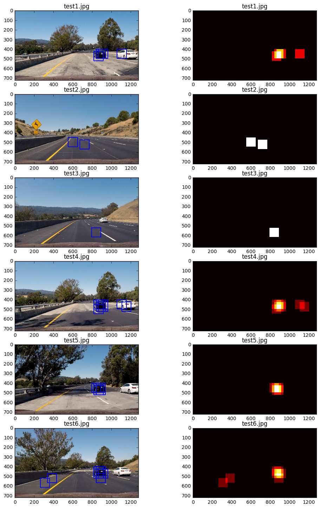

[](http://www.udacity.com/drive)
## Vehicle Detection & Tracking Pipeline

In this project, your goal is to write a software pipeline to detect vehicles in a video (start with the test_video.mp4 and later implement on full project_video.mp4), but the main output or product we want you to create is a detailed writeup of the project.  Check out the [writeup template](https://github.com/udacity/CarND-Vehicle-Detection/blob/master/writeup_template.md) for this project and use it as a starting point for creating your own writeup.  

The Project
---

The goals / steps of this project are the following:

* Perform a Histogram of Oriented Gradients (HOG) feature extraction on a labeled training set of images and train a classifier Linear SVM classifier
* Optionally, you can also apply a color transform and append binned color features, as well as histograms of color, to your HOG feature vector. 
* Note: for those first two steps don't forget to normalize your features and randomize a selection for training and testing.
* Implement a sliding-window technique and use your trained classifier to search for vehicles in images.
* Run your pipeline on a video stream (start with the test_video.mp4 and later implement on full project_video.mp4) and create a heat map of recurring detections frame by frame to reject outliers and follow detected vehicles.
* Estimate a bounding box for vehicles detected.

Here are links to the labeled data for [vehicle](https://s3.amazonaws.com/udacity-sdc/Vehicle_Tracking/vehicles.zip) and [non-vehicle](https://s3.amazonaws.com/udacity-sdc/Vehicle_Tracking/non-vehicles.zip) examples to train your classifier.  These example images come from a combination of the [GTI vehicle image database](http://www.gti.ssr.upm.es/data/Vehicle_database.html), the [KITTI vision benchmark suite](http://www.cvlibs.net/datasets/kitti/), and examples extracted from the project video itself.   You are welcome and encouraged to take advantage of the recently released [Udacity labeled dataset](https://github.com/udacity/self-driving-car/tree/master/annotations) to augment your training data.  

Some example images for testing your pipeline on single frames are located in the `test_images` folder.  To help the reviewer examine your work, please save examples of the output from each stage of your pipeline in the folder called `ouput_images`, and include them in your writeup for the project by describing what each image shows.    The video called `project_video.mp4` is the video your pipeline should work well on.  

### Dataset - Load Data and Extract Features


```python
%matplotlib inline
import matplotlib.image as mpimg
import matplotlib.pyplot as plt
import numpy as np
import cv2
import glob
from PIL import Image
import time
import os
import pickle
from skimage.feature import hog
from sklearn.svm import LinearSVC
from sklearn.preprocessing import StandardScaler
from sklearn.model_selection import train_test_split
```


```python
## Dataset Parameters ##
LABELS_CSV = 'FILL_LATER.csv'
TRAINING_DATASET_DIRECTORY = 'training_set/'
PIPELINE_SETUP_DIRECTORY = 'pipeline_setup_images/'
WORKING_DIRECTORY = 'data/'
NON_VEHICLES_TOKEN = 'non-vehicles'
dataset_path = "{}{}{}{}".format(WORKING_DIRECTORY, TRAINING_DATASET_DIRECTORY,'**/', '*.png')
DATACACHE_DIRECTORY = os.path.join(WORKING_DIRECTORY, 'datacache/')

## Image Processing ##
DEFAULT_LENGTH, DEFAULT_WIDTH, DEFAULT_DEPTH = (64, 64, 3)
if DEFAULT_DEPTH > 1:
    DEFAULT_RESOLUTION = (DEFAULT_LENGTH, DEFAULT_WIDTH, DEFAULT_DEPTH)
else:
    DEFAULT_RESOLUTION = (DEFAULT_LENGTH, DEFAULT_WIDTH)

## Feature Extraction Parameters ##
# Spatial Binning
SPATIAL = 32
BIN_SPATIAL_SIZE = (SPATIAL, SPATIAL)
# Color Histogram
HIST_NBINS = 128
COLOR_SPACE = 'HSV'
# HOG Parameters
HOG_ORIENTATIONS = 9
HOG_PIXELS_PER_CELL = 8
HOG_CELLS_PER_BLOCK = 2
HOG_CHANNEL = 'ALL' # Can be 0, 1, 2, or "ALL"

# SVC Parameters
VALIDATION_PORTION = .3
N_PREDICTIONS = 100
```


```python
# Define a function to scale .PNG and JPEG Files both to 0 to 1 
def normalize_pixels(img):
    max_pixel_value = np.max(img)
    if max_pixel_value > 1.0:
        img = np.copy(np.multiply(img, 1.0 / 255.0)).astype(np.float64) 
    return img

# Define a function to scale .PNG and JPEG Files both to 0 to 1 
def denormalize_pixels(img):
    max_pixel_value = np.max(img)
    if max_pixel_value <= 1.0:
        img = np.copy(np.multiply(img, 255.0)).astype(np.float64) 
    return img
```


```python
# Define a function to compute binned color features  
def bin_spatial(img, size=BIN_SPATIAL_SIZE):
    color1 = cv2.resize(img[:,:,0], size).ravel()
    color2 = cv2.resize(img[:,:,1], size).ravel()
    color3 = cv2.resize(img[:,:,2], size).ravel()
    return np.hstack((color1, color2, color3)) 

```


```python
# Define a function to compute color histogram features  
def color_hist(img, nbins=HIST_NBINS):
    # Compute the histogram of the color channels separately
    channel1_hist = np.histogram(img[:,:,0], bins=nbins)
    channel2_hist = np.histogram(img[:,:,1], bins=nbins)
    channel3_hist = np.histogram(img[:,:,2], bins=nbins)
    # Concatenate the histograms into a single feature vector
    hist_features = np.concatenate((channel1_hist[0], channel2_hist[0], channel3_hist[0]))
    return hist_features

```


```python
# Define a function to return HOG features and visualization --
def get_hog_features(img, orient=HOG_ORIENTATIONS, pix_per_cell=HOG_PIXELS_PER_CELL,
                     cell_per_block=HOG_CELLS_PER_BLOCK, vis=False, feature_vec=True):      
    denormalized_img = denormalize_pixels(img)
    if vis == True:
        features, hog_image = hog(denormalized_img, orientations=orient, pixels_per_cell=(pix_per_cell, pix_per_cell),
                                  cells_per_block=(cell_per_block, cell_per_block), transform_sqrt=False, 
                                  visualise=vis, feature_vector=feature_vec)
        return features, hog_image
    else:      
        features = hog(denormalized_img, orientations=orient, pixels_per_cell=(pix_per_cell, pix_per_cell),
                       cells_per_block=(cell_per_block, cell_per_block), transform_sqrt=False, 
                       visualise=vis, feature_vector=feature_vec)
        return features
```


```python
# Define a function to extract features from a list of images
def extract_features(imgs, cspace=COLOR_SPACE, spatial_size=BIN_SPATIAL_SIZE,
                        hist_bins=HIST_NBINS):
    # Create a list to append feature vectors
    features = []
    for file in imgs:
        image = mpimg.imread(file)

        # Image read in from mpimg + .png -> (0 to 1) scaled
        if cspace != 'RGB':
            if cspace == 'HSV':
                feature_image = cv2.cvtColor(image, cv2.COLOR_RGB2HSV)
            elif cspace == 'LUV':
                feature_image = cv2.cvtColor(image, cv2.COLOR_RGB2LUV)
            elif cspace == 'HLS':
                feature_image = cv2.cvtColor(image, cv2.COLOR_RGB2HLS)
            elif cspace == 'YUV':
                feature_image = cv2.cvtColor(image, cv2.COLOR_RGB2YUV)
        else: feature_image = np.copy(image)
        
        # Apply bin_spatial() to get spatial color features
        spatial_features = bin_spatial(feature_image, size=spatial_size)
        # Apply color_hist() also with a color space option now
        hist_features = color_hist(feature_image, nbins=hist_bins)
        
        # Call get_hog_features() with vis=False, feature_vec=True
        hog_image = np.copy(image)
        hog_shape = np.asarray(hog_image.shape)
        if HOG_CHANNEL == 'ALL':
            hog_features = []
            for channel in range(len(hog_shape)):
                hog_features.append(get_hog_features(hog_image[:,:,channel]))
            hog_features = np.ravel(hog_features)        
        else:
            hog_features = get_hog_features(hog_image[:,:,HOG_CHANNEL])
        
        # Append the new feature vector to the features list
        features.append(np.concatenate((spatial_features, hist_features, hog_features)))
    # Return list of feature vectors
    return features
```


```python
## Starting Training Pipeline ##
# Load Image Paths 
images = glob.glob(dataset_path, recursive=True)
cars = []
notcars = []
for image in images:
    if NON_VEHICLES_TOKEN in image:
        notcars.append(image)
    else:
        cars.append(image)
print('Number of Vehicle Images Found:',len(cars),'(images in directory):', dataset_path)
print('Number of Non-Vehicle Images Found:',len(notcars),'(images in directory):', dataset_path)
assert len(images) == len(cars) + len(notcars), 'The subarrays have not split the dataset correctly.'
```

    Number of Vehicle Images Found: 8792 (images in directory): data/training_set/**/*.png
    Number of Non-Vehicle Images Found: 8968 (images in directory): data/training_set/**/*.png


```python
# Start Pipeline - Combine and Normalilze Features
car_features = extract_features(cars)
notcar_features = extract_features(notcars)

# Create an array stack of feature vectors
X = np.vstack((car_features, notcar_features)).astype(np.float64)  

# Fit a per-column scaler
X_scaler = StandardScaler().fit(X)

# Apply the scaler to X
scaled_X = X_scaler.transform(X)
car_ind = np.random.randint(0, len(cars))
# Plot an example of raw and scaled features
fig = plt.figure(figsize=(12,4))
plt.subplot(131)
plt.imshow(mpimg.imread(cars[car_ind]))
plt.title('Original Image')
plt.subplot(132)
plt.plot(X[car_ind])
plt.title('Raw Features')
plt.subplot(133)
plt.plot(scaled_X[car_ind])
plt.title('Normalized Features')
fig.tight_layout()

print('Feature Vector size for Cars:', len(car_features[car_ind]))
print('Using Spatial Binning of:',BIN_SPATIAL_SIZE[0],
    'and', HIST_NBINS,'histogram bins')
```

    Feature Vector size for Cars: 8748
    Using Spatial Binning of: 32 and 128 histogram bins


```python
# Define the labels vector
y = np.hstack((np.ones(len(car_features)), np.zeros(len(notcar_features))))
```


```python
# Split up data into randomized training and test sets
rand_state = np.random.randint(0, 100)
X_train, X_test, y_train, y_test = train_test_split(
    scaled_X, y, test_size=VALIDATION_PORTION, random_state=rand_state)
print('Feature vector length:', len(X_train[0]))
```

    Feature vector length: 8748


```python
# Use a linear SVC 
svc = LinearSVC()
# Check the training time for the SVC
t=time.time()
svc.fit(X_train, y_train)
t2 = time.time()
print(round(t2-t, 2), 'Seconds to train SVC...')
# Check the score of the SVC
print('Test Accuracy of SVC = ', round(svc.score(X_test, y_test), 4))
# Check the prediction time for a single sample
t=time.time()
n_predict = N_PREDICTIONS
print('SVC predicts: ', svc.predict(X_test[0:n_predict]))
print('For these',n_predict, 'labels: ', y_test[0:n_predict])
t2 = time.time()
print(round(t2-t, 5), 'Seconds to predict', n_predict,'labels with SVC')
```

    105.35 Seconds to train SVC...
    Test Accuracy of SVC =  0.9908
    My SVC predicts:  [ 1.  0.  0.  1.  1.  1.  1.  0.  0.  0.  0.  0.  0.  1.  0.  1.  1.  1.
      0.  0.  1.  0.  1.  0.  1.  0.  1.  0.  0.  0.  1.  0.  1.  0.  0.  1.
      1.  0.  1.  1.  0.  1.  1.  1.  0.  0.  1.  0.  0.  0.  0.  0.  0.  0.
      1.  1.  0.  0.  1.  1.  0.  1.  0.  1.  1.  0.  0.  1.  0.  1.  1.  0.
      0.  0.  1.  0.  1.  0.  0.  1.  1.  0.  0.  0.  0.  1.  1.  1.  0.  0.
      0.  1.  0.  1.  0.  1.  0.  0.  1.  1.]
    For these 100 labels:  [ 0.  0.  0.  1.  1.  1.  1.  0.  0.  0.  0.  0.  0.  1.  0.  1.  1.  1.
      0.  0.  1.  0.  1.  0.  1.  0.  1.  0.  0.  0.  1.  0.  1.  0.  0.  1.
      1.  0.  1.  1.  0.  1.  1.  1.  0.  0.  1.  0.  0.  0.  0.  0.  0.  0.
      1.  1.  0.  0.  1.  1.  0.  1.  0.  1.  1.  0.  0.  1.  0.  1.  1.  0.
      0.  0.  1.  0.  1.  0.  0.  1.  1.  0.  0.  0.  0.  1.  1.  1.  0.  0.
      0.  1.  0.  1.  0.  1.  0.  0.  1.  1.]
    0.30183 Seconds to predict 100 labels with SVC


```python
#Save Support Vector Classifier to Datacache
def save_to_datacache(support_vector_classifier, datacache_dir=DATACACHE_DIRECTORY):
    os.makedirs(datacache_dir, exist_ok=True)
    svc_pickle = os.path.join(datacache_dir,"svc_pickle.p")
    if not os.path.exists(svc_pickle): 
        svc_hyperparameters = {'svc': svc,
                               'X_scaler':X_scaler,
                               'SPATIAL': SPATIAL, 
                               'HIST_NBINS': HIST_NBINS,
                               'COLOR_SPACE': COLOR_SPACE,
                               'HOG_ORIENTATIONS': HOG_ORIENTATIONS,
                               'HOG_PIXELS_PER_CELL': HOG_PIXELS_PER_CELL,
                               'HOG_CELLS_PER_BLOCK': HOG_CELLS_PER_BLOCK,
                               'HOG_CHANNEL': HOG_CHANNEL
                              }

        pickle.dump(svc_hyperparameters, open(svc_pickle, "wb"))
    
# Save classifier and parameters to datacache directory  
save_to_datacache(svc)
```

# Finished Training SVC - Now to Utilize Sliding Windows


```python
import matplotlib.image as mpimg
import numpy as np
import cv2
from skimage.feature import hog
```


```python
# Sliding Window Constants
WORKING_DIRECTORY = 'data/'
DATACACHE_DIRECTORY = os.path.join(WORKING_DIRECTORY, 'datacache/')
svc_pickle = os.path.join(DATACACHE_DIRECTORY,"svc_pickle.p")
TESTING_DATASET_DIRECTORY = 'testing_dataset/'
TESTING_PIPELINE_SETUP_DIR= 'test_images/'

testset_path = "{}{}{}".format(WORKING_DIRECTORY, TESTING_PIPELINE_SETUP_DIR, '*.jpg')


with open(svc_pickle, mode='rb') as f:
    svc_hyperparameters = pickle.load(f)
    
    
## Feature Extraction Parameters ##
# Spatial Binning
SVC = svc_hyperparameters['svc']
X_SCALER = svc_hyperparameters['X_scaler']
SPATIAL = svc_hyperparameters['SPATIAL']

BIN_SPATIAL_SIZE = (SPATIAL, SPATIAL)
# Color Histogram
HIST_NBINS = svc_hyperparameters['HIST_NBINS']
COLOR_SPACE = svc_hyperparameters['COLOR_SPACE']
# HOG Parameters
HOG_ORIENTATIONS = svc_hyperparameters['HOG_ORIENTATIONS']
HOG_PIXELS_PER_CELL = svc_hyperparameters['HOG_PIXELS_PER_CELL']
HOG_CELLS_PER_BLOCK = svc_hyperparameters['HOG_CELLS_PER_BLOCK']
HOG_CHANNEL = svc_hyperparameters['HOG_CHANNEL'] # Can be 0, 1, 2, or "ALL"

BBOX_COLOR = (0, 0, 255)
BBOX_THICK = 6

## Sliding Windows Parameters - Horizon ##
SW_YSTART_HORIZON = 368
SW_YSTOP_HORIZON = 512
SW_XY_WINDOW_HORIZON = 96
SW_XY_OVERLAP_HORIZON = 0.50

## Sliding Windows Parameters - Foreground ##
SW_YSTART_FOREGROUND = 345
SW_YSTOP_FOREGROUND = 665
SW_XY_WINDOW_FOREGROUND = 160
SW_XY_OVERLAP_FOREGROUND = 0.50


SW_SPATIAL_FEAT_FLAG = True
SW_HOG_FEAT_FLAG = True
SW_COLOR_HIST_FEAT_FLAG = True
```


```python
# Define a function to draw bounding boxes
def draw_boxes(img, bboxes, color=BBOX_COLOR, thick=BBOX_THICK):
    # Make a copy of the image
    imcopy = np.copy(img)
    # Iterate through the bounding boxes
    for bbox in bboxes:
        # Draw a rectangle given bbox coordinates
        cv2.rectangle(imcopy, bbox[0], bbox[1], color, thick)
    return imcopy
```


```python
# Define a function that takes an image,
# start and stop positions in both x and y, 
# window size (x and y dimensions),  
# and overlap fraction (for both x and y)
def slide_window(img, x_start_stop=[None, None], y_start_stop=[None, None], 
                    xy_window=(64, 64), xy_overlap=(0.5, 0.5)):
    # If x and/or y start/stop positions not defined, set to image size
    if x_start_stop[0] == None:
        x_start_stop[0] = 0
    if x_start_stop[1] == None:
        x_start_stop[1] = img.shape[1]
    if y_start_stop[0] == None:
        y_start_stop[0] = 0
    if y_start_stop[1] == None:
        y_start_stop[1] = img.shape[0]
    # Compute the span of the region to be searched    
    xspan = x_start_stop[1] - x_start_stop[0]
    yspan = y_start_stop[1] - y_start_stop[0]
    # Compute the number of pixels per step in x/y
    nx_pix_per_step = np.int(xy_window[0]*(1 - xy_overlap[0]))
    ny_pix_per_step = np.int(xy_window[1]*(1 - xy_overlap[1]))
    # Compute the number of windows in x/y
    nx_buffer = np.int(xy_window[0]*(xy_overlap[0]))
    ny_buffer = np.int(xy_window[1]*(xy_overlap[1]))
    nx_windows = np.int((xspan-nx_buffer)/nx_pix_per_step) 
    ny_windows = np.int((yspan-ny_buffer)/ny_pix_per_step) 
    # Initialize a list to append window positions to
    window_list = []
    # Loop through finding x and y window positions
    for ys in range(ny_windows):
        for xs in range(nx_windows):
            # Calculate window position
            startx = xs*nx_pix_per_step + x_start_stop[0]
            endx = startx + xy_window[0]
            starty = ys*ny_pix_per_step + y_start_stop[0]
            endy = starty + xy_window[1]
            # Append window position to list
            window_list.append(((startx, starty), (endx, endy)))
    return window_list
```


```python
#Define a function for plotting multipole images
def visualize(fig, rows, cols, imgs, titles):
    for i, img in enumerate(imgs):
        plt.subplot(rows, cols, i+1)
        plt.title(i+1)
        img_dims = len(img.shape)
        if img_dims < 3:
            plt.imshow(img, cmap='hot')
            plt.title(titles[i])
        else:
            plt.imshow(img)
            plt.title(titles[i])
```


```python
# Define a function to extract features from a single image window
# This function is very similar to extract_features()
# just for a single image rather than list of images
def single_img_features(img, color_space=COLOR_SPACE, spatial_size=(32, 32),
                        hist_bins=32, orient=9, 
                        pix_per_cell=8, cell_per_block=2, hog_channel=0,
                        spatial_feat=True, hist_feat=True, hog_feat=True):    
    #1) Define an empty list to receive features
    img_features = []
    #2) Apply color conversion if other than 'RGB'
    if color_space != 'RGB':
        if color_space == 'HSV':
            feature_image = cv2.cvtColor(img, cv2.COLOR_RGB2HSV)
        elif color_space == 'LUV':
            feature_image = cv2.cvtColor(img, cv2.COLOR_RGB2LUV)
        elif color_space == 'HLS':
            feature_image = cv2.cvtColor(img, cv2.COLOR_RGB2HLS)
        elif color_space == 'YUV':
            feature_image = cv2.cvtColor(img, cv2.COLOR_RGB2YUV)
        elif color_space == 'YCrCb':
            feature_image = cv2.cvtColor(img, cv2.COLOR_RGB2YCrCb)
    else: feature_image = np.copy(img)      
    #3) Compute spatial features if flag is set
    if spatial_feat == True:
        spatial_features = bin_spatial(feature_image, size=spatial_size)
        #4) Append features to list
        img_features.append(spatial_features)
    #5) Compute histogram features if flag is set
    if hist_feat == True:
        hist_features = color_hist(feature_image, nbins=hist_bins)
        #6) Append features to list
        img_features.append(hist_features)
    #7) Compute HOG features if flag is set
    if hog_feat == True:
        if hog_channel == 'ALL':
            hog_features = []
            for channel in range(feature_image.shape[2]):
                hog_features.extend(get_hog_features(feature_image[:,:,channel], 
                                    orient, pix_per_cell, cell_per_block, 
                                    vis=False, feature_vec=True))      
        else:
            hog_features = get_hog_features(feature_image[:,:,hog_channel], orient, 
                        pix_per_cell, cell_per_block, vis=False, feature_vec=True)
        #8) Append features to list
        img_features.append(hog_features)

    #9) Return concatenated array of features
    return np.concatenate(img_features)
```


```python
# Define a function you will pass an image 
# and the list of windows to be searched (output of slide_windows())
def search_windows(img, windows, svc=SVC, X_scaler=X_SCALER, color_space=COLOR_SPACE, 
                    spatial_size=BIN_SPATIAL_SIZE, hist_bins=HIST_NBINS, 
                    orient=HOG_ORIENTATIONS, pix_per_cell=HOG_PIXELS_PER_CELL, cell_per_block=HOG_CELLS_PER_BLOCK, 
                    hog_channel=HOG_CHANNEL, spatial_feat=SW_SPATIAL_FEAT_FLAG, 
                    hist_feat=SW_COLOR_HIST_FEAT_FLAG, hog_feat=SW_HOG_FEAT_FLAG):
    

    #1) Create an empty list to receive positive detection windows
    on_windows = []
    #2) Iterate over all windows in the list
    for window in windows:
        #3) Extract the test window from original image
        test_img = cv2.resize(img[window[0][1]:window[1][1], window[0][0]:window[1][0]], (DEFAULT_LENGTH, DEFAULT_WIDTH))      
        #4) Extract features for that window using single_img_features()
        features = single_img_features(test_img, color_space=color_space, 
                            spatial_size=spatial_size, hist_bins=hist_bins, 
                            orient=orient, pix_per_cell=pix_per_cell, 
                            cell_per_block=cell_per_block, 
                            hog_channel=hog_channel, spatial_feat=spatial_feat, 
                            hist_feat=hist_feat, hog_feat=hog_feat)
        #5) Scale extracted features to be fed to classifier
        test_features = X_scaler.transform(np.array(features).reshape(1, -1))
        #6) Predict using your classifier
        prediction = svc.predict(test_features)
        #7) If positive (prediction == 1) then save the window
        if prediction == 1: # Car detected
            on_windows.append(window)
    #8) Return windows for positive detections
    return on_windows
    
```


```python
# Try Scaling Windows on Test Images

image_paths = glob.glob(testset_path, recursive=True)
print('Found',len(image_paths),'images in directory:', testset_path)
```

    Found 6 images in directory: data/test_images/*.jpg


```python
# Define a single function that can extract features using hog sub-sampling and make predictions
images = []
titles = []


y_start_stop_horizon = [SW_YSTART_HORIZON, SW_YSTOP_HORIZON] # Min/Max in y to search in slide_window()
y_start_stop_foreground = [SW_YSTART_FOREGROUND, SW_YSTOP_FOREGROUND] # Min/Max in y to search in slide_window()

for img_path in image_paths:
    t1 = time.time()
    img = mpimg.imread(img_path)
    draw_img = np.copy(img)
    img = normalize_pixels(img).astype(np.float32)
    windows = []
    hot_windows = []
    
    
    # Horizon Check
    windows_1 = slide_window(img, x_start_stop=[None,None], y_start_stop=y_start_stop_horizon, 
                           xy_window=(SW_XY_WINDOW_HORIZON,SW_XY_WINDOW_HORIZON), 
                           xy_overlap=(SW_XY_OVERLAP_HORIZON,SW_XY_OVERLAP_HORIZON))

    hot_windows_1 = search_windows(img, windows_1, SVC, X_SCALER, color_space=COLOR_SPACE,
                                 spatial_size=BIN_SPATIAL_SIZE, hist_bins=HIST_NBINS, orient=HOG_ORIENTATIONS,
                                 pix_per_cell=HOG_PIXELS_PER_CELL, cell_per_block=HOG_CELLS_PER_BLOCK,
                                 hog_channel=HOG_CHANNEL, spatial_feat=SW_SPATIAL_FEAT_FLAG, hog_feat=SW_HOG_FEAT_FLAG,
                                 hist_feat=SW_COLOR_HIST_FEAT_FLAG)

    print('BBoxes Found - Horizon:', len(hot_windows_1))
    windows.extend(windows_1)
    hot_windows.extend(hot_windows_1)
    
    # Foreground Check
    windows_2 = slide_window(img, x_start_stop=[None,None], y_start_stop=y_start_stop_foreground, 
                           xy_window=(SW_XY_WINDOW_FOREGROUND,SW_XY_WINDOW_FOREGROUND), 
                           xy_overlap=(SW_XY_OVERLAP_FOREGROUND,SW_XY_OVERLAP_FOREGROUND))

    hot_windows_2 = search_windows(img, windows_2, SVC, X_SCALER, color_space=COLOR_SPACE,
                                 spatial_size=BIN_SPATIAL_SIZE, hist_bins=HIST_NBINS, orient=HOG_ORIENTATIONS,
                                 pix_per_cell=HOG_PIXELS_PER_CELL, cell_per_block=HOG_CELLS_PER_BLOCK,
                                 hog_channel=HOG_CHANNEL, spatial_feat=SW_SPATIAL_FEAT_FLAG, hog_feat=SW_HOG_FEAT_FLAG,
                                 hist_feat=SW_COLOR_HIST_FEAT_FLAG)


    print('BBoxes Found - Foreground:', len(hot_windows_2))
    windows.extend(windows_2)
    hot_windows.extend(hot_windows_2)

    window_img = draw_boxes(draw_img, hot_windows, color=BBOX_COLOR, thick=BBOX_THICK)
    images.append(window_img)
    titles.append('')
    
    print(time.time()-t1, 'seconds to process one image search', len(windows), 'windows')
    
fig = plt.figure(figsize=(12,18), dpi=300)
visualize(fig, 5, 2, images, titles)
```

    BBoxes Found - Horizon: 4
    BBoxes Found - Foreground: 1
    0.8273510932922363 seconds to process one image search 95 windows
    BBoxes Found - Horizon: 0
    BBoxes Found - Foreground: 0
    0.6296329498291016 seconds to process one image search 95 windows
    BBoxes Found - Horizon: 1
    BBoxes Found - Foreground: 0
    0.9677538871765137 seconds to process one image search 95 windows
    BBoxes Found - Horizon: 3
    BBoxes Found - Foreground: 1
    0.8046660423278809 seconds to process one image search 95 windows
    BBoxes Found - Horizon: 4
    BBoxes Found - Foreground: 1
    0.6795129776000977 seconds to process one image search 95 windows
    BBoxes Found - Horizon: 4
    BBoxes Found - Foreground: 0
    0.7243568897247314 seconds to process one image search 95 windows


### Explore HOG Sub-Sampling Window Search

We want a more efficient way to detect vehicles. This approach will allow for only a single call to get HOG features. The pipeline will then find a sub sample


```python
def convert_color(img, conv=SW_CONVERT_COLOR):
    if conv == 'RGB2YCrCb':
        return cv2.cvtColor(img, cv2.COLOR_RGB2YCrCb)
    if conv == 'BGR2YCrCb':
        return cv2.cvtColor(img, cv2.COLOR_BGR2YCrCb)
    if conv == 'RGB2LUV':
        return cv2.cvtColor(img, cv2.COLOR_RGB2LUV)
```


```python
# Define a single function that can extract features using hog sub-sampling and make predictions
out_images = []
out_maps = []
out_titles = []
out_boxes = []

## Sliding Window Parameters - HOG Sub-Sampling ##
SW_CONVERT_COLOR = 'RGB2YCrCb'
SW_YSTART = 400
SW_YSTOP = 656
SW_SCALE = 1.5

ystart = SW_YSTART
ystop = SW_YSTOP
scale = SW_SCALE
spatial_size=BIN_SPATIAL_SIZE
hist_bins=HIST_NBINS
orient=HOG_ORIENTATIONS
pix_per_cell=HOG_PIXELS_PER_CELL
cell_per_block=HOG_CELLS_PER_BLOCK
hog_channel=HOG_CHANNEL
spatial_feat=SW_SPATIAL_FEAT_FLAG
hog_feat=SW_HOG_FEAT_FLAG
hist_feat=SW_COLOR_HIST_FEAT_FLAG


#Iterate over the test images
for img_path in image_paths:
    img_boxes = []
    t1 = time.time()
    count = 0
    img = mpimg.imread(img_path)
    draw_img = np.copy(img)
    
    #Make a heatmap of zeros
    heatmap = np.zeros_like(img[:,:,0])
    img = normalize_pixels(img).astype(np.float32)
    img_to_search = img[ystart:ystop,:,:]
    ctrans_tosearch = convert_color(img_to_search, conv=SW_CONVERT_COLOR)
    if scale != 1:
        imshape = ctrans_tosearch.shape
        ctrans_tosearch = cv2.resize(ctrans_tosearch, (np.int(imshape[1]/scale), np.int(imshape[0]/scale)))

    ch1 = ctrans_tosearch[:,:,0]
    ch2 = ctrans_tosearch[:,:,1]
    ch3 = ctrans_tosearch[:,:,2]
    
    # Define blocks and steps as above
    nxblocks = (ch1.shape[1] // pix_per_cell)-1
    nyblocks = (ch1.shape[0] // pix_per_cell)-1 
    nfeat_per_block = orient*cell_per_block**2
    window = HOG_PIXELS_PER_CELL*HOG_PIXELS_PER_CELL # 8 cells and 8 pix per cell
    nblocks_per_window = (window // pix_per_cell)-1  # This division is used for integers (for indices)
    cells_per_step = 2  # Instead of overlap, define how many cells to step
    nxsteps = (nxblocks - nblocks_per_window) // cells_per_step
    nysteps = (nyblocks - nblocks_per_window) // cells_per_step
    
    # Compute individual channel HOG features for the entire image
    hog1 = get_hog_features(ch1, orient, pix_per_cell, cell_per_block, feature_vec=False)
    hog2 = get_hog_features(ch2, orient, pix_per_cell, cell_per_block, feature_vec=False)
    hog3 = get_hog_features(ch3, orient, pix_per_cell, cell_per_block, feature_vec=False)


    for xb in range(nxsteps):
        for yb in range(nysteps):
            count += 1
            ypos = yb*cells_per_step
            xpos = xb*cells_per_step

            # Extract HOG for this particular patch
            hog_feat1 = hog1[ypos:ypos+nblocks_per_window, xpos:xpos+nblocks_per_window].ravel() 
            hog_feat2 = hog2[ypos:ypos+nblocks_per_window, xpos:xpos+nblocks_per_window].ravel() 
            hog_feat3 = hog3[ypos:ypos+nblocks_per_window, xpos:xpos+nblocks_per_window].ravel() 
            hog_features = np.hstack((hog_feat1, hog_feat2, hog_feat3))
            
            xleft = xpos*pix_per_cell
            ytop = ypos*pix_per_cell
            
            # Extract the image patch
            subimg = cv2.resize(ctrans_tosearch[ytop:ytop+window, xleft:xleft+window], (DEFAULT_LENGTH, DEFAULT_WIDTH))

            # Get color features
            spatial_features = bin_spatial(subimg, size=BIN_SPATIAL_SIZE)
            hist_features = color_hist(subimg, nbins=HIST_NBINS)
            
            
            test_feats = np.hstack((spatial_features, hist_features, hog_features))
            # Scale features and make a prediction
            test_features = X_scaler.transform(test_feats.reshape(1, -1))
            test_prediction = svc.predict(test_features)

            if test_prediction == 1:
                xbox_left = np.int(xleft*scale)
                ytop_draw = np.int(ytop*scale)
                win_draw = np.int(window*scale)
                cv2.rectangle(draw_img,(xbox_left, ytop_draw+ystart),
                              (xbox_left+win_draw, ytop_draw+win_draw+ystart),BBOX_COLOR,6)
                img_boxes.append(((xbox_left, ytop_draw+ystart),
                              (xbox_left+win_draw,ytop_draw+win_draw+ystart)))

                heatmap[ytop_draw+ystart:ytop_draw+win_draw+ystart, xbox_left:xbox_left+win_draw] +=1
        print(time.time()-t1, 'seconds to run, total windows = ', count)

    out_images.append(draw_img)

    out_titles.append(os.path.split(img_path)[-1])
    out_titles.append(os.path.split(img_path)[-1])
    out_images.append(heatmap)
    out_maps.append(heatmap)
    out_boxes.append(img_boxes)
    
fig = plt.figure(figsize=(12,24))
visualize(fig, 8, 2, out_images, out_titles)
```

    0.33756303787231445 seconds to run, total windows =  6
    0.3444089889526367 seconds to run, total windows =  12
    0.34960389137268066 seconds to run, total windows =  18
    0.35515904426574707 seconds to run, total windows =  24
    0.36030101776123047 seconds to run, total windows =  30
    0.365447998046875 seconds to run, total windows =  36
    0.370527982711792 seconds to run, total windows =  42
    0.37606191635131836 seconds to run, total windows =  48
    0.381558895111084 seconds to run, total windows =  54
    0.3863840103149414 seconds to run, total windows =  60
    0.39156389236450195 seconds to run, total windows =  66
    0.39683103561401367 seconds to run, total windows =  72
    0.40262889862060547 seconds to run, total windows =  78
    0.4081718921661377 seconds to run, total windows =  84
    0.4133119583129883 seconds to run, total windows =  90
    0.41815805435180664 seconds to run, total windows =  96
    0.4232480525970459 seconds to run, total windows =  102
    0.42969799041748047 seconds to run, total windows =  108
    0.4348878860473633 seconds to run, total windows =  114
    0.43976306915283203 seconds to run, total windows =  120
    0.44557690620422363 seconds to run, total windows =  126
    0.4508979320526123 seconds to run, total windows =  132
    0.45638394355773926 seconds to run, total windows =  138
    0.46188807487487793 seconds to run, total windows =  144
    0.4670600891113281 seconds to run, total windows =  150
    0.47296595573425293 seconds to run, total windows =  156
    0.47845911979675293 seconds to run, total windows =  162
    0.48393797874450684 seconds to run, total windows =  168
    0.4888010025024414 seconds to run, total windows =  174
    0.4938631057739258 seconds to run, total windows =  180
    0.4988288879394531 seconds to run, total windows =  186
    0.5042169094085693 seconds to run, total windows =  192
    0.5094149112701416 seconds to run, total windows =  198
    0.514228105545044 seconds to run, total windows =  204
    0.5195798873901367 seconds to run, total windows =  210
    0.5247170925140381 seconds to run, total windows =  216
    0.5296840667724609 seconds to run, total windows =  222
    0.5352280139923096 seconds to run, total windows =  228
    0.5402209758758545 seconds to run, total windows =  234
    0.5482110977172852 seconds to run, total windows =  240
    0.5541980266571045 seconds to run, total windows =  246
    0.5623979568481445 seconds to run, total windows =  252
    0.5697329044342041 seconds to run, total windows =  258
    0.575347900390625 seconds to run, total windows =  264
    0.5816309452056885 seconds to run, total windows =  270
    0.5880179405212402 seconds to run, total windows =  276
    0.5967879295349121 seconds to run, total windows =  282
    0.6255180835723877 seconds to run, total windows =  288
    0.6312990188598633 seconds to run, total windows =  294
    0.32376885414123535 seconds to run, total windows =  6
    0.329420804977417 seconds to run, total windows =  12
    0.3348369598388672 seconds to run, total windows =  18
    0.3397510051727295 seconds to run, total windows =  24
    0.34534192085266113 seconds to run, total windows =  30
    0.3505089282989502 seconds to run, total windows =  36
    0.3555428981781006 seconds to run, total windows =  42
    0.36158180236816406 seconds to run, total windows =  48
    0.36676597595214844 seconds to run, total windows =  54
    0.3717780113220215 seconds to run, total windows =  60
    0.3768727779388428 seconds to run, total windows =  66
    0.3819580078125 seconds to run, total windows =  72
    0.38721489906311035 seconds to run, total windows =  78
    0.3926079273223877 seconds to run, total windows =  84
    0.3974487781524658 seconds to run, total windows =  90
    0.4022347927093506 seconds to run, total windows =  96
    0.40764498710632324 seconds to run, total windows =  102
    0.41333985328674316 seconds to run, total windows =  108
    0.418353796005249 seconds to run, total windows =  114
    0.42426395416259766 seconds to run, total windows =  120
    0.4297788143157959 seconds to run, total windows =  126
    0.4353179931640625 seconds to run, total windows =  132
    0.44076085090637207 seconds to run, total windows =  138
    0.4465029239654541 seconds to run, total windows =  144
    0.45169687271118164 seconds to run, total windows =  150
    0.45667290687561035 seconds to run, total windows =  156
    0.462263822555542 seconds to run, total windows =  162
    0.46710681915283203 seconds to run, total windows =  168
    0.4720950126647949 seconds to run, total windows =  174
    0.47701191902160645 seconds to run, total windows =  180
    0.4818918704986572 seconds to run, total windows =  186
    0.48760294914245605 seconds to run, total windows =  192
    0.4941279888153076 seconds to run, total windows =  198
    0.4997689723968506 seconds to run, total windows =  204
    0.5049138069152832 seconds to run, total windows =  210
    0.5103437900543213 seconds to run, total windows =  216
    0.5167789459228516 seconds to run, total windows =  222
    0.5223829746246338 seconds to run, total windows =  228
    0.5277359485626221 seconds to run, total windows =  234
    0.5374629497528076 seconds to run, total windows =  240
    0.5444538593292236 seconds to run, total windows =  246
    0.5498778820037842 seconds to run, total windows =  252
    0.5552477836608887 seconds to run, total windows =  258
    0.561668872833252 seconds to run, total windows =  264
    0.5680859088897705 seconds to run, total windows =  270
    0.5750539302825928 seconds to run, total windows =  276
    0.5800027847290039 seconds to run, total windows =  282
    0.5879678726196289 seconds to run, total windows =  288
    0.6224370002746582 seconds to run, total windows =  294
    0.27547502517700195 seconds to run, total windows =  6
    0.28075218200683594 seconds to run, total windows =  12
    0.28567004203796387 seconds to run, total windows =  18
    0.2907400131225586 seconds to run, total windows =  24
    0.29569196701049805 seconds to run, total windows =  30
    0.3014199733734131 seconds to run, total windows =  36
    0.307481050491333 seconds to run, total windows =  42
    0.31281495094299316 seconds to run, total windows =  48
    0.31807994842529297 seconds to run, total windows =  54
    0.3236210346221924 seconds to run, total windows =  60
    0.3285691738128662 seconds to run, total windows =  66
    0.3339090347290039 seconds to run, total windows =  72
    0.3402390480041504 seconds to run, total windows =  78
    0.34528398513793945 seconds to run, total windows =  84
    0.35111117362976074 seconds to run, total windows =  90
    0.35636210441589355 seconds to run, total windows =  96
    0.3612661361694336 seconds to run, total windows =  102
    0.36640095710754395 seconds to run, total windows =  108
    0.3717041015625 seconds to run, total windows =  114
    0.37775301933288574 seconds to run, total windows =  120
    0.38263607025146484 seconds to run, total windows =  126
    0.3881959915161133 seconds to run, total windows =  132
    0.3933591842651367 seconds to run, total windows =  138
    0.3982570171356201 seconds to run, total windows =  144
    0.404325008392334 seconds to run, total windows =  150
    0.4099600315093994 seconds to run, total windows =  156
    0.41538214683532715 seconds to run, total windows =  162
    0.42070913314819336 seconds to run, total windows =  168
    0.42624902725219727 seconds to run, total windows =  174
    0.43151402473449707 seconds to run, total windows =  180
    0.43634700775146484 seconds to run, total windows =  186
    0.44306206703186035 seconds to run, total windows =  192
    0.44863295555114746 seconds to run, total windows =  198
    0.45433497428894043 seconds to run, total windows =  204
    0.45937299728393555 seconds to run, total windows =  210
    0.4645261764526367 seconds to run, total windows =  216
    0.46973705291748047 seconds to run, total windows =  222
    0.4747731685638428 seconds to run, total windows =  228
    0.4803459644317627 seconds to run, total windows =  234
    0.4868631362915039 seconds to run, total windows =  240
    0.4926309585571289 seconds to run, total windows =  246
    0.49791908264160156 seconds to run, total windows =  252
    0.5050389766693115 seconds to run, total windows =  258
    0.5100321769714355 seconds to run, total windows =  264
    0.5183141231536865 seconds to run, total windows =  270
    0.5266060829162598 seconds to run, total windows =  276
    0.5340151786804199 seconds to run, total windows =  282
    0.539788007736206 seconds to run, total windows =  288
    0.5447371006011963 seconds to run, total windows =  294
    0.29917192459106445 seconds to run, total windows =  6
    0.30449604988098145 seconds to run, total windows =  12
    0.3094160556793213 seconds to run, total windows =  18
    0.3146190643310547 seconds to run, total windows =  24
    0.3199131488800049 seconds to run, total windows =  30
    0.3248600959777832 seconds to run, total windows =  36
    0.32995009422302246 seconds to run, total windows =  42
    0.33560705184936523 seconds to run, total windows =  48
    0.34072399139404297 seconds to run, total windows =  54
    0.34625911712646484 seconds to run, total windows =  60
    0.3514721393585205 seconds to run, total windows =  66
    0.35648012161254883 seconds to run, total windows =  72
    0.361407995223999 seconds to run, total windows =  78
    0.36681199073791504 seconds to run, total windows =  84
    0.37198495864868164 seconds to run, total windows =  90
    0.3773469924926758 seconds to run, total windows =  96
    0.3824310302734375 seconds to run, total windows =  102
    0.38760900497436523 seconds to run, total windows =  108
    0.3924391269683838 seconds to run, total windows =  114
    0.3973541259765625 seconds to run, total windows =  120
    0.40236997604370117 seconds to run, total windows =  126
    0.40721607208251953 seconds to run, total windows =  132
    0.4120349884033203 seconds to run, total windows =  138
    0.4172091484069824 seconds to run, total windows =  144
    0.42291903495788574 seconds to run, total windows =  150
    0.42814207077026367 seconds to run, total windows =  156
    0.4329659938812256 seconds to run, total windows =  162
    0.43807315826416016 seconds to run, total windows =  168
    0.4432859420776367 seconds to run, total windows =  174
    0.4485790729522705 seconds to run, total windows =  180
    0.45359301567077637 seconds to run, total windows =  186
    0.45859599113464355 seconds to run, total windows =  192
    0.4634411334991455 seconds to run, total windows =  198
    0.4700131416320801 seconds to run, total windows =  204
    0.47592806816101074 seconds to run, total windows =  210
    0.48165297508239746 seconds to run, total windows =  216
    0.4869570732116699 seconds to run, total windows =  222
    0.4924290180206299 seconds to run, total windows =  228
    0.49808502197265625 seconds to run, total windows =  234
    0.5050439834594727 seconds to run, total windows =  240
    0.5108489990234375 seconds to run, total windows =  246
    0.5165200233459473 seconds to run, total windows =  252
    0.523000955581665 seconds to run, total windows =  258
    0.5285789966583252 seconds to run, total windows =  264
    0.5347549915313721 seconds to run, total windows =  270
    0.5416049957275391 seconds to run, total windows =  276
    0.54888916015625 seconds to run, total windows =  282
    0.5564610958099365 seconds to run, total windows =  288
    0.5732460021972656 seconds to run, total windows =  294
    0.24658703804016113 seconds to run, total windows =  6
    0.2548251152038574 seconds to run, total windows =  12
    0.26042914390563965 seconds to run, total windows =  18
    0.26666903495788574 seconds to run, total windows =  24
    0.2729909420013428 seconds to run, total windows =  30
    0.2790260314941406 seconds to run, total windows =  36
    0.28458094596862793 seconds to run, total windows =  42
    0.29058313369750977 seconds to run, total windows =  48
    0.2973940372467041 seconds to run, total windows =  54
    0.30416297912597656 seconds to run, total windows =  60
    0.3116879463195801 seconds to run, total windows =  66
    0.3189239501953125 seconds to run, total windows =  72
    0.32473206520080566 seconds to run, total windows =  78
    0.3308250904083252 seconds to run, total windows =  84
    0.3370230197906494 seconds to run, total windows =  90
    0.3425600528717041 seconds to run, total windows =  96
    0.34833312034606934 seconds to run, total windows =  102
    0.3548099994659424 seconds to run, total windows =  108
    0.36077308654785156 seconds to run, total windows =  114
    0.3663749694824219 seconds to run, total windows =  120
    0.3721909523010254 seconds to run, total windows =  126
    0.37848806381225586 seconds to run, total windows =  132
    0.3851590156555176 seconds to run, total windows =  138
    0.39067912101745605 seconds to run, total windows =  144
    0.39609408378601074 seconds to run, total windows =  150
    0.4039640426635742 seconds to run, total windows =  156
    0.4111511707305908 seconds to run, total windows =  162
    0.41893911361694336 seconds to run, total windows =  168
    0.4252610206604004 seconds to run, total windows =  174
    0.43032002449035645 seconds to run, total windows =  180
    0.43650007247924805 seconds to run, total windows =  186
    0.4431800842285156 seconds to run, total windows =  192
    0.4512450695037842 seconds to run, total windows =  198
    0.4601409435272217 seconds to run, total windows =  204
    0.47510695457458496 seconds to run, total windows =  210
    0.48172998428344727 seconds to run, total windows =  216
    0.4911360740661621 seconds to run, total windows =  222
    0.4987180233001709 seconds to run, total windows =  228
    0.5099999904632568 seconds to run, total windows =  234
    0.5212841033935547 seconds to run, total windows =  240
    0.5303089618682861 seconds to run, total windows =  246
    0.5389461517333984 seconds to run, total windows =  252
    0.5487020015716553 seconds to run, total windows =  258
    0.5555980205535889 seconds to run, total windows =  264
    0.5614540576934814 seconds to run, total windows =  270
    0.5674011707305908 seconds to run, total windows =  276
    0.5730509757995605 seconds to run, total windows =  282
    0.5808291435241699 seconds to run, total windows =  288
    0.5870349407196045 seconds to run, total windows =  294
    0.3613460063934326 seconds to run, total windows =  6
    0.36716294288635254 seconds to run, total windows =  12
    0.37256693840026855 seconds to run, total windows =  18
    0.37784695625305176 seconds to run, total windows =  24
    0.38315892219543457 seconds to run, total windows =  30
    0.3879818916320801 seconds to run, total windows =  36
    0.3930809497833252 seconds to run, total windows =  42
    0.39830994606018066 seconds to run, total windows =  48
    0.4036369323730469 seconds to run, total windows =  54
    0.4094579219818115 seconds to run, total windows =  60
    0.41481995582580566 seconds to run, total windows =  66
    0.420482873916626 seconds to run, total windows =  72
    0.42536306381225586 seconds to run, total windows =  78
    0.43218088150024414 seconds to run, total windows =  84
    0.437777042388916 seconds to run, total windows =  90
    0.44379496574401855 seconds to run, total windows =  96
    0.4492678642272949 seconds to run, total windows =  102
    0.4544990062713623 seconds to run, total windows =  108
    0.45980095863342285 seconds to run, total windows =  114
    0.4649629592895508 seconds to run, total windows =  120
    0.4700779914855957 seconds to run, total windows =  126
    0.47678303718566895 seconds to run, total windows =  132
    0.4837770462036133 seconds to run, total windows =  138
    0.48994994163513184 seconds to run, total windows =  144
    0.4957258701324463 seconds to run, total windows =  150
    0.5022778511047363 seconds to run, total windows =  156
    0.5085999965667725 seconds to run, total windows =  162
    0.516063928604126 seconds to run, total windows =  168
    0.5232179164886475 seconds to run, total windows =  174
    0.5304388999938965 seconds to run, total windows =  180
    0.5360760688781738 seconds to run, total windows =  186
    0.5422730445861816 seconds to run, total windows =  192
    0.5485780239105225 seconds to run, total windows =  198
    0.5545990467071533 seconds to run, total windows =  204
    0.5600600242614746 seconds to run, total windows =  210
    0.5678608417510986 seconds to run, total windows =  216
    0.5802218914031982 seconds to run, total windows =  222
    0.596153974533081 seconds to run, total windows =  228
    0.6061270236968994 seconds to run, total windows =  234
    0.6238720417022705 seconds to run, total windows =  240
    0.6377298831939697 seconds to run, total windows =  246
    0.6457998752593994 seconds to run, total windows =  252
    0.6525888442993164 seconds to run, total windows =  258
    0.6587569713592529 seconds to run, total windows =  264
    0.664841890335083 seconds to run, total windows =  270
    0.6714658737182617 seconds to run, total windows =  276
    0.678473949432373 seconds to run, total windows =  282
    0.6855499744415283 seconds to run, total windows =  288
    0.6917719841003418 seconds to run, total windows =  294





```python

```
